# ClearBuds: Wireless Binaural Earbuds for Learning-Based Speech Enhancement

Conference: The 20th Annual International Conference on Mobile Systems,
Applications and Services; June 25–July 1, 2022; Portland, OR, USAThe
20th Annual International Conference on Mobile Systems, Applications and
Services (MobiSys ’22), June 25–July 1, 2022, Portland, OR,
USAPrice: 15.00DOI: [10.1145/3498361.3538933](https://doi.org/10.1145/3498361.3538933)ISBN: 978-1-4503-9185-6/22/06CCS: Computer
systems organization Embedded systemsCCS: Human-centered
computing Ubiquitous and mobile computing systems and
toolsCCS: Computing methodologies Machine learning

Ishan Chatterjee\*, Maruchi Kim\*, Vivek Jayaram\*
Affiliation: ^(∗)Co-primary student authors, Paul G. Allen School of
Computer Science & Engineering, University of Washington, Seattle, WA,
USA and Shyamnath Gollakota, Ira Kemelmacher, Shwetak Patel, Steven M.
Seitz Affiliation: ^(∗)Co-primary student authors, Paul G. Allen School
of Computer Science & Engineering, University of Washington, Seattle,
WA, USA email: [ichat, mkimhj, vjayaram, gshyam, kemelmi, shwetak,
seitz@cs.washington.edu](mailto:ichat,%20mkimhj,%20vjayaram,%20gshyam,%20kemelmi,%20shwetak,%20seitz@cs.washington.edu)

© , 2022

###### Abstract.

We present ClearBuds, the first hardware and software system that
utilizes a neural network to enhance speech streamed from two wireless
earbuds. Real-time speech enhancement for wireless earbuds requires
high-quality sound separation and background cancellation, operating in
real-time and on a mobile phone. ClearBuds bridges state-of-the-art deep
learning for blind audio source separation and in-ear mobile systems by
making two key technical contributions: 1) a new wireless earbud design
capable of operating as a synchronized, binaural microphone array, and 2) a lightweight dual-channel speech enhancement neural network that
runs on a mobile device. Our neural network has a novel cascaded
architecture that combines a time-domain conventional neural network
with a spectrogram-based frequency masking neural network to reduce the
artifacts in the audio output. Results show that our wireless earbuds
achieve a synchronization error less than 64 $`\mu`$s and our network
has a runtime of 21.4 ms on an accompanying mobile phone. In-the-wild
evaluation with eight users in previously unseen indoor and outdoor
multipath scenarios demonstrates that our neural network generalizes to
learn both spatial and acoustic cues to perform noise suppression and
background speech removal. In a user-study with 37 participants who
spent over 15.4 hours rating 1041 audio samples collected in-the-wild,
our system achieves improved mean opinion score and background noise
suppression.

Project page with demos:
[https://clearbuds.cs.washington.edu/](https://clearbuds.cs.washington.edu/)

###### Keywords: 

Audio source separation, earable computing, noise cancellation, cascaded
neural networks, audio and speech processing

## 1. Introduction

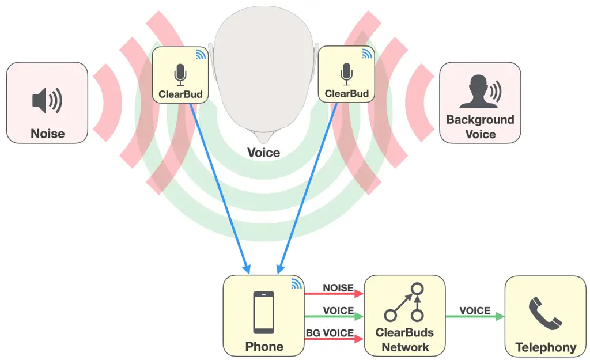

Figure 1. ClearBuds Application. Our goal is to isolate a user’s voice
from background noise (e.g., street sounds or other people talking) by
performing source separation using a pair of custom designed,
synchronized, wireless earbuds.

With the rapid proliferation of wireless earbuds (100 million AirPods
sold in 2020 (1)), more people than ever are taking calls on-the-go.
While these systems offer unprecedented convenience, their mobility
raises an important technical challenge: environmental noise (e.g.,
street sounds, people talking) can interfere and make it harder to
understand the speaker. We therefore seek to enhance the speaker’s voice
and suppress background sounds using speech captured across the two
earbuds.

Source separation of acoustic signals is a long-standing problem where
the conventional approach for decades has been to perform beamforming
using multiple microphones. Signal processing-based beamformers that are
computationally lightweight can encode the spatial information but do
not effectively capture acoustic cues (2, 3, 4). Recent work has shown
that deep neural networks can encode both spatial and acoustic
information and hence can achieve superior source separation with gains
of up to $`9`$ dB over signal processing baselines (5, 6). However,
these neural networks are computationally expensive. None of the
existing binaural (i.e., using two microphones) neural networks can meet
the end-to-end latency required for telephony applications or have been
evaluated with real earbud data. Commercial end-to-end systems, like
Krisp (7), use neural networks on a cloud server for single-channel
speech enhancement, with implications to cost and privacy.

We present the first mobile system that uses neural networks to achieve
real-time speech enhancement from binaural wireless earbuds. Our key
insight is to treat wireless earbuds as a binaural microphone array, and
exploit the specific geometry – two well-separated microphones behind a
proximal source – to devise a specialized neural network for high
quality speaker separation. In contrast to using multiple microphones on
the same earbud to perform beamforming, as is common in Apple AirPods
(8) and other hearing aids, we use microphones across the left and right
earbuds, increasing the distance between the two microphones and thus
the spatial resolution.

To realize this vision, we need to address three key technical
challenges to deliver a functioning, practical system:

1.  (1)
    Today’s wireless earbuds only support one channel of microphone
    up-link to the phone. AirPods and similar devices upload microphone
    output from only a single earbud at a time. To achieve binaural
    speaker separation, we need to design and build novel earbud
    hardware that can synchronously transmit audio data from both the
    earbuds, and maintain tight synchronization over long periods of
    time.
2.  (2)
    Binaural speech enhancement networks have high computational
    requirements, and have not been demonstrated on mobile devices with
    data from wireless earbuds. Reducing the network size naively often
    leads to unpleasant artifacts. Thus, we also need to optimize the
    neural networks to run in real-time on smart devices that have a
    limited computational capability compared to cloud GPUs. Further, we
    need to meet the end-to-end latency requirements for telephony
    applications and ensure that the resulting audio output has a high
    quality from a user experience perspective.
3.  (3)
    Prior binaural speech enhancement networks are trained and tested on
    synthetic data and have not been shown to generalize to real data.
    Building an end-to-end system however requires a network that
    generalizes to in-the-wild use.

To achieve this system, we make three technical contributions spanning
earable hardware and neural networks.

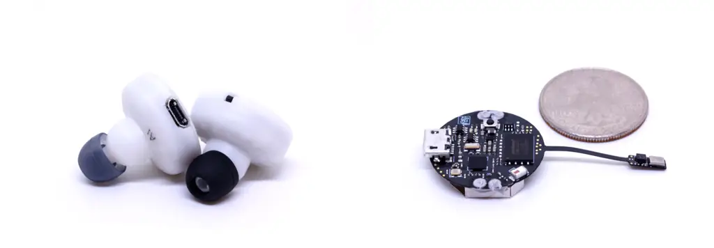

Figure 2. ClearBuds hardware inside 3D-printed enclosure and when placed
beside a quarter.

- •
  Synchronized binaural earables. We designed a binaural wireless earbud
  system (Fig. 2) capable of streaming two time-synchronized microphone
  audio streams to a mobile device. This is one of the first systems of
  its kind, and we expect our open-source earbud hardware and firmware
  to be of wider interest as a research and development platform.
  Existing earable platforms such as eSense (9) do not support
  time-synchronized audio transmission from two earbuds to a mobile
  device. We designed our DIY hardware using open source eCAD software,
  outsourced fabrication and assembly ($`\$2`$K for 50 units), and 3D
  printed the enclosures.

  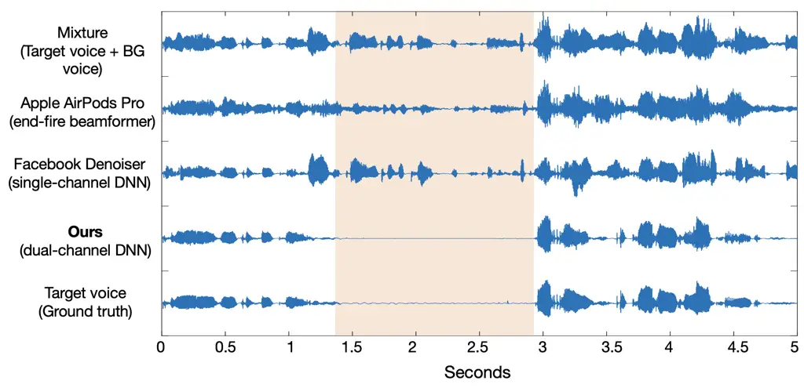
  Figure 3. Background voice performance. We use spatial cues to
  separate background voices from the target speaker, even when the
  background voice is louder than the target voice. This is evident when
  the target speaker is silent but background voice continues to talk
  (highlighted in orange). Apple AirPods Pro uses an endfire beamformer
  to partially suppress background voice. The mono-channel Facebook
  Denoiser (Demucs) is unable to suppress the background voice.
  Clearbud’s network removes the background voice, approaching ground
  truth.

- •
  Lightweight cascaded neural network. We introduce a lightweight neural
  network that utilizes binaural input from wearable earbuds to isolate
  the target speaker. To achieve real-time operation, we start with the
  Conv-TasNet source separation network (6) and redesign the network to
  achieve a 90% re-use of the computed network activations from the
  previous time step for each new audio segment (see §3.2). While these
  optimizations make this network real-time, they also introduce
  artifacts in the audio output (i.e., crackling, static).
  Interestingly, these artifacts have little effect on traditional
  metrics, like Signal-to-Distortion Ratio (SDR), but have a noticeable
  effect on subjective listening scores (see §5.2). These artifacts
  however are often visible in a frequency representation of the audio.
  To address this, we combine our mobile temporal model with a real-time
  spectrogram-based frequency masking neural network. We show that by
  combining the two networks and creating a lightweight cascaded
  network, we can reduce artifacts and improve the audio quality
  further.
- •
  Network training for in-the-wild generalization. Training the network
  in a supervised way requires clean ground truth speech samples as
  training targets. This is difficult to obtain in fully natural
  settings since the ground truth speech is corrupted with background
  noise and voices. Training a network that generalizes to in-the-wild
  scenarios also requires the training data to mimic the dynamics of
  real speech as closely as possible. This includes reverb, voice
  resonance, and microphone response. Synthetically rendered spatial
  data is the easiest type of data to obtain, but most different from
  real recordings, while real speakers wearing the headset in an
  anechoic chamber provide the best ground-truth training targets, but
  are the most costly to obtain. Synthetic data can simulate various
  reverb and multi-path that are not captured in an anechoic chamber.
  Our training methodology uses large amounts of synthetic data
  simulated in software, small amounts of hardware data with speakers
  embedded into a foam mannequin head and small amounts of data from
  human speakers wearing the earbuds in an anechoic chamber (see §4) to
  create a neural network that generalizes to users and multi-path
  environments not in the training data.

We combine our wireless earbuds and neural network to create ClearBuds,
an end-to-end system capable of (1) source separation for the intended
speaker in noisy environments, (2) attenuation and/or elimination of
both background noises and external human voices, and (3) real-time,
on-device processing on a commodity mobile phone paired to the two
earbuds. Our results show that:

- •
  Our binaural wireless earbuds can stream audio to a phone with a
  synchronization error less than 64$`\mu`$s and operate continuously on
  a coin cell battery for 40 hours.
- •
  Our system outperforms Apple AirPods Pro by 5.23, 8.61, and 6.94 dB
  for the tasks of separating the target voice from background noise,
  background voices, and a combination of background noise and voices
  respectively.
- •
  Our network has a runtime of 21.4ms on iPhone 12, and the entire
  ClearBuds system operates in real-time with an end-to-end latency of
  109ms. For telephony applications, an ear-to-mouth latency of less
  than 200ms is required for a good user experience (10).
- •
  In-the-wild evaluation with eight users in various indoor and outdoor
  scenarios shows that our system generalizes to previously unseen
  participants and multipath environments, that are not in the training
  data.
- •
  In a user study with 37 participants who spent over 15.4 hours and
  rated a total of 1041 in-the-wild audio samples, our cascaded network
  achieved a higher mean opinion score and noise suppression than both
  the input speech as well as a lightweight Conv-TasNet.

We believe that this paper bridges state-of-the-art deep learning for
blind audio source separation and in-ear mobile systems. The ability to
perform background noise suppression and speech separation could
positively impact millions of people who use earbuds to take calls
on-the-go. By open-sourcing the hardware and collected datasets, our
work may help kickstart future research among mobile system and machine
learning researchers to design algorithms around wireless earbud data.

## 2. Related Work

Endfire beamforming configurations remain popular on consumer mobile
phones and earbuds (11, 8, 12, 13). While recent advances in neural
networks have shown promising results, none of them are demonstrated
with wireless earbuds. By creating a wireless network between two
earbuds, we demonstrate that our real-time, two-channel neural network
can outperform current real-time speech enhancement approaches for
wireless earbuds.

Beamforming techniques. Since signal-processing based beamforming is
computationally lightweight, these techniques are deployed on commercial
devices such as smart speakers (14), mobile phones (11), and earbud
devices like Apple AirPods (8). However, the performance of beamforming
is limited by the geometry of the microphones and the distance between
them (2, 15). The form factor of devices like AirPods restricts both the
number of microphones on a single earbud and the available distance
between them, limiting the gain of the beamformer. While beamforming
across two earbuds could provide better performance in principle,
current wireless architectures are limited to streaming from a single
earbud at a time (16). Furthermore, adaptive beamformers such as MVDR
(17), while showing promise with relatively few interfering sources, are
sensitive to sensor placement tolerance and steering (18, 19). Finally,
beamforming leverages spatial or spectral cues only and does not use
acoustic cues (e.g., structure in human speech) and perceptual
differences to discriminate sources, information that machine learning
methods leverage successfully.

Single-channel deep speech enhancement. Many deep learning techniques
operate on spectrograms to separate the human voice from background
noise (20, 21, 22, 23, 24, 25, 26, 27). However, recent works instead
operate directly on the time domain signals (6, 28, 29, 30, 31),
yielding performance improvements over spectrogram approaches.
Commercial noise suppression software like Krisp (7) and Google Meet
(32) have successfully deployed single-channel models in real-time and
are available for use on mobile phones and desktop computers, but
processing is performed on the cloud. (33) achieves low-power speech
enhancement using long short-term memory (LSTM), but it is for a
single-channel network but not for multichannel source separation.
Further, single-channel models cannot effectively capture spatial
information and fail to isolate the intended speaker when there are
multiple speakers (see Fig. 3).

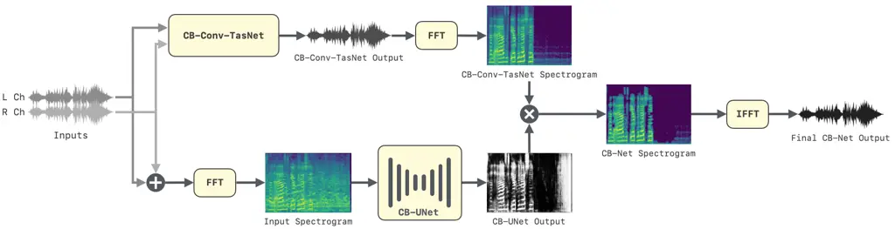

Figure 4. Network Diagram of CB-Net. Our network contains a time-domain
component, shown in the top as CB-Conv-TasNet, and a frequency domain
component, shown on the bottom by CB-UNet.

Multi-channel source separation and speech enhancement. Multi-channel
methods have been shown to perform better than their single-channel
source separation counterparts (34, 35, 18, 36, 37, 38). Binaural
methods have also been used for source separation (39, 40, 41, 42) and
localization (43, 44, 45); (40) reduces the look-ahead time in the
network to make it causal in behavior but has not been demonstrated to
run on a mobile device. Our method improves on existing binaural methods
by combining time-domain neural network with spectrogram-based frequency
masking networks as well as optimizing them to enable real-time
processing on a phone. Recent works such as  (46, 47, 48) use multiple
microphones on a smartphone for speech-enhancement. However, neither of
them demonstrates evaluation with real data, where artifacts because of
network optimizations can affect user performance. In contrast, we
demonstrate the first system that achieves real-time speech enhancement
using microphones on the two wireless earbuds. Further, as the distance
between the earbuds is larger than the distance between microphones on a
typical mobile phone, we can attain a better baseline than a mobile
phone implementation, while also retaining the ability to speak
hands-free. More recent works tackle the problem of real-time
directional hearing using eye trackers and wearable headsets. For
example, (49) uses a hybrid network that combines signal processing with
neural networks, but shows that their technique performs poorly in
binaural scenarios (i.e., two microphones) and requires four or more
microphones. In contrast, we focus on the problem of speech enhancement
and create the first real-time end-to-end hardware-software
neural-network based system using wireless synchronized earbuds.

Earbud computing and platforms. There has been recent interest in earbud
computing (50, 9, 51, 52, 53) to address applications in health
monitoring (54, 55, 56), activity tracking (57) and sensor fusion with
EEG signals (58). The eSense platform (9, 51) has enabled research in
sensing applications with earables. OpenMHA (59, 60) is an open signal
processing software platform for hearing aid research. Neither of these
platforms support time-synchronized audio transmission from two earbuds,
which is a critical requirement for achieving speech enhancement in
binaural settings. In contrast, we created open-source wireless earbud
hardware that can support synchronize wireless transmission from the two
earbuds.

## 3. ClearBuds Design

We first introduce our lightweight neural network architecture. We then
describe system design of our hardware platform and our synchronization
algorithm. We open-source our mechanical, firmware, application, and
network designs at our project website:
[https://clearbuds.cs.washington.edu](https://clearbuds.cs.washington.edu).

### 3.1. Problem Formulation

Suppose we have a 2 channel microphone array with one microphone on each
ear of the wearer. The target voice is speaking with a signal
$`s_{0}\in\mathbb{R}^{2\times T}`$ in the presence of some background
noise bg or other non-target speakers $`s_{1..N}`$. There may also be
multi-path reflections and reverberations r which we would also like to
reduce, i.e.,
$`\mathbf{x}=\sum_{i=0}^{N}\mathbf{s}_{i}+\mathbf{bg}+\mathbf{r}`$. Our
goal is then to recover the target speaker’s signal, $`s_{0}`$, while
ignoring the background, reverbations, or other speakers. We also must
do so in a real-time way, meaning that the a mixture sample
$`\textbf{x}_{t}`$ received at time $`t`$ must be processed and
outputted by the network before $`t+\textbf{L}`$ for some defined
latency L. We refer to the non-target speakers as "background voices".
These background voices may be at any location in the scene, including
very close to the target speaker and their angle can change with time
and motion.

### 3.2. Neural Network Architecture Motivation

Our network needs to perform in real-time on a mobile device with
minimal latency. This is challenging for several reasons. First, the
processing device has a much lower compute capacity, especially compared
to cloud GPUs. Additionally, the network should separate non-speech
noises as well as unwanted speech. To do this, it must learn spatial
cues and human voice characteristics. Finally, the resulting output
should maximize the quality from a human experience perspective while
minimizing any artifacts the network might introduce.

Our network, which we call ClearBuds-Net or CB-Net, is a cascaded model
that operates in both time and frequency domains. The full network
architecture is illustrated in Fig. 4 and contains two main
sub-components: A dual-channel time domain network called
CB-Conv-TasNet, and a frequency based network called CB-UNet.

#### 3.2.1. CB-Conv-TasNet

The first component of separation method is a time domain network that
is based on a multi-channel extension of Conv-TasNet (6). This is a
network in the waveform domain that has a Temporal Convolution Network
(TCN) structure, lending itself to a causal implementation with
intermediate layer caching (61). We use depthwise separable
convolutions (62) to further reduce the number of parameters and make
the design real-time. We call this network CB-Conv-TasNet since it is an
optimized version of the original Conv-TasNet.

A key feature of the time domain approach is that it can easily capture
spatial cues in the network. In our application, the desired source is
always physically between two microphones, thus the voice signal will
reach the microphones roughly at the same time. In contrast, background
or other speakers are typically not temporally aligned and will reach
one microphone earlier or later. By feeding two time synchronized
channels into the neural network, this spatial alignment of the sources
can be learned from time differences in the signal. This is similar to a
delay-and-sum beamforming effect, except the sum is replaced with a deep
network.

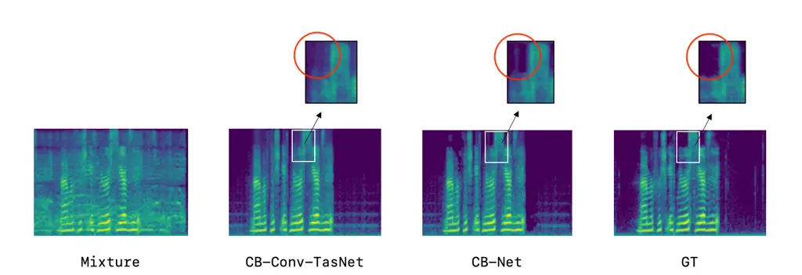

Figure 5. The spectrograms above show the motivation behind a combined
time and frequency domain method. The output of the time-domain
component, CB-Conv-TasNet, contains artifacts, particularly at high
frequencies. Although subtle, these artifacts are perceptible by human
listeners. CB-Net is able to reduce these artifacts by using a
frequency-domain network (CB-UNet) that masks unwanted frequencies.

#### 3.2.2. CB-UNet

The output of our lightweight CB-Conv-TasNet often contains audible
artifacts (i.e., crackling, static) that reduce the listening
experience. Interestingly, these artifacts have little effect on
traditional metrics, like Signal-to-Distortion Ratio (SDR), but have a
noticeable effect on subjective listening scores (see §5.2). These
artifacts are often visible in a frequency representation of the audio.
Fig. 5 shows how CB-Conv-TasNet alone contains noticeable artifacts when
compared to the ground truth. To address this, we cascade a lightweight
causal UNet (63) which operates on the mel-scale spectrogram of the
input audio. This network, which we call CB-UNet, produces a binary mask
which is applied to the output of CB-Conv-TasNet. The combined output,
shown in Fig. 5 as CB-Net, reduces these artifacts. The mean opinion
scores in our evaluation shows the strength of the cascaded CB-Net when
compared to the time-domain component only.

### 3.3. Neural Network Detailed Description

#### 3.3.1. CB-Conv-TasNet

The input to the network is a binaural mixture given by
$`\textbf{x}\in\mathbb{R}^{2\times T}`$. The first step is an encoder
that transforms the mixture x into $`\mathbb{R}^{N\times T/L}`$ with a
1D convolution of size $`L`$ and stride $`L`$. This is followed by a
ReLU layer. The encoder’s outputs are next fed into a temporal
convolution network that consists of stacks of 1-D convolutions with
increasing dilation factors. We use 14 convolution layers with dilation
factors of 1,2,4,..,64 repeated twice, with a ReLU nonlinearity and skip
connection after each convolution. The encoder output is multiplied with
the output of the temporal conv-net, before being fed through a fully
connected Decoder layer which transforms the output back into
$`\mathbb{R}^{2\times W}`$.

In a real-world implementation, we do not have access to the full
waveform, but only packets of data at a time. Furthermore, we must
process these packets with limited access to future input samples. Given
15.625 kHz sampling rate, we choose to process packets of 350 samples at
a time (22.4ms), which is our window size $`W`$. We also use $`2W`$, or
700 samples of lookahead time (44.8ms) and 1.5s of past samples. Since
we have no padding in the temporal convolution net, the network starts
with this large temporal context and outputs exactly
$`\mathbb{R}^{1\times W}`$ samples, corresponding to the desired output
for our input packet of $`W`$ samples. When we receive the next packet
of size $`W`$, all intermediate activation from the encoder and temporal
conv-net can be shifted over by $`W/L`$ samples and re-used. We chose
$`L=50`$, but any divisor of $`W`$ would work. Re-using intermediate
outputs from previous packets saves over $`90\%`$ of the compute time
for a new packet in our network.

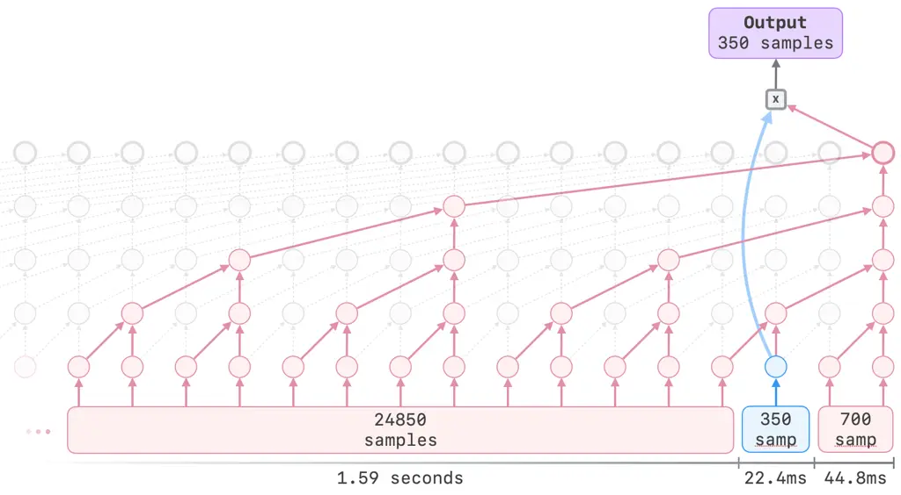

Figure 6. CB-Conv-TasNet, the time-domain component of CB-Net. Given a
packet of 350 samples (22.4ms) highlighted in blue, we use 1.5s of past
input and 44.8ms of future input to output the separation results. Our
caching scheme works as follows: When we receive a new 350ms samples,
all intermediate activations (circles in the diagram) slide to the left,
and we compute only the rightmost column of outputs.

#### 3.3.2. CB-UNet

The frequency domain network is a mono-channel network that outputs a
binary mask for each time-frequency bin. The input
$`\textbf{x}\in\mathbb{R}^{1\times T}`$ is a summation of the binaural
left and right channel, which is the equivalent of a broadside
beamformer. We first run a STFT, which is a mel-scale fourier transform
with hop size of $`350`$, a window size of $`1024`$ including zero
padding on the edges, and a $`128`$ bin mel-scale output. The network
input is a spectrogram of $`64`$ time bins and $`128`$ frequency bins,
corresponding to a receptive field of $`22400`$ samples, or $`1.43s`$.
In order to maintain the causality requirement, we use the same
lookahead strategy as the time-domain network where we allow $`700`$
samples of lookahead for a target packet of $`350`$ samples. The UNet
architecture contains 4 downsampling and upsampling layers, starting
with 64 channels and doubling the number of channels at each subsequent
layer. The downsampling layers contain a depthwise separable convolution
followed by a $`2\times 2`$ max pooling, and the upsampling layers
contain a depthwise separable convolution followed by a transposed
convolution for upsampling. The output is a sigmoid function, which is
then thresholded to return a binary mask in $`[0,1]^{128\times 64}`$.
When outputting a spectrogram mask on an $`\mathbb{R}^{128\times 64}`$
input, we predict a mask over the entire input even though we only need
the output for a specific slice of $`350`$ samples, or a
$`\mathbb{R}^{128\times 1}`$ mask. Further optimizations could be made
by caching intermediate outputs or only computing the mask for the
target samples. However CB-UNet’s run-time was so small compared to the
rest of the network that these optimizations were not necessary.

#### 3.3.3. Combining the Outputs

At each time step, the output of CB-Conv-Tasnet is an audio waveform in
$`x\in\mathbb{R}^{1\times 350}`$, and the output of CB-UNet is a
spectrogram mask in $`\textbf{M}\in\mathbb{R}^{128\times 64}`$. We run
the same fourier transform on the buffered conv-tasnet outputs to
produce a spectrogram $`\textbf{X}\in\mathbb{R}^{128\times 64}`$. Our
output can then be computed by $`iSTFT(\textbf{M}\otimes\textbf{X})`$.
Our empirical results show that this gives the best results compared to
other methods such as ratio masking.

#### 3.3.4. Training

CB-Conv-TasNet is trained with an $`L1`$-based loss over the waveform
along with the multi-resolution spectrogram loss. Formally, provided
$`s_{0}`$ is our target speaker and $`x^{\prime}`$ is the output from
the network, our loss is:

```math
L(s_{0},x^{\prime})=\left\|s_{0}-x^{\prime}\right\|_{1}\\
+L_{sc}(s_{0},x^{\prime})+L_{mag}(s_{0},x^{\prime})
```

```math
L_{sc}(s_{0},x^{\prime})=\frac{\left\|STFT(s_{0})-STFT(x^{\prime})\right\|_{F}}{\left\|STFT(s_{0})\right\|_{F}}
```

```math
L_{mag}(s_{0},x^{\prime})=\left\|\log(STFT(s_{0})-\log(STFT(x^{\prime}))\right\|_{1}
```

STFT denotes the magnitude of the short time Fourier transform, and
$`F`$ denotes the Frobenius norm. $`L_{sc}`$ and $`L_{mag}`$ represent
spectral convergence and magnitude losses, which gave better results
than L1 loss alone.

For training CB-UNet, for each time frequency bin, the training target M
is 1 if the target voice is the dominant component, and 0 otherwise.
Formally,
$`\textbf{M}(f,t)=[\textbf{S}_{0}(f,t)\geq\textbf{S}_{i}(f,t)],\;\;\forall i=(1..n)`$.
The network is then trained with the binary cross entropy of the output
compared to the target mask.

#### 3.3.5. Hyperparameters and Training Details

We use a learning rate of $`3\text{\times}{10}^{-4}\text{\,}`$ along
with the ADAM optimizer (64) for training the network. The network was
trained on a single Nvidia TITAN Xp GPU. Because of the small size of
the network, training could be completed within a single day and
generally required $`\approx`$50 epochs to reach convergence.As an
additional data augmentation step we make the following perturbations to
the data: High-shelf and low-shelf gain of up to $`$2\text{\,}~${dB}`$
are randomly added using the sox library.

### 3.4. Synchronized wireless earbuds

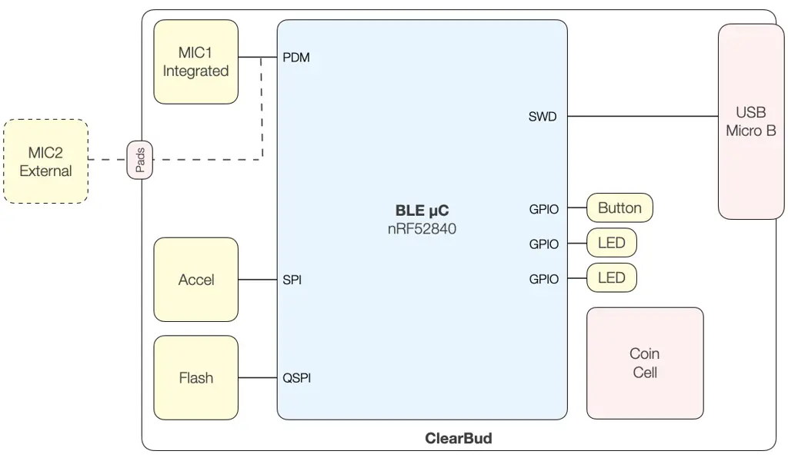

Figure 7. Hardware Block Diagram. Each ClearBud integrates a PDM
microphone, accelerometer, flash, and coin cell battery. Buttons and
LEDs are used for interfacing with the device, and a USB port is used
for programming and debug.

We seek to capture speech from the target speaker’s mouth which sits on
the sagittal plane roughly equidistant to the ears. Given an ear-to-ear
spacing of 17.5cm, to effectively isolate this central plane we require
a distance precision on the order of a few centimeters. An interaural
time difference of 100$`\mu`$s would correspond to source maximally 3.43
cm off this central plane, therefore we target a synchronization
accuracy under 100$`\mu`$s.

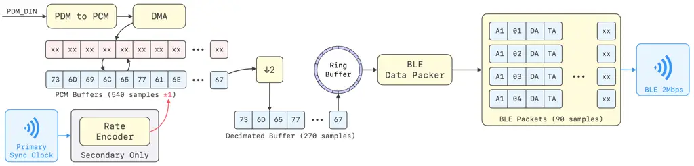

Figure 8. Time Sync Design. The primary ClearBud broadcasts a sync clock
over the air. The secondary ClearBud then uses the sync clock to rate
encode, by increasing or decreasing the size of its local PCM buffer.

#### 3.4.1. Hardware

Our custom hardware design contains a pulse-density modulated (PDM)
microphone (Invensense ICS-41350) and a Bluetooth Low Energy (BLE)
microcontroller (Nordic nRF52840).¹¹ 1 For future research applications,
an ultra low-power accelerometer (Bosch BMA400), a 1Gbit NAND flash for
local data collection (Winbond W25N01GVZEIG), and support for speaker
and an additional microphone are included. The system is powered off of
a CR2032 coin cell battery and programmed via SWD over a Micro-USB
connector. Each ClearBud has an integrated PDM microphone set to a clock
frequency of 2MHz. With an internal PDM decimation ratio of 64, this
provides us a sampling frequency of 31.25kHz. As most HD voice
applications and wideband codecs are limited to 16kHz (65), we decimate
further in firmware by a factor of 2, giving us a final sampling
frequency of 15.625kHz.

Two 16-bit 180 sample size Pulse-Code Modulation (PCM) buffers are
round-robined: one is filled with incoming PCM data while the other is
processed. The DMA is responsible for both clocking in the PDM data and
converting it into PCM. One buffer is always connected to the DMA, while
the other is freed for processing for the rest of the data pipeline.
When the buffer connected to the DMA fills, the buffers switch roles and
we begin processing data on the newly freed buffer, and connect the
other buffer back to the DMA. With this design we always have a
continuous PCM stream to operate on. Both ClearBuds transmit the PCM
microphone data to a mobile phone for input into our neural network. To
maximize throughput, we use the highest Bluetooth rate and packet sizes
supported by iOS, which is 2Mbps and 182 bytes, respectively. We design
a lightweight wireless protocol where the first 2 bytes represent a
monotonically-increasing sequence number, while the other 180 bytes are
reserved for the 16-bit PCM audio samples. The sequence number is used
on the phone so that we can zero-pad PCM data in the occasional event
that a packet is dropped either over-the-air or by the radio hardware.
This zero-padding keeps the left and right microphone data aligned on
the host side in areas of poor radio performance or interference in the
environment.

The hardware schematic and layout for ClearBuds was designed using the
open source eCAD tool KiCad. A 2-layer flexible printed circuit was
fabricated and assembled by PCBWay. The 3D printed enclosures were
designed using AutoDesk Fusion 360 and printed with a Phrozen Sonic Mini
using a liquid resin fabrication process. The MEMS microphone sits
behind the lid on the earbud’s outer surface. A single button on the
enclosure provides access to turn on and off the earbuds.

#### 3.4.2. Microphone synchronization

Three components are necessary for maintaining microphone
synchronization: (1) As each of our earbuds has its own local clock
source, we need to establish a common clock between them so that they
have the same reference of time, (2) a synchronized startup so each
earbud starts recording from their respective microphone at the exact
same time, and (3) a rate encoding scheme to control the earbud’s
sampling rate to match each other.

In our system, each earbud has its own respective 32MHz clock source
with a total +/- 20ppm frequency tolerance budget. So, in the worst case
scenario, the earbuds will have 2.4 milliseconds of drift each minute.
We use the Nordic’s TimeSlot API (66), which grants us access to the
underlying radio hardware in between Bluetooth transmissions. This
provides us a transport to transmit and receive accurate time sync
beacons (67). Each ClearBud keeps a free-running 16MHz hardware timer
with a max value of 800,000, overflowing and wrapping around at a rate
of about 20 Hz. One ClearBud is assigned as the timing master while the
other ClearBud will synchronize its free-running timer to the master’s.
The primary ClearBud (timing master) transmits time sync packets at a
rate of 200 Hz. These packets contain the value of the free-running
timer at the time of the radio packet transmission. When the secondary
ClearBud receives this packet, it can then add or subtract an offset to
its own free-running timer for a common clock.

Once each ClearBud is connected to the mobile phone, the phone sends a
`START` command to both ClearBuds over BLE. Each ClearBud contains
firmware which arms a programmable peripheral interconnect (PPI) to
launch the PDM bus once the 16MHz free-running timer wraps around at
800,000. By using this method, we bypass the CPU and trigger a
synchronized startup entirely at the hardware layer. One caveat is that
the mobile phone could write to one ClearBud right before its clock
wraps around at 800,000, and the other ClearBud right after it wraps
around at 800,000. With a clock that wraps around at 20Hz, this would
trigger a mismatched startup and cause an alignment error of 50ms. To
correct for this, each ClearBud reports its common clock timer value to
the phone once it has received the `START` command. The phone can then
remove the first 781 audio samples (781 samples / 15.625kHz = 50ms) if
one ClearBud started streaming 50ms before the other.

The final component to keeping the audio streams aligned is to create a
rate encoding scheme between the ClearBuds. With the time sync beacons
from the primary ClearBud, the other ClearBud now has both its local
clock and the common clock (primary ClearBud’s local clock). With these
two clocks, the secondary ClearBud can identify how much faster or
slower its PDM clock is running in relation to the primary ClearBud. We
note that with a 2MHz PDM clock and a PDM decimation ratio of 64, each
audio sample occupies 32 us. The non-primary ClearBud can then add or
remove a sample to its PDM buffer every time the difference between the
clocks exceeds a multiple of 32 us. By doing this, the secondary
ClearBud ensures that its PDM buffer starts filling up at the exact same
time as the primary ClearBud’s PDM buffer, with a tolerance of 32 us.

## 4. Training methodology

Training the network in a supervised way requires clean ground truth
speech samples as training targets. This is difficult to obtain in fully
natural settings since the ground truth speech is corrupted with
background noise and voices. Training a network that generalizes to
in-the-wild scenarios also requires the training data to mimic the
dynamics of real speech as closely as possible. This includes reverb,
voice resonance, and microphone response. Synthetically rendered spatial
data is the easiest type of data to obtain, but most different from real
recordings, while real speakers wearing the headset in an anechoic
chamber provide the best ground-truth training targets, but are the most
costly to obtain. Synthetic data can simulate various reverb and
multipath that are not captured in an anechoic chamber. We adopt a
hybrid training methodology where we first train on a large amount of
synthetic data and fine-tune on real data recorded with our hardware.
Our training method is based on the commonly used mix-and-separate
framework (68), where clean speech and noise samples are recorded
separately and combined randomly to form noisy mixtures. Our results
show that our network trained this way generalizes to naturally recorded
noisy data in real-world environments.

Synthetic data. This type of data is the easiest to obtain, since a wide
variety of voice types and physical setups can be generated instantly.
Many machine learning baselines, e.g., (69, 38, 37), only train and
evaluate on synthetic data generated in this manner. To generate the
synthetic dataset, we create multi-speaker recordings in simulated
environments with reverb and background noises. All voices come from the
VCTK dataset (70) (110 unique speakers with over 44 hours), and
background sounds come from the WHAM! dataset (71), with 58 hours of
recordings from a variety of noise environments such as a restaurant,
crowd, and music.

To synthesize a single example, we create a 3 second mixture as follows:
two virtual microphones are placed 17.5 cm apart, which is the average
distance between human ears (72). The target speaker’s voice is placed
at the center between the two virtual microphones, and a second voice is
placed randomly between $`1`$ and $`5`$ meters away and at a random
angle. A randomly chosen background noise is also placed in the scene.
We then simulate room impulse responses (RIRs) for a randomly sized room
using the image source method implemented in the pyroomacoustics library
(73, 74). The room is rectangular with sides randomly chosen between 5
and 20 meters, and the RT60 values are randomly chosen between 0 and 1
second. All signals are convolved with the RIR and rendered to the two
channel microphone array. The volumes of the background are randomly
chosen so that the input signal-to-distortion ratio is roughly between
-5 and 5 dB. For training, we use 10,000 mixtures generated in this
manner.

Hardware data. While a large amount of synthetic data can be easily
rendered to train the network, it does not contain characteristics such
as the microphone response of physical hardware and imperfections in the
time-of-arrival. To address this, we also train on a set of recorded
voice samples from our earbuds. We set up a foam mannequin head with an
artificial mouth speaker (Sony SBS-XB12) that plays VCTK samples as the
spoken ground truth. For background voice recordings, the speaker is
placed in varying locations within a one meter radius of the foam head.
Physically recorded background noise is provided by binaural version of
the WHAM! dataset (71), which was recorded in real environments using a
binaural mannequin like ours. We record 2 hours each of clean speech,
and background voices. 2000 random mixtures are then created for
training.

Human data. The spoken hardware data above still does not contain
natural voice resonance since it is played out of an electronic speaker.
Furthermore, the background sounds recorded by a mannequin wearing
earbuds still misses some of the physical filtering of the human body.
To better capture desired output of real scenarios, we collect a
ground-truth speech dataset in an anechoic chamber with human speakers
(5 male, 4 female) and a noise dataset in real environments with human
listeners. For the voice data, each human speaker wore our ClearBuds
prototypes, and uttered 15 minutes of text from Project Gutenberg in the
anechoic chamber. The purpose of this anechoic data is to provide clean
training targets for the network, modelling the resonance of human
speakers wearing our hardware. For the real world noise dataset,
individuals wore ClearBuds and recorded various noisy scenarios such as
washing dishes, loud indoor/outdoor restaurants, and busy traffic
intersections. 2000 random mixtures of clean voice and recorded noise
were generated for this dataset.

Our network is jointly trained using all these datasets. Note that
testing and evaluation is done outside the anechoic chamber.

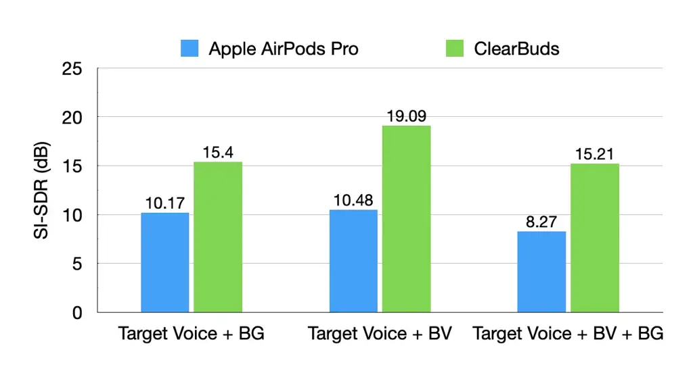

Figure 9. Comparison with AirPods Pro. Reporting the output SI-SDR
(note: not SI-SDR increase). ClearBuds exceeds in three conditions:
target voice plus background noise (BG), target voice plus background
voice (BV), target voice plus background voice and noise.

## 5. Experiments and Results

We first compare our end-to-end system performance against a commercial
wireless earbud system. We then present in-the-wild evaluation of our
system. Next, we compare numerical results against various speech
enhancement baselines. Finally, we present system-level evaluations. Our
work is approved by the IRB.

### 5.1. Comparison with Beamforming Earbuds

We evaluate our end-to-end system against the Apple AirPods Pro headset
connected to a iPhone 12 Pro in a repeatable physical set up. In our
evaluation, as is typical, there is no overlap between training and test
datasets.


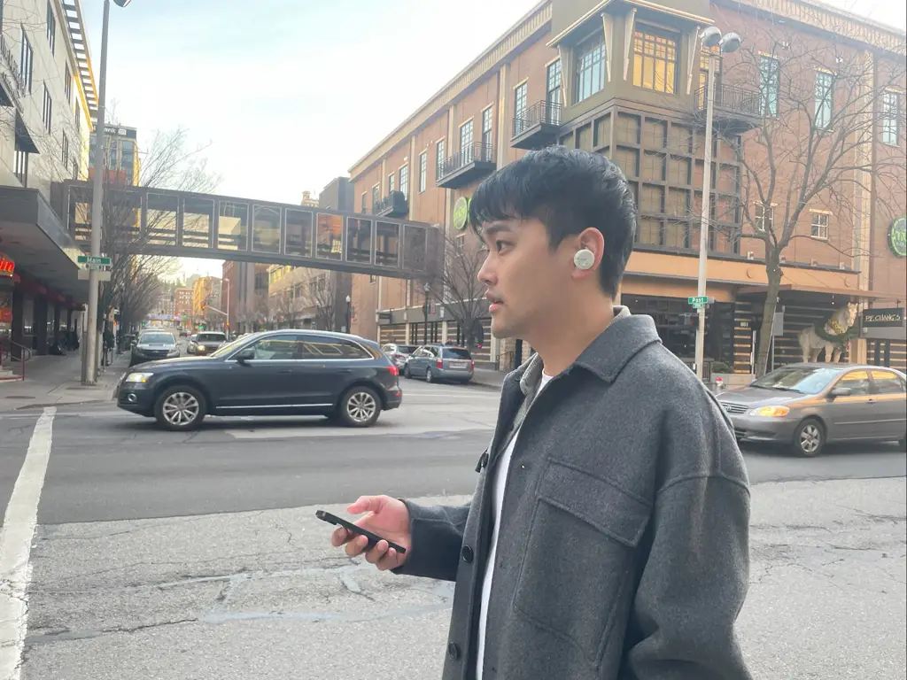

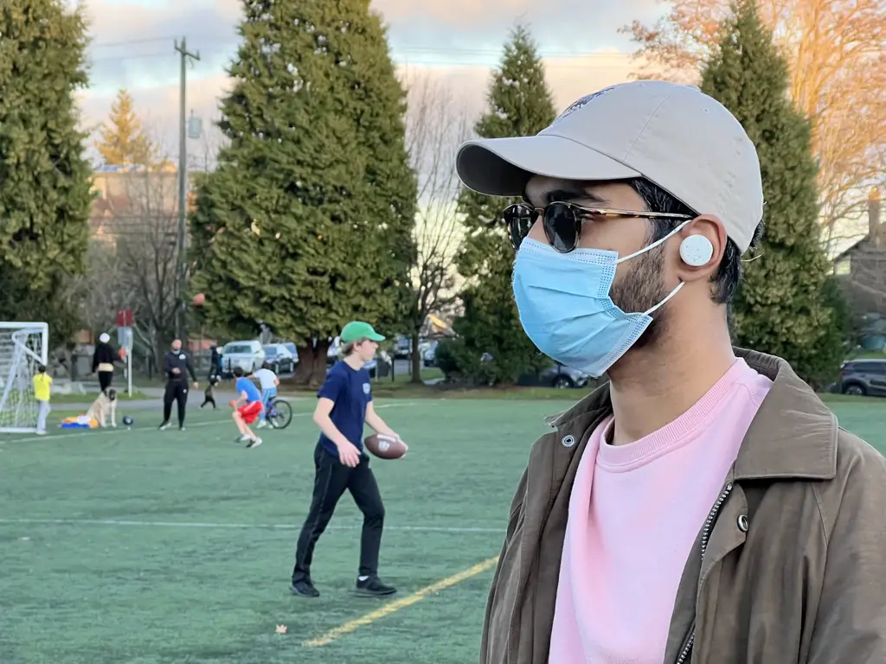

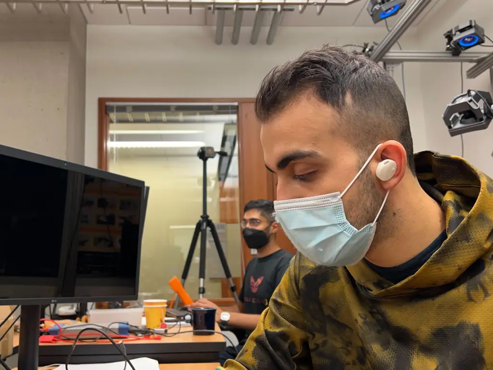

Figure 10. In-the-wild experiments in various scenarios (crowded cafe,
busy intersection, outdoor plaza, classroom) were conducted across 8
users and indoor and oudoor environments, all unseen in our training
dataset.

Procedure. We use the popular metric scale-invariant
signal-to-distortion ratio (SI-SDR) (75). While SI-SDR provides a
repeatable metric used in the acoustic community, it requires a clean,
sample-aligned ground truth (target voice) as the basis for evaluation.
Therefore, we create a repeatable soundscape for our test setup where a
sample-aligned ground truth can be obtained. A foam mannequin head with
a speaker (Sony SBS-XB12) inserted into its artificial mouth uttered one
hundred VCTK samples with identities and samples unseen in the training
set. The mannequin wore ClearBuds and AirPods Pro in subsequent
experiments, and the outputs of the two systems could be directly
compared. Ambient environmental sound (from WHAM! dataset) was played
via four monitors (PreSonus Eris E3.5) positioned to fill 3 meter by 4
meter room, and background voice (also VCTK) was played from a monitor
positioned 0.4 meters from head on the right. All speakers were driven
through a common USB interface (PreSonus 1810c) ensuring the same
time-alignment and loudness between the two test conditions. Since Apple
AirPods Pro beamforming cannot be toggled on and off, we cannot
calculate an SI-SDR increase (SI-SDRi), and therefore report output
SI-SDR. To establish the ground truth voice against which to calculate
SI-SDR, we record clean target voice through each headset. Ambient noise
SNR ranged between 0dB and 16dB with respect to target voice.
Qualitatively, this sounded like a second person speaking loudly in a
noisy bar or cafe. Finally, background voice SNR ranged between 6dB and
12dB, qualitatively sounding like a person speaking from a meter or two
away.

Results. We report output SI-SDR from the two systems in Fig. 9. To
calculate output SI-SDR, we align individual one second chunks and take
the logarithmic mean across 250 chunks. We find that ClearBuds achieves
higher output SI-SDR across all test conditions when compared to the
beamforming utilized by the Apple AirPods Pro. For a qualitative
comparison of AirPods Pro versus ClearBuds performance with human
speakers, see video:
[https://clearbuds.cs.washington.edu/videos/airpods_comparison.mp4](https://clearbuds.cs.washington.edu/videos/airpods_comparison.mp4).

### 5.2. In-the-Wild Evaluation

We perform in-the-wild evaluation in indoor and outdoor scenarios as
well as users not in the training data. The procedure and results are
described in the following sections.

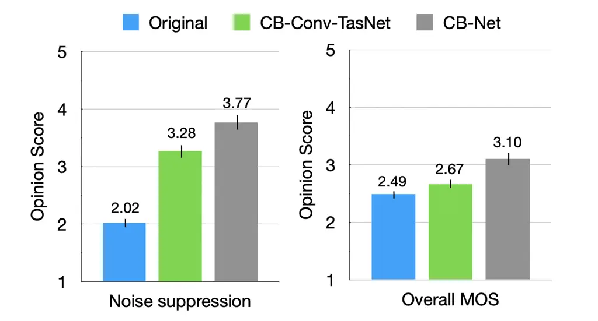

Figure 11. In-the-wild study results. Noise suppression indicates
perceived quality of background noise reduction (higher is less
intrusive). Overall MOS indicates overall perceived quality. Error bars
are 95% CI.

In-the-wild experiments. Eight individuals (four male, four female, mean
age 25) with a variety of accents wore a pair of ClearBuds and read
excerpts from Project Gutenberg (76) while in four noisy environments: a
coffee shop, a noisy intersection, an outdoor plaza, and a classroom
(see Fig. 10). The environments featured ringing phones, cross-talk from
other people, ambient music, a crying baby, opening/closing doors,
driving vehicles, and street noise, amongst other common sounds. These
experiments were uncontrolled in that the background voices and noise
were naturally occurring sounds that are typical to these real-world
scenarios and were mobile.

Evaluation procedure. In-the-wild evaluation precludes access to clean,
sample-aligned truth to compute SI-SDR. Instead, the common (and
expensive) procedure is to perform a user study and compute the mean
opinion score. Since this is a time-consuming process, prior works on
binaural networks, e.g., (69, 46, 38), avoid in-the-wild evaluation.
Since our goal is to design and evaluate an in-ear system in real
scenarios, we recruit thirty-seven participants (11 female, 26 male,
mean age 29) for a user study. Each participant listened to between 6
and 11 in-the-wild audio samples (avg. 9.38 samples, each between 10–60
seconds). Each speech sample was processed and presented three ways: (1)
the original input, (2) CB-Conv-TasNet, and (3) CB-Net, yielding a total
of 37$`\times`$9.38$`\times`$3 $`=`$ 1,041 rating samples.

Participants were encouraged to use audio equipment they would typically
use for a call. Fourteen used earbuds, thirteen used computer speakers,
seven used headphones, and three used phone speakers. The study took
about 25 minutes per participant. As is typical with noise suppression
systems, participants were asked to give ratings in two categories: the
intrusiveness of the noise and overall quality (mean opinion score -
MOS):

1.  (1)
    Noise suppression: How INTRUSIVE/NOTICEABLE were the BACKGROUND
    sounds? 1 - Very intrusive, 2 - Somewhat intrusive, 3 - Noticeable,
    but not intrusive, 4 - Slightly noticeable, 5 - Not noticeable
2.  (2)
    Overall MOS: If this were a phone call with another person, How was
    your OVERALL experience? 1 - Bad, 2 - Poor, 3 - Fair, 4 - Good, 5 -
    Excellent

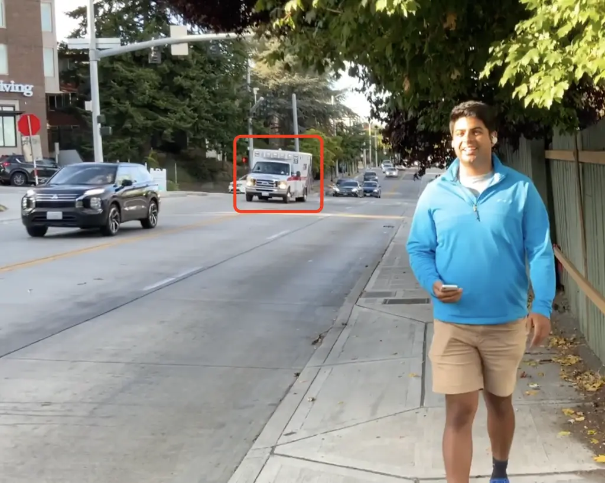


Figure 12. Mobility of speaker and noise sources in-the-wild. Red box
highlights a moving truck on the road while ClearBuds user is walking.
Video:
[https://youtu.be/HYu0ybjcQPA?t=127](https://youtu.be/HYu0ybjcQPA?t=127)

Results. Fig. 11 shows the noise intrusiveness and MOS values for the
original microphone, CB-Conv-TasNet, and CB-Net. As expected, applying
CB-Conv-TasNet to the original audio helped suppress noise dramatically,
increasing opinion score from 2.02 (slight better than 2 - Somewhat
intrusive) to 3.28 (between 3 - Noticeable, but not intrusive and 4 -
Slightly noticeable) (p\<0.01). The light-touch, spectrogram-masking
clean up method featured in CB-Net increased noise suppression opinion
score significantly (p\<0.001) to 3.77, indicating the method did indeed
further suppress perceptually annoying noise artifacts. Importantly,
this step also increased overall MOS. While users only slightly
preferred (p\<0.05) CB-Conv-TasNet (2.67) to the original input (2.49)
due to artifacts introduced, they more significantly (p\<0.001)
preferred our CB-Net (3.10), an increase of 0.61 opinion score points
from the input. For context, in the flagship ICASSP 2021 Deep
Suppression Noise Challenge (77), with state-of-the-art, real-time
algorithms run on a quad-core desktop CPU, the winning submission
increased MOS by 0.57 (78) from input.

|                                 | SI-SDR increase (SI-SDRi) |                |                     | Output PESQ    |                |                     |
| ------------------------------- | ------------------------- | -------------- | ------------------- | -------------- | -------------- | ------------------- |
| Method                          | Target with BG            | Target with BV | Target with BV + BG | Target with BG | Target with BV | Target with BV + BG |
| CB-Net                          | 10.41                     | 10.56          | 9.35                | 2.08           | 2.68           | 1.81                |
| CB-Conv-TasNet                  | 11.19                     | 11.01          | 9.68                | 2.24           | 2.58           | 1.91                |
| CB-Conv-TasNet Single Mic       | 6.15                      | 0.13           | 2.34                | 1.82           | 1.84           | 1.53                |
| CB-UNet                         | 3.21                      | 0.78           | 1.82                | 1.60           | 2.10           | 1.50                |
| DTLN  (79)                      | 7.02                      | 0.06           | 2.13                | 2.08           | 1.95           | 1.67                |
| Causal Demucs  (30)             | 6.62                      | -0.03          | 2.11                | 1.80           | 1.88           | 1.43                |
| Ideal Ratio Mask (IRM, oracle)  | 11.41                     | 11.53          | 12.04               | 2.53           | 3.00           | 2.44                |
| Ideal Binary Mask (IBM, oracle) | 9.97                      | 11.05          | 10.85               | 2.30           | 2.90           | 2.21                |

Table 1. Benchmarking our neural network. We show results for a target
voice speaking in three noise scenarios: (1) Background noise (BG), (2)
Background voice (BV), and (3) Background noise and background voice (BG
and BV). CB-Conv-TasNet performs slightly better on synthetic data, but
as shown in Fig. 11, does not generalize as well to in-the-wild
scenarios. This demonstrates the importance of evaluating networks on
real in-the-wild hardware data.

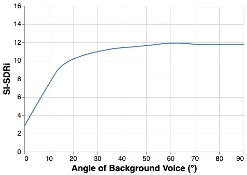

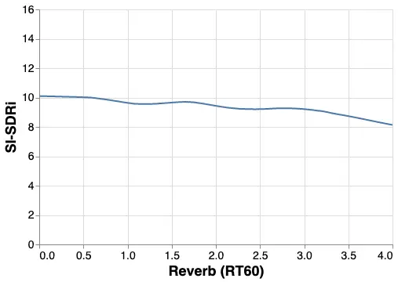

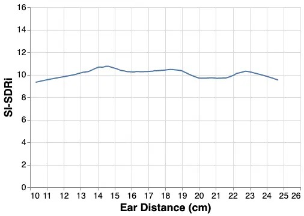

Figure 13. (a) Performance against angle of background voice in presence
of significant multipath. (b) Performance against amount of
reverberation in an indoor room. RT60 (in seconds) measures how long
sound takes to decay by 60 dB in a space with a diffuse soundfield. (c)
Performance as distance between ears increases.

Note that in our in-the-wild experiments, the background noise and
voices were not static. The speakers themselves can also be mobile (see
Fig. 12). Our network was able to adaptively remove the background noise
and achieve speech enhancement with mobility.

### 5.3. Benchmarking our Neural Network

The conventional evaluation in the machine learning and acoustic
community is to evaluate models and techniques on synthetic data against
baselines. For completeness, we compare our method against a variety of
speech enhancement baselines using the synthetic dataset. For
evaluation, an additional 1000 mixtures of 3 seconds each were generated
such that there was no overlapping identities or samples between the
train and test splits.

Evaluation Procedure. For comparisons to other baseline methods, we use
the popular SI-SDR and PESQ metrics. Unlike the AirPods experiment,
where the original noisy mixture could not be recorded since AirPods
beamforming cannot be toggled off, here we compute SI-SDR of the ground
truth relative to both the input noisy mixture and then to the network
output. When reporting the increase from the input SI-SDR to output
SI-SDR, we use the SI-SDR improvement (SI-SDRi).

For a deep learning baseline in the waveform domain, we choose the
causal Demucs model (30). This is a single channel method which was
recently shown to outperform many other deep learning baselines and runs
real-time on a laptop CPU. We also compare with Dual-signal
Transformation LSTM Network (DTLN)  (79). This method also runs on a
laptop or mobile phone in real-time. To compare with spectrogram based
methods, we use the oracle baselines, ideal ratio mask (IRM) and ideal
binary mask (IBM) (80, 81), that use the ground truth voice to calculate
the best possible result that can be obtained by masking a noisy
spectrogram.

As an ablation study, we report results with each individual component
of the network, CB-Conv-TasNet and CB-UNet. We also show results when
the multi-channel part of our network, CB-Conv-TasNet, only has access
to one microphone, labeled as CB-Conv-TasNet Single Mic. This explicitly
shows the advantage of using two microphones. There are only a few deep
learning methods that tackle binaural speech separation for mobile
processing, and the most relevant ones, such as (46) and (40), do not
have publicly available code to test against.

Results. As shown in Table 1, our binaural method is comparable to the
best possible results that can be obtained by a spectrogram masking
method (IBM, IRM). We also show an improvement over waveform based deep
learning methods that only use a single microphone input. In particular,
the improvement is greatest when there are two speakers present (Target
Voice + Background Voice). This is because single channel methods can
only rely on voice characteristics, whereas our network also uses
spatial cues to separate the speaker of interest. Although CB-Net shows
similar or worse performance to CB-Conv-TasNet, subjective evaluation on
in-the-wild hardware data shows that CB-Net is far superior to human
listeners (see §5.2).

Examples of the synthetic dataset, outputs from all the methods and
qualitative comparisons against Krisp (7), a commercial noise
suppression system, can be found linked from our project website:
[https://clearbuds.cs.washington.edu](https://clearbuds.cs.washington.edu).

#### 5.3.1. Additional neural network evaluations

We numerically evaluate various aspects of the design by changing the
angle of background voice, reverberance in the environment, and
microphone separation.

Angle of background voice. The ability of our network to separate the
target voice from a background voice is based on utilizing the time
difference of arrival to the binaural microphones. Because we only have
two microphones, this ability is limited when the background voice is in
the front-back plane of the speaker. In this case, the background voice
will arrive at each microphone simultaneously, and there will be no
spatial cues to separate the two voices. To illustrate this effect, we
graph the separation performance as a function of the angle of the
background voice in Fig. 13.

Multipath and reverberant environments. While our in-the-wild
experiments show the performance in various indoor and outdoor
environments, we benchmark our system in different reverberant
conditions, including those more reverberant than seen during training.
Synthetically generated mixtures are generated using the pyroomacoustics
library with the RT60 value randomly chosen between 0 and 4s. We
generate 200 examples and plot the SI-SDRi compared to the RT60 in
Fig. 13. Our method shows only a slight decrease in performance as the
reverberation of the environment increases. Because the target speaker
is physically close to the microphone array, our setup is generally less
affected by reverberations than other kinds of source separation
problems where the target speaker may be further away.

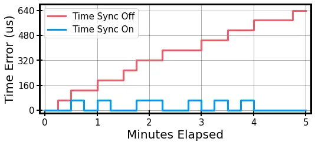

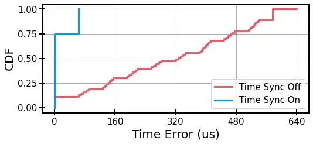

Figure 14. Time Synchronization Validation. Without time synchronization
(red), microphone samples drift apart and lose alignment at about
128$`\mu`$s/min.

Separation between microphones. Our in-the-wild evaluation across 8
participants showed generalization across facial features. Here, we
benchmark our method to different head sizes where the distance between
the microphones may be different. We generate 200 synthetic samples,
where the distance between the microphones is randomly chosen between 10
and 25 cm. Because the target speaker is in the middle of the microphone
array, the target signal will arrive at both mics simultaneously
regardless of the microphone distance. Fig. 13 show little change in
performance even with microphone distances greatly different than used
during training.

### 5.4. System Evaluation

Synchronization. In order to evaluate this, we place both ClearBuds
roughly equidistant from a speaker. A click tone is played every 15
seconds for 5 minutes, and recorded on both ClearBuds with time sync
disabled and enabled. We calculate the sample error on each recorded
click offline and convert it into time error with a sampling rate of
15.625kHz. Fig. 14(a) shows the synchronization results across a five
minute interval. With time sync enabled, the sample error never exceeds
1 sample at 15,625 kHz, or 64 $`\mu`$s. Fig. 14(b) also shows the CDF of
the timing error across experiments of 5 minutes each conducted with
other Bluetooth devices in the environment, with and without time
synchronization.

Run-time and end-to-end latency. Mouth-to-ear delay is defined as the
time it takes from speech to exit the speaker’s mouth and reach the
listener’s ear on the other end of the call. The International
Telecommunication Union Telecommunication Standardization Sector (ITU-T)
G.114 recommendation regarding mouth-to-ear delay indicates that most
users are “very satisfied” as long as the latency does not exceed 200 ms
(10). In our end-to-end system, we targeted a one-way latency of 100 ms
prior to uplink, leaving up to 100 ms of network delay to move an IP
packet from the source to the destination.

With a 180-sample PCM buffer being filled at 31.25 kHz, there is a
5.76 ms delay prior to the samples reaching BLE stack. Once these
samples reach the radio hardware, there is a worst-case additional
latency of 7.5 ms as defined by the minimum BLE connection interval
supported by Bluetooth 5.0 (82). At the time of writing, the latest iOS
supports a minimum BLE connection interval of 15 ms. After the samples
reach the mobile phone, we wait for 67.2 ms to receive enough samples to
run a forward pass of our network. Our network has a run-time of 21.4 ms
on an iPhone 12 Pro (see Table 2). The number of FLOPs is computed over
each packet of 350 samples. Together, we have a latency of 109 ms,
leaving 91 ms for one-way network delay (RTT=182ms).

Power analysis. CB-Net uses an order of magnitude lower FLOPs per second
compared to Conv-TasNet on the smartphone, significantly reducing the
computational and corresponding power consumption. We also measure the
power consumption of the ClearBuds hardware. We measure current
consumption by powering our system through its Micro-USB port with a DC
power supply set to 3V, which goes through the same power path as our
coin cell battery. While continuously wirelessly streaming microphone
data, we measure average current consumed to be 5 mA. With the CR2032’s
nominal capacity of 210 mAh, this translates to approximately 42 hours
of operation. Table 3 shows a breakdown by component of the system’s
power consumption. The accelerometer (BMA400) and flash (W25N01GVZEIG)
are omitted as they are power gated during streaming.

| Device        | Conv-TasNet | CB-Conv-TasNet | CB-Net |
| ------------- | ----------- | -------------- | ------ |
| iPhone 12 Pro | 155.5ms     | 17.5ms         | 21.4ms |
| iPhone 11     | 165.4ms     | 18.6ms         | 22.7ms |
| iPhone XS     | 241.5ms     | 27.2ms         | 33.0ms |
| FLOPs/packet  | 1078M       | 97M            | 131M   |

Table 2. Neural network run time on smartphones

## 6. Limitations & Future work

The first limitation is that the user must be wearing both wireless
earbuds to benefit from our binaural noise suppression network. Second,
with only two microphones, there is an opportunity for background voices
to remain in the uplink channel if the voice is within a few degrees of
the target speaker’s sagittal plane (see Fig. 13). The underlying
assumption of our network is that the mouth is in the middle of the
user’s ears, though as seen in Fig. 13 and our in-the-wild evaluation,
some variance is permissible.

While we minimize the power consumption of the ClearBud hardware, we
shift the processing and therefore power consumption to the more
powerful mobile phone. Performing network computation on the mobile
phone over a cloud GPU is an enhancement in terms of user privacy and
security so that sensitive voice data is not transmitted to the cloud.
While mobile chips are becoming more power efficient, an alternative
design to explore is to run our neural network on a plugged-in edge
device (e.g., router), minimizing computation while achieving similar
latency.

Future work could integrate two microphones in each earbud, so that each
earbud could beamform toward the user’s mouth prior to processing in the
neural network. We also had to develop a custom wireless audio protocol
to stream two microphones to a single phone. While this prevents this
architecture from being deployed on today’s commodity wireless earbuds,
adoption may be imminent as Bluetooth 5.2 shows promise with the
introduction of Multi-Stream Audio and Audio Broadcast (83).

Our network could also be deployed on other multi-microphone mobile or
resource-constrained edge systems such as smart watches, augmented
reality glasses, or smart speakers to allow for enhanced voice control
or telephony in noisy environments. The hardware and firmware for
Clearbuds could be leverage to produce wireless, synchronized microphone
arrays for telephony, acoustic activity recognition or for swarm robot
localization and control.

## 7. Conclusion

Real-time speech enhancement has been an open research challenge for
multiple decades. The recent proliferation of wireless earbuds and
neural network architectures provides an opportunity to build systems
that bridge neural networks and wireless earbuds to create new
capabilities. Here, we present ClearBuds, the first deep learning based
system to achieve real-time speech enhancement with binaural wireless
earbuds. At its core is a new open-source wireless earbud design capable
of operating as a synchronized binaural microphone array and a
lightweight cascaded neural network. In-the-wild experiments show that
ClearBuds can achieve background noise suppression, background speech
removal, and speaker separation using wireless earbuds.

Acknowledgments. This research is funded by the UW Reality Lab, Moore
Inventor Fellow award \#10617 and the researchers are also funded by the
National Science Foundation. We thank our shepherd, Youngki Lee, and the
anonymous reviewers for their feedback on our submission.

| Component                       | Power Consumption |
| ------------------------------- | ----------------- |
| BLE SoC (nRF52840)              | 12.02 mW          |
| Microphone (ICS-41350)          | 0.77 mW           |
| Ideal Diode (LM66100DCKT)       | 0.27 $`\mu`$W     |
| Buck Efficiency Loss (MAX38640) | 1.75 mW           |
| Total                           | 14.54 mW          |

Table 3. ClearBuds hardware power consumption

## References

- \[1\]
  https://appleinsider.com/articles/21/03/30/apple-airpods-beats-dominated-audio-wearable-market-in-2020.
- \[2\] Barry D Van Veen and Kevin M Buckley. Beamforming: A versatile
  approach to spatial filtering. IEEE assp magazine, 5(2):4–24, 1988.
- \[3\] Hamid Krim and Mats Viberg. Two decades of array signal
  processing research: the parametric approach. IEEE signal processing
  magazine, 13(4):67–94, 1996.
- \[4\] Amit Chhetri, Philip Hilmes, Trausti Kristjansson, Wai Chu,
  Mohamed Mansour, Xiaoxue Li, and Xianxian Zhang. Multichannel audio
  front-end for far-field automatic speech recognition. In 2018 EUSIPCO,
  pages 1527–1531. IEEE, 2018.
- \[5\] Cem Subakan, Mirco Ravanelli, Samuele Cornell, Mirko Bronzi, and
  Jianyuan Zhong. Attention is all you need in speech separation, 2021.
- \[6\] Yi Luo and Nima Mesgarani. Conv-tasnet: Surpassing ideal
  time–frequency magnitude masking for speech separation. IEEE/ACM
  Transactions on Audio, Speech, and Language Processing, 2019.
- \[7\] www.krisp.ai.
- \[8\] Apple airpods. https://www.apple.com/airpods/.
- \[9\] Fahim Kawsar, Chulhong Min, Akhil Mathur, and Alessandro
  Montanari. Earables for personal-scale behavior analytics. IEEE
  Pervasive Computing, 17(3):83–89, 2018.
- \[10\] Series G: Transmission Systems and Media, Digital Systems and
  Networks, 2003.
- \[11\] Galaxy s5 explained: Audio.
  https://news.samsung.com/global/galaxy-s5-explained-audio, Jun 2014.
- \[12\] Earbuds that put sound first.
  https://en-de.sennheiser.com/newsroom/earbuds-that-put-sound-first,
  Mar 2020.
- \[13\] Microphone array beamforming.
  https://invensense.tdk.com/wp-content/uploads/2015/02/microphone-array-beamforming.pdf.
- \[14\] Echo (3rd gen).
  https://www.amazon.com/all-new-echo/dp/b07nftvp7p.
- \[15\] InvenSense. Microphone array beamforming. Technical Report
  AN-1140-00, InvenSense Inc., 1745 Technology Drive, San Jose, CA 95110
  U.S.A, December 2013.
- \[16\] Bluetooth Audio Telephony and Automotive Working Group.
  Hands-free profile: Bluetooth® profile specification. Technical Report
  v1.8, Bluetooth SIG, Apr 2020.
- \[17\] Otis Lamont Frost. An algorithm for linearly constrained
  adaptive array processing. Proceedings of the IEEE,
  60(8):926–935, 1972.
- \[18\] Xueliang Zhang and DeLiang Wang. Deep learning based binaural
  speech separation in reverberant environments. IEEE/ACM transactions
  on audio, speech, and language processing, 25(5), 2017.
- \[19\] Michael Brandstein. Microphone arrays: signal processing
  techniques and applications. Springer Science & Business Media, 2001.
- \[20\] Yong Xu, Jun Du, Li-Rong Dai, and Chin-Hui Lee. A regression
  approach to speech enhancement based on deep neural networks. IEEE/ACM
  Transactions on Audio, Speech, and Language Processing,
  23(1):7–19, 2015.
- \[21\] Nasser Mohammadiha, Paris Smaragdis, and Arne Leijon.
  Supervised and unsupervised speech enhancement using nonnegative
  matrix factorization. IEEE Transactions on Audio, Speech, and Language
  Processing, 21(10):2140–2151, 2013.
- \[22\] Zhiyao Duan, Gautham J. Mysore, and Paris Smaragdis. Speech
  enhancement by online non-negative spectrogram decomposition in
  non-stationary noise environments. INTERSPEECH 2012, pages 594–597.
- \[23\] Mohammad Nikzad, Aaron Nicolson, Yongsheng Gao, Jun Zhou,
  Kuldip K. Paliwal, and Fanhua Shang. Deep residual-dense lattice
  network for speech enhancement. 2020.
- \[24\] Hyeong-Seok Choi, Jang-Hyun Kim, Jaesung Huh, Adrian Kim,
  Jung-Woo Ha, and Kyogu Lee. Phase-aware speech enhancement with deep
  complex u-net. 2019.
- \[25\] Felix Weninger, Hakan Erdogan, Shinji Watanabe, Emmanuel
  Vincent, Jonathan Roux, John R. Hershey, and Björn Schuller. Speech
  enhancement with lstm recurrent neural networks and its application to
  noise-robust asr. LVA/ICA 2015, page 91–99. Springer-Verlag, 2015.
- \[26\] Szu-Wei Fu, Chien-Feng Liao, Yu Tsao, and Shou-De Lin.
  Metricgan: Generative adversarial networks based black-box metric
  scores optimization for speech enhancement. 2019.
- \[27\] Meet H. Soni, Neil Shah, and Hemant A. Patil. Time-frequency
  masking-based speech enhancement using generative adversarial network.
  In ICASSP 2018.
- \[28\] Francois G. Germain, Qifeng Chen, and Vladlen Koltun. Speech
  denoising with deep feature losses. 2018.
- \[29\] Santiago Pascual, Antonio Bonafonte, and Joan Serrà. Segan:
  Speech enhancement generative adversarial network. 2017.
- \[30\] Alexandre Defossez, Gabriel Synnaeve, and Yossi Adi. Real time
  speech enhancement in the waveform domain. 2020.
- \[31\] Craig Macartney and Tillman Weyde. Improved speech enhancement
  with the wave-u-net. 2018.
- \[32\] meet.google.com.
- \[33\] Igor Fedorov, Marko Stamenovic, Carl Jensen, Li-Chia Yang, Ari
  Mandell, Yiming Gan, Matthew Mattina, and Paul N. Whatmough.
  Tinylstms: Efficient neural speech enhancement for hearing aids.
  Interspeech 2020, Oct 2020.
- \[34\] Takuya Yoshioka, Hakan Erdogan, Zhuo Chen, and Fil Alleva.
  Multi-microphone neural speech separation for far-field multi-talker
  speech recognition. In 2018 IEEE International Conference on
  Acoustics, Speech and Signal Processing (ICASSP), pages 5739–5743.
  IEEE, 2018.
- \[35\] Zhuo Chen, Xiong Xiao, Takuya Yoshioka, Hakan Erdogan, Jinyu
  Li, and Yifan Gong. Multi-channel overlapped speech recognition with
  location guided speech extraction network. In 2018 IEEE Spoken
  Language Technology Workshop (SLT), pages 558–565. IEEE, 2018.
- \[36\] Rongzhi Gu, Shi-Xiong Zhang, Lianwu Chen, Yong Xu, Meng Yu, Dan
  Su, Yuexian Zou, and Dong Yu. Enhancing end-to-end multi-channel
  speech separation via spatial feature learning. arXiv preprint
  arXiv:2003.03927, 2020.
- \[37\] Panagiotis Tzirakis, Anurag Kumar, and Jacob Donley.
  Multi-channel speech enhancement using graph neural networks. 2021.
- \[38\] Teerapat Jenrungrot, Vivek Jayaram, Steve Seitz, and Ira
  Kemelmacher-Shlizerman. The cone of silence: Speech separation by
  localization. 2020.
- \[39\] Xingwei Sun, Risheng Xia, Junfeng Li, and Yonghong Yan. A deep
  learning based binaural speech enhancement approach with spatial cues
  preservation. In ICASSP 2019, pages 5766–5770.
- \[40\] Cong Han, Yi Luo, and Nima Mesgarani. Real-time binaural speech
  separation with preserved spatial cues. 2020.
- \[41\] Junfeng Li, Shuichi Sakamoto, Satoshi Hongo, Masato Akagi, and
  Yôiti Suzuki. Two-stage binaural speech enhancement with wiener filter
  for high-quality speech communication. Speech Communication,
  53(5):677–689, 2011.
- \[42\] Klaus Reindl, Yuanhang Zheng, and Walter Kellermann. Speech
  enhancement for binaural hearing aids based on blind source
  separation. In 2010 4th International Symposium on Communications,
  Control and Signal Processing (ISCCSP), pages 1–6. IEEE, 2010.
- \[43\] Richard van Hoesel, Melanie Böhm, Jörg Pesch, Andrew Vandali,
  Rolf D Battmer, and Thomas Lenarz. Binaural speech unmasking and
  localization in noise with bilateral cochlear implants using envelope
  and fine-timing based strategies. The Journal of the Acoustical
  Society of America, 123(4):2249–2263, 2008.
- \[44\] Richard Lyon. A computational model of binaural localization
  and separation. In ICASSP’83. IEEE International Conference on
  Acoustics, Speech, and Signal Processing, volume 8, pages 1148–1151.
  IEEE, 1983.
- \[45\] WE Kock. Binaural localization and masking. The Journal of the
  Acoustical Society of America, 22(6):801–804, 1950.
- \[46\] Ke Tan, Xueliang Zhang, and DeLiang Wang. Real-time speech
  enhancement using an efficient convolutional recurrent network for
  dual-microphone mobile phones in close-talk scenarios. In ICASSP 2019,
  pages 5751–5755, 2019.
- \[47\] Ke Tan, Xueliang Zhang, and Deliang Wang. Deep learning based
  real-time speech enhancement for dual-microphone mobile phones.
  IEEE/ACM Transactions on Audio, Speech, and Language Processing, pages
  1–1, 2021.
- \[48\] Nikhil Shankar, Gautam Shreedhar Bhat, and Issa Panahi.
  Efficient two-microphone speech enhancement using basic recurrent
  neural network cell for hearing and hearing aids. The Journal of the
  Acoustical Society of America, 148:389–400, 07 2020.
- \[49\] Anran Wang, Maruchi Kim, Hao Zhang, and Shyamnath Gollakota.
  Hybrid neural networks for on-device directional hearing, AAAI 2022.
- \[50\] Dong Ma, Andrea Ferlini, and Cecilia Mascolo. OESense:
  Employing Occlusion Effect for in-Ear Human Sensing, page 175–187. 2021.
- \[51\] Chulhong Min, Akhil Mathur, and Fahim Kawsar. Exploring audio
  and kinetic sensing on earable devices. WearSys ’18, page 5–10, 2018.
- \[52\] Jovan Powar and Alastair R. Beresford. A data sharing platform
  for earables research. In Proceedings of the 1st International
  Workshop on Earable Computing, EarComp’19, page 30–35, New York, NY,
  USA, 2019.
- \[53\] Zhijian Yang and Romit Roy Choudhury. Personalizing head
  related transfer functions for earables. SIGCOMM ’21, page 137–150,
  New York, NY, USA, 2021.
- \[54\] Justin Chan, Sharat Raju, Rajalakshmi Nandakumar, Randall Bly,
  and Shyamnath Gollakota. Detecting middle ear fluid using smartphones.
  Science Translational Medicine, 11:eaav1102, 05 2019.
- \[55\] Nam Bui, Nhat Pham, Jessica Jacqueline Barnitz, Zhanan Zou,
  Phuc Nguyen, Hoang Truong, Taeho Kim, Nicholas Farrow, Anh Nguyen,
  Jianliang Xiao, Robin Deterding, Thang Dinh, and Tam Vu. Ebp: An
  ear-worn device for frequent and comfortable blood pressure
  monitoring. Commun. ACM, 64(8):118–125, jul 2021.
- \[56\] Justin Chan, Ali Najafi, Mallory Baker, Julie Kinsman, Lisa
  Mancl, Susan Norton, Randall Bly, and Shyamnath Gollakota. Performing
  tympanometry using smartphones. Communications Medicine, 06 2022.
- \[57\] Dong Ma, Andrea Ferlini, and Cecilia Mascolo. Oesense:
  Employing occlusion effect for in-ear human sensing. MobiSys ’21, page
  175–187, 2021.
- \[58\] Enea Ceolini, Jens Hjortkjær, Daniel Wong, James O’Sullivan,
  Vinay Raghavan, Jose Herrero, Ashesh Mehta, Shih-Chii Liu, and Nima
  Mesgarani. Brain-informed speech separation (biss) for enhancement of
  target speaker in multitalker speech perception. NeuroImage,
  223:117282, 08 2020.
- \[59\] Caslav Pavlovic, Volker Hohmann, Hendrik Kayser, Louis Wong,
  Tobias Herzke, S. R. Prakash, zezhang Hou, and Paul Maanen. Open
  portable platform for hearing aid research. The Journal of the
  Acoustical Society of America, 143(3):1738–1738, 2018.
- \[60\] T. Herzke, H. Kayser, F. Loshaj, G. Grimm, and V. Hohmann. Open
  signal processing software platform for hearing aid research ( openmha
  ). 2017.
- \[61\] Tom Le Paine, Pooya Khorrami, Shiyu Chang, Yang Zhang, Prajit
  Ramachandran, Mark A. Hasegawa-Johnson, and Thomas S. Huang. Fast
  wavenet generation algorithm. 2016.
- \[62\] Andrew G. Howard, Menglong Zhu, Bo Chen, Dmitry Kalenichenko,
  Weijun Wang, Tobias Weyand, Marco Andreetto, and Hartwig Adam.
  Mobilenets: Efficient convolutional neural networks for mobile vision
  applications. 2017.
- \[63\] Olaf Ronneberger, Philipp Fischer, and Thomas Brox. U-net:
  Convolutional networks for biomedical image segmentation. 2015.
- \[64\] Diederik P Kingma and Jimmy Ba. Adam: A method for stochastic
  optimization. arXiv preprint arXiv:1412.6980, 2014.
- \[65\] Cox R. Neto S.F.de C. Lamblin C. and Sherif M.H. Itu-t coders
  for wideband, superwideband, and fullband speech communication.
  IEEE, 2009.
- \[66\] Setting up the timeslot api.
  https://devzone.nordicsemi.com/nordic/short-range-guides/b/software-development-kit/posts/setting-up-the-timeslot-api,
  Jul 2015.
- \[67\] Wireless timer synchronization among nrf5 devices.
  https://devzone.nordicsemi.com/nordic/short-range-guides/b/bluetooth-low-energy/posts/wireless-timer-synchronization-among-nrf5-devices,
  Jul 2016.
- \[68\] Hang Zhao, Chuang Gan, Andrew Rouditchenko, Carl Vondrick, Josh
  McDermott, and Antonio Torralba. The sound of pixels. 2018.
- \[69\] Yi Luo, Zhuo Chen, Nima Mesgarani, and Takuya Yoshioka.
  End-to-end microphone permutation and number invariant multi-channel
  speech separation, 2020.
- \[70\] Christophe Veaux, Junichi Yamagishi, Kirsten MacDonald, et al.
  Superseded-cstr vctk corpus: English multi-speaker corpus for cstr
  voice cloning toolkit. 2016.
- \[71\] Gordon Wichern, Joe Antognini, Michael Flynn, Licheng Richard
  Zhu, Emmett McQuinn, Dwight Crow, Ethan Manilow, and Jonathan Le Roux.
  Wham!: Extending speech separation to noisy environments. arXiv
  preprint arXiv:1907.01160, 2019.
- \[72\] M. Risoud, J.-N. Hanson, F. Gauvrit, C. Renard, P.-E. Lemesre,
  N.-X. Bonne, and C. Vincent. Sound source localization. European
  Annals of Otorhinolaryngology, Head and Neck Diseases,
  135(4):259–264, 2018.
- \[73\] Jont B Allen and David A Berkley. Image method for efficiently
  simulating small-room acoustics. The Journal of the Acoustical Society
  of America, 65(4):943–950, 1979.
- \[74\] Robin Scheibler, Eric Bezzam, and Ivan Dokmanić.
  Pyroomacoustics: A python package for audio room simulation and array
  processing algorithms. In 2018 ICASSP, pages 351–355. IEEE.
- \[75\] Jonathan Le Roux, Scott Wisdom, Hakan Erdogan, and John R.
  Hershey. SDR - half-baked or well done? CoRR, abs/1811.02508, 2018.
- \[76\] Project gutenberg.
  [https://www.gutenberg.org/](https://www.gutenberg.org/). Accessed:
  2021-12-20.
- \[77\] Chandan K. A. Reddy, Harishchandra Dubey, Vishak Gopal, Ross
  Cutler, Sebastian Braun, Hannes Gamper, Robert Aichner, and Sriram
  Srinivasan. Icassp 2021 deep noise suppression challenge. In ICASSP
  2021 - 2021 IEEE International Conference on Acoustics, Speech and
  Signal Processing (ICASSP), pages 6623–6627, 2021.
- \[78\]
  https://www.microsoft.com/en-us/research/academic-program/deep-noise-suppression-challenge-interspeech-2021/.
- \[79\] Nils L. Westhausen and Bernd T. Meyer. Dual-signal
  transformation lstm network for real-time noise suppression,
  arxiv, 2020.
- \[80\] Fabian-Robert Stöter, Antoine Liutkus, and Nobutaka Ito. The
  2018 signal separation evaluation campaign. 2018.
- \[81\] DeLiang Wang. On ideal binary mask as the computational goal of
  auditory scene analysis. In Speech separation by humans and machines,
  pages 181–197. Springer, 2005.
- \[82\] Bluetooth Core Specification v5.0, 2016.
- \[83\] https://www.bluetooth.com/media/le-audio/le-audio-faqs.
