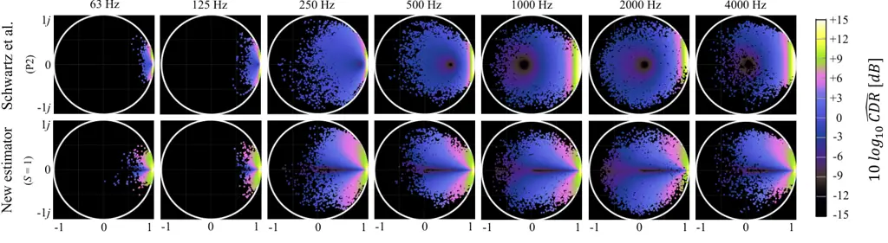
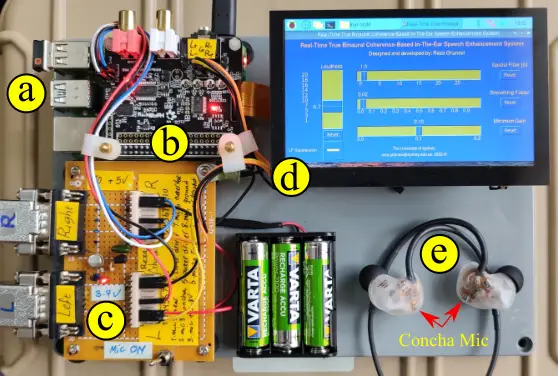

# ![[Uncaptioned image]](arxiv-2207-08314v1--fc9842bd563c.figures/figure-1.webp) Improving spatial cues for hearables using a parameterized binaural CDR estimator

Reza Ghanavi⁽¹⁾, Craig Jin⁽²⁾ Affiliation: University of Sydney,
Australia, reza.ghanavi@sydney.edu.au Affiliation: University of Sydney,
Australia, craig.jin@sydney.edu.au

### ABSTRACT

We investigate a speech enhancement method based on the binaural
coherence-to-diffuse power ratio (CDR), which preserves auditory spatial
cues for maskers and a broadside target. Conventional CDR estimators
typically rely on a mathematical coherence model of the desired signal
and/or diffuse noise field in their formulation, which may influence
their accuracy in natural environments. This work proposes a new robust
and parameterized directional binaural CDR estimator. The estimator is
calculated in the time-frequency domain and is based on a geometrical
interpretation of the spatial coherence function between the binaural
microphone signals. The binaural performance of the new CDR estimator is
compared with three state-of-the-art CDR estimators in
cocktail-party-like environments and has shown improvements in terms of
several objective speech quality metrics such as PESQ and SRMR. We also
discuss the benefits of the parameterizable CDR estimator for varying
sound environments and briefly reflect on several informal subjective
evaluations using a low-latency real-time framework.

Keywords: CDR estimation, binaural speech enhancement.

## 1  INTRODUCTION

Speech enhancement and listening comfort improvement in multi-talker,
noisy environments remains an active research area in binaural hearing
and binaural signal processing for both hearables and hearing aids \[1,
2, 3, 4\]. Research has shown that exploiting the short-time spatial
coherence estimate between two adjacent microphones is an effective way
of calculating the gains required for spectral enhancement \[5, 6, 7, 8,
9\]. Among the model-based dereverberation methods, a limited number of
them are proposed for binaural applications \[10\]. An attractive
feature of the binaural spatial coherence approach is that applying
simple Wiener post-filtering on the short-time binaural spatial
coherence preserves auditory spatial cues such as interaural time
difference and interaural level difference for all sources when the
target source is located directly ahead \[11, 12, 7\]. However, many
previous coherence-based methods do not consider binaural processing per
se but focus on speech enhancement.

In \[5\] a reverberation suppression method is introduced that estimates
the coherent-to-diffuse energy ratio (CDR) for post-filtering gain
calculation in a complex noise field. In particular, this work considers
the geometry of the spatial coherence function in the complex plane for
direct and diffuse sound components. Further research in \[8, 9\] shows
that CDR-based dereverberation improves when the estimator accounts for
the direction of arrival (DOA) of the direct signal and the phase of the
complex-valued spatial coherence function. An issue with the
aforementioned CDR estimators is that they rely on models of the
coherence of the direct signal and/or diffuse noise field to estimate
the CDR, and these models may not always match complex binaural noise
fields in natural environments. A few numbers of the several heuristic
CDR estimators proposed by Schwarz _et. al._ \[7\] have shown greater
robustness when compared with the CDR estimators introduced in \[5\],
\[8\] and \[9\]. As well, a more recent study by Löllmann _et al._
\[13\] estimates the CDR based on the effective rank of the covariance
matrix of the input signals. Although this method does not require a
coherence model for the signal and noise sound fields, it has the
drawback of higher computational cost in real-time applications compared
with the coherence-based method and produces less target to masking
ratios in multi-talker environments due to its omnidirectionality.

In this work, we propose a new robust directional CDR estimator derived
from the complex-valued short time-frequency domain spatial coherence
function between the observed binaural signals. The new CDR estimator
requires neither a coherence model of the noise field nor an estimation
of the room reverberation time. In this formulation, the target
direction for the desired coherent signal is always broadside and
straight-ahead. Hence, the symmetrical phase-magnitude response of the
new estimator can be physically and psychoacoustically matched with any
head shape and size to preserve natural binaural cues recorded by
conchal microphones. In addition, the online adjustment of the new
formula’s real-valued parameter $`S`$ enables precise binaural
dereverberation and denoising in a given acoustic environment.

This paper is organized as follows. First, in Section 2, a novel
parameterized CDR estimator is formulated and described. Further, in
this section, the application of the new CDR estimator in reverberation
suppression is illustrated, and the real-time implementation of the
mentioned algorithm is briefly described. In Section 3, the objective
and perceived sound quality of the new binaural speech enhancement
algorithm is compared with several state-of-the-art counterparts.

## 2  METHODS

### 2.1 New CDR estimator

In this study, we consider the recording of a reverberated and/or noisy
speech signal by two identical omnidirectional conchal microphones. We
assume that the auto-power spectra of the microphone signals recorded
for the broadside target are equal. In this case, the spatial coherence
function, $`\hat{\Gamma}_{l,r}(m,k)`$, with the frame index $`m`$ and
frequency $`k`$ for two binaural microphone signals, is expressed in the
time-frequency domain as:

```math
\hat{\Gamma}_{l,r}(m,k)=\frac{\hat{\Phi}_{l,r}(m,k)}{\sqrt{\hat{\Phi}_{l,l}(m,k)\hat{\Phi}_{r,r}(m,k)}}\,\text{,} \tag{1}
```

where $`\hat{\Phi}_{x,y}(.)`$ is the estimated cross-power spectrum for
signals $`x`$ and $`y`$ and we use the short-hand index notation $`l`$
and $`r`$ to represent the left and right ear microphone signals
$`X_{l,r}(m,k)`$, respectively. We estimate $`\hat{\Phi}_{x,y}(.)`$
recursively across time frames by
$`\hat{\Phi}_{x,y}(m,k)=\lambda\hat{\Phi}_{x,y}(m-1,k)+(1-\lambda)X_{x}(m,k)X_{y}^{*}(m,k)`$,
where $`\lambda`$ is a smoothing factor between 0 and 1 and $`\ast`$
indicates the complex conjugate operation. We propose a new heuristic
and parameterized formula for a DOA-dependent, binaural CDR estimator,
$`\widehat{CDR}(m,k)`$, that is derived solely from
$`\hat{\Gamma}_{l,r}(m,k)`$. For brevity and clarity in specifying the
new CDR estimator, we omit the time and frequency indices. The new CDR
estimator is given by:

```math
\widehat{CDR}(\hat{\Gamma}_{l,r},S)=\Re\left\{\frac{{\exp}(\hat{\Gamma}_{l,r}+\cos(\arg(\hat{\Gamma}_{l,r})-(\pi/2)\arg(\hat{\Gamma}_{l,r})))}{\sqrt{\hat{\Gamma}_{l,r}+(S)\ln(\hat{\Gamma}_{l,r})+\cos(\arg(\hat{\Gamma}_{l,r})+\pi)}}\right\}\,\text{,} \tag{2}
```

where $`\arg(\cdot)`$ and $`\Re\{\cdot\}`$ refer to the phase and real
part of a complex number, respectively, and $`S`$ is an adjustable
positive real-valued parameter.

Figure 1: The phasor response (geometrical locus) for the new CDR
estimator ($`A=1`$) is graphed for several coefficients S in (a); the
corresponding estimated gain responses are also shown in (b). A graph of
the phasor response for the new CDR estimator is shown for $`S=1`$ and
$`0.1\leq A\leq 1`$ in (c) and the corresponding gain responses are
shown in (d).

To clarify this formula, we consider Fig.1a, which depicts the new CDR
estimator as a function of the complex spatial coherence vector and
several values of $`S`$. The complex spatial coherence vector can be
represented by $`\hat{\Gamma}_{l,r}=Ae^{j\theta}`$, with amplitude,
$`0<A\leq 1`$, and phase, $`0\leq\theta\leq 2\pi`$. From Fig.1a we
observe that $`\widehat{CDR}(\hat{\Gamma}_{l,r},S)`$ is a U-shape
(parabolic-like) function of the phase of the spatial coherence vector
that is mirror-symmetric about $`\theta=\pi`$. We consider also Fig.1c
which shows the new CDR estimator for several values of the amplitude
$`A`$ for $`S=1`$. In general terms, the CDR estimator increases as
$`\theta`$ approaches $`0`$ and as $`A\rightarrow 1`$; in other words,
the geometrical slope of the $`\widehat{CDR}(\hat{\Gamma}_{l,r},S)`$
graph scales with the magnitude and phase of the spatial noise field
coherence vectors. The variation in the geometrical pattern of
$`\widehat{CDR}(\hat{\Gamma}_{l,r},S)`$ with changes in the $`S`$-value
modifies the spatial directivity of the microphone system, i.e., higher
$`S`$-values can reduce $`\widehat{CDR}(\hat{\Gamma}_{l,r},S)`$ as
$`\theta\rightarrow\pi`$ which is equivalent to increasing the
suppression of sound as it becomes incident from the side. The
adjustability of the estimated CDR patterns may be useful for matching
their values with the actual noise diffuseness in a specific frequency
band. Depending upon the value of $`A`$, _e.g._ $`A<1`$, one notices
that the CDR estimator demonstrates a peak that progressively moves away
from $`\theta=0`$ as $`A`$ decreases. More specifically, the formula has
been empirically designed so that for $`A<0.94`$, the CDR estimator goes
to $`0`$ as $`\theta\rightarrow 0`$ with a faster rate compared to
$`0.94<A<1`$. This behavior has been explicitly designed into the CDR
estimator in order to suppress coherent noise that might arise at lower
frequencies in a highly diffuse noise field, such as that related to the
late reverberation of a room \[5\]. On the other hand, when
$`\theta\rightarrow\pi`$, the observed geometrical pattern (see Fig.1c)
reduces the non-broadside PSD of the noise field in the binaural
signals, which may be useful for preserving early source reflections and
assisting with source localization based on interaural intensity
differences.



Figure 2: The coherent-to-diffuse power ratio (CDR) is plotted as a
function of the complex spatial coherence function,
$`\hat{\Gamma}_{l,r}(m,k)`$, for the Schwartz _et al._ P2 (Propose 2 in
\[7\], TDOA=0) estimator and for the new estimator for $`S=1`$. The CDR
levels for each frequency bin contains 7500 coherence vectors calculated
for 60 s speech convolved with the broadside BRIRs ($`d_{mic}`$=17 m in
the lecture room (AIR database) \[14\].

To examine the relationship between of the new CDR estimator ($`S=1`$),
$`\widehat{CDR}(\hat{\Gamma}_{l,r},S)`$, and the estimated,
complex-valued spatial coherence function, $`\hat{\Gamma}_{l,r}`$
consider Fig. 2 that depicts the estimated CDR levels for a speech
signal in a lecture room based on the position of spatial coherence
vectors on the complex plane compared with the ’Propose 2’ (P2) CDR
estimator by Schwartz et al. \[7\]. Observe that the coherence vectors
are more dispersed for higher frequencies but more concentrated around
the positive real axis for lower frequencies. This phenomenon shows that
low-frequency signals have higher correlations because of their
comparatively long wavelengths concerning head size and microphone
spacing. The contrast between the two CDR estimators suggests that the
new estimator may offer more reliable and precise estimation of CDR
across frequency for a broadside signal located in front. For example,
consider that the P2 CDR estimator shows a significant abrupt drop in
the estimated CDR level as frequency decreases below 500 Hz, i.e., it
will likely underestimate the low-frequency incident sound, while the
new CDR estimator shows a more unbiased response across all frequencies.
Significantly, one may also observe a spatial notch along the real axis
for $`\hat{\Gamma}_{l,r}<0.94`$ corresponding to the decreasing peak
height shown in Fig.1c. This spatial notch is intended to de-emphasize
the diffuse noise signals while preserving the coherent direct signal.

### 2.2 Binaural spectral enhancement

The application of the new CDR estimator for binaural noise and
reverberation suppression is tested and investigated using methods like
those proposed by \[11\], as indicated in the block diagram in Fig. 3.
Observe that, the spatial CDR is first estimated as described in Section
2.1 and a gain function, $`\hat{G}(m,k)`$, is then derived from the CDR
estimate in the time-frequency domain as follows:

```math
\hat{G}(m,k)=max\left(G_{min},\left(1-\frac{\mu}{\widehat{CDR}(m,k)+1}\right)^{2}\right)\,\text{.} \tag{3}
```

Figure 3: Block diagram of the proposed binaural signal processing
method.

The aforementioned coherence-based gain function is equivalent to the
square of a Weiner filter where $`G_{min}`$ is the gain floor to reduce
the musical artifacts, and $`\mu`$ is referred to as the
over-subtraction factor \[7\] and is commonly set to one. The gain
function is applied equally to the left and right channels, preserving
the spatial auditory cues of interaural time and level differences. The
effect of the gain function is shown in Figs. 1b and 1d and generally
follows the functional form of the new CDR estimator. As shown in Fig.
1b, smaller values of $`S`$ result in less spatial noise/reverberation
suppression and wider spatial directivity. In contrast, the larger
values of $`S`$ increase the suppression of the noise/reverberation,
provide narrower spatial filtering and may also increase audible
artifacts. Furthermore, the square of the Wiener filter has been
selected as the gain function since empirical testing has shown that it
performs well with the new CDR estimator. i.e., it produces less audible
artifacts and higher background noise suppression than a gain function
based on the spectral magnitude subtraction as suggested by \[7\].

### 2.3 Binaural room simulations

Three state-of-the-art coherence-based dereverberation algorithms are
compared with the proposed speech enhancement algorithm discussed in
Section 2.2 in a binaural format. The counterpart CDR estimators used in
this study are: (1) the DOA dependent CDR estimator ‘Propose 2’ (P2) in
Schwartz _et al._ \[7\]; (2) the DOA independent CDR estimator ‘Propose
3’ (P3) in Schwartz _et al._ \[7\]; and (3) the effective rank-based DOA
independent CDR estimator proposed by Löllmann _et al._ \[13\]. All
signal processing algorithms use a common 16kHz sampling rate, an FFT
size of 512, a window length of 1024, and a hop size of 128 in MATLAB
implementation. The gain function for the new CDR estimator was computed
as described in Section 2.2 and for the counterpart algorithms the
applied gain function is the spectral magnitude subtraction as described
in \[7, 13\], with $`\mu=1`$ and $`G_{\text{min}}=0.1`$ for all
algorithms. For the CDR estimators P2 and P3, the spatial coherence
model for the diffuse noise is given
as:$`\penalty\ \tilde{\Gamma}_{x,y}^{\text{diff}}(3D)=\sin{(2\pi fd_{\text{mic}}/c)}/(2\pi fd_{\text{mic}}/c)`$,
where $`d_{\text{mic}}`$ is the distance between two conchal microphones
and $`c`$ is the speed of sound. For the CDR estimator P2, the spatial
coherence for the broadside direct signal is taken as $`1`$ (real
valued), while the CDR estimator P3 does not require an estimate of the
spatial coherence of the direct sound \[7\]. For the three counterparts,
the smoothing factor $`\lambda`$ was set according to the relevant
reference publication (P2 and P3: $`\lambda=0.68`$; Löllmann:
$`\lambda=0.8`$). For the new CDR estimator, we chose $`\lambda=0.72`$.

For the room simulation, we used a set of binaural HRIRs recorded by the
conchal microphones of a generic in-the-ear hearable for a male subject
with large pinna provided by the database described in \[15\]. The
database HRIRs were then evenly interpolated for 642 directions on the
surface of an imaginary sphere and used as input for the room simulator
MCROOMSIM \[16\] in order to obtain a set of BRIRs corresponding to a
shoebox large room (20m x 16m x 5m) with 4 different reverberation times
(0.3, 0.5, 1 and 2)s. The simulations were conducted with the listener
positioned in the center of the room (ear level at 1.6 m). A target
talker directional source is positioned in front of the listener at 0.5
m distance, and the subject is surrounded by a combination of one
near-field time-reversed directional female speech masker located on the
right and four far-field evenly distributed female speech maskers. The
34 s female utterances were derived from HARVARD speech corpus \[17\].
In order to simulate a more realistic environment, a low-pass-filtered
white noise (cutoff frequency 400 Hz) was mixed with the five masker
signals. The relative signal levels used for the target, maskers, and
low-pass filtered noise signals were varied and specified as a triplet
of numbers (0, -6, -10) dB, (0, 0, -10) dB and (-6, 0, 0) dB,
respectively. The process above was repeated for four different
reverberation times, set by changing the room acoustic absorption
settings in MCROOMSIM.

### 2.4 Broadband low-latency real-time framework

Fig.4 shows the actual Raspberry Pi-based embedded system \[18\]
prototype adapted for high-quality and low-latency online implementation
of the described new algorithm in Python \[19\]. The recorded binaural
time signals (32kHz sample rate) are buffered (window size 512) using
50% overlap. The selection of larger window sizes enables more accurate
short-time signal power estimation at lower frequencies and has shown
fewer artifacts in a time-variant system. Furthermore, the number of FFT
points has been doubled (FFT size = 1024) to improve the quality of
spectral enhancement processing in the frequency domain. Using the
Hanning window, the signal is then reconstructed via the weighted
overlap-add (WOLA) technique \[20\]. The output buffer is filled by the
second half of the previous segment in time and the first half of the
current segment to reduce real-time latency by half. In this case, the
total acoustic latency in this system is measured to be about 9 ms,
which is comparable with the average latency in a high-quality hearing
aid system \[21\]. The user interface for this system enables online
adjustment of the S-parameter as well as other parameters.



Figure 4: Real-time low-latency prototype of the new CDR-based true
binaural speech enhancement system. Raspberry Pi 4B (a), HiFiBerry DAC
plus ADC Pro (b), hearable interface (C), online user interface (d) and
binaural in-the-ear earpieces \[15\] (e).

## 3  RESULTS

### 3.1 Objective Speech Enhancement Performance

The performance of the new algorithm for speech dereverberation and
denoising is compared with other state of the art algorithms as
mentioned earlier using two intrusive methods: perceptual evaluation of
speech quality (PESQ) \[22\] and cepstrum distance (CD); and two
non-intrusive methods: speech-to-reverberation modulation energy ratio
(SRMR) and word error rate (WER) calculated for an automatic speech
recognition (ASR) system. The narrow-band results for PESQ and CD are
averaged across the two binaural enhanced signals, while the SRMR and
WER data are derived based on a monaural mix-down of the two full-band
binaural signals.

Figure 5: Objective performance results of the new reverberation
suppression algorithm are compared with the performance of the
counterpart algorithms in the multi-talker scenarios simulated for a
large room (left bar graphs) and different values of coefficient S
(right curves).

In Fig.5, the calculated objective values are averaged over the results
derived for several signal-to-masker/noise ratios (refer to Section
2.3). Observe first that the $`S`$-values obtaining the best results for
the newly proposed estimator vary across the various speech quality
measures (to a larger extent) and also across the different
reverberation conditions (to a lesser extent), with the optimal
$`S`$-value for a given acoustic environment as the performance measure
changes from PESQ to CD to SRMR. The performance variations depending on
the $`S`$-parameter demonstrate that the three measures examine various
aspects of the direct sound and background noise quality. The new CDR
estimator with the optimal $`S`$-value generally improves the PESQ
values compared with the other CDR estimators, e.g., for $`S=10`$, the
sound quality of the new algorithm generally outperforms the counterpart
algorithms for all of the reverberant conditions. Interestingly, a
significant increase in the SRMR performance values is found for the new
CDR estimator with optimal $`S`$-values compared with the other CDR
estimators. However, the $`S`$-value must be increased significantly to
obtain these results, i.e., higher $`S`$ values result in a more
direct-to-reverberant ratio (DRR). However, it can be observed that in a
given room, for $`S>100`$, the spatial gains for the direct signal can
be declined significantly due to change in the shape and slope of the
new CDR function curves (see Fig.1a). In addition, the increase in $`S`$
values can make more modifications to the background noise spectrum that
may explain the slight increments in the CD values. The varying
$`S`$-values obtaining optimal performance across the three speech
enhancement measures indicate that there are different and likely
conflicting requirements for optimizing speech enhancement performance
based on CDR, depending on the significance given to a particular speech
enhancement measure.

|         |             |                |       |                 |               |       |       |        |
| ------- | ----------- | -------------- | ----- | --------------- | ------------- | ----- | ----- | ------ |
|         |             | Schwarz et al. |       | Löllmann et al. | New estimator |       |       |        |
| RT60(s) | Unprocessed | (P2)           | (P3)  |                 | S = 0.1       | S = 1 | S = 3 | S = 10 |
| 0.3     | 55.67       | 45.33          | 62.67 | 60.33           | 45            | 48.33 | 50.67 | 46     |
| 0.5     | 53.33       | 50.67          | 57.67 | 57.67           | 50            | 48    | 44    | 46     |
| 1       | 55          | 52.33          | 58.67 | 53.67           | 49.33         | 47.33 | 47    | 50.33  |
| 2       | 62.33       | 59.33          | 64.33 | 61.33           | 59.33         | 60.67 | 60    | 64.67  |
| Average | 56.58       | 51.92          | 60.83 | 58.25           | 50.92         | 51.08 | 50.42 | 51.75  |

Table 1: Averaged word error rate (WER)

The objective speech intelligibility was also estimated by calculating
the word error rate (WER) of the automated speech recognition (ASR)
algorithm for the processed and unprocessed speech. The ASR engine
Deepspeech 0.9.3 was used \[23\]. In this work, we used clean speech
containing 34 s of female speech (100 words) from the HARVARD speech
corpus that was $`100\%`$ recognizable by the pre-trained ASR engine.
The average word error rates can thus be attributed to the acoustic
condition and binaural sound processing systems. Table 1 shows the WER
results for the multi-talker scenarios. On average, the word error rate
for the new CDR estimator enhancement algorithm with $`S=3`$ is lower
compared with the other CDR-based algorithms. For the multi-talker
scenario, the WER results indicate potential advantages to be found by
tuning the $`S`$-value specifically for a given sound environment.

### 3.2 Preliminary subjective evaluation

The binaural psychoacoustic perception of the newly proposed algorithm
compared with Schwartz et al., \[7\] (P2 and P3) is evaluated through
several informal listening tests in regular rooms and a large
reverberant/noisy cafeteria using the real-time platform described in
section 2.4. We are preparing to conduct a proper psychoacoustic
experiment in the future. Here we report some anecdotal results. For all
algorithms, the optimized online parameters $`\lambda`$ and $`G_{min}`$
are set to 0.02 and 0.1, respectively. In general terms, the perceived
sound quality is compatible with the objective results discussed in
Section 3.1; however, the informal listening tests have revealed that
the new algorithm seem to significantly improve the spatial quality of
the sound in a given environment compared with the the counterpart
algorithms. For example, the perceived frontal near-field and far-field
binaural intelligibility in the presence of several random distributed
noise/masker sources is highly improved for the new CDR formula, while
Schwartz et al., P2 has shown satisfactory results for only the
near-field target and P3 has shown less enhancement for the
target-to-masker ratio. Furthermore, the enhanced multi-talker and noisy
spatial atmosphere reproduced by the new binaural algorithm was reported
as perceived as more natural, robust and quiet compared with the two
other algorithms. i.e., accurate source localization and externalization
are preserved for the new CDR estimator resulting in improved listening
comfort. The online adjustment of parameter $`S`$ has revealed that
small changes in $`S<20`$ are perceivable and may be advantageous in
adjusting the enhanced target speech quality and spatial perception in
natural environments. The increment of the $`S`$ value for $`S>10`$ can
produce minor audible artifacts due to a higher level of background
noise modification.

## 4  CONCLUSIONS

A new binaural, directional coherent-to-diffuse power ratio (CDR)
estimator has been proposed for noise reduction and dereverberation in
multi-talker reverberant and noisy environments. The CDR estimator
relies only on the observed complex coherence between the binaural
microphones and maximizes for a broadside target signal. The binaural
application of the gain function and the compatibility of the new
formula with the actual binaural noise field preserves spatial hearing
cues. Furthermore, the new CDR estimator employs a variable
$`S`$-parameter to provide adjustable coherence-based spatial filtering
for different noise conditions.

The objective numerical evaluations show that varying the
$`S`$-parameter enables the CDR estimate to improve speech quality
and/or the direct-to-reverberant ratio. Adjusting the $`S`$-parameter
enables a trade-off between signal quality, degree of dereverberation,
and the spatial quality of the sound. The results suggest that the new
CDR estimator may improve existing coherence-based methods for denoising
and dereverberation. To this end, several informal listening tests have
shown more advantages of the new method compared with two counterpart
algorithms in terms of sound naturalness, accurate source localization
and voice intelligibility.

## ACKNOWLEDGEMENTS

The authors would like to thank Jorg Buchholz (Macquarie University) for
his constructive comments and suggestions. This research is supported by
an Australian Government Research Training Program (RTP) Scholarship.

## REFERENCES

##

- \[1\] Arons B. A review of the cocktail party effect. Journal of the
  American Voice I/O Society. 1992;12(7):35-50.
- \[2\] Ebata M. Spatial unmasking and attention related to the cocktail
  party problem. Acoustical Science and Technology. 2003;24(5):208-19.
- \[3\] Parande PG, Thomas T. A study of the cocktail party problem. In:
  2017 International Conference on Electrical and Computing Technologies
  and Applications (ICECTA). IEEE; 2017. p. 1-5.
- \[4\] Qian Ym, Weng C, Chang Xk, Wang S, Yu D. Past review, current
  progress, and challenges ahead on the cocktail party problem.
  Frontiers of Information Technology & Electronic Engineering.
  2018;19(1):40-63.
- \[5\] Jeub M, Nelke C, Beaugeant C, Vary P. Blind estimation of the
  coherent-to-diffuse energy ratio from noisy speech signals. In: 2011
  19th European Signal Processing Conference. IEEE; 2011. p. 1347-51.
- \[6\] McCowan IA, Bourlard H. Microphone array post-filter based on
  noise field coherence. IEEE Transactions on Speech and Audio
  Processing. 2003;11(6):709-16.
- \[7\] Schwarz A, Kellermann W. Coherent-to-diffuse power ratio
  estimation for dereverberation. IEEE/ACM Transactions on Audio,
  Speech, and Language Processing. 2015;23(6):1006-18.
- \[8\] Thiergart O, Del Galdo G, Habets EA. Signal-to-reverberant ratio
  estimation based on the complex spatial coherence between
  omnidirectional microphones. In: 2012 IEEE International Conference on
  Acoustics, Speech and Signal Processing (ICASSP). IEEE; 2012. p.
  309-12.
- \[9\] Thiergart O, Del Galdo G, Habets EA. On the spatial coherence in
  mixed sound fields and its application to signal-to-diffuse ratio
  estimation. The Journal of the Acoustical Society of America.
  2012;132(4):2337-46.
- \[10\] Jeub M, Vary P. Binaural dereverberation based on a
  dual-channel wiener filter with optimized noise field coherence. In:
  2010 IEEE International Conference on Acoustics, Speech and Signal
  Processing. IEEE; 2010. p. 4710-3.
- \[11\] Jeub M, Schafer M, Esch T, Vary P. Model-based dereverberation
  preserving binaural cues. IEEE Transactions on Audio, Speech, and
  Language Processing. 2010;18(7):1732-45.
- \[12\] Westermann A, Buchholz JM, Dau T. Binaural dereverberation
  based on interaural coherence histograms. The Journal of the
  Acoustical Society of America. 2013;133(5):2767-77.
- \[13\] Löllmann HW, Brendel A, Kellermann W. Effective Rank-Based
  Estimation of the Coherent-to-Diffuse Power Ratio. In: ICASSP
  2021-2021 IEEE International Conference on Acoustics, Speech and
  Signal Processing (ICASSP). IEEE; 2021. p. 955-9.
- \[14\] Jeub M, Schafer M, Vary P. A binaural room impulse response
  database for the evaluation of dereverberation algorithms. In: 2009
  16th International Conference on Digital Signal Processing.
  IEEE; 2009. p. 1-5.
- \[15\] Denk F, Kollmeier B. The Hearpiece database of individual
  transfer functions of an openly available in-the-ear earpiece for
  hearing device research. arXiv preprint arXiv:200406579. 2020.
- \[16\] Wabnitz A, Epain N, Jin C, Van Schaik A. Room acoustics
  simulation for multichannel microphone arrays. In: Proceedings of the
  International Symposium on Room Acoustics. Citeseer; 2010. p. 1-6.
- \[17\] Philippa D. HARVARD speech corpus - audio recording
  2019.; 2019. University of Salford. Available from:
  [https://doi.org/10.17866/rd.salford.c.4437578.v1](https://doi.org/10.17866/rd.salford.c.4437578.v1).
- \[18\] Carvalho A, Machado C, Moraes F. Raspberry Pi Performance
  Analysis in Real-Time Applications with the RT-Preempt Patch. In: 2019
  Latin American Robotics Symposium (LARS), 2019 Brazilian Symposium on
  Robotics (SBR) and 2019 Workshop on Robotics in Education (WRE).
  IEEE; 2019. p. 162-7.
- \[19\] De Pra Y, Fontana F. Programming real-time sound in python.
  Applied Sciences. 2020;10(12):4214.
- \[20\] Crochiere R. A weighted overlap-add method of short-time
  Fourier analysis/synthesis. IEEE Transactions on Acoustics, Speech,
  and Signal Processing. 1980;28(1):99-102.
- \[21\] Alexander J, et al. Hearing aid delay and current drain in
  modern digital devices. Canadian Audiologist. 2019;3(4).
- \[22\] Rix AW, Beerends JG, Hollier MP, Hekstra AP. Perceptual
  evaluation of speech quality (PESQ)-a new method for speech quality
  assessment of telephone networks and codecs. In: 2001 IEEE
  international conference on acoustics, speech, and signal processing.
  Proceedings (Cat. No. 01CH37221). vol. 2. IEEE; 2001. p. 749-52.
- \[23\] Hannun A, Case C, Casper J, Catanzaro B, Diamos G, Elsen E, et
  al. Deep speech: Scaling up end-to-end speech recognition. arXiv
  preprint arXiv:14125567. 2014.
