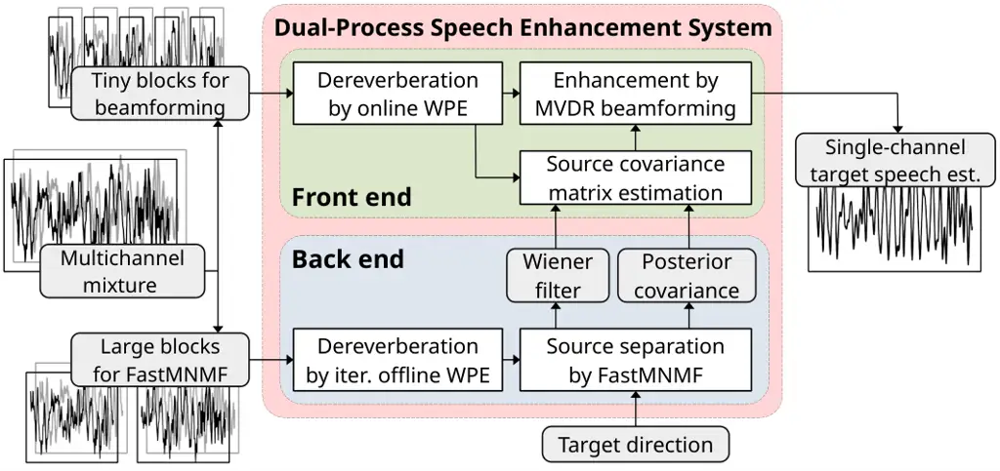

# DNN-Free Low-Latency Adaptive Speech Enhancement Based on Frame-Online Beamforming Powered by Block-Online FastMNMF

This work was supported by JSPS KAKENHI Nos. 19H04137, 20K19833, and
20K21813.

###### Abstract

This paper describes a practical dual-process speech enhancement system
that adapts environment-sensitive frame-online beamforming (front-end)
with help from environment-free block-online source separation
(back-end). To use minimum variance distortionless response (MVDR)
beamforming, one may train a deep neural network (DNN) that estimates
time-frequency masks used for computing the covariance matrices of
sources (speech and noise). Backpropagation-based run-time adaptation of
the DNN was proposed for dealing with the mismatched training-test
conditions. Instead, one may try to directly estimate the source
covariance matrices with a state-of-the-art blind source separation
method called fast multichannel non-negative matrix factorization
(FastMNMF). In practice, however, neither the DNN nor the FastMNMF can
be updated in a frame-online manner due to its computationally-expensive
iterative nature. Our DNN-free system leverages the posteriors of the
latest source spectrograms given by block-online FastMNMF to derive the
current source covariance matrices for frame-online beamforming. The
evaluation shows that our frame-online system can quickly respond to
scene changes caused by interfering speaker movements and outperformed
an existing block-online system with DNN-based beamforming by 5.0 points
in terms of the word error rate.

| Aditya Arie Nugraha¹  Kouhei Sekiguchi¹  Mathieu Fontaine^(3,1)  Yoshiaki Bando^(4,1)  Kazuyoshi Yoshii^(2,1) |
| ------------------------------------------------------------------------------------------------------------- |
| ¹Center for Advanced Intelligence Project (AIP), RIKEN, Japan                                                 |
| ²Graduate School of Informatics, Kyoto University, Japan                                                      |
| ³LTCI, Télécom Paris, Institut Polytechnique de Paris, France                                                 |
| ⁴National Institute of Advanced Industrial Science and Technology (AIST), Japan                               |

Index Terms—  speech enhancement, beamforming, blind source separation,
automatic speech recognition

## 1 Introduction



Fig. 1: The proposed low-latency speech enhancement system consisting of
a frame-online front end (beamforming) informed by a block-online back
end (FastMNMF).

In real environments, speech enhancement methods must be adaptive to
variations in sound scenes caused by environmental changes or movements
of the sound sources \[1, 2, 3\]. While it is important to successfully
extract the speech of interest, having a low computational cost can be
critical for downstream tasks that demand low-latency outputs, such as
automatic speech recognition (ASR) for augmented reality applications
aiming at natural human-machine interaction.

Beamforming is a computationally-efficient multichannel source
separation technique that can extract a single-channel signal coming
from a target direction when an accurate steering vector or
well-estimated source covariance matrices are given \[3, 4, 5, 6\]. Deep
neural networks (DNNs) have been popular for estimating these source
covariance matrices \[6, 7, 8, 9, 10, 11\], but these DNNs may have
limited performance when the actual test environment is not covered by
the training data. In contrast, multichannel blind source separation
(BSS) methods, such as multichannel non-negative matrix factorization
(MNMF) \[12\] and FastMNMF \[13, 14\], are expected to perform well in
any environment by optimizing the parameters of the assumed source
probability distributions. However, these methods require sufficient
data and have a relatively high computational cost.

Semi-blind or blind source separation method has been combined with
beamforming. Beamformers have been derived in a block-online processing
manner using the target source mask estimated as the posterior of a
complex Gaussian mixture model (cGMM) \[15\] or a complex angular
central Gaussian mixture model (cACGMM) \[16\], or the source covariance
matrices obtained by MNMF \[17\]. These systems run the estimation of
mask or covariance matrices and the beamforming sequentially on the same
block of data. Thus, the system latency is limited by the block size
required by cGMM, cACGMM, or MNMF to provide reliable estimates.
FastMNMF, which has been shown to outperform MNMF, has also been used as
the back end of a dual-process adaptive online speech enhancement system
\[11\] whose front end runs minimum variance distortionless response
(MVDR) beamforming \[5\] with a DNN mask estimator \[6\]. The DNN mask
estimator is periodically updated using the separated speech signals
obtained by FastMNMF, which carry out informed source separation given
the target directions, to adapt to the test environment.

This paper proposes a dual-process speech enhancement system whose front
end performs a responsive adaptive online MVDR beamforming by exploiting
the parameters of the source posterior distributions, i.e., the Wiener
filters and the covariance matrices, estimated by the back-end FastMNMF,
as shown in Figure 1. Using those Wiener filters and source posterior
covariance matrices, we compute frame-wise second-order raw moments
given the current observed mixture and accumulate them using exponential
moving averages (EMAs) to obtain block-wise source covariance matrices
for the beamformer. Consequently, the estimation of the source
covariance matrix relies on FastMNMF, instead of a DNN-based mask
estimator \[11\]. Directly using the average source covariance matrices
estimated by FastMNMF in a way similar to \[17\] is also possible.
However, when the back end processes a significantly larger data block
than the front end, the front end processes many blocks using the same
beamformer while waiting for the back end to provide new source
covariance matrices. Our proposed system is thus more preferable because
it can promptly respond to the sound scene changes.

The evaluation used multiple sequences of mixtures, in which the
interfering speaker locations are different in separate mixtures. Our
system outperformed DNN-based beamforming \[11\] in terms of word error
rate (WER) by 5.0 points using frame-online processing with a total
latency of 22 ms.

## 2 Proposed System

Let $`\smash{\mathbf{x}_{ft}\!\in\!\mathbb{C}^{M}}`$ be the short-time
Fourier transform (STFT) coefficients at frequency $`f\!\in\![1,F]`$ and
time frame $`t\!\in\![1,T]`$ of the observed multichannel mixture signal
captured by $`M`$ microphones and
$`\smash{\mathbf{x}_{nft}\!\in\!\mathbb{C}^{M}}`$ be the STFT
coefficients of the so-called multichannel image of source
$`n\!\in\![1,N]`$, where $`F`$ is the number of frequency bins, $`T`$ is
the total number of time frames, and $`N`$ is the number of sources. The
source images are assumed to sum to the observed mixture as
$`\smash{\mathbf{x}_{ft}\!=\!\sum_{n=1}^{N}\mathbf{x}_{nft}}`$. Given
$`\mathbf{X}\!\triangleq\!\left\{\mathbf{x}_{ft}|\forall f,\!\forall t\right\}`$,
BSS generally estimates
$`\forall n,\allowbreak\mathbf{X}_{n}\!\triangleq\!\left\{\mathbf{x}_{nft}|\forall f,\!\forall t\right\}`$.
In this paper, our dual-process adaptive online speech enhancement
system obtains the single-channel signal estimate
$`\left\{s_{n^{\prime}ft}|\forall f,\!\forall t\right\}`$ of target
source $`n^{\prime}`$ for ASR purpose.

The dual-process speech enhancement system executes a back end
(Sect. 2.1) and a front end (Sect. 2.2) in parallel in a block-online
processing manner, where each block is a subset of $`\mathbf{X}`$
consisting of a sequence of multiple time frames, as in \[11\]. At a
time, the back end processes
$`\smash{\mathbf{X}^{\text{BSS}}_{i}}\!\subset\!\mathbf{X}`$ composed of
$`\smash{T^{\text{BSS}}}`$ frames with $`i`$ is the block index, while
the front end processes
$`\smash{\mathbf{X}^{\text{BF}}_{j}}\!\subset\!\mathbf{X}`$ composed of
$`\smash{T^{\text{BF}}}`$ frames with $`j`$ is the block index.
$`\smash{T^{\text{BSS}}}`$ can be large enough to provide reliable
statistics required for good BSS performance, while
$`\smash{T^{\text{BF}}}`$ can be small when low-latency outputs are
expected.

The proposed system is similar to the system in \[11\]. Both systems
basically use the same back-end FastMNMF. However, the front ends use
different ways to obtain the source covariance matrices required to
derive MVDR beamformer.

### 2.1 Back End

As in \[11\], the back end operates given a block of data
$`\smash{\mathbf{X}^{\text{BSS}}_{i}}`$ and one or more target
directions. Offline iterative dereverberation \[18\] is first performed
on $`\smash{\mathbf{X}^{\text{BSS}}_{i}}`$ to obtain a set of less
reverberant mixtures $`\smash{\widehat{\mathbf{X}}^{\text{BSS}}_{i}}`$,
on which FastMNMF \[14\] is then applied after initializing the inverse
of the so-called diagonalization matrix given the target directions.
Although FastMNMF typically aims for the source image estimates, we are
more interested in the estimated parameters of the posterior
distribution $`\widehat{\mathbf{x}}_{nft}|\widehat{\mathbf{x}}_{ft}`$.

The local Gaussian model assumes that each source image
$`\widehat{\mathbf{x}}_{nft}`$ follows an $`M`$-variate complex-valued
circularly-symmetric Gaussian distribution, whose covariance matrix is
decomposed into power spectral density (PSD) $`\lambda_{nft}`$ and
spatial covariance matrix (SCM) $`\mathbf{G}_{nf}`$, as
$`\widehat{\mathbf{x}}_{nft}\!\sim\!\mathcal{N}_{\mathbb{C}}\left(\mathbf{0},\lambda_{nft}\mathbf{G}_{nf}\right)`$
\[19\]. To deal with the difficult optimization of this vanilla model,
the state-of-the-art BSS method called FastMNMF \[14\] uses a
nonnegative matrix factorization (NMF)-based spectral model and a
jointly-diagonalizable spatial model. The PSD is given by
$`\smash{\lambda_{nft}}\!\triangleq\!\smash{\sum_{c=1}^{C}u_{ncf}v_{nct}}\!\in\!\smash{\mathbb{R}_{+}}`$,
where $`\smash{u_{ncf}}\!\in\!\smash{\mathbb{R}_{+}}`$ and
$`\smash{v_{nct}}\!\in\!\smash{\mathbb{R}_{+}}`$ with $`c\!\in\![1,C]`$
and $`C`$ is the number of NMF components. The SCM is
jointly-diagonalizable by a time-invariant diagonalization matrix shared
among all sources
$`\mathbf{Q}_{f}\!\in\!\smash{\mathbb{C}^{M\times M}}`$ as
$`\mathbf{G}_{nf}\!\triangleq\!\mathbf{Q}_{f}^{-1}\mathrm{Diag}(\tilde{\mathbf{g}}_{n})\mathbf{Q}_{f}^{-\mathsf{H}}`$,
where $`\mathrm{Diag}(\tilde{\mathbf{g}}_{n})`$ is a diagonal matrix
whose diagonal vector is
$`\smash{\tilde{\mathbf{g}}_{n}}\smash{\triangleq}\smash{\left[\tilde{g}_{1n},\dotsc,\tilde{g}_{Mn}\right]^{\mathsf{T}}}\!\in\!\smash{\mathbb{R}_{+}^{M}}`$.
Thus, the probability distributions of the $`n`$-th less reverberant
source image and less reverberant mixture can be expressed as

```math
\displaystyle\widehat{\mathbf{x}}_{nft} \displaystyle\!\sim\!\mathcal{N}_{\mathbb{C}}^{M}\left(\mathbf{0},\lambda_{nft}\mathbf{Q}_{f}^{-1}\mathrm{Diag}(\tilde{\mathbf{g}}_{n})\mathbf{Q}_{f}^{-\mathsf{H}}\right), \tag{1}
```

```math
\displaystyle\widehat{\mathbf{x}}_{ft} \displaystyle\!\sim\!\mathcal{N}_{\mathbb{C}}^{M}\left(\mathbf{0},\sum\nolimits_{n=1}^{N}\lambda_{nft}\mathbf{Q}_{f}^{-1}\mathrm{Diag}(\tilde{\mathbf{g}}_{n})\mathbf{Q}_{f}^{-\mathsf{H}}\right). \tag{2}
```

Consequently, the posterior distribution is given by

```math
\displaystyle\widehat{\mathbf{x}}_{nft}\mid\widehat{\mathbf{x}}_{ft} \displaystyle\sim\mathcal{N}_{\mathbb{C}}^{M}\big(\mathbf{W}_{nft}\widehat{\mathbf{x}}_{ft}\,,\,\mathbf{\Sigma}_{nft}\big), \tag{3}
```

```math
\displaystyle\mathbf{W}_{nft} \displaystyle=\mathbf{Q}_{f}^{-1}\mathrm{Diag}\left(\frac{\lambda_{nft}\tilde{\mathbf{g}}_{n}}{\sum_{n^{\prime}=1}^{N}\lambda_{n^{\prime}ft}\tilde{\mathbf{g}}_{n^{\prime}}}\right)\mathbf{Q}_{f}, \tag{4}
```

```math
\displaystyle\mathbf{\Sigma}_{nft} \displaystyle=\left(\mathbf{I}-\mathbf{W}_{nft}\right)\mathbf{Q}_{f}^{-1}\mathrm{Diag}\left(\lambda_{nft}\tilde{\mathbf{g}}_{n}\right)\mathbf{Q}_{f}, \tag{5}
```

where $`\mathbf{I}`$ is the identity matrix. After the FastMNMF
parameter optimization for
$`\smash{\widehat{\mathbf{X}}^{\text{BSS}}_{i}}`$ is finished, we
compute the exponential moving averages (EMAs),
$`\smash{\widetilde{\mathbf{W}}_{nfi}}`$ and
$`\smash{\widetilde{\bm{\Sigma}}_{nfi}}`$, with
$`\smash{\alpha^{\text{BSS}}}\!\!=\!1`$ for $`i\!=\!1`$, to represent
the Wiener filter and the posterior covariance matrix, respectively, of
source $`n`$ in block $`i`$ as follows:

```math
\displaystyle\widetilde{\mathbf{W}}_{nfi} \displaystyle\!=\!\frac{\alpha^{\text{BSS}}}{T^{\text{BSS}}}\sum\nolimits_{t^{\prime}=1}^{T^{\text{BSS}}}\mathbf{W}_{nft^{\prime}}+(1-\alpha^{\text{BSS}})\widetilde{\mathbf{W}}_{nf(i-1)}, \tag{6}
```

```math
\displaystyle\widetilde{\bm{\Sigma}}_{nfi} \displaystyle\!=\!\frac{\alpha^{\text{BSS}}}{T^{\text{BSS}}}\sum\nolimits_{t^{\prime}=1}^{T^{\text{BSS}}}\mathbf{\Sigma}_{nft^{\prime}}+(1-\alpha^{\text{BSS}})\widetilde{\bm{\Sigma}}_{nf(i-1)}. \tag{7}
```

### 2.2 Front End

Given a block of data $`\smash{\mathbf{X}^{\text{BF}}_{j}}`$, the front
end performs an online dereverberation to obtain a less reverberant
mixture $`\smash{\widehat{\mathbf{x}}_{ft}}`$ that is then used by a
beamforming to compute the target signal estimate $`s_{nft}`$. The
beamforming uses $`\smash{\widetilde{\mathbf{W}}_{nfi^{\prime}}}`$ and
$`\smash{\widetilde{\bm{\Sigma}}_{nfi^{\prime}}}`$, where
$`\smash{i^{\prime}}`$ is the index of the latest block
$`\smash{\mathbf{X}^{\text{BSS}}_{i^{\prime}}}`$ processed by the back
end.

#### 2.2.1 Online Dereverberation

We remove late reverberation from the mixture
$`\smash{\mathbf{x}_{ft}}`$ using an online variant of WPE \[20, 18\]:
$`\smash{\widehat{\mathbf{x}}_{ft}}\!=\!\smash{\mathbf{x}_{ft}}\!-\!\smash{\mathbf{H}^{\mathsf{H}}_{ft}\widetilde{\mathbf{x}}_{f(t-\Delta)}}\!\in\!\smash{\mathbb{C}^{M}}`$,
where
$`\smash{\widetilde{\mathbf{x}}_{f(t-\Delta)}}\!\in\!\smash{\mathbb{C}^{M\!K}}`$
stacks
$`\left\{\mathbf{x}_{ft^{\prime}}\middle|t^{\prime}\!\in\![t\!-\!\Delta\!-\!K\!+\!1,t\!-\!\Delta]\right\}`$
and
$`\smash{\mathbf{H}_{ft}}\!=\!\smash{\mathbf{R}_{ft}^{-1}\mathbf{P}_{ft}}\!\in\!\smash{\mathbb{C}^{M\!K\times M}}`$
is the WPE filter with
$`\smash{\mathbf{R}_{ft}}\!\in\!\smash{\mathbb{C}^{M\!K\times M\!K}}`$,
$`\smash{\mathbf{P}_{ft}}\!\in\!\smash{\mathbb{C}^{M\!K\times M}}`$,
$`\Delta`$ is the delay, and $`K`$ is the number of filter taps.
Although our front end works in a block-online processing manner, we opt
for an online variant that allows us to avoid frequent matrix inversion
$`\smash{\mathbf{R}_{ft}^{-1}}`$ when $`T^{\text{BF}}`$ is small. We
first initialize
$`\smash{\mathbf{R}_{f0}^{-1}}\!\leftarrow\!\mathbf{I}`$ and
$`\smash{\mathbf{H}_{f0}}\!\leftarrow\!\mathbf{0}`$, where
$`\mathbf{0}`$ is the zero matrix with appropriate dimensions. The
dereverberation is then performed after updating
$`\smash{\mathbf{R}_{ft}^{-1}}`$ and $`\smash{\mathbf{H}_{ft}}`$ as
follows:

```math
\displaystyle\phi_{ft} \displaystyle\!=\!(M\Delta)^{-1}\sum\nolimits_{\vphantom{A^{\prime}}m=1}^{\vphantom{A}M}\sum\nolimits_{\vphantom{A^{\prime}}t^{\prime}=(t-\Delta+1)}^{\vphantom{A}t}\left|\left\{\mathbf{x}_{ft^{\prime}}\right\}_{m}\right|^{2}, \tag{8}
```

```math
\displaystyle\mathbf{K}_{ft} \displaystyle\!=\!\frac{\alpha^{\text{WPE}}\mathbf{R}_{f(t-1)}^{-1}\widetilde{\mathbf{x}}_{f(t-\Delta)}}{(1\!-\!\alpha^{\text{WPE}})\phi_{ft}\!+\!\alpha^{\text{WPE}}\widetilde{\mathbf{x}}_{f(t-\Delta)}^{\mathsf{H}}\mathbf{R}_{f(t\!-\!1)}^{-1}\widetilde{\mathbf{x}}_{f(t-\Delta)}},\! \tag{9}
```

```math
\displaystyle\mathbf{R}_{ft}^{-1} \displaystyle\!=\!\left(1-\alpha^{\text{WPE}}\right)^{-1}\left(\mathbf{I}-\mathbf{K}_{ft}\widetilde{\mathbf{x}}_{f(t-\Delta)}^{\mathsf{H}}\right)\mathbf{R}_{f(t-1)}^{-1}, \tag{10}
```

```math
\displaystyle\mathbf{H}_{ft} \displaystyle\!=\!\mathbf{H}_{f(t-1)}+\mathbf{K}_{ft}\left(\mathbf{x}_{ft}-\mathbf{H}^{\mathsf{H}}_{f(t-1)}\widetilde{\mathbf{x}}_{f(t-\Delta)}\right)^{\mathsf{H}}, \tag{11}
```

```math
\displaystyle\widehat{\mathbf{x}}_{ft} \displaystyle\!=\!\mathbf{x}_{ft}-\mathbf{H}^{\mathsf{H}}_{ft}\widetilde{\mathbf{x}}_{f(t-\Delta)}. \tag{12}
```

Our calculations for $`\mathbf{K}_{ft}`$ and $`\mathbf{R}_{ft}^{-1}`$
are slightly different from those presented in \[21, 18, 22\] because we
formulate EMAs:
$`\mathbf{R}_{ft}\!=\!\alpha^{\text{WPE}}\phi_{ft}^{-1}\widetilde{\mathbf{y}}_{f(t-\Delta)}\widetilde{\mathbf{y}}_{f(t-\Delta)}^{\mathsf{H}}\!+\!(1\!-\!\alpha^{\text{WPE}})\mathbf{R}_{f(t-1)}`$
and
$`\mathbf{P}_{ft}\!=\!\alpha^{\text{WPE}}\phi_{ft}^{-1}\widetilde{\mathbf{y}}_{f(t-\Delta)}{\mathbf{y}}_{ft}^{\mathsf{H}}\!+\!(1\!-\!\alpha^{\text{WPE}})\mathbf{P}_{f(t-1)}`$.
With these formulations, the EMA parameters in this paper, i.e.,
$`\smash{\alpha^{\text{BSS}}}`$, $`\smash{\alpha^{\text{WPE}}}`$, and
$`\smash{\alpha^{\text{BF}}}`$, provide the same interpretation about
the weights of a new data and the accumulated data. In terms of our
$`\smash{\alpha^{\text{WPE}}}`$, the EMA parameter in \[22\] is
$`\smash{(1\!-\!\alpha^{\text{WPE}})}`$.

#### 2.2.2 Online Beamforming

Assuming that
$`\widehat{\mathbf{x}}_{nft}\mid\widehat{\mathbf{x}}_{ft}\!\sim\!\smash{\mathcal{N}_{\mathbb{C}}^{M}\big(\widetilde{\mathbf{W}}_{nfi^{\prime}}\widehat{\mathbf{x}}_{ft},\widetilde{\mathbf{\Sigma}}_{nfi^{\prime}}\big)}`$,
we first compute the time-varying second-order raw moment as the
covariance matrix $`\smash{\bm{\Gamma}_{nft}}`$ of source $`n`$ and the
corresponding interference covariance matrix
$`\smash{\bm{\Upsilon}_{nft}}`$. EMAs
$`\smash{\widetilde{\bm{\Gamma}}_{nfj}}`$,
$`\smash{\widetilde{\bm{\Upsilon}}_{nfj}}`$ representing the source
covariance matrices in block $`j`$ are calculated with
$`\smash{\alpha^{\text{BF}}}\!\!=\!1`$ for $`j\!=\!1`$. A beamformer
$`\smash{\mathbf{w}^{\text{MV}}_{nfj}}`$ \[5\] is then obtained given a
vector $`\smash{\mathbf{u}_{m^{\prime}}}`$, whose $`{m^{\prime}}`$-th
entry is $`1`$ and $`0`$ elsewhere with $`{m^{\prime}}`$ is the
reference microphone index, as follows:

```math
\displaystyle\bm{\Gamma}_{nft} \displaystyle=\widetilde{\mathbf{W}}_{nfi^{\prime}}\widehat{\mathbf{x}}_{ft}\widehat{\mathbf{x}}_{ft}^{\mathsf{H}}\widetilde{\mathbf{W}}_{nfi^{\prime}}^{\mathsf{H}}+\widetilde{\mathbf{\Sigma}}_{nfi^{\prime}}, \tag{13}
```

```math
\displaystyle\bm{\Upsilon}_{nft} \displaystyle=\widehat{\mathbf{x}}_{ft}\widehat{\mathbf{x}}_{ft}^{\mathsf{H}}-\bm{\Gamma}_{nft}, \tag{14}
```

```math
\displaystyle\widetilde{\bm{\Gamma}}_{nfj} \displaystyle=\frac{\alpha^{\text{BF}}}{T^{\text{BF}}}\sum\nolimits_{t=1}^{T^{\text{BF}}}\bm{\Gamma}_{nft}+\left(1-\alpha^{\text{BF}}\right)\widetilde{\bm{\Gamma}}_{nf(j-1)}, \tag{15}
```

```math
\displaystyle\widetilde{\bm{\Upsilon}}_{nfj} \displaystyle=\frac{\alpha^{\text{BF}}}{T^{\text{BF}}}\sum\nolimits_{t=1}^{T^{\text{BF}}}\bm{\Upsilon}_{nft}+\left(1-\alpha^{\text{BF}}\right)\widetilde{\bm{\Upsilon}}_{nf(j-1)}, \tag{16}
```

```math
\displaystyle\mathbf{w}^{\text{MV}}_{nfj} \displaystyle=\Big(\text{tr}\big(\widetilde{\bm{\Upsilon}}_{nfj}^{-1}\widetilde{\bm{\Gamma}}_{nfj}\big)\Big)^{-1}\widetilde{\bm{\Upsilon}}_{nfj}^{-1}\widetilde{\bm{\Gamma}}_{nfj}\mathbf{u}_{m^{\prime}}. \tag{17}
```

Finally, we use the beamformer for all time frames in block $`j`$, i.e.,
$`\mathbf{w}^{\text{MV}}_{nft}\!\leftarrow\!\mathbf{w}^{\text{MV}}_{nfj}`$,
to obtain a single-channel enhanced signal:

```math
\displaystyle s_{nft} \displaystyle=\smash{\big(\mathbf{w}^{\text{MV}}_{nft}\big)}^{\mathsf{H}}\widehat{\mathbf{x}}_{ft}. \tag{18}
```

## 3 Evaluation

This section presents the evaluation of our proposed method on data
recorded using a Microsoft HoloLens 2 (HL2).

### 3.1 Experimental Settings

The evaluation was performed on the test subset of the dataset used in
\[11\]. This subset contained eight simulated noisy mixture signals,
each of which consists of multiple utterances, amounted to 18 min in
total. Each mixture signal was composed of two reverberant speech
signals and one diffuse noise signal ($`N\!=\!3`$), which were recorded
separately in a room with an $`\text{RT}_{60}`$ of about 800 ms using
the 5 microphones of an HL2 ($`M\!=\!5`$). The dry speech signals were
taken from the Librispeech dataset \[23\], and the noise signals were
taken from the CHiME-3 dataset \[24\]. The noise source was located 3 m
away from the HL2 in the direction of $`135^{\circ}`$, where
$`0^{\circ}`$ was in front of the HL2, behind multiple portable room
dividers to build up reflections, which characterize a diffuse noise.
The target speaker and the interfering speaker were located 1.5 m away
from the HL2. The target speaker was in the direction of $`0^{\circ}`$,
while the interfering speaker varied for each utterance between
$`\{45^{\circ},90^{\circ},180^{\circ},225^{\circ},270^{\circ},315^{\circ}\}`$.
Each noisy mixture signal was fed in turn to a speech enhancement
method, so the method needs to handle the interfering speaker movements.

All audio signals were sampled at 16 kHz. The STFT coefficients were
extracted using a 1024-point Hann window ($`F\!=\!513`$) with 75%
overlap. To factor out possible instability of the first few EMA
computations due to improper initialization, we concatenated the last
1024 frames ($`\approx`$ 16 s) of each noisy mixture to its beginning so
that the compared methods processed a few blocks before the performance
measurement started.

The block size of the back end was set to $`T^{\text{BSS}}\!=\!256`$
frames with 75% overlap. Thus, the back end provided new
$`\smash{\widetilde{\mathbf{W}}_{nfi^{\prime}}}`$ and
$`\smash{\widetilde{\bm{\Sigma}}_{nfi^{\prime}}}`$ every 64 frames
($`\approx`$ 1 s). The back-end iterative offline WPE was performed for
3 iterations using the tap length of 5 and the delay of 3. The number of
NMF components was $`C\!=\!8`$ and the number of FastMNMF parameter
updates was $`50`$, including $`40`$ warming-up iterations with the
frequency-invariant source model. The front-end online WPE was performed
using the tap length of 5 and the delay of 3. We loosely performed a
grid search in preliminary experiments by considering
$`\alpha^{\text{WPE}},\alpha^{\text{BF}},\alpha^{\text{BSS}}\!\in\!\{0.500,\allowbreak 0.200,\allowbreak 0.100,\allowbreak 0.050,\allowbreak 0.020,\allowbreak 0.010,\allowbreak 0.005\}`$.
The experiments presented in this paper used
$`\alpha^{\text{WPE}}\!=\!0.005`$ and $`\alpha^{\text{BSS}}\!=\!0.100`$.
The experimental results illustrate the proposed system’s top
performance on the test set because the hyperparameter tuning for
$`\smash{\alpha^{\text{WPE}}}`$, $`\smash{\alpha^{\text{BF}}}`$, and
$`\smash{\alpha^{\text{BSS}}}`$ was performed on the same set.

The performance was evaluated in terms of the word error rate (WER)
\[%\] and the computation time \[ms\]. The ASR system was based on the
transformer-based acoustic and language models of the SpeechBrain
toolkit \[25\]. We additionally perform the standard statistical test
called the Matched Pair Sentence Segment Word Error (MAPSSWE) test
\[26\] to determine whether two WERs obtained by two different systems
are different \[2\]. It is a two-tailed test whose null hypothesis is
that there is no performance difference between the two systems. The
computation time was measured on Intel Xeon E5-2698 v4 (2.20 GHz) with
NVIDIA Tesla V100 SXM2 (16GB).

### 3.2 Experimental Results and Discussion

|                                                  |                   |                    |                            |                               |                 |
| ------------------------------------------------ | ----------------- | ------------------ | -------------------------- | ----------------------------- | --------------- |
|                                                  | Block             |                    |                            |                               |                 |
| Method                                           | bp Size bp \[ms\] | bp Shift bp \[ms\] | bp Comp. bp Time bp \[ms\] | bp Total bp Latency bp \[ms\] | bp WER bp \[%\] |
| Clean (ground truth)                             | —                 | —                  | —                          | —                             | $`6.1`$         |
| Noisy (observation)                              | —                 | —                  | —                          | —                             | $`92.1`$        |
| Online WPE                                       | $`16`$            | $`16`$             | $`3`$                      | $`19`$                        | $`87.8`$        |
| Online WPE + DS                                  | $`16`$            | $`16`$             | $`4`$                      | $`20`$                        | $`68.4`$        |
| Online WPE + MPDR                                | $`16`$            | $`16`$             | $`6`$                      | $`22`$                        | $`47.1`$        |
| Online WPE + MPDR                                | $`64`$            | $`64`$             | $`16`$                     | $`80`$                        | $`46.0`$        |
| Online WPE + MPDR                                | $`256`$           | $`256`$            | $`54`$                     | $`310`$                       | $`47.2`$        |
| WPE + MVDR with DNN-based mask estimation \[11\] |                   |                    |                            |                               |                 |
| (before adaptation)                              | $`3000`$          | $`500`$            | $`250`$                    | $`750`$                       | $`35.6`$        |
| (after adaptation)                               | $`3000`$          | $`500`$            | $`250`$                    | $`750`$                       | $`20.4`$        |

Table 1: Average WERs \[%\] and computation times \[ms\] of the baseline
front ends. The total latency \[ms\] is the sum of the block shift size
and the average computation time for each block. Lower WER score and
computation time are better.

Table 1 shows the baseline performances. The WERs for ‘clean’, ‘observed
noisy’, and ‘online WPE’ were computed using the top center microphone
of HL2. The online WPE (Sect. 2.2.1) was also used with the
delay-and-sum (DS) beamforming or the minimum power distortionless
response (MPDR) beamforming. For ‘online WPE + DS’ and ‘online WPE +
MPDR’, we selected one vector from the set of pre-recorded steering
vectors given the target directions. For ‘online WPE + MPDR’, we used an
EMA of mixture covariance matrices computed similar to Eq. (15). Thus,
its performance affected by the block size and shift size. The shown
WERs for 16 ms $`\smash{\left(T^{\text{BF}}\!=\!1\right)}`$, 64 ms
$`\smash{\left(T^{\text{BF}}\!=\!4\right)}`$, and 256 ms
$`\smash{\left(T^{\text{BF}}\!=\!16\right)}`$ were achieved using the
optimal $`\alpha^{\text{BF}}`$, i.e., 0.020, 0.100, 0.200, respectively.
The performances of ‘WPE + MVDR with DNN-based mask estimation’ were the
best ones shown in \[11\].

| Block size $`T^{\text{BF}}`$ \[frames\] | $`1`$  | $`2`$  | $`4`$  | $`8`$   | $`16`$  | $`32`$  |
| --------------------------------------- | ------ | ------ | ------ | ------- | ------- | ------- |
| Block shift \[ms\]                      | $`16`$ | $`32`$ | $`64`$ | $`128`$ | $`256`$ | $`512`$ |
| Computation time \[ms\]                 | $`6`$  | $`10`$ | $`17`$ | $`30`$  | $`57`$  | $`111`$ |
| Total latency \[ms\]                    | $`22`$ | $`42`$ | $`81`$ | $`158`$ | $`313`$ | $`623`$ |

Table 2: Computation times and total latencies \[ms\] of the proposed
front end for different $`T^{\text{BF}}`$ \[frames\] (with no overlap).
Lower computation time is better.

[TABLE]

Table 3: Average WERs \[%\] of the proposed system for different
$`T^{\text{BF}}`$ \[frames\] and $`\alpha^{\text{BF}}`$. Lower WER score
is better. For visualization purpose, the shading of each cell reflects
the WER score. The best performance for each $`T^{\text{BF}}`$ is in
bold type. The top performances that are not statistically different
from the overall best performance indicated by ^(★) are marked with
^( $`\bigstar`$ $`\bigstar`$).

Tables 2 and 3 show the computational times and the average word error
rates (WERs), respectively, of the proposed system for different
$`T^{\text{BF}}`$ (with no overlap) and different
$`\alpha^{\text{BF}}`$. The WERs marked with
^( $`\bigstar`$ $`\bigstar`$) are not statistically different (the null
hypothesis is accepted at the 95% confidence level) from the best WER
marked with ^(★), i.e., 14.8% for
$`\smash{\left(T^{\text{BF}}\!=\!2,\alpha^{\text{BF}}\!=\!0.020\right)}`$.
It is worth noting that for
$`\smash{\left(T^{\text{BF}}\!=\!1,\alpha^{\text{BF}}\!=\!0.010\right)}`$,
the WER (i.e., 15.4%) is statistically the same as the best performance.
It demonstrates that our proposed system can also perform very well even
with the low-latency frame-online processing.

The optimal $`\smash{\alpha^{\text{BF}}}`$ for each
$`\smash{T^{\text{BF}}}`$ suggests that when a small block size is used,
the front end should rely more on the accumulated statistics and put
less importance on the newly acquired data (cf. Eqs. (15) and (16)).
Inappropriate $`\smash{\alpha^{\text{BF}}}`$ may have detrimental
effects, e.g., $`\smash{\alpha^{\text{BF}}}\!=\!0.500`$ for
$`\smash{T^{\text{BF}}}\!\in\!\{1,2,4\}`$. Using optimal
$`\smash{\alpha^{\text{BF}}}`$, our proposed system outperformed the
baseline performances, including that of mask-based MVDR with DNN
\[11\]. It suggests that our estimation of source covariance matrices
for deriving the MVDR beamformer was more adaptive in handling the sound
scene changes due to the interfering speaker movements. Accumulating the
statistics using EMA seems crucial and may also benefit MVDR with
DNN-based mask estimation. We leave this for future work.

## 4 Conclusion

This paper proposes a practical approach to the enhancement of adaptive
speech with low latency and high performance. The system operates an
online MVDR beamforming on the front end that adopts the posterior
distribution obtained by the back-end BSS based on FastMNMF. Future
works include considering scenarios with continuously moving sources and
automating hyperparameter tuning for $`\smash{\alpha^{\text{WPE}}}`$,
$`\smash{\alpha^{\text{BF}}}`$, and $`\smash{\alpha^{\text{BSS}}}`$.

## References

- \[1\] X. Alameda-Pineda, E. Ricci, and N. Sebe, Multimodal Behavior
  Analysis in the Wild: Advances and Challenges, Elsevier Science, 2018.
- \[2\] D. Jurafsky and J. H. Martin, Speech and Language Processing,
  3rd edition, Draft of Jan. 12, 2022. \[Online\]. Available:
  https://web.stanford.edu/~jurafsky/slp3/.
- \[3\] E. Vincent, T. Virtanen, and S. Gannot, Eds., Audio Source
  Separation and Speech Enhancement, John Wiley & Sons, 2018.
- \[4\] K. Kumatani, J. McDonough, and B. Raj, “Microphone array
  processing for distant speech recognition: From close-talking
  microphones to far-field sensors,” IEEE Signal Process. Mag., vol. 29,
  no. 6, pp. 127–140, 2012.
- \[5\] M. Souden, J. Benesty, and S. Affes, “On optimal
  frequency-domain multichannel linear filtering for noise reduction,”
  IEEE Trans. Audio, Speech, Language Process., vol. 18, no. 2, pp.
  260–276, Feb. 2010.
- \[6\] J. Heymann, L. Drude, and R. Haeb-Umbach, “A generic neural
  acoustic beamforming architecture for robust multi-channel speech
  processing,” Computer Speech & Language, vol. 46, pp. 374–385, 2017.
- \[7\] A. A. Nugraha, Deep neural networks for source separation and
  noise-robust speech recognition, Ph.D. thesis, Université de
  Lorraine, 2017.
- \[8\] S. Sivasankaran, E. Vincent, and D. Fohr, “SLOGD: Speaker
  location guided deflation approach to speech separation,” in Proc.
  IEEE Int. Conf. Acoust., Speech, Signal Process., 2020, pp. 6409–6413.
- \[9\] R. Gu, S.-X. Zhang, Y. Zou, and D. Yu, “Complex neural spatial
  filter: Enhancing multi-channel target speech separation in complex
  domain,” IEEE Signal Process. Lett., vol. 28, pp. 1370–1374, 2021.
- \[10\] J. Casebeer, J. Donley, D. Wong, B. Xu, and A. Kumar,
  “NICE-Beam: Neural integrated covariance estimators for time-varying
  beamformers,” 2021, arXiv:2112.04613v1.
- \[11\] K. Sekiguchi, A. A. Nugraha, Y. Du, Y. Bando, M. Fontaine,
  and K. Yoshii, “Direction-aware adaptive online neural speech
  enhancement with an augmented reality headset in real noisy
  conversational environments,” in Proc. IEEE/RSJ Int. Conf. Intell.
  Robots Syst., 2022, arXiv:2207.07296v1.
- \[12\] A. Ozerov and C. Févotte, “Multichannel nonnegative matrix
  factorization in convolutive mixtures for audio source separation,”
  IEEE/ACM Trans. Audio, Speech, Language Process., vol. 18, no. 3, pp.
  550–563, 2009.
- \[13\] N. Ito and T. Nakatani, “FastMNMF: Joint diagonalization based
  accelerated algorithms for multichannel nonnegative matrix
  factorization,” in Proc. IEEE Int. Conf. Acoust., Speech, Signal
  Process., May 2019, pp. 371–375.
- \[14\] K. Sekiguchi, Y. Bando, A. A. Nugraha, K. Yoshii, and T.
  Kawahara, “Fast multichannel nonnegative matrix factorization with
  directivity-aware jointly-diagonalizable spatial covariance matrices
  for blind source separation,” IEEE/ACM Trans. Audio, Speech, Language
  Process., vol. 28, pp. 2610–2625, 2020.
- \[15\] T. Higuchi, N. Ito, S. Araki, T. Yoshioka, M. Delcroix, and T.
  Nakatani, “Online MVDR beamformer based on complex Gaussian mixture
  model with spatial prior for noise robust ASR,” IEEE/ACM Trans. Audio,
  Speech, Language Process., vol. 25, no. 4, pp. 780–793, 2017.
- \[16\] C. Boeddecker, J. Heitkaemper, J. Schmalenstroeer, L.
  Drude, J. Heymann, and R. Haeb-Umbach, “Front-end processing for the
  CHiME-5 dinner party scenario,” in Proc. Int. Workshop Speech Process.
  Everyday Environs., 2018, pp. 35–40.
- \[17\] K. Shimada, Y. Bando, M. Mimura, K. Itoyama, K. Yoshii, and T.
  Kawahara, “Unsupervised speech enhancement based on multichannel
  NMF-informed beamforming for noise-robust automatic speech
  recognition,” IEEE/ACM Trans. Audio, Speech, Language Process., vol.
  27, no. 5, pp. 960–971, 2019.
- \[18\] L. Drude, J. Heymann, C. Boeddeker, and R. Haeb-Umbach,
  “NARA-WPE: A python package for weighted prediction error
  dereverberation in numpy and tensorflow for online and offline
  processing,” in Proc. ITG Symp. Speech Commun., 2018, pp. 1–5.
- \[19\] N. Q. K. Duong, E. Vincent, and R. Gribonval, “Under-determined
  reverberant audio source separation using a full-rank spatial
  covariance model,” IEEE Trans. Audio, Speech, Language Process., vol.
  18, no. 7, pp. 1830–1840, 2010.
- \[20\] T. Yoshioka and T. Nakatani, “Generalization of multi-channel
  linear prediction methods for blind MIMO impulse response shortening,”
  IEEE Trans. Audio, Speech, Language Process., vol. 20, no. 10, pp.
  2707–2720, 2012.
- \[21\] J. Caroselli, I. Shafran, A. Narayanan, and R. Rose, “Adaptive
  multichannel dereverberation for automatic speech recognition,” in
  Proc. INTERSPEECH, 2017, pp. 3877–3881.
- \[22\] J.-M. Lemercier, J. Thiemann, R. Koning, and T. Gerkmann,
  “Customizable end-to-end optimization of online neural
  network-supported dereverberation for hearing devices,” in Proc. IEEE
  Int. Conf. Acoust., Speech, Signal Process., 2022, pp. 171–175.
- \[23\] V. Panayotov, G. Chen, D. Povey, and S. Khudanpur,
  “Librispeech: An ASR corpus based on public domain audio books,” in
  Proc. IEEE Int. Conf. Acoust., Speech, Signal Process., 2015, pp.
  5206–5210.
- \[24\] E. Vincent, S. Watanabe, A. A. Nugraha, J. Barker, and R.
  Marxer, “An analysis of environment, microphone and data simulation
  mismatches in robust speech recognition,” Comput. Speech Lang., vol.
  46, pp. 535–557, 2017.
- \[25\] M. Ravanelli, T. Parcollet, P. Plantinga, A. Rouhe, S.
  Cornell, L. Lugosch, C. Subakan, N. Dawalatabad, A. Heba, J. Zhong,
  J.-C. Chou, S.-L. Yeh, S.-W. Fu, C.-F. Liao, E. Rastorgueva, F.
  Grondin, W. Aris, H. Na, Y. Gao, R. D. Mori, and Y. Bengio,
  “SpeechBrain: A general-purpose speech toolkit,” 2021,
  arXiv:2106.04624v1.
- \[26\] L. Gillick and S. Cox, “Some statistical issues in the
  comparison of speech recognition algorithms,” in Proc. IEEE Int. Conf.
  Acoust., Speech, Signal Process., 1989, vol. 1, pp. 532–535.
