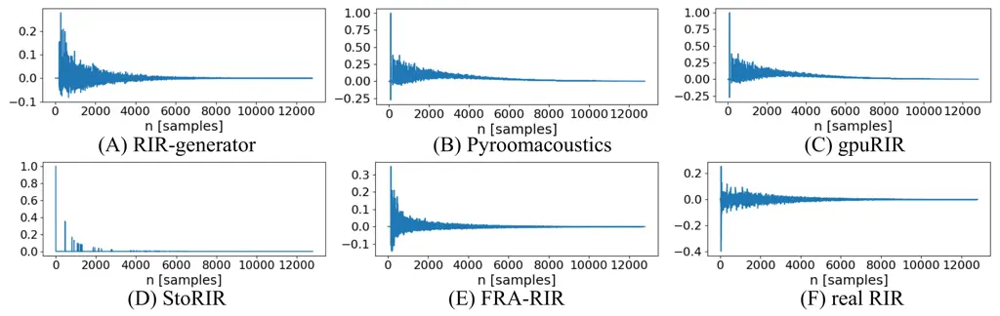
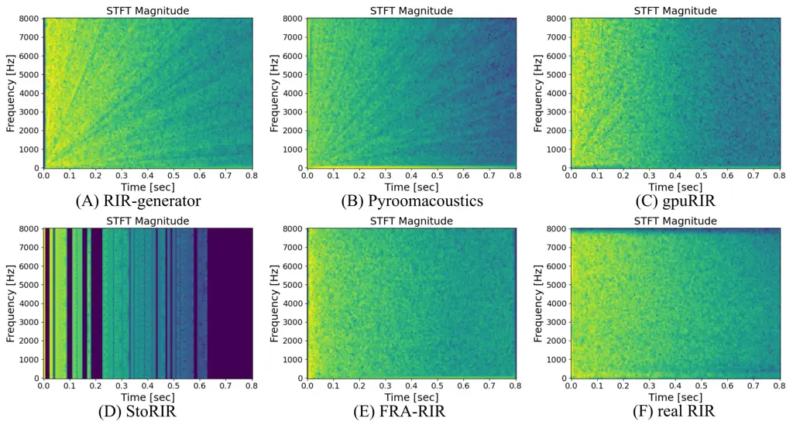

# FRA-RIR: Fast Random Approximation of the Image-source Method

Yi Luo    Jianwei Yu

###### Abstract

The training of modern speech processing systems often requires a large
amount of simulated room impulse response (RIR) data in order to allow
the systems to generalize well in real-world, reverberant environments.
However, simulating realistic RIR data typically requires accurate
physical modeling, and the acceleration of such simulation process
typically requires certain computational platforms such as a graphics
processing unit (GPU). In this paper, we propose FRA-RIR, a fast random
approximation method of the widely-used image-source method (ISM), to
efficiently generate realistic RIR data without specific computational
devices. FRA-RIR replaces the physical simulation in the standard ISM by
a series of random approximations, which significantly speeds up the
simulation process and enables its application in on-the-fly data
generation pipelines. Experiments show that FRA-RIR can not only be
significantly faster than other existing ISM-based RIR simulation tools
on standard computational platforms, but also improves the performance
of speech denoising systems evaluated on real-world RIR when trained
with simulated RIR. A Python implementation of FRA-RIR is available
online¹¹ 1
[https://github.com/yluo42/FRA-RIR](https://github.com/yluo42/FRA-RIR).

###### Index Terms: 

Data Augmentation, Image-source method, Room impulse response, Speech
Processing

## I Introduction

The simulation of room impulse response (RIR) filter plays an important
role in the training of various modern speech processing systems.
Systems trained without reverberant data can hardly generalize well to
real-world scenarios \[1\], and a good RIR simulator can further improve
the performance by augmenting the anechoic data with various RIR filters
\[2\].

A wide range of systems rely on an offline training configuration, where
a fixed number of training and development samples are generated in
advance and kept unchanged during the training phase. For the generation
of simulated reverberant speech samples, each anechoic utterance
requires a simulated RIR filter to create a training sample. With the
rapid growth of the scale of the data, such generation process becomes
time and storage consuming and further limits the amount of available
training data that can be used by the systems. As a consequence, online
training with on-the-fly data simulation becomes important as it can not
only generate infinite training data but also requires no extra storage.

The fast and efficient simulation of realistic RIR filters, however,
remains challenging. One of the most widely-used methods is the
image-source method (ISM) \[3\], where the propagation and the
reflection of the sound sources are calculated by virtual sound images
generated by mirroring the original sound sources by the room boundaries
(e.g., floors and walls). However, such simulation typically assumes an
empty rectangular or parallelepiped room and a fixed absorption rate of
all boundaries, which may not be able to simulate realistic RIR filters
that matches the room conditions in the real world where different
furniture and materials may result in complicated reflection patterns.
Moreover, the calculation of the sound paths can be complex and time
consuming. A standard method to accelerate ISM is to use GPU-accelerated
implementations \[4, 5\], where the physical modeling part can benefit
from specific computational platforms. Moreover, to improve the quality
of the RIR filters, diffuse-based methods were proposed to better model
late reverberation \[6, 7\], and ray-tracing-based methods were explored
to use explicit room modeling to calculate the sound paths \[8, 9, 10\].
Neural networks, especially generative adversarial networks (GANs)
\[11\], were also adopted to refine simulated RIR filters to approximate
the distributions of the real-recorded RIR filters \[12, 13, 14\].
Although many of these methods have proven effective in certain
applications and platforms, their usage in on-the-fly data simulation
have not been fully evaluated and may still limited by their speed,
complicity and the quality of the generated RIR filters.

In this paper, we propose a simple method to approximate the physical
modeling of the sound propagation and reflection process in ISM, which
we refer it to as Fast Random Approximation of RIR (FRA-RIR). FRA-RIR is
particularly designed for the data simulation process in on-the-fly
training configuration, which aims at the on-the-fly generation of
realistic RIR filters without the requirement of any specific
computational devices or platforms. Instead of explicit calculating the
virtual sound paths, FRA-RIR randomly approximates the paths as well as
the their reflection patterns to generate an energy-rescaled dirac comb
at a higher sample rate, and then downsamples it to the target sample
rate to generate the actual RIR filter. The relationship between the
sound propagation distance and the reflection is determined via
heuristic assumptions and evaluated by grid search on the
hyperparameters. With a standard desktop-level CPU, FRA-RIR can generate
more realistic RIR filters than existing ISM-based method up to 130
times faster, which enables fully on-the-fly data simulation. Moreover,
when only trained with simulated RIR filters, speech enhancement models
trained with FRA-RIR can also achieve on par or better performance than
other ISM-based RIR simulation methods.

The rest of the paper is organized as follows. Section II introduces the
proposed FRA-RIR method and provides corresponding visualization and
comparison with other existing RIR simulation methods. Section III
describes the experiment configurations. Section IV presents the results
on speech denoising and dereverberation task. Section III concludes the
paper.

## II Fast Random Approximation of the Image-source Method

### II-A Image-source Method Recap

We adopt the definition of an RIR filter in \[2\]:

```math
\displaystyle h[n]=\frac{1}{d_{0}}\delta\left[n-\left\lceil\frac{d_{0}f_{s}}{c_{0}}\right\rceil\right]+\sum_{i=1}^{I}\frac{r^{g_{i}}}{d_{i}}\delta\left[n-\left\lceil\frac{d_{i}f_{s}}{c_{0}}\right\rceil\right] \tag{1}
```

where $`I`$ denotes the total number of virtual sound sources, $`d_{0}`$
denotes the distance of the direct-path sound source, $`d_{i}`$ denotes
the distance from the $`i`$-th virtual sound image to the receiver,
$`r`$ denotes the reflection coefficient of the surface, $`g_{i}`$
denotes the number of the reflections of the $`i`$-th sound source,
$`f_{s}`$ denotes the target sample rate, and $`c_{0}`$ denotes the
sound velocity. We follow the same estimation of the reflection
coefficient via the Eyring’s empirical equation \[15, 2\]:

```math
\displaystyle r=\sqrt{1-\left(1-e^{-0.16R/T_{60}}\right)^{2}} \tag{2}
```

where $`R`$ denotes the ratio between the volume and the total surface
area of the room, and $`T_{60}`$ denotes the reverberation time that
takes for the sound to decay by 60 dB in the room.

To ensure a sufficiently high temporal resolution on the time difference
of arrival (TDOA) of different virtual sound sources, $`h[n]`$ should be
generated in a sufficiently high sample rate. Given that the target
sample rate of the RIR filter is $`f_{s}`$, $`h[n]`$ should be generated
at sample rate $`r_{h}f_{s}`$, where $`r_{h}>1`$ is the rescaling
factor. Following the configuration in \[2\], $`h[n]`$ is first
downsampled to an intermediate sample rate $`r_{l}f_{s}`$ with
$`1<r_{l}<r_{h}`$ being another rescaling factor, and then a high-pass
filter with a cut-off frequency of 80 Hz is applied to remove the
unwanted low-frequency components \[3, 2\]. The filtered RIR filter is
then downsampled again to sample rate $`f_{s}`$ to serve as the final
output to be convolved with the actual sound source.

### II-B Fast Random Approximation of RIR

FRA-RIR bypasses the explicit calculation of equation 1 by sound path
sampling. Compared to the standard ISM method, FRA-RIR makes three core
modifications:

1.  1.  We randomly sample the room-related statistics $`R`$ instead of
        calculating it via the length, width and the height of an empty
        room.
2.  2.  We replace the explicit calculation of $`d_{i}`$ by sampling it from
        a probability distribution.
3.  3.  We replace the explicit calculation of $`g_{i}`$ by defining it as a
        function of $`d_{i}`$ with random perturbations.

#### II-B1 Simulating Room-related Statistics

The the ratio between the volume and the total surface area of the room
$`R`$, which we define as the room-related statistics, is typically
calculated based on the length, width and height of the room. It also
implicitly assumes an empty room so that the calculation of the total
surface area only considers the walls. To enable the approximation of a
realistic room-related statistics, we first randomly sample a $`T_{60}`$
within range $`[0.1,0.8]`$, and then we directly sample $`R`$ within
range $`[0.1,1.2]`$ instead of explicitly calculating its value. We set
the upperbound of $`R`$ to be $`1.2`$ based on the assumption that a
larger room leads to a higher upperbound for $`R`$, and the value
$`1.2`$ is calculated from an ideal empty rectangular room with length,
width and height of 12 m, 12 m and 4 m, respectively. The reflection
coefficient is then calculated by equation 2.

#### II-B2 Distance Simulation in FRA-RIR

For an empty rectangular or parallelepiped room, the distance between a
virtual sound source and the receiver can be directly computed via their
3D coordinates. However, when there are extra surfaces in the room, the
reflection of the sound sources can be highly complicated, and the
coordinates of the images of the original sound source with respect to
all the available surfaces can be extremely hard to accurately
calculate. FRA-RIR randomly samples the distance ratio
$`DR_{i}\triangleq d_{i}/d_{0}`$ between the $`i`$-th virtual and
direct-path sound source following the probability distribution defined
by a simple quadratic function:

```math
\displaystyle P(x)=\begin{cases}\frac{3x^{2}}{\beta^{3}-\alpha^{3}},&$\alpha\leq x\leq\beta$\\
0,&otherwise\end{cases} \tag{3}
```

where $`0\leq\alpha\leq\beta\leq 1`$ are scalars controlling the range
of the distribution. Intuitively, using a quadratic function to generate
the probability distribution ensures that the number of distant virtual
sound sources increases as their distance $`d_{i}`$ increases. Note that
the quadratic function can be replaced by other functions and we simply
select it due to its simplicity. $`\hat{DR}_{i}\in[\alpha,\beta]`$ is
first sampled from $`P(x)`$, and $`DR_{i}`$ is generated by linearly
rescaling $`\hat{DR}_{i}`$ to range $`[1,c_{0}T_{60}/d_{0}]`$, where
$`c_{0}T_{60}`$ is the maximum distance for a virtual sound source to
travel with the given sound velocity and reverberation time:

```math
\displaystyle DR_{i}=1+\frac{\alpha}{\beta-\alpha}(\frac{\hat{DR}_{i}}{\alpha}-1)(\frac{c_{0}T_{60}}{d_{0}}-1) \tag{4}
```

We empirically set $`\alpha=0.2`$ and $`\beta=1`$ in our configuration
due to its effectiveness in our experiments. The actual travelling
distance $`d_{i}`$ can then be calculated by
$`d_{i}=DR_{i}\cdot d_{0}`$, and we uniformly sample $`d_{0}`$ within
range $`[0.2,12]`$ m.

#### II-B3 Reflection Simulation in FRA-RIR

Given the reverberation time $`T_{60}`$, direct-path distance $`d_{0}`$,
the reverberation coefficient $`r`$ and the sound velocity $`c_{0}`$, we
first calculate the maximum number of reflections a virtual sound source
may have to decay by 60 dB through reflection:

```math
\displaystyle RR_{max}=(\text{log}_{10}\,c_{0}T_{60}-\text{log}_{10}\,d_{0}-3)/\text{log}_{10}\,r \tag{5}
```

We then sample the number of reflections $`g_{i}\in[1,RR_{max}]`$ by
defining it as a function of $`d_{i}`$, and further add a random
perturbation to it:

```math
\displaystyle\begin{split}p_{i}&\sim\mathcal{U}(a,b)\\
g_{i}&=1+(\frac{d_{i}}{c_{0}T_{60}})^{2}\cdot(RR_{max}-1)+p_{i}\cdot d_{i}^{\tau}\\
g_{i}&=\text{max}(\text{min}(g_{i},RR_{max}),1)\end{split} \tag{6}
```

where $`\mathcal{U}`$ denotes the uniform distribution, $`p_{i}`$
denotes the random perturbation on the number of reflections, and
$`\tau>0`$ denotes the distance shrinkage factor. The simulation of
$`g_{i}`$ is based on the heuristic assumption that images with longer
propagation distances may encounter more reflections, and images with a
similar overall propagation distances may also have different numbers of
reflections. We empirically set $`a=-2`$, $`b=2`$ and $`\tau=0.2`$.

#### II-B4 Generation of the RIR Filter

The generation of $`h[n]`$ is straightforward after the sampling of
$`d_{i}`$ and $`g_{i}`$. We first initialize the RIR filter $`h`$ to an
all-zero vector of length $`L\triangleq\lceil T_{60}r_{h}f_{s}\rceil`$,
and then add each of the virtual sources to the filter:

```math
\displaystyle q_{i} \displaystyle=\text{min}(\lceil\frac{d_{i}}{c_{0}}r_{h}f_{s}\rceil,L-1) \tag{7}
```

```math
\displaystyle h[q_{i}] \displaystyle=h[q_{i}]+\frac{r^{g_{i}}}{d_{i}} \tag{8}
```

We set $`g_{i}=0`$ for $`i=0`$ (i.e., the direct-path sound source). In
tasks where the system is required to perform dereverberation, an
early-reverberation-RIR filter is needed to serve as the target for the
early reverberation component. We define the context of $`[-6,50]`$ ms
around the direct-path sound source as the early reverberation
component:

```math
\displaystyle h_{e}[n]=\begin{cases}h[n],&$-\lceil\frac{6r_{h}f_{s}}{1000}\rceil\leq n-\lceil\frac{d_{0}}{c_{0}}r_{h}f_{s}\rceil\leq\lceil\frac{50r_{h}f_{s}}{1000}\rceil$\\
0,&otherwise\end{cases} \tag{9}
```

$`h[n]`$ and $`h_{e}[n]`$ are then passed to the same
downsampling–highpass filtering–downsampling process as in \[2\]. We set
$`r_{h}=64`$ and $`r_{l}=8`$ in our configuration to follow the
configuration in \[2\].





Fig. 1: Visualization of the simulated and real RIR filters by their
waveforms and magnitude spectrograms.

### II-C Visualization

We provide visualizations of multiple RIR filters generated by the
proposed FRA-RIR method and compare them to RIR filters generated by
other RIR simulation tools at 16k Hz sample rate:

1.  1.  RIR-generator (RIR-gen) \[16\]: RIR-generator is one of the most
        widely-used implementation of ISM. We use the default configuration
        provided in the official Python implementation²² 2
        [https://github.com/audiolabs/rir-generator](https://github.com/audiolabs/rir-generator).
2.  2.  Pyroomacoustics (PRA) \[10\]: The ISM-based room simulation module
        in Pyroomacoustics assumes shoebox rooms and considers walls as
        perfect reflectors. We use the default configuration provided in the
        official documentation³³ 3
        [https://pyroomacoustics.readthedocs.io/en/pypi-release/pyroomacoustics.room.html](https://pyroomacoustics.readthedocs.io/en/pypi-release/pyroomacoustics.room.html).
        We do not use consider the hybrid ISM and ray tracing method in this
        paper as recommended in the toolbox.
3.  3.  gpuRIR \[5\]: gpuRIR is a GPU-accelerated tool with additional
        functionalities such as diffuse late reverberation modeling,
        negative reflection coefficients and fractional delay. We use the
        default configuration provided in the official example⁴⁴ 4
        [https://github.com/DavidDiazGuerra/gpuRIR](https://github.com/DavidDiazGuerra/gpuRIR).
4.  4.  StoRIR \[17\]: StoRIR uses a random energy-rescaled impulse train to
        estimate the RIR filter. Although it is not an ISM-based method, we
        select it as one of the comparable methods as it also generates the
        RIR filters in a stochastic way. We use the default configuration
        provided in the official implementation⁵⁵ 5
        [https://github.com/SRPOL-AUI/storir](https://github.com/SRPOL-AUI/storir).

We also randomly selected a real RIR in the BUT ReverbDB dataset⁶⁶ 6
VUT_FIT_D105/MicID01/SpkID05_20170901_S/04 \[18\] and use it to compare
with the simulation outputs. Figure 1 shows the waveforms and the
frequency responses evaluated by the magnitude spectrograms of the
simulated and real RIR filters calculated with a window size of 256
point and hop size of 64 point, respectively. We can observe that
compared to RIR-gen and PRA, the gpuRIR method which makes use of
diffused late reverberation simulation can generate more realistic RIR
filters, however we can still observe irregular patterns at the
transition between early and late reflections. Due to the characteristic
of the filter generated by StoRIR, its frequency pattern diverges from
the realistic RIR the most among all the filters. FRA-RIR generates a
more realistic frequency pattern in both early and late reverberations
compared to the real RIR.

## III Experiment configurations

|                |           |     |      |      |      |      |                             |     |      |      |      |      |           |
| -------------- | --------- | --- | ---- | ---- | ---- | ---- | --------------------------- | --- | ---- | ---- | ---- | ---- | --------- |
| Method         | Denoising |     |      |      |      |      | Denoising & Dereverberation |     |      |      |      |      | Speed (s) |
|                | SNR (dB)  |     | PESQ |      | STOI |      | SNR (dB)                    |     | PESQ |      | STOI |      |           |
|                | Off.      | On. | Off. | On.  | Off. | On.  | Off.                        | On. | Off. | On.  | Off. | On.  |           |
| Mixture        | -2.1      |     | 1.83 |      | 65.5 |      | -6.7                        |     | 1.57 |      | 62.5 |      | –         |
| gpuRIR \[5\]   | 8.1       | –   | 2.18 | –    | 75.0 | –    | 2.2                         | –   | 1.77 | –    | 68.7 | –    | 0.02\*    |
| RIR-gen \[16\] | 8.1       | –   | 2.17 | –    | 74.8 | –    | 2.4                         | –   | 1.76 | –    | 68.7 | –    | 9.4       |
| PRA \[10\]     | 7.7       | 8.6 | 2.09 | 2.21 | 74.0 | 75.8 | 2.2                         | 2.7 | 1.68 | 1.81 | 67.3 | 68.1 | 0.88      |
| StoRIR \[17\]  | 8.0       | 8.6 | 2.03 | 2.23 | 73.8 | 75.4 | 2.5                         | 2.7 | 1.79 | 1.87 | 69.9 | 70.1 | 0.89      |
| FRA-RIR        | 8.3       | 8.7 | 2.22 | 2.31 | 75.4 | 76.0 | 2.5                         | 2.9 | 1.85 | 1.95 | 71.0 | 71.5 | 0.08      |

TABLE I: Comparison of different RIR simulation tools with offline
(Off.) and online (On.) training configurations on speech denoising and
dereverberation tasks. \* corresponds to the configuration where GPU is
required.

### III-A Data Configuration

We evaluate the effectiveness of the proposed FRA-RIR method in the
speech denoising and joint speech denoising and dereverberation tasks.
We perform both offline data simulation and on-the-fly data simulation
with the aforementioned five RIR simulation methods. During the training
phase, the simulated RIR filters are convolved with randomly sampled
speech utterances from AISHELL-2 \[19\] and DNS challenge \[20\] at a
sample rate of 16k Hz, and we truncate the utterances to 6 seconds. One
or two noise utterances are also randomly sampled from the DEMAND
\[21\], MUSAN \[22\] and DNS challenge datasets, and the RIR filters are
simulated and convolved accordingly. For other ISM-based methods, the
room size is randomly sampled from $`3\times 3\times 3\ m^{3}`$ to
$`12\times 12\times 4\ m^{3}`$ (length$`\times`$width$`\times`$height).
All noise utterances are summed to generate a single noise signal, and
the signal-to-noise ratio (SNR) between the speech and noise signals is
randomly sampled between \[-8, 6\] dB. The number of utterances in the
offline training dataset is 50000 ($`\approx`$110 hours). During the
test phase, real RIR filters from the DNS challenge dataset is used to
simulate 500 utterances. All other configurations are kept identical for
all RIR simulation methods.

### III-B Model Configuration

We use the CLDNN architecture for all experiments \[23\]. We use 4
convolution layers, 2 LSTM layers and 1 output layer in the model, and
we generate complex ratio mask (cRM) \[24\] to extract the speech
signals. Interested readers may refer to the original paper for the
details of the model architecture. We use 32 ms window size, 16 ms hop
size and Hanning window for STFT. All models contain 3.3M parameters.

### III-C Training and Evaluation Configurations

The training objective for all models is the combination of a
waveform-level L1 loss and a spectrogram-level L1 loss on both real and
imaginary parts. We use the Adam optimizer \[25\] with the initial
learning rate of 0.001, and we decay the learning rate by a factor of
0.5 if no best training model is found in 3 consecutive epochs. We set
the maximum number of training epochs to be 50 and the training will be
early stopped when no best validation model is found in 5 consecutive
epochs. All of our experiments are conducted on one single server with 8
NVIDIA Tesla P40 GPUs and 64 CPU cores using Pytorch \[26\] with a
per-GPU batch size of 16. For online training with on-the-fly data
simulation, the RIR filters are simulated in parallel using CPU with 8
workers per data loader. We set the number of effective utterances the
same in offline and online configurations for a fair comparison.

For evaluation, we report (SNR), perceptual evaluation of speech quality
(PESQ)⁷⁷ 7 https://github.com/vBaiCai/python-pesq \[27\] and short-time
objective intelligibility (STOI)⁸⁸ 8 https://github.com/mpariente/pystoi
\[28\] to measure the speech denoising and dereverberation performance
of models trained with different RIR simulation methods.

## IV Results and analysis

Table I summarizes the performance of models trained with data generated
by different RIR simulation methods. We can first observe that for the
offline training configuration, models trained with all RIR simulation
methods have similar denoising and dereverberation performance, while
FRA-RIR is slightly better than the others. For the online training
configuration with on-the-fly data simulation, all models have improved
performance compared with the offline training configuration, while
FRA-RIR is still slightly better than the others on all three evaluation
metrics. Moreover, the RIR simulation speed for FRA-RIR is significantly
faster than all other methods except for gpuRIR which requires a GPU to
perform the simulation⁹⁹ 9 We did not perform on-the-fly simulation for
gpuRIR and RIR-gen, because gpuRIR does not support CPU-only simulation
in the data loaders and RIR-gen is too slow to finish the training
procedure.. Since FRA-RIR not only saves the storage by on-the-fly
simulation but also significantly accelerated the training of the model
and generalizes well in realistic RIR filters, it proves the potential
of FRA-RIR as an effective data augmentation method for the training of
speech processing systems.

## V Conclusion

In this paper, we proposed the fast random approximation of room impulse
response (FRA-RIR), a fast RIR simulation method based on the
image-source method (ISM) for data augmentation purpose in the training
of speech processing systems. FRA-RIR bypassed the explicit calculation
of the virtual sound sources in ISM by randomly sampling the virtual
sound source distances and their reflection patterns. Without the need
of a specific computational device or platform, FRA-RIR can generate RIR
filter up to 110 times faster than existing ISM-based RIR simulation
methods on a desktop-level CPU, enabling on-the-fly data simulation for
training various speech processing models. Experiment results on speech
denoising and jointly denoising and dereverberation tasks showed that
models trained with FRA-RIR can achieve on par or better performance
than other RIR simulation tools with a significantly faster simulation
speed. Future works include the application and validation of the
effectiveness of FRA-RIR in other types of speech and audio processing
tasks.

## References

- \[1\] K. Kinoshita, M. Delcroix, T. Yoshioka, T. Nakatani, E. Habets,
  R. Haeb-Umbach, V. Leutnant, A. Sehr, W. Kellermann, R. Maas _et al._,
  “The REVERB challenge: A common evaluation framework for
  dereverberation and recognition of reverberant speech,” in _2013 IEEE
  Workshop on Applications of Signal Processing to Audio and
  Acoustics_. IEEE, 2013, pp. 1–4.
- \[2\] C. Kim, A. Misra, K. Chin, T. Hughes, A. Narayanan, T. N.
  Sainath, and M. Bacchiani, “Generation of large-scale simulated
  utterances in virtual rooms to train deep-neural networks for
  far-field speech recognition in google home,” _Proc. Interspeech_, pp.
  379–383, 2017.
- \[3\] J. B. Allen and D. A. Berkley, “Image method for efficiently
  simulating small-room acoustics,” _The Journal of the Acoustical
  Society of America_, vol. 65, no. 4, pp. 943–950, 1979.
- \[4\] Z.-h. Fu and J.-w. Li, “GPU-based image method for room impulse
  response calculation,” _Multimedia Tools and Applications_, vol. 75,
  no. 9, pp. 5205–5221, 2016.
- \[5\] D. Diaz-Guerra, A. Miguel, and J. R. Beltran, “gpuRIR: A python
  library for room impulse response simulation with gpu acceleration,”
  _Multimedia Tools and Applications_, pp. 1–19, 2020.
- \[6\] E. A. Lehmann and A. M. Johansson, “Diffuse reverberation model
  for efficient image-source simulation of room impulse responses,”
  _IEEE/ACM Transactions on Audio, Speech, and Language Processing
  (TASLP)_, vol. 18, no. 6, pp. 1429–1439, 2009.
- \[7\] Z. Tang, L. Chen, B. Wu, D. Yu, and D. Manocha, “Improving
  reverberant speech training using diffuse acoustic simulation,” in
  _Acoustics, Speech and Signal Processing (ICASSP), 2020 IEEE
  International Conference on_. IEEE, 2020, pp. 6969–6973.
- \[8\] A. Kulowski, “Algorithmic representation of the ray tracing
  technique,” _Applied Acoustics_, vol. 18, no. 6, pp. 449–469, 1985.
- \[9\] T. Funkhouser, N. Tsingos, I. Carlbom, G. Elko, M. Sondhi, J. E.
  West, G. Pingali, P. Min, and A. Ngan, “A beam tracing method for
  interactive architectural acoustics,” _The Journal of the acoustical
  society of America_, vol. 115, no. 2, pp. 739–756, 2004.
- \[10\] R. Scheibler, E. Bezzam, and I. Dokmanić, “Pyroomacoustics: A
  python package for audio room simulation and array processing
  algorithms,” in _Acoustics, Speech and Signal Processing (ICASSP),
  1997 IEEE International Conference on_. IEEE, 2018, pp. 351–355.
- \[11\] I. Goodfellow, J. Pouget-Abadie, M. Mirza, B. Xu,
  D. Warde-Farley, S. Ozair, A. Courville, and Y. Bengio, “Generative
  adversarial nets,” _Advances in neural information processing
  systems_, vol. 27, 2014.
- \[12\] A. Ratnarajah, Z. Tang, and D. Manocha, “IR-GAN: Room impulse
  response generator for far-field speech recognition,” _arXiv preprint
  arXiv:2010.13219_, 2020.
- \[13\] ——, “TS-RIR: Translated synthetic room impulse responses for
  speech augmentation,” _arXiv preprint arXiv:2103.16804_, 2021.
- \[14\] A. Ratnarajah, S.-X. Zhang, M. Yu, Z. Tang, D. Manocha, and
  D. Yu, “FAST-RIR: Fast neural diffuse room impulse response
  generator,” in _Acoustics, Speech and Signal Processing (ICASSP), 2022
  IEEE International Conference on_. IEEE, 2022, pp. 571–575.
- \[15\] L. L. Beranek, “Analysis of Sabine and Eyring equations and
  their application to concert hall audience and chair absorption,” _The
  Journal of the Acoustical Society of America_, vol. 120, no. 3, pp.
  1399–1410, 2006.
- \[16\] “RIR Generator,”
  [https://www.audiolabs-erlangen.de/fau/professor/habets/software/rir-generator](https://www.audiolabs-erlangen.de/fau/professor/habets/software/rir-generator).
- \[17\] P. Masztalski, M. Matuszewski, K. Piaskowski, and M. Romaniuk,
  “StoRIR: Stochastic room impulse response generation for audio data
  augmentation,” _Proc. Interspeech_, pp. 2857–2861, 2020.
- \[18\] I. Szöke, M. Skácel, L. Mošner, J. Paliesek, and J. Černockỳ,
  “Building and evaluation of a real room impulse response dataset,”
  _IEEE Journal of Selected Topics in Signal Processing_, vol. 13,
  no. 4, pp. 863–876, 2019.
- \[19\] J. Du, X. Na, X. Liu, and H. Bu, “AISHELL-2: Transforming
  mandarin ASR research into industrial scale,” _arXiv preprint
  arXiv:1808.10583_, 2018.
- \[20\] C. K. Reddy, H. Dubey, K. Koishida, A. Nair, V. Gopal,
  R. Cutler, S. Braun, H. Gamper, R. Aichner, and S. Srinivasan,
  “Interspeech 2021 deep noise suppression challenge,” _arXiv preprint
  arXiv:2101.01902_, 2021.
- \[21\] J. Thiemann, N. Ito, and E. Vincent, “The diverse environments
  multi-channel acoustic noise database (demand): A database of
  multichannel environmental noise recordings,” in _Proceedings of
  Meetings on Acoustics ICA2013_, vol. 19, no. 1. Acoustical Society of
  America, 2013, p. 035081.
- \[22\] D. Snyder, G. Chen, and D. Povey, “Musan: A music, speech, and
  noise corpus,” _arXiv preprint arXiv:1510.08484_, 2015.
- \[23\] T. N. Sainath, O. Vinyals, A. Senior, and H. Sak,
  “Convolutional, long short-term memory, fully connected deep neural
  networks,” in _Acoustics, Speech and Signal Processing (ICASSP), 2015
  IEEE International Conference on_. IEEE, 2015, pp. 4580–4584.
- \[24\] D. S. Williamson, Y. Wang, and D. Wang, “Complex ratio masking
  for monaural speech separation,” _IEEE/ACM Transactions on Audio,
  Speech, and Language Processing (TASLP)_, vol. 24, no. 3, pp.
  483–492, 2015.
- \[25\] D. Kingma and J. Ba, “Adam: A method for stochastic
  optimization,” _arXiv preprint arXiv:1412.6980_, 2014.
- \[26\] A. Paszke, S. Gross, F. Massa, A. Lerer, J. Bradbury,
  G. Chanan, T. Killeen, Z. Lin, N. Gimelshein, L. Antiga _et al._,
  “Pytorch: An imperative style, high-performance deep learning
  library,” _Advances in neural information processing systems_,
  vol. 32, 2019.
- \[27\] A. W. Rix, J. G. Beerends, M. P. Hollier, and A. P. Hekstra,
  “Perceptual evaluation of speech quality (PESQ) - a new method for
  speech quality assessment of telephone networks and codecs,” in
  _Acoustics, Speech and Signal Processing (ICASSP), 2001 IEEE
  International Conference on_, vol. 2. IEEE, 2001, pp. 749–752.
- \[28\] C. H. Taal, R. C. Hendriks, R. Heusdens, and J. Jensen, “A
  short-time objective intelligibility measure for time-frequency
  weighted noisy speech,” in _Acoustics, Speech and Signal Processing
  (ICASSP), 2010 IEEE International Conference on_. IEEE, 2010, pp.
  4214–4217.
