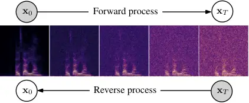

SGM  
score-based generative model

SNR  
signal-to-noise ratio

GAN  
generative adversarial network

VAE  
variational autoencoder

DDPM  
denoising diffusion probabilistic model

STFT  
short-time Fourier transform

iSTFT  
inverse short-time Fourier transform

SDE  
stochastic differential equation

ODE  
ordinary differential equation

OU  
Ornstein-Uhlenbeck

VE  
Variance Exploding

DNN  
deep neural network

PESQ  
Perceptual Evaluation of Speech Quality

SE  
speech enhancement

T-F  
time-frequency

ELBO  
evidence lower bound

WPE  
weighted prediction error

PSD  
power spectral density

RIR  
room impulse response

SNR  
signal-to-noise ratio

LSTM  
long short-term memory

POLQA  
Perceptual Objective Listening Quality Analysis

SDR  
signal-to-distortion ratio

ESTOI  
Extended Short-Term Objective Intelligibility

ELR  
early-to-late reverberation ratio

TCN  
temporal convolutional network

DRR  
direct-to-reverberant ratio

NFE  
number of function evaluations

RTF  
real-time factor

MOS  
mean opinion scores

# Speech Enhancement and Dereverberation with Diffusion-based Generative Models

Julius
Richter [](https://orcid.org/0000-0002-7870-4839)
   Simon
Welker [](https://orcid.org/0000-0002-6349-8462)
   Jean-Marie
Lemercier [](https://orcid.org/0000-0002-8704-7658)
   Bunlong
Lay [](https://orcid.org/0000-0002-0847-7896)
   Timo
Gerkmann [](https://orcid.org/0000-0002-8678-4699)
^(†)^(†)thanks: This work has been funded by the German Research
Foundation (DFG) in the transregio project Crossmodal Learning (TRR
169), DASHH (Data Science in Hamburg - HELMHOLTZ Graduate School for the
Structure of Matter) with the Grant-No. HIDSS-0002, and the Federal
Ministry for Economic Affairs and Climate Action, project 01MK20012S,
AP380. We would like to thank J. Berger and Rohde&Schwarz SwissQual AG
for their support with POLQA.^(†)^(†)thanks: Simon Welker is with the
Signal Processing Group, Department of Informatics, Universität Hamburg,
22527 Hamburg Germany, and with the Center for Free-Electron Laser
Science, DESY, 22607 Hamburg, Germany (e-mail:
simon.welker@uni-hamburg.de). The other authors are all with the Signal
Processing Group, Department of Informatics, Universität Hamburg, 22527
Hamburg Germany (e-mail: {julius.richter; jeanmarie.lemercier;
bunlong.lay; timo.gerkmann}@uni-hamburg.de).

###### Abstract

In this work, we build upon our previous publication and use
diffusion-based generative models for speech enhancement. We present a
detailed overview of the diffusion process that is based on a stochastic
differential equation and delve into an extensive theoretical
examination of its implications. Opposed to usual conditional generation
tasks, we do not start the reverse process from pure Gaussian noise but
from a mixture of noisy speech and Gaussian noise. This matches our
forward process which moves from clean speech to noisy speech by
including a drift term. We show that this procedure enables using only
30 diffusion steps to generate high-quality clean speech estimates. By
adapting the network architecture, we are able to significantly improve
the speech enhancement performance, indicating that the network, rather
than the formalism, was the main limitation of our original approach. In
an extensive cross-dataset evaluation, we show that the improved method
can compete with recent discriminative models and achieves better
generalization when evaluating on a different corpus than used for
training. We complement the results with an instrumental evaluation
using real-world noisy recordings and a listening experiment, in which
our proposed method is rated best. Examining different sampler
configurations for solving the reverse process allows us to balance the
performance and computational speed of the proposed method. Moreover, we
show that the proposed method is also suitable for dereverberation and
thus not limited to additive background noise removal. Code and audio
examples are available online¹¹ 1
[https://github.com/sp-uhh/sgmse](https://github.com/sp-uhh/sgmse).

###### Index Terms: 

speech enhancement, dereverberation, diffusion models, score-based
generative models, score matching.

## I Introduction

Speech enhancement aims to recover clean speech signals from audio
recordings that are impacted by acoustic noise or reverberation \[1\].
To this end, computational approaches often exploit the different
statistical properties of the target and interference signals \[2\].
Machine learning algorithms can be used to extract these statistical
properties by learning useful representations from large datasets. A
wide class of methods employed for speech enhancement are discriminative
models that learn to directly map noisy speech to the corresponding
clean speech target \[3\]. Common approaches include tf (tf) masking
\[4\], complex spectral mapping \[5\], or operating directly in the time
domain \[6\]. These supervised methods are trained with a variety of
clean/noisy speech pairs containing multiple speakers, different noise
types, and a large range of snr. However, it is nearly impossible to
cover all possible acoustic conditions in the training data to guarantee
generalization. Furthermore, some discriminative approaches have been
shown to result in unpleasant speech distortions that outweigh the
benefits of noise reduction \[7\].

The use of generative models for speech enhancement, on the other hand,
follows a different paradigm, namely to learn a prior distribution over
clean speech data. Thus, they aim at learning the inherent properties of
speech, such as its spectral and temporal structure. This prior
knowledge can be used to make inferences about clean speech given noisy
or reverberant input signals that are assumed to lie outside the learned
distribution. Several approaches follow this idea and utilized deep
generative models for speech enhancement \[8, 9, 10, 11, 12, 13, 14, 15,
16, 17\]. Among them are methods that employ likelihood-based models for
explicit density estimation such as the vae (vae) \[18\], or leverage
gan \[19\] for implicit density estimation. Bando et al. propose a
statistical framework using a VAE trained in an unsupervised fashion to
learn a prior distribution over clean speech \[9\]. At test time they
combine the speech model with a low-rank noise model to infer the signal
variances of speech and noise to build a Wiener filter for denoising.
However, since the VAE is trained with clean speech only, the inference
model (i.e. the encoder) that predicts the latent variable remains
sensitive to noise. This has been shown to cause the generative speech
enhancement method to produce speech-like sounds although only noise is
present \[9\]. To mitigate this, it has been proposed to make the
inference model robust to noisy speech by training on labeled data in a
supervised manner \[14, 15\], or by disentangling the latent variable
from high-level information such as speech activity which can be
estimated by supervised classifiers \[12, 13\]. Nevertheless, VAE-based
speech enhancement methods remain limited due to the dimensionality
reduction in the latent layer and the combined use of a linear noise
model based on non-negative matrix factorization \[9, 10, 11, 12, 13,
14, 15\].

More recently, a new class of generative models called diffusion-based
generative models, has been introduced to the task of speech enhancement
\[20, 21, 22, 23\]. Diffusion-based generative models, or simply
_diffusion models_, are inspired by non-equilibrium thermodynamics and
exist in several variants \[24, 25, 26\]. All of them share the idea of
gradually turning data into noise, and training a neural network that
learns to invert this process for different noise scales. More
specifically, the inference model is a fixed Markov chain, that slowly
transforms the data into a tractable prior, such as the standard normal
distribution. The generative model is another Markov chain that is
trained to revert this process iteratively \[25\]. Therefore, diffusion
models can be considered as deep latent variable models and have similar
properties to vae, with the crucial difference that the inference model
is not trained and that the latent variables have the same
dimensionality as the input. This has the advantage of not relying on
surrogate objectives to approximate maximum likelihood training such as
the evidence lower bound and enforces no strong restrictions on the
model architecture. Recently, diffusion models have been connected with
score matching \[27\] by looking at the sde (sde) associated with the
discrete-time Markov chain \[28\]. The forward process can be inverted,
resulting in a corresponding reverse sde which depends only on the score
function of the perturbed data \[29\]. Using this continuous-time sde
formalism creates the opportunity to design novel diffusion processes
that support the underlying generation task. In contrast to discrete
Markov chains, it also allows the use of general-purpose sde solvers to
numerically integrate the reverse process for sampling.

Concerning the application of diffusion models for speech enhancement,
there exist currently two approaches that differ conceptually in how the
diffusion process is used. One approach is based on speech
re-generation, i.e. a diffusion-based vocoder network is used to
synthesize clean speech by sampling from an unconditional prior, while a
conditioner network takes noisy speech as input and performs the core
part of denoising by providing enhanced speech representations to the
vocoder network \[30, 23\]. An auxiliary loss is introduced for the
conditioner network to facilitate its ability to estimate clean speech
representations \[23\]. The second approach, on the other hand, does not
require any auxiliary loss and is not using two separate models for
generation and denoising. Instead, it models the corruption of clean
speech by environmental background noise or reverberation directly
within the forward diffusion process, so that reversing this process
would consequently result in generating clean speech. This has been
proposed as a discrete diffusion process for time-domain speech signals
\[21\], and as a continuous sde-based diffusion process in the complex
spectrogram domain \[22\]. Interestingly, the original denoising score
matching objective \[31\], which is to estimate the white Gaussian noise
in the perturbed data, is essentially reminiscent of the goal of speech
enhancement, which is to remove interfering noise or reverberation from
speech signals. However, under realistic conditions, the environmental
noise or reverberation may not match the assumption of stationary white
Gaussian noise. Therefore, it was proposed to include real noise
recordings in the diffusion process, either by linearly interpolating
between clean and noisy speech along the process \[21\], or by defining
such a transformation within the drift term of an sde \[22\]. The choice
of linear interpolation in \[21\], however, implies that the trained dnn
(dnn) must explicitly estimate a portion of environmental noise at each
step in the reverse process. This can be seen in the resulting objective
function \[21, Eq. (21)\] which exhibits characteristics of a
discriminative learning task. In contrast, an sde-based formulation
results in a pure generative objective function \[22, Eq. (9)\] and
avoids any prior assumptions on the noise distribution.

Nonetheless, note that diffusion-based speech enhancement methods,
unlike the VAE-based method described above, are not counted as
unsupervised methods, since labeled data (i.e. clean and noisy speech
pairs) are used for training. However, the learning objective remains
generative in nature which is to learn a prior for clean speech per se
rather than a direct mapping from noisy to clean speech. In fact,
supervision is only exploited to learn the conditional generation of
clean speech when noisy speech is given. Thus, current diffusion-based
models for speech enhancement, such as \[23, 21, 22\], can be considered
as conditional generative models trained in a supervised manner.

In this work, we build upon our previous publication which defines the
diffusion process in the complex stft (stft) domain \[22\]. We present a
comprehensive theoretical review of the underlying score-based
generative model and include an expanded discussion on the conditional
generation process which is based on the continuous-time sde formalism.
By using a network architecture developed in the image processing
community \[28\], in the work at hand we significantly improve
performance in comparison to our previous model \[22\]. This indicates
that the network, rather than the formalism, was the main limitation of
our original approach. In an extensive cross-dataset evaluation, we show
that the improved method can compete with recent discriminative models
and achieves better generalization when evaluating on a different corpus
than used for training. To confirm the effectiveness of the proposed
method on non-simulated data, we perform an instrumental evaluation with
real-world noisy recordings using non-intrusive metrics. We complement
the results with a listening experiment, in which our proposed method is
rated best. Interestingly, using the improved network, we show that the
proposed method is also suitable for dereverberation when an individual
model is trained on simulated reverberant data. Thus, the method is not
limited to the removal of additive background noise and can also be
applied to non-additive corruptions such as reverberation or, as shown
in \[32\], for bandwidth extension. Furthermore, we investigate
different sampler configurations for solving the reverse process which
reveals a trade-off between the performance and computational speed of
the proposed method.

We summarize our major contributions as follows. Regarding the novelty
with respect to Song et al. \[28\], we introduce a drift term to the sde
to achieve the required task adaptation for reconstruction problems and
furthermore apply the diffusion process and score matching objective to
a complex data representation. Also note that the approach in \[28\] is
not explicitly trained on reconstruction tasks and the application is
different from ours. Regarding the novelty with respect to our previous
publication \[22\], we use an improved network architecture and increase
the performance significantly. Moreover, we include an extended
theoretical discussion and investigate different sampler configurations.
Finally, we expand the evaluation by means of a cross-dataset
evaluation, an instrumental evaluation with real-world noisy recordings,
and a listening experiment.

## II Method: Score-based Generative Model for Speech Enhancement (SGMSE)

In this section, we motivate and describe in detail the approach of
using score-based generative models for speech enhancement, as proposed
in our previous publication \[22\].

### II-A Data representation

We represent our data in the complex-valued stft domain, as it has been
observed that both real and imaginary parts of clean speech spectrograms
exhibit clear structure and are therefore amenable to deep learning
models \[4\]. Following the approach of complex spectral mapping \[5\],
we use our conditional generative model to estimate the clean real and
imaginary spectrograms from the noisy ones.

The use of complex coefficients as data representation allows the
definition of the diffusion process in the complex spectral domain, in
which additive Gaussian noise corresponds to the signal model used for
the denoising task. This relates to traditional STFT-based methods,
where spectral coefficients are usually assumed to be complex Gaussian
distributed and mutually independent \[1, 2\]. Statistical approaches
often consider an additive signal model assuming that the speech process
and the noise process are realizations of stochastic processes that are
statistically independent. Observing that the overall noise process is a
sum of several independent sources, the central limit theorem ensures
that the observed noise process tends to be Gaussian \[1\].

Although it would be theoretically possible to define the diffusion
process in the magnitude domain, additive Gaussian noise would not
relate to the signal model anymore. This becomes evident considering
that in the magnitude domain, additive Gaussian noise could result in
negative amplitudes which are physically not defined.

Thus, we operate on complex spectrograms that are elements of
$`\mathbb{C}^{K\times F}`$, where $`K`$ denotes the number of time
frames dependent on the audio length, and $`F`$ represents the number of
frequency bins. To compensate for the typically heavy-tailed
distribution of stft speech amplitudes \[33\], we apply an amplitude
transformation

```math
\tilde{c}=\beta|c|^{\alpha}\mathrm{e}^{i\angle(c)} \tag{1}
```

to all complex stft coefficients $`c`$, where $`\angle(\cdot)`$
represents the angle of a complex number, $`\alpha\in(0,1]`$ is a
compression exponent which brings out frequency components with lower
energy (e.g. fricative sounds of unvoiced speech) \[34\], and
$`\beta\in\mathbb{R}_{+}`$ is a simple scaling factor to normalize
amplitudes roughly to within $`[0,1]`$. Such a compression has been
argued to be perceptually more meaningful in speech enhancement \[35,
36\], and the transformation ensures that the neural network operates on
consistently scaled inputs with respect to the Gaussian diffusion noise
\[25\].

### II-B Stochastic Process

The tasks at hand, speech enhancement and dereverberation, can be
considered as conditional generation tasks: Given the corrupted
noisy/reverberant speech, generate clean speech by using a conditional
generative model. Most previously published diffusion-based generative
models are adapted to such conditional tasks either through explicit
conditioning channels added to the dnn \[37, 38\], or through combining
an unconditionally trained score model with a separate model (such as a
classifier) that provides conditioning in the form of a gradient \[39,
28\]. With our method, we explore a third possibility, which is to
incorporate the particular task directly into the forward and reverse
processes of a diffusion-based generative model.

#### Forward Process

Following Song et al. \[28\], we design a stochastic diffusion process
$`\{\mathbf{x}_{t}\}_{t=0}^{T}`$ that is modeled as the solution to a
linear sde of the general form,

```math
\mathrm{d}{\mathbf{x}_{t}}=\mathbf{f}(\mathbf{x}_{t},\mathbf{y})\mathrm{d}{t}+g(t)\mathrm{d}{\mathbf{w}}\,, \tag{2}
```

where $`\mathbf{x}_{t}`$ is the current process state, $`t\in[0,T]`$ a
continuous time-step variable describing the progress of the process
(not to be confused with the time index of any signal in the time or tf
domain), $`\mathbf{y}`$ the noisy or reverberant speech, and
$`\mathbf{w}`$ denotes a standard Wiener process. The vector-valued
function $`\mathbf{f}(\mathbf{x}_{t},\mathbf{y})`$ is referred to as the
_drift coefficient_, while $`g(t)`$ is called the _diffusion
coefficient_ and controls the amount of Gaussian white noise injected at
each time-step. Note that different to Song et al. \[28\], our drift
term is now a function of $`\mathbf{y}`$, by which we tailor the
proposed sde to reconstruction tasks. The process is defined for each tf
bin independently. Thus, the variables in bold are assumed to be vectors
in $`\mathbb{C}^{d}`$ with $`d=KF`$ containing the coefficients of a
flattened complex spectrogram.



Fig. 1: Diffusion process on a spectrogram: In the forward process noise
is gradually added to the clean speech spectrogram $`\mathbf{x}_{0}`$,
while the reverse process learns to generate clean speech in an
iterative fashion starting from the corrupted signal $`\mathbf{x}_{T}`$.

The forward process in Eq. (2) turns a clean speech sample
$`\mathbf{x}_{0}`$ into a corrupted sample $`\mathbf{x}_{T}`$ by
gradually adding noise from the Wiener process, as illustrated in Fig.

1. To account for the intended task adaptation of speech enhancement or
   dereverberation, we propose a drift term that ensures the mean of the
   process moving from clean speech $`\mathbf{x}_{0}`$ to noisy/reverberant
   speech $`\mathbf{y}`$. In particular, we define the drift coefficient
   $`\mathbf{f}`$ and the diffusion coefficient $`g`$ as

```math
\mathbf{f}(\mathbf{x}_{t},\mathbf{y}):=\gamma(\mathbf{y}-\mathbf{x}_{t})\,, \tag{3}
```

```math
g(t):=\sigma_{\text{min}}\left(\frac{\sigma_{\text{max}}}{\sigma_{\text{min}}}\right)^{t}\sqrt{2\log\left(\frac{\sigma_{\text{max}}}{\sigma_{\text{min}}}\right)}\,, \tag{4}
```

where $`\gamma`$ is a constant called _stiffness_ controlling the
transition from $`\mathbf{x}_{0}`$ to $`\mathbf{y}`$, and
$`\sigma_{\text{min}}`$ and $`\sigma_{\text{max}}`$ are parameters
defining the noise schedule of the Wiener process. Note that we choose
the diffusion coefficient identical to that of the so-called _Variance
Exploding sde_ from Song et al. \[28\]. Our novel contribution lies in
the modified drift term, by which the intended task adaptation is
achieved.

#### Reverse Process

Following Anderson \[29\] and Song et al. \[28\], the SDE in Eq. (2) has
an associated _reverse sde_,

```math
\hskip-1.90002pt\mathrm{d}{\mathbf{x}_{t}}=\left[\mathbf{f}(\mathbf{x}_{t},\mathbf{y})-g(t)^{2}\nabla_{\mathbf{x}_{t}}\log p_{t}(\mathbf{x}_{t}|\mathbf{y})\right]\mathrm{d}{t}+g(t)\mathrm{d}{\bar{\mathbf{w}}}\,, \tag{5}
```

where the _score_
$`\nabla_{\mathbf{x}_{t}}\log p_{t}(\mathbf{x}_{t}|\mathbf{y})`$ is the
term to be approximated by a dnn which is therefore called a _score
model_. We denote the score model as
$`\mathbf{s}_{\theta}(\mathbf{x}_{t},\mathbf{y},t)`$, which is
parameterized by a set of parameters $`\theta`$ and receives the current
process state $`\mathbf{x}_{t}`$, the noisy speech $`\mathbf{y}`$, and
the current time-step $`t`$ as an input. Finally, by substituting the
score model into the reverse sde in Eq. (5), we obtain the so-called
_plug-in reverse sde_ \[40\],

```math
\mathrm{d}{\mathbf{x}_{t}}=\left[\mathbf{f}(\mathbf{x}_{t},\mathbf{y})-g(t)^{2}\mathbf{s}_{\theta}(\mathbf{x}_{t},\mathbf{y},t)\right]\mathrm{d}{t}+g(t)\mathrm{d}{\bar{\mathbf{w}}}\,, \tag{6}
```

which can be solved by various solver procedures, to be discussed in
detail in Sec. III.

For inference, we assume that a trained score model
$`\mathbf{s}_{\theta}`$ is given, which approximates the true score for
all $`t\in[0,T]`$. We can then generate clean speech $`\mathbf{x}_{0}`$
conditioned on the noisy or reverberant speech $`\mathbf{y}`$ by solving
the plug-in reverse sde in Eq. (6). To determine the initial condition
of the reverse process at $`t=T`$, we sample

```math
\mathbf{x}_{T}\sim\mathcal{N}_{\mathbb{C}}(\mathbf{x}_{T};\mathbf{y},\sigma(T)^{2}\mathbf{I}), \tag{7}
```

which is a strongly corrupted version of the noisy speech
$`\mathbf{y}`$, as illustrated in Fig. 1. The denoising process which
solves the task of speech enhancement or dereverberation is then based
on iterating through the reverse process starting at $`t=T`$ and ending
at $`t=0`$.

### II-C Training objective

Next, we derive the objective function used for training the score model
$`\mathbf{s}_{\theta}`$. Since the sde in Eq. (2) describes a Gaussian
process, the mean and variance of the process state $`\mathbf{x}_{t}`$
can be derived when its initial conditions are known \[41\]. This allows
for direct sampling of $`\mathbf{x}_{t}`$ at an arbitrary time step
$`t`$ given $`\mathbf{x}_{0}`$ and $`\mathbf{y}`$ by using the so-called
_perturbation kernel_,

```math
p_{0t}(\mathbf{x}_{t}|\mathbf{x}_{0},\mathbf{y})=\mathcal{N}_{\mathbb{C}}\left(\mathbf{x}_{t};\boldsymbol{\mu}(\mathbf{x}_{0},\mathbf{y},t),\sigma(t)^{2}\mathbf{I}\right), \tag{8}
```

where $`\mathcal{N}_{\mathbb{C}}`$ denotes the circularly-symmetric
complex normal distribution and $`\mathbf{I}`$ denotes the identity
matrix. We utilize Eqs. (5.50, 5.53) in Särkkä & Solin \[41\] to
determine closed-form solutions for the mean

```math
\boldsymbol{\mu}(\mathbf{x}_{0},\mathbf{y},t)=\mathrm{e}^{-\gamma t}\mathbf{x}_{0}+(1-\mathrm{e}^{-\gamma t})\mathbf{y}\,, \tag{9}
```

and the variance

```math
\sigma(t)^{2}=\frac{\sigma_{\text{min}}^{2}\left(\left(\nicefrac{{\sigma_{\text{max}}}}{{\sigma_{\text{min}}}}\right)^{2t}-\mathrm{e}^{-2\gamma t}\right)\log(\sfrac{\sigma\submax}{\sigma\submin})}{\gamma+\log(\sfrac{\sigma\submax}{\sigma\submin})}\,. \tag{10}
```

Vincent \[31\] shows that fitting the score model
$`\mathbf{s}_{\theta}`$ to the score of the perturbation kernel
$`\nabla_{\mathbf{x}_{t}}\log p_{0t}(\mathbf{x}_{t}|\mathbf{x}_{0},\mathbf{y})`$
is equivalent to implicit and explicit score matching \[27\] under some
regularity conditions. This technique is called _denoising score
matching_ and essentially results in estimating

```math
\displaystyle\hskip-1.49994pt\nabla_{\mathbf{x}_{t}} \displaystyle\log p_{0t}(\mathbf{x}_{t}|\mathbf{x}_{0},\mathbf{y})=\nabla_{\mathbf{x}_{t}}\log\left[|2\pi\sigma\mathbf{I}|^{-\frac{1}{2}}\mathrm{e}^{-\frac{\|\mathbf{x}_{t}-\boldsymbol{\mu}\|^{2}_{2}}{2\sigma^{2}}}\right] \tag{11}
```

```math
\displaystyle=\nabla_{\mathbf{x}_{t}}\log|2\pi\sigma(t)\mathbf{I}|^{-\frac{1}{2}}-\nabla_{\mathbf{x}_{t}}\frac{\|\mathbf{x}_{t}-\boldsymbol{\mu}(\mathbf{x}_{0},\mathbf{y},t)\|^{2}_{2}}{2\sigma(t)^{2}} \tag{12}
```

```math
\displaystyle=-\frac{\mathbf{x}_{t}-\boldsymbol{\mu}(\mathbf{x}_{0},\mathbf{y},t)}{\sigma(t)^{2}}\,, \tag{13}
```

where for simplicity we derived the score for the real and imaginary
part of the complex normal distribution in Eq. (8), assuming they are
independently distributed and each follows a real-valued multivariate
normal distribution. Note that Eq. (13) involves division by
$`\sigma(t)^{2}`$, which has very small numerical values (including 0)
around $`t=0`$. To avoid undefined values and numerical instabilities,
we thus introduce a small minimum process time $`t_{\varepsilon}`$, as
done previously in the literature \[28\].

At each training step, the procedure can then be described as
follows: 1) sample a random $`t\sim\mathcal{U}[t_{\varepsilon},T]`$, 2)
sample $`(\mathbf{x}_{0},\mathbf{y})`$ from the dataset, 3) sample
$`\mathbf{z}\sim\mathcal{N}_{\mathbb{C}}(\mathbf{z};0,\mathbf{I})`$, and 4) sample $`\mathbf{x}_{t}`$ from Eq. (8) by effectively computing

```math
\displaystyle\mathbf{x}_{t}=\boldsymbol{\mu}(\mathbf{x}_{0},\mathbf{y},t)+\sigma(t)\mathbf{z}. \tag{14}
```

After passing $`(\mathbf{x}_{t},\mathbf{y},t)`$ to the score model, the
final loss is an unweighted $`L_{2}`$ loss between the model output and
the score of the perturbation kernel. By substituting Eq. (14) into
Eq. (13), the overall training objective becomes,

```math
\argmin_{\theta}\mathbb{E}_{t,(\mathbf{x}_{0},\mathbf{y}),\mathbf{z},\mathbf{x}_{t}|(\mathbf{x}_{0},\mathbf{y})}\left[\norm{\mathbf s_\theta(\mathbf x_t, \mathbf y, t) + \frac{\mathbf z}{\sigma(t)}}_{2}^{2}\right], \tag{15}
```

where the expectation is approximated by sampling all random variables
at each training step as described above. Note that due to the
cancellation of $`\boldsymbol{\mu}(\mathbf{x}_{0},\mathbf{y},t)`$, the
loss function does not explicitly involve $`\mathbf{y}`$, only as an
input to the score model. This means that the score model is not tasked
with estimating any portion of the environmental noise directly.
Finally, the minimization is achieved by optimizing the parameters
$`\theta`$ using stochastic gradient descent.

### II-D Interpretation and limitations

Let $`p_{t}`$ be the distribution of the perturbed data
$`\mathbf{x}_{t}`$ from the diffusion process for a given dataset. Then
its time evolution can be thought of as a continuum of distributions
$`\{p_{t}\}_{t\in[0,T]}`$ which is determined by the drift and the
diffusion coefficient of the forward sde. For fixed $`\mathbf{x}_{0}`$
and $`\mathbf{y}`$, this time evolution can be described in close form
using Eq. (8), which we illustrate in Fig. 2 for a one-dimensional case.
In the reverse process, the dnn has the task of learning this continuous
family of distributions starting from $`\tilde{p}_{T}`$ as defined in
Eq. (7). Due to the exponential increase of the diffusion coefficient in
the forward process with initial condition $`\sigma(0)^{2}=0`$ the
distribution $`p_{0}`$ essentially corresponds to the clean speech
distribution, whereas the terminating distribution $`p_{T}`$ is a
strongly corrupted version of the noisy speech distribution. The
particular characteristics in each noisy speech sample are strongly
masked by the Gaussian white noise at $`t=T`$. Therefore, by learning
the reverse process, the generative model learns a strong prior
$`p_{0}`$ on clean speech, whereas the forward process terminates in a
strongly corrupted distribution of the noisy speech, used as a weakly
informative prior for generation. In Fig. 2, we simulate five sample
paths from the diffusion process. All sample paths of the forward
process start exactly at $`\mathbf{x}_{0}`$ but exhibit starkly
different trajectories at large $`t`$. The reverse process should then
turn a high-variance sample $`\mathbf{x}_{T}`$ back into a low-variance
estimate of $`\mathbf{x}_{0}`$.

Eq. (9) indicates that the mean $`\boldsymbol{\mu}`$ of the forward
process exponentially decays from $`\mathbf{x}_{0}`$ to $`\mathbf{y}`$,
which can also be seen in Fig. 2 (thick black line). However, for finite
$`t`$ it does not fully reach the corrupted speech $`\mathbf{y}`$
(dashed green line), particularly we have
$`\boldsymbol{\mu}(\mathbf{x}_{0},\mathbf{y},T)\neq\mathbf{y}`$. Thus,
the final distribution of the forward process $`p_{T}`$ exhibits a
slight mismatch to the initial distribution of the reverse process
$`\tilde{p}_{T}`$. We can make this mismatch arbitrarily small by either
choosing a high stiffness parameter $`\gamma`$ or by increasing
$`\sigma_{\text{max}}`$ to further smooth the density functions of both
distributions. However, increasing $`\gamma`$ would bring the mean close
to $`\mathbf{y}`$ within a short time of the forward process, which may
lead to an unstable reverse process because only the last steps are
concerned with removing environmental noise. This effect can be seen in
Fig. 2 (right plot), where we plot the snr of the process mean
$`\boldsymbol{\mu}`$ averaged over 256 randomly selected files from the
dataset for three values of $`\gamma`$. Note that we calculated the snr
in the time domain as the ratio of the power of clean speech to the
power of environmental noise after inverting the non-linear amplitude
transformation of Eq. (1). We see that while for $`\gamma=5`$ the
mismatch at $`t=T`$ becomes virtually zero, the change in snr occurs
mainly in the first half of the process. For $`\gamma=0.5`$, on the
other hand, the mismatch is already more than 10 dB. However, the slope
in the snr is still apparent at the end of the process. Therefore, there
is a trade-off to consider when choosing $`\gamma`$ which depends on the
dataset to be used. Increasing $`\sigma_{\text{max}}`$ would come at the
cost of more reverse iterations since the more white Gaussian noise is
added, the less high-level information about the structure of the speech
is preserved to serve as a guide in the reverse process. In the
experiments, we choose a set of parameters based on empirical
hyperparameter optimization.

Fig. 2: (Left) The forward and reverse process illustrated with a single
scalar variable. The mean $`\boldsymbol{\mu}`$ (thick black line) of the
forward process exponentially decays from clean speech
$`\mathbf{x}_{0}`$ (blue) towards noisy speech $`\mathbf{y}`$ (green),
and the standard deviation (shaded gray region) increases exponentially.
The reverse process moves back to $`\mathbf{x}_{0}`$, starting from a
slightly mismatched distribution $`\tilde{p}_{T}`$ which is centered
around $`\mathbf{y}`$ rather than $`\mathbf{x}_{T}`$. Sample paths from
both processes are shown as thin black lines. (Right) Time evolution of
the snr of the mean $`\boldsymbol{\mu}`$ (black) with respect to the snr
of $`\mathbf{y}`$ (green) for three different values of $`\gamma`$.

## III Numerical SDE Solvers

There exist several computational methods to find numerical solutions
for sde, which are based on an approximation to discrete time steps. To
this end, the interval $`[0,T]`$ is partitioned into $`N`$ equal
subintervals of width $`\Delta t=T/N`$, which approximates the
continuous formulation into the discrete reverse process
$`\{\mathbf{x}_{T},\mathbf{x}_{T-\Delta t},\dots,\mathbf{x}_{0}\}`$. A
common single-step method for solving this discretization is the
Euler-Maruyama method. In each iteration step, the method refers to a
previous state of the process and utilizes the drift and the Brownian
motion to determine the current state.

In this work, we employ so-called predictor-corrector (PC) samplers
proposed by Song et al. \[28\], which combine single-step methods for
solving the reverse sde with numerical optimization approaches such as
annealed Langevin Dynamics \[26\]. PC samplers consist of two parts, a
predictor and a corrector. The predictor can be any single-step method
that aims to solve the reverse process by iterating through the reverse
sde. After each iteration step of the predictor, the current state of
the process is refined by the corrector. The correction is based on
Markov chain Monte Carlo sampling and can be understood as a stochastic
gradient ascent optimizer that adds at each iteration step a small
amount of noise after taking a step in the direction of the estimated
score. One possible intuition about the use of stochastic correctors is
that they allow the process state to escape local minima by the use of
stochasticity. However, Karras et al. \[42\] have recently argued that
in the reverse process, stochasticity is only necessary to correct for
numerical truncation errors of the predictor, a need that could be
effectively circumvented by further improving the quality of the score
model and predictor.

Another numerical way of approximating the reverse process is by solving
the corresponding _probability flow ode (ode)_,

```math
\mathrm{d}{\mathbf{x}_{t}}=\left[\mathbf{f}(\mathbf{x}_{t},\mathbf{y})-\frac{1}{2}g(t)^{2}\mathbf{s}_{\theta}(\mathbf{x}_{t},\mathbf{y},t)\right]\mathrm{d}{t}\,, \tag{16}
```

which is the associated _deterministic process_ of the stochastic
reverse sde in Eq. (6). It can be shown that for each diffusion process,
there exists an ode that describes the same marginal probability density
$`p_{t}(\mathbf{x}_{t})`$ \[28\]. Enhancing the noisy or reverberant
mixture is then based on solving this ODE. In Sec. V-E, we also evaluate
and compare this class of solvers for our task, specifically employing
the Runge-Kutta method of fourth order with an error estimator of fifth
order \[43\].

## IV Network Architecture

(a) Feature maps at multiple resolutions.

(b) Residual block.

Fig. 3: NCSN++ network architecture used as a score model
$`\mathbf{s}_{\theta}`$: The architecture is based on a multi-resolution
U-Net structure containing skip connections and an additional
progressive growing path as shown in (a). Each up- and downsampling
layer and the bottleneck layer consist of multiple residual blocks in
series which are illustrated in (b).

We utilize the _Noise Conditional Score Network_ (NCSN++) architecture
\[28\] for the score model $`\mathbf{s}_{\theta}`$ and adapt it for the
use of complex spectrograms. For this purpose, we consider the real and
imaginary parts of the complex input as separate channels, since the
original network only works with real-valued numbers. Estimating both
the real and imaginary parts of the score allows to generate complex
spectrograms of clean speech.

The network is based on a multi-resolution U-Net structure, which has
been experimentally shown to be powerful for tasks such as generation
and segmentation \[44\]. In Fig. 3(a), we illustrate the architecture by
showing the feature maps at each resolution, indicating their spatial
dimension and the corresponding number of channels. The transformations
between the feature maps are represented by arrows, where the color of
the arrow specifies the type of transformation (see the legend on top).
We use Conv2D layers with a 3x3 kernel and stride 1 as input and output
layers, and 1x1 Conv2D layers to aggregate information from the
progressive growing path that we describe later. Up- and downsampling
layers are based on residual network blocks which are taken from the
BigGAN architecture \[45\], shown in Fig. 3(b). A residual block
consists of Conv2D layers with the same configuration as above, group
normalization \[46\], up- or downsampling with finite impulse response
(FIR) filters \[47\], and the Swish activation function \[48\]. Each
upsampling layer consists of three residual blocks and each downsampling
layer of two residual blocks in series with the last block performing
the up- or downsampling. Global attention mechanisms \[49\] are added at
a resolution of $`16\times 16`$ and in the bottleneck layer to better
learn global dependencies within the feature maps.

To make the model time-dependent, information about the current
progression of the diffusion process is fed into the network
architecture. A common practice is to use Fourier-embeddings \[49\],
i.e., a learned projection that maps the scalar time coordinate $`t`$ to
an $`M`$-dimensional vector $`\mathbf{t}_{\text{emb}}`$ that is
integrated into every residual block as can be seen in Fig. 3(b).

In addition to the main feature extraction path of the multi-resolution
U-Net structure, the network incorporates a so-called progressive
growing of the input which is seen at the top of Fig. 3(a). The idea is
to provide a downsampled version of the input to every feature map in
the contracting path, which has been successful in stabilizing
high-resolution image generation \[50\]. Note that the downsampling
operation in the progressive growing use shared weights for each
resolution. The same procedure is also used in the expansive path where
a progressive growing of the output is informed by the feature maps at
each resolution, resulting in the final score estimate.

## V Experiments

In this section, we describe the experimental setup for our speech
enhancement and speech dereverberation experiments using the proposed
method.

### V-A Datasets

For the evaluation of the speech enhancement task we use two datasets,
the WSJ0-CHiME3 dataset and the VB-DMD dataset, which are described
below. The use of two datasets allows cross-dataset evaluation, i.e. the
test is performed on the other dataset than the one used for training.
This mismatched condition reveals information about how well the method
generalizes to unseen data with different characteristics such as
distinct noise types or different recording conditions. Moreover, to
train and evaluate our proposed method on the dereverberation task, we
create the WSJ0-REVERB dataset, which is also described below.

#### WSJ0-CHiME3

We create the WSJ0-CHiME3 dataset using clean speech utterances from the
Wall Street Journal (WSJ0) dataset \[51\] and noise signals from the
CHiME3 dataset \[52\]. The mixture signal is created by randomly
selecting a noise file and adding it to a clean utterance. Each
utterance is used only once, and the snr is sampled uniformly between 0
and 20 dB for the training, validation, and test set.

#### VB-DMD

We use the publicly available VoiceBank-DEMAND dataset (VB-DMD) \[53\]
which is often used as a benchmark for single-channel speech
enhancement. The utterances are artificially contaminated with eight
real-recorded noise samples from the DEMAND database \[54\] and two
artificially generated noise samples (babble and speech shaped) at snr
of 0, 5, 10, and 15 dB. The test utterances are mixed with different
noise samples at snr levels of 2.5, 7.5, 12.5, and 17.5 dB. We split the
training data into a training and validation set using speakers ‘‘p226’’
and ‘‘p287’’ for validation.

#### WSJ0-REVERB

To create the WSJ0-REVERB dataset, we use clean speech data from the
WSJ0 dataset \[51\] and convolve each utterance with a simulated RIR
(RIR). We use the pyroomacoustics engine \[55\] to simulate the RIR. The
reverberant room is modeled by sampling uniformly a $`\mathrm{T_{60}}`$
between 0.4 and 1.0 seconds. A dry version of the room is generated with
the same geometric parameters but a fixed absorption coefficient of
0.99, to generate the corresponding anechoic target. The resulting
average DRR (DRR) is around -9 dB.

### V-B Instrumental evaluation metrics

To evaluate the performance of the proposed method we use standard
metrics which we will describe in detail below. Metrics (a)-(d) employ
full reference algorithms that rate the processed signal in relation to
the clean reference signal using conventional digital signal analysis.
On the other hand, metrics (e)-(g) are non-intrusive metrics that can be
used to evaluate real recordings when the clean reference is
unavailable.

#### POLQA

The Perceptual Objective Listening Quality Analysis (POLQA) is an ITU-T
standard that includes a perceptual model for predicting speech quality
\[56\]. The POLQA score takes values from 1 (poor) to 5 (excellent) as
usual for mos (mos).

#### PESQ

The Perceptual Evaluation of Speech Quality (PESQ) is used for objective
speech quality testing and is standardized in ITU-T P.862 \[57\].
Although it is the predecessor of POLQA, it is still widely used in the
research community. The PESQ score lies between 1 (poor) and 4.5
(excellent) and there exist two variants, namely wideband PESQ and
narrowband PESQ denoted as $`\text{PESQ}_{\text{nb}}`$.

#### ESTOI

The Extended Short-Time Objective Intelligibility (ESTOI) is an
instrumental measure for predicting the intelligibility of speech
subjected to various kinds of degradation \[58\]. The metric is
normalized and lies between 0 and 1, with higher values indicating
better intelligibility.

#### SI-SDR, SI-SIR, SI-SAR

Scale-Invariant (SI-) Signal-to-Distortion Ratio (SDR),
Signal-to-Interference Ratio (SIR), and Signal-to-Artifact Ratio (SAR)
are standard evaluation metrics for single-channel speech enhancement
and speech separation\[59\]. They are all measured in dB, with higher
values indicating better performance.

#### DNSMOS

The Deep Noise Suppression mos (DNSMOS) is a reference-free metric to
evaluate perceptual speech quality \[60\]. The evaluation method uses a
dnn that is trained on human ratings obtained by using an online
framework for listening experiments \[61\] based on ITU-T P.808 \[62\].

#### SIG, BAK, OVRL

The non-intrusive speech quality assessment model DNSMOS P.835 \[63\] is
based on a listening experiment according to ITU-T P.835 \[64\] and
provides three mos scores: speech quality (SIG), background noise
quality (BAK), and the overall quality (OVRL) of the audio.

#### WVMOS

Wav-to-Vec mos (WVMOS) \[65\] is a MOS prediction method for speech
quality evaluation using a fine-tuned wav2vec2.0 model \[66\].

### V-C Listening Experiment

Instrumental evaluation metrics do not always correlate to human
perception because there are many aspects of perception that are very
difficult to capture by computational means. Therefore, we conduct a
MUSHRA listening experiment \[67\] with ten participants using the
webMUSHRA framework \[68\]. The participants were asked to rate the
overall quality of twelve randomly sampled examples from the WSJ0-CHiME3
test set as reconstructed by the compared algorithms. The results are
reported on a quality scale from 0 to 100.

### V-D Hyperparameters and training configuration

#### Input representation

We convert each audio input with sampling rate $`16\,\text{kHz}`$ into a
complex-valued stft representation using a window size of 510, resulting
in $`F=256`$, a hop length of 128 (i.e. approximately 75% overlap), and
a periodic Hann window. To process multiple examples for batch training,
the length of each spectrogram is trimmed to $`K=256`$ stft time frames,
with start and end times selected randomly at each training step. For
the spectrogram transformation in Eq. (1), we have chosen $`\alpha=0.5`$
and $`\beta=0.15`$ empirically.

#### Stochastic process

The sde in Eq. (2) is parameterized with
$`\sigma_{\text{min}}=0.05,\sigma_{\text{max}}=0.5`$, and $`\gamma=1.5`$
based on hyperparameter optimization with grid search.

#### Training configuration

We train the dnn on four Quadro RTX 6000 (24 GB memory each) for 160
epochs using the distributed data-parallel (DDP) approach in PyTorch
Lightning \[69\], which takes about one day. We use the Adam
optimizer \[70\] with a learning rate of $`10^{-4}`$ and an effective
batch size of $`4\times 8=32`$. We track an exponential moving average
of the DNN weights with a decay of 0.999, to be used for
sampling \[71\]. We log the average PESQ value of 20 randomly chosen
examples from the validation set during training and select the
best-performing model for evaluation.

### V-E Sampler settings

To find optimal sampler settings for the reverse process, we run a
hyperparameter search using the VB-DMD dataset.

#### Sampler type

We investigate which choice of sampler yields the best speech
enhancement performance, comparing the PC sampler with different numbers
of corrector steps and an ordinary ODE sampler as described in Sec. III.
In Tab. I we can see that use of one correction step in the PC sampler
seems to be advantageous, but the use of two steps does not lead to a
further increase in performance. Thus, we decide to use the PC sampler
with one corrector step for the evaluation. However, it should be noted
that the use of one correction step doubles the nfe (nfe) of the
sampler. The _function_ being the expensive score model, this results in
an average rtf (rtf) of 1.77, i.e., 1 sec of audio requires 1.77 sec of
processing²² 2 Average processing time for 10 audio files on an NVIDIA
GeForce RTX 2080 Ti GPU, in a machine with an Intel Core i7-7800X CPU @
3.50GHz.. Comparing the PC sampler with the ODE sampler, we find that
the PC sampler performs better in both metrics. However, with suitable
settings, the ODE sampler requires only 14 nfe on average which results
in an improved rtf of only 0.46.

| Type | Sampler settings                   | NFE | RTF  | PESQ | SI-SDR \[dB\] |
| ---- | ---------------------------------- | --- | ---- | ---- | ------------- |
| PC   | 0 corrector steps                  | 30  | 0.89 | 2.80 | 15.38         |
| PC   | 1 corrector steps                  | 60  | 1.77 | 2.93 | 17.35         |
| PC   | 2 corrector steps                  | 90  | 2.65 | 2.92 | 17.52         |
| ODE  | atol=$`10^{-1}`$, rtol=$`10^{-1}`$ | 14  | 0.46 | 2.78 | 12.83         |
| ODE  | atol=$`10^{-6}`$, rtol=$`10^{-3}`$ | 49  | 1.55 | 2.71 | 12.76         |

TABLE I: Results for different sampler configurations tested on VB-DMD
with the average number of function evaluations (NFE) and the respective
average real-time factor (RTF)2.

(a) Varying $`N`$, fix $`r=0.33`$

(b) Varying $`r`$, fix $`N=30`$

Fig. 4: Model performance in PESQ and SI-SDR as a function of (a) the
number of reverse steps $`N`$ and (b) the step size parameter $`r`$ in
the annealed Langevin corrector.

#### Number of reverse steps N

The number of reverse steps $`N`$ can be used to set a balance between
the computational effort and the performance of the model. In Fig. 4(a),
we show the speech enhancement performance as a function of $`N`$. It
can be seen that SI-SDR starts to stagnate earlier than PESQ. We opt for
a value of $`N=30`$, at which both metrics show no further increase in
performance.

#### Step size in corrector

In Fig. 4(b), we vary the step size $`r`$ of the annealed Langevin
dynamics in the corrector. Interestingly, this parameter represents a
compromise between PESQ and SI-SDR. We choose $`r=0.5`$ to achieve a
maximum PESQ value while still obtaining a good value for SI-SDR.

### V-F Baselines

We compare the performance of our proposed method with four generative
and four discriminative baselines which we describe in more detail
below. All methods are re-trained by us, except for DVAE, MetricGAN+,
and CDiffuSE on VB-DMD, for which we obtained the pre-trained model from
the authors who used the exact same training data.

#### STCN \[11\]

A generative vae-based speech enhancement method which uses a stochastic
temporal convolutional network (STCN) \[72\] that allows the latent
variables to have both hierarchical and temporal dependencies. The
parameters of the noise model and the latent variables are estimated
using a Monte Carlo expectation maximization (MCEM) algorithm.

#### DVAE \[17\]

Generative speech enhancement method based on an unsupervised dynamical
vae (DVAE) \[73\] which models temporal dependencies between successive
observable and latent variables. Parameters are updated at test time
using a variational expectation maximization (VEM) method where the
encoder is fine-tuned using stochastic gradient ascent.

#### CDiffuSE \[21\]

Most related to our proposed method is CDiffuSE, a generative speech
enhancement method based on a conditional diffusion process defined in
the time domain.

#### SGMSE \[22\]

Score-based Generative Model for Speech Enhancement (SGMSE) is our
previous publication on which the proposed method is based. The main
difference is that it uses a deep complex U-Net \[74\] instead of the
NCSN++ architecture as the score model.

#### MetricGAN+ \[75\]

A discriminative speech enhancement method that uses a generator network
for mask-based prediction of clean speech and introduces a discriminator
network trained to approximate the PESQ score.

#### Conv-TasNet \[76\]

An end-to-end neural network that estimates a mask that is used for
filtering a learned representation of the noisy mixture. The filtered
representation is transformed back to the time domain by a learned
decoder.

#### GaGNet \[77\]

This neural network is trained on a hybrid complex-domain and
magnitude-domain regression objective for single-channel
dereverberation. It uses so-called “glance” and “gaze” (GaG) modules,
which respectively perform a coarse estimation of the magnitude and
refine it with phase estimation in the complex domain.

#### TCN+SA+S \[78\]

This single-channel dereverberation approach uses a self-attention
module to extract features from the input magnitude. This representation
is then used by a temporal convolutional network followed by a
single-layer convolutional smoother that outputs a magnitude estimate,
which is used as the training objective. Griffin-Lim iterations are used
to reconstruct the phase.

## VI Results

### VI-A Speech Enhancement

In Tab. II, we report the speech enhancement results on the WSJ0-CHiME3
test set for the matched and mismatched condition, i.e. when the
training set was also WSJ0-CHiME3 or when the training set was VB-DMD.
We compare our proposed method, which we call _SGMSE+_, with selected
baseline methods and sort the results by the type of algorithm, which is
either generative or discriminative. Considering the matched condition
in the upper half of Tab. II, we see that SGMSE+ outperforms all other
generative methods in all metrics. Note that STCN and RVAE are both
unsupervised speech enhancement methods, i.e. they are trained on clean
speech only (WSJ0 or VB). RVAE shows competitive results for SI-SAR,
however, its VEM optimization algorithm is very time-consuming due to
the fine-tuning of the encoder at test time, resulting in a rtf
of $`>`$10000. This is significant in contrast to STCN with a rtf of
0.64 and SGMSE+ with a rtf of 1.772. Although both VAE-based methods
model temporal dependencies, they are limited in their ability to
produce high-quality speech, likely due to the dimensionality reduction
of the latent variable and the encoder’s sensitivity to noisy input,
which causes the latent variable to be incorrectly initialized \[15\].

|                    |      |              |                           |                           |                           |                          |                          |                          |                           |
| ------------------ | ---- | ------------ | ------------------------- | ------------------------- | ------------------------- | ------------------------ | ------------------------ | ------------------------ | ------------------------- |
| Method             | Type | Training set | POLQA                     | PESQ                      | ESTOI                     | SI-SDR \[dB\]            | SI-SIR \[dB\]            | SI-SAR\[dB\]             | DNSMOS                    |
| Mixture            | \-   | \-           | $`2.63\pm 0.67`$          | $`1.70\pm 0.49`$          | $`0.78\pm 0.14`$          | $`10.0\pm 5.7`$          | $`10.0\pm 5.7`$          | \-                       | $`3.11\pm 0.39`$          |
| STCN \[11\]        | G    | WSJ0         | $`2.64\pm 0.68`$          | $`2.01\pm 0.55`$          | $`0.81\pm 0.12`$          | $`13.5\pm 4.7`$          | $`18.7\pm 5.5`$          | $`15.4\pm 4.7`$          | $`3.34\pm 0.37`$          |
| RVAE \[17\]        | G    | WSJ0         | $`2.97\pm 0.63`$          | $`2.31\pm 0.55`$          | $`0.85\pm 0.11`$          | $`15.8\pm 5.0`$          | $`21.6\pm 6.1`$          | $`17.6\pm 4.9`$          | $`3.61\pm 0.29`$          |
| CDiffuse \[21\]    | G    | WSJ0-C3      | $`3.08\pm 0.58`$          | $`2.27\pm 0.51`$          | $`0.83\pm 0.09`$          | $`\>\>9.2\pm 2.3`$       | $`19.8\pm 5.9`$          | $`10.0\pm 2.3`$          | $`3.43\pm 0.32`$          |
| SGMSE \[22\]       | G    | WSJ0-C3      | $`2.98\pm 0.60`$          | $`2.28\pm 0.57`$          | $`0.86\pm 0.09`$          | $`14.8\pm 4.3`$          | $`25.4\pm 5.6`$          | $`15.3\pm 4.2`$          | $`3.70\pm 0.27`$          |
| SGMSE+             | G    | WSJ0-C3      | $`\mathbf{3.73\pm 0.53}`$ | $`2.96\pm 0.55`$          | $`0.92\pm 0.06`$          | $`18.3\pm 4.4`$          | $`\mathbf{31.1\pm 4.6}`$ | $`18.6\pm 4.5`$          | $`\mathbf{3.99\pm 0.19}`$ |
| MetricGAN+ \[75\]  | D    | WSJ0-C3      | $`3.52\pm 0.61`$          | $`\mathbf{3.03\pm 0.45}`$ | $`0.88\pm 0.08`$          | $`10.5\pm 4.5`$          | $`24.5\pm 5.1`$          | $`10.7\pm 4.6`$          | $`3.67\pm 0.30`$          |
| Conv-TasNet \[76\] | D    | WSJ0-C3      | $`3.65\pm 0.54`$          | $`2.99\pm 0.58`$          | $`\mathbf{0.93\pm 0.05}`$ | $`\mathbf{19.9\pm 4.3}`$ | $`29.2\pm 4.6`$          | $`\mathbf{20.6\pm 4.5}`$ | $`3.79\pm 0.27`$          |
| STCN \[11\]        | G    | VB           | $`2.53\pm 0.66`$          | $`1.80\pm 0.45`$          | $`0.79\pm 0.12`$          | $`11.9\pm 4.5`$          | $`17.3\pm 4.9`$          | $`13.8\pm 4.6`$          | $`3.40\pm 0.34`$          |
| RVAE \[17\]        | G    | VB           | $`2.84\pm 0.61`$          | $`2.08\pm 0.49`$          | $`0.82\pm 0.11`$          | $`13.9\pm 4.8`$          | $`19.5\pm 5.9`$          | $`15.8\pm 4.7`$          | $`3.52\pm 0.31`$          |
| CDiffuse \[21\]    | G    | VB-DMD       | $`2.15\pm 0.57`$          | $`1.79\pm 0.42`$          | $`0.71\pm 0.11`$          | $`\>\>3.2\pm 3.2`$       | $`21.8\pm 7.0`$          | $`\>\>3.4\pm 3.2`$       | $`3.17\pm 0.29`$          |
| SGMSE \[22\]       | G    | VB-DMD       | $`2.66\pm 0.58`$          | $`1.94\pm 0.47`$          | $`0.81\pm 0.11`$          | $`13.3\pm 4.3`$          | $`23.5\pm 6.0`$          | $`13.8\pm 4.2`$          | $`3.76\pm 0.25`$          |
| SGMSE+             | G    | VB-DMD       | $`\mathbf{3.43\pm 0.61}`$ | $`\mathbf{2.48\pm 0.58}`$ | $`\mathbf{0.90\pm 0.07}`$ | $`\mathbf{16.2\pm 4.1}`$ | $`\mathbf{28.9\pm 4.6}`$ | $`\mathbf{16.4\pm 4.1}`$ | $`\mathbf{4.00\pm 0.19}`$ |
| MetricGAN+ \[75\]  | D    | VB-DMD       | $`2.47\pm 0.67`$          | $`2.13\pm 0.53`$          | $`0.76\pm 0.12`$          | $`\>\>6.8\pm 3.1`$       | $`22.9\pm 4.9`$          | $`\>\>7.0\pm 3.1`$       | $`3.51\pm 0.29`$          |
| Conv-TasNet \[76\] | D    | VB-DMD       | $`3.13\pm 0.60`$          | $`2.40\pm 0.53`$          | $`0.88\pm 0.08`$          | $`15.2\pm 3.9`$          | $`26.5\pm 4.6`$          | $`15.6\pm 4.0`$          | $`3.68\pm 0.30`$          |

TABLE II: Speech enhancement results obtained for WSJ0-CHiME3 under
matched and mismatched training conditions. Values indicate mean and
standard deviation. Methods are sorted by the algorithm type, generative
(G) or discriminative (D).

Comparing SGMSE+ to our previous model SGMSE, we find a significant
improvement, especially for the perceptual metrics. We report
improvements of 0.75 for POLQA and 0.68 for PESQ. This shows that the
proposed generative diffusion process benefits significantly from the
adapted network architecture. In our previous paper \[22\], we have
already shown improvements over CDiffuSE for SGMSE in SI-SDR and SI-SAR,
which we now back up with also reporting an improvement in ESTOI and
DNSMOS and on par results in PESQ and POLQA. With SGMSE+, these
improvements become even more significant, e.g. with 0.65 improvement in
POLQA and 9.1 dB in SI-SDR compared to CDiffuSE. In qualitative
analysis, we found that SGMSE+ is more accurate than CDiffuSE in
preserving the high frequencies of fricatives after the completion of
the reverse process. To compensate for that, CDiffuSE combines the
enhanced files with the original noisy speech signal at a ratio of 0.2
for the final prediction \[21\]. This results in a trade-off between
noise removal and the conservation of the signal. In our proposed
approach, on the other hand, we found no significant suppression of high
frequencies after completing the reverse process. Therefore, it is not
necessary to mix back the noisy mixture to improve the signal quality,
resulting in a significantly higher SI-SIR.

The comparison with Conv-TasNet and MetricGAN+ shows that SGMSE+ can
keep up with the performance of discriminative methods and even
surpasses them in terms of POLQA, SI-SIR, and DNSMOS. Discriminative
methods are based on regression problems that optimize certain
point-wise loss functions between the corrupted speech and a clean
speech reference. For Conv-TasNet and MetricGAN+ these loss functions
correspond to established intrusive metrics, namely SI-SDR for
Conv-TasNet and PESQ for MetricGAN+. Note that both these discriminative
methods shine in particular on the respective metric they used as a loss
function. In contrast, generative methods like SGMSE+ are usually not
trained to achieve the exact reconstruction of the reference clean
speech but rather aim at generating a realization of speech that is on
the manifold of clean speech. Thus, we suggest the use of non-intrusive
metrics as a complementary measure since they allow an estimation of
speech quality without relying on the exact reconstruction of a
reference signal. In fact, for the non-intrusive metric DNSMOS our
proposed method yields a significantly higher value than the
discriminative baselines, indicating the strong ability of our
generative model to generate high-quality clean speech.

Looking at the results for the mismatched condition in the bottom half
of Tab. II, a general trend of decreasing metrics can be seen for all
methods when compared to the corresponding values of the matched
condition. This was to be expected since particular properties of the
mismatched test set, such as distinct noise types or different recording
characteristics of the clean speech have not been seen during training.
However, generative methods generally show less degradation in the
mismatched condition than discriminative methods. CDiffuSE is an
exception, as this method shows significant degradation in the
mismatched case. Informal listening reveals a problem with gain control,
which is evident in strong volume fluctuations in the enhanced files.
Furthermore, we see that SGMSE+ outperforms all other methods in all
metrics under this condition, which shows the ability of our proposed
method to generalize well.

Complementary to the average results above, we present in Fig. 5 violin
plots of the full distribution of the POLQA scores obtained for SGMSE+,
Conv-TasNet, MetricGAN+, and the noisy mixture for reference. For each
method, the distributions are plotted side by side for the matched and
mismatched conditions, so that the ability to generalize can be inferred
from the horizontal alignment between both distributions. It can be seen
that both distributions for SGMSE+ are relatively similar, whereas they
are skewed for Conv-TasNet and especially for MetricGAN+.

Fig. 5: Violin plots showing POLQA results for the matched and the
mismatched condition with dashed and dotted lines representing median
and quartiles, respectively.

In Fig. 6, we report the results of the MUSHRA listening experiment in a
boxplot. On average, the ten participants rated the overall quality of
our proposed approach with the highest score. In addition, our method
remains fairly robust when the model was trained on a different training
set, while discriminative methods show much stronger degradation for the
mismatched condition. This also corresponds with the results of the
non-intrusive metric DNSMOS in Tab. II and thus supports the use of
non-intrusive methods for instrumental evaluation. Interestingly,
MetricGAN+ was only rated with a median score less than 50 for the
matched condition, although the method performed best among all
baselines for PESQ (see Tab. II). This reveals the discrepancy between
the use of instrumental metrics for evaluation and people’s actual
perceptions. We suspect that MetricGAN+ has simply learned to utilize
the internal operations of the PESQ algorithm to obtain a high value in
this metric, neglecting the naturalness of the clean speech estimate. In
fact, listening to the enhanced files, it can be recognized that the
energy of the speech signal estimated by MetricGAN+ is mainly
concentrated in the low- and mid-frequency area of the spectrogram,
while high frequencies are strongly attenuated.

Fig. 6: Boxplot showing the results of the MUSHRA listening experiment
with ten participants on twelve randomly selected examples.

Listening to the enhanced files of our method, we notice that at very
low input snr, some “vocalizing” artifacts with very poor articulation
and no linguistic meaning are occasionally produced. In other examples,
we find that breathing sounds or speech-like sounds were generated in
noisy regions where no speech was originally present. These artifacts
may also explain the outliers of our method in the listening experiment
(see Fig. 6). For the matched condition, for example, the two lowest
outliers come from the same utterance with clearly noticeable vocalizing
artifacts. We hypothesize that these artifacts can be linked to the
generative nature of the proposed approach. Indeed, for very noisy
inputs, the score model may erroneously identify noise energy in some tf
areas as corrupted speech. The reverse diffusion process then produces
speech where it did not originally exist. We argue that this behavior
could be mitigated if some conditioning with respect to speech activity
and phoneme identity would be added to the score model.

Finally, Tab. III lists the results for the standardized VB-DMD dataset.
This has the advantage that one can take values from other methods and
copy them from the corresponding papers for a quick algorithmic
comparison. It can be seen that SGMSE+ outperforms all other generative
baselines, further narrowing the performance gap with discriminative
methods that currently lead the benchmark based on PESQ, including
recent approaches such as \[79\] and \[80\]. It should however be noted
that PESQ formally requires a minimum file length of 3.2 sec according
to P.862.3 \[81\], which is not the case for most files in
VB-DMD \[53\].

|                        |                   |                             |                   |                   |                   |
| ---------------------- | ----------------- | --------------------------- | ----------------- | ----------------- | ----------------- |
| Method                 | PESQ              | $`\text{PESQ}_{\text{nb}}`$ | ESTOI             | SI-SDR            | DNSMOS            |
| Mixture                | $`1.97`$          | $`2.88`$                    | $`0.79`$          | $`\>\>8.4`$       | $`3.09`$          |
| SEGAN^(∗) \[8\]        | 2.16              | \-                          | \-                | \-                | \-                |
| RVAE \[17\]            | $`2.43`$          | $`3.11`$                    | $`0.81`$          | $`16.4`$          | $`3.30`$          |
| MetricGAN-U^(∗) \[82\] | 2.45              | \-                          | 0.77              |   8.2             | \-                |
| CDiffuse \[21\]        | $`2.52`$          | $`3.31`$                    | $`0.79`$          | $`12.4`$          | $`3.09`$          |
| SGMSE \[22\]           | $`2.28`$          | $`3.22`$                    | $`0.80`$          | $`16.2`$          | $`3.46`$          |
| SGMSE+                 | $`2.93`$          | $`\mathbf{3.66}`$           | $`\mathbf{0.87}`$ | $`17.3`$          | $`\mathbf{3.56}`$ |
| UMX^(∗) \[83\]         | 2.35              | \-                          | 0.83              | 14.0              | \-                |
| Conv-TasNet \[76\]     | $`2.63`$          | $`3.42`$                    | $`0.85`$          | $`\mathbf{19.1}`$ | $`3.37`$          |
| MetricGAN+ \[75\]      | $`\mathbf{3.13}`$ | $`3.63`$                    | $`0.83`$          | $`\>\>8.5`$       | $`3.37`$          |

TABLE III: Speech enhancement results obtained for VB-DMD. Models marked
with an asterisk (^(∗)) are additional baselines with values taken from
the corresponding papers.

Investigating whether phase estimation has actually been improved with
the modeling of the complex coefficients, we use the noisy phase in
place of the estimated phase which does not show a significant
performance difference. This is also in line with a recent study on the
role of phase enhancement, where it has been shown that the impact of
phase enhancement is rather small for $`\sim`$32 ms spectral analysis
frames but increasingly large with shorter frame lengths \[84\].

### VI-B Dereverberation

We report in Tab. IV the performance of our approach when trained and
tested on a single-channel dereverberation task. We compare with SGMSE
\[22\] and three discriminative baselines, namely Conv-TasNet \[76\],
GaGNet \[77\] and TCN+SA+S \[78\].

|                    |      |                   |                   |                   |                  |                     |                    |
| ------------------ | ---- | ----------------- | ----------------- | ----------------- | ---------------- | ------------------- | ------------------ |
| Method             | Type | POLQA             | PESQ              | ESTOI             | SI-SDR           | SI-SIR              | SI-SAR             |
| Mixture            | \-   | 1.76 $`\pm`$ 0.29 | 1.36 $`\pm`$ 0.19 | 0.46 $`\pm`$ 0.12 | -7.3 $`\pm`$ 5.5 | -7.5 $`\pm`$ 5.4    | \-                 |
| SGMSE \[22\]       | G    | 1.79 $`\pm`$ 0.28 | 1.35 $`\pm`$ 0.15 | 0.57 $`\pm`$ 0.07 | -7.4 $`\pm`$ 5.8 | -1.1 $`\pm`$ 7.0    | -6.2 $`\pm`$ 5.5   |
| SGMSE+             | G    | 3.24 $`\pm`$ 0.46 | 2.66 $`\pm`$ 0.48 | 0.84 $`\pm`$ 0.07 | 1.6 $`\pm`$ 7.8  |    9.4 $`\pm`$ 10.2 | 2.3 $`\pm`$ 7.2    |
| Conv-TasNet \[76\] | D    | 2.41 $`\pm`$ 0.52 | 1.84 $`\pm`$ 0.42 | 0.73 $`\pm`$ 0.10 |  1.6 $`\pm`$ 5.3 | 12.1 $`\pm`$ 5.1    | 1.9 $`\pm`$ 5.4    |
| TCN+SA+S \[78\]    | D    | 2.92 $`\pm`$ 0.33 | 2.29 $`\pm`$ 0.36 | 0.79 $`\pm`$ 0.05 | -4.4 $`\pm`$ 5.3 | -2.3 $`\pm`$ 5.2    | -0.6 $`\pm`$ 5.1   |
| GaGNet \[77\]      | D    | 2.62 $`\pm`$ 0.47 | 1.98 $`\pm`$ 0.46 | 0.73 $`\pm`$ 0.08 | -0.6 $`\pm`$ 4.9 |   6.1 $`\pm`$ 3.9   | 0.4 $`\pm`$ 5.1    |

TABLE IV: Single-channel dereverberation results obtained for
WSJ0-REVERB test set. Values indicate mean and standard deviation.
Methods are sorted by the algorithm type which is either generative (G)
or discriminative (D).

Our proposed SGMSE+ approach performs particularly well in terms of
instrumental metrics compared to all other baseline models. The low
average input DRR of -9 dB constitutes a real challenge for
discriminative approaches, which do not manage to separate the
reverberation from the target without distorting the target signal,
resulting in low-quality scores. On the other hand, our approach
benefits from generative modeling and is able to reconstruct speech with
very high quality in most cases. When comparing our previous SGMSE
model \[22\] with SGMSE+, we see that for speech dereverberation, the
method benefits greatly from the improved network architecture. This
effect is even more significant than for additive background noise
removal in the speech enhancement task.

In particular, using the proposed approach SGMSE+ on a single-channel
dereverberation task does not produce any of the vocalized artifacts
observed in the speech enhancement experiments for low input snr.
Although the reverberant signal is formally decorrelated in the time
domain from the target by the randomness of reflections across the room,
it still originates from the dry speech source. Therefore, we conjecture
that the score model effectively detects whether the energy in a
particular time-frequency area is associated with the clean speech
nearby that needs to be reconstructed.

### VI-C Evaluation on real data

Complementing the experiments using simulated data, we evaluate the
speech enhancement performance on real-world noisy recordings. For
real-world noisy recordings, there exists no clean speech reference.
Thus, we can only non-intrusive metrics to evaluate the perceptual
speech quality which we describe in Sec. V-B (e)-(g). For the
evaluation, we use 300 files from the test set of the Deep Noise
Suppression (DNS) Challenge 2020 \[85\]. In Tab. V, we report the
results for models that were trained on VB-DMD. It turns out that our
proposed method performs better than all other methods in all
non-intrusive metrics, demonstrating its robustness to real-world noisy
examples. Interestingly, a trend of degradation in speech quality (SIG)
can be observed for the discriminative methods, whereas all generative
models improve this metric with respect to the mixture. For the
background noise quality (BAK) metric, on the other hand, discriminative
models seem to perform well, yet our proposed method performs superior.
It is important to note that non-intrusive metrics do not require a
corresponding clean reference signal and only assess speech quality
based on the method’s estimate. We hypothesize that our generative model
works well on these metrics, as it was trained to generate clean speech.
However, “vocalizing” artifacts as mentioned above or phonetic
confusions may not be captured with these metrics.

We provide on our project page³³ 3
[https://uhh.de/inf-sp-sgmse](https://uhh.de/inf-sp-sgmse) some
listening examples for all evaluated tasks. Furthermore, we include real
reverberant examples from the MC-WSJ-AV dataset \[86\].

|                    |                   |                   |                   |                   |                   |
| ------------------ | ----------------- | ----------------- | ----------------- | ----------------- | ----------------- |
| Method             | DNSMOS            | SIG               | BAK               | OVRL              | WVMOS             |
| Mixture            | $`3.05`$          | $`3.05`$          | $`2.51`$          | $`2.26`$          | $`1.12`$          |
| RVAE \[17\]        | $`3.29`$          | $`3.16`$          | $`2.91`$          | $`2.44`$          | $`1.87`$          |
| CDiffuse \[21\]    | $`3.14`$          | $`3.15`$          | $`3.19`$          | $`2.55`$          | $`1.86`$          |
| SGMSE \[22\]       | $`3.38`$          | $`3.22`$          | $`3.02`$          | $`2.52`$          | $`1.80`$          |
| SGMSE+             | $`\mathbf{3.64}`$ | $`\mathbf{3.42}`$ | $`\mathbf{3.82}`$ | $`\mathbf{3.04}`$ | $`\mathbf{2.54}`$ |
| Conv-TasNet \[76\] | $`3.07`$          | $`2.87`$          | $`3.59`$          | $`2.52`$          | $`2.07`$          |
| MetricGAN+ \[75\]  | $`3.26`$          | $`2.88`$          | $`3.39`$          | $`2.45`$          | $`1.52`$          |

TABLE V: Speech enhancement results obtained for real-world noisy
recordings from the DNS Challenge 2020 test set.

## VII Conclusions

In this work, we built upon our existing work \[22\] that uses a novel
stochastic diffusion process to design a generative model for speech
enhancement in the complex stft domain. We presented an extended
theoretical analysis of the underlying score-based generative model and
derived in detail the objective function used for training. In further
explorations, we considered the time evolution of the conditional
diffusion process which revealed a slight mismatch between the forward
and reverse process, which can be adjusted with a careful
parameterization of the forward sde.

By using an adopted network architecture, we were able to significantly
improve the performance compared to our previous model. In addition, we
trained and evaluated the proposed method on the task of speech
dereverberation and show significantly superior performance compared to
discriminative baseline methods. Hence, we showed that with our proposed
method, a single framework can be used to train individual models for
different distortion types. For the task of speech enhancement, we
evaluated performance under matched and mismatched conditions, i.e. when
the training and test data were taken from the same or different
corpora. For the matched condition, the proposed generative speech
enhancement method performs on par with competetive discriminative
methods. For the mismatched condition, our method shows strong
generalization capabilities and outperforms all baselines in all
metrics, as confirmed by a listening experiment. In very adverse
conditions, however, we observe that the proposed method sometimes
introduces vocalizing and breathing artifacts. We argue that these could
be mitigated in future work if some conditioning concerning speech
activity and phoneme information would be added to the score model.

In addition, we explored different sampling strategies to solve the
reverse process at test time which allows us to balance the performance
and computational speed of the proposed method. Future work could
include other sampling techniques to further reduce the number of
diffusion steps \[87\] and thus the computational complexity.

## References

- \[1\] R. C. Hendriks, T. Gerkmann, and J. Jensen, _DFT-domain based
  single-microphone noise reduction for speech enhancement: A survey of
  the state-of-the-art_. Morgan & Claypool, 2013.
- \[2\] T. Gerkmann and E. Vincent, “Spectral masking and filtering,” in
  _Audio Source Separation and Speech Enhancement_, E. Vincent,
  T. Virtanen, and S. Gannot, Eds. John Wiley & Sons, 2018.
- \[3\] D. Wang and J. Chen, “Supervised speech separation based on deep
  learning: An overview,” _IEEE Trans. on Audio, Speech, and Language
  Proc. (TASLP)_, vol. 26, no. 10, pp. 1702–1726, 2018.
- \[4\] D. S. Williamson, Y. Wang, and D. Wang, “Complex ratio masking
  for monaural speech separation,” _IEEE Trans. on Audio, Speech, and
  Language Proc. (TASLP)_, vol. 24, no. 3, pp. 483–492, 2015.
- \[5\] S.-W. Fu, T.-Y. Hu, Y. Tsao, and X. Lu, “Complex spectrogram
  enhancement by convolutional neural network with multi-metrics
  learning,” _IEEE Int. Workshop on Machine Learning for Signal Proc.
  (MLSP)_, pp. 1–6, 2017.
- \[6\] S.-W. Fu, Y. Tsao, X. Lu, and H. Kawai, “Raw waveform-based
  speech enhancement by fully convolutional networks,” _IEEE
  Asia-Pacific Signal and Inf. Proc. Assoc. Annual Summit and Conf.
  (APSIPA ASC)_, 2017.
- \[7\] P. Wang, K. Tan, and D. L. Wang, “Bridging the gap between
  monaural speech enhancement and recognition with
  distortion-independent acoustic modeling,” _IEEE Trans. on Audio,
  Speech, and Language Proc. (TASLP)_, vol. 28, pp. 39–48, 2020.
- \[8\] S. Pascual, A. Bonafonte, and J. Serrà, “SEGAN: Speech
  enhancement generative adversarial network,” _ISCA Interspeech_, pp.
  3642–3646, 2017.
- \[9\] Y. Bando, M. Mimura, K. Itoyama, K. Yoshii, and T. Kawahara,
  “Statistical speech enhancement based on probabilistic integration of
  variational autoencoder and non-negative matrix factorization,” _IEEE
  Int. Conf. on Acoustics, Speech and Signal Proc. (ICASSP)_, pp.
  716–720, 2018.
- \[10\] S. Leglaive, L. Girin, and R. Horaud, “A variance modeling
  framework based on variational autoencoders for speech enhancement,”
  _IEEE Int. Workshop on Machine Learning for Signal Proc. (MLSP)_, pp.
  1–6, 2018.
- \[11\] J. Richter, G. Carbajal, and T. Gerkmann, “Speech enhancement
  with stochastic temporal convolutional networks.” _ISCA Interspeech_,
  pp. 4516–4520, 2020.
- \[12\] G. Carbajal, J. Richter, and T. Gerkmann, “Guided variational
  autoencoder for speech enhancement with a supervised classifier,”
  _IEEE Int. Conf. on Acoustics, Speech and Signal Proc. (ICASSP)_, pp.
  681–685, 2021.
- \[13\] ——, “Disentanglement learning for variational autoencoders
  applied to audio-visual speech enhancement,” _IEEE Workshop on
  Applications of Signal Proc. to Audio and Acoustics (WASPAA)_, pp.
  126–130, 2021.
- \[14\] Y. Bando, K. Sekiguchi, and K. Yoshii, “Adaptive neural speech
  enhancement with a denoising variational autoencoder.” _ISCA
  Interspeech_, pp. 2437–2441, 2020.
- \[15\] H. Fang, G. Carbajal, S. Wermter, and T. Gerkmann, “Variational
  autoencoder for speech enhancement with a noise-aware encoder,” _IEEE
  Int. Conf. on Acoustics, Speech and Signal Proc. (ICASSP)_, pp.
  676–680, 2021.
- \[16\] A. A. Nugraha, K. Sekiguchi, and K. Yoshii, “A flow-based deep
  latent variable model for speech spectrogram modeling and
  enhancement,” _IEEE Trans. on Audio, Speech, and Language Proc.
  (TASLP)_, vol. 28, pp. 1104–1117, 2020.
- \[17\] X. Bie, S. Leglaive, X. Alameda-Pineda, and L. Girin,
  “Unsupervised speech enhancement using dynamical variational
  autoencoders,” _IEEE Trans. on Audio, Speech, and Language Proc.
  (TASLP)_, vol. 30, pp. 2993–3007, 2022.
- \[18\] D. P. Kingma and M. Welling, “Auto-encoding variational Bayes,”
  _Int. Conf. on Learning Representations (ICLR)_, 2014.
- \[19\] I. Goodfellow, J. Pouget-Abadie, M. Mirza, B. Xu,
  D. Warde-Farley, S. Ozair, A. Courville, and Y. Bengio, “Generative
  adversarial networks,” _Advances in Neural Inf. Proc. Systems
  (NeurIPS)_, vol. 27, 2014.
- \[20\] Y.-J. Lu, Y. Tsao, and S. Watanabe, “A study on speech
  enhancement based on diffusion probabilistic model,” _IEEE
  Asia-Pacific Signal and Inf. Proc. Assoc. Annual Summit and Conf.
  (APSIPA ASC)_, pp. 659–666, 2021.
- \[21\] Y.-J. Lu, Z.-Q. Wang, S. Watanabe, A. Richard, C. Yu, and
  Y. Tsao, “Conditional diffusion probabilistic model for speech
  enhancement,” _IEEE Int. Conf. on Acoustics, Speech and Signal Proc.
  (ICASSP)_, pp. 7402–7406, 2022.
- \[22\] S. Welker, J. Richter, and T. Gerkmann, “Speech enhancement
  with score-based generative models in the complex STFT domain,” _ISCA
  Interspeech_, pp. 2928–2932, 2022.
- \[23\] J. Serrà, S. Pascual, J. Pons, R. O. Araz, and D. Scaini,
  “Universal speech enhancement with score-based diffusion,” _arXiv
  preprint arXiv:2206.03065_, 2022.
- \[24\] J. Sohl-Dickstein, E. Weiss, N. Maheswaranathan, and
  S. Ganguli, “Deep unsupervised learning using nonequilibrium
  thermodynamics,” _Int. Conf. on Machine Learning (ICML)_, pp.
  2256–2265, 2015.
- \[25\] J. Ho, A. Jain, and P. Abbeel, “Denoising diffusion
  probabilistic models,” _Advances in Neural Inf. Proc. Systems
  (NeurIPS)_, vol. 33, pp. 6840–6851, 2020.
- \[26\] Y. Song and S. Ermon, “Generative modeling by estimating
  gradients of the data distribution,” _Advances in Neural Inf. Proc.
  Systems (NeurIPS)_, vol. 32, 2019.
- \[27\] A. Hyvärinen and P. Dayan, “Estimation of non-normalized
  statistical models by score matching.” _Journal of Machine Learning
  Research_, vol. 6, no. 4, 2005.
- \[28\] Y. Song, J. Sohl-Dickstein, D. P. Kingma, A. Kumar, S. Ermon,
  and B. Poole, “Score-based generative modeling through stochastic
  differential equations,” _Int. Conf. on Learning Representations
  (ICLR)_, 2021.
- \[29\] B. D. Anderson, “Reverse-time diffusion equation models,”
  _Stochastic Processes and their Applications_, vol. 12, no. 3, pp.
  313–326, 1982.
- \[30\] Y. Koizumi, H. Zen, K. Yatabe, N. Chen, and M. Bacchiani,
  “SpecGrad: Diffusion probabilistic model based neural vocoder with
  adaptive noise spectral shaping,” _ISCA Interspeech_, pp.
  803–807, 2022.
- \[31\] P. Vincent, “A connection between score matching and denoising
  autoencoders,” _Neural Computation_, vol. 23, no. 7, pp.
  1661–1674, 2011.
- \[32\] J.-M. Lemercier, J. Richter, S. Welker, and T. Gerkmann,
  “Analysing diffusion-based generative approaches versus discriminative
  approaches for speech restoration,” in _ICASSP 2023-2023 IEEE
  International Conference on Acoustics, Speech and Signal Processing
  (ICASSP)_. IEEE, 2023, pp. 1–5.
- \[33\] T. Gerkmann and R. Martin, “Empirical distributions of
  DFT-domain speech coefficients based on estimated speech variances,”
  _Int. Workshop on Acoustic Echo and Noise Control_, 2010.
- \[34\] S. Braun and I. Tashev, “A consolidated view of loss functions
  for supervised deep learning-based speech enhancement,” _Int. Conf. on
  Telecom. and Signal Proc. (TSP)_, pp. 72–76, 2021.
- \[35\] C. H. You, S. N. Koh, and S. Rahardja, “/spl beta/-order MMSE
  spectral amplitude estimation for speech enhancement,” _IEEE Trans. on
  Audio, Speech, and Language Proc. (TASLP)_, vol. 13, no. 4, pp.
  475–486, 2005.
- \[36\] C. Breithaupt and R. Martin, “Analysis of the decision-directed
  snr estimator for speech enhancement with respect to low-snr and
  transient conditions,” _IEEE Trans. on Audio, Speech, and Language
  Proc. (TASLP)_, vol. 19, no. 2, pp. 277–289, 2010.
- \[37\] N. Chen, Y. Zhang, H. Zen, R. J. Weiss, M. Norouzi, and
  W. Chan, “WaveGrad: Estimating gradients for waveform generation,”
  _Int. Conf. on Learning Representations (ICLR)_, 2021.
- \[38\] G. Batzolis, J. Stanczuk, C.-B. Schönlieb, and C. Etmann,
  “Conditional image generation with score-based diffusion models,”
  _arXiv preprint arXiv:2111.13606_, 2021.
- \[39\] P. Dhariwal and A. Nichol, “Diffusion models beat GANs on image
  synthesis,” _Advances in Neural Inf. Proc. Systems (NeurIPS)_,
  vol. 34, 2021.
- \[40\] C.-W. Huang, J. H. Lim, and A. C. Courville, “A variational
  perspective on diffusion-based generative models and score matching,”
  _Advances in Neural Inf. Proc. Systems (NeurIPS)_, vol. 34, 2021.
- \[41\] S. Särkkä and A. Solin, _Applied Stochastic Differential
  Equations_. Cambridge University Press, 2019.
- \[42\] T. Karras, M. Aittala, T. Aila, and S. Laine, “Elucidating the
  design space of diffusion-based generative models,” _Advances in
  Neural Inf. Proc. Systems (NeurIPS)_, vol. 35, 2022.
- \[43\] J. R. Dormand and P. J. Prince, “A family of embedded
  Runge-Kutta formulae,” _Journal of Computational and Applied
  Mathematics_, vol. 6, pp. 19–26, 1980.
- \[44\] O. Ronneberger, P. Fischer, and T. Brox, “U-net: Convolutional
  networks for biomedical image segmentation,” _Int. Conf. on Medical
  image computing and computer-assisted intervention_, pp.
  234–241, 2015.
- \[45\] A. Brock, J. Donahue, and K. Simonyan, “Large scale GAN
  training for high fidelity natural image synthesis,” _Int. Conf. on
  Learning Representations (ICLR)_, 2018.
- \[46\] Y. Wu and K. He, “Group normalization,” _Proc. of the European
  conference on computer vision (ECCV)_, pp. 3–19, 2018.
- \[47\] R. Zhang, “Making convolutional networks shift-invariant
  again,” _Int. Conf. on Machine Learning (ICML)_, pp. 7324–7334, 2019.
- \[48\] P. Ramachandran, B. Zoph, and Q. V. Le, “Swish: a self-gated
  activation function,” _arXiv preprint arXiv:1710.05941_, 2017.
- \[49\] A. Vaswani, N. Shazeer, N. Parmar, J. Uszkoreit, L. Jones,
  A. N. Gomez, Ł. Kaiser, and I. Polosukhin, “Attention is all you
  need,” _Advances in Neural Inf. Proc. Systems (NeurIPS)_,
  vol. 30, 2017.
- \[50\] T. Karras, S. Laine, M. Aittala, J. Hellsten, J. Lehtinen, and
  T. Aila, “Analyzing and improving the image quality of StyleGAN,”
  _IEEE/CVF Conf. on Computer Vision and Pattern Recognition (CVPR)_,
  pp. 8110–8119, 2020.
- \[51\] J. S. Garofolo, D. Graff, D. Paul, and D. Pallett, “CSR-I
  (WSJ0) Complete.” \[Online\]. Available:
  [https://catalog.ldc.upenn.edu/LDC93S6A](https://catalog.ldc.upenn.edu/LDC93S6A)
- \[52\] J. Barker, R. Marxer, E. Vincent, and S. Watanabe, “The third
  ‘CHiME’ speech separation and recognition challenge: Dataset, task and
  baselines,” _IEEE Workshop on Automatic Speech Recognition and
  Understanding (ASRU)_, pp. 504–511, 2015.
- \[53\] C. Valentini-Botinhao, X. Wang, S. Takaki, and J. Yamagishi,
  “Investigating RNN-based speech enhancement methods for noise-robust
  text-to-speech,” _ISCA Speech Synthesis Workshop (SSW)_, pp.
  146–152, 2016.
- \[54\] J. Thiemann, N. Ito, and E. Vincent, “The Diverse Environments
  Multi-channel Acoustic Noise Database (DEMAND): A database of
  multichannel environmental noise recordings,” _The Journal of the
  Acoustical Society of America_, vol. 133, no. 5, pp. 3591–3591, 2013.
- \[55\] R. Scheibler, E. Bezzam, and I. Dokmanic, “Pyroomacoustics: A
  python package for audio room simulation and array processing
  algorithms,” in _IEEE Int. Conf. on Acoustics, Speech and Signal Proc.
  (ICASSP)_, 2018.
- \[56\] ITU-T Rec. P.863, “Perceptual objective listening quality
  prediction,” _Int. Telecom. Union (ITU)_, 2018. \[Online\]. Available:
  [https://www.itu.int/rec/T-REC-P.863-201803-I/en](https://www.itu.int/rec/T-REC-P.863-201803-I/en)
- \[57\] A. Rix, J. Beerends, M. Hollier, and A. Hekstra, “Perceptual
  evaluation of speech quality (PESQ) - a new method for speech quality
  assessment of telephone networks and codecs,” _IEEE Int. Conf. on
  Acoustics, Speech and Signal Proc. (ICASSP)_, vol. 2, pp.
  749–752, 2001.
- \[58\] J. Jensen and C. H. Taal, “An algorithm for predicting the
  intelligibility of speech masked by modulated noise maskers,” _IEEE
  Trans. on Audio, Speech, and Language Proc. (TASLP)_, vol. 24, no. 11,
  pp. 2009–2022, 2016.
- \[59\] J. Le Roux, S. Wisdom, H. Erdogan, and J. R. Hershey,
  “SDR–half-baked or well done?” _IEEE Int. Conf. on Acoustics, Speech
  and Signal Proc. (ICASSP)_, pp. 626–630, 2019.
- \[60\] C. K. Reddy, V. Gopal, and R. Cutler, “DNSMOS: A non-intrusive
  perceptual objective speech quality metric to evaluate noise
  suppressors,” _IEEE Int. Conf. on Acoustics, Speech and Signal Proc.
  (ICASSP)_, pp. 6493–6497, 2021.
- \[61\] B. Naderi and R. Cutler, “An open source implementation of
  ITU-T recommendation P.808 with validation,” _ISCA Interspeech_, pp.
  2862–2866, 2020.
- \[62\] ITU-T Rec. P.808, “Subjective evaluation of speech quality with
  a crowdsourcing approach,” _Int. Telecom. Union (ITU)_, 2021.
  \[Online\]. Available:
  [https://www.itu.int/rec/T-REC-P.808-202106-I/en](https://www.itu.int/rec/T-REC-P.808-202106-I/en)
- \[63\] C. K. Reddy, V. Gopal, and R. Cutler, “DNSMOS P.835: A
  non-intrusive perceptual objective speech quality metric to evaluate
  noise suppressors,” _IEEE Int. Conf. on Acoustics, Speech and Signal
  Proc. (ICASSP)_, 2022.
- \[64\] ITU-T Rec. P.835, “Subjective test methodology for evaluating
  speech communication systems that include noise suppression
  algorithm,” _Int. Telecom. Union (ITU)_, 2003. \[Online\]. Available:
  [https://www.itu.int/rec/T-REC-P.835-200311-I/en](https://www.itu.int/rec/T-REC-P.835-200311-I/en)
- \[65\] P. Andreev, A. Alanov, O. Ivanov, and D. Vetrov, “HiFi++: a
  unified framework for bandwidth extension and speech enhancement,”
  _IEEE Int. Conf. on Acoustics, Speech and Signal Proc.
  (ICASSP)_, 2023.
- \[66\] A. Baevski, Y. Zhou, A. Mohamed, and M. Auli, “wav2vec 2.0: A
  framework for self-supervised learning of speech representations,”
  _Advances in Neural Inf. Proc. Systems (NeurIPS)_, vol. 33, 2020.
- \[67\] ITU-R Rec. BS.1534-3, “Method for the subjective assessment of
  intermediate quality level of audio systems,” _Int. Telecom. Union
  (ITU)_, 2014. \[Online\]. Available:
  [https://www.itu.int/rec/R-REC-BS.1534](https://www.itu.int/rec/R-REC-BS.1534)
- \[68\] M. Schoeffler, S. Bartoschek, F.-R. Stöter, M. Roess,
  S. Westphal, B. Edler, and J. Herre, “webmushra—a comprehensive
  framework for web-based listening tests,” _Journal of Open Research
  Software_, vol. 6, no. 1, 2018.
- \[69\] W. Falcon et al., “Pytorch lightning,” _GitHub:
  [https://github.com/PyTorchLightning/pytorch-lightning](https://github.com/PyTorchLightning/pytorch-lightning)_,
  vol. 3, 2019.
- \[70\] D. P. Kingma and J. Ba, “Adam: A method for stochastic
  optimization,” _Int. Conf. on Learning Representations (ICLR)_, 2015.
- \[71\] Y. Song and S. Ermon, “Improved techniques for training
  score-based generative models,” _Advances in Neural Inf. Proc. Systems
  (NeurIPS)_, vol. 33, pp. 12 438–12 448, 2020.
- \[72\] E. Aksan and O. Hilliges, “Stcn: Stochastic temporal
  convolutional networks,” _Int. Conf. on Learning Representations
  (ICLR)_, 2018.
- \[73\] L. Girin, S. Leglaive, X. Bie, J. Diard, T. Hueber, and
  X. Alameda-Pineda, “Dynamical variational autoencoders: A
  comprehensive review,” _Foundations and Trends in Machine Learning_,
  vol. 15, no. 1-2, pp. 1–175, 2021.
- \[74\] H.-S. Choi, J.-H. Kim, J. Huh, A. Kim, J.-W. Ha, and K. Lee,
  “Phase-aware Speech Enhancement with Deep Complex U-Net,” _arXiv
  preprint arXiv:1903.03107_, 2019.
- \[75\] S.-W. Fu, C. Yu, T.-A. Hsieh, P. Plantinga, M. Ravanelli,
  X. Lu, and Y. Tsao, “MetricGAN+: An improved version of MetricGAN for
  speech enhancement,” _ISCA Interspeech_, 2021.
- \[76\] Y. Luo and N. Mesgarani, “Conv-TasNet: Surpassing ideal
  time–frequency magnitude masking for speech separation,” _IEEE Trans.
  on Audio, Speech, and Language Proc. (TASLP)_, vol. 27, no. 8, pp.
  1256–1266, 2019.
- \[77\] A. Li, C. Zheng, L. Zhang, and X. Li, “Glance and gaze: A
  collaborative learning framework for single-channel speech
  enhancement,” _Applied Acoustics_, vol. 187, p. 108499, 2022.
- \[78\] Y. Zhao, D. Wang, B. Xu, and T. Zhang, “Monaural speech
  dereverberation using temporal convolutional networks with self
  attention,” _IEEE Trans. on Audio, Speech, and Language Proc.
  (TASLP)_, vol. 28, pp. 1598–1607, 2020.
- \[79\] G. Yu, A. Li, H. Wang, Y. Wang, Y. Ke, and C. Zheng, “DBT-Net:
  Dual-branch federative magnitude and phase estimation with
  attention-in-attention transformer for monaural speech enhancement,”
  _IEEE Trans. on Audio, Speech, and Language Proc. (TASLP)_, vol. 30,
  pp. 2629–2644, 2022.
- \[80\] R. Cao, S. Abdulatif, and B. Yang, “CMGAN: Conformer-based
  metric GAN for speech enhancement,” in _ISCA Interspeech_, 2022, pp.
  936–940.
- \[81\] ITU-T Rec. P.862.3, “Application guide for objective quality
  measurement based on Recommendations P.862, P.862.1 and P.862.2,”
  _Int. Telecom. Union (ITU)_, 2007. \[Online\]. Available:
  [https://www.itu.int/rec/T-REC-P.862.3/en](https://www.itu.int/rec/T-REC-P.862.3/en)
- \[82\] S.-W. Fu, C. Yu, K.-H. Hung, M. Ravanelli, and Y. Tsao,
  “MetricGAN-U: Unsupervised speech enhancement/dereverberation based
  only on noisy/reverberated speech,” _IEEE Int. Conf. on Acoustics,
  Speech and Signal Proc. (ICASSP)_, pp. 7412–7416, 2022.
- \[83\] S. Uhlich and Y. Mitsufuji, “Open-unmix for speech enhancement
  (UMX SE),” 2020. \[Online\]. Available:
  [https://github.com/sigsep/open-unmix-pytorch](https://github.com/sigsep/open-unmix-pytorch)
- \[84\] T. Peer and T. Gerkmann, “Phase-aware deep speech enhancement:
  It’s all about the frame length,” _JASA Express Letters_, vol. 2,
  no. 10, p. 104802, 2022.
- \[85\] C. K. Reddy, V. Gopal, R. Cutler, E. Beyrami, R. Cheng,
  H. Dubey, S. Matusevych, R. Aichner, A. Aazami, S. Braun _et al._,
  “The Interspeech 2020 Deep Noise Suppression Challenge: Datasets,
  subjective testing framework, and challenge results,” _ISCA
  Interspeech_, pp. 2492–2496, 2020.
- \[86\] M. Lincoln, I. McCowan, J. Vepa, and H. K. Maganti, “The
  multi-channel wall street journal audio visual corpus (MC-WSJ-AV):
  Specification and initial experiments,” _IEEE Workshop on Automatic
  Speech Recognition and Understanding_, pp. 357–362, 2005.
- \[87\] D. Watson, W. Chan, J. Ho, and M. Norouzi, “Learning fast
  samplers for diffusion models by differentiating through sample
  quality,” _Int. Conf. on Learning Representations (ICLR)_, 2021.
