# Time-domain speech super-resolution with GAN based modeling for telephony speaker verification

Saurabh Kataria    Jesús Villalba    Laureano Moro-Velázquez    Piotr
Żelasko    Najim Dehak ^(†)^(†)thanks: All authors are associated with
the Department of Electrical and Computer Engineering and Center for
Language and Speech Processing (CLSP), Johns Hopkins University,
Baltimore, MD, USA, 21218. Saurabh Kataria, Jesús Villalba, Najim Dehak
are also associated with Human Language Technology Center of Excellence
(HLTCOE), Johns Hopkins University, Baltimore, MD, USA, 21218. Piotr
Żelasko is current at Meaning.^(†)^(†)thanks: ^(†)^(†)thanks:

###### Abstract

Automatic Speaker Verification (ASV) technology has become commonplace
in virtual assistants. However, its performance suffers when there is a
mismatch between the train and test domains. Mixed bandwidth training,
i.e., pooling training data from both domains, is a preferred choice for
developing a universal model that works for both narrowband and wideband
domains. We propose complementing this technique by performing neural
upsampling of narrowband signals, also known as bandwidth extension. Our
main goal is to discover and analyze high-performing time-domain
Generative Adversarial Network (GAN) based models to improve our
downstream state-of-the-art ASV system. We choose GANs since they (1)
are powerful for learning conditional distribution and (2) allow
flexible _plug-in_ usage as a pre-processor during the training of
downstream task (ASV) with data augmentation. Prior works mainly focus
on feature-domain bandwidth extension and limited experimental setups.
We address these limitations by 1) using time-domain extension models, 2) reporting results on three real test sets, 2) extending training
data, and 3) devising new test-time schemes. We compare supervised
(conditional GAN) and unsupervised GANs (CycleGAN) and demonstrate
average relative improvement in Equal Error Rate of 8.6% and 7.7%,
respectively. For further analysis, we study changes in spectrogram
visual quality, audio perceptual quality, t-SNE embeddings, and ASV
score distributions. We show that our bandwidth extension leads to
phenomena such as a shift of telephone (test) embeddings towards
wideband (train) signals, a negative correlation of perceptual quality
with downstream performance, and condition-independent score
calibration.

###### Index Terms: 

bandwidth extension, speaker verification, conditional GAN, CycleGAN,
perceptual quality, score distribution

## I Introduction

Speech technologies such as voice assistants have proliferated recently,
thanks to the advancements made in deep learning \[1, 2, 3\]. Usually
they are designed for a particular acoustic environment, which causes a
mismatch between the train and test data in terms of channel, acoustic
domain, sampling frequency, and SNR (SNR) \[4\]. There is also a
degradation in performance of downstream tasks like ASR (ASR) \[5\] and
ASV (ASV) \[6, 7, 8\]. It is challenging to develop a universal model
invariant to the choice of testing _domains_ like narrowband telephone
speech, far-field speech, and children’s speech in the wild \[4\].
Common techniques to promote domain invariance include DAT (DAT) \[9\],
mixed-bandwidth training \[10\], multi-task learning \[11, 12\], feeding
auxiliary information \[13\], and pre-processing solutions like speech
enhancement \[7\], bandwidth extension \[14, 12\]. In this paper, we
focus on BWE (BWE) for the downstream task of telephony ASV, where the
goal is to determine whether speakers in two given recordings are
identical or not – primarily in telephone test sets. Typically, ASV is
trained on mixed bandwidth data i.e. NB (NB) telephone and WB (WB)
microphone which are bandlimited to 4 KHz and 8 KHz, respectively. We
focus on bandwidth mismatch through neural upsampling, also known as
bandwidth extension/expansion, audio super-resolution, or simply
_extension_. It refers to increasing the bandwidth, i.e., the highest
frequency information available) in NB signals to match with the
bandwidth of WB signals. Equivalently, it amounts to estimating the
missing UB (UB) frequency region (also known as HFE (HFE)) from the LB
(LB) region. The factor by which the bandwidth increases is called UPR
(UPR) \[15\].

Active research in BWE has improved the quality of extended signals over
the years. Modeling domain choices include time and frequency, where the
latter is more prevalent in the past. A combination of the two
approaches is also prevalent. In the time-domain approach, BWE is
performed directly on temporal samples. In the frequency-domain
approach, we predict only the STFT (STFT) magnitude of the speech
signal, while we re-use the old phase (only for the lower band).

BWE literature is also categorized based on the usage of generative
modeling. For the evaluation of extended signals, human listening
studies \[16\] and distortion metrics such as LSD (LSD) \[17\] are used.
Arguably, perceptual and intelligibility metrics of speech enhancement
metrics like PESQ (PESQ) \[18\], STOI (STOI) \[19\] can be used as well.
BWE can also improve speech-in-noise perception, source localization,
speech intelligibility, gender identification, and phoneme
identification \[20, 21, 22\]. Most prior works study BWE independently,
but we can also pursue it with other tasks: 1) joint learning of BWE
with other tasks to obtain a better BWE model or 2) learning BWE to use
it as a pre-processor for improving downstream tasks. The second
direction concerns downstream performance explicitly. We referred to
this approach as _task-specific_ enhancement \[7, 8\].

State-of-the-art speaker verification systems use x-vector \[23\] as
front-end for embedding extraction and PLDA (PLDA) \[24\] as back-end
for scoring and evaluation \[6\]. We choose a robust experimental setup
(Sec. V) where we train ASV with narrowband as well as wideband data as
per mixed bandwidth training protocol \[14\]. We use data augmentation
by adding noise and reverberation during training. To train ASV with
bandwidth expanded samples and data augmentation, we design time-domain
BWE systems since augmentation allows flexible plug-in usage. We wish to
analyze the effect of BWE via 1) ASV scores, 2) speaker embedding, and 3) perceptual quality. Typically, we measure the benefit of extension on
downstream tasks via improvement averaged across test condition types.
When test condition information is available, fine-grained analysis is
also possible. Furthermore, changes in _target/non-target_ ASV trial
score distribution can reveal interesting properties of extension. We
can also study the shift of speaker embeddings of the test set w.r.t.
train set to reveal the domain adaptation capability of extension. The
extension can also modify the perceptual quality of speech, and we study
its correlation with downstream performance using supervised and
unsupervised GANs. We provide the first comprehensive work that:

1.  1.  Discusses in-depth how to design a strong time-domain GAN-based
        bandwidth extension system for ASV.
2.  2.  Provides fair comparison of supervised (deep regression, CGAN) and
        unsupervised (CycleGAN) methods on three real test sets.
3.  3.  Comprehensively evaluates of BWE system by extending training data
        of ASV (PLDA and x-vector).
4.  4.  Analyzes in detail analysis via per-trial type reporting,
        spectrogram visualization, automated perceptual quality assessment,
        and embedding visualization for extended signals – for both
        supervised and unsupervised methods.

## II Prior Work

Traditional approaches to bandwidth extension included source-filter
model \[25\], GMM (GMM) \[26\], LPC (LPC) \[27\], and HMM (HMM) \[28\].
Advances in deep learning improved the modeling power significantly.
Deep regression \[29\] (_mapping_) became one of the earliest successful
techniques for BWE and speech enhancement. Prior works have explored
various modeling domains, architecture, objective function, and
paradigm. Time-domain models offer maximum flexibility. However, they
have only recently become as performing as their frequency-domain
counterpart. \[30\] develops BWE in time-domain using a simple $`l_{2}`$
( MSE (MSE)) regression loss. \[31\] is a critical relevant work where
authors used DFL (DFL) in addition to time and frequency domain losses.
Some studies utilize re-use of the initial phase in the frequency-domain
network such that output is temporal \[32, 33\]. Typically, the choice
of modeling domain and architecture are interdependent. For time-domain
systems, mechanisms like 1-D CNNs are popular. In \[34\], authors
trained time-domain system using TFiLM (TFiLM) mechanism and *deep
feature loss* \[35, 7, 8, 36, 37\], whose performance is further boosted
by self-supervised pre-training and data augmentation. Although we do
not pursue pre-training, we employ data augmentation in PLDA and
x-vector networks to use more robust and realistic baselines.

GANs are a popular choice of generative model for BWE. Supervised GAN
(GAN) in form of CGAN (CGAN) was used in \[38\]. The main limitations
were the lack of downstream task evaluation and the limited exploration
of GAN parameters, which we address in our work. A proof-of-concept for
using unsupervised GAN called CycleGAN (cycle-consistent GAN) exists in
\[39\]. Authors report improvement for the downstream task of ASR by
learning upper-band spectral coefficients, although the improvement is
minimal, and the modeling is not in the time domain. We address these
limitations too. Using the discriminator model for adversarial learning
is called _feature-matching_ loss. We also experiment using an external
model and term the loss Auxiliary Feature Matching (AFM) loss.

BWE can be pursued together with other tasks as well. \[11\] employs a
multi-task framework of BWE with denoising. Another relevant work for
extending historical recordings is \[40\]. We do not pursue multi-task
learning. However, in \[12\], we extend our work to joint learning with
domain adaptation. BWE can help improve downstream tasks like speaker
recognition and speech recognition. In \[41\], authors used BWE as a
pre-processing step for narrowband data for mixed-bandwidth training of
a robust wideband speaker embedding network. Another type of
mixed-bandwidth training \[10\] is where narrowband and wideband speaker
identities are classified separately while using the same feature
extractor backbone. Previous works have shown that BWE of training data
improves ASV \[14, 23, 42\]. In ASR, BWE is shown to improve performance
in terms of Word Error Rate \[16\].

Log-Spectral Distortion (LSD) \[42\] is commonly used to measure
distortion in BWE outputs in the frequency domain. We wish to use other
metrics like simple time-domain Mean Squared Error (MSE) and, more
importantly, speech enhancement metrics. For the output spectrogram
quality, prior works \[43, 29, 44\] revealed 1) predicted upper band
does not have enough energy and appears extended trivially from lower
band voiced frames, 2) discontinuity at the intersection of the lower
band and upper band. In our work, we investigate if GANs can rectify
these. In \[37\], authors showed that, through t-distributed Stochastic
Neighbour Embedding (t-SNE) analysis, (speaker) embeddings of _source_
speech can shift towards _target_ in domain adaptation application. We
are interested in such an analysis for BWE. To our knowledge, ASV score
analysis is not done in the past.

## III Bandwidth Extension Models

This section describes the three models we use for bandwidth extension:
deep regression, conditional GAN, and CycleGAN, along with their
objective function and architectures.

### III-A Deep regression

Also known as *mapping approach* \[29\], this involves training a
feedforward network to directly predict the desired output via
regression loss. This technique requires paired data. The input would be
narrowband data, and the target would be the corresponding (paired)
wideband audio.

### III-B Conditional GAN

GANs \[45\] are effective in sampling from the true data distribution.
Conditional GANs \[46\] are supervised variant of GAN which learns to
sample from conditional distribution and, thus, can map samples from
domain A to B. The generator $`\mathcal{G}_{A\rightarrow B}`$ learns
this mapping while discriminator $`\mathcal{D}_{B}`$ learns to
distinguish between fake (generated) and real via

```math
\displaystyle\max_{\mathcal{G}_{A\rightarrow B}} \displaystyle\min_{\mathcal{D}_{B}}\mathcal{L}_{\text{CGAN}}\hskip 5.0pt\text{, where} \tag{1}
```

```math
\displaystyle\mathcal{L}_{\text{CGAN}} \displaystyle=\mathcal{L}_{\text{adv}}+\lambda_{\text{sup}}\mathcal{L}_{\text{sup}}. \tag{2}
```

Here, $`\mathcal{L}_{\text{adv}}`$ is the adversarial loss, and
($`\mathbf{a}`$, $`\mathbf{b}`$ are (paired) samples from the
distribution of A and B domains, respectively. The supervised loss
$`\mathcal{L}_{\text{sup}}`$ using $`\mathcal{L}_{p}`$ norm is given by

```math
\mathcal{L}_{\text{sup}}=\mathbb{E}_{\mathbf{a}\sim p_{A},\mathbf{b}\sim p_{B}}[\lVert\mathbf{b}-\mathcal{G}_{A\rightarrow B}(\mathbf{a})\rVert_{p}]. \tag{3}
```

### III-C CycleGAN

Cycle-consistent GAN is an unsupervised GAN that learns mappings between
two domains \[47\]. In addition to two adversarial losses, it has cycle
loss $`\mathcal{L}_{\text{cyc}}`$ and identity loss
$`\mathcal{L}_{\text{id}}`$, weighted by hyper-parameters
$`\lambda_{\text{cyc}}`$ and $`\lambda_{\text{id}}`$ respectively. The
role of cycle loss is to enforce semantic consistency during
translation/mapping, while identity loss serves as a regularizer. Let
$`\mathcal{G}_{A\rightarrow B}`$, $`\mathcal{G}_{B\rightarrow A}`$
denote the generators and $`\mathcal{D}_{A}`$, $`\mathcal{D}_{B}`$
denote the discriminators. We optimize

```math
\displaystyle\max_{\mathcal{G}_{A\rightarrow B},\mathcal{G}_{B\rightarrow A}}\min_{\mathcal{D}_{A},\mathcal{D}_{B}}\mathcal{L}_{\text{cyc-GAN}}\hskip 5.0pt\text{, where}\hskip 20.00003pt \tag{4}
```

```math
\displaystyle\mathcal{L}_{\text{cyc-GAN}} \displaystyle=\mathcal{L}_{\text{adv},A\rightarrow B}+\mathcal{L}_{\text{adv},B\rightarrow A}+\lambda_{\text{cyc}}\mathcal{L}_{\text{cyc}}+\lambda_{\text{id}}\mathcal{L}_{\text{id}}. \tag{5}
```

Adversarial losses $`\mathcal{L}_{\text{adv},A\rightarrow B}`$ and
$`\mathcal{L}_{\text{adv},B\rightarrow A}`$ are defined in Sec. III-G.
Cycle and identity losses are

```math
\displaystyle\mathcal{L}_{\text{cyc}} \displaystyle=\mathbb{E}_{\mathbf{a}\sim p_{A},\mathbf{b}\sim p_{B}}[\lVert\mathbf{a}-\mathcal{G}_{B\rightarrow A}(\mathcal{G}_{A\rightarrow B}(\mathbf{a}))\rVert_{1}]
```

```math
\displaystyle+\mathbb{E}_{\mathbf{a}\sim p_{A},\mathbf{b}\sim p_{B}}[\lVert\mathbf{b}-\mathcal{G}_{A\rightarrow B}(\mathcal{G}_{B\rightarrow A}(\mathbf{b}))\rVert_{1}], \tag{6}
```

```math
\displaystyle\mathcal{L}_{\text{id}} \displaystyle=\mathbb{E}_{\mathbf{a}\sim p_{A}}[\lVert\mathbf{a}-\mathcal{G}_{B\rightarrow A}(\mathbf{a})\rVert_{1}]
```

```math
\displaystyle+\mathbb{E}_{\mathbf{b}\sim p_{B}}[\lVert\mathbf{b}-\mathcal{G}_{A\rightarrow B}(\mathbf{b})\rVert_{1}]. \tag{7}
```

Since there is no direct supervision loss in CycleGAN, it does not
require paired samples from two domains for training and, hence, offers
more flexibility in usage compared with CGAN, although at the cost of
increased complexity. $`(\mathbf{a},\mathbf{b})`$ represents unpaired
data. There does not necessarily exist any relation between
$`\mathbf{a}`$ and $`\mathbf{b}`$. However, we can use paired data
instead and term it _paired CycleGAN_.

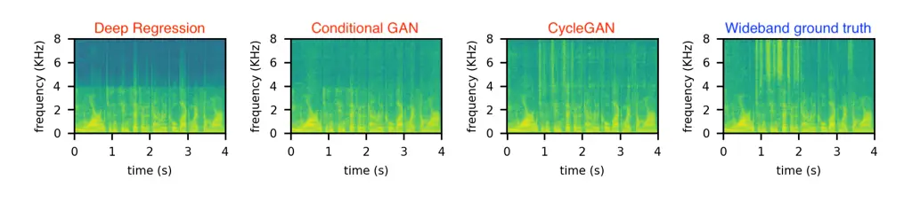

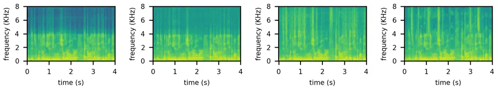

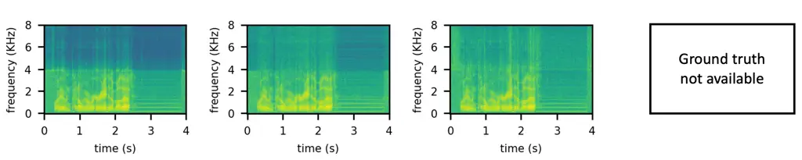

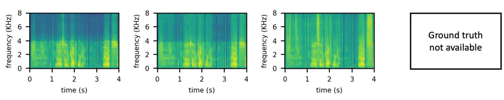

Fig. 1: Spectrograms for four random samples (one per row) from SRE21
test set after extension by deep regression, CGAN, and CycleGAN in
columns 1, 2, and 3, respectively. The last column contains the ground
truth wideband spectrogram. It is unavailable for the last two samples
since they are originally narrowband signals unlike the other two
samples. Note that GAN (especially CycleGAN) produces the best
(natural-looking) outcomes.

### III-D Generator architecture

Conv-TasNet \[48\]: We use off-the-shelf Conv-TasNet for the feedforward
model for deep regression and the generator for GANs. It is a
time-domain model that has been used for other tasks like speech
enhancement \[49, 50\] and source separation \[48\]. It consists of
_encoder_, _separator_, and _decoder_. The _encoder_ is simply a 1-D
Convolutional Neural Network (CNN) layer. The _separator_, through
multiple 1-D CNN layers, computes a mask for separation used by
_decoder_ stage to produce output. We make minor modifications in the
architecture ¹¹ 1
[https://github.com/naplab/Conv-TasNet](https://github.com/naplab/Conv-TasNet).
The number of stacks of CNNs in _separator_ is one, the number of layers
per stack is eight, and the number of output channels of _decoder_ is
one. To capture finer details in high sampling rate signals, we choose
the number of channels in _encoder_ as 128, the kernel size as 16, and
the stride as 8. The number of input and output channels in the
separator are 128 and 1024, respectively, and dilation increases
exponentially with a factor of 2. The receptive field is 32 ms and the
total parameters are only 1.6 M making the deployment lightweight.

### III-E Discriminator architectures

Parallel WaveGAN (PWG) \[51\]: This is a 1-D deep CNN with ten CNN
layers with a kernel size of 3, channels as 80, activation as LeakyReLU
(slope=-0.2), and linearly increasing dilation from the second layer to
the ninth layer (from dilation value of one to eight). It contains only
0.16M parameters.

MelGAN \[52\]: This model is similar to PWG, and works well with a
variety of adversarial losses. There are seven CNN layers and the
corresponding channels are {16,64,256,1024,1024,1024,1} and kernel sizes
are {15,41,41,41,41,5,3}. The number of parameters is 5.6M, thus
significantly bigger than PWG. We also use a _multi-scale_ version of
MelGAN, which uses three such discriminators. Here, _scale_ refers to
the downsampling factor used for the input to the model. We use the same
scale value of four for all sub-discriminators.

HiFiGAN \[53\]: We use its multi-scale and multi-period versions.
_Period_ parameter signifies splitting signal (with length equal to
period) and concatenating the parts along a new axis. The multi-period
model consists of four discriminators. Each consists of six 1-D CNN
layers with kernel size as 5, stride as 3, output channels as {4, 16,
64, 256, 1024, 1}, and LeakyReLU activation (slope=-0.1). The number of
parameters is 7M. The multi-scale model consists of three discriminators
each containing eight CNN layers with kernel size as {15, 41, 41, 41,
41, 41, 5, 3}, stride as {1, 2, 2, 4, 4, 1, 1, 1}, output channels as
{16, 16, 32, 64, 128, 256, 512, 1}, and LeakyReLU activation
(slope=-0.1). The multi-scale multi-period model uses both models
simultaneously with total 2.3M parameters.

StyleMelGAN \[54\]: This consists of differentiable Pseudo Quadrature
Mirror Filter bank (PQMF) analysis as pre-processing for input to four
sub-models, each analyzing a different signal subband. Each sub-model is
a MelGAN discriminator. The number of parameters is 5.9M.

### III-F Supervision losses

For the supervision loss in CGAN and identity and cycle loss in
CycleGAN, we use the following loss functions: simple MSE ($`l_{2}`$)
and MAE ($`l_{1}`$) losses.

Multi-Resolution Short-Time Fourier Transform \[51\]: MRSTFT loss simply
compares two signals $`\mathbf{x}`$ and $`\mathbf{x^{\prime}}`$ in
frequency domain by using $`M=3`$ STFT with corresponding FFT sizes (N)
as {1024, 2048, 512}, hop sizes as {120, 240, 50}, window length as
{600, 1200, 240}, and Hann window:

```math
\displaystyle\mathcal{L}_{\text{sup}} \displaystyle=\mathbb{E}_{\mathbf{x,x^{\prime}}}[\sum_{m=1}^{M}\mathcal{L}_{\text{sup}}^{(m)}(\mathbf{x},\mathbf{x^{\prime}})]\;, \tag{8}
```

```math
\displaystyle\mathcal{L}_{\text{sup}}^{(m)}(\mathbf{x},\mathbf{x^{\prime}}) \displaystyle=\mathcal{L}_{\text{sc}}^{(m)}(\mathbf{x},\mathbf{x^{\prime}})+\mathcal{L}_{\text{mag}}^{(m)}(\mathbf{x},\mathbf{x^{\prime}}), \tag{9}
```

```math
\displaystyle\mathcal{L}_{\text{sc}}^{(m)}(\mathbf{x},\mathbf{\hat{x}}) \displaystyle=\frac{\||\operatorname{STFT}^{(m)}(\mathbf{x})|-|\operatorname{STFT}^{(m)}(\mathbf{\hat{x}})|\|_{F}}{\||\operatorname{STFT}^{(m)}(\mathbf{x})|\|_{F}}, \tag{10}
```

```math
\displaystyle\mathcal{L}_{\text{mag}}^{(m)}(\mathbf{x},\mathbf{\hat{x}}) \displaystyle=\frac{1}{N}\|\log|\operatorname{STFT}^{(m)}(\mathbf{x})|
```

```math
\displaystyle-\log|\operatorname{STFT}^{(m)}(\mathbf{\hat{x}})|\|_{1}. \tag{11}
```

Here, $`||\cdot||`$ is Frobenius norm. Besides vocoding task, this loss
is helpful for defense against adversarial attacks as well \[50\].

Feature Matching \[52\] and Auxiliary Feature Matching: FM loss measures
differences in activations produced by inputs $`\mathbf{x}`$ and
$`\mathbf{x^{\prime}}`$ in the hidden space of the discriminator i.e.

```math
\mathcal{L}_{\text{FM}}=\sum_{i=1}^{L}||D_{l_{i}}(\mathbf{x})-D_{l_{i}}(\mathbf{x^{\prime}})||_{1}. \tag{12}
```

Here, $`D_{l_{i}}`$ is the output of layer $`i`$. In auxiliary FM, an
external model $`A`$ replaces $`D`$, which is pre-trained on a relevant
task, in our case, speaker classification. Thus, AFM loss becomes
identical to deep feature loss \[55\].

### III-G GAN adversarial losses

Non-saturating loss \[45\]: The binary cross-entropy (log loss) based
minimax objective for GAN is

```math
\min_{\mathcal{G}_{A\rightarrow B}}\max_{\mathcal{D}_{B}}\mathbb{E}_{\mathbf{a},\mathbf{b}\sim p_{A,B}}[\log{(\mathcal{D}(\mathbf{b}))}+\log{(1-\mathcal{D}(\mathcal{G}(\mathbf{a}))}]. \tag{13}
```

Authors discuss that it is easy for the discriminator to distinguish
between real and fake during the beginning of training, which leads to
saturation of the second term. Hence, they proposed to maximize
$`log{(D(G(a))}`$ for generator loss instead, which provides better
gradients for the learning of the generator.

Least Squares GAN \[56\]: Here, the authors addressed the vanishing
gradient problem of regular GANs, which use sigmoid activation and log
loss. They proposed using regression loss for classification tasks and
showed that this improves training stability. The formulation is

```math
\min_{\mathcal{G}_{A\rightarrow B}}\max_{\mathcal{D}_{B}}\mathbb{E}_{\mathbf{a},\mathbf{b}\sim p_{A,B}}[(\mathcal{D}(\mathbf{b}))^{2}+(1-\mathcal{D}(\mathcal{G}(\mathbf{a}))^{2}]. \tag{14}
```

Hinge loss \[57\]: The authors here take a geometric view of adversarial
learning. Via hinge loss, they analyze generator and discriminator
updates as learning a hyperplane to maximize the Support Vector Machine
(SVM) margin

```math
\displaystyle\max_{\mathcal{D}_{B}}\mathbb{E}_{\mathbf{b}\sim p_{B}}[\min{(0,-1+\mathcal{D}(\mathbf{b}))}]+ \tag{15}
```

```math
\displaystyle\mathbb{E}_{\mathbf{a}\sim p_{A}}[\min{(0,-1-\mathcal{D}(\mathcal{G}(\mathbf{a})))}],
```

```math
\displaystyle\min_{\mathcal{G}_{A\rightarrow B}}-\mathbb{E}_{\mathbf{a}\sim p_{A}}[\mathcal{D}(\mathcal{G}(\mathbf{a}))]. \tag{16}
```

Wasserstein loss (WGAN) \[58\]: This addresses the weaknesses of the
original GAN in three respects: mode collapse, vanishing gradient, and
hard-to-achieve Nash equilibrium. By formulating based on Wasserstein
loss (Earth Mover distance) instead of the usual Kullback-Leibler (KL)
divergence and Jensen-Shannon (JS) divergence, we appropriately handle
support mismatch between distributions. The formulation is

```math
\min_{\mathcal{G}_{A\rightarrow B}}\max_{\mathcal{D}_{B}}\mathbb{E}_{\mathbf{a},\mathbf{b}\sim p_{A,B}}[\mathcal{D}(\textbf{b})-\mathcal{D}(\mathcal{G}(\textbf{a})))]. \tag{17}
```

We employ Wasserstein GAN-Gradient Penalty (WGAN-GP) \[59\] where the
_critic_ (discriminator) gradient magnitudes are further
Lipshitz-constrained to an upper value (of 0.001).

Dual Contrastive Loss \[60\]: Improving upon the previous GANs, here,
the adversarial loss intertwines real and fake samples via the following
contrastive formulation:

```math
\displaystyle\min_{\mathcal{G}_{A\rightarrow B}}\max_{\mathcal{D}_{B}}\mathbb{E}_{\mathbf{b}\sim p_{B}}[\log(1+\sum_{\mathbf{a}\sim p_{A}}\exp({D(G(\mathbf{a}))-D(\mathbf{b})}))]
```

```math
\displaystyle+\mathbb{E}_{\mathbf{a}\sim p_{A}}[\log(1+\sum_{\mathbf{b}\sim p_{B}}\exp({D(G(\mathbf{a}))-D(\mathbf{b})}))]. \tag{18}
```

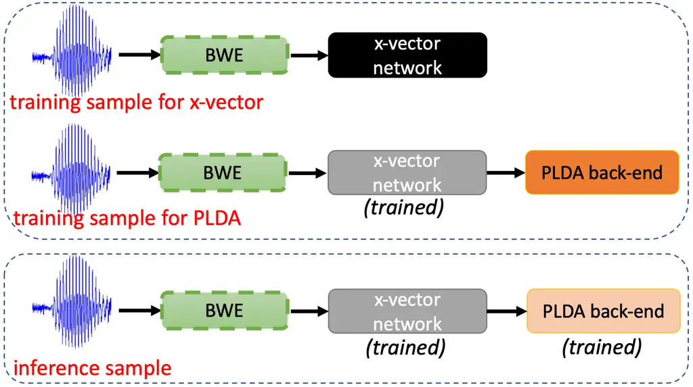

Fig. 2: Three locations for deploying BWE. Two in training – before
x-vector network and PLDA respectively. One in inference – before
x-vector network. Corresponding results are in Table. V.

## IV Proposed Evaluation Schemes

In this section, we describe the methodology for the design, deployment,
and evaluation of our bandwidth extension systems. First, we describe
our downstream task: Automatic Speaker Verification. Second, we explain
our greedy approach for discovering high-performing generative models.
We also discuss the possibilities of its deployment during the training
and inference of the downstream task. Finally, we analyze the effect of
extension on ASV scores, perceptual quality of signals, and speaker
embeddings.

### IV-A Automatic Speaker Verification

The goal of ASV is to determine if two recordings contain the same
dominant speaker. One instance of such determination – using _enroll_
and _test_ utterance – is called a _trial_. Trials in which speakers are
same are called _target trials_, while for different speakers, they are
called _non-target trials_. In state-of-the-art ASV systems, there is a
x-vector (speaker classification) network \[23\] based front-end and
Probabilistic Linear Discriminant Analysis \[6\] based back-end. The
former extracts speaker embeddings while the latter computes
log-likelihood scores to test the binary hypothesis of ASV. Common
reporting metrics are Equal Error Rate (EER) (in %) and minimum Decision
Cost Function (DCF). EER occurs at the decision threshold where the
False Alarm (FA) and False Reject (FR) errors are equal. Decision cost
function is defined as

```math
C=(1-p_{\text{tar}})\times C_{\text{FA}}\times P_{\text{FA}}+p_{\text{tar}}\times C_{\text{FR}}\times P_{\text{FR}}. \tag{19}
```

$`p_{\text{tar}}`$ is the prior probability for target speaker while
$`C_{\text{FA}}`$ and $`C_{\text{FR}}`$ (set to 1 in our case) are the
pre-defined costs for the two types of error. The minimum value achieved
by varying the decision threshold is called minDCF.

### IV-B Designing time-domain GAN for bandwidth extension

Our primary choice for BWE model is GANs. Since the design space of GANs
can be too broad, we propose limiting the search scope. We explore only
three aspects of GAN: discriminator architecture, supervision loss
function, and adversarial loss function (Sec. III-E - Sec. III-G).
Another reason for this exploration is that GAN performance is
susceptible to design choice. It is critical to discover a robust model
suitable for further analysis. We fix the generator architecture and
other training hyper-parameters for all models. To compare models, we
note their performance on three ASV test sets. Finally, to obtain the
best GAN, we use a greedy approach by combining best discovered
discriminator architecture, supervision loss function, and adversarial
loss function.

### IV-C Comparison of supervised and unsupervised GANs

For fairness, we compare GAN models with simple deep regression and _no
extension_ baselines. Also, since there is an identity loss in CycleGAN,
we propose to explore introducing such terms in deep regression and CGAN
too. Per Sec. III-C, CycleGAN uses unpaired training data, but we have
access to paired data due to data creation by simulation (Sec. V-A).
Hence, to test if CycleGAN can leverage paired data unknowingly, we also
train a CycleGAN model with paired data (See _paired CycleGAN_ in
Sec. III-C). Fig. 2 illustrates how a trained BWE model can be utilized
during the training and testing phases of downstream task. During
training, x-vector and PLDA can independently utilize BWE
pre-processing. During inference, input test signals can be extended
before feeding to the trained ASV pipeline. We apply BWE during testing
_blindly_, i.e., extend wideband signals too which ideally need not be
extended. Such signals are only present partially in one test set and
ideally do not require an extension. Nevertheless, we extend them,
expecting our models to simulate identity operation. In contrast with
this _blind_ approach, we experiment not processing such signals as
well. In addition, we experiment with the Low-Frequency Replacement
(LFR) technique, where the lower band of predicted signal is replaced by
the lower band of the original signal.

|              |                  |                      |                  |
| ------------ | ---------------- | -------------------- | ---------------- |
| Disc. arch.  | SRE16-YUE-eval40 | SRE-CTS-superset-dev | SRE21-audio-eval |
| No BWE       | 7.46 / 0.382     | 5.42 / 0.217         | 18.52 / 0.662    |
| PWG (\*)     | 7.88 / 0.413     | 5.21 / 0.210         | 18.03 / 0.656    |
| MelGAN       | 7.73 / 0.404     | 5.25 / 0.211         | 16.99 / 0.640    |
| MelGAN-MS    | 7.84 / 0.406     | 5.18 / 0.210         | 16.67 / 0.636    |
| HiFiGAN-MP   | 7.66 / 0.399     | 5.10 / 0.208         | 16.43 / 0.640    |
| HiFiGAN-MS   | 7.81 / 0.408     | 5.11 / 0.210         | 17.16 / 0.643    |
| HiFiGAN-MSMP | 7.92 / 0.406     | 5.12 / 0.207         | 16.83 / 0.639    |
| StyleMelGAN  | 7.09 / 0.389     | 4.85 / 0.204         | 18.91 / 0.678    |

TABLE I: Different choice of discriminator architecture in Conditional
GAN. MS and MP stands for multi-scale and multi-period. Models denoted
by \* in Table I-III are identical.

|           |                  |                      |                  |
| --------- | ---------------- | -------------------- | ---------------- |
| Sup. loss | SRE16-YUE-eval40 | SRE-CTS-superset-dev | SRE21-audio-eval |
| No BWE    | 7.46 / 0.382     | 5.42 / 0.217         | 18.52 / 0.662    |
| MAE (\*)  | 7.88 / 0.413     | 5.21 / 0.210         | 18.03 / 0.656    |
| MSE       | 6.95 / 0.370     | 4.91 / 0.205         | 16.64 / 0.646    |
| MRSTFT    | 7.10 / 0.387     | 4.97 / 0.203         | 17.43 / 0.652    |
| FM        | 7.86 / 0.405     | 5.24 / 0.211         | 17.50 / 0.645    |
| AFM       | 6.89 / 0.382     | 5.38 / 0.220         | 18.40 / 0.690    |

TABLE II: Different choice of supervision loss in Conditional GAN

|                |                  |                      |                  |
| -------------- | ---------------- | -------------------- | ---------------- |
| Disc. loss     | SRE16-YUE-eval40 | SRE-CTS-superset-dev | SRE21-audio-eval |
| No BWE         | 7.46 / 0.382     | 5.42 / 0.217         | 18.52 / 0.662    |
| LSGAN (\*)     | 7.88 / 0.413     | 5.21 / 0.210         | 18.03 / 0.656    |
| Non-saturating | 7.11 / 0.382     | 4.85 / 0.202         | 17.29 / 0.652    |
| Hinge          | 7.45 / 0.399     | 5.21 / 0.211         | 17.64 / 0.652    |
| Wasserstein    | 7.44 / 0.387     | 5.06 / 0.205         | 17.44 / 0.651    |
| DCL            | 7.20 / 0.388     | 5.18 / 0.210         | 17.71 / 0.661    |

TABLE III: Different choice of adversarial loss in Conditional GAN

### IV-D Per-condition score analysis

We are also interested in analyzing per-condition results since
auxiliary condition information is available for our two test sets. In
the context of BWE, two types of speech are of utmost interest: CTS
(conversational telephone narrowband speech) and AFV (Audio from Video
wideband speech _in the wild_). Therefore, we focus on three trial
types: CTS-CTS, CTS-AFV, and AFV-AFV. We also study trials based on
language, gender, and recording device. However, averaged scores do not
convey all information about distribution shifts in verification scores.
We propose to study this in two ways. One, plot score histograms of
CTS-AFV trials before and after BWE. Two, plot CTS-CTS, CTS-AFV, and
AFV-AFV scores and examine if BWE brings them closer.

### IV-E Perceptual quality and speaker embedding analysis

To further analyze our BWE systems, we explore the effects of extension
on perceptual quality and speaker embeddings of signals. In the absence
of explicit perceptual quality objectives in training, it is paramount
to explore if there is a correlation between the downstream performance
and the output speech quality. For perceptual and intelligibility
evaluation, we mainly choose _full reference_ automated measures like
PESQ \[18\] and Extended STOI (ESTOI) \[61\] respectively. PESQ is a
psychoacoustics-based measure to estimate the quality of speech affected
by perceptual distortions while adjusting for time lags and loudness
mismatch. ESTOI improves upon STOI in measuring intelligibility in the
distorted speech by considering correlations between frequency bands. By
doing this analysis for deep regression, CGAN, and CycleGAN models, we
can also quantify the effect of using paired training data and
generative modeling. To analyze embeddings, we propose to utilize
t-SNE \[62\], a popular non-linear dimension reduction and visualization
technique. Our previous work \[37\] showed that the effect of domain
adaptation via generative models is apparent as a shift in the t-SNE
plot. Thus, we propose to visualize narrowband train and test data
embeddings before and after extension. We also propose visualizing how
CTS and AFV audio from the same speaker cluster before and after the
extension.

## V Experimental Setup

### V-A Data Description

All signals in our experiments follow the sampling frequency of 16000
samples per second and amplitude normalized to \[-1,1\]. We know that
the maximum frequency information ($`f_{\text{max}}`$) in a signal
depends on its original sampling frequency ($`f_{s}`$) and equals to
$`f_{s}/2`$. We refer to signals with $`f_{\text{max}}`$ of 4KHz and
8KHz as narrowband and wideband, respectively. A wideband signal, thus,
must have a sampling frequency of at least 16KHz as per the Nyquist
theorem. As baseline, we resample the narrowband signals in train and
test sets from their original sampling frequency of 8KHz to 16KHz using
linear upsampling.

We have three types of data available during training: _narrow_, _wide_,
and _wide_down_. _narrow_ data refers to narrowband telephone corpus
from SRE Superset \[63\] and SRE16 eval data \[64, 65\] which includes
Tagalog and Cantonese (YUE) languages. _wide_ data refers to wideband
VoxCeleb \[66\] – also called as _microphone_ data. VoxCeleb (1&2
combined) contains 2700+ hrs of audio from 7365 speakers in the wild.
_wide_down_ data refers to narrowband VoxCeleb, created by downsampling
and subsequent linear upsampling of _wide_ data, making _wide_down_ a
narrowband dataset as well. We evaluate ASV on three test sets. (1)
*SRE16-YUE-eval40* \[65, 64\] (40% speakers (40) from evaluation set of
SRE16 Cantonese). (2) *SRE-CTS-superset-dev* \[67\]. This contains 99
speakers from CMN (Mandarin) and YUE (Cantonese) languages. It is
balanced between genders and contains 22M trials. (3)
*SRE21-audio-eval* \[68\] (SRE21 eval set). It contains 6M trials and
various languages, channels, devices, et cetera. This test set, contrary
to others, also consists of wideband AFV signals.

### V-B Bandwidth Extension training

For training bandwidth extension models, we use only _wide_down_ and
_wide_ data. As explained in Sec. III, supervised models (deep
regression, CGAN) use paired samples while for unsupervised models
(CycleGAN), we use unpaired samples. We also found that silence regions
are critical for BWE training, hence we preserve them in training
samples of BWE.

#### V-B1 Deep regression training

We train Conv-TasNet with 4 s audio segments with _wide_down_ input and
corresponding _wide_ target. Batch size is 128, number of epochs are 70
(defined as 100 h of speech), optimizer is Adam \[69\] with betas=(0.9,
0.999), and objective function is temporal MAE loss. The learning rate
of 0.0005 decreases by half when validation loss does not decrease by at
least 1% for three epochs.

#### V-B2 CGAN training

Here, we train using Alternating Gradient Descent (AGD) \[45\]. One
training step consists of one update of discriminator (given fixed
generator) and two updates of generator (given fixed discriminator). Due
to the sensitivity of GAN training with Conv-TasNet architecture, lower
precision training is disabled. $`\lambda_{\text{sup}}=0.1`$. Learning
rates for generator and discriminator are 0.0002 and 0.0001,
respectively, which decrease linearly with every training step until a
minimum value of 1e-07. The sequence length for training is 3 s, the
batch size is 16, the number of epochs is 15 (defined as 50 h of
speech), and Adam betas are (0.5,0.999).

#### V-B3 CycleGAN training

Here, the maximum value of learning rates for the generator and
discriminator are 0.0004 and 0.0002, respectively, and the minimum value
is 1e-08. For the first two epochs, the learning rate linearly increases
from minimum to maximum value. The learning rate is constant at the
maximum values for the subsequent three epochs. The learning rate
decreases to a minimum value following a cosine function for the final
ten epochs. The batch size is 8, and all other training details are
identical to CGAN.

### V-C Baseline speaker verification system

This work follows our submission to the fixed-condition NIST Speaker
Recognition Challenge (SRE) 2021 challenge \[63\] ²² 2
[https://github.com/hyperion-ml/hyperion/tree/master/egs/sre21-av-a](https://github.com/hyperion-ml/hyperion/tree/master/egs/sre21-av-a).
The x-vector model used is Light-ResNet \[70\] with speaker embedding
dimension of 256. Loss function is Additive Angular Margin (AAM) loss
with margin $`m=0.3`$. Input features are 80-D Log-Mel FilterBank
(LMFB), created on-the-fly. For baseline, training uses _wide_,
_wide_down_, and unmodified*narrow* (except for linear upsampling of
narrowband data to 16 kHz). Noise and reverberation augmentation is done
on-the-fly using MUSAN \[71\] and Aachen Impulse Response (AIR) Database
corpus ³³ 3
[http://www.openslr.org/resources/28](http://www.openslr.org/resources/28).
After 200-D Linear Discriminant Analysis (LDA) pre-processing on 256-D
embeddings, 150-D PLDA is used. We remove silence frames from the
x-vector and PLDA training using a simple energy-based voice activity
detector.

|                       |                               |                         |                  |                      |                  |
| --------------------- | ----------------------------- | ----------------------- | ---------------- | -------------------- | ---------------- |
| BWE system            | Training data paired/unpaired | $`\lambda_{\text{id}}`$ | SRE16-YUE-eval40 | SRE-CTS-superset-dev | SRE21-audio-eval |
| \-                    | \-                            | \-                      | 7.46 / 0.382     | 5.42 / 0.217         | 18.52 / 0.662    |
| Mapping               | paired                        | 0                       | 7.28 / 0.395     | 4.99 / 0.211         | 16.72 / 0.642    |
| Mapping               | paired                        | 0.5                     | 7.60 / 0.388     | 5.21 / 0.210         | 18.34 / 0.664    |
| CGAN                  | paired                        | 0                       | 7.07 / 0.378     | 5.05 / 0.207         | 15.99 / 0.630    |
| CGAN                  | paired                        | 0.1                     | 7.22 / 0.378     | 5.04 / 0.206         | 15.95 / 0.629    |
| CycleGAN              | unpaired                      | 10                      | 6.86 / 0.371     | 4.97 / 0.205         | 17.27 / 0.656    |
| CycleGAN_unsupervised | paired                        | 10                      | 7.10 / 0.377     | 4.96 / 0.204         | 19.49 / 0.674    |
| CycleGAN_supervised   | paired                        | 10                      | 7.71 / 0.400     | 5.27 / 0.211         | 18.69 / 0.667    |

TABLE IV: Comparison of deep regression, CGAN, and CycleGAN

| PLDA data                                                         | PLDA data extended | SRE16-YUE-eval40 | SRE-CTS-superset-dev | SRE21-audio-eval |
| ----------------------------------------------------------------- | ------------------ | ---------------- | -------------------- | ---------------- |
| x-vector trained and fine-tuned on original data                  |                    |                  |                      |                  |
| _wide_, _wide_down_, _narrow_                                     | \-                 | 6.83 / 0.359     | 4.71 / 0.202         | 15.93 / 0.623    |
| _wide_, _wide_down_, _narrow_                                     | _narrow_           | 6.39 / 0.352     | 4.91 / 0.204         | 14.82 / 0.599    |
| _wide_, _narrow_                                                  | _narrow_           | 5.27 / 0.307     | 4.01 / 0.174         | 14.33 / 0.591    |
| x-vector trained on original data and fine-tuned on extended data |                    |                  |                      |                  |
| _wide_, _wide_down_, _narrow_                                     | \-                 | 6.88 / 0.372     | 5.33 / 0.215         | 15.31 / 0.614    |
| _wide_, _wide_down_, _narrow_                                     | _narrow_           | 6.83 / 0.373     | 5.17 / 0.210         | 15.59 / 0.615    |
| _wide_, _narrow_                                                  | _narrow_           | 5.43 / 0.315     | 4.11 / 0.175         | 14.88 / 0.597    |
| x-vector trained and fine-tuned on extended data                  |                    |                  |                      |                  |
| _wide_, _wide_down_, _narrow_                                     | \-                 | 7.64 / 0.436     | 5.53 / 0.220         | 16.32 / 0.650    |
| _wide_, _wide_down_, _narrow_                                     | _narrow_           | 7.20 / 0.413     | 5.35 / 0.219         | 16.46 / 0.644    |
| _wide_, _narrow_                                                  | _narrow_           | 5.67 / 0.363     | 4.16 / 0.187         | 15.29 / 0.616    |

TABLE V: Bandwidth Extension of x-vector and PLDA training data. Test
set is extended per blind strategy. For x-vector training, here
“original data” is {_wide_, _wide_down_, _narrow_}, while “extended
data” is {_wide_, $`M`$(_wide_down_), $`M`$(_narrow_)}. $`M(\cdot)`$ is
the extension model.

## VI Results

### VI-A Designing Conditional GAN based Bandwidth Extension

Here, we present the results for exploring discriminator architecture,
supervision loss, and adversarial loss for CGAN in Tables I, II, and III
respectively. Results are in the format EER/minDCF, and we discuss in
detail such exploration for CGAN only. In Table I, the first row has
results without BWE. In other rows, we expand real narrowband data
(_narrow_) of PLDA and test set using _blind_ extension strategy
(Sec. IV-C). The x-vector is trained a priori on unmodified wideband and
narrowband data and used as is. Row 2 (marked as \*) is the model
identical to row 2 of the other two tables. We see that multi-period
(MP) and multi-scale (MS) versions of discriminator architecture bring
significant benefits in _SRE21-audio-eval_, partly due to more
parameters. StyleMelGAN performs best except on _SRE21-audio-eval_.

Consider Table II. Note that no choice of supervision loss function
gives the best results on all test sets. Also, we found that the
combination of several losses is ineffective. Several loss functions
improve w.r.t. _no extension_ baseline. MSE loss gives the best
performance overall. MAE is worse than MSE. However, it was the
preferred choice in our previous works \[37, 12\]. AFM loss gives the
best performance on _SRE16-YUE-eval40_, but this comes with the cost of
increased computation due to the usage of the auxiliary model. We use
the outputs of five ResNet blocks of our x-vector network for computing
AFM loss.

Now consider Table III. Here, surprisingly, the best performance is
achieved by the simplest loss, i.e., non-saturating loss (from original
GAN work \[45\]) – contrary to our preferred choice of LSGAN loss in
previous works \[37\]. Wasserstein loss also gives promising results at
the cost of tuning an additional hyper-parameter of gradient clipping
factor.

Finally, we train a CGAN with the best attributes from the above
experiments, i.e., with MSE supervision loss, non-saturating adversarial
loss, and StyleMelGAN discriminator architecture. We perform similar
exploration experiments for CycleGAN and find the best attributes to be
MAE supervision (i.e., cycle & identity) loss, LSGAN adversarial loss,
and HiFiGANMultiPeriod discriminator architecture. This individual
in-depth exploration of CGAN and CycleGAN allows us to compare them
fairly. Note that _SRE21-audio-eval_ has significantly worse results
than the other two test sets because it is a highly mismatched dataset
(w.r.t. language, channel, et cetera). A much stronger recognition
system is needed to achieve better performance \[72, 67\].

### VI-B Comparison of supervised and unsupervised BWE

In Table IV, we compare deep regression, CGAN, and CycleGAN. Our first
observation is that the most straightforward scheme, i.e., deep
regression, brings significant improvements in all test sets,
particularly in EER. However, its performance on _SRE16-YUE-eval40_ is
lacking. Adding identity loss makes it significantly worse. We train
CGAN with the best attributes discovered in the previous section. It
gives a strong performance, but the utility of identity loss is
inconclusive here. CycleGAN gives the best results on two test sets, as
shown in the boldface. Identity loss is crucial for CycleGAN training,
so we do not experiment with removing it. “CycleGAN_unsupervised paired”
refers to vanilla CycleGAN but trained with paired data. This model
cannot leverage pairing information inherently showing that paired data
is detrimental to CycleGAN. “CycleGAN_supervised paired” is the CycleGAN
model where two supervision losses for both directions are added to the
formulation since we know the expected output (from paired data). This
model is thus comparable to using two tied CGANs and turns out to be
better than “CycleGAN_unsupervised paired” but on only
_SRE21-audio-eval_. Our best models are vanilla CGAN and CycleGAN, which
we use for further analysis. We encourage the reader to listen to a few
samples ⁴⁴ 4
[https://github.com/saurabh-kataria/BWE-samples](https://github.com/saurabh-kataria/BWE-samples).
We also visually compare the three BWE techniques in Fig. 1. We
specifically highlight the quality of CycleGAN prediction here.

### VI-C Effect of extending x-vector and PLDA training data

In Table V, we investigate the effect of extending training data of PLDA
and x-vector. The results are divided into three parts. Complete results
are in Appendix A but we discuss a subset of results here. In the first
part, the x-vector is trained (on 4 s chunks) and fine-tuned (on 10-60 s
chunks) on original unextended data i.e. _wide_, _wide_down_, and
_narrow_. The first column lists the data used for PLDA training, while
the second column denotes which one of them is extended. We use CGAN for
extension here. The results here are better than Table IV since the
x-vector is fine-tuned on long recordings which significantly improves
ASV performance \[6\]. We observe that removing synthetic data
(_wide_down_) from PLDA training and not extending _wide_ data is a
better choice (see also Appendix A). In the second part, the x-vector is
trained on original data but during fine-tuning, narrowband data i.e.
_wide_down_ and _narrow_ are extended. The observations here are similar
to the previous part but with slight degradation. In the third part, the
x-vector is trained and fine-tuned on wideband (_wide_) and extended
narrowband data. We observe even more degradations here. We finally
report extending x-vector data as inconclusive. In future work, we can
use larger x-vector networks like the ones used in \[67\].

### VI-D SRE21 results per trial condition

In Table VI, we note the absolute and relative improvement in EER on
_SRE21-audio-eval_. We only report CGAN results here since we found
similar observations for CycleGAN. The overall improvement averaged
across all conditions is significant (-13.67%). Mismatched condition
CTS-AFV gives only -2.7 % relative improvement. CTS-CTS performance
(-0.5 %) is unaffected as intended. AFV-AFV is matched trial but is
adversely affected by the extension. We address this issue in next
section (Sec. VI-E). Most of the gains come from trials other than
CTS-CTS, CTS-AFV, and AFV-AFV. We liken this more generic benefit to
_calibration_, that is, extension is shifting scores in order to make
speaker verification robust to different acoustic environments. Finally,
we note that improvement is highest when test language is matched with
train (ENG-ENG).

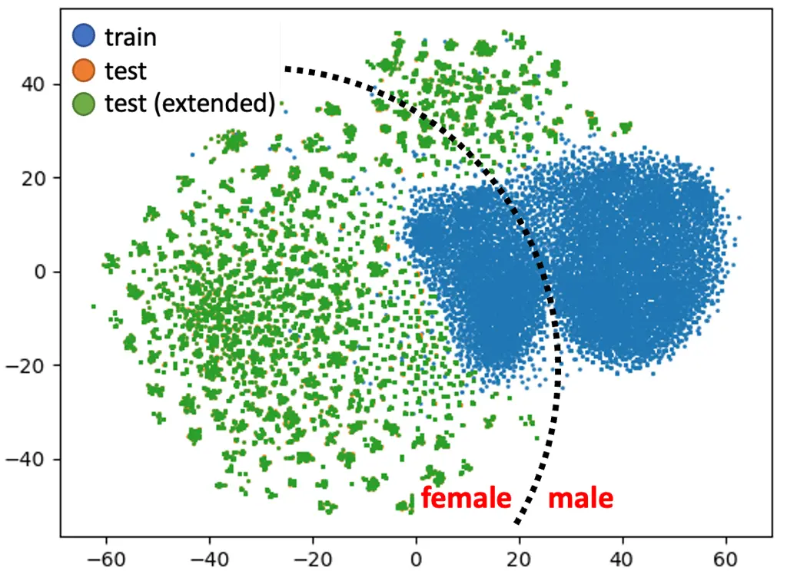

(a) CGAN extension

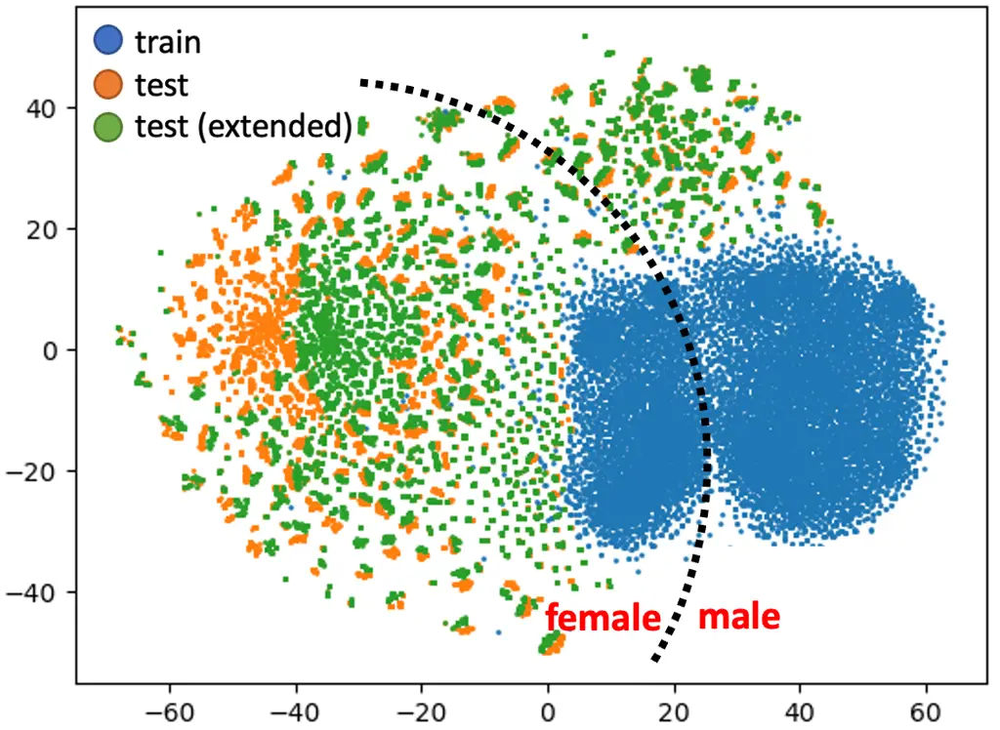

(b) CycleGAN extension

Fig. 3: t-SNE visualization of embeddings of wideband training data and
narrowband test data (with and without extension). “train” refers to
wideband VoxCeleb. “test” refers to narrowband SRE21 test set. “test
(extended)” refers to SRE21 test set extended by CGAN or CycleGAN. We
observe that CycleGAN causes a shift in distribution. For CGAN, there is
no shift, as noted from the perfect overlap of orange and green dots.

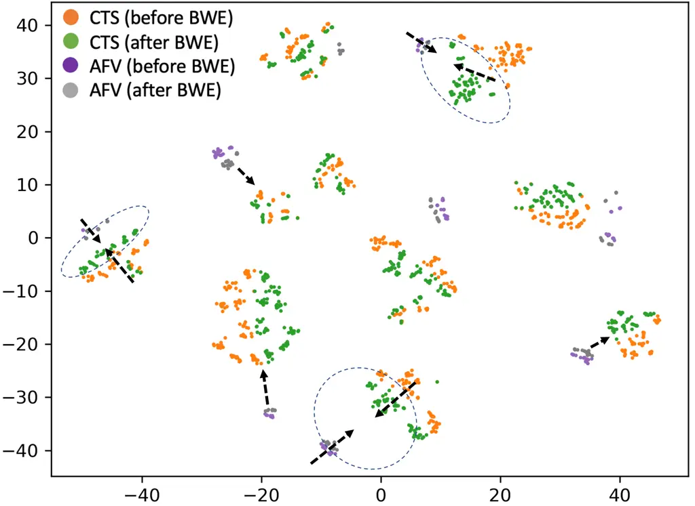

Fig. 4: t-SNE visualization of CTS and AFV recordings of 10 speakers
before and after BWE. The four types of signals come closer by
extension, as denoted by black arrows—dotted ellipse highlight a few
cases where CTS and AFV signals come close after extension.

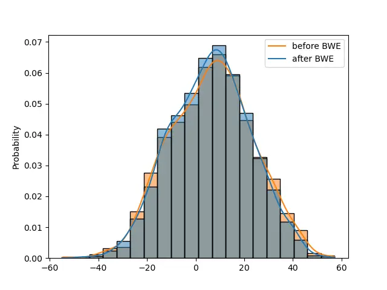

(a) Target trials

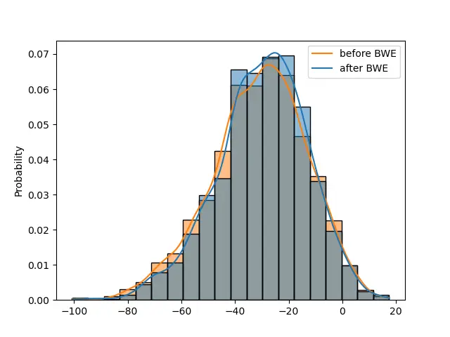

(b) Non-target trials

Fig. 5: CTS-AFV score distribution before and after CGAN extension for
the SRE21 test set. CTS and AFV signals are both extended. Gray denotes
the overlap of orange and blue colors. Blue dominating in the middle
suggests extension shifts scores towards the mean.

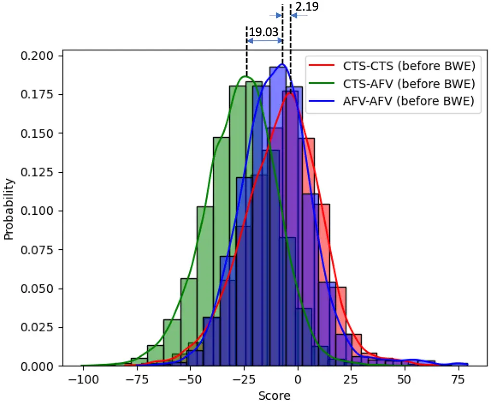

(a) Before extension

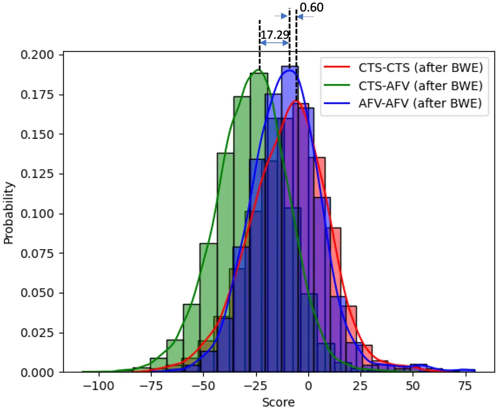

(b) After extension

Fig. 6: Score distribution of CTS-CTS, CTS-AFV, and AFV-AFV trials
before and after CGAN extension. BWE brings the peaks of all curves
closer.

|                  |        |       |          |
| ---------------- | ------ | ----- | -------- |
| Condition        | No BWE | CGAN  | % change |
| Overall          | 18.52  | 15.99 | -13.67%  |
| CTS-CTS          | 8.85   | 8.81  | -0.5%    |
| CTS-AFV          | 16.69  | 16.24 | -2.7%    |
| AFV-AFV          | 2.89   | 3.49  | +20.8%   |
| ENG-ENG          | 17.98  | 14.02 | -22.0%   |
| ENG-YUE          | 18.83  | 15.93 | -15.4%   |
| YUE-YUE          | 19.38  | 16.76 | -13.5%   |
| Same device      | 4.90   | 5.24  | +6.9%    |
| Different device | 25.53  | 22.11 | -13.4%   |

TABLE VI: EER improvement by trial condition.

| Condition | No BWE | expand_all | expand_narrow | LFR   | expand_narrow |
| --------- | ------ | ---------- | ------------- | ----- | ------------- |
|           |        |            |               |       | + LFR         |
| Overall   | 18.52  | 15.99      | 17.29         | 17.29 | 17.90         |
| CTS-CTS   | 8.85   | 8.81       | 8.76          | 8.75  | 8.89          |
| CTS-AFV   | 16.69  | 16.24      | 16.80         | 16.78 | 17.03         |
| AFV-AFV   | 2.89   | 3.49       | 3.03          | 2.97  | 3.00          |
| ENG-ENG   | 17.98  | 14.02      | 15.67         | 15.71 | 16.77         |

TABLE VII: Comparing different test-time BWE schemes.

### VI-E Different test-time extension schemes

In Table VII, we report results for various test-time extension schemes
on _SRE21-audio-eval_. Here, we again report results for only CGAN since
we found similar observations for CycleGAN. _Blind_ extension test
scheme, denoted by _expand_all_ in column 3, extends narrow as well as
wideband test signals, which is undesirable. _Expand_narrow_ extends
only narrowband signals and improves AFV-AFV performance. It hurts other
conditions and overall performance because DNN induces a mismatch
between extended and unextended signals. Low-Frequency Replacement
strategy (_LFR_), which does not modify lower band frequency
information, does not improve overall but gives good AFV-AFV
performance. In the last row, a combination of _expand_narrow_ and _LFR_
also does not prove beneficial. Thus, devised schemes have worse
performance than baseline. They are significantly worse in conditions
other than CTS-CTS, CTS-AFV, and AFV-AFV. We report one such condition:
ENG-ENG.

### VI-F Effect of extension on speaker embeddings

In Fig. 3, we plot t-SNE embeddings of x-vector representations of
training and test data. The black dotted curves separate the male and
female embeddings. The model for extension used in the two figures is
CGAN and CycleGAN, respectively. Blue markers denote wideband training
data (i.e., VoxCeleb or _wide_). Orange markers denote test set samples
from _SRE21-audio-eval_, while green markers denote their extended
counterpart. We observe the following. First, there is a clear
separation w.r.t. gender in both plots. Second, in the case of CGAN, the
extension does not achieve the noticeable shift in t-SNE space, while
for CycleGAN, it is pronounced. Third, for the female gender, the shift
in embeddings is higher, which we did not observe in the other test set:
_SRE-CTS-superset-dev_. This experiment reveals the difference in the
extension behavior of both models. This shift caused by CycleGAN is akin
to domain adaptation effect \[37\]. In Fig. 4, we plot the t-SNE of CTS
and AFV embeddings before and after CGAN extension. We use ten speakers
for this analysis and can see the four types of signals cluster per
speaker. Extension brings all types of signals ({CTS, AFV} x {before
extension, after extension}) closer, as denoted by black arrows. Dotted
ellipses highlight a few cases where CTS and AFV signals come
significantly closer after extension.

### VI-G Effect of extension on verification score distribution

In Fig. 5, we plot the distributions for target and non-target trials
before and after CGAN extension of _SRE21-audio-eval_. Blue colors
(denoting after extension) dominate the bars in the histogram’s middle.
For both target and non-target trials, extension brings scores closer to
the mean. This observation holds for other trial conditions too. We
interpret this as a calibration-like effect. Similar to motivation for
Fig. 4, in Fig. 6, we demonstrate through histograms that extension
brings scores of CTS-CTS, CTS-AFV, and AFV-AFV closer. We can see a
significant decrease in the difference between the mean of the three
curves.

### VI-H Perceptual quality and relation to downstream metric

A previous work \[73\] showed that the perceptual quality of DNN outputs
(in our case, extended signals) does not necessarily correlate with the
performance of downstream tasks. We investigate this on our experimental
setup in Table VIII. We use PESQ, ESTOI, LSD, and MSE metrics to measure
signal distortion. We also devise _deep feature MSE_, which measures the
MSE error (w.r.t. ground truth) measured using activations of signals in
an auxiliary network (x-vector, in our case). In addition to the above
measures, we note the relative improvements in EER and minDCF (averaged
across our three test sets). We first note that unextended signals have
the highest perceptual quality and all extension methods give a low PESQ
value since we do not optimize for it. Since all extension systems use a
form of supervision loss, we do not notice significant degradation in
ESTOI, LSD, and time-domain MSE. Deep regression expectedly gives the
best results on these metrics. Also, note that deep feature MSE is
constant across all methods, i.e., speaker information is not lost. It
is also evident from good ASV performance with all methods. CGAN gives
the best average relative improvement in EER and minDCF. Deep regression
gives competitive results but fails to improve minDCF. CycleGAN gives
the worst perceptual quality but excellent ASV performance and
spectrograms (Fig. 1).

| BWE system      | PESQ ($`\uparrow`$) | ESTOI ($`\uparrow`$) | LSD ($`\downarrow`$) | time-domain MSE ($`\downarrow`$) | deep feature MSE ($`\downarrow`$) | EER ($`\downarrow`$) | $`\Delta`$ EER ($`\downarrow`$) | minDCF ($`\downarrow`$) | $`\Delta`$ minDCF ($`\downarrow`$) |
| --------------- | ------------------- | -------------------- | -------------------- | -------------------------------- | --------------------------------- | -------------------- | ------------------------------- | ----------------------- | ---------------------------------- |
| No BWE          | 3.846               | 0.989                | 1.102                | 3.233                            | 913.410                           | 10.47                | 0%                              | 0.420                   | 0%                                 |
| Deep regression | 3.659               | 0.993                | 0.471                | 1.042                            | 913.414                           | 9.66                 | -6.69%                          | 0.416                   | -0.79%                             |
| CGAN            | 3.514               | 0.985                | 0.790                | 1.248                            | 913.363                           | 9.37                 | -8.57%                          | 0.405                   | -3.50%                             |
| CycleGAN        | 2.055               | 0.977                | 1.301                | 3.816                            | 913.408                           | 9.70                 | -7.70%                          | 0.410                   | -3.11%                             |

TABLE VIII: Relation between perceptual quality and downstream
performance. Metrics denoted by $`\uparrow`$ ($`\downarrow`$) are higher
(lower) the better.

## VII Conclusions and future work

In this work, we comprehensively evaluate bandwidth extension of
narrowband data for the downstream task of telephony speaker
verification. Our ASV system is based on the state-of-the-art pipeline:
x-vector front-end, PLDA back-end, data augmentation, and mixed
bandwidth training data. We focused on time-domain BWE models due to
their flexible usage during the training and inference of ASV. We
discover high-performing supervised and unsupervised GANs like
conditional GAN and CycleGAN respectively. We first extensively tune
conditional GAN to (1) demonstrate the sensitivity of GAN performance to
design and (2) derive the best model suitable for fair comparison and
further analysis. With this tuning, we discover vastly different designs
for CGAN and CycleGAN. Comparing these best models on three real test
sets, we find the deep regression baseline to be strong. Unsupervised
CycleGAN performs on par with supervised CGAN and even surpasses
performance on a few metrics. These results are however obtained via
extension of test set and the real narrowband (_narrow_) portion of PLDA
training set. Therefore, we explore extending x-vector training data as
well. Our results indicate, in contrast to back-end, the neural
network-based front-end can benefit from synthetic narrowband data.
Further analysis into per-condition results indicate that most benefits
come from trials other than CTS-CTS, CTS-AFV, and AFV-AFV. This
observation followed by shifts seen in score histogram reveals a generic
calibration-like effect caused by bandwidth extension. This phenomenon
can be further studied in future with more types of trials and stronger
x-vector systems. Our primary choice of test-time scheme is _blind
extension_, where we do not detect wideband signals. Since
_SRE21-audio-eval_ has some wideband signals, we tested two schemes:
skipping extension of wideband test signals (_expand_narrow_) and not
modifying lowerband information (_Lower Frequency Replacement_). We find
that it is beneficial to extend wideband signals as well since (1) it
avoids mismatch w.r.t. extended signals and (2) GANs can approximate
identity operation. We also performed a perceptual quality analysis with
PESQ, ESTOI, and LSD measures. We do not observe a positive correlation
with downstream performance. We speculate this is due to the absence of
perception-improving loss terms. However, we visually find GANs to
predict upperband information in spectrograms.

One limitation of our work is the degradation in AFV-AFV trial when
using the blind extension scheme. This may be handled via a better
identity loss or introducing ASV metrics in BWE training. We can also
investigate deep feature loss \[36\] and/or self-supervised models to
improve perceptual quality as well as downstream performance. Finally,
we encourage the reader to refer to \[67, 74\] where we report results
on stronger baselines, system fusion, and multi-modal setups. We extend
our work to joint learning with domain adaptation in \[12\].

## References

- \[1\] D. Yu and L. Deng, *Automatic Speech
  Recognition.* Springer, 2016.
- \[2\] Z. Bai and X.-L. Zhang, “Speaker recognition based on deep
  learning: An overview,” _Neural Networks_, 2021.
- \[3\] X. Tan, T. Qin, F. Soong, and T.-Y. Liu, “A survey on neural
  speech synthesis,” _arXiv preprint arXiv:2106.15561_, 2021.
- \[4\] P. García, J. Villalba, H. Bredin, J. Du, D. Castan, A. Cristia,
  L. Bullock, L. Guo, K. Okabe, P. S. Nidadavolu _et al._, “Speaker
  detection in the wild: Lessons learned from jsalt 2019,” _arXiv
  preprint arXiv:1912.00938_, 2019.
- \[5\] A. Maas, Q. V. Le, T. M. O’neil, O. Vinyals, P. Nguyen, and
  A. Y. Ng, “Recurrent neural networks for noise reduction in robust
  asr,” _INTERSPEECH 2012_, 2012.
- \[6\] J. Villalba, N. Chen, D. Snyder, D. Garcia-Romero, A. McCree,
  G. Sell, J. Borgstrom, F. Richardson, S. Shon, F. Grondin _et al._,
  “State-of-the-art speaker recognition for telephone and video speech:
  The jhu-mit submission for nist sre18.” in _Interspeech_, 2019, pp.
  1488–1492.
- \[7\] S. Kataria, P. S. Nidadavolu, J. Villalba, N. Chen,
  P. Garcia-Perera, and N. Dehak, “Feature enhancement with deep feature
  losses for speaker verification,” in _ICASSP 2020-2020 IEEE
  International Conference on Acoustics, Speech and Signal Processing
  (ICASSP)_. IEEE, 2020, pp. 7584–7588.
- \[8\] S. Kataria, P. S. Nidadavolu, J. Villalba, and N. Dehak,
  “Analysis of deep feature loss based enhancement for speaker
  verification,” _arXiv preprint arXiv:2002.00139_, 2020.
- \[9\] Z. Wang and J. H. Hansen, “Multi-source domain adaptation for
  text-independent forensic speaker verification,” _IEEE/ACM
  Transactions on Audio, Speech, and Language Processing_, 2021.
- \[10\] W. Cai and M. Li, “A unified deep speaker embedding framework
  for mixed-bandwidth speech data,” _arXiv preprint
  arXiv:2012.00486_, 2020.
- \[11\] N. Hou, C. Xu, J. T. Zhou, E. S. Chng, and H. Li, “Multi-task
  learning for end-to-end noise-robust bandwidth extension.” in
  _INTERSPEECH_, 2020, pp. 4069–4073.
- \[12\] S. Kataria, J. Villalba, L. Moro-Velázquez, and N. Dehak,
  “Joint domain adaptation and speech bandwidth extension using
  time-domain gans for speaker verification,” _arXiv preprint
  arXiv:2203.16614_, 2022.
- \[13\] G. Mantena, O. Kalinli, O. Abdel-Hamid, and D. McAllaster,
  “Bandwidth embeddings for mixed-bandwidth speech recognition,” _arXiv
  preprint arXiv:1909.02667_, 2019.
- \[14\] P. S. Nidadavolu, C.-I. Lai, J. Villalba, and N. Dehak,
  “Investigation on bandwidth extension for speaker recognition.” in
  _INTERSPEECH_, 2018, pp. 1111–1115.
- \[15\] H. Liu, W. Choi, X. Liu, Q. Kong, Q. Tian, and D. Wang, “Neural
  vocoder is all you need for speech super-resolution,” _arXiv preprint
  arXiv:2203.14941_, 2022.
- \[16\] K. Li, Z. Huang, Y. Xu, and C.-H. Lee, “Dnn-based speech
  bandwidth expansion and its application to adding high-frequency
  missing features for automatic speech recognition of narrowband
  speech,” in _Sixteenth Annual Conference of the International Speech
  Communication Association_, 2015.
- \[17\] Y. Gu, Z.-H. Ling, and L.-R. Dai, “Speech bandwidth extension
  using bottleneck features and deep recurrent neural networks.” in
  _Interspeech_, 2016, pp. 297–301.
- \[18\] A. W. Rix, J. G. Beerends, M. P. Hollier, and A. P. Hekstra,
  “Perceptual evaluation of speech quality (pesq)-a new method for
  speech quality assessment of telephone networks and codecs,” in _2001
  IEEE international conference on acoustics, speech, and signal
  processing. Proceedings (Cat. No. 01CH37221)_, vol. 2. IEEE, 2001, pp.
  749–752.
- \[19\] C. H. Taal, R. C. Hendriks, R. Heusdens, and J. Jensen, “An
  algorithm for intelligibility prediction of time–frequency weighted
  noisy speech,” _IEEE Transactions on Audio, Speech, and Language
  Processing_, vol. 19, no. 7, pp. 2125–2136, 2011.
- \[20\] B. B. Monson, E. J. Hunter, A. J. Lotto, and B. H. Story, “The
  perceptual significance of high-frequency energy in the human voice,”
  _Frontiers in psychology_, vol. 5, p. 587, 2014.
- \[21\] J. J. Donai and R. M. Halbritter, “Gender identification using
  high-frequency speech energy: Effects of increasing the low-frequency
  limit,” _Ear and hearing_, vol. 38, no. 1, pp. 65–73, 2017.
- \[22\] A. D. Vitela, B. B. Monson, and A. J. Lotto, “Phoneme
  categorization relying solely on high-frequency energy,” _The Journal
  of the Acoustical Society of America_, vol. 137, no. 1, pp.
  EL65–EL70, 2015.
- \[23\] D. Snyder, D. Garcia-Romero, G. Sell, D. Povey, and
  S. Khudanpur, “X-vectors: Robust dnn embeddings for speaker
  recognition,” in _2018 IEEE International Conference on Acoustics,
  Speech and Signal Processing (ICASSP)_. IEEE, 2018, pp. 5329–5333.
- \[24\] P. Kenny, “Bayesian speaker verification with, heavy tailed
  priors,” _Proc. Odyssey 2010_, 2010.
- \[25\] J. Makhoul and M. Berouti, “High-frequency regeneration in
  speech coding systems,” in _ICASSP’79. IEEE International Conference
  on Acoustics, Speech, and Signal Processing_, vol. 4. IEEE, 1979, pp.
  428–431.
- \[26\] H. Seo, H.-G. Kang, and F. Soong, “A maximum a posterior-based
  reconstruction approach to speech bandwidth expansion in noise,” in
  _2014 IEEE International Conference on Acoustics, Speech and Signal
  Processing (ICASSP)_. IEEE, 2014, pp. 6087–6091.
- \[27\] P. Bachhav, M. Todisco, and N. Evans, “Efficient super-wide
  bandwidth extension using linear prediction based analysis-synthesis,”
  in _2018 IEEE International Conference on Acoustics, Speech and Signal
  Processing (ICASSP)_. IEEE, 2018, pp. 5429–5433.
- \[28\] P. Jax and P. Vary, “Artificial bandwidth extension of speech
  signals using mmse estimation based on a hidden markov model,” in
  _2003 IEEE International Conference on Acoustics, Speech, and Signal
  Processing, 2003. Proceedings.(ICASSP’03)._, vol. 1. IEEE, 2003, pp.
  I–I.
- \[29\] K. Li and C.-H. Lee, “A deep neural network approach to speech
  bandwidth expansion,” in _2015 IEEE International Conference on
  Acoustics, Speech and Signal Processing (ICASSP)_. IEEE, 2015, pp.
  4395–4399.
- \[30\] V. Kuleshov, S. Z. Enam, and S. Ermon, “Audio super resolution
  using neural networks,” _arXiv preprint arXiv:1708.00853_, 2017.
- \[31\] X. Li, V. Chebiyyam, K. Kirchhoff, and A. Amazon, “Speech audio
  super-resolution for speech recognition.” in _INTERSPEECH_, 2019, pp.
  3416–3420.
- \[32\] J. Lin, Y. Wang, K. Kalgaonkar, G. Keren, D. Zhang, and
  C. Fuegen, “A two-stage approach to speech bandwidth extension,”
  _Proc. Interspeech 2021_, pp. 1689–1693, 2021.
- \[33\] S. Hu, B. Zhang, B. Liang, E. Zhao, and S. Lui, “Phase-aware
  music super-resolution using generative adversarial networks,” _arXiv
  preprint arXiv:2010.04506_, 2020.
- \[34\] V.-A. Nguyen, A. H. Nguyen, and A. W. Khong, “Tunet: A
  block-online bandwidth extension model based on transformers and
  self-supervised pretraining,” _arXiv preprint arXiv:2110.13492_, 2021.
- \[35\] B. Feng, Z. Jin, J. Su, and A. Finkelstein, “Learning bandwidth
  expansion using perceptually-motivated loss,” in _ICASSP 2019-2019
  IEEE International Conference on Acoustics, Speech and Signal
  Processing (ICASSP)_. IEEE, 2019, pp. 606–610.
- \[36\] S. Kataria, J. Villalba, and N. Dehak, “Perceptual loss based
  speech denoising with an ensemble of audio pattern recognition and
  self-supervised models,” in _ICASSP 2021-2021 IEEE International
  Conference on Acoustics, Speech and Signal Processing (ICASSP)_. IEEE,
  2021, pp. 7118–7122.
- \[37\] S. Kataria, J. Villalba, P. Żelasko, L. Moro-Velázquez, and
  N. Dehak, “Deep feature cyclegans: Speaker identity preserving
  non-parallel microphone-telephone domain adaptation for speaker
  verification,” _arXiv preprint arXiv:2104.01433_, 2021.
- \[38\] J. Su, Y. Wang, A. Finkelstein, and Z. Jin, “Bandwidth
  extension is all you need,” in _ICASSP 2021-2021 IEEE International
  Conference on Acoustics, Speech and Signal Processing (ICASSP)_. IEEE,
  2021, pp. 696–700.
- \[39\] D. Haws and X. Cui, “Cyclegan bandwidth extension acoustic
  modeling for automatic speech recognition,” in _ICASSP 2019-2019 IEEE
  International Conference on Acoustics, Speech and Signal Processing
  (ICASSP)_. IEEE, 2019, pp. 6780–6784.
- \[40\] E. Moliner and V. Välimäki, “Behm-gan: Bandwidth extension of
  historical music using generative adversarial networks,” _arXiv
  preprint arXiv:2204.06478_, 2022.
- \[41\] H. Yamamoto, K. A. Lee, K. Okabe, and T. Koshinaka, “Speaker
  augmentation and bandwidth extension for deep speaker embedding.” in
  _Interspeech_, 2019, pp. 406–410.
- \[42\] P. S. Nidadavolu, V. Iglesias, J. Villalba, and N. Dehak,
  “Investigation on neural bandwidth extension of telephone speech for
  improved speaker recognition,” in _ICASSP 2019-2019 IEEE International
  Conference on Acoustics, Speech and Signal Processing (ICASSP)_. IEEE,
  2019, pp. 6111–6115.
- \[43\] G. Sivaraman, A. Vidwans, and E. Khoury, “Speech bandwidth
  expansion for speaker recognition on telephony audio,” in _Proc.
  Odyssey 2020 The Speaker and Language Recognition Workshop_, 2020, pp.
  440–445.
- \[44\] A. Gupta, B. Shillingford, Y. Assael, and T. C. Walters,
  “Speech bandwidth extension with wavenet,” in _2019 IEEE Workshop on
  Applications of Signal Processing to Audio and Acoustics
  (WASPAA)_. IEEE, 2019, pp. 205–208.
- \[45\] I. J. Goodfellow, J. Pouget-Abadie, M. Mirza, B. Xu,
  D. Warde-Farley, S. Ozair, A. Courville, and Y. Bengio, “Generative
  adversarial networks,” _arXiv preprint arXiv:1406.2661_, 2014.
- \[46\] M. Mirza and S. Osindero, “Conditional generative adversarial
  nets,” _arXiv preprint arXiv:1411.1784_, 2014.
- \[47\] J.-Y. Zhu, T. Park, P. Isola, and A. A. Efros, “Unpaired
  image-to-image translation using cycle-consistent adversarial
  networks,” in _Proceedings of the IEEE international conference on
  computer vision_, 2017, pp. 2223–2232.
- \[48\] Y. Luo and N. Mesgarani, “Conv-tasnet: Surpassing ideal
  time–frequency magnitude masking for speech separation,” _IEEE/ACM
  transactions on audio, speech, and language processing_, vol. 27,
  no. 8, pp. 1256–1266, 2019.
- \[49\] S. Joshi, S. Kataria, J. Villalba, and N. Dehak, “Advest:
  Adversarial perturbation estimation to classify and detect adversarial
  attacks against speaker identification,” _arXiv preprint
  arXiv:2204.03848_, 2022.
- \[50\] S. Joshi, S. Kataria, Y. Shao, P. Zelasko, J. Villalba,
  S. Khudanpur, and N. Dehak, “Defense against adversarial attacks on
  hybrid speech recognition using joint adversarial fine-tuning with
  denoiser,” _arXiv preprint arXiv:2204.03851_, 2022.
- \[51\] R. Yamamoto, E. Song, and J.-M. Kim, “Parallel wavegan: A fast
  waveform generation model based on generative adversarial networks
  with multi-resolution spectrogram,” in _ICASSP 2020-2020 IEEE
  International Conference on Acoustics, Speech and Signal Processing
  (ICASSP)_. IEEE, 2020, pp. 6199–6203.
- \[52\] K. Kumar, R. Kumar, T. de Boissiere, L. Gestin, W. Z. Teoh,
  J. Sotelo, A. de Brébisson, Y. Bengio, and A. C. Courville, “Melgan:
  Generative adversarial networks for conditional waveform synthesis,”
  _Advances in neural information processing systems_, vol. 32, 2019.
- \[53\] J. Kong, J. Kim, and J. Bae, “Hifi-gan: Generative adversarial
  networks for efficient and high fidelity speech synthesis,” _Advances
  in Neural Information Processing Systems_, vol. 33, pp.
  17 022–17 033, 2020.
- \[54\] A. Mustafa, N. Pia, and G. Fuchs, “Stylemelgan: An efficient
  high-fidelity adversarial vocoder with temporal adaptive
  normalization,” in _ICASSP 2021-2021 IEEE International Conference on
  Acoustics, Speech and Signal Processing (ICASSP)_. IEEE, 2021, pp.
  6034–6038.
- \[55\] J. Johnson, A. Alahi, and L. Fei-Fei, “Perceptual losses for
  real-time style transfer and super-resolution,” in _European
  conference on computer vision_. Springer, 2016, pp. 694–711.
- \[56\] X. Mao, Q. Li, H. Xie, R. Y. Lau, Z. Wang, and S. Paul Smolley,
  “Least squares generative adversarial networks,” in _Proceedings of
  the IEEE international conference on computer vision_, 2017, pp.
  2794–2802.
- \[57\] J. H. Lim and J. C. Ye, “Geometric gan,” _arXiv preprint
  arXiv:1705.02894_, 2017.
- \[58\] M. Arjovsky, S. Chintala, and L. Bottou, “Wasserstein
  generative adversarial networks,” in _International conference on
  machine learning_. PMLR, 2017, pp. 214–223.
- \[59\] I. Gulrajani, F. Ahmed, M. Arjovsky, V. Dumoulin, and A. C.
  Courville, “Improved training of wasserstein gans,” _Advances in
  neural information processing systems_, vol. 30, 2017.
- \[60\] N. Yu, G. Liu, A. Dundar, A. Tao, B. Catanzaro, L. Davis, and
  M. Fritz, “Dual contrastive loss and attention for gans,” _arXiv
  preprint arXiv:2103.16748_, 2021.
- \[61\] J. Jensen and C. H. Taal, “An algorithm for predicting the
  intelligibility of speech masked by modulated noise maskers,”
  _IEEE/ACM Transactions on Audio, Speech, and Language Processing_,
  vol. 24, no. 11, pp. 2009–2022, 2016.
- \[62\] L. Van der Maaten and G. Hinton, “Visualizing data using
  t-sne.” _Journal of machine learning research_, vol. 9, no. 11, 2008.
- \[63\] O. Sadjadi, C. Greenberg, E. Singer, L. Mason, D. Reynolds
  _et al._, “Nist 2021 speaker recognition evaluation plan,” 2021.
- \[64\] D. Reynolds, E. Singer, S. O. Sadjadi, T. Kheyrkhah, A. Tong,
  C. Greenberg, L. Mason, and J. Hernandez-Cordero, “The 2016 nist
  speaker recognition evaluation,” MIT Lincoln Laboratory Lexington
  United States, Tech. Rep., 2017.
- \[65\] J. Villalba, J. Borgstrom, S. Kataria, J. Cho, P. A.
  Torres-Carrasquillo, and N. Dehak, “The jhu-mit system description for
  nist sre20 cts challenge.”
- \[66\] A. Nagrani, J. S. Chung, W. Xie, and A. Zisserman, “Voxceleb:
  Large-scale speaker verification in the wild,” _Computer Speech &
  Language_, vol. 60, p. 101027, 2020.
- \[67\] J. Villalba, B. J. Borgstrom, S. Kataria, M. Rybicka, C. D.
  Castillo, J. Cho, L. P. García-Perera, P. A. Torres-Carrasquillo, and
  N. Dehak, “Advances in Cross-Lingual and Cross-Source Audio-Visual
  Speaker Recognition: The JHU-MIT System for NIST SRE21,” in _Proc. The
  Speaker and Language Recognition Workshop (Odyssey 2022)_, 2022, pp.
  213–220.
- \[68\] S. O. Sadjadi, C. Greenberg, E. Singer, L. Mason, and
  D. Reynolds, “The 2021 nist speaker recognition evaluation,” _arXiv
  preprint arXiv:2204.10242_, 2022.
- \[69\] D. P. Kingma and J. Ba, “Adam: A method for stochastic
  optimization,” _arXiv preprint arXiv:1412.6980_, 2014.
- \[70\] J. Villalba, D. Garcia-Romero, N. Chen, G. Sell, J. Borgstrom,
  A. McCree, L. Garcia-Perera, S. Kataria, P. S. Nidadavolu, P. A.
  Torres-Carrasquillo _et al._, “Advances in speaker recognition for
  telephone and audio-visual data: the jhu-mit submission for nist
  sre19,” in _Proceedings of Odyssey_, 2020.
- \[71\] D. Snyder, G. Chen, and D. Povey, “Musan: A music, speech, and
  noise corpus,” _arXiv preprint arXiv:1510.08484_, 2015.
- \[72\] A. Avdeeva, A. Gusev, I. Korsunov, A. Kozlov, G. Lavrentyeva,
  S. Novoselov, T. Pekhovsky, A. Shulipa, A. Vinogradova, V. Volokhov
  _et al._, “Stc speaker recognition systems for the nist sre 2021,”
  _arXiv preprint arXiv:2111.02298_, 2021.
- \[73\] S. Siddiqui, G. Rasool, R. P. Ramachandran, and N. C.
  Bouaynaya, “Using deep speech recognition to evaluate speech
  enhancement methods,” in _2020 International Joint Conference on
  Neural Networks (IJCNN)_. IEEE, 2020, pp. 1–7.
- \[74\] J. Villalba, B. J. Borgstrom, S. Kataria, J. Cho, P. A.
  Torres-Carrasquillo, and N. Dehak, “Advances in Speaker Recognition
  for Multilingual Conversational Telephone Speech: The JHU-MIT System
  for NIST SRE20 CTS Challenge,” in _Proc. The Speaker and Language
  Recognition Workshop (Odyssey 2022)_, 2022, pp. 338–345.

## Appendix A Detailed results for different x-vector models

Here, we detail the results of Table V. The results are for three
x-vector models. All models are trained with smaller chunks (4 s) and
then fine-tuned on long recordings (10-60 s), per standard verification
training procedure. However, there is a difference in the their training
data. In the first model (Table IX), x-vector is trained and fine-tuned
on original unextended training data (i.e. _wide_, _wide_down_, and
_narrow_). In the second model (Table X), x-vector is trained on
unextended data like previous model but is fine-tuned on extended data
(i.e. original _wide_, extended _wide_down_, and extended _narrow_).

|                               |                               |                    |                  |                      |                  |
| ----------------------------- | ----------------------------- | ------------------ | ---------------- | -------------------- | ---------------- |
| PLDA data                     | PLDA data extended            | Test data extended | SRE16-YUE-eval40 | SRE-CTS-superset-dev | SRE21-audio-eval |
| _wide_, _wide_down_, _narrow_ | \-                            | ✗                  | 7.12 / 0.376     | 5.36 / 0.216         | 17.12 / 0.644    |
| _wide_, _wide_down_, _narrow_ | _wide_, _wide_down_, _narrow_ | ✗                  | 7.90 / 0.439     | 6.27 / 0.227         | 17.24 / 0.656    |
| _wide_, _wide_down_, _narrow_ | _wide_down_, _narrow_         | ✗                  | 7.72 / 0.421     | 5.79 / 0.220         | 16.87 / 0.642    |
| _wide_, _wide_down_, _narrow_ | _narrow_                      | ✗                  | 7.90 / 0.409     | 5.50 / 0.217         | 15.28 / 0.613    |
| _wide_, _narrow_              | _wide_, _narrow_              | ✗                  | 6.64 / 0.387     | 5.08 / 0.199         | 16.40 / 0.641    |
| _wide_, _narrow_              | _narrow_                      | ✗                  | 6.55 / 0.372     | 4.54 / 0.189         | 15.22 / 0.621    |
| _wide_, _wide_down_, _narrow_ | \-                            | ✓                  | 6.83 / 0.359     | 4.71 / 0.202         | 15.93 / 0.623    |
| _wide_, _wide_down_, _narrow_ | _wide_, _wide_down_, _narrow_ | ✓                  | 6.57 / 0.370     | 5.02 / 0.207         | 15.71 / 0.617    |
| _wide_, _wide_down_, _narrow_ | _wide_down_, _narrow_         | ✓                  | 6.45 / 0.357     | 4.91 / 0.205         | 14.98 / 0.605    |
| _wide_, _wide_down_, _narrow_ | _narrow_                      | ✓                  | 6.39 / 0.352     | 4.91 / 0.204         | 14.82 / 0.599    |
| _wide_, _narrow_              | _wide_, _narrow_              | ✓                  | 5.43 / 0.317     | 4.05 / 0.179         | 15.90 / 0.615    |
| _wide_, _narrow_              | _narrow_                      | ✓                  | 5.27 / 0.307     | 4.01 / 0.174         | 14.33 / 0.591    |

TABLE IX: Results when x-vector is trained and fine-tuned (on long
recordings) on unextended training data.

|                               |                               |                    |                  |                      |                  |
| ----------------------------- | ----------------------------- | ------------------ | ---------------- | -------------------- | ---------------- |
| PLDA data                     | PLDA data extended            | Test data extended | SRE16-YUE-eval40 | SRE-CTS-superset-dev | SRE21-audio-eval |
| _wide_, _wide_down_, _narrow_ | \-                            | ✗                  | 6.88 / 0.366     | 5.42 / 0.219         | 17.56 / 0.650    |
| _wide_, _wide_down_, _narrow_ | _wide_, _wide_down_, _narrow_ | ✗                  | 7.57 / 0.402     | 5.41 / 0.218         | 18.72 / 0.671    |
| _wide_, _wide_down_, _narrow_ | _wide_down_, _narrow_         | ✗                  | 7.39 / 0.391     | 5.33 / 0.218         | 18.30 / 0.657    |
| _wide_, _wide_down_, _narrow_ | _narrow_                      | ✗                  | 7.39 / 0.387     | 5.33 / 0.217         | 17.82 / 0.652    |
| _wide_, _narrow_              | _wide_, _narrow_              | ✗                  | 6.33 / 0.354     | 4.41 / 0.191         | 17.71 / 0.657    |
| _wide_, _narrow_              | _narrow_                      | ✗                  | 6.07 / 0.336     | 4.33 / 0.186         | 18.67 / 0.654    |
| _wide_, _wide_down_, _narrow_ | \-                            | ✓                  | 6.88 / 0.372     | 5.33 / 0.215         | 15.31 / 0.614    |
| _wide_, _wide_down_, _narrow_ | _wide_, _wide_down_, _narrow_ | ✓                  | 7.05 / 0.382     | 5.25 / 0.210         | 16.26 / 0.625    |
| _wide_, _wide_down_, _narrow_ | _wide_down_, _narrow_         | ✓                  | 6.82 / 0.375     | 5.19 / 0.210         | 15.65 / 0.616    |
| _wide_, _wide_down_, _narrow_ | _narrow_                      | ✓                  | 6.83 / 0.373     | 5.17 / 0.210         | 15.59 / 0.615    |
| _wide_, _narrow_              | _wide_, _narrow_              | ✓                  | 5.50 / 0.327     | 4.19 / 0.181         | 15.66 / 0.611    |
| _wide_, _narrow_              | _narrow_                      | ✓                  | 5.43 / 0.315     | 4.11 / 0.175         | 14.88 / 0.597    |

TABLE X: Results when x-vector is trained on unextended data but
fine-tuned (on long recordings) on extended training data.

|                               |                               |                    |                  |                      |                  |
| ----------------------------- | ----------------------------- | ------------------ | ---------------- | -------------------- | ---------------- |
| PLDA data                     | PLDA data extended            | Test data extended | SRE16-YUE-eval40 | SRE-CTS-superset-dev | SRE21-audio-eval |
| _wide_, _wide_down_, _narrow_ | \-                            | ✗                  | 7.45 / 0.410     | 5.59 / 0.226         | 18.06 / 0.675    |
| _wide_, _wide_down_, _narrow_ | _wide_, _wide_down_, _narrow_ | ✗                  | 8.01 / 0.419     | 5.64 / 0.237         | 20.42 / 0.699    |
| _wide_, _wide_down_, _narrow_ | _wide_down_, _narrow_         | ✗                  | 7.67 / 0.414     | 5.60 / 0.231         | 19.40 / 0.684    |
| _wide_, _wide_down_, _narrow_ | _narrow_                      | ✗                  | 7.55 / 0.410     | 5.92 / 0.238         | 17.25 / 0.657    |
| _wide_, _narrow_              | _wide_, _narrow_              | ✗                  | 6.54 / 0.373     | 4.67 / 0.211         | 20.49 / 0.708    |
| _wide_, _narrow_              | _narrow_                      | ✗                  | 6.25 / 0.371     | 4.42 / 0.200         | 21.81 / 0.697    |
| _wide_, _wide_down_, _narrow_ | \-                            | ✓                  | 7.64 / 0.436     | 5.53 / 0.220         | 16.32 / 0.650    |
| _wide_, _wide_down_, _narrow_ | _wide_, _wide_down_, _narrow_ | ✓                  | 7.40 / 0.425     | 5.35 / 0.220         | 16.49 / 0.643    |
| _wide_, _wide_down_, _narrow_ | _wide_down_, _narrow_         | ✓                  | 7.26 / 0.419     | 5.31 / 0.218         | 16.28 / 0.642    |
| _wide_, _wide_down_, _narrow_ | _narrow_                      | ✓                  | 7.20 / 0.413     | 5.35 / 0.219         | 16.46 / 0.644    |
| _wide_, _narrow_              | _wide_, _narrow_              | ✓                  | 5.86 / 0.367     | 4.23 / 0.188         | 15.87 / 0.628    |
| _wide_, _narrow_              | _narrow_                      | ✓                  | 5.67 / 0.363     | 4.16 / 0.187         | 15.29 / 0.616    |

TABLE XI: Results when x-vector is trained and fine-tuned (on long
recordings) on extended training data.

We use CGAN extension here. In the third model (Table XI), x-vector is
trained on fine-tuned on extended data (i.e. original _wide_, extended
_wide_down_, and extended _narrow_). In contrast to Table V, we here
provide results when test set is not extended as well (upper half of
three tables). We make several observations: 1) extending test set is
crucial, 2) synthetic narrowband data is harmful for PLDA, and 3)
extending wideband data is harmful for PLDA. We find that the first
model brings best performance – eliminating the possible need for
training x-vector on extended data. In other words, baseline x-vector
network need not require re-training. However, this needs further
investigation on larger x-vector architectures like in \[67\].
