# CMGAN: Conformer-Based Metric-GAN for Monaural Speech Enhancement

Sherif Abdulatif    Ruizhe Cao    and Bin Yang ^(†)^(†)thanks: The
authors are with the Institute of Signal Processing and System Theory,
University of Stuttgart, 70569˜Stuttgart, Germany (e-mail:
sherif.abdulatif@ iss.uni-stuttgart.de; ruizhe.cao96@gmail.com;
bin.yang@iss.uni-stuttgart.de).

###### Abstract

In this work, we further develop the conformer-based metric generative
adversarial network (CMGAN) model¹¹ 1 A shorter version is available in
[https://arxiv.org/abs/2203.15149](https://arxiv.org/abs/2203.15149)
\[1\] for speech enhancement (SE) in the time-frequency (TF) domain.
This paper builds on our previous work but takes a more in-depth look by
conducting extensive ablation studies on model inputs and architectural
design choices. We rigorously tested the generalization ability of the
model to unseen noise types and distortions. We have fortified our
claims through DNS-MOS measurements and listening tests. Rather than
focusing exclusively on the speech denoising task, we extend this work
to address the dereverberation and super-resolution tasks. This
necessitated exploring various architectural changes, specifically
metric discriminator scores and masking techniques. It is essential to
highlight that this is among the earliest works that attempted complex
TF-domain super-resolution. Our findings show that CMGAN outperforms
existing state-of-the-art methods in the three major speech enhancement
tasks: denoising, dereverberation, and super-resolution. For example, in
the denoising task using the Voice Bank+DEMAND dataset, CMGAN notably
exceeded the performance of prior models, attaining a PESQ score of 3.41
and an SSNR of 11.10 dB. Audio samples and CMGAN implementations are
available online²² 2 Open source code is available in
[https://github.com/ruizhecao96/CMGAN](https://github.com/ruizhecao96/CMGAN).

###### Index Terms: 

Speech enhancement, deep learning, attention models, generative
adversarial networks, metric discriminator.

## I Introduction

In real-life speech applications, the perceived speech quality and
intelligibility are dependent on the performance of the underlying
speech enhancement (SE) systems, e.g., speech denoising, dereverberation
and acoustic echo cancellation. As such, SE frameworks are an
indispensable component in modern automatic speech recognition (ASR),
telecommunication systems and hearing aid devices \[2, 3, 4\]. This is
evident by the increasingly large amount of research continuously
attempting to push the performance boundaries of current SE systems \[5,
6\]. The majority of these approaches harness the recent advances in
deep learning (DL) techniques as well as the increasingly more available
speech datasets \[7, 8, 9, 10\].

SE techniques can be roughly categorized into two prominent families of
approaches. Chronologically, enhancing the speech time-frequency (TF)
representation (spectrogram) constitutes the classical SE paradigm which
encompasses the majority of model-based as well as more recent DL
approaches \[5, 11, 12, 13\]. More recently, a new set of approaches
were introduced to enhance raw speech time-domain waveform directly
without any transformational overheads \[14, 15, 16, 17, 18\]. Each
paradigm presents unique advantages and drawbacks. Although there are
emerging hybrid methods \[19, 20, 21\], they are not within the scope of
this work.

The time-domain paradigm is based on generative models trained to
directly estimate fragments of the clean waveform from the distorted
counterparts without any TF-domain transformation or reconstruction
requirements \[15, 16\]. However, the lack of direct frequency
representation hinders these frameworks from capturing speech phonetics
in the frequency domain. This limitation is usually reflected as
artifacts in the reconstructed speech. Another drawback of this paradigm
is the ample input space associated with the raw waveforms, which often
necessitates the utilization of deep computationally complex frameworks
\[14, 17\].

In the TF-domain, most conventional model-based or DL techniques
prioritize the magnitude component and often overlook the phase. This
omission stems from the complex and unpredictable nature of the phase
component, which contrasts the more structured magnitude. Such intricacy
in the phase poses challenges to the employed architectures \[22, 23\].
To circumvent this challenge, several approaches follow the strategy of
enhancing the complex spectrogram (real and imaginary parts), which
implicitly enhances both magnitude and phase \[24, 25\]. However, the
compensation effect between the magnitude and phase often leads to an
inaccurate magnitude estimation \[26\]. This problem will be discussed
in details in Sec. II-A. Recent studies propose enhancing the magnitude
followed by complex spectrogram refinement, which can alleviate the
compensation problem effectively \[13, 27\]. Furthermore, the commonly
used objective function in SE is simply the $`\ell^{p}-`$norm distance
between the estimated and the target spectrograms. Nevertheless, a lower
distance does not always lead to higher speech quality. MetricGAN is
proposed to overcome this issue by optimizing the generator with respect
to the evaluation metric score that can be learned by a discriminator
\[11\].

In addition, many approaches utilize transformers \[28\] to capture the
long-term dependency in the waveform or the spectrogram \[13, 16, 29\].
Recently, conformers have been introduced as an alternative to
transformers in ASR and speech separation tasks due to their capacity of
capturing both local context and global context \[30, 31\]. Accordingly,
they were also employed for time-domain and TF-domain SE \[18, 32\].


(a) Reference track


(b) Noisy track (SNR 0 dB)


(c) Reverb. track ($`\tau=`$ 0.5 s)


(d) Low-res. track ($`s=4`$)

Fig. 1: The TF-magnitude representation of distorted speech for
different SE tasks, i.e., denoising, dereverberation and bandwidth
extension (super-resolution). The variable $`\tau`$ represents the 60 dB
reverberation time and $`s`$ is the bandwidth upscaling ratio.

Inspired by the stated problems and previous works, we propose the first
conformer-based MetricGAN (CMGAN) for various monaural speech
enhancement tasks. At its core, the CMGAN combines a generator and a
metric discriminator. The latter excels in estimating and optimizing a
black-box non-differentiable metric without adversely affecting other
metrics. Drifting from traditional paradigms where dual-branch models
employed separate networks for magnitude masking and complex refinement,
often necessitating resource-intensive interaction modules. Instead, our
generator utilizes a shared encoder that ingests the concatenated
magnitude and complex (both real and imaginary) parts. To mitigate
computational intensity of the conformer, we integrate dual-path
transformers \[16, 29, 33\] in a two-stage block, sequentially capturing
temporal and frequency dependencies from shared encoded representations.
Subsequently, the architecture splits into a dedicated mask decoder for
magnitude interpretation and another branch to refine both real and
imaginary facets. Our contributions can be summarized as follows:

- $`\bullet`$
  We present a new generator leveraging a shared encoder that takes
  concatenated magnitude and complex components. Additionally, It
  employs a dedicated mask decoder and a shared decoder for both real
  and imaginary parts, optimizing enriched shared representation
  learning with fewer parameters.
- $`\bullet`$
  We employ two-stage conformer blocks, capitalizing on their capacity
  to discern both local and global dependencies across time and
  frequency domains.
- $`\bullet`$
  Instead of solely optimizing for point-wise loss functions, we
  integrate a metric discriminator to also include perceptual elements,
  thereby enhancing the resultant speech quality.

In this follow-up research, we have broadened the scope beyond the focus
on speech denoising in our conference paper to include dereverberation
and super-resolution. This expansion facilitates a detailed exploration
of our original model, leading to several key contributions:

- $`\bullet`$
  Denoising: We study the generalization capability of the proposed
  CMGAN relative to state-of-the-art methods under unseen distortions.
  Specifically, CMGAN is trained on the Voice Bank+DEMAND dataset and
  tested on three different datasets spanning both real and simulated
  distortions. Additionally, we demonstrated the superior performance of
  CMGAN across various opinion score evaluations.
- $`\bullet`$
  Dereverberation: Beyond merely testing the model on new data, our
  exploration was profound. We conducted an in-depth comparative
  analysis focusing on the metric discriminator. This involved
  evaluating multiple objective scoring metrics and an examination of
  the trade-offs associated with each.
- $`\bullet`$
  Super-resolution: Our research delves into an area not extensively
  covered in recent works: super-resolution within a complex TF
  representation. While traditional mapping-based methods are used for
  super-resolution, we innovatively incorporate masking by adding a
  reconstructed mask. This enabled our trained network to focus mainly
  on estimating the missing high-frequency bands. Our ablation studies
  in super-resolution manifested the strength of complex TF-domain
  approaches.

## II Problem Statement & Relevant Literature

In this paper, the proposed CMGAN will be evaluated on different SE
tasks, namely speech denoising, dereverberation and super-resolution.
Accordingly, for any acoustic environment the aforementioned SE tasks
can be modeled as follows:

```math
y(t)=x(t)*h(t)+n(t), \tag{1}
```

where $`y(t)`$ is the distorted speech, $`x(t)`$ is the required clean
speech, $`n(t)`$ is a background noise and ‘\*’ is a convolution
operation with a filter $`h(t)`$. However, due to space constraints,
this study will focus on evaluating each task alone and not the
superimposed effects, as shown in Fig. 1. Hence, for denoising the
additive background noise $`n(t)`$ will only be considered (Fig. 1(b)).
For dereverberation (Fig. 1(c)), the filter $`h(t)`$ will represent a
room impulse response (RIR) filter. Finally, $`h(t)`$ will function as a
low pass filter (LPF) in the super-resolution task to simulate the
impact of low sampling frequency (Fig. 1(d)). The pertinent literature
for each task will be presented in the following subsections.

### II-A Denoising

Speech denoising is considered as a source separation problem, where the
objective is to suppress the background noise $`n(t)`$ and predict the
desired speech $`\hat{x}(t)`$ with maximum possible quality and
intelligibility. Accordingly, the difficulty of this problem would
highly depend on the nature of both the desired speech and the
background noise. For instance, speech signals are highly
non-stationary. As for the noise component, it can be divided into
stationary scenarios (e.g., computer fan noise and air conditioners) and
non-stationary scenarios (e.g., babble and street noise). Usually, the
latter scenario is more challenging, as in these cases, the noise would
occupy similar frequency bands as the desired speech \[22\].

In the speech denoising literature, due to the non-stationary nature of
the problem, exploring the TF representations of the superimposed signal
to reflect the time-varying frequency properties of the waveform is the
typical approach \[5, 34, 35\]. The only limitation arising from the
TF-domain denoising is the unstructured phase representation. However,
for a long time phase was considered insensitive to noise \[36\]. As a
result, research mostly focused on magnitude denoising while maintaining
the noisy phase \[6\]. Recently, many studies pointed out the importance
of the phase on the denoised speech quality \[24, 37\]. To this end, TF
speech denoising can be categorized into mapping-based and masking-based
methods.

For mapping-based methods, a non-linear function is utilized to map the
noisy speech to a corresponding denoised speech. These methods were
first visited in time-domain speech denoising \[15, 38, 39, 40\]. For
instance, SEGAN \[14\] is introduced as an adversarial framework to map
the noisy waveform to a corresponding denoised speech. Variants of
SEGANs are also proposed to increase the capacity of the generator
\[41\], or using an additional TF-domain loss to benefit from both
domains \[42\]. Building upon these trials, different mapping-based
adversarial frameworks are also investigated on TF-domain speech
denoising and they achieved more promising results \[43, 44, 45, 22\].

On the other hand, masking-based methods are mostly utilized in
TF-domain with few trials on time-domain speech denoising \[46\].
TF-domain masking-based methods operate under the assumption that two
signals are considered to be W-disjoint orthogonal if their short-time
Fourier transformations (STFT) do not overlap \[47\]. Accordingly, it is
possible to demix the signals by determining the active source in each
TF unit. Inspired by the auditory masking phenomenon and the exclusive
allocation principle in auditory scene analysis \[48\], ideal binary
masking (IBM) is the first masking-based method utilized in supervised
speech denoising \[49\]. In IBM, a mask is generated by assigning a
value of 1 for a TF unit if the signal-to-noise ratio (SNR) in this unit
exceeds a predefined threshold (required speech) and 0 otherwise (noise
to suppress). In other words, IBM can be treated as a binary
classification problem \[50, 51\]. Although IBM has been shown to
considerably improve speech intelligibility, it can degrade the speech
quality by introducing musical noise distortions \[52\]. Ideal ratio
masking (IRM) is introduced as a remedy and it can be viewed as a soft
version of the IBM, where each TF unit can take a value between 0 and 1
depending on the corresponding signal and noise powers \[53, 54\].
Spectral magnitude mask (SMM) is considered as an unbounded variant of
IRM \[55\].

The aforementioned masking-based methods would solely enhance the
magnitude and keep the noisy phase unaltered. Subsequently, tackling the
phase is divided into phase reconstruction and phase denoising
approaches. For phase reconstruction, deep neural networks (DNNs) are
trained to estimate the magnitude, which is then used for iterative
phase reconstruction (IPR) \[56, 57, 58, 59\]. As for phase denoising,
authors in \[60\] are the first to introduce a phase-sensitive mask
(PSM) as a variant of SMM and they claimed a considerable improvement in
speech quality. Using IRM as a foundation, a complex ideal ratio masking
(cIRM) approach is proposed that can operate on the real and imaginary
parts, implicitly addressing both magnitude and phase denoising \[24\].
Nevertheless, since the real and imaginary parts are not necessarily
positive, the authors would compress the cIRM with a tanh activation to
obtain values between $`-\textrm{1}`$ and 1. The idea of cIRM is further
extended by incorporating a deep complex-valued recurrent neural network
(DCCRN) and new loss functions to estimate the relevant masks \[61\].

The main drawback behind these approaches is the magnitude and phase
compensation effect discussed in \[26\]. In this case, denoising the
complex representations using only a complex loss (penalizing real and
imaginary parts) would implicitly provide the trained model with a
certain degree of freedom in estimating the magnitude and phase. Since
the phase is unstructured and always challenging to estimate, this might
result in an inaccurate magnitude estimation to compensate for the
challenging phase. This problem can be mitigated by including both
complex and magnitude losses or by complex refinement approaches, which
basically decouple the problem into estimating a bounded mask for the
magnitude followed by a complex refinement branch to further improve the
magnitude and estimate the phase from the denoised complex
representations \[62, 13, 63, 64, 27\]. However, since recent studies
recommended mapping-based methods over the preceding masking-based
approaches for complex spectrogram estimation \[25, 65\], the complex
refinement branch would follow a mapping-based approach. In this sense,
the model can combine the fragmented benefits of both masking-based and
mapping-based methods.

### II-B Dereverberation

In an enclosed acoustic environment, the sound is perceived as a
superposition of three distinct components: direct path, early
reflections and late reverberations, which can be modeled by the
convolutive RIR filter $`h(t)`$ in Eq. 1 \[66\]. Thus, speech
dereverberation would mainly focus on suppressing the unwanted
reflections and maintaining the direct path representing the estimated
desired speech $`\hat{x}(t)`$. Early reflections usually arrive shortly
(50 ms) at the microphone as they come from a specific direction, thus
they can be addressed as an attenuated copy of the direct path. In
contrast, late reverberations arrive later as they represent delayed and
attenuated superimposed signals from different directions. The
difficulty of the dereverberation problem is accounted to different
factors. For instance, room size and surface properties mainly
contribute to the amount of reflections and degree of attenuation
\[67\]. Additionally, the distance between the microphone and the
speaker would affect the reflection strength, i.e., the longer the
distance, the stronger the reflections \[68\].

To the best of our knowledge, the dereverberation problem is usually
addressed in TF-domain with limited trials on time-domain \[17, 69\].
This is due to the fact that time-domain models are prone to temporal
distortions, which are severe in reverberant conditions. Similar to
denoising, TF-domain masking-based methods are also extended to
dereverberation. For instance, in \[70\], direct path and early
reflections are considered as the desired speech and an IBM is utilized
to suppress late reverberations. Unlike denoising, the SNR criteria for
assigning 0 and 1 in each TF unit is modified in \[71\] to address the
speech presence probability. However, IBM is originally defined for
additive noise under anechoic conditions. In reverberation, temporal
smearing of speech is observed in the resultant TF representation, as
shown in Fig. 1(c). Hence, IBM with hard boundaries can cause a
degradation in the resultant speech quality \[72\] and soft IRM is
usually the preferred method in this case \[55, 73, 74, 75\]. Following
the denoising path, IRM is extended with cIRM to include phase in the
dereverberation process \[76, 77, 78\].

Furthermore, mapping-based methods are also investigated in speech
dereverberation. For instance, Han _et al._ \[56\] is one of the first
to investigate spectral mapping on dereverberation using a simple fully
connected network. Later, authors in \[79\] applied a fully
convolutional U-Net (encoder-decoder) architecture with intermediate
skip connections for this task. The SkipConvNet changed the U-Net
architecture by replacing each skip connection with multiple
convolutional modules to provide the decoder with intuitive feature maps
\[80\]. Additionally, a wide residual network is introduced in \[81\] to
process different speech representations in the TF-domain, namely the
magnitude of the STFT, Mel filterbank and cepstrum. Some approaches are
able to provide significant performance gain by combining DNNs with
conventional methods such as delay-and-sum beamforming and late
reverberation reduction by spectral subtraction \[82\].

### II-C Super-resolution

The super-resolution problem is slightly different from prior SE use
cases. In denoising and dereverberation, the desired speech is available
with superimposed unwanted noise or reflections and the task is to
suppress these effects while preserving the speech. In contrast,
super-resolution would reconstruct the missing samples from a low
sampling frequency input signal. Accordingly, this problem can be
formulated from two different perspectives based on the input domain. In
the time-domain, the problem is closely related to super-resolution in
natural images \[83\], where the task is to upsample an input signal of
$`K\!\times\!1`$ samples to an output signal of $`M\!\times\!1`$ samples
($`K\!<\!M`$). In this case, a DNN can be trained for an interpolation
task. On the other hand, for TF-domain, the task would rather resemble
natural image inpainting \[84\], where a part of the image or
spectrogram is missing and the DNN is trained to complete the image or
reconstruct the missing high-frequency bands, as shown in Fig. 1(a) and
1(d). Based on the previous description, it can be deduced that
mapping-based is the only relevant approach in super-resolution.

In conventional audio processing, super-resolution has been investigated
under the name of bandwidth extension \[85\]. Recently, DL-based audio
super-resolution studies demonstrated superior performance compared to
traditional methods. In 2017, Kuleshov et al. \[86\] proposed to use
U-Net with skip connection architecture to reconstruct the waveform.
TFiLM \[88\] and AFiLM \[89\] utilized recurrent models and attention
blocks to capture the long-range time dependencies, respectively.
However, the lack of frequency components limits further improvements in
the performance. TFNet \[87\] utilized both time and frequency domain by
employing two branches, one branch models the reconstruction of spectral
magnitude and the other branch models the waveform. However, the phase
information is ignored in the frequency branch. Wang et al. \[90\]
proposed a time-domain modified autoencoder (AE) and a cross-domain loss
function to optimize the hybrid framework. Recently, authors in \[91\]
proposed a neural vocoder based framework (NVSR) for the
super-resolution task. While the above studies show promising results,
many of them focus on the time-domain or hybrid time-domain and
TF-domain magnitude representations. Nevertheless, the research on
complex TF-domain super-resolution is not yet addressed.

(b) Two-stage conformer (TS-Conformer) (c) Metric discriminator

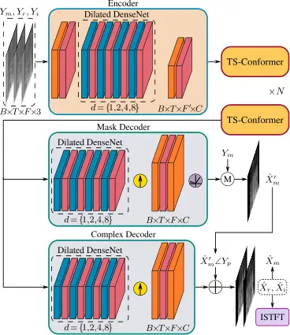

(a) Encoder-decoders generator architecture

Fig. 2: An overview of the proposed CMGAN architecture. The masking
operator
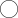
in (a) denotes task-specific operations: element-wise multiplication for
speech denoising/dereverberation and addition for super-resolution
(details in Sec. V-C).

## III Methodology

### III-A Generator architecture

An overview of the generator architecture of CMGAN is shown in
Fig. 2(a). For a distorted speech waveform
$`y\in\mathbb{R}^{L\times 1}`$, an STFT operation first converts the
waveform into a complex spectrogram
$`Y_{o}\in\mathbb{R}^{T\times F\times 2}`$, where $`T`$ and $`F`$ denote
the time and frequency dimensions, respectively. Then the compressed
spectrogram $`Y`$ is obtained by the power-law compression:

```math
Y=|Y_{o}|^{c}e^{jY_{p}}=Y_{m}e^{jY_{p}}=Y_{r}+jY_{i}, \tag{2}
```

where $`Y_{m}`$, $`Y_{p}`$, $`Y_{r}`$ and $`Y_{i}`$ denote the
magnitude, phase, real and imaginary components of the compressed
spectrogram, respectively. $`c`$ is the compression exponent which
ranges from 0 to 1, here we follow Braun et al. \[92\] to set $`c=0.3`$.
The power-law compression of the magnitude equalizes the importance of
quieter sounds relative to loud ones, which is closer to human
perception of sound \[93, 94\]. The real and imaginary parts $`Y_{r}`$
and $`Y_{i}`$ are then concatenated with the magnitude $`Y_{m}`$ as an
input to the generator.

#### III-A1 Encoder

Given the input feature
$`Y_{in}\in\mathbb{R}^{B\times T\times F\times 3}`$, where $`B`$ denotes
the batch size, the encoder consists of two convolution blocks with a
dilated DenseNet \[95\] in between. Each convolution block comprises a
convolution layer, an instance normalization \[96\] and a PReLU
activation \[97\]. The first convolution block is used to extend the
three input features to an intermediate feature map with $`C`$ channels.
The dilated DenseNet contains four convolution blocks with dense
residual connections, the dilation factors of each block are set to {1,
2, 4, 8}. The dense connections can aggregate all previous feature maps
to extract different feature levels. As for the dilated convolutions,
they serve to increase the receptive field effectively while preserving
the kernels and layers count. The last convolution block is responsible
for halving the frequency dimension to $`F^{\prime}=F/2`$ to reduce the
complexity.

#### III-A2 Two-stage conformer block

Conformers \[30, 31\] achieved great success in speech recognition and
separation as they combine the advantages of both transformers and
convolutional neural networks (CNNs). Transformers can capture
long-distance dependencies, while CNNs exploit local features
effectively. Here we employ two conformer blocks sequentially to capture
the time dependency in the first stage and the frequency dependency in
the second stage. As shown in the Fig. 2(b), given a feature map
$`D\in\mathbb{R}^{B\times T\times F^{\prime}\times C}`$, the input
feature map $`D`$ is first reshaped to
$`D^{T}\in\mathbb{R}^{BF^{\prime}\times T\times C}`$ to capture the time
dependency in the first conformer block. Then the output $`D^{T}_{o}`$
is element-wise added with the input $`D^{T}`$ (residual connection) and
reshaped to a new feature map
$`D^{F}\in\mathbb{R}^{BT\times F^{\prime}\times C}`$. The second
conformer thus captures the frequency dependency. After the residual
connection, the final output $`D_{o}`$ is reshaped back to the input
size.

Similar to \[30\], each conformer block utilizes two half-step
feed-forward neural networks (FFNNs). Between the two FFNNs, a
multi-head self-attention (MHSA) with four heads is employed, followed
by a convolution module. The convolution module depicted in Fig. 2(b)
starts with a layer normalization, a point-wise convolution layer and a
gated linear unit (GLU) activation to diminish the vanishing gradient
problem. The output of the GLU is then passed to a 1D-depthwise
convolution layer with a swish activation function, then another
point-wise convolution layer. Finally, a dropout layer is used to
regularize the network. Also, a residual path connects the input to the
output.

#### III-A3 Decoder

The decoder extracts the output from $`N`$ two-stage conformer blocks in
a decoupled way, which includes two paths: the mask decoder and the
complex decoder. The mask decoder aims to predict a mask that will be
element-wise multiplied by the input magnitude $`Y_{m}`$ to predict
$`\hat{X}^{\prime}_{m}`$. On the other hand, the complex decoder
directly predicts the real and imaginary parts. Both mask and complex
decoders consist of a dilated DenseNet, similar to the one in the
encoder. The sub-pixel convolution layer is utilized in both paths to
upsample the frequency dimension back to $`F`$ \[98\]. For the mask
decoder, a convolution block is used to squeeze the channel number to 1,
followed by another convolution layer with PReLU activation to predict
the final mask. Note that the PReLU activation learns different slopes
for each frequency band and initially the slopes are defined as a fixed
positive value (0.2). Post-training evaluation indicates that all the
slopes reflect different negative values, i.e., the output mask is
always projected in the positive 1^(st) and 2^(nd) quadrants, as
depicted in Fig. 3. For the complex decoder, the architecture is
identical to the mask decoder, except no activation function is applied
for the complex output.

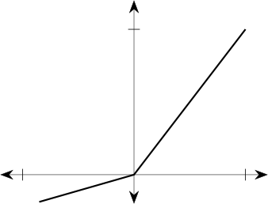

(a) Before training

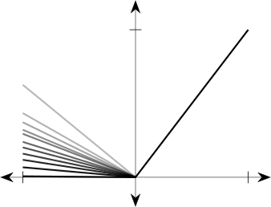

(b) After training

Fig. 3: PReLU slopes of the resultant magnitude mask.

Same as in \[13, 27\], the masked magnitude $`\hat{X}^{\prime}_{m}`$ is
first combined with the noisy phase $`Y_{p}`$ to obtain the
magnitude-enhanced complex spectrogram. Then it is element-wise summed
with the output of the complex decoder
$`(\hat{X}^{\prime}_{r},\hat{X}^{\prime}_{i})`$ to obtain the final
complex spectrogram:

```math
\hat{X}_{r}=\hat{X}^{\prime}_{m}\cos(Y_{p})+\hat{X}^{\prime}_{r}\hskip 22.76219pt\hat{X}_{i}=\hat{X}^{\prime}_{m}\sin(Y_{p})+\hat{X}^{\prime}_{i} \tag{3}
```

The power-law compression is then inverted on the complex spectrogram
$`(\hat{X}_{r},\hat{X}_{i})`$ and an inverse short-time Fourier
transform (ISTFT) is applied to get the time-domain signal $`\hat{x}`$,
as shown in Fig. 4(a). To further improve the magnitude component and
propagate magnitude loss on both decoder branches, we compute the
magnitude loss on $`\hat{X}_{m}`$ expressed by:

```math
\hat{X}_{m}=\sqrt{\hat{X}_{r}^{2}+\hat{X}_{i}^{2}} \tag{4}
```

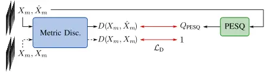 (b)
Discriminator loss
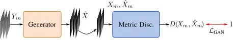 (c)
Adversarial generator loss

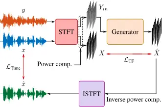

(a) Non-adversarial generator losses

Fig. 4: An illustration of the propagated loss functions in the CMGAN
architecture. For simplicity, $`X`$ and $`\hat{X}`$ denote the
three-channel magnitude and complex representations of the clean target
and the estimated output spectrograms, respectively.

### III-B Metric discriminator

In SE, the objective functions are often not directly correlated to the
evaluation metrics. Consequently, even if the objective loss is
optimized, the evaluation score is still not satisfied. Furthermore,
some evaluation metrics like perceptual evaluation of speech quality
(PESQ) \[99\] and short-time objective intelligibility (STOI) \[100\]
cannot be used as loss functions because they are non-differentiable.
Hence, the discriminator in CMGAN aims to mimic the metric score and use
it as a part of the loss function. Here we follow the MetricGAN to use
the PESQ score as a label \[11\]. As shown in Fig. 2(c), the
discriminator consists of four convolution blocks. Each block starts
with a convolution layer, followed by instance normalization and a PReLU
activation. After the convolution blocks, a global average pooling is
followed by two feed-forward layers and a sigmoid activation. The
discriminator is then trained to estimate the maximum normalized PESQ
score ($`=1`$), by using the clean magnitude as both reference and
degraded inputs. Additionally, the discriminator is trained to estimate
the enhanced PESQ score by taking both clean and enhanced spectrum as an
input together with their corresponding PESQ label, as shown in
Fig. 4(b). On the other hand, the generator is trained to render an
enhanced speech resembling the clean speech, thus approaching a PESQ
label of 1, as shown in Fig. 4(c).

### III-C Loss functions

Inspired by Braun et al. \[92\], we use a linear combination of
magnitude loss $`\mathcal{L}_{\small\textrm{Mag.}}`$ and complex loss
$`\mathcal{L}_{\small\textrm{RI}}`$ in the TF-domain:

```math
\displaystyle\mathcal{L}_{\small\textrm{TF}}=\alpha\,\mathcal{L}_{\small\textrm{Mag.}}+(1-\alpha)\,\mathcal{L}_{\small\textrm{RI}} \tag{5}
```

```math
\displaystyle\mathcal{L}_{\small\textrm{Mag.}}=\mathbb{E}_{X_{m},\hat{X}_{m}}\big[\|X_{m}-\hat{X}_{m}\|_{2}\big]
```

```math
\displaystyle\mathcal{L}_{\small\textrm{RI}}=\mathbb{E}_{X_{r},\hat{X}_{r}}\big[\|X_{r}-\hat{X}_{r}\|_{2}\big]+\mathbb{E}_{X_{i},\hat{X}_{i}}\big[\|X_{i}-\hat{X}_{i}\|_{2}\big],
```

where $`\alpha`$ is a chosen weight. Based on grid search,
$`\alpha=0.7`$ leads to the best performance. Similar to least-square
GANs \[101\], the adversarial training is following a min-min
optimization task over the discriminator loss
$`\mathcal{L}_{\small\textrm{D}}`$ and the corresponding generator loss
$`\mathcal{L}_{\small\textrm{GAN}}`$ expressed as follows:

```math
\displaystyle\mathcal{L}_{\small\textrm{GAN}}=\mathbb{E}_{X_{m},\hat{X}_{m}}\big[\|D(X_{m},\hat{X}_{m})-1\|_{2}\big] \tag{6}
```

```math
\displaystyle\begin{split}\mathcal{L}_{\small\textrm{D}}&=\mathbb{E}_{X_{m}}\big[\|D(X_{m},X_{m})-1\|_{2}\big]\\
&+\mathbb{E}_{X_{m},\hat{X}_{m}}\big[\,\|D(X_{m},\hat{X}_{m})-Q_{\small\textrm{PESQ}}\|_{2}\big],\end{split}
```

where $`D`$ refers to the discriminator and $`Q_{\small\textrm{PESQ}}`$
refers to the normalized PESQ score. Here we normalize the PESQ score to
the range \[0,1\]. Moreover, an additional penalization in the resultant
waveform $`\mathcal{L}_{\small\textrm{Time}}`$ is proven to improve the
restored speech quality \[23\]:

```math
\mathcal{L}_{\small\textrm{Time}}=\mathbb{E}_{x,\hat{x}}\big[\|x-\hat{x}\|_{1}\big], \tag{7}
```

where $`\hat{x}`$ is the enhanced waveform, and $`x`$ is the clean
target waveform. In this context, $`\|\cdot\|_{1}`$ denotes the
$`\ell^{1}-`$norm (sum of absolute values), and $`\|\cdot\|_{2}`$
represents the $`\ell^{2}-`$norm (Euclidean distance). The final
generator loss is formulated as follows:

```math
\mathcal{L}_{\small\textrm{G}}=\gamma_{1}\,\mathcal{L}_{\small\textrm{TF}}+\gamma_{2}\,\mathcal{L}_{\small\textrm{GAN}}+\gamma_{3}\,\mathcal{L}_{\small\textrm{Time}}, \tag{8}
```

where $`\gamma_{1},\gamma_{2}`$ and $`\gamma_{3}`$ are the weights of
the corresponding losses and they are chosen to reflect equal
importance.

## IV Experiments

### IV-A Datasets

#### IV-A1 Denoising

We investigate our proposed approach on the commonly used publicly
available Voice Bank+DEMAND dataset \[7\]. The clean tracks are selected
from the Voice Bank corpus \[102\] which includes 11,572 utterances from
28 speakers in the training set and 824 utterances from 2 unseen
speakers in the test set. In the training set, the clean utterances are
mixed with background noise (8 noise types from DEMAND database \[103\]
and 2 artificial noise types) at SNRs of 0 dB, 5 dB, 10 dB and 15 dB. In
the test set, the clean utterances are mixed with 5 unseen noise types
from the DEMAND database at SNRs of 2.5 dB, 7.5dB, 12.5 dB and 17.5 dB.
The noise types are mostly challenging, e.g., public space noises
(cafeteria, restaurant and office), domestic noises (kitchen and living
room) and transportation/street noises (car, metro, bus, busy traffic,
public square and subway station). All utterances are resampled to 16
kHz in our experiments.

#### IV-A2 Dereverberation

We choose the REVERB challenge dataset \[8\], the utterances are divided
into simulated and real recordings. The simulated data is based on the
wall street journal corpus (WSJCAM0) \[104\] distorted by measured RIRs
and a stationary ambient noise of SNR $`=`$ 20 dB. The measured RIRs
represent three different room sizes: small – room 1, medium – room 2
and large – room 3, with a 60 dB reverberation time ($`\tau`$) of 0.3,
0.6 and 0.7 seconds, respectively. For each room, the microphone is
placed at a near condition (0.5 m) and a far condition (2 m). The real
data is based on the multi-channel wall street journal audio-visual
(MC-WSJ-AV) corpus \[105\], where the speakers are recording in a large
room of $`\tau`$ = 0.7 seconds at a near (1 m) and a far (2.5 m)
microphone conditions. The training set includes 7861 paired utterances
from the simulated data. The test set contains both simulated paired
utterances (2176) and real reverberant utterances (372). Different room
recordings are used for the training and test sets. The datasets were
originally captured in a single-channel, two-channel and eight-channel
configuration with a 16 kHz sampling frequency. However, for the scope
of this study, we only use the single-channel configuration.

#### IV-A3 Super-resolution

For comparative analysis, we utilize the English multi-speaker corpus
(VCTK) \[106\]. The VCTK dataset contains 44 hours recordings from 108
speakers with various English accents. For the super-resolution
experiment, we follow the design choice of \[86\], where the
low-resolution audio signal is generated from the 16 kHz original tracks
by subsampling the signal with the desired upscaling ratio ($`s`$). The
first task uses a single VCTK speaker (p225), the first 223 recordings
are used for training and the last 8 recordings are used for testing.
The second task takes the first 100 VCTK speakers as the training set
and tests on the last 8 speakers. The upscaling ratios for both the
single-speaker and the multi-speaker tasks are set to {2, 4, 8},
representing a reconstruction from 8 kHz, 4 kHz, 2 kHz to 16 kHz.

|                     |      |                   |                |      |      |      |      |       |      |
| ------------------- | ---- | ----------------- | -------------- | ---- | ---- | ---- | ---- | ----- | ---- |
| Method              | Year | Input             | Model Size (M) | PESQ | CSIG | CBAK | COVL | SSNR  | STOI |
| Noisy               | -    | -                 | -              | 1.97 | 3.35 | 2.44 | 2.63 | 1.68  | 0.91 |
| SEGAN \[14\]        | 2017 | Time              | 97.47          | 2.16 | 3.48 | 2.94 | 2.80 | 7.73  | 0.92 |
| MetricGAN \[11\]    | 2019 | Magnitude         | -              | 2.86 | 3.99 | 3.18 | 3.42 | -     | -    |
| PHASEN \[12\]       | 2020 | Magnitude+Phase   | -              | 2.99 | 4.21 | 3.55 | 3.62 | 10.08 | -    |
| TSTNN \[16\]        | 2021 | Time              | 0.92           | 2.96 | 4.10 | 3.77 | 3.52 | 9.70  | 0.95 |
| DEMUCS \[17\]       | 2021 | Time              | 128            | 3.07 | 4.31 | 3.40 | 3.63 | -     | 0.95 |
| PFPL \[107\]        | 2021 | Complex           | -              | 3.15 | 4.18 | 3.60 | 3.67 | -     | 0.95 |
| MetricGAN+ \[108\]  | 2021 | Magnitude         | -              | 3.15 | 4.14 | 3.16 | 3.64 | -     | -    |
| SE-Conformer \[18\] | 2021 | Time              | -              | 3.13 | 4.45 | 3.55 | 3.82 | -     | 0.95 |
| DB-AIAT \[13\]      | 2021 | Complex+Magnitude | 2.81           | 3.31 | 4.61 | 3.75 | 3.96 | 10.79 | 0.96 |
| DPT-FSNet \[29\]    | 2021 | Complex           | 0.91           | 3.33 | 4.58 | 3.72 | 4.00 | -     | 0.96 |
| CMGAN               | 2022 | Complex+Magnitude | 1.83           | 3.41 | 4.63 | 3.94 | 4.12 | 11.10 | 0.96 |

TABLE I: Performance comparison on the Voice Bank+DEMAND dataset \[7\].
“-” denotes the result is not provided in the original paper. Model size
represents the number of trainable parameters in million.

### IV-B Experimental setup

The utterances in the training set are sliced into 2 seconds, while in
the test set, no slicing is utilized and the length is kept variable. A
Hamming window with 25 ms window length (400-point FFT) and hop size of
6.25 ms (75% overlap) is employed. Thus, the resultant spectrogram will
have 200 frequency bins $`F`$, while the time dimension $`T`$ depends on
the variable track duration. The number of two-stage conformer blocks
$`N`$, the batch size $`B`$ and the channel number $`C`$ in the
generator are set to 4, 4 and 64, respectively. The channel numbers in
the metric discriminator are set to {16, 32, 64, 128}. In the training
stage, AdamW optimizer \[109\] is used for both the generator and the
discriminator to train for 50 epochs. The learning rate is set to
5$`\times`$10⁻⁴ for the generator and 1$`\times`$10⁻³ for the
discriminator. A learning rate scheduler is applied with a decay factor
of 0.5 every 12 epochs. In the generator loss
$`\mathcal{L}_{\small\textrm{G}}`$, the weights are set to
$`\{\gamma_{1}=1,\gamma_{2}=0.01,\gamma_{3}=1\}`$. The detailed
parameter setup of both generator and discriminator is presented in
Appendix.

## V Results and discussion

For the three tasks discussed in this section, all methods, including
baselines and proposed approaches, are evaluated using standard
benchmarks. The reported numbers adhere to the consistent train/test
splits that these benchmarks specify.

### V-A Denoising

#### Objective scores

We choose a set of commonly used metrics to evaluate the denoised speech
quality, i.e., PESQ with a score range from -0.5 to 4.5, segmental
signal-to-noise ratio (SSNR) and composite mean opinion score (MOS)
\[110\] based metrics: MOS prediction of the signal distortion (CSIG),
MOS prediction of the intrusiveness of background noise (CBAK) and MOS
prediction of the overall effect (COVL), all of them are within a score
range of 1 to 5. Additionally, we utilize STOI with a score range from 0
to 1 to judge speech intelligibility. Higher values indicate better
performance for all given metrics.

#### Results analysis

Our proposed CMGAN is objectively compared with other state-of-the-art
(SOTA) denoising baselines, as shown in Table I. For the time-domain
methods, we included the standard SEGAN \[14\] and three recent methods:
TSTNN \[16\], DEMUCS \[17\] and SE-Conformer \[18\]. It is worth noting
that DEMUCS is trained not only on the standard Voice Bank+DEMAND
dataset \[7\], but also incorporates additional data from the
DNS-Challenge \[10\]. For the TF-domain methods, we evaluate six recent
SOTA methods, i.e., MetricGAN \[11\], PHASEN \[12\], PFPL \[107\],
MetricGAN+ \[108\], DB-AIAT \[13\] and DPT-FSNet \[29\]. It can be
observed that most of the TF-domain methods outperform the time-domain
counterparts over all utilized metrics. Moreover, our proposed TF
conformer-based approach shows a major improvement over the time-domain
SE-Conformer. Compared to frameworks involving metric discriminators
(MetricGAN+), we have 0.26, 0.49, 0.78 and 0.48 improvements on the
PESQ, CSIG, CBAK and COVL scores, respectively. Finally, our framework
also outperforms recent improved transformer-based methods, such as
DB-AIAT and DPT-FSNet in all of the evaluation scores with a relatively
low model size of only 1.83 M parameters.

|                                    |      |      |      |      |       |      |
| ---------------------------------- | ---- | ---- | ---- | ---- | ----- | ---- |
| Method                             | PESQ | CSIG | CBAK | COVL | SSNR  | STOI |
| CMGAN                              | 3.41 | 4.63 | 3.94 | 4.12 | 11.10 | 0.96 |
| Inputs & Decoders                  |      |      |      |      |       |      |
| Single-Mask                        | 3.23 | 4.60 | 3.76 | 4.00 | 9.82  | 0.95 |
| Single-Complex                     | 3.35 | 4.56 | 3.79 | 4.05 | 9.19  | 0.96 |
| Dual-Mask                          | 3.23 | 4.62 | 3.79 | 4.01 | 10.20 | 0.96 |
| Dual-Complex                       | 3.39 | 4.63 | 3.82 | 4.10 | 9.41  | 0.95 |
| Single-Path                        | 3.38 | 4.54 | 3.86 | 4.05 | 10.19 | 0.96 |
| Mask + cIRM                        | 3.28 | 4.60 | 3.83 | 4.03 | 10.40 | 0.96 |
| Loss functions & Discriminator     |      |      |      |      |       |      |
| w/o Time Loss                      | 3.45 | 4.56 | 3.86 | 4.11 | 9.71  | 0.96 |
| w/o Disc.                          | 3.24 | 4.46 | 3.82 | 3.93 | 10.56 | 0.96 |
| Patch Disc.                        | 3.28 | 4.48 | 3.85 | 3.96 | 10.75 | 0.96 |
| Pretrained Disc.                   | 3.23 | 4.48 | 3.83 | 3.93 | 10.76 | 0.96 |
| MetricGAN+ Disc.                   | 3.44 | 4.61 | 3.87 | 4.13 | 9.83  | 0.96 |
| PESQ + STOI Disc.                  | 3.41 | 4.63 | 3.89 | 4.12 | 10.34 | 0.96 |
| TS-Conformer design                |      |      |      |      |       |      |
| Parallel-Conf.                     | 3.35 | 4.54 | 3.87 | 4.03 | 10.63 | 0.96 |
| Freq. $`\rightarrow`$ Time         | 3.39 | 4.56 | 3.91 | 4.07 | 10.84 | 0.96 |
| Magnitude mask activation function |      |      |      |      |       |      |
| Sigmoid                            | 3.34 | 4.52 | 3.80 | 4.02 | 10.70 | 0.96 |
| ReLU                               | 3.32 | 4.54 | 3.80 | 4.04 | 10.69 | 0.96 |
| Softplus                           | 3.43 | 4.58 | 3.83 | 4.02 | 10.75 | 0.96 |

TABLE II: Results of the denoising ablation study.

#### Ablation study

To verify our design choices, an ablation study is conducted, as shown
in Table II. We first investigate the influence of different inputs and
decoders. For the Single-Mask configuration, only magnitude is used as
the input. The enhanced magnitude is then combined with the noisy phase
for the ISTFT operation, omitting the complex decoder. Conversely, the
Single-Complex approach solely uses the complex spectrogram as input,
and the mask decoder is removed. The drop in the PESQ score from 3.35 in
Single-Complex to 3.23 in Single-Mask emphasizes the crucial influence
of phase information on the enhanced speech quality. Turning our
attention to SSNR, the Single-Mask setup using magnitude-based masking
reaches 9.82 dB, while the Single-Complex with its complete input
representation attains only 9.19 dB. This suggests that, for
segment-specific metrics like SSNR, explicit masking remains vital.

To ascertain whether the advancements of CMGAN stemmed from the synergy
between both mask and complex decoders rather than just an increased
parameter count, we introduced two additional configurations: Dual-Mask
and Dual-Complex. The Dual-Mask design used magnitude-only as input and
featured two mask decoders. Both decoders received the same input, with
the output from the first mask decoder being subsequently masked by the
second before being combined with the noisy phase. With an identical
parameter count to CMGAN, this configuration displayed minor
improvements in most metrics when compared to its Single-Mask
counterpart. Notably, there was a rise of 0.38 dB in SSNR, reinforcing
the link between SSNR and effective masking techniques. In contrast, the
Dual-Complex setup solely relied on the complex representation and
incorporated an additional complex decoder, with both decoders summing
their outputs to produce the final result. While this approach displayed
metric improvements, it did not achieve the performance levels exhibited
by CMGAN, underscoring the importance of integrating both mask and
complex decoders in our design.

To further evaluate the efficacy of our design decisions, we implemented
two additional modifications. First, we explored the necessity of
decoder decoupling in complex refinement through the Single-Path decoder
configuration. In this setup, we employed a single decoder that produces
three channels: the first channel undergoes a PReLU activation for
magnitude, while the subsequent two channels, which represent the
complex component, have no activation. A comparison with our primary
mask/complex decoders indicates a decline across all metrics, most
significantly in the SSNR metric with a decrease of 0.91 dB. In another
separate alteration, Mask + cIRM, we maintained the mask decoder while
adjusting the complex decoder to integrate a cIRM inspired by \[24\].
This change resulted in a notable reduction in both PESQ and SSNR when
compared to the original CMGAN setup.

Fig. 5: Histogram of masking PReLU activations.

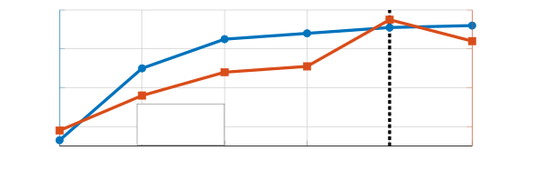

Fig. 6: Influence of TS-Conformer blocks on objective scores.

In our exploration of loss functions, several variations revealed
insightful impacts on performance metrics. The omission of time loss
(w/o Time Loss) led to an improvement in the PESQ score, reaching 3.45,
but with a noticeable effect on SSNR. This indicates the effectiveness
of the time loss in balancing the performance for both PESQ and SSNR
scores. Further, two discriminator-based assessments were conducted: one
that entirely removed the discriminator (w/o Disc.) and another that
substituted the metric discriminator with a patch discriminator,
commonly employed in image generation tasks \[111\]. It can be realized
that the absence of the discriminator negatively impacted all the given
scores. Similarly, adding a patch discriminator only showed a marginal
improvement, which reflects that the generator is fully capable of
enhancing the tracks without the aid of a normal patch discriminator.
However, a metric discriminator to directly improve the evaluation
scores is proven to be beneficial.

For the Pretrained Disc. experiment, the discriminator was pretrained to
predict normalized PESQ. During its training, the discriminator lacked
access to enhanced tracks, with noisy tracks taking their place. The
generator then integrated this loss, which was derived from the
pretrained discriminator, with other reconstruction losses. Throughout
the generator training, the discriminator remained frozen, receiving no
updates from the generator. This approach resulted in reduced
performance across all metrics compared to CMGAN. These findings
highlight the importance of adversarial training, which can be largely
attributed to the dynamic feedback loop it establishes for better model
generalization. With the MetricGAN+ Disc. setup, noisy tracks were
included in the discriminator loss. While there was a minor uplift in
PESQ, other metrics remained unchanged or even registered a decline in
SSNR. Such outcomes suggest potential instabilities when directing the
discriminator with a broader objective set. Our hands-on observations
led us to persist with the original MetricGAN loss structure. Exploring
the PESQ + STOI Disc. method, we incorporated an extra discriminator to
estimate the STOI in conjunction with PESQ. The results closely
paralleled those of CMGAN, suggesting a possible ceiling in STOI
optimization. The aforementioned discriminator adjustments illustrate
the intricate interplay between metric discriminators and SSNR.
Introducing extra tailored discriminators or additional objectives can
negatively impact SSNR, highlighting the significance of careful design
decisions.

Furthermore, we investigate the influence of the two-stage conformer
design. Given an input feature map, the two-stage conformer will
separately focus on the time and frequency dimensions. To this end, two
different configurations can be proposed, either sequential or parallel.
Accordingly, we compare our sequential CMGAN to a parallel connection
counterpart without any further modifications (Parallel-Conf.). The
results illustrate that the parallel approach lags behind the proposed
sequential design, with the PESQ and SSNR scores reduced by 0.06 and
0.47 dB, respectively. A possible explanation is that parallel
conformers might learn redundant or conflicting patterns, lacking the
synergistic benefits seen in sequential models. Additionally, we flipped
the order of the sequential conformer blocks (Freq. $`\rightarrow`$
Time) and found the scores to be similar with a slight improvement in
favor of the standard CMGAN (Time $`\rightarrow`$ Freq.). Note that
designing a single conformer to attend over both time and frequency is
theoretically possible. However, in this case, the complexity will grow
exponentially \[112\].

Preliminary literature mostly assumes the predicted magnitude mask to be
between 0 and 1 \[12, 11, 13, 61, 108\]. Hence, sigmoid activation is
usually the preferred activation to reflect this interval. Although this
is true, a bounded sigmoid function would restrict the model to allocate
values between 0 and 0.5 to all aggregated negative activations from the
previous layer. On the other hand, an unbounded activation function such
as PReLU could automatically learn this interval while mitigating the
negative activations issue by learning a relevant slope to each
frequency band as explained in Sec. III-A. To confirm this assumption,
we construct a histogram of several magnitude masks from different noisy
tracks. As shown in Fig. 5, the PReLU activations would always lie in
the 0 to 1 interval. Moreover, the majority of low activations are
assigned to frequency bands above 5 kHz (beyond human speech) \[113\].
We also extend our ablation study to involve different bounded and
unbounded activations for the mask decoder, namely sigmoid, ReLU and the
soft version of ReLU (softplus) \[114\]. According to Table II, both
sigmoid and ReLU activations are comparable and they report lower scores
than CMGAN with PReLU activation. Softplus achieves slightly higher
PESQ, but at the expense of other metrics.

|                    |                   |      |      |      |                    |      |      |      |                       |       |       |       |                   |      |      |      |                        |
| ------------------ | ----------------- | ---- | ---- | ---- | ------------------ | ---- | ---- | ---- | --------------------- | ----- | ----- | ----- | ----------------- | ---- | ---- | ---- | ---------------------- |
|                    | CD $`\downarrow`$ |      |      |      | LLR $`\downarrow`$ |      |      |      | FWSegSNR $`\uparrow`$ |       |       |       | SRMR $`\uparrow`$ |      |      |      | SRMR-real $`\uparrow`$ |
| Room               | 1                 | 2    | 3    | Avg. | 1                  | 2    | 3    | Avg. | 1                     | 2     | 3     | Avg.  | 1                 | 2    | 3    | Avg. | -                      |
| Reverberant speech | 1.99              | 4.63 | 4.38 | 3.67 | 0.35               | 0.49 | 0.65 | 0.50 | 8.12                  | 3.35  | 2.27  | 4.58  | 4.50              | 3.74 | 3.57 | 3.94 | 3.17                   |
| Xiao et al. \[82\] | 1.58              | 2.65 | 2.68 | 2.30 | 0.37               | 0.50 | 0.52 | 0.46 | 9.79                  | 7.27  | 6.83  | 7.96  | 5.74              | 6.49 | 5.86 | 6.03 | 4.29                   |
| WRN \[81\]         | 2.02              | 4.61 | 4.15 | 3.59 | 0.36               | 0.46 | 0.60 | 0.47 | 8.28                  | 3.57  | 2.54  | 4.80  | 4.04              | 3.46 | 3.27 | 3.59 | -                      |
| U-Net \[79\]       | 1.75              | 2.58 | 2.53 | 2.28 | 0.20               | 0.41 | 0.45 | 0.35 | 13.32                 | 10.87 | 10.40 | 11.53 | 4.51              | 5.09 | 4.94 | 4.85 | 5.47                   |
| SkipConvNet \[80\] | 1.86              | 2.57 | 2.45 | 2.29 | 0.19               | 0.30 | 0.35 | 0.28 | 13.07                 | 10.96 | 10.22 | 11.42 | 4.99              | 4.75 | 4.56 | 4.77 | 7.27                   |
| CMGAN              | 1.46              | 2.14 | 2.27 | 1.96 | 0.14               | 0.25 | 0.34 | 0.24 | 14.36                 | 13.49 | 11.69 | 13.18 | 5.42              | 5.74 | 5.29 | 5.48 | 6.49                   |
| CMGAN-LLR          | 1.69              | 2.56 | 2.43 | 2.23 | 0.15               | 0.25 | 0.25 | 0.22 | 14.48                 | 12.49 | 11.03 | 12.67 | 5.48              | 5.80 | 6.02 | 5.77 | 7.71                   |

TABLE III: Results of simulated and real data on near microphone case.

|                    |                   |      |      |      |                    |      |      |      |                       |       |      |       |                   |      |      |      |                        |
| ------------------ | ----------------- | ---- | ---- | ---- | ------------------ | ---- | ---- | ---- | --------------------- | ----- | ---- | ----- | ----------------- | ---- | ---- | ---- | ---------------------- |
|                    | CD $`\downarrow`$ |      |      |      | LLR $`\downarrow`$ |      |      |      | FWSegSNR $`\uparrow`$ |       |      |       | SRMR $`\uparrow`$ |      |      |      | SRMR-real $`\uparrow`$ |
| Room               | 1                 | 2    | 3    | Avg. | 1                  | 2    | 3    | Avg. | 1                     | 2     | 3    | Avg.  | 1                 | 2    | 3    | Avg. | -                      |
| Reverberant speech | 2.67              | 5.21 | 4.96 | 4.28 | 0.38               | 0.75 | 0.84 | 0.66 | 6.68                  | 1.04  | 0.24 | 2.65  | 4.58              | 2.97 | 2.73 | 3.43 | 3.19                   |
| Xiao et al. \[82\] | 1.92              | 3.17 | 2.99 | 2.69 | 0.41               | 0.61 | 0.58 | 0.53 | 9.12                  | 6.31  | 5.97 | 7.13  | 5.67              | 5.80 | 5.03 | 5.50 | 4.42                   |
| WRN \[81\]         | 2.43              | 4.99 | 4.56 | 3.99 | 0.35               | 0.59 | 0.67 | 0.54 | 7.54                  | 1.79  | 0.88 | 3.40  | 4.48              | 3.32 | 2.84 | 3.55 | -                      |
| U-Net \[79\]       | 2.05              | 3.19 | 2.92 | 2.72 | 0.26               | 0.57 | 0.56 | 0.46 | 12.08                 | 9.00  | 9.05 | 10.04 | 4.76              | 5.27 | 4.71 | 4.91 | 5.68                   |
| SkipConvNet \[80\] | 2.12              | 3.06 | 2.82 | 2.67 | 0.22               | 0.46 | 0.46 | 0.38 | 11.80                 | 8.88  | 8.16 | 9.61  | 5.10              | 4.76 | 4.25 | 4.70 | 6.87                   |
| CMGAN              | 1.88              | 2.90 | 2.85 | 2.54 | 0.24               | 0.43 | 0.47 | 0.38 | 11.65                 | 10.34 | 8.91 | 10.30 | 5.78              | 5.87 | 4.69 | 5.45 | 6.61                   |
| CMGAN-LLR          | 2.07              | 3.32 | 3.05 | 2.81 | 0.24               | 0.46 | 0.40 | 0.37 | 11.21                 | 9.22  | 9.48 | 9.97  | 5.93              | 5.54 | 5.19 | 5.55 | 7.62                   |

TABLE IV: Results of simulated and real data on far microphone case.

Finally, we experiment with the number of TS-Conformer blocks. As shown
in Fig. 6, the performance of CMGAN without any conformer blocks is
acceptable and even comparable with other SOTA methods, such as
MetricGAN. However, only one conformer block effectively improves the
PESQ by 0.4. The performance gradually increases with more blocks until
no further improvement is observed after four blocks. Due to space
constraints, the original CMGAN will be considered for upcoming tasks
with few relevant ablation studies.

### V-B Dereverberation

#### Objective scores

For dereverberation, we utilize the recommended measures in the REVERB
challenge paper \[8\]: cepstrum distance (CD) \[115\], log-likelihood
ratio (LLR) \[116\], frequency weighted segmental SNR (FWSegSNR) \[117\]
and speech-to-dereverberation modulation energy ratio (SRMR) \[118\].
The paper also recommended PESQ as an optional measure, although most of
the latest dereverberation literature did not take it into account. For
outliers reduction, authors in \[110\] suggested limiting the ranges of
CD to \[0,10\] and LLR to \[0,2\]. Lower values indicate better scores
for CD and LLR, while higher values indicate better speech quality for
FWSegSSNR, PESQ and SRMR. The CD, LLR, FWSegSNR and PESQ are chosen as
they correlate to listening tests, albeit they are all intrusive scores,
i.e., enhanced speech and clean reference are required. Accordingly,
SRMR is employed as a non-intrusive score to operate on enhanced speech
without a clean reference. Thus, it is quite important to measure the
quality and intelligibility of enhanced unpaired real recordings.

#### Results

For quantitative analysis, the CMGAN is compared with recent
dereverberation methods. As discussed in Sec. II-B, using time-domain
approaches in dereverberation is limited and these methods did not use
the REVERB challenge data. Thus, the chosen methods would all consider
TF-domain analysis. For fair comparison, only papers recording
individual room scores are considered. Based on this criteria, we
compare against four recent methods: Xiao _et al._ \[82\], U-Net \[79\],
wide residual network (WRN) \[81\] and SkipConvNet \[80\].
Unfortunately, none of these papers reported the PESQ scores, so it is
excluded from the comparative analysis. However, PESQ is still used as
the objective score to be maximized by the metric discriminator in
CMGAN.

The results for both near and far microphone cases are shown in
Table III and IV, respectively. The first four columns represent the
simulated data results for the three different room sizes (small – room
1, medium – room 2, large – room 3 and average score). The last column
represents the SRMR of the real recordings. As expected, larger rooms
and further microphone placements result in lower scores, as these
scenarios would introduce more distortions to the speech.

In the simulated near microphone case, the proposed CMGAN shows superior
performance compared to other methods in the majority of metrics,
particularly FWSegSNR. For SRMR, Xiao _et al._ reports a higher SRMR
score on simulated near data, but a significant drop is observed in near
real recordings. SkipConvNet achieves better real SRMR scores in the
near case but worse on the simulated data. U-Net and SkipConvNet report
overall competitive scores, although CMGAN outperforms in average CD and
FWSegSNR with 0.3 and 1.65 dB, respectively. For the far microphone,
CMGAN is still able to show a gain in overall scores, especially
FWSegSNR. Xiao _et al._ is still slightly better in SRMR for simulated
data, but the gap is much closer than the near microphone case, only
0.05 on average. The same holds for SkipConvNet with slightly better
real SRMR scores than the proposed CMGAN.

#### Ablation study

To validate the PESQ choice for metric discriminator, we introduce a
CMGAN variant operating on LLR as the objective metric discriminator
score (CMGAN-LLR). LLR is chosen as it reflects a bounded metric and
based on the LS-GAN formulation \[101\], the metric discriminator is
more robust when the optimization space is bounded by a normalized
score. Accordingly, we modify Eq. 6 to involve the normalized LLR scores
$`Q_{LLR}`$ instead of $`Q_{PESQ}`$ and the term 1 is changed to 0 in
both $`\mathcal{L}_{\small\textrm{GAN}}`$ and
$`\mathcal{L}_{\small\textrm{D}}`$. Thus, the score is minimized to 0
instead of maximized to 1. It can be shown in Table III and IV that the
LLR score is marginally better than the original CMGAN trained with
PESQ. However, a considerable improvement is observed in SRMR scores for
both simulated and real recordings, especially in the near microphone
case. Moreover, the CMGAN-LLR variant outperforms the SkipConvNet in
real recordings for near and far microphone cases by 0.44 and 0.75,
respectively. Comparing both CMGAN and CMGAN-LLR shows a balanced
performance over most of the given metrics in favor of the standard
proposed CMGAN, which indicates that the PESQ is a robust metric to
optimize and is highly correlated with most of the given quality
metrics.

### V-C Super-resolution


(a) Low-resolution input


(b) Predicted mask $`M^{\prime}`$


(c) Predicted output


(d) High-resolution reference

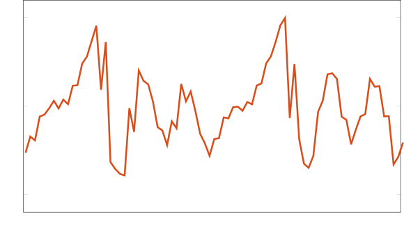

(e) 4 kHz input segment

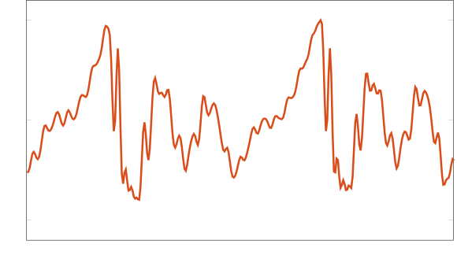

(f) 16 kHz predicted segment

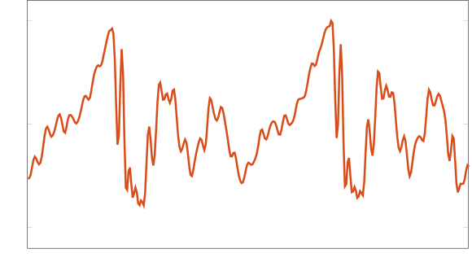

(g) 16 kHz reference segment

Fig. 7: Example of scale 4 super-resolution (4 kHz $`\rightarrow`$ 16
kHz). The upper row represents the TF-magnitude representations of the
relevant spectrograms. The bottom row shows a 20 ms segment of the
corresponding time-domain signals.

#### Objective scores

Two metrics, log-spectral distance (LSD) and signal-to-noise ratio
(SNR), are used to evaluate super-resolution. Based on our literature
review, the LSD definition is not the same for all papers.
Mathematically, LSD measures the log distance between the magnitude
spectrogram component of the enhanced speech with respect to the clean
reference. Some papers would use the log to the base $`e`$, while others
would evaluate the log to base 10. In both definitions, the STFT is
evaluated with a Hanning window of 2048 samples and a hop size of 512.
To ensure a fair comparison, the same STFT parameterization is used and
the LSD results based on the two different definitions in the literature
are presented. A lower LSD and a higher SNR represent better speech
quality.

#### Results

Since masking-based methods are not relevant for the super-resolution
task, as previously stated in Sec. II-C. Therefore, the CMGAN mask
decoder part is modified by involving an element-wise addition instead
of element-wise multiplication. This is reflected in Eq. 3 as follows:

```math
\displaystyle\hat{X}_{r}=(M^{\prime}+Y_{m})\cos{Y_{p}}+\hat{X}^{\prime}_{r} \tag{9}
```

```math
\displaystyle\hat{X}_{i}=(M^{\prime}+Y_{m})\sin{Y_{p}}+\hat{X}^{\prime}_{i},
```

where $`M^{\prime}`$ represents the modified output of the mask decoder.
Unlike the prior cases of denoising and dereverberation, the network is
not learning mask activations between 0 and 1 to suppress the noise and
preserve the speech, but rather activations that can complete the
missing high-frequency bands while preserving the given low-frequency
bands.

|              |       |                                |                                 |                  |                                |                                 |                  |
| ------------ | ----- | ------------------------------ | ------------------------------- | ---------------- | ------------------------------ | ------------------------------- | ---------------- |
|              |       | VCTK-Single                    |                                 |                  | VCTK-Multi.                    |                                 |                  |
| Method       | $`s`$ | $`\textrm{LSD}_{e}\downarrow`$ | $`\textrm{LSD}_{10}\downarrow`$ | SNR $`\uparrow`$ | $`\textrm{LSD}_{e}\downarrow`$ | $`\textrm{LSD}_{10}\downarrow`$ | SNR $`\uparrow`$ |
| U-Net \[86\] | 2     | 3.2                            | -                               | 21.1             | 3.1                            | -                               | 20.7             |
| TFiLM \[88\] | 2     | 2.5                            | -                               | 19.5             | 1.8                            | -                               | 19.8             |
| AFILM \[89\] | 2     | 2.3                            | -                               | 19.3             | 1.7                            | -                               | 20.0             |
| AE \[90\]    | 2     | -                              | 0.9                             | 22.4             | -                              | 0.9                             | 22.1             |
| NVSR \[91\]  | 2     | -                              | -                               | -                | -                              | 0.8                             | -                |
| CMGAN        | 2     | 1.7                            | 0.7                             | 24.7             | 1.6                            | 0.7                             | 24.4             |
| CMGAN-Mag.   | 2     | 1.4                            | 0.6                             | 22.2             | 1.3                            | 0.6                             | 23.4             |
| U-Net \[86\] | 4     | 3.6                            | -                               | 17.1             | 3.5                            | -                               | 16.1             |
| TFiLM \[88\] | 4     | 3.5                            | -                               | 16.8             | 2.7                            | -                               | 15.0             |
| AFILM \[89\] | 4     | 3.1                            | -                               | 17.2             | 2.3                            | -                               | 17.2             |
| TFNet \[87\] | 4     | -                              | 1.3                             | 18.5             | -                              | 1.3                             | 17.5             |
| AE \[90\]    | 4     | -                              | 0.9                             | 18.9             | -                              | 1.0                             | 18.1             |
| NVSR \[91\]  | 4     | -                              | -                               | -                | -                              | 0.9                             | -                |
| CMGAN        | 4     | 2.3                            | 1.0                             | 18.6             | 2.2                            | 1.0                             | 19.1             |
| CMGAN-Mag.   | 4     | 1.7                            | 0.7                             | 16.9             | 1.8                            | 0.8                             | 16.1             |
| TFiLM \[88\] | 8     | 4.3                            | -                               | 12.9             | 2.9                            | -                               | 12.0             |
| AFILM \[89\] | 8     | 3.7                            | -                               | 12.9             | 2.7                            | -                               | 12.0             |
| TFNet \[87\] | 8     | -                              | 1.9                             | 15.0             | -                              | 1.9                             | 12.0             |
| NVSR \[91\]  | 8     | -                              | -                               | -                | -                              | 1.1                             | -                |
| CMGAN        | 8     | 2.6                            | 1.1                             | 12.9             | 2.7                            | 1.2                             | 14.1             |
| CMGAN-Mag.   | 8     | 1.9                            | 0.8                             | 10.9             | 2.0                            | 0.9                             | 10.9             |

TABLE V: Performance comparison for super-resolution, “-” denotes the
result is not provided in the original paper.

As shown in Table V, we compare our approach with five other methods:
the U-Net architecture proposed by Kuleshov et al. \[86\], TFiLM \[88\],
AFiLM \[89\], hybrid TFNet \[87\], hybrid AE \[90\] and NVSR \[91\]. All
the scores are from the corresponding original papers. The value $`s=`$
2/4/8 implies upsampling scale from 8 kHz/4 kHz/2 kHz to 16 kHz speech.
In the VCTK-Single experiment, our method achieved the best score in all
three metrics on scale 2 when converting the audio signal from 8 kHz to
16 kHz, especially in SNR, a 2.3 dB improvement compared to the SOTA AE
method. As for scale 4, the AE method shows a marginal improvement of
0.3 dB and 0.1 in SNR and $`\textrm{LSD}_{10}`$, respectively. In the
scale 8 task, our method exceeds other methods in terms of
$`\textrm{LSD}_{e}`$ and $`\textrm{LSD}_{10}`$. However, the SNR is
lower than TFNet and similar to TFiLM and AFiLM approaches. We
hypothesize that this is accounted for the limited training samples in
the VCTK-Single dataset, which can lead to model overfitting. On the
other hand, in the VCTK-Multi. evaluation, our method outperforms other
approaches in all upscaling ratios on all metrics. Specifically, our
method has an improvement of 2.3 dB, 1.0 dB and 2.1 dB on SNR on scales
2/4/8. Note that CMGAN has a much better performance on scale 8 compared
to the same scale in VCTK-Single evaluation, which verifies the
overfitting assumption.

#### Ablation study

To demonstrate the effectiveness of complex TF-domain super-resolution.
The CMGAN is modified to eliminate both complex decoder and metric
discriminator, leaving only the magnitude loss (CMGAN-Mag.). A
substantial improvement in both $`\textrm{LSD}_{e}`$ and
$`\textrm{LSD}_{10}`$ is observed when the complex branch is removed and
this is expected as the LSD is defined in magnitude component only. This
LSD gain comes at the expense of a significant drop in the SNR scores,
which considers the reconstructed time-domain signal. Thus, removing the
complex branch would give a push in the LSD as the network would focus
only on enhancing the magnitude component but with a degradation in the
overall signal quality.

An illustration of the input, predicted and reference tracks from a
scale 4 example is depicted in Fig. 7. Excitation of high-frequency
bands are clear in the output mask $`M^{\prime}`$. Comparing Fig. 7(c)
and 7(d) shows the potential of the CMGAN in constructing missing
high-frequency bands just from observing different speech phonetics in
the training data. This performance is also reflected as an accurate
interpolation of intermediate samples in the time-domain Fig. 7(e), 7(f)
and 7(g).

## VI Opinion score evaluation

Till now, the proposed architecture is quantitatively compared to
different SOTA methods using objective metrics scores. Although these
scores can serve as an indication of how well is the proposed method,
they still cannot fully replace the subjective quality measure. Since
subjective listening tests are costly and time consuming as it requires
many participants and ideal listening conditions. Therefore, finding an
objective measure that can highly correlate with the subjective quality
score is still an open research topic \[119\]. The most noticeable work
in this area is introduced in \[110\], where the authors proposed a
composite mean opinion score (MOS) based on traditional regression
analysis methods \[120\]. Note that these scores are used in Sec. V-A to
evaluate speech denoising performance. The study involved 1792 speech
samples rated according to ITU-T P.835 standards \[121\] and
well-established objective measures such as PESQ, segmental SNR, LLR and
weighted spectral slope (WSS) \[122\] are utilized as basis functions
for construction of three different composite scores reflecting the
signal distortion, background noise and overall quality. The proposed
composite measure reported a correlation of 0.9 to 0.91 with the
subjective ratings and the authors emphasized the importance of PESQ as
it shows the highest correlation (0.89). However, this study is limited
to only four background noise types under two SNR conditions (5 and 10
dB) and most importantly, the proposed scores are intrusive (requiring
both paired clean and enhanced speech).

Recently, DNNs have been utilized for finding a subjective alternative
score \[123, 124, 125, 126, 127, 128\]. Unlike the previous composite
measure, most of these methods will take the track as an input and the
network is trained to mimic the subjective ratings. Thus, the scores
will not depend on non-optimal objective scores, but rather on the whole
track. Additionally, these scores are non-intrusive, hence evaluating
enhanced tracks without the need for clean reference is possible. The
standard score used as a subjective baseline for many recent studies is
the DNSMOS proposed by Microsoft in \[127, 128\]. The DNSMOS is trained
on 75 hours of rated speech. In accordance to ITU-T P.835, listeners
assign a score between 1 and 5 (higher is better) for signal distortion,
background noise and overall quality. A significant correlation of 0.94
to 0.98 is reported over the three given quality assessment scores.

Due to non-availability of open-source implementations, especially in
dereverberation, the MOS evaluation will focus on the denoising aspect
of the SE problem. Accordingly, four different denoising use cases are
included in this study to indicate the generalization capability of the
network to unseen noise conditions, real noise samples and additional
distortions not included in training. To this end, the frameworks will
be all trained on a single use case (Voice Bank+DEMAND), then the models
will be evaluated on four different datasets:

1.  1.  Voice Bank+DEMAND test set \[7\]: including 35 minutes (824 tracks)
        of noisy speech from two unseen speakers using noise types from
        DEMAND dataset \[103\] which are not included in the training as
        explained in Sec. IV-A.
2.  2.  CHiME-3 \[9\]: including 7.8 hours (4560 tracks) of real noisy
        speech recordings from 12 speakers at four different environments:
        bus, cafe, pedestrian area and street junction. In this data, no
        clean reference tracks are available.
3.  3.  DNS-Challenge \[10\]: the original data includes 1934 English
        speaker reading speech samples from Librivox³³ 3
        [https://librivox.org/](https://librivox.org/) and 181 hours of 150
        different noise types from Audio Set \[129\] and Freesound⁴⁴ 4
        [https://freesound.org/](https://freesound.org/). Based on this
        dataset, we construct 9 hours (3240 tracks) of noisy speech with
        SNRs from 0 to 10 dB. It is worth noting that the DNS-Challenge
        dataset features noises with unique spectral characteristics and
        harmonics, such as doorbells, church bells, squeaky chairs, and
        musical distortions. This stands in contrast to the predominantly
        wideband noises found in DEMAND.
4.  4.  DNS-Challenge+Reverb: we use the same 9 hours, but we simulate
        reverberant conditions on the speech, then we add the same noise in
        the DNS challenge part. The RIRs are chosen from openSLR26/28
        \[130\], including 248 real and 60k synthetic conditions. The RIRs
        are recorded in three different room sizes with a 60 dB
        reverberation time of 0.3-1.3 seconds.

All tracks are resampled to 16 kHz and the ratio of male-to-female
speakers is 50%. From Table I, we choose a representative for each
denoising paradigm. The methods were chosen based on the availability of
open-source implementations and the reproducibility of the reported
results in the corresponding papers. As a representative for metric
discriminator, we used the MetricGAN+ \[108\]. For time-domain methods,
DEMUCS \[17\] is selected. For TF-domain complex denoising, PHASEN
\[12\] is chosen as it attempts to correct magnitude and phase
components. In addition to, PFPL \[107\] utilizing a deep complex-valued
network to enhance both real and imaginary parts. Most of the papers
provided an official implementation with pretrained models. PHASEN is
the only exception, as a non-official code is used and we trained the
model to reproduce the results in the paper. For DEMUCS, the available
model is pretrained on both Voice Bank+DEMAND and DNS-Challenge data.
Thus, we retrain DEMUCS using the recommended configuration on Voice
Bank+DEMAND data only to ensure a fair comparison between all presented
models. In this study, a DNN-based approach is used to evaluate a MOS on
the aforementioned four different datasets ($`\approx`$ 26 hours). Then
a subset is selected from these tracks to construct a listening test
experiment.


MetricGAN+

DEMUCS

PHASEN

PFPL

CMGAN   

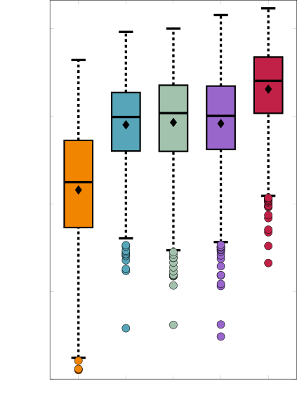

(a) Voice Bank+DEMAND

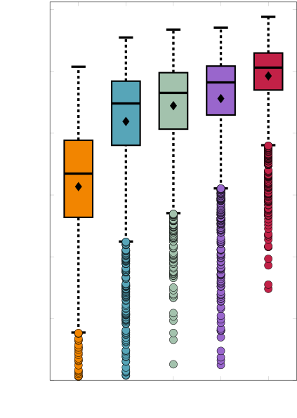

(b) CHiME-3 (real noise)

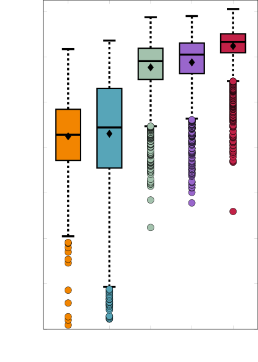

(c) DNS-Challenge

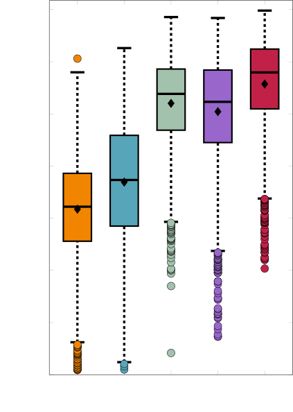

(d) DNS-Challenge+Reverb

Fig. 8: DNSMOS of subjective evaluation methods tested on four different
datasets. In the boxplots, the mean is represented by
($`\mathop{\raisebox{-0.79437pt}{$\hbox to5.04pt{\vbox to7.56pt{\pgfpicture\makeatletter\hbox{\hskip 0.19374pt\lower-1.29811pt\hbox to0.0pt{\lxSVG@begingroup@{\_scopebegin=1} \lxSVG@begingroup@{stroke=#000000} \lxSVG@begingroup@{fill=#000000} \lxSVG@setlinewidth{\the\pgflinewidth}\lxSVG@begingroup@{stroke-width=0.4pt} \lx@inpgf@ignorespaces\nullfont\hbox to0.0pt{\lxSVG@begingroup@{\_scopebegin=1} {\lx@inpgf@ignorespaces}\lx@inpgf@ignorespaces{\lx@inpgf@ignorespaces}\lx@inpgf@ignorespaces{{\lx@inpgf@ignorespaces}}\lxSVG@setlinewidth{\the\pgflinewidth}\lxSVG@begingroup@{stroke-width=0.3875pt} \lx@inpgf@ignorespaces\lxSVG@roundjoin\lxSVG@begingroup@{stroke-linejoin=round} \lx@inpgf@ignorespaces{}{{}}{}
{}{}
{}{}
{}{}
{}{}
{\lx@inpgf@ignorespaces}\lxSVG@begingroup@{\_scopebegin=1} \lxSVG@begingroup@{fill=#000000} {}\lxSVG@fillstroke\lxSVG@drawpath@unclipped{M 0 3.43 L 3.22 8.39 L 6.43 3.43 L 3.22 -1.53 L 0 3.43 Z}{} \lx@inpgf@ignorespaces
\lxSVG@closescope
\lxSVG@closescope {\lx@inpgf@ignorespaces}{\lx@inpgf@ignorespaces}{\lx@inpgf@ignorespaces}\hss}\lxSVG@discardpath\lxSVG@closescope \hss}}\lxSVG@closescope\endpgfpicture}}$}}`$),
median ($`\boldsymbol{-}`$) and the width of each box indicates the
interquartile range (25^(th) and 75^(th) percentile). The whiskers show
the maximum and minimum values excluding the outliers (8(a)). The mean
value for each method is presented on the x-axis.

### VI-A DNN-Based MOS

Following the literature \[62, 131\], the DNSMOS of the overall speech
quality will be evaluated as an objective measure to replicate the
subjective evaluation metric, as shown in Fig. 8. From the boxplots,
CMGAN is outperforming all methods in the four use cases. For instance,
CMGAN shows an average improvement of 0.15 in comparison to the most
competitive approach (PFPL) in the first three use cases. Moreover, the
interquartile range of the CMGAN is much narrower than all other
methods, which indicates a low variance and thus a confident prediction,
especially in the DNS-Challenge (Fig. 8(c)). On the other hand,
MetricGAN+ is showing the worst performance in all use cases. We
hypothesize that although the PESQ score is relatively high (3.15), the
SSNR score that we calculate is below 1 dB, indicating that the metric
discriminator in MetricGAN+ case, is only focusing on enhancing the PESQ
at the expense of other metrics. Note that the SSNR score is not
reported in the original paper. DEMUCS representing the time-domain
paradigm is showing a robust performance over Voice Bank+DEMAND and real
CHiME-3 use cases. However, it is not generalizing to the DNS-Challenge
dataset. This generalization issue is clearly mitigated in the TF-domain
complex denoising methods (PHASEN, PFPL and CMGAN). From Fig. 8(d), the
overall DNSMOS of DN-Challenge with additional reverberation dropped by
0.5 on average in comparison to DNS challenge (Fig. 8(c)). This is
expected as generalizing to unseen effects such as reverberation is more
challenging than unseen noise types. Despite this drop, CMGAN is still
showing superior performance over other competitive TF-domain approaches
(PHASEN and PFPL). Audio samples⁵⁵ 5
[https://sherifabdulatif.github.io/](https://sherifabdulatif.github.io/)
from all subjective evaluation methods are available online for
interested readers.

### VI-B Listening test

We organize a medium-scale listening test experiment with 25
participants and 10 samples, which were carefully selected from the
Voice Bank+DEMAND, DNS-Challenge, and DNS-Challenge+Reverb datasets.
Each sample has an average duration of 10 seconds, containing a complete
sentence. We ensure that the tracks are of different noise types and
mostly challenging conditions. During the experiment, each participant
listened to both the noisy track and its clean reference. Subsequently,
they were asked to assign a rating between 1 and 5 (where a higher score
indicates better quality) to represent the absolute overall quality of
the sample for the five methods: MetricGAN+, DEMUCS, PHASEN, PFPL and
CMGAN. In compliance with the ITU-T P.835 standards \[121\], the methods
are unknown to the participants and the order of the methods is randomly
shuffled for each sample.


MetricGAN+

DEMUCS

PHASEN


PFPL     

CMGAN

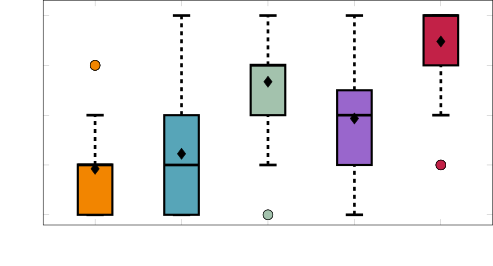

Fig. 9: Overall speech quality ratings of listening test.

As illustrated in Fig. 9, the participants rated the CMGAN as the best
method in the subjective overall quality. On average, CMGAN outperformed
the second-best method (PHASEN) by 0.81. The findings obtained from the
non-intrusive DNSMOS in Fig. 8 generally align with the listening test
experiment, with the exception that PHASEN exhibited better performance
than PFPL. This discrepancy could be attributed to the limited tracks
included in the listening test experiment or the relatively non-optimal
performance of the DNSMOS ratings. The performance of MetricGAN+ and
time-domain DEMUCS is relatively poor, indicating that TF-domain complex
denoising methods (PHASEN, PFPL and CMGAN) continue to demonstrate
superior generalization capabilities and subjective quality ratings.

## VII Limitations

Despite the above results, this study is not without limitations. For
instance, CMGAN has not been tested for real-time SE, i.e., CMGAN can
access the whole track. In the future, CMGAN should be modified to only
access few TF bins from the old samples and not the entire track,
together with an extensive study on the exact amount of floating point
operations in the real-time scenario. Another point to consider is the
focus of this investigation on individual task experimentation. The
superimposed effect (denoising and dereverberation) is only briefly
addressed in the subjective evaluation part, so training and evaluating
CMGAN for this use case would be an important extension of our work.
Lastly, the current evaluation does not encompass ASR performance, a
dimension that would mark a promising avenue for subsequent research.

## VIII Conclusion

This paper introduces CMGAN as a unified framework operating on both
magnitude and complex spectrogram components for various SE tasks,
including denoising, dereverberation and super-resolution. Our approach
combines recent conformers that can capture long-term dependencies as
well as local features in both time and frequency dimensions, together
with a metric discriminator that resolves metric mismatch by directly
enhancing non-differentiable evaluation scores. Experimental results
demonstrate that the proposed method achieves superior or competitive
performance against SOTA methods in each task with relatively few
parameters (1.83 M). Additionally, we conduct an ablation study to
verify the fragmented benefits of each utilized component and loss in
the proposed CMGAN framework. Finally, subjective evaluation illustrates
that CMGAN outperforms other methods with a robust generalization to
unseen noise types and distortions.

|                       |              |                                              |                              |                                              |
| --------------------- | ------------ | -------------------------------------------- | ---------------------------- | -------------------------------------------- |
|                       | Layer        | Input size                                   | Hyperparameters              | Output size                                  |
| Encoder               | 2D-Conv.     | $`B\!\times\!T\!\times\!201\!\times\!3`$     | $`1\!\times\!1,(1,1),64`$    | $`B\!\times\!T\!\times\!201\!\times\!64`$    |
|                       | Dil. Dense-1 | $`B\!\times\!T\!\times\!201\!\times\!64`$    | $`2\!\times\!3,(1,1),64,1`$  | $`B\!\times\!T\!\times\!201\!\times\!64`$    |
|                       | Dil. Dense-2 | $`B\!\times\!T\!\times\!201\!\times\!64`$    | $`2\!\times\!3,(1,1),64,2`$  | $`B\!\times\!T\!\times\!201\!\times\!64`$    |
|                       | Dil. Dense-3 | $`B\!\times\!T\!\times\!201\!\times\!64`$    | $`2\!\times\!3,(1,1),64,4`$  | $`B\!\times\!T\!\times\!201\!\times\!64`$    |
|                       | Dil. Dense-4 | $`B\!\times\!T\!\times\!201\!\times\!64`$    | $`2\!\times\!3,(1,1),64,8`$  | $`B\!\times\!T\!\times\!201\!\times\!64`$    |
|                       | 2D-Conv.     | $`B\!\times\!T\!\times\!201\!\times\!64`$    | $`1\!\times\!3,(1,2),64`$    | $`B\!\times\!T\!\times\!101\!\times\!64`$    |
| TS-Conf. $`\times 4`$ | Reshape      | $`B\!\times\!T\!\times\!101\!\times\!64`$    | –                            | $`101B\!\times\!T\!\times\!64`$              |
|                       | Time-Conf.   | $`101B\!\times\!T\!\times\!64`$              | –                            | $`101B\!\times\!T\!\times\!64`$              |
|                       | Reshape      | $`101B\!\times\!T\!\times\!64`$              | –                            | $`BT\!\times\!101\!\times\!64`$              |
|                       | Freq.-Conf.  | $`BT\!\times\!101\!\times\!64`$              | –                            | $`BT\!\times\!101\!\times\!64`$              |
|                       | Reshape      | $`BT\!\times\!101\!\times\!64`$              | –                            | $`B\!\times\!T\!\times\!101\!\times\!64`$    |
| Mask Dec.             | Dil. Dense-1 | $`B\!\times\!T\!\times\!101\!\times\!64`$    | $`2\!\times\!3,(1,1),64,1`$  | $`B\!\times\!T\!\times\!101\!\times\!64`$    |
|                       | Dil. Dense-2 | $`B\!\times\!T\!\times\!101\!\times\!64`$    | $`2\!\times\!3,(1,1),64,2`$  | $`B\!\times\!T\!\times\!101\!\times\!64`$    |
|                       | Dil. Dense-3 | $`B\!\times\!T\!\times\!101\!\times\!64`$    | $`2\!\times\!3,(1,1),64,4`$  | $`B\!\times\!T\!\times\!101\!\times\!64`$    |
|                       | Dil. Dense-4 | $`B\!\times\!T\!\times\!101\!\times\!64`$    | $`2\!\times\!3,(1,1),64,8`$  | $`B\!\times\!T\!\times\!101\!\times\!64`$    |
|                       | Sub-pixel    | $`B\!\times\!T\!\times\!101\!\times\!64`$    | $`1\!\times\!3,(1,1),256`$   | $`B\!\times\!T\!\times\!202\!\times\!256`$   |
|                       | 2D-Conv.     | $`B\!\times\!T\!\times\!202\!\times\!256`$   | $`1\!\times\!2,\!(1,1),\!1`$ | $`B\!\times\!T\!\times\!201\!\times\!1`$     |
|                       | PReLU        | –                                            | $`201`$                      | –                                            |
| Complex Dec.          | Dil. Dense-1 | $`B\!\times\!T\!\times\!101\!\times\!64`$    | $`2\!\times\!3,(1,1),64,1`$  | $`B\!\times\!T\!\times\!101\!\times\!64`$    |
|                       | Dil. Dense-2 | $`B\!\times\!T\!\times\!101\!\times\!64`$    | $`2\!\times\!3,(1,1),64,2`$  | $`B\!\times\!T\!\times\!101\!\times\!64`$    |
|                       | Dil. Dense-3 | $`B\!\times\!T\!\times\!101\!\times\!64`$    | $`2\!\times\!3,(1,1),64,4`$  | $`B\!\times\!T\!\times\!101\!\times\!64`$    |
|                       | Dil. Dense-4 | $`B\!\times\!T\!\times\!101\!\times\!64`$    | $`2\!\times\!3,(1,1),64,8`$  | $`B\!\times\!T\!\times\!101\!\times\!64`$    |
|                       | Sub-pixel    | $`B\!\times\!T\!\times\!101\!\times\!64`$    | $`1\!\times\!3,(1,1),256`$   | $`B\!\times\!T\!\times\!202\!\times\!256`$   |
|                       | 2D-Conv.     | $`B\!\times\!T\!\times\!202\!\times\!256`$   | $`1\!\times\!2,(1,1),2`$     | $`B\!\times\!T\!\times\!201\!\times\!2`$     |
| Metric Disc.          | 2D-Conv.-1   | $`B\!\times\!T\!\times\!201\!\times\!2`$     | $`4\!\times\!4,(2,2),16`$    | $`B\!\times\!T/2\!\times\!100\!\times\!16`$  |
|                       | 2D-Conv.-2   | $`B\!\times\!T/2\!\times\!100\!\times\!16`$  | $`4\!\times\!4,(2,2),32`$    | $`B\!\times\!T/4\!\times\!50\!\times\!32`$   |
|                       | 2D-Conv.-3   | $`B\!\times\!T/4\!\times\!50\!\times\!32`$   | $`4\!\times\!4,(2,2),64`$    | $`B\!\times\!T/8\!\times\!25\!\times\!64`$   |
|                       | 2D-Conv.-4   | $`B\!\times\!T/8\!\times\!25\!\times\!64`$   | $`4\!\times\!4,(2,2),128`$   | $`B\!\times\!T/16\!\times\!12\!\times\!128`$ |
|                       | Avg. Pooling | $`B\!\times\!T/16\!\times\!12\!\times\!128`$ | –                            | $`B\!\times\!128`$                           |
|                       | Linear-1     | $`B\!\times\!128`$                           | $`64`$                       | $`B\!\times\!64`$                            |
|                       | Linear-2     | $`B\!\times\!64`$                            | $`1`$                        | $`B\!\times\!1`$                             |
|                       | Sigmoid      | –                                            | –                            | –                                            |

TABLE VI: CMGAN architectural details.

## Acknowledgments

We would like to thank the Institute of Natural Language Processing,
University of Stuttgart for providing useful datasets to support this
research.

## Appendix

The complete architectural details of both generator and discriminator
are outlined in Table VI. The hyperparameters for 2D-Conv. layers
represent kernel sizes, strides, and number of channels. For dilated
dense blocks, the dilation factor is appended at the end. In linear
layers only the number of channels is presented. For the conformer
blocks, we follow the same baseline in \[30\].

Additionally, this section presents a visualization of the CMGAN in
comparison to subjective evaluation methods. A wide-band non-stationary
cafe noise from the DEMAND dataset (SNR = 0 dB) and a narrow-band
high-frequency stationary doorbell noise from the Freesound dataset (SNR
= 3 dB) are used to evaluate the methods. Both noises are added to
sentences from the DNS challenge. Comparisons are made between
time-domain, TF-magnitude, and TF-phase representations for
comprehensive performance analysis. Since the phase is unstructured, we
utilize the baseband phase difference (BPD) approach proposed in \[132\]
to enhance the phase visualization. From Fig. 10, MetricGAN+, DEMUCS,
and PHASEN show the worst performance by confusing speech with noise,
particularly in the 1.5 to 2 seconds interval (similar speech and noise
powers). The distortions and missing speech segments are annotated in
the time and TF-magnitude representations by (

) and (

), respectively. Moreover, the denoised phase in methods employing only
magnitude (MetricGAN+) and time-domain (DEMUCS) is very similar to the
noisy input, in contrast to clear enhancement in complex TF-domain
methods (PHASEN, PFPL, and CMGAN). PFPL and CMGAN exhibit the best
performance, with better phase reconstruction in CMGAN (1.5 to 2 seconds
interval).

In general, stationary noises are less challenging than non-stationary
counterparts. However, stationary noises are underrepresented in the
training data. As depicted in Fig. 11, methods such as MetricGAN+ and
PHASEN are showing a poor generalization performance, with doorbell
distortions clearly visible at frequencies (3.5, 5, and 7 kHz). On the
other hand, the performance is slightly better in DEMUCS and PFPL,
whereas CMGAN perfectly attenuates all distortions. Note that
high-frequency distortions are harder to spot in the time-domain than in
TF-magnitude and TF-phase representations.

## References

- \[1\] R. Cao, S. Abdulatif and B. Yang, “CMGAN: Conformer-based metric
  GAN for speech enhancement,” in Proc. Interspeech, 2022, pp. 936–940.
- \[2\] F. Weninger _et al._, “Speech enhancement with LSTM recurrent
  neural networks and its application to noise-robust ASR,” in
  _International Conference on Latent Variable Analysis and Signal
  Separation_, 2015, pp. 91–99.
- \[3\] C. Zheng _et al._, “Interactive speech and noise modeling for
  speech enhancement,” in _Proc. of the AAAI Conference on Artificial
  Intelligence_, vol. 35, no. 16, 2021, pp. 14549–14557.
- \[4\] J. L. Desjardins and A. K. Doherty, “The effect of hearing aid
  noise reduction on listening effort in hearing-impaired adults,” _Ear
  and hearing_, vol. 35, no. 6, pp. 600–610, 2014.
- \[5\] D. Wang and J. Chen, “Supervised speech separation based on deep
  learning: An overview,” _IEEE/ACM Transactions on Audio, Speech and
  Language Processing_, vol. 26, no. 10, pp. 1702–1726, 2018.
- \[6\] P. C. Loizou, Speech Enhancement: Theory and Practice, CRC
  Press, Inc., USA, 2nd edition, 2013.
- \[7\] C. V.-Botinhao _et al._, “Investigating RNN-based speech
  enhancement methods for noise-robust text-to-speech,” in _SSW_, 2016,
  pp. 146–152.
- \[8\] K. Kinoshita _et al._, “A summary of the reverb challenge:
  State-of-the-art and remaining challenges in reverberant speech
  processing research,” _Journal on Advances in Signal Processing_,
  vol. 7, no. 01, pp. 1–19, 2016.
- \[9\] J. Barker _et al._, “The third ‘CHiME’ speech separation and
  recognition challenge: Dataset, task and baselines,” in _IEEE Workshop
  on Automatic Speech Recognition and Understanding (ASRU)_, 2015, pp.
  504–511.
- \[10\] H. Dubey _et al._, “ICASSP 2022 Deep noise suppression
  challenge,” in _IEEE International Conference on Acoustics, Speech and
  Signal Processing (ICASSP)_, 2022, pp. 9271–9275.
- \[11\] S.-W. Fu _et al._, “MetricGAN: Generative adversarial networks
  based black-box metric scores optimization for speech enhancement,” in
  _International Conference on Machine Learning_, 2019, pp. 2031–2041.
- \[12\] D. Yin _et al._, “PHASEN: A phase-and-harmonics-aware speech
  enhancement network,” in _Proc. of the Conference on Artificial
  Intelligence_, vol. 34, no. 05, 2020, pp. 9458–9465.
- \[13\] G. Yu _et al._, “Dual-branch attention-in-attention transformer
  for single-channel speech enhancement,” in _IEEE International
  Conference on Acoustics, Speech and Signal Processing (ICASSP)_, 2022,
  pp. 7847–7851.
- \[14\] S. Pascual _et al._, “SEGAN: Speech enhancement generative
  adversarial network,” in Proc. Interspeech, 2017, pp. 3642–3646.
- \[15\] C. Macartney and T. Weyde, “Improved speech enhancement with
  the Wave-U-Net,” arXiv, vol. abs/1811.11307, 2018.
- \[16\] K. Wang, B. He and W. P. Zhu, “TSTNN: Two-stage transformer
  based neural network for speech enhancement in the time domain,” in
  _IEEE International Conference on Acoustics, Speech and Signal
  Processing (ICASSP)_, 2021, pp. 7098–7102.
- \[17\] A. Defossez, G. Synnaeve and Y. Adi, “Real time speech
  enhancement in the waveform domain,” in Proc. Interspeech, 2020, pp.
  3291–3295.
- \[18\] E. Kim and H. Seo, “SE-Conformer: Time-domain speech
  enhancement using conformer,” in _Proc. Interspeech_, 2021, pp.
  2736–2740.
- \[19\] J. H. Kim _et al._, “Multi-domain processing via hybrid
  denoising networks for speech enhancement,” arXiv, vol.
  abs/1812.08914, 2018.
- \[20\] J. Su, Z. Jin and A. Finkelstein, “HiFi-GAN-2: Studio-quality
  speech enhancement via generative adversarial networks conditioned on
  acoustic features,” in _IEEE Workshop on Applications of Signal
  Processing to Audio and Acoustics (WASPAA)_, 2021, pp. 166–170.
- \[21\] J. Serrà _et al._, “Universal speech enhancement with
  score-based diffusion,” arXiv, vol. abs/2206.03065 , 2022.
- \[22\] S. Abdulatif _et al._, “AeGAN: Time-frequency speech denoising
  via generative adversarial networks,” in _28th European Signal
  Processing Conference (EUSIPCO)_, 2020, pp. 451–455.
- \[23\] S. Abdulatif _et al._, “Investigating cross-domain losses for
  speech enhancement,” in _29th European Signal Processing Conference
  (EUSIPCO)_, 2021, pp. 411–415.
- \[24\] D. S. Williamson, Y. Wang and P. Wang, “Complex ratio masking
  for monaural speech separation,” IEEE Transactions on Audio, Speech
  and Language Processing, vol. 24, no. 3, pp. 483–492, 2016.
- \[25\] K. Tan and D. Wang, “Complex spectral mapping with a
  convolutional recurrent network for monaural speech enhancement,” in
  _IEEE International Conference on Acoustics, Speech and Signal
  Processing (ICASSP)_, 2019, pp. 6865–6869.
- \[26\] Z. Q. Wang, G. Wichern and J. Le Roux, “On the compensation
  between magnitude and phase in speech separation,” _IEEE Signal
  Processing Letters_, vol. 28, pp. 2018–2022, 2021.
- \[27\] A. Li _et al._, “Glance and gaze: A collaborative learning
  framework for single-channel speech enhancement,” _Applied Acoustics_,
  vol. 187, 2022.
- \[28\] A. Vaswani _et al._, “Attention is all you need,” _Advances in
  neural information processing systems_, vol. 30, 2017.
- \[29\] F. Dang, H. Chen and P. Zhang, “DPT-FSNet: Dual-path
  transformer based full-band and sub-band fusion network for speech
  enhancement,” in _IEEE International Conference on Acoustics, Speech
  and Signal Processing (ICASSP)_, 2022, pp. 6857–6861.
- \[30\] A. Gulati _et al._, “Conformer: Convolution-augmented
  transformer for speech recognition,” in _Proc. Interspeech_, 2020, pp.
  5036–5040.
- \[31\] S. Chen _et al._, “Continuous speech separation with
  conformer,” in _IEEE International Conference on Acoustics, Speech and
  Signal Processing (ICASSP)_, 2021, pp. 5749–5753.
- \[32\] Y. Koizumi _et al._, “DF-Conformer: Integrated architecture of
  Conv-Tasnet and conformer using linear complexity self-attention for
  speech enhancement,” in _IEEE Workshop on Applications of Signal
  Processing to Audio and Acoustics (WASPAA)_, 2021, pp. 161–165.
- \[33\] J. Chen, Q. Mao and D. Liu, “Dual-path transformer network:
  Direct context-aware modeling for end-to-end monaural speech
  separation,” in _Proc. Interspeech_, 2020, pp. 2642–2646.
- \[34\] H. Purwins _et al._, “Deep learning for audio signal
  processing,” _IEEE Journal of Selected Topics in Signal Processing_,
  vol. 13, no. 2, pp. 206–219, 2019.
- \[35\] D. Michelsanti _et al._, “An overview of deep-Learning-based
  audio-visual speech enhancement and separation,” _IEEE/ACM
  Transactions on Audio, Speech, and Language Processing_, vol. 29, pp.
  1368–1396, 2021.
- \[36\] D. Wang and J. Lim, “The unimportance of phase in speech
  enhancement,” _IEEE Transactions on Acoustics, Speech, and Signal
  Processing_, vol. 30, no. 4, pp. 679–681, 1982.
- \[37\] K. Paliwal _et al._, “The importance of phase in speech
  enhancement,” _Speech Communication_, vol. 53, no. 4, pp.
  465–494, 2011.
- \[38\] D. Rethage, J. Pons and X. Serra, “A Wavenet for speech
  denoising,” in _IEEE International Conference on Acoustics, Speech and
  Signal Processing (ICASSP)_, 2018, pp. 5069–5073.
- \[39\] S. W. Fu _et al._, “End-to-end waveform utterance enhancement
  for direct evaluation metrics optimization by fully convolutional
  neural networks,” _IEEE/ACM Transactions on Audio, Speech, and
  Language Processing_, vol. 26, no. 9, pp. 1570–1584, 2018.
- \[40\] A. Pandey and D. Wang, “TCNN: Temporal convolutional neural
  network for real-time speech enhancement in the time domain,” in _IEEE
  International Conference on Acoustics, Speech and Signal Processing
  (ICASSP)_, 2019, pp. 6875–6879.
- \[41\] H. Phan _et al._, “Improving GANs for speech enhancement,”
  _IEEE Signal Processing Letters_, vol. 27, pp. 1700–1704, 2020.
- \[42\] S. Pascual, J. Serra and A. Bonafonte, “Towards generalized
  speech enhancement with generative adversarial networks,” in Proc.
  Interspeech, 2019, pp. 1791–1795.
- \[43\] C. Donahue, B. Li and R. Prabhavalkar, “Exploring speech
  enhancement with generative adversarial networks for robust speech
  recognition,” in _IEEE International Conference on Acoustics, Speech
  and Signal Processing (ICASSP)_, 2018, pp. 5024–5028.
- \[44\] D. Michelsanti and Z. H. Tan, “Conditional generative
  adversarial networks for speech enhancement and noise-robust speaker
  verification,” in Proc. Interspeech, 2017, pp. 2008–2012.
- \[45\] Z. Meng _et al._, “Adversarial feature-mapping for speech
  enhancement,” in Proc. Interspeech, 2018, pp. 3259–3263.
- \[46\] Y. Luo _et al._, “Conv-TasNet: Surpassing ideal time–frequency
  magnitude masking for speech separation,” _IEEE/ACM Transactions on
  Audio, Speech, and Language Processing_, vol. 27, no. 8, pp.
  1256–1266, 2019.
- \[47\] S. Rickard and O. Yilmaz, “On the approximate W-disjoint
  orthogonality of speech,” in _IEEE International Conference on
  Acoustics, Speech and Signal Processing (ICASSP)_, 2002, pp. 529–532.
- \[48\] A. S. Bregman, Auditory scene analysis: The perceptual
  organization of sound, MIT Press, 1994.
- \[49\] O. Yilmaz and S. Rickard, “Blind separation of speech mixtures
  via time-frequency masking,” _IEEE Transactions on Signal Processing_,
  vol. 52, no. 7, pp. 1830–1847, 2004.
- \[50\] Y. Wang and D. Wang, “Towards scaling up classification-based
  speech separation,” _IEEE Transactions on Audio, Speech, and Language
  Processing_, vol. 21, no. 7, pp. 1381–1390, 2013.
- \[51\] Y. Wang and D. Wang, “An algorithm to improve speech
  recognition in noise for hearing-impaired listeners,” _The Journal of
  the Acoustical Society of America_, vol. 134, no. 4, pp.
  3029–3038, 2013.
- \[52\] C. Hummersone _et al._, “On the ideal ratio mask as the goal of
  computational auditory scene analysis,” in _Blind Source Separation:
  Advances in Theory, Algorithms and Applications_, Springer, 2014, pp.
  349–368.
- \[53\] S. Srinivasan, N. Roman and D. Wang, “Binary and ratio
  time-frequency masks for robust speech recognition,” _Speech
  Communication_, vol. 48, no. 11, pp. 1486–1501, 2006.
- \[54\] A. Narayanan and D. Wang, “Ideal ratio mask estimation using
  deep neural networks for robust speech recognition,” in _IEEE
  International Conference on Acoustics, Speech and Signal Processing
  (ICASSP)_, 2013, pp. 7092–7096.
- \[55\] Y. Wang, A. Narayanan and D. Wang, “On training targets for
  supervised speech separation,” _IEEE/ACM Transactions on Audio,
  Speech, and Language Processing_, vol. 22, no. 12, pp.
  1849–1858, 2014.
- \[56\] K. Han _et al._, “Learning spectral mapping for speech
  dereverberation and denoising,”_IEEE/ACM Transactions on Audio,
  Speech, and Language Processing_, vol. 23, no. 6, pp. 982–992, 2015.
- \[57\] Z. Q. Wang _et al._, “End-to-end speech separation with
  unfolded iterative phase reconstruction,” in Proc. Interspeech, 2018,
  pp. 2708–2712.
- \[58\] Z. Q. Wang, K. Tan and D. Wang, “Deep learning based phase
  reconstruction for speaker separation: A trigonometric perspective,”
  in _IEEE International Conference on Acoustics, Speech and Signal
  Processing (ICASSP)_, 2019, pp. 71–75.
- \[59\] Y. Zhao, Z. Q. Wang and D. Wang, “Two-stage deep learning for
  noisy-reverberant speech enhancement,”_IEEE/ACM Transactions on Audio,
  Speech, and Language Processing_, vol. 27, no. 1, pp. 53–62, 2019.
- \[60\] H. Erdogan _et al._, “Phase-sensitive and recognition-boosted
  speech separation using deep recurrent neural networks,” in _IEEE
  International Conference on Acoustics, Speech and Signal Processing
  (ICASSP)_, 2015, pp. 708–712.
- \[61\] Y. Hu _et al._, “DCCRN: Deep complex convolution recurrent
  network for phase-aware speech enhancement,” in Proc. Interspeech,
  2020, pp. 2472–2476.
- \[62\] G. Yu _et al._, “DBT-Net: Dual-branch federative magnitude and
  phase estimation with attention-in-attention transformer for monaural
  speech enhancement,” _IEEE/ACM Transactions on Audio, Speech, and
  Language Processing_, vol. 30, pp. 2629–2644, 2022.
- \[63\] A. Li _et al._, “Two heads are better than one: A two-stage
  complex spectral mapping approach for monaural speech enhancement,”
  _IEEE/ACM Transactions on Audio, Speech, and Language Processing_,
  vol. 29, pp. 1829–1843, 2021.
- \[64\] A. Li _et al._, “A simultaneous denoising and dereverberation
  framework with target decoupling,” in Proc. Interspeech, 2021, pp.
  2801–2805.
- \[65\] K. Tan and D. Wang, “Learning complex spectral mapping with
  gated convolutional recurrent networks for monaural speech
  enhancement,” _IEEE/ACM Transactions on Audio, Speech, and Language
  Processing_, vol. 28, pp. 380–390, 2020.
- \[66\] H. Kuttruff, Room Acoustics, CRC Press, 6th edition, 2016.
- \[67\] T. J. Schultz, ‘Diffusion in reverberation rooms,” _Journal of
  Sound and Vibration_, vol. 16, no. 1, pp. 17–28, 1971.
- \[68\] D. Gelbart _et al._, “Double the trouble: handling noise and
  reverberation in far-field automatic speech recognition,” in 7th
  International Conference on Spoken Language Processing (ICSLP), 2002,
  pp. 2185–2188.
- \[69\] Y. Luo and N. Mesgarani, “Real-time single-channel
  dereverberation and separation with time-domain audio separation
  network,” in Proc. Interspeech, 2018, pp. 342–346.
- \[70\] N. Roman and J. Woodruff, “Intelligibility of reverberant noisy
  speech with ideal binary masking,” _The Journal of the Acoustical
  Society of America_, vol. 130, no. 4, pp. 2153–2161, 2011.
- \[71\] T. May and T. Gerkmann, “Generalization of supervised learning
  for binary mask estimation,” in _14th International Workshop on
  Acoustic Signal Enhancement (IWAENC)_, pp. 154–158, 2014.
- \[72\] Z. Jin and D. Wang, “A supervised learning approach to monaural
  segregation of reverberant speech,” in _IEEE International Conference
  on Acoustics, Speech and Signal Processing (ICASSP)_, 2007, pp.
  921–924.
- \[73\] Y. Zhao _et al._, “DNN-based enhancement of noisy and
  reverberant speech,” in _IEEE International Conference on Acoustics,
  Speech and Signal Processing (ICASSP)_, 2016, pp. 6525–6529.
- \[74\] X. L. Zhang and D. Wang, “A deep ensemble learning method for
  monaural speech separation,” _IEEE/ACM Transactions on Audio, Speech,
  and Language Processing_, vol. 24, no. 5, pp. 967–977, 2016.
- \[75\] X. Li, J. Li and Y. Yan, “Ideal ratio mask estimation using
  deep neural networks for monaural speech segregation in noisy
  reverberant conditions,” in Proc. Interspeech, 2017, pp. 1203–1207.
- \[76\] D. S. Williamson and D. Wang, “Speech dereverberation and
  denoising using complex ratio masks,” in _IEEE International
  Conference on Acoustics, Speech and Signal Processing (ICASSP)_, 2017,
  pp. 5590–5594.
- \[77\] D. S. Williamson and D. Wang, “Time-Frequency masking in the
  complex domain for speech dereverberation and denoising,” _IEEE/ACM
  Transactions on Audio, Speech, and Language Processing_, vol. 25,
  no. 7, pp. 1492–1501, 2017.
- \[78\] V. Kothapally and J. H. L. Hansen, “SkipConvGAN: Monaural
  speech dereverberation using generative adversarial networks via
  complex time-frequency masking,” _IEEE/ACM Transactions on Audio,
  Speech, and Language Processing_, vol. 30, pp. 1600–1613, 2022.
- \[79\] O. Ernst _et al._, “Speech dereverberation using fully
  convolutional networks,” in _26th European Signal Processing
  Conference (EUSIPCO)_, 2018, pp. 390–394.
- \[80\] V. Kothapally _et al._, “SkipConvNet: Skip convolutional neural
  network for speech dereverberation using optimally smoothed spectral
  mapping,” in _Proc. Interspeech_, 2020, pp. 3935–3939.
- \[81\] D. Ribas _et al._, “Deep speech enhancement for reverberated
  and noisy signals using wide residual networks,” arXiv, vol.
  abs/1901.00660, 2019.
- \[82\] X. Xiao _et al._, “The NTU-ADSC systems for reverberation
  challenge 2014,” in _Proc. of the Reverberation Challenge
  Workshop_, 2014.
- \[83\] C. Dong _et al._, “"Image super-resolution using deep
  convolutional networks,” _IEEE Transactions on Pattern Analysis and
  Machine Intelligence_, vol. 38, no. 2, pp. 295–307, 2016.
- \[84\] J. Yu _et al._, “Generative image inpainting with contextual
  attention,” in _IEEE/CVF Conference on Computer Vision and Pattern
  Recognition (CVPR)_, 2018, pp. 5505-5514.
- \[85\] P. Ekstrand, “Bandwidth extension of audio signals by spectral
  band replication,” in _Proc. of the IEEE Benelux Workshop on Model
  Based Processing and Coding of Audio (MPCA)_, 2002, pp. 53–58.
- \[86\] V. Kuleshov, S. Z. Enam and S. Ermon, “Audio super-resolution
  using neural nets,” in _International Conference on Learning
  Representations (ICLR–Workshop Track)_, 2017.
- \[87\] T. Y. Lim _et al._, “Time-frequency networks for audio
  super-resolution,” in _IEEE International Conference on Acoustics,
  Speech and Signal Processing (ICASSP)_, 2018, pp. 646–650.
- \[88\] S. Birnbaum _et al._, “Temporal FiLM: Capturing long-range
  sequence dependencies with feature-wise modulations,” in _Advances in
  Neural Information Processing Systems_, vol. 32, 2019.
- \[89\] N. C. Rakotonirina, “Self-Attention for audio
  super-resolution,” in _31st IEEE International Workshop on Machine
  Learning for Signal Processing (MLSP)_, 2021, pp. 1–6.
- \[90\] H. Wang and D. Wang, “Towards robust speech super-resolution,”
  _IEEE/ACM Transactions on Audio, Speech, and Language Processing_,
  vol. 29, pp. 2058–2066, 2021.
- \[91\] H. Liu _et al._, “Neural vocoder is all you need for speech
  super-resolution,” in _Proc. Interspeech_, 2022, pp. 4227–4231.
- \[92\] S. Braun _et al._, “A consolidated view of loss functions for
  supervised deep learning-based speech enhancement,” in _International
  Conference on Telecommunications and Signal Processing_, 2021, pp.
  72–76.
- \[93\] J. Lee _et al._, “Phase-sensitive joint learning algorithms for
  deep learning-based speech enhancement,” _IEEE Signal Processing
  Letters_, vol. 25, no. 8, pp. 1276–1280, 2018.
- \[94\] K. Wilson _et al._, “Exploring tradeoffs in models for
  low-latency speech enhancement,” in _16th International Workshop on
  Acoustic Signal Enhancement (IWAENC)_, 2018, pp. 366–370.
- \[95\] A. Pandey and D. Wang, “Densely connected neural network with
  dilated convolutions for real-time speech enhancement in the time
  domain,” in _IEEE International Conference on Acoustics, Speech and
  Signal Processing (ICASSP)_, 2020, pp. 6629–6633.
- \[96\] D. Ulyanov, A. Vedaldi and V. Lempitsky, “Instance
  normalization: The missing ingredient for fast stylization,” arXiv,
  vol. abs/1607.08022, 2016.
- \[97\] K. He _et al._, “Delving deep into rectifiers: Surpassing
  human-level performance on ImageNet classification,” in _IEEE
  International Conference on Computer Vision (ICCV)_, 2015, pp.
  1026–1034.
- \[98\] W. Shi _et al._, “Real-time single image and video
  super-resolution using an efficient sub-pixel convolutional neural
  network,” in _IEEE Computer Vision and Pattern Recognition (CVPR)_,
  2016, pp. 1874–1883.
- \[99\] A. Rix _et al._, “Perceptual evaluation of speech quality
  (PESQ)-a new method for speech quality assessment of telephone
  networks and codecs,” in IEEE International Conference on Acoustics,
  Speech and Signal Processing (ICASSP), 2001, vol. 2, pp. 749–752.
- \[100\] C. H. Taal _et al._, “A short-time objective intelligibility
  measure for time-frequency weighted noisy speech,” in IEEE
  International Conference on Acoustics, Speech and Signal Processing
  (ICASSP), 2010, pp. 4214–4217.
- \[101\] X. Mao _et al._, “Least squares generative adversarial
  networks,” in _IEEE International Conference on Computer Vision
  (ICCV)_, 2017, pp. 2813–2821.
- \[102\] C. Veaux _et al._, “The voice bank corpus: Design, collection
  and data analysis of a large regional accent speech database,” in
  _Oriental International Conference on Speech Database and
  Assessments_, 2013.
- \[103\] J. Thiemann, N. Ito and E. Vincent, “The diverse environments
  multi-channel acoustic noise database: A database of multichannel
  environmental noise recordings,” Journal of the Acoustical Society of
  America, vol. 133, no. 5, pp. 3791–3796, 2013.
- \[104\] T. Robinson _et al._, “WSJCAMO: A British English speech
  corpus for large vocabulary continuous speech recognition,” in IEEE
  International Conference on Acoustics, Speech and Signal Processing
  (ICASSP), 1995, pp. 81–84.
- \[105\] M. Lincoln _et al._, “The multi-channel Wall Street Journal
  audio visual corpus (MC-WSJ-AV): specification and initial
  experiments,” in IEEE Workshop on Automatic Speech Recognition and
  Understanding, 2005, pp. 357–362.
- \[106\] J. Yamagishi _et al._, “CSTR VCTK Corpus: English
  multi-speaker corpus for CSTR voice cloning toolkit (version 0.92),”
  University of Edinburgh. The Centre for Speech Technology Research
  (CSTR), 2019.
- \[107\] T. A. Hsieh _et al._, “Improving perceptual quality by
  phone-fortified perceptual loss using Wasserstein distance for speech
  enhancement,” in _Proc. Interspeech_, 2021, pp. 196–200.
- \[108\] S. W. Fu _et al._, “MetricGAN+: An improved version of
  MetricGAN for speech enhancement,” in _Proc. Interspeech_, 2021, pp.
  201–205.
- \[109\] I. Loshchilov and F. Hutter, “Decoupled weight decay
  regularization,” in _International Conference on Learning
  Representations (ICLR)_, 2019.
- \[110\] Y. Hu and P. C. Loizou, “Evaluation of objective quality
  measures for speech enhancement,” IEEE Transactions on Audio, Speech
  and Language Processing, vol. 16, no. 1, pp. 229–238, 2008.
- \[111\] P. Isola _et al._, “Image-to-Image translation with
  conditional adversarial networks,” in _IEEE Conference on Computer
  Vision and Pattern Recognition (CVPR)_, 2017, pp. 5967–5976.
- \[112\] Z. Liu _et al._, “Swin transformer: Hierarchical vision
  transformer using shifted windows,” in _Proc. of the IEEE/CVF
  International Conference on Computer Vision (ICCV)_, 2021, pp.
  10012–10022.
- \[113\] N. Virag, “Speech enhancement based on masking properties of
  the auditory system,” in IEEE International Conference on Acoustics,
  Speech and Signal Processing (ICASSP), 1995, pp. 796–799.
- \[114\] H. Zheng _et al._, “Improving deep neural networks using
  softplus units,” in _International Joint Conference on Neural Networks
  (IJCNN)_, 2015.
- \[115\] N. Kitawaki, H. Nagabuchi and K. Itoh, “Objective quality
  evaluation for low-bit-rate speech coding systems,” IEEE Journal on
  Selected Areas in Communications, vol. 16, no. 2, pp. 242–248, 1988.
- \[116\] J. Hansen and B. Pellom, “An effective quality evaluation
  protocol for speech enhancement algorithms,” in _International
  Conference on Spoken Language Processing (ICSL)_, 1998, pp. 2819–2822.
- \[117\] J. Tribolet _et al._, “A study of complexity and quality of
  speech waveform coders,” in IEEE International Conference on
  Acoustics, Speech and Signal Processing (ICASSP), 1978, pp. 586–590.
- \[118\] T. H. Falk _et al._, “A non-intrusive quality and
  intelligibility measure of reverberant and dereverberated speech,”
  IEEE Transactions on Audio, Speech, and Language Processing, vol. 18,
  no. 7, pp. 1766–1774, 2010.
- \[119\] R. C. Streijl, S. Winkler and D. S. Hands, “Mean opinion score
  (MOS) revisited: methods and applications, limitations and
  alternatives,” Multimedia Systems, vol. 22, no. 2, pp. 213–227, 2016.
- \[120\] J. H. Friedman, “Multivariate adaptive regression splines,”
  The Annals of Statistics, vol. 19, no. 1, pp. 1–67, 1991.
- \[121\] ITU-T Recommendation P.835, “Subjective test methodology for
  evaluating speech communication systems that include noise suppression
  algorithm,” International Telecommunication Union, 2003.
- \[122\] D. Klatt, “Prediction of perceived phonetic distance from
  critical-band spectra: A first step,” in IEEE International Conference
  on Acoustics, Speech and Signal Processing (ICASSP), 1982, pp.
  1278–1281.
- \[123\] S. W. Fu _et al._, “Quality-Net: An end-to-end non-intrusive
  speech quality assessment model Based on BLSTM,” in _Proc.
  Interspeech_, 2018, pp. 1873–1877.
- \[124\] A. R. Avila _et al._, “Non-intrusive speech quality assessment
  using neural networks,” in IEEE International Conference on Acoustics,
  Speech and Signal Processing (ICASSP), 2019, pp. 631–635.
- \[125\] A. A. Catellier and S. D. Voran, “Wawenets: A no-reference
  convolutional waveform-based approach to estimating narrowband and
  wideband speech quality,” in IEEE International Conference on
  Acoustics, Speech and Signal Processing (ICASSP), 2020, pp. 331–335.
- \[126\] J. Serrà, J. Pons and S. Pascual, “SESQA: Semi-supervised
  learning for speech quality assessment,” in IEEE International
  Conference on Acoustics, Speech and Signal Processing (ICASSP), 2021,
  pp. 381–385.
- \[127\] C. K. A. Reddy, V. Gopal and R. Cutler, “DNSMOS: A
  non-intrusive perceptual objective speech quality metric to evaluate
  noise suppressors,” in IEEE International Conference on Acoustics,
  Speech and Signal Processing (ICASSP), 2021, pp. 6493–6497.
- \[128\] C. K. A. Reddy, V. Gopal and R. Cutler, “DNSMOS P.835: A
  non-intrusive perceptual objective speech quality metric to evaluate
  noise suppressors,” in IEEE International Conference on Acoustics,
  Speech and Signal Processing (ICASSP), 2022, pp. 886–890.
- \[129\] J. F. Gemmeke _et al._, “Audio Set: An ontology and
  human-labeled dataset for audio events,” in IEEE International
  Conference on Acoustics, Speech and Signal Processing (ICASSP), 2017,
  pp. 776–780.
- \[130\] T. Ko _et al._, “A study on data augmentation of reverberant
  speech for robust speech recognition,” in IEEE International
  Conference on Acoustics, Speech and Signal Processing (ICASSP), 2017,
  pp. 5220–5224.
- \[131\] A. Li _et al._, “Filtering and refining: A collaborative-style
  framework for single-channel speech enhancement,” IEEE Transactions on
  Audio, Speech, and Language Processing, vol. 30, pp. 2156–2172, 2022.
- \[132\] M. Krawczyk and T. Gerkmann, “STFT phase reconstruction in
  voiced speech for an improved single-channel speech enhancement,” IEEE
  Transactions on Audio, Speech, and Language Processing, vol. 22, no.
  12, pp. 1931–1940, 2014.

(a) Noisy

(b) MetricGAN+

(c) DEMUCS

(d) PHASEN

(e) PFPL

(f) CMGAN

(g) Clean

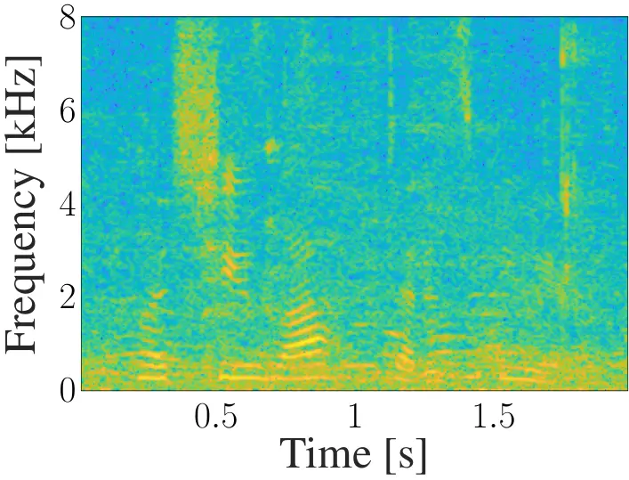

(h) Noisy

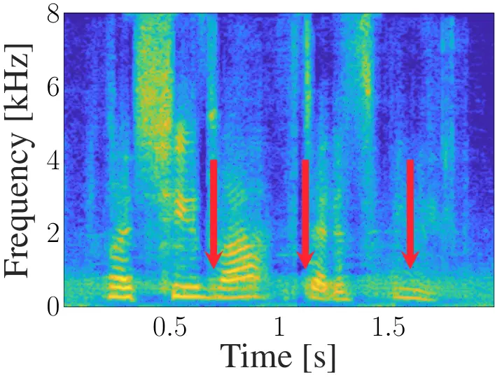

(i) MetricGAN+

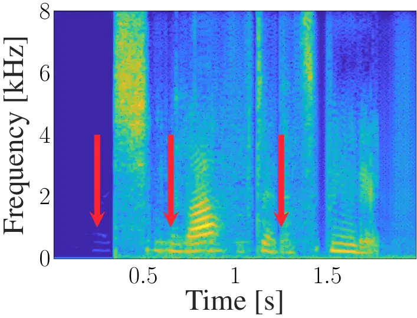

(j) DEMUCS

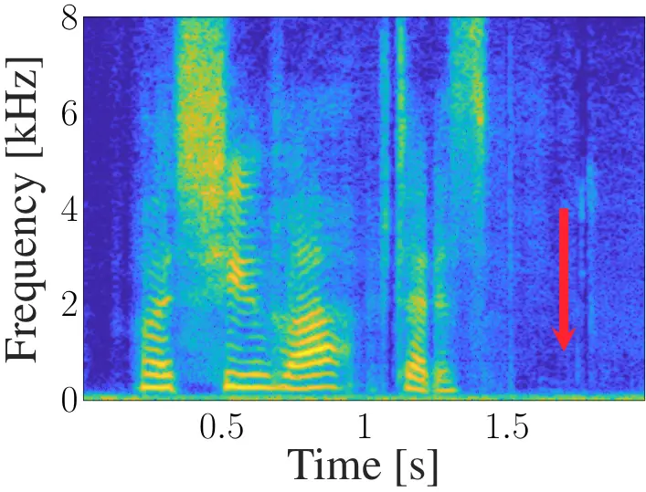

(k) PHASEN

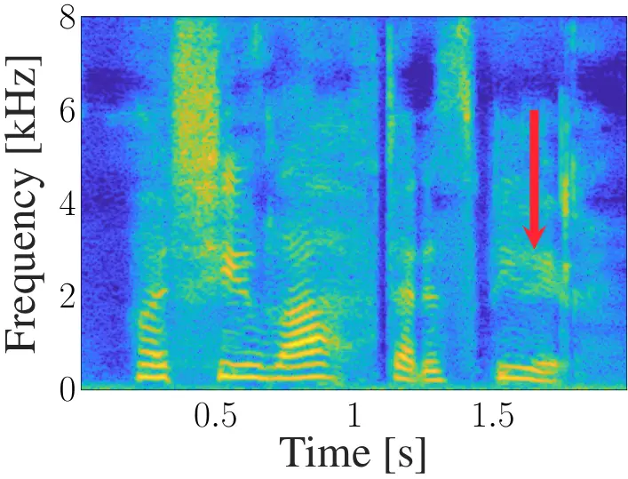

(l) PFPL

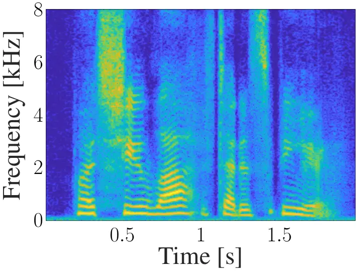

(m) CMGAN

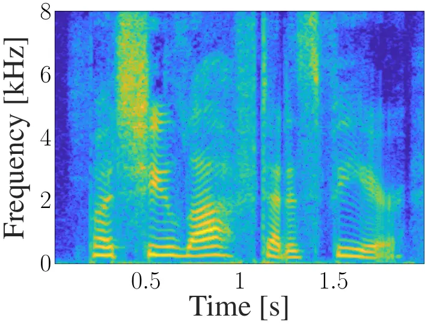

(n) Clean

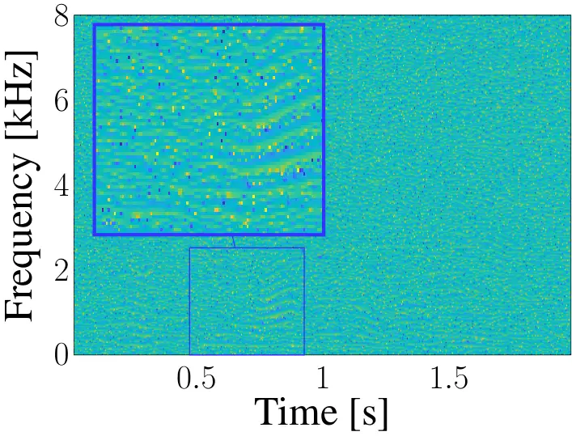

(o) Noisy


(p) MetricGAN+


(q) DEMUCS

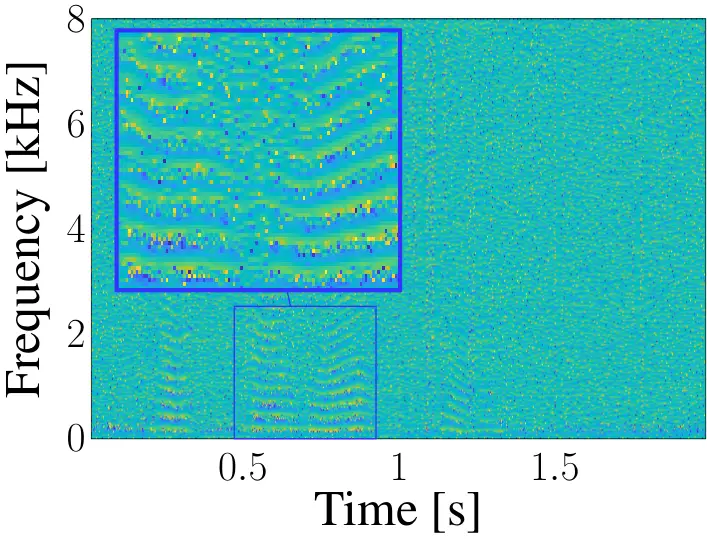

(r) PHASEN

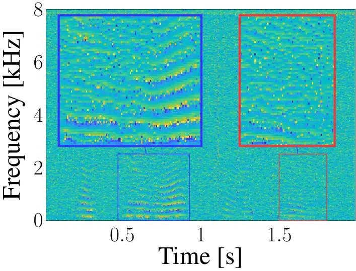

(s) PFPL

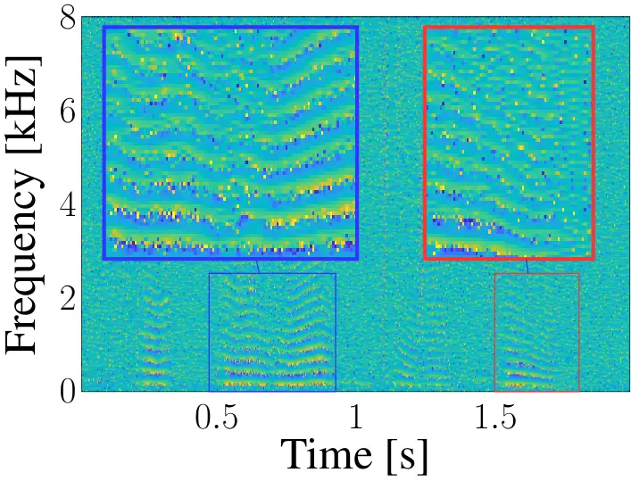

(t) CMGAN

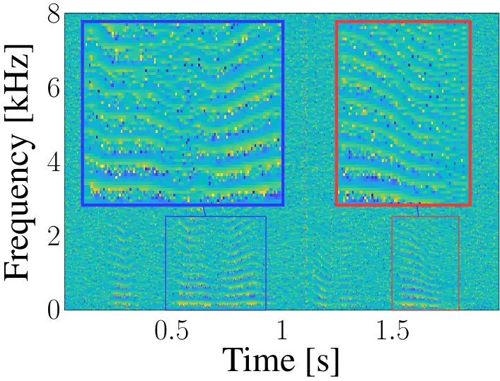

(u) Clean

Fig. 10: Visualization of subjective approaches under a wide-band cafe
noise (DEMAND dataset) at SNR = 0 dB. (a-g) represent the time-domain
signal, while (h-n) are the TF-magnitude representations in dB and (o-u)
are the reconstructed BPD of the given TF-phase representations. (

) and (

) reflect the distortions in time and TF-magnitude representations,
respectively.

(a) Noisy

(b) MetricGAN+

(c) DEMUCS

(d) PHASEN

(e) PFPL

(f) CMGAN

(g) Clean

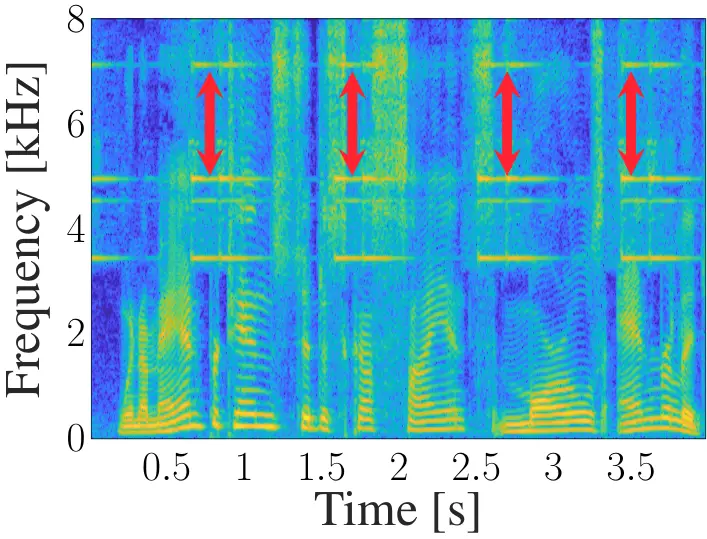

(h) Noisy

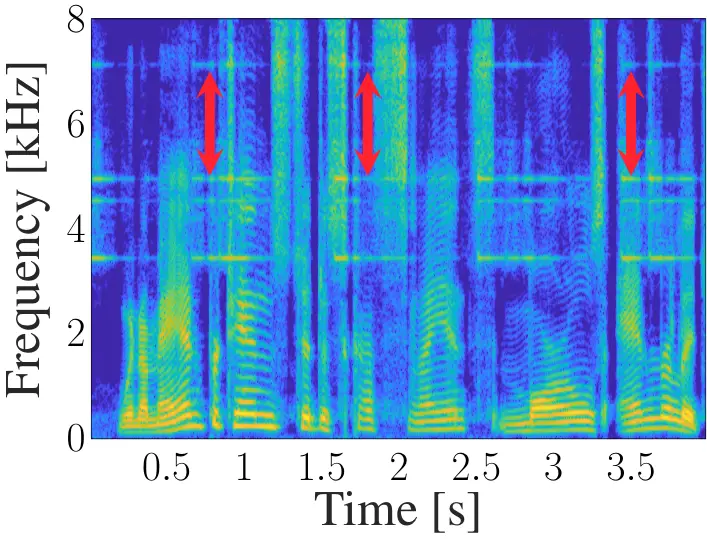

(i) MetricGAN+

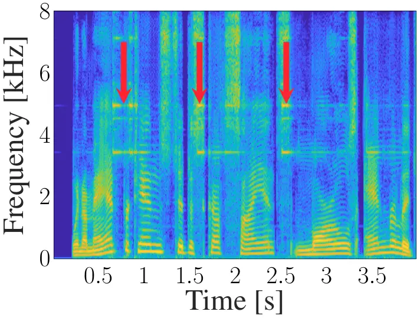

(j) DEMUCS

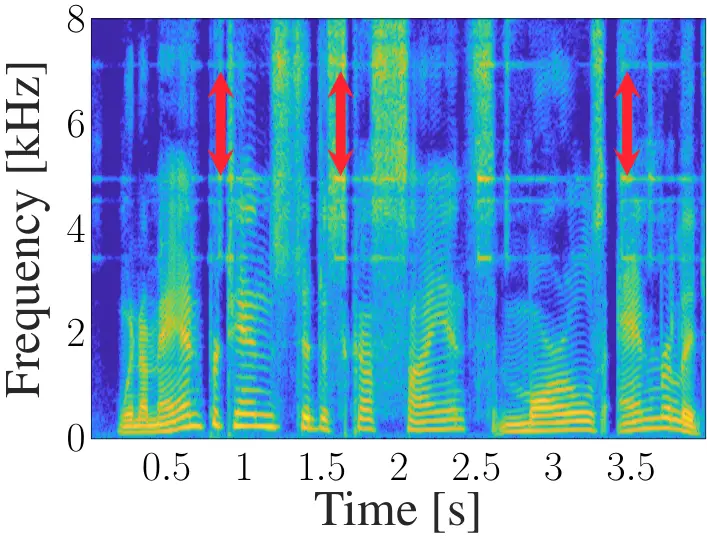

(k) PHASEN

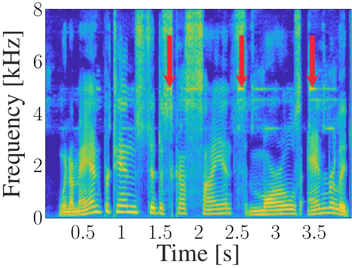

(l) PFPL

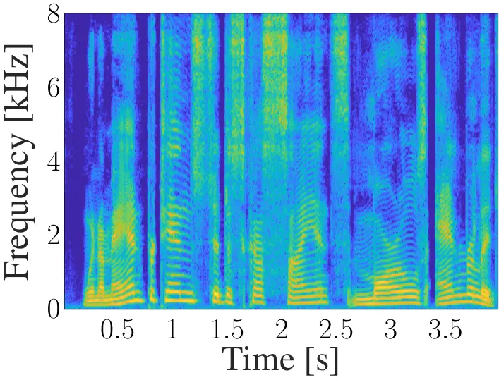

(m) CMGAN

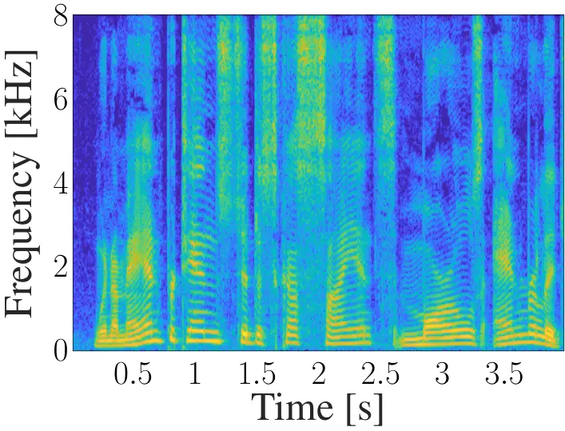

(n) Clean


(o) Noisy

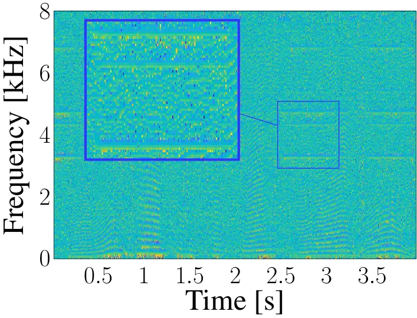

(p) MetricGAN+

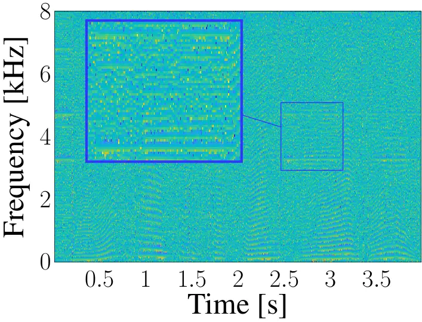

(q) DEMUCS


(r) PHASEN


(s) PFPL

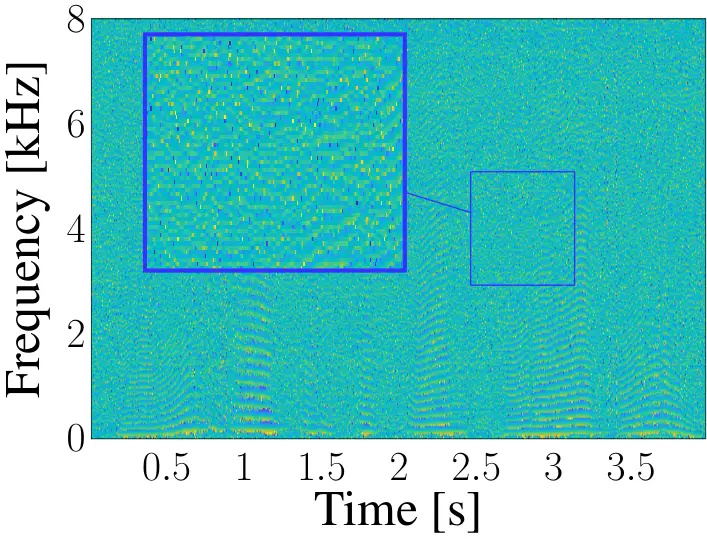

(t) CMGAN


(u) Clean

Fig. 11: Visualization of subjective approaches under a narrow-band
doorbell noise (Freesound dataset) at SNR = 3 dB. (a-g) represent the
time-domain signal, while (h-n) are the TF-magnitude representations in
dB and (o-u) are the reconstructed BPD of the given TF-phase
representations. (

) and (

) reflect the distortions in time and TF-magnitude representations,
respectively.
