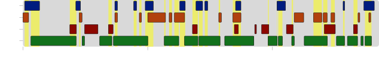
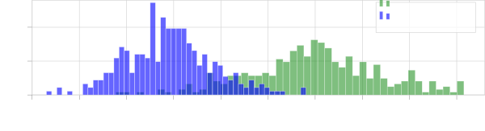

# MMS-MSG: A Multi-purpose Multi-Speaker Mixture Signal Generator

###### Abstract

The scope of speech enhancement has changed from a monolithic view of
single, independent tasks, to a joint processing of complex
conversational speech recordings. Training and evaluation of these
single tasks requires synthetic data with access to intermediate signals
that is as close as possible to the evaluation scenario. As such data
often is not available, many works instead use specialized databases for
the training of each system component, e.g WSJ0-mix for source
separation. We present a Multi-purpose Multi-Speaker Mixture Signal
Generator (MMS-MSG) for generating a variety of speech mixture signals
based on any speech corpus, ranging from classical anechoic mixtures
(e.g., WSJ0-mix) over reverberant mixtures (e.g., SMS-WSJ) to
meeting-style data. Its highly modular and flexible structure allows for
the simulation of diverse environments and dynamic mixing, while
simultaneously enabling an easy extension and modification to generate
new scenarios and mixture types. These meetings can be used for
prototyping, evaluation, or training purposes. We provide example
evaluation data and baseline results for meetings based on the WSJ
corpus. Further, we demonstrate the usefulness for realistic scenarios
by using MMS-MSG to provide training data for the LibriCSS database.

|                                                                                    |
| ---------------------------------------------------------------------------------- |
| Tobias Cord-Landwehr, Thilo von Neumann, Christoph Boeddeker, Reinhold Haeb-Umbach |
| Paderborn University, Department of Communications Engineering, Paderborn, Germany |

Index Terms —  database, source separation, meeting data, automatic
speech recognition, reverberation

## 1 Introduction

Multi-talker conversational speech recognition is concerned with the
transcription of audio recordings of formal meetings or informal
get-togethers in machine-readable form using distant microphones. The
exhaustive task is to obtain a transcription for each present speaker.
Often, there is the need or desire to enrich the output with a
diarization component that delivers information about who spoke when.

To solve the transcription task, several speech processing components
have to be employed: i) speech enhancement to reduce the impact of
reverberation, environmental noise or remaining residuals from an
interference on the transcription performance of the system, ii) a
source separation module that decomposes overlapped speech into the
signals of the individual speakers. This latter module is necessary,
because it has been observed that in a significant amount of time, in
the order of $`520\text{\,}\mathrm{\%}`$, more than one participant is
speaking. Furthermore, there often is iii) a diarization component and
iv) an ASR back-end. Traditionally, all these tasks have been considered
separately, and only in recent years there is a trend to solve them
jointly, either by employing monolithic neural network architectures
\[1, 2\] or by relying on separate processing components that are
optimized separately, but nevertheless used jointly \[3, 4\].

As those speech processing components mainly are deep learning systems,
important prerequisites of system development are appropriate training
and evaluation databases. For each of the above components there exist
such databases, often designed in the context of community challenges,
such as i) REVERB \[5\], DNS \[6\], CHiME-3/4: ii) WSJ0-2/3mix \[7\],
LibriMix \[8\], SMS-WSJ \[9\]; iii) DiHARD \[10\], VoxCeleb \[11\],
VoxConverse \[12\], CallHome, and iv) LibriSpeech \[13\] and many other.

There also exist databases of real recordings of meeting data, such as
AMI \[14\] and CHiME-5/6 \[15\]. Furthermore, the LibriCSS \[4\]
database contains re-recordings of loudspeaker playback of LibriSpeech
sentences mixed to reflect a typical meeting scenario. While being an
excellent testbed for system evaluation, real meeting recordings are
often unsuitable for system development and training. That is because
the training of several system components requires clean target signals
for supervised learning. Also, clean references signals are instrumental
to be able to assess the performance of individual system components,
e.g., the source separation component, and thus pinpoint performance
bottlenecks in the overall processing chain. Looking at the final Word
Error Rate may not reveal such important diagnostic information.

This contribution is meant to fill this gap: we introduce Multi-Purpose
Multi-Speaker Mixture Signal Generator (MMS-MSG), an open-source
software for the generation of databases for the training and
prototyping of meeting recognition systems. While \[16\] recently
proposed a way to simulate meeting data for diarization systems in
particular, this software is designed to provide a highly modular
framework that supports the creation of all commonly needed mixture
scenarios. It gives the system developer full flexibility to develop and
test meeting recognition systems under various conditions. Key
properties are:

- •
  arbitrary input databases from where to draw the speech samples (e.g.,
  WSJ, LibriSpeech),
- •
  generation of single- or multi-channel signals,
- •
  generation of anechoic or reverberant signals,
- •
  generation of meeting-like speech with a user-defined number of
  speakers, percentage of speech from individual speakers, and degree of
  overlapping speech,
- •
  native support of dynamic mixing, on-the-fly data generation and quick
  prototyping,
- •
  access to ground truth (e.g., transcription, speaker-id, clean source
  signals) and intermediate signals (e.g., reverberated source signals),
  and
- •
  generation of mixtures for common databases to extend the training
  data with dynamic mixing.

We note, though, that, as long as the source signals are taken from
non-meeting databases such as WSJ, the generated data can not mimic
meetings in the (language-model) sense that there is no real discussion.
However, since the acoustic properties, not the content are crucial for
most systems, MMS-MSG serves to create meeting scenarios nevertheless.

In this paper we describe the design rationale and methodology, the key
properties of the database, and offer results of a baseline system.
Source code to compile the database or to generate data on the fly is
released under
[https://github.com/fgnt/mms_msg](https://github.com/fgnt/mms_msg).

## 2 Characteristics of meeting-style data

In this work, the term meeting is to be understood in a broad sense,
ranging from professional meetings to informal get-togethers among
friends. Speech recorded in meeting scenarios has unique properties,
which are quite different to characteristics of other applications:

- •
  Challenging recording conditions: The speech signal is captured in an
  enclosure by microphones from a distance and is therefore reverberated
  and often contains acoustic environmental noise.
- •
  Partly overlapped speech: it has been observed that the time segments
  where more than one person is speaking, is on the order of 5% to 10%
  \[14\], while in informal get-togethers it can even exceed 20% \[15\].
  Thus, speech separation is a relevant problem. However, the data is
  different to what is typically studied in source separation, where
  speakers are fully overlapping.
- •
  The interaction dynamics of the scenario: There is a limited number of
  speakers, and speakers are not active continuously. Speakers
  articulate themselves in an intermittent manner with alternating
  segments of speech inactivity, single-, and multi-talker speech.
  Depending on the type of meeting, one or a few speakers may have a
  significantly larger share of speaking time compared to others.
- •
  Changing speaker positions: Over the course of a meeting, the speakers
  may move or at least turn their heads, leading to a changing acoustic
  transfer function over time.

In the next Section we discuss how we addressed these specifics in the
design of the mixture signal generator such that both the typical source
separation scenarios depicted in Fig. 1 as well as meeting scenarios can
be simulated.


(a) WSJ0-2mix


(b) SMS-WSJ


(c) Partial overlap \[17\]

Fig. 1: Illustration of the speech mixture scenarios commonly used for
source separation systems.

## 3 Data Simulation

### 3.1 Signal Model

Each mixture signal $`y(t)`$ that is generated by MMS-MSG is modelled as
a sum of $`N`$ utterance signals $`s_{n}(t)`$, uttered by $`K`$
different speakers, with different start time points $`\tau_{n}`$, each
scaled by a factor $`\alpha_{n}`$ and reverberated with a finite room
impulse response $`h_{n}(t)`$ to model the spatial properties of a
scenario:

```math
\displaystyle y(t)=\sum_{n=1}^{N}\alpha_{n}s_{n}(t-\tau_{n})*h_{n}(t)+\nu(t). \tag{1}
```

We make the assumption that the scaling factors and room impulse
responses are constant within an utterance, but may change between
utterances, e.g., due to speaker movement. The utterance signals
$`s_{n}(t)`$ are zero padded, i.e., any samples that lie outside actual
speech activity are $`0`$. All distortions to the mixture signal are
modelled by an additive noise term $`\nu(t)`$ which can consist of
different kinds of noise, e.g., white microphone noise or more complex
environmental distortions. Anechoic mixtures can be simulated by
omitting the convolution with the Room Impulse Response (RIR)
$`h_{n}(t)`$.

### 3.2 Simulation Process



Fig. 2: Activity graph for a meeting segment of the CHIME5 corpus.

The simulation of speech mixtures that correspond to Eq. 1 can be split
into three steps: (i) source data selection (selecting source signals to
sample from), (ii) speaking pattern sampling (sampling sources $`s_{n}`$
and their offsets $`\tau_{n}`$), and (iii) environment simulation
(determining $`\alpha`$, $`h_{n}`$, $`\nu`$ and possibly additional
factors not yet considered in Eq. 1). With our mixture signal generator,
we provide several building blocks for each of these steps that can be
combined flexibly to simulate data of varying scenarios.

The fist step, source data selection, is to select the source databases
that provide clean speech signals $`s_{n}`$ for mixture creation. We
only require the source databases to contain recordings of clean speech
and the speaker identities. All other information, e.g. transcriptions,
are passed through unmodified if needed for training purposes later on.
For each mixture, the number of active speakers $`K`$ and one utterance
per active speaker are sampled.

Next, the speaking pattern is sampled. This sampling differs heavily for
classical source separation databases and meetings (see Fig. 1 and
Fig. 2). In case of classical speech mixtures, only an offset is sampled
for each utterance sampled in the source data selection. MMS-MSG
provides sampling functions for the three scenarios depicted in Fig. 1.
For meeting data, additional utterances per speaker need to be sampled,
so that this stage encompasses additional steps described in
Section 3.3.

Finally, all signal modifications are added to the mixture in the
environment simulation. This stage comprises all postprocessing steps
that are necessary to simulate an environment, including source scaling
($`\alpha_{n}`$), reverberation ($`h_{n}`$), additional noise sources
($`\nu`$), or even additional influences such as sampling rate offsets
\[18\]. Due to the modular design, the postprocessing steps can be
customized and new steps can be added as required.

The simulation process further is divided into a deterministic (random,
but fixed through a seed) parameter sampling and the actual mixture
creation, so that the parameters can be sampled without loading any
actual audio data. This enables memory efficient storage, quick
prototyping and on-the-fly data generation while ensuring
reproducibility. Moreover, the steps in the simulation process, e.g.,
sampling the utterances, the offsets or the RIRs, are independent, so
that each step can be modified while keeping all others constant.
MMS-MSG offers native support of dynamic mixing \[19\] by varying the
seed of the parameter sampling.

### 3.3 Meeting data simulation

To accurately portray the meeting characteristics addressed in Section 2
in the simulated meetings while maintaining a high degree of
flexibility, two sampling components can be specified for the meeting
data generation: speaker-turn sampling and overlap sampling. We opted
for generating a meeting sequentially, i.e., selecting utterances one
after another until the specified meeting length is reached.

#### 3.3.1 Speaker-turn sampling

The speaker-turn sampling determines the speaking order in a meeting
(i.e., which speaker’s turn it is next). In its most basic form, the
next active speaker can be chosen at random or in a round robin fashion.
However, these basic approaches do not give control over the
distribution of the activity per speaker.

We propose an activity-based speaker turn sampling. Here, the
probability $`p_{n}(k)`$ that speaker $`k`$ is active for the next
utterance $`n`$ is the normalized inverse activity of this speaker:

```math
\displaystyle p_{n}(k)=\frac{\frac{1}{\hat{\pi}_{kn}}}{\sum_{k=1}^{K}\frac{1}{\hat{\pi}_{kn}}}. \tag{2}
```

The activity $`\hat{\pi}_{kn}`$ is the share of activity of speaker
$`k`$ up to this point in the meeting. As each speaker is weighted by
its inverse activity, speakers are less likely to be active if they
already have a high activity in the meeting, resulting in a roughly
equal activity of each speaker over the course of the meeting. By
replacing the current activity $`\hat{\pi}_{k}`$ with the difference to
the desired activity $`\pi_{k}`$ and clipping at $`0`$, any other
activity distribution, such as highly asymmetrical conversations (e.g.,
a lecture scenario), also can be simulated. On a side note, this
speaker-turn sampling encourages the occurrence of monologues if a
single speaker is underrepresented activity-wise. As it is not unlikely
for a speaker to be active for multiple consecutive utterances in real
meetings, this side effect further helps to increase the realism of the
simulated meetings.

After the speaker is selected, an utterance has to be chosen for that
speaker. This is done by first grouping the utterances from the source
database by the speaker and optionally by a scenario, e.g., to keep the
acoustic conditions for a speaker similar within a meeting. Then, one
group is selected for each speaker in the meeting and utterances are
sampled randomly, making sure that all utterances appear once before
re-using an utterance.



Fig. 3: Probability density of the overlap per WSJ meeting for the
“medium overlap” scenario for a calculation based on the utterance or
VAD boundaries.

#### 3.3.2 Overlap Sampling

After deciding on the speaker and selecting an utterance $`s_{n}`$, an
offset $`\tau_{n}`$ is sampled for this utterance. It is first randomly
selected whether silence or overlap occurs. In case of silence, the
duration is sampled and the next speaker-turn sampling proceeds. In case
of overlap, first the maximally allowed overlap is determined before
randomly sampling an overlap length. This maximally allowed overlap is
determined by the given maximum while ensuring the specified number of
concurrent speakers (i.e. the number of simultaneously active speakers)
is not exceeded. Both the silence and overlap ranges are denoted as the
absolute duration (in seconds or samples) between two consecutive
utterances, not as the desired total overlap per meeting. This is due to
the fact that the single-speaker utterances from most source datasets
typically begin and end with some silence, so that the desired overlap
cannot be accurately sampled based on the recording lengths. Figure 3
illustrates this problem by plotting the distribution of overlap for a
meeting determined with the recording lengths compared to the actual
overlap computed with a Voice Activity Detection (VAD). The real overlap
is significantly smaller. However, this problem can be compensated for
by setting the overlap lengths in absolute values and introducing a
minimal overlap. Here, a source data specific minimal overlap can be set
to account for the silence regions at the borders of each utterance.


Fig. 4: Speaker activity for one example meeting with the “medium
overlap” configuration.

## 4 Experiments

For evaluation purposes, we provide a test meeting dataset based on WSJ
\[20\] at a sample rate of $`8\text{\,}\mathrm{kHz}`$. We provide three
different overlap configurations which are inspired by the scenarios of
LibriCSS, one for no overlap, medium overlap, and high overlap, each.
The parameters used for sampling and the resulting amount of overlap and
silence are depicted in Table 1. Additionally, in the high overlap
scenario, the probability of silence is decreased from
$`10\text{\,}\mathrm{\%}`$ to $`1\text{\,}\mathrm{\%}`$ to ensure a
higher amount of overlap. An example activity for the normal overlap
scenario is plotted in Fig. 4. Compared to the Chime-5 database, the
source utterances in WSJ are much longer so that fewer speaker turns are
present in the same time length. In each scenario, $`16`$ meetings of
roughly 2 minutes are sampled for $`5`$-$`8`$ speakers, each, resulting
in $`64`$ meetings (i.e. $`2\text{\,}\mathrm{h}`$ of audio) per
scenario. All three scenarios use the same configuration except for the
overlap sampling so that the scenarios only differ in the amount of
overlap and number of utterances, but not in utterance order or
environment simulation. In this way, it is possible to accurately
determine the impact an increasing overlap has on the speech recognition
performance. For the reverberation, room impulses simulated with the
image method proposed in \[21\] were used. The room configurations of
the simulated rooms and parameters for source scaling and noise were
taken from \[9\], albeit with $`8`$ instead of $`4`$ speaker positions
per room.

|           | Parameters                         |                                     | Measured                                           |                                                     |
| --------- | ---------------------------------- | ----------------------------------- | -------------------------------------------------- | --------------------------------------------------- |
| Scenario  | $`\mathrm{ov}`$ \[$`\mathrm{s}`$\] | $`\mathrm{sil}`$ \[$`\mathrm{s}`$\] | $`\mathrm{ov}_{\mathrm{rel}}`$ \[$`\mathrm{\%}`$\] | $`\mathrm{sil}_{\mathrm{rel}}`$ \[$`\mathrm{\%}`$\] |
| no ov     | 0-0                                | 0-2                                 | 0.00                                               | 32.8 $`\pm`$ 23.0                                   |
| medium ov | 0-8                                | 0-2                                 | 15.8 $`\pm`$ 4.3                                   | 18.7 $`\pm`$ 3.3                                    |
| high ov   | 2-8                                | 0-1                                 | 25.9 $`\pm`$ 4.3                                   | 14.7 $`\pm`$ 3.3                                    |

Table 1: Meeting conditions for the WSJ Meeting test scenarios. ov and
sil are the parameters for overlap sampling.
$`\mathrm{ov}_{\mathrm{rel}}`$ and $`\mathrm{sil}_{\mathrm{rel}}`$
denote the measured overlap or silence based on VAD boundaries.

### 4.1 Baseline Recipe

The baseline model is a single-channel source separation network which
uses the Continuous Speech Separation (CSS) pipeline \[4\]. The pipeline
segments the recording into overlapping chunks of
$`4\text{\,}\mathrm{s}`$, processes each chunk separately with the
source separator and then stitches them back together to obtain two
output streams for the recording. For speech recognition, the separated
audio streams are partitioned into single utterances by a VAD module
before they are passed to an Automatic Speech Recognition (ASR) system.

The source separation network is a simple PIT-BLSTM \[22\] consisting of
$`3`$ Bidirectional Long Short-Term Memory (BLSTM) layers with $`600`$
bidirectional units followed by $`2`$ fully connected layers. As
training loss, the Source-Aggregated Signal-to-Distortion Ratio (SA-SDR)
\[23\] with a threshold of $`25\text{\,}\mathrm{dB}`$ is used. For
stitching, the MSE-based approach of \[4\] is used with a history
context, content window and future context of
$`1.2\text{\,}\mathrm{s}`$, $`2.4\text{\,}\mathrm{s}`$ and
$`0.4\text{\,}\mathrm{s}`$, respectively. For ASR, the model from \[9\]
is used. It consists of a Factorized Time-Delayed Neural Network
(TDNN-F) that is trained on reverberated WSJ utterances.

For evaluation, we compute the utterance-level Signal-to-Distortion
Ratio (SDR) \[24\] averaged over all scenarios and the Optimal Reference
Combination Word Error Rate (ORC-WER) \[1\] for each scenario. The
utterance-level SDR measures the signal-level source separation quality.
In the context of meeting-data, this metric also indicates how many
distortions are introduced to single-speaker regions. The ORC-WER is a
diarization-agnostic way to measure the Word Error Rate (WER) of the
system. It is the minimum WER among the possible combinations of
reference transcriptions matched with the estimated output stream
transcriptions.

### 4.2 Results

Table 2 and Table 3 show the WER for our baseline model and the averaged
SDR over all scenarios for anechoic and reverberant test data,
respectively. The model either is trained on full two-speaker mixtures
of the SMS-WSJ scenario, chunks of these mixtures or chunks of a
simulated meeting. The chunk size was set to $`4\text{\,}\mathrm{s}`$ to
match the stitching parameters. Here, it becomes apparent that,
especially for reverberant data, the model trained on full overlap
mixtures introduces many distortions in single-speaker regions,
resulting in a high WER for the scenario without overlap. Using mixture
segments for training helps to prevent these distortions, as
single-speaker signals also are processed during training of these
models. While the model trained on meeting segments, i.e. in a matched
condition, shows a higher SDR for all scenarios, the WER only improves
for test conditions of lower overlap. This indicates that during
training, the overlap must be chosen higher for the model to perform a
good separation. Also, a training in reverberant conditions profits more
from a high overlap than one for anechoic data.

While the differences are not large, they show that the usage of the
training scenario impacts the environments the model can be deployed
for. This again highlights one main benefit of MMS-MSG. Using the
mixture generator, multiple scenarios can be simulated that only differ
in a single simulation component. Therefore, it is easy to directly
investigate the impact of environmental influences (e.g. reverberation)
or varying degrees of overlap. Also, the possibility of providing
conversational training data allows the usage of training losses like
Graph-Pit \[25\] that require access to this data.

| Training Data        | $`\overline{\mathrm{SDR}}`$ | ORC WER                       |                                |                                |
| -------------------- | --------------------------- | ----------------------------- | ------------------------------ | ------------------------------ |
|                      | \[$`\mathrm{dB}`$\]         | no ov                         | normal ov                      | high ov                        |
| No separation        | $`11.5116`$                 | $`7.366\,494\,129\,529\,1`$   | $`33.252\,459\,305\,659\,71`$  | $`43.836\,356\,619\,065\,997`$ |
| Full overlap         | $`18.664`$                  | $`8.161\,848\,251\,483\,399`$ | $`16.564\,471\,304\,424\,544`$ | $`21.096\,101\,891\,161\,714`$ |
| Full overlap (chunk) | $`18.796`$                  | $`7.562\,176\,492\,867\,062`$ | $`15.673\,386\,563\,147\,912`$ | $`20.127\,363\,952\,142\,03`$  |
| Meetings (normal ov) | $`19.925`$                  | $`7.045\,880\,149\,812\,735`$ | $`15.488\,111\,517\,931\,977`$ | $`19.891\,933\,616\,364\,338`$ |
| Meetings (high ov)   | $`19.57`$                   | $`6.798\,384\,042\,418\,887`$ | $`15.188\,111\,517\,931\,977`$ | $`20.463`$                     |

Table 2: Results for the anechoic WSJ meeting dataset for different
training data configurations.

| Training Data        | $`\overline{\mathrm{SDR}}`$ | ORC WER                        |                                |                                |
| -------------------- | --------------------------- | ------------------------------ | ------------------------------ | ------------------------------ |
|                      | \[$`\mathrm{dB}`$\]         | no ov                          | normal ov                      | high ov                        |
| No separation        | $`6.879`$                   | $`9.771\,493\,498\,295\,669`$  | $`36.296\,263\,619\,921\,476`$ | $`46.785\,025\,086\,839\,06`$  |
| Full overlap         | $`12.961`$                  | $`18.267\,895\,467\,743\,972`$ | $`24.672\,460\,187\,921\,832`$ | $`28.776\,534\,156\,696\,254`$ |
| Full overlap (chunk) | $`13.207`$                  | $`10.453`$                     | $`23.230`$                     | $`30.012`$                     |
| Meeting (normal ov)  | $`13.421`$                  | $`9.803\,055\,169\,801\,793`$  | $`23.313\,776\,523\,004\,984`$ | $`30.405\,248\,938\,633\,733`$ |
| Meetings (high ov)   | $`13.554\,67`$              | $`9.329\,630\,097\,209\,948`$  | $`22.574\,043\,848\,427\,367`$ | $`30.215\,389\,273`$           |

Table 3: Results for the reverberant WSJ meeting dataset for different
training data configurations.

### 4.3 Evaluation on LibriCSS

To further demonstrate the ability of MMS-MSG to be used for the system
design, in particular for realistic scenarios, we evaluate our baseline
model on the LibriCSS database. Compared to the training data from
Section 4.1, only the source dataset is changed from WSJ to LibriSpeech
and the room impulse responses are generated for a sampling rate of
$`16\text{\,}\mathrm{kHz}`$. Again, the PIT-BLSTM separator is trained
on the simulated meetings and evaluate with the CSS pipeline. As the ASR
system, the pretrained the ESPnet \[26\] system from \[27\] is used as
it is easily applicable and more robust to artefacts than the LibriCSS
baseline model, while providing a similar performance on single-speaker
regions. Table 4 shows the results for our baseline system that was
trained with the MMS-MSG training data simulation. The results
outperform those obtained with the model used in \[4\]. While the
results can not be directly compared, they nevertheless show that the
meetings simulated by MMS-MSG are at least equally suited for training
as the LibriSpeech mixtures from \[4\].

| Model | WER                            |                                |                                |                               |                                |                                |             |
| ----- | ------------------------------ | ------------------------------ | ------------------------------ | ----------------------------- | ------------------------------ | ------------------------------ | ----------- |
|       | 0S                             | 0L                             | OV10                           | OV20                          | OV30                           | OV40                           | avg.        |
| \[4\] | $`17.6`$                       | $`16.3`$                       | $`20.9`$                       | $`26.1`$                      | $`32.6`$                       | $`36.1`$                       | $`24.933`$  |
| Ours  | $`11.891\,988\,555\,078\,683`$ | $`19.549\,365\,014\,338\,385`$ | $`13.191\,179\,762\,704\,275`$ | $`18.454\,409\,884\,959\,52`$ | $`23.881\,327\,719\,573\,093`$ | $`26.973\,560\,847\,552\,974`$ | $`18.9895`$ |

Table 4: Result of our baseline system on the LibriCSS datasets 0S-OV40
for simulated LibriSpeech meetings as training data

## 5 Conclusions

We provide an open-source simulation tool for a multitude of scenarios.
The data is simulated on-demand and provides access to all intermediate
signals, so that all single system components can be evaluated. While
our experiments focus on source separation, our framework also can be
used for the training or evaluation of diarization or speech enhancement
components. Thus, our framework allows the finetuning and evaluation of
every single component of a transcription system on simulated meetings
before switching over to real recordings like CHIME-5/6, enabling a more
fine-grained analysis of system components. While we also provide a
meeting-scenario test set based on WSJ data, the focal point of MMS-MSG
lies in its versatility. Using a highly modular structure, it is the
successor of SMS-WSJ and aims to provide a uniform framework for meeting
data generation of all necessary scenarios. Therefore, the exemplary
investigation on the impact of the overlap on the speech recognition
quality can be easily transferred to any other source database, e.g.
LibriSpeech. Furthermore, the design of new test sets, e.g. with
asymmetric activity distributions, is possible and just as easy. In the
future, we will integrate more components like HMM-based speaking-order
sampling as in \[16\] to allow for an even higher versatility and
realism.

## 6 Acknowledgements

Computational resources were provided by the Paderborn Center for
Parallel Computing. Funded by the German Research Foundation (DFG,
Deutsche Forschungsgemeinschaft) - Project no. 282835863.

## References

- \[1\] Ilya Sklyar, Anna Piunova, Xianrui Zheng, and Yulan Liu,
  “Multi-turn rnn-t for streaming recognition of multi-party speech,” in
  International Conference on Acoustics, Speech and Signal Processing
  (ICASSP). IEEE, 2022.
- \[2\] Naoyuki Kanda, Xiong Xiao, Yashesh Gaur, Xiaofei Wang, Zhong
  Meng, Zhuo Chen, and Takuya Yoshioka, “Transcribe-to-diarize: Neural
  speaker diarization for unlimited number of speakers using end-to-end
  speaker-attributed asr,” in International Conference on Acoustics,
  Speech, and Signal Processing (ICASSP). IEEE, 2022.
- \[3\] Desh Raj, Pavel Denisov, Zhuo Chen, Hakan Erdogan, Zili Huang,
  Maokui He, Shinji Watanabe, Jun Du, Takuya Yoshioka, Yi Luo, Naoyuki
  Kanda, Jinyu Li, Scott Wisdom, and John R. Hershey, “Integration of
  speech separation, diarization, and recognition for multi-speaker
  meetings: System description, comparison, and analysis,” in Spoken
  Language Technology Workshop (SLT). IEEE, 2021.
- \[4\] Zhuo Chen, Takuya Yoshioka, Liang Lu, Tianyan Zhou, Zhong Meng,
  Yi Luo, Jian Wu, Xiong Xiao, and Jinyu Li, “Continuous speech
  separation: Dataset and analysis,” in International Conference on
  Acoustics, Speech and Signal Processing (ICASSP). IEEE, 2020.
- \[5\] Keisuke Kinoshita, Marc Delcroix, Takuya Yoshioka, Tomohiro
  Nakatani, Emanuel Habets, Reinhold Haeb-Umbach, Volker Leutnant, Armin
  Sehr, Walter Kellermann, Roland Maas, Sharon Gannot, and Bhiksha Raj,
  “The REVERB challenge: A common evaluation framework for
  dereverberation and recognition of reverberant speech,” in Workshop on
  Applications of Signal Processing to Audio and Acoustics (WASPAA).
  IEEE, 2013.
- \[6\] Chandan K. A. Reddy, Harishchandra Dubey, Vishak Gopal, Ross
  Cutler, Sebastian Braun, Hannes Gamper, Robert Aichner, and Sriram
  Srinivasan, “Icassp 2021 deep noise suppression challenge,” in
  International Conference on Acoustics, Speech and Signal Processing
  (ICASSP). IEEE, 2021.
- \[7\] John R. Hershey, Zhuo Chen, Jonathan Le Roux, and Shinji
  Watanabe, “Deep clustering: Discriminative embeddings for segmentation
  and separation,” in International Conference on Acoustics, Speech and
  Signal Processing (ICASSP). IEEE, 2016.
- \[8\] Joris Cosentino, Manuel Pariente, Samuele Cornell, Antoine
  Deleforge, and Emmanuel Vincent, “Librimix: An open-source dataset for
  generalizable speech separation,” 2020.
- \[9\] Lukas Drude, Jens Heitkaemper, Christoph Boeddeker, and Reinhold
  Haeb-Umbach, “SMS-WSJ: Database, performance measures, and baseline
  recipe for multi-channel source separation and recognition,” arXiv
  preprint arXiv:1910.13934, 2019.
- \[10\] Neville Ryant, Prachi Singh, Venkat Krishnamohan, Rajat Varma,
  Kenneth Church, Christopher Cieri, Jun Du, Sriram Ganapathy, and Mark
  Liberman, “The third dihard diarization challenge,” 2020.
- \[11\] Arsha Nagrani, Joon Son Chung, Weidi Xie, and Andrew Zisserman,
  “Voxceleb: Large-scale speaker verification in the wild,” Computer
  Science and Language, 2019.
- \[12\] Joon Son Chung, Jaesung Huh, Arsha Nagrani, Triantafyllos
  Afouras, and Andrew Zisserman, “Spot the conversation: speaker
  diarisation in the wild,” in Interspeech, 2020.
- \[13\] V. Panayotov, G. Chen, D. Povey, and S. Khudanpur,
  “Librispeech: An ASR corpus based on public domain audio books,” in
  International Conference on Acoustics, Speech and Signal Processing
  (ICASSP). IEEE, 2015.
- \[14\] I. Mccowan, G. Lathoud, M. Lincoln, A. Lisowska, W. Post,
  D. Reidsma, and P. Wellner, “The ami meeting corpus,” in 5th
  International Conference on Methods and Techniques in Behavioral
  Research, 2005.
- \[15\] Jon Barker, Shinji Watanabe, Emmanuel Vincent, and Jan Trmal,
  “The fifth ’CHiME’ Speech Separation and Recognition Challenge:
  Dataset, task and baselines,” in Interspeech, 2018.
- \[16\] Natsuo Yamashita, Shota Horiguchi, and Takeshi Homma,
  “Improving the naturalness of simulated conversations for end-to-end
  neural diarization,” 2022.
- \[17\] Takuya Yoshioka, Hakan Erdogan, Zhuo Chen, and Fil Alleva,
  “Multi-microphone neural speech separation for far-field multi-talker
  speech recognition,” in International Conference on Acoustics, Speech
  and Signal Processing (ICASSP). IEEE, 2018.
- \[18\] Tobias Gburrek, Joerg Schmalenstroeer, and Reinhold
  Haeb-Umbach, “On synchronization of wireless acoustic sensor networks
  in the presence of time-varying sampling rate offsets and speaker
  changes,” in International Conference on Acoustics, Speech and Signal
  Processing (ICASSP). IEEE, 2022.
- \[19\] Neil Zeghidour and David Grangier, “Wavesplit: End-to-End
  speech separation by speaker clustering,” IEEE/ACM Transactions on
  Audio, Speech, and Language Processing, vol. 29, 2021.
- \[20\] John Garofalo, David Graff, Doug Paul, and David Pallett,
  “Csr-i (wsj0) complete,” Linguistic Data Consortium, 2007.
- \[21\] Jont B Allen and David A Berkley, “Image method for efficiently
  simulating small-room acoustics,” The Journal of the Acoustical
  Society of America, vol. 65, no. 4, 1979.
- \[22\] Morten Kolbæk, Dong Yu, Zheng-Hua Tan, and Jesper Jensen,
  “Multitalker speech separation with utterance-level permutation
  invariant training of deep recurrent neural networks,” IEEE/ACM
  Transactions on Audio, Speech, and Language Processing, vol. 25, no.
  10, 2017.
- \[23\] Thilo von Neumann, Keisuke Kinoshita, Christoph Boeddeker, Marc
  Delcroix, and Reinhold Haeb-Umbach, “SA-SDR: A novel loss function for
  separation of meeting style data,” in ICASSP 2022, 2022.
- \[24\] Emmanuel Vincent, Rémi Gribonval, and Cédric Févotte,
  “Performance measurement in blind audio source separation,” IEEE/ACM
  Transactions on Audio, Speech and Language Processing, vol. 14, no.
  4, 2006.
- \[25\] Thilo von Neumann, Keisuke Kinoshita, Christoph Boeddeker, Marc
  Delcroix, and Reinhold Haeb-Umbach, “Graph-PIT: Generalized
  permutation invariant training for continuous separation of arbitrary
  numbers of speakers,” in Interspeech, 2021.
- \[26\] Shinji Watanabe, Takaaki Hori, Shigeki Karita, Tomoki Hayashi,
  Jiro Nishitoba, Yuya Unno, Nelson Enrique Yalta Soplin, Jahn Heymann,
  Matthew Wiesner, Nanxin Chen, Adithya Renduchintala, and Tsubasa
  Ochiai, “ESPnet: End-to-End Speech Processing Toolkit,” in
  Interspeech, 2018.
- \[27\] Shinji Watanabe, “ESPnet2 pretrained model, Shinji
  Watanabe/librispeech_asr_train_asr_transformer_e18_raw_bpe_sp
  \_valid.acc.best, fs=16k, lang=en,” July 2020.
