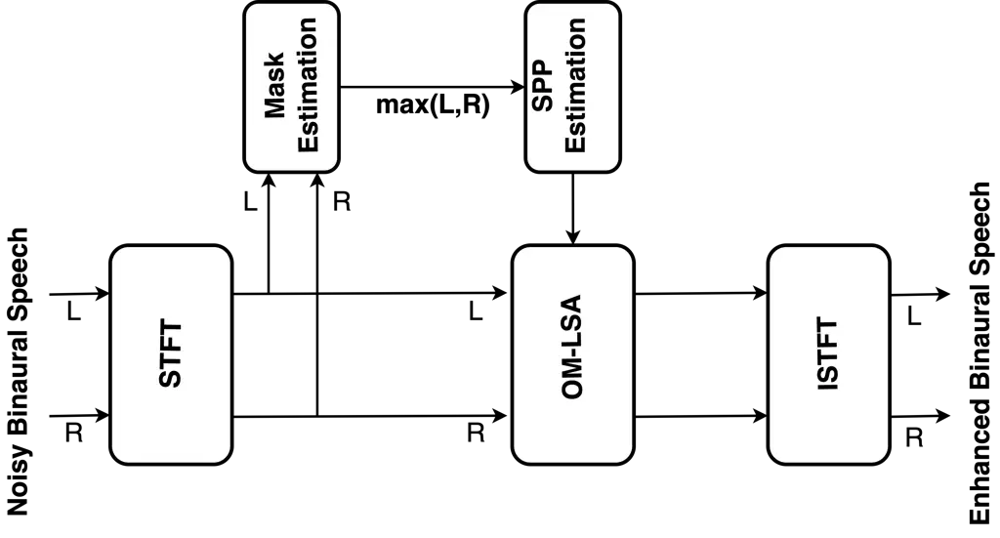

SNR  
Signal-to-Noise Ratio

SOBM  
STOI-optimal Binary Mask

STOI  
Short-Time Objective Intelligibility

WSTOI  
Weighted STOI

HSWOBM  
High-resolution Stochastic WSTOI-optimal Binary Mask

STFT  
Short Time Fourier Transform

ILD  
Interaural Level Differences

IPD  
Interaural Phase Differences

ITD  
Interaural Time Differences

LSA  
Log Spectral Amplitude

OM-LSA  
Optimally-modified Log Spectral Amplitude

DNN  
Deep Neural Network

ERB  
Equivalent Rectangular Bandwidth

DFT  
Discrete Fourier Transform

VSSNR  
Voiced-Speech-plus-Noise to Noise Ratio

SPP  
Speech Presence Probability

HRIRs  
Head Related Impulse Response

MBSTOI  
Modified Binaural STOI

ReLU  
Rectified Linear Unit

SNR  
Signal-to-Noise Ratio

ISTFT  
Inverse STFT

TF  
Time-Frequency

# BINAURAL SPEECH ENHANCEMENT USING STOI-OPTIMAL MASKS

This work was supported by funding from the European Union’s Horizon
2020 research and innovation programme under the Marie Skłodowska-Curie
grant agreement No 956369 and the UK Engineering and Physical Sciences
Research Council \[grant number EP/S035842/1\]

###### Abstract

STOI-optimal masking has been previously proposed and developed for
single-channel speech enhancement. In this paper, we consider the
extension to the task of binaural speech enhancement in which the
spatial information is known to be important to speech understanding and
therefore should be preserved by the enhancement processing. Masks are
estimated for each of the binaural channels individually and a
‘better-ear listening’ mask is computed by choosing the maximum of the
two masks. The estimated mask is used to supply probability information
about the speech presence in each time-frequency bin to an OM-LSA
(OM-LSA) enhancer. We show that using the proposed method for binaural
signals with a directional noise not only improves the SNR of the noisy
signal but also preserves the binaural cues and intelligibility.

|                                                                              |
| ---------------------------------------------------------------------------- |
| Vikas Tokala, Mike Brookes, Patrick A. Naylor                                |
| Department of Electrical and Electronic Engineering, Imperial College London |
| {v.tokala, mike.brookes, p.naylor}@imperial.ac.uk                            |

Index Terms—  Binaural speech enhancement, time-frequency masking,
speech presence probability, noise reduction, interaural cues

## 1 Introduction

For binaural signals, along with enhancement of SNR (SNR) and
intelligibility, binaural cues must also be preserved. Studies have
shown that preserving the binaural cues is helpful for sound
localization and speech intelligibility in noisy environments due to
binaural unmasking \[1, 2\]. ILD (ILD) and ITD (ITD) are particularly
helpful in localizing sound, dereverberation, improving intelligibility
and boosting the perceived loudness \[3, 4\]. Binaural speech
enhancement methods using beamformers \[5, 6\], multichannel Wiener
filters \[7, 8\] and mask informed enhancement methods \[9, 10\] were
previously proposed.

Mask-based speech enhancement has been well studied for monoaural
signals and has been shown to improve the SNR and intelligibility \[11,
12\]. The SOBM (SOBM), designed to optimize STOI (STOI), was introduced
in \[13\] for monoaural signals. In this paper we propose a method for
extending the monoaural mask-assisted enhancement to binaural speech by
using HSWOBM (HSWOBM) version of the SOBM, which optimizes WSTOI
(WSTOI)\[14\] as our training target to estimate a continuous valued
mask. Directly applying the TF (TF) mask as a gain in the STFT (STFT)
domain produces significant artefacts and so in \[15\], the OM-LSA is
proposed as an alternative method of applying the TF mask which improves
the perceptual quality of the enhanced speech.

The paper is organized with Sec. 2 introducing the STOI and WSTOI
metrics, STOI-optimal mask based speech enhancement and the use of
OM-LSA and SPP (SPP) for mask application. Section 3 outlines the
structure of the experiments followed by results and discussion in Sec.
4 and Sec. 5 draws the conclusions.

## 2 Mask-based Speech Enhancement

### 2.1 Overview of STOI and WSTOI

STOI is an intrusive intelligibility metric based on the correlation
between the spectral envelopes of clean and degraded versions of the
speech \[16\]. To compute STOI, these signals are converted into the
STFT domain using a 50%-overlapping Hanning window of length $`25.6`$ ms
and this results in the clean and degraded STFT signals, $`X(k,m)`$ and
$`Y(k,m)`$, with $`(k,m)`$ the frequency and time frame indices.
$`X(k,m)`$ and $`Y(k,m)`$ are combined into $`J=15`$ third-octave bands
by calculating the amplitudes of the TF cells denoted by $`X_{j}(m)`$
and $`\tilde{Y}_{j}(m)`$ where $`j=1,..,J`$ and $`\widetilde{[\cdot]}`$
indicates amplitude clipping to limit the impact of frames having low
speech energy. The modulation vector is defined as
$`\mathbf{x}_{j,m}=[X_{j}(m-M+\penalty\ 1),X_{j}(m-M+2),..,X_{j}(m)]^{T}`$,
where $`M=30`$. The modulation vectors for clean and degraded signals,
denoted by $`\mathbf{x}_{j,m}`$ and $`\mathbf{y}_{j,m}`$, are computed
by performing a correlation between clean and degraded speech vectors of
duration $`(25.6\times 30)/2=384`$ ms. The clipped TF cell amplitudes,
denoted by $`\widetilde{[\cdot]}`$, are determined as

```math
\widetilde{Y}_{j}(m)=\mathrm{min}\left(Y_{j}(m),\lambda\frac{\lVert\mathbf{y}_{j,m}\rVert}{\lVert\mathbf{x}_{j,m}\rVert}X_{j}(m)\right) \tag{1}
```

where $`\lambda=6.623`$ and $`\lVert\cdot\rVert`$ denotes the Euclidean
norm. The corresponding clipped modulation vector is
$`\mathbf{\tilde{y}}_{j,m}`$. The STOI contribution of each TF cell
$`(j,m)`$ is then given by

```math
d(\mathbf{x}_{j,m},\mathbf{\tilde{y}}_{j,m})\triangleq\frac{(\mathbf{x}_{j,m}-\bar{x}_{j,m})^{T}\mathbf{\tilde{y}}_{j,m}}{\lVert\mathbf{x}_{j,m}-\bar{x}_{j,m}\rVert\lVert\mathbf{\tilde{y}}_{j,m}-\bar{\tilde{y}}_{j,m}\rVert}, \tag{2}
```

where $`\bar{x}_{j,m}`$ and $`\bar{\tilde{y}}_{j,m}`$ denote the mean of
the vectors $`\mathbf{x}_{j,m}`$ and $`\mathbf{\tilde{y}}_{j,m}`$,
respectively. The overall STOI metric is computed by averaging the
contributions of the TF cells over all bands, $`j`$, and frames, $`m`$.
In \[14\], the authors propose a modified version of STOI, where each TF
cell contribution for the final STOI score is weighted by estimated
intelligibility content of the TF cell. Both metrics compare a clean
speech signal with a degraded speech signal. Also, for computing the
WSTOI, the correlation comparison is computed on individual STFT
frequency bins rather than third-octave bands. The weight $`I_{j,m}`$ is
calculated from the mutual information estimated using linear prediction
models and is optimized using a language model \[17\]. The WSTOI score
is given by

```math
\textrm{WSTOI}=\frac{1}{\sum_{j,m}I_{j,m}}\sum_{j,m}I_{j,m}d(\mathbf{x}_{j,m},\mathbf{\tilde{y}}_{j,m}). \tag{3}
```

### 2.2 Proposed Binaural Mask-based Enhancement



Fig. 1: Block diagram of the proposed method.

A block diagram of the proposed method is shown in Fig 1. The L and R
labels indicate the left and right channels of a binaural signal. The
left and right channels are processed in parallel for all stages of the
algorithm. The noisy binaural signal is transformed into the STFT domain
for TF-based processing. From the STFT domain signals, 3 feature subsets
as defined in Sec. 2.2.1 are extracted once per STFT frame and the same
features are used for the training and prediction stages of the
algorithm. STOI optimal masks correlate to intelligible speech in the
signal and SPP is computed from the estimated continuous-valued mask and
then supplied to the OM-LSA. The output signal of the OM-LSA is
transformed back into to the time-domain by applying an ISTFT (ISTFT).

#### 2.2.1 Mask Estimation Features

The feature extraction and mask estimation follows the method from
\[18\]. The first step in feature extraction for mask estimation is to
normalize the noisy speech active level to 0 dB using the ITU P.56
objective speech active level \[19\] to make the algorithm level
independent. Each of the three feature subsets has $`\Psi`$ features,
giving $`3\Psi`$ features in total.

The first feature subset is constructed from the TF gains estimated by
the Log-MMSE speech enhancement algorithm \[20, 21\], that minimizes the
mean-squared error in the log-spectral amplitudes. The TF gains are
expected to be high when speech is present and low otherwise. As this
algorithm uses a noise estimator \[22\], these features are expected to
help generalize the mask estimator to unseen noise types. The gain
function $`G(k,m)`$ from \[20\] satisfies
$`G(k,m)|Y(k,m)|=\mathrm{exp}\{\mathbb{E}[\textrm{log}|X(k,m)|\;|Y(k,m)|]\}`$
where, $`\mathbb{E[.]}`$ is the expectation operator. The first subset
of features,
$`\boldsymbol{\mu}_{m}^{(1)}=\left[\mu_{1,m}^{(1)},...,\mu_{\Psi,m}^{(1)}\right]^{T}`$,
is a $`\Psi\times 1`$ vector found by averaging $`G(k,m)`$ in
$`\Psi=30`$ triangular windows, $`w_{i}(k)`$ for $`i=1,..,\Psi`$ equally
spaced on ERB (ERB) scale centre frequencies and then computing the
natural logarithm. For frame $`m`$, the feature subset is given by

```math
\mu_{i,m}^{(1)}=\textrm{ln}\left\{\frac{\sum_{k=0}^{K/2}w_{i}(k)G(k,m)}{\sum_{k=0}^{K/2}w_{i}(k)}\right\}\textrm{for}\;i=1,...,\Psi \tag{4}
```

where $`K`$ is the DFT (DFT) length. The second feature subset, denoted
by
$`\boldsymbol{\mu}_{m}^{(2)}=\left[\mu_{1,m}^{(2)},...,\mu_{\Psi,m}^{(2)}\right]^{T}`$,
is the estimate of the level-normalized enhanced speech amplitude in
each frequency band and is obtained by multiplying the gains from the
first feature subset with the noisy speech. The third feature subset
$`\boldsymbol{\mu}_{m}^{(3)}=\left[\mu_{1,m}^{(3)},...,\mu_{\Psi,m}^{(3)}\right]^{T}`$
is an estimate of the local VSSNR (VSSNR) in the TF regions and is
obtained using the PEFAC algorithm \[23\]. The fundamental frequency of
the speech in each frame is computed and then VSSNR is estimated within
the $`\Psi`$ frequency bands by comparing the energy at harmonics of the
fundamental frequency with the energy halfway between consecutive
harmonics. The complete feature set for frame $`m`$ is obtained by
concatenating the three subsets to obtain the feature set
$`\boldsymbol{\mu}_{m}=\left[\boldsymbol{\mu}_{m}^{(1)T},\boldsymbol{\mu}_{m}^{(2)T},\boldsymbol{\mu}_{m}^{(3)T}\right]^{T}`$.

#### 2.2.2 Target Mask and DNN (DNN)

The difference between SOBM and HSWOBM is that the latter is designed to
optimize WSTOI rather than STOI and is computed over a higher number of
frequency bands (129 instead of 15) to increase the resolution of the
mask. In the proposed method, HSWOBMs are used as target masks and are
computed using the three-stage dynamic programming technique described
in \[13\] which consists of carrying out three passes of estimation with
a pruning strategy to compute the target masks to optimise the WSTOI
from (3). Directional white Gaussian noise at 0 dB SNR is added to
binaural speech signals to generate the training data and computation of
target masks. The target masks are computed for the left and right
channels individually based on the speech content in each channel. The
HSWOBM is computed by forming a masked signal
$`Z_{j}(m)=B_{j}(m)Y_{j}(m)`$ where $`B_{j}(m)\in\{0,1\}`$. The clipped
modulation masked vector $`\mathbf{\tilde{z}}_{j,m}`$ is then computed
analogous to (1) to limit the impact of frames having low speech energy.
$`B_{j}`$ is numerically optimized using least squares method separately
in each band, $`j`$, by computing

```math
B_{j}(m)=\argmax_{\{B_{j}(m):m=1,...,N\}}\left(\sum_{m=1}^{N}I_{j,m}\mathbb{E}[d(\mathbf{x}_{j,m},\mathbf{\tilde{z}}_{j,m})]\right)
```

where $`N`$ is the number of frames and

```math
\mathbb{E}[d(\mathbf{x}_{j,m},\mathbf{\tilde{z}}_{j,m})]\approx\frac{(\mathbf{x}_{j,m}-\bar{x}_{j,m})^{T}\;\mathbb{E}[\mathbf{\tilde{z}}_{j,m}]}{\lVert\mathbf{x}_{j,m}-\bar{x}_{j,m}\rVert\;\sqrt{\vrule height=12.0pt,depth=3.60004pt,width=0.0pt\mathbb{E}[\lVert\mathbf{\tilde{z}}_{j,m}-\bar{\tilde{z}}_{j,m}\rVert^{2}}]}. \tag{5}
```

A feed-forward DNN is trained to estimate a continuous mask from the
features extracted from the noisy binaural signals by using the HSWOBM
target masks estimated by dynamic programming \[13, 18\]. The DNN
consists of 4 layers of ‘dense’ or ‘fully-connected’ layers each with
500 hidden neurons. ReLU (ReLU) is used as the activation function for
all the layers except the output layer where the Sigmoid activation
function is used. Dropout layers are placed between the layers with a
dropout factor of 20%. A weighted mean square error is used as the cost
function for the DNN. The cost function, $`\mathcal{J}`$, is given by

```math
\mathcal{J}=\frac{1}{\Delta}\frac{\sum_{p=1}^{\Delta}\phi_{p}(\mathrm{c}_{p}-\zeta_{p})^{2}}{\sum_{p=1}^{\Delta}\phi_{p}} \tag{6}
```

where $`c_{p}`$ is the output of the DNN, $`\Delta`$ is the number of
pairs of feature vectors and corresponding mask value pairs available
for training, $`\zeta_{p}`$ is the training target and $`\phi_{p}`$ is
the corresponding value of the weight. The weights are computed from the
WSTOI sensitivity and band importance weighting obtained from the WSTOI
metric \[14\].

#### 2.2.3 Better-ear Processing

Studies \[3, 10\] have shown that human listeners are capable of better
ear listening, which is focusing on the speech signal from the ear which
has higher SNR and intelligibility. We adopt a similar approach in our
method for the selection of the mask values or the gains in each TF bin.
Choosing the maximum gain value from the two estimated masks for the
left and right channels is equivalent to selecting the gain associated
with lower noise levels and higher speech presence from the SPP
estimation. In order to preserve the spatial cues of the binaural
signal, the same gain needs to be applied to both the channels. Hence,
in our method, we use the gains selected from the above method to
compute a single SPP to input to the OM-LSA enhancer for both the
channels.

#### 2.2.4 Optimally Modified-LSA

Mask-application follows the method in \[15\], that is shown to improve
the perceptual quality of masked speech. From the computed HSWOBM, an
intermediate continuous-valued mask is estimated and, instead of
applying this mask as a TF domain gain, it is used to supply the
probability of speech presence to a speech enhancer \[24\] that
minimizes the expected error in the LSA (LSA). Let us consider the
hypothesis $`H_{1}(k,m)`$ in the $`k^{th}`$ bin where speech is present
and $`H_{0}(k,m)`$ where speech is absent. Considering the gain
$`G(k,m)`$ to be larger than a threshold $`G_{min}`$ when the speech is
absent, it is shown in \[24\] that

```math
G(k,m)=\{G_{H_{1}}(k,m)\}^{p(k,m)}\;G_{min}^{1-p(k,m)} \tag{7}
```

where $`G_{H_{1}}(k,m)`$ is the gain under the hypothesis $`H_{1}(k,m)`$
and $`p(k,m)\triangleq P(H_{1}(k,m)|Y(k,m))`$ is the conditional SPP and
is given by

```math
p(k,m)=\left\{1+\frac{q(k,m)}{1-q(k,m)}(1+\xi(k,m))\mathrm{exp}(-v(k,m))\right\}^{-1}
```

where $`q(k,m)\penalty\ \triangleq\penalty\ P(H_{0}(k,m))`$ is the a
priori probability of speech absence in the hypothesis $`H_{0}(k,m)`$,
$`v(k,m)`$ is the a posteriori SNR and $`\xi(k,m)`$ is the a priori SNR
. In \[15\] it is shown that, by using the gain value of the mask to
control the speech probability and using this to enhance the speech
using OM-LSA, there is a soft imposition of the spectro-temporal
modulations required to preserve the intelligibility of the enhanced
speech. From the estimated better-ear continuous mask, the SPP which
will be used to enhance both the channels is computed and supplied to
the OM-LSA. The enhanced signals are then transformed into the time
domain from the TF domain by performing the inverse STFT.

(a)

(b)

(c)

Fig. 2: (a) Improvement in MBSTOI score, (b) improvement in frequency
weighted segmental SNR for both channels and (c)(upper) frequency
averaged RMS ILD error with different SNRs, for a source placed 80 cm
away at $`30^{\circ}`$ azimuth and noise at $`0^{\circ}`$ azimuth
(c)(lower) frequency averaged RMS ILD error for source at 80 cm with 0
dB SNR for different azimuths of the source and the noise at
$`0^{\circ}`$ azimuth.

## 3 Simulation Experiments

Simulations were performed using speech utterances from TIMIT \[25\] and
noise signals from NOISEX-92 \[26\] and all signals were resampled to 10
kHz. To simulate binaural signals and directional noise, the HRIRs
(HRIRs) from \[27\] were used. To generate the training target HSWOBM
masks, 400 speech signals from TIMIT and the anechoic in-ear HRIRs were
used. The source azimuth was randomly selected between $`-90^{\circ}`$
and $`+90^{\circ}`$ with a resolution of $`5^{\circ}`$ and with
elevation and distance fixed at 80 cm and $`0^{\circ}`$. The target
masks for the left and right channels were then computed as described in
Sec. 2.2.2. A feed-forward DNN was designed in Python using Tensorflow.
Around 2 million trainable parameters were generated from the three
extracted feature sets. The DNN was trained to estimate a continuous
mask to optimize the WSTOI metric in each channel by minimizing the cost
function in (6). The generated trainable data was split into 70% for
training and 30% for validation while training the model. For
evaluation, 30 unseen male and female speech utterances randomly
selected from TIMIT test dataset, and 5 types of noise signals from
NOISEX-92, and spatialized using HRIRs \[27\] were used to generate the
test data.

Experiments with different SNRs were performed by adding a normalized
directional noise at $`0^{\circ}`$ azimuth to a normalized binaural
speech signal at SNRs in the range of -15 dB to +15 dB in steps of 5 dB.
The A-weighted frequency segmental SNR \[28, 21\] is measured to show
the noise reduction, MBSTOI \[29\] to show the binaural intelligibility
improvement and the ILD error to quantify the preservation of binaural
cues. The ILD for binaural signals is computed in each TF bin as
$`\textrm{ILD}_{(k,m)}=20\textrm{log}_{10}(|Y_{L}(k,m)|/|Y_{R}(k,m)|)`$,
where $`Y_{L}`$ and $`Y_{R}`$ are the left and right channel STFT domain
signals. The RMS ILD error is computed by averaging the error over all
the frequencies and for SNRs in the range of -15 dB to +15 dB in steps
of 5 dB of received binaural speech and at azimuths 0 to $`90^{\circ}`$
in steps of $`15^{\circ}`$. The RMS ILD error was averaged over
frequency because in our experiments no significant changes in the error
were observed over frequencies. In both the experiments to compute the
RMS ILD error, the directional noise was placed at $`0^{\circ}`$
azimuth. The proposed method does not alter the phase of the signal
while processing and therefore ITDs of the enhanced signal will be the
same as the signal before processing.

## 4 Results

Figure 2(a) shows the improvement in MBSTOI and maximum improvement was
observed between -5 to 0 dB SNR for all noise cases. At very noisy SNRs
of under -10 dB, extraction of speech features from the signal to
estimate an accurate mask becomes difficult, which explains lower
improvements. However, in Fig. 2(b), which shows the improvement in
segmental SNR, even under very noisy cases of -15 dB SNR where the
speech information in the extracted features is low, the method was able
to provide at least 3 dB SNR improvement for all the noise cases and as
the signal SNR improved, SNR improvements greater than 10 dB were also
observed. For SNRs higher than 5 dB, there is negative improvement in
MBSTOI, as the input binaural speech signal has a higher MBSTOI score
before processing and applying mask based enhancement on these signals
results in reducing the score. As all the signals above 5 dB SNR had a
MBSTOI score above 0.7 after processing, the overall intelligibility of
speech signals did not deteriorate to unintelligible levels. From Fig.
2(b), it can seen that a similar improvement in segmental SNR can be
observed for all the noise cases with speech shaped noise being the
exception and also from Fig. 2(a), lowest improvement for MBSTOI can be
seen for speech shaped noise. Although speech shaped noise is a
stationary noise, as it has most of its energy located in the TF bins
shared with speech, thus impacting the estimation of SPP and hence the
performance. For the experiments with multiple azimuth angles, the
source was simulated at azimuths from $`0^{\circ}`$ to $`90^{\circ}`$
since the other half of the frontal plane in the HRIRs database \[27\]
is a reflection of the former. Figure 2(c) shows the frequency averaged
RMS ILD error observed with the method for input SNRs of the noisy
signal and for different azimuth angles of the source. For all the noise
cases, SNRs and azimuths the RMS ILD error observed is under 1 dB in the
frontal plane. For all azimuths and SNRs, the proposed method performed
the best for white Gaussian noise having the least error among all the
noise cases. This low RMS ILD error after processing quantifies the
binaural cue preservation of the method.

## 5 Conclusions

We have presented a new approach using STOI-optimal masking to enhance
noisy binaural speech signals that not only improves the SNR but also
preserves the interaural cues and intelligibility. Instead of applying
the TF masks as a gain function, SPP is calculated and used by an OM-LSA
speech enhancer. The proposed method is able to provide significant
improvements in frequency weighted SNR, MBSTOI score and minimal
distortion of interaural cues.

## References

- \[1\] R. Beutelmann and T. Brand, “Prediction of speech
  intelligibility in spatial noise and reverberation for normal-hearing
  and hearing-impaired listeners,” _J. Acoust. Soc. Am._, vol. 120, p.
  331, 2006.
- \[2\] M. Lavandier and J. F. Culling, “Prediction of binaural speech
  intelligibility against noise in rooms,” _J. Acoust. Soc. Am._, vol.
  127, no. 1, pp. 387–399, Jan. 2010.
- \[3\] J. Blauert, _Spatial Hearing: The Psychophysics of Human Sound
  Localization_. Cambridge, MA, USA: The MIT Press, 1997.
- \[4\] M. L. Hawley, R. Y. Litovsky, and J. F. Culling, “The benefit
  of binaural hearing in a cocktail party: Effect of location and type
  of interferer,” _J. Acoust. Soc. Am._, vol. 115, no. 2, pp.
  833–843, 2004.
- \[5\] T. Lotter and P. Vary, “Dual-channel speech enhancement by
  superdirective beamforming,” _EURASIP J. on Applied Signal Process._,
  vol. 2006, no. 1, pp. 1–14, 2006.
- \[6\] E. Hadad, D. Marquardt, S. Doclo, and S. Gannot, “Theoretical
  analysis of binaural transfer function MVDR beamformers with
  interference cue preservation constraints,” _IEEE/ACM Trans. Audio,
  Speech, Language Process._, vol. 23, no. 12, pp. 2449–2464, Dec. 2015.
- \[7\] E. Hadad, D. Marquardt, S. Doclo, and S. Gannot, “Binaural
  multichannel Wiener filter with directional interference rejection,”
  in _Proc. IEEE Int. Conf. on Acoust., Speech and Signal Process.
  (ICASSP)_, Apr. 2015.
- \[8\] S. Doclo, T. J. Klasen, T. Van den Bogaert, J. Wouters, and M.
  Moonen, “Theoretical analysis of binaural cue preservation using
  multi-channel wiener filtering and interaural transfer functions,” in
  _Proc. Int. on Workshop Acoust. Echo and Noise Control
  (IWAENC)_, 2006.
- \[9\] A. H. Moore, L. Lightburn, W. Xue, P. A. Naylor, and M.
  Brookes, “Binaural mask-informed speech enhancement for hearing aids
  with head tracking,” in _Proc. Int. Workshop on Acoust. Signal
  Enhancement (IWAENC)_, Tokyo, Japan, Sep. 2018, pp. 461–465.
- \[10\] T. Green, G. Hilkhuysen, M. Huckvale, S. Rosen, M. Brookes, A.
  Moore, P. Naylor, L. Lightburn, and W. Xue, “Speech recognition with a
  hearing-aid processing scheme combining beamforming with mask-informed
  speech enhancement,” _Trends in Hearing_, vol. 26, Jan. 2022.
- \[11\] S. Gonzalez and M. Brookes, “Mask-based enhancement for very
  low quality speech,” in _Proc. IEEE Int. Conf. on Acoust., Speech and
  Signal Process. (ICASSP)_, Florence, May 2014.
- \[12\] N. Li and P. C. Loizou, “Factors influencing intelligibility
  of ideal binary-masked speech: Implications for noise reduction,” _J.
  Acoust. Soc. Am._, vol. 123, no. 3, pp. 1673–1682, Mar. 2008.
- \[13\] L. Lightburn and M. Brookes, “SOBM - a binary mask for noisy
  speech that optimises an objective intelligibility metric,” in _Proc.
  IEEE Int. Conf. on Acoust., Speech and Signal Process. (ICASSP)_, Apr.
  2015, pp. 5078–5082.
- \[14\] L. Lightburn and M. Brookes, “A Weighted STOI Intelligibility
  Metric based on Mutual Information,” in _Proc. IEEE Int. Conf. on
  Acoust., Speech and Signal Process. (ICASSP)_, Mar. 2016.
- \[15\] L. Lightburn, E. De Sena, A. H. Moore, P. A. Naylor, and M.
  Brookes, “Improving the perceptual quality of ideal binary masked
  speech,” in _Proc. IEEE Int. Conf. on Acoust., Speech and Signal
  Process. (ICASSP)_, Mar. 2017.
- \[16\] C. H. Taal, R. C. Hendriks, R. Heusdens, and J. Jensen, “An
  algorithm for intelligibility prediction of time-frequency weighted
  noisy speech,” _IEEE Trans. Audio, Speech, Language Process._, vol.
  19, no. 7, pp. 2125–2136, Sep. 2011.
- \[17\] R. Kneser and H. Ney, “Improved backing-off for M-gram
  language modeling,” in _Proc. (IEEE) Intl. Conf. on Acoustics, Speech
  and Signal Processing (ICASSP)_, vol. 1, May 1995, pp. 181–184 vol.1.
- \[18\] L. Lightburn, “Mask-based enhancement of very noisy speech,”
  Ph.D. dissertation, Imperial College London, 2020.
- \[19\] “P. 56: Objective measurement of active speech level,” Int.
  Telecommun. Union (ITU-T), Recommendation, Mar. 1993.
- \[20\] Y. Ephraim and D. Malah, “Speech enhancement using a minimum
  mean-square error log-spectral amplitude estimator,” _IEEE Trans.
  Acoust., Speech, Signal Process._, vol. 33, no. 2, pp. 443–445, 1985.
- \[21\] D. M. Brookes, “VOICEBOX: A speech processing toolbox for
  MATLAB,” 1997. \[Online\]. Available:
  [http://www.ee.ic.ac.uk/hp/staff/dmb/voicebox/voicebox.html](http://www.ee.ic.ac.uk/hp/staff/dmb/voicebox/voicebox.html)
- \[22\] T. Gerkmann and R. C. Hendriks, “Unbiased MMSE-based noise
  power estimation with low complexity and low tracking delay,” _IEEE
  Trans. Audio, Speech, Language Process._, vol. 20, no. 4, pp.
  1383–1393, May 2012.
- \[23\] S. Gonzalez and D. M. Brookes, “PEFAC - A pitch estimation
  algorithm robust to high levels of noise,” _IEEE/ACM Trans. Audio,
  Speech, Language Process._, vol. 22, pp. 518–530, Feb. 2014.
- \[24\] I. Cohen, “Optimal speech enhancement under signal presence
  uncertainty using log-spectral amplitude estimator,” _IEEE Signal
  Process. Lett._, vol. 9, no. 4, pp. 113–116, Apr. 2002.
- \[25\] J. S. Garofolo, L. F. Lamel, W. M. Fisher, J. G. Fiscus, D. S.
  Pallett, N. L. Dahlgren, and V. Zue, “TIMIT acoustic-phonetic
  continuous speech corpus,” Linguistic Data Consortium (LDC),
  Philadelphia, USA, Corpus LDC93S1, 1993.
- \[26\] A. Varga and H. J. M. Steeneken, “Assessment for automatic
  speech recognition II: NOISEX-92: A database and an experiment to
  study the effect of additive noise on speech recognition systems,”
  _Speech Commun._, vol. 3, no. 3, pp. 247–251, Jul. 1993.
- \[27\] H. Kayser, S. D. Ewert, J. Anemüller, T. Rohdenburg, V.
  Hohmann, and B. Kollmeier, “Database of multichannel in-ear and
  behind-the-Ear head-related and binaural room impulse responses,”
  _EURASIP J. on Advances in Signal Process._, vol. 2009, no. 1, p.
  298605, Jul. 2009.
- \[28\] Y. Hu and P. C. Loizou, “Evaluation of objective measures for
  speech enhancement,” in _Proc. Conf. of Int. Speech Commun. Assoc.
  (INTERSPEECH)_, 2006, pp. 1447–1450.
- \[29\] A. H. Andersen, J. M. de Haan, Z. H. Tan, and J. Jensen,
  “Refinement and validation of the binaural short time objective
  intelligibility measure for spatially diverse conditions,” _Speech
  Commun._, vol. 102, pp. 1–13, Sep. 2018.
