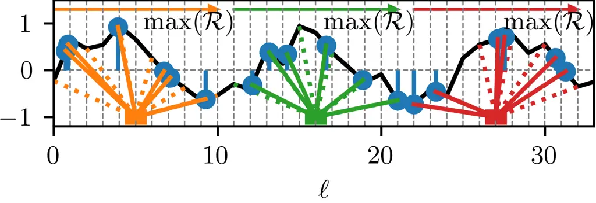
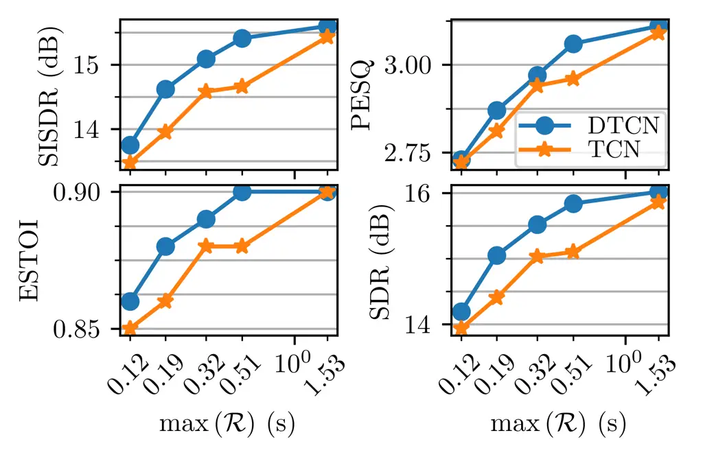
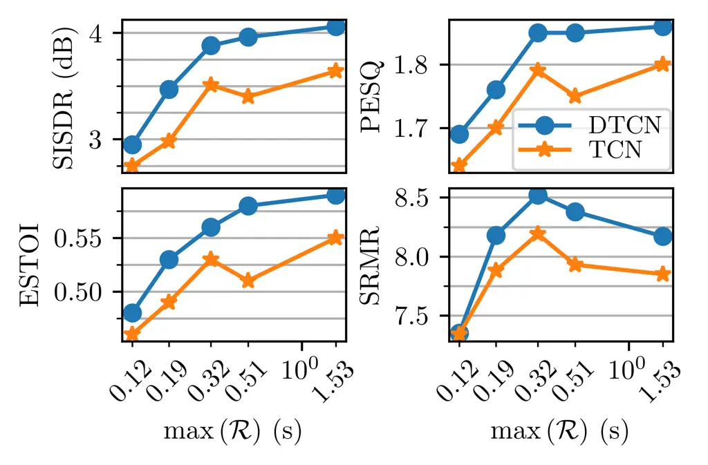
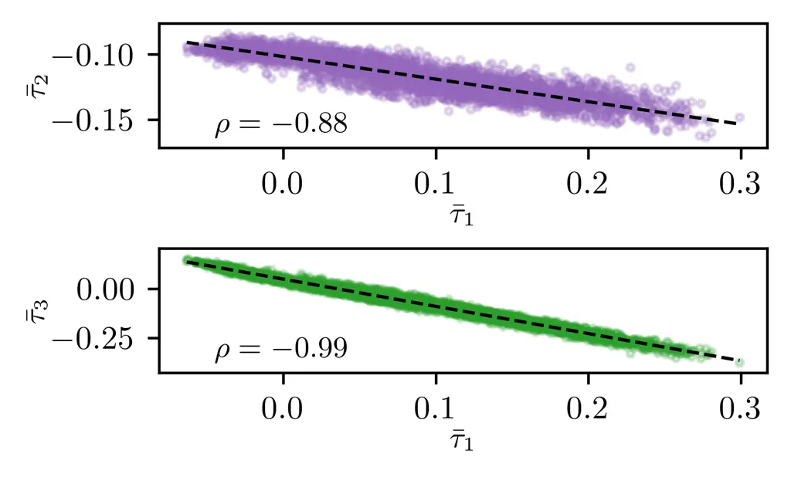

# Deformable Temporal Convolutional Networks for Monaural Noisy Reverberant Speech Separation

William Ravenscroft, Stefan Goetze, and Thomas Hain ^(†)^(†)thanks: This
work was supported by the Centre for Doctoral Training in Speech and
Language Technologies (SLT) and their Applications funded by UK Research
and Innovation \[grant number EP/S023062/1\]. This work was also funded
in part by 3M Health Information Systems, Inc.

###### Abstract

Speech separation models are used for isolating individual speakers in
many speech processing applications. Deep learning models have been
shown to lead to SOTA (SOTA) results on a number of speech separation
benchmarks. One such class of models known as TCN has shown promising
results for speech separation tasks. A limitation of these models is
that they have a fixed RF (RF). Recent research in speech
dereverberation has shown that the optimal RF of a TCN varies with the
reverberation characteristics of the speech signal. In this work
deformable convolution is proposed as a solution to allow TCN models to
have dynamic RF that can adapt to various reverberation times for
reverberant speech separation. The proposed models are capable of
achieving an 11.1 dB average SISDR (SISDR) improvement over the input
signal on the WHAMR benchmark. A relatively small deformable TCN model
of 1.3M parameters is proposed which gives comparable separation
performance to larger and more computationally complex models.

###### Index Terms: 

speech separation, deformable convolution, dynamic neural networks

^(†)^(†)address: Department of Computer Science, The University of
Sheffield, Sheffield, United Kingdom  
{jwravenscroft1, s.goetze, t.hain}@sheffield.ac.uk

## 1 Introduction

The separation of overlapping speech signals is an area that has been
widely studied and which has many applications \[1, 2, 3, 4\]. Deep
learning models have demonstrated impressive results on separating clean
speech mixtures \[5, 6\]. However, this performance still degrades
heavily under noisy reverberant conditions \[7\]. This performance loss
can be alleviated somewhat with careful hyper-parameter optimization but
a significant performance gap still exists \[8\].

The Conv-TasNet speech separation model has been widely studied and
adapted for a number of speech enhancement tasks \[5, 9, 10, 11\].
Conv-TasNet generally performs very well on clean speech mixtures with a
very low computational cost compared to the most performant speech
separation models \[6, 12, 13\] on the WSJ0-2Mix benchmark\[14\]. As
such, it is still used in many related areas of research \[9, 11\].
Recent research efforts in speech separation have focused on producing
more resource-efficient models even if they do not produce the most SOTA
results on separation benchmarks \[12, 13\]. Previous work has
investigated adaptations to Conv-TasNet with additional modifications
such as multi-scale convolution and gating mechanisms applied to the
outputs of convolutional layers but these significantly increase the
computational complexity \[15\]. The Conv-TasNet model uses a sequence
model known as a TCN. It was recently shown that the optimal RF of TCN
in dereverberation models varies with reverberation time when the model
size is sufficiently large \[10\]. Furthermore, it was shown that
multi-dilation TCN models can be trained implicitly to weight
differently dilated convolutional kernels to optimally focus within the
RF on more or less temporal context according to the reverberation time
in the data for dereverberation tasks \[16\], i.e. for larger
reverberation times more weight was given to kernels with larger
dilation factors.

In this work deformable depthwise convolutional layers \[17, 18, 19\]
are proposed as a replacement for standard depthwise convolutional
layers \[5\] in TCN based speech separation models for reverberant
acoustic conditions. Deformable convolution allows each convolutional
layer to have an adaptive RF. When used as a replacement for standard
convolution in a TCN this enables the TCN to have a RF that can adapt to
different reverberant conditions. Using shared weights \[15\] and
dynamic mixing \[20\] are also explored as ways to reduce model size and
improve performance. A PyTorch library for training deformable 1D
convolutional layers as well as a SpeechBrain \[21\] recipe for
reproducing results (cf. Section 5) are provided.

The remainder of the paper proceeds as follows. In Section 2 the signal
model is discussed. The DTCN (DTCN) is introduced in Section 3. Section
4 discusses the experimental setup, data and baseline systems. Results
are given in Section 5. Section 6 provides analysis of the proposed
models and conclusions are provided in Section 7.

## 2 Signal Model

A noisy reverberant mixture of $`C`$ speech signals $`s_{c}[i]`$ for
discrete sample index $`i`$ convolved with RIR $`h_{c}[i]`$ and
corrupted by an additive noise signal $`\nu[i]`$ is defined as

```math
\displaystyle x[i] \displaystyle=\sum_{c=1}^{C}h_{c}[i]*s_{c}[i]+\nu[i] \tag{1}
```

where $`\ast`$ is the convolution operator. The goal in this work is to
estimate the direct speech signal $`s_{\mathrm{dir,c}}[i]`$ and remove
the reverberant reflections $`s_{\mathrm{rev,c}}[i]`$ where

```math
\displaystyle x[i] \displaystyle=\sum_{c=1}^{C}\left(s_{\mathrm{dir,c}}[i]+s_{\mathrm{rev,c}}[i]\right)+\nu[i]. \tag{2}
```

## 3 Deformable Temporal Convolutional Separation Network

### 3.1 Network Architecture

The separation network uses a mask-based approach similar to \[5\]. The
noisy reverberant microphone signal is first segmented into
$`L_{\mathbf{x}}`$ blocks of length $`L_{\mathrm{BL}}`$ with a 50%
overlap defined as

```math
\mathbf{x}_{\ell}=\left[x[0.5(\ell-1)L_{\mathrm{BL}}],\ldots,x[0.5(1+\ell)L_{\mathrm{BL}}-1]\right] \tag{3}
```

for frame $`\ell\in\{1,\ldots,L_{\mathbf{x}}\}`$. Motivated by \[5, 6\],
the frames in (3) are encoded by a 1D convolutional layer with trainable
weights $`\mathbf{B}\in\mathbb{R}^{L_{\mathrm{BL}}\times N}`$ such that

```math
\mathbf{w}_{\ell}=\mathcal{H}_{\mathrm{enc}}\left(\mathbf{x}_{\ell}\mathbf{B}\right) \tag{4}
```

with a ReLU activation function
$`\mathcal{H}_{\mathrm{enc}}:\mathbb{R}^{1\times N}\rightarrow\mathbb{R}^{1\times N}`$.
Encoded features $`\mathbf{w}_{\ell}`$ are used as the input to a mask
estimation network to produce masks $`\mathbf{m}_{\ell,c}`$ for each
speaker $`c\in\{1,\ldots,C\}`$. The masks are then applied to the
encoded features using the Hadamard product,
i.e. $`\mathbf{w}_{\ell}\odot\mathbf{m}_{\ell,c}`$ resulting in
$`\mathbf{v}_{\ell,c}`$. The encoded estimate $`\mathbf{v}_{\ell,c}`$
for speaker $`c`$ can be decoded from the same space back into the time
domain using the inverse filter of $`\mathbf{B}`$, denoted as
$`\mathbf{U}\in\mathbb{R}^{N\times L_{\mathrm{BL}}}`$, such that

```math
\hat{\mathbf{s}}_{\ell,c}=\mathbf{v}_{\ell,c}\mathbf{U} \tag{5}
```

where $`\hat{\mathbf{s}}_{\ell,c}`$ is the estimated clean speech signal
for frame $`\ell`$ in the time domain. These frames are then combined
following the overlap-add method. The entire network model diagram is
shown in Fig. 1.



Figure 1: Mask-based separation network, exemplary for 2 speakers.

### 3.2 Mask Estimation Network

In this subsection, the DD-Conv (DD-Conv) layer is introduced as a
replacement for D-Conv (D-Conv) layers and then the DTCN network is
described in full. The mask estimation network consists of cLN (cLN) and
a bottleneck P-Conv (P-Conv) layer which transforms the feature
dimension from $`N`$ to $`B`$ followed by the DTCN which is followed by
a P-Conv and ReLU activation to compute a sequence of masks
$`\mathbf{m}_{\ell,:}`$ with dimension $`C\cdot N`$ \[5\].

#### 3.2.1 Deformable Depthwise Convolution (DD-Conv)

The formulation of DD-Conv in this section is adapted from \[17\] and
\[18\]. The D-Conv operation of kernel size $`P`$, dilation factor $`f`$
and convolutional kernel weights for the $`g`$th channel of an input
with $`G`$ channels denoted
$`\mathbf{y}_{g}\in\mathbb{R}^{L_{\mathbf{x}}}`$ at the $`\ell`$th frame
is defined as

```math
\mathcal{D}(\ell,\mathbf{y}_{g},\mathbf{k}_{g})=\sum_{{p}=1}^{P}k_{g}[{p}]\,y_{g}[\ell+f\cdot(p-1)]. \tag{6}
```

The corresponding DD-Conv operator with learnable continuous offset of
the $`p`$th kernel weight denoted $`\tau_{\ell,p}`$ at frame $`\ell`$ is
defined as

```math
\mathcal{C}(\ell,\mathbf{y}_{g},\mathbf{k}_{g},\tau_{\ell,1:P})=\sum_{{p}=1}^{P}k_{g}[{p}]\,y_{g}[\ell+f\cdot(p-1)+\tau_{\ell,p}]. \tag{7}
```

Note that $`\tau_{\ell,p}`$ only varies temporally and not across
channels. It is feasible to vary these values across channels but in
this work to reduce computational complexity offsets are only varied
temporally. An illutsration of the DD-Conv operation is shown in
Figure 2.



Figure 2: Single channel example of Deformable depthwise convolution
(bottom) on pseudo-random signal (shown in black) with a kernel size of
6, dilation factor of 2 and stride of 11. $`\mathcal{R}`$ denotes the RF
of the kernel. Dotted lines indicate original sampling position of
kernel weights before deformation.

To simplify notation let
$`{\Delta\ell}_{p}=\ell+f\cdot(p-1)+\tau_{\ell,p}`$. Linear
interpolation is used to compute values of $`y[{\Delta\ell}_{p}]`$ from
input sequence $`\mathbf{y}`$ such that

```math
y[{\Delta\ell}_{p}]=\sum_{u=\lfloor{\Delta\ell}_{p}\rfloor}^{\lfloor{\Delta\ell}_{p}\rfloor+1}\max(0,1-|u-{\Delta\ell}_{p}|)y[u]. \tag{8}
```

In practice the interpolation function is designed to constrain the
deformable convolutional kernel so it cannot exceed a maximum RF of
$`P\cdot(f-1)+1`$ by replacing $`u=\lfloor{\Delta\ell}_{p}\rfloor`$ with
$`u=\min(\lfloor{\Delta\ell}_{p}\rfloor,\ell+P\cdot(f-1)-1)`$ in the
bottom of the summation of (8). This constrains the kernel with the
benefit of improving interpretability for the overall scope of the DTCN
described in the following subsection.

#### 3.2.2 Deformable Temporal Convolutional Mask Estimation Network

The DTCN is formulated in the same way as the Conv-TasNet TCN described
in \[22\]. This implementation deviates slightly from the original
Conv-TasNet \[5\] by neglecting the SC and associated P-Conv layers. It
was found empirically that these SC layers have a negligible impact on
performance ($`\leq 0.1`$ dB SISDR) while having a significant negative
impact on model size ($`\approx 35\%`$ parameter increase).

The DTCN is composed of $`X\cdot R`$ convolutional blocks where
$`X,R\in\mathbb{Z}^{+}`$ \[22\]. Each convolutional block consists of a
P-Conv which projects the feature dimension from $`B`$ to $`H`$, DD-Conv
that performs a depthwise operation across the $`H`$ channels and
another P-Conv layer which projects the feature dimension back to $`B`$
from $`H`$. The DD-Conv proceeded by P-Conv layer forms a DDS-Conv
(DDS-Conv) structure. DS-Conv (DS-Conv), i.e. a P-Conv proceeded by any
D-Conv layer, is used as a replacement for standard convolutional layers
as it is more parameter efficient and mathematically equivalent \[5\].
In each convolutional block the DD-Conv has an increasing dilation
factor $`f`$ for each additional block in a stack of $`X`$ blocks as in
\[22, 5\]. The dilation factor $`f`$ increases in powers of two through
the stack such that $`f\in\{1,2,\ldots,2^{X-1}\}`$. Note that in D-Conv
the dilation factor determines the fixed RF whereas in the proposed
DD-Conv the dilation factor defines only the maximum possible RF of the
kernel. The stack of $`X`$ convolutional blocks is then repeated $`R`$
times where the dilation factor is reset to $`1`$ at the beginning of
each stack. Using SW (SW) for each repeat is experimented with as this
significantly reduces the model size similar to \[15\]. The offsets
$`\tau_{\ell,p}`$ are computed using DS-Conv following the initial
P-Conv in the block, referred to as the offset sub-network. A PReLU
(PReLU) activation is used at the output as this allows for both
negative and positive offsets. Residual connections are applied around
each of the convolutional blocks similar to the TCN described in \[22\].
A schematic of the convolutional blocks is shown in Fig. 3.


Figure 3: Layers inside deformable temporal convolutional blocks.

## 4 Experimental Setup

### 4.1 Data

Two datasets are used to evaluate the proposed DTCN network. The first
is a clean speech mixture corpus known as WSJ0-2Mix \[23\]. In
WSJ0-2Mix, two speech segments are overlapped at SNRs of $`0`$ to
$`5`$ dB. The second is a noisy reverberant speech mixture corpus known
as WHAMR \[7\]. Speech segments in WHAMR are convolved with simulated
RIR then summed together with mixing SNRs of $`0`$ to $`5`$ dB. Ambient
noise sources from outdoor pedestrian areas are added at SNRs of $`-6`$
to $`3`$ dB (cf. (1)). DM (DM), i.e. simulating new training data each
epoch, is also experimented with at training time as it has been shown
to lead to improved separation performance \[6, 24\]. Speed perturbation
training is also performed as part of the DM process as described in
\[6\].

### 4.2 Model Configuration

Feature dimensions $`N`$, $`B`$ and $`H`$, kernel size $`P`$ and encoder
block size $`L_{\mathrm{BL}}`$ are fixed:

```math
\{N,B,H,P,L_{\mathrm{BL}}\}=\{512,128,512,3,16\}. \tag{9}
```

These values correspond to the optimal TCN network in \[5\]. Note
$`L_{\mathrm{BL}}`$ equates to $`2`$ ms at 8 kHz. Five DTCN model
configurations are evaluated:

```math
\{X,R\}\in\{\{3,8\},\{4,6\},\{5,5\},\{6,4\},\{8,3\}\}. \tag{10}
```

These configurations are selected as they have a similar or the same
number of convolutional blocks to the optimal model configuration in
\[5\], i.e. $`\{X,R\}=\{8,3\}`$. The SISDR loss function \[25\] defined
as

```math
\displaystyle\mathcal{L}(\hat{\boldsymbol{\mathrm{s}}},\boldsymbol{\mathrm{s}}_{\mathrm{dir}}) \displaystyle:=\frac{1}{C}\sum_{c=1}^{C}-10\log_{10}\frac{\left\|\frac{\langle\hat{\boldsymbol{\mathrm{s}}}_{c},\boldsymbol{\mathrm{s}}_{\mathrm{dir},c}\rangle\boldsymbol{\mathrm{s}}_{\mathrm{dir},c}}{\|\boldsymbol{\mathrm{s}}_{\mathrm{dir},c}\|^{2}}\right\|^{2}}{\left\|\hat{\boldsymbol{\mathrm{s}}}_{c}-\frac{\langle\hat{\boldsymbol{\mathrm{s}}}_{c},\boldsymbol{\mathrm{s}}_{\mathrm{dir},c}\rangle\boldsymbol{\mathrm{s}}_{\mathrm{dir},c}}{\|\boldsymbol{\mathrm{s}}_{\mathrm{dir},c}\|^{2}}\right\|^{2}} \tag{11}
```

is used to train the DTCN models. PIT (PIT) is used to solve the speaker
permutation problem \[26\].

Two GitHub repositories have been released in conjunction with this
work. The first¹¹ 1 URL to dc1d pip repository:
[github.com/jwr1995/dc1d](https://github.com/jwr1995/dc1d) is a Pytorch
library for performing 1D deformable convolution. The second²² 2 URL to
DTCN recipe: [github.com/jwr1995/DTCN](https://github.com/jwr1995/DTCN)
is a model and recipe for reproducing our results with the DTCN model
using the SpeechBrain \[21\] framework.

### 4.3 Evaluation Metrics

A number of metrics are used to evaluate the performance of the proposed
DTCN models. SISDR and SDR (SDR) \[27\] are used to measure residual
distortion in the signal. PESQ (PESQ) \[28\] and ESTOI (ESTOI) \[29\]
are used to measure speech quality and intelligibility, respectively.
SRMR (SRMR) \[30\] is used to measure residual speech reverberation for
the WHAMR corpus.

## 5 Results

The results for various performance measures against each DTCN
configuration’s RF on the clean speech WSJ0-2Mix evaluation are shown in
Fig. 4 where they are also compared against their corresponding TCN
configurations.



Figure 4: Performance measures over RF for WSJ0-2Mix clean speech
mixtures.

When the model size of the TCN is of the same size by changing $`H`$ to
$`532`$ the DTCN still outperforms it. Performance improvements can be
seen across all configurations but is more significant with the models
which have a RF of 0.19s to 0.51s. The improvement in most metrics at
the highest RF 1.53s is marginal and for the intelligibility metric
ESTOI the performance is identical to the TCN.



Figure 5: Performance measures over RF for WHAMR noisy reverberant
speech mixtures.

Fig. 5 shows respective results for each DTCN configuration’s RF against
the performance measures on noisy reverberant WHAMR data. Note that SDR
has been replaced by SRMR to provide a measure of reverberation. The
DTCN again shows improvement over the TCN across all measures and model
configurations. The performance also increases more consistently as the
RF increases. The performance convergence seen on the clean speech
mixtures in Fig. 4 at the largest RF, $`\mathcal{R}=1.53`$s, is not seen
in the results for the noisy reverberant data in Fig. 5. These findings
suggest that deformable convolution is useful in particular for noisy
reverberant data.

In Table 1 the proposed DTCN model is compared against other speech
separation models in terms of size, efficiency and performance.

|                           |                 |               |                 |               |            |                      |
| ------------------------- | --------------- | ------------- | --------------- | ------------- | ---------- | -------------------- |
|                           | WSJ0-2Mix       |               | WHAMR           |               |            |                      |
| Model                     | $`\Delta`$SISDR | $`\Delta`$SDR | $`\Delta`$SISDR | $`\Delta`$SDR | Model size | GMACs                |
| Conv-TasNet \[5\]         | 15.3            | 15.6          | 9.2 \[7\]       | \-            | 5.1M       | 5.2                  |
| Conv-TasNet (w/o SC)      | 15.4            | 15.7          | 9.7             | 9.1           | 3.4M       | 3.5                  |
| SkiM-KS8 \[32\]           | 17.4            | 17.8          | \-              | \-            | 5.9M       | 4.9 \[32\]           |
| Tiny-SepformerS-32 \[13\] | 15.2            | 16.0          | \-              | \-            | 5.3M       | \-                   |
| SuDoRM-RF 1.0x++ \[12\]   | 17              | \-            | \-              | \-            | 2.7M       | 2.3                  |
| SuDoRM-RF 0.5x \[12\]     | 15.4            | \-            | \-              | \-            | 1.4M       | 1.2                  |
| FurcaNeXt \[15\]          | \-              | 18.4          | \-              | \-            | 51.4M      | \-                   |
| SepFormer+DM \[6\]        | 22.3            | 22.4          | 14.0            | 13.0          | 26M        | 69.6 \[resepformer\] |
| QDPN+DM \[24\]            | 23.6            | \-            | 14.4            | \-            | 200M       | \-                   |
| DTCN (proposed)           | 15.6            | 15.9          | 10.2            | 9.3           | 3.6M       | 3.7                  |
| DTCN+DM (proposed)        | 17.2            | 17.4          | 11.1            | 10.3          | 3.6M       | 3.7                  |
| DTCN+SW (proposed)        | 15.0            | 15.3          | 10.0            | 9.3           | 1.3M       | 3.7                  |
| DTCN+SW+DM (proposed)     | 16.1            | 16.3          | 10.1            | 9.5           | 1.3M       | 3.7                  |

Table 1: Comparison of various DTCN models against other speech
separation models with varying size and complexity. Dynamic Mixing is
abbreviated to DM. Shared weights are abbreviated to SW. Compuational
efficiency is expressed in MACs. Where possible, all MACs values have
been estimated using thop\[31\] unless a citation is provided.

Comparing for model size the proposed DTCN outperforms all the
Conv-TasNet model baselines including those of equal or larger model
size \[5\], and the recurrent SkiM-KS8 model \[32\]. When DM is used in
training, the DTCN outperforms the much larger convolutional SuDo-RM-RF
1.0x++ model \[12\]. Using SW reduces the model size by two-thirds but
is still able to give comparable performance to the SuDoRM-RF 0.5x model
of similar size and much-improved performance when DM is also used.

## 6 Analysis

In the following the offset values of the best-performing model
configuration $`\{X,R\}={8,3}`$ are analysed with the aim to provide
insight as to how temporal offsets $`\tau_{\ell,p}`$ in (7), cf. also
Fig. 2, behave relative to one another. The $`2`$nd convolutional block
of the $`2`$nd repeat in the DTCN (i.e. the $`10`$th block overall) was
selected for analysis as it was found to have the highest average offset
variance over the WHAMR evaluation set. The motivation for this choice
is that it is assumed that blocks with offsets of larger variances are
more indicative of the benefits of using deformable convolution.



Figure 6: Mean offset values $`\bar{\tau}_{2}`$ (top) and
$`\bar{\tau}_{3}`$ (bottom) of the $`10`$th convolutional block of the
DTCN model plotted against the mean offset value of the first kernel
weight $`\bar{\tau_{1}}`$ for each example in the WHAMR evaluation set.
Pearson correlation coefficients are denoted with $`\rho`$. Dashed black
line indicates line of best fit.

A correlation analysis was performed between each of three offset values
averaged per utterance $`\bar{\tau}_{p}`$, corresponding to the three
kernel weight positions. Fig. 6 shows scatter plots for the mean of the
middle and outermost offsets denoted $`\bar{\tau}_{2}`$ and
$`\bar{\tau}_{3}`$, respectively, against the mean offset value of the
first kernel sample point $`\bar{\tau}_{1}`$ for every example in the
evaluation set. A strong negative correlation ($`\rho=-0.99`$) can be
observed between $`\bar{\tau}_{1}`$ and $`\bar{\tau}_{3}`$ indicating
that the deformation is causing the RF of the kernel to shrink and grow
more than shifting its focal point. A less strong negative correlation
($`\rho=-0.88`$) was found between $`\bar{\tau}_{1}`$ and
$`\bar{\tau}_{2}`$ indicating similar behaviour. The comparison of
$`\bar{\tau}_{2}`$ against $`\bar{\tau}_{3}`$ is omitted from Fig 6 for
brevity but these mean offset values were found to have a positive
correlation of $`\rho=0.81`$.

## 7 Conclusion

In this paper deformable convolution was proposed as a method to improve
TCN for noisy reverberant speech separation. It was shown that the DTCN
model is particularly useful for noisy reverberant conditions as
performance increases were less consistent in the case of anechoic
speech separation with a sufficiently large receptive field. Using
shared weights and dynamic mixing led to further performance
improvements resulting in a small model size for the DTCN compared to
other separation models which give comparable performance. Finally, it
was shown that the DTCN offsets vary the size of the receptive field of
convolutional blocks in the network relative to the input data.

## References

- \[1\] J. Benesty, An Introduction to Blind Source Separation of
  Speech Signals, Kluwer Academic Publishers, USA, 2000.
- \[2\] N. Moritz, M. Schädler, K. Adiloglu, B. Meyer, T. Jürgens, T.
  Gerkmann, B. Kollmeier, S. Doclo, and S. Goetze, “Noise Robust Distant
  Automatic Speech Recognition Utilizing NMF based Source Separation and
  Auditory Feature Extraction,” in Proc. 2nd Int. Workshop on Machine
  Listening in Multisource Environments (CHiME 2013), Vancouver,
  Canada, 2013.
- \[3\] R. Haeb-Umbach, J. Heymann, L. Drude, S. Watanabe, M. Delcroix,
  and T. Nakatani, “Far-Field Automatic Speech Recognition,” Proceedings
  of the IEEE, vol. 109, no. 2, pp. 124–148, 2021.
- \[4\] Y. Shi and T. Hain, “Supervised Speaker Embedding De-Mixing in
  Two-Speaker Environment,” in SLT Workshop 2021, Jan 2021.
- \[5\] Y. Luo and N. Mesgarani, “Conv-TasNet: Surpassing ideal
  time–frequency magnitude masking for speech separation,” IEEE/ACM
  Transactions on Audio, Speech, and Language Processing, vol. 27, no.
  8, pp. 1256–1266, 2019.
- \[6\] C. Subakan, M. Ravanelli, S. Cornell, M. Bronzi, and J. Zhong,
  “Attention is all you need in speech separation,” in Interspeech 2021,
  July 2021.
- \[7\] M. Maciejewski, G. Wichern, and J. Le Roux, “WHAMR!: Noisy and
  reverberant single-channel speech separation,” in ICASSP 2020,
  May 2020.
- \[8\] T. Cord-Landwehr, C. Boeddeker, T. von Neumann, C. Zorila, R.
  Doddipatla, and R. Haeb-Umbach, “Monaural source separation: From
  anechoic to reverberant environments,” in IWAENC 2022, Sept. 2022.
- \[9\] T. Ochiai, M. Delcroix, R. Ikeshita, K. Kinoshita, T. Nakatani,
  and S. Araki, “Beam-TasNet: Time-domain audio separation network meets
  frequency-domain beamformer,” in ICASSP 2020, May 2020.
- \[10\] W. Ravenscroft, S. Goetze, and T. Hain, “Receptive Field
  Analysis of Temporal Convolutional Networks for Monaural Speech
  Dereverberation,” in EUSIPCO 2022, Aug. 2022.
- \[11\] M. Delcroix, T. Ochiai, K. Zmolikova, K. Kinoshita, N.
  Tawara, T. Nakatani, and S. Araki, “Improving speaker discrimination
  of target speech extraction with time-domain speakerbeam,” in ICASSP
  2020, May 2020.
- \[12\] E. Tzinis, Z. Wang, X. Jiang, and P. Smaragdis, “Compute and
  memory efficient universal sound source separation,” Journal of Signal
  Processing Systems, vol. 94, no. 2, pp. 245–259, Feb 2022.
- \[13\] J. Luo, J. Wang, N. Cheng, E. Xiao, X. Zhang, and J. Xiao,
  “Tiny-sepformer: A tiny time-domain transformer network for speech
  separation,” in Interspeech 2022, Sept. 2022.
- \[14\] Y. Isik, J. Le Roux, Z. Chen, S. Watanabe, and J. R. Hershey,
  “Single-Channel Multi-Speaker Separation using Deep Clustering,” in
  ICASSP 2016, Sep. 2016.
- \[15\] L. Zhang, Z. Shi, J. Han, A. Shi, and D. Ma, “Furcanext:
  End-to-end monaural speech separation with dynamic gated dilated
  temporal convolutional networks,” in MultiMedia Modeling, Y. M. Ro,
  W.-H. Cheng, J. Kim, W.-T. Chu, P. Cui, J.-W. Choi, M.-C. Hu, and W.
  De Neve, Eds., Cham, 2020, Springer International Publishing.
- \[16\] W. Ravenscroft, S. Goetze, and T. Hain, “Utterance weighted
  multi-dilation temporal convolutional networks for monaural speech
  dereverberation,” in IWAENC 2022, Sept. 2022.
- \[17\] J. Dai, H. Qi, Y. Xiong, Y. Li, G. Zhang, H. Hu, and Y. Wei,
  “Deformable convolutional networks,” in ICCV 2017, Oct 2017.
- \[18\] D. Bhagya and M. Suchetha, “A 1-d deformable convolutional
  neural network for the quantitative analysis of capnographic sensor,”
  IEEE Sensors Journal, vol. 21, no. 5, pp. 6672–6678, 2021.
- \[19\] F. Chollet, “Xception: Deep learning with depthwise separable
  convolutions,” in CVPR 2017, July 2017.
- \[20\] N. Zeghidour and D. Grangier, “Wavesplit: End-to-end speech
  separation by speaker clustering,” IEEE/ACM Transactions on Audio,
  Speech, and Language Processing, vol. 29, pp. 2840–2849, 2021.
- \[21\] M. Ravanelli, T. Parcollet, P. Plantinga, A. Rouhe, S.
  Cornell, L. Lugosch, C. Subakan, N. Dawalatabad, A. Heba, J. Zhong, J.
  Chou, S. Yeh, S. Fu, C. Liao, E. Rastorgueva, F. Grondin, W. Aris, H.
  Na, Y. Gao, R. D. Mori, and Y. Bengio, “SpeechBrain: A general-purpose
  speech toolkit,” 2021, arXiv:2106.04624.
- \[22\] W. Ravenscroft, S. Goetze, and T. Hain, “Att-TasNet: Attending
  to Encodings in Time-Domain Audio Speech Separation of Noisy,
  Reverberant Speech Mixtures,” Frontiers in Signal Processing, vol.
  2, 2022.
- \[23\] J. R. Hershey, Z. Chen, J. Le Roux, and S. Watanabe, “Deep
  clustering: Discriminative embeddings for segmentation and
  separation,” in ICASSP 2016, Mar. 2016.
- \[24\] J. Rixen and M. Renz, “QDPN - Quasi-dual-path Network for
  single-channel Speech Separation,” in Interspeech 2022, Sept. 2022.
- \[25\] Y. Luo and N. Mesgarani, “TasNet: Time-domain audio separation
  network for real-time, single-channel speech separation,” in ICASSP
  2018, Apr. 2018.
- \[26\] M. Kolbaek, D. Yu, Z.-H. Tan, J. Jensen, M. Kolbaek, D. Yu,
  Z.-H. Tan, and J. Jensen, “Multitalker speech separation with
  utterance-level permutation invariant training of deep recurrent
  neural networks,” IEEE/ACM Trans. Audio, Speech and Lang. Proc., vol.
  25, no. 10, pp. 1901–1913, oct 2017.
- \[27\] J. Le Roux, S. Wisdom, H. Erdogan, and J. R. Hershey, “SDR –
  Half-baked or Well Done?,” in ICASSP 2019, May 2019.
- \[28\] A. Rix, J. Beerends, M. Hollier, and A. Hekstra, “Perceptual
  evaluation of speech quality (PESQ)-a new method for speech quality
  assessment of telephone networks and codecs,” in ICASSP 2001,
  May 2001.
- \[29\] J. Jensen and C. H. Taal, “An algorithm for predicting the
  intelligibility of speech masked by modulated noise maskers,” IEEE/ACM
  Transactions on Audio, Speech, and Language Processing, vol. 24, no.
  11, pp. 2009–2022, 2016.
- \[30\] T. H. Falk, C. Zheng, and W.-Y. Chan, “A non-intrusive quality
  and intelligibility measure of reverberant and dereverberated speech,”
  IEEE Transactions on Audio, Speech, and Language Processing, vol. 18,
  no. 7, pp. 1766–1774, 2010.
- \[31\] “Thop: Pytorch-opcounter,”
  [https://pypi.org/project/thop/](https://pypi.org/project/thop/),
  Accessed: 19-10-2022.
- \[32\] C. Li, L. Yang, W. Wang, and Y. Qian, “Skim: Skipping memory
  lstm for low-latency real-time continuous speech separation,” in
  ICASSP 2022, May 2022.
