# Speech enhancement using ego-noise references with a microphone array embedded in an unmanned aerial vehicle

Elisa TENGAN⁽¹⁾, Thomas DIETZEN⁽¹⁾, Santiago RUIZ⁽¹⁾, Mansour
ALKMIM^((2,3)), João CARDENUTO^((2,3)), Toon VAN WATERSCHOOT⁽¹⁾
Affiliation: Dept. of Electrical Engineering (ESAT-STADIUS), KU Leuven,
Leuven, Belgium, elisa.tengan@esat.kuleuven.be Affiliation: Siemens
Digital Industries Software, Leuven, Belgium Affiliation: Dept. of
Mechanical Engineering, KU Leuven, Leuven, Belgium

### ABSTRACT

A method is proposed for performing speech enhancement using ego-noise
references with a microphone array embedded in an unmanned aerial
vehicle (UAV). The ego-noise reference signals are captured with
microphones located near the UAV’s propellers and used in the prior
knowledge multichannel Wiener filter (PK-MWF) to obtain the speech
correlation matrix estimate. Speech presence probability (SPP) can be
estimated for detecting speech activity from an external microphone near
the speech source, providing a performance benchmark, or from one of the
embedded microphones, assuming a more realistic scenario. Experimental
measurements are performed in a semi-anechoic chamber, with a UAV
mounted on a stand and a loudspeaker playing a speech signal, while
setting three distinct and fixed propeller rotation speeds, resulting in
three different signal-to-noise ratios (SNRs). The recordings obtained
and made available online are used to compare the proposed method to the
use of the standard multichannel Wiener filter (MWF) estimated with and
without the propellers’ microphones being used in its formulation.
Results show that compared to those, the use of PK-MWF achieves higher
levels of improvement in speech intelligibility and quality, measured by
STOI and PESQ, while the SNR improvement is similar.

Keywords: Speech enhancement, unmanned aerial vehicle, noise reduction

## 1  INTRODUCTION

The use of unmanned aerial vehicles (UAVs), usually referred to as
drones, has not only become more common in modern society, but also more
diverse in terms of its applications and consequently, the digital
signal processing solutions explored. In situations where drones are
used for cinematography, surveillance and emergency search and rescue
operations, the potential of recording and processing audio signals, as
opposed to limiting the use of UAVs to image and video capture only, has
become more evident and researched over the past few years \[1, 2\]. A
fundamental problem in recording audio with a UAV, however, is the high
level of ego-noise generated by its rotors \[3, 4\], which interferes
with the target source signal and consequently reduces sound quality. In
order to overcome this issue, noise reduction and speech enhancement
techniques can be employed \[5\].

In the current state of the art, noise reduction and speech enhancement
frameworks based on the standard multichannel Wiener filter (MWF),
computed as a function of the speech source steering vector, or on blind
source separation (BSS) methods, have already been used and tested on
UAV setups \[2, 6\]. However, these approaches require the speech source
location to be presumably known, which can be a limiting factor in more
practical scenarios. An alternative formulation of the standard MWF
allows the filter coefficients to be computed as a function of the
speech correlation matrix instead \[7\], which is in turn estimated by
using speech activity information obtained with a voice activity
detector (VAD) or with speech presence probability (SPP) estimates
\[8\]. When considering this formulation, an extension of the standard
MWF can be realized when prior knowledge on the noise is available from
specific channels of the microphone array and used to improve robustness
in the estimation of the speech correlation matrix, resulting in the
prior knowledge multichannel Wiener filter (PK-MWF) \[9\].

In this paper, a method is proposed for performing speech enhancement
using ego-noise references with a microphone array embedded in a UAV,
while assuming that the source location, and consequently, the source
steering vector with respect to the array configuration, is unknown. The
ego-noise reference signals are captured with microphones located near
the UAV’s propellers and used to constrain the estimation of the speech
correlation matrix necessary for computing the prior knowledge
multichannel Wiener filter (PK-MWF). Speech presence probability (SPP)
information is estimated in order to identify speech activity in
different time-frequency points. Such SPP estimation can either be
obtained from one of the embedded array’s microphones or from an
external microphone also used for recording the auditory scene and
providing a performance benchmark. Experimental measurements, made
available online \[10\], were performed in a semi-anechoic chamber for
testing the implementation of the standard MWF and the PK-MWF. It will
be shown that the use of PK-MWF achieves higher levels of improvement
than the standard MWF in terms of short-time objective intelligibility
(STOI) and perceptual evaluation of speech quality (PESQ), while the SNR
improvement is similar.

The paper is organized as follows. In section 2, the signal model is
defined. In section 3, the proposed method is explained and its
formulation is compared with the standard multichannel Wiener filter
(MWF). In section 4, the experimental setup used for the recordings and
the audio processing framework are described. In section 5, the results
obtained are discussed and finally, in section 6, a conclusion is
presented with a summary and final remarks on the work accomplished.

## 2  SIGNAL MODEL

The signal in the short-time Fourier transform (STFT) domain captured by
a single microphone with index $`m`$ is defined as

```math
\displaystyle y_{m}\left(\kappa,l\right) \displaystyle=a_{m}\left(\kappa,l\right)s\left(\kappa,l\right)+n_{m}\left(\kappa,l\right), \tag{1}
```

where $`y_{m}`$ is the resulting signal, $`a_{m}`$ is the corresponding
transfer function from the target source to the microphone, $`s`$ is the
speech source signal, and $`n_{m}`$ is the noise component. The indices
$`\kappa`$ and $`l`$ correspond to the frequency bin index and the
observation frame index, respectively. In the following equations, we
consider processing the different frames and frequency bins
independently, and their corresponding indices will be omitted for
brevity. Considering a microphone array with $`M`$ elements, a signal
vector is obtained by stacking all microphone signal equations,
resulting in

```math
\displaystyle\mathbf{y} \displaystyle=\mathbf{s}+\mathbf{n} \tag{2}
```

```math
\displaystyle=\mathbf{a}s+\mathbf{n}, \tag{3}
```

with
$`\left\{\mathbf{y},\mathbf{s},\mathbf{a},\mathbf{n}\right\}\in\mathbb{C}^{M}`$,
and $`s\in\mathbb{C}`$. Assuming that the desired target source signal
and the noise component are uncorrelated, the correlation matrices
adhere to

```math
\displaystyle\mathbf{R_{yy}} \displaystyle=\mathbb{E}\left\{\mathbf{y}\mathbf{y}^{\mathrm{H}}\right\} \tag{4}
```

```math
\displaystyle=\mathbb{E}\left\{\mathbf{s}\mathbf{s}^{\mathrm{H}}\right\}+\mathbb{E}\left\{\mathbf{n}\mathbf{n}^{\mathrm{H}}\right\} \tag{5}
```

```math
\displaystyle=\mathbf{R_{ss}}+\mathbf{R_{nn}}, \tag{6}
```

where $`\mathbb{E}\{.\}`$ denotes the expectation operator,
$`\left(.\right)^{\mathrm{H}}`$ denotes the conjugate transpose,
$`\mathbf{R_{yy}}`$ is the microphone signal correlation matrix,
$`\mathbf{R_{ss}}`$ and $`\mathbf{R_{nn}}`$ are the speech signal and
noise correlation matrices, respectively. The speech correlation matrix
corresponds to
$`\mathbf{R_{ss}}=\mathbf{a}\mathbf{a}^{\mathrm{H}}\mathbb{E}\left\{s^{2}\right\}`$,
and hence it is rank-1 under the common assumption that $`\mathbf{a}`$
is deterministic.

## 3  PROPOSED METHOD

We propose to use the PK-MWF with prior knowledge obtained from
microphones mounted below the rotors of the UAV. In section 3.1, we
introduce the general formulation of the multi-channel Wiener filter. In
section 3.2, we outline the standard MWF realization, and in section
3.3, we describe the PK-MWF realization and its application in the
context of a UAV.

### 3.1 Formulation of the multichannel Wiener filter (MWF)

Let a target speech reference signal $`d`$ be defined as

```math
\displaystyle d=\mathbf{e}_{d}^{\mathrm{T}}\mathbf{s}, \tag{7}
```

with $`\mathbf{e}_{d}=[1,0,\ldots,0]^{\mathrm{T}}`$ being a vector
selecting the desired source signal component in the microphone array’s
first channel, which is here without loss of generality considered as
the reference channel, and $`(.)^{\mathrm{T}}`$ denoting the transpose.

In the formulation of the multichannel Wiener filter (MWF), it is aimed
to estimate $`d`$ as a linear combination of all microphone signals in
$`\mathbf{y}`$ by minimizing the following mean squared error (MSE)
criterion and obtaining the filter weights $`\bar{\mathbf{w}}`$ as \[7\]

```math
\displaystyle\bar{\mathbf{w}}=\argi_{\mathbf{w}}\mathbb{E}\left\{|d-\mathbf{w}^{\mathrm{H}}\mathbf{y}|^{2}\right\}. \tag{8}
```

If the microphone signal correlation matrix $`\mathbf{R_{yy}}`$ has full
rank, the optimal solution to (8) is \[7\]

```math
\displaystyle\bar{\mathbf{w}}=\mathbf{R_{yy}^{-1}}\mathbf{R_{ss}}\mathbf{e}_{d}. \tag{9}
```

Since the speech-only correlation matrix $`\mathbf{R_{ss}}`$ cannot be
directly observed from the microphone signals due to the presence of
noise, its estimate can be based on the analysis of the speech
activity’s on-off behavior in the time-frequency domain. While assuming
short-term stationarity of $`\mathbf{y}`$, the estimation of the
speech-plus-noise and noise-only correlation matrices
($`\mathbf{\hat{R}_{yy}}`$ and $`\mathbf{\hat{R}_{nn}}`$, respectively)
can be performed instead and used to estimate $`\mathbf{\hat{R}_{ss}}`$.

### 3.2 Standard multichannel Wiener filter (MWF) realization

In the standard multichannel Wiener filter, the speech-only correlation
matrix is estimated by solving the following optimization problem
\[11\]:

```math
\displaystyle\mathbf{\hat{R}_{ss}}=\argi_{\begin{subarray}{c}\mathrm{rank}(\mathbf{R_{ss}})=1\\
\mathbf{R_{ss}}\succeq 0\end{subarray}}\;\left\|\mathbf{\hat{R}^{\mathrm{-\frac{1}{2}}}_{nn}}\left(\mathbf{\hat{R}_{yy}-\hat{R}_{nn}-R_{ss}}\right)\mathbf{\hat{R}}^{-\mathrm{\frac{H}{2}}}_{\mathbf{nn}}\right\|^{2}_{\mathrm{F}}, \tag{10}
```

where $`\|.\|_{\mathrm{F}}`$ denotes the Frobenius norm and
$`\mathbf{\hat{R}_{ss}}`$ is constrained to be a rank-1 and positive
semi-definite matrix. The solution to (10) is based on the generalized
eigenvalue decomposition (GEVD) of the matrix pencil
$`\{\mathbf{\hat{R}_{yy}}`$, $`\mathbf{\hat{R}_{nn}}\}`$ \[11\]:

```math
\displaystyle\hat{\mathbf{R}}_{\mathbf{yy}} \displaystyle=\hat{\mathbf{Q}}\hat{\bm{\Sigma}}_{\mathbf{yy}}\hat{\mathbf{Q}}^{\mathrm{H}}, \tag{11}
```

```math
\displaystyle\hat{\mathbf{R}}_{\mathbf{nn}} \displaystyle=\hat{\mathbf{Q}}\hat{\bm{\Sigma}}_{\mathbf{nn}}\hat{\mathbf{Q}}^{\mathrm{H}}, \tag{12}
```

where $`\hat{\bm{\Sigma}}_{\mathbf{yy}}`$ and
$`\hat{\bm{\Sigma}}_{\mathbf{nn}}`$ are diagonal matrices containing the
generalized eigenvalues $`\hat{\sigma}_{y_{i}}`$ and
$`\hat{\sigma}_{n_{i}}`$ of $`\hat{\mathbf{R}}_{\mathbf{yy}}`$ and
$`\hat{\mathbf{R}}_{\mathbf{nn}}`$, respectively, and
$`\hat{\mathbf{Q}}`$ is an invertible matrix containing the generalized
eigenvectors in its columns. The generalized eigenvalues and
eigenvectors are assumed to be sorted in descending order of
$`\hat{\sigma}_{y_{i}}`$ and $`\hat{\sigma}_{n_{i}}`$. Using (6), the
estimate of $`\mathbf{\hat{R}_{ss}}`$ can then be obtained as

```math
\displaystyle\mathbf{\hat{R}_{ss}}=\hat{\mathbf{Q}}\,\text{diag}\{\hat{\sigma}_{y_{1}}-\hat{\sigma}_{n_{1}},0,\ldots,0\}\hat{\mathbf{Q}}^{\mathrm{H}}, \tag{13}
```

with $`\text{diag}\{.\}`$ building a diagonal matrix and
$`\hat{\sigma}_{y_{1}}`$ and $`\hat{\sigma}_{n_{1}}`$ being the top-left
elements of $`\hat{\bm{\Sigma}}_{\mathbf{yy}}`$ and
$`\hat{\bm{\Sigma}}_{\mathbf{nn}}`$, respectively, yielding the largest
ratio between eigenvalues $`\hat{\sigma}_{y_{i}}/\hat{\sigma}_{n_{i}}`$.
Finally, by substituting (13) and (11) into (9), the standard
multichannel Wiener filter can be formulated as \[11\]

```math
\displaystyle\hat{\mathbf{w}}_{\text{MWF}}=\hat{\mathbf{Q}}^{-\mathrm{H}}\text{diag}\left\{1-\frac{\hat{\sigma}_{n1}}{\hat{\sigma}_{y1}},0,\ldots,0\right\}\hat{\mathbf{Q}}^{\mathrm{H}}\mathbf{e}_{d}. \tag{14}
```

### 3.3 Prior knowledge multichannel Wiener filter (PK-MWF) realization

In the standard multichannel Wiener filter formulation, the spatial
configuration of the microphone array used with respect to the noise
sources is not explicitly exploited. However, for a practical setup such
as the microphone array embedded in a UAV considered in this study, the
prior knowledge obtained from array elements sufficiently close to the
main noise sources interfering in the signals, i.e. the device’s rotors,
can be used in an attempt to provide a more robust estimation of
$`\mathbf{R_{ss}}`$.

We define $`M_{\text{S+N}}`$ as the number of array elements that are
assumed to contain speech and noise, and $`M_{\text{N}}`$ as the number
of array elements assumed to only contain noise, or have a sufficiently
low signal-to-noise ratio (SNR) such that the speech component is
negligible. In a UAV setup, such configuration is here assumed to be
attained if each of the $`M_{\text{N}}`$ microphones are placed in close
proximity to one of the vehicle’s propellers. The total number of
microphones used are then described as
$`M=M_{\text{S+N}}+M_{\text{N}}`$. Let the identity and all-zero matrix
be denoted by $`\mathbf{I}`$ and $`\mathbf{0}`$, respectively, where we
indicate their dimensions by a subscript. We define the selection matrix
$`\mathbf{H}`$ and the blocking matrix $`\mathbf{B}`$ as

```math
\displaystyle\mathbf{H}=\begin{bmatrix}\mathbf{I}_{M_{\text{S+N}}}\\
\mathbf{0}_{M_{\text{N}}\times M_{\text{S+N}}}\end{bmatrix},\qquad\mathbf{B}=\begin{bmatrix}\mathbf{0}_{M_{\text{S+N}}\times M_{\text{N}}}\\
\mathbf{I}_{M_{\text{N}}}\end{bmatrix}. \tag{15}
```

Thus, the selection matrix $`\mathbf{H}`$ and blocking matrix
$`\mathbf{B}`$ have dimensions $`M\times M_{\text{S+N}}`$ and
$`M\times M_{\text{N}}`$, respectively. In the PK-MWF, the following
cost function is then minimized in order to estimate
$`\mathbf{\hat{R}_{ss}}`$ \[9\]:

```math
\displaystyle\mathbf{\hat{R}_{ss}}=\argi_{\begin{subarray}{c}\mathrm{rank}(\mathbf{R_{ss}})=1\\
\mathbf{B}^{\mathrm{H}}\mathbf{R_{ss}B}=\mathbf{0}\\
\mathbf{R_{ss}}\succeq 0\end{subarray}}\;\left\|\mathbf{\hat{R}^{-\mathrm{\frac{1}{2}}}_{nn}}\left(\mathbf{\hat{R}_{yy}-\hat{R}_{nn}-R_{ss}}\right)\mathbf{\hat{R}}^{-\mathrm{\frac{H}{2}}}_{\mathbf{nn}}\right\|^{2}_{\mathrm{F}}. \tag{16}
```

The matrix $`\mathbf{\hat{R}_{ss}}`$ to be estimated now, which is the
counterpart to (10) in the standard MWF, is not only constrained to be
rank-1 and positive semi-definite, but also to have its column and row
spaces lying in the column space of $`\mathbf{H}`$, such that
$`\mathbf{B}^{\mathrm{H}}\mathbf{R_{ss}B}=\mathbf{0}`$. The solution to
(16) (proof omitted) is obtained by firstly applying a
linearly-constrained minimum variance (LCMV) beamformer $`\mathbf{C}`$
to the vector $`\mathbf{y}`$, defined by the following criterion \[9\]:

```math
\displaystyle\mathbf{C}=\argi_{\mathbf{C}}\quad \displaystyle{\text{trace\,}\left\{\mathbf{C}^{\mathrm{H}}\mathbf{R_{nn}}\mathbf{C}\right\}} \tag{17}
```

```math
\displaystyle\mathbf{H}^{\mathrm{H}}\mathbf{C}=\mathbf{I}_{M_{\text{S+N}}}, \tag{18}
```

which has its solution based on a generalized sidelobe canceler (GSC)
\[12\]:

```math
\displaystyle\hat{\mathbf{C}} \displaystyle=\mathbf{H}-\mathbf{B}\hat{\mathbf{F}}, \tag{19}
```

```math
\displaystyle\hat{\mathbf{F}} \displaystyle=\left(\mathbf{B}^{\mathrm{H}}\hat{\mathbf{R}}_{\mathbf{nn}}\mathbf{B}\right)^{-1}\mathbf{B}^{\mathrm{H}}\hat{\mathbf{R}}_{\mathbf{nn}}\mathbf{H}. \tag{20}
```

By applying $`\hat{\mathbf{C}}`$ to $`\mathbf{y}`$, we obtain a vector
with reduced dimension
$`\mathbf{y}^{\text{red}}=\hat{\mathbf{C}}^{\mathrm{H}}\mathbf{y}`$.
Similarly, we can obtain the reduced dimension correlation matrices
$`\hat{\mathbf{R}}^{\text{red}}_{\mathbf{yy}}=\hat{\mathbf{C}}^{\mathrm{H}}\hat{\mathbf{R}}_{\mathbf{yy}}\hat{\mathbf{C}}`$
and
$`\hat{\mathbf{R}}^{\text{red}}_{\mathbf{nn}}=\hat{\mathbf{C}}^{\mathrm{H}}\hat{\mathbf{R}}_{\mathbf{nn}}\hat{\mathbf{C}}`$.
Then, a generalized eigenvalue decomposition (GEVD) of the reduced
matrix pencil
$`\left\{\hat{\mathbf{R}}^{\text{red}}_{\mathbf{yy}},\hat{\mathbf{R}}^{\text{red}}_{\mathbf{nn}}\right\}`$
is performed as in \[9\]

```math
\displaystyle\hat{\mathbf{R}}^{\text{red}}_{\mathbf{yy}} \displaystyle=\hat{\mathbf{Q}}^{\text{red}}\bm{\hat{\Sigma}}^{\text{red}}_{\mathbf{yy}}(\hat{\mathbf{Q}}^{\text{red}})^{\mathrm{H}}, \tag{21}
```

```math
\displaystyle\hat{\mathbf{R}}^{\text{red}}_{\mathbf{nn}} \displaystyle=\hat{\mathbf{Q}}^{\text{red}}\hat{\bm{\Sigma}}_{\mathbf{nn}}^{\text{red}}(\hat{\mathbf{Q}}^{\text{red}})^{\mathrm{H}}, \tag{22}
```

which is the PK-MWF counterpart to (11)-(12) in the standard MWF. Again,
we assume the generalized eigenvalues and eigenvectors to be sorted in
descending order of $`\hat{\sigma}_{y_{i}}^{\text{red}}`$ and
$`\hat{\sigma}_{n_{i}}^{\text{red}}`$. The matrix
$`\mathbf{\hat{R}_{ss}}`$ can then be expressed as \[9\]

```math
\displaystyle\hat{\mathbf{R}}_{\mathbf{ss}}=\mathbf{H}\hat{\mathbf{Q}}^{\text{red}}\ \text{diag}\left\{\hat{\sigma}_{y1}^{\text{red}}-\hat{\sigma}_{n1}^{\text{red}},0,...,0\right\}(\hat{\mathbf{Q}}^{\text{red}})^{\mathrm{H}}\mathbf{H}^{\mathrm{H}}, \tag{23}
```

which corresponds to the PK-MWF counterpart to (13) in the standard MWF.
Finally, by substituting (23) and (21) into (9), the estimated prior
knowledge multichannel Wiener filter (PK-MWF) coefficients are given by

```math
\displaystyle\hat{\mathbf{w}}_{\text{PK-MWF}}=\hat{\mathbf{C}}(\hat{\mathbf{Q}}^{\text{red}})^{\mathrm{-H}}\text{diag}\left\{1-\frac{\hat{\sigma}_{n1}^{\text{red}}}{\hat{\sigma}_{y1}^{\text{red}}},0,\ldots,0\right\}(\hat{\mathbf{Q}}^{\text{red}})^{\mathrm{H}}\mathbf{H}^{\mathrm{H}}\mathbf{e}_{d}. \tag{24}
```

## 4  EVALUATION

In order to compare the performance of both multichannel filtering
methods specified in section 3, experimental tests were carried out in a
semi-anechoic chamber at Siemens Digital Industries Software, in Leuven,
Belgium. In section 4.1, the measurement setup is detailed, and in
section 4.2, the processing framework and the different cases studied
are described.

### 4.1 Measurement setup

In the measurement setup considered for performance evaluation, a
MikroKopter MK EASY Quadro V3 (HiSystems GmbH) quad-rotor UAV is mounted
on a support stand such that the bottom of its custom-made frame is
$`1.15\,\text{m}`$ above the floor. The UAV is equipped with a
16-element array composed of electret condenser microphones, a sound
card and a minicomputer for performing audio recordings. A loudspeaker
is placed $`2\,\text{m}`$ away from the base of the stand and close to
ground level, in order to simulate a scenario of a speech source being
present below the UAV’s line-of-sight. An external microphone is placed
$`0.2\,\text{m}`$ above the loudspeaker for recording the reference
speech signal and allowing a performance comparison in the processing
stage. A sketch representation is depicted in Fig. 1, and a photo of the
actual measurement setup inside the semi-anechoic chamber is presented
in Fig. 2.

With the UAV’s throttle level fixed to a nearly constant value, which
was possible due to the remote control’s throttle joystick not being
spring-loaded, the setup conditions could be considered an approximation
of a hovering state for the UAV \[13\]. A male speech signal from the
VCTK corpus \[14\] was played from the loudspeaker and recorded both by
the external reference microphone and the drone’s microphone array. The
recordings, available online \[10\], were repeated for three different
levels of throttle, and therefore, three different propeller rotational
speeds, measured at run time with a laser probe placed under one of the
propeller blades.


(a) Side view


(b) Top view

Figure 1: Sketches of experimental setup


Figure 2: Experimental setup in semi-anechoic chamber

### 4.2 Processing

The measurements were processed offline on Matlab by, firstly,
downsampling the recorded signals from $`44.1\text{\,}\mathrm{kHz}`$ to
$`16\text{\,}\mathrm{kHz}`$. Then, a 512-point square-root of Hann
observation window with 50% overlap is employed for computing the FFT
for the signal frames from each microphone. The correlation matrices
$`\hat{\mathbf{R}}_{\mathbf{yy}}`$ and
$`\hat{\mathbf{R}}_{\mathbf{nn}}`$ are estimated for each frequency bin
based on the speech presence probability (SPP) \[15\] value of all
frames being processed. Such SPP can be either estimated from one of the
channels from the embedded microphone array (denoted as iSPP) or
alternatively from the reference external microphone (denoted as xSPP),
in order to provide a performance benchmark in the succeeding analysis
of results obtained. We define $`\beta(\kappa,l)`$ as a speech activity
indicator, which is computed as

```math
\displaystyle\beta(\kappa,l)=\begin{cases}1\text{ (speech active)},&\text{if }\text{SPP}(\kappa,l)\geq 0.5\\
0\text{ (speech inactive)},&\text{otherwise}.\end{cases} \tag{25}
```

This parameter is then used to estimate the desired correlation matrices
as

```math
\displaystyle\hat{\mathbf{R}}_{\mathbf{yy}}(\kappa) \displaystyle=\frac{1}{L_{\text{ON}}(\kappa)}\sum_{l=1}^{L}\mathbf{y}(\kappa,l)\mathbf{y}^{\mathrm{H}}(\kappa,l)\beta(\kappa,l), \tag{26}
```

```math
\displaystyle\hat{\mathbf{R}}_{\mathbf{nn}}(\kappa) \displaystyle=\frac{1}{L_{\text{OFF}}(\kappa)}\sum_{l=1}^{L}\mathbf{y}(\kappa,l)\mathbf{y}^{\mathrm{H}}(\kappa,l)(1-\beta(\kappa,l)), \tag{27}
```

where $`L`$ denotes the total number of frames processed, and
$`L_{\text{ON}}(\kappa)`$ and $`L_{\text{OFF}}(\kappa)`$ correspond to
the total number of frames for frequency bin $`\kappa`$ where, based on
the value of $`\beta(\kappa,l)`$ being 1 or 0, the desired speech
component is assumed to be active or inactive, respectively.

In order to observe possible variations in performance according to
different microphone array configurations, the MWF and PK-MWF filters
are implemented considering three different numbers of channels used
from the embedded microphone array, as illustrated in Fig. 3. In the
PK-MWF implementation, the number of microphones from the main array
used, denoted by $`M_{\text{S+N}}`$, corresponds to the number of
channels employed in the selection matrix $`\mathbf{H}`$, whereas the
four propeller microphones, placed below each pair of blades and denoted
by $`M_{\text{N}}`$, are always used as noise references in the blocking
matrix $`\mathbf{B}`$. In the case of MWF, however, we consider two
implementations where the propeller microphones $`M_{\text{N}}`$ are
used in its formulation or not, in addition to the channels used from
the main array $`M_{\text{S+N}}`$.

The performance of the different methods implemented is evaluated in
terms of SNR improvement, as well as of two other objective measures,
namely the short-time objective intelligibility (STOI) \[16\] and the
perceptual evaluation of speech quality (PESQ) \[17\].


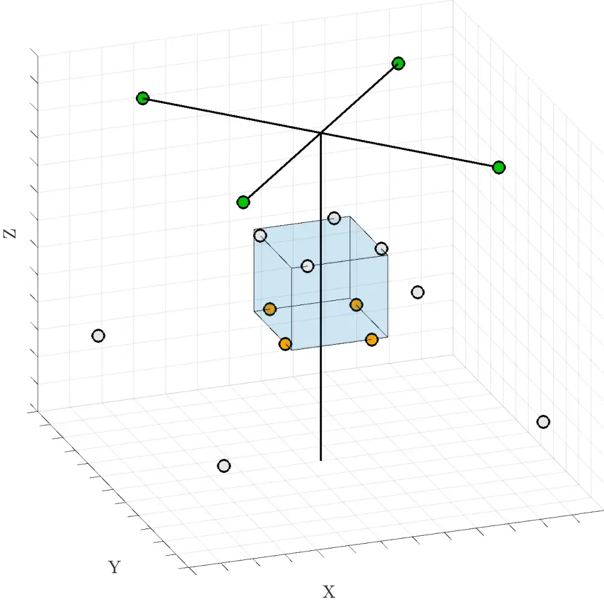

(a) $`M_{\text{S+N}}=4`$, $`M_{\text{N}}=4`$

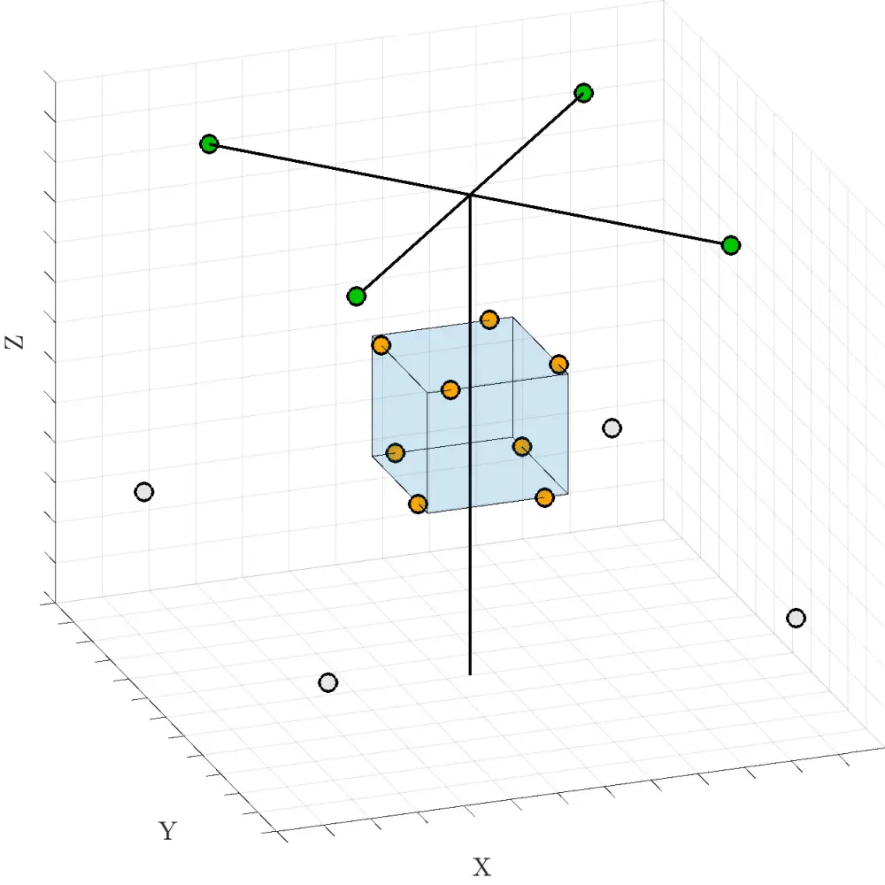

(b) $`M_{\text{S+N}}=8`$, $`M_{\text{N}}=4`$

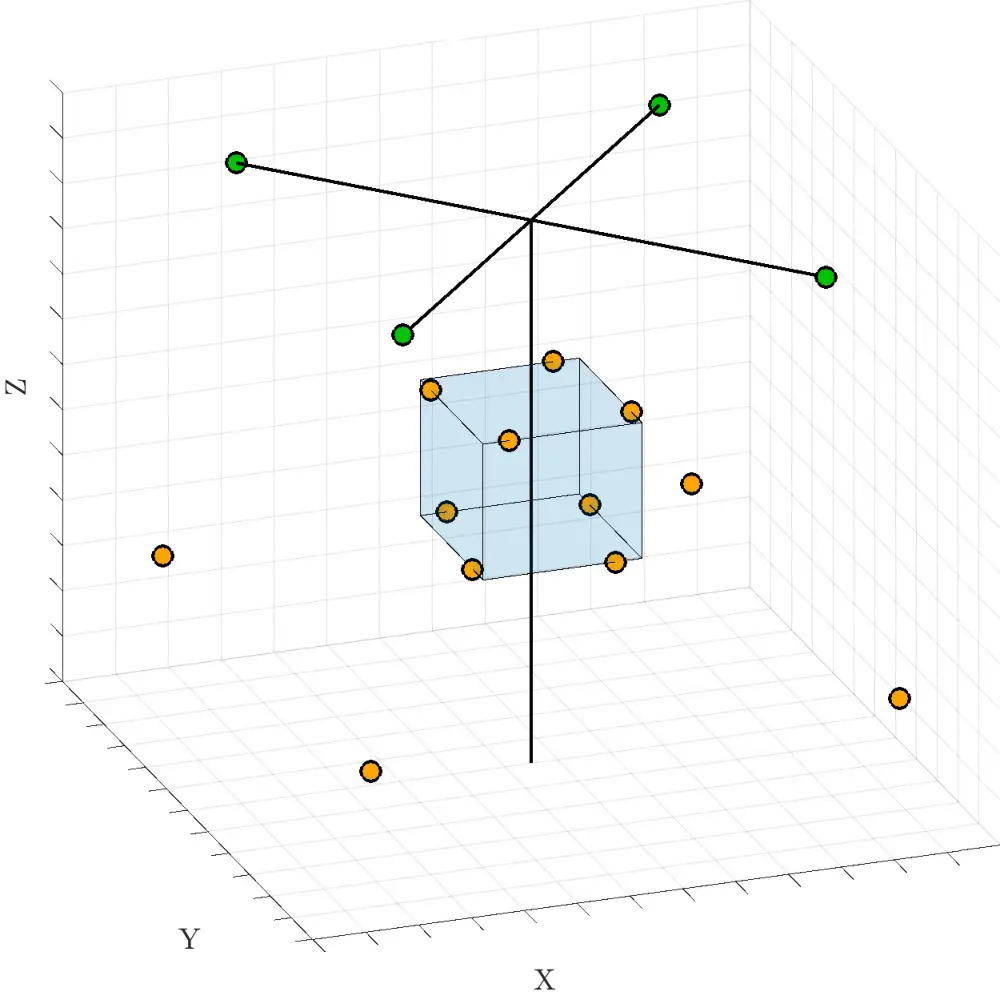

(c) $`M_{\text{S+N}}=12`$, $`M_{\text{N}}=4`$

Figure 3: Illustration of different microphone array configurations
considered in the formulation of MWF and PK-MWF.

## 5  RESULTS

The resulting SNR improvement obtained at the channel where the
reference signal estimate
$`\hat{d}=\hat{\mathbf{w}}^{\mathrm{H}}\mathbf{y}`$ is computed is
presented in Fig. 4. Different numbers of microphones in the proposed
filtering formulations and the SPP estimates were considered. The bottom
and top horizontal axes indicate the original SNRs considered and the
corresponding average rotational speed of the rotors in revolutions/min
(rpm), respectively. We can observe that, with the SPP estimate from the
reference external signal (xSPP), the SNR improvement is greater than
when the SPP estimate from the embedded array’s own reference channel
(iSPP) is used, as the external microphone placed near the target source
provides a signal with greater SNR itself. Therefore, the detection of
speech activity is more reliable, resulting in more accurate estimates
of the necessary correlations matrices here considered. Since having an
external microphone near the target speaker may not be realistic in all
kinds of scenarios, the use of the external SPP estimate can be here
seen as a way to provide a performance benchmark for the proposed
methods, with which it is possible to compare and evaluate the
improvements obtained and its possible limitations. In this case, it is
observed that even with a poorer SPP estimate, all methods are still
capable of improving the SNR of the target reference channel.

In terms of the number of microphones used for performing the
multichannel filtering, it is observed that performance is improved when
using more microphone signals, although the differences are more visible
when going from $`M_{\text{S+N}}=4`$ to $`M_{\text{S+N}}=8`$ than when
going from $`M_{\text{S+N}}=8`$ to $`M_{\text{S+N}}=12`$. This is
possibly due to performance saturation related to signal model or SPP
errors that could not be improved with the increase in number of
microphones used, as well as to the microphone placement of the last
four channels included being aligned with the rotors’ rotational axes,
which is considered to be where the noise level is the strongest \[4\]
and therefore, not providing as much additional information on the
target speech signal as the previously included microphones.

We can also observe that the performance of PK-MWF in terms of SNR
improvement is similar to the one of MWF while employing the same number
of microphones ($`M=M_{\text{S+N}}+M_{\text{N}}`$). However, the matrix
reductions performed in the PK-MWF might favor its usage in terms of
computational complexity.

The improvement in speech intelligibility measured by STOI is presented
in Fig. 5. It can be observed that the performance of PK-MWF with
respect to this perceptual measure is particularly better than both
formulations of standard MWF considered when employing the SPP estimate
from the embedded array’s own reference signal (iSPP), indicating the
advantage of using the ego-noise reference signals as proposed here for
improving robustness to SPP errors which affect the estimation of
$`\hat{\mathbf{R}}_{\mathbf{yy}}`$ and
$`\hat{\mathbf{R}}_{\mathbf{nn}}`$. In addition to having a similar
behavior in performance improvement when including more channels as the
one seen in terms of SNR, we can also observe that the STOI improvement
rate increases with the original values from the array’s reference
signal, which corresponds to a decrease in the average rotor speed.


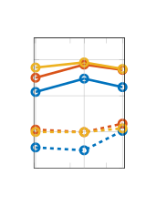

(a) $`M_{\text{S+N}}=4`$

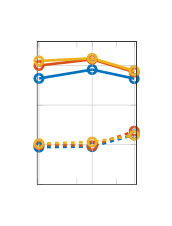

(b) $`M_{\text{S+N}}=8`$

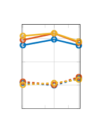

(c) $`M_{\text{S+N}}=12`$

Figure 4: SNR improvement in function of original SNRs associated to
different average rotor speeds.


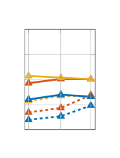

(a) $`M_{\text{S+N}}=4`$

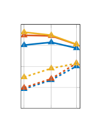

(b) $`M_{\text{S+N}}=8`$

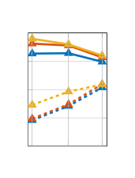

(c) $`M_{\text{S+N}}=12`$

Figure 5: STOI improvement in function of original STOI values
associated to different average rotor speeds.


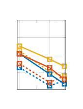

(a) $`M_{\text{S+N}}=4`$

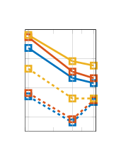

(b) $`M_{\text{S+N}}=8`$

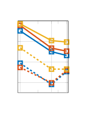

(c) $`M_{\text{S+N}}=12`$

Figure 6: PESQ improvement in function of original PESQ scores
associated with different average rotor speeds.

Finally, the improvement in speech quality measured by PESQ is presented
in Fig. 6, which indicates a better performance of PK-MWF compared to
the standard MWF filters when using either one of the SPP estimates
considered. As opposed to the STOI improvement depicted in Fig. 5, the
performance improvement rate in this case decreases with the original
PESQ score of the reference signal considered, which is in turn
associated to an increase in the average rotational speed of the rotors.

## 6  CONCLUSION

In this paper, a method for speech enhancement using ego-noise
references with a microphone array embedded in an unmanned aerial
vehicle was proposed. The ego-noise reference signals captured by
microphones placed near the UAV’s rotors were used as prior knowledge in
the PK-MWF for estimating the necessary speech correlation matrix in a
constrained optimization problem. Speech presence probability (SPP) was
estimated from both an external reference microphone and one of the
embedded array’s channels in order to detect speech activity. Results
obtained from experimental recordings showed that, especially in a more
realistic scenario where the SPP is estimated from one of the UAV’s own
microphones, the PK-MWF implementation provided greater improvement in
speech intelligibility and quality when compared to the use of standard
MWF, with and without the propeller microphones being included in its
formulation. While the SNR improvement is similar for PK-MWF and the
standard MWF using the propeller microphones, it can be argued that
employing the PK-MWF implementation might be advantageous in terms of
computational complexity due to the performed matrix reductions when
considering real-time processing applications. Future work includes
expanding the measurement campaign to consider moving UAVs, updating the
correlation matrices over different time frames, and reformulating the
noise signal model to consider more particular characteristics of UAVs’
ego-noise.

## ACKNOWLEDGEMENTS

This research work was carried out at the ESAT Laboratory of KU Leuven,
in the frame of FWO Mandate: SB 1S86520N. The research leading to these
results has received funding from the European Research Council under
the European Union’s Horizon 2020 research and innovation program / ERC
Consolidator Grant: SONORA (no. 773268), the H2020 MSCA ITN ETN PBNv2
project (GA 721615) and the H2020 MSCA ITN ETN VRACE project (GA
812719). This paper reflects only the authors’ views and the Union is
not liable for any use that may be made of the contained information.
The authors also wish to thank Mr. Sacha Morales for his support in the
measurement campaign.

## REFERENCES

##

- \[1\] Strauss M, Mordel P, Miguet V, Deleforge A. DREGON: Dataset and
  methods for UAV-embedded sound source localization. In: 2018 IEEE/RSJ
  International Conference on Intelligent Robots and Systems (IROS).
  Madrid: IEEE; 2018. p. 1–8.
- \[2\] Hioka Y, Kingan M, Schmid G, Stol KA. Speech enhancement using a
  microphone array mounted on an unmanned aerial vehicle. In: 2016 IEEE
  International Workshop on Acoustic Signal Enhancement (IWAENC). Xi’an,
  China: IEEE; 2016. p. 1–5.
- \[3\] Hubbard HH, editor. Aeroacoustics of flight vehicles: theory and
  practice. NASA Office of Management, Scientific and Technical
  Information Program; 1991.
- \[4\] Hioka Y, Yen B, McKay R, Kingan M. Clean audio recording using
  unmanned aerial vehicles. In: Unmanned Aerial Systems.
  Elsevier; 2021. p. 175–202.
- \[5\] Gannot S, Vincent E, Markovich-Golan S, Ozerov A. A consolidated
  perspective on multimicrophone speech enhancement and source
  separation. IEEE/ACM Trans Audio Speech Lang Process. 2017
  Apr;25(4):692–730.
- \[6\] Wang L, Cavallaro A. A blind source separation framework for
  ego-noise reduction on multi-rotor drones. IEEE/ACM Trans Audio Speech
  Lang Process. 2020;28:2523–37.
- \[7\] Doclo S, Moonen M. GSVD-based optimal filtering for single and
  multimicrophone speech enhancement. IEEE Trans Signal Process. 2002
  Sep;50(9):2230–44.
- \[8\] Ngo K, Spriet A, Moonen M, Wouters J, Jensen SH. Incorporating
  the conditional speech presence probability in multi-channel Wiener
  filter based noise reduction in hearing aids. EURASIP J Adv Signal
  Process. 2009 Dec;2009(1):930625.
- \[9\] Rompaey RVan, Moonen M. Distributed adaptive node-specific
  signal estimation in a wireless sensor network with partial prior
  knowledge of the desired source steering vector. In: 2019 27th
  European Signal Processing Conference (EUSIPCO). A Coruna,
  Spain: 2019. p. 1–5.
- \[10\] Tengan E, Dietzen T, Ruiz S, Alkmim M, Cardenuto J, van
  Waterschoot T. Replication data for: Speech enhancement using
  ego-noise references with a microphone array embedded in an unmanned
  aerial vehicle. KU Leuven RDR; 2022. Available from:
  [https://doi.org/10.48804/PZAVUC](https://doi.org/10.48804/PZAVUC).
- \[11\] Serizel R, Moonen M, Van Dijk B, Wouters J. Low-rank
  approximation based multichannel Wiener filter algorithms for noise
  reduction with application in cochlear implants. IEEE/ACM Trans Audio
  Speech Lang Process. 2014 Apr;22(4):785–99.
- \[12\] Breed BR, Strauss J. A short proof of the equivalence of LCMV
  and GSC beamforming. IEEE Signal Process Lett. 2002 Jun;9(6):168–9.
- \[13\] Hioka Y, Kingan M, Schmid G, McKay R, Stol KA. Design of an
  unmanned aerial vehicle mounted system for quiet audio recording.
  Applied Acoustics. 2019 Dec;155:423–7.
- \[14\] Yamagishi J, Veaux C, MacDonald K. CSTR VCTK corpus: English
  multi-speaker corpus for CSTR voice cloning toolkit (version 0.92).
  University of Edinburgh. The Centre for Speech Technology
  Research. 2019.
- \[15\] Gerkmann T, Krawczyk M, Martin R. Speech presence probability
  estimation based on temporal cepstrum smoothing. In: 2010 IEEE
  International Conference on Acoustics, Speech and Signal Processing
  (ICASSP)). Dallas, TX, USA: IEEE; 2010. p. 4254–7.
- \[16\] Taal CH, Hendriks RC, Heusdens R, Jensen J. An algorithm for
  intelligibility prediction of time–frequency weighted noisy speech.
  Vol. 19, IEEE/ACM Trans Audio Speech Lang Process. 2011
  Sep;19(7):2125–36.
- \[17\] Rix AW, Beerends JG, Hollier MP, Hekstra AP. Perceptual
  evaluation of speech quality (PESQ) - a new method for speech quality
  assessment of telephone networks and codecs. In: 2001 IEEE
  International Conference on Acoustics, Speech, and Signal Processing
  Proceedings (ICASSP). Salt Lake City, UT, USA: IEEE; 2001. p. 749–52.
