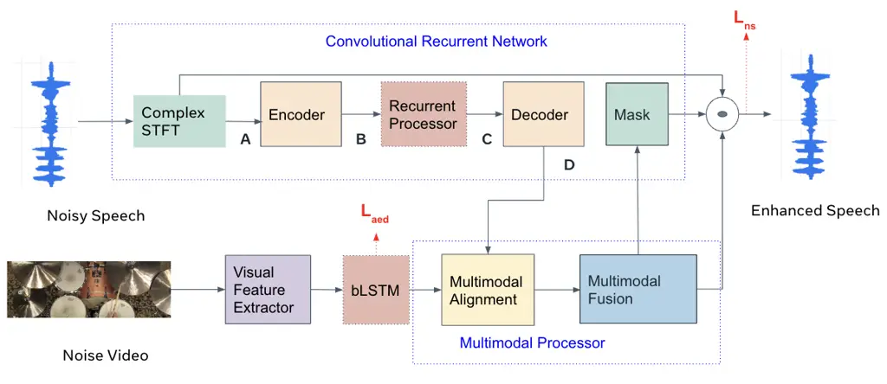
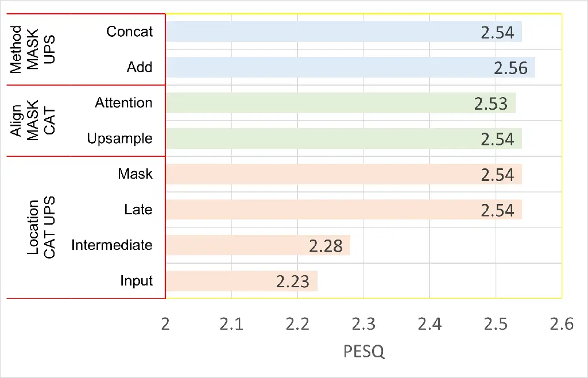
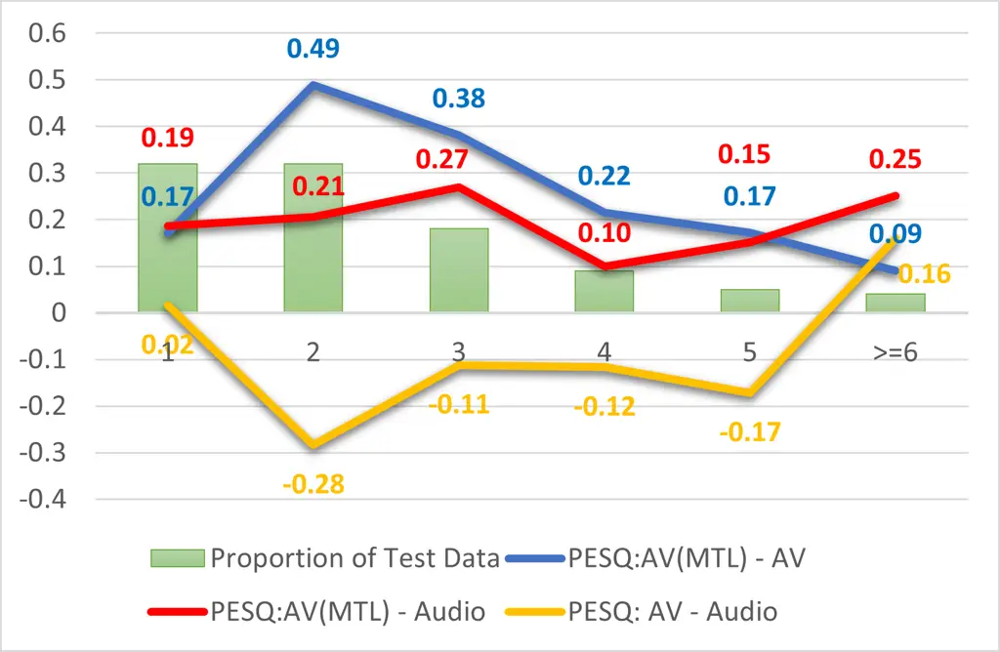
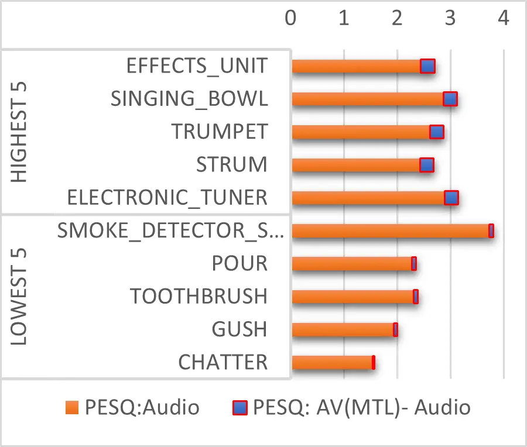

# Egocentric Audio-Visual Noise Suppression

Roshan Sharma\sthanksThe first author performed the work while at Meta
   Weipeng He    Ju Lin    Egor Lakomkin    Yang Liu    Kaustubh
Kalgaonkar

###### Abstract

This paper studies audio-visual noise suppression for egocentric videos
– where the speaker is not captured in the video. Instead, potential
noise sources are visible on screen with the camera emulating the
off-screen speaker’s view of the outside world. This setting is
different from prior work in audio-visual speech enhancement that relies
on lip and facial visuals. In this paper, we first demonstrate that
egocentric visual information is helpful for noise suppression. We
compare object recognition and action classification-based visual
feature extractors and investigate methods to align audio and visual
representations. Then, we examine different fusion strategies for the
aligned features, and locations within the noise suppression model to
incorporate visual information. Experiments demonstrate that visual
features are most helpful when used to generate additive correction
masks. Finally, in order to ensure that the visual features are
discriminative with respect to different noise types, we introduce a
multi-task learning framework that jointly optimizes audio-visual noise
suppression and video-based acoustic event detection. This proposed
multi-task framework outperforms the audio-only baseline on all metrics,
including a 0.16 PESQ improvement. Extensive ablations reveal the
improved performance of the proposed model with multiple active
distractors, overall noise types, and across different SNRs.

###### Index Terms: 

noise suppression, multimodal, egocentric

^(†)^(†)address: ¹Carnegie Mellon University, Pittsburgh, USA  
²Meta, Seattle, USA

## 1 Introduction

Speech extracted from the wild is rich in information content. However,
such speech often contains noise, which decreases the its
intelligibility. Noise suppression is the task of learning to produce
cleaner output speech from noisy input.

Noise suppression can benefit from additional information in the form of
visual representations \[1, 2\] of the speaker and their environment
 \[3\] Prior work in audio-visual noise suppression has examined visual
information with on-screen speakers derived from videos \[4\] and still
images \[5\] of the speaker. These visuals capture the motion of the
speaker’s lips and other articulators, providing information on what is
spoken. Such visual information has also been used for related tasks
like multi-source audio-visual separation \[6, 7\], object
detection \[8\], and source localization \[9\]. However, such visuals
(with the target speaker on-screen) are challenging to capture in the
wild.

Another source of visual information that could assist noise suppression
is visual cues from the surrounding environment. Such a view of the
world through the speaker’s eyes is termed ”egocentric”. Egocentric
visuals capture surrounding objects that may produce noise, but not the
speaker’s visual attributes, i.e., the speaker is off-screen. To the
best of our knowledge, this setting is vastly different from previous
work, which have relied on visual representations of the on-screen
speaker for noise suppression. In order to use egocentric visuals for
noise suppression, we propose to extract visual features that describe
potential distractor sources on screen as it is known that an explicit
characterization of the noise source aids noise suppression
performance \[10\].

Visual features that represent potential distractor sources may be
obtained using object detection models which provide information on the
stationary objects, or using video classification models which use
longer temporal context to identify on-screen actions. However, such
representations may not sufficiently represent the distractor sources.
When multiple objects or events are visible on screen, some or none of
them may correspond to acoustic events and noise sources. This motivates
us to provide additional supervision over the visual features to make
them relevant to the acoustic events in the scene. Therefore, the
problem of egocentric audio-visual noise suppression is formulated using
Multi-Task Learning (MTL) to jointly optimize visual acoustic event
detection and noise suppression.

Audio and visual features have different rates of information change,
and are hence unaligned. In order to align the modalities, we compare
two strategies- upsampling and temporal attention. Once the modalities
have been aligned, the visual features can be incorporated at different
locations within the noise-suppression model; and based on this
location, we investigate input, intermediate, late, and mask fusion.
Finally, in order to fuse the audio and visual representations - we
compare addition and concatenation.

In summary, this paper makes the following contributions:

1.  1.  We propose a method to utilize egocentric visual information to
        enhance off-screen target speech, and compare visual representations
        from pretrained models that distinguish potential distractor
        sources.
2.  2.  In order to produce visual representations that can distinguish
        between different distractors, we introduce a novel vision based
        acoustic event detection criterion, which produces better
        enhancement than pre-trained object or action classifiers.
3.  3.  We compare temporal attention and upsampling to align the audio and
        visual feature sequences, and explore addition and concatenation
        methods to fuse the aligned representations within multiple
        locations within the model, corresponding to input, intermediate,
        late and mask fusion strategies.

## 2 Proposed Approach



Figure 1: Model architecture of the multi-task audio-visual
convolutional recurrent network (CRN) which performs mask based fusion.
Markers A, B, C, and D (in black) indicate locations for audio-visual
fusion corresponding to input, intermediate, late and output fusion.

Fig. 1 shows the proposed model architecture for audio-visual noise
suppression. The complex valued STFT of the noisy audio input is passed
through the Convolutional Recurrent Network (CRN)\[11\] to obtain the
complex STFT mask, which is then multiplied with the input to generate
the predicted clean output.

The raw video is passed through a visual feature extractor that either
extracts per-frame or per-video visual representations. The video
features thus obtained are passed through recurrent layers to utilize
temporal dependencies. Audio feature maps from the four marked locations
(A), (B), (C), or (D) can be used for multimodal alignment and fusion,
and the output of the fusion module is then used as input to the next
CRN layer. The multimodal alignment module then either performs
deterministic temporal upsampling or uses attention to align the audio
and visual feature sequences. Finally the multimodal fusion block uses
addition or concatenation to combine the audio and visual feature maps.

### 2.1 Convolutional Recurrent Network (CRN)

The CRN model comprises an encoder, a recurrent processor, and a
decoder, and has a U-Net structure that enables feature sharing between
the encoder and decoder at various resolutions for efficient
optimization. The encoder consists of 5 encoder blocks- each of which
includes a 2-D convolution layer, a 2-D batch normalization layer
 \[12\], and the Gated Linear Unit (GLU) \[13\] activation. The
convolution layers have kernel sizes of $`(2,4)`$ and strides of
$`(1,2)`$. The first convolution maps the 2 input channels representing
the real and imaginary parts of the input spectrogram to 16 output
channels, and the subsequent convolutions produce 32, 64, 76, and 98
output channels respectively. The recurrent processor has four
bidirectional Long Short-Term Memory (bLSTM) layers with input and
hidden size 294 to capture long-range dependencies. The output is
downsized to 294, and reshaped to 4 dimensions before being processed by
the decoder.

The decoder consists of 5 decoder blocks - each comprising concatenation
layers that fuse the encoder outputs, batch normalization layers, and
gated transpose convolution layers. The concatenation layer takes as
input the decoder activation for block $`l`$ and the corresponding
output activation for the $`5-l`$ encoder block and stacks them along
the channel dimension to form an input with twice the number of input
channels. The transpose convolution layers have the same kernel size and
stride as the convolution layers in the encoder and produce outputs with
76, 64, 32, 16 and 2 channels respectively. The final output of the
decoder with 2 channels is passed through a sigmoid mask layer.

### 2.2 Visual Feature Extractor

Visual features that represent objects and actions within the video are
likely to represent potential noise sources. In this paper, we compare
object recognition based visual features with video action
classification based features for audio-visual noise suppression. Object
recognition based features derived from Efficientnet-B0\[14\] model
pre-trained on Imagenet\[15\] to represent the distractor sources.
Further, video classification features are useful indicators of actions
such as ”door open/close” and ”playing the guitar” that correspond to
noise sources. Action recognition models trained on KINETICS-400\[16\]
are used to extract such representations with pre-trained R2+1D\[17\]
model.

### 2.3 Multimodal Processor

Multimodal Alignment:The audio and visual feature maps have different
temporal resolutions as the audio information changes faster than the
video. Therefore, it is necessary to obtain a temporal alignment between
audio and video. In this paper, we compare upsampling and temporal
attention for multimodal alignment. Upsampling is a deterministic
mechanism that is favoured when the audio and video sequences are
monotonic with respect to each other, i.e., when the first video frame
corresponds to the first few audio frames and so on. Multi-head temporal
attention is learned and can be used to align the video and audio
sequences even when the montonicity criterion is not satisfied.

Multimodal Fusion: Given audio and video feature maps with the same
temporal resolution, in this paper we compare different locations within
the model to determine the optimal location for audio-visual fusion.
Within the audio-visual model architecture shown in Fig. 1, letters in
black demonstrate potential locations for the visual features. They can
be placed in location (A) for input fusion, (B) for intermediate fusion,
(C) for late fusion, or (D) for mask fusion.

Based on the location of fusion, the audio and visual feature maps are
extracted and then combined. In this paper, two methods are considered
for fusion- addition and concatenation. First, the aligned visual
feature map is projected such that it has the same feature dimension as
the audio feature map, and one single channel. If addition is the fusion
method, both the visual feature map is passed through a convolution
layer to have the same number of channels as the audio feature map. Then
the resulting maps are added to produce the output. For concatenative
fusion, the visual feature map with a single channel is concatenated
with the audio feature map along the channel dimension, and the
resulting map is transformed to the shape of the input audio feature map
using a 2D convolution.

### 2.4 Optimization Criterion

Our noise suppression models are trained using a combination of several
losses. Let $`\bm{\tilde{s}}`$ be the enhanced 16 kHz signal in the time
domain. Let $`\bm{{S}}`$ denote the STFT magnitude of clean speech
$`{\mathbf{s}}`$. The reconstruction loss includes an $`L_{1}`$ loss in
the time domain, a weighted STFT loss (W-STFT) \[18\], and Scale
Invariant Signal Distortion Ratio (SI-SDR) loss \[19\]. The total loss
$`L_{ns}`$ is computed as a weighted sum of these components in Eq. (1),
where weights $`\lambda_{1}=1,\lambda_{2}=22.62`$ and
$`\lambda_{3}=0.001`$ are set empirically.

```math
{\cal L}_{\text{ns}}=\lambda_{1}||{\mathbf{s}}-\bm{\tilde{s}}||_{1}+\lambda_{2}{\cal L}_{\text{WSTFT}}(\bm{{S}},\bm{\tilde{S}})+\lambda_{3}{\cal L}_{\text{SI-SDR}}(\bm{{s}},\bm{\tilde{s}}). \tag{1}
```

Eq. (2) formulates the weighted STFT loss, where higher weights are used
to emphasize the high frequency regions. We split the frequency bins
into 4 sub-bands and assign weights (0.1, 1.0, 1.5, 1.5) to each
sub-band empirically.

```math
{\cal L}_{\text{WSTFT}}=\sum_{k=1}^{4}w_{k}||\bm{{S}}_{k}-\bm{\tilde{S}}_{k}||_{1}. \tag{2}
```

SI-SDR is commonly used as a loss function in the time-domain.
$`{\mathcal{L}}_{\text{SI-SDR}}`$ is defined as:

```math
\begin{split}{\mathcal{L}}_{\text{SI-SDR}}=10\log_{10}\frac{||\alpha\bm{{s}}||^{2}}{||\alpha\bm{{s}}-\bm{{\tilde{s}}}||^{2}}\\
\text{where }\alpha=\underset{\alpha}{\arg}\min||\alpha\bm{{s}}-\bm{{\tilde{s}}}||^{2}.\\
\end{split} \tag{3}
```

### 2.5 Multi-Task Learning: Supervision over Visual Features

Though pre-trained object and action features capture useful visual
information about the distractor sources, they generate noisy
representations when there are multiple objects and actions in the
scene, some of which may not be linked to the audio event. Therefore, it
would be helpful to obtain discriminative visual features that recognize
different acoustic events. We propose to optimize the extracted visual
features by using visual Acoustic Event Detection (AED) as an auxiliary
criterion over the outputs of the bLSTM in Fig. 1 during training. A
linear projection is used to map the pooled features to the label
dimension, and binary cross-entropy loss is computed over each of the
labels.

Eq. (4) shows the proposed Multi-Task Learning (MTL) framework that
optimizes audio-visual noise suppression with loss $`L_{ns}`$(see
Eq. (1)) and a multilabel binary cross entropy loss $`L_{aed}`$ for
visual acoustic event classification. The task weights
$`\alpha_{1}=1,\alpha_{2}=50`$ are set empirically.

```math
\begin{split}L_{total}=\alpha_{1}L_{ns}+\alpha_{2}L_{aed}.\\
\end{split} \tag{4}
```

## 3 Experiments

|                 |      |       |          |          |
| --------------- | ---- | ----- | -------- | -------- |
| Model           | PESQ | STOI  | VISQOL-A | VISQOL-S |
| Noisy Speech    | 1.2  | 0.75  | 2.66     | 1.97     |
| Audio-only      | 2.44 | 0.89  | 3.96     | 2.97     |
| \+ Visual (Obj) | 2.56 | 0.92  | 4.08     | 3.23     |
| \+ MTL          | 2.60 | 0.92  | 4.45     | 2.95     |
| \+ Visual (Vid) | 2.55 | 0.921 | 4.42     | 2.88     |
| \+ MTL          | 2.57 | 0.923 | 4.45     | 2.95     |

Table 1: Speech Enhancement evaluation metrics for audio and
audio-visual models on the Audioset evaluation set.

| Model    | - 20 dB | -10 dB | 0 dB | 10 dB | 20 dB |
| -------- | ------- | ------ | ---- | ----- | ----- |
| Audio    | 1.31    | 1.67   | 2.44 | 3.19  | 3.68  |
| AV (Obj) | 1.33    | 1.75   | 2.55 | 3.28  | 3.75  |
| \+ MTL   | 1.37    | 1.78   | 2.60 | 3.32  | 3.78  |

Table 2: PESQ scores of the proposed audio and audio-visual models
across different evaluation SNRs.



Figure 2: PESQ improvements for different fusion methods(concat, add),
alignment methods (upsampling, attention), and locations (input fusion,
intermediate fusion, late fusion and mask fusion)



Figure 3: PESQ improvement across the Audio, Audio-visual and Multi-task
Audio-visual models for different number of acoustic event labels on the
test data. The proportion of the number of sources with a given number
of labels is shown in green. The relative improvements in PESQ between
Audio and Audio-visual (yellow), Audio-Visual (MTL) and Audio (red), and
Audio-visual (MTL) and Audio-visual are also marked plotted.

### 3.1 Dataset and Input Features

Audioset \[20\] is a large scale dataset of videos extracted from
YouTube which are human labelled for acoustic event detection. We select
portions of the Audioset data that likely do not contain speech as a
distractor for our experiments based on manual inspection of the
acoustic event labels. We generate data for our experiments by using
audio-visual distractor signals from Audioset, and clean off-screen
target speech from the DNS Challenge data \[21\]. The DNS-challenge
training data is randomly partitioned into training and evaluation data.
The distractor audio and target clean off-screen speech are combined
after volume normalization by sampling a mixing Signal-to-Noise Ratio
(SNR) $`s\sim N(0,5)`$. The test set is created using the same mechanism
by mixing evaluation set videos from Audioset with our evaluation
partition of the DNS challenge training data.

### 3.2 Evaluation Metrics

Our models are evaluated using both objective and subjective speech
quality metrics. For objective evaluation, we use Perceptual Evaluation
of Speech Quality (PESQ)¹¹ 1 https://pypi.org/project/pesq/ \[22\],
Short-Time Objective Inteligibility (STOI) \[23\], and Virtual Speech
Quality Objective Listener (VISQOL) \[24\]. We also obtain Deep Noise
Suppression Mean Opinion Score (DNSMOS)  \[25\] for the best model as a
proxy for subjective human evaluation.

### 3.3 Audio-Visual Models

The audio only CRN model is trained first and used to initialize the
parameters of the audio-visual model. This ensures that the audio-visual
model does not learn to rely exclusively on the visual representations,
leading to noisy predictions. The visual feature extractors are first
frozen, and then fine-tuned so that they do not lose the impact of
pre-training. The audio-visual model is trained with different
alignment, fusion and location strategies. Alignment methods are
compared for mask fusion with concatenation, and we compare addition and
concatenation for mask fusion with upsampling. Four fusion locations are
compared with upsampling based alignment and concatenative fusion
corresponding to input, intermediate, late and mask fusion.

### 3.4 Experimental Results

Table 1 reports the performance of our models. The audio-visual noise
suppression models that use object recognition and video classification
features improves performance over the audio baseline on all metrics. By
employing the proposed multi-task learning framework for visual
supervision, we find that enhancement performance improves further, and
obtains the best PESQ score of 2.60. We find that object and video-based
features attain similar classification performance, with higher gains
from object-based multi-task training. This is because most acoustic
events labeled correspond to objects in the scene rather than actions.
The multi-task framework improves over the audio-visual model in two
cases- (a) when there are multiple distractor sources in the recording,
and (b) when the distractor source has a distinct visual representation.

Fig. 2 highlights PESQ performance of our audio-visual models across
alignment methods, fusion methods, and fusion locations. It is observed
that attention and upsampling have comparable performance, as do
addition and concatenation. This can be useful to reduce the number of
model parameters since addition and upsampling involve no additional
parameters. Of the different locations for fusion, late fusion and mask
fusion, where the features are integrated with the output of the
recurrent processor or the complex mask respectively, perform the best.
The observation that late fusion outperforms input fusion is similar to
those made for acoustic event detection with Audioset \[26\]. Our best
model uses addition-based late fusion with deterministic upsampling.
This implies that the visual information can be used to generate a
corrective mask that mitigates errors within the audio-only mask,
thereby improving speech enhancement performance.

Table 3 demonstrates that the proposed multi-task approach improves
DNSMOS by 0.07 absolute overall. Further, on a AB test conducted using
20 test samples and 10 respondents, 48% of the listeners preferred the
multi-task model, while 46% of listeners had no preference and 6% of
listeners preferred the audio only model.

| Model              | OVL  | SIG  | BAK  |
| ------------------ | ---- | ---- | ---- |
| Audio              | 3.22 | 3.48 | 4.12 |
| Audio-visual (Obj) | 3.27 | 3.52 | 4.12 |
| \+ MTL             | 3.29 | 3.53 | 4.14 |

Table 3: DNSMOS evaluation of noise suppression models

### 3.5 Ablation Study

SNR: Table 2 describes the PESQ improvements obtained by using visual
features across different SNRs. We note that the proposed visual
features produce improvements across all SNRs.

Noise-type Analysis: Audioset has human annotated acoustic event labels,
which correspond to different types and sources of noise. The difference
in PESQ scores between the baseline audio model and the proposed
Audio-visual(MTL) model is computed, and the five classes with highest
and lowest changes are shown in Fig. 4. First, we observe that the PESQ
score improves across all noise types since the lowest change is
positive. The improvements are highest over classes with distinct visual
representations, i.e. “strum” sees higher gains compares to “chatter”.

Number of noise sources: The number of such acoustic event labels from
Audioset could also serve as a proxy for the number of distinct
distractor sources. Fig. 3 plots the improvements in PESQ for different
number of ground-truth Audioset labels in the distractor source. The
data distribution (shown in green) demonstrates that a large proportion
of the data has fewer than 5 labels. The audio-visual baseline model
(yellow) seems to improve over the audio baseline for a single acoustic
event, but degrades with more events. This is because of multiple
reasons: (a) All the visual sources may not be on screen, or (b) Visual
feature extractors may identify representations of other objects or
actions that do not produce sounds. The difference between the proposed
audio-visual (MTL) model and the audio-visual baseline (shown in blue)
demonstrates the importance of visual supervision for multiple noise
labels in the data. In conclusion, the proposed audio-visual (MTL) model
improves over the audio baseline for single and multiple noise sources.



Figure 4: Plot showing noise label classes with 5 highest and 5 lowest
changes in PESQ score between audio and audio-visual (MTL) models

## 4 Conclusion

To the best of our knowledge, this paper is among the first work for
egocentric audio-visual noise suppression. We consider the setting where
the target speaker is off-screen with on-screen video comprising
information regarding noise. We have introduced methods to efficiently
and accurately use the visual information. Specifically, we have
investigated how to extract useful visual features and how to fuse them
with the audio information.

We evaluated different approaches for multimodal alignment and fusion,
with additive mask fusion emerging as the best performing solution. To
generate discriminative visual representations, we proposed a multi-task
training framework that jointly optimizes audio-visual noise suppression
and visual acoustic event detection. This multi-task training approach
is shown to outperform the methods which directly uses object
classification or action classification features as the input of the
visual branch. This proposed framework resulted in 0.16 absolute PESQ
improvement over a strong audio baseline. The proposed multi-task
approach obtains improvements across all metrics, different SNR
conditions and noise types; and also improves performance on audio with
multiple distractor sources.

## References

- \[1\] Trevor Darrell, John W. Fisher, and Paul Viola, “Audio-visual
  segmentation and “the cocktail party effect”,” in Advances in
  Multimodal Interfaces — ICMI 2000, Tieniu Tan, Yuanchun Shi, and Wen
  Gao, Eds., Berlin, Heidelberg, 2000, pp. 32–40, Springer Berlin
  Heidelberg.
- \[2\] Sarah Partan and Peter Marler, “Communication goes multimodal,”
  Science, vol. 283, no. 5406, pp. 1272–1273, 1999.
- \[3\] Roshan Sharma and Bhiksha Raj, “Cross-utterance context for
  multimodal video transcription,” in 2022 56th Asilomar Conference on
  Signals, Systems, and Computers, 2022, pp. 1321–1325.
- \[4\] Triantafyllos Afouras, Joon Son Chung, and Andrew Zisserman,
  “The conversation: Deep audio-visual speech enhancement,” Proc.
  Interspeech 2018, pp. 3244–3248, 2018.
- \[5\] Soo-Whan Chung, Soyeon Choe, Joon Son Chung, and Hong-Goo Kang,
  “FaceFilter: Audio-Visual Speech Separation Using Still Images,” in
  Proc. Interspeech 2020, 2020, pp. 3481–3485.
- \[6\] Efthymios Tzinis, Scott Wisdom, Aren Jansen, Shawn Hershey, Tal
  Remez, Daniel P. W. Ellis, and John R. Hershey, “Into the wild with
  audioscope: Unsupervised audio-visual separation of on-screen sounds,”
  in International Conference on Learning Representations (ICLR)
  2021, 2021.
- \[7\] Efthymios Tzinis, Scott Wisdom, Tal Remez, and John R Hershey,
  “Audioscopev2: Audio-visual attention architectures for calibrated
  open-domain on-screen sound separation,” arXiv preprint
  arXiv:2207.10141, 2022.
- \[8\] Triantafyllos Afouras, Yuki M. Asano, Francois Fagan, Andrea
  Vedaldi, and Florian Metze, “Self-supervised object detection from
  audio-visual correspondence,” in Proceedings of the IEEE/CVF
  Conference on Computer Vision and Pattern Recognition (CVPR), June
  2022, pp. 10575–10586.
- \[9\] Lingyu Zhu and Esa Rahtu, “Visually guided sound source
  separation and localization using self-supervised motion
  representations,” in Proceedings of the IEEE/CVF Winter Conference on
  Applications of Computer Vision (WACV), January 2022, pp. 1289–1299.
- \[10\] Steven Boll, “Suppression of acoustic noise in speech using
  spectral subtraction,” IEEE Transactions on acoustics, speech, and
  signal processing, vol. 27, no. 2, pp. 113–120, 1979.
- \[11\] Ke Tan and DeLiang Wang, “A convolutional recurrent neural
  network for real-time speech enhancement,” Proc. Interspeech 2018, pp.
  3229–3233, 2018.
- \[12\] Sergey Ioffe and Christian Szegedy, “Batch normalization:
  Accelerating deep network training by reducing internal covariate
  shift,” in International conference on machine learning. PMLR, 2015,
  pp. 448–456.
- \[13\] Yann N Dauphin, Angela Fan, Michael Auli, and David Grangier,
  “Language modeling with gated convolutional networks,” in
  International conference on machine learning. PMLR, 2017, pp. 933–941.
- \[14\] Mingxing Tan and Quoc Le, “Efficientnet: Rethinking model
  scaling for convolutional neural networks,” in International
  conference on machine learning. PMLR, 2019, pp. 6105–6114.
- \[15\] Jia Deng, Wei Dong, Richard Socher, Li-Jia Li, Kai Li, and
  Li Fei-Fei, “Imagenet: A large-scale hierarchical image database,” in
  2009 IEEE conference on computer vision and pattern recognition. Ieee,
  2009, pp. 248–255.
- \[16\] Andrew Zisserman, Joao Carreira, Karen Simonyan, Will Kay,
  Brian Zhang, Chloe Hillier, Sudheendra Vijayanarasimhan, Fabio Viola,
  Tim Green, Trevor Back, et al., “The kinetics human action video
  dataset,” 2017.
- \[17\] Du Tran, Heng Wang, Lorenzo Torresani, Jamie Ray, Yann LeCun,
  and Manohar Paluri, “A closer look at spatiotemporal convolutions for
  action recognition,” in 2018 IEEE/CVF Conference on Computer Vision
  and Pattern Recognition, 2018, pp. 6450–6459.
- \[18\] Ju Lin, Kaustubh Kalgaonkar, Qing He, and Xin Lei, “Speech
  enhancement for low bit rate speech codec,” in ICASSP 2022-2022 IEEE
  International Conference on Acoustics, Speech and Signal Processing
  (ICASSP). IEEE, 2022, pp. 7777–7781.
- \[19\] Jonathan Le Roux, Scott Wisdom, Hakan Erdogan, and John R
  Hershey, “Sdr–half-baked or well done?,” in ICASSP 2019-2019 IEEE
  International Conference on Acoustics, Speech and Signal Processing
  (ICASSP). IEEE, 2019, pp. 626–630.
- \[20\] Jort F. Gemmeke, Daniel P. W. Ellis, Dylan Freedman, Aren
  Jansen, Wade Lawrence, R. Channing Moore, Manoj Plakal, and Marvin
  Ritter, “Audio set: An ontology and human-labeled dataset for audio
  events,” in Proc. IEEE ICASSP 2017, New Orleans, LA, 2017.
- \[21\] Chandan KA Reddy, Harishchandra Dubey, Kazuhito Koishida, Arun
  Nair, Vishak Gopal, Ross Cutler, Sebastian Braun, Hannes Gamper,
  Robert Aichner, and Sriram Srinivasan, “Interspeech 2021 deep noise
  suppression challenge,” in INTERSPEECH, 2021.
- \[22\] A.W. Rix, J.G. Beerends, M.P. Hollier, and A.P. Hekstra,
  “Perceptual evaluation of speech quality (pesq)-a new method for
  speech quality assessment of telephone networks and codecs,” in 2001
  IEEE International Conference on Acoustics, Speech, and Signal
  Processing. Proceedings (Cat. No.01CH37221), 2001, vol. 2, pp. 749–752
  vol.2.
- \[23\] Cees H. Taal, Richard C. Hendriks, Richard Heusdens, and Jesper
  Jensen, “A short-time objective intelligibility measure for
  time-frequency weighted noisy speech,” in 2010 IEEE International
  Conference on Acoustics, Speech and Signal Processing, 2010, pp.
  4214–4217.
- \[24\] Andrew Hines, Jan Skoglund, Anil Kokaram, and Naomi Harte,
  “Visqol: an objective speech quality model,” EURASIP Journal on Audio,
  Speech, and Music Processing, vol. 2015 (13), pp. 1–18, 2015.
- \[25\] Chandan KA Reddy, Vishak Gopal, and Ross Cutler, “Dnsmos: A
  non-intrusive perceptual objective speech quality metric to evaluate
  noise suppressors,” in ICASSP 2021 IEEE International Conference on
  Acoustics, Speech and Signal Processing (ICASSP). IEEE, 2021, pp.
  6493–6497.
- \[26\] Juncheng B Li, Kaixin Ma, Shuhui Qu, Po-Yao Huang, and Florian
  Metze, “Audio-visual event recognition through the lens of adversary,”
  in ICASSP 2021 - 2021 IEEE International Conference on Acoustics,
  Speech and Signal Processing (ICASSP), 2021, pp. 616–620.
