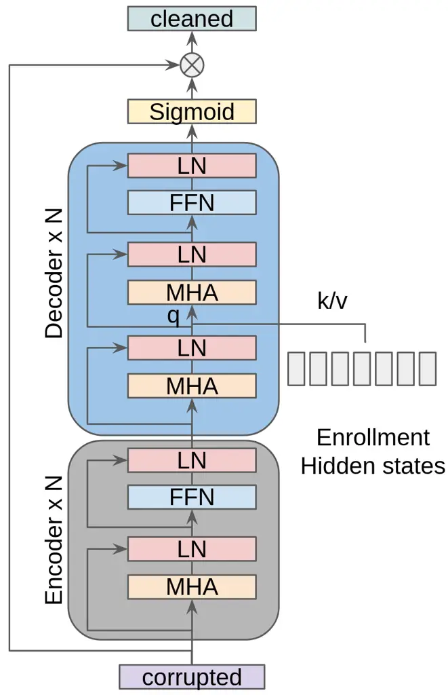
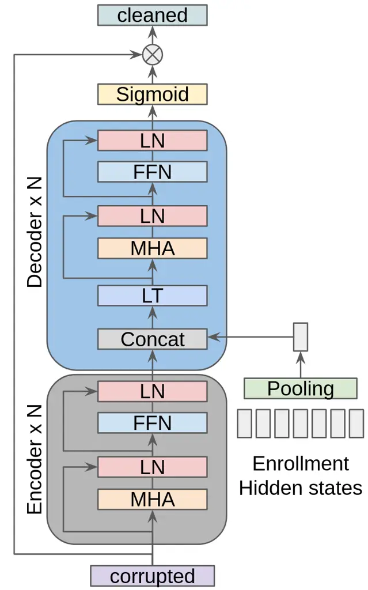

# Cross-Attention is all you need: Real-Time Streaming Transformers for Personalised Speech Enhancement

Shucong Zhang    Malcolm Chadwick    Alberto Gil C. P. Ramos    Sourav
Bhattacharya

###### Abstract

Personalised speech enhancement (PSE), which extracts only the speech of
a target user and removes everything else from a recorded audio clip,
can potentially improve users’ experiences of audio AI modules deployed
in the wild. To support a large variety of downstream audio tasks, such
as real-time ASR and audio-call enhancement, a PSE solution should
operate in a streaming mode, i.e., input audio cleaning should happen in
real-time with a small latency and real-time factor. Personalisation is
typically achieved by extracting a target speaker’s voice profile from
an enrolment audio, in the form of a static embedding vector, and then
using it to condition the output of a PSE model. However, a fixed target
speaker embedding may not be optimal under all conditions. In this work,
we present a streaming Transformer-based PSE model and propose a novel
cross-attention approach that gives adaptive target speaker
representations. We present extensive experiments and show that our
proposed cross-attention approach outperforms competitive baselines
consistently, even when our model is only approximately half the size.

###### Index Terms: 

Speech separation, speech enhancement, personalisation, deep learning,
cross attention

^(†)^(†)address: Samsung AI Centre, Cambridge, UK

## 1 Introduction

Audio source separation is an important problem within the audio
research community and applications of deep neural networks have lately
shown great performance improvements \[1, 2, 3, 4\]. In this work, we
focus on a sub-problem of source separation, personalised speech
enhancement (PSE), where the objective is to extract the speech of a
target user from a noisy, single channel, digital audio recording. All
other audio components, such as environmental noise and other voices,
are removed. Personalisation is performed by extracting speaker
embeddings, which capture the voice profile of a user, from previously
recorded short-enrolment audio of that user, e.g., “Hi Bixby”. These
embeddings are then used during inference to condition the output of a
PSE model.

PSE has great potential in improving user experiences of audio AI
modules deployed in the wild, e.g., improving the call-quality during
telephony, reducing recognition error rates of a downstream ASR when
applied in a noisy environment, and enhancing audio interactability of
home-robots. We further focus on online PSE approaches – in particular
streaming models – which can be used as a pre-processing module for a
number of downstream AI modules.

A common approach in PSE is to use a separate embedding network to
extract a speaker embedding, often only a single vector, for the target
speaker \[1\]. This provides a constant pre-computed embedding for each
speaker, which improves run-time efficiency. During inference, the
extracted speaker embedding is concatenated with the intermediate
features of the PSE network for conditioning \[1, 3\]. Other advanced
approaches use the constant speaker embedding vector through feature
modulation \[5, 6\] or by learning activation functions \[7\] for the
purpose of personalisation.

Despite the success of previous PSE models, we argue that since the
acoustic characteristics, e.g, speech, pitch and emotion, of the target
speaker may vary across time and/or across different utterances, a fixed
constant vector may not be an optimal voice profile. Thus, we explore a
learning-based cross-attention approach, which uses multiple hidden
states from a pre-trained speaker embedding model to produce an adaptive
embedding representation for the current noisy audio frame. To the best
of our knowledge, cross-attention is used for the first time in this
work to generate adaptive target speaker embeddings. For the PSE
backbone, we develop a fully attention-based streaming Transformer
model. Through extensive experiments, we show our proposed
cross-attention models consistently outperform baseline models, both in
PSE and downstream ASR tasks, even when only half the size.

## 2 Related Work

A critical task in PSE is to make the model aware of the acoustic
characteristics of a target speaker. To achieve this, previous works
extract a single fixed speaker embedding vector, such as an i-vector
\[8\] or d-vector \[9\], from enrolment audio. This static vector can be
used in multiple ways: \[1, 3, 10, 11, 12, 13, 14, 15\] concatenate it
with the corrupted input hidden representations, while \[5, 6\] use FiLM
\[16\] to integrate it with the model. In contrast, we propose to use
cross-attention to learn adaptive, rather than static, representations
of the target speaker.

While there exist PSE solutions with attention components, most of them
do not leverage attention mechanisms to generate adaptive voice
representations of the target speaker. \[17, 18\] use attention
mechanisms to select a speaker embedding from an inventory of fixed
embeddings of different speakers. \[19, 20\] use attention mechanisms to
inject speaker’s voice profile into PSE models, but this was achieved by
repeating the target speaker’s single constant embedding vector to match
the length of the input.

\[21\] applies one attention layer to the enrolment utterances of the
target and interference speaker, but applying attention only to the
target speaker is not explored. Also in \[21\], the outputs of the
attention layer are still concatenated with the hidden representations
of the inputs and fed into a Conv-TasNet \[2\]. In this work, we are the
first to propose a novel way to use cross-attention for adaptive
representations of the target speaker in a solely attention-based PSE
model.

## 3 Method

Given a corrupted audio sequence $`\bm{X}^{\prime}`$ and the voice
profile of a target speaker, the task is to extract the target speaker’s
speech $`\bm{X}`$ accurately. Here, we consider PSE as a
spectral-subtraction task \[22\] and thus both $`\bm{X}^{\prime}`$ and
$`\bm{X}`$ are spectrograms. We propose a streaming Transformer-based
encoder-decoder model and Fig. 1 presents an architectural overview of
the proposed model and the baseline model.

### 3.1 Self-attention Encoder

We use a self-attention encoder to transform a corrupted input
$`\bm{X}^{\prime}=(\bm{x}^{\prime}_{1},\bm{x}^{\prime}_{2},...,\bm{x}^{\prime}_{t})`$
to a sequence of hidden states
$`\bm{Z}=(\bm{z}_{1},\bm{z}_{2},...,\bm{z}_{t})`$, where
$`\bm{X}^{\prime}\in\mathbb{R}^{t\times d_{fft}}`$ and
$`\bm{Z}\in\mathbb{R}^{t\times d_{model}}`$ for both architectures (see
Fig. 1). To achieve real-time streaming, we apply a relative positional
encoding (RPE) \[23, 24\] and a mask for the MHA component such that at
each time step, it only looks back $`k`$-history frames.



(a) Proposed Model



(b) Baseline Model

Figure 1: Architectural overview: (a) cross-attention decoder, and (b)
concatenation-based decoder (baseline). MHA, LN, FFN, Concat, and LT
denote multi-headed attention \[25\], layer normalisation \[26\],
feed-forward network, concatenation along the channel axis and linear
transformation respectively. Pooling represents either average or last
pooling.

### 3.2 Concatenation-based Decoder: Baseline

We use a pre-trained d-vector model \[9\] to transform the enrolment
audio $`\bm{A}`$ of the target speaker to a sequence of hidden states
$`\bm{H}`$. Then, we apply an average pooling or a last pooling along
the time axis of $`\bm{H}`$ to get a hidden representation $`\bm{h}`$ as
the target speaker’s voice profile. We also consider the scenario where
multiple enrolment utterances $`\bm{A}^{1-q}`$ are available. In this
setting, we apply the pre-trained d-vector model to each enrolment
utterance to get $`\bm{H}^{1-q}`$, and then use either an average
pooling or a last pooling to get $`q`$ hidden representations
$`\bm{h}^{1-q}`$. The average of $`\bm{h}^{1-q}`$ is used as the target
speaker’s voice profile. We denote the constant target speaker hidden
representation from either the single enrolment utterance or the
multiple enrolment utterances as $`\bm{h}_{F}`$. As the main baseline
approach (see Fig. 1b), we consider feature concatenation, where
$`\bm{h}_{F}`$ is concatenated with each of the hidden representations
of the corrupted audio for solving the PSE task. Formally, suppose there
are $`n`$ layers in the decoder, and the input for each layer is
$`\bm{Y}`$, where $`\bm{Y}`$ is the encoder hidden states $`\bm{Z}`$ or
the output of the previous decoder layer, then the operations within
each decoder layer can be described as:

```math
\displaystyle\bm{Y}^{\prime} \displaystyle=\mathrm{LT}(\mathrm{Concat}(\bm{Y},\,\bm{h}_{F})) \tag{1}
```

```math
\displaystyle\bm{Y}^{\prime\prime} \displaystyle=\mathrm{LN}(\bm{Y}^{\prime}+\mathrm{MHA}(Q=\bm{Y}^{\prime},K=\bm{Y}^{\prime},V=\bm{Y}^{\prime})) \tag{2}
```

```math
\displaystyle\bm{Y}^{\prime\prime\prime} \displaystyle=\mathrm{LN}(\bm{Y}^{\prime\prime}+\mathrm{FFN}(\bm{Y}^{\prime\prime})) \tag{3}
```

where $`\mathrm{Concat}(\cdot)`$, $`\mathrm{LT}(\cdot)`$,
$`\mathrm{FFN}(\cdot)`$, $`\mathrm{LN}(\cdot)`$ and
$`\mathrm{MHA}(\cdot)`$ are as defined in the caption of Fig. 1. In
particular, $`\mathrm{LT}`$ projects $`(\bm{y}_{i},\bm{h}_{F})`$ from
$`\mathbb{R}^{d_{model}+d_{embed}}`$ to $`\mathbb{R}^{d_{model}}`$. We
also apply RPE and masking for each decoder MHA. The output of the
decoder is transformed back to $`\mathbb{R}^{t\times d_{fft}}`$ by
applying a linear transformation and then fed into a Sigmoid function to
generate a mask, which is then applied to $`\bm{X}^{\prime}`$ to
generate the extracted output $`\bm{X}`$.

### 3.3 Cross-attention Decoder: Proposed Solution

Although highly successful, we argue that the constant fixed speaker
embedding may not always best match the target speaker’s voice features,
which may vary across different time steps or across different
utterances during deployment. Therefore, motivated by attention-based
neural machine translation models \[27, 25\], we use cross-attention to
dynamically generate the target speaker’s voice profile, which may
better fit the target speaker’s voice characteristic at the current
input time step. As shown in Fig. 1(a), we view the hidden
representation of the current input frame as the Query. We view
$`\bm{H}`$ from the single enrolment audio or $`\bm{h}^{1-q}`$ from the
multiple enrolment utterances as the Key/Value for computing the
cross-attention. Therefore, based on the current input frame, the
cross-attention learns to do either a “soft selection” of suitable
enrolment hidden states along the time axis of the single enrolment
audio, or a “soft selection” of the most suitable enrolment audio from
multiple enrolment utterances. We denote $`\bm{H}`$/$`\bm{h}^{1-q}`$
from the single/multiple enrolment utterance(s) as $`\bm{H}_{F}`$. We
use an additional linear transformation to map the channel dimension of
$`\bm{H}_{F}`$ to the channel dimension of $`\bm{Y}`$. Denoting the
output of the additional linear transformation as $`\bm{H}^{\prime}`$,
our proposed cross-attention decoder can be described as:

```math
\displaystyle\bm{Y}^{\prime} \displaystyle=\mathrm{LN}(\bm{Y}+\mathrm{MHA}(Q=\bm{Y},K=\bm{Y},V=\bm{Y})) \tag{4}
```

```math
\displaystyle\bm{Y}^{\prime\prime} \displaystyle=\mathrm{LN}(\bm{Y}^{\prime}+\mathrm{MHA}(Q=\bm{Y}^{\prime},K=\bm{H^{\prime}},V=\bm{H^{\prime}})) \tag{5}
```

```math
\displaystyle\bm{Y}^{\prime\prime\prime} \displaystyle=\mathrm{LN}(\bm{Y}^{\prime\prime}+\mathrm{FFN}(\bm{Y}^{\prime\prime})). \tag{6}
```

We apply masking and RPE to the first MHA component to enable streaming.
However, for the multi-headed cross-attention between
$`\bm{Y}^{\prime}`$ and $`\bm{H}^{\prime}`$, since $`\bm{H}^{\prime}`$
is the hidden states of the enrolment audio(s), which are usually
pre-computed and available locally, we do not need to apply any masking
to support streaming.

### 3.4 Time and Space Complexity

Given $`\bm{A}\in\mathbb{R}^{d_{i}\times d_{j}}`$ and
$`\bm{B}\in\mathbb{R}^{d_{j}\times d_{k}}`$, we assume the time
complexity for computing $`\bm{A}\bm{B}`$ is $`O(d_{i}d_{j}d_{k})`$. By
pre-computing and caching the linear transformations of the enrolment
utterance(s) hidden states, $`\mathrm{LT}(\bm{y}_{i},\bm{h}_{F})`$ will
cost $`O(d_{model}^{2})`$, and
$`\mathrm{MHA}(\bm{Y}^{\prime},\bm{H^{\prime}},\bm{H^{\prime}})`$ will
cost $`O(d_{model}^{2})`$ for the linear transformation of
$`\bm{Y}^{\prime}`$ and $`O(p\cdot d_{model})`$ for the dot-products,
where $`p`$ is the number of frames in the single enrolment utterance
case, and the number of utterances in the multiple utterance case.
Especially, in the multiple utterance case, typically
$`p\ll d_{model}`$, and thus, compared with the baseline, our approach
has the same time complexity of $`O(d_{model}^{2})`$, with a negligible
increase in space requirements due to caching. However, this minor
difference is greatly offset by the improved modelling capabilities (see
Table 1), where we find that with only half the parameters our proposed
models can give similar or superior results than the baselines.

|                                 |                    |                    |                    |                    |          |          |
| ------------------------------- | ------------------ | ------------------ | ------------------ | ------------------ | -------- | -------- |
| Model                           | Dev SDR            | Eval SDR           | Ambient WER        | Babble WER         | \#Layers | \#Param. |
| Ground Truth                    | N/A                | N/A                | 8.34               | 8.03               | N/A      | N/A      |
| No PSE                          | N/A                | N/A                | 18.32              | 72.32              | N/A      | N/A      |
| VoiceFilter (bidirectional)     | 16.71              | 16.09              | 14.31              | 22.72              | N/A      | 7.8M     |
| Cross-attention (bidirectional) | 18.70              | 18.16              | 15.43              | 21.68              | 6        | 6.1M     |
| Cross-attention (bidirectional) | 18.96              | 18.41              | 13.72              | 17.62              | 12       | 12.0M    |
| One enrolment utterance         |                    |                    |                    |                    |          |          |
| Last Pooling Concat             | 15.31 $`\pm`$ 0.05 | 14.94 $`\pm`$ 0.07 | 15.85 $`\pm`$ 0.13 | 28.90 $`\pm`$ 1.10 | 6        | 5.8M     |
| Mean Pooling Concat             | 15.58 $`\pm`$ 0.17 | 15.16 $`\pm`$ 0.09 | 15.68 $`\pm`$ 0.12 | 26.56 $`\pm`$ 0.51 | 6        | 5.8M     |
| Cross-attention $`\dagger`$     | 15.71 $`\pm`$ 0.08 | 15.29 $`\pm`$ 0.06 | 15.66 $`\pm`$ 0.15 | 26.03 $`\pm`$ 0.51 | 6        | 6.1M     |
| Last Pooling Concat             | 15.64 $`\pm`$ 0.03 | 15.23 $`\pm`$ 0.06 | 15.41 $`\pm`$ 0.11 | 25.87 $`\pm`$ 0.88 | 12       | 11.3M    |
| Mean Pooling Concat             | 15.84 $`\pm`$ 0.09 | 15.44 $`\pm`$ 0.05 | 15.14 $`\pm`$ 0.24 | 23.73 $`\pm`$ 0.63 | 12       | 11.3M    |
| Cross-attention $`\ddagger`$    | 16.07 $`\pm`$ 0.07 | 15.62 $`\pm`$ 0.09 | 14.98 $`\pm`$ 0.07 | 22.24 $`\pm`$ 0.67 | 12       | 12.0M    |
| Five enrolment utterances       |                    |                    |                    |                    |          |          |
| Mean Last Pooling Concat        | 15.62 $`\pm`$ 0.14 | 15.22 $`\pm`$ 0.15 | 15.99 $`\pm`$ 0.22 | 26.48 $`\pm`$ 1.18 | 6        | 5.8M     |
| Cross-attention $`\ddagger`$    | 15.93 $`\pm`$ 0.17 | 15.48 $`\pm`$ 0.22 | 15.82 $`\pm`$ 0.27 | 25.11 $`\pm`$ 1.44 | 6        | 6.1M     |
| Mean Last Pooling Concat        | 15.91 $`\pm`$ 0.08 | 15.54 $`\pm`$ 0.08 | 15.65 $`\pm`$ 0.10 | 23.65 $`\pm`$ 0.80 | 12       | 11.3M    |
| Cross-attention $`\ddagger`$    | 16.23 $`\pm`$ 0.10 | 15.84 $`\pm`$ 0.05 | 15.51 $`\pm`$ 0.08 | 22.65 $`\pm`$ 0.08 | 12       | 12.0M    |

Table 1: The mean and standard deviation of both the
signal-to-distortion-ratio (SDR, higher is better) and word error rate
(WER, lower is better), across models obtained by different training.
The WER is calculated using an open-source STT engine \[28\].
\#Layers/#Param denote the total number of layers/parameters of the
model. We train each model 3 to 9 times to make sure the improvement is
statistically significant. $`\dagger`$ indicates
$`\operatorname{p-value}<0.025`$ and $`\ddagger`$ means
$`\operatorname{p-value}<0.01`$ by one-tailed t-tests for
cross-attention v.s. mean pooling in SDR. For the Babble WER
improvements the $`\operatorname{p-value}`$ varies from 0.07 to 0.003.

## 4 Experiments

Dataset. For ground-truth clean speech we consider the clean splits of
LibriSpeech \[29\]. For each clean audio, we pair it with either an
ambient noise (45%) from FreeSoundDataset \[30\] or a babble noise (45%)
from a different speaker in LibriSpeech. The remaining 10% are left as
clean samples, with a small amount of white noise added. The target
speech and noise are then added to create the corrupted data, with the
noise amplitude adjusted to create varying SNR values (sampled uniformly
between $`{-3}`$ and $`10`$ inclusive). Each corrupted audio is then
matched with 1-5 enrolment utterances, which are random audio clips from
the same speaker in the LibriSpeech dataset. For each utterance, a
random 3 second chunk (after removing silence) is taken from the longer
clip to act as a short “Hi Bixby” equivalent. The corrupted clips are
then segmented into 3 second chunks, to allow for efficient batching and
training. For calculating WER, the non chunked audio is used instead to
avoid transcription issues. We plan to release our validation and test
datasets.

Experimental Setup. To investigate the performance of our approach at
different scales, we built two different sizes of Transformer PSE
models. For the base model, both the encoder and decoder have 3 layers
each. For the large model, they have 6 layers each. All MHA components
have 8 heads and each head has dimension 32. The FFN has one hidden
layer of dimension 1024. We apply dropout \[31\] with a probability 0.1
to the output of each sub-component in each layer. For streaming, we
restrict the look back step to 100 frames. We train the base/larger
models for 100/200 epochs with batch size 320/640. Each epoch contains
350 hours of training data. We follow the optimizer in \[25\] with 16k
warm-up steps. The training objective is to reduce the power-law
compressed spectral distance \[32\] between the cleaned spectrograms
produced by the models as in Fig.1 and the ground-truth. We also
implement and train a bidirectional VoiceFilter model as a baseline
following the model architecture in \[1\], and we also train
bidirectional cross-attention models. We follow \[9\] to build a
d-vector model and use it to generate the hidden states of the enrolment
audio(s). Models are implemented via Tensorflow \[33\] and Horovod
\[34\].

Experimental Results. To put our results in Table 1 into context, we
consider various baselines and competing methods. Firstly, we consider
the case of no corruption, where the ground-truth audio has not been
augmented, as a quality upper bound. Secondly, we consider the case of
no enhancement, where the corrupted audio is not denoised by the PSE
model, as a quality lower bound. Thirdly, although we are primarily
interested in streaming scenarios, we provide bidirectional
non-streaming PSE models which can be seen as a soft upper bound. Here,
our non-streaming cross-attention models outperform the non-streaming
VoiceFilter baseline by a large margin, even with fewer parameters. Our
main investigation compares the proposed cross-attention approach
against various (last or mean) pooling concatenation baselines, where
the systems have access to either one or five enrolment utterances.
Impressively in both deployment scenarios, our large streaming
cross-attention models give similar or lower WER for babble noise
compared to the non-streaming VoiceFilter, which has access to future
information.

For the enrolment case with a single utterance, the mean pooling
approach yields better results than the last pooling approach, and our
proposed cross-attention method surpasses both. This indicates the
target speaker’s acoustic features indeed tend to vary through time, and
the adaptive target speaker’s voice embedding generated by our method is
more helpful than the constant fixed embedding. To exclude the
possibility that improvements solely come from the more complicated
cross-attention architecture, we repeat the static speaker embedding, as
in \[20\], to execute the cross-attention, and we obtain similar results
to the baselines.

For the enrolment scenario with five utterances, we apply either mean
pooling then concatenation or cross-attention to the individual
utterance embeddings $`\bm{h}^{1-5}`$. We find that obtaining the
individual utterance embedding $`\bm{h}^{i}`$ from $`\bm{H}^{i}`$
through last pooling or average pooling makes little difference to the
performance of the PSE models. This implies that the information across
different utterances is significantly more diverse than the information
across different time steps within the same utterance. Our
cross-attention approach consistently gives the best results, which
shows that the cross-attention is able to “soft select” the most
suitable embeddings across different utterances, to best match the
current streamed corrupted input frame. Although the models trained with
five utterances yield higher SDR than the models trained with one, they
do not have lower WERs. The mismatch between SDR and WER is a common
problem and addressing this is beyond the scope of this paper. We also
note that during real deployment, multiple utterances for enrolment may
not always be available. However, we can use data argumentation to
generate multiple utterances from a single one, and we leave this as a
future work.

In both of these enrolment scenarios, the WER reduction from
cross-attention in the Babble noise condition is much larger than the
Ambient noise condition. This is expected since the background Ambient
noise differs significantly from the target speaker’s voice and thus, a
rough target speaker representation could be sufficient for PSE.
Furthermore, most ASR systems are trained with data augmentation to
increase robustness to ambient noise. In the Babble noise condition
however, the PSE model needs precise information about the target
speaker’s voice characteristic to separate the target speaker from the
interference speaker and thus, the cross-attention approach shows a
larger reduction in WER. Finally, it is worth noting that for both
enrolment scenarios, with approximately half the model size, our base
cross-attention models give similar or better results compared to the
large concatenation baselines.

## 5 Conclusion

We proposed a streaming and fully Transformer-based PSE model that
builds on a novel cross-attention approach to dynamically generate
suitable target speaker embeddings. This adaptability boosts the
enhancement of the incoming corrupted audio from a single or limited
number of enrolment utterances such as “Hi Bixby”. This is in stark
contrast with existing approaches that extract a fixed speaker embedding
from the enrolment data, effectively averaging out any variation in the
enrolment that may be useful at inference. Through a large number of
experiments, we show that our proposed method consistently surpasses the
static target speaker embedding approach in both PSE and downstream ASR
tasks. Furthermore, in the non-streaming setting, which is not the main
focus of the paper, we find that our proposed approach yields
significantly better results than the VoiceFilter (offline) model.
Finally, although we focus on fully attention based models in this
paper, it is straightforward to apply our proposed cross-attention
component to inject adaptive target speaker embeddings to PSE models
with other architectures, which we leave as a future work. Adapting our
model to the raw-wave inputs is also an interesting direction.

## References

- \[1\] Q. Wang, H. Muckenhirn, K. Wilson, P. Sridhar, Z. Wu,
  J. Hershey, R. A. Saurous, R. J. Weiss, Y. Jia, and I. L. Moreno,
  “Voicefilter: Targeted voice separation by speaker-conditioned
  spectrogram masking,” in _INTERSPEECH_, 2019.
- \[2\] Y. Luo and N. Mesgarani, “Conv-tasnet: Surpassing ideal
  time–frequency magnitude masking for speech separation,” _IEEE/ACM
  TASLP_, 2019.
- \[3\] Q. Wang, I. L. Moreno, M. Saglam, K. Wilson, A. Chiao, R. Liu,
  Y. He, W. Li, J. Pelecanos, M. Nika _et al._, “Voicefilter-lite:
  Streaming targeted voice separation for on-device speech recognition,”
  in _INTERSPEECH_, 2020.
- \[4\] J. Chen, Q. Mao, and D. Liu, “Dual-path transformer network:
  Direct context-aware modeling for end-to-end monaural speech
  separation,” in _INTERSPEECH_, 2020.
- \[5\] T. O’Malley, A. Narayanan, Q. Wang, A. Park, J. Walker, and
  N. Howard, “A conformer-based asr frontend for joint acoustic echo
  cancellation, speech enhancement and speech separation,” in
  _ASRU_, 2021.
- \[6\] B. Gfeller, D. Roblek, and M. Tagliasacchi, “One-shot
  conditional audio filtering of arbitrary sounds,” in _ICASSP_, 2021.
- \[7\] A. G. C. P. Ramos, A. Mehrotra, N. D. Lane, and S. Bhattacharya,
  “Conditioning sequence-to-sequence networks with learned activations,”
  in _ICLR_, 2022.
- \[8\] N. Dehak, P. J. Kenny, R. Dehak, P. Dumouchel, and P. Ouellet,
  “Front-end factor analysis for speaker verification,” _IEEE
  TASLP_, 2010.
- \[9\] L. Wan, Q. Wang, A. Papir, and I. L. Moreno, “Generalized
  end-to-end loss for speaker verification,” in _ICASSP_, 2018.
- \[10\] C. Xu, W. Rao, E. S. Chng, and H. Li, “Time-domain speaker
  extraction network,” in _ASRU_, 2019.
- \[11\] T. Li, Q. Lin, Y. Bao, and M. Li, “Atss-net: Target speaker
  separation via attention-based neural network,” in
  _INTERSPEECH_, 2020.
- \[12\] X. Ji, M. Yu, C. Zhang, D. Su, T. Yu, X. Liu, and D. Yu,
  “Speaker-aware target speaker enhancement by jointly learning with
  speaker embedding extraction,” in _ICASSP_, 2020.
- \[13\] S. E. Eskimez, T. Yoshioka, H. Wang, X. Wang, Z. Chen, and
  X. Huang, “Personalized speech enhancement: New models and
  comprehensive evaluation,” in _ICASSP_, 2022.
- \[14\] R. Giri, S. Venkataramani, J.-M. Valin, U. Isik, and
  A. Krishnaswamy, “Personalized percepnet: Real-time, low-complexity
  target voice separation and enhancement,” in _INTERSPEECH_, 2021.
- \[15\] M. Thakker, S. E. Eskimez, T. Yoshioka, and H. Wang, “Fast
  real-time personalized speech enhancement: End-to-end enhancement
  network (e3net) and knowledge distillation,” in _INTERSPEECH_, 2022.
- \[16\] E. Perez, F. Strub, H. de Vries, V. Dumoulin, and A. Courville,
  “Film: Visual reasoning with a general conditioning layer,” in
  _AAAI_, 2018.
- \[17\] P. Wang, Z. Chen, X. Xiao, Z. Meng, T. Yoshioka, T. Zhou,
  L. Lu, and J. Li, “Speech separation using speaker inventory,” in
  _ASRU_, 2019.
- \[18\] R. Rikhye, Q. Wang, Q. Liang, Y. He, and I. McGraw, “Closing
  the gap between single-user and multi-user voicefilter-lite,” _arXiv
  preprint arXiv:2202.12169_, 2022.
- \[19\] J. Han, W. Rao, Y. Long, and J. Liang, “Attention-based scaling
  adaptation for target speech extraction,” in _ASRU_, 2021.
- \[20\] S. X. Hu, M. R. Arefin, V.-N. Nguyen, A. Dipani, X. Pitkow, and
  A. S. Tolias, “Avatr: One-shot speaker extraction with transformers,”
  in _INTERSPEECH_, 2021.
- \[21\] X. Xiao, Z. Chen, T. Yoshioka, H. Erdogan, C. Liu,
  D. Dimitriadis, J. Droppo, and Y. Gong, “Single-channel speech
  extraction using speaker inventory and attention network,” in
  _ICASSP_, 2019.
- \[22\] S. V. Vaseghi, _Advanced Digital Signal Processing and Noise
  Reduction_. New York: John Wiley & Sons, 2008.
- \[23\] P. Shaw, J. Uszkoreit, and A. Vaswani, “Self-attention with
  relative position representations,” _CoRR_, 2018.
- \[24\] Z. Dai, Z. Yang, Y. Yang, J. Carbonell, Q. V. Le, and
  R. Salakhutdinov, “Transformer-xl: Attentive language models beyond a
  fixed-length context,” in _ACL_, 2019.
- \[25\] A. Vaswani, N. Shazeer, N. Parmar, J. Uszkoreit, L. Jones,
  A. N. Gomez, L. Kaiser, and I. Polosukhin, “Attention is all you
  need,” in _NeurIPS_, 2017.
- \[26\] J. L. Ba, J. R. Kiros, and G. E. Hinton, “Layer normalization,”
  _arXiv preprint arXiv:1607.06450_, 2016.
- \[27\] D. Bahdanau, K. Cho, and Y. Bengio, “Neural machine translation
  by jointly learning to align and translate,” in _ICLR_, 2015.
- \[28\] S. Team, “Silero models: pre-trained enterprise-grade stt / tts
  models and benchmarks,”
  https://github.com/snakers4/silero-models, 2021.
- \[29\] V. Panayotov, G. Chen, D. Povey, and S. Khudanpur,
  “Librispeech: an asr corpus based on public domain audio books,” in
  _ICASSP_, 2015.
- \[30\] E. Fonseca, M. Plakal, F. Font, D. P. W. Ellis, X. Favory,
  J. Pons, and X. Serra, “General-purpose tagging of freesound audio
  with audioset labels: Task description, dataset, and baseline. in
  proceedings of dcase 2018 workshop,” 2018. \[Online\]. Available:
  https://arxiv.org/abs/1807.09902
- \[31\] N. Srivastava, G. Hinton, A. Krizhevsky, I. Sutskever, and
  R. Salakhutdinov, “Dropout: a simple way to prevent neural networks
  from overfitting,” _JMLR_, 2014.
- \[32\] S. Braun and I. Tashev, “A consolidated view of loss functions
  for supervised deep learning-based speech enhancement,” in _2021 44th
  International Conference on Telecommunications and Signal Processing
  (TSP)_. IEEE, 2021, pp. 72–76.
- \[33\] M. Abadi, A. Agarwal, P. Barham, E. Brevdo, Z. Chen, C. Citro,
  G. S. Corrado, A. Davis, J. Dean, M. Devin _et al._, “Tensorflow:
  Large-scale machine learning on heterogeneous distributed systems,”
  _arXiv preprint arXiv:1603.04467_, 2016.
- \[34\] A. Sergeev and M. Del Balso, “Horovod: fast and easy
  distributed deep learning in tensorflow,” _arXiv preprint
  arXiv:1802.05799_, 2018.
