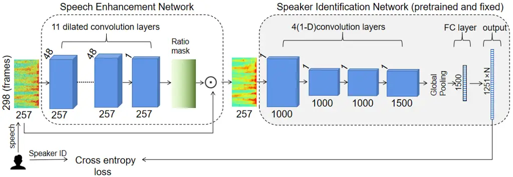
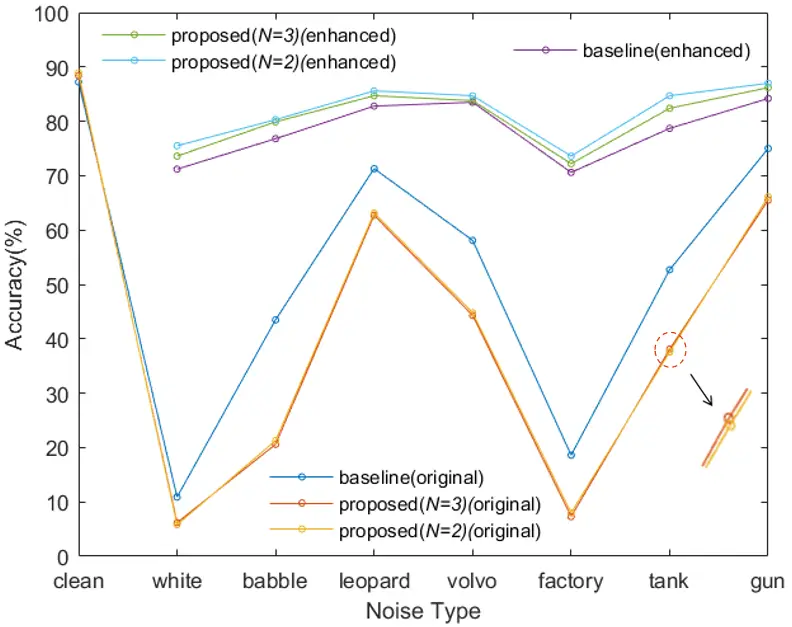

# Multi-Label Training for Text-Independent Speaker Identification

###### Abstract

In this paper, we propose a novel strategy for text-independent speaker
identification system: Multi-Label Training (MLT). Instead of the
commonly used one-to-one correspondence between the speech and the
speaker label, we divide all the speeches of each speaker into several
subgroups, with each subgroup assigned a different set of labels. During
the identification process, a specific speaker is identified as long as
the predicted label is the same as one of his/her corresponding labels.
We found that this method can force the model to distinguish the data
more accurately, and somehow takes advantages of ensemble learning,
while avoiding the significant increase of computation and storage
burden. In the experiments, we found that not only in clean conditions,
but also in noisy conditions with speech enhancement, Multi-Label
Training can still achieve better identification performance than commom
methods. It should be noted that the proposed strategy can be easily
applied to almost all current text-independent speaker identification
models to achieve further improvements.

Yuqi Xue

Department of Acoustical Science and Engineering, University of Nanjing,
Nanjing, China

yuqixue@smail.nju.edu.cn

Index Terms: text-independent speaker identification, speaker label,
ensemble learning



Figure 1: A flow chart for the Multi-Label Training(N means the number
of subgroups)

## 1 Introduction

Recently, deep learning has greatly advanced the development of various
speech technologies \[1, 2, 3, 4, 5, 6, 7, 8\]. Among which speaker
identification is a task that recognizes the identity of the speaker
from their speech characteristics \[6, 9, 10\]. In recent years, the use
of deep learning techniques \[11\] has significantly improved the
performance of speaker identification. Variani et al. proposed the use
of multiple layers of fully connected neural networks to form d-vectors
\[12\], and Snyder et al. proposed X-vectors based on time-delayed
neural networks \[13\]. Using a large number of enhanced data sets, the
speaker embedding approaches \[14, 15\] can now surpass the traditional
i-vector approach \[16\]. A number of other methods for extracting
robust embedding from speech have been proposed after that. Voxceleb
\[17, 18\], a free and open source dataset, provides a bridge for
comparison between different methods, thus facilitating the advances in
speaker recognition. However, speaker recognition in noisy conditions is
still a challenging task.

There are now many solutions for noisy speech. Some studies \[19, 20\]
have attempted to recover the original speech by speech enhancement,
others \[21, 22\] have tried to extract features from clean speech, and
some works \[23, 24\] have attempted to estimate speech quality by
calculating SNR. For voice enhancement, most of the previous works were
done independently. But enhanced speech is not always suitable for
speech recognition \[25\], while speech suitable for speech recognition
does not always sound clean, so it is necessary to train the enhancement
and recognition model jointly. E2E methods that jointly learn acoustic
and linguistic knowledge \[26, 27, 28\] have achieved great success
recently. Shon et al. attempted to integrate the speech enhancement
model and the speaker recognition model using one framework \[27\] in
which the enhancement model filters out unwanted features by ratio
masking and multiplying it point-by-point with the input spectrum. They
adopt their new loss function, which differs from the traditional L2
paradigm loss of enhanced spectrum and reference spectrum.

DNN is also an important topic when applied to speaker identification.
Since the performance of DNN for speaker identification is not the
deeper the better, Rohdin et al. \[29\] proved that the model did not
gain advance from its more complex structure after adopting a deeper and
more complex deep neural network. The number of hidden layers and nodes
has a strong influence on DNN, and the optimal number of hidden layers
and nodes is closely related to the dimension of the input and output
layer, but there is no consensus on how to determine them \[30, 31\].
Nagrani et al. \[17\] trained the residual networks on the Voxceleb1 and
Voxceleb2 respectively. Since these two data sets contain different
numbers of speakers and therefore need different output layer
dimensions, they trained the models in which the last hidden layer’s the
dimension was nearly proportional to the output layer’s dimension on
these two data sets.

Ensemble learning is an important area of machine learning, which is
used in many different ways and constantly refined. Considering the
complexity of the ensemble system and the recognition rate of each
classifier are always opposed, Mao et al. \[32\] proposed a transformed
ensemble learning system. After redefining the complexity, they used a
new function that takes into account both the system complexity and the
individual classifiers’ recognition rate. When training, a random batch
of data from the original training set was selected as a subset, and
then the corresponding classifier was trained on it. Agarwal et al.
\[33\] consider that the performance of ensemble learning greatly
depends on the complexity between individual classifiers, while the
training subsets used in some traditional ensemble learning methods are
not completely mutually exclusive and the correlation is high, thus
resulting in a low system complexity. So they proposed the A-Stacking
and A-Bagging ensemble method, which first clustered the original
training set and then split it into numerous subsets that are mutually
exclusive to each other, improving the complexity of the system, and
then trained the individual classifiers on the corresponding subsets.

While superior model structures can increase speaker identification
results, the superiority of ensemble learning is clear for all to see,
and this paper attempts to draw on some advantages of ensemble learning
to improve the model’s performance. We propose a novel strategy:
Multi-Label Training, which draws on some advantages of ensemble
learning while avoiding the significant increase of computation and
storage burden. We use the model proposed by Shon et al \[27\] as the
baseline, and after modifying it based on the proposed strategy idea, we
output the final identification results. The results show that the
Multi-Label Training further improves the identification rate compared
with the baseline.

## 2 New method and explanation

In our proposed method, we split the training data set into $`N`$
subgroups, each contains all speakers. However, the speakers in each
group correspond to a different set of labels.

Denote $`x`$, $`y`$ as the speech and label, and define

```math
D=\left\{(x_{1},y_{1}),\dots,(x_{n1},y_{n1})\right\} \tag{1}
```

as the training set where $`n1`$ is the total number, and define

```math
T=\left\{(x_{1},y_{1}),\dots,(x_{n2},y_{n2})\right\} \tag{2}
```

as the testing set where $`n2`$ is the total number. Given a training
data set $`D`$ and testing data set $`T`$ with $`C`$ classes, $`D`$ is
sorted by Speaker ID and $`N`$ cannot be bigger than the minimum number
of speeches for each speaker. The specific steps are as Table 1. Here
the cross-entropy loss function is proposed as

```math
L=-\sum_{c=1}^{N\times C}p_{c}\mathrm{log}(q_{c}) \tag{3}
```

where $`p`$_(c) refers to the ground truth according to the $`y`$ and
$`q`$_(c) refers to the prediction.

|                                                                                                       |
| ----------------------------------------------------------------------------------------------------- |
| Strategy: Multi-Label Training                                                                        |
| TRAINING(step 1 to 7):                                                                                |
| Input: Training set $`D`$ = $`\{`$($`x`$₁,$`y`$₁), $`\dots`$, ($`x`$_(n1),$`y`$_(n1))}, $`N`$, $`C`$. |
| 1: for $`i`$ = 1, …, $`n1`$ do                                                                        |
| 2: $`m`$ $`\leftarrow`$ $`i`$ mod $`N`$;                                                              |
| 3: for $`m`$ = 0, …, $`N`$-1 do                                                                       |
| 4: $`y`$_(i) $`\leftarrow`$ $`y`$_(i) + ($`C`$ × $`m`$);                                              |
| 5: end for                                                                                            |
| 6: end for                                                                                            |
| 7: Train the model on updated $`D`$;                                                                  |
| TESTNING(step 8 to 17):                                                                               |
| Input: Testing set $`T`$ = $`\{`$($`x`$₁,$`y`$₁), $`\dots`$, ($`x`$_(n2),$`y`$_(n2))}, $`N`$, $`C`$.  |
| output: Accuracy.                                                                                     |
| 8: Set correct=0, total=0;                                                                            |
| 9: for $`i`$ = 1, …, $`n2`$ do                                                                        |
| 10: Compute the predicted label: $`L`$;                                                               |
| 11: for $`i`$ = 0, …, $`N`$-1 do                                                                      |
| 12: if $`L`$ == $`y`$\_(i) + ($`C`$ × $`i`$) do                                                       |
| 13: correct $`\leftarrow`$ correct + 1;                                                               |
| 14: end for                                                                                           |
| 15: total $`\leftarrow`$ total + 1;                                                                   |
| 16: end for                                                                                           |
| 17: Accuracy $`\leftarrow`$ correct ÷ total;                                                          |

Table 1: Procedures of Multi-Label Training

We use the model that Shon et al. \[27\] proposed as the baseline, where
the output layer dimension corresponds to the number of speakers. We
modified the baseline based on the proposed strategy and compared it
with the baseline. In this strategy, the output layer dimension will
change to $`N`$ times of the original. Therefore, the classification
category becomes $`N`$ times of the original, which is equivalent to
adding an additional $`N`$-1 classifiers similar to the baseline. So
this strategy has some similarities to ensemble learning, such as
bagging (bootstrap aggregating), which constructs $`K`$ different data
subsets by resampling the original data set, trains each model on the
corresponding subset, and polls the output in an average way. However,
we know that ”Model averaging is usually discouraged when benchmarking
algorithms for scientific papers, because any machine learning algorithm
can benefit substantially from model averaging at the price of added
computation and memory \[11\]”. But there is only one model here, and
we’ve only made a few modifications to the FC layer. Although the data
set is split into $`N`$ subgroups, unlike Bagging, these subsets is not
resampled, so they are all one $`N`$th the size of the original data
set, but all include all speakers. So obviously there’s no significant
increase in computation and memory compared with ensemble learning. The
way we construct the subsets of data is similar to article
\[ls/asc/MaoCJGW19\], and the subsets are completely mutually exclusive,
increasing the complexity of the ensemble system according to the
article \[33\]. In training, It can be seen as the ensemble of several
individual classifiers, each classifier is trained on the corresponding
data subsets, the final prediction is made through the maximum vote.
Since each group of data is one-$`N`$th of the original data set, the
identification rate of each part will certainly fall as a result,
because of the insufficient training data. But also because of the
compensation of maximum vote and multiple correct labels, the overall
identification rate will rise. The reason why the Multi-Label Training
may have a better performance, in fact, is that it can reach a better
middle performance between the rise and the fall, which is similar to
the article\[ls/asc/MaoCJGW19\]\[33\].

|                             |                                  |                  |                                  |                  |
| --------------------------- | -------------------------------- | ---------------- | -------------------------------- | ---------------- |
| Identification Net(Using D) | VoiceID Loss \[27\](2 FC Layers) |                  | VoiceID Loss \[27\](3 FC Layers) |                  |
|                             | Top1 Accuracy(%)                 | Top5 Accuracy(%) | Top1 Accuracy(%)                 | Top5 Accuracy(%) |
| Clean Speech                | 87.2                             | 95.5             | 87.1                             | 95.0             |

Table 2: Performance before and after adding a fully connected layer to
the baseline model

## 3 Model architecture

As is shown in Figure 1, the model in this paper is modified from the
baseline model proposed by Shon et al. \[27\] and the same as the
baseline except for the fully connected layers and the output layer.
Compared with the baseline model \[27\], the dimension of the output
layer was changed to $`N`$ times of the original. We cannot avoid
modifying the model, so we have to consider how to exclude other
interference factors such as the number of model parameters. Here we can
draw on the work of Nagrani et al. \[17\] and according to the article
\[29, 30\], we believe that the network model is not the deeper the
better, and the number of nodes in hidden layers will also have an
impact. When conducting controlled experiments to compare the
performance of two algorithms, we can make the dimension of the last
hidden layer nearly proportional to the output layer dimension, thus
excluding interference from structural suitability. In order to verify
our understanding, we modified the baseline model proposed by Shon et
al. \[27\] and tested it. The two-layer fully connected layer and the
output layer of the baseline model is represented as: 1500–600–1251. In
order to exclude the influence of the increasing parameters, we added an
additional fully connected layer(dim=2500) to the baseline model, which
became: 1500–2500–600–1251, and the performance is shown in Table 2. We
did find that there was little difference between the two. So in this
model for speaker identification, we can see that adding or deleting a
hidden layer cannot make a big difference to the model’s performance.
And we should pay more attention to ensure that the ratio of the
dimension between the last hidden layer and the output layer is
approximately constant during the experiment.

### 3.1 Speech enhancement module

The speech enhancement model consists of 11 dilated convolution layers.
speech enhancement is not the focus of this paper, so we directly use
the speech enhancement model proposed by Shon et al. \[27\], and its
specific structure is shown in Table 3. For the output of the last
convolution layer, we use the sigmoid function to generate a ratio mask
of the same size and multiply the ratio mask with the original input to
achieve speech enhancement, after which the enhanced speech enter the
speaker identification model. For the other layers, we use RELUs as
non-linear activation. The final cross-entropy loss is calculated by
comparing the prediction derived from SOFTMAX with the real identity of
the speaker.

| Layer Name | Structure | Dilation |
| ---------- | --------- | -------- |
| Conv1      | 1×7×48    | 1×1      |
| Conv2      | 7×1×48    | 1×1      |
| Conv3      | 5×5×48    | 1×1      |
| Conv4      | 5×5×48    | 2×1      |
| Conv5      | 5×5×48    | 4×1      |
| Conv6      | 5×5×48    | 8×1      |
| Conv7      | 5×5×48    | 1×1      |
| Conv8      | 5×5×48    | 2×2      |
| Conv9      | 5×5×48    | 4×4      |
| Conv10     | 5×5×48    | 8×8      |
| Conv11     | 1×1×1     | 1×1      |

Table 3: Structure of the speech enhancement model

### 3.2 Speaker identification module

The speaker identification model uses 1D convolution to consider all
bands at once. We use the model proposed by Shon et al. \[27\] as the
baseline of the experiment and we want to modify it for the Multi-Label
Training as little as possible without introducing other interfering
factors. The speaker identification model of the baseline consists of
four 1D convolution layers and two fully connected layers (dimensions:
1500, 600), while the speaker identification model used for Multi-Label
Training consists of four one-dimensional convolution layers and one
fully connected layer (dimension: 1500). The filter sizes of the four
one-dimensional convolution layers are: 5, 7, 1, 1; the strides are: 1,
2, 1, 1; and the number of filters in each layer is shown in Figures 1.
There is also a global average pooling layer between the final
convolution layer and the fully connected layer. The approach of
spectrum extraction here is the same as the speech enhancement model.
Finally we extract the speaker embedding from the last fully connected
layer.

## 4 Experiments

| Model              | Description                              |
| ------------------ | ---------------------------------------- |
| VoiceID Loss\[27\] | Using the model proposed by Shon et al.  |
|                    | \[27\] as the baseline.                  |
| Proposed($`N`$=3)  | Using the strategy proposed in this      |
|                    | paper, the original training data set is |
|                    | split into 3 subgroups.                  |
| Proposed($`N`$=2)  | Using the strategy proposed in this      |
|                    | paper, the original training data set is |
|                    | split into 2 subgroups.                  |

Table 4: Descriptions of the 3 models of the experiments

On a data set with a limited size, an excessively large $`N`$ will cause
the data to be too sparse, and ultimately reduce the overall
identification performance. Therefore, in this experiment, we only test
the conditions that $`N`$ is 2 and 3, in which the ratio of the
dimension between the last hidden layer and the output layer is close to
the baseline, which is consistent with the conclusion discussed in last
section. Thus the model structure in Figure 1 is ideal and we don’t need
to make any more modification.

| Identification(Using $`D`$)  |     | VoiceID Loss \[27\] |           | Proposed($`N`$=3) |           | Proposed($`N`$=2) |           |
| ---------------------------- | --- | ------------------- | --------- | ----------------- | --------- | ----------------- | --------- |
| Enhancement(Using $`D`$^(N)) |     | $`\times`$          | $`\surd`$ | $`\times`$        | $`\surd`$ | $`\times`$        | $`\surd`$ |
| Type                         | SNR | Accuracy(%)         |           | Accuracy(%)       |           | Accuracy(%)       |           |
| clean                        | —   | 87.2                | 87.9      | 88.4              | 89.0      | 88.9              | 89.4      |
| white                        | 10  | 10.9                | 71.2      | 6.2               | 73.6      | 5.8               | 75.5      |
| babble                       | 10  | 43.5                | 76.8      | 20.6              | 79.9      | 21.3              | 80.3      |
| leopard                      | 10  | 71.3                | 82.8      | 62.7              | 84.7      | 63.1              | 85.6      |
| volvo                        | 10  | 58.1                | 83.5      | 44.3              | 83.8      | 44.8              | 84.7      |
| factory                      | 10  | 18.6                | 70.6      | 7.3               | 72.2      | 8.0               | 73.6      |
| tank                         | 10  | 52.7                | 78.7      | 38.1              | 82.4      | 37.6              | 84.7      |
| gun                          | 10  | 75.0                | 84.2      | 65.5              | 86.2      | 66.1              | 87.0      |

Table 5: Results of the three models tested with clean speech and
various noisy speech

### 4.1 Data

In our work, we use the Voxceleb1 \[17\] data set, which is
text-independent and extracted from YouTube video. It contains 1251
speakers and about 150,000 speech, each with an average length of 7.8
seconds. The total duration of this data set is about 350 hours. Here we
directly use the window function with 25ms window size and 10ms shift to
take out the 257-dimensional spectrum as input. We do not normalize the
input data, just take an exponential multiple of the amplitude spectrum
of 0.3. We used 298 frames of fixed length (257 each frame) as input.

To test the robustness of the model, we used the Noise-92 noise data
set. Since the Voxceleb1 \[17\] data set is taken from YouTube, each
speech inevitably contains some noise, but this paper follows the
example of paper \[27\] and take the Voxceleb1 \[17\] data set as clean
speech(abbreviate training set as $`D`$). We selected seven different
types of noise from the Noise-92 data set: White, Babble, Leopard
(military vehicle noise), Volvo (vehicle interior noise), Factory, Tank,
and Gun (machine gun noise), and mixed them with clean speech at a
signal-to-noise ratio of 10 dB to obtain noisy speech(abbreviate noisy
training set as $`D`$^(N)) for training and testing model in noisy
conditions.

### 4.2 Speaker identification

When speaker identification was performed, both the training set and the
test set contain all speakers (1251). And the baseline model and the
proposed models in this paper should have the same size of training set
and test set. In this paper, we just test the performance of the
Multi-Label Training when $`N`$=2 and 3. For VoiceID Loss \[27\], we
divided the original data set into training and test sets in a 3:1
ratio. For Proposed ($`N`$=3) and Proposed ($`N`$=2), we divided the
original data in the same way first, and then we followed the procedures
as in Table 1 and test the performance of the Multi-Label Training.

When mixing noisy data with clean speech, the noisy data is first split
into two parts, one for mixing with the training set data and one for
mixing with the test set data, so that the same noise data is not used
by both the training set and the test set.

### 4.3 Result and discussion

The experimental results are the average values obtained after two
repeated experiments and are shown in Table 5 and Figure 2. Compared
with baseline, the proposed strategy improves the performance at both
$`N`$ for 2 and 3, although it is better at $`N`$ for 2. So it seems
that it is more appropriate to splitting the data set into two subgroups
on Voxceleb1. If testing on a more dense data set, perhaps in the best
case, $`N`$ can be a larger number.



Figure 2: Line graph of the results

It can also be found that the identification rate deteriorates
significantly when using the noisy speech to directly test
identification model without enhancement, and the performance of the
model trained by the proposed strategy drop even more. The reason should
be that after splitting into two or three subgroups, each group is
reduced to one-half or one-third of the original training set, the
corresponding part is trained insufficiently as a result. When inputting
the noisy speech directly, the performance of each part drops sharply.
Although the final result is compensated by maximum vote and multiple
correct labels, the overall performance still decreases. However, we
found that after the speech enhancement, the performance of the two
proposed models are still significantly improved compared with the
baseline, indicating that our proposed strategy can still improve the
performance of the model in both clean and noisy conditions. Comparing
the results before and after enhancement, it can be seen that the speech
enhancement model is very helpful for improving the system’s robustness.
And by comparing the performance between different types of noise, we
can find that the noise of wide frequency domain interferes the model
more strongly. For example, white noise has a greater impact on the
model than babble. Maybe because the goal of speech enhancement here is
to improve the identification rate, rather than sound more clearly, so
this also shows that this model is actually very different from the
human auditory senses.

## 5 Conclusions

In this paper, we propose a novel strategy: Multi-Label Training, which
divides the training data set into several mutually exclusive subgroups
and sets the corresponding identity labels. Then it modifies the
dimensions of the output layer accordingly to achieve the effect of a
pseudo ensemble learning with very low additional complexity added.
Compared with the use of various superior model structures in speaker
identification, the Multi-Label Training chooses another way. It can be
easily applied to almost all text-independent speaker identification
models like ensemble learning, thereby further improving the
performance. This paper just uses the model proposed by Shon et al
\[27\] as the baseline and the results show that the Multi-Label
Training can further improve the performance of the model in both clean
and noisy conditions.

## References

- \[1\] A. Graves, S. Fernández, F. J. Gomez, and J. Schmidhuber,
  “Connectionist temporal classification: Labelling unsegmented sequence
  data with recurrent neural networks,” in _Proc. ICML_, 2006.
- \[2\] K. Deng, S. Cao, Y. Zhang, and L. Ma, “Improving hybrid
  ctc/attention end-to-end speech recognition with pretrained acoustic
  and language models,” in _Proc. ASRU_, 2021, pp. 76–82.
- \[3\] Y. Wang, A. Boumadane, and A. Heba, “A fine-tuned wav2vec
  2.0/hubert benchmark for speech emotion recognition, speaker
  verification and spoken language understanding,” _arXiv preprint
  arXiv:2111.02735_, 2021.
- \[4\] K. Deng, S. Cao, and L. Ma, “Improving accent identification and
  accented speech recognition under a framework of self-supervised
  learning,” in _Proc. Interspeech_, 2021, pp. 1504–1508.
- \[5\] K. Deng, S. Watanabe, J. Shi, and S. Arora, “Blockwise streaming
  transformer for spoken language understanding and simultaneous speech
  translation,” in _Proc. Interspeech_. ISCA, 2022, pp. 1746–1750.
- \[6\] A. Poddar, M. Sahidullah, and G. Saha, “Speaker verification
  with short utterances: a review of challenges, trends and
  opportunities,” _IET Biometrics_, vol. 7, no. 2, pp. 91–101, 2018.
- \[7\] K. Deng and P. C. Woodland, “Label-synchronous neural transducer
  for E2E simultaneous speech translation,” in _Proc. ACL (Volume 1:
  Long Papers)_, Bangkok, Thailand, 2024.
- \[8\] Z. Chen, S. Chen, Y. Wu, Y. Qian, C. Wang, S. Liu, Y. Qian, and
  M. Zeng, “Large-scale self-supervised speech representation learning
  for automatic speaker verification,” in _Proc. ICASSP_, 2022, pp.
  6147–6151.
- \[9\] N. Vaessen and D. A. Van Leeuwen, “Fine-tuning wav2vec2 for
  speaker recognition,” in _Proc. ICASSP_. IEEE, 2022, pp. 7967–7971.
- \[10\] D. Cai, W. Wang, M. Li, R. Xia, and C. Huang, “Pretraining
  conformer with asr for speaker verification,” in _Proc. ICASSP_. IEEE,
  2023, pp. 1–5.
- \[11\] Y. LeCun, Y. Bengio, and G. Hinton, “Deep learning,” _nature_,
  vol. 521, no. 7553, pp. 436–444, 2015.
- \[12\] E. Variani, X. Lei, E. McDermott, I. L. Moreno, and
  J. Gonzalez-Dominguez, “Deep neural networks for small footprint
  text-dependent speaker verification,” in _Proc. ICASSP_, 2014, pp.
  4052–4056.
- \[13\] D. Snyder, D. Garcia-Romero, G. Sell, D. Povey, and
  S. Khudanpur, “X-vectors: Robust dnn embeddings for speaker
  recognition,” in _Proc. ICASSP_, 2018, pp. 5329–5333.
- \[14\] D. Snyder, D. Garcia-Romero, D. Povey, and S. Khudanpur, “Deep
  neural network embeddings for text-independent speaker verification.”
  in _Proc. Interspeech_, 2017, pp. 999–1003.
- \[15\] G. Heigold, I. Moreno, S. Bengio, and N. Shazeer, “End-to-end
  text-dependent speaker verification,” in _Proc. ICASSP_, 2016, pp.
  5115–5119.
- \[16\] N. Dehak, P. J. Kenny, R. Dehak, P. Dumouchel, and P. Ouellet,
  “Front-end factor analysis for speaker verification,” _IEEE
  Transactions on Audio, Speech, and Language Processing_, vol. 19,
  no. 4, pp. 788–798, 2010.
- \[17\] A. Nagrani, J. S. Chung, and A. Zisserman, “Voxceleb: a
  large-scale speaker identification dataset,” in _Proc. Interspeech_,
  2017, pp. 2616–2620.
- \[18\] J. S. Chung, A. Nagrani, and A. Zisserman, “Voxceleb2: Deep
  speaker recognition,” in _Proc. Interspeech_, 2018, pp. 1086–1090.
- \[19\] S. Leglaive, U. Şimşekli, A. Liutkus, L. Girin, and R. Horaud,
  “Speech enhancement with variational autoencoders and alpha-stable
  distributions,” in _Proc. ICASSP_, 2019, pp. 541–545.
- \[20\] M. Sadeghi, S. Leglaive, X. Alameda-Pineda, L. Girin, and
  R. Horaud, “Audio-visual speech enhancement using conditional
  variational auto-encoders,” _IEEE/ACM Transactions on Audio, Speech,
  and Language Processing_, vol. 28, pp. 1788–1800, 2020.
- \[21\] I. Jang, C. Ahn, J. Seo, and Y. Jang, “Enhanced feature
  extraction for speech detection in media audio.” in _Proc.
  Interspeech_, 2017, pp. 479–483.
- \[22\] G. Farahani, S. M. Ahadi, and M. M. Homayounpour, “Robust
  feature extraction of speech via noise reduction in autocorrelation
  domain,” in _Proc. MRCS_, ser. Lecture Notes in Computer Science, vol.
  4105, 2006, pp. 466–473.
- \[23\] L. Nahma, P. C. Yong, H. H. Dam, and S. Nordholm, “An adaptive
  a priori SNR estimator for perceptual speech enhancement,” _EURASIP J.
  Audio Speech Music. Process._, vol. 2019, p. 7, 2019.
- \[24\] R. Yao, Z. Zeng, and P. Zhu, “A priori SNR estimation and noise
  estimation for speech enhancement,” _EURASIP J. Adv. Signal Process._,
  vol. 2016, p. 101, 2016.
- \[25\] S. Novoselov, G. Lavrentyeva, A. Avdeeva, V. Volokhov, and
  A. Gusev, “Robust speaker recognition with transformers using wav2vec
  2.0,” _arXiv preprint arXiv:2203.15095_, 2022.
- \[26\] K. Deng and P. C. Woodland, “Label-synchronous neural
  transducer for adaptable online E2E speech recognition,” _IEEE/ACM
  Transactions on Audio, Speech, and Language Processing_, pp.
  1–10, 2024.
- \[27\] S. Shon, H. Tang, and J. R. Glass, “Voiceid loss: Speech
  enhancement for speaker verification,” in _Proc. Interspeech_, 2019,
  pp. 2888–2892.
- \[28\] K. Deng and P. C. Woodland, “Decoupled structure for improved
  adaptability of end-to-end models,” _Speech Communication_, p.
  103109, 2024.
- \[29\] J. Rohdin, A. Silnova, M. Díez, O. Plchot, P. Matejka,
  L. Burget, and O. Glembek, “End-to-end DNN based text-independent
  speaker recognition for long and short utterances,” _Comput. Speech
  Lang._, vol. 59, pp. 22–35, 2020.
- \[30\] M. I. C. Rachmatullah, K. Surendro, J. Santoso, and
  D. Mahayana, “Determining the neural network topology from the
  viewpoint of kuhn’s philosophy and popper’s philosophy,” in _Proc.
  ICAIIT_, 2019, pp. 115–118.
- \[31\] K. Deng and P. C. Woodland, “Fastinject: Injecting unpaired
  text data into ctc-based asr training,” in _Proc. ICASSP_, 2024, pp.
  11 836–11 840.
- \[32\] S. Mao, J. Chen, L. Jiao, S. Gou, and R. Wang, “Maximizing
  diversity by transformed ensemble learning,” _Appl. Soft Comput._,
  vol. 82, 2019.
- \[33\] S. Agarwal and C. R. Chowdary, “A-stacking and a-bagging:
  Adaptive versions of ensemble learning algorithms for spoof
  fingerprint detection,” _Expert Syst. Appl._, vol. 146, p.
  113160, 2020.
