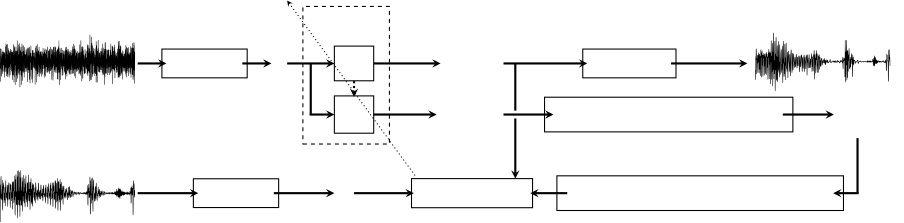
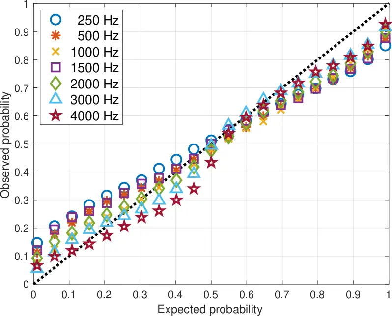
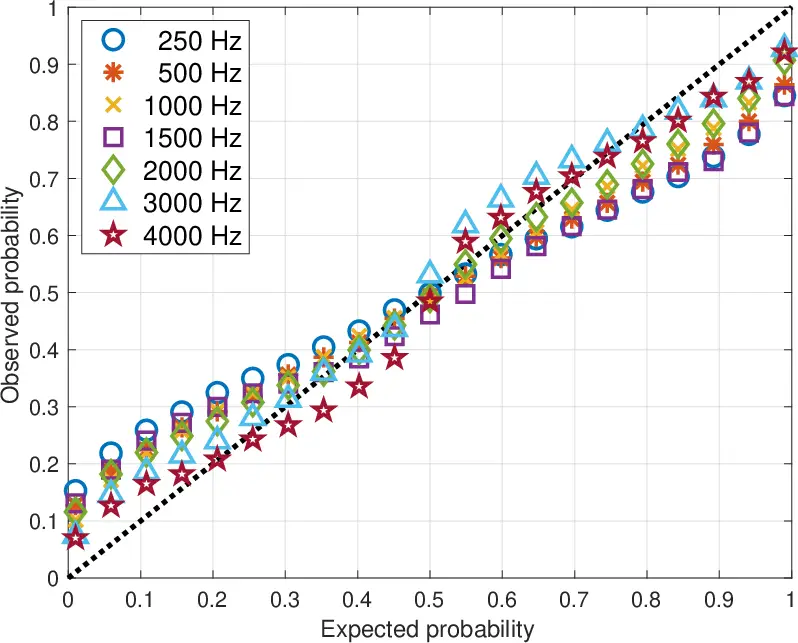

# Leveraging Heteroscedastic Uncertainty in Learning Complex Spectral Mapping for Single-channel Speech Enhancement

Kuan-Lin Chen    Daniel D. E. Wong    Ke Tan    Buye Xu    Anurag Kumar
   Vamsi Krishna Ithapu ^(†)^(†)thanks: \$†\$Work done during an
internship at Meta Reality Labs Research.^(†)^(†)thanks: ^(\*) The
corresponding author.

###### Abstract

Most speech enhancement (SE) models learn a point estimate and do not
make use of uncertainty estimation in the learning process. In this
paper, we show that modeling heteroscedastic uncertainty by minimizing a
multivariate Gaussian negative log-likelihood (NLL) improves SE
performance at no extra cost. During training, our approach augments a
model learning complex spectral mapping with a temporary submodel to
predict the covariance of the enhancement error at each time-frequency
bin. Due to unrestricted heteroscedastic uncertainty, the covariance
introduces an undersampling effect, detrimental to SE performance. To
mitigate undersampling, our approach inflates the uncertainty lower
bound and weights each loss component with their uncertainty,
effectively compensating severely undersampled components with more
penalties. Our multivariate setting reveals common covariance
assumptions such as scalar and diagonal matrices. By weakening these
assumptions, we show that the NLL achieves superior performance compared
to popular loss functions including the mean squared error (MSE), mean
absolute error (MAE), and scale-invariant signal-to-distortion ratio
(SI-SDR).

###### Index Terms: 

Uncertainty, negative log-likelihood, neural networks, complex spectral
mapping, speech enhancement

^(†)^(†)address: ¹Meta Reality Labs Research  
²Department of Electrical and Computer Engineering, University of
California, San Diego

## 1 Introduction

Speech enhancement (SE) aims at improving speech quality and
intelligibility via recovering clean speech components from noisy
recordings. It is an essential part of many applications such as
teleconferencing \[1\], hearing aids \[2\], and augmented hearing
systems \[3\]. Modern SE approaches usually train a deep neural network
(DNN) model to minimize a loss function on a target speech
representation. Because DNNs can be universal approximators \[4, 5, 6\]
and capable of learning anything incentivized by the loss, designing DNN
architectures on different target representations has been the most
popular trend in SE. Literature in this area is vast, \[7, 8, 9, 10, 11,
12, 13, 14, 15, 16\] for example.

Despite such progress, the most popular loss functions such as the MSE
and MAE in SE make no or little use of uncertainty. We refer the reader
to an excellent survey paper by Gawlikowski et al. \[17\] for a thorough
discussion of uncertainty in DNNs. From a probabilistic point of view,
one can derive a loss function from a probabilistic distribution subject
to certain constraints. For example, minimizing the MSE loss is
equivalent to maximizing a Gaussian likelihood that assumes
homoscedastic uncertainty, meaning that the variance associated with
each squared error is a constant. The MAE loss also follows the same
logic but with a Laplacian distribution. Taking complex spectral mapping
\[18, 13\] for instance, optimizing the MSE or MAE on the complex
spectrogram implicitly assumes a constant variance of the enhancement
error on the real and imaginary parts at every time-frequency (T-F) bin.
In fact, such an assumption even extends to speech signals in dissimilar
noise conditions, e.g., different signal-to-noise ratios (SNRs).
Although these loss functions are easy to use, they could limit the
learning capability of a DNN model due to the underlying constant
variance assumption.

The first effort in the literature training a neural network to minimize
a Gaussian NLL dates back to a seminal work by Nix and Weigend \[19\].
Although the Gaussian NLL has been earlier used in computer vision \[20,
21\], its potential in SE remained unexplored until a recent work by
Fang et al. \[22\]. They showed that a hybrid loss combining the SI-SDR
\[23, 24\] and the Gaussian NLL can outperform both MSE and SI-SDR
losses. However, they also reported that minimizing a Gaussian NLL alone
leads to inferior SE performance, highlighting the difficulty of using
heteroscedastic uncertainty to improve perceptual scores in SE.

In this paper, we show that, at no extra cost in terms of compute,
memory, and parameters, directly minimizing a Gaussian NLL yields
significantly better SE performance than minimizing a conventional loss
such as the MAE or MSE, and slightly better SE performance than the
SI-SDR loss. To the best of our knowledge, this is the first successful
study that achieves improved perceptual metric performance by directly
using heteroscedastic uncertainty for SE. Inspired by recent progress in
uncertainty estimation \[25\], we reveal the main optimization
difficulty and propose two methods: i) covariance regularization and ii)
uncertainty weighting to overcome such a hurdle. Experiments show that
minimizing Gaussian NLLs using these methods consistently improves SE
performance in terms of speech quality and objective intelligibility.

## 2 Probabilistic Models and Assumptions

Let the received signal at a single microphone in the short-time Fourier
transform (STFT) domain be $`y_{r}^{t,f}+iy_{i}^{t,f}\in\mathbb{C}`$ for
all $`(t,f)`$ with the time frame index $`t\in\{1,2,\cdots,T\}`$ and
frequency bin index $`f\in\{1,2,\cdots,F\}`$. Let
$`y\in\mathbb{R}^{2TF}`$ be the vector representing every real part and
imaginary part of the STFT representation of the received signal. We
assume the clean signal is corrupted by additive noise, i.e., $`y=x+v`$
where $`x`$ and $`v`$ are the clean signal random vector and noise
random vector, respectively, from the probabilistic perspective. Now, we
assume that the probability density of the clean signal given the
received noisy signal and a conditional density model follows a
multivariate Gaussian distribution

```math
p\left(x|y;\psi\right)=\frac{\exp\left(-\frac{1}{2}\left[x-\hat{\mu}_{\theta}(y)\right]^{\mathsf{T}}\hat{\Sigma}_{\phi}^{-1}(y)\left[x-\hat{\mu}_{\theta}(y)\right]\right)}{\sqrt{\left(2\pi\right)^{n}\det\hat{\Sigma}_{\phi}(y)}} \tag{1}
```

where its conditional mean $`\hat{\mu}_{\theta}(y)`$ and covariance
$`\hat{\Sigma}_{\phi}(y)`$ are directly learned from a dataset by a
conditional density model $`f_{\psi}`$ parameterized by
$`\psi=\{\theta,\phi\}`$ in supervised speech enhancement. Fig. 1
illustrates the conditional density model $`f_{\psi}`$ and its
difference compared to conventional SE models that only estimate clean
speech. The map $`f_{\psi}`$ can be expressed as an augmented map
consisting of an essential SE model $`f_{\theta}`$ and a temporary
submodel $`f_{\phi}`$ such that

```math
\begin{bmatrix}\hat{\mu}_{\theta}(y)\\
\text{vec}\left[\hat{L}_{\phi}(y)\right]\end{bmatrix}=\begin{bmatrix}f_{\theta}(y)\\
f_{\phi}(\tilde{y})\end{bmatrix}=f_{\psi}(y) \tag{2}
```

where $`f_{\psi}`$, $`f_{\theta}`$, and $`f_{\phi}`$ are DNN models
parameterized by $`\psi`$, $`\theta`$, and $`\phi`$, respectively.
$`\text{vec}[\cdot]`$ is an operator that vectorizes a matrix. Because a
valid covariance is symmetric positive semidefinite, the output of
$`f_{\phi}`$ must be constrained to satisfy the property. To avoid
imposing such a constraint, we design the map $`f_{\phi}`$ to estimate
the lower Cholesky factor $`\hat{L}_{\phi}`$ of the covariance. The
covariance can be later obtained by
$`\hat{\Sigma}_{\phi}(y)=\hat{L}_{\phi}(y)\hat{L}^{\mathsf{T}}_{\phi}(y)`$.
$`\tilde{y}`$ is the input feature of $`f_{\phi}`$ and a function of
$`y`$, which can be $`y`$, an intermediate representation produced by
$`f_{\theta}`$, or a combination of both. One can design different DNN
architectures for $`f_{\theta}`$ and $`f_{\phi}`$. For example,
$`f_{\psi}`$ can be an integrated DNN with two output branches, one for
clean speech estimation and the other for covariance estimation, with
shared weights between $`f_{\theta}`$ and $`f_{\phi}`$, i.e.
$`\theta\cap\phi\neq\emptyset`$. Alternatively, $`f_{\theta}`$ and
$`f_{\phi}`$ can be two separate DNNs, i.e.
$`\theta\cap\phi=\emptyset`$. Below we point out key features of our
framework.

###### Remark 1.

The conditional mean $`\hat{\mu}_{\theta}(y)`$ is the enhanced signal so
the submodel $`f_{\phi}`$ can be removed at inference time. Hence, one
can use a much larger parameter set $`\phi`$ to design $`f_{\phi}`$
without increasing the complexity of the SE model at inference time.

###### Remark 2.

The conditional covariance $`\hat{\Sigma}_{\phi}(y)`$ is also referred
to as the uncertainty in this paper. Its homoscedasticity or
heteroscedasticity is determined by assumptions made for the structure
of the covariance. For example, the covariance can be assumed as a
scalar matrix, a diagonal matrix, or a block diagonal matrix (see
section 3).

###### Remark 3.

The form of conditional density in (1) can be obtained by assuming $`x`$
and $`v`$ are drawn from two multivariate Gaussian distributions. A
Wiener filter can be realized by estimating the mean and covariance of
the joint distribution of $`x`$ and $`v`$. However, this approach
requires a model to estimate more parameters, and such an extra cost
cannot be removed at inference time.



Figure 1: We augment an SE model $`f_{\theta}`$ with a temporary
submodel $`f_{\phi}`$ to estimate heteroscedastic uncertainty during
training. The augmented model $`f_{\psi}`$ is trained to minimize a
multivariate Gaussian NLL (see section 3). The methods of covariance
regularization and uncertainty weighting are proposed to overcome the
optimization difficulty that arises in optimizing the NLL (see
section 4).

Given a dataset $`\{x_{n},y_{n}\}_{n=1}^{N}`$ containing pairs of target
clean signal $`x_{n}`$ and received noisy signal $`y_{n}`$, we find the
conditional mean $`\hat{\mu}_{\theta}(y)`$ and covariance
$`\hat{\Sigma}_{\phi}(y)`$ maximizing the likelihood of the joint
probability distribution
$`p(x_{1},x_{2},\cdots,x_{N}|y_{1},y_{2},\cdots,y_{N};\psi)=\prod_{n=1}^{N}p\left(x_{n}|y_{n};\psi\right)`$
where we assume the data points are independent and identically
distributed (i.i.d.).

## 3 Multivariate Gaussian NLL

Introducing the logarithmic function to the likelihood of the joint
distribution and expanding terms according to (1), the maximization
problem can be converted into minimizing the empirical risk using the
following multivariate Gaussian NLL loss

```math
\ell^{\text{Full}}_{x,y}(\psi)=\left[x-\hat{\mu}_{\theta}(y)\right]^{\mathsf{T}}\hat{\Sigma}_{\phi}^{-1}(y)\left[x-\hat{\mu}_{\theta}(y)\right]+\log\det\hat{\Sigma}_{\phi}(y) \tag{3}
```

of which the first term is an affinely transformed squared error between
clean and enhanced speech, and the second term is a log-determinant
term. Without imposing any assumptions on the covariance
$`\hat{\Sigma}_{\phi}`$, the multivariate Gaussian NLL
$`\ell^{\text{Full}}_{x,y}(\psi)`$ in (3) uses a full matrix for the
covariance. A full covariance matrix relaxes common assumptions such as
uncorrelated real part and imaginary part at each T-F bin and
uncorrelated T-F bins \[26, 27\]. Although
$`\ell^{\text{Full}}_{x,y}(\psi)`$ is the most generalized formulation
for a Gaussian NLL, the number of output units of the submodel
$`f_{\phi}`$ is $`4T^{2}F^{2}`$, leading to exceedingly high training
complexity. Assumptions (section 3.1, section 3.2, and section 3.3) are
made to sparsify the covariance matrix, which in turn, reduces the
complexity of the submodel and makes training amenable.

### 3.1 Homoscedastic Uncertainty: An MSE Loss

If the covariance $`\hat{\Sigma}_{\phi}(y)`$ is assumed to be a scalar
matrix $`\hat{\Sigma}_{\phi}(y)=cI`$ where $`c`$ is a scalar constant
and $`I`$ is an identity matrix, then we actually assume the uncertainty
is homoscedastic. The log-determinant term in (3) becomes a constant,
and the affinely transformed squared error reduces to an MSE. In this
case, minimizing the Gaussian NLL is equivalent to the empirical risk
minimization using an MSE loss
$`\ell^{\text{MSE}}_{x,y}(\theta)=\lVert x-\hat{\mu}_{\theta}(y)\rVert_{2}^{2}.`$
Apparently, the submodel $`f_{\phi}`$ is not needed for an MSE loss so
the optimization is performed only on $`\theta`$. Many SE works fall
into this category, e.g., \[7, 8, 10, 12, 13\].

### 3.2 Heteroscedastic Uncertainty: A Diagonal Case

If every random variable in the random vector drawn from the conditional
density $`p(x|y)`$ is assumed to be uncorrelated with the others, then
the covariance reduces to a diagonal matrix. In this case, the Gaussian
NLL ignores uncertainties across different T-F bins and between real and
imaginary parts, leading to the following uncorrelated Gaussian NLL loss

```math
\ell^{\text{Diagonal}}_{x,y}(\psi)=\sum_{t,f}\sum_{k\in\{r,i\}}\left[\frac{x_{k}^{t,f}-\hat{\mu}_{k;\theta}^{t,f}(y)}{\hat{\sigma}_{k;\phi}^{t,f}(y)}\right]^{2}+2\log\hat{\sigma}_{k;\phi}^{t,f}(y) \tag{4}
```

where $`\hat{\sigma}_{r;\phi}^{t,f}`$ and
$`\hat{\sigma}_{i;\phi}^{t,f}`$ denote the conditional standard
deviation for the real and imaginary parts at $`(t,f)`$ bin,
$`\hat{\mu}_{r;\phi}^{t,f}`$ and $`\hat{\mu}_{i;\phi}^{t,f}`$ denote
their conditional means, and $`x_{r}^{t,f}`$ and $`x_{i}^{t,f}`$ denote
the real and imaginary parts of $`x`$ at $`(t,f)`$ bin. In this case,
the number of output units of the submodel $`f_{\phi}`$ is $`2TF`$. Note
that the Gaussian NLL derived by Fang et al. \[22\] assumes circularly
symmetric complex Gaussian distributions for both clean speech and
noise. Such a circularly symmetric assumption is stronger than the
assumption used in (4). Consequently, their Gaussian NLL only has a
variance term associated with each T-F bin whereas our formulation in
(4) allows the real and imaginary parts have their own variance.

### 3.3 Heteroscedastic Uncertainty: A Block Diagonal Case

We relax the uncorrelated assumption imposed between every real and
imaginary part in section 3.2 to take more uncertainty into account. In
this case, the conditional covariance becomes a block diagonal matrix
consisting of $`2`$-by-$`2`$ blocks, giving the Gaussian NLL loss

```math
\ell^{\text{Block}}_{x,y}(\psi)=\sum_{t,f}\underbrace{d_{\theta,x}^{t,f}(y)^{\mathsf{T}}\left[\hat{\Sigma}_{\phi}^{t,f}(y)\right]^{-1}d_{\theta,x}^{t,f}(y)+\log t_{\phi}^{t,f}(y)}_{z^{t,f}_{x,y}(\psi)} \tag{5}
```

where
$`t_{\theta}^{t,f}(y)=\left[\hat{\sigma}_{r;\phi}^{t,f}(y)\hat{\sigma}_{i;\phi}^{t,f}(y)\right]^{2}-\left[\hat{\sigma}_{ri;\phi}^{t,f}(y)\right]^{2},`$
$`d_{\theta}^{t,f}(y)=\begin{bmatrix}x_{r}^{t,f}-\hat{\mu}_{r;\theta}^{t,f}(y)\\
x_{i}^{t,f}-\hat{\mu}_{i;\theta}^{t,f}(y)\end{bmatrix},`$
$`\hat{\Sigma}_{\phi}^{t,f}(y)=\begin{bmatrix}\left[\hat{\sigma}_{r;\phi}^{t,f}(y)\right]^{2}&\hat{\sigma}_{ri;\phi}^{t,f}(y)\\
\hat{\sigma}_{ri;\phi}^{t,f}(y)&\left[\hat{\sigma}_{i;\phi}^{t,f}(y)\right]^{2}\end{bmatrix},`$
and $`\hat{\sigma}_{ri;\phi}^{t,f}`$ is the covariance between the real
and imaginary parts at $`(t,f)`$ bin. Compared to the uncorrelated case
in section 3.2, the submodel $`f_{\phi}`$ needs to additionally predict
one more parameter at every $`(t,f)`$ bin, resulting in a submodel with
$`3TF`$ output units, while the inference-time complexity of the SE
model $`f_{\theta}`$ remains the same as using an MSE loss or
uncorrelated Gaussian NLL loss (Remark 1).

## 4 On Mitigating Undersampling

The optimization difficulty in minimizing a Gaussian NLL can be revealed
by its average first-order derivative. Taking the uncorrelated Gaussian
NLL for example, the expected first-order derivative of
$`\ell^{\text{Digonal}}_{x,y}`$ with respect to
$`\hat{\mu}_{r;\theta}^{t,f}`$ can be approximated by

```math
\mathbb{E}_{x,y}\left[\frac{\partial\ell^{\text{Diagonal}}_{x,y}}{\partial\hat{\mu}_{r;\theta}^{t,f}}\right]\approx\frac{2}{N}\sum_{n=1}^{N}\frac{\hat{\mu}_{r;\theta}^{t,f}(y_{n})-x_{n,r}^{t,f}}{\left[\hat{\sigma}_{r;\phi}^{t,f}(y_{n})\right]^{2}}. \tag{6}
```

Given the unconstrained variance in the denominator, a larger variance
makes the model $`f_{\theta}`$ harder to converge to a clean component
compared to a loss component with a smaller variance. This undersampling
issue was pointed out in a recent work by Seitzer et al. \[25\], in
which they proposed the $`\beta`$-NLL to mitigate undersampling.
However, the $`\beta`$-NLL was only developed for the univariate
Gaussian NLL. It can be used in (4) because the uncorrelated
multivariate Gaussian NLL can be decomposed into many univariate
Gaussian NNLs, while (5) can only be decomposed into many bivariate
Gaussian NLLs, which requires a more generalized approach.

### 4.1 Covariance Regularization

Let $`\delta>0`$ be the lower bound of the eigenvalues of the Cholesy
factor of the covariance matrix. The output of $`f_{\phi}`$ is modified
by

```math
\left[\hat{L}_{\phi}^{\delta}(y)\right]_{mm}=\max\left\{\left[\hat{L}_{\phi}(y)\right]_{mm},\delta\right\}. \tag{7}
```

for all $`m\in\{1,2,\cdots,2TF\}`$ where $`\hat{L}_{\phi}^{\delta}(y)`$
is now the regularized output of $`f_{\phi}`$. As the degree of
undersampling is affected by the ratio of the largest variance to the
smallest variance, suitably increasing $`\delta`$ can reduce the ratio
and hence mitigate undersampling. However, a large $`\delta`$ can
saturate uncertainties, driving the NLL toward the MSE.

### 4.2 Uncertainty Weighting

Because a large variance can make the gradient of a loss component
small, assigning a larger weight for such a loss component would
alleviate undersampling. This is the intuition of $`\beta`$-NLL. To
extend it to a multivariate Gaussian NLL, we propose an uncertainty
weighting approach, which assigns a larger weight for a loss component
according to the minimum eigenvalue of the covariance matrix. Applying
such a strategy to (5) leads to the following loss function

```math
\ell^{\beta\text{-Block}}_{x,y}(\psi)=\sum_{t,f}\lambda_{\text{min}}\left[\hat{\Sigma}_{\phi}^{t,f}(y)\right]^{\beta}z^{t,f}_{x,y}(\psi) \tag{8}
```

where $`\lambda_{\text{min}}\left[\cdot\right]`$ gives the minimum
eigenvalue which is treated as a constant. No gradients are propagated
through $`\lambda_{\text{min}}\left[\cdot\right]`$. $`\beta\in[0,1]`$ is
a hyperparameter controlling the degree of uncertainty weighting. When
$`\beta=0`$, $`\ell^{\beta\text{-Block}}_{x,y}(\psi)`$ reduces to
$`\ell^{\text{Block}}_{x,y}(\psi)`$.To mitigate undersampling while
exploiting heteroscedastic uncertainty, we pick $`\beta=0.5`$, which is
is also the suggested value of $`\beta`$-NLL.

## 5 Experiments

|                                                      |            |           |         |      |      |          |      |      |             |       |       |             |      |      |
| ---------------------------------------------------- | ---------- | --------- | ------- | ---- | ---- | -------- | ---- | ---- | ----------- | ----- | ----- | ----------- | ---- | ---- |
|                                                      | $`\delta`$ | $`\beta`$ | WB-PESQ |      |      | STOI (%) |      |      | SI-SDR (dB) |       |       | NORESQA-MOS |      |      |
| SNR (dB)                                             |            |           | -5      | 0    | 5    | -5       | 0    | 5    | -5          | 0     | 5     | -5          | 0    | 5    |
| Unprocessed                                          | n/a        |           | 1.11    | 1.15 | 1.24 | 69.5     | 77.8 | 85.2 | -5.00       | 0.01  | 5.01  | 2.32        | 2.36 | 2.45 |
| MAE                                                  |            |           | 1.50    | 1.76 | 2.09 | 84.4     | 90.4 | 93.9 | 9.83        | 12.63 | 15.02 | 2.77        | 3.27 | 3.65 |
| MSE                                                  | n/a        |           | 1.63    | 1.94 | 2.29 | 85.1     | 90.6 | 94.0 | 10.24       | 13.21 | 15.97 | 2.86        | 3.52 | 4.02 |
| SI-SDR                                               |            |           | 1.71    | 2.04 | 2.42 | 86.5     | 91.5 | 94.6 | 10.96       | 13.92 | 16.80 | 3.05        | 3.65 | 4.20 |
| Gaussian NLL: Diagonal $`\hat{\Sigma}_{\phi}`$       | $`0.0001`$ | $`0`$     | 1.11    | 1.18 | 1.28 | 69.6     | 77.3 | 83.0 | 0.79        | 4.37  | 7.48  | 1.95        | 2.16 | 2.40 |
|                                                      | $`0.01`$   | $`0`$     | 1.59    | 1.88 | 2.28 | 83.5     | 89.7 | 93.7 | 7.65        | 10.61 | 13.31 | 2.97        | 3.60 | 4.14 |
|                                                      | $`0.01`$   | $`0.5`$   | 1.74    | 2.08 | 2.48 | 86.2     | 91.3 | 94.6 | 9.83        | 12.55 | 15.01 | 3.14        | 3.77 | 4.25 |
| Gaussian NLL: Block diagonal $`\hat{\Sigma}_{\phi}`$ | $`0.0001`$ | $`0`$     | 1.07    | 1.08 | 1.11 | 59.4     | 66.5 | 72.0 | -6.46       | -4.20 | -2.82 | 1.56        | 1.47 | 1.44 |
|                                                      | $`0.001`$  | $`0`$     | 1.53    | 1.80 | 2.19 | 82.6     | 89.1 | 93.3 | 7.08        | 10.08 | 13.01 | 2.71        | 3.33 | 3.97 |
|                                                      | $`0.01`$   | $`0`$     | 1.61    | 1.92 | 2.33 | 83.9     | 90.1 | 94.0 | 7.82        | 10.73 | 13.51 | 2.98        | 3.60 | 4.15 |
|                                                      | $`0.001`$  | $`0.5`$   | 1.73    | 2.08 | 2.49 | 86.0     | 91.4 | 94.7 | 9.71        | 12.62 | 15.41 | 3.11        | 3.79 | 4.30 |
|                                                      | $`0.005`$  | $`0.5`$   | 1.75    | 2.11 | 2.52 | 86.4     | 91.6 | 94.8 | 10.09       | 13.05 | 15.88 | 3.07        | 3.75 | 4.22 |
|                                                      | $`0.01`$   | $`0.5`$   | 1.75    | 2.10 | 2.50 | 86.7     | 91.8 | 94.9 | 10.22       | 13.15 | 15.99 | 3.23        | 3.89 | 4.35 |
|                                                      | $`0.05`$   | $`0.5`$   | 1.72    | 2.08 | 2.49 | 86.3     | 91.6 | 94.8 | 10.12       | 13.09 | 15.86 | 2.96        | 3.63 | 4.15 |

Table 1: The methods of covariance regularization and uncertainty
weighting effectively improve perceptual metric performance of
multivariate Gaussian NLLs. The NLL using a block diagonal covariance
with suitable $`\delta`$ and $`\beta`$ outperforms the MAE, MSE, and
SI-SDR.

The DNS dataset \[28\] is used as the corpus for all experiments. By
randomly mixing the speech and noise signals in the DNS dataset, we
simulate our training, validation, and test sets, which consist of 500K,
1K, and 1.5K pairs of noisy and clean utterances, respectively. The SNR
for each noisy utterance in the training and validation sets is randomly
sampled between -5 and 5 dB. For the test set, -5, 0, and 5 dB SNRs are
used, equally dividing the 1.5K utterances. Note that all test speakers
are excluded from the training and validation sets and all utterances
are sampled at 16 kHz, each of which is truncated to 10 seconds. The
window size and hop size of STFT are 320 and 160 points, respectively,
where the Hann window is used. We adopt the gated convolutional
recurrent network (GCRN) \[13\] as the SE model $`f_{\theta}`$ for
investigation. Given that the original GCRN has an encoder-decoder
architecture with long short-term memory (LSTM) in between, we formulate
the temporary submodel $`f_{\phi}`$ as an additional decoder that takes
the output of the in-between LSTM as input. Hence the augmented model
$`f_{\psi}`$ formed by these two models is a GCRN with two distinct
decoders. For comparison, we train three SE models $`f_{\theta}`$
individually using the MAE, MSE, and SI-SDR loss
($`\ell^{\text{SI-SDR}}`$), respectively. Another model $`f_{\psi}`$ is
trained with the Gaussian NLL. At inference time, $`f_{\psi}`$ drops
$`f_{\phi}`$, so all SE models for comparison have the same DNN
architecture and number of parameters. The Adam \[29\] optimizer is
adopted to train all the models. The learning rate is $`0.0004`$ and the
batch size is 128. All models are trained for 300 epochs. After each
training epoch, the model is evaluated on the validation set, and the
best model is determined by the validation results. We measure SE
performance using multiple metrics, including wideband perceptual
evaluation of speech quality (WB-PESQ) \[30\], short-time objective
intelligibility (STOI) \[31\] (%), SI-SDR \[23\] (dB), and NORESQA-MOS
\[32\] on the test set.

Calibration of the Probabilistic Model:



(a) Real part.



(b) Imaginary part.

Figure 2: The Q-Q plots suggest that the predictive Gaussian
distributions reasonably capture the populations of the clean speech.

Each quantile-quantile (Q-Q) plot at a different frequency component in
Fig. 2(a) compares the population of a clean speech with the predictive
Gaussian distribution for the real part on a frequency component. The
Q-Q plots for the imaginary part are shown in Fig. 2(b). All these Q-Q
plots are close to the main diagonal, showing that calibration qualities
seem to be acceptable. The predictive distribution is obtained by
training an SE model with the Gaussian NLL $`\ell^{\beta\text{-Block}}`$
using $`\delta=0.01`$ and $`\beta=0.5`$ and feeding a random noisy
utterance at $`5`$ dB SNR from the test set to the model. One can
probably argue that such calibration qualities are sufficient to achieve
SE performance improvements.

Covariance Regularization and Uncertainty Weighting: Table 1 shows that
the eigenvalue lower bound of the lower Cholesky factor $`\delta`$ plays
an important role in minimizing Gaussian NLLs. When $`\delta=0.0001`$,
we find that it is very difficult to optimize the Gaussian NLL, and the
trained model completely fails to enhance speech. Such an issue can be
significantly improved by increasing $`\delta`$. Taking the block
diagonal case for example, $`\delta=0.001`$ gives an SE model with
reasonable perceptual metric performance, and further increasing
$`\delta`$ to $`0.01`$ gives even better performance. On the other hand,
Table 1 shows that applying the uncertainty weighting method with
$`\beta=0.5`$ consistently improves SE performance for different
eigenvalue lower bounds $`\delta`$ and covariance assumptions.

|          |         |      |      |          |      |      |             |       |       |
| -------- | ------- | ---- | ---- | -------- | ---- | ---- | ----------- | ----- | ----- |
|          | WB-PESQ |      |      | STOI (%) |      |      | SI-SDR (dB) |       |       |
| SNR (dB) | -5      | 0    | 5    | -5       | 0    | 5    | -5          | 0     | 5     |
| Hybrid   | 1.77    | 2.14 | 2.53 | 86.9     | 91.9 | 94.9 | 10.62       | 13.58 | 16.30 |

Table 2: Performance evaluation of a hybrid loss defined by
$`\ell^{\text{Hybrid}}=\alpha\ell^{\beta\text{-Block}}+(1-\alpha)\ell^{\text{SI-SDR}}`$
with $`\alpha=0.99`$, $`\delta=0.01`$, and $`\beta=0.5`$.

Covariance Assumptions: Table 1 also shows that the Gaussian NLL using
the block diagonal covariance assumption outperforms the Gaussian NLL
using the diagonal covariance assumption for both $`\beta=0`$ and
$`\beta=0.5`$ under $`\delta=0.01`$. These improvements show that
modeling more heteroscedastic uncertainty is beneficial for SE. Note
that modeling more uncertainty implicitly relaxes more assumptions for
the loss function, which gives the SE model more flexibility to learn
better complex spectral mapping.

In Comparison to Losses without Exploiting Uncertainty: Table 1 shows
that the Gaussian NLL using the block diagonal covariance with
$`\delta=0.01`$ and $`\beta=0.5`$ substantially outperforms the MAE and
MSE loss functions that assume homoscedastic uncertainty. The Gaussian
NLL also slightly outperforms the SI-SDR loss. To determine if the
Gaussian NLL gives statistically significant improvements over the
SI-SDR loss, we perform the paired Student’s $`t`$-test that assumes the
two-tailed distribution. The $`p`$-values for WB-PESQ, STOI, and
NORESQA-MOS are much less than $`0.1\%`$, implying that these
improvements are statistically significant. It should be noted that,
although the SI-SDR loss yields competitive perceptual metric
performance, it does not preserve the level of the clean speech signal
due to its scale invariance, which would require additional rescaling in
real applications. In contrast, the proposed Gaussian NLL preserves the
level of clean speech while achieving superior perceptual metric
performance.

A Hybrid Loss: Table 2 shows that a hybrid loss gives better performance
than every single-task loss in Table 1, suggesting that combining the
Gaussian NLL with the SI-SDR loss is indeed beneficial. Such a result
supports a multi-task learning strategy for SE.

## 6 Conclusion

In this study, we have developed a novel framework to improve SE
performance by modeling uncertainty in the estimation. Specifically, we
jointly optimize an SE model to learn complex spectral mapping and a
temporary submodel to minimize a multivariate Gaussian NLL. In our
multivariate setting, we reveal common covariance assumptions and
propose to use a block diagonal assumption to leverage more
heteroscedastic uncertainty for SE. To overcome the optimization
difficulty induced by the multivariate Gaussian NLL, we propose two
methods, covariance regularization and uncertainty weighting, to
mitigate the undersampling effect. With these methods, the multivariate
Gaussian NLL substantially outperforms conventional losses including the
MAE and MSE, and slightly outperforms the SI-SDR. To our best knowledge,
this study is the first to show that directly minimizing a Gaussian NLL
can improve SE performance, with our approach. Furthermore, such
improvements in SE are achieved without extra computational cost at
inference time.

## References

- \[1\] Y. Hsu, Y. Lee, and M. R. Bai, “Learning-based personal speech
  enhancement for teleconferencing by exploiting spatial-spectral
  features,” in ICASSP. IEEE, 2022, pp. 8787–8791.
- \[2\] L. Pisha, J. Warchall, T. Zubatiy, S. Hamilton, C.-H. Lee, G.
  Chockalingam, P. P. Mercier, R. Gupta, B. D. Rao, and H. Garudadri, “A
  wearable, extensible, open-source platform for hearing healthcare
  research,” IEEE Access, vol. 7, pp. 162083–162101, 2019.
- \[3\] L. Pisha, S. Hamilton, D. Sengupta, C.-H. Lee, K. C.
  Vastare, T. Zubatiy, S. Luna, C. Yalcin, A. Grant, R. Gupta, G.
  Chockalingam, B. D. Rao, and H. Garudadri, “A wearable platform for
  research in augmented hearing,” in Asilomar Conference on Signals,
  Systems, and Computers. IEEE, 2018, pp. 223–227.
- \[4\] G. Cybenko, “Approximation by superpositions of a sigmoidal
  function,” Mathematics of Control, Signals and Systems, vol. 2, no. 4,
  pp. 303–314, 1989.
- \[5\] K. Hornik, M. Stinchcombe, and H. White, “Multilayer
  feedforward networks are universal approximators,” Neural Networks,
  vol. 2, no. 5, pp. 359–366, 1989.
- \[6\] M. Telgarsky, “Benefits of depth in neural networks,” in
  Conference on Learning Theory. PMLR, 2016, pp. 1517–1539.
- \[7\] X. Lu, Y. Tsao, S. Matsuda, and C. Hori, “Speech enhancement
  based on deep denoising autoencoder.,” in Interspeech, 2013, pp.
  436–440.
- \[8\] Y. Xu, J. Du, L.-R. Dai, and C.-H. Lee, “An experimental study
  on speech enhancement based on deep neural networks,” IEEE Signal
  Processing Letters, vol. 21, no. 1, pp. 65–68, 2013.
- \[9\] Y. Xu, J. Du, L.-R. Dai, and C.-H. Lee, “A regression approach
  to speech enhancement based on deep neural networks,” IEEE/ACM
  Transactions on Audio, Speech, and Language Processing, vol. 23, no.
  1, pp. 7–19, 2014.
- \[10\] D. Wang and J. Chen, “Supervised speech separation based on
  deep learning: An overview,” IEEE/ACM Transactions on Audio, Speech,
  and Language Processing, vol. 26, no. 10, pp. 1702–1726, 2018.
- \[11\] K. Tan and D. Wang, “A convolutional recurrent neural network
  for real-time speech enhancement.,” in Interspeech, 2018, pp.
  3229–3233.
- \[12\] A. Pandey and D. Wang, “TCNN: Temporal convolutional neural
  network for real-time speech enhancement in the time domain,” in
  ICASSP. IEEE, 2019, pp. 6875–6879.
- \[13\] K. Tan and D. Wang, “Learning complex spectral mapping with
  gated convolutional recurrent networks for monaural speech
  enhancement,” IEEE/ACM Transactions on Audio, Speech, and Language
  Processing, vol. 28, pp. 380–390, 2019.
- \[14\] Y. Hu, Y. Liu, S. Lv, M. Xing, S. Zhang, Y. Fu, J. Wu, B.
  Zhang, and L. Xie, “DCCRN: Deep complex convolution recurrent network
  for phase-aware speech enhancement,” in Interspeech, 2020, pp.
  2472–2476.
- \[15\] X. Hao, X. Su, R. Horaud, and X. Li, “Fullsubnet: A full-band
  and sub-band fusion model for real-time single-channel speech
  enhancement,” in ICASSP. IEEE, 2021, pp. 6633–6637.
- \[16\] A. Li, S. You, G. Yu, C. Zheng, and X. Li, “Taylor, can you
  hear me now? A Taylor-unfolding framework for monaural speech
  enhancement,” in International Joint Conference on Artificial
  Intelligence, 2022.
- \[17\] J. Gawlikowski, C. R. N. Tassi, M. Ali, J. Lee, M. Humt, J.
  Feng, A. Kruspe, R. Triebel, P. Jung, R. Roscher, M. Shahzad, W.
  Yang, R. Bamler, and X. X. Zhu, “A survey of uncertainty in deep
  neural networks,” arXiv preprint arXiv:2107.03342, 2021.
- \[18\] S.-W. Fu, T.-y. Hu, Y. Tsao, and X. Lu, “Complex spectrogram
  enhancement by convolutional neural network with multi-metrics
  learning,” in International Workshop on Machine Learning for Signal
  Processing. IEEE, 2017, pp. 1–6.
- \[19\] D. A. Nix and A. S. Weigend, “Estimating the mean and variance
  of the target probability distribution,” in International Conference
  on Neural Networks. IEEE, 1994, vol. 1, pp. 55–60.
- \[20\] A. Kendall and Y. Gal, “What uncertainties do we need in
  bayesian deep learning for computer vision?,” in Advances in Neural
  Information Processing Systems, 2017.
- \[21\] A. Amini, W. Schwarting, A. Soleimany, and D. Rus, “Deep
  evidential regression,” in Advances in Neural Information Processing
  Systems, 2020.
- \[22\] H. Fang, T. Peer, S. Wermter, and T. Gerkmann, “Integrating
  statistical uncertainty into neural network-based speech enhancement,”
  in ICASSP. IEEE, 2022, pp. 386–390.
- \[23\] J. Le Roux, S. Wisdom, H. Erdogan, and J. R. Hershey,
  “SDR–half-baked or well done?,” in ICASSP. IEEE, 2019, pp. 626–630.
- \[24\] M. Kolbæk, Z.-H. Tan, S. H. Jensen, and J. Jensen, “On loss
  functions for supervised monaural time-domain speech enhancement,”
  IEEE/ACM Transactions on Audio, Speech, and Language Processing, vol.
  28, pp. 825–838, 2020.
- \[25\] M. Seitzer, A. Tavakoli, D. Antic, and G. Martius, “On the
  pitfalls of heteroscedastic uncertainty estimation with probabilistic
  neural networks,” in International Conference on Learning
  Representations, 2021.
- \[26\] R. F. Astudillo, D. Kolossa, and R. Orglmeister, “Accounting
  for the uncertainty of speech estimates in the complex domain for
  minimum mean square error speech enhancement,” in Interspeech, 2009.
- \[27\] T. Gerkmann and E. Vincent, “Spectral masking and filtering,”
  in Audio Source Separation and Speech Enhancement. 2018, pp. 65–85,
  John Wiley & Sons, Ltd.
- \[28\] C. K. Reddy, H. Dubey, K. Koishida, A. Nair, V. Gopal, R.
  Cutler, S. Braun, H. Gamper, R. Aichner, and S. Srinivasan,
  “INTERSPEECH 2021 deep noise suppression challenge,” in Interspeech,
  2021, pp. 2796–2800.
- \[29\] D. P. Kingma and J. Ba, “Adam: A method for stochastic
  optimization,” in International Conference on Learning
  Representations, 2015.
- \[30\] A. W. Rix, J. G. Beerends, M. P. Hollier, and A. P. Hekstra,
  “Perceptual evaluation of speech quality (PESQ)-a new method for
  speech quality assessment of telephone networks and codecs,” in
  ICASSP. IEEE, 2001, vol. 2, pp. 749–752.
- \[31\] C. H. Taal, R. C. Hendriks, R. Heusdens, and J. Jensen, “An
  algorithm for intelligibility prediction of time–frequency weighted
  noisy speech,” IEEE Transactions on Audio, Speech, and Language
  Processing, vol. 19, no. 7, pp. 2125–2136, 2011.
- \[32\] P. Manocha and A. Kumar, “Speech quality assessment through
  MOS using non-matching references,” in Interspeech, 2022, pp. 654–658.
