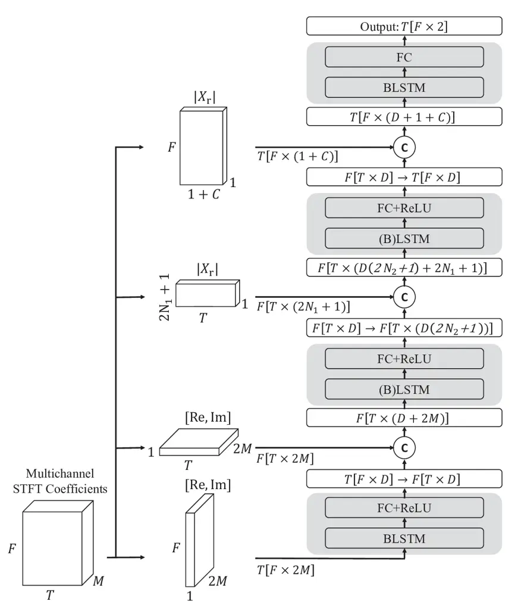

# McNet: Fuse Multiple Cues for Multichannel Speech Enhancement

Yujie Yang    Changsheng Quan    Xiaofei Li ^(†)^(†)thanks: ^(\#) equal
contribution, \* corresponding author

###### Abstract

In multichannel speech enhancement, both spectral and spatial
information are vital for discriminating between speech and noise. How
to fully exploit these two types of information and their temporal
dynamics remains an interesting research problem. As a solution to this
problem, this paper proposes a multi-cue fusion network named McNet,
which cascades four modules to respectively exploit the full-band
spatial, narrow-band spatial, sub-band spectral, and full-band spectral
information. Experiments show that each module in the proposed network
has its unique contribution and, as a whole, notably outperforms other
state-of-the-art methods.

###### Index Terms: 

multichannel speech enhancement, multi-cue fusion, spatial, spectral

^(†)^(†)address: ¹ Zhejiang University, Hangzhou, China  
² Westlake University & Westlake Institute for Advanced Study, Hangzhou,
China

## 1 Introduction

Speech enhancement aims to separate target speech from background noise,
which is widely used in various applications, such as mobile
telecommunication and hearing aids, and also serves as a front-end
module for automatic speech recognition. Deep learning has been
successfully used for single-channel speech enhancement \[1, 2, 3, 4,
5\]. These methods mainly exploit the differences in spectral patterns
between speech and noise, and enhance noisy speech by building up the
mapping network from noisy spectrogram to clean speech spectrogram.
Among these methods, our previously proposed FullSubNet \[2\] fuses a
full-band and sub-band network, where the former learns the full-band
spectral pattern (across-frequency dependencies) and the latter
discriminates speech and noise based on the local (sub-band) spectral
pattern and signal stationarity.

Multichannel speech enhancement can further leverage spatial
information. Beamforming (or spatial filtering) \[6\] is one leading
technique, which applies a linear spatial filter to the noisy
multichannel signals to suppress noise. The foundation of beamforming is
that speech and noise have different spatial correlations. Beamforming
is normally performed in narrow-band, as the spatial correlation of
speech and noise can be formulated for each individual frequency. Neural
beamforming \[7, 8\] first uses a neural network to predict the speech
presence of each time-frequency (T-F) bin, based on which the
beamforming parameters, i.e., the steering vector of speech and the
spatial covariance matrix of noise, can be estimated. To leverage the
spatial information, \[9, 10\] integrate the inter-channel features,
e.g., inter-channel phase/level differences (IPD/ILD), to the
single-channel speech enhancement networks. Many works \[11, 12\]
directly process the multichannel signals to simultaneously exploit
spectral and spatial information using some special network designs,
such as the channel attention (CA) in \[12\]. In our previous works
\[13, 11\], a network is proposed to focus on the narrow-band spatial
information, namely the difference of spatial correlation between speech
and noise formulated in narrow-band. \[14\] cascades a full-band network
with the narrow-band network to exploit the full-band information
simultaneously, and achieves the state-of-the-art (SOTA) performance.

Based on the researches discussed above, we have the following thoughts
about speech enhancement. (1) Spectral information is important for
discriminating between speech and noise, as speech and noise have
different spectral patterns. Spectral information is present in both
full-band and sub-band. Full-band spectral pattern is the major
information adopted by most of the single-channel speech enhancement
methods. Our previous works \[15, 2, 16\] showed that sub-bands are also
informative, in which the local spectral pattern and signal stationarity
(normally speech is non-stationary and many types of noise are
stationary) can be modeled. (2) Spatial information is also essential
for discriminating between speech and noise, as normally speech is
directional and spatially coherent while noise is diffuse or spatially
less correlated. Spatial information is also present in both narrow-band
and full-band. The spatial correlation of multichannel signals can be
formulated in narrow-band. Spatial cues have extremely strong
correlations across frequencies; for example, IPDs for different
frequencies are all derived from the time delays of multichannel
signals. (3) Spectral information and spatial information have their
respective temporal dynamics. The temporal dependencies of spectral
information reflect the signal content, while the temporal dynamic of
spatial information reflects the spatial setting of source sources.
Therefore, the amount of temporal contexts employed for spectral and
spatial information may differ.

This work develops a multichannel speech enhancement network to fully
exploit the spectral and spatial information mentioned above. The basic
strategy is to exploit each type of information with a dedicated
network. The single-channel FullSubNet \[2\] and multichannel FT-JNF
network \[14\] have proved that this strategy is effective for fusing
different types of information. Specifically, the proposed multi-cue
fusion network (named McNet) cascades four modules, including a
full-band spatial, narrow-band spatial, sub-band spectral and full-band
spectral module. Each module uses one layer of the LSTM network, by
which the temporal dynamic of each type of information can be properly
modeled. Compared with two SOTA networks, i.e., CA Dense U-net \[12\]
and FT-JNF \[14\], experiments show that the proposed network achieves
notably better speech enhancement performance.

## 2 METHOD

Multichannel speech signals can be written in the short-time Fourier
transform (STFT) domain as:

```math
\displaystyle X_{m}(t,f)=S_{m}(t,f)+N_{m}(t,f), \tag{1}
```

where $`m\in[1,M]`$, $`f\in[0,F-1]`$ and $`t\in[1,T]`$ denote the
microphone, frequency and time frame indices, respectively, and
$`X_{m}(t,f)`$, $`S_{m}(t,f)`$, and $`N_{m}(t,f)`$ are the STFT
coefficients of noisy speech, clean speech and interference noise,
respectively. Speech enhancement in this work aims to recover a single
reference channel (denoted as $`r`$) of clean speech, i.e.,
$`S_{r}(t,f)`$, given the noisy multichannel signals.



Figure 1: Diagram of McNet. The data dimensions are represented in such
a way: e.g., ”$`F[T\times 2M]`$” stands for $`F`$ independent sequences,
each with time steps of $`T`$ and vector dimension of $`2M`$. The right
arrow $`\xrightarrow{}`$ means reshape the dimensions. The letter $`C`$
within a circle means concatenation.

### 2.1 Network architecture

Fig. 1 shows the diagram of the proposed network, which cascades four
modules to exploit four different types of information, respectively.
The information type is controlled by feeding different forms of the
noisy signal to each module (together with the output of the previous
module). Feeding the original noisy signal to each module also overcomes
the problem that the previous modules may lose information. Each module
is composed of a (B)LSTM and a linear layer. The first two modules
exploit multichannel spatial information, while the last two exploit
single-channel spectral information. Next, we will present the four
modules one by one.

#### 2.1.1 Full-band spatial module

This module learns the correlation of spatial cues, such as IPD and ILD,
across frequencies. The input is the sequence of multi-channel STFT
coefficients along the frequency axis at one frame
$`{\mathbf{X}}_{1}(t)=(\mathbf{x}(t,0),\cdots,\mathbf{x}(t,F-1))`$,
where

```math
\displaystyle\mathbf{x}(t,f)=[ \displaystyle\text{Re}(X_{1}(t,f)),\text{Im}(X_{1}(t,f)),\cdots,
```

```math
\displaystyle\text{Re}(X_{M}(t,f)),\text{Im}(X_{M}(t,f))]^{\mathrm{T}}\in\mathbb{R}^{2M}, \tag{2}
```

is the concatenation of multichannel STFT coefficients,
$`\text{Re}(\cdot)`$ and $`\text{Im}(\cdot)`$ denote the real and
imaginary parts of complex number, respectively, and ^(T) denotes vector
transpose. The output of this module is denoted as
$`\mathbf{h}_{1}(t,f)\in\mathbb{R}^{D}`$ for one T-F bin. Different
frames are processed independently and share the same network.

Running the LSTM recurrence along frequencies will make this module
focus on the frequency dependencies in one frame. The single-frame
spectral information also presents, but we think it is not very
informative for speech enhancement, so this module focuses more on the
full-band spatial information. This module does not learn any temporal
dependencies, which is left for the next module.

#### 2.1.2 Narrow-band spatial module

The second module exploits the narrow-band spatial information and also
builds up the temporal evolution of the output of module 1. The input is
a temporal sequence at one frequency:
$`{\mathbf{X}}_{2}(f)=(\mathbf{x}_{2}(1,f),\cdots,\mathbf{x}_{2}(T,f))`$,
where

```math
\displaystyle\mathbf{x}_{2}(t,f)=[\mathbf{x}(t,f)^{\mathrm{T}},\mathbf{h}_{1}(t,f)^{\mathrm{T}}]^{\mathrm{T}}\in\mathbb{R}^{2M+D} \tag{3}
```

is the concatenation of multichannel STFT coefficients and the output of
module 1. The output of this module is denoted as
$`\mathbf{h}_{2}(t,f)\in\mathbb{R}^{D}`$ for one T-F bin. Different
frequencies are processed independently, and share the same network.

The first two modules together follow a similar spirit as the FT-JNF
network \[14\]. The major difference is that, besides the output of
module 1, we also feed the narrow-band noisy signals to the second
module, as the first module may lose some narrow-band information.

#### 2.1.3 Sub-band spectral module

The third module exploits the sub-band (composed of multiple STFT
frequencies) spectral information, mainly including the sub-band
spectral pattern. The same as the second module, different frequencies
are processed independently, and share the same network. For one frame,
the input vector is composed of the spectral magnitude of the reference
channel of one frequency and its $`2N_{1}`$ adjacent frequencies, and
the output of the second module of this frequency and its $`2N_{2}`$
adjacent frequencies.

```math
\displaystyle\mathbf{x}_{3}(t,f) \displaystyle=[\lvert X_{r}(t,f-N_{1})\rvert,\cdots,\lvert X_{r}(t,f),\rvert,\cdots,
```

```math
\displaystyle\lvert X_{r}(t,f+N_{1})\rvert,\mathbf{h}_{2}(t,f-N_{2}),\cdots,\mathbf{h}_{2}(t,f),
```

```math
\displaystyle\cdots,\mathbf{h}_{2}(t,f+N_{2})]\in\mathbb{R}^{(2N_{1}+1)+D(2N_{2}+1)}, \tag{4}
```

where $`\lvert\cdot\rvert`$ denotes absolute value. Its temporal
sequence is
$`{\mathbf{X}}_{3}(f)=(\mathbf{x}_{3}(1,f),\cdots,\mathbf{x}_{3}(T,f))`$.
The output is denoted as $`\mathbf{h}_{3}(t,f)\in\mathbb{R}^{D}`$ for
one T-F bin.

Signal stationarity is one important cue for discriminating between
speech and noise, which is intensively leveraged in the
spectral-subtraction-like methods \[17\]. Signal stationarity is present
in the single-channel narrow-band magnitude spectra. This sub-band
module and the previous narrow-band module both involve the
single-channel narrow-band magnitude spectra, and thus are both
responsible for exploiting the signal stationarity.

#### 2.1.4 Full-band spectral module

The last module exploits the full-band spectral pattern (and its
temporal contexts) and collects/integrates the information obtained from
the previous sub-band module across frequencies. The input sequence is
organized along the frequency axis for each frame as
$`{\mathbf{X}}_{4}(t)=(\mathbf{x}_{4}(t,0),\cdots,\mathbf{x}_{4}(t,F-1))`$.
The input vector for online speech enhancement is

```math
\displaystyle\mathbf{x}_{4}(t,f)=[\lvert X_{r}(t-C,f)\rvert,\cdots,\lvert X_{r} \displaystyle(t,f)\rvert,\mathbf{h}_{3}(t,f)^{\mathrm{T}}]^{\mathrm{T}}
```

```math
\displaystyle\in\mathbb{R}^{C+1+D} \tag{5}
```

where $`C`$ denotes the number of context frames. For the offline case,
the future $`C`$ frames will also be concatenated into
$`\mathbf{x}_{4}(t,f)`$, and the vector dimension will then be
$`2C+1+D`$. The temporal dependencies of the full-band spectral pattern
are mainly present for a small number of consecutive frames possibly
within one phoneme, so this module concatenates several context frames
and runs the LSTM recurrence along the frequency axis to learn better
frequency dependencies.

Complex Ideal Ratio Mask (cIRM) \[18\] is adopted as the learning target
since it is well suitable for both single-channel and multichannel
speech enhancement. Accordingly, the output of the last module is
denoted as $`\mathbf{y}_{r}(t,f)\in\mathbb{R}^{2}`$ for one T-F bin,
based on which the enhanced speech can be obtained.

### 2.2 Network configurations

The proposed network can perform both online and offline speech
enhancement. For the first and fourth modules that run the LSTM
recurrence along the frequency axis, bidirectional LSTM is applied for
both online and offline processing. For the second and third modules
that run the LSTM recurrence along the time axis, unidirectional and
bidirectional LSTMs are used for online and offline processing,
respectively.

The noisy multichannel signals are normalized before being processed by
the network. Specifically, $`X_{m}(t,f)`$ is normalized with the
magnitude mean $`\mu`$ of reference channel as $`X_{m}(t,f)/\mu`$. For
offline processing, $`\mu`$ is simply computed as
$`\frac{1}{T}\frac{1}{F}\sum_{t=1}^{T}\sum_{f=0}^{F-1}\lvert X_{r}(t,f)\rvert`$.
For online processing, $`\mu`$ is recursively computed as
$`\mu(t)=\alpha\mu(t-1)+(1-\alpha)\frac{1}{F}\sum_{f=0}^{F-1}\lvert X_{r}(t,f)\rvert`$,
where the smoothing parameter $`\alpha=\frac{L-1}{L+1}`$ is set to
approximate a $`L`$-long smoothing window.

## 3 EXPERIMENTS

### 3.1 Experimental setup

Dataset Experiments are conducted on the simulated dataset of the third
CHiME challenge \[19\]. This dataset consists of 7,138, 1,640, and 1,320
utterances for training, development, and test, respectively. The
sampling rate is 16 kHz. Data are recorded with a tablet device equipped
with 6 microphones. Multichannel background noise are recorded in four
environments, including a bus, cafe, pedestrian area, and street
junction. We use the official script of the CHiME challenge to generate
the simulated dataset. Except that, to make the simulated data more
suitable for network training, the training data are generated on the
fly with randomly selected noise clips with a signal-to-noise ratio
(SNR) randomly chosen from the range of \[-5,10\] dB. Note that the
multichannel speech signals for training and test are simulated by
delaying single-channel speech utterances, thence they are reverberation
free.

| Method                     | NB-PESQ | WB-PESQ | STOI | SDR  |
| -------------------------- | ------- | ------- | ---- | ---- |
| Noisy                      | 1.82    | 1.27    | 87.0 | 7.5  |
| MNMF Beamforming \* \[20\] | \-      | \-      | 94.0 | 16.2 |
| Oracle MVDR                | 2.49    | 1.94    | 97.0 | 17.3 |
| CA Dense U-net \* \[12\]   | \-      | 2.44    | \-   | 18.6 |
| Narrow-band Net \[11\]     | 2.74    | 2.13    | 95.0 | 16.6 |
| FT-JNF \[14\]              | 3.17    | 2.48    | 96.2 | 17.7 |
| McNet (prop.)              | 3.38    | 2.73    | 97.6 | 19.6 |

Table 1: Performance of offline speech enhancement.  
\* means scores are quoted from the original papers.

| Method                 | NB-PESQ | WB-PESQ | STOI | SDR  |
| ---------------------- | ------- | ------- | ---- | ---- |
| Noisy                  | 1.82    | 1.27    | 87.0 | 7.5  |
| Narrow-band Net \[11\] | 2.70    | 2.15    | 94.7 | 16.0 |
| FT-JNF \[14\]          | 2.80    | 2.23    | 95.4 | 16.9 |
| McNet (prop.)          | 3.29    | 2.67    | 97.2 | 19.0 |

Table 2: Performance of online speech enhancement.

Configurations STFT is performed using a 512-sample (32ms) Hanning
window with a frame step of 256 samples. We set the length of utterances
used for training fixed as $`T=192`$ frames (around 3s). The numbers of
hidden units are set to 128, 256, 384, and 128 for (each direction of)
the LSTM layer of four modules, respectively. The output dimensions of
the first three modules are all set to $`D=64`$. The number of adjacent
frequencies used for the third module are $`N_{1}=3`$ and $`N_{2}=2`$.
The number of context frames for the fourth module is $`C=5`$. The
length of the smoothing window is set to $`L=192`$ to be consistent with
the length of training utterances. We take channel No. 5 as the
reference channel.

Adam is used as the optimizer, and gradient clipping with maximum
$`L_{2}`$-norm of 5 is applied. An exponential decay learning schedule
is used with an initial learning rate of 0.001 and a decaying factor of
0.992. The batch size is set to 3. We train our models until
convergence, which takes almost 500 epochs. Four evaluation metrics are
used: NB-PESQ and WB-PESQ \[21\], STOI \[22\] and SDR \[23\]. Code and
some speech examples are available on our website ¹¹ 1
https://github.com/Audio-WestlakeU/McNet.

Comparison methods We compare with the following multichannel speech
enhancement methods. (1) MNMF Beamforming \[20\] is an unsupervised
speech enhancement method, first using multichannel nonnegative matrix
factorization (MNMF) to estimate the spatial covariance matrices of
speech and noise, then performing beamforming for speech enhancement.
(2) Oracle Minimum Variance Distortionless Response (MVDR) ²² 2
https://github.com/Enny1991/beamformers uses the ground-truth spatial
covariance matrices of noise, which is supposed to obtain the
upper-bound performance of all MVDR-based beamforming methods. (3) CA
Dense U-net \[12\] uses Channel Attention (CA) to perform non-linear
spatial filtering, in the framework of Dense U-Net. (4) Narrow-band Net
\[11\] is one of our previous works that uses two layers of LSTM to only
exploit the narrow-band spatial information (like the second module of
the proposed network). (5) FT-JNF \[14\]: Kristina et al. revised the
Narrow-band Net \[11\] by replacing the first LSTM with an
along-frequency LSTM to further exploit the full-band information (like
the first and second modules together of the proposed network).

| Method                 | NB-PESQ | WB-PESQ | STOI | SDR  |
| ---------------------- | ------- | ------- | ---- | ---- |
| Noisy                  | 1.82    | 1.27    | 87.0 | 7.5  |
| McNet (prop.)          | 3.29    | 2.67    | 97.2 | 19.0 |
| \- full-band spatial   | 3.24    | 2.61    | 97.1 | 18.7 |
| \- narrow-band spatial | 3.16    | 2.51    | 96.7 | 18.3 |
| \- sub-band spectral   | 3.25    | 2.57    | 96.9 | 18.2 |
| \- full-band spectral  | 3.18    | 2.52    | 96.7 | 18.5 |

Table 3: Results of Ablation Studies.

### 3.2 Speech enhancement results

Table 1 shows the offline speech enhancement results. CA Dense U-net,
FT-JNF and the proposed model outperform MNMF beamforming and even
oracle MVDR, which shows the superiority of supervised methods for
multichannel speech enhancement. Compared to Narrow-band Net, FT-JNF
largely improves the performance by using the along-frequency LSTM layer
to exploit full-band information. On top of FT-JNF, the proposed model
adds two single-channel LSTM layers dedicated to respectively exploit
the sub-band and full-band spectral information, which again largely
improves the performance. This verifies that the spectral information is
complementary to the spatial information, as long as the spectral
information can be fully used. Table 2 shows the online speech
enhancement results. Not surprisingly, the online performance measures
are not as good as the ones of the offline case. The proposed model
still achieves excellent results, which are even better than the offline
results of comparison methods. This means, when the information of
multiple cues (spatial and spectral; full-band, sub-band and
narrow-band) are fully exploited, speech enhancement can be well
conducted even without using future information.

Ablation studies Table 3 shows the results of ablation studies for the
online speech enhancement case. The effectiveness of the four modules is
verified by removing each of them. It can be seen that the performance
measures are decreased when any module is removed, which indicates that
there is no module being redundant in the proposed network. Among the
four modules, the narrow-band spatial and full-band spectral modules
seem more important.

## 4 CONCLUSION

In this paper, we propose a multi-cue fusion network named McNet, for
multichannel speech enhancement. It cascades four modules dedicated to
respectively exploit the full-band spatial, narrow-band spatial,
sub-band spectral, and full-band spectral information. This cascading
architecture can effectively accumulate information. The proposed
network achieves excellent speech enhancement performance, especially
for the online case.

## References

- \[1\] DeLiang Wang and Jitong Chen, “Supervised speech separation
  based on deep learning: An overview,” IEEE/ACM Transactions on Audio,
  Speech, and Language Processing, vol. 26, no. 10, pp. 1702–1726, 2018.
- \[2\] Xiang Hao, Xiangdong Su, Radu Horaud, and Xiaofei Li,
  “Fullsubnet: A full-band and sub-band fusion model for real-time
  single-channel speech enhancement,” in ICASSP, 2021, pp. 6633–6637.
- \[3\] Yangyang Xia, Sebastian Braun, Chandan K. A. Reddy,
  Harishchandra Dubey, Ross Cutler, and Ivan Tashev, “Weighted speech
  distortion losses for neural-network-based real-time speech
  enhancement,” in ICASSP, 2020, pp. 871–875.
- \[4\] Yanxin Hu, Yun Liu, Shubo Lv, Mengtao Xing, Shimin Zhang, Yihui
  Fu, Jian Wu, Bihong Zhang, and Lei Xie, “DCCRN: Deep Complex
  Convolution Recurrent Network for Phase-Aware Speech Enhancement,” in
  Interspeech, 2020, pp. 2472–2476.
- \[5\] Andong Li, Chengshi Zheng, Lu Zhang, and Xiaodong Li, “Glance
  and gaze: A collaborative learning framework for single-channel speech
  enhancement,” Applied Acoustics, vol. 187, pp. 108499, 2022.
- \[6\] Shmulik Markovich-Golan, Walter Kellermann, and Sharon Gannot,
  Spatial Filtering, chapter 10, pp. 189–217, John Wiley & Sons,
  Ltd, 2018.
- \[7\] Jahn Heymann, Lukas Drude, Aleksej Chinaev, and Reinhold
  Haeb-Umbach, “Blstm supported gev beamformer front-end for the 3rd
  chime challenge,” in ASRU, 2015, pp. 444–451.
- \[8\] Hakan Erdogan, John R. Hershey, Shinji Watanabe, Michael I.
  Mandel, and Jonathan Le Roux, “Improved MVDR Beamforming Using
  Single-Channel Mask Prediction Networks,” in Interspeech, 2016, pp.
  1981–1985.
- \[9\] Xueliang Zhang and DeLiang Wang, “Deep learning based binaural
  speech separation in reverberant environments,” IEEE/ACM Transactions
  on Audio, Speech, and Language Processing, vol. 25, no. 5, pp.
  1075–1084, 2017.
- \[10\] Zhong-Qiu Wang and DeLiang Wang, “Combining spectral and
  spatial features for deep learning based blind speaker separation,”
  IEEE/ACM Transactions on Audio, Speech, and Language Processing, vol.
  27, no. 2, pp. 457–468, 2019.
- \[11\] Xiaofei Li and Radu Horaud, “Narrow-band deep filtering for
  multichannel speech enhancement,” arXiv preprint
  arXiv:1911.10791, 2019.
- \[12\] Bahareh Tolooshams, Ritwik Giri, Andrew H. Song, Umut Isik, and
  Arvindh Krishnaswamy, “Channel-attention dense u-net for multichannel
  speech enhancement,” in ICASSP, 2020, pp. 836–840.
- \[13\] Xiaofei Li and Radu Horaud, “Multichannel speech enhancement
  based on time-frequency masking using subband long short-term memory,”
  in WASPAA. IEEE, 2019, pp. 298–302.
- \[14\] Kristina Tesch and Timo Gerkmann, “Insights into deep
  non-linear filters for improved multi-channel speech enhancement,”
  arXiv preprint arXiv:2206.13310, 2022.
- \[15\] Xiaofei Li and Radu Horaud, “Online Monaural Speech Enhancement
  Using Delayed Subband LSTM,” in Interspeech, 2020, pp. 2462–2466.
- \[16\] Feifei Xiong, Weiguang Chen, Pengyu Wang, Xiaofei Li, and
  Jinwei Feng, “Spectro-Temporal SubNet for Real-Time Monaural Speech
  Denoising and Dereverberation,” in Interspeech, 2022, pp. 931–935.
- \[17\] Xuchu Hou, Shengnan Guo, Huij Cui, K. Tang, and Ye Li, “Speech
  enhancement for non-stationary noise environments,” in 2009
  International Conference on Information Engineering and Computer
  Science, 2009, pp. 1–3.
- \[18\] Donald S. Williamson, Yuxuan Wang, and DeLiang Wang, “Complex
  ratio masking for monaural speech separation,” IEEE/ACM Transactions
  on Audio, Speech, and Language Processing, vol. 24, no. 3, pp.
  483–492, 2016.
- \[19\] Jon Barker, Ricard Marxer, Emmanuel Vincent, and Shinji
  Watanabe, “The third ‘chime’ speech separation and recognition
  challenge: Dataset, task and baselines,” in ASRU, 2015, pp. 504–511.
- \[20\] Kazuki Shimada, Yoshiaki Bando, Masato Mimura, Katsutoshi
  Itoyama, Kazuyoshi Yoshii, and Tatsuya Kawahara, “Unsupervised speech
  enhancement based on multichannel nmf-informed beamforming for
  noise-robust automatic speech recognition,” IEEE/ACM Transactions on
  Audio, Speech, and Language Processing, vol. 27, no. 5, pp.
  960–971, 2019.
- \[21\] A.W. Rix, J.G. Beerends, M.P. Hollier, and A.P. Hekstra,
  “Perceptual evaluation of speech quality (pesq)-a new method for
  speech quality assessment of telephone networks and codecs,” in
  ICASSP, 2001, vol. 2, pp. 749–752 vol.2.
- \[22\] Cees H. Taal, Richard C. Hendriks, Richard Heusdens, and Jesper
  Jensen, “An algorithm for intelligibility prediction of time–frequency
  weighted noisy speech,” IEEE Transactions on Audio, Speech, and
  Language Processing, vol. 19, no. 7, pp. 2125–2136, 2011.
- \[23\] E. Vincent, R. Gribonval, and C. Fevotte, “Performance
  measurement in blind audio source separation,” IEEE Transactions on
  Audio, Speech, and Language Processing, vol. 14, no. 4, pp.
  1462–1469, 2006.
