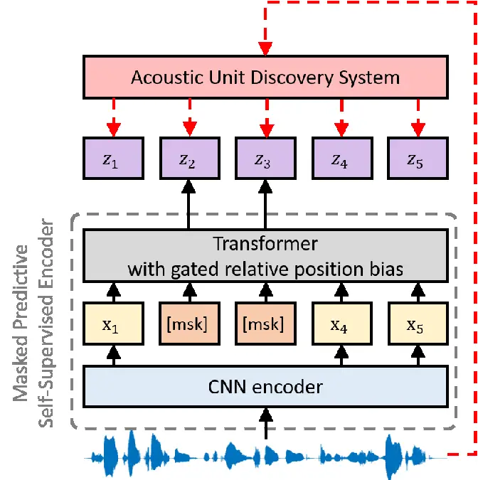
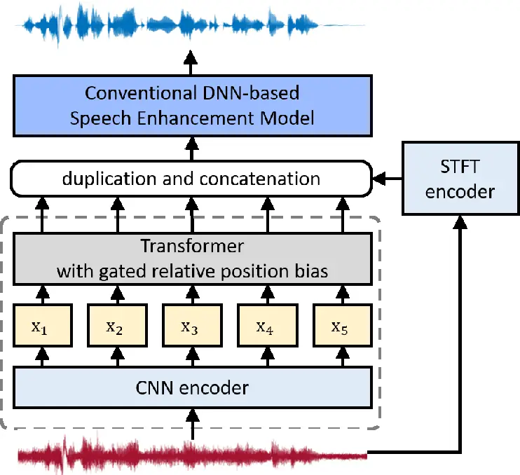

# Exploring WavLM on Speech Enhancement

Hyungchan Song, Sanyuan Chen, Zhuo Chen, Yu Wu, Takuya Yoshioka, Min
Tang, Jong Won Shin, Shujie Liu ^(†)^(†)thanks: \$\*\$ This work was
done during internship.^(†)^(†)thanks: This work was partly supported by
Institute for Information & communications Technology Promotion (IITP)
grant funded by the Korea government (MSIP) (No.2021-0-01696,
High-Potential Individuals Global Training Program) and Microsoft
Research Asia.

###### Abstract

There is a surge in interest in self-supervised learning approaches for
end-to-end speech encoding in recent years as they have achieved great
success. Especially, WavLM showed state-of-the-art performance on
various speech processing tasks. To better understand the efficacy of
self-supervised learning models for speech enhancement, in this work, we
design and conduct a series of experiments with three resource
conditions by combining WavLM and two high-quality speech enhancement
systems. Also, we propose a regression-based WavLM training objective
and a noise-mixing data configuration to further boost the downstream
enhancement performance. The experiments on the DNS challenge dataset
and a simulation dataset show that the WavLM benefits the speech
enhancement task in terms of both speech quality and speech recognition
accuracy, especially for low fine-tuning resources. For the high
fine-tuning resource condition, only the word error rate is
substantially improved.

###### Index Terms: 

self-supervised learning, speech enhancement, fine-tuning

^(†)^(†)address: ¹Gwanju Institute of Science and Technology, Republic
of Korea  
²Microsoft, China  
³Microsoft, USA

## 1 Introduction

In the field of natural language processing and computer vision,
self-supervised learning (SSL) approaches have been proposed to learn
universal useful representations, which benefit a variety of downstream
tasks. Recently, SSL approaches for speech audio processing \[1, 2, 3,
4, 5, 6, 7\] have been proposed, focusing on phoneme classification and
automatic speech recognition (ASR). Especially, inspired by the masked
language model \[8\], the masked predictive SSL approaches have achieved
great success in various speech processing downstream tasks. Unlike
previous work that designs SSL and unsupervised learning approaches for
certain tasks, e.g. speech enhancement \[9, 10, 11\], the wav2vec
2.0 \[3\], HuBERT \[4\], Unispeech-SAT \[12\], and WavLM \[13\] models
are task agnostic, which serve various downstream tasks with the same
model.

Although WavLM showed state-of-the-art performance in Speech processing
Universal PERformance Benchmark (SUPERB) \[14\], its improvement on
speech enhancement demonstrates a different trend from other tasks such
as ASR. Only 0.1 PESQ improvement is observed against the fbank baseline
even when a large SSL model is integrated. This observation can also be
found for other high-quality SSL models in SUPERB evaluation. Therefore,
it is non-trivial to further understand the impact of task-agnostic
pre-trained models for speech enhancement. Unlike classification-based
tasks such as speech or speaker recognition, speech enhancement requires
the model to estimate continuous denoised speech. As most
state-of-the-art SSL pre-trained models employ a
classification/prediction-based objective function, which potentially
mismatches the continuous nature of the enhancement task, sub-optimum
fine-tuning results might be obtained by a simple combination.
Therefore, an SSL objective function that is more aligned with speech
enhancement is also worth exploring.





Figure 1: An illustration of (a) the pre-training stage of WavLM and (b)
the fine-tuning stage for speech enhancement. The masked predictive
self-supervised encoder is identical in both stages.

To answer these questions, in this work, we design and conduct a series
of experiments, by combining WavLM or its variants with two high-quality
speech enhancement systems under different data conditions.
Specifically, three scenarios are considered in this work: 1) low
fine-tuning resource, 2) high fine-tuning resource, and 3) low
pre-training and fine-tuning resource. Meanwhile, we propose a
regression-based WavLM objective variant, where the network is optimized
in an unsupervised fashion to predict the continuous output for the
masked region from the input signal. A noise mixture training scheme is
also explored, by randomly mixing additional noise clips to the input
unlabeled speech during the SSL pre-training stage.

In our evaluation with the DNS challenge dataset \[15\] and a simulation
dataset, we found that the WavLM pre-trained model significantly
improved the downstream speech enhancement in both speech quality and
word error rate (WER) for all the low-resource scenarios. For the
high-resource scenarios, we observed a different trend for the WER and
speech quality metrics, where the former still benefited from the SSL
pre-trained model, while the latter only had minor improvements even
with a large-scale WavLM. With the proposed regression-based WavLM model
and noise mixing training strategy, better performance was observed for
all conditions. Finally, we observed that the enhancement task was
insensitive to the pre-training scale, where WavLM pre-trained with 960
hours and WavLM pre-trained with 94k hours showed similar performance.

## 2 Method

Based on the review of WavLM, in this section, we introduce the proposed
regression loss and noise mixing training, followed by our exploration
design in different conditions according to the amount of speech or
noise. Fig. 1 illustrates the WavLM pre-training stage and the speech
enhancement fine-tuning stage.

### 2.1 WavLM

The WavLM \[13\] model inspired by HuBERT \[4\] contains two main
networks as follows: a CNN encoder and a Transformer \[16\] with $`L`$
blocks. During training, some frames of the CNN encoder output
$`\mathbf{x}`$ are masked randomly and fed to the Transformer as input.
The Transformer is optimized to predict the discrete target sequence
$`\mathbf{z}`$, in which each $`z_{t}\in[C]`$ is a $`C`$-class
categorical variable. The distribution over the classes is parameterized
with

```math
p(c|\mathbf{h}_{t})=\frac{\exp(\mathrm{sim}(\mathbf{W}^{P}\mathbf{h}^{L}_{t},\mathbf{e}_{c})/\tau)}{\sum_{c^{\prime}=1}^{C}\exp(\mathrm{sim}(\mathbf{W}^{P}\mathbf{h}^{L}_{t},\mathbf{e}_{c^{\prime}})/\tau)} \tag{1}
```

where $`\mathbf{W}^{P}`$ is a projection matrix, $`\mathbf{h}^{L}_{t}`$
is the output hidden state for step $`t`$, $`\mathbf{e}_{c}`$ is the
embedding for class $`c`$, $`\mathrm{sim}(a,b)`$ means the cosine
similarity between $`a`$ and $`b`$, and $`\tau=0.1`$ scales the logit.
The prediction loss is applied over only masked regions, which forces
the model to learn a combined acoustic and language model over the
continuous inputs. In this work, the gated relative position bias \[17\]
is employed to improve the performance of the Transformer, which is
encoded based on the offset between the “key” and “query” in the
self-attention modules of the Transformer. In this paper, we use WavLM
Base+ of \[13\] as the pre-trained model, which was trained on both
non-mixed and mixed utterances with the probability of the latter being
0.1.

### 2.2 Regression Loss and Noise Mixing Training

The WavLM aims to predict short window phonetic units, which are well
correlated with phoneme units, thus leading to a significant performance
boost for classification-based downstream tasks. However, such a
phonetic unit often ignores speech features such as pitch, tone,
emotions, etc, which can be important for speech enhancement. To capture
these features, we design a regression-based WavLM objective function.
As with an enhancement fine-tuning network, the proposed regression
WavLM loss function $`\mathcal{L}_{reg}`$ uses the L2 loss between clean
80-dimensional fbank $`\textbf{z}_{fbank,t}`$ and the projected latent
representation $`\textbf{W}^{P}\textbf{h}_{t}^{L}`$ over the masked
frames as follows:

```math
\mathcal{L}_{reg}(t)=\arg\min_{\textbf{W}^{P}\textbf{h}_{t}^{L}}(\textbf{W}^{P}\textbf{h}_{t}^{L}-\textbf{z}_{fbank,t})^{2} \tag{2}
```

To further improve the pre-training generalization, we introduce a
noise-mixing data configuration in the pre-training stage.
Following \[13\], for each input speech utterance, we uniformly sample a
noise clip from DNS’s noise set, crop it to a random length, and then
mix it with the input utterance at a random starting point with an
energy ratio sampled from the uniform distribution
$`\mathcal{U}(-5,20)`$ dB. Note that, as the data are unlabeled, the
additional noise can also be applied to noisy input.

### 2.3 Fine-tuning and Exploration Design

In all experiments, a simulation dataset is used for fine-tuning, where
the clean speech is sampled from the clean corpus of \[18\], while the
DNS noise \[15\] (total 181 hours) is selected as the noise source. In
the fine-tuning stage, we combine pre-trained WavLM or its variants with
an LSTM or Conformer enhancement model \[19\] as the task-specific
network for speech enhancement. The LSTM model consists of a CNN layer
and 3 bi-directional LSTM layers of 512 hidden units. The Conformer
architecture and setting are the same as conformer-based model
of \[19\]. The input feature for fine-tuning is the concatenation of a
noisy magnitude of STFT and a latent representation of the pre-training
encoder for each frame, where the pre-training feature is processed by
frame duplication as in \[13\] to synchronize with the fine-tuning
network. The frequency magnitude mask is selected as the fine-tuning
network output, with the L2 signal restoration loss \[20\] as the
objective.

It should be noted that, in this work, we don’t use more advanced
time-domain or complex-valued models \[21, 22, 23, 24, 25, 26\] for
fine-tuning, as the phase information is not considered in WavLM. Adding
phase modeling introduces additional variation, which is not the main
focus of this work. To explore the potential and limitation of WavLM for
speech enhancement, we designed three conditions according to the amount
of speech or noise as described below.

#### 2.3.1 Low fine-tuning resource

We first design experiments to find out how much information can
pre-trained WavLM models provide for scenarios with the limited
fine-tuning resource. Two scenarios are considered for this condition: a
limited speech scenario and a limited noise scenario. On the limited
amount of speech resource setup, we restrict the speech resource to only
10 hours and use the full noise resource for fine-tuning. On the other
hand, on the limited amount of noise resource setup, we limit the noise
resource to a 10% subset (18 hours) and use the full speech resource.

#### 2.3.2 High fine-tuning resource

The high fine-tuning resource setup uses a large-scale and high-quality
simulated dataset for fine-tuning to evaluate the potential of WavLM on
speech enhancement in a resource-rich setup. The dataset is described
in \[18\] and consists of around 1,000 hours of paired noisy and clean
speech samples with various noise and room impulse response (RIR)
conditions.

#### 2.3.3 Low pre-training and fine-tuning resource

To examine the impact that the pre-training data quantity has on the
enhancement performance, we limit the amount of both the pre-training
and fine-tuning resources here. In contrast to the huge amount of the
pre-training data described in \[13\], we train WavLM with only
LibriSpeech 960 hours in this setup to investigate the feasibility of
the low pre-training resources for speech enhancement. To see this, we
compare this setup with the first low fine-tuning resource setup in Sec.
2.3.1.

|                                                               |                   |                |       |       |                     |       |       |        |        |
| ------------------------------------------------------------- | ----------------- | -------------- | ----- | ----- | ------------------- | ----- | ----- | ------ | ------ |
| Model                                                         | Pre-training data | DNS3 test data |       |       | Simulated test data |       |       |        |        |
|                                                               |                   | SIG            | BAK   | OVR   | SIG                 | BAK   | OVR   | SDR    | WER    |
| Noisy                                                         | -                 | 3.776          | 3.208 | 3.114 | 3.837               | 2.976 | 3.098 | 3.598  | 24.721 |
| Oracle magnitude mask                                         | -                 | -              | -     | -     | 3.918               | 4.151 | 3.539 | 12.537 | 2.596  |
| Limited amount of speech resource setup (10 hours)            |                   |                |       |       |                     |       |       |        |        |
| LSTM                                                          | -                 | 3.689          | 3.687 | 3.110 | 3.708               | 3.553 | 3.105 | 6.292  | 27.446 |
| LSTM with WavLM                                               | 94 kh             | 3.747          | 3.858 | 3.217 | 3.795               | 3.733 | 3.227 | 7.402  | 24.569 |
| LSTM with WavLM m.n.                                          | 94 kh             | 3.733          | 3.817 | 3.176 | 3.769               | 3.705 | 3.180 | 7.310  | 24.048 |
| LSTM with WavLM reg.                                          | 94 kh             | 3.714          | 3.811 | 3.184 | 3.774               | 3.702 | 3.177 | 7.387  | 23.633 |
| LSTM with WavLM reg. & m.n.                                   | 94 kh             | 3.750          | 3.853 | 3.219 | 3.793               | 3.750 | 3.225 | 7.697  | 20.622 |
|   LSTM with WavLM reg.                                        | 960 h             | 3.716          | 3.758 | 3.156 | 3.746               | 3.612 | 3.156 | 6.847  | 25.931 |
| LSTM with WavLM reg. & m.n.                                   | 960 h             | 3.753          | 3.854 | 3.220 | 3.794               | 3.760 | 3.221 | 7.777  | 19.821 |
|   Conformer                                                   | -                 | 3.731          | 3.753 | 3.187 | 3.780               | 3.689 | 3.212 | 6.902  | 27.018 |
| Conformer with WavLM                                          | 94 kh             | 3.729          | 3.797 | 3.199 | 3.773               | 3.703 | 3.216 | 7.260  | 25.222 |
| Conformer with WavLM m.n                                      | 94 kh             | 3.745          | 3.813 | 3.213 | 3.812               | 3.751 | 3.252 | 7.592  | 24.204 |
| Conformer with WavLM reg.                                     | 94 kh             | 3.746          | 3.821 | 3.194 | 3.775               | 3.713 | 3.220 | 7.368  | 24.509 |
| Conformer with WavLM reg. & m.n.                              | 94 kh             | 3.744          | 3.824 | 3.218 | 3.806               | 3.771 | 3.251 | 7.730  | 20.720 |
|   Conformer with WavLM reg.                                   | 960 h             | 3.748          | 3.795 | 3.211 | 3.810               | 3.721 | 3.247 | 7.298  | 25.829 |
| Conformer with WavLM reg. & m.n.                              | 960 h             | 3.745          | 3.844 | 3.220 | 3.810               | 3.772 | 3.254 | 7.783  | 20.020 |
| Limited amount of noise resource setup (10 $`\%`$ noise data) |                   |                |       |       |                     |       |       |        |        |
| LSTM                                                          | -                 | 3.795          | 3.891 | 3.290 | 3.844               | 3.766 | 3.257 | 8.749  | 20.900 |
| LSTM with WavLM                                               | 94 kh             | 3.811          | 3.915 | 3.303 | 3.906               | 3.880 | 3.368 | 8.820  | 20.670 |
| LSTM with WavLM m.n.                                          | 94 kh             | 3.807          | 3.929 | 3.308 | 3.908               | 3.893 | 3.368 | 8.908  | 20.035 |
| LSTM with WavLM reg.                                          | 94 kh             | 3.803          | 3.922 | 3.314 | 3.912               | 3.911 | 3.397 | 8.906  | 20.517 |
| LSTM with WavLM reg. & m.n.                                   | 94 kh             | 3.818          | 3.938 | 3.325 | 3.936               | 3.932 | 3.411 | 9.105  | 17.610 |
|   LSTM with WavLM reg.                                        | 960 h             | 3.833          | 3.921 | 3.324 | 3.937               | 3.921 | 3.403 | 8.996  | 20.141 |
| LSTM with WavLM reg. & m.n.                                   | 960 h             | 3.828          | 3.947 | 3.326 | 3.944               | 3.959 | 3.418 | 9.246  | 16.810 |
|   Conformer                                                   | -                 | 3.841          | 3.918 | 3.323 | 3.982               | 3.937 | 3.446 | 8.954  | 19.006 |
| Conformer with WavLM                                          | 94 kh             | 3.841          | 3.922 | 3.333 | 3.984               | 3.941 | 3.455 | 9.066  | 18.692 |
| Conformer with WavLM m.n.                                     | 94 kh             | 3.845          | 3.933 | 3.343 | 3.989               | 3.942 | 3.458 | 9.079  | 18.552 |
| Conformer with WavLM reg.                                     | 94 kh             | 3.842          | 3.919 | 3.335 | 3.944               | 3.930 | 3.440 | 8.997  | 18.543 |
| Conformer with WavLM reg. & m.n.                              | 94 kh             | 3.861          | 3.960 | 3.345 | 3.978               | 3.952 | 3.456 | 9.184  | 16.869 |
|   Conformer with WavLM reg.                                   | 960 h             | 3.842          | 3.919 | 3.335 | 3.981               | 3.931 | 3.444 | 9.003  | 18.709 |
| Conformer with WavLM reg. & m.n.                              | 960 h             | 3.832          | 3.958 | 3.343 | 3.980               | 3.955 | 3.456 | 9.192  | 16.341 |

Table 1: Results on the low fine-tuning resource setup with WavLM and
its variants. The reg. and m.n denote the regression loss and noise
mixing training strategy, respectively.

|                                  |                |       |       |                     |       |       |        |        |
| -------------------------------- | -------------- | ----- | ----- | ------------------- | ----- | ----- | ------ | ------ |
| Model                            | DNS3 test data |       |       | Simulated test data |       |       |        |        |
|                                  | SIG            | BAK   | OVR   | SIG                 | BAK   | OVR   | SDR    | WER    |
| Noisy                            | 3.776          | 3.208 | 3.114 | 3.837               | 2.976 | 3.098 | 3.598  | 24.721 |
| Oracle magnitude mask            | -              | -     | -     | 3.918               | 4.151 | 3.539 | 12.537 | 2.596  |
|   LSTM                           | 3.834          | 4.079 | 3.414 | 3.933               | 4.009 | 3.412 | 9.630  | 19.198 |
| LSTM with WavLM                  | 3.847          | 4.073 | 3.416 | 3.941               | 4.012 | 3.418 | 9.753  | 18.008 |
| LSTM with WavLM m.n.             | 3.842          | 4.081 | 3.417 | 3.937               | 4.017 | 3.419 | 9.757  | 18.017 |
| LSTM with WavLM reg.             | 3.843          | 4.073 | 3.416 | 3.935               | 4.005 | 3.415 | 9.728  | 18.251 |
| LSTM with WavLM reg. & m.n.      | 3.848          | 4.094 | 3.424 | 3.942               | 4.024 | 3.426 | 9.800  | 17.521 |
|   Conformer                      | 3.850          | 4.090 | 3.437 | 3.978               | 4.079 | 3.493 | 9.714  | 16.641 |
| Conformer with WavLM             | 3.862          | 4.092 | 3.442 | 3.982               | 4.063 | 3.496 | 9.820  | 16.104 |
| Conformer with WavLM m.n.        | 3.862          | 4.091 | 3.446 | 3.981               | 4.056 | 3.491 | 9.812  | 16.279 |
| Conformer with WavLM reg.        | 3.863          | 4.097 | 3.460 | 3.984               | 4.071 | 3.497 | 9.839  | 16.087 |
| Conformer with WavLM reg. & m.n. | 3.860          | 4.099 | 3.450 | 3.979               | 4.062 | 3.498 | 9.884  | 15.982 |

Table 2: Results on the high fine-tuning resource setup with WavLM and
its variants pre-trained with 94k data. The reg. and m.n denote the
regression loss and noise mixing training strategy, respectively.

## 3 Experiment

### 3.1 Experiment Setup

We used the DNS challenge 3 blind test data (DNS3) \[15\] and a
simulated corpus to evaluate enhancement performance. The simulated test
set consisted of 60 hours of simulated audio with SNR ranging from
$`-10`$ dB to $`30`$ dB, taken from a clean speech signal of the
LibriSpeech test set and synthesized with an RIR. The simulated test
data mixed the clean speech with both Gaussian noise and non-stationary
noise. The non-stationary noise was generated by combining noise
recordings of SoundBible and Freesound \[27\] convolved with RIRs.

To see the impact of the WavLM on speech enhancement, we use the Deep
Noise Suppression Mean Opinion Score (DNSMOS) P.835 \[28\] as an
evaluation metric for both test data. Additionally, we evaluate the
signal-to-distortion ratio (SDR) and WER for the simulated test data as
the transcriptions and clean references are available. In the DNSMOS
P.835, there are three output scores: i) speech quality (SIG), ii)
background noise quality (BAK), and iii) overall quality (OVR). A higher
score indicates better enhancement quality. For the ASR evaluation, we
fed the enhanced speech to a pre-trained HuBERT-based ASR inference
model \[4\] with a 4-gram language model to calculate the WER. The
hyperparameters and setting of the ASR inference model are identical
with \[3\].

### 3.2 Evaluation Results for Low Fine-Tuning Resource

Table 1 shows the speech enhancement results using the WavLM pre-trained
with 94k hours in the low-resource setting, where reg. and m.n. denote
the regression loss and noise mixing strategy in pre-training,
respectively. In the limited amount of speech resource setup (10 hours),
we can observe WavLM helped substantially improve both the WER and
speech quality compared to the baseline. If we only apply either the
noise mixing or the regression during pre-training, the WER was further
reduced while there was no significant gain on the speech quality. The
best result was obtained by applying both the noise mixing and
regression loss, achieving a 0.1 DNSMOS OVR gain, a 1.4 SDR improvement,
and a relative 24.8$`\%`$ WER reduction for the LSTM task-specific
layers, indicating the effectiveness of SSL for the low-resource speech
enhancement scenario.

The results for the limited amount of noise setup (10% noise) are also
shown in the table. The best result achieved a 0.1 DNSMOS OVR gain, a
0.35 SDR improvement, and a relative 15.7$`\%`$ WER reduction with the
LSTM enhancement model. The overall performance improvements were
smaller than those of the previous experiment (i.e., the 10-hour setup).
This means that SSL can better compensate for the lack of sufficient
speech data for the enhancement. Nonetheless, it also provides modest
improvement when the noise training data are scarce.

### 3.3 Evaluation Results for High Fine-Tuning Resource

Table 2 shows the results for the high fine-tuning resource setting. The
best result achieved a 0.01 DNSMOS OVR gain, a 0.17 SDR improvement, and
a relative 8.7$`\%`$ WER reduction for the LSTM enhancement model. In
terms of DNSMOS, the speech enhancement model with SSL appears to have
approached the oracle mask performance, which may explain the limited
improvement. On the other hand, there was still a large WER gap between
the oracle mask and the enhancement models, and the pre-training helped
reduce this gap significantly.

In the high fine-tuning resource setting, WavLM variant with the noise
mixing strategy is better than the classification-based loss, in terms
of WER reduction and speech quality, which is consistent with the
observation in the low-resource setting. Unlike other speech downstream
tasks, the regression-based self-supervised learning loss is the best
one. A possible explanation is the regression-based loss with denoising
pre-training task is similar to the enhancement task, so the model will
learn related information.

### 3.4 Impact of Different Amounts of Pre-Training Data

Finally, we examine the impact of the quantity of the WavLM pre-training
data. For the regression-based WavLM with and without noise mixing, we
show the speech enhancement results based on the WavLM models trained on
the LibriSpeech 960 hours data in Table 1. By comparing these with the
corresponding results obtained with the WavLM models trained on the
94k-hour data, we can see that they produced similar speech enhancement
results despite the 100x scale difference in the pre-training data. We
argue that the lack of the performance improvement from using a larger
pre-training dataset can be attributed to the fact that
Libri-Light \[29\], which accounts for a large portion (60k hours) of
the 94-hours data, consists of noisy speech data with SNRs ranging
approximately between 0 dB and 20 dB. During the pre-training, these
noisy speech data were included as the clean prediction target. This may
have resulted in the lack of the speech enhancement performance
improvement. This phenomenon raises a limitation of the current
pre-training approach using a huge amount of noisy data, calling for the
development of more tailored pre-training methods.

## 4 Conclusions

In this paper, we explored the effect of WavLM on speech enhancement. We
proposed two WavLM modifications: using the regression-based training
objective and the noise mixing strategy during pre-training. In the
fine-tuning stage, we used WavLM as a feature extractor and applied
speech enhancement models as the task-specific layers, where we
considered two enhancement models to obtain generalizable insights. A
series of experiments were carried out to explore the efficacy of WavLM
and its variants under three conditions about the amount of data. The
fine-tuned models were evaluated on DNS3 and the simulated test data in
terms of both speech quality and WER. It was shown that WavLM provided
substantial speech enhancement improvement in terms of the WER while the
speech quality metric improvement was rather modest. The potential
limitation of the proposed pre-training approach was also discussed,
calling for further investigation to develop pre-training schemes that
are optimal for the speech enhancement tasks \[30, 31, 32\].

## References

- \[1\] S. Schneider, A. Baevski, R. Collobert, and M. Auli, “wav2vec:
  Unsupervised pre-training for speech recognition,” _Proceedings of
  Interspeech_, pp. 3465–3469, 2019.
- \[2\] A. Baevski, S. Schneider, and M. Auli, “vq-wav2vec:
  Self-supervised learning of discrete speech representations,” in
  _International Conference on Learning Representations_, 2019.
- \[3\] A. Baevski, Y. Zhou, A. Mohamed, and M. Auli, “wav2vec 2.0: A
  framework for self-supervised learning of speech representations,”
  _Advances in Neural Information Processing Systems_, vol. 33, pp.
  12 449–12 460, 2020.
- \[4\] W.-N. Hsu, B. Bolte, Y.-H. H. Tsai, K. Lakhotia,
  R. Salakhutdinov, and A. Mohamed, “Hubert: Self-supervised speech
  representation learning by masked prediction of hidden units,”
  _IEEE/ACM Transactions on Audio, Speech, and Language Processing_,
  vol. 29, pp. 3451–3460, 2021.
- \[5\] C. Wang, Y. Wu, Y. Qian, K. Kumatani, S. Liu, F. Wei, M. Zeng,
  and X. Huang, “Unispeech: Unified speech representation learning with
  labeled and unlabeled data,” in _International Conference on Machine
  Learning_. PMLR, 2021, pp. 10 937–10 947.
- \[6\] Y.-A. Chung, Y. Zhang, W. Han, C.-C. Chiu, J. Qin, R. Pang, and
  Y. Wu, “W2v-bert: Combining contrastive learning and masked language
  modeling for self-supervised speech pre-training,” in _2021 IEEE
  Automatic Speech Recognition and Understanding Workshop (ASRU)_. IEEE,
  2021, pp. 244–250.
- \[7\] C. Wang, Y. Wu, S. Liu, J. Li, Y. Qian, K. Kumatani, and F. Wei,
  “Unispeech at scale: An empirical study of pre-training method on
  large-scale speech recognition dataset,” _arXiv preprint
  arXiv:2107.05233_, 2021.
- \[8\] J. D. M.-W. C. Kenton and L. K. Toutanova, “Bert: Pre-training
  of deep bidirectional transformers for language understanding,” in
  _Proceedings of NAACL-HLT_, 2019, pp. 4171–4186.
- \[9\] R. E. Zezario, T. Hussain, X. Lu, H.-M. Wang, and Y. Tsao,
  “Self-supervised denoising autoencoder with linear regression decoder
  for speech enhancement,” in _International Conference on Acoustics,
  Speech and Signal Processing (ICASSP)_. IEEE, 2020, pp. 6669–6673.
- \[10\] Y. Qiu, R. Wang, S. Singh, Z. Ma, and F. Hou, “Self-supervised
  learning based phone-fortified speech enhancement,” _Proceedings of
  Interspeech_, pp. 211–215, 2021.
- \[11\] A. Sivaraman and M. Kim, “Efficient personalized speech
  enhancement through self-supervised learning,” _IEEE Journal of
  Selected Topics in Signal Processing_, 2022.
- \[12\] S. Chen, Y. Wu, C. Wang, Z. Chen, Z. Chen, S. Liu, J. Wu,
  Y. Qian, F. Wei, J. Li _et al._, “Unispeech-sat: Universal speech
  representation learning with speaker aware pre-training,” in
  _International Conference on Acoustics, Speech and Signal Processing
  (ICASSP)_. IEEE, 2022, pp. 6152–6156.
- \[13\] S. Chen, C. Wang, Z. Chen, Y. Wu, S. Liu, Z. Chen, J. Li,
  N. Kanda, T. Yoshioka, X. Xiao _et al._, “Wavlm: Large-scale
  self-supervised pre-training for full stack speech processing,” _IEEE
  Journal of Selected Topics in Signal Processing_, 2022.
- \[14\] S. wen Yang, P.-H. Chi, Y.-S. Chuang, C.-I. J. Lai,
  K. Lakhotia, Y. Y. Lin, A. T. Liu, J. Shi, X. Chang, G.-T. Lin, T.-H.
  Huang, W.-C. Tseng, K. tik Lee, D.-R. Liu, Z. Huang, S. Dong, S.-W.
  Li, S. Watanabe, A. Mohamed, and H. yi Lee, “Superb: Speech processing
  universal performance benchmark,” in _Proceedings of Interspeech_,
  2021, pp. 1194–1198.
- \[15\] C. K. Reddy, H. Dubey, K. Koishida, A. Nair, V. Gopal,
  R. Cutler, S. Braun, H. Gamper, R. Aichner, and S. Srinivasan,
  “Interspeech 2021 deep noise suppression challenge,” in _Proc.
  Interspeech_, 2021, pp. 2796–2800.
- \[16\] A. Vaswani, N. Shazeer, N. Parmar, J. Uszkoreit, L. Jones,
  A. N. Gomez, L. Kaiser, and I. Polosukhin, “Attention is all you
  need,” _Advances in neural information processing systems_,
  vol. 30, 2017.
- \[17\] Z. Chi, S. Huang, L. Dong, S. Ma, B. Zheng, S. Singhal,
  P. Bajaj, X. Song, X.-L. Mao, H.-Y. Huang _et al._, “Xlm-e:
  Cross-lingual language model pre-training via electra,” in
  _Proceedings of the 60th Annual Meeting of the Association for
  Computational Linguistics (Volume 1: Long Papers)_, 2022, pp.
  6170–6182.
- \[18\] S. Braun, H. Gamper, C. K. Reddy, and I. Tashev, “Towards
  efficient models for real-time deep noise suppression,” in
  _International Conference on Acoustics, Speech and Signal Processing
  (ICASSP)_. IEEE, 2021, pp. 656–660.
- \[19\] S. Chen, Y. Wu, Z. Chen, J. Wu, J. Li, T. Yoshioka, C. Wang,
  S. Liu, and M. Zhou, “Continuous speech separation with conformer,” in
  _International Conference on Acoustics, Speech and Signal Processing
  (ICASSP)_. IEEE, 2021, pp. 5749–5753.
- \[20\] S. Braun and I. Tashev, “A consolidated view of loss functions
  for supervised deep learning-based speech enhancement,” in _2021 44th
  International Conference on Telecommunications and Signal Processing
  (TSP)_. IEEE, 2021, pp. 72–76.
- \[21\] A. Défossez, G. Synnaeve, and Y. Adi, “Real time speech
  enhancement in the waveform domain,” in _Proceedings of Interspeech_,
  2020, pp. 3291–3295.
- \[22\] E. Kim and H. Seo, “Se-conformer: Time-domain speech
  enhancement using conformer,” in _Proceedings of Interspeech_, 2021,
  pp. 2736–2740.
- \[23\] Y. Hu, Y. Liu, S. Lv, M. Xing, S. Zhang, Y. Fu, J. Wu,
  B. Zhang, and L. Xie, “Dccrn: Deep complex convolution recurrent
  network for phase-aware speech enhancement,” in _Proceedings of
  Interspeech_, 2020, pp. 2472–2476.
- \[24\] S. Lv, Y. Hu, S. Zhang, and L. Xie, “Dccrn+: Channel-wise
  subband dccrn with snr estimation for speech enhancement,” in
  _Proceedings of Interspeech_, 2021, pp. 2816–2820.
- \[25\] Q. Li, F. Gao, H. Guan, and K. Ma, “Real-time monaural speech
  enhancement with short-time discrete cosine transform,” _arXiv
  preprint arXiv:2102.04629_, 2021.
- \[26\] E. Tzinis, Y. Adi, V. K. Ithapu, B. Xu, P. Smaragdis, and
  A. Kumar, “Remixit: Continual self-training of speech enhancement
  models via bootstrapped remixing,” _IEEE Journal of Selected Topics in
  Signal Processing_, 2022.
- \[27\] E. Fonseca, J. Pons Puig, X. Favory, F. Font Corbera,
  D. Bogdanov, A. Ferraro, S. Oramas, A. Porter, and X. Serra,
  “Freesound datasets: a platform for the creation of open audio
  datasets.” International Society for Music Information Retrieval
  (ISMIR).
- \[28\] C. K. Reddy, V. Gopal, and R. Cutler, “Dnsmos p. 835: A
  non-intrusive perceptual objective speech quality metric to evaluate
  noise suppressors,” in _International Conference on Acoustics, Speech
  and Signal Processing (ICASSP)_. IEEE, 2022, pp. 886–890.
- \[29\] J. Kahn, M. Riviere, W. Zheng, E. Kharitonov, Q. Xu, P.-E.
  Mazaré, J. Karadayi, V. Liptchinsky, R. Collobert, C. Fuegen _et al._,
  “Libri-light: A benchmark for asr with limited or no supervision,” in
  _International Conference on Acoustics, Speech and Signal Processing
  (ICASSP)_. IEEE, 2020, pp. 7669–7673.
- \[30\] Y.-C. Wang, S. Venkataramani, and P. Smaragdis,
  “Self-supervised learning for speech enhancement,” _arXiv preprint
  arXiv:2006.10388_, 2020.
- \[31\] Y. Xiang and C. Bao, “A parallel-data-free speech enhancement
  method using multi-objective learning cycle-consistent generative
  adversarial network,” _IEEE/ACM Transactions on Audio, Speech, and
  Language Processing_, vol. 28, pp. 1826–1838, 2020.
- \[32\] S. Wisdom, E. Tzinis, H. Erdogan, R. Weiss, K. Wilson, and
  J. Hershey, “Unsupervised sound separation using mixture invariant
  training,” _Advances in Neural Information Processing Systems_,
  vol. 33, pp. 3846–3857, 2020.
