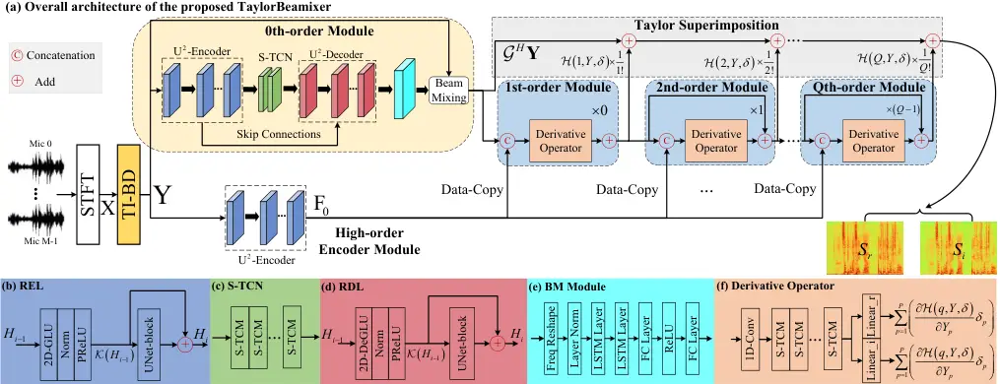
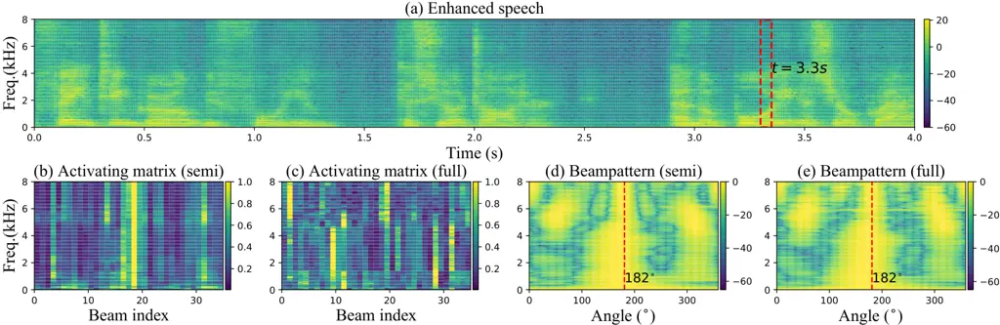

# TaylorBeamixer: Learning Taylor-Inspired All-Neural Multi-Channel Speech Enhancement from Beam-Space Dictionary Perspective

Andong Li^(⋆†)    Guochen Yu^(⋆)    Wenzhe Liu^(‡)    Xiaodong Li^(⋆†)
   Chengshi Zheng^(⋆†)

###### Abstract

Despite the promising performance of existing frame-wise all-neural
beamformers in the speech enhancement field, it remains unclear what the
underlying mechanism exists. In this paper, we revisit the beamforming
behavior from the beam-space dictionary perspective and formulate it
into the learning and mixing of different beam-space components. Based
on that, we propose an all-neural beamformer called TaylorBM to simulate
Taylor’s series expansion operation in which the 0th-order term serves
as a spatial filter to conduct the beam mixing, and several high-order
terms are tasked with residual noise cancellation for post-processing.
The whole system is devised to work in an end-to-end manner. Experiments
are conducted on the spatialized LibriSpeech corpus and results show
that the proposed approach outperforms existing advanced baselines in
terms of evaluation metrics.

###### Index Terms:

Multi-channel speech enhancement, Taylor’s approximation theory,
beam-space, dictionary learning, deep neural networks

^(†)^(†)address: ^(⋆) Key Laboratory of Noise and Vibration Research,
Institute of Acoustics, Chinese Academy  
of Sciences, Beijing, China  
^(†) University of Chinese Academy of Sciences, Beijing, China  
^(‡) Tencent Ethereal Audio Lab, Tencent Corporation, Shenzhen, China

## 1 Introduction

By virtue of the spatial information, multi-channel speech enhancement
(MC-SE) can effectively extract the target speech from the noisy mixture
and often leads to superior performance over the single-channel (SC)
case \[1, 2\], rendering it convenient for people to stay in connection
by remote communication systems during the COVID-19 pandemic period.

Recently, with the advent of deep neural networks (DNNs), we have
witnessed the proliferation of neural beamformers (NBFs) by leaps and
bounds, which make significant progress over traditional spatial filters
\[3, 4, 5, 6\]. Existing methods can be broadly broken into three
categories. The first class works in a hybrid mode, _i.e._, the
speech/noise mask is estimated by a general network, and a traditional
utterance- or batch-level beamformer is utilized for spatial filtering
\[3, 4\]. A critic is that the two modules are often separately tackled,
the performance is often limited and suffers from heavy degradation when
the frame-wise processing is required. The second one follows the
extraction-fusion protocol where the spectral and spatial cues are
explicitly/implicitly extracted, and the network serves as the fusion
module to combine both features in the non-linear space to derive the
target speech in an end-to-end (E2E) manner \[5, 7, 8, 9, 10\]. As a
natural extension of SC-SE, they often cause non-linear speech
distortion because the spatial discrimination property is not fully
utilized. For the third class, more recently, a few studies reveal the
potential and superiority of frame-wise all-neural beamformers in either
time-domain \[11\] or time-frequency (T-F) domain \[12, 13, 14\], where
DNNs are employed to replace or abstract part of the signal-processing
based operations to estimate the beamforming weights. As the beamforming
weights are non-linearly mapped frame by frame, less algorithmic delay
is required while the performance can be guaranteed under the E2E
training criterion.

To enable frame-wise all-neural beamformers, the spatial and spectral
modes are usually entangled in the non-linear feature space, and the
whole system is usually encapsulated into a black box, thus lacking
adequate interpretability and transparency \[14\]. As the first trial to
open up the box, in \[15\], we proposed to decouple the pipeline into
the superimposition of the spatial and spectral processing modes based
on Taylor’s approximation theory, where the 0th-order term corresponds
to the spatial filter and the remaining several high-order terms are
designed to cancel the residual interference in the spectral sense.
Despite the deep insight, we find it still unclear or even unknown where
does the generated spatial beam in the 0th-order term come from? In
other words, given the noisy complex spectra from the array as the
input, the estimated beam seems to be “created” from scratch via the
network without any explicit prior representations. In this study, we
revisit the spatial filtering behavior from the beam-space dictionary
perspective, and formulate the beamforming operation into the adaptive
activating and mixing of different basis beams in the beam-space domain
\[17\]. Based on that, we propose a novel all-neural beamformer called
TaylorBeamixer (abbreviated as TaylorBM) based on Taylor’s approximation
theory. Specifically, the 0th-order term serves as the spatial filter by
dynamically selecting and mixing the beam components with different
spatial responses. And multiple high-order terms are superimposed as the
residual noise canceller for post-processing. To enable the E2E
training, we replace the complicated derivative terms with trainable
modules. Compared with our preliminary work \[15\], we merely add one
differentiable layer with neglectable parameters. Nonetheless, it
provides a different and new perspective on the beamforming process and
also achieves on-par or better performance. We hope this work can take a
further step toward understanding the internal logic of the
white-box-oriented NBFs.

The rest of the paper is organized as follows. In Section 2, we
formulate the problem. In Section 3, the proposed method is presented.
Section 4 gives the experimental setup, and results and analysis are
presented in Section 5. Conclusions are drawn in Section 6.

## 2 PORBLEM FORMULATION

Given a recorded $`M`$-channel time-domain acoustic signal vector
$`\mathbf{x}\left(n\right)\in\mathbb{R}^{M}`$ in a reverberant and noisy
environment, the physical model after the short-time Fourier transform
(STFT) can be given:

```math
\mathbf{X}_{l,k}=\mathbf{c}_{k}S_{l,k}+\mathbf{V}_{l,k}+\mathbf{N}_{l,k}, \tag{1}
```

where
$`\left\{\mathbf{X}_{l,k},\mathbf{V}_{l,k},\mathbf{N}_{l,k}\right\}\in\mathbb{C}^{M}`$
denote the mixture, reverberation, and noise components in the frequency
index of $`k\in\left\{1,\cdots,K\right\}`$ and time index of
$`l\in\left\{1,\cdots,L\right\}`$. $`\mathbf{c}_{k}\in\mathbb{C}^{M}`$
is the acoutic transfer function (ATF) vector of speech and
$`S_{l,k}\in\mathbb{C}`$ is the complex spectrum of the clean speech.

To suppress the directional noise and reverberation components, the
beamforming technique is commonly adopted, given by

```math
\vskip-2.84544pt\widetilde{S}_{l,k}=\mathbf{W}_{l,k}^{\text{H}}\mathbf{X}_{l,k},\vskip-2.84544pt \tag{2}
```

where $`\mathbf{W}_{l,k}\in\mathbb{C}^{M}`$ denotes the beamforming
weights. $`\widetilde{\cdot}`$ and $`\left(\cdot\right)^{\text{H}}`$
denote the estimated variable and Hermitian transpose, respectively.

In \[18\], the adaptive beamformer was decomposed into the product of a
fixed beamformer (FB) and a post filter (PF):

```math
\vskip 0.0pt\mathbf{W}_{l,k}=\mathbf{B}_{\text{Fix},k}G_{l,k},\vskip 0.0pt \tag{3}
```

where $`\mathbf{B}_{\text{Fix},k}`$ is a time-invariant fixed beam and
$`G_{l,k}`$ is a controlling coefficient in each T-F bin. However, as
the desired speech source may appear in any spatial position with
different direction-of-arrivals (DOAs), it seems far from adequate to
track and approximate the adaptive beamformer with merely one set of FB
and PF. Towards this end, we revisit the beamforming process and
formulate it into the adaptive activating and mixing of a set of
beam-space components. Concretely, we define a time-invariant beam-space
dictionary (TI-BD)
$`\mathcal{B}=\left(\mathbf{B}_{1},\cdots,\mathbf{B}_{P}\right)\in\mathbb{C}^{K\times M\times P}`$,
where $`\mathbf{B}_{p}\in\mathbb{C}^{K\times M}`$ refers to the basis
beam with index $`p\in\left\{1,\cdots,P\right\}`$. To control the gain,
one can allocate each beam with a different activating coefficient, and
the activating matrix can be defined as
$`\mathcal{G}=\left(\mathbf{G}_{1},\cdots,\mathbf{G}_{P}\right)\in\mathbb{C}^{L\times K\times P}`$.
Therefore, the decomposition in Eq.(3) is converted into a more
generalized format, _i.e._,

```math
\vskip-5.69046pt\mathbf{W}_{l,k}=\sum_{p=1}^{P}\mathcal{B}_{k,:,p}\mathcal{G}_{l,k,p}.\vskip-5.69046pt \tag{4}
```

Recall that in the non-negative matrix factorization (NMF) based SE
methods \[19, 20\], a similar mathematical expression has been given,
but they are by no means the same thing. The major difference is that
the dictionary herein is built in the beam-space domain while the
dictionary in the NMF-based SE is built in the frequency domain.
Besides, the non-negative property does not hold herein as the spatial
beam is calculated in the complex-valued format.



Figure 1: The diagram of the proposed TaylorBM. Different modules are
remarked with different colors.

Substituting Eq.(4) into Eq.(2), one can get

```math
\vskip-2.84544pt\widetilde{S}_{l,k}=\sum_{p=1}^{P}\mathcal{G}^{\text{H}}_{l,k,p}Y_{l,k,p},\vskip-5.69046pt \tag{5}
```

where
$`Y_{l,k,p}\overset{\text{def}}{=}\mathcal{B}^{\text{H}}_{k,:,p}\mathbf{X}_{l,k}\in\mathbb{C}`$
refers to the obtained beam output by the $`p`$th basis beam. As such,
we provide a different insight toward the beamforming process, _i.e._,
the beamforming operation can be regarded as the mixing strategy within
the beam-space dictionary weighted by different activating coefficients.
This is in essence a type of dictionary learning \[21, 22\].

We expect the target speech to be distortionless after the beamforming,
_e.g._, minimum variance distortionless response (MVDR), the beamforming
output signal can thus be given by

```math
\vskip-2.84544pt\widetilde{S}_{l,k}=\sum_{p=1}^{P}\mathcal{G}^{\text{H}}_{l,k,p}Y_{l,k,p}=S_{l,k}+\sum_{p=1}^{P}\mathcal{G}^{\text{H}}_{l,k,p}\mathcal{B}^{\text{H}}_{k,:,p}\mathbf{R}_{l,k},\vskip-2.84544pt \tag{6}
```

where $`\mathbf{R}_{l,k}=\mathbf{V}_{l,k}+\mathbf{N}_{l,k}`$. Assuming
there exists a prior term $`\delta_{l,k,p}`$ for each beam, which aims
to cancel the residual noise after the summation, one can get

```math
\vskip-2.84544ptS_{l,k}=\sum_{p=1}^{P}\mathcal{G}_{l,k,p}^{\text{H}}\left(Y_{l,k,p}+\delta_{l,k,p}\right),\vskip-2.84544pt \tag{7}
```

where $`\delta_{l,k,p}=-\mathcal{B}^{\text{H}}_{l,k,p}\mathbf{R}_{l,k}`$
will be discussed later. One can see that if the each beam can introduce
the prior term and add it in advance, then we can recover the target
speech perfectly in theory. From now on, we will drop the subscript
$`\left\{l,k\right\}`$ if no confusion arises. We abstract the operation
of weighting each beam as a general function
$`F_{p}\left(\cdot\right)`$, and assume the function to be
differentiable to each order, then we can resolve Eq. (7) with infinite
Taylor’s series expansion at $`Y_{p}`$ as

```math
S=\sum_{p=1}^{P}F_{p}\left(Y_{p}\right)+\sum_{q=1}^{+\infty}\frac{1}{q!}\sum_{p=1}^{P}\frac{\partial^{q}F_{p}\left(Y_{p}\right)}{\partial^{q}Y_{p}}\delta_{p}^{q}, \tag{8}
```

where the 0th-order represents the behavior of spatial filtering and
high-order terms serve as the residual noise canceller for
post-processing. Note that in \[15\], a similar format was derived.
However, in this work, we provide a more intuitive explanation of the
beamforming behavior, _i.e._, a set of beam components are first
generated by the time-invariant beam-space dictionary in advance,
followed by an adaptive activating matrix to mix and estimate the target
spatial beam. In contrast, in \[15\], it remains unclear about the
internal mechanism of the time-variant beam generation.

## 3 Proposed Approach

### 3.1 Relation Between Adjacent Order Terms

In practical implementation, we usually truncate the order number into a
finite value, _i.e._, $`Q`$. To resolve Eq.(8), let us notate the
$`q`$th order term as $`\mathcal{H}\left(q,Y,\delta\right)`$, shown as

```math
\vskip-2.84544pt\mathcal{H}\left(q,Y,\delta\right)=\sum_{p=1}^{P}\frac{\partial^{q}F_{p}\left(Y_{p}\right)}{\partial^{q}Y_{p}}\delta_{p}^{q}.\vskip-2.84544pt \tag{9}
```

Note that the factorial term is dropped for convenience. To obtain the
relation between adjacent orders, we differentiate
$`\mathcal{H}\left(q,Y,\delta\right)`$ with respect to $`Y_{p}`$:

```math
\vskip-2.84544pt\frac{\partial\mathcal{H}\left(q,Y,\delta\right)}{\partial Y_{p}}=\frac{\partial}{\partial Y_{p}}\left(\frac{\partial^{q}F_{p}\left(Y_{p}\right)}{\partial^{q}Y_{p}}\delta_{p}^{q}\right)+\frac{\partial}{\partial Y_{p}}\left(\sum_{p^{{}^{\prime}}\neq p}\frac{\partial^{q}F_{p^{{}^{\prime}}}\left(Y_{p^{{}^{\prime}}}\right)}{\partial^{q}Y_{p^{{}^{\prime}}}}\delta_{p^{{}^{\prime}}}^{q}\right).\vskip-2.84544pt \tag{10}
```

Ideally, if each acoustic source lies within a different beam component,
neighboring beams can be approximately assumed as statistically mutually
independent. The more the number of microphones and beams, the better
the independence assumption can hold. Meanwhile, we can control the
orthogonality of beams by selecting a suitable beam-space dictionary. To
simplify the derivation, we assume the statistical independence between
$`Y_{p}`$ and $`Y_{p^{{}^{\prime}}}`$ for
$`\forall p^{{}^{\prime}}\neq p`$. Eq. (10) can then be further
converted according to the chain rule:

```math
\vskip-2.84544pt\frac{\partial\mathcal{H}\left(q,Y,\delta\right)}{\partial Y_{p}}=\frac{\partial}{\partial Y_{p}}\left(\frac{\partial^{q}F_{p}\left(Y_{p}\right)}{\partial^{q}Y_{p}}\right)\delta_{p}^{q}+\frac{\partial^{q}F_{p}\left(Y_{p}\right)}{\partial^{q}Y_{p}}\frac{\partial\delta_{p}^{q}}{\partial Y_{p}}.\vskip-2.84544pt \tag{11}
```

Notice that,

```math
\displaystyle\vskip-2.84544pt\sum_{p=1}^{P}\frac{\partial}{\partial Y_{p}}\left(\frac{\partial^{q}F_{p}\left(Y_{p}\right)}{\partial^{q}Y_{p}}\right)\delta^{(q+1)}_{p}=\mathcal{H}\left(q+1,Y,\delta\right), \tag{12}
```

```math
\displaystyle\sum_{p=1}^{P}\frac{\partial^{q}F_{p}\left(Y_{p}\right)}{\partial^{q}Y_{p}}\frac{\partial\delta_{p}^{q}}{\partial Y_{p}}\delta_{p}=-q\sum_{p=1}^{P}\frac{\partial^{q}F_{p}\left(Y_{p}\right)}{\partial^{q}Y_{p}}\delta^{q}_{p}=-q\mathcal{H}\left(q,Y,\delta\right).\vskip-2.84544pt \tag{13}
```

We can thus derive the recursive formula between
$`\mathcal{H}\left(q,Y,\delta\right)`$ and
$`\mathcal{H}\left(q+1,Y,\delta\right)`$ as

```math
\mathcal{H}\left(q+1,Y,\delta\right)=q\mathcal{H}\left(q,Y,\delta\right)+\sum_{p=1}^{P}\frac{\partial\mathcal{H}\left(q,Y,\delta\right)}{\partial Y_{p}}\delta_{p}.\vskip-2.84544pt \tag{14}
```

One can get that there exists one term in the right-hand of Eq. (14)
that involves both the derivative operation and $`\delta_{p}`$.
Moreover, we actually do not know its real distribution. Similar to
\[15, 23\], we replace the complicated term with a trainable network
module and learn it directly from training data automatically. Besides,
as the derivative operation is avoided, the training process can thus be
more stable.

### 3.2 Time-invariant Beam-space Dictionary

To analyze the impact of the beam-space dictionary, three TI-BD tactics
are investigated, namely fixed, semi-learnable, and full-learnable. For
fixed type, we select two classical FBs as the candidate, namely
delay-and-sum (DS) and superdirective (SD) \[24\], which can be
expressed:

```math
\vskip 0.0pt\mathbf{B}_{k,p}=\frac{\mathbf{\Phi}_{k}^{-1}\mathbf{h}_{k,p}}{\mathbf{h}_{k,p}^{\text{H}}\mathbf{\Phi}_{k}^{-1}\mathbf{h}_{k,p}},\vskip 0.0pt \tag{15}
```

where $`\mathbf{h}`$ and $`\mathbf{\Phi}`$ denote the steer vectors and
noise correlation matrix, respectively. When $`\mathbf{\Phi}`$ is the
identity matrix, the calculated beamformer corresponds to the DS case,
and that of SD if $`\mathbf{\Phi}`$ is the diffuse noise correlation
matrix. Here we uniformly sample the space with $`P`$ beams by adjusting
the steer vector toward the target DOA. For example, if the circular
array is employed and 36 basis beams are set, then we traverse the space
from $`0^{\circ}`$ to $`350^{\circ}`$ with a step
$`\Delta\theta=10^{\circ}`$ to obtain the beam-space dictionary.

In the semi-learnable setting, we relax the trainable property of
beam-space dictionary. Specifically, we set the parameters of
$`\mathbf{\Phi}`$ to be trainable while steer vectors are fixed so that
the noise correlation matrix can be optimized in the training process.
Note that to guarantee the semi-positive property of the noise
correlation matrix, its inversion is calculated by
$`\mathbf{\Phi}^{-1}=\mathbf{U}\mathbf{U}^{\text{H}}`$ \[25\] and
$`\mathbf{U}`$ is a lower triangular matrix.

For full-learnable scheme, a natural option is to let both the noise
correlation matrix and steer vectors to be trainable but the dictionary
is still calculated following the formula of Eq. (15). Besides, we
investigate whether keeping the physical meaning of basis beam is
necessary or not. After the initialization, the whole dictionary is
switched to be trainable and it does not need to follow the formula
shown in Eq. (15) in the training process.

### 3.3 Network Structure

The overall diagram of the proposed system is shown in Fig. 1. In
general, any existing network structures can easily adapt to our
framework, and in this study, we adopt the same structure as \[15\].
After the TI-BD, the noisy spectra from array are transformed into a
beam set with $`P`$ beams, and we concatenate them along the channel
dimension to obtain the tensor
$`\mathbf{Y}\in\mathbb{C}^{L\times K\times P}`$. In the 0th-order
module, a typical “Encoder-Decoder” structure is adopted with cascade
squeezed temporal convolution modules (S-TCMs) \[26\] in the bottleneck
for sequence modeling. After that, sub-band LSTMs are utilized to
estimate the activating matrix for beam mixing in each T-F bin. For the
high-order terms estimation, we follow the recursive formula in Eq. (14)
and multiple S-TCMs are adopted to model the distribution of the
complicated derivative term. Finally, we superimpose both the 0th-order
and high-order terms to obtain the target speech. Due to the space
limit, interested readers may refer to \[15\] for more network details.

## 4 Experimental Setup

### 4.1 Dataset Configuration

We use the open-sourced LibriSpeech ASR corpus \[27\] to synthesize the
multi-channel noisy-clean pairs, where train-clean-100, dev-clean, and
test-clean are used for training, validation and testing, respectively.
For directional noise source, we randomly select 20,000 types of noises
from the DNS-Challenge noise set¹¹ 1
github.com/microsoft/DNS-Challenge/tree/master/datasets, whose duration
is around 55 hours. We simulate multi-channel RIRs based on a circular
array of seven microphones, where one microphone is placed in the center
and the remaining six microphones are uniformly spaced on a circle. The
radius of the circle is set to 4.25 cm. Without loss of generality, the
microphone in the center is selected as reference. The room size ranges
from 5-5-3 m to 10-10-4 m in the length-width-height format. The
reverberation time (T$`{}_{\text{60}}`$) is sampled in the range of
0.1-1.0 s and the first 0.1 s of the room impulse response (RIR) with
reverberation time shortening technique \[28\] is convolved with clean
speech to obtain the target speech. For each target speech, we randomly
choose 1-3 positions to play the noise and the distance between the
source and microphone center ranges from 0.5 m to 5.0 m. All the sources
are assumed to be static without changing their positions within one
utterance. The signal-to-noise ratio (SNR) is chosen from
$`[-5\rm{dB},10\rm{dB}]`$. Totally, we generate 40,000 and 10,000
noisy-clean pairs for training and validation, respectively, and the
average utterance length is around 4-second.

For model evaluations, two sets are set, namely Set-A and Set-B. In
Set-A, we only set one directional noise with four DOA-difference cases,
namely 0-15^(∘), 15^(∘)-45^(∘), 45^(∘)-90^(∘), and 90^(∘)-180^(∘). For
Set-B, 1-3 directional noises are placed with randomly selected DOAs.
For both sets, around 50 noises from MUSAN corpus are selected \[29\].
Testing SNR ranges $`[-5\rm{dB},5\rm{dB}]`$, and 200 pairs are
generated.

|                  |      |        |       |                                                        |                       |                       |                       |                       |
| ---------------- | ---- | ------ | ----- | ------------------------------------------------------ | --------------------- | --------------------- | --------------------- | --------------------- |
| Systems          | Year | Param. | MACs  | Set-A (DOA-difference between target speech and noise) |                       |                       |                       | Set-B                 |
|                  |      | \(M\)  | (G/s) | 0-15^(∘)                                               | 15^(∘)-45^(∘)         | 45^(∘)-90^(∘)         | 90^(∘)-180^(∘)        |                       |
| Noisy            | \-   | \-     | \-    | 1.73/45.39/-1.51/1.11                                  | 1.73/44.34/-1.71/1.11 | 1.71/45.03/-1.36/1.11 | 1.66/44.89/-1.48/1.11 | 1.63/41.13/-1.89/1.11 |
| TI-MVDR (Oracle) | \-   | \-     | \-    | 2.54/75.32/9.08/1.91                                   | 2.66/77.22/9.72/2.05  | 2.71/78.26/9.63/2.05  | 2.70/79.14/10.04/2.02 | 2.46/73.05/8.78/1.82  |
| TI-MWF (Oracle)  | \-   | \-     | \-    | 2.66/77.35/12.15/1.89                                  | 2.74/78.98/12.52/2.01 | 2.79/80.18/12.85/1.97 | 2.77/80.96/13.18/1.97 | 2.56/75.01/10.79/1.77 |
| FasNet-TAC(4ms)  | 2020 | 2.65   | 16.52 | 2.53/70.33/8.44/2.43                                   | 2.63/72.73/9.25/2.50  | 2.75/75.51/10.01/2.52 | 2.76/76.26/10.16/2.55 | 2.59/71.51/8.69/2.40  |
| MMUB             | 2021 | 1.96   | 8.35  | 2.27/62.34/5.68/2.29                                   | 2.26/62.11/5.81/2.29  | 2.34/64.47/6.47/2.32  | 2.26/63.31/6.25/2.32  | 2.26/60.86/5.66/2.22  |
| NSF              | 2022 | 12.96  | 4.99  | 2.68/71.81/5.69/2.69                                   | 2.69/71.69/5.99/2.71  | 2.73/72.54/6.23/2.70  | 2.69/72.15/6.35/2.75  | 2.63/70.12/5.43/2.63  |
| COSPA            | 2022 | 3.66   | 1.16  | 2.27/62.22/5.72/2.10                                   | 2.36/63.32/6.23/2.11  | 2.51/67.13/7.05/2.19  | 2.54/68.93/7.66/2.24  | 2.31/61.07/5.29/2.08  |
| FT-JNF           | 2022 | 3.35   | 54.36 | 2.72/71.29/7.38/2.33                                   | 2.84/74.59/8.06/2.44  | 2.95/76.40/8.56/2.47  | 2.97/77.36/8.89/2.52  | 2.81/72.93/7.58/2.27  |
| EaBNet           | 2022 | 2.82   | 7.44  | 3.00/78.87/8.79/2.60                                   | 3.10/81.18/9.34/2.64  | 3.21/82.93/10.05/2.64 | 3.22/83.51/10.28/2.67 | 3.04/79.69/8.82/2.56  |
| TayloyBF         | 2022 | 5.58   | 8.62  | 3.00/78.90/8.98/2.65                                   | 3.12/81.49/9.69/2.71  | 3.21/83.13/10.32/2.74 | 3.23/83.64/10.57/2.76 | 3.05/80.07/9.18/2.64  |
| TaylorBM (Ours)  | 2022 | 5.63   | 9.18  | 3.06/80.12/9.59/2.73                                   | 3.14/82.05/10.14/2.80 | 3.24/83.62/10.75/2.79 | 3.26/84.06/10.86/2.80 | 3.10/80.76/9.62/2.70  |

Table 2: Quantitative comparisons with advanced baselines. The values
are specified with PESQ/ESTOI/SI-SNR/DNSMOS formats.

|       |      |       |        |       |                  |                       |                         |
| ----- | ---- | ----- | ------ | ----- | ---------------- | --------------------- | ----------------------- |
| Entry | Beam | $`P`$ | Param. | MACs  | PESQ$`\uparrow`$ | ESTOI (%)$`\uparrow`$ | SI-SNR (dB)$`\uparrow`$ |
|       | Dic. |       | \(M\)  | (G/s) |                  |                       |                         |
| 1a    | F-DS | 36    | 5.63   | 9.18  | 2.97             | 78.18                 | 8.65                    |
| 1b    | F-SD | 36    | 5.63   | 9.18  | 2.97             | 76.79                 | 8.21                    |
| 1c    | S    | 36    | 5.63   | 9.17  | 3.04             | 79.86                 | 8.92                    |
| 1d    | F1   | 36    | 5.63   | 9.18  | 3.05             | 79.87                 | 9.12                    |
| 1e    | F2   | 36    | 5.63   | 9.18  | 3.10             | 80.76                 | 9.62                    |
| 2a    | F2   | 3     | 5.54   | 8.43  | 2.96             | 77.29                 | 8.60                    |
| 2b    | F2   | 6     | 5.55   | 8.50  | 3.06             | 80.53                 | 9.42                    |
| 2c    | F2   | 12    | 5.57   | 8.64  | 3.08             | 80.53                 | 9.53                    |
| 2d    | F2   | 72    | 5.73   | 9.99  | 3.10             | 80.75                 | 9.57                    |

Table 1: Ablation study on Set-B. “F”, “S” and “F” respectively denote
fixed, semi-learnable, and full-learnable type for beam dictionary. “1”
means keeping the physical meaning of beam and that of not for “2”. BOLD
indicates the best score in each case.

### 4.2 Training configuration

All the utterances are sampled at 16 kHz. 20 ms squared-root Hann window
is selected with 50% overlap between adjacent frames. 320 FFT is
adopted, leading to 161 dimensions in the frequency axis. The power
spectrum compression strategy is adopted to decrease the dynamic range
and the compression factor is empirically set to 0.5 \[30\]. Adam
optimizer \[31\] is adopted, and 60 epochs are trained in total with the
batch size of 6 at the utterance level. The learning rate is initialized
at 5e-4 and will be halved if the loss value does not decrease for two
epochs. Demo is available at
[TaylorBM-Demo](https://andong-li-speech.github.io/TaylorBM-Demo/).

### 4.3 Comparison Benchmark

Following the empirical option in \[15\], we set the Taylor order to
three, _i.e._, $`Q=3`$, as it well balances between trainable parameters
and performance. For beam-space dictionary, the number of beam base
$`P`$ is set to 36 and we also study the impact of different $`P`$
values in the ablation study. We compare with other advanced baselines,
including MMUB \[16\], NSF \[9\], FasNet-TAC \[11\], COSPA \[32\],
FT-JNF \[10\], EaBNet \[14\], TaylorBF \[15\], and oracle TI-MVDR, and
TI-MWF.

## 5 RESULTS AND ANALYSIS

### 5.1 Ablation Study

We conduct the ablation study to analyze the impact of the beam-space
dictionary in terms of type and number, whose metric results in terms of
PESQ \[33\], ESTOI \[34\], and SI-SNR \[35\] are shown in Table 1.
Several conclusions can be drawn. First, when the DS and SD are employed
in the beam-space dictionary, we observe the worst metric scores. This
is because FBs only exhibit decent characteristics in the specific noise
fields. For example, DS beamformer yields the largest white array-gain
while the SD beamformer has the largest directivity under the diffuse
noise field. However, in practical acoustic scenarios, the noise field
can be relatively complicated, and using a fixed beam-space dictionary
may not be adequate to describe the spatial relations accurately. Then
we switch the noise correlation matrix to be learnable, and from entry
1a(b) to 1c, one can see notable metric improvements. This reveals the
significance to represent the time-invariant noise field properly. When
both steer vectors and noise correlation matrix are learnable, only
marginal performance gain is obtained. We attribute the reason as a
dense spatial beam sampling strategy is adopted, _e.g._, 36, which is a
complete spatial representation even with oracle steer vectors. Finally,
we observe further improvements when the basis beam does not obey the
physical formula of FB anymore, _i.e._, from entry 1d to 1e. This shows
that current manually prior constraints may not be always necessarily
the feasible option from the joint learning perspective \[13\].

When $`P`$ increases from 3 to 36, consistent improvements are achieved,
indicating that increasing the number of spatial bases can benefit the
learning of spatial cue. However, when $`P`$ further increases to 72, no
performance gain is obtained and thus 36 beam bases are employed
hereafter.



Figure 2: An example visualization. (a) Enhanced speech by the proposed
method. (b)-(c) Activation matrix for semi-learnable and full-learnable
TI-BD, respectively. (d)-(e) Beampattern for semi-learnable and
full-learnable TI-BD.

### 5.2 Results Comparison with Advanced Baselines

Table 2 shows the quantitative comparisons with previous baselines.
Besides PESQ/ESTOI/SI-SNR, DNSMOS \[36\] is also adopted, which is an
effective tool to simulate the subjective rating. One can see that
overall, the proposed method yields better performance than the
baselines. Compared with TaylorBF, we only add one differentiable layer
with neglectable parameters, nonetheless, we observe notable performance
improvements in multiple objective metrics. Also, as we convert the
beamforming operation in the network into the beam-space dictionary
learning and adaptive activating, the proposed method can exhibit better
interpretability and provide more insight.

Fig. 2 shows the visualization of the beam activation and beampattern at
the time index $`t`$ = 3.3 s. The target source is located at 182^(∘)
and three directional noises are placed at
$`\left\{1^{\circ},218^{\circ},237^{\circ}\right\}`$. One can see that
in Fig. 2(b), the beam response has a relatively large value in the beam
index of 18 and low values in the 1st, 21-24th index, indicating that
the propose model can properly select the beam component in the spatial
sense. Interestingly, in Fig. 2(c), the activating distribution seems
irregular and does not follow the expected spatial indication, and we
attribute the reason as the beam-space dictionary and activating matrix
are jointly learned and thus the basis beam may not obey the originally
uniform spatial distribution. From Fig. 2(d)-(e), one can see that for
either semi-learnable and full-learnable, the 0th-order term can
effectively preserve the target source in the expected direction and
suppress the noises by nulling, revealing that the 0th-order indeed
serves as a spatial filter.

## 6 CONCLUSIONS

In this paper, we propose a Taylor-inspired all-neural beamformer dubbed
TaylorBM for multi-channel speech enhancement . A beam-space dictionary
is first employed to convert the received signals of different
microphones into the dense beam distribution in the beam-space domain.
Following Taylor’s series expansion formula, in the 0th-order term, the
spatial filter works by adaptively aggregating and mixing the beam
components with various responses. And multiple high-order terms serve
as the residual noise for post-processing. Experiments on a circular
array with seven microphones reveal the superior performance of the
proposed approach.

## References

- \[1\] S. Gannot, E. Vincent, S. Markovich-Golan, and A. Ozerov, “A
  consolidated perspective on multimicrophone speech enhancement and
  source separation,” IEEE/ACM Trans. Audio. Speech, Lang. Process.,
  vol. 25, no. 4, pp. 692--730, 2017.
- \[2\] S. Doclo, W. Kellermann, S. Makino, and S.E. Nordholm,
  “Multichannel signal enhancement algorithms for assisted listening
  devices: Exploiting spatial diversity using multiple microphones,”
  IEEE Signal Process. Mag., vol. 32, no. 2, pp. 18–30, 2015.
- \[3\] J. Heymann, L. Drude, and R. Haeb-Umbach, “Neural network based
  spectral mask estimation for acoustic beamforming,” in Proc. ICASSP.
  IEEE, 2016, pp. 196–200.
- \[4\] J. Heymann, L. Drude, A. Chinaev, and R. Haeb-Umbach, “BLSTM
  supported gev beamformer front-end for the 3rd chime challenge,” in
  Proc. ASRU. IEEE, 2015, pp. 444–451.
- \[5\] Z.-Q. Wang, P. Wang, and D. Wang, “Complex spectral mapping for
  single-and multi-channel speech enhancement and robust asr,” IEEE/ACM
  Trans. Audio. Speech, Lang. Process., vol. 28, pp. 1778–1787, 2020.
- \[6\] T. Ochiai, S. Watanabe, T. Hori, J. R. Hershey, and X. Xiao,
  “Unified architecture for multichannel end-to-end speech recognition
  with neural beamforming,” IEEE J. Sel. Top. Signal Process., vol. 11,
  no. 8, pp. 1274–1288, 2017.
- \[7\] R. Gu, S.-X. Zhang, L. Chen, Y. Xu, M. Yu, D. Su, Y. Zou,
  and D. Yu, “Enhancing end-to-end multi-channel speech separation via
  spatial feature learning,” in Proc. ICASSP. IEEE, 2020, pp. 7319–7323.
- \[8\] S. Chakrabarty and E. A. P. Habets, “Time–frequency masking
  based online multi-channel speech enhancement with convolutional
  recurrent neural networks,” IEEE J. Sel. Top. Signal Process., vol.
  13, no. 4, pp. 787–799, 2019.
- \[9\] K. Tan, Z.-Q. Wang, and D. Wang, “Neural spectrospatial
  filtering,” IEEE/ACM Trans. Audio. Speech, Lang. Process., vol. 30,
  pp. 605–621, 2022.
- \[10\] K. Tesch and T. Gerkmann, “Insights into deep non-linear
  filters for improved multi-channel speech enhancement,” arXiv preprint
  arXiv:2206.13310, 2022.
- \[11\] Y. Luo, Z. Chen, N. Mesgarani, and T. Yoshioka, “End-to-end
  microphone permutation and number invariant multi-channel speech
  separation,” in Proc. ICASSP. IEEE, 2020, pp. 6394–6398.
- \[12\] X. Xiao, S. Watanabe, H. Erdogan, L. Lu, J. Hershey, M. L.
  Seltzer, G. Chen, Y. Zhang, M. Mandel, and D. Yu, “Deep beamforming
  networks for multi-channel speech recognition,” in Pro. ICASSP. IEEE,
  2016, pp. 5745–5749.
- \[13\] Z. Zhang, Y. Xu, M. Yu, S.-X. Zhang, L. Chen, and D. Yu,
  “Adl-mvdr: All deep learning mvdr beamformer for target speech
  separation,” in Proc. ICASSP. IEEE, 2021, pp. 6089–6093.
- \[14\] A. Li, W. Liu, C. Zheng, and X. Li, “Embedding and
  beamforming: All-neural causal beamformer for multichannel speech
  enhancement,” in Proc. ICASSP. IEEE, 2022, pp. 6487–6491.
- \[15\] A. Li, G. Yu, C. Zheng, and X. Li, “Taylorbeamformer: Learning
  all-neural multi-channel speech enhancement from taylor’s
  approximation theory,” in Proc. Interspeech, 2022, pp. 5413–5417.
- \[16\] X. Ren, L. Chen, X. Zheng, C. Xu, X. Zhang, C. Zhang, L. Guo,
  and B. Yu, “A neural beamforming network for b-format 3d speech
  enhancement and recognition,” in Proc. MLSP, 2021, pp. 1–6.
- \[17\] W. Liu, A. Li, X. Wang, M. Yuan, Y. Chen, C. Zheng, and X. Li,
  “A neural beamspace-domain filter for real-time multi-channel speech
  enhancement,” Symmetry, vol. 14, no. 6, pp. 1081, 2022.
- \[18\] C. Pan and J. Chen, “A framework of directional-gain
  beamforming and a white-noise-gain-controlled solution,” IEEE/ACM
  Trans. Audio. Speech, Lang. Process., vol. 30, pp. 2875–2887, 2022.
- \[19\] Y. Bando, M. Mimura, K. Itoyama, K. Yoshii, and T. Kawahara,
  “Statistical speech enhancement based on probabilistic integration of
  variational autoencoder and non-negative matrix factorization,” in
  Proc. ICASSP. IEEE, 2018, pp. 716–720.
- \[20\] D. Lee and H.-S. Seung, “Algorithms for non-negative matrix
  factorization,” in Proc. NeurIPS, vol. 13, 2000.
- \[21\] I. Tošić and P. Frossard, “Dictionary learning,” IEEE Signal
  Process. Mag., vol. 28, no. 2, pp. 27–38, 2011.
- \[22\] J. Mairal, F. Bach, J. Ponce, and G. Sapiro, “Online
  dictionary learning for sparse coding,” in Proc. ICML, 2009, pp.
  689–696.
- \[23\] A. Li, S. You, G. Yu, C. Zheng, and X. Li, “Taylor, can you
  hear me now? a taylor-unfolding framework for monaural speech
  enhancement,” in Proc. IJCAI, 2022, pp. 4193–4200.
- \[24\] J. Benesty, J. Chen, and Y. Huang, Microphone array signal
  processing, vol. 1, Springer Science & Business Media, 2008.
- \[25\] Z. Zhang, T. Yoshioka, N. Kanda, Z. Chen, X. Wang, D. Wang,
  and S.-E. Eskimez, “All-neural beamformer for continuous speech
  separation,” in Proc. ICASSP. IEEE, 2022, pp. 6032–6036.
- \[26\] A. Li, W. Liu, C. Zheng, C. Fan, and X. Li, “Two heads are
  better than one: A two-stage complex spectral mapping approach for
  monaural speech enhancement,” IEEE/ACM Trans. Audio. Speech, Lang.
  Process., vol. 29, pp. 1829–1843, 2021.
- \[27\] V. Panayotov, G. Chen, D. Povey, and S. Khudanpur,
  “Librispeech: an asr corpus based on public domain audio books,” in
  Proc. ICASSP. IEEE, 2015, pp. 5206–5210.
- \[28\] R. Zhou, W. Zhu, and X. Li, “Single-channel speech
  dereverberation using subband network with a reverberation time
  shortening target,” arXiv preprint arXiv:2204.08765, 2022.
- \[29\] D. Snyder, G. Chen, and D. Povey, “Musan: A music, speech, and
  noise corpus,” arXiv preprint arXiv:1510.08484, 2015.
- \[30\] A. Li, C. Zheng, R. Peng, and X. Li, “On the importance of
  power compression and phase estimation in monaural speech
  dereverberation,” JASA Express Lett., vol. 1, no. 1, pp. 014802, 2021.
- \[31\] D. P. Kingma and J. Ba, “Adam: A method for stochastic
  optimization,” arXiv preprint arXiv:1412.6980, 2014.
- \[32\] M. M. Halimeh and W. Kellermann, “Complex-valued spatial
  autoencoders for multichannel speech enhancement,” in Proc. ICASSP.
  IEEE, 2022, pp. 261–265.
- \[33\] A. W. Rix, J. G. Beerends, M. P. Hollier, and A. P. Hekstra,
  “Perceptual evaluation of speech quality (PESQ)-a new method for
  speech quality assessment of telephone networks and codecs,” in Proc.
  ICASSP. IEEE, 2001, vol. 2, pp. 749–752.
- \[34\] J. Jensen and C. H. Taal, “An algorithm for predicting the
  intelligibility of speech masked by modulated noise maskers,” IEEE/ACM
  Trans. Audio. Speech, Lang. Process., vol. 24, no. 11, pp.
  2009–2022, 2016.
- \[35\] J. Le Roux, S. Wisdom, H. Erdogan, and J. R. Hershey,
  “Sdr–half-baked or well done?,” in Proc. ICASSP. IEEE, 2019, pp.
  626–630.
- \[36\] C. K. Reddy, V. Gopal, and R. Cutler, “DNSMOS: A non-intrusive
  perceptual objective speech quality metric to evaluate noise
  suppressors,” in Proc. ICASSP. IEEE, 2021, pp. 6493–6497.
