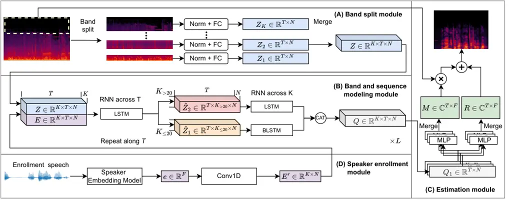

# High Fidelity Speech Enhancement with Band-split RNN

Jianwei Yu^(∗)    Hangting Chen^(∗)    Yi Luo    Rongzhi Gu    Chao Weng

###### Abstract

Despite the rapid progress in speech enhancement (SE) research,
improving the intelligibility and perceptual quality of desired speech
in noisy environments with interfering speakers remains challenging.
This paper attempts to achieve high-fidelity full-band SE and
personalized SE (PSE) by modifying the recently proposed band-split RNN
(BSRNN) model. To reduce the negative impact of unstable high-frequency
components in full-band speech recording, we perform bi-directional and
uni-directional band-level modeling to low-frequency and high-frequency
subbands, respectively. For the PSE task, an additional speaker
enrollment module is added to BSRNN to make use of the target speaker
information for suppressing the interfering speech. Moreover, we utilize
a MetricGAN discriminator (MGD) and a multi-resolution spectrogram
discriminator (MRSD) to further improve the human auditory perceptual
quality of the enhanced speech. Experimental results show that our
system outperforms various top-ranking SE systems, achieves
state-of-the-art (SOTA) SE performance on the DNS-2020 test set, and
ranks among the top 3 in the DNS-2023 challenge on the PSE task.

###### keywords

Band-split RNN, Full-band speech enhancement, Personalized speech
enhancement

^(†)^(†)address: Tencent AI Lab, Audio and Speech Signal Processing
Oteam ^(†)^(†)email: {tomasyu, oulyluo, erichtchen, lorrygu,
cweng}@tencent.com

## 1 Introduction

Speech enhancement (SE)^(†)^(†) ^(∗) Equal contribution is an important
task in speech communication that aims to improve the subjective and
objective quality of speech signals. Such improvements can not only be
helpful for human listeners to better understand the contents but also
be beneficial for machine listeners to generate more accurate
transcriptions. In recent few years, deep learning based SE models have
made a great progress due to the emergence of novel model architectures
\[1, 2, 3, 4, 5, 6\], efficient data simulation and model training
pipelines \[7, 8\], and international challenges\[9, 10\] with
comprehensive evaluation metrics and large-scale training data. Due to
the rising demand for high-fidelity (Hi-Fi) speech in online
conferencing systems and high-definition live streaming, recent
developments in speech enhancement models have attempted to handle super
wide-band (24 kHz) and full-band (48 kHz) speech signals\[11, 12\].
Moreover, since conventional SE models cannot suppress the speech of
interfering speakers, personalized SE (PSE) models have also been
proposed \[13, 14, 15, 16\] to isolate the target speaker’s voice from
interfering speech using target speaker’s enrollment speech.

Although previous SE and PSE models can largely improve the quality of
the desired speech signals, the performance of these models on full-band
signals is restricted by the following two aspects. First, in real-time
speech communication, different devices have various effective sample
rates and frequency responses. Some devices can precisely capture
relatively high-frequency ($`>`$8 kHz) information of the speech signal,
while others may introduce significant distortion in the high-frequency
range. Such unpredictable device-dependent distortion on high-frequency
components can degrade the performance of full-band speech enhancement.
Second, the conventional training objectives of SE models, such as
signal-to-noise ratio (SNR) and frequency-domain mean square error
(MSE), are not closely related to human auditory perception and other
objective perceptual metrics, which can lead to sub-optimal SE
performance.



Figure 1: The diagram of the proposed full-band PSE system. (A) The band
split module. (B) The sequence and band modeling module. (C) The
estimation module. (D) The speaker enrollment module.

This paper aims to tackle the problems mentioned above by applying the
band-split RNN (BSRNN) model, which was recently introduced in \[3\], to
full-band SE and PSE tasks. In the modified BSRNN, the input signal’s
spectrogram is initially divided into a collection of frequency bands,
which are then converted into subband features using band-specific fully
connected (FC) layers. For full-band SE and PSE tasks, we perform
bi-directional band-level modeling for subbands below 8 kHz and
uni-directional modeling for subbands above 8 kHz to mitigate the effect
of high-frequency distortion introduced by the devices. For PSE task, an
additional speaker enrollment module is added to BSRNN to make use of
the target speaker information. In addition, we use a modified
MetricGAN-based training objective \[8, 17\] to directly optimize the
model towards the widely-used perceptual evaluation of speech quality
(PESQ) score. Furthermore, to improve the human auditory perceptual
quality of the enhanced speech, a multi-resolution spectrogram
discriminator (MRSD) \[18\] is also adopted in model training.
Experimental results show that our BSRNN system outperforms various
top-ranking benchmark systems in SE and achieves SOTA results on the
DNS-2020 non-blind test set in both offline and online scenarios. For
the PSE task, the proposed system achieves better PDNSMOS scores on the
4th DNS-2022 blind test set than the previous SOTA system and ranks
among the top 3 in the DNS-2023 challenge on both speaker phone and
headset tracks.

This paper is an extension of our two-page grand challenge report \[19\]
for ICASSP DNS 2023 Challenge. Both online and offline systems for SE
and PSE tasks are considered in this paper, while the two-page grand
challenge report only focuses on the online PSE task. More details of
the model design, training objectives, and experimental results are
added in this paper.

The paper is organized as follows: Section 2 presents the proposed BSRNN
architecture. The training objectives are discussed in Section 3.
Section 4 introduces the data simulation and training configurations.
Experimental results and analysis can be found in Section 5, and
Section 6 offers the conclusion.

## 2 Model Architecture

The proposed system shown in Figure 1 is a frequency-domain model
composed of a band split module, a band and sequence modeling module, a
mask estimation module, and an additional speaker enrollment module for
PSE purposes. As shown in Figure 1 (A), the band split module explicitly
splits the complex-valued spectrogram of the noisy input $`\vec{X}`$
into a set of non-overlapped frequency bands
$`\{\vec{B}_{i}\}_{i=1}^{K}`$ and generates a series of subband features
$`\{\vec{Z}_{i}\}_{i=1}^{K}`$ with band-specific FC layers. Residual
long short-term memory networks (LSTMs) are utilized in the band and
sequence modeling module to conduct interleaved modeling at both the
band and sequence levels of the subband features.

As discussed in Section 1, different recording devices can introduce
unpredictable distortions and information lost in high-frequency
components (normally $`>`$8 kHz) due to different frequency responses.
For example, the frequency components above 16 kHz are missing in the
spectrogram shown in Figure 1 (A). Hence, the bi-directional intra-band
modeling used in original BSRNN model \[3\] can be sub-optimal, as it
can propagate high-frequency distortions to lower frequencies and
thereby compromise the overall enhancement performance. To attenuate the
effects of the high-frequency distortions in full-band enhancement, we
split the subband features $`\hat{\vec{Z}}`$ to $`\hat{\vec{Z}_{1}}`$
and $`\hat{\vec{Z}_{2}}`$, where $`\hat{\vec{Z}_{1}}`$ contains the
subband features below 8 kHz and $`\hat{\vec{Z}_{2}}`$ contains subbands
above 8 kHz. Then we perform bi-directional band-level modeling on
$`\hat{\vec{Z}_{1}}`$ and uni-directional modeling on
$`\hat{\vec{Z}_{2}}`$ as follows:

```math
\displaystyle\vec{Q}_{1},(\vec{h},\vec{c})=\text{BLSTM}(\hat{\vec{Z}}_{1});\ \ \ \vec{Q}_{2}=\text{LSTM}(\hat{\vec{Z}}_{2},(\vec{h},\vec{c})) \tag{1}
```

where $`\vec{h}`$ and $`\vec{c}`$ are the hidden and cell state of the
low-to-high direction obtained from the band-level modeling of
$`\hat{\vec{Z}}_{1}`$. In the rest of the paper, we will use BSRNN-S to
denote the BSRNN model with split band-level modeling.

After band and sequence modeling, the estimation module uses
band-specific MLPs to predict the complex-value T-F mask
$`\vec{M}\in\mathbb{C}^{F\times T}`$. Regarding the artifacts brought by
the complex masks, an MLP is additionally used to directly predict the
target speech’s complex-valued residual spectrogram
$`\vec{R}\in\mathbb{C}^{F\times T}`$. The final enhanced speech is
obtained by:

```math
\displaystyle\bar{\vec{S}}=\vec{M}\odot\vec{X}+\vec{R} \tag{2}
```

where $`\odot`$ denotes the complex-valued Hadamard product and
$`\bar{\vec{S}}`$ represents the enhanced spectrogram.

In PSE task, a speaker enrollment module is utilized to extract the
target speaker information from the enrollment speech to eliminate
interfering speech. Specifically, the enrollment speech is a
pre-recorded 5 to 10 seconds clean or noisy speech segment from the
target speaker, which is used to compute the speaker embedding
$`\mathbf{e}\in\mathbb{R}^{F}`$. In the proposed model, we adopt a
pretrained speaker embedding model\[20\] based on ResNet34 with frozen
model parameters to compute the speaker embedding $`\mathbf{e}`$. The
speaker representation $`\mathbf{E}\in\mathbb{R}^{K\times T\times N}`$
is then obtained by transforming the speaker embedding $`\mathbf{e}`$
using band-specific 1-D convolutional layers with Tanh activation
function and repeated across the time axis. Then, we concatenate the
subband feature $`\mathbf{Z}`$ and the speaker representation
$`\mathbf{E}`$ along the feature dimension to apply band and
sequence-level modeling. Throughout the remainder of the paper, we will
refer to the personalized BSRNN model as pBSRNN.

## 3 Training Objectives

The training objective of our model contains three parts.

Multi-resolution Frequency Loss: The first part is a multi-resolution
(MR) frequency-domain loss $`\mathcal{L}^{\texttt{MR}}`$ designed by
combining the power-compressed amplitude mean average error (MAE) loss
and the complex-valued MAE loss with short-time Fourier transform (STFT)
windows ranging from 10 ms to 40 ms:

```math
\displaystyle\mathcal{L}^{\texttt{MR}}=\frac{1}{I}\sum_{i}\left(\Arrowvert|\vec{S}_{i}|^{p}-|\bar{\vec{S}}_{i}|^{p}\Arrowvert_{1}+\Arrowvert\vec{S}_{i}-\bar{\vec{S}}_{i}\Arrowvert_{1}\right) \tag{3}
```

where $`{\bar{\vec{S}}}_{i}`$ and $`{\vec{S}}_{i}`$ denote the complex
spectra of the estimated and target speech signal, respectively, $`i`$
is the index of the STFT window size from \[10, 20, 30, 40\] ms. We use
$`p=0.3`$ in our implementation.

MetricGAN: To directly improve the system performance on the PESQ score,
adversarial training based on MetricGAN (MGD) \[8, 17\] is adopted. The
generator of MGD is the BSRNN model and the discriminator in MGD
$`D(\cdot)`$ attempts to predict the normalized PESQ score:

```math
\displaystyle Q_{\text{PESQ}}(\bar{\vec{S}},{\vec{S}})=\frac{\text{PESQ}(\bar{\vec{S}},\vec{S})+0.5}{5} \tag{4}
```

Note that the wide-band PESQ score is used in all experiments. Two
least-square GAN (LSGAN) \[21\] style training objectives are then
designed for the generator and discriminator:

```math
\displaystyle\mathcal{L}_{d}^{\texttt{MGD}} \displaystyle=(1-D({\vec{S}},\vec{S}))^{2}+(Q_{\text{PESQ}}(\bar{\vec{S}},\vec{S})-D(\bar{\vec{S}},\vec{S}))^{2} \tag{5}
```

```math
\displaystyle+(Q_{\text{PESQ}}({\vec{X}},{\vec{S}})-D({\vec{X}},{\vec{S}}))^{2}
```

```math
\displaystyle\mathcal{L}_{g}^{\texttt{MGD}} \displaystyle=(1-D(\bar{\vec{S}},\vec{S}))^{2}+0.5\cdot\mathcal{L}^{\texttt{MR}} \tag{6}
```

where $`\mathcal{L}_{g}^{\texttt{MGD}},\mathcal{L}_{d}^{\texttt{MGD}}`$
denote the generator loss and the discriminator loss, respectively. Note
that the discriminator loss contains three signal pairs from noisy
input, clean target and estimated target to stabilize the training
process.

Multi-resolution Spectrogram Discriminator: To further enhance the
perceptual quality of the output speech, we also adopt the
multi-resolution spectrogram discriminator (MRSD) \[18\] in model
training:

```math
\displaystyle\mathcal{L}_{d}^{\texttt{MRSD}}=\frac{1}{K}\sum_{k}\left((1-D_{k}(\vec{S}))^{2}+D_{k}(\bar{\vec{S}})^{2}\right) \tag{7}
```

```math
\displaystyle\mathcal{L}_{g}^{\texttt{MRSD}}=\frac{1}{K}\sum_{k}(1-D_{k}(\bar{\vec{S}}))^{2}+\mathcal{L}^{\texttt{MR}}+\mathcal{L}^{\texttt{MMEL}} \tag{8}
```

where
$`\mathcal{L}_{d}^{\texttt{MRSD}},\mathcal{L}_{g}^{\texttt{MRSD}}`$ are
the discriminator and generator objective, respectively.
$`\mathcal{L}^{\texttt{MMEL}}`$ is the mean square error (MSE) between
the mel-spectrograms of the target and estimated speech signals with the
number of mel filterbanks ranging from \[64, 128, 256\]. 6 STFT windows
(\[2, 4, 8, 16, 32, 64\] ms) denoted by the STFT window index $`k`$ are
used in our implementation.

## 4 Experiment Configurations

### 4.1 Data

Our experiments are conducted on the publicly available DNS-2023
challenge dataset. The training data contains $`\sim`$760 hour clean
speech with speaker identity labels, $`\sim`$181 hour noise and
$`\sim`$60k room impulse response (RIR) samples. We use the DNS-2020 and
DNS-2022 blind test set for evaluation.

Preprocessing: During the experiment, we found that the original
single-speaker speech utterances may contain interfering speech from
other speakers. The existence of interfering speech can confuse the PSE
model in training and result in sub-optimal performance. To address this
issue, we divide the original utterances into 3-second segments and
employ a pre-trained speaker embedding model to detect the interfering
speech. This is achieved by computing the cosine similarity of speaker
embeddings between each segment and the enrollment speech. We removed
segments with a similarity lower than 0.6 to clean up the data.

Simulation: During training, the noisy speech signal is stimulated in an
on-the-fly manner. Specifically, we first sample one target speech and
one noisy segment and then mix them with an SNR sampled from \[-5, 20\]
dB. Note that we convolve 20% of the speech segments with randomly
selected RIR to simulate reverberation. For the PSE task, we
additionally sample and mix an interfering speech segment with SIR
ranging from \[-5, 20\] dB in simulation. In PSE model training, 50% of
the training inputs are the mixture of target speech and noise segments,
30% of the training inputs are the mixture of target, interfering speech
and noise segments and 20% of the training inputs are the mixture of
target and interfering speech segments. All the simulated training
segments are set to be 6-second long in our implementation.

|     |                  |        |           |         |        |       |             |         |        |       |
| --- | ---------------- | ------ | --------- | ------- | ------ | ----- | ----------- | ------- | ------ | ----- |
| ID  | Model            | Causal | no_reverb |         |        |       | with_reverb |         |        |       |
|     |                  |        | PESQ-WB   | PESQ-NB | SI-SNR | STOI  | PESQ-WB     | PESQ-NB | SI-SNR | STOI  |
| 1   | Noisy            | $`-`$  | 1.58      | 2.45    | 9.1    | 91.5  | 1.82        | 2.75    | 9.0    | 86.6  |
| 2   | SN-NET \[22\]    | ✗      | 3.39      | $`-`$   | 19.5   | $`-`$ | $`-`$       | $`-`$   | $`-`$  | $`-`$ |
| 3   | DPT-FSNET \[23\] | ✗      | 3.26      | $`-`$   | 20.4   | 97.7  | 3.53        | $`-`$   | 18.1   | 95.2  |
| 4   | TridentSE \[24\] | ✗      | 3.44      | $`-`$   | $`-`$  | 97.9  | 3.50        | $`-`$   | $`-`$  | 95.2  |
| 5   | MTFAA-NET \[12\] | ✗      | 3.52      | 3.76    | $`-`$  | $`-`$ | $`-`$       | $`-`$   | $`-`$  | $`-`$ |
| 6   | BSRNN-16k        | ✗      | 3.45      | 3.87    | 21.1   | 98.3  | 3.72        | 4.03    | 19.1   | 96.3  |
| 7   | BSRNN            | ✗      | 3.32      | 3.79    | 21.1   | 98.0  | 3.54        | 3.94    | 18.5   | 95.6  |
| 8   | BSRNN-S          | ✗      | 3.42      | 3.85    | 21.3   | 98.3  | 3.61        | 3.95    | 19.0   | 95.8  |
| 9   | BSRNN-S + MGD    | ✗      | 3.50      | 3.85    | 21.4   | 98.4  | 3.63        | 3.95    | 19.0   | 96.1  |
| 10  | BSRNN-S + MRSD   | ✗      | 3.53      | 3.89    | 21.4   | 98.4  | 3.68        | 3.98    | 19.2   | 96.3  |
| 11  | CTS-Net \[25\]   | ✓      | 2.94      | 3.42    | 18.0   | 96.7  | 3.02        | 3.47    | 15.6   | 92.7  |
| 12  | GaGNet \[5\]     | ✓      | 3.17      | 3.56    | 18.9   | 97.1  | 3.18        | 3.57    | 16.6   | 93.2  |
| 13  | MDNet \[26\]     | ✓      | 3.18      | 3.56    | 19.2   | 97.2  | 3.24        | 3.59    | 16.9   | 93.6  |
| 14  | FRCRN \[27\]     | ✓      | 3.23      | 3.60    | 19.8   | 97.7  | $`-`$       | $`-`$   | $`-`$  | $`-`$ |
| 15  | MTFAA-NET \[12\] | ✓      | 3.32      | 3.63    | $`-`$  | $`-`$ | $`-`$       | $`-`$   | $`-`$  | $`-`$ |
| 16  | BSRNN-16k        | ✓      | 3.23      | 3.73    | 19.9   | 97.7  | 3.37        | 3.82    | 17.6   | 94.8  |
| 17  | BSRNN            | ✓      | 3.14      | 3.63    | 19.3   | 97.4  | 3.13        | 3.64    | 16.8   | 93.9  |
| 18  | BSRNN-S          | ✓      | 3.26      | 3.73    | 20.0   | 97.6  | 3.30        | 3.77    | 17.5   | 94.5  |
| 19  | BSRNN-S + MGD    | ✓      | 3.27      | 3.73    | 20.1   | 97.7  | 3.33        | 3.78    | 17.4   | 94.5  |
| 20  | BSRNN-S + MRSD   | ✓      | 3.32      | 3.77    | 20.5   | 97.8  | 3.37        | 3.80    | 17.9   | 94.7  |

Table 1: Results on DNS-2020 no_reverb / with_reverb test sets. ‘-16k’
denotes model trained using 16 kHz data.

|     |                      |                   |      |      |                      |      |      |
| --- | -------------------- | ----------------- | ---- | ---- | -------------------- | ---- | ---- |
| ID  | Method               | With Interference |      |      | Without Interference |      |      |
|     |                      | SIG               | BAK  | OVRL | SIG                  | BAK  | OVRL |
| 1   | Noisy                | 3.97              | 1.82 | 2.23 | 4.22                 | 2.30 | 2.74 |
| 2   | NSNet2\[28\]         | 3.47              | 2.71 | 2.44 | 3.73                 | 4.18 | 3.42 |
| 3   | DeepFilterNet2\[29\] | 3.56              | 2.94 | 2.68 | 4.09                 | 4.49 | 3.85 |
| 4   | TEA-PSE\[15\]        | 3.69              | 3.64 | 3.16 | 4.16                 | 4.44 | 3.89 |
| 5   | TEA-PSE2\[16\]       | 3.86              | 3.83 | 3.36 | 4.23                 | 4.50 | 3.98 |
| 6   | BSRNN-S              | 3.76              | 3.49 | 3.05 | 4.19                 | 4.51 | 3.95 |
| 7   | pBSRNN-S             | 3.66              | 3.91 | 3.21 | 4.17                 | 4.50 | 3.94 |
| 8   | \+ MRSD              | 3.90              | 3.81 | 3.37 | 4.30                 | 4.50 | 4.04 |

Table 2: PDNSMOS P.835 scores on the DNS-2022 blind test set, where SIG
means speech quality, BAK means background noise quality, and OVRL means
overall quality.

|                 |         |       |       |              |       |       |
| --------------- | ------- | ----- | ----- | ------------ | ----- | ----- |
| Method          | Headset |       |       | Speakerphone |       |       |
|                 | OVRL    | WACC  | SCORE | OVRL         | WACC  | SCORE |
| Noisy           | 1.22    | 0.843 | 0.449 | 1.24         | 0.857 | 0.459 |
| Baseline        | 2.34    | 0.687 | 0.511 | 2.38         | 0.727 | 0.537 |
| pBSRNN-S + MRSD | 2.65    | 0.724 | 0.568 | 2.66         | 0.724 | 0.570 |

Table 3: Results of subjective listening, objective word accuracy and
final scores on the blind test set of DNS-2023.

### 4.2 Model

Band-spilt Scheme: We split the spectrogram into 33 subbands, including
twenty 200 Hz bandwidth subbands for low frequency followed by six 500
Hz subbands and seven 2 kHz subbands.

Hyperparameters: We use the Hanning analysis window for STFT and set the
window length and shift to 20 ms and 10 ms for the 48 kHz model, and 32
ms and 8 ms for the 16 kHz model. We set the feature dimension to
$`N=96`$ and $`N=128`$ for the 48 kHz and 16 kHz models, respectively. A
six-layer band and sequence modeling module with 192 dimensional LSTM is
used in our system. The estimation module uses the 384-dimensional MLP
with Tanh activation function and a gated linear unit (GLU) \[30\]
output layer. We use layer normalization \[31\] for offline
configuration and batch normalization \[32\] for online configuration.
The online pBSRNN model has a computational complexity of approximately
14.7G multiply-accumulate operations (MACs) per second. Using the ONNX
runtime implementation on an Intel i5 2.50GHz CPU, the online PSE model
achieves 0.42 real-time factor(RTF).

Speaker Embedding Model: The pretrained speaker embedding model \[33,
20\]¹¹ 1
[https://github.com/wenet-e2e/wespeaker/blob/master/docs/pretrained.md](https://github.com/wenet-e2e/wespeaker/blob/master/docs/pretrained.md)
is used in our PSE system.

### 4.3 Training Pipeline

To perform non-personalized speech enhancement, we train the BSRNN model
(without the speaker enrollment module) from scratch using the MR loss
with an initial learning rate of $`1e^{-3}`$ for 400k iterations. Then,
we finetune the model with the MGD and MRSD training objectives for
another 100k iterations. The training of PSE model is similar to the
non-personalized model, and the only difference is that the PSE model
uses the parameters of the pretrained non-personalized model as
initialization.

All the models are trained on 8 Nvidia P40 GPUs using Adam optimizer
with 0.98 learning rate decay for every 20k updates. The model training
will be stopped if the best validation result is not achieved in 20k
consecutive iterations.

## 5 Experimental Results

### 5.1 Non-personalized speech-enhancement

Table 1 compares the performance between the proposed non-personalized
SE BSRNN models and several top-ranking benchmark models on the
non-blind test of DNS-2020 challenge. It can be observed that: 1)
Compared with models trained using wide-band (16 kHz) data, the
performance of models trained on full-band data with bi-directional
band-level modeling degrades significantly (ID 6 v.s. 7, ID 16 v.s. 17),
which supports the claim that the high-frequency distortion can degrade
the full-band enhancement performance; 2) Using bi-directional and
uni-directional band-level modeling on low-frequency and high-frequency
subbands separately can improve the performance of full-band SE models
(ID 7 v.s. 8, ID 17 v.s. 18); 3) The use of MGD and MRSD training
objectives can further improve the performance of the SE models. Models
trained using MRSD achieves the best SE performance; 4) The best BSRNN
model outperforms previous SE benchmark systems on both offline (ID 5
v.s. 10) and online (ID 15 v.s. 20) scenarios and achieves the SOTA
overall performance.

### 5.2 Personalized speech-enhancement

In Table 2, we present the PDNSMOS ablation results of the proposed
system on the DNS-2022 blind test set. It can be observed that: 1) The
non-personalized and personalized BSRNN models show comparable
performance when there is no interfering speech, while the personalized
model outperforms the non-personalized model for inputs without
interference speech; 2) The use of MDR discriminator loss will degrade
the PDNSMOS score, one possible explanation is that the MGD loss is
particularly designed for the PESQ-WB metric, which can be inconsistent
with PDNSMOS; 3) After finetuning with the MRSD discriminator loss, both
models can achieve better OVRL scores on the PDNSMOS metric; 4) The
proposed model can achieve comparable or better results against previous
SOTA PSE systems (ID 5 v.s. 10).

Table 3 shows the results of the proposed pBSRNN in the DNS-2023
challenge. We found that: 1) The proposed pBSRNN system obtains better
performance against the baseline systems from the challenge organizer. 2) While the proposed pBSRNN system can significantly improve the
subjective OVRL scores, its use can largely reduce speech recognition
word accuracy (WACC). This implies that current PSE models may introduce
unexpected artifacts and excessively suppress target speech when
eliminating background noise and other interfering speech.

## 6 Conclusion & Limitation

This paper presented the design of the BSRNN-based speech enhancement
and personalized speech enhancement models and the corresponding
training pipeline for full-band speech signals. With the modified
band-level modeling strategy and the use of MGD and MRSD training
objectives, the proposed systems achieved competitive performance on
various SE and PSE benchmark datasets. However, as discussed in
Section 6, the use of the SE model will severely degrade the speech
recognition performance, indicating that current SE and PSE models still
suffer from over-suppression and model distortion. In addition, we also
find that when the timbres of the target speaker and the interfering
speaker are similar, the model may fail to remove the interfering
speech. Furthermore, if a channel mismatch occurs between the enrollment
speech and the target speech, the model might mistakenly interpret them
as distinct speakers.

## References

- \[1\] Y. Hu, Y. Liu, S. Lv, M. Xing, S. Zhang, Y. Fu, J. Wu, B. Zhang,
  and L. Xie, “Dccrn: Deep complex convolution recurrent network for
  phase-aware speech enhancement,” _arXiv:2008.00264_, 2020.
- \[2\] X. Hao, X. Su, R. Horaud, and X. Li, “Fullsubnet: A full-band
  and sub-band fusion model for real-time single-channel speech
  enhancement,” in _ICASSP 2021-2021 IEEE International Conference on
  Acoustics, Speech and Signal Processing (ICASSP)_. IEEE, 2021, pp.
  6633–6637.
- \[3\] Y. Luo and J. Yu, “Music source separation with band-split rnn,”
  _arXiv:2209.15174_, 2022.
- \[4\] A. Defossez, G. Synnaeve, and Y. Adi, “Real time speech
  enhancement in the waveform domain,” _arXiv:2006.12847_, 2020.
- \[5\] A. Li, C. Zheng, L. Zhang, and X. Li, “Glance and gaze: A
  collaborative learning framework for single-channel speech
  enhancement,” _Applied Acoustics_, vol. 187, p. 108499, 2022.
- \[6\] K. Wang, B. He, and W.-P. Zhu, “Tstnn: Two-stage transformer
  based neural network for speech enhancement in the time domain,” in
  _ICASSP 2021-2021 IEEE International Conference on Acoustics, Speech
  and Signal Processing (ICASSP)_. IEEE, 2021, pp. 7098–7102.
- \[7\] Y. Xia, S. Braun, C. K. Reddy, H. Dubey, R. Cutler, and
  I. Tashev, “Weighted speech distortion losses for neural-network-based
  real-time speech enhancement,” in _ICASSP 2020-2020 IEEE International
  Conference on Acoustics, Speech and Signal Processing (ICASSP)_. IEEE,
  2020, pp. 871–875.
- \[8\] S.-W. Fu, C.-F. Liao, Y. Tsao, and S.-D. Lin, “MetricGAN:
  Generative adversarial networks based black-box metric scores
  optimization for speech enhancement,” in _International Conference on
  Machine Learning_. PMLR, 2019, pp. 2031–2041.
- \[9\] C. K. Reddy, H. Dubey, V. Gopal, R. Cutler, S. Braun, H. Gamper,
  R. Aichner, and S. Srinivasan, “Icassp 2021 deep noise suppression
  challenge,” in _ICASSP 2021-2021 IEEE International Conference on
  Acoustics, Speech and Signal Processing (ICASSP)_. IEEE, 2021, pp.
  6623–6627.
- \[10\] D. Harishchandra, A. Ashkan, G. Vishak, N. Babak, B. Sebastian,
  C. Ross, J. Alex, Z. Mehdi, T. Min, G. Hannes, G. Mehrsa, and
  A. Robert, “Icassp 2023 deep speech enhancement challenge,” in _ICASSP
  2022-2023_. IEEE, 2023.
- \[11\] S. Lv, Y. Fu, M. Xing, J. Sun, L. Xie, J. Huang, Y. Wang, and
  T. Yu, “S-dccrn: Super wide band dccrn with learnable complex feature
  for speech enhancement,” in _ICASSP 2022-2022 IEEE International
  Conference on Acoustics, Speech and Signal Processing (ICASSP)_. IEEE,
  2022, pp. 7767–7771.
- \[12\] G. Zhang, L. Yu, C. Wang, and J. Wei, “Multi-scale temporal
  frequency convolutional network with axial attention for speech
  enhancement,” in _ICASSP 2022-2022 IEEE International Conference on
  Acoustics, Speech and Signal Processing (ICASSP)_. IEEE, 2022, pp.
  9122–9126.
- \[13\] Q. Wang, H. Muckenhirn, K. Wilson, P. Sridhar, Z. Wu,
  J. Hershey, R. A. Saurous, R. J. Weiss, Y. Jia, and I. L. Moreno,
  “Voicefilter: Targeted voice separation by speaker-conditioned
  spectrogram masking,” _arXiv preprint arXiv:1810.04826_, 2018.
- \[14\] R. Giri, S. Venkataramani, J.-M. Valin, U. Isik, and
  A. Krishnaswamy, “Personalized percepnet: Real-time, low-complexity
  target voice separation and enhancement,” _arXiv preprint
  arXiv:2106.04129_, 2021.
- \[15\] Y. Ju, W. Rao, X. Yan, Y. Fu, S. Lv, L. Cheng, Y. Wang, L. Xie,
  and S. Shang, “Tea-pse: Tencent-ethereal-audio-lab personalized speech
  enhancement system for icassp 2022 dns challenge,” in _ICASSP
  2022-2022 IEEE International Conference on Acoustics, Speech and
  Signal Processing (ICASSP)_. IEEE, 2022, pp. 9291–9295.
- \[16\] Y. Ju, S. Zhang, W. Rao, Y. Wang, T. Yu, L. Xie, and S. Shang,
  “Tea-pse 2.0: Sub-band network for real-time personalized speech
  enhancement,” in _2022 IEEE Spoken Language Technology Workshop
  (SLT)_. IEEE, 2023, pp. 472–479.
- \[17\] S.-W. Fu, C. Yu, T.-A. Hsieh, P. Plantinga, M. Ravanelli,
  X. Lu, and Y. Tsao, “MetricGAN+: An improved version of MetricGAN for
  speech enhancement,” _arXiv preprint arXiv:2104.03538_, 2021.
- \[18\] W. Jang, D. Lim, J. Yoon, B. Kim, and J. Kim, “Univnet: A
  neural vocoder with multi-resolution spectrogram discriminators for
  high-fidelity waveform generation,” _arXiv preprint
  arXiv:2106.07889_, 2021.
- \[19\] J. Yu, H. Chen, Y. Luo, R. Gu, W. Li, and C. Weng, “Tspeech-ai
  system description to the 5th deep noise suppression (dns) challenge,”
  in _ICASSP 2023 - 2023 IEEE International Conference on Acoustics,
  Speech and Signal Processing (ICASSP)_, 2023, pp. 1–2.
- \[20\] H. Wang, C. Liang, S. Wang, Z. Chen, B. Zhang, X. Xiang,
  Y. Deng, and Y. Qian, “Wespeaker: A research and production oriented
  speaker embedding learning toolkit,” in _ICASSP 2023-2023 IEEE
  International Conference on Acoustics, Speech and Signal Processing
  (ICASSP)_. IEEE, 2023, pp. 1–5.
- \[21\] X. Mao, Q. Li, H. Xie, R. Y. Lau, Z. Wang, and S. Paul Smolley,
  “Least squares generative adversarial networks,” in _Proceedings of
  the IEEE international conference on computer vision_, 2017, pp.
  2794–2802.
- \[22\] C. Zheng, X. Peng, Y. Zhang, S. Srinivasan, and Y. Lu,
  “Interactive speech and noise modeling for speech enhancement,” in
  _Proceedings of the AAAI Conference on Artificial Intelligence_,
  vol. 35, 2021, pp. 14 549–14 557.
- \[23\] F. Dang, H. Chen, and P. Zhang, “Dpt-fsnet: Dual-path
  transformer based full-band and sub-band fusion network for speech
  enhancement,” in _ICASSP 2022-2022 IEEE International Conference on
  Acoustics, Speech and Signal Processing (ICASSP)_. IEEE, 2022, pp.
  6857–6861.
- \[24\] D. Yin, Z. Zhao, C. Tang, Z. Xiong, and C. Luo, “Tridentse:
  Guiding speech enhancement with 32 global tokens,” _arXiv preprint
  arXiv:2210.12995_, 2022.
- \[25\] A. Li, W. Liu, C. Zheng, C. Fan, and X. Li, “Two heads are
  better than one: A two-stage complex spectral mapping approach for
  monaural speech enhancement,” _IEEE/ACM Transactions on Audio, Speech,
  and Language Processing_, vol. 29, pp. 1829–1843, 2021.
- \[26\] A. Li, C. Zheng, Z. Zhang, and X. Li, “Mdnet: Learning monaural
  speech enhancement from deep prior gradient,” _arXiv preprint
  arXiv:2203.07179_, 2022.
- \[27\] S. Zhao, B. Ma, K. N. Watcharasupat, and W.-S. Gan, “Frcrn:
  Boosting feature representation using frequency recurrence for
  monaural speech enhancement,” in _ICASSP 2022-2022 IEEE International
  Conference on Acoustics, Speech and Signal Processing (ICASSP)_. IEEE,
  2022, pp. 9281–9285.
- \[28\] S. Braun and I. Tashev, “Data augmentation and loss
  normalization for deep noise suppression,” in _Speech and Computer:
  22nd International Conference, SPECOM 2020, St. Petersburg, Russia,
  October 7–9, 2020, Proceedings 22_. Springer, 2020, pp. 79–86.
- \[29\] H. Schröter, A. Maier, A. Escalante-B, and T. Rosenkranz,
  “Deepfilternet2: Towards real-time speech enhancement on embedded
  devices for full-band audio,” in _2022 International Workshop on
  Acoustic Signal Enhancement (IWAENC)_. IEEE, 2022, pp. 1–5.
- \[30\] Y. N. Dauphin, A. Fan, M. Auli, and D. Grangier, “Language
  modeling with gated convolutional networks,” in _International
  conference on machine learning_. PMLR, 2017, pp. 933–941.
- \[31\] J. L. Ba, J. R. Kiros, and G. E. Hinton, “Layer normalization,”
  _arXiv:1607.06450_, 2016.
- \[32\] S. Ioffe and C. Szegedy, “Batch normalization: Accelerating
  deep network training by reducing internal covariate shift,” in
  _International conference on machine learning_. PMLR, 2015, pp.
  448–456.
- \[33\] Z. Chen, B. Liu, B. Han, L. Zhang, and Y. Qian, “The sjtu
  x-lance lab system for cnsrc 2022,” _arXiv preprint
  arXiv:2206.11699_, 2022.
