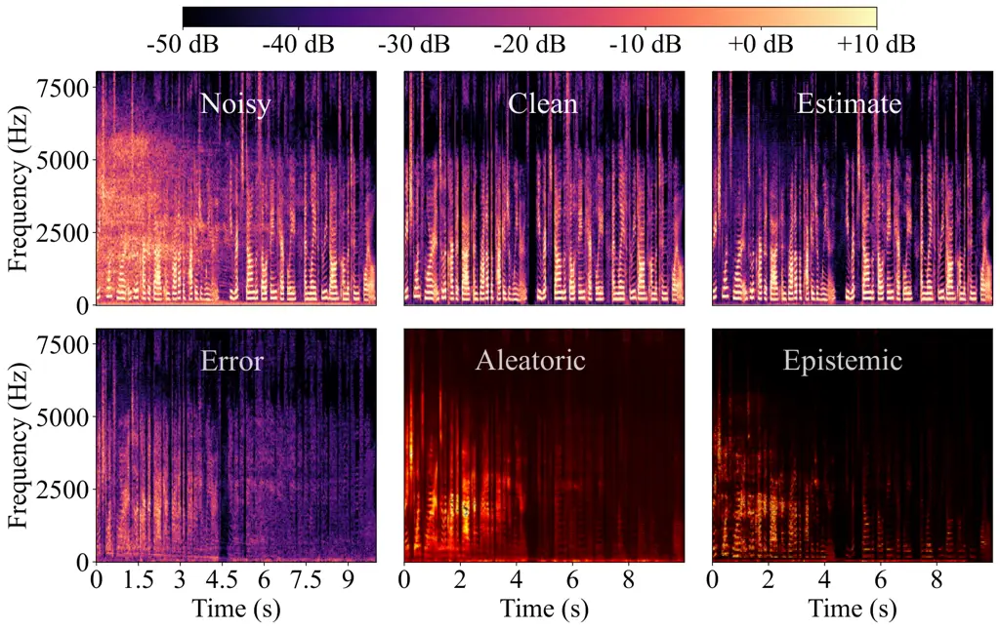

# Uncertainty Estimation in Deep Speech Enhancement Using Complex Gaussian Mixture Models

###### Abstract

Single-channel deep speech enhancement approaches often estimate a
single multiplicative mask to extract clean speech without a measure of
its accuracy. Instead, in this work, we propose to quantify the
uncertainty associated with clean speech estimates in neural
network-based speech enhancement. Predictive uncertainty is typically
categorized into _aleatoric uncertainty_ and _epistemic uncertainty_.
The former accounts for the inherent uncertainty in data and the latter
corresponds to the model uncertainty. Aiming for robust clean speech
estimation and efficient predictive uncertainty quantification, we
propose to integrate statistical complex Gaussian mixture models (CGMMs)
into a deep speech enhancement framework. More specifically, we model
the dependency between input and output stochastically by means of a
conditional probability density and train a neural network to map the
noisy input to the full posterior distribution of clean speech, modeled
as a mixture of multiple complex Gaussian components. Experimental
results on different datasets show that the proposed algorithm
effectively captures predictive uncertainty and that combining powerful
statistical models and deep learning also delivers a superior speech
enhancement performance.

###### Index Terms: 

Speech enhancement, uncertainty estimation, neural networks, complex
Gaussian mixture models

## 1 Introduction

Speech enhancement aims to recover clean speech from microphone
recordings distorted by interfering noise to improve speech quality and
intelligibility. The recordings are often transformed into the
time-frequency domain using the STFT (STFT), where an estimator can be
applied to extract clean speech. Depending on different probabilistic
assumptions, various Bayesian estimators have been presented \[1, 2\]. A
typical example is the Wiener filter derived based on the complex
Gaussian distribution of speech and noise signals \[2\]. \AcpCGMM have
also been studied in \[3\] to model super-Gaussian priors, which are
considered a better fit for speech signals \[2\].

Today, DNN (DNN)-based approaches are the standard tool for speech
enhancement, alleviating shortcomings of traditional methods. Supervised
masking approaches are trained on large databases consisting of
noisy-clean speech pairs and directly estimate a multiplicative mask to
extract clean speech \[4\]. However, supervised DNN approaches are
typically formulated as a problem with a single output, which may result
in fundamentally erroneous estimates for unseen samples, without any
indication that the erroneous estimate is uncertain. This motivates us
to quantify predictive uncertainty associated with clean speech
estimates, which allows determining the level of confidence in the
outcome in the absence of ground truth.

Predictive uncertainty is typically categorized into _aleatoric
uncertainty_ and *epistemic uncertainty* \[5, 6\]. Aleatoric uncertainty
describes the uncertainty of an estimate due to the intrinsic randomness
of noisy observations. For speech enhancement, it originates from the
stochastic nature of both speech and noise. Epistemic uncertainty (also
known as _model uncertainty_) corresponds to the uncertainty of the DNN
parameters \[6\]. Hüllermeier et al. \[5\] provide a general
introduction to uncertainty modeling. To quantify aleatoric uncertainty,
the dependency between input and output can be modeled stochastically
using a speech posterior distribution and enable the DNN to estimate the
statistical moments of this distribution. While the predictive mean is a
target estimate, the associated variance can be used to measure
aleatoric uncertainty \[6\]. Previous work has implicitly or explicitly
explored the uncertainty of aleatoric nature in the context of DNN-based
speech enhancement. Chai et al. \[7\] have proposed a generalized
Gaussian distribution to model prediction errors in the log-spectrum
domain. Siniscalchi \[8\] has proposed to use a histogram distribution
to approximate the conditional speech distribution, but with a fixed
variance assumption, thus failing to capture input-dependent
uncertainty. Our previous work \[9\] allows capturing aleatoric
uncertainty based on the complex Gaussian posterior. In contrast,
quantifying epistemic uncertainty in the context of DNN-based speech
enhancement approaches to account for model’s imperfections remains
relatively unexplored. In computer vision and deep learning, epistemic
uncertainty is usually captured using approximate Bayesian inference.
For instance, variational inference can approximate the exact posterior
distribution of DNN weights with a tractable distribution \[6, 10\]. At
testing time, multiple sets of DNN weights can be obtained by sampling
from an approximate posterior network weight distribution, thus
producing multiple different output predictions for each input sample.
Epistemic uncertainty captures the extent to which these weights vary
given input data, which can be empirically quantified by the variance in
these output predictions \[6\]. However, its computational effort is
proportional to the number of sampling passes. This renders those
approaches impractical for devices with limited computational resources
or strict real-time constraints.

In this work, we propose to integrate statistical CGMM into a deep
speech enhancement framework, so that we can combine the powerful
nonlinear modeling capabilities provided by neural networks with
super-Gaussian priors as a way to improve the robustness of the
algorithm as well as to capture predictive uncertainty. More
specifically, we propose to train a DNN to estimate the full posterior
distribution of clean speech, modeled as a mixture of multiple complex
Gaussian components. The one-to-many mapping based on the CGMM enables
the DNN to make multiple reasonable hypotheses, thus increasing the
robustness against adverse acoustic scenarios. At the same time, in
addition to clean speech estimates, the proposed framework featuring
one-to-many mappings allows capturing both aleatoric uncertainty and
epistemic uncertainty without extra computational costs. Furthermore, we
propose a pre-training scheme to mitigate the mode collapse problem
often observed in mixture models, resulting in improved clean speech
estimation. Finally, we adapt and employ a gradient modification scheme
to effectively stabilize the training of our mixture model.

Note that previous work by Kinoshita et al. \[11\] also seeks to output
multiple hypotheses to avoid deterministic mappings. Our work is
different in two main aspects. First, Kinoshita et al. model the
logarithm Mel-filterbank features using real Gaussian mixture models,
while we follow the prior CGMM of speech and noise spectral
coefficients. Second, the DNN outputs in \[11\] serve as the basis for
an additional statistical model-based enhancement method, while we
target to obtain clean speech estimates directly via DNN in an
end-to-end fashion.

## 2 Signal Model

We consider a single-channel speech enhancement problem in which clean
speech is distorted by additive noise. In the STFT domain, the noisy
signal is given by

```math
X_{ft}=S_{ft}+N_{ft}, \tag{1}
```

where $`S_{ft}`$ and $`N_{ft}`$ denote the speech and noise complex
coefficients at the frequency bin $`f\in\{1,\dotsc,F\}`$ and the time
frame $`t\in\{1,\dotsc,T\}`$. We model the speech and noise signals as
mixtures of zero-mean complex Gaussian distributions \[3\]:

```math
\vskip-2.84544ptS_{ft}\sim\sum_{i=1}^{I}\;\Omega(i)\;\mathcal{N}_{\mathbb{C}}(0,\;\sigma^{2}_{i,ft}),\hskip 8.5359ptN_{ft}\sim\sum_{j=1}^{J}\;\Omega(j)\;\mathcal{N}_{\mathbb{C}}(0,\;\sigma^{2}_{j,ft})\,.\vskip-2.84544pt \tag{2}
```

The speech mixture weights $`\Omega(i)`$ sum to one, and the same
applies to the noise mixture weights $`\Omega(j)`$. The likelihood
$`p(X_{ft}|S_{ft})`$ follows a complex Gaussian mixture distribution
centered at $`S_{ft}`$, given by

```math
\vskip-2.84544ptp(X_{ft}|S_{ft})=\sum_{j=1}^{J}\;\Omega(j)\;\frac{1}{\pi\sigma^{2}_{j,ft}}\exp\left(-\frac{|X_{ft}-S_{ft}|^{2}}{\sigma^{2}_{j,ft}}\right)\,.\vskip-2.84544pt \tag{3}
```

Given the speech prior in (2) and the likelihood distribution in (3),
one can apply Bayes’ theorem to determine the posterior distribution of
speech as follows \[3\]

```math
\vskip-2.84544ptp(S_{ft}|X_{ft})=\sum_{i=1}^{I}\sum_{j=1}^{J}\;\Omega(i,j|X_{ft})\frac{1}{\pi\lambda_{ij,ft}}\exp{\left(-\frac{|S_{ft}-W^{\text{WF}}_{ij,ft}X_{ft}|^{2}}{\lambda_{ij,ft}}\right)}\,,\vskip-2.84544pt \tag{4}
```

where
$`W^{\text{WF}}_{ij,ft}=\frac{\sigma_{i,ft}^{2}}{\sigma_{i,ft}^{2}+\sigma_{j,ft}^{2}}`$
and
$`\lambda_{ij,ft}=\frac{\sigma_{i,ft}^{2}\sigma_{j,ft}^{2}}{\sigma_{i,ft}^{2}+\sigma_{j,ft}^{2}}`$
are the Wiener filter and the posterior’s variance of the mixture
Gaussian pair $`(i,j)`$, respectively. $`\Omega(i,j|X_{ft})`$ denotes
the posterior’s mixture weights with the same sum-to-one constraint. The
variance $`\lambda_{ij,ft}`$ for the mixture pair $`(i,j)`$ can be
interpreted as a measure of uncertainty for the Wiener estimate
$`\widetilde{S}_{ij,ft}=W^{\text{WF}}_{ij,ft}X_{ft}`$ \[2\].

Given an input noisy signal, multiple complex Gaussian components can be
combined by computing the expectation of the posterior CGMM, yielding
the clean speech estimate

```math
\vskip-2.84544pt\begin{split}\mathbb{E}(S_{ft}|X_{ft})=\int S_{ft}\;p(S_{ft}|X_{ft})dS_{ft}=\sum_{i=1}^{I}\sum_{j=1}^{J}\Omega(i,j|X)\widetilde{S}_{ij,ft}\ .\end{split}\vskip-2.84544pt \tag{5}
```

The mixture density model possesses the advantage of being able to
approximate an arbitrary density function with a sufficient number of
components \[12\], which provides a good fit for modeling, e.g.,
super-Gaussian characteristics of the speech coefficients. In this work,
we propose to embed the CGMM into a DNN framework in order to
additionally take advantage of their non-linear modeling capacities, as
will be shown next.

## 3 Joint estimation of clean speech and predictive uncertainty

Instead of relying on traditional power spectral density tracking
algorithms, we can leverage neural networks to directly estimate a
mixture of Wiener filters to recover clean speech. Furthermore, it is
also possible to optimize the neural network based on the speech
posterior distribution (4), so that not only the Wiener filter but also
the variance of each mixture pair can be estimated. By taking the
negative logarithm and averaging over the time-frequency bins, we can
obtain the following optimization problem

```math
\begin{split}\widetilde{W}^{\text{WF}}_{l,ft},&\;\widetilde{\lambda}_{l,ft},\;\widetilde{\Omega}_{l,ft}=\argmin_{W^{\text{WF}}_{l,ft},\lambda_{l,ft},\Omega_{l,ft}}\overbrace{-\frac{1}{FT}\sum_{f,t}\log\left(\sum_{l=1}^{L}\;\exp\left(\Theta_{l,ft}\right)\right)}^{\mathcal{L}_{p(S|X)}^{\text{CGMM}}}\ ,\\
&\Theta_{l,ft}=\log\left(\Omega(l|X_{ft})\right)-\log(\lambda_{l,ft})-\frac{|S_{ft}-W^{\text{WF}}_{l,ft}X_{ft}|^{2}}{\lambda_{l,ft}}\ ,\end{split}\vskip-8.5359pt \tag{6}
```

where $`l\in\{1,\dotsc,L\}`$ indexes a mixture pair $`(i,j)`$ in (4),
i.e., $`L=I\times J`$. $`\widetilde{W}^{\text{WF}}_{l,ft}`$ and
$`\widetilde{\lambda}_{l,ft}`$ denote estimates of the Wiener filter and
its associated uncertainty. The CGMM and the corresponding loss function
can be viewed as a generalization of the uni-modal Gaussian assumption,
which in turn is a generalization of the MSE (MSE) loss function. In the
limiting case $`L=1`$ (i.e., $`I=J=1`$),
$`\mathcal{L}_{p(S|X)}^{\text{CGMM}}`$ degenerates into the generic
complex Gaussian with a single mean $`W^{\text{WF}}_{ft}`$ and variance
$`\lambda_{ft}`$, such that

```math
\begin{split}\widetilde{W}^{\text{WF}}_{ft},\widetilde{\lambda}_{ft}=\argmin_{W^{\text{WF}}_{ft},\lambda_{ft}}\underbrace{\frac{1}{FT}\sum_{f,t}\log(\lambda_{ft})+\frac{|S_{ft}-W^{\text{WF}}_{ft}X_{ft}|^{2}}{\lambda_{ft}}}_{\mathcal{L}_{p(S|X)}^{\text{CG}}}\ .\end{split}\vskip-5.69046pt \tag{7}
```

Furthermore, by assuming a constant uncertainty for all time-frequency
bins and refraining from optimizing for it,
$`\mathcal{L}_{p(S|X)}^{\text{CG}}`$ degenerates into the commonly-used
MSE loss \[13\]:

```math
\mathcal{L}_{\text{MSE}}=\frac{1}{FT}\sum_{f,t}|S_{ft}-W^{\text{WF}}_{ft}X_{ft}|^{2}\,.\vskip-5.69046pt \tag{8}
```

Figure 1: Block diagram of the DNN-based predictive uncertainty
estimation.

In this work, we depart from the uni-modal Gaussian and the constant
uncertainty assumption. Alternatively, we propose to map the input to
multiple hypotheses by training a DNN with the negative
log-posterior $`\mathcal{L}_{p(S|X)}^{\text{CGMM}}`$, so that we can
leverage the better modeling capabilities of the multi-modal
distribution and also enable the DNN to quantify the overall predictive
uncertainty. Furthermore, incorporating the variances associated with
the Wiener estimates enables the adjustment of the weighting of the
residual loss, as interpreted in \[6\], improving the robustness of the
network to adverse inputs. As all time-frequency bins are treated
independently in (4), the indices $`ft`$ will be omitted hereafter
wherever possible.

We can compute the posterior’s variance \[14, Section 5\],
$`\text{Var}(S|X)`$, to quantify the overall (squared) uncertainty in
clean speech estimates originating from different aspects. With the law
of total variance, the posterior’s variance can be decomposed
into \[15\]:

```math
\begin{split}\resizebox{20122815}{}{$\text{Var}(S|X)=\underbrace{\sum_{l}^{L}\Omega(l|X)\ \lambda_{l}}_{\displaystyle\mathbb{E}_{l\sim\Omega(l|X)}[\text{Var}(S|X,\;l)]}+\ \ \underbrace{\sum_{l}^{L}\;\Omega(l|X)\;\left|W^{\text{WF}}_{l}X-\mathbb{E}(S|X)\right|^{2}}_{\displaystyle\small\text{Var}_{l\sim\Omega(l|X)}(\mathbb{E}[S|X,\;l])}$}.\end{split}\vskip-2.84544pt \tag{9}
```

The inherent uncertainty associated with the $`l`$-th Gaussian component
in the outcome is given by $`\text{Var}(S|X,\;l)=\lambda_{l}`$ and
aleatoric uncertainty is then quantified as the expectation of variance
components $`\mathbb{E}_{l\sim\Omega(l|X)}[\text{Var}(S|X,\;l)]`$
following the interpretation in \[6, 15\]. Epistemic uncertainty can be
captured using multiple output predictions, which can be achieved here
by the mixture of Wiener estimates, thus circumventing the need for an
expensive sampling process. For this, one can compute the variance of
the conditional expectation, resulting in the epistemic uncertainty
estimate $`\text{Var}_{l\sim\Omega(l|X)}(\mathbb{E}[S|X,\;l])`$. Fig 1
depicts an overview of this approach.

Probability density estimation is a non-trivial task. Our preliminary
experiments using $`\mathcal{L}_{p(S|X)}^{\text{CGMM}}`$ directly as the
loss function have shown numerical instabilities during training. To
overcome this, a gradient modification scheme inspired by \[16\] is
adapted and employed. Furthermore, DNN optimized based on
$`\mathcal{L}_{p(S|X)}^{\text{CGMM}}`$ are not guaranteed to exploit the
multi-modality of the mixture model, i.e., the multiple hypotheses may
converge to the same estimate (collapse to a single mode). We propose to
handle this using a pre-training technique based on the WTA (WTA)
scheme \[17\].

### 3.1 Gradient modification scheme

The optimization of DNN with a uni-modal Gaussian (e.g., (7)) as the
loss function using stochastic gradient descent shows a high dependence
of the gradient on the variance, which is known to cause optimization
instabilities \[18, 16\]. This can be particularly problematic in our
CGMM involving multiple complex Gaussian components. It can be seen by
computing the gradients of the exponential term $`\Theta_{l}`$ in (6)
with respect to the $`l`$-th Wiener filter and associated variance,
shown as follows

```math
\vskip-2.84544pt\resizebox{20122815}{}{$\resizebox{428868}{466169}{$\nabla$}_{\scalebox{0.65}{$W_{l}^{\text{WF}}$}}\Theta_{l}=\frac{2\text{Re}\{-S\widebar{X}+W_{l}^{\text{WF}}|X|^{2}\}}{\lambda_{l}}\;,\;\resizebox{428868}{466169}{$\nabla$}_{\lambda_{l}}\Theta_{l}=\frac{\lambda_{l}-|S-W_{l}^{\text{WF}}X|^{2}}{\lambda_{l}^{2}}$},\vskip-2.84544pt \tag{10}
```

where the $`\text{Re}\{\cdot\}`$ operation returns the real part and
$`\widebar{\cdot}`$ denotes the complex conjugate. A recent analysis of
the real-valued Gaussian assumption by Seitzer et al. \[16\] showed that
the dependence of the gradient on the variance can be reduced by
modifying the gradient based on the variance value. Inspired by this,
here we extend it to the mixture model, which can be achieved by
introducing a weighting term $`\lambda^{\beta_{l}}`$ to each complex
Gaussian component in the loss (6):

```math
\widetilde{W}^{\text{WF}}_{l,ft},\;\widetilde{\lambda}_{l,ft}=\argmin_{W^{\text{WF}}_{l,ft},\lambda_{l,ft}}-\frac{1}{FT}\sum_{f,t}\log\left(\sum_{l=1}^{L}\;\exp(\text{sg}[\lambda^{\beta_{l}}]\,\Theta_{l,ft})\right)\,,\vskip-2.84544pt \tag{11}
```

where $`\text{sg}[\cdot]`$ denotes the stop gradient operation, which
allows $`\lambda^{\beta_{l}}`$ to act as an input-dependent adaptive
factor on the gradient. The parameter $`\beta_{l}\in[0,1]`$ controls how
much the gradient depends on the $`l`$-th variance. As a result, the
gradients are modified to

```math
\vskip-2.84544pt\resizebox{20122815}{}{$\resizebox{428868}{466169}{$\nabla$}^{\prime}_{\scalebox{0.65}{$W_{l}^{\text{WF}}$}}\Theta_{l}=\frac{2\text{Re}\{-S\widebar{X}+W_{l}^{\text{WF}}|X|^{2}\}}{\lambda_{l}^{1-\beta_{l}}}\;,\;\resizebox{428868}{466169}{$\nabla$}^{\prime}_{\lambda_{l}}\Theta_{l}=\frac{\lambda_{l}-|S-W_{l}^{\text{WF}}X|^{2}}{\lambda_{l}^{2-\beta_{l}}}$}\;.\vskip-2.84544pt \tag{12}
```

Experimentally, we find that the modification in (11) is effective in
addressing instability problems during the training of the probabilistic
mixture models.

### 3.2 WTA pre-training scheme

In order to obtain diverse predictions, we propose a pre-training scheme
based on the WTA loss \[17\] to introduce a competition mechanism among
the output layers. The concept was originally presented by Guzman-Rivera
et al. \[17\] for support vector machines to produce multiple outputs,
and later generalized to the context of DNN \[19, 20, 21, 22\]. We apply
the pre-training procedure to a DNN which outputs multiple masks to
generate clean speech estimates, i.e., it is equivalent to the CGMM
consisting of only the mixture of Wiener estimates. To prompt a network
to output diverse hypotheses based on a single ground-truth, the
gradient is backpropagated through the top $`K`$ of the $`L`$ output
predictions at each iteration \[21\]:

```math
\begin{split}\mathcal{L}_{\text{WTA}}=\frac{1}{K}\sum_{k=1}^{K}\mathcal{L}_{\text{MSE}}(W_{k}^{\text{WF}}X,\;\;S),\end{split}\vskip-5.69046pt \tag{13}
```

where the top-$`K`$ winners are selected based on the MSE measure,
indexed by $`k`$. Following \[21\], we start with $`K=L`$, and gradually
halve the number of selections until reaching $`K=1`$. The competition
mechanism prompts the DNN to output diverse clean speech estimates to
capture the model’s uncertainty, which is expected to alleviate the mode
collapse problem to some extent. Previous work has proposed feeding
these predictions into a post-processing network to perform distribution
fitting \[20, 21\], while here we propose to use it to initialize the
CGMM (except for the output layers that estimates the mixing coefficient
and variance of each Gaussian component) to strengthen clean speech
estimation without introducing any additional parameters.

## 4 Experiments

### 4.1 Dataset

We randomly select 80 and 20 hours from the DNS (DNS) Challenge
dataset \[23\] for training and validation, respectively. The SNR (SNR)
is uniformly sampled between -5 dB and 20 dB. We evaluate the model on
two unseen datasets. The first is the non-reverb synthetic test set
released by DNS Challenge, which is created by mixing speech signals
from \[24\] with noise from 12 categories \[23\], at SNR ranging from
0 dB and 25 dB. We synthesize the second test set by mixing speech
samples from WSJ0 (si_et_05) \[25\] and noise samples from CHiME (cafe,
street, pedestrian, and bus) \[26\] at SNR randomly chosen from {-10 dB,
-5 dB, 0 dB, 5 dB, 10 dB}.

|                  |      |      |           |           |           |           |
| ---------------- | ---- | ---- | --------- | --------- | --------- | --------- |
| Methods          | Ale. | Epi. | SNR       |           |           | Average   |
|                  |      |      | \<6 dB    | 6-12 dB   | \>12 dB   |           |
| Noisy            | \-   | \-   | 1.33/0.74 | 1.52/0.81 | 2.00/0.91 | 1.58/0.81 |
| Baseline WF      | ✗    | ✗    | 2.05/0.85 | 2.53/0.91 | 3.03/0.95 | 2.48/0.90 |
| Prop. CGMM1      | ✓    | ✗    | 2.20/0.86 | 2.66/0.92 | 3.13/0.96 | 2.61/0.91 |
| Prop. CGMM4-cons | ✗    | ✓    | 2.16/0.86 | 2.65/0.92 | 3.17/0.96 | 2.60/0.91 |
| Prop. CGMM4      | ✓    | ✓    | 2.21/0.86 | 2.68/0.92 | 3.13/0.96 | 2.62/0.91 |
| Prop. CGMM4-pre  | ✓    | ✓    | 2.22/0.86 | 2.78/0.92 | 3.24/0.96 | 2.69/0.91 |

Table 1: Average performance on DNS non-reverb test set. The values are
given in PESQ/ESTOI. _Ale._: Aleatoric; _Epi._: Epistemic; _Prop._:
Proposed.

### 4.2 Experimental settings

We compute the STFT using a 32 ms Hann window and 50% overlap, at a
sampling rate of 16 kHz. For a fair comparison, we base all experiments
on a plain U-Net architecture adapted from \[27, 28\]. The architecture
has skip connections between the encoder and the decoder and consists of
multiple identical blocks, of which each consists of: 2D convolution
layer + instance normalization + Leaky ReLU with slope 0.2. The model
processes the inputs of dimension $`(T,F)`$, with the kernel size
$`(5,5)`$, stride $`(1,2)`$, and padding $`(2,2)`$. The encoder is
comprised of 6 blocks that increase the feature channel from $`1`$ to
$`512`$ progressively ($`1-16-32-64-128-256-512`$), and then the decoder
reduces it back to 16 ($`512-256-128-64-32-16-16`$), followed by a
$`1\times 1`$ convolution layer that outputs a single mask of the same
shape as the input when performing point estimation or outputs $`L`$
pairs of masks, variance estimates, and mixture weights when applying
the CGMM. We set $`I`$ and $`J`$ to 2 in (4) , resulting in $`L=4`$. We
set $`\beta_{l}`$ to 0.5 for $`l\in\{1,\cdots,L\}`$ following \[16\].

The models are trained using the Adam optimizer with a learning rate of
$`10^{-3}`$, which is halved if the validation loss does not decrease
for consecutive 3 epochs. Early stopping with a patience of 10 epochs is
used. The batch size is 64; the weight decay factor is set to
$`0.0005`$. The CGMM can be optionally pre-trained based on the WTA loss
as described in Section 3.2. Since it is not straightforward to
determine a validation loss for the WTA mechanism, we train the model
for 125 epochs with the initial learning rate $`10^{-3}`$, and then
halve it every 5 epochs when it is greater than $`10^{-6}`$. We halve
the number of winners after every 25 epochs, from $`K=4`$ to $`K=2`$,
eventually reaching $`K=1`$, while $`K`$ remains at $`1`$ for the rest
of the training process. The CGMM is then fine-tuned with an initial
learning rate of $`10^{-5}`$ and the same decay and stopping schemes.
Note that the proposed gradient modification scheme described
in Section 3.1 is employed to stabilize the training of all CGMM-based
networks.

Finally, the following deep algorithms are evaluated:

1.  1.  _Baseline WF_ refers to a single Wiener filter trained with the
        loss (8).
2.  2.  _CGMM1_ refers to the CGMM with $`L=1`$ (i.e., $`I=J=1`$) trained
        using the loss (11). It outputs a single Wiener filter and variance,
        thus modeling only aleatoric uncertainty.
3.  3.  _CGMM4_ denotes the CGMM with $`L=4`$ trained using the loss (11),
        which captures both aleatoric and epistemic uncertainties.
4.  4.  _CGMM4-cons_ assumes a constant variance for CGMM4 and refrains from
        optimizing for it ($`\lambda_{l,ft}=1`$), capturing epistemic
        uncertainty through a mixture of Wiener estimates.
5.  5.  _CGMM4-pre_ refers to the CGMM4 pre-trained with the WTA loss.

### 4.3 Metrics

We present speech enhancement results in terms of PESQ (PESQ) and ESTOI
(ESTOI). We use a sparsification plot \[29, 20\] to quantitatively
evaluate the captured uncertainty. The sparsification plot illustrates
the correlation between the uncertainty measures and the true errors. As
a first step, the errors of the spectral coefficients are ranked
according to their corresponding uncertainty measures. For
well-calibrated uncertainty estimates, when the time-frequency bins with
large uncertainties are removed the residual error should decrease.
Accordingly, the root mean squared error (RMSE) can be plotted versus
the fraction of the time-frequency bins removed. Ranking the true errors
by their own values yields a lower bound for the sparsification plot,
referred to as the _oracle curve_. When the uncertainty estimates and
the errors are perfectly correlated, the sparsification plot and the
oracle curve overlap.

Figure 2: Performance improvement obtained on the WSJ0-CHiME test set.
PESQi denotes PESQ improvement relative to noisy mixtures. The same
definition applies to ESTOIi. The marker denotes the mean value and the
vertical bar indicates the 95%-confidence interval.

### 4.4 Results

In Table 1, we present average evaluation results on the DNS non-reverb
test set. It can be observed that the proposed framework considering
either aleatoric uncertainty (CGMM1) or epistemic
uncertainty (CGMM4-cons) outperforms the point estimation baseline,
demonstrating the advantages of modeling uncertainty associated with the
clean speech estimates in speech enhancement. Comparing CGMM4 with CGMM1
and CGMM4-cons, the benefits of the modeling both aleatoric and
epistemic uncertainties using the multi-modal posterior distribution is
not evident. This may be attributed to the fact that training a model
based on (11) is not guaranteed to explore the multi-modal modeling
capacities of the mixture model. However, this can be largely mitigated
by the proposed pre-training scheme, as indicated by the higher PESQ
scores of CGMM4-pre.

Fig. 2 shows the improvements of PESQ and ESTOI relative to the noisy
mixtures of the synthetic WSJ0-CHiME test set. We observe larger PESQ
improvements for the mixture models especially at high input SNR. In
particular, CGMM4-pre yields the highest PESQ improvements, indicating
that promoting diverse predictions in the mixture model improves
generalization capacities for speech enhancement. Furthermore, it can be
observed that the models accounting for uncertainty lead to larger ESTOI
improvements at low input SNR, which again demonstrates the benefits of
integrating statistical models into deep speech enhancement as well as
modeling uncertainty.



Figure 3: The uncertainty is visualized as a heatmap, where black
indicates low uncertainty and brighter colors indicate higher
uncertainty.

Figure 4: Sparsification plots created based on all audio samples of the
DNS reverb-free synthetic test set. The smaller distance to the oracle
curve indicates a more accurate uncertainty estimation.

In addition to improving performance, enabling the DNN to quantify
predictive uncertainty is essential to determine how informative a clean
speech estimate is without knowing ground-truth (which we do not have
access to in practice). Therefore, we evaluate the captured predictive
uncertainty in CGMM-pre qualitatively and quantitatively. Fig. 3 shows
the spectrograms of an example utterance from the DNS test set. By
computing the absolute difference between the clean reference and
estimated spectral coefficients, we can measure the prediction error
(visualized in the first figure of the second row). It can be observed
that both types of uncertainty are closely related to the estimation
error, i.e., the model outputs large uncertainties when large errors are
produced (e.g., the first 4 seconds of the example utterance). This
association is further reflected in Fig. 4, where we observe that both
sparsification plots are monotonically decreasing and are close to the
oracle curve, implying that both types of uncertainties accurately
reflect regions where speech prediction is difficult.

## 5 Conclusion

In this paper, we have proposed a deep speech enhancement framework to
jointly estimate clean speech and quantify predictive uncertainty, based
on the statistical CGMM. By estimating the parameters of the full speech
posterior distribution involving multiple complex Gaussian components,
we can effectively capture both aleatoric and epistemic uncertainties
with a single forward pass, circumventing the need for expensive
sampling. In addition, the potential of the mixture models can be better
exploited if we promote diverse predictions and mitigate the mode
collapse problem using the proposed pre-training scheme. Eventually,
evaluation results in terms of instrumental measures have demonstrated
the considerable advantages of combining powerful statistical models and
deep learning compared to directly predicting a point estimate. Our
reliable uncertainty estimates can enable interesting future work. For
instance, the uncertainty of aleatoric nature can guide multi-modality
fusion \[30\], while epistemic uncertainty capturing the model’s
ignorance \[5\] can be used to design a uncertainty-driven training
mechanism to improve, e.g., domain adaptation in speech
recognition \[31\].

\AtNextBibliography

## 6 REFERENCES

## References

- \[1\] R.. Hendriks, T. Gerkmann and J. Jensen “DFT-domain based
  single-microphone noise reduction for speech enhancement: a survey of
  the state of the art” Morgan & Claypool Publishers, 2013, pp. 1–80
- \[2\] Timo Gerkmann and Emmanuel Vincent “Spectral Masking and
  Filtering” In _Audio Source Separation and Speech Enhancement_ Wiley,
  2018, pp. 65–85
- \[3\] Ramón Astudillo “An extension of STFT uncertainty propagation
  for GMM-based super-Gaussian a priori models” In _IEEE Signal Proc.
  Letters_ 20.12, 2013, pp. 1163–1166
- \[4\] DeLiang Wang and Jitong Chen “Supervised speech separation based
  on deep learning: An overview” In _IEEE/ACM Trans. Audio, Speech,
  Language Proc._ 26.10, 2018, pp. 1702–1726
- \[5\] Eyke Hüllermeier and Willem Waegeman “Aleatoric and epistemic
  uncertainty in machine learning: An introduction to concepts and
  methods” In _Machine Learning_ 110.3 Springer, 2021, pp. 457–506
- \[6\] Alex Kendall and Yarin Gal “What uncertainties do we need in
  Bayesian deep learning for computer vision?” In _Advances in Neural
  Information Proc. Systems (NIPS)_ 30, 2017
- \[7\] Li Chai, Jun Du, Qing-Feng Liu and Chin-Hui Lee “Using
  Generalized Gaussian Distributions to Improve Regression Error
  Modeling for Deep Learning-Based Speech Enhancement” In _IEEE/ACM
  Trans. Audio, Speech, Language Proc._ 27.12, 2019, pp. 1919–1931 DOI:
  [10.1109/TASLP.2019.2935803](https://dx.doi.org/10.1109/TASLP.2019.2935803)
- \[8\] Sabato Siniscalchi “Vector-to-vector regression via
  distributional loss for speech enhancement” In _IEEE Signal Proc.
  Letters_ 28, 2021, pp. 254–258
- \[9\] Huajian Fang, Tal Peer, Stefan Wermter and Timo Gerkmann
  “Integrating Statistical Uncertainty into Neural Network-Based Speech
  Enhancement” In _IEEE Int. Conf. Acoustics, Speech, Signal Proc.
  (ICASSP)_, 2022, pp. 386–390
- \[10\] Charles Blundell, Julien Cornebise, Koray Kavukcuoglu and Daan
  Wierstra “Weight uncertainty in neural networks” In _Int. Conf.
  Machine Learning (ICML)_, 2015, pp. 1613–1622
- \[11\] Keisuke Kinoshita et al. “Deep mixture density network for
  statistical model-based feature enhancement” In _IEEE Int. Conf.
  Acoustics, Speech, Signal Proc. (ICASSP)_, 2017, pp. 251–255
- \[12\] Ian Goodfellow, Yoshua Bengio and Aaron Courville “Deep
  learning” MIT press, 2016
- \[13\] Sebastian Braun and Ivan Tashev “A consolidated view of loss
  functions for supervised deep learning-based speech enhancement” In
  _Int. Conf. on Telecommunications and Signal Processing (TSP)_, 2021,
  pp. 72–76
- \[14\] Christopher Bishop and Nasser Nasrabadi “Pattern recognition
  and machine learning” Springer, 2006
- \[15\] Sungjoon Choi, Kyungjae Lee, Sungbin Lim and Songhwai Oh
  “Uncertainty-aware learning from demonstration using mixture density
  networks with sampling-free variance modeling” In _IEEE Int. Conf. on
  Robotics and Automation (ICRA)_, 2018, pp. 6915–6922
- \[16\] Maximilian Seitzer, Arash Tavakoli, Dimitrije Antic and Georg
  Martius “On the Pitfalls of Heteroscedastic Uncertainty Estimation
  with Probabilistic Neural Networks” In _Int. Conf. Learning Repr.
  (ICLR)_, 2022
- \[17\] Abner Guzman-Rivera, Dhruv Batra and Pushmeet Kohli “Multiple
  choice learning: Learning to produce multiple structured outputs” In
  _Advances in Neural Information Proc. Systems (NIPS)_ 25, 2012
- \[18\] Hiroshi Takahashi et al. “Student-t Variational Autoencoder for
  Robust Density Estimation” In _Int. Joint Conf. on Artificial
  Intelligence (IJCAI)_, 2018, pp. 2696–2702
- \[19\] Stefan Lee et al. “Stochastic multiple choice learning for
  training diverse deep ensembles” In _Advances in Neural Information
  Proc. Systems (NIPS)_ 29, 2016, pp. 2127–2135
- \[20\] Eddy Ilg et al. “Uncertainty estimates and multi-hypotheses
  networks for optical flow” In _European Conf. on Computer Vision
  (ECCV)_, 2018, pp. 652–667
- \[21\] Osama Makansi, Eddy Ilg, Ozgun Cicek and Thomas Brox
  “Overcoming limitations of mixture density networks: A sampling and
  fitting framework for multimodal future prediction” In _IEEE Conf. on
  Computer Vision and Pattern Recognition_, 2019, pp. 7144–7153
- \[22\] Konstantinos Panousis, Sotirios Chatzis and Sergios Theodoridis
  “Nonparametric Bayesian deep networks with local competition” In _Int.
  Conf. Machine Learning (ICML)_, 2019, pp. 4980–4988
- \[23\] Chandan.A. Reddy et al. “The INTERSPEECH 2020 Deep Noise
  Suppression Challenge: Datasets, Subjective Testing Framework, and
  Challenge Results” In _Interspeech_, 2020, pp. 2492–2496
- \[24\] Gregor Pirker, Michael Wohlmayr, Stefan Petrik and Franz
  Pernkopf “A pitch tracking corpus with evaluation on multipitch
  tracking scenario” In _Twelfth Annual Conf. of the Int. Speech
  Communication Association_, 2011, pp. 1509–1512
- \[25\] J. Garofolo, D. Graff, D. Paul and D. Pallett “CSR-I (WSJ0)
  Sennheiser LDC93S6B” In _Web Download. Philadelphia: Linguistic Data
  Consortium_, 1993
- \[26\] Jon Barker, Ricard Marxer, Emmanuel Vincent and Shinji Watanabe
  “The third ‘CHiME’ speech separation and recognition challenge:
  Dataset, task and baselines” In _IEEE Workshop on Automatic Speech
  Recognition and Understanding (ASRU)_, 2015, pp. 504–511 DOI:
  [10.1109/ASRU.2015.7404837](https://dx.doi.org/10.1109/ASRU.2015.7404837)
- \[27\] Andreas Jansson et al. “Singing Voice Separation with Deep
  U-Net Convolutional Networks” In _Int. Society for Music Information
  Retrieval Conf. (ISMIR)_, 2017
- \[28\] Ke Tan and DeLiang Wang “A Convolutional Recurrent Neural
  Network for Real-Time Speech Enhancement” In _Interspeech_, 2018, pp.
  3229–3233
- \[29\] Anne Wannenwetsch, Margret Keuper and Stefan Roth “Probflow:
  Joint optical flow and uncertainty estimation” In _IEEE Conf. on
  Computer Vision and Pattern Recognition_, 2017, pp. 1173–1182
- \[30\] Mani Tellamekala et al. “COLD Fusion: Calibrated and Ordinal
  Latent Distribution Fusion for Uncertainty-Aware Multimodal Emotion
  Recognition” In _arXiv preprint arXiv:2206.05833_, 2022
- \[31\] Sameer Khurana, Niko Moritz, Takaaki Hori and Jonathan Le
  “Unsupervised domain adaptation for speech recognition via uncertainty
  driven self-training” In _IEEE Int. Conf. Acoustics, Speech, Signal
  Proc. (ICASSP)_, 2021, pp. 6553–6557
