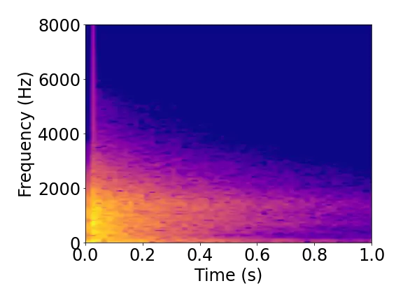
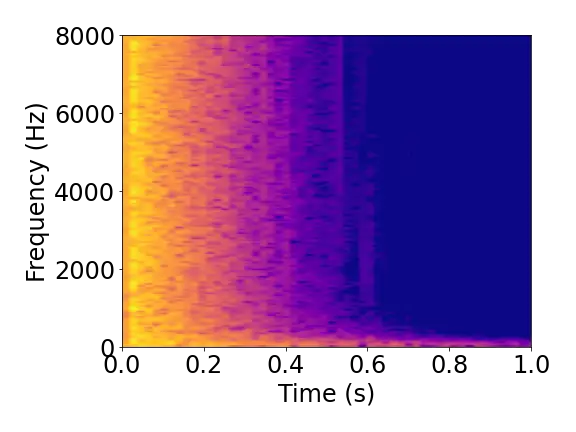
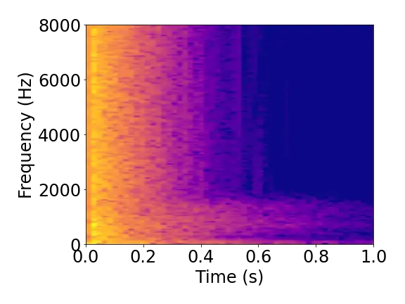
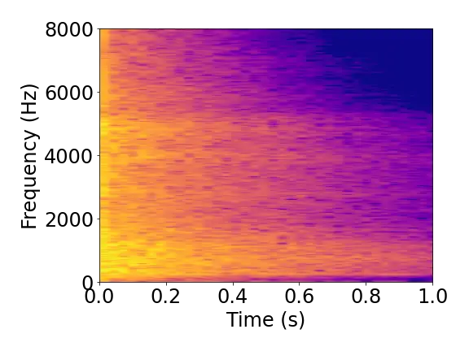
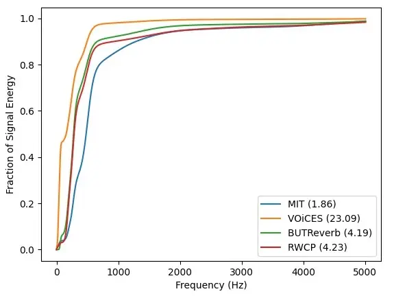

# Synthetic Wave-Geometric Impulse Responses for Improved Speech Dereverberation

Rohith Aralikatti    Zhenyu Tang    Dinesh Manocha

###### Abstract

We present a novel approach to improve the performance of learning-based
speech dereverberation using accurate synthetic datasets. Our approach
is designed to recover the reverb-free signal from a reverberant speech
signal. We show that accurately simulating the low-frequency components
of Room Impulse Responses (RIRs) is important to achieving good
dereverberation. We use the GWA dataset \[1\] that consists of synthetic
RIRs generated in a hybrid fashion: an accurate wave-based solver is
used to simulate the lower frequencies and geometric ray tracing methods
simulate the higher frequencies. We demonstrate that speech
dereverberation models trained on hybrid synthetic RIRs outperform
models trained on RIRs generated by prior geometric ray tracing methods
on four real-world RIR datasets.

^(†)^(†)address: University of Maryland, College Park

Index Terms: speech dereverberation, room impulse response synthesis,
synthetic data augmentation

## 1 Introduction

Speech processing applications tend to exhibit lower performance in the
presence of reverberation. Several research works have documented this
phenomenon for standard tasks such as automatic speech recognition
(ASR) \[2\] and speech separation \[3\]. The degradation in model
performance can be attributed to a few factors. These include
reverberant distortions that cause a reduction in signal intelligibility
and the distributional mismatch between reverb-free training data and
noisy reverberant test data.

A straightforward way to reduce such mismatch is to collect more
training data similar to the test data in specific environments.
However, speech data that includes diverse environmental effects can be
difficult to collect in the real world. One common approach to improving
ASR model robustness under real-world reverberation is by artificially
converting annotated clean speech to reverberant speech data and
re-training the ASR model. This is typically performed by convolving
clean speech data with room impulse responses (RIRs) corresponding to
different environments. An RIR encodes how an environment modifies
sounds for a specified source and receiver location pair, based on
propagation of sound in the environment. Alternatively, without
re-training the ASR model, one can utilize a speech dereverberation
model as a pre-processing layer to remove environmental reverberation
for a generic ASR model. Speech dereverberation has been shown to
improve the performance of various tasks such as ASR and speaker
verification \[4\].

Several recent works have proposed learning-based solutions for speech
dereverberation  \[4, 5, 6\]. Training robust speech dereverberation
models requires the existence of large high-quality RIR datasets to
capture all possible variations present in real environments. However,
capturing real-world RIRs is a time-consuming process that requires
professional or expensive hardware \[7\]. There is a large body of work
on generating synthetic RIRs using sound simulation algorithms. These
sound propagation methods \[8\] can be broadly categorized into two main
categories: geometric or ray tracing-based methods \[9, 10\] and
wave-based or numeric methods \[11, 12\]. Geometric methods are based on
a fundamental assumption that sound waves travel as rays and undergo
geometric reflections from object surfaces. However, this assumption is
not valid for low-frequency sounds (e.g., $`<1000Hz`$). In these cases,
the wavelength of the sound is comparable to the size of common objects
present in daily life and significant non-linear wave effects can occur.
We need to use accurate numeric solvers of wave-equations to simulate
these sound effects.

Main Contributions: Some novel components of our work include:

- •
  We show that accurately modeling the low-frequency components of RIRs
  is important to obtain better dereverberation.
- •
  We show that the hybrid approach that combines wave and geometric
  methods for simulating RIRs improves Speech-to-Reverberation
  Modulation energy Ratio (SRMR) by $`8.3\%`$ (average) relative to the
  synthetic RIRs generated using geometric methods.

## 2 Related Work

### 2.1 Speech Dereverberation

Several approaches have been proposed to solve speech dereverberation.
Weighted Prediction Error (WPE) \[13\] is one such method that uses
variance delayed linear prediction to estimate the late reverberation
present in the signal. Ernst et al. \[5\] proposed a fully convolutional
network (FCN) for speech dereverberation. Koothapally et al. proposed
SkipConvNet \[4\], an improved FCN with skip connections between the
encoder and decoder layers. MetricGAN \[6\] utilized a GAN-based
approach where the generator attempted to maximize speech metrics such
as Perceptual Evaluation of Speech Quality (PESQ) and
Speech-to-Reverberation Modulation energy Ratio (SRMR). In the works
above, the dereverberation models have been trained on reverberant data
generated from a limited quantity of recorded RIRs. There has not been
much work done on utilizing different synthetic RIR generation methods
to train dereverberation models that can generalize well to a large
variety of acoustic environments at test time.

### 2.2 Synthetic Data for Speech Processing

There is considerable work on generating synthetic datasets and RIRs to
improve the accuracy of learning-based speech processing applications.
Many speech processing works have used geometric acoustic simulation
methods to generate synthetic training data. One of the most widely used
methods is the *image-source method (ISM)* \[9\], which assumes pure
specular reflections for sound rays and builds “image sources” by
mirroring the source according to known planar surfaces in the scene.
The use of ISM simulation has resulted in significant improvement in
speech recognition performance for some applications \[2\]. Other
methods improve the accuracy of RIRs by also modeling diffuse sound
reflections on rough surfaces. These include path tracing methods \[10\]
based on efficient Monte Carlo path tracing \[14\] and beam or frustum
tracing methods \[15\]. These _geometric acoustic (GA)_ methods can
generate more accurate RIRs than ISM simulations and have been
beneficial for speech processing benchmarks \[16\]. Wave-based
simulation methods result in the most realistic RIRs. They are described
in more detail in Section. 3.1.



(a) FDTD RIR



(b) Geometric RIR



(c) Hybrid RIR



(d) Real RIR

Figure 1: Comparison of spectrograms for real and synthetic RIRs (darker
area has lower energy). The FDTD simulation is used to compute the lower
frequency components in the hybrid spectrogram, which matches the FDTD
spectrogram. The synthetic RIRs in (a)(b)(c) are all generated in the
same conditions and environment. A real RIR (d) from the MIT IR dataset
is chosen for qualitative comparison since the synthetic RIRs do not aim
to match this particular scene. We observe that the low frequency
components in the real RIR have stronger energy while the geometric RIR
has a relatively flat distribution, and the hybrid RIR has a similar
energy distribution to that of the real RIR.

## 3 Training with Low-Frequency Speech

In speech processing, the fundamental frequency of human speech is
generally below 250Hz \[17\], although the usual sampling rate is above
8,000Hz. It is also evident that low-frequency components in speech play
an important role for speech intelligibility \[18\] and contribute
strongly to tone recognition in various languages \[19\]. In addition,
some speech processing models show that the convolution layers learn
directly from speech data to emphasize low-frequency speech regions
(below 1000Hz) \[20\]. Tang et al. \[21\] show that compensating the
low-frequency simulation components by matching the equalization
distributions of synthetic RIRs with those of real RIRs reduces the Word
Error Rate (WER) of ASR systems in certain conditions.

These findings show that low-frequency speech signals should be modeled
accurately and that they could have significant impacts on the models
trained using such accurate data. Most prior methods for generating
synthetic RIRs and datasets (see Section 2.3) only use geometric
acoustic simulation methods. some important low-frequency room acoustic
effects or components are often missing in GA simulations. One obvious
caveat of geometric methods is sound diffraction, in which a geometric
sound ray can easily be blocked by a small obstacle between the source
and the listener. However, such results clearly deviate from real-world
physics, as the sound wave tends to bend over small obstacles. Our goal
is to model these effects accurately.

### 3.1 Wave-Based Acoustic Simulation

We use wave-based methods to generate accurate RIRs. A scalar acoustic
pressure field, $`P(\boldx,t)`$, satisfies the wave equation

```math
\frac{\partial^{2}P(\boldx,t)}{\partial t^{2}}-c^{2}\nabla^{2}P(\boldx,t)=f(\boldx,t), \tag{1}
```

where $`c`$ is the speed of sound, $`\boldx`$ is the 3D coordinate, and
$`f(\boldx,t)`$ is the forcing term, usually representing some driving
source signal. An RIR can be obtained by setting $`f(\boldx,t)`$ to an
impulse signal at a source location $`\boldx_{s}`$, fixing
$`P(\boldx,t)`$ at the receiver location $`\boldx_{r}`$ and extracting
its time-varying component. The wave equation can be solved numerically
using different solvers: finite-difference time domain (FDTD) \[11\],
finite-element (FEM) method \[12\], the adaptive rectangular
decomposition (ARD) method \[22\], etc. Wave-based methods can correctly
model sound diffraction for non-line-of-sight (NLOS) source and listener
pairs, which are common in real world scenarios. Furthermore, room shape
can add extra resonant frequencies that modify the RIR at some locations
due to standing waves. This phenomenon is more dominant at low
frequencies and is called _room modes_, which is also modeled by
wave-based methods but not geometric methods.

### 3.2 Datasets

Despite its high accuracy in the low-frequency range, wave acoustic
simulation can be time consuming.. We use pre-computed RIRs that combine
the low-frequency components from wave-based simulations and
high-frequency components from geometric simulations. Specifically, we
utilize RIRs from the GWA dataset¹¹ 1
https://gamma.umd.edu/pro/sound/gwa \[1\]. GWA contains 2 million
realistic RIRs simulated in more than 5,600 rooms with diverse
real-world material configurations. In order to generate synthetic RIRs,
source and listener locations are uniformly sampled in each 3D room
model with furniture and pre-assigned acoustic materials. Wave acoustic
results are obtained with an FDTD solver up to 1,400Hz, as that is the
chosen cutoff frequency in \[1\]. The complexity of wave simulation
increases as the third or fourth power of maximum simulation frequency
\[22\] and hence it needs to be capped to keep computation time
reasonable. GA results are obtained using a geometric simulator that
captures both specular and diffuse reflections for the full frequency
range (i.e., at a sample rate of 48,000Hz). A hybrid scheme (explained
in detail in \[1\]) is used to combine RIRs from both wave and geometric
simulations (i.e. hybrid RIRs) at a crossover frequency of 1,400Hz,
which yields the _hybrid_ RIRs.

| Dataset     | No. of RIRs | $`T_{60}`$ (in seconds) |
| ----------- | ----------- | ----------------------- |
| MIT         | 270         | 0.41+/-0.48             |
| VOiCES      | 64          | 3.75+/-0.45             |
| BUTReverb   | 1674        | 1.03+/-0.49             |
| RWCP Aachen | 325         | 0.58+/-0.61             |

Table 1: RIR datasets used for testing our approach.

### 3.3 Model Architecture

| Dataset     | No Enhancement | WPE  | real+synthetic |      |      | synthetic |      |      |
| ----------- | -------------- | ---- | -------------- | ---- | ---- | --------- | ---- | ---- |
|             |                |      | Hybrid         | Geo  | FDTD | Hybrid    | Geo  | FDTD |
| MIT         | 7.35           | 8.16 | 8.76           | 8.6  | 7.33 | 7.64      | 7.71 | 5.31 |
| BUTReverb   | 3.14           | 3.44 | 6.7            | 6.43 | 5.23 | 4.69      | 2.66 | 0.28 |
| VOiCES      | 1.09           | 1.44 | 4.85           | 3.94 | 2.09 | 2.15      | 1.79 | 1.7  |
| RWCP Aachen | 5.16           | 5.68 | 7.21           | 6.85 | 5.34 | 6.08      | 5.23 | 4.69 |

Table 2: Speech dereverberation results on different real world RIR
datasets.

We train the SkipConvNet \[4\] model to evaluate the benefits of
synthetic RIRs on different datasets. We use the default parameters from
their public-domain implementation²² 2
https://github.com/zehuachenImperial/SkipConvNet. SkipConvNet is a
fully-convolutional network that consists of an encoder and a decoder
block. The input to the network consists of the log-power spectrum (LPS)
of the reverberant speech signal. This model predicts the enhanced LPS,
which is combined with the phase of the reverberant signal to generate
the enhanced signal. The model is optimized using the Mean-Square Error
(MSE) loss. More details of the architecture are given in \[4\].

### 3.4 Experiment Setup

The clean speech signals are obtained from the 100-hour split of the
Librispeech \[23\] dataset. Reverberant signals are generated by
convolving the clean speech signals with real and synthetic RIRs. We
test our approach on real RIRs from the four different datasets
mentioned in Table. 1. For each of the test RIR datasets, we sample
50,000 training RIRs for each RIR generation method (hybrid, geometric
and FDTD). The RIR sampling procedure is done such that the $`T_{60}`$
distribution of the sampled RIRs matches that of the corresponding test
dataset. The model is trained using the ADAM optimizer with an initial
learning rate of 0.0001. Early stopping is used to prevent the model
from overfitting to synthetically generated RIRs. Two different training
runs are carried out. In the first, the training set only consists of
synthetically generated RIRs (i.e., only RIRs from the GWA dataset). In
the second run, training RIRs consist of real and synthetic RIRs. For
the training run with both real and synthetic RIRs, half of the samples
in each batch were created from synthetic RIRs; the other half were
created from real RIRs. The validation and test sets were generated from
a small quantity of real RIRs. The real RIRs from the four datasets
mentioned in the table are split in the ratio 80:10:10 to generate the
train, dev and test splits, respectively.

## 4 Results and Analysis

### 4.1 Results

We test our speech dereverberation models on reverberant speech
generated using RIRs from four RIR datasets: BUT Reverb dataset \[24\],
MIT IR dataset \[25\], RWCP Aachen + REVERB RIRs \[2\], and VOiCES IR
dataset \[26\]. The number of RIRs and the $`T_{60}`$ distribution of
each of these datasets is shown in Table 1. The main results in terms of
accuracy of the speech dereverberation model trained using different
sets of RIRs are present in Table 2. We compute the
speech-to-reverberation modulation energy ratio (SRMR) \[27\] as a
measure of reverberation. We compute SRMR for two baselines: (a) the
reverberant signal without any enhancement applied and (b) the enhanced
signal obtained by the Weighted Prediction Error (WPE) \[13\]
dereverberation algorithm. We obtain the best performance for the hybrid
RIR generation approach for the following cases: (a) when training data
consists of synthetic RIRs only and (b) when training data consists of
synthetic and real RIRs. The addition of real RIRs to the training data
significantly improves the SRMR of the enhanced signal. This suggests
that there still exists a domain gap between synthetically generated
RIRs and real RIRs. However, we observe that across all RIR datasets and
for both real and real+synthetic training runs, the hybrid approach
performs better than traditional geometric-based RIR generation methods.
The FDTD approach frequently performs worse than the no enhancement
baseline, but this is to be expected as the wave solver only simulates
frequencies up to 1400 Hz and all higher frequencies in the speech are
lost after convolution. In most cases, we observe that both hybrid and
geometric approaches perform better than the WPE baseline. For the
real+synthetic training run, the hybrid approach shows a relative
improvement in the range of $`7.5\%`$ - $`236\%`$ across all four test
sets when compared to the WPE method. The best improvement in SRMR is
observed for the BUTReverb and VOiCES datasets, which consist of RIRs
with the largest $`T_{60}`$ values. Our hybrid approach also results in
an average improvement (computed over the four test datasets) of
$`8.3\%`$ for the real+synthetic case and $`28.2\%`$ for the synthetic
only case, as compared to using RIRs generated using only GA methods.

### 4.2 Analysis of Hybrid vs. Geometric Methods

|             |               |                         |
| ----------- | ------------- | ----------------------- |
| Dataset     | Rel. Imp. (%) | Fraction of reverberant |
|             | in SRMR       | signal energy \<250 Hz  |
| MIT IR      | 1.86          | 0.17                    |
| BUTReverb   | 4.19          | 0.4                     |
| VOiCES      | 23.09         | 0.66                    |
| RWCP Aachen | 4.23          | 0.37                    |

Table 3: We tabulate the relative improvement in SRMR and the fraction
of the reverberant signal energy present in the low frequencies for all
four datasets.



Figure 2: The plot below shows the cumulative signal energy (represented
as a fraction of total signal energy) as a function of frequency. The
number in brackets in the legend represents the relative improvement
offered by hybrid simulation over geometric simulation.

In Table. 3, we tabulate the relative improvement in SRMR and fraction
of low-frequency signal energy. For each dataset, we compute the average
fraction of signal energy present in the low frequency component
($`<250`$ Hz) of the reverberant signal across the entire test set. We
choose 250 Hz as the cutoff frequency because the fundamental frequency
range of human speech is generally below 250Hz \[17\]. We observe that
this quantity positively correlates with the relative improvement
offered by the hybrid method over the geometric method. The Pearson
correlation coefficient of these two quantities (present in Table. 3) is
0.9126. This confirms that more accurate simulation of the low-frequency
component of the RIR leads to improved speech dereverberation. Figure. 2
shows the distribution of reverberant signal energy as a function of
frequency for all four RIR datasets. From the figure, we can see larger
gains from the hybrid approach when the signal energy is more prevalent
in lower frequencies.

## 5 Conclusion and Future Work

We have demonstrated that accurate wave-based solvers can be used to
obtain more accurate simulations of RIRs to train the learning models
for speech reverberation. Our proposed approach of augmenting the
training process with synthetic RIRs generated from a hybrid combination
of geometry-based and wave-based simulations has shown significant
improvement in the performance of learning-based speech dereverberation
models. We also see a high correlation between the improvement in SRMR
with the fraction of the reverberant signal energy at lower frequencies.

## References

- \[1\] Z. Tang, R. Aralikatti, A. J. Ratnarajah, and D. Manocha, “Gwa:
  A large high-quality acoustic dataset for audio processing,” ser.
  SIGGRAPH, 2022.
- \[2\] T. Ko, V. Peddinti, D. Povey, M. L. Seltzer, and S. Khudanpur,
  “A study on data augmentation of reverberant speech for robust speech
  recognition,” in _ICASSP_, 2017.
- \[3\] R. Aralikatti, A. Ratnarajah, Z. Tang, and D. Manocha,
  “Improving reverberant speech separation with synthetic room impulse
  responses,” in _IEEE ASRU_, 2021.
- \[4\] V. Kothapally _et al._, “Skipconvnet: Skip convolutional neural
  network for speech dereverberation using optimally smoothed spectral
  mapping,” _arXiv_, 2020.
- \[5\] O. Ernst, S. E. Chazan, S. Gannot, and J. Goldberger, “Speech
  dereverberation using fully convolutional networks,” in _2018 26th
  European Signal Processing Conference_. IEEE, 2018, pp. 390–394.
- \[6\] S.-W. Fu, C.-F. Liao, Y. Tsao, and S.-D. Lin, “Metricgan:
  Generative adversarial networks based black-box metric scores
  optimization for speech enhancement,” in _ICML_, 2019.
- \[7\] A. Farina, “Simultaneous measurement of impulse response and
  distortion with a swept-sine technique,” in _Audio engineering society
  convention 108_. Audio Engineering Society, 2000.
- \[8\] S. Liu and D. Manocha, “Sound synthesis, propagation, and
  rendering: A survey,” _arXiv preprint arXiv:2011.05538_, 2020.
- \[9\] J. B. Allen and D. A. Berkley, “Image method for efficiently
  simulating small-room acoustics,” _The Journal of the Acoustical
  Society of America_, 1979.
- \[10\] M. Taylor, A. Chandak, Q. Mo, C. Lauterbach, C. Schissler, and
  D. Manocha, “Guided multiview ray tracing for fast auralization,”
  _IEEE TVCG_, 2012.
- \[11\] D. Botteldooren, “Finite-difference time-domain simulation of
  low-frequency room acoustic problems,” _The Journal of the Acoustical
  Society of America_, 1995.
- \[12\] L. L. Thompson, “A review of finite-element methods for
  time-harmonic acoustics,” _The Journal of the Acoustical Society of
  America_, 2006.
- \[13\] T. Nakatani, T. Yoshioka _et al._, “Speech dereverberation
  based on variance-normalized delayed linear prediction,” _Transactions
  on Audio, Speech, and Language Processing_, 2010.
- \[14\] J. T. Kajiya, “The rendering equation,” in _ACM SIGGRAPH
  computer graphics_. ACM, 1986.
- \[15\] T. Funkhouser _et al._, “A beam tracing approach to acoustic
  modeling for interactive virtual environments,” in _Proceedings of the
  25th annual conference on Computer graphics and interactive
  techniques_, 1998.
- \[16\] Z. Tang, L. Chen, B. Wu, D. Yu, and D. Manocha, “Improving
  reverberant speech training using diffuse acoustic simulation,” in
  _IEEE ICASSP_, 2020.
- \[17\] H. Traunmüller and A. Eriksson, “The frequency range of the
  voice fundamental in the speech of male and female adults,”
  _Unpublished manuscript_, vol. 11, 1995.
- \[18\] C. A. Brown and S. P. Bacon, “Low-frequency speech cues and
  simulated electric-acoustic hearing,” _The Journal of the Acoustical
  Society of America_, 2009.
- \[19\] X. Luo and Q.-J. Fu, “Contribution of low-frequency acoustic
  information to chinese speech recognition in cochlear implant
  simulations,” _The Journal of the Acoustical Society of America_, vol.
  120, no. 4, pp. 2260–2266, 2006.
- \[20\] H. Muckenhirn, M. M. Doss, and S. Marcell, “Towards directly
  modeling raw speech signal for speaker verification using CNNs,” in
  _IEEE ICASSP_, 2018.
- \[21\] Z. Tang, H.-Y. Meng, and D. Manocha, “Low-frequency compensated
  synthetic impulse responses for improved far-field speech
  recognition,” in _IEEE ICASSP_, 2020.
- \[22\] N. Raghuvanshi, R. Narain, and M. C. Lin, “Efficient and
  accurate sound propagation using adaptive rectangular decomposition,”
  _IEEE TVCG_, 2009.
- \[23\] V. Panayotov, G. Chen, D. Povey, and S. Khudanpur,
  “Librispeech: an asr corpus based on public domain audio books,” in
  _IEEE ICASSP_, 2015.
- \[24\] I. Szöke, M. Skácel, L. Mošner, J. Paliesek, and J. Černocký,
  “Building and evaluation of a real room impulse response dataset,”
  _IEEE Journal of Selected Topics in Signal Processing_, 2019.
- \[25\] J. Traer and J. H. McDermott, “Statistics of natural
  reverberation enable perceptual separation of sound and space,”
  _Proceedings of the National Academy of Sciences_, 2016.
- \[26\] C. Richey, M. A. Barrios _et al._, “Voices obscured in complex
  environmental settings (voices) corpus,” _arXiv preprint
  arXiv:1804.05053_, 2018.
- \[27\] J. F. Santos, M. Senoussaoui, and T. H. Falk, “An improved
  non-intrusive intelligibility metric for noisy and reverberant
  speech,” in _14th International Workshop on Acoustic Signal
  Enhancement_. IEEE, 2014, pp. 55–59.
