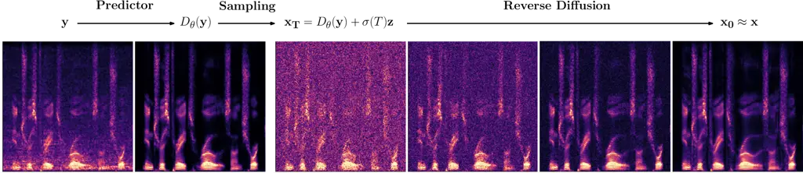
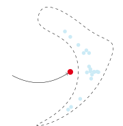
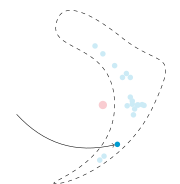
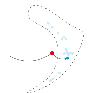
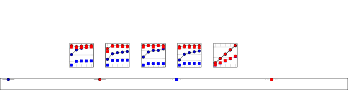
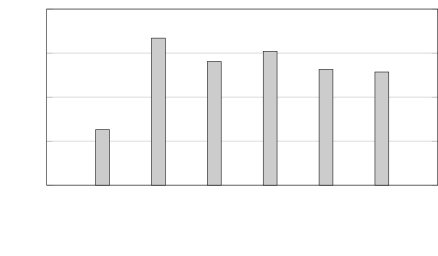

STFT  
short-time Fourier transform

iSTFT  
inverse short-time Fourier transform

DNN  
deep neural network

PESQ  
Perceptual Evaluation of Speech Quality

POLQA  
perceptual objectve listening quality analysis

WPE  
weighted prediction error

PSD  
power spectral density

RIR  
room impulse response

SNR  
signal-to-noise ratio

LSTM  
long short-term memory

POLQA  
Perceptual Objectve Listening Quality Analysis

SDR  
signal-to-distortion ratio

ESTOI  
extended short-term objective intelligibility

ELR  
early-to-late reverberation ratio

TCN  
temporal convolutional network

RLS  
recursive least squares

ASR  
automatic speech recognition

HA  
hearing aid

CI  
cochlear implant

MAC  
multiply-and-accumulate

VAE  
variational auto-encoder

GAN  
generative adversarial network

T-F  
time-frequency

SDE  
stochastic differential equation

DRR  
direct to reverberant ratio

LSD  
log spectral distance

SI-SDR  
scale-invariant signal to distortion ratio

SI-SIR  
scale-invariant signal to interference ratio

SI-SAR  
scale-invariant signal to artifacts ratio

MOS  
mean opinion score

WER  
word error rate

MAP  
maximum a-posteriori

NFE  
number of function evaluations

MAC  
multiply-accumulate

RTF  
real-time factor

# StoRM: A Diffusion-based Stochastic Regeneration Model for Speech Enhancement and Dereverberation

Jean-Marie
Lemercier [](https://orcid.org/0000-0002-8704-7658)
   Julius
Richter [](https://orcid.org/0000-0002-7870-4839)
   Simon
Welker [](https://orcid.org/0000-0002-6349-8462)
   Timo
Gerkmann [](https://orcid.org/0000-0002-8678-4699)
^(†)^(†)thanks: This work has been funded by the Federal Ministry for
Economic Affairs and Climate Action, project 01MK20012S, AP380, the
German Research Foundation (DFG) in the transregio project Crossmodal
Learning (TRR 169) and DASHH (Data Science in Hamburg - HELMHOLTZ
Graduate School for the Structure of Matter) with the Grant-No.
HIDSS-0002.^(†)^(†)thanks: Simon Welker is with the Signal Processing
Group, Department of Informatics, Universität Hamburg, 22527 Hamburg
Germany, and with the Center for Free-Electron Laser Science, DESY,
22607 Hamburg, Germany (e-mail:
simon.welker@uni-hamburg.de).^(†)^(†)thanks: The other authors are with
the Signal Processing Group, Department of Informatics, Universität
Hamburg, 22527 Hamburg Germany (e-mail: {jeanmarie.lemercier;
julius.richter; timo.gerkmann}@uni-hamburg.de).

###### Abstract

Diffusion models have shown a great ability at bridging the performance
gap between predictive and generative approaches for speech enhancement.
We have shown that they may even outperform their predictive
counterparts for non-additive corruption types or when they are
evaluated on mismatched conditions. However, diffusion models suffer
from a high computational burden, mainly as they require to run a neural
network for each reverse diffusion step, whereas predictive approaches
only require one pass. As diffusion models are generative approaches
they may also produce vocalizing and breathing artifacts in adverse
conditions. In comparison, in such difficult scenarios, predictive
models typically do not produce such artifacts but tend to distort the
target speech instead, thereby degrading the speech quality. In this
work, we present a stochastic regeneration approach where an estimate
given by a predictive model is provided as a guide for further
diffusion. We show that the proposed approach uses the predictive model
to remove the vocalizing and breathing artifacts while producing very
high quality samples thanks to the diffusion model, even in adverse
conditions. We further show that this approach enables to use lighter
sampling schemes with fewer diffusion steps without sacrificing quality,
thus lifting the computational burden by an order of magnitude. Source
code and audio examples are available online¹¹ 1
https://uhh.de/inf-sp-storm.

###### Index Terms: 

score-based generative models, diffusion models, speech enhancement,
speech dereverberation, predictive learning.

## I Introduction

In real-life scenarios and modern communication devices, clean speech
sources are often polluted by background noise, interfering speakers,
room acoustics and codec degradation \[1, 2\]. We refer to this
phenomenon as speech corruption, and denote by speech restoration the
art of recovering clean speech from the corrupted signal \[3\]. On the
one hand, traditional speech restoration methods leverage the
statistical properties of the target and interference signals in various
domains e.g. time, spectrum, cepstrum or spatial distribution \[4\]. On
the other hand, machine learning techniques try to learn these
statistical properties and how to exploit them from data \[5\]. Machine
learning algortihms can be categorized into predictive (also called
discriminative) approaches and generative approaches. We will choose the
term _predictive_ over _discriminative_ as it fits both classification
and regression tasks \[6\]. The field of speech restoration is dominated
by predictive approaches that use supervised learning to learn a single
best deterministic mapping between corrupted speech $`\mathbf{y}`$ and
the corresponding clean speech target $`\mathbf{x}`$ \[5\]. These
methods include for instance tf (tf) masking \[7\], time domain
methods \[8, 9\] or direct spectro-temporal mapping \[10\]. They have
contributed to drastically increasing the quality of speech restoration
algorithms. However, they can distort target speech and suffer from
generalizability issues \[11, 12\].

In contrast, generative models implicitly or explicitly learn the target
distribution and allow to generate multiple valid estimates instead of a
single best estimate as for predictive approaches \[6\]. Generative
approaches include vae learning explicit density estimations \[13, 14,
15, 16\], normalizing flows adding invertible transforms to obtain
tractable marginal likelihoods \[17, 18\], gan estimating implicit
distributions \[19, 20\] and diffusion approaches \[21, 22, 23\]. We
talk of conditional generative models when a covariate $`\mathbf{c}`$ is
used to guide the generation, leading to the conditional distribution
$`p(\mathbf{x}|\mathbf{c})`$\[6\]. This conditioning can either be
another modality describing the data (e.g. $`\mathbf{c}`$ could be video
when $`\mathbf{x}`$ is speech), or a modified version of the data, an
obvious example being corrupted speech $`\mathbf{y}`$ when the
underlying task is speech restoration. By integrating stochasticity in
their latent structure, generative models can capture the inherent
uncertainty of the data distribution and produce realistic samples
belonging to that distribution rather than a mean of optimal candidates
\[6\]. In doing so, they may obtain better perceptual metrics at the
cost of higher point-wise distortion \[24\]. In the imaging domain, it
was observed that predictive approaches tend to brush over the
fine-grained details of the considered domain \[24, 25\]. Furthermore,
predictive models may result in limited generalization abilities towards
unseen noise types or speakers as compared to generative models, which
is demonstrated for diffusion-based generative speech enhancement in
\[12\].

We focus in this work on such diffusion-based generative models, or
simply diffusion models, which have met great success in generating
high-quality samples of natural images \[21, 22, 23, 26\]. Diffusion
models use a forward process to slowly turn data into a tractable prior,
usually a standard normal distribution, and train a neural network to
solve the reverse process to generate clean data from this prior \[27\].
These diffusion models can also be used for conditional generation in
restoration tasks, which has recently been proposed for speech
processing tasks such as enhancement and dereverberation \[28, 12, 29,
30\] as well as bandwidth extension \[11, 31\].

One limiting aspect of diffusion models is their heavy computational
burden. Several steps are needed for reverse diffusion, each of them
calling the neural network used for score estimation. Much effort has
been recently put into reducing this number of steps, either by
optimization of the reverse noise schedule \[32\], modifications in the
formulation of the diffusion processes \[33, 34\], or projection into a
latent space \[35\] or a reduced subspace \[36\]. We also observed in
past experiments that our previously proposed diffusion model is prone
to confuse phonemes and generate vocalizing artifacts when facing very
adverse conditions. This is due to the generative behaviour of the model
under high uncertainty over the presence or nature of speech, and this
naturally leads to a degradation, e.g. in asr (asr).

In this work, we propose a stochastic regeneration scheme combining
predictive and generative models to produce high quality samples while
reducing the computational burden of diffusion models and their tendency
to generate unwanted artifacts. We propose to first use a predictive
approach to estimate a restored version of the corrupted speech. This
estimate is then used as a guide by a diffusion model, which requires
only a few diffusion steps to output a final clean speech estimation
where the distortions introduced by the predictive stage are corrected
while vocalizing artifacts and phonetic confusions are avoided. Both
listening experiments and instrumental metrics confirm an impressive
state-of-the-art perceptual quality of our proposed approach. Other
refinement approaches using diffusion models were recently proposed. The
stochastic refinement approach \[24, 37\] subtracts the output of the
predictive model from the corrupted speech, and this residual is used
for further estimation by a diffusion model. We argue hereafter that
learning the residual is however a hard task and demonstrate that our
approach outperforms this stochastic refinement in terms of
instrumentally measured speech quality. Another refinement approach
using diffusion models is denoising diffusion restoration models \[38,
39, 40\], where the corruption operator is assumed to be known (or at
least its singular value decomposition) and is used to modify the
reverse diffusion process at inference time.

We evaluate our proposed approach for speech enhancement with low input
snr and speech dereverberation, using clean speech from the WSJ0 corpus
\[41\]. We also show asr results on the TIMIT dataset \[42\], and report
results on the standardized Voicebank/DEMAND dataset \[43\]. Ablation
studies are performed on sampling efficiency, intial predictor mismatch
and training strategy.

## II Score-based Diffusion Models

Diffusion models originally use discrete-time diffusion processes
modeled by Markov chains \[22\]. They have been recently extended to
continuous-time diffusion processes formulated by sde in \[44\],
allowing for new training paradigms such as score matching \[45, 46\].
This class model is subsequently denoted as score-based diffusion
models. Score-based diffusion models are defined by three components: a
forward diffusion process, a score function estimator, and a sampling
method for inference.

### II-A Forward and reverse processes

The stochastic forward process $`\{\mathbf{x}_{\tau}\}_{\tau=0}^{T}`$
used in score-based diffusion models is defined as an Itô sde \[47,
44\]:

```math
\mathrm{d}{\mathbf{x}_{\tau}}=\mathbf{f}(\mathbf{x}_{\tau},\tau)\mathrm{d}{\tau}+g(\tau)\mathrm{d}{\mathbf{w}}, \tag{1}
```

where $`\mathbf{x}_{\tau}`$ is the current state of the process indexed
by $`\tau\in[0,T]`$ with the initial condition representing clean speech
$`\mathbf{x}_{0}=\mathbf{x}`$. The continuous diffusion time variable
$`\tau`$ relates to the progress of the stochastic process and should
not be mistaken for our usual notion of signal time. As our process is
defined in the complex spectrogram domain, independently for each tf
bin, the variables in bold are vectors in $`\mathbb{C}^{d}`$ containing
the coefficients of a flattened complex spectrogram— with $`d`$ the
product of the time and frequency dimensions— whereas variables in
regular font represent real scalar values. The set
$`\{\mathbf{x}_{\tau}\}_{\tau\in]0,T[}`$ can be seen as latent variables
used to parameterize the conditional distribution
$`p(\mathbf{x}_{\tau}|\mathbf{x}_{0},\mathbf{y})`$. The stochastic
process $`\mathbf{w}`$ denotes a standard $`d`$-dimensional Brownian
motion, that is, $`\mathrm{d}{\mathbf{w}}`$ is a zero-mean Gaussian
variable with standard deviation $`\mathrm{d}{\tau}`$ for each tf bin.

The _drift_ function $`\mathbf{f}`$ and _diffusion_ coefficient $`g`$ as
well as the initial condition $`\mathbf{x}_{0}`$ and the final diffusion
time $`T`$ uniquely define the Itô process
$`\{\mathbf{x}_{\tau}\}_{\tau=0}^{T}`$\[47\]. Under some regularity
conditions on $`\mathbf{f},g`$ allowing a unique and smooth solution to
the Kolmogorov equations associated to (1), the reverse process
$`\{\mathbf{x}_{\tau}\}_{\tau=T}^{0}`$ is another diffusion process
defined as the solution of the following sde \[48, 44\]:

```math
\mathrm{d}{\mathbf{x}_{\tau}}=\left[-\mathbf{f}(\mathbf{x}_{\tau},\tau)+g(\tau)^{2}\nabla_{\mathbf{x}_{\tau}}\log p_{\tau}(\mathbf{x}_{\tau})\right]\mathrm{d}{\tau}+g(\tau)\mathrm{d}{\bar{\mathbf{w}}}, \tag{2}
```

where $`\mathrm{d}{\bar{\mathbf{w}}}`$ is a $`d`$-dimensional Brownian
motion for the time flowing in reverse and
$`\nabla_{\mathbf{x}_{\tau}}\log p_{\tau}(\mathbf{x}_{\tau})`$ is the
_score function_, i.e. the gradient of the logarithm data distribution
for the current process state $`\mathbf{x}_{\tau}`$.

Speech restoration tasks can be regarded either as one-to-one mapping
tasks between corrupted speech $`\mathbf{y}`$ and $`\mathbf{x}_{0}`$,
which leads to predictive modelling; or as conditional generation tasks,
i.e. generation of $`\mathbf{x}_{0}`$ conditioned on $`\mathbf{y}`$.
Previous diffusion-based approaches proposed to condition the process
explicitly within the neural network \[49\] or through guided
classification \[26\]. In \[28\], the conditioning is directly
incorporated into the diffusion process by defining the forward process
as the solution to the following sde:

```math
\mathrm{d}{\mathbf{x}_{\tau}}=\underbrace{\gamma(\mathbf{y}-\mathbf{x}_{\tau})}_{:=\,\mathbf{f}(\mathbf{x}_{\tau},\mathbf{y})}\mathrm{d}{\tau}+\underbrace{\left[\sigma_{\text{min}}\left(\frac{\sigma_{\text{max}}}{\sigma_{\text{min}}}\right)^{\tau}\sqrt{2\log\left(\frac{\sigma_{\text{max}}}{\sigma_{\text{min}}}\right)}\right]}_{:=\,g(\tau)}\mathrm{d}{\mathbf{w}} \tag{3}
```

This equation belongs to the class of Ornstein-Uhlenbeck sde \[47\], a
subclass of Itô sde in which the drift function $`\mathbf{f}`$ is affine
in $`\mathbf{x}_{\tau}`$ and does not depend on $`\tau`$, and the
diffusion coefficient $`g`$ only depends on $`\tau`$. The equation
introduces a _stiffness_ hyperparameter $`\gamma`$ controlling the slope
of the decay from $`\mathbf{y}`$ to $`\mathbf{x}_{0}`$, and
$`\sigma_{\text{min}}`$ and $`\sigma_{\text{max}}`$ are two
hyperparameters controlling the _noise scheduling_, that is, the amount
of Gaussian white noise injected at each timestep of the process.

The interpretation of our forward process in Eq. (3), visualized on
Fig. 1, is as follows: at each time step and for each tf bin
independently, an infinitesimal amount of corruption is added to the
current process state $`\mathbf{x}_{\tau}`$, along with Gaussian noise
with standard deviation $`g(\tau)\mathrm{d}{\tau}`$. Therefore, the mean
of the current process decays exponentially towards $`\mathbf{y}`$ while
the variance increases as in the variance-exploding scheme of Song et
al. \[44\], leading to a final distribution $`\mathbf{x}_{\tau}`$ which
is the corrupted signal $`\mathbf{y}`$ with some additional Gaussian
noise. Given an initial condition $`\mathbf{x}_{0}`$ and the covariate
$`\mathbf{y}`$, the solution to (3) admits the following complex
Gaussian distribution for the process state $`\mathbf{x}_{\tau}`$ called
_perturbation kernel_:

```math
p_{0,\tau}(\mathbf{x}_{\tau}|\mathbf{x}_{0},\mathbf{y})=\mathcal{N}_{\mathbb{C}}\left(\mathbf{x}_{\tau};\boldsymbol{\mu}(\mathbf{x}_{0},\mathbf{y},\tau),\sigma(\tau)^{2}\mathbf{I}\right), \tag{4}
```

Following \[50\], we determine closed-form solutions for the mean
$`\boldsymbol{\mu}`$ and variance $`\sigma(\tau)^{2}`$:

```math
\boldsymbol{\mu}(\mathbf{x}_{0},\mathbf{y},\tau)=\mathrm{e}^{-\gamma\tau}\mathbf{x}_{0}+(1-\mathrm{e}^{-\gamma\tau})\mathbf{y}\,, \tag{5}
```

```math
\sigma(\tau)^{2}=\frac{\sigma_{\text{min}}^{2}\left(\left(\nicefrac{{\sigma_{\text{max}}}}{{\sigma_{\text{min}}}}\right)^{2\tau}-\mathrm{e}^{-2\gamma\tau}\right)\log(\sfrac{\sigma\submax}{\sigma\submin})}{\gamma+\log(\sfrac{\sigma\submax}{\sigma\submin})}\,. \tag{6}
```

Fig. 1: Visualization of the forward and backward processes in (3). Mean
curve (5) is in solid black and variance (6) is represented by the
greyed area. Several realizations of the diffusion process are
represented by thin black lines. The mismatch between $`p_{\tau}`$
centered on $`\mathbf{x_{\tau}}`$ and $`\tilde{p}_{\tau}`$ centered on
$`\mathbf{y}`$ comes from the fact that the mean in (5) can not reach
$`\mathbf{y}`$ in finite time. This mismatch causes unavoidable bias in
the reverse process, even were the score perfectly known.

### II-B Score function estimator

When performing inference, one tries to solve the reverse sde in Eq.
(2). In the general case, the score function
$`\nabla_{\mathbf{x}_{\tau}}\log p_{\tau}(\mathbf{x}_{\tau})`$ is not
readily available, it can however be estimated by a dnn (dnn)
$`\mathbf{s}_{\phi}`$ called the _score model_. Given the simple
Gaussian form of the perturbation kernel
$`p_{0,\tau}(\mathbf{x}_{\tau}|\mathbf{x}_{0},\mathbf{y})`$ (4) and the
regularity conditions exhibited by the mean and variance, a _denoising
score matching_ objective can be used to train the score model
$`\mathbf{s}_{\phi}`$ \[45, 46\].

The score function of the perturbation kernel is:

```math
\nabla_{\mathbf{x}_{\tau}}\log p_{0,\tau}(\mathbf{x}_{\tau}|\mathbf{x}_{0},\mathbf{y})=-\frac{\mathbf{x}_{\tau}-\boldsymbol{\mu}(\mathbf{x}_{0},\mathbf{y},\tau)}{\sigma(\tau)^{2}}. \tag{7}
```

Once a clean utterance $`\mathbf{x}_{0}`$ and noisy utterance
$`\mathbf{y}`$ are picked in the training set, the current process state
is obtained as
$`\mathbf{x}_{\tau}=\boldsymbol{\mu}(\mathbf{x}_{0},\mathbf{y},\tau)+\sigma(\tau)\mathbf{z}`$,
with
$`\mathbf{z}\sim\mathcal{N}_{\mathbb{C}}\left(\mathbf{z};\mathbf{0},\mathbf{I}\right)`$.
We can therefore write the denoising score matching objective as follows
\[44\]:

```math
\mathcal{J}^{(\mathrm{DSM})}(\phi)=\mathbb{E}_{t,(\mathbf{x}_{0},\mathbf{y}),\mathbf{z},\mathbf{x}_{\tau}}\left[\norm{\mathbf s_\phi(\state, \noisy, \tau) + \frac{\mathbf z}{\sigma(\tau)}}_{2}^{2}\right]. \tag{8}
```

Here, we sample $`\tau`$ sampled uniformly in $`[\tau_{\epsilon},T]`$
where $`\tau_{\epsilon}`$ is a minimal diffusion time used to avoid
numerical instabilities. This approach is analogous to the denoising
objective used in the discrete-time formulation by \[22\], where one
estimates the noise added at each step to learn the reverse process.

### II-C Inference through reverse sampling

At inference time, we first sample an initial condition of the reverse
process, corresponding to $`\mathbf{x}_{T}`$, with:

```math
\mathbf{x}_{T}\sim\mathcal{N}_{\mathbb{C}}(\mathbf{x}_{T};\mathbf{y},\sigma^{2}(T)\mathbf{I}), \tag{9}
```

This sample only approximates the training condition, as the final
process distribution $`p_{T}(\mathbf{x}_{T})`$ does not perfectly match
$`p(\mathbf{y})`$ (see Fig. 1).

Conditional generation is then performed by solving the so-called
_plug-in reverse sde_ from $`\tau=T`$ to $`\tau=0`$, where the score
function is replaced by its estimator $`\mathbf{s}_{\phi}`$, assuming
the latter was trained e.g. according to Section II-B:

```math
\mathrm{d}{\mathbf{x}_{\tau}}=\left[-\mathbf{f}(\mathbf{x}_{\tau},\mathbf{y})+g(\tau)^{2}\mathbf{s}_{\phi}(\mathbf{x}_{\tau},\mathbf{y},\tau)\right]\mathrm{d}{\tau}+g(\tau)\mathrm{d}{\bar{\mathbf{w}}} \tag{10}
```

We use classical numerical solvers based on a discretization of (10)
according to a uniform grid of $`N`$ points on the interval $`[0,T]`$
(no minimal diffusion time is needed here). Classical solvers include
the Euler-Maruyama method, higher-order single-step methods, and
predictor-corrector sampler schemes \[44\]. In the latter, at each
reverse step $`\tau`$, the predictor uses a single-step method like
Euler-Maruyama to generate $`\mathbf{x}_{\tau}`$, and the corrector uses
the output of the score network to ensure consistency of the resulting
sample with a marginal distribution consistent with the score estimate.

For notational convenience, we will denote by $`G_{\phi}`$ the
generative model corresponding to the reverse diffusion process solver
parameterized by the plug-in sde (10) and the score network
$`\mathbf{s}_{\phi}`$, such that the final estimate is
$`\widehat{\mathbf{x}}=G_{\phi}(\mathbf{y})`$.

## III Stochastic Regeneration with Diffusion Models

### III-A Predictive artifacts for images and spectrograms

Most problems in speech restoration (e.g. denoising without knowledge of
the environmental noise signal, dereverberation or bandwidth extension)
are ill-posed inverse problems. This means that either (i) it is not
possible to exactly retrieve $`\mathbf{x}`$ given $`\mathbf{y}`$ (e.g.
dereverberation with a known non-minimum-phase room impulse response);
or (ii) many versions of clean speech $`\mathbf{x}^{(i)}`$ can
correspond to the same corrupted speech $`\mathbf{y}`$ (e.g. bandwidth
extension). Consider a predictive model $`D_{\theta}`$ trained with a
$`L^{2}`$ regression objective
$`\mathbb{E}_{(\mathbf{x},\mathbf{y})}||\mathbf{x}-D_{\theta}(\mathbf{y})||_{2}^{2}`$.
Because of the expectation over all training examples, an optimal
predictive model learns the mapping to the posterior mean
$`\mathbf{y}\rightarrow\mathbb{E}[\mathbf{x}|\mathbf{y}]`$, thereby
minimizing the average distortion over all training examples. This
phenomenon is known as regression to the mean \[24, 6\]. This can be
problematic if the posterior distribution $`p(\mathbf{x}|\mathbf{y})`$
has an intricate structure and is thus not well represented by its mean
$`\mathbb{E}[\mathbf{x}|\mathbf{y}]`$ (see Figure 5 here, or Figure 1 in
\[51\]).

In image processing problems, this translates to predictive approaches
being incapable of reproducing fine-grained details like e.g. edges and
hair structure in human portraits \[24, 25\]. Our interpretation is
that, given that these regions have the highest variability across
natural image data \[52\], mapping directly to the posterior mean
$`\mathbb{E}[\mathbf{x}|\mathbf{y}]`$ will smooth out these details by
mistaking them for noise. Therefore the predictive model will output a
sample which does not necessarily lie on the posterior data manifold.
When training predictive models for spectrogram estimation, we also
observe that the models tend to introduce distortions in the target
speech when the corruption level is high, leading to overdenoising
effects and loss of output resolution \[11, 53\].


Fig. 2: Visualization of samples obtained with predictive approach
(NCSN++M, see Section IV) and generative model (SGMSE+M, see \[12\] and
Section IV) for two ill-posed problems, namely speech dereverberation
(top, from \[11\]) and JPEG artifact removal (bottom, from \[25\]).
Spectrograms horizontal and vertical axes represent time and frequency
respectively.

The link between these observations in the imaging and speech domains is
the following: performing speech restoration in the spectrogram domain
can be seen as image processing (with two pixel dimensions representing
the real and imaginary parts instead of three for RGB image processing).
The distortions observed in the predictive model output are a smoothing
effect in the spectrogram seen as an image. This results in removal of
fine-grained detail corresponding to quiet regions (i.e. low luminosity
detail in images) and onsets or offsets (i.e. edges in images) in the
spectrogram. This is visualized in the third column of Fig. 2, where we
directly compare spectrograms from our previous study \[11\] with images
in Welker et al. \[25, Fig. 1\] reproduced here.

Several paradigms using generative modelling can be envisaged to correct
this bias of the predictive model without having to resort to a
full-fletched computationally heavy diffusion-based generative model.
Next, we present two of these approaches, namely stochastic refinement
by Whang et al. \[24\] and stochastic regeneration which we propose
here.

### III-B Stochastic refinement

Instead of solving the reverse diffusion process from noisy speech to a
clean speech estimate, the stochastic refinement approach by Whang et
al. \[24\] uses both a predictive approach and a generative diffusion
model for efficient inference.

A predictive model $`D_{\theta}`$ serves as an initial predictor
producing an estimate $`D_{\theta}(\mathbf{y})`$. This estimate often
lacks fine-grained detail and has significant target speech distortions,
especially for corruption models like reverberation \[11\]. Let us write
the predictive model output as:

```math
D_{\theta}(\mathbf{y})=\mathbf{x}-\mathbf{x}^{(\mathrm{dis})}+\tilde{\mathbf{n}}. \tag{11}
```

The target distortion $`\mathbf{x}^{(\mathrm{dis})}`$ is the artifact
introduced by the predictive model: it contains target cues that were
mistaken for corruption by the model, and consequently distorted. The
residual corruption $`\tilde{\mathbf{n}}`$ is what remains of the
interference (e.g. noise or reverberation) after being processed by the
model. There is behind this decomposition an underlying orthogonality
assumption between $`\mathbf{x}`$ and $`\mathbf{n}`$, which implies
orthogonality between $`\mathbf{x}^{(\mathrm{dis})}`$ and
$`\tilde{\mathbf{n}}`$ \[54\].

A diffusion-based generative model $`G_{\phi}`$ is then used to learn
the distribution of the ideal residue
$`\mathbf{r_{x}}=\mathbf{x}-D_{\theta}(\mathbf{y})`$, starting from the
noisy residue $`\mathbf{r_{y}}=\mathbf{y}-D_{\theta}(\mathbf{y})`$.
Finally, the ideal residue estimate is added to the predictor estimate:

```math
\displaystyle\mathbf{\widehat{x}} \displaystyle=D_{\theta}(\mathbf{y})+\mathbf{\widehat{r_{x}}} \tag{12}
```

```math
\displaystyle=D_{\theta}(\mathbf{y})+G_{\phi}(\mathbf{y}-D_{\theta}(\mathbf{y})) \tag{13}
```


Fig. 3: Log-energy spectrograms of clean, noisy, processed and residual
utterances for denoising (top) and dereverberation (bottom). The
predictor used is NCSN++M .

Results in \[24, 37\] seem to indicate that this stochastic refinement
approach performs as expected, outperforming the initial predictor on
perceptual metrics and the pure generative approach with fewer diffusion
steps. However, we argue that learning the residual is suboptimal as the
residual data distribution $`p(\mathbf{r_{x}})`$ does not have a
structure like the target data distribution $`p(\mathbf{x})`$. Indeed,
using (11), one can rewrite $`\mathbf{r_{x}}`$ as:

```math
\displaystyle\mathbf{r_{x}} \displaystyle=\mathbf{x}-D_{\theta}(\mathbf{y})
```

```math
\displaystyle=\mathbf{x}^{(\mathrm{dis})}-\tilde{\mathbf{n}}, \tag{14}
```

and notice that the distribution of $`\mathbf{r_{x}}`$ highly depends on
the choice of the predictive model as well as on the task, which does
not assure a structured distribution in the general case. We show
examples in Fig. 3 of residuals generated by predictive models for
speech enhancement and dereverberation, which confirm this observation.
For dereverberation (similarly for deblurring, shown in \[24\]), the
residue has an overall structure somewhat similar to the target, because
of the convolutional corruption model. However, the formants structure
is severely degraded. For denoising, the residue has no clear structure
(compared to e.g. clean speech) and we thus argue that it cannot be
easily estimated by a generative process. In Whang et al. \[24\], it is
shown that the residual distribution has lower entropy per pixel than
the original distribution, which makes learning the residual easier.
This is also true for our denoising and dereverberation tasks. However
the pointwise entropy of a distribution relates to the quantity of
information that needs to be learnt by the model and does not capture
global structures in the data which can actually help facilitate
training. Most importantly, when rewriting the noisy residue
$`\mathbf{r_{y}}`$ as:

```math
\displaystyle\mathbf{r_{y}} \displaystyle=\mathbf{y}-D_{\theta}(\mathbf{y})
```

```math
\displaystyle=\mathbf{x}^{(\mathrm{dis})}+\mathbf{n}-\tilde{\mathbf{n}}, \tag{15}
```

one notices that the resulting a priori snr of the starting point of the
reverse process (without accounting for the added Gaussian noise) is
very low, as
$`||\mathbf{x}^{(\mathrm{dis})}||,||\tilde{\mathbf{n}}||\ll||\mathbf{n}||`$
for low-enough snr and good-enough initial predictor. This makes
learning difficult, and we therefore propose to use a different
refinement process that we denote as stochastic regeneration.

### III-C Stochastic regeneration

For stochastic regeneration we propose to cascade the predictive model
$`D_{\theta}`$ and the generative diffusion model $`G_{\phi}`$. The
generative model learns to regenerate the clean speech based on the
distorted version provided by the predictive approach. This is
conceptually different from the stochastic refinement approach, where
the target cues exist in the residual (but are hard to access given the
noise present in the noisy residue $`\mathbf{r}`$) and need to be
refined by the diffusion model.

The task of the diffusion model is then to guide generation of the clean
speech $`\mathbf{x}_{0}`$ given the first estimate
$`D_{\theta}(\mathbf{y})`$. If we look at the decomposition in (11), we
simply have to remove the residual noise $`\tilde{\mathbf{n}}`$ and
restore the distorted target cues $`\mathbf{x^{(dis)}}`$. The resulting
a priori snr in the starting point (again without considering the added
Gaussian noise) is very high, as for a reasonable predictor
$`||\mathbf{x}^{(\mathrm{dis})}||,||\tilde{\mathbf{n}}||\ll||\mathbf{n}||`$.
The estimate is then obtained as:

```math
\hat{\mathbf{x}}=G_{\phi}(D_{\theta}(\mathbf{y})) \tag{16}
```

The inference process is shown in Fig. 4. We name the resulting
Stochastic Regeneration Model StoRM.

For training, we use a criterion $`\mathcal{J}^{(\mathrm{StoRM})}`$
combining denoising score matching and a supervised regularization term
—e.g. mean square error—matching the output of the initial predictor to
the target speech:

```math
\displaystyle\mathcal{J}^{(\mathrm{DSMS})}(\phi)=\mathbb{E}_{\tau,(\mathbf{x},\mathbf{y}),\mathbf{z}}\norm{\mathbf\dnnsco(\state, \left[ \noisy, D_\theta(\noisy) \right], \tau) + \frac{\mathbf z}{\sigma(\tau)}}_{2}^{2}, \tag{17}
```

```math
\displaystyle\mathcal{J}^{(\mathrm{Sup})}(\theta)=\mathbb{E}_{(\mathbf{x},\mathbf{y})}\norm{\clean- D_\theta(\noisy) }_{2}^{2},\vskip 10.00002pt
```

```math
\displaystyle\mathcal{J}^{(\mathrm{StoRM})}(\phi,\theta)=\mathcal{J}^{(\mathrm{DSMS})}(\phi)+\alpha\mathcal{J}^{(\mathrm{Sup})}(\theta),
```

where $`\alpha`$ is a balance term that we empirically set to $`1`$.

One may object that the estimate $`D_{\theta}(\mathbf{y})`$ is not a
sufficient statistic for the model to reconstruct target cues. However,
by their very learning principle, generative models are able to create
data based on the clean examples seen during training, hence our choice
of the terminology stochastic regeneration. Stochastic regeneration is
still a generative model with respect to the definition given in
introduction, as it is able to output realistic samples belonging to a
posterior distribution. We visually summarize the concepts of
predictive, generative and our model in Fig. 5. We describe in
algorithms 1 and 2 the training and inference stages of StoRM,
respectively.



Fig. 4: Proposed stochastic regeneration inference process. The
predictive network is first used to generate a denoised version
$`D_{\theta}(\mathbf{y})`$. Diffusion-based generation $`G_{\phi}`$ is
then performed by adding Gaussian noise $`\sigma(T)\mathbf{z}`$ to
obtain the start sample $`\mathbf{x}_{T}`$ and solving the reverse
diffusion sde (10), yielding a sample from the estimated posterior
$`\mathbf{x}_{0}\sim p(\mathbf{x}|D_{\theta}(\mathbf{y}))`$.

Input: Training set of pairs ($`\mathbf{x},\mathbf{y}`$)  
   Output: Trained parameters $`\{\phi,\theta\}`$

1: Sample diffusion time $`t\sim\mathcal{U}(t_{\epsilon},T)`$

2: Sample noise signal $`\mathbf{z}\sim\mathcal{N}(0,\mathbf{I})`$

3: Infer initial prediction $`D_{\theta}(\mathbf{y})`$

4: Generate perturbed state
$`\mathbf{x}_{\tau}\leftarrow\boldsymbol{\mu}(\mathbf{x},D_{\theta}(\mathbf{y}),\tau)+\sigma(\tau)\mathbf{z}`$

5: Estimate score
$`\mathbf{s}_{\phi}(\mathbf{x}_{\tau},\left[\mathbf{y},D_{\theta}(\mathbf{y})\right],\tau)`$

6: Compute loss $`\mathcal{J}^{(\mathrm{StoRM})}(\phi,\theta)`$
(eq. (17))

7: Backpropagate loss $`\mathcal{J}^{(\mathrm{StoRM})}(\phi,\theta)`$ to
update $`\{\phi,\theta\}`$

Algorithm 1 StoRM Training

Input: Corrupted speech $`\mathbf{y}`$, step size
$`\Delta\tau=\frac{T}{N}`$  
   Output: Clean speech estimate $`\widehat{\mathbf{x}}`$

1: Infer initial prediction $`D_{\theta}(\mathbf{y})`$

2: Sample noise signal $`\mathbf{z}\sim\mathcal{N}(0,\mathbf{I})`$

3: Generate initial reverse state
$`\mathbf{x}_{T}=D_{\theta}(\mathbf{y})+\sigma(T)\mathbf{z}`$

4: for $`n\in\{N,\dots,1\}`$ do

5:   Get diffusion time $`\tau=n\Delta\tau=\frac{n}{N}T`$

6:   if using corrector then

7:    Estimate score
$`\mathbf{s}_{\phi}(\mathbf{x}_{\tau},\left[\mathbf{y},D_{\theta}(\mathbf{y})\right],\tau)`$

8:    Sample correction noise signal
$`\mathbf{w}_{c}\sim\mathcal{N}(0,\mathbf{I})`$

9:    Correct estimate (Annealed Langevin Dynamics):

```math
\displaystyle\mathbf{x}_{\tau} \displaystyle\leftarrow\mathbf{x}_{\tau}+2r^{2}\sigma(\tau)^{2}\mathbf{s}_{\phi}(\mathbf{x}_{\tau},\left[\mathbf{y},D_{\theta}(\mathbf{y})\right],\tau)
```

```math
\displaystyle+2r\sigma(\tau)\mathbf{w}_{c}
```

10:   Estimate score
$`\mathbf{s}_{\phi}(\mathbf{x}_{\tau},\left[\mathbf{y},D_{\theta}(\mathbf{y})\right],\tau)`$

11:   Sample prediction noise signal
$`\mathbf{w}_{p}\sim\mathcal{N}(0,\mathbf{I})`$

12:   Predict next Euler-Maruyama step:

```math
\displaystyle\mathbf{x}_{\tau-\Delta\tau} \displaystyle\leftarrow\mathbf{x}_{\tau}-\mathbf{s}_{\phi}(\mathbf{x}_{\tau},\left[\mathbf{y},D_{\theta}(\mathbf{y})\right],\tau)\Delta\tau
```

```math
\displaystyle+\gamma(D_{\theta}(\mathbf{y})-\mathbf{x}_{\tau})\Delta\tau+g(\tau)\mathbf{w}_{p}\sqrt{\Delta\tau}
```

13: Output estimate: $`\widehat{\mathbf{x}}=\mathbf{x}_{0}`$

Algorithm 2 StoRM Inference (based on PC sampling by \[44\])



Predictive approach



Generative model



StoRM

Fig. 5: Visualization of the inference process for the predictive,
generative and proposed StoRM models for a complex posterior
distribution (see also Figure 1 in \[51\]. With the proposed two-stage
inference, StoRM uses the predictive mapping to the posterior mean
$`\mathbb{E}[\mathbf{x}|\mathbf{y}]`$ as an intermediate step for easier
generative inference of a posterior sample $`\mathbf{x}`$ which is more
likely to lie in high-density regions of the posterior
$`p(\mathbf{x}|\mathbf{y})`$

## IV Experimental Setup

### IV-A Data

a) Speech Enhancement:

The WSJ0+Chime dataset is generated using clean speech from the WSJ0
corpus \[41\] and noise signals from the CHiME3 dataset \[55\]. The
mixture signal is created by randomly selecting a noise file and adding
it to a clean utterance with a snr sampled uniformly between -6 and
14 dB.

The TIMIT+Chime dataset is similarly generated as WSJ0+Chime, using
TIMIT as the clean speech corpus \[42\]. We use this dataset for asr as
oracle annotations are available for wer (wer) evaluation.

The VoiceBank/DEMAND dataset is a classical benchmark dataset for speech
enhancement using clean speech from the VCTK corpus \[43\] excluding two
speakers. The utterances are corrupted by recorded noise from the DEMAND
database \[56\] and two artificial noise types (babble and speech
shaped) at SNRs of 0, 5, 10, and 15 dB for training and validation. The
SNR levels of the test set are 2.5, 7.5, 12.5, and 17.5 dB.

b) Speech Dereverberation: The WSJ0+Reverb dataset is generated using
clean speech data from the WSJ0 dataset and convolving each utterance
with a simulated rir (rir). We use the pyroomacoustics engine \[57\] to
simulate the rir. The reverberant room is modeled by sampling uniformly
a target $`T_{\mathrm{60}}`$ between 0.4 and 1.0 seconds and a room
length, width and height in
\[5,15\]$`\times`$\[5,15\]$`\times`$\[2,6\] m. This results in an
average drr (drr) of around -9 dB and _measured_ $`T_{\mathrm{60}}`$ of
0.91 s. A dry version of the room is generated using the same geometric
parameters with a fixed absorption coefficient of 0.99, to generate the
corresponding anechoic target.

### IV-B Hyperparameters and training configuration

#### Data representation

Utterances are transformed using a stft (stft) with a window size of
510, a hop length of 128 and a square-root Hann window, at a sampling
rate of $`16`$kHz. A square-root magnitude warping is used to compress
the dynamical range of the input spectrograms \[12\]. For training,
sequences of 256 stft frames ($`\approx`$2s) are randomly extracted from
the full-length utterances and normalized by the maximum absolute value
of the noisy utterance before being fed to the network.

#### Forward and reverse diffusion

For all diffusion models, similar values are chosen to parameterize the
forward and reverse stochastic processes. The stiffness parameter is
fixed to $`\gamma=`$1.5, the extremal noise levels to
$`\sigma_{\mathrm{min}}=`$ 0.05 and $`\sigma_{\mathrm{max}}=`$ 0.5, and
the extremal diffusion times to $`T=1`$ and $`\tau_{\epsilon}=`$ 0.03 as
in \[12\]. Unless stated otherwise (that is, for all results except
those in Figure 6), $`N=50`$ time steps are used for reverse diffusion
and we adopt the predictor-corrector scheme \[44\] with one step of
annealed Langevin dynamics correction and a step size of $`r=`$ 0.5.

#### Network architecture

The backbone architecture we use is a lighter configuration of the
NCSN++ architecture variant proposed in \[44\], which was used in our
previous study \[11\] and denoted as NCSN++M. The following
modifications are carried on the up/down-sampling paths of the network:
the attention layers are removed (we keep attention in the bottleneck),
the number of layers in each encoder-decoder path is decreased from 7 to
4, and only one ResNet block is used per layer instead of two. This
results in a network capacity of roughly 27.8M parameters instead of
65M, without significant degradation of the speech enhancement
performance, be it for predictive or generative modelling.

When this NCSN++M configuration is used for score estimation in SGMSE+
\[12\], we call the resulting approach SGMSE+M. There, the noisy speech
spectrogram $`\mathbf{y}`$ and the current diffusion process estimate
$`\mathbf{x}_{\tau}`$ real and imaginary channels are stacked and fed to
the network as input, and the current noise level $`\sigma(\tau)`$ is
provided as a conditioner. For our proposed approach StoRM, the initial
prediction $`D_{\theta}(\mathbf{y})`$ is also stacked together with
$`\mathbf{y}`$ and $`\mathbf{x_{\tau}}`$: the influence of this double
conditioning is examined in an ablation study in Section V-G. For the
predictive approach, denoted directly as NCSN++M, the noise-conditioning
layers are removed and only the noisy speech spectrogram real and
imaginary channels are used. This ablation removes only 1.8% of the
original number of parameters, which hardly modifies the network
capacity.

We also use ConvTasNet \[8\] and GaGNet \[58\] (see next subsection) as
alternative initial predictors for StoRM. We train using NCSN++M as the
initial predictor and swap it during inference with one of the two
networks mentioned above, in order to test the robustness of our
proposed stochastic regeneration approach towards unseen predictors (see
Section V-D.

#### Baselines

For comparison on WSJ0-based datasets, we compare StoRM to the purely
generative SGMSE+M and purely predictive NCSN++M. We also report results
using the non-causal version of GaGNet \[58\], a predictive denoiser
using parallel magnitude- and complex-domain processing in the tf
domain. We complement the benchmark on the Voicebank/DEMAND dataset with
the non-causal predictive ConvTasNet \[8\], MetricGAN+ \[59\], MANNER
\[60\], VoiceFixer \[61\] as well as the generative unsupervised
dynamical VAE (DVAE) \[62\], conditional time-domain diffusion model
CDiffuse \[29\], stochastic refinement time-domain enhancement scheme
SRTNet \[37\] and original SGMSE \[28\]. For all these, we use publicly
available code provided by the authors.

#### Training configuration

We use the Adam optimizer \[63\] with a learning rate of $`10^{-4}`$ and
an effective batch size of 16. We track an exponential moving average of
the DNN weights with a decay of 0.999 to be used for sampling, as it
showed to be very effective \[64\]. We train dnn for a maximum of 1000
epochs using early stopping based on the validation loss with a patience
of 10 epochs. All models converged before reaching the maximum number of
epochs. The generative approach is trained with the denoising score
matching criterion (8), and the predictive methods use a simple
mean-square error loss on the complex spectrogram. The stochastic
regeneration approach uses the combined criterion in (17). The default
training strategy is that we pre-train the initial predictor with a
simple mean-square error loss, then jointly train the predictor and
score networks with (17). Different training strategies are examined in
an ablation study in Section V-G.

### IV-C Evaluation metrics

For instrumental evaluation of the speech enhancement and
dereverberation performance with clean test data available, we use
intrusive measures such as pesq (pesq) \[65\] to assess speech quality,
estoi (estoi) \[66\] for intelligibility and sisdr (sisdr), sisir
(sisir) and sisar (sisar) \[67\] for noise removal. As in \[11\], we
complement our metrics benchmark with WV-MOS \[68\] , which is a
DNN-based mos (mos) estimation, and was used by the authors for
reference-free assessment of bandwidth extension or speech enhancement
performance.

We also evaluate our proposed approach on asr, using NVidia’s temporal
convolutional network QuartzNet \[69\] as the speech recognition model,
and classical wer dynamic programming evaluation with the jiwer Python
library²² 2 https://github.com/jitsi/jiwer. We use the pretrained
Base-en 18.9M parameters version of QuartzNet for specialized English
speech recognition.

Finally, we organize a medium-scale MUSHRA listening test with 9
participants. We ask the participants to rate 10 samples with a single
number representing overall quality, including speech distortion,
residual distortions and potential artifacts. We use the webMUSHRA³³ 3
https://github.com/audiolabs/webMUSHRA tool with pymushra⁴⁴ 4
https://github.com/nils-werner/pymushra server management. The samples
are randomly extracted from the WSJ0+Chime and WSJ0+Reverb test sets,
ensuring gender and task balance as well as speaker exclusivity (within
a given task, a speaker is used once at most). The approaches evaluated
are the predictive NCSN++M, score-based generative model SGMSE+ and our
proposed approach StoRM. The noisy mixture is given as a low anchor, and
a supplementary anchor is created by increasing the input SNR by
10$`\mathrm{dB}`$ in comparison to the noisy mixture.

## V Experimental Results and Discussion

### V-A Comparison to baselines

| Method  | WV-MOS            | PESQ              | ESTOI             | SI-SDR             | SI-SIR             | SI-SAR           |
| ------- | ----------------- | ----------------- | ----------------- | ------------------ | ------------------ | ---------------- |
| Mixture | 1.43 $`\pm`$ 0.66 | 1.38 $`\pm`$ 0.32 | 0.65 $`\pm`$ 0.18 |    4.3 $`\pm`$ 5.8 |    4.3 $`\pm`$ 5.8 | \-               |
| SGMSE+M | 3.63 $`\pm`$ 0.38 | 2.33 $`\pm`$ 0.61 | 0.86 $`\pm`$ 0.10 | 13.3 $`\pm`$ 5.0   | 27.4 $`\pm`$ 6.3   | 13.5 $`\pm`$ 4.9 |
| NCSN++M | 3.47 $`\pm`$ 0.53 | 2.21 $`\pm`$ 0.65 | 0.89 $`\pm`$ 0.09 | 16.4 $`\pm`$ 4.4   | 31.1 $`\pm`$ 5.0   | 16.6 $`\pm`$ 4.4 |
| GaGNet  | 3.34 $`\pm`$ 0.54 | 2.19 $`\pm`$ 0.61 | 0.87 $`\pm`$ 0.09 | 15.7 $`\pm`$ 4.3   | 27.6 $`\pm`$ 4.7   | 16.0 $`\pm`$ 4.4 |
| StoRM   | 3.72 $`\pm`$ 0.40 | 2.58 $`\pm`$ 0.61 | 0.88 $`\pm`$ 0.08 | 15.1 $`\pm`$ 4.2   | 31.6 $`\pm`$ 5.0   | 15.3 $`\pm`$ 4.2 |

TABLE I: Denoising results obtained on WSJ0+Chime. Values indicate mean
and standard deviation. All approaches (except GaGNet) use the NCSN++M
architecture. Diffusion models (SGMSE+M and StoRM) use $`N=50`$ steps
for reverse diffusion.

| Method  | WV-MOS            | PESQ              | ESTOI             | SI-SDR            | SI-SIR             | SI-SAR           |
| ------- | ----------------- | ----------------- | ----------------- | ----------------- | ------------------ | ---------------- |
| Mixture | 1.78 $`\pm`$ 0.99 | 1.36 $`\pm`$ 0.19 | 0.46 $`\pm`$ 0.12 | -7.3 $`\pm`$ 5.5  |  -7.5 $`\pm`$ 5.4  | \-               |
| SGMSE+M | 3.49 $`\pm`$ 0.39 | 2.66 $`\pm`$ 0.45 | 0.85 $`\pm`$ 0.06 |   2.4 $`\pm`$ 7.2 | 11.6 $`\pm`$ 9.9   |  2.8 $`\pm`$ 6.8 |
| NCSN++M | 2.99 $`\pm`$ 0.38 | 2.08 $`\pm`$ 0.47 | 0.85 $`\pm`$ 0.06 |   6.1 $`\pm`$ 3.8 | 21.4 $`\pm`$ 7.0   |  6.1 $`\pm`$ 3.7 |
| GaGNet  | 2.40 $`\pm`$ 0.52 | 1.59 $`\pm`$ 0.37 | 0.68 $`\pm`$ 0.09 | -0.5 $`\pm`$ 4.8  |    7.7 $`\pm`$ 4.0 |  0.2 $`\pm`$ 5.1 |
| StoRM   | 3.73 $`\pm`$ 0.32 | 2.83 $`\pm`$ 0.42 | 0.88 $`\pm`$ 0.04 | 6.5 $`\pm`$ 4.0   | 22.9 $`\pm`$ 8.2   |  6.5 $`\pm`$ 3.9 |

TABLE II: Dereverberation results on Reverb-WSJ0. Values indicate mean
and standard deviation. All approaches (except GaGNet) use the NCSN++M
architecture. Diffusion models (SGMSE+M and StoRM) use $`N=50`$ steps
for reverse diffusion.

#### WSJ0+Chime and WSJ0+Reverb

In tables I and II, we show results of the proposed stochastic
regeneration StoRM approach as compared to purely predictive GaGNet and
NCSN++M and purely generative SGMSE+M, for denoising on WSJ0+Chime and
dereverberation on WSJ0+Reverb. Based on preliminary experiments we
confirm that the approach can be successfully trained for joint
dereverberation and denoising, and we refer the reader to our web page
where audio samples are presented for this joint task. In this work,
however, we separate the two tasks to get more insights into the
individual performance.

We confirm the results from \[11\], which is that predictive NCSN++M and
GaGNet provide samples with good interference removal (high SI-SDR) and
intelligibility (high ESTOI) but lower quality (lower PESQ and WV-MOS)
compared to diffusion-based generative SGMSE+M. This gap is stronger for
dereverberation than for denoising as already observed, since the
average input snr for dereverberation is much lower than for denoising.
Also, the reverberation interference being a filtered version of the
target speech, the predictive method cannot suppress reverberation
without introducing significant distortion, which is particularly
audible in NCSN++M and GaGNet results. The generative SGMSE+M, however,
is able to extract the speech cues and directly reconstructs with hardly
any reverberation left.

It is generally observed that point-wise measures like SI-SDR, SI-SIR
and SI-SAR provide generally worse results for generative models than
for predictive models \[24, 6\]. This is because generative models try
to estimate the posterior distribution, providing better perceptual
metrics, whereas predictive models are implicitly trained to recover the
posterior mean and average out the distortions for each point, thus
yielding higher point-wise fidelity \[11, 6\].

We observe that our proposed StoRM associates the best of both the
predictive and generative worlds, by producing samples with very high
quality like generative SGMSE+M, while being approximately as good with
interference removal as the predictive NCSN++M. Again, the observed gap
is more significant for dereverberation, where the proposed StoRM
outperforms both SGMSE+M and NCSN++M on all metrics. Example
spectrograms are displayed on Figure 7 and 8, for denoising and
dereverberation respectively.

#### VoiceBank/DEMAND

| Method            | Type | PESQ | ESTOI | SI-SDR | WV-MOS |
| ----------------- | ---- | ---- | ----- | ------ | ------ |
| Mixture           |      | 1.97 | 0.79  |   8.4  | 2.99   |
| NCSN++            | P    | 2.83 | 0.88  | 20.1   | 4.07   |
| NCSN++M           | P    | 2.82 | 0.88  | 19.9   | 4.06   |
| Conv-TasNet \[8\] | P    | 2.84 | 0.85  | 19.1   | 4.28   |
| MetricGAN+ \[59\] | P    | 3.13 | 0.83  |    8.5 | 3.90   |
| MANNER \[60\]     | P    | 3.21 | 0.87  | 18.9   | 4.38   |
| GaGNet \[58\]     | P    | 2.94 | 0.86  | 18.1   | 4.23   |
| VoiceFixer \[61\] | P    | 2.11 | 0.73  | -4.3   | 4.00   |
| DVAE \[62\]       | G    | 2.43 | 0.81  | 16.4   | 3.73   |
| CDiffuSE \[29\]   | G    | 2.46 | 0.79  | 12.6   | 3.64   |
| SRTNet \[37\]     | G    | 2.11 | 0.81  |  8.5   | 3.58   |
| SGMSE \[28\]      | G    | 2.28 | 0.80  | 16.2   | 3.90   |
| SGMSE+ \[12\]     | G    | 2.93 | 0.87  | 17.3   | 4.24   |
| SGMSE+M           | G    | 2.96 | 0.87  | 17.3   | 4.26   |
| StoRM (proposed)  | G    | 2.93 | 0.88  | 18.8   | 4.30   |

TABLE III: Denoising results obtained on VoiceBank/DEMAND.
$`\mathrm{P}`$ means predictive and $`\mathrm{G}`$ generative. All
approaches were evaluated on the test set using publicly available code
attached to the respective papers.

We report in Table III results of our StoRM configuration against
various state-of-the-art speech enhancement baselines on the
VoiceBank/DEMAND benchmark. The snr in Voicebank/DEMAND are always
positive and distributed around 10$`\mathrm{dB}`$, which is not very
challenging compared to the conditions in our WSJ0+Chime dataset.
Consequently, the gap between SGMSE+ and StoRM on Voicebank/DEMAND is
not as large as on WSJ0+Chime, which shows that using the initial
predictor is particularly useful in difficult conditions. In easier
environments such as that simulated in Voicebank/DEMAND, diffusion-based
generative modelling can take the noisy mixture as the initial condition
for reverse diffusion without being further guided. Still, our proposed
method StoRM still slightly outperforms the other generative models on
ESTOI, WV-MOS and SI-SDR, setting a new state-of-the-art record for
generative models on this benchmark.

### V-B Efficient sampling



Fig. 6: Results for denoising on WSJ0+Chime as a function of the number
of reverse diffusion steps $`N`$. All approaches use the same NCSN++M
architecture. The corrector uses one step of Annealed Langevin Dynamics
with $`r=0.5`$.

We report in Figure 6 the performance of the SGMSE+M and StoRM schemes
as a function of the number of steps used for reverse diffusion. We
additionally provide an estimation of the number of mac (mac) operations
per second as measured by the python-papi package.

We observe that StoRM is able to maintain performance at a near-optimal
level even using only 10 steps, using the initial predictive estimate as
a reasonable guess for further diffusion. In comparison, SGMSE+M
performance degrades rapidly as the number of steps decreases.
Furthermore, StoRM is able to produce very high-quality samples without
even needing the Annealed Langevin Dynamics corrector during sampling,
whereas SGMSE+M performance dramatically degrades without this
corrector. Since each corrector step makes an additional call to the
score network, avoiding its use further relaxes the computational
complexity. StoRM therefore highlights a strong compromise between
inference speed and sample quality. Using StoRM with 20 steps and no
corrector produces near-optimal sample quality at a cost of 4.5
$`\cdot 10^{11}`$ MAC$`\cdot\mathrm{s}^{-1}`$, versus 2.1
$`\cdot 10^{12}`$ MAC$`\cdot\mathrm{s}^{-1}`$ for the optimal SGMSE+M
setting (50 steps and Annealed Langevin Dynamics correction). StoRM even
outperforms the optimal SGMSE+M setting using 10 steps and no corrector,
thus reducing computational complexity by a full order of magnitude. In
our recent work \[70\], we proposed to make our diffusion generative
model causal to demonstrate its application to real-world scenarios.


Fig. 7: Clean, noisy and processed utterances from WS0+Chime. Input snr
is -0.9 $`\mathrm{dB}`$. Vocalizing artifacts are visible at the
beginning of the SGMSE+M utterance. Speech distortions are observed in
the NCSN++M sample. StoRM corrects these distortions without introducing
vocalizing artifacts and yield high quality and intelligibility.


Fig. 8: Anechoic, reverberant and processed utterances from WS0+Reverb.
Input $`T_{\mathrm{60}}`$ is 1.06 $`\mathrm{s}`$. Formant structure is
partly destroyed by SGMSE+M and severe speech distortions are observed
in the NCSN++M sample. StoRM corrects the distortions and reproduces the
formant structure without residual reverberation.

### V-C Generalization to unseen data

| Method  | Match | WV-MOS       | PESQ         | ESTOI        | SI-SDR      |
| ------- | ----- | ------------ | ------------ | ------------ | ----------- |
| NCSN++M | ✓     | 3.78         | 2.73         | 0.94         | 20.0        |
|         | ✗     | 3.33 (-0.35) | 2.14 (-0.59) | 0.90 (-0.04) | 17.6 (-2.4) |
| SGMSE+M | ✓     | 3.84         | 2.96         | 0.92         | 17.4        |
|         | ✗     | 3.61 (-0.23) | 2.48 (-0.48) | 0.90 (-0.02) | 15.7 (-1.7) |
| StoRM   | ✓     | 3.93         | 3.01         | 0.93         | 18.5        |
|         | ✗     | 3.71 (-0.22) | 2.47 (-0.54) | 0.90 (-0.03) | 16.8 (-1.7) |

TABLE IV: Denoising results on WSJ0+Chime^(⋆) (with input SNRs between
0dB and 20dB) in matched and mismatched settings. In the mismatch
setting, the approaches are trained on VoiceBank/DEMAND. All methods use
the NCSN++M architecture. SGMSE+M and StoRM use $`50`$ diffusion steps.

In Table IV, we examine robustness to mismatched training and test data.
The mismatched condition is generated by training on Voicebank/DEMAND
and testing on WSJ0+Chime^(⋆). WSJ0+Chime^(⋆) is created in the same
fashion as WSJ0+Chime, but the input SNRs range between 0 and 20dB to
match the SNR range in Voicebank+DEMAND, and thus constitutes the same
benchmark as in \[12\]. We observe that NCSN++M shows a reasonable
generalization ability because of its sophisticated network
architecture. However, SGMSE+M and StoRM’s ability to maintain
performance as compared to the matched case is even superior. This shows
that StoRM can leverage generative modelling to correct the relative
lack of robustness of the first predictive stage to this mismatched
condition.

### V-D Generalization to mismatched predictors

|                   |         |                   |                   |                    |
| ----------------- | ------- | ----------------- | ----------------- | ------------------ |
| Initial Predictor | Matched | PESQ              | ESTOI             | SI-SDR             |
| Mixture           | \-      | 1.38 $`\pm`$ 0.32 | 0.65 $`\pm`$ 0.18 |    4.3 $`\pm`$ 5.8 |
| NCSN++M           | ✓       | 2.53 $`\pm`$ 0.63 | 0.88 $`\pm`$ 0.09 | 14.7 $`\pm`$ 4.3   |
| GaGNet \[58\]     | ✗       | 2.52 $`\pm`$ 0.62 | 0.87 $`\pm`$ 0.09 | 14.7 $`\pm`$ 4.1   |
| ConvTasNet \[8\]  | ✗       | 2.36 $`\pm`$ 0.60 | 0.86 $`\pm`$ 0.09 |    9.9 $`\pm`$ 1.7 |

TABLE V: Denoising results on WSJ0+Chime for StoRM using matched and
mismatched initial predictors. The predictor architecture used for
training is NCSN++M. All approaches use the NCSN++M as score network and
$`N=50`$ steps . Values indicate mean and standard deviation.

In Table V, we report results for StoRM using different initial
predictors than the one used during training. The approach is trained
using the NCSN++M as initial predictor as before, and we test using
ConvTasNet \[8\] and GaGNet \[58\] as alternative initial predictors by
exchanging this predictor during inference. We observe that the
artifacts in GaGNet estimates are of a similar nature than those of
NCSN++M, as both approaches process speech in the tf domain. StoRM is
entirely robust to such a slight mismatch, as indicated by the
equivalent performance of using NCSN++M and GaGNet as the initial
predictor. ConvTasNet is a time-domain method using a fully learnt
encoder: the speech distortions are then different than those of NCSN++M
or GaGNet. Additionally, ConvTasNet’s original performance is slightly
worse than its two counterparts. Consequently, we observe that the
performance of StoRM using ConvTasNet as the initial predictor is poorer
but close to that of using NCSN++M as the predictor. This demonstrates
relative robustness to unseen conditions provided by the generative
modelling stage.

### V-E ASR results



Fig. 9: ASR results for speech enhancement on TIMIT+Chime. Diffusion
models use $`N=50`$ steps.

In Figure 9, we compare the predictive, generative and stochastic
regeneration approaches on speech enhancement for asr using the
TIMIT+Chime dataset. We observe that SGMSE+M results in poorer speech
recognition abilities than its predictive GaGNet and NCSN++M
counterparts, and hardly improves the ASR performance over the noisy
mixture. This can be explained by the previously mentioned undesired
vocalizing artifacts and phonetic confusions, which are created by the
generative approach under uncertainty over the presence and phonetic
nature of speech respectively and are heavily punished by wer
evaluation. Using the predictive estimate as a guide for generation,
StoRM improves the wer performance by a relative factor of 19% as
compared to SGMSE+M, even slightly outperforming NCSN++M, which shows
that most of the artifacts and confusions are corrected.

### V-F Listening experiment

Fig. 10: Listening test results. CQS is the ”continuous quality scale”
on which participants are asked to rate. Inner line represents the
median. 9 participants rated 10 samples randomly selected from
WSJ0+Chime and WSJ0+Reverb.

We show in the boxplot on Figure 10 the results of our MUSHRA listening
test. On average, the participants clearly rated the proposed StoRM
higher than the purely predictive NCSN++M and purely generative SGMSE+M.
This confirms the results provided by the intrusive and non-intrusive
metrics provided in tables I and II. Participants rated NCSN++M slightly
better than SGMSE+M on average, which is linked to the rating criterion
described in Section IV-C. This seems to indicate that participants put
more weight on ”residual distortions” and ”potential artifacts”
(vocalizing/breathing/confusions) than on ”speech distortion”.

### V-G Ablation studies

We conduct ablation studies on the WSJ0+Chime dataset, to observe the
respective influence of score network conditioning on the one hand and
the training strategy on the other hand.

#### Conditioning of the score network

| Conditioning | PESQ              | ESTOI             | SI-SDR           |
| ------------ | ----------------- | ----------------- | ---------------- |
| Noisy        | 2.30 $`\pm`$ 0.60 | 0.84 $`\pm`$ 0.10 | 11.5 $`\pm`$ 5.2 |
| PostDenoiser | 2.50 $`\pm`$ 0.62 | 0.87 $`\pm`$ 0.09 | 14.7 $`\pm`$ 4.3 |
| Both         | 2.53 $`\pm`$ 0.63 | 0.88 $`\pm`$ 0.08 | 15.1 $`\pm`$ 4.2 |

TABLE VI: Denoising results on WSJ0+Chime for StoRM using different
conditioning inputs for the score network. Values indicate mean and
standard devation. All approaches use NCSN++M as backbone architecture
and $`N=50`$ steps.

In Table VI, we report instrumental results when using different
conditioning inputs for the score network used in the proposed StoRM. We
input either the noisy speech $`\mathbf{y}`$ (”Noisy”), the denoised
estimate $`D_{\theta}(\mathbf{y})`$ (”PostDenoiser”), or both (”Both”,
which is the default setting for StoRM). Using only the noisy speech
(”Noisy”) is detrimental to the performance. It seems that the score
network does need the information from the original distortions in
$`D_{\theta}(\mathbf{y})`$ at time step $`\tau`$=$`T`$, to properly
learn the score at time step $`\tau`$$`<`$$`T`$. This mismatch at the
first denoising steps is detrimental to performance. We also observe
that instrumental metrics tend to slightly favor the ”Both” conditioning
over the ”PostDenoiser” conditioning.

#### Training strategies

| Pre-train $`D_{\theta}`$ | Fine-tune $`D_{\theta}`$ | Use $`\mathcal{J}^{(\mathrm{Sup})}`$ | PESQ | ESTOI | SI-SDR |
| ------------------------ | ------------------------ | ------------------------------------ | ---- | ----- | ------ |
| ✗                        | ✓                        | ✓                                    | 2.58 | 0.88  | 15.1   |
| ✓                        | ✗                        | ✗                                    | 2.53 | 0.88  | 14.7   |
| ✗                        | ✓                        | ✗                                    | 1.11 | 0.62  |  -0.3  |
| ✓                        | ✓                        | ✓                                    | 2.58 | 0.88  | 15.1   |

TABLE VII: Denoising results on WSJ0+Chime for StoRM using different
training strategies for the score network. All approaches use NCSN++M as
backbone architecture and $`N=50`$ steps for reverse diffusion.

We show in Table VII the results of StoRM using different training
strategies. We see that jointly training the initial predictor and the
score network slightly improves results for denoising. However, training
the initial predictor from scratch or having it pre-trained first does
not seem to make a difference, as long as one regularizes the training
criterion with the supervised criterion $`\mathcal{J}^{(\mathrm{Sup})}`$
which matches the output of the initial predictor to the target. Indeed,
as shown in the third line of Table VII, if we use a randomly
initialized predictor and train both the predictor and score networks
only with the score matching criterion $`\mathcal{J}^{(\mathrm{DSM})}`$—
i.e. setting $`\alpha`$ in (17) to 0—the performance dramatically drops.
This is to be expected since the learning task then becomes much more
complicated given the size of the search space and the lack of
regularization. The proposed combination of joint training and
regularization with $`\mathcal{J}^{(\mathrm{Sup})}`$ performs most
favorably. This indicates that it is best to train the predictor to
output something resembling clean speech rather than arbitrary learned
encoder features, while still leaving some room for the predictor to
adapt its output to the score model. Our experiments also indicate that,
once pre-trained, StoRM converges $`25\%`$ faster than when training
from scratch. However, the cumulated time of pre-training the predictor
and fine-tuning is $`50\%`$ larger than the cost of training from
scratch.

## VI Conclusion

We presented a generative stochastic regeneration scheme combining a
predictive model as initial predictor and a diffusion-based generative
approach regenerating the target cues distorted by the first stage. On
the one hand, the approach improves sample quality compared to pure
predictive approaches as it leverages generative modelling to output
samples that have high probability on the target posterior distribution
manifold, rather than regressing to their mean. On the other hand, it
uses predictive power to provide a good initial prediction of the target
sample, which avoids typical generative artifacts such as vocalizing and
breathing effects, and increases the interference removal performance,
especially in difficult environments. Intrusive and reference-free
instrumental metrics as well as formal listening tests confirmed the
superiority of the stochastic regeneration approach over the baselines.
The resulting approach allows efficient sampling, requiring fewer steps
and avoiding the use of Annealed Langevin Dynamics correction during
reverse diffusion, thus reducing computational complexity by an order of
magnitude without sacrificing quality, compared to the original
diffusion model.

## References

- \[1\] P. A. Naylor and N. D. Gaubitch, _Speech Dereverberation_. Noise
  Control Engineering Journal, 2011, vol. 59.
- \[2\] S. J. Godsill, P. J. W. Rayner, and O. Cappé, _Digital audio
  restoration_. Springer, 1998.
- \[3\] R. C. Hendriks, T. Gerkmann, and J. Jensen, _DFT-domain based
  single-microphone noise reduction for speech enhancement: A survey of
  the state-of-the-art_. Morgan & Claypool, 2013.
- \[4\] T. Gerkmann and E. Vincent, “Spectral masking and filtering,” in
  _Audio Source Separation and Speech Enhancement_, E. Vincent, Ed. John
  Wiley & Sons, 2018.
- \[5\] D. Wang and J. Chen, “Supervised speech separation based on deep
  learning: An overview,” _IEEE Trans. Audio, Speech, Language
  Proc._, 2018.
- \[6\] K. P. Murphy, _Probabilistic Machine Learning: Advanced
  Topics_. MIT Press, 2023.
- \[7\] D. S. Williamson and D. Wang, “Time-frequency masking in the
  complex domain for speech dereverberation and denoising,” _IEEE/ACM
  Trans. Audio, Speech, Language Proc._, vol. 25, no. 7, pp.
  1492–1501, 2017.
- \[8\] Y. Luo and N. Mesgarani, “Real-time single-channel
  dereverberation and separation with time-domain audio separation
  network,” in _ISCA Interspeech_, 2018.
- \[9\] J. Lin, Y. Wang, K. Kalgaonkar, G. Keren, D. Zhang, and
  C. Fuegen, “A two-stage approach to speech bandwidth extension,” in
  _ISCA Interspeech_, 2021.
- \[10\] K. Han, Y. Wang, D. Wang, W. S. Woods, I. Merks, and T. Zhang,
  “Learning spectral mapping for speech dereverberation and denoising,”
  _IEEE/ACM Trans. Audio, Speech, Language Proc._, vol. 23, no. 6, pp.
  982–992, 2015.
- \[11\] J.-M. Lemercier, J. Richter, S. Welker, and T. Gerkmann,
  “Analysing diffusion-based generative approaches versus discriminative
  approaches for speech restoration,” in _IEEE Int. Conf. Acoustics,
  Speech, Signal Proc. (ICASSP)_, 2023.
- \[12\] J. Richter, S. Welker, J.-M. Lemercier, B. Lay, and
  T. Gerkmann, “Speech enhancement and dereverberation with
  diffusion-based generative models,” _IEEE Trans. Audio, Speech,
  Language Proc._, 2023.
- \[13\] D. P. Kingma and M. Welling, “Auto-encoding variational Bayes,”
  _Int. Conf. Learning Repr. (ICLR)_, 2014.
- \[14\] H. Fang, G. Carbajal, S. Wermter, and T. Gerkmann, “Variational
  autoencoder for speech enhancement with a noise-aware encoder,” _IEEE
  Int. Conf. Acoustics, Speech, Signal Proc. (ICASSP)_, 2021.
- \[15\] S. Leglaive, L. Girin, and R. Horaud, “A variance modeling
  framework based on variational autoencoders for speech enhancement,”
  _IEEE Int. Workshop on Machine Learning for Signal Proc. (MLSP)_, pp.
  1–6, 2018.
- \[16\] J. Richter, G. Carbajal, and T. Gerkmann, “Speech enhancement
  with stochastic temporal convolutional networks.” _ISCA
  Interspeech_, 2020.
- \[17\] D. J. Rezende and S. Mohamed, “Variational inference with
  normalizing flows,” in _Int. Conf. Machine Learning (ICML)_, 2015.
- \[18\] I. Kobyzev, S. J. Prince, and M. A. Brubaker, “Normalizing
  flows: An introduction and review of current methods,” _IEEE
  Transactions on Pattern Analysis and Machine Intelligence_, vol. 43,
  no. 11, pp. 3964–3979, nov 2021.
- \[19\] I. Goodfellow, J. Pouget-Abadie, M. Mirza, B. Xu,
  D. Warde-Farley, S. Ozair, A. Courville, and Y. Bengio, “Generative
  adversarial networks,” in _Neural Information Processing Systems
  (NIPS)_, vol. 27, 2014.
- \[20\] J. Kong, J. Kim, and J. Bae, “Hifi-gan: Generative adversarial
  networks for efficient and high fidelity speech synthesis,” in _Neural
  Information Processing Systems (NIPS)_, 2020.
- \[21\] J. Sohl-Dickstein, E. Weiss, N. Maheswaranathan, and
  S. Ganguli, “Deep unsupervised learning using nonequilibrium
  thermodynamics,” _Int. Conf. Machine Learning (ICML)_, 2015.
- \[22\] J. Ho, A. Jain, and P. Abbeel, “Denoising diffusion
  probabilistic models,” _Neural Information Processing Systems
  (NIPS)_, 2020.
- \[23\] Y. Song and S. Ermon, “Generative modeling by estimating
  gradients of the data distribution,” _Neural Information Processing
  Systems (NIPS)_, vol. 32, 2019.
- \[24\] J. Whang, M. Delbracio, H. Talebi, C. Saharia, A. G. Dimakis,
  and P. Milanfar, “Deblurring via stochastic refinement,” in _IEEE/CVF
  Conference on Computer Vision and Pattern Recognition (CVPR)_, 2021.
- \[25\] S. Welker, H. N. Chapman, and T. Gerkmann, “DriftRec: Adapting
  diffusion models to blind image restoration tasks,” _arXiv
  preprint_, 2022.
- \[26\] P. Dhariwal and A. Nichol, “Diffusion models beat GANs on image
  synthesis,” in _Neural Information Processing Systems (NIPS)_,
  vol. 34, 2021.
- \[27\] L. Yang, Z. Zhang, Y. Song, S. Hong, R. Xu, Y. Zhao, Y. Shao,
  W. Zhang, B. Cui, and M.-H. Yang, “Diffusion models: A comprehensive
  survey of methods and applications,” _arXiv preprint_, 2022.
- \[28\] S. Welker, J. Richter, and T. Gerkmann, “Speech enhancement
  with score-based generative models in the complex STFT domain,” in
  _ISCA Interspeech_, 2022.
- \[29\] Y.-J. Lu, Z.-Q. Wang, S. Watanabe, A. Richard, C. Yu, and
  Y. Tsao, “Conditional diffusion probabilistic model for speech
  enhancement,” _IEEE Int. Conf. Acoustics, Speech, Signal Proc.
  (ICASSP)_, 2022.
- \[30\] J. Serrà, S. Pascual, J. Pons, R. O. Araz, and D. Scaini,
  “Universal speech enhancement with score-based diffusion,” _arXiv
  preprint_, 2022.
- \[31\] S. Han and J. Lee, “Nu-wave 2: A general neural audio
  upsampling model for various sampling rates,” in _ISCA
  Interspeech_, 2022.
- \[32\] D. P. Kingma, T. Salimans, B. Poole, and J. Ho, “Variational
  diffusion models,” in _Neural Information Processing Systems
  (NIPS)_, 2021.
- \[33\] J. Song, C. Meng, and S. Ermon, “Denoising diffusion implicit
  models,” in _Int. Conf. Learning Repr. (ICLR)_, 2021.
- \[34\] M. W. Y. Lam, J. Wang, D. Su, and D. Yu, “BDDM: Bilateral
  denoising diffusion models for fast and high-quality speech
  synthesis,” in _Int. Conf. Learning Repr. (ICLR)_, 2022.
- \[35\] R. Rombach, A. Blattmann, D. Lorenz, P. Esser, and B. Ommer,
  “High-resolution image synthesis with latent diffusion models,” in
  _IEEE/CVF Conference on Computer Vision and Pattern Recognition
  (CVPR)_, 2022.
- \[36\] B. Jing, G. Corso, R. Berlinghieri, and T. Jaakkola, “Subspace
  diffusion generative models,” in _European Conf. on Computer Vision
  (ECVA)_, 2022.
- \[37\] Z. Qiu, M. Fu, Y. Yu, L. Yin, F. Sun, and H. Huang, “SRTNet:
  Time domain speech enhancement via stochastic refinement,” _arXiv
  preprint_, 2022.
- \[38\] B. Kawar, M. Elad, S. Ermon, and J. Song, “Denoising diffusion
  restoration models,” in _Neural Information Processing Systems
  (NIPS)_, 2022.
- \[39\] K. Saito, N. Murata, T. Uesaka, C.-H. Lai, Y. Takida, T. Fukui,
  and Y. Mitsufuji, “Unsupervised vocal dereverberation with
  diffusion-based generative models,” _arXiv preprint_, 2022.
- \[40\] R. Sawata, N. Murata, Y. Takida, T. Uesaka, T. Shibuya,
  S. Takahashi, and Y. Mitsufuji, “A versatile diffusion-based
  generative refiner for speech enhancement,” _arXiv preprint_, 2022.
- \[41\] J. S. Garofolo, D. Graff, D. Paul, and D. Pallett, “CSR-I
  (WSJ0) Complete.” \[Online\]. Available:
  [https://catalog.ldc.upenn.edu/LDC93S6A](https://catalog.ldc.upenn.edu/LDC93S6A)
- \[42\] J. Garofolo, L. Lamel, W. Fisher, J. Fiscus, D. Pallett,
  N. Dahlgren, and V. Zue, “TIMIT acoustic-phonetic continuous speech
  corpus,” _Linguistic Data Consortium_, 11 1992.
- \[43\] C. Valentini-Botinhao, X. Wang, S. Takaki, and J. Yamagishi,
  “Investigating RNN-based speech enhancement methods for noise-robust
  text-to-speech,” _9th ISCA Speech Synthesis Workshop_, 2016.
- \[44\] Y. Song, J. Sohl-Dickstein, D. P. Kingma, A. Kumar, S. Ermon,
  and B. Poole, “Score-based generative modeling through stochastic
  differential equations,” _Int. Conf. Learning Repr. (ICLR)_, 2021.
- \[45\] A. Hyvärinen and P. Dayan, “Estimation of non-normalized
  statistical models by score matching.” _Journal of Machine Learning
  Research_, 2005.
- \[46\] P. Vincent, “A connection between score matching and denoising
  autoencoders,” _Neural Computation_, vol. 23, no. 7, pp.
  1661–1674, 2011.
- \[47\] B. Øksendal, _Stochastic Differential Equations: An
  Introduction with Applications_. Journal of the American Statistical
  Association, 2000, vol. 82.
- \[48\] B. D. Anderson, “Reverse-time diffusion equation models,”
  _Stochastic Processes and their Applications_, 1982.
- \[49\] N. Chen, Y. Zhang, H. Zen, R. J. Weiss, M. Norouzi, and
  W. Chan, “WaveGrad: Estimating gradients for waveform generation,”
  _Int. Conf. Learning Repr. (ICLR)_, 2021.
- \[50\] S. Särkkä and A. Solin, _Applied Stochastic Differential
  Equations_. Cambridge University Press, 2019.
- \[51\] M. Delbracio and P. Milanfar, “Inversion by direct iteration:
  An alternative to denoising diffusion for image restoration,” _arXiv
  preprint_, 2023.
- \[52\] A. Kendall and Y. Gal, “What uncertainties do we need in
  bayesian deep learning for computer vision?” in _Neural Information
  Processing Systems (NIPS)_, 2017.
- \[53\] A. Avila, A. Alam, D. O’Shaughnessy, and T. Falk,
  “Investigating speech enhancement and perceptual quality for speech
  emotion recognition,” in _ISCA Interspeech_, 2018.
- \[54\] E. Vincent, R. Gribonval, and C. Fevotte, “Performance
  measurement in blind audio source separation,” _IEEE/ACM Trans. Audio,
  Speech, Language Proc._, vol. 14, no. 4, pp. 1462–1469, 2006.
- \[55\] J. Barker, R. Marxer, E. Vincent, and S. Watanabe, “The third
  ‘CHiME’ speech separation and recognition challenge: Dataset, task and
  baselines,” _IEEE Workshop on Automatic Speech Recognition and
  Understanding (ASRU)_, 2015.
- \[56\] J. Thiemann, N. Ito, and E. Vincent, “The Diverse Environments
  Multi-channel Acoustic Noise Database (DEMAND): A database of
  multichannel environmental noise recordings,” _The Journal of the
  Acoustical Society of America_, vol. 133, no. 5, pp. 3591–3591, 2013.
- \[57\] R. Scheibler, E. Bezzam, and I. Dokmanic, “Pyroomacoustics: A
  python package for audio room simulation and array processing
  algorithms,” in _IEEE Int. Conf. Acoustics, Speech, Signal Proc.
  (ICASSP)_, Apr. 2018.
- \[58\] A. Li, C. Zheng, L. Zhang, and X. Li, “Glance and gaze: A
  collaborative learning framework for single-channel speech
  enhancement,” _Applied Acoustics_, 2022.
- \[59\] S.-W. Fu, C. Yu, T.-A. Hsieh, P. Plantinga, M. Ravanelli,
  X. Lu, and Y. Tsao, “MetricGAN+: An improved version of metricgan for
  speech enhancement,” in _ISCA Interspeech_, 2022, pp. 7412–7416.
- \[60\] H. J. Park, B. H. Kang, W. Shin, J. S. Kim, and S. W. Han,
  “Manner: Multi-view attention network for noise erasure,” in _IEEE
  Int. Conf. Acoustics, Speech, Signal Proc. (ICASSP)_, 2022.
- \[61\] H. Liu, Q. Kong, Q. Tian, Y. Zhao, D. Wang, C. Huang, and
  Y. Wang, “Voicefixer: Toward general speech restoration with neural
  vocoder,” _arXiv preprint_, 2021.
- \[62\] X. Bie, S. Leglaive, X. Alameda-Pineda, and L. Girin,
  “Unsupervised speech enhancement using dynamical variational
  autoencoders,” _IEEE/ACM Transactions on Audio, Speech, and Language
  Processing_, vol. 30, pp. 2993–3007, 2022.
- \[63\] D. P. Kingma and J. Ba, “Adam: A method for stochastic
  optimization,” _Int. Conf. Learning Repr. (ICLR)_, 2015.
- \[64\] Y. Song and S. Ermon, “Improved techniques for training
  score-based generative models,” in _Neural Information Processing
  Systems (NIPS)_, 2020.
- \[65\] A. Rix, J. Beerends, M. Hollier, and A. Hekstra, “Perceptual
  evaluation of speech quality (PESQ)-a new method for speech quality
  assessment of telephone networks and codecs,” in _IEEE Int. Conf.
  Acoustics, Speech, Signal Proc. (ICASSP)_, 2001.
- \[66\] J. Jensen and C. Taal, “An algorithm for predicting the
  intelligibility of speech masked by modulated noise maskers,”
  _IEEE/ACM Trans. Audio, Speech, Language Proc._, 2016.
- \[67\] J. L. Roux, S. Wisdom, H. Erdogan, and J. R. Hershey, “Sdr -
  half-baked or well done?” in _IEEE Int. Conf. Acoustics, Speech,
  Signal Proc. (ICASSP)_, 2019.
- \[68\] P. Andreev, A. Alanov, O. Ivanov, and D. Vetrov, “Hifi++: a
  unified framework for bandwidth extension and speech enhancement,”
  _arXiv preprint_, 2022.
- \[69\] O. Kuchaiev, J. Li, H. Nguyen, O. Hrinchuk, R. Leary,
  B. Ginsburg, S. Kriman, S. Beliaev, V. Lavrukhin, J. Cook _et al._,
  “Nemo: a toolkit for building AI applications using neural modules,”
  _arXiv preprint_, 2019.
- \[70\] J. Richter, S. Welker, J.-M. Lemercier, B. Lay, T. Peer, and
  T. Gerkmann, “Speech signal improvement using causal generative
  diffusion models,” in _IEEE Int. Conf. Acoustics, Speech, Signal Proc.
  (ICASSP)_, 2023.
