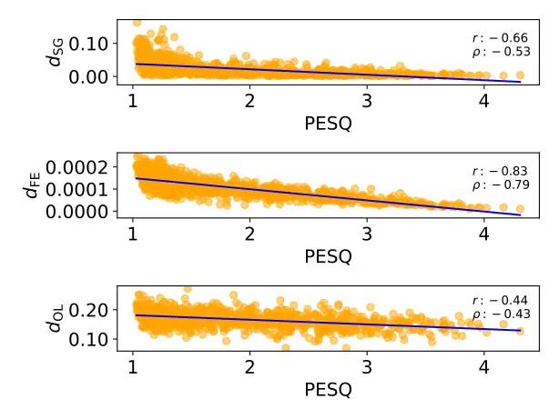
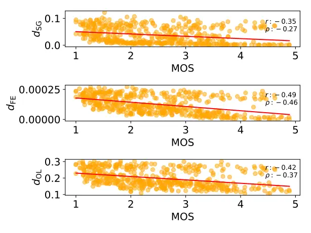
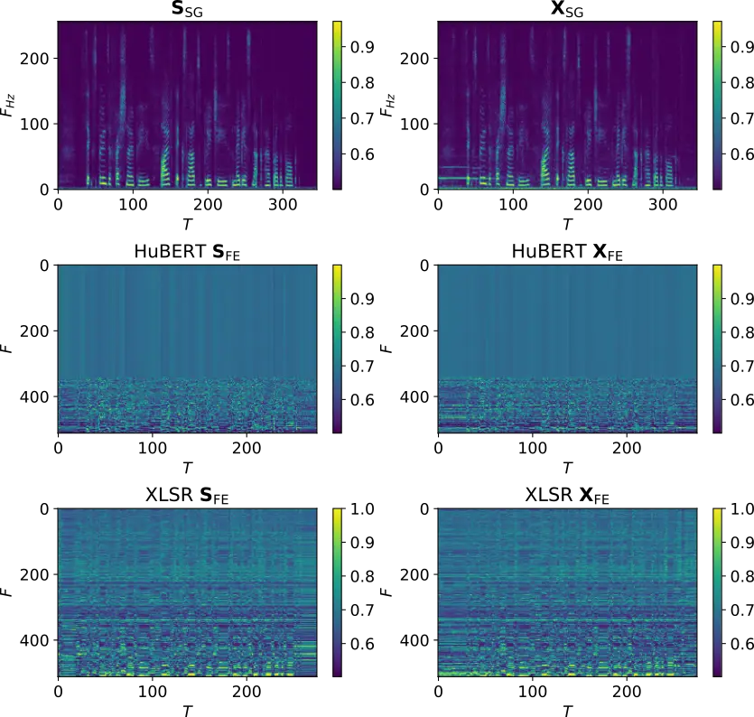

# Perceive and predict: self-supervised speech representation based loss functions for speech enhancement

George Close    William Ravenscroft    Thomas Hain    Stefan Goetze
^(†)^(†)thanks: This work was supported by the Centre for Doctoral
Training in Speech and Language Technologies (SLT) and their
Applications funded by UK Research and Innovation \[grant number
EP/S023062/1\]. This work was also funded in part by TOSHIBA Cambridge
Research Laboratory and 3M Health Information Systems Inc.

###### Abstract

Recent work in the domain of speech enhancement has explored the use of
self-supervised speech representations to aid in the training of neural
speech enhancement models. However, much of this work focuses on using
the deepest or final outputs of self supervised speech representation
models, rather than the earlier feature encodings. The use of self
supervised representations in such a way is often not fully motivated.
In this work it is shown that the distance between the feature encodings
of clean and noisy speech correlate strongly with psychoacoustically
motivated measures of speech quality and intelligibility, as well as
with human MOS (MOS) ratings. Experiments using this distance as a loss
function are performed and improved performance over the use of STFT
spectrogram distance based loss as well as other common loss functions
from speech enhancement literature is demonstrated using objective
measures such as PESQ (PESQ) and STOI (STOI).

###### Index Terms: 

self-supervised representations, speech enhancement, loss functions,
neural networks

^(†)^(†)address: Department of Computer Science, University of Sheffield

## 1 Introduction

Speech enhancement remains an active area of speech research due to its
applications in numerous downstream tasks \[1\]. Deep learning models
have led to state-of-the-art results on numerous benchmarks for speech
enhancement and related tasks \[2, 3, 4, 5\]. A key area of research for
these kinds of models has been the loss functions used \[6\].
Furthermore, metrics used to evaluate speech enhancement models have
long been an active area of research; in many cases they can also be
used as the loss function used to train the models themselves \[7, 8, 9,
10\]. \AcpSSSR are of increasing interest in a number of speech related
tasks, including speech enhancement \[11, 12, 13\]. Generally, the
strength of SSSR (SSSR) comes from their ability to predict the context
of the speech content in the input audio, and thus model the patterns of
spoken language. In this work, it is investigated whether SSSR distances
between clean and noisy speech signals have a stronger correlation to
perceptually motivated speech enhancement measures such as PESQ than the
spectral distances of the signals. This analysis is also repeated for
MOS. In the contribution here we consider both the output of SSSR
encoder layers as well as the final output layer. It is demonstrated the
encoder layers have a notably stronger correlation to the aforementioned
evaluation measures than the output layers. HuBERT (HuBERT) \[12\] and
XLSR \[14\] SSSR are chosen as these have both been applied in related
speech tasks previously but in different ways \[15, 16\]. Following from
this, the distances between clean and noisy SSSR features are then
evaluated for their usefulness as loss functions to train speech
enhancement models. Their performance is compared to other standard loss
functions including perceptually motivated loss functions such as STOI
loss \[17\].

The remainder of this paper is structured as follows. In Section 2, SSSR
are introduced and the two specific models used in this work are
detailed. In Section 3 the relationship between distance measures
derived from these models with speech assessment metrics and human
assessment is analysed, in order to obtain novel insight in to the use
of SSSRs for perceptually motivated speech enhancement. Finally, in
Section 4 simple signal enhancement networks are trained using loss
functions derived from SSSR distances and are compared to baselines
using conventional loss functions, analysing the distance measures
usefulness as loss function for a single channel speech enhancement
task.

## 2 Self Supervised Speech Representation Models

SSSR models are neural models of speech which are trained in a self
supervised way. This is typically done by ‘masking’ a portion of the
input and then tasking the model with recreating the masked portion. At
inference time, the network layers responsible for the recreation step
are removed and the model instead returns a deep ‘context’
representation of the input time domain audio. At this point, additional
task specific layers can be appended to the network, with the self
supervised representation model either being fine-tuned or frozen as the
task specific layers are trained. Generally speaking, SSSRs can be said
to first perceive the input audio in a feature encoder step, and then
predict the context of the content of the audio in the deeper layers.  
HuBERT \[12\] (Hidden Unit BERT) is a SSSR model which utilises a BERT
\[18\] style prediction loss in training. It consists of two main
components; the first is a CNN (CNN) feature encoder block consisting of
stacked 1 dimensional convolutional layers which transform the input
time domain audio signal into a 512 channel feature representation. This
is followed by a transformer \[19\] block which consists of several
transformer layers to produce the final 768 channel output
representation. The HuBERT model used in this work is trained on the
960h Librispeech \[20\] training set and is sourced from the fairseq
Github repository¹¹ 1 https://github.com/facebookresearch/fairseq.  
The Cross Lingual Speech Representation (XLSR) \[14\] model is a variant
of the Wav2Vec2 \[11\] SSSR model. It is trained on 436,000 hours of
speech data from a number of different languages, including BABEL²² 2
https://catalog.ldc.upenn.edu/byyear, which contains potentially noisy
telephone conversations in a number of languages. It is structured
similarly to HuBERT, with a convolutional feature encoder block which
outputs a 512 channel feature representation, followed by a transformer
block which outputs a final representation with 1024 channels. In this
work we make use of the smallest version of XLSR, sourced from the
official HuggingFace repository³³ 3 https://huggingface.co/facebook  
/wav2vec2-xls-r-300m.

### 2.1 SSSRs in quality estimation and speech enhancement

In \[16\], a non intrusive human MOS predictor is proposed which makes
use of pretrained XLSR representations as a feature extraction stage.
With only a simple trained prediction network placed over these XLSR
representations, the proposed model was able to achieve high performance
in the Conferencing Speech 2022 \[21\] quality prediction challenge.
This indicates that the XLSR SSSR model is able to capture quality
information about the input signal, even without access to a reference.
It’s training data differs to that of other SSSR models (such as HuBERT)
in that it is trained in part on non-clean speech. In this work, we aim
to analyse the behaviour of XLSR and HuBERT when exposed to noisy/low
quality audio.  
In \[15\], a number of techniques to incorporate SSSRs (namely HuBERT)
into a single channel speech enhancement system are proposed. One of
these techniques, called ‘supervision’ in \[15\] involves the use of the
distance between the SSSR output representations of clean reference
speech and the enhanced noisy speech output by the enhancement model as
an additional loss term to train the model. This is in turn inspired by
a prior work \[22\] in which the Wasserstein distance between clean and
enhanced SSSR representations of the audio is used as a loss term. In
\[22\] the relationship between the SSSR distances and perceptual
measures is noted. However, both of these works are motivated by the
phoneme level information encoded in later layers of the SSSR network
and thus only consider the distance between the clean and noisy
representations of the final output layer of SSSR models. Here, we aim
to explore the use of distances derived from the intermediate feature
encoder layer of the SSSR models. Moreover, we aim to directly compare
SSSR derived distances with a standard distance used as a loss function
for speech enhancement, by formulating the proposed distance measures
similarly, i.e. as MSE (MSE) distances.

## 3 SSSR derived distances in relation to speech assessment metrics

In this work, first the MSE (MSE) distance between representations of
some clean speech $`s[n]`$ and a corresponding noisy version of
$`s[n]`$, $`x[n]`$

```math
x[n]=s[n]+v[n], \tag{1}
```

is analysed, where $`n`$ is the discrete time index and $`v[n]`$ is some
additive noise caused by the recording environment. Specifically, we
define these using either $`\mathbf{S}_{\mathrm{FE}}`$,
$`\mathbf{X}_{\mathrm{FE}}`$ or $`\mathbf{S}_{\mathrm{OL}}`$,
$`\mathbf{X}_{\mathrm{OL}}`$ where $`\mathrm{FE}`$ and $`\mathrm{OL}`$
denote the SSSR encoder representation and final output layer
respectively:

```math
\mathbf{S}_{\mathrm{FE}}=\mathcal{G}_{\mathrm{FE}}(s[n]) \tag{2}
```

```math
\mathbf{S}_{\mathrm{OL}}=\mathcal{G}_{\mathrm{OL}}(\mathcal{G}_{\mathrm{FE}}(s[n])) \tag{3}
```

with $`\mathcal{G}_{\mathrm{FE}},\mathcal{G}_{\mathrm{OL}}`$ denoting
the encoder output and final layer in the SSSR mode respectively, and
$`\mathbf{X}_{\mathrm{FE}}`$, $`\mathbf{X}_{\mathrm{OL}}`$ defined
similarly. $`\mathbf{S}_{\mathrm{FE}}`$ is the output of the SSSRs
feature encoder layer, while $`\mathbf{S}_{\mathrm{OL}}`$ is the output
of its final layer.The MSE distances between these SSSR representations
are defined as:

```math
d_{\mathrm{FE}}(\mathbf{S}_{\mathrm{FE}},\mathbf{X}_{\mathrm{FE}})=\sum_{t,f}^{T,F}(\mathbf{S}_{\mathrm{FE}}[t,f]-\mathbf{X}_{\mathrm{FE}}[t,f])^{2} \tag{4}
```

```math
d_{\mathrm{OL}}(\mathbf{S}_{\mathrm{OL}},\mathbf{X}_{\mathrm{OL}})=\sum_{t,f}^{T,F}(\mathbf{S}_{\mathrm{OL}}[t,f]-\mathbf{X}_{\mathrm{OL}}[t,f])^{2} \tag{5}
```

where $`T`$ and $`F`$ denote time and feature dimensions of the
representation.

These SSSR derived distances are compared with a distance which is
commonly used as a loss function in speech enhancement tasks. The MSE
distance between clean and noisy spectrogram representations is taken:

```math
d_{\mathrm{SG}}(\mathbf{S}_{\mathrm{SG}},\mathbf{X}_{\mathrm{SG}})=\sum_{t,f_{Hz}}^{T,F_{Hz}}\left(\mathbf{S}_{\mathrm{SG}}[t,f_{Hz}]-\mathbf{X}_{\mathrm{SG}}[t,f_{Hz}]\right)^{2} \tag{6}
```

where $`\mathbf{S}_{\mathrm{SG}}`$ and $`\mathbf{X}_{\mathrm{SG}}`$ are
magnitude spectrogram representations of $`s[n]`$ and $`x[n]`$,
respectively, and $`T`$ and $`F_{Hz}`$ are the time and frequency
dimensions of the spectrograms.  
In the following, $`d_{\mathrm{FE}}`$ and $`d_{\mathrm{OL}}`$ are
computed using the XLSR and HuBERT models. As mentioned in the previous
section, $`\mathbf{S}_{\mathrm{FE}}`$, $`\mathbf{X}_{\mathrm{FE}}`$ and
$`\mathbf{S}_{\mathrm{OL}}`$, $`\mathbf{X}_{\mathrm{OL}}`$ of the XLSR
model have feature dimensions $`F`$ of $`512`$ and $`1024`$
respectively, while those of HuBERT have feature dimensions of $`512`$
and $`768`$, sharing a time dimension $`T`$, the size of which is
dependent on the length in samples of the input time domain audio.  
$`\mathbf{S}_{\mathrm{SG}}`$ and $`\mathbf{X}_{\mathrm{SG}}`$ are
computed using a Fourier Transform with an FFT size of $`512`$, window
length of $`32`$ms, and a hop length of $`16`$ms (resulting in a 50%
frame overlap) using a hamming window. This results in a spectogram with
a frequency dimension $`F_{Hz}`$ of $`257`$, and a time dimension $`T`$
which is dependent on the length in samples of the input time domain
audio.

### 3.1 Datasets

To express the relationship between the distance measures and
psychoacoustically motivated metrics the VoiceBank-DEMAND \[23\], a
popular and commonly used dataset for single channel speech enhancement,
is used. Its training set consists of $`11572`$ clean and noisy speech
audio file pairs $`(s[n],x[n])`$, mixed at four different SNR {$`0`$,
$`5`$, $`10`$, $`15`$} dB. Eight noise files are sourced from the
DEMAND \[24\] noise dataset; two others, a babble noise and a
speech-shaped noise were also used. The training set contains speech
from 28 different speakers ($`14`$ male, $`14`$ female), with English or
Scottish accents.The testset containing $`824`$ utterances is mixed at
SNRs of $`2.5`$, $`7.5`$, $`12.5`$ and $`17.5`$ dB, with five different
noises which do not appear in the training set from the DEMAND corpus.  
In order to assess the relationship between the distance measures and
human MOS ratings, the NISQA \[25\] dataset is used. This is a dataset
of variable length clean and noisy speech audio file pairs
$`(s[n],x[n])`$ with real human-annotated MOS labels, designed for the
training and testing of neural MOS predictors.The two testsets used here
contain 440 clean/noisy pairs in total.  
The audio files in both datasets have a sample rate of $`48`$ kHz and
are down-sampled to $`16`$ kHz such that $`\mathcal{G}(\cdot)`$ in (2),
(3) can computed.

### 3.2 SSSR distances and psychoacusitcally motivated metrics

| Distance                   | PESQ  |          | STOI  |          | Csig  |          | Cbak  |          | Covl  |          | MOS   |          |
| -------------------------- | ----- | -------- | ----- | -------- | ----- | -------- | ----- | -------- | ----- | -------- | ----- | -------- |
|                            | $`r`$ | $`\rho`$ | $`r`$ | $`\rho`$ | $`r`$ | $`\rho`$ | $`r`$ | $`\rho`$ | $`r`$ | $`\rho`$ | $`r`$ | $`\rho`$ |
| $`d_{\mathrm{SG}}`$        | -0.66 | -0.53    | -0.60 | -0.68    | -0.75 | -0.70    | -0.84 | -0.69    | -0.74 | -0.64    | 0.35  | -0.27    |
| XLSR $`d_{\mathrm{FE}}`$   | -0.82 | -0.78    | -0.80 | -0.81    | -0.93 | -0.92    | -0.88 | -0.85    | -0.90 | -0.87    | -0.47 | -0.43    |
| XLSR $`d_{\mathrm{OL}}`$   | -0.66 | -0.61    | -0.69 | -0.68    | -0.76 | -0.75    | -0.74 | -0.72    | -0.74 | -0.71    | -0.44 | -0.40    |
| HuBERT $`d_{\mathrm{FE}}`$ | -0.83 | -0.79    | -0.75 | -0.76    | -0.95 | -0.93    | -0.90 | -0.87    | -0.91 | -0.89    | -0.48 | -0.46    |
| HuBERT $`d_{\mathrm{OL}}`$ | -0.44 | -0.43    | -0.40 | -0.42    | -0.52 | -0.52    | -0.45 | -0.45    | -0.50 | -0.49    | -0.42 | -0.37    |

Table 1: Spearman $`r`$ and Pearson $`\rho`$ correlation between
distance measures and speech quality and intelligibility metrics in the
VoiceBank-DEMAND testset, as well as MOS in the NISQA Challenge testset

Fig. 1 shows the relationships between the distance measures and
PESQ \[7\] scores computed using the $`s[n]`$, $`x[n]`$ pairs in the
VoiceBank-DEMAND \[23\] testset using HuBERT SSSR. From these, it can be
observed that both $`d_{\mathrm{FE}}`$ and $`d_{\mathrm{OL}}`$ correlate
significantly more strongly than $`d_{\mathrm{SG}}`$ with quality
metrics. Furthermore, the distance computed using the output of the 1D
convolutional block $`d_{\mathrm{FE}}`$ correlates more strongly than
the distance computed using the SSSR output $`d_{\mathrm{OL}}`$. This
suggests that the phonetic and linguistic processing which occurs in the
deeper parts of the model are less sensitive to the noise in $`x[n]`$.
The first 5 columns of Table 1 shows the Spearman $`r`$ and Pearson
correlations $`\rho`$ between PESQ, STOI and the components of the
Composite \[26\] measure. Like with PESQ,STOI and the Composite measure
scores all correlate more strongly with the proposed SSSR distances than
with $`d_{\mathrm{SG}}`$. To our knowledge, this is the first time that
the correlation between SSSR derived distances and the Composite measure
have been analysed, and the high correlation displayed here shown.



Figure 1: Scatter plots showing the relationship between the PESQ metric
and MSE Spectrogram distance $`d_{\mathrm{SG}}`$ as well as, HuBERT
$`d_{\mathrm{FE}}`$, HuBERT $`d_{\mathrm{OL}}`$ distances for the
VoiceBank-DEMAND testset

### 3.3 SSSR distances and human quality assessment

Fig. 2 and the last column of Table 1 show the relationship between the
MSE distances and human MOS in the ‘FOR’ and ‘P501’ testset $`s[n]`$,
$`x[n]`$ pairs of the NISQA \[25\] dataset. While the overall
correlations are lower here than those of the metrics analysed in the
first 5 colunms, the same pattern emerges with $`d_{\mathrm{FE}}`$ and
$`d_{\mathrm{OL}}`$ correlating more strongly with the MOS scores than
$`d_{\mathrm{SG}}`$. The HuBERT based distances again correlate more
strongly than XLSR; this is possibly due to the language match between
the training data of HuBERT and that of the data, both being English
only.



Figure 2: Scatter plots showing the relationship between human MOS
scores and MSE Spectrogram distance $`d_{\mathrm{SG}}`$, HuBERT
$`d_{\mathrm{FE}}`$ and HuBERT $`d_{\mathrm{OL}}`$ with in the NISQA
Challenge testset

## 4 SSSR Based Signal Enhancment Experiment

An experiment is carried out in order to assess the effectiveness of the
SSSR derived distance measures as loss functions for speech enhancement
tasks.

### 4.1 Experiment setup

Simple masking based speech enhancement models were trained using a
number of different loss functions; $`d_{\mathrm{SG}}`$,
$`d_{\mathrm{FE}}`$, $`d_{\mathrm{OL}}`$ as described in the previous
sections, as well as Si-SDR loss \[27\] and STOI loss \[17\]. Each model
was trained for 50 epochs on the VoiceBank-DEMAND \[23\] training set.
$`d_{\mathrm{FE}}`$, $`d_{\mathrm{OL}}`$ are computed for XLSR or HuBERT
feature encoder and output representations. The Adam \[28\] optimiser is
used with a learning rate of $`0.001`$. At test time, the epoch
obtaining the highest PESQ score on the validation set is loaded. The
SpeechBrain \[29\] toolkit is used to implement the experiment.

### 4.2 Loss Functions

The distance measures defined in (4), (5) and (6) are modified to be
used as loss terms for a speech enhancement neural model:

```math
L_{\mathrm{FE}}(\mathbf{S}_{\mathrm{FE}},\mathbf{\hat{S}}_{\mathrm{FE}})=\sum_{t,f}^{T,F}(\mathbf{S}_{\mathrm{FE}}[t,f]-\mathbf{\hat{S}}_{\mathrm{FE}}[t,f])^{2} \tag{7}
```

```math
L_{\mathrm{OL}}(\mathbf{S}_{\mathrm{OL}},\mathbf{\hat{S}}_{\mathrm{OL}})=\sum_{t,f}^{T,F}(\mathbf{S}_{\mathrm{OL}}[t,f]-\mathbf{\hat{S}}_{\mathrm{OL}}[t,f])^{2} \tag{8}
```

```math
L_{\mathrm{SG}}(\mathbf{S}_{\mathrm{SG}},\mathbf{\hat{S}}_{\mathrm{SG}})=\sum_{t,f_{Hz}}^{T,F_{Hz}}(\mathbf{S}_{\mathrm{SG}}[t,f_{Hz}]-\mathbf{\hat{S}}_{\mathrm{SG}}[t,f_{Hz}])^{2} \tag{9}
```

where $`\hat{s}[n]`$ is the enhanced time domain audio signal output by
the neural model when $`x[n]`$ is input and
$`\mathbf{\hat{S}}_{\mathrm{FE}}`$, $`\mathbf{\hat{S}}_{\mathrm{OL}}`$
and $`\mathbf{\hat{S}}_{\mathrm{SG}}`$ are the feature encoder output,
output layer and spectrogram representations of $`\hat{s}[n]`$
respectively.

### 4.3 Enhancement Model Structure

The same model structure is used for all models. It consists of 2 BLSTM
(BLSTM) layers followed by two linear layers, with the first linear
layer using a LeakyReLU activation and the second a Sigmoid. The input
to the model is a magnitude spectrogram ($`\mathbf{X}_{\mathrm{SG}}`$)
and the model returns a ‘mask’ which is multiplied with the noisy input
spectrogram to produce the enhanced spectrogram
$`\mathbf{\hat{S}}_{\mathrm{SG}}`$. From this, the enhanced time domain
speech $`\hat{s}[n]`$ is then created via the overlap-add resynthesis
method, using the original noisy phase of $`x[n]`$. This structure is
selected because, despite being relatively simple and with a small
parameter count, it is able to achieve state of the art performance in
perceptually motivated speech enhancement \[2, 10, 5\].

### 4.4 Signal Enhancement Performance

Table 2 shows the experiment results. The proposed model using HuBERT
$`L_{\mathrm{FE}}`$ as its loss function outperforms the baseline using
the spectrogram distance $`L_{\mathrm{SG}}`$ in terms of PESQ and the
Composite measure Csig, Cbak and Covl. Additionally, the best performing
model by a significant margin in terms of Cbak uses the XLSR encoder
distance loss function $`L_{\mathrm{FE}}`$, and most SSSR based losses
outperform the baseline systems in this measure. Those models which use
SSSR encoder distance $`L_{\mathrm{FE}}`$ outperform those which use
SSSR output layer distance $`L_{\mathrm{OL}}`$; this is consistent with
the correlation values in Table 1 where $`d_{\mathrm{FE}}`$ distances
correlate more strongly with the metrics than $`d_{\mathrm{OL}}`$
distances.

| loss function                   | PESQ | STOI | Csig | Cbak | Covl | Si-SDR |
| ------------------------------- | ---- | ---- | ---- | ---- | ---- | ------ |
| noisy                           | 1.97 | 0.92 | 3.35 | 2.44 | 2.63 | 8.98   |
| $`d_{\mathrm{SG}}`$             | 2.70 | 0.94 | 4.00 | 2.62 | 3.35 | 18.62  |
| $`{L}_{\mathrm{SISDR}}`$ \[27\] | 2.28 | 0.92 | 3.51 | 2.44 | 2.88 | 18.66  |
| $`L_{\mathrm{STOI}}`$ \[17\]    | 2.12 | 0.93 | 3.46 | 2.16 | 2.77 | 13.31  |
| HuBERT $`L_{\mathrm{FE}}`$      | 2.79 | 0.94 | 4.10 | 2.68 | 3.44 | 18.47  |
| HuBERT $`L_{\mathrm{OL}}`$      | 2.55 | 0.92 | 3.66 | 2.42 | 3.08 | 14.92  |
| XLSR $`L_{\mathrm{FE}}`$        | 2.69 | 0.92 | 3.77 | 3.05 | 3.21 | 9.72   |
| XLSR $`L_{\mathrm{OL}}`$        | 2.43 | 0.91 | 3.21 | 2.64 | 2.79 | 13.00  |

Table 2: Signal Enhancement performance on the VoiceBank-DEMAND testset

### 4.5 Analysis

Fig. 3 shows an example of the feature representations of $`s[n]`$ and
$`x[n]`$ used as inputs to $`d_{\mathrm{SG}}`$ and $`d_{\mathrm{FE}}`$
for both HuBERT and XLSR. Tonal noise introduced in $`x[n]`$, visible as
a line spanning approximately the first 50 time frames in
$`\mathbf{X}_{\mathrm{SG}}`$, is well represented in the XLSR
$`\mathbf{X}_{\mathrm{FE}}`$ but not in HuBERT
$`\mathbf{X}_{\mathrm{FE}}`$. This is a possible explanation for the
increased Cbak score for the XLSR $`L_{FE}`$ loss over the HubERT based
loss $`L_{FE}`$ as XLSR $`\mathbf{X}_{\mathrm{FE}}`$ representations
appear to be more sensitive to noise in non speech regions of the
representation. The fact that XLSR is trained in part on noisy data is a
potential explanation for this behaviour.



Figure 3: Visualisation of inputs representations of $`s[n]`$, $`x[n]`$
to $`d_{\mathrm{SG}}`$, HuBERT $`d_{\mathrm{EF}}`$ and XLSR
$`d_{\mathrm{EF}}`$. SSSR features are sorted according to depthwise
euclidean distance following Algorithm 1 in \[30\] and a sigmoid
function is applied to increase clarity.

## 5 Conclusion

In this work it is demonstrated that the earlier ‘perceive’ feature
encoder layers of SSSR preserve aspects of noise and distortion in
speech to a greater degree than the deeper ‘predict’ layers. Moreover,
we find that a simple distance measure between the encoder
representations of clean and noisy speech correlates strongly with
perceptually motivated metrics of speech quality, as well as with human
speech quality assessment. This correlation is affected by the
attributes of the data used to train the SSSR. This finding is validated
by the use of these distance measures as loss functions for a speech
enhancement task, where feature encoder distance outperforms both the
deeper output layer and a standard spectrogram based loss. Future work
will include the further tuning of SSSR encoders towards human
perception, as well as investigating the effect of the training data on
the SSSR encoder representations.

## References

- \[1\] R. Haeb-Umbach, J. Heymann, L. Drude, S. Watanabe, M. Delcroix,
  and T. Nakatani, “Far-field automatic speech recognition,” Proceedings
  of the IEEE, vol. 109, no. 2, pp. 124–148, 2021.
- \[2\] S.-W. Fu, C. Yu, T.-A. Hsieh, P. Plantinga, M. Ravanelli, X. Lu,
  and Y. Tsao, “Metricgan+: An improved version of metricgan for speech
  enhancement,” 2021.
- \[3\] M. Maciejewski, G. Wichern, and J. Le Roux, “WHAMR!: Noisy and
  reverberant single-channel speech separation,” in ICASSP 2020,
  May 2020.
- \[4\] X. Chang, W. Zhang, Y. Qian, J. L. Roux, and S. Watanabe,
  “MIMO-SPEECH: End-to-End Multi-Channel Multi-Speaker Speech
  Recognition,” ASRU 2019, pp. 237–244, October 2019.
- \[5\] G. Close, T. Hain, and S. Goetze, “MetricGAN+/-: Increasing
  Robustness of Noise Reduction on Unseen Data,” in EUSIPCO 2022,
  Aug. 2022.
- \[6\] M. Kolbæk, Z.-H. Tan, S. H. Jensen, and J. Jensen, “On loss
  functions for supervised monaural time-domain speech enhancement,”
  IEEE/ACM Transactions on Audio, Speech, and Language Processing, vol.
  28, pp. 825–838, 2020.
- \[7\] A. Rix, J. Beerends, M. Hollier, and A. Hekstra, “Perceptual
  evaluation of speech quality (PESQ)-a new method for speech quality
  assessment of telephone networks and codecs,” in ICASSP 2001, 2001,
  vol. 2, pp. 749–752 vol.2.
- \[8\] C. H. Taal, R. C. Hendriks, R. Heusdens, and J. Jensen, “An
  algorithm for intelligibility prediction of time–frequency weighted
  noisy speech,” IEEE Transactions on Audio, Speech, and Language
  Processing, vol. 19, no. 7, pp. 2125–2136, 2011.
- \[9\] J. L. Roux, S. Wisdom, H. Erdogan, and J. R. Hershey, “SDR –
  Half-baked or Well Done?,” in ICASSP 2019, May 2019.
- \[10\] S.-W. Fu, C. Yu, K.-H. Hung, M. Ravanelli, and Y. Tsao,
  “Metricgan-u: Unsupervised speech enhancement/ dereverberation based
  only on noisy/ reverberated speech,” 2021.
- \[11\] A. Baevski, Y. Zhou, A. Mohamed, and M. Auli, “wav2vec 2.0: A
  framework for self-supervised learning of speech representations,” in
  Advances in Neural Information Processing Systems, H. Larochelle, M.
  Ranzato, R. Hadsell, M. Balcan, and H. Lin, Eds. 2020, vol. 33, pp.
  12449–12460, Curran Associates, Inc.
- \[12\] W.-N. Hsu, B. Bolte, Y.-H. H. Tsai, K. Lakhotia, R.
  Salakhutdinov, and A. Mohamed, “Hubert: Self-supervised speech
  representation learning by masked prediction of hidden units,” 2021.
- \[13\] S. wen Yang, P.-H. Chi, Y.-S. Chuang, C.-I. J. Lai, K.
  Lakhotia, Y. Y. Lin, A. T. Liu, J. Shi, X. Chang, G.-T. Lin, T.-H.
  Huang, W.-C. Tseng, K. tik Lee, D.-R. Liu, Z. Huang, S. Dong, S.-W.
  Li, S. Watanabe, A. Mohamed, and H. yi Lee, “SUPERB: Speech Processing
  Universal PERformance Benchmark,” in Proc. Interspeech 2021, 2021, pp.
  1194–1198.
- \[14\] A. Babu, C. Wang, A. Tjandra, K. Lakhotia, Q. Xu, N. Goyal, K.
  Singh, P. von Platen, Y. Saraf, J. Pino, A. Baevski, A. Conneau,
  and M. Auli, “XLS-R: Self-supervised Cross-lingual Speech
  Representation Learning at Scale,” in Proc. Interspeech 2022, 2022,
  pp. 2278–2282.
- \[15\] O. Tal, M. Mandel, F. Kreuk, and Y. Adi, “A systematic
  comparison of phonetic aware techniques for speech enhancement,” 2022.
- \[16\] B. Tamm, H. Balabin, R. Vandenberghe, and H. V. hamme,
  “Pre-trained speech representations as feature extractors for speech
  quality assessment in online conferencing applications,” in
  Interspeech 2022. sep 2022, ISCA.
- \[17\] S.-W. Fu, T.-W. Wang, Y. Tsao, X. Lu, and H. Kawai, “End-to-end
  waveform utterance enhancement for direct evaluation metrics
  optimization by fully convolutional neural networks,” IEEE/ACM
  Transactions on Audio, Speech, and Language Processing, vol. 26, no.
  9, pp. 1570–1584, 2018.
- \[18\] J. Devlin, M.-W. Chang, K. Lee, and K. Toutanova, “BERT:
  Pre-training of deep bidirectional transformers for language
  understanding,” in Proc. of ACL 2019, Minneapolis, Minnesota, June
  2019, pp. 4171–4186, Association for Computational Linguistics.
- \[19\] A. Vaswani, N. Shazeer, N. Parmar, J. Uszkoreit, L. Jones,
  A. N. Gomez, L. u. Kaiser, and I. Polosukhin, “Attention is all you
  need,” in Advances in Neural Information Processing Systems, I. Guyon,
  U. V. Luxburg, S. Bengio, H. Wallach, R. Fergus, S. Vishwanathan,
  and R. Garnett, Eds., 2017, vol. 30.
- \[20\] V. Panayotov, G. Chen, D. Povey, and S. Khudanpur,
  “Librispeech: An asr corpus based on public domain audio books,” in
  2015 IEEE International Conference on Acoustics, Speech and Signal
  Processing (ICASSP), 2015, pp. 5206–5210.
- \[21\] G. Yi, W. Xiao, Y. Xiao, B. Naderi, S. Möller, W. Wardah, G.
  Mittag, R. Cutler, Z. Zhang, D. S. Williamson, F. Chen, F. Yang,
  and S. Shang, “Conferencingspeech 2022 challenge: Non-intrusive
  objective speech quality assessment (nisqa) challenge for online
  conferencing applications,” 2022.
- \[22\] T.-A. Hsieh, C. Yu, S.-W. Fu, X. Lu, and Y. Tsao, “Improving
  perceptual quality by phone-fortified perceptual loss using
  wasserstein distance for speech enhancement,” 2020.
- \[23\] C. Valentini-Botinhao, “Noisy speech database for training
  speech enhancement algorithms and tts models,” 2017.
- \[24\] J. Thiemann, N. Ito, and E. Vincent, “DEMAND: a collection of
  multi-channel recordings of acoustic noise in diverse environments,”
  June 2013, Supported by Inria under the Associate Team Program
  VERSAMUS.
- \[25\] G. Mittag, B. Naderi, A. Chehadi, and S. Möller, “NISQA: A
  deep CNN-self-attention model for multidimensional speech quality
  prediction with crowdsourced datasets,” in Interspeech 2021. aug 2021,
  ISCA.
- \[26\] Z. Lin, L. Zhou, and X. Qiu, “A composite objective measure on
  subjective evaluation of speech enhancement algorithms,” Applied
  Acoustics, vol. 145, pp. 144–148, 02 2019.
- \[27\] Y. Luo and N. Mesgarani, “TasNet: Time-domain audio separation
  network for real-time, single-channel speech separation,” in ICASSP
  2018, 2018, pp. 696–700.
- \[28\] D. P. Kingma and J. Ba, “Adam: A method for stochastic
  optimization,” 2017.
- \[29\] M. Ravanelli, T. Parcollet, P. Plantinga, A. Rouhe, S.
  Cornell, L. Lugosch, C. Subakan, N. Dawalatabad, A. Heba, J. Zhong,
  J.-C. Chou, S.-L. Yeh, S.-W. Fu, C.-F. Liao, E. Rastorgueva, F.
  Grondin, W. Aris, H. Na, Y. Gao, R. D. Mori, and Y. Bengio,
  “Speechbrain: A general-purpose speech toolkit,” 2021.
- \[30\] W. Ravenscroft, S. Goetze, and T. Hain, “Att-TasNet: Attending
  to Encodings in Time-Domain Audio Speech Separation of Noisy,
  Reverberant Speech Mixtures,” Frontiers in Signal Processing, 2022.
