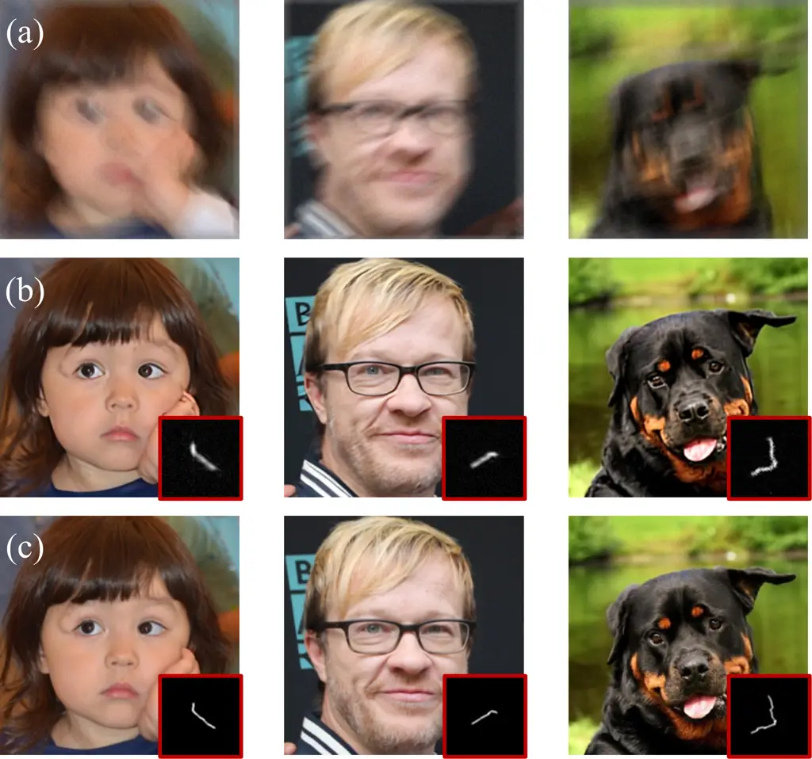
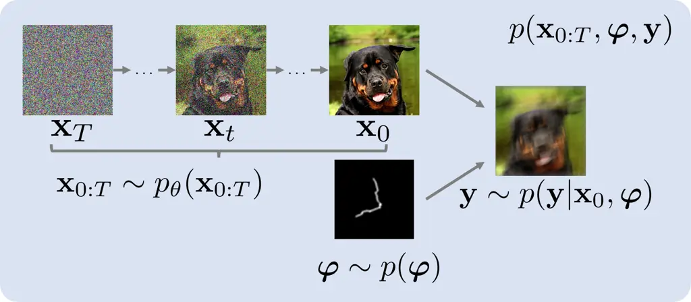
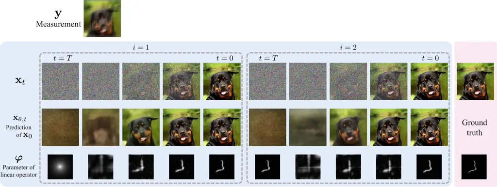
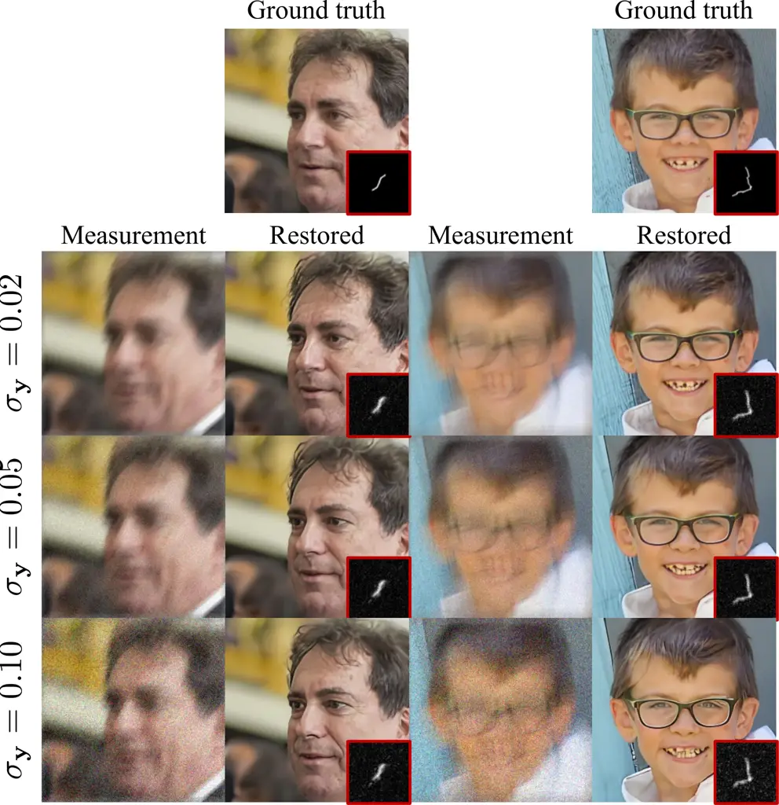
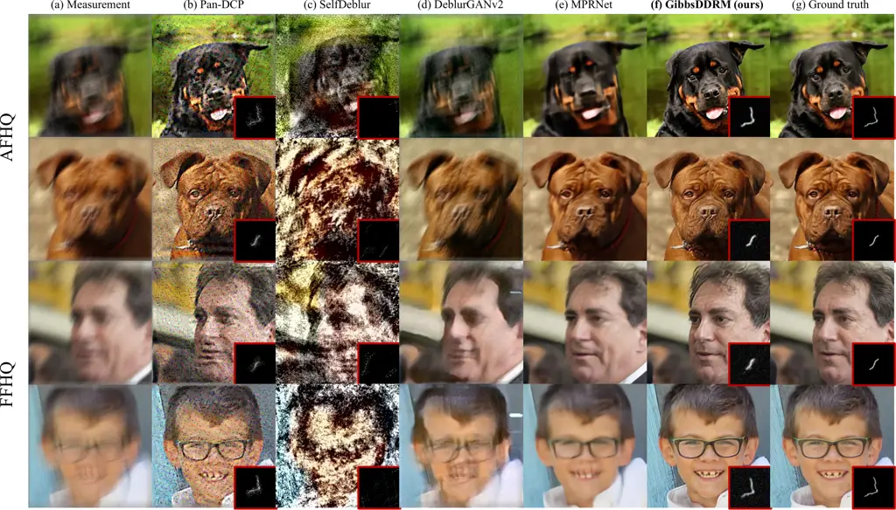
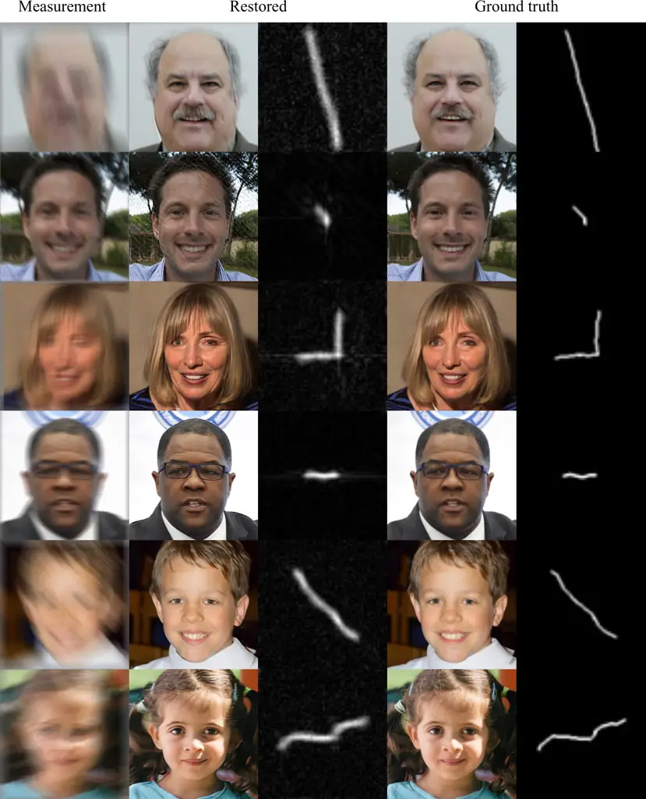
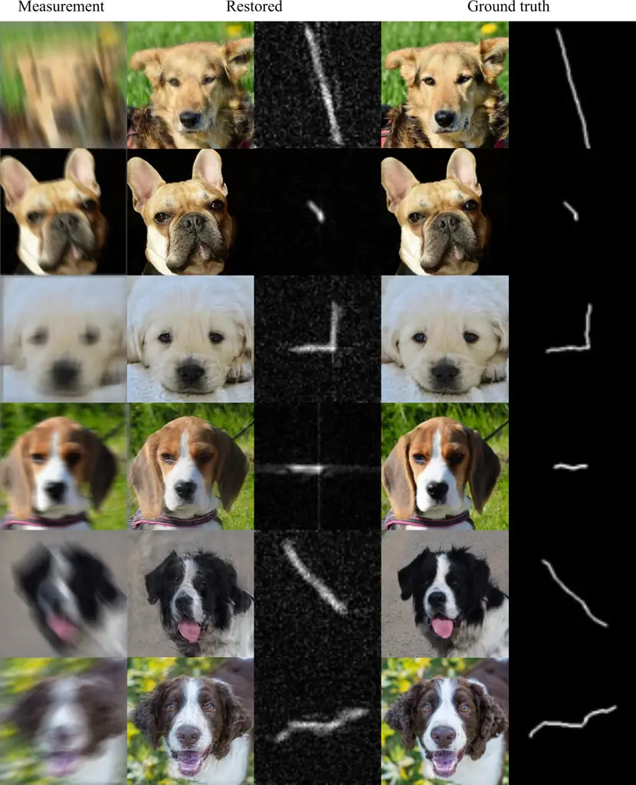

# GibbsDDRM: A Partially Collapsed Gibbs Sampler for Solving Blind Inverse Problems with Denoising Diffusion Restoration

Naoki Murata Affiliation: Sony AI, Tokyo, Japan Correspondence to:
<naoki.murata@sony.com>    Koichi Saito Affiliation: Sony AI, Tokyo,
Japan    Chieh-Hsin Lai Affiliation: Sony AI, Tokyo, Japan    Yuhta
Takida Affiliation: Sony AI, Tokyo, Japan    Toshimitsu Uesaka
Affiliation: Sony AI, Tokyo, Japan    Yuki Mitsufuji Affiliation: Sony
AI, Tokyo, Japan Affiliation: Sony Group Corporation, Tokyo, Japan   
Stefano Ermon Affiliation: Department of Computer Science, Stanford
University, Stanford, CA, USA

###### Abstract

Pre-trained diffusion models have been successfully used as priors in a
variety of linear inverse problems, where the goal is to reconstruct a
signal from noisy linear measurements. However, existing approaches
require knowledge of the linear operator. In this paper, we propose
GibbsDDRM, an extension of Denoising Diffusion Restoration Models (DDRM)
to a blind setting in which the linear measurement operator is unknown.
GibbsDDRM constructs a joint distribution of the data, measurements, and
linear operator by using a pre-trained diffusion model for the data
prior, and it solves the problem by posterior sampling with an efficient
variant of a Gibbs sampler. The proposed method is problem-agnostic,
meaning that a pre-trained diffusion model can be applied to various
inverse problems without fine-tuning. In experiments, it achieved high
performance on both blind image deblurring and vocal dereverberation
tasks, despite the use of simple generic priors for the underlying
linear operators.

###### Keywords: 

Diffusion models, Score-based models, Inverse problems, Gibbs sampling

## 1 Introduction



Figure 1: Blind image deblurring results obtained by GibbsDDRM: (a)
measurement, (b) restored clean images with blur kernels (bottom right
insets), and (c) ground truth images and blur kernels.

Inverse problems are frequently encountered in various science and
engineering fields such as image processing, acoustic signal processing,
and medical imaging. In an inverse problem, the goal is to restore a
clean data signal from measurements generated by some forward
(measurement) process. In image processing, problems such as
deblurring (Zhu et al., 2018; Kupyn et al., 2019; Tu et al., 2022),
inpainting (Yeh et al., 2017), and colorization (Larsson et al., 2016)
are naturally formulated as inverse problems. In audio signal
processing, problems such as dereverberation (Nakatani et al., 2010;
Saito et al., 2023) and band extension (Larsen & Aarts, 2005) are also
classic inverse problems. In medical imaging, many problems such as
computed tomography (CT) (Zhu et al., 2018; Song et al., 2021a) also
rely on inverse problem solving.

In general, inverse problems are ill-posed because the information in
the original data is lost through the measurement process (e.g., because
of noise); the incorporation of prior knowledge about the original data
is thus critical. In the past, assumptions such as sparsity (Candès &
Wakin, 2008), low rank (Fazel et al., 2008), and total variation (Candès
et al., 2006) were made for the data distribution to narrow the set of
plausible candidate solutions. A more recent trend has been to solve
inverse problems by using richer deep generative models (Rick Chang
et al., 2017; Anirudh et al., 2018; Kadkhodaie & Simoncelli, 2020; Whang
et al., 2021) trained with a large amount of data as priors. In
particular, the evolution of methods related to diffusion models (Kawar
et al., 2021; Kawar et al., 2022; Chung et al., 2023b; Chung et al.,
2023a) has been significant, and many such methods are problem-agnostic,
meaning that they do not require retraining of the generative model used
for inference on each task (i.e., each inverse problem).

Existing approaches typically assume that the measurement process is
known. However, many settings are blind, meaning that the measurement
process itself is (partially) unknown. This is known as a blind setting
and includes problems such as blind image deblurring (Pan et al., 2016)
and audio dereverberation  (Nakatani et al., 2010). For example, in a
blind image deblurring problem, the original image has to be restored
from the convolution process where the blur kernel is unknown. To
address this additional uncertainty, priors are introduced on both the
data and the parameters of the linear operator involved (Chan & Wong,
1998; Krishnan & Fergus, 2009; Xu et al., 2013). BlindDPS (Chung et al.,
2023a) is a method that uses a pre-trained diffusion model for both data
and parameters. However, while it can leverage widely available
pre-trained diffusion models for signals such as images and audio, it
requires training a diffusion model for the parameters of the linear
operators of interest, severely restricting its applicability in
practice.

To overcome this limitation, we propose GibbsDDRM, which does not
require a data-driven prior model of the measurement process. This
method is an extension of Denoising Diffusion Restoration Models
(DDRM) (Kawar et al., 2022) – a method designed for non-blind linear
inverse problems – to the blind linear setting. It constructs a joint
distribution of the data, the measurements, and the linear operator’s
parameters by using a pre-trained diffusion model for the data and a
generic prior for the measurement parameters. Then, it performs
approximate sampling from the corresponding posterior distribution of
the data and parameters conditioned on the measurements. Here, we adopt
a partially collapsed Gibbs sampler (PCGS) (Van Dyk & Park, 2008) to
enable efficient sampling from the posterior distribution. PCGS allows
us to replace an intractable conditional distribution in the naïve Gibbs
sampler with a more tractable one without changing the stationary
distribution. PCGS alternately samples the data or latent variables and
the linear operator’s parameters, and the generative model’s
representational power is exploited while sampling the parameters of the
linear operator. This allows our method to accurately estimate both data
and the parameters despite using a simple prior for the parameters.

We conducted experiments on the tasks of blind image deblurring in the
image processing domain and vocal dereverberation in the acoustic signal
processing domain. The results confirm that high performance can be
achieved on both tasks without strong assumptions on the prior for the
linear operator’s parameters. In the blind image deblurring task,
GibbsDDRM demonstrates exceptional quantitative performance in terms of
both image quality and faithfulness. It outperforms competing methods
and BlindDPS by a large margin in LPIPS, which measures the perceptual
similarity of images. The results also show that a faithful image can be
restored even with large measurement noise. (see Figure 1 for restored
images and estimated blur kernels.) In vocal dereverberation, GibbsDDRM
outperforms alternative methods in terms of the quality of the processed
vocal, the proximity of the signals, and the degree of reverberation
removal.

## 2 Background

#### Blind linear inverse problems.

Blind linear inverse problems involve the estimation of both unknown
clean data and the parameters of a linear operator from noisy
measurements. This type of problem can be formulated as a linear system
of equations of the following form:

```math
\displaystyle\mathbf{y}=\mathbf{H}_{\bm{\varphi}}\mathbf{x}_{0}+\mathbf{z}, \tag{1}
```

where $`\mathbf{y}\in\mathbb{R}^{d_{\mathbf{y}}}`$ is a vector of
measurements,
$`\mathbf{H}_{\bm{\varphi}}\in\mathbb{R}^{d_{\mathbf{y}}\times d_{\mathbf{x}_{0}}}`$
is a linear operator parameterized by
$`\bm{\varphi}\in\mathbb{R}^{d_{\varphi}}`$, and
$`\mathbf{x}_{0}\in\mathbb{R}^{d_{\mathbf{x}_{0}}}`$ is the unknown
original clean data to be estimated.
$`\mathbf{z}\sim\mathcal{N}(\mathbf{0},\sigma_{\mathbf{y}}^{2}\mathbf{I})`$
is a Gaussian measurement noise with known covariance
$`\sigma_{\mathbf{y}}^{2}\mathbf{I}`$, where $`\mathbf{I}`$ is the
identity matrix. For notational convenience, we index the clean data
$`\mathbf{x}_{0}`$ with “$`0`$” to distinguish it from latent variables
of the diffusion model that are defined later. The aim here is to find
estimates of both $`\mathbf{x}_{0}`$ and $`\bm{\varphi}`$ that fit the
given noisy measurements $`\mathbf{y}`$. The problem is ill-posed
without any additional assumptions. To obtain a solution, it is assumed
that $`\mathbf{x}_{0}`$ is drawn from a generative model
$`p_{\theta}(\mathbf{x}_{0})`$ (close to the true data distribution),
and that the parameters $`\bm{\varphi}`$ are drawn from a known prior
$`p(\bm{\varphi})`$ independently of the data. In the Bayesian
framework, the optimal solution is to sample from the posterior
$`p(\mathbf{x}_{0},\bm{\varphi}|\mathbf{y})`$.

#### Denoising Diffusion Probabilistic Models.

Denoising Diffusion Probabilistic Models (Sohl-Dickstein et al., 2015;
Ho et al., 2020; Song & Ermon, 2019; Song et al., 2021b; Lai et al.,
2022), or diffusion models for short, are generative models with a
Markov chain
$`\mathbf{x}_{T}\rightarrow\dots\rightarrow\mathbf{x}_{t}\rightarrow\dots\rightarrow\mathbf{x}_{0}`$
represented by the following joint distribution:

```math
\displaystyle p_{\theta}(\mathbf{x}_{0:T})=p_{\theta}^{(T)}(\mathbf{x}_{T})\prod_{t=0}^{T-1}p_{\theta}^{(t)}(\mathbf{x}_{t}|\mathbf{x}_{t+1}), \tag{2}
```

where the model’s output is $`\mathbf{x}_{0}`$. To train a diffusion
model, a fixed variational inference distribution is introduced:

```math
\displaystyle q(\mathbf{x}_{1:T}|\mathbf{x}_{0})=q^{(T)}(\mathbf{x}_{T}|\mathbf{x}_{0})\prod_{t=1}^{T-1}q^{(t)}(\mathbf{x}_{t}|\mathbf{x}_{t+1},\mathbf{x}_{0}), \tag{3}
```

which gives the evidence lower bound (ELBO) on the maximum likelihood
objective. With Gaussian parameterization for $`p_{\theta}`$ and $`q`$,
the ELBO objective is reduced to the following denoising autoencoder
objective:

```math
\displaystyle\sum_{t=1}^{T}\gamma_{t}\mathbb{E}_{(\mathbf{x}_{0},\mathbf{x}_{t})\sim p_{\text{data}}(\mathbf{x}_{0})q(\mathbf{x}_{t}|\mathbf{x}_{0})}\left[\|\mathbf{x}_{0}-f_{\theta}^{(t)}(\mathbf{x}_{t})\|_{2}^{2}\right]. \tag{4}
```

Here, $`f_{\theta}^{(t)}`$ is a $`\theta`$-parameterized neural network
that estimates noiseless data $`\mathbf{x}_{0}`$ from noisy
$`\mathbf{x}_{t}`$ and characterizes $`p_{\theta}`$;
$`\mathbf{x}_{\theta,t}`$ denotes the estimate of noise-less data by
$`f_{\theta}^{(t)}`$; $`\gamma_{t}`$ are positive weighting coefficients
determined by $`q`$.

#### Denoising Diffusion Restoration Models.

Denoising Diffusion Restoration Models (DDRM) (Kawar et al., 2022) is a
method that uses a pre-trained diffusion model as a prior for data in a
non-blind linear inverse problem. It is defined as a Markov chain
$`\mathbf{x}_{T}\rightarrow\mathbf{x}_{T-1}\rightarrow\dots\rightarrow\mathbf{x}_{1}\rightarrow\mathbf{x}_{0}`$
(where $`\mathbf{x}_{t}\in\mathbb{R}^{d_{\mathbf{x}_{0}}}`$) conditioned
on the measurements $`\mathbf{y}`$:

```math
\displaystyle p(\mathbf{x}_{0:T}|\mathbf{y})=p_{\theta}^{(T)}(\mathbf{x}_{T}|\mathbf{y})\prod_{t=0}^{T-1}p_{\theta}^{(t)}(\mathbf{x}_{t}|\mathbf{x}_{t+1},\mathbf{y}), \tag{5}
```

where $`\mathbf{x}_{0}`$ is the model’s output. The conditionals in DDRM
are defined in terms of the denoising function $`f_{\theta}^{(t)}`$ of a
pre-trained diffusion model; intriguingly, the objective derived using
the ELBO coincides with that of the unconditional diffusion model,
except for a constant factor. This means that the unconditionally
pre-trained diffusion model can be used during inference without
finetuning. The core idea of DDRM is to use the singular value
decomposition (SVD) of a linear operator $`\mathbf{H}`$ to transform
both the unknown input $`\mathbf{x}_{0}`$ and the observed output
$`\mathbf{y}`$, potentially corrupted by noise, to a shared spectral
space. In this space, DDRM executes denoising on dimensions for which
information from $`\mathbf{y}`$ is available (i.e., when the singular
values are non-zero). When such information is not available (i.e., when
the singular values are zero or the noise in the dimension is large),
DDRM performs imputation while explicitly considering the measurement
noise.

#### Partially collapsed Gibbs sampler.

A Gibbs sampler is a simple, widely used Markov chain Monte Carlo method
for sampling from the joint distribution of a set of variables (Casella
& George, 1992). The procedure entails iterative sampling from the fully
conditional distributions of each variable, given the current values of
the other variables. A blocked Gibbs sampler (Liu et al., 1994) is a
variant in which, instead of sampling each variable individually,
variables in a group or a “block” of variables are sampled
simultaneously while conditioned on all the other variables. This
approach is effective when the variables within a block are highly
correlated, and it can improve the sampler’s convergence speed.

A partially collapsed Gibbs sampler (PCGS) (Van Dyk & Park, 2008; Kail
et al., 2012) is a generalization of a blocked Gibbs sampler that
effectively explores the probability space through three basic
operations in the sampling procedure: marginalization, permutation, and
trimming, which are described in detail in (Van Dyk & Park, 2008) and
Appendix A. In short, the removal of certain variables among the
conditional variables does not alter the Gibbs sampler’s stationary
distribution, as long as these variables are not included among the
conditional variables until the next time they are sampled. Hence, we
can achieve efficient sampling when the distributions obtained after
trimming are tractable.

## 3 GibbsDDRM: Partially Collapsed Gibbs Sampler with DDRM

### 3.1 Target joint distribution for blind linear inverse problems



Figure 2: Graphical model for the joint distribution in Eq. (7).

In this paper, we seek to solve blind linear inverse problems by
sampling from the posterior of the joint distribution of the data and
the linear operator’s parameters, given the measurements. The joint
distribution of the data $`\mathbf{x}_{0}`$, parameters
$`\bm{\varphi}`$, and measurements $`\mathbf{y}`$ is defined as follows:

```math
\displaystyle p(\mathbf{x}_{0},\mathbf{y},\bm{\varphi})=p_{\theta}(\mathbf{x}_{0})p(\bm{\varphi})\mathcal{N}(\mathbf{y}|\mathbf{H}_{\varphi}\mathbf{x}_{0},\sigma_{\mathbf{y}}^{2}\mathbf{I}), \tag{6}
```

where $`p_{\theta}(\mathbf{x}_{0})`$ and $`p(\bm{\varphi})`$ are the
known prior distributions for the data and the parameters, respectively.
The Gaussian distribution
$`\mathcal{N}(\mathbf{y}|\mathbf{H}_{\varphi}\mathbf{x}_{0},\sigma_{\mathbf{y}}^{2}\mathbf{I})`$
comes from the measurement model given in Eq. (1). The aim is to sample
from the joint posterior distribution
$`p(\mathbf{x}_{0},\bm{\varphi}|\mathbf{y})`$. Using a pre-trained
generative model as a prior $`p_{\theta}(\mathbf{x}_{0})`$ can
drastically improve the solutions in inverse problems; however,
inference can be challenging. Even in the non-blind setting where
$`\bm{\varphi}`$ is known, sampling from the posterior is intractable
and requires approximations like in DDRM (Kawar et al., 2022).

Here we model the data distribution using a pre-trained diffusion model
as in Eq. (2). This leads to the following joint distribution over the
data, its latent variables, and the parameters, as shown in Figure 2,

```math
\displaystyle\ p(\mathbf{x}_{0:T},\bm{\varphi},\mathbf{y})
```

```math
\displaystyle=p_{\theta}^{(T)}(\mathbf{x}_{T})\prod_{t=0}^{T-1}p_{\theta}^{(t)}(\mathbf{x}_{t}|\mathbf{x}_{t+1})p(\bm{\varphi})\mathcal{N}(\mathbf{y}|\mathbf{H}_{\bm{\varphi}}\mathbf{x}_{0},\sigma_{\mathbf{y}}^{2}\mathbf{I}). \tag{7}
```

Note that sampling from the posterior distribution
$`p(\mathbf{x}_{0:T}|\bm{\varphi},\mathbf{y})`$ under a fixed
$`\bm{\varphi}`$ corresponds to the objective of DDRM. In addition, we
also assume that the parameters’ prior $`p(\bm{\varphi})`$ is a generic
and simple prior, such as a sparsity prior.

### 3.2 Partially Collapsed Gibbs Sampler for the joint distribution

To sample from the joint posterior in Eq. (7), we could attempt to
sample from the joint posterior distribution that includes the latent
variables of the diffusion model. However, it is still not feasible to
run a naïve Gibbs sampler for the posterior
$`p(\mathbf{x}_{0:T},\bm{\varphi}|\mathbf{y})`$, as it would require a
conditional distribution for every individual variable, conditioned on
all the other variables. For instance, the conditional distribution
$`p(\mathbf{x}_{t}|\mathbf{x}_{0:t-1},\mathbf{x}_{t+1:T},\bm{\varphi},\mathbf{y})`$
for the joint distribution defined in Eq. (7) is not obvious.

A possible strategy is to use a blocked Gibbs sampler (Liu et al., 1994)
with the variables divided into two groups, $`\mathbf{x}_{0:T}`$ and
$`\bm{\varphi}`$, and sampled alternately. In more detail, after
initializing $`\bm{\varphi}`$, the sampling procedure of DDRM is
performed keeping $`\bm{\varphi}`$ fixed to obtain an estimate of the
clean data $`\mathbf{x}_{0}`$. Then, $`\bm{\varphi}`$ is sampled such
that it is consistent with the estimated data $`\mathbf{x}_{0}`$ and
measurements $`\mathbf{y}`$. By repeating these operations, we can
sample $`\mathbf{x}_{0}`$ and $`\bm{\varphi}`$ from the joint posterior.
However, this approach may be inefficient because of the small number of
updates made to $`\bm{\varphi}`$: the entire sampling of
$`\mathbf{x}_{0:T}`$ must be performed for a step of sampling
$`\bm{\varphi}`$, which results in slow convergence.

Hence, we adopt a partially collapsed Gibbs sampler (PCGS) (Van Dyk &
Park, 2008) for the joint posterior. This strategy’s main advantage is
that we can still use a similar sampling method defined by the original
DDRM. This enables simultaneous sampling of the latent variables
$`\mathbf{x}_{1:T}`$ and the linear operator’s parameters
$`\bm{\varphi}`$ within a cycle of DDRM sampling, thus improving the
convergence speed.

In a naïve Gibbs sampler, the order of sampling variables is arbitrary.
In a PCGS, however, the sampling order must be carefully chosen to
facilitate the trimming operation, which removes conditional variables
from the conditional distribution. Specifically, once a variable has
been marginalized and removed from the conditional set, it should not be
added back until the next time it is sampled. We show a simple example
of a PCGS in Appendix A. Figure 3 shows the sampling order of the
proposed PCGS. After sampling $`\mathbf{x}_{T}`$, the following
operations are performed in descending order of $`t`$, until $`t=0`$:
for each $`t`$, $`\mathbf{x}_{t}`$ is sampled once, and then
$`\bm{\varphi}`$ and $`\mathbf{x}_{t}`$ are alternately sampled
$`M_{t}`$ times. One set of these operations constitutes a single cycle
of the PCGS, and the operations are repeated for $`N`$ cycles.

Figure 3: Sampling order of variables in the proposed PCGS, whose output
entails the final sample of data $`\mathbf{x}_{0}`$ and parameters
$`\bm{\varphi}`$.

The proposed PCGS is defined in Algorithm 1. The following proposition
ensures that it samples from the true posterior distribution.

###### Proposition 3.1.

The PCGS defined in Algorithm 1 has the true posterior distribution
$`p(\mathbf{x}_{0:T},\bm{\varphi}|\mathbf{y})`$ as its stationary
distribution if the approximations to the conditional distributions are
exact.

We give the proof in Appendix A.

 Input: Measurement $`\mathbf{y}`$, initial values
$`\bm{\varphi}^{(0,0)}`$.

 Output: Restored data $`\mathbf{x}_{0}^{(N,M_{0})}`$, linear operator’s
parameters $`\bm{\varphi}^{(N,K)}`$.

 $`K\leftarrow 0`$ // $`K`$ counts the number of updates for
$`\bm{\varphi}`$ in a cycle.

 for $`n=1`$ to $`N`$ do

  $`\bm{\varphi}^{(n,0)}\leftarrow\bm{\varphi}^{(n-1,K)}`$,
$`K\leftarrow 0`$

  Sample
$`\mathbf{x}_{T}^{(n,0)}\sim{{\color[rgb]{0,0,0}p(\mathbf{x}_{T}|\bm{\varphi}^{(n,K)},\mathbf{y})}}`$

  // $`\uparrow`$ approximated by
$`p_{\theta}(\mathbf{x}_{T}|\bm{\varphi},\mathbf{y})`$.

  for $`t=T-1`$ to 0 do

   $`\chi_{t}\leftarrow\{\mathbf{x}_{t+1}^{(n,M_{t+1})},\mathbf{x}_{t+2}^{(n,M_{t+2})},\cdots,\mathbf{x}_{T}^{(n,0)}\}`$

   Sample
$`\mathbf{x}_{t}^{(n,0)}\sim{{\color[rgb]{0,0,0}p(\mathbf{x}_{t}|\bm{\varphi}^{(n,K)},\chi_{t},\mathbf{y})}}`$

    // $`\uparrow`$ approximated by
$`p_{\theta}(\mathbf{x}_{t}|\mathbf{x}_{t+1},\bm{\varphi},\mathbf{y})`$.

   for $`m=1`$ to $`M_{t}`$ do

    Sample
$`\bm{\varphi}^{(n,K+1)}\sim{{\color[rgb]{0,0,0}p(\bm{\varphi}|\mathbf{x}_{t}^{(n,m-1)},\chi_{t},\mathbf{y})}}`$

    // $`\uparrow`$ Langevin sampling with the approximated score
$`\nabla_{\bm{\varphi}}\log p(\mathbf{y}|\mathbf{x}_{\theta,t},\bm{\varphi})`$.

    $`K\leftarrow K+1`$

    Sample
$`\mathbf{x}_{t}^{(n,m)}\sim{{\color[rgb]{0,0,0}p(\mathbf{x}_{t}|\bm{\varphi}^{(n,K)},\chi_{t},\mathbf{y})}}`$

    // $`\uparrow`$ approximated by
$`p_{\theta}(\mathbf{x}_{t}|\mathbf{x}_{t+1},\bm{\varphi},\mathbf{y})`$.

   end for

  end for

 end for

Algorithm 1 Proposed PCGS for the posterior in Eq. (7)

Proposition 3.1 states that it is possible to sample reasonable data and
parameters by executing the PCGS defined in Algorithm 1, but the
conditional distributions the PCGS includes are intractable. Hence, we
replace each conditional distribution with approximations from which we
can efficiently sample. In the following paragraphs, we provide the
details of the sampling procedures at each step.

#### Sampling of $`\mathbf{x}_{T}`$.

The sampling of $`\mathbf{x}_{T}`$ is performed with the distribution
$`p(\mathbf{x}_{T}|\bm{\varphi},\mathbf{y})`$, which is obtained by
trimming $`\mathbf{x}_{0:T-1}`$. Because this conditional distribution
is intractable, as discussed above, we use modified DDRM to approximate
the conditional distribution.

Here, in order to introduce the modified DDRM, we use SVD of the linear
operator $`\mathbf{H}_{\bm{\varphi}}`$ and its spectral space, similarly
to previous studies (Kawar et al., 2021; Kawar et al., 2022). The SVD is
given as
$`\mathbf{H}_{\bm{\varphi}}=\mathbf{U}_{\bm{\varphi}}\mathbf{\Sigma}_{\bm{\varphi}}\mathbf{V}_{\bm{\varphi}}^{\mathsf{T}}`$,
where
$`\mathbf{U}_{\bm{\varphi}}\in\mathbb{R}^{d_{\mathbf{y}}\times d_{\mathbf{y}}}`$
and
$`\mathbf{V}_{\bm{\varphi}}\in\mathbb{R}^{d_{\mathbf{x}_{0}}\times d_{\mathbf{x}_{0}}}`$
are orthogonal matrices, and
$`\mathbf{\Sigma_{\bm{\varphi}}}\in\mathbb{R}^{d_{\mathbf{y}}\times d_{\mathbf{x}_{0}}}`$
is a rectangular diagonal matrix. Here we assume
$`d_{\mathbf{y}}\leq d_{\mathbf{x}_{0}}`$, but our method would work for
$`d_{\mathbf{y}}>d_{\mathbf{x}_{0}}`$. The diagonal elements of
$`\mathbf{\Sigma}_{\bm{\varphi}}`$ are the singular values of
$`\mathbf{H}_{\bm{\varphi}}`$ in descending order, denoted
$`s_{1,\bm{\varphi}},s_{2,\bm{\varphi}},\cdots,s_{d_{\mathbf{y}},\bm{\varphi}}`$.
Hereafter, we omit the subscript $`\bm{\varphi}`$ from the singular
values for notational simplicity. The values in the spectral space are
represented as follows: $`\overline{\mathbf{x}}_{t}^{(i)}`$ is the
$`i`$-th element of
$`\overline{\mathbf{x}}_{t}=\mathbf{V}_{\bm{\varphi}}^{\mathsf{T}}\mathbf{x}_{t}`$,
and $`\overline{\mathbf{y}}^{(i)}`$ is the $`i`$-th element of
$`\overline{\mathbf{y}}=\mathbf{\Sigma}_{\bm{\varphi}}^{\dagger}\mathbf{U}_{\bm{\varphi}}^{\mathsf{T}}\mathbf{y}`$,
where $`\mathbf{A}^{\dagger}`$ is the Moore-Penrose pseudo-inverse of a
matrix $`\mathbf{A}`$. Note that the spectral space also depends on the
parameters $`\bm{\varphi}`$, which is unknown in our blind setting,
unlike in DDRM. Our modified DDRM update for sampling $`\mathbf{x}_{T}`$
is defined as follows:

```math
\displaystyle p_{\theta}^{(T)}\left(\overline{\mathbf{x}}_{T}^{(i)}\mid\mathbf{y},\bm{\varphi}\right)=
```

```math
\displaystyle\begin{cases}\mathcal{N}\left(\overline{\mathbf{y}}^{(i)},\sigma_{T}^{2}-\sigma_{\mathbf{y}}^{2}/s_{i}^{2}\right)&\text{ if }s_{i}>0\\
\mathcal{N}\left(0,\sigma_{T}^{2}\right)&\text{ if }s_{i}=0\end{cases}, \tag{8}
```

where the only difference from the original DDRM is that the parameters
$`\bm{\varphi}`$ are treated as random variables.

#### Sampling of $`\mathbf{x}_{t}`$.

The sampling of $`\mathbf{x}_{t}`$ ($`t<T`$) is performed by sampling
from the conditional distribution
$`p(\mathbf{x}_{t}|\mathbf{x}_{t+1:T},\bm{\varphi},\mathbf{y})`$, which
trims $`\mathbf{x}_{0:t-1}`$ if $`t>0`$. As in the sampling of
$`\mathbf{x}_{T}`$, we approximate the conditional distribution by
modifying DDRM. Denoting the prediction of $`\mathbf{x}_{0}`$ at every
time step $`t`$ by $`\mathbf{x}_{\theta,t}`$ which is made by the
diffusion model as in Sec. 2, modified DDRM is defined as follows:

```math
\displaystyle p_{\theta}^{(t)}\left(\overline{\mathbf{x}}_{t}^{(i)}\mid\mathbf{x}_{t+1},\bm{\varphi},\mathbf{y}\right)=
```

```math
\displaystyle\begin{cases}\mathcal{N}\left(\overline{\mathbf{x}}_{\theta,t}^{(i)}+\sqrt{1-\eta^{2}}\sigma_{t}\frac{\overline{\mathbf{x}}_{t+1}^{(i)}-\overline{\mathbf{x}}_{\theta,t}^{(i)}}{\sigma_{t+1}},\eta^{2}\sigma_{t}^{2}\right)&\text{ if }s_{i}=0\\
\mathcal{N}\left(\overline{\mathbf{x}}_{\theta,t}^{(i)}+\sqrt{1-\eta^{2}}\sigma_{t}\frac{\overline{\mathbf{y}}^{(i)}-\overline{\mathbf{x}}_{\theta,t}^{(i)}}{\sigma_{\mathbf{y}}/s_{i}},\eta^{2}\sigma_{t}^{2}\right)&\text{ if }\sigma_{t}<\frac{\sigma_{\mathbf{y}}}{s_{i}}\\
\mathcal{N}\left(\left(1-\eta_{b}\right)\overline{\mathbf{x}}_{\theta,t}^{(i)}+\eta_{b}\overline{\mathbf{y}}^{(i)},\sigma_{t}^{2}-\frac{\sigma_{\mathbf{y}}^{2}}{s_{i}^{2}}\eta_{b}^{2}\right)&\text{ if }\sigma_{t}\geq\frac{\sigma_{\mathbf{y}}}{s_{i}}\end{cases}, \tag{9}
```

where $`0\leq\eta\leq 1`$ and $`0\leq\eta_{b}\leq 1`$ are
hyperparameters, and
$`0=\sigma_{0}<\sigma_{1}<\sigma_{2}<\dots<\sigma_{T}`$ are noise levels
that is the same as that defined with the pre-trained diffusion model.
Thus we have the approximation

```math
\displaystyle p(\mathbf{x}_{t}|\mathbf{x}_{t+1:T},\bm{\varphi},\mathbf{y}) \displaystyle\simeq p_{\theta}(\mathbf{x}_{t}|\mathbf{x}_{t+1:T},\bm{\varphi},\mathbf{y})
```

```math
\displaystyle=p_{\theta}(\mathbf{x}_{t}|\mathbf{x}_{t+1},\bm{\varphi},\mathbf{y}), \tag{10}
```

where the final equation comes from the Markov property of the modified
DDRM.



Figure 4: Visualization of GibbsDDRM for the blind image deblurring task
on the AFHQ dataset.

#### Sampling of $`\bm{\varphi}`$.

At time step $`t`$, the sampling of the parameters $`\bm{\varphi}`$ is
done by using the conditional distribution
$`p(\bm{\varphi}|\mathbf{x}_{t:T},\mathbf{y})`$. For the joint
distribution defined by Eq. (7), the conditional distribution is not
easily obtained because, while $`\bm{\varphi}`$ and $`\mathbf{x}_{t:T}`$
are related through $`\mathbf{x}_{0}`$, the distribution of
$`\mathbf{x}_{0}`$ cannot be evaluated at this point. Hence, we use the
approximation in (Chung et al., 2023b; Chung et al., 2023a) for the
score of the conditional distribution and then perform sampling by
Langevin dynamics (Langevin, 1908), as follows:

```math
\displaystyle\bm{\varphi}\leftarrow\bm{\varphi}+(\xi/2)\nabla_{\mathbf{\bm{\varphi}}}\log p(\bm{\varphi}|\mathbf{x}_{t:T},\mathbf{y})+\sqrt{\xi}\bm{\epsilon}, \tag{11}
```

where $`\xi`$ is a step size and
$`\bm{\epsilon}\sim\mathcal{N}(\mathbf{0},\bm{I})`$. By Bayes’ rule, the
score
$`\nabla_{\mathbf{\bm{\varphi}}}\log q(\bm{\varphi}|\mathbf{x}_{t:T},\mathbf{y})`$
can be decomposed into two terms:

```math
\displaystyle\nabla_{\mathbf{\bm{\varphi}}}\log p(\bm{\varphi}|\mathbf{x}_{t:T},\mathbf{y})=
```

```math
\displaystyle\ \ \ \nabla_{\bm{\varphi}}\log p(\mathbf{y}|\mathbf{x}_{t:T},\bm{\varphi})+\nabla_{\bm{\varphi}}\log p(\bm{\varphi}|\mathbf{x}_{t:T}). \tag{12}
```

Regarding the first term, we exploit the following theorem.

###### Theorem 3.2.

(modified version of Theorem 1 in (Chung et al., 2023b)) For the
measurement model in Eq. (1), we have

```math
\displaystyle p(\mathbf{y}|\mathbf{x}_{t:T},\bm{\varphi})\simeq p(\mathbf{y}|\mathbf{x}_{\theta,t},\bm{\varphi}), \tag{13}
```

and the approximation error can be quantified with the Jensen gap (Gao
et al., 2017), which is upper bounded by

```math
\displaystyle\mathcal{J}\leq{{\color[rgb]{0,0,0}\frac{1}{\sigma_{\mathbf{y}}\left(\sqrt{2\pi\sigma_{\mathbf{y}}^{2}}\right)^{d_{\mathbf{y}}}}e^{-1/2}}}s_{1}m_{1}, \tag{14}
```

where
$`m_{1}:=\int\|\mathbf{x}_{0}-\mathbf{x}_{\theta,t}\|p(\mathbf{x}_{0}|\mathbf{x}_{t:T})d{\mathbf{x}_{0}}`$,
and $`s_{1}`$ is the largest singular value of
$`\mathbf{H}_{\bm{\varphi}}`$.

By leveraging Theorem 3.2, we obtain the approximate gradient with
respect to $`\bm{\varphi}`$ for the Langevin dynamics:

```math
\displaystyle\nabla_{\bm{\varphi}}\log p(\mathbf{y}|\mathbf{x}_{t:T},\bm{\varphi})\simeq\nabla_{\bm{\varphi}}\log p(\mathbf{y}|\mathbf{x}_{\theta,t},\bm{\varphi}), \tag{15}
```

and for our measurement model in Eq. (1), the gradient is

```math
\displaystyle\nabla_{\bm{\varphi}}\log p(\mathbf{y}|\mathbf{x}_{\theta,t},\bm{\varphi})=-\frac{1}{2\sigma_{\mathbf{y}}^{2}}\nabla_{\bm{\varphi}}\|\mathbf{y}-\mathbf{H}_{\bm{\varphi}}\mathbf{x}_{\theta,t}\|_{2}^{2}, \tag{16}
```

which is tractable in practice.

As for the second term in Eq. (12), the conditional variables can be
eliminated since $`\mathbf{x}_{t:T}`$ and $`\bm{\varphi}`$ are
independent from Eq. (7). As a result, we can use a simple prior
distribution (e.g., a Gaussian prior) for $`\bm{\varphi}`$ that does not
depend on $`\mathbf{x}_{t:T}`$.

We now have the conditional score of $`\bm{\varphi}`$ for the Langevin
dynamics as follows:

```math
\displaystyle\nabla_{\mathbf{\bm{\varphi}}}\log p(\bm{\varphi}|\mathbf{x}_{t:T},\mathbf{y})
```

```math
\displaystyle\ \simeq-\frac{1}{2\sigma_{\mathbf{y}}^{2}}\nabla_{\bm{\varphi}}\|\mathbf{y}-\mathbf{H}_{\bm{\varphi}}\mathbf{x}_{\theta,t}\|_{2}^{2}+\nabla_{\bm{\varphi}}\log p(\bm{\varphi}). \tag{17}
```

Note that at a particular time step $`t`$, $`\mathbf{x}_{t}`$ varies
because of the Gibbs sampling, and so does $`\mathbf{x}_{\theta,t}`$.
This iterative process can be viewed as feeding the information from the
diffusion model to the parameter estimation. It allows for accurate
parameter estimation even with simple priors.

We refer to the proposed PCGS as the Gibbs Denoising Diffusion
Restoration Models (GibbsDDRM), and we describe the details of its
instantiation for each of our experimental tasks in Appendix B.

### 3.3 Implementation considerations

#### Initialization of $`\bm{\varphi}`$.

In GibbsDDRM, the initialization for $`\bm{\varphi}`$ is arbitrary. If
an existing simple method can be used to obtain an estimate of
$`\bm{\varphi}`$, then we can use that estimate as the initial value. In
our experiments, we initialize the blur kernel with a Gaussian blur
kernel in the blind image deblurring task. For the vocal dereverberation
task, the parameters are initialized with estimates obtained by the
weighted prediction error method (WPE) (Nakatani et al., 2010), which is
an unsupervised method that is not based on machine learning, to
accelerate the convergence speed.

#### Dependence of number of iterations, $`M_{t}`$, on time step.

When $`t`$ is large, the estimation of $`\mathbf{x}_{0}`$ (
$`=\mathbf{x}_{\theta,t}`$) is difficult because of the large amount of
noise in $`\mathbf{x}_{t}`$. This uncertainty can lead to instability in
the sampling of $`\bm{\varphi}`$. The number of sampling steps for
$`\bm{\varphi}`$ can vary across the diffusion time steps and may even
be zero. Accordingly, we use a strategy of not updating $`\bm{\varphi}`$
when $`t`$ is large.

## 4 Experiments

|                                          |                          |                      |                   |                          |                     |                  |
| ---------------------------------------- | ------------------------ | -------------------- | ----------------- | ------------------------ | ------------------- | ---------------- |
|                                          | FFHQ ($`256\times 256`$) |                      |                   | AFHQ ($`256\times 256`$) |                     |                  |
| Method                                   | FID$`\downarrow`$        | LPIPS $`\downarrow`$ | PSNR $`\uparrow`$ | FID $`\downarrow`$       | LPIPS$`\downarrow`$ | PSNR$`\uparrow`$ |
| GibbsDDRM (ours)                         | 38.71                    | 0.115                | 25.80             | 48.00                    | 0.197               | 22.01            |
| MPRNet (Zamir et al., 2021)              | 62.92                    | 0.211                | 27.23             | 50.43                    | 0.278               | 27.02            |
| DeblurGANv2 (Kupyn et al., 2019)         | 141.55                   | 0.320                | 19.86             | 156.92                   | 0.429               | 17.64            |
| Pan-DCP (Pan et al., 2017)               | 239.69                   | 0.653                | 14.20             | 185.40                   | 0.632               | 14.48            |
| SelfDeblur (Ren et al., 2020)            | 283.69                   | 0.859                | 10.44             | 250.20                   | 0.840               | 10.34            |
| BlindDPS (Chung et al., 2023a)^(∗)       | 29.49                    | 0.281                | 22.24             | 23.89                    | 0.338               | 20.92            |
| DDRM (Kawar et al., 2022) with GT kernel | 33.97                    | 0.062                | 30.64             | 24.60                    | 0.078               | 29.37            |

Table 1: Blind image deblurring results on FFHQ and AFHQ
($`256\times 256`$). The blurred images have additive Gaussian noise
with $`\sigma_{\mathbf{y}}=0.02`$. ($`\ast`$) The results for
BlindDPS (Chung et al., 2023a), as reported in the original paper, are
also listed, although that method uses a pre-trained score function for
blur kernels. The results of DDRM (Kawar et al., 2022) with the ground
truth kernels (i.e., non-blind setting) are also listed. Bold: Best.
underscore: second best.

We demonstrate our approach through two tasks: blind image deblurring in
the image processing domain and vocal dereverberation in the audio
processing domain.

### 4.1 Blind image deblurring.

The aim of blind image deblurring is to restore a clean image from a
noisy blurred image without knowledge of the blur kernel. The details of
the problem formulation and its instantiation as a linear inverse
problem are given in Appendix B. Our code is available at
[https://github.com/sony/gibbsddrm](https://github.com/sony/gibbsddrm).

#### Experimental settings.

We conduct experiments on the Flickr Face High Quality (FFHQ)
$`256\times 256`$ dataset (Karras et al., 2019) and the Animal Faces-HQ
(AFHQ) $`256\times 256`$ dataset (Choi et al., 2020b). We use a
1000-image validation set for FFHQ and a 500-image test set for the dog
class in AFHQ. All images are normalized to the range $`[0,1]`$. The
blur type used is motion blur, and blur kernels of size $`64\times 64`$
are generated via code ¹¹ 1
[https://github.com/LeviBorodenko/motionblur](https://github.com/LeviBorodenko/motionblur),
with an intensity value of $`0.5`$. We use the pre-trained diffusion
models from (Choi et al., 2021) ²² 2
[https://github.com/jychoi118/ilvr_adm](https://github.com/jychoi118/ilvr_adm)
for FFHQ and from (Dhariwal & Nichol, 2021) for AFHQ, without finetuning
for this task. Measurements are generated by convolving the blur kernel
with a ground truth image and adding Gaussian noise with
$`\sigma_{\mathbf{y}}=0.02`$. We use $`\eta=0.80`$ and $`\eta_{b}=0.90`$
for the proposed method. The number of steps, $`T`$, is set to $`100`$,
and $`N`$ is set to $`1`$. Following the discussion in Section 3.3,
$`M_{t}`$ is set to 0 for $`70\leq t\leq 100`$ and to 3 for $`t<70`$.
The number of iterations and the step size for Langevin
dynamics (Eq. (16)) are set to $`500`$ and $`1.0\times 10^{-11}`$,
respectively. The blur kernel is initialized with a Gaussian blur kernel
and normalized to have non-negative values and a sum of 1.0, which
remains normalized throughout the processing. We use a Laplace prior for
the parameters $`\bm{\varphi}`$, which has the form
$`\nabla_{\bm{\varphi}}\log p(\bm{\varphi})=-\lambda\nabla_{\bm{\varphi}}\|\bm{\varphi}\|_{1}`$
The diversity hyperparameter $`\lambda`$ is set to $`10^{3}`$.

#### Comparison methods.

We compare GibbsDDRM with several other methods as baselines. These
include MPRNet (Zamir et al., 2021) and DeblurGANv2 (Kupyn et al., 2019)
as supervised learning-based baselines, pan-dark channel prior
(Pan-DCP) (Pan et al., 2017) as an optimization-based method, and
SelfDeblur (Ren et al., 2020), which utilizes deep image prior (DIP) for
co-estimation of the data and kernel. We also list the results for
BlindDPS (Chung et al., 2023a) as reported in that paper, although it
uses a prior for the blur kernel that is trained in a supervised manner,
thus giving it an unfair advantage.

#### Evaluation metrics.

For quantitative comparison of the different methods, the main metrics
are the peak signal-to-noise-ratio (PSNR), the Learned Perceptual Image
Patch Similarity (LPIPS) (Zhang et al., 2018), and the Fréchet Inception
Distance (FID) (Heusel et al., 2017).

#### Results.



Figure 5: Blurry images and restored images obtained with a restored
blur kernel in blind image deblurring under different measurement noise
conditions. The top row contains the ground truth images and blur
kernels.

Table 1 summarizes the quantitative results of blind image deblurring on
FFHQ and AFHQ. While showing a lower FID score, which measures the
quality of generated data, GibbsDDRM outperforms all the other methods
in terms of the LPIPS, which measures faithfulness to the original
image. To investigate the performance limit of our method, we also list
the results of DDRM with a ground truth kernel.

Figure 4 visualizes the evolution of the variables for $`N=2`$. We can
see that even in steps where $`\mathbf{x}_{t}`$ is still quite noisy,
the estimated $`\mathbf{x}_{\theta,t}`$ is close to the ground truth.
This leads to an accurate sampling of the blur kernel, which is quite
close to the ground truth at $`t=0`$.

Figure 5 shows the restoration results for different measurement noise
levels. We can see that even with large noise, a faithful image can be
restored via the SVD.

We find that BlindDPS has a lower (better) FID score, but the restored
images are relatively far from the original image in terms of the
quantitative results. We think that this is because our method uses
DDRM, which enables efficient treatment of information obtained from
measurements through the SVD, whereas BlindDPS performs more generation
than is necessary for noisy observations, which may negatively affect
its faithfulness.

Figure 6 shows the results obtained by our method and the comparison
methods. The supervised method MPR achieves the highest PSNR of all the
methods, but our method outperforms it in FID and LPIPS. It is observed
that the images obtained by the MPRNet exhibit a certain degree of
blurriness when compared to the ground truth images, whereas the images
obtained by GibbsDDRM look to be of superior quality in terms of visual
perception.

GibbsDDRM takes approximately 56 seconds of computation time per image
using one RTX3090 with a batch size of 4.

### 4.2 Vocal dereverberation

#### Problem formulation.

The objective of vocal dereverberation is to restore the original dry
vocal from a noisy, reverberant (wet) vocal. Appendix B gives the
details of the problem formulation and the specific implementation of
the GibbsDDRM that we use for this task.

#### Experimental settings.

The proposed method is quantitatively evaluated on wet vocal signals. A
pre-trained diffusion model is trained with dry vocal signals from an
internal proprietary dataset of various genres and singers, with a total
duration of 15 hours. A test dataset comprising 1000 wet vocal signals,
with a total duration of around 1.4  hours, is prepared by adding
artificial reverb to dry vocal signals from the NHSS dataset (Sharma
et al., 2021), which contains 100 English pop songs by different
singers, with a total duration of 285.24 minutes. Both the training and
testing data are monaural recordings sampled at 44.1 kHz. The artificial
reverb is added with commercial software by using 10 presets with an
RT60 shorter than 2 seconds. The wet vocal signals are prepared by
creating $`100\times 10`$ signals, dividing them into 5-second samples,
and randomly selecting 1000 of the resulting signals.

For the GibbsDDRM algorithm, the following parameter values are used:
$`\eta=0.8`$, $`\eta_{b}=0.8`$, and $`\sigma_{y}=1.0\times 10^{-3}`$. We
set $`T=50`$ for the number of sampling steps and $`N=1`$. The parameter
$`M_{t}`$ is set to zero for $`40\leq t\leq 50`$, and to $`5`$ for
$`t\leq 40`$. The linear operator’s parameters are initialized using
results from the WPE algorithm (Nakatani et al., 2010), which is an
unsupervised method for dereverberation. The number of iterations and
the learning rate for Langevin dynamics (Eq. (16)) are set to $`400`$
and $`1.0\times 10^{-13}`$, respectively. We use a Laplace prior, and
the diversity hyperparameter $`\lambda`$ is set to $`2.0`$. Appendix C
gives the details of the network architecture and the dataset.

#### Comparison methods.

We evaluate the proposed method against three baselines: Reverb
Conversion (RC) (Koo et al., 2021), Music Enhancement (ME) (Kandpal
et al., 2022), and Unsupervised Dereverberation (UD) (Saito et al.,
2023). RC is a state-of-the-art, end-to-end, DNN-based method that
requires pairs of wet and dry vocal signals for dereverberation. It is
trained with wet and dry vocal signals that are obtained with different
commercial reverb plugins from those used for the test dataset. ME is a
supervised method based on diffusion models that denoise and dereverb
music signals containing vocal signals. It is trained with pairs of
16-kHz reverberant noisy and clean music signals and is evaluated at
16 kHz. UD is a method similar to ours, in that it uses DDRM; however,
it differs in how it estimates the linear operator’s parameters.

#### Evaluation metrics.

For quantitative comparison of the different methods, the metrics are
the scale-invariant signal-to-distortion ratio (SI-SDR) (Roux et al., 2019) improvement, the Fréchet Audio Distance (FAD) (Kilgour et al.,
2018), and the speech-to-reverberation modulation energy ratio
(SRMR) (Santos et al., 2014). Because the FAD uses the pre-trained
classification model VGGish (Hershey et al., 2017), which is originally
trained with $`16`$ kHz audio samples, we downsample all the signals to
$`16`$ kHz to compute FAD.

#### Results.

| Method                                           | FAD $`\downarrow`$ | SI-SDR $`\uparrow`$ | SRMR $`\uparrow`$ |     |
| ------------------------------------------------ | ------------------ | ------------------- | ----------------- | --- |
|                                                  |                    | improvement         |                   |     |
| Wet (unprocessed)                                | $`5.74`$           | –                   | $`7.11`$          |     |
| Reverb Conversion (Koo et al., 2021)             | $`5.69`$           | $`0.02`$            | $`7.23`$          |     |
| Music Enhancement (Kandpal et al., 2022)         | $`7.51`$           | $`-23.9`$           | $`7.92`$          |     |
| Unsupervised Dereverberation(Saito et al., 2023) | $`4.99`$           | $`0.37`$            | $`7.94`$          |     |
| GibbsDDRM                                        | $`4.21`$           | $`0.59`$            | $`8.40`$          |     |

Table 2: Vocal dereverberation results. Bold: Best.

Table 2 lists the scores for each metric. GibbsDDRM outperforms the
comparison methods on all metrics. In particular, the result for UD
demonstrates that our proposed way of estimating the linear operator’s
parameters gives better performance than UD’s way. Moreover, ME doesn’t
work at all, which may have been because the distribution of its
training dataset does not cover that of its test dataset. Indeed, the
wet signals for ME’s training are created using only simulated natural
reverb with some background noise (Kandpal et al., 2022).

## 5 Conclusion

We have proposed GibbsDDRM, a method for solving blind linear inverse
problems by sampling data and the parameters of a linear operator from a
posterior distribution by using a PCGS. The PCGS procedure ensures that
the stationary distribution is unchanged from that of the original Gibbs
sampler. GibbsDDRM performed well in experiments on blind image
deblurring and vocal dereverberation, particularly in terms of
preserving the original data, despite its use of a simple prior
distribution for the parameters. Additionally, GibbsDDRM has
problem-agnostic characteristics, which means that a single pre-trained
diffusion model can be used for various tasks. One limitation of the
proposed method is that it is not easily applicable to problems
involving linear operators for which the SVD is computationally
infeasible.

## Acknowledgements

We would like to thank Masato Ishii and Stefan Uhlich for their valuable
comments during the preparation of this manuscript. Additionally, we
thank anonymous reviewers for their insightful suggestions and comments.

## References

- Anirudh et al. (2018) Anirudh, R., Thiagarajan, J. J., Kailkhura, B.,
  and Bremer, T. An unsupervised approach to solving inverse problems
  using generative adversarial networks. _arXiv preprint
  arXiv:1805.07281_, 2018.
- Candès & Wakin (2008) Candès, E. J. and Wakin, M. B. An introduction
  to compressive sampling. _IEEE Signal Process. Mag._,
  25(2):21–30, 2008.
- Candès et al. (2006) Candès, E. J., Romberg, J., and Tao, T. Robust
  uncertainty principles: Exact signal reconstruction from highly
  incomplete frequency information. _IEEE Trans. Inf. Theory_,
  52(2):489–509, 2006.
- Casella & George (1992) Casella, G. and George, E. I. Explaining the
  Gibbs sampler. _The American Statistician_, 46(3):167–174, 1992.
- Chan & Wong (1998) Chan, T. F. and Wong, C.-K. Total variation blind
  deconvolution. _IEEE Trans. Image Process._, 7(3):370–375, 1998.
- Choi et al. (2021) Choi, J., Kim, S., Jeong, Y., Gwon, Y., and
  Yoon, S. ILVR: Conditioning method for denoising diffusion
  probabilistic models. In _Proc. IEEE International Conference on
  Computer Vision (ICCV)_, pp. 14347–14356, 2021.
- Choi et al. (2020a) Choi, W., Kim, M., Chung, J., Lee, D., and
  Jung, S. Investigating U-Nets with various intermediate blocks for
  spectrogram-based singing voice separation. In _Proc. Int. Society for
  Music Information Retrieval Conf. (ISMIR)_, 2020a.
- Choi et al. (2020b) Choi, Y., Uh, Y., Yoo, J., and Ha, J.-W. StarGAN
  v2: Diverse image synthesis for multiple domains. In _Proc. IEEE
  Conference on Computer Vision and Pattern Recognition (CVPR)_, pp.
  8188–8197, 2020b.
- Chung et al. (2023a) Chung, H., Kim, J., Kim, S., and Ye, J. C.
  Parallel diffusion models of operator and image for blind inverse
  problems. In _Proc. IEEE Conference on Computer Vision and Pattern
  Recognition (CVPR)_, 2023a.
- Chung et al. (2023b) Chung, H., Kim, J., Mccann, M. T., Klasky, M. L.,
  and Ye, J. C. Diffusion posterior sampling for general noisy inverse
  problems. In _Proc. International Conference on Learning
  Representation (ICLR)_, 2023b.
- Dhariwal & Nichol (2021) Dhariwal, P. and Nichol, A. Diffusion models
  beat GANs on image synthesis. In _Proc. Advances in Neural Information
  Processing Systems (NeurIPS)_, volume 34, pp. 8780–8794, 2021.
- Eaton et al. (2015) Eaton, J., Gaubitch, N. D., Moore, A. H., and
  Naylor, P. A. The ace challenge — corpus description and performance
  evaluation. In _2015 IEEE Workshop on Applications of Signal
  Processing to Audio and Acoustics (WASPAA)_, pp. 1–5, 2015. doi:
  10.1109/WASPAA.2015.7336912.
- Fazel et al. (2008) Fazel, M., Candes, E., Recht, B., and Parrilo, P.
  Compressed sensing and robust recovery of low rank matrices. In _2008
  42nd Asilomar Conference on Signals, Systems and Computers_, pp.
  1043–1047. IEEE, 2008.
- Gao et al. (2017) Gao, X., Sitharam, M., and Roitberg, A. E. Bounds on
  the Jensen gap, and implications for mean-concentrated distributions.
  _arXiv preprint arXiv:1712.05267_, 2017.
- Hershey et al. (2017) Hershey, S., Chaudhuri, S., Ellis, D. P. W.,
  Gemmeke, J. F., Jansen, A., Moore, R. C., Plakal, M., Platt, D.,
  Saurous, R. A., Seybold, B., Slaney, M., Weiss, R. J., and Wilson, K.
  CNN architectures for large-scale audio classification. In _Proc. IEEE
  Int. Conf. Acoust., Speech, Signal Process. (ICASSP)_, pp.
  131–135, 2017.
- Heusel et al. (2017) Heusel, M., Ramsauer, H., Unterthiner, T.,
  Nessler, B., and Hochreiter, S. GANs trained by a two time-scale
  update rule converge to a local Nash equilibrium. In _Proc. Advances
  in Neural Information Processing Systems (NeurIPS)_, pp.
  6629–6640, 2017.
- Ho et al. (2020) Ho, J., Jain, A., and Abbeel, P. Denoising diffusion
  probabilistic models. _Proc. Advances in Neural Information Processing
  Systems (NeurIPS)_, 33:6840–6851, 2020.
- K. A. Reddy et al. (2021) K. A. Reddy, C., Dubey, H., Koishida, K.,
  Asokan Nair, A., Gopal, V., Cutler, R., Braun, S., Gamper, H.,
  Aichner, R., and Srinivasan, S. Interspeech 2021 deep noise
  suppression challenge. In _Interspeech_, 2021.
- Kadkhodaie & Simoncelli (2020) Kadkhodaie, Z. and Simoncelli, E. P.
  Solving linear inverse problems using the prior implicit in a
  denoiser. In _NeurIPS 2020 Workshop on Deep Learning and Inverse
  Problems_, 2020.
- Kail et al. (2012) Kail, G., Tourneret, J.-Y., Hlawatsch, F., and
  Dobigeon, N. Blind deconvolution of sparse pulse sequences under a
  minimum distance constraint: A partially collapsed Gibbs sampler
  method. _IEEE Trans. Signal Process._, 60(6):2727–2743, 2012.
- Kandpal et al. (2022) Kandpal, N., Nieto, O., and Jin, Z. Music
  enhancement via image translation and vocoding. In _Proc. IEEE Int.
  Conf. Acoust., Speech, Signal Process. (ICASSP)_, pp. 3124–3128.
  IEEE, 2022.
- Karras et al. (2019) Karras, T., Laine, S., and Aila, T. A style-based
  generator architecture for generative adversarial networks. In _Proc.
  IEEE Conference on Computer Vision and Pattern Recognition (CVPR)_,
  pp. 4401–4410, 2019.
- Kawar et al. (2021) Kawar, B., Vaksman, G., and Elad, M. SNIPS:
  Solving noisy inverse problems stochastically. In _Proc. Advances in
  Neural Information Processing Systems (NeurIPS)_, volume 34, pp.
  21757–21769, 2021.
- Kawar et al. (2022) Kawar, B., Elad, M., Ermon, S., and Song, J.
  Denoising diffusion restoration models. In _Proc. Advances in Neural
  Information Processing Systems (NeurIPS)_, 2022.
- Kilgour et al. (2018) Kilgour, K., Zuluaga, M., Roblek, D., and
  Sharifi, M. Fréchet Audio Distance: A metric for evaluating music
  enhancement algorithms. _arXiv preprint arXiv:1812.08466_, 2018.
- Koo et al. (2021) Koo, J., Paik, S., and Lee, K. Reverb conversion of
  mixed vocal tracks using an end-to-end convolutional deep neural
  network. In _Proc. IEEE Int. Conf. Acoust., Speech, Signal Process.
  (ICASSP)_, pp. 81–85. IEEE, 2021.
- Krishnan & Fergus (2009) Krishnan, D. and Fergus, R. Fast image
  deconvolution using hyper-Laplacian priors. In _Proc. Advances in
  Neural Information Processing Systems (NeurIPS)_, volume 22, 2009.
- Kruse et al. (2017) Kruse, J., Rother, C., and Schmidt, U. Learning to
  push the limits of efficient FFT-based image deconvolution. In _Proc.
  IEEE International Conference on Computer Vision (ICCV)_, pp.
  4586–4594, 2017.
- Kupyn et al. (2019) Kupyn, O., Martyniuk, T., Wu, J., and Wang, Z.
  Deblurgan-v2: Deblurring (orders-of-magnitude) faster and better. In
  _Proc. IEEE International Conference on Computer Vision (ICCV)_, pp.
  8878–8887, 2019.
- Lai et al. (2022) Lai, C.-H., Takida, Y., Murata, N., Uesaka, T.,
  Mitsufuji, Y., and Ermon, S. Improving score-based diffusion models by
  enforcing the underlying score Fokker-Planck equation. 2022.
- Langevin (1908) Langevin, P. _On the theory of Brownian motion_. 1908.
- Larsen & Aarts (2005) Larsen, E. and Aarts, R. M. _Audio bandwidth
  extension: application of psychoacoustics, signal processing and
  loudspeaker design_. John Wiley & Sons, 2005.
- Larsson et al. (2016) Larsson, G., Maire, M., and Shakhnarovich, G.
  Learning representations for automatic colorization. In _European
  conference on computer vision_, pp. 577–593. Springer, 2016.
- Liu et al. (1994) Liu, J. S., Wong, W. H., and Kong, A. Covariance
  structure of the Gibbs sampler with applications to the comparisons of
  estimators and augmentation schemes. _Biometrika_, 81(1):27–40, 1994.
- Loshchilov & Hutter (2019) Loshchilov, I. and Hutter, F. Decoupled
  weight decay regularization. In _Proc. International Conference on
  Learning Representation (ICLR)_, 2019.
- Micikevicius et al. (2018) Micikevicius, P., Narang, S., Alben, J.,
  Diamos, G., Elsen, E., Garcia, D., Ginsburg, B., Houston, M.,
  Kuchaiev, O., Venkatesh, G., and Wu, H. Mixed precision training. In
  _Proc. International Conference on Learning Representation
  (ICLR)_, 2018.
- Miyato et al. (2018) Miyato, T., Kataoka, T., Koyama, M., and
  Yoshida, Y. Spectral normalization for generative adversarial
  networks. In _Proc. International Conference on Learning
  Representation (ICLR)_, 2018.
- Nakatani et al. (2010) Nakatani, T., Yoshioka, T., Kinoshita, K.,
  Miyoshi, M., and Juang, B.-H. Speech dereverberation based on
  variance-normalized delayed linear prediction. _IEEE Trans. Audio,
  Speech, Lang. Process._, 18(7):1717–1731, 2010.
- Nichol & Dhariwal (2021) Nichol, A. and Dhariwal, P. Improved
  denoising diffusion probabilistic models. In _Proc. International
  Conference on Machine Learning (ICML)_, pp. 8162–8171. PMLR, 2021.
- Pan et al. (2016) Pan, J., Sun, D., Pfister, H., and Yang, M.-H. Blind
  image deblurring using dark channel prior. In _Proc. IEEE Conference
  on Computer Vision and Pattern Recognition (CVPR)_, pp.
  1628–1636, 2016.
- Pan et al. (2017) Pan, J., Sun, D., Pfister, H., and Yang, M.-H.
  Deblurring images via dark channel prior. _IEEE transactions on
  pattern analysis and machine intelligence_, 40(10):2315–2328, 2017.
- Parmar et al. (2022) Parmar, G., Zhang, R., and Zhu, J.-Y. On aliased
  resizing and surprising subtleties in gan evaluation. In _Proc. IEEE
  Conference on Computer Vision and Pattern Recognition (CVPR)_, pp.
  11410–11420, 2022.
- Ren et al. (2020) Ren, D., Zhang, K., Wang, Q., Hu, Q., and Zuo, W.
  Neural blind deconvolution using deep priors. In _Proc. IEEE
  Conference on Computer Vision and Pattern Recognition (CVPR)_, pp.
  3341–3350, 2020.
- Rick Chang et al. (2017) Rick Chang, J., Li, C.-L., Poczos, B.,
  Vijaya Kumar, B., and Sankaranarayanan, A. C. One network to solve
  them all–solving linear inverse problems using deep projection models.
  In _Proc. IEEE International Conference on Computer Vision (ICCV)_,
  pp. 5888–5897, 2017.
- Ronneberger et al. (2015) Ronneberger, O., Fischer, P., and Brox, T.
  U-net: Convolutional networks for biomedical image segmentation. In
  _Proceedings of the International Conference on Medical image
  computing and computer-assisted intervention_, pp. 234–241, 2015.
- Roux et al. (2019) Roux, J. L., Wisdom, S., Erdogan, H., and Hershey,
  J. R. SDR – Half-baked or well done? In _Proc. IEEE Int. Conf.
  Acoust., Speech, Signal Process. (ICASSP)_, pp. 626–630, 2019. doi:
  10.1109/ICASSP.2019.8683855.
- Saito et al. (2023) Saito, K., Murata, N., Uesaka, T., Lai, C.-H.,
  Takida, Y., Fukui, T., and Mitsufuji, Y. Unsupervised vocal
  dereverberation with diffusion-based generative models. In _Proc. IEEE
  Int. Conf. Acoust., Speech, Signal Process. (ICASSP)_. IEEE, 2023.
- Santos et al. (2014) Santos, J. F., Senoussaoui, M., and Falk, T. H.
  An improved non-intrusive intelligibility metric for noisy and
  reverberant speech. In _Proc. Int. Workshop Acoust. Signal Enhancement
  (IWAENC)_, pp. 55–59, 2014. doi: 10.1109/IWAENC.2014.6953337.
- Sedghi et al. (2019) Sedghi, H., Gupta, V., and Long, P. M. The
  singular values of convolutional layers. In _Proc. International
  Conference on Learning Representation (ICLR)_, 2019.
- Sharma et al. (2021) Sharma, B., Gao, X., Vijayan, K., Tian, X., and
  Li, H. NHSS: A speech and singing parallel database. _Speech
  Communication_, 133:9–22, 2021.
- Sohl-Dickstein et al. (2015) Sohl-Dickstein, J., Weiss, E.,
  Maheswaranathan, N., and Ganguli, S. Deep unsupervised learning using
  nonequilibrium thermodynamics. In _Proc. International Conference on
  Machine Learning (ICML)_, pp. 2256–2265. PMLR, 2015.
- Song & Ermon (2019) Song, Y. and Ermon, S. Generative modeling by
  estimating gradients of the data distribution. _Proc. Advances in
  Neural Information Processing Systems (NeurIPS)_,
  32:11895–11907, 2019.
- Song & Ermon (2020) Song, Y. and Ermon, S. Improved techniques for
  training score-based generative models. In _Proc. Advances in Neural
  Information Processing Systems (NeurIPS)_, volume 33, pp.
  12438–12448, 2020.
- Song et al. (2021a) Song, Y., Shen, L., Xing, L., and Ermon, S.
  Solving inverse problems in medical imaging with score-based
  generative models. In _NeurIPS 2021 Workshop on Deep Learning and
  Inverse Problems_, 2021a.
- Song et al. (2021b) Song, Y., Sohl-Dickstein, J., Kingma, D. P.,
  Kumar, A., Ermon, S., and Poole, B. Score-based generative modeling
  through stochastic differential equations. In _Proc. International
  Conference on Learning Representation (ICLR)_, 2021b.
- Tu et al. (2022) Tu, Z., Talebi, H., Zhang, H., Yang, F., Milanfar,
  P., Bovik, A., and Li, Y. MAXIM: Multi-axis MLP for image processing.
  In _Proc. IEEE Conference on Computer Vision and Pattern Recognition
  (CVPR)_, pp. 5769–5780, 2022.
- Van Dyk & Park (2008) Van Dyk, D. A. and Park, T. Partially collapsed
  Gibbs samplers: Theory and methods. _Journal of the American
  Statistical Association_, 103(482):790–796, 2008.
- Whang et al. (2021) Whang, J., Lei, Q., and Dimakis, A. Solving
  inverse problems with a flow-based noise model. In _Proc.
  International Conference on Machine Learning (ICML)_, pp. 11146–11157.
  PMLR, 2021.
- Xu et al. (2013) Xu, L., Zheng, S., and Jia, J. Unnatural l0 sparse
  representation for natural image deblurring. In _Proc. IEEE Conference
  on Computer Vision and Pattern Recognition (CVPR)_, pp.
  1107–1114, 2013.
- Yeh et al. (2017) Yeh, R. A., Chen, C., Yian Lim, T., Schwing, A. G.,
  Hasegawa-Johnson, M., and Do, M. N. Semantic image inpainting with
  deep generative models. In _Proc. IEEE Conference on Computer Vision
  and Pattern Recognition (CVPR)_, pp. 5485–5493, 2017.
- Zamir et al. (2021) Zamir, S. W., Arora, A., Khan, S., Hayat, M.,
  Khan, F. S., Yang, M.-H., and Shao, L. Multi-stage progressive image
  restoration. In _Proc. IEEE Conference on Computer Vision and Pattern
  Recognition (CVPR)_, pp. 14821–14831, 2021.
- Zhang et al. (2018) Zhang, R., Isola, P., Efros, A. A., Shechtman, E.,
  and Wang, O. The unreasonable effectiveness of deep features as a
  perceptual metric. In _Proc. IEEE Conference on Computer Vision and
  Pattern Recognition (CVPR)_, pp. 586–595, 2018.
- Zhu et al. (2018) Zhu, B., Liu, J. Z., Cauley, S. F., Rosen, B. R.,
  and Rosen, M. S. Image reconstruction by domain-transform manifold
  learning. _Nature_, 555(7697):487–492, 2018.

## Appendix A Proofs

### A.1 Proof of Proposition 3.1

Proposition 3.1 The PCGS defined in Algorithm 1 has the true posterior
distribution $`p(\mathbf{x}_{0:T},\bm{\varphi}|\mathbf{y})`$ as its
stationary distribution if the approximations to the conditional
distributions are exact.

Before giving the proof, we revisit three basic tools for constructing a
partially collapsed Gibbs sampler (PCGS) (Van Dyk & Park, 2008).

#### Gibbs sampler.

Let $`\bm{\theta}=(\theta_{1},\dots,\theta_{J})^{\mathsf{T}}`$ be a
vector of $`J`$ variables, and let $`\bm{\theta}_{\widetilde{j}}`$
denote $`\bm{\theta}`$ without the $`j`$ th element $`\theta_{j}`$. To
obtain samples from $`p(\bm{\theta})`$, a Gibbs sampler (Casella &
George, 1992) iteratively generates samples of each $`\theta_{j}`$ from
$`p(\theta_{j}|\bm{\theta}_{\widetilde{j}})`$ in an arbitrary order. The
generated samples approximate the joint distribution of all variables.

#### PCGS.

A PCGS is an extension of the Gibbs sampler that facilitates the
following three basic tools (see (Van Dyk & Park, 2008) for details).

- •
  Marginalization. Rather than sampling only $`\theta_{j}`$ in a step,
  other variables may be sampled with $`\theta_{j}`$ instead of being
  conditioned on. This process is called marginalization, and it can
  improve the convergence rate significantly, especially with a strong
  correlation between the target variables. Within an entire PCGS
  iteration, certain parameters can be sampled in more than one step.
- •
  Trimming. If a variable is sampled in several steps and is not used as
  a condition on these steps, only the value sampled in the last step is
  relevant because the other values are never used. Such unused
  variables can thus be removed from the respective sampling
  distribution. This reduces the complexity of the sampling steps
  without affecting the convergence behavior.
- •
  Permutation. It is reasonable to choose an (arbitrary) sampling order
  such that trimming can be performed. After trimming, permutations are
  only allowed if they preserve the justification of the trimming that
  has already been applied.

For example, the following PCGS for sampling
$`(\mathbf{X},\mathbf{Y},\mathbf{Z},\mathbf{W})`$ is a simple PCGS.

```math
\displaystyle\text{Step 1. Sample $\mathbf{Y}$ from }p(\mathbf{Y},\cancel{\mathbf{W}}|\mathbf{X},\mathbf{Z})
```

```math
\displaystyle\text{Step 2. Sample $\mathbf{Z}$ from }p(\mathbf{Z},\cancel{\mathbf{W}}|\mathbf{X},\mathbf{Y})
```

```math
\displaystyle\text{Step 3. Sample $\mathbf{W}$ from }p(\mathbf{W}|\mathbf{X},\mathbf{Y},\mathbf{Z})
```

```math
\displaystyle\text{Step 4. Sample $\mathbf{X}$ from }p(\mathbf{X}|\mathbf{W},\mathbf{Y},\mathbf{Z}) \tag{18}
```

Here, the random variable $`\mathbf{W}`$ is trimmed in steps 1 and 2
because it is sampled in step 3 before being included in the conditional
variables. Note that the order of steps 3 and 4 cannot be interchanged.
The reason is that the variable $`\mathbf{W}`$, which is trimmed in
steps 1 and 2, would be included among the conditional variables in
$`p(\mathbf{X}|\mathbf{W},\mathbf{Y},\mathbf{Z})`$, thus altering the
sampler’s stationary distribution.

###### Proof.

To show that the proposed sample is a valid PCGS, we transform a naïve
Gibbs sampler by applying the above PCGS tools to the proposed PCGS.
First, we consider the naïve Gibbs sampler defined in Algorithm 2, which
we denote as Sampler 1.

Sampler 1 has a stationary distribution
$`p(\mathbf{x}_{0:T},\bm{\varphi}|\mathbf{y})`$, since it is a naïve
Gibbs sampler for the joint distribution in Eq. (7). In Gibbs sampling,
the stationary distribution is unaffected by repeating certain steps and
changing the order of the steps. Therefore, the sampling scheme depicted
in Figure 3 constructs Sampler 2, which is defined in Algorithm 3.

Next, Sampler 2 is converted to Sampler 3, which is defined in
Algorithm 4, by marginalizing the variables $`\psi_{t}`$. Subsequently,
we convert the Sampler 3 to our proposed sampler by employing the PCGS
trimming operation and approximating the conditional distributions. The
variables $`\psi_{t}`$ for $`t=0,1,\dots,T`$ can be trimmed from
Sampler 3, as they do not appear in the conditional variables of the
conditional distribution before they are next sampled. Because the
proposed PCGS corresponds to a sampler that omits $`\psi_{t}`$ from
Sampler 3, it has the true posterior distribution
$`p(\mathbf{x}_{0:T}|\mathbf{y})`$ as its stationary distribution. Thus,
if the approximations for the conditional distributions are exact, the
PCGS has the true posterior distribution as its stationary
distribution.∎

 Input: Measurement $`\mathbf{y}`$, initial values
$`\bm{\varphi}^{(0)}`$, $`\mathbf{x}_{0:T}^{(0)}`$.

 Output: Restored data $`\mathbf{x}_{0}^{(N)}`$, linear operator’s
parameters $`\bm{\varphi}^{(N)}`$

 for $`n=1`$ to $`N`$ do

  Sample
$`\mathbf{x}_{T}^{(n)}\sim p(\mathbf{x}_{T}|\mathbf{x}_{0:T-1}^{(n-1)},\bm{\varphi}^{(n-1)},\mathbf{y})`$

  for $`t=T-1`$ to 0 do

   Sample
$`\mathbf{x}_{t}^{(n)}\sim p(\mathbf{x}_{t}|\mathbf{x}_{0:t-1}^{(n-1)},\mathbf{x}_{t+1:T}^{(n)},\bm{\varphi}^{(n-1)},\mathbf{y})`$

  end for

  $`\bm{\varphi}^{(n)}\sim p(\bm{\varphi}|\mathbf{x}_{0:T}^{(n)},\mathbf{y})`$

 end for

Algorithm 2 Sampler 1 for the posterior in Eq. (7)

 Input: Measurement $`\mathbf{y}`$, initial values
$`\bm{\varphi}^{(0,0)}`$, $`\mathbf{x}_{0:T}^{(0,M_{0})}`$

 Output: Restored data $`\mathbf{x}_{0}^{(N,M_{0})}`$, parameters of
linear operator $`\bm{\varphi}^{(N,K)}`$

 $`K\leftarrow 0`$ // $`K`$ counts the number of updates for
$`\bm{\varphi}`$ in a cycle.

 for $`n=1`$ to $`N`$ do

  $`\bm{\varphi}^{(n,0)}\leftarrow\bm{\varphi}^{(n-1,K)}`$

  $`K\leftarrow 0`$

  $`\psi_{T}\leftarrow\{\mathbf{x}_{0}^{(n-1,M_{0})},\mathbf{x}_{1}^{(n-1,M_{1})},\dots,\mathbf{x}_{t}^{(n-1,M_{t})},\dots,\mathbf{x}_{T-1}^{(n-1,M_{T-1})}\mathbf{\}}`$

  Sample
$`\mathbf{x}_{T}^{(n,0)}\sim p(\mathbf{x}_{T}|\bm{\varphi}^{(n,K)},\uwave{\psi_{T}},\mathbf{y})`$

  for $`t=T-1`$ to 0 do

   $`\psi_{t}\leftarrow\{\mathbf{x}_{0}^{(n-1,M_{0})},\mathbf{x}_{1}^{(n-1,M_{1})},\dots,\mathbf{x}_{t-1}^{(n-1,M_{t-1})}\}`$

   $`\chi_{t}\leftarrow\{\mathbf{x}_{t+1}^{(n,M_{t+1})},\mathbf{x}_{t+2}^{(n,M_{t+2})},\cdots,\mathbf{x}_{T}^{(n,0)}\}`$

   Sample
$`\mathbf{x}_{t}^{(n,0)}\sim p(\mathbf{x}_{t}|\bm{\varphi}^{(n,K)},\uwave{\psi_{t}},\chi_{t},\mathbf{y})`$

   for $`m=1`$ to $`M_{t}`$ do

    Sample
$`\bm{\varphi}^{(n,K+1)}\sim p(\bm{\varphi}|\mathbf{x}_{t}^{(n,m-1)},\uwave{\psi_{t}},\chi_{t},\mathbf{y})`$

    $`K\leftarrow K+1`$

    Sample
$`\mathbf{x}_{t}^{(n,m)}\sim p(\mathbf{x}_{t}|\bm{\varphi}^{(n,K)},\uwave{\psi_{t}},\chi_{t},\mathbf{y})`$

   end for

  end for

 end for

Algorithm 3 Sampler 2 for the posterior in Eq. (7)

 Input: Measurement $`\mathbf{y}`$, initial values
$`\bm{\varphi}^{(0,0)}`$, $`\mathbf{x}_{0:T}^{(0,M_{0})}`$

 Output: Restored data $`\mathbf{x}_{0}^{(N,M_{0})}`$, parameters of
linear operator $`\bm{\varphi}^{(N,K)}`$

 $`K\leftarrow 0`$ // $`K`$ counts the number of updates for
$`\bm{\varphi}`$ in a cycle.

 for $`n=1`$ to $`N`$ do

  $`\bm{\varphi}^{(n,0)}\leftarrow\bm{\varphi}^{(n-1,K)}`$

  $`K\leftarrow 0`$

  $`\psi_{T}\leftarrow\{\mathbf{x}_{0}^{(n-1,M_{0})},\mathbf{x}_{1}^{(n-1,M_{1})},\dots,\mathbf{x}_{t}^{(n-1,M_{t})},\dots,\mathbf{x}_{T-1}^{(n-1,M_{T-1})}\mathbf{\}}`$

  Sample
{$`\mathbf{x}_{T}^{(n,0)},\uwave{\psi_{T}}\}\sim p(\mathbf{x}_{T}|\bm{\varphi}^{(n,K)},\mathbf{y})`$

  for $`t=T-1`$ to 0 do

   $`\psi_{t}\leftarrow\{\mathbf{x}_{0}^{(n-1,M_{0})},\mathbf{x}_{1}^{(n-1,M_{1})},\dots,\mathbf{x}_{t-1}^{(n-1,M_{t-1})}\}`$

   $`\chi_{t}\leftarrow\{\mathbf{x}_{t+1}^{(n,M_{t+1})},\mathbf{x}_{t+2}^{(n,M_{t+2})},\cdots,\mathbf{x}_{T}^{(n,0)}\}`$

   Sample
$`\{\mathbf{x}_{t}^{(n,0)},\uwave{\psi_{t}}\}\sim p(\mathbf{x}_{t}|\bm{\varphi}^{(n,K)},\chi_{t},\mathbf{y})`$

   for $`m=1`$ to $`M_{t}`$ do

    Sample
$`\{\bm{\varphi}^{(n,K+1)},\uwave{\psi_{t}}\}\sim p(\bm{\varphi}|\mathbf{x}_{t}^{(n,m-1)},\chi_{t},\mathbf{y})`$

    $`K\leftarrow K+1`$

    Sample
$`\{\mathbf{x}_{t}^{(n,m)},\uwave{\psi_{t}}\}\sim p(\mathbf{x}_{t}|\bm{\varphi}^{(n,K)},\chi_{t},\mathbf{y})`$

   end for

  end for

 end for

Algorithm 4 Sampler 3 for the posterior in Eq. (7)

### A.2 Proof of Theorem 3.2

We follow the result from (Chung et al., 2023b; Chung et al., 2023a).
First, we confirm the following lemmas.

###### Lemma A.1.

Let $`\phi(\cdot)`$ be a univariate Gaussian density function with mean
$`\mu`$ and variance $`\sigma^{2}`$. $`\phi(\cdot)`$ is $`L`$-Lipschitz
such that $`\forall x_{1},x_{2}\in\mathbb{R}`$,

```math
\displaystyle|\phi(x_{1})-\phi(x_{2})|\leq L|x_{1}-x_{2}|, \tag{19}
```

where $`L=\frac{1}{\sqrt{2\pi}\sigma^{2}}e^{-1/2}`$.

###### Proof.

Since $`\phi(\cdot)`$ is an everywhere differentiable function and it
has the bounded first derivative, we use the mean value theorem to get

```math
\displaystyle\forall x_{1},x_{2}\in\mathbb{R},|\phi(x_{1})-\phi(x_{2})|\leq\|\phi^{\prime}\|_{\infty}|x_{1}-x_{2}|. \tag{20}
```

Since $`L`$ is the minimal value for Eq. (19), we have that
$`L\leq\|\phi^{\prime}\|_{\infty}`$. Taking the limit
$`x_{2}\rightarrow x_{1}`$ gives $`|\phi^{\prime}(x)|\leq L`$, and thus
$`\|\phi^{\prime}\|_{\infty}\leq L`$. Hence

```math
\displaystyle L=\|\phi^{\prime}\|_{\infty}=\left\|-\frac{x-{{\color[rgb]{0,0,0}\mu}}}{\sigma^{2}}\phi(x)\right\|_{\infty}. \tag{21}
```

Since the derivative of $`\phi^{\prime}`$ is given as

```math
\displaystyle\phi^{\prime\prime}(x)=-\sigma^{-2}(1-\sigma^{-2}(x-\mu)^{2})\phi(x), \tag{22}
```

and the maximum is attained when $`x=\mu\pm{\sigma}`$, we have

```math
\displaystyle L=\|\phi^{\prime}\|_{\infty}=\frac{1}{\sqrt{2\pi}\sigma^{2}}e^{-1/2} \tag{23}
```

∎

###### Lemma A.2.

Let $`f(\cdot)`$ be an isotropic multivariate Gaussian density function
with mean $`\bm{\mu}`$ and variance $`\sigma^{2}\mathbf{I}`$.
$`f(\cdot)`$ is $`L`$-Lipschitz such that
$`\forall\mathbf{x}_{1},\mathbf{x}_{2}\in\mathbb{R}^{d}`$,

```math
\displaystyle\|f(\mathbf{x}_{1})-f(\mathbf{x}_{2})\|\leq L\|\mathbf{x}_{1}-\mathbf{x}_{2}\|, \tag{24}
```

where

```math
\displaystyle L=\frac{1}{\sigma\left(\sqrt{2\pi\sigma^{2}}\right)^{d}}e^{-1/2} \tag{25}
```

###### Proof.

We first evaluate the value of
$`\max_{\mathbf{x}}\|\nabla f(\mathbf{x})\|`$, where
$`f(\mathbf{x})=\prod_{i=1}^{d}\phi(x_{i})`$. Without loss of
generality, we assume $`\bm{\mu}=\mathbf{0}`$.

```math
\displaystyle\nabla f(\mathbf{x}) \displaystyle=\left[\frac{\partial f(\mathbf{x})}{\partial x_{1}},\dots,\frac{\partial f(\mathbf{x})}{\partial x_{d}}\right]^{\mathsf{T}}
```

```math
\displaystyle=\left[\phi^{\prime}(x_{1})\prod_{i\neq 1}\phi(x_{i}),\dots,\phi^{\prime}(x_{d})\prod_{i\neq d}\phi(x_{i})\right]^{\mathsf{T}}
```

```math
\displaystyle=\left[-\frac{x_{1}}{\sigma^{2}}\prod_{i=1}^{d}\phi(x_{i}),\dots,-\frac{x_{d}}{\sigma^{2}}\prod_{i=1}^{d}\phi(x_{i})\right]^{\mathsf{T}}
```

```math
\displaystyle=-\frac{\prod_{i=1}^{d}\phi(x_{i})}{\sigma^{2}}\left[x_{1},\dots,x_{d}\right]^{\mathsf{T}}. \tag{26}
```

Therefore, $`\max_{\mathbf{x}}\|\nabla f(\mathbf{x})\|`$ can be
evaluated as follows,

```math
\displaystyle\|\nabla f(\mathbf{x})\| \displaystyle=\sqrt{x_{1}^{2}+\dots+x_{d}^{2}}\frac{\prod_{i=1}^{d}\phi(x_{i})}{\sigma^{2}}
```

```math
\displaystyle=\sqrt{x_{1}^{2}+\dots+x_{d}^{2}}\frac{\exp\left(-\frac{x_{1}^{2}+\dots+x_{d}^{2}}{2\sigma^{2}}\right)}{\sigma^{2}\cdot\left(\sqrt{2\pi\sigma^{2}}\right)^{d}}
```

```math
\displaystyle=r\frac{\exp(-\frac{r^{2}}{2\sigma^{2}})}{\sigma^{2}\cdot\left(\sqrt{2\pi\sigma^{2}}\right)^{d}},\ \ r\geq 0\ \ \left(r=\sqrt{x_{1}^{2}+\dots+x_{d}^{2}}\right)
```

```math
\displaystyle\overset{\mathrm{(a)}}{\leq}\frac{1}{\sigma\left(\sqrt{2\pi\sigma^{2}}\right)^{d}}e^{-1/2}=C_{\text{multi}}, \tag{27}
```

where the equality holds when
$`r\ (=\sqrt{x_{1}^{2}+\dots+x_{d}^{2}})=\sigma`$. (a) is by the result
of the lemma A.1. Here, by the mean value theorem, for any
$`\mathbf{x}_{1},\mathbf{x}_{2}\in\mathbb{R}^{d}`$, the following holds:

```math
\displaystyle\|f(\mathbf{x}_{1})-f(\mathbf{x}_{2})\|\leq C_{\text{multi}}\|\mathbf{x}_{1}-\mathbf{x}_{2}\|. \tag{28}
```

By setting $`\mathbf{x}_{1}=[\sigma,0,\dots,0]^{\mathsf{T}}`$ and taking
the limit $`\mathbf{x}_{2}\rightarrow\mathbf{x}_{1}`$, the equality
holds. Hence, $`f(\cdot`$) is $`L`$-Lipschitz with the Lipschitz
constant $`L=C_{\text{multi}}`$. ∎

###### Lemma A.3.

Let $`\mathbf{H}\in\mathbb{R}^{d_{\mathbf{y}}\times d_{\mathbf{x}}}`$ be
a linear operator. The linear operator is $`L`$-Lipschitz such that
$`\forall\mathbf{x}_{1},\mathbf{x}_{2}\in\mathbb{R}^{d_{\mathbf{x}}}`$,

```math
\displaystyle\|\mathbf{H}\mathbf{x}_{1}-\mathbf{H}\mathbf{x}_{2}\|\leq L\|\mathbf{x}_{1}-\mathbf{x}_{2}\|, \tag{29}
```

where $`L`$ is the largest singular value of $`\mathbf{H}`$.

This property has been reported in several papers, such as (Miyato
et al., 2018).

Theorem 3.2 (modified version of Theorem 1 in (Chung et al., 2023b)) For
the measurement model in Eq. (1), we have

```math
\displaystyle p(\mathbf{y}|\mathbf{x}_{t:T},\bm{\varphi})\simeq p(\mathbf{y}|\mathbf{x}_{\theta,t},\bm{\varphi}), \tag{30}
```

and the approximation error can be quantified with the Jensen gap (Gao
et al., 2017), which is upper bounded by

```math
\displaystyle\mathcal{J}\leq{{\color[rgb]{0,0,0}\frac{1}{\sigma_{\mathbf{y}}\left(\sqrt{2\pi\sigma_{\mathbf{y}}^{2}}\right)^{d_{\mathbf{y}}}}e^{-1/2}}}s_{1}m_{1}, \tag{31}
```

where
$`m_{1}:=\int\|\mathbf{x}_{0}-\mathbf{x}_{\theta,t}\|p(\mathbf{x}_{0}|\mathbf{x}_{t:T})d{\mathbf{x}_{0}}`$,
and $`s_{1}`$ is the largest singular value of
$`\mathbf{H}_{\bm{\varphi}}`$.

###### Proof.

In our case, the Jensen gap (Gao et al., 2017) is defined as follows:

```math
\displaystyle\mathcal{J} \displaystyle=\left|{{\color[rgb]{0,0,0}p(\mathbf{y}|\mathbf{x}_{t:T},\bm{\varphi})}}-p(\mathbf{y}|\mathbf{x}_{\theta,t},\bm{\varphi})\right|.
```

Let $`f(\bm{\mu})`$ be an isotropic multivariate Gaussian density
function with mean $`\bm{\mu}`$ and variance
$`\sigma_{\mathbf{y}}^{2}\mathbf{I}`$, and thus
$`p(\mathbf{y}|\mathbf{x}_{0},\bm{\varphi})=f(\mathbf{H}_{\bm{\varphi}}\mathbf{x}_{0})`$
in our case. The Jensen gap is evaluated as follows:

```math
\displaystyle\mathcal{J} \displaystyle=\left|{{\color[rgb]{0,0,0}p(\mathbf{y}|\mathbf{x}_{t:T},\bm{\varphi})}}-p(\mathbf{y}|\mathbf{x}_{\theta,t},\bm{\varphi})\right|
```

```math
\displaystyle=\left|\int\left(p(\mathbf{y}|\mathbf{x}_{t:T},\mathbf{x}_{0},\bm{\varphi})-p(\mathbf{y}|\mathbf{x}_{\theta,t},\bm{\varphi})\right)p(\mathbf{x}_{0}|\mathbf{x}_{t:T})d\mathbf{x}_{0}\right|
```

```math
\displaystyle\overset{\mathrm{(a)}}{=}\left|\int\left(p(\mathbf{y}|\mathbf{x}_{0},\bm{\varphi})-p(\mathbf{y}|\mathbf{x}_{\theta,t},\bm{\varphi})\right)p(\mathbf{x}_{0}|\mathbf{x}_{t})d\mathbf{x}_{0}\right|
```

```math
\displaystyle=\left|\int\left(f(\mathbf{H}_{\bm{\varphi}}\mathbf{x}_{0})-f(\mathbf{H}_{\bm{\varphi}}\mathbf{x}_{\theta,t})\right)p(\mathbf{x}_{0}|\mathbf{x}_{t})d\mathbf{x}_{0}\right|
```

```math
\displaystyle\overset{\mathrm{(b)}}{\leq}{{\color[rgb]{0,0,0}\frac{1}{\sigma_{\mathbf{y}}\left(\sqrt{2\pi\sigma_{\mathbf{y}}^{2}}\right)^{d_{\mathbf{y}}}}e^{-1/2}}}\int\|\mathbf{H}_{\bm{\varphi}}\mathbf{x}_{0}-\mathbf{H}_{\bm{\varphi}}\mathbf{x}_{\theta,t}\|p(\mathbf{x}_{0}|\mathbf{x}_{t})d\mathbf{x}_{0}
```

```math
\displaystyle\overset{\mathrm{(c)}}{\leq}{{\color[rgb]{0,0,0}\frac{1}{\sigma_{\mathbf{y}}\left(\sqrt{2\pi\sigma_{\mathbf{y}}^{2}}\right)^{d_{\mathbf{y}}}}e^{-1/2}}}s_{1}\int\|\mathbf{x}_{0}-\mathbf{x}_{\theta,t}\|p(\mathbf{x}_{0}|\mathbf{x}_{t})d\mathbf{x}_{0}
```

```math
\displaystyle={{\color[rgb]{0,0,0}\frac{1}{\sigma_{\mathbf{y}}\left(\sqrt{2\pi\sigma_{\mathbf{y}}^{2}}\right)^{d_{\mathbf{y}}}}e^{-1/2}}}s_{1}m_{1}, \tag{32}
```

where (a) is by the conditional independence of $`\mathbf{y}`$ and
$`\mathbf{x}_{t:T}`$ given $`\mathbf{x}_{0}`$ and the Markov property of
$`\mathbf{x}_{t:T}`$, and (b) and (c) are by the lemmas A.2 and A.3. ∎

## Appendix B Instantiation of blind linear inverse problems

#### Blind image deblurring.

The aim of blind image deblurring is to restore a clean image from a
noisy blurred image without knowledge of the blur kernel. The problem is
formulated as follows:

```math
\displaystyle\mathbf{y}=\mathbf{k}\ast\mathbf{x}_{0}+\mathbf{z}, \tag{33}
```

where $`\mathbf{k}`$ is the blur kernel, corresponding to the parameters
$`\bm{\varphi}`$ in our setting, and $`\ast`$ denotes the convolution
operator. Although dealing with this problem in our framework requires
the SVD of the convolution operator, it can be computed efficiently by
using an FFT (Sedghi et al., 2019; Kruse et al., 2017). Thus, the SVD
enables efficient calculation in the spectral domain. In performing the
SVD with an FFT, it is necessary to consider signals in the complex
domain; however, the proposed method can be naturally extended to the
complex case.

#### Vocal dereverberation.

The details of dealing with vocal dereverberation as a linear inverse
problem are discussed in (Saito et al., 2023). Let
$`y_{\tau,f}^{\text{wet}}\in\mathbb{C}`$ be the wet (reverberant) vocal
signals in a short-time Fourier transform (STFT) domain, where $`\tau`$
and $`f`$ denote the respective time and frequency indices. We use the
following measurement model:

```math
\displaystyle y_{\tau,f}^{\text{wet}}=\sum_{l=0}^{L-1}g_{l,f}^{*}x_{\tau-l,f}^{\text{dry}}+z_{\tau,f}, \tag{34}
```

where $`x_{\tau,f}^{\text{dry}}\in\mathbb{C}`$ and
$`g_{\tau,f}\in\mathbb{C}`$ are the dry vocal signals and the acoustic
transfer function between wet and dry signals, respectively. Here, we
assume additive noise $`z_{\tau,f}\in\mathbb{C}`$. $`(\cdot)^{*}`$
denotes the complex conjugate, and $`L`$ is the length of reverberation.
As with blind image deblurring, the linear operator, in this case, is a
convolution operator whose acoustic transfer function is unknown. Thus,
the efficient method of performing the SVD by using an FFT is
applicable.

## Appendix C Details on experimental settings

### C.1 Blind image deblurring.

#### Comparison methods.

For methods requiring training data, images from the dataset are
corrupted with blur kernels that are generated by using the MotionBlur
library³³ 3
[https://github.com/LeviBorodenko/motionblur](https://github.com/LeviBorodenko/motionblur)
and Gaussian noise with variance $`\sigma_{\mathbf{y}}=0.02`$ is added.
The blur kernel size is $`64\times 64`$, and the intensity value is
determined for each kernel by uniform sampling from the range \[0.4,
0.6\].

MPRNet (Zamir et al., 2021). We use the official implementation ⁴⁴ 4
[https://github.com/swz30/MPRNet](https://github.com/swz30/MPRNet) for
the deblurring task, with the recommended parameters, learning rate
decay, and neural network architectures. The model is trained for 100k
iterations with a batch size of 4 for both the FFHQ and AFHQ datasets.

DeblurGANv2 (Kupyn et al., 2019). We use the official implementation ⁵⁵
5
[https://github.com/VITA-Group/DeblurGANv2](https://github.com/VITA-Group/DeblurGANv2)
while adhering to the default settings for the parameters and network
architectures. Specifically, the model is trained by minimizing the sum
of the pixel distance loss, WGAN-gp adversarial loss, and perceptual
loss with the weight parameters specified in the official
implementation. The generator uses Inception-ResNet-v2 as its backbone.
For both the FFHQ and AFHQ datasets, the model is trained for 500k
iterations with a batch size of 1. The hyperparameters for the loss are
set to $`\lambda_{\text{pixel}}=5.0\times 10^{-1}`$,
$`\lambda_{\text{adv}}=6.0\times 10^{-3}`$, and
$`\lambda_{\text{perceptual}}=1.0\times 10^{-2}`$.

Pan-DCP (Pan et al., 2016). We use the official implementation ⁶⁶ 6
[https://jspan.github.io/projects/dark-channel-deblur](https://jspan.github.io/projects/dark-channel-deblur)
with the parameters recommended for facial images. For the
hyperparameters, we use $`\lambda_{\text{dark}}=4.0\times 10^{-3}`$, and
$`\lambda_{\text{grad}}=4.0\times 10^{-3}`$. The number of iterations is
set to $`5`$.

SelfDeblur (Ren et al., 2020). We use the official implementation ⁷⁷ 7
[https://github.com/csdwren/SelfDeblur](https://github.com/csdwren/SelfDeblur)
with the default settings for YCbCR and a fixed learning rate of 0.01
for 2500 steps. The optimization process involves minimizing the mean
squared error (MSE) for the initial 500 steps, followed by a switch to
the structural similarity index (SSIM) loss function for the remaining
steps.

Details on evaluation metrics. The FID scores reported in the paper are
calculated using the cleanfid library (Parmar et al., 2022) ⁸⁸ 8
[https://github.com/GaParmar/clean-fid](https://github.com/GaParmar/clean-fid).
Specifically, for FFHQ, the evaluation is conducted with 1,000 restored
images and 70,000 images from the training and validation set.
Similarly, for AFHQ, the evaluation is conducted on 500 restored images
and 4,739 images from the training set. The limited number of samples
used in the evaluation is due to the computational complexity of the
proposed method. The BlindDPS paper doesn’t provide details on the
calculation of FID, so there may be slight differences in the reported
values.

### C.2 Vocal dereverberation.

The pre-trained diffusion model for GibbsDDRM is trained with only dry
vocal signals from an internal dataset containing various genres of
songs by various singers. The total signal duration is around $`15`$
hours. For a test dataset, we use $`1000`$ wet vocal signals (1.4 hours
in total) by adding artificial reverb to dry vocal signals from another
dataset, the NHSS dataset (Sharma et al., 2021). That dataset contains
$`100`$ English pop songs ($`20`$ unique songs) by different singers,
with a total signal duration of $`285.24`$ minutes. Each song for
training and testing is sampled at $`44.1`$ kHz and features monaural
recording. For artificial reverb, we use the presets for vocals in the
FabFilter Pro-R plug-in ⁹⁹ 9
[https://www.fabfilter.com/products/pro-r-reverb-plug-in](https://www.fabfilter.com/products/pro-r-reverb-plug-in),
which is a commercial artificial reverb plug-ins. From a total of $`19`$
kinds of vocal reverb presets, we use all the presets whose RT60 is
shorter than 2 seconds (10 in total). We prepare wet test dataset by
creating $`100\times 10`$ signals, dividing them into $`5`$-second
samples, and randomly selecting $`1000`$ of the resulting signals.

The implementation of our method and the network architecture of the
pre-trained diffusion model are mostly based on the code provided by the
authors of the DDRM paper ¹⁰¹⁰ 10
[https://github.com/bahjat-kawar/ddrm](https://github.com/bahjat-kawar/ddrm).
We slightly modify certain parts as follows. We convert each audio input
to a complex-valued STFT representation by using a window size of
$`1024`$, a hop size of $`256`$, and a Hann window. Further, to follow
the original input configuration, we cut the direct-current components
of the input signals and input them as $`2`$-channeled $`512\times 512`$
image data. The first and second channels correspond to the respective
real and imaginary parts. We modify the original U-Net (Ronneberger
et al., 2015) architecture of the pre-trained model used on DDRM by
adding a time-distributed, fully connected (TFC) layer (Choi et al.,
2020a) to the last layer of every residual block expecting the TFC
layers to capture the harmonic structure of music signals efficiently.

For the training, we reduce the diffusion model’s size by having fewer
trainable parameters ($`31.3`$ M), and the training took less than three
days with an NVIDIA A100 GPU. The hyperparameters for the training of
the diffusion model are in Table 3. We also incorporate an adaptive
group normalization (Dhariwal & Nichol, 2021) into each residual block.
We train the model using AdamW (Loshchilov & Hutter, 2019) with
$`\beta_{1}=0.9`$ and $`\beta_{2}=0.999`$ in $`16`$-bit
precision (Micikevicius et al., 2018). We use an exponential moving
average over model parameters with a rate of $`0.9999`$ (Song & Ermon,
2020).

|                      |                                  |
| -------------------- | -------------------------------- |
| Diffusion steps      | $`4000`$                         |
| Noise schedule       | cosine (Nichol & Dhariwal, 2021) |
| Model size           | $`31.3`$ M                       |
| Channels             | $`64`$                           |
| Depth                | $`2`$                            |
| Channels multiple    | $`1,1,2,2,4,4`$                  |
| Heads                | $`2`$                            |
| Attention resolution | $`32,16`$                        |
| BigGAN up/downsample | ✓                                |
| Dropout              | $`0.0`$                          |
| Batch size           | $`6`$                            |
| Iterations           | $`370`$K                         |
| Learning rate        | $`1.0\times 10^{-4}`$            |

Table 3: Hyperparameters for training diffusion model on dry vocal
signals. We follow the same notations defined in (Dhariwal & Nichol, 2021)

For initialization of the linear operator, we used the WPE with the
parameters $`L=150`$, $`D=4`$, and one iteration. GibbsDDRM takes
36 seconds to restore 1 second vocal signals, whereas UD takes
6 seconds.

#### Comparison methods.

Reverb conversion: A state-of-the-art end-to-end DNN-based method for
vocal dereverberation. We use the original code and the pre-trained
model¹¹¹¹ 11 The original code and the pre-trained model are shared by
Junghyun Koo from the Department of Intelligence and Information at
Seoul National University. Mr. Koo also assisted with the discussion of
the RC results of our experiment., which is trained with the pairs of
$`44.1`$ kHz wet and dry vocal signals. Note that the wet signals are
reverbed with the artificial reverb for vocal taken from the different
commercial reverb plug-ins (e.g., ¹²¹² 12
[https://valhalladsp.com/shop/reverb/valhalla-room/](https://valhalladsp.com/shop/reverb/valhalla-room/)¹³¹³
13
[https://valhalladsp.com/shop/reverb/valhalla-vintage-verb/](https://valhalladsp.com/shop/reverb/valhalla-vintage-verb/))
from those of our test dataset (Koo et al., 2021). We input pairs of wet
and dry signals since this method needs them for dereverberation.

Music enhancement: A supervised method to denoise and dereverb music
signals based on diffusion models (Kandpal et al., 2022). We use both
the original code and the pre-trained model specified in the paper.
Since ME is trained with pairs of $`16`$ kHz reverberant noisy and clean
music signals containing vocal signals, we evaluate this method at
$`16`$ kHz for all the objective metrics. Note that the wet signals of
the training dataset are created using room impulse responses from the
DNS Challenge dataset (K. A. Reddy et al., 2021), which may have some
different characteristics from artificial reverb for vocal signals, and
adding the background noise from the ACE Challenge dataset (Eaton
et al., 2015).

UnsupervisedDereverb: An unsupervised method for vocal
dereverberation (Saito et al., 2023). This method is similar to our
GibbsDDRM, which utilizes DDRM. However, it differs in how it estimates
the linear operator’s parameter. We use the same pre-trained diffusion
model as GibbsDDRM. We set $`L=150,D=4`$, the number of iterations of
WPE to one, $`\eta=0.8,\eta_{b}=0.8`$, $`\sigma_{y}=1.0\times 10^{-3}`$,
with the number of sampling steps $`T`$ set to $`50`$. The number of
iterations, the learning rate, and the regularization parameter for
refinement of the linear operator are set to $`10000`$,
$`1.0\times 10^{-6}`$, and $`1.0`$, respectively.

## Appendix D Additional Results.

### D.1 Blind image deblurring.

#### Qualitative comparison.



Figure 6: Blind image deblurring results on the FFHQ and AFHQ datasets:
(a) measurements, (b) Pan-DCP (Pan et al., 2016), (c) SelfDeblur (Ren
et al., 2020), (d) DeblurGANv2 (Kupyn et al., 2019), (e) MPRNet (Zamir
et al., 2021), (f) GibbsDDRM (ours), and (g) ground truth. The kernels
are also shown for methods that estimate them.

We show the results of our method and comparison methods in Figure. 6.
The images estimated by GibbsDDRM appear perceptually similar to the
ground truth images, but the images estimated by MPRNet have better
quality in terms of PSNR. However, the images estimated by MPRNet lack
definition compared to the ground truth images. GibbsDDRM utilizes a
generative model to generate components lost during the measurement
process by considering the spectral space of the linear operator, which
is one of the reasons why MPRNet outperforms GibbsDDRM in terms of PSNR.
In addition, it is important to note that MPRNet is specifically trained
on the corruption caused by motion blur.

In our experiments, other comparison methods, except for MPRNet, do not
perform well in restoring the images with a high degree of accuracy.
This is consistent with the results reported in (Chung et al., 2023a).
In the motion blur corruption process used in this study, the blur
kernel is relatively large to the image size, and there is also
measurement noise, making it challenging to estimate a stable solution
in such situations.

#### Relationship between hyperparameters $`\eta`$ and $`\eta_{b}`$ and each evaluation metric.

We show the relationship between the hyperparameters $`\eta`$ and
$`\eta_{b}`$ and each evaluation metric on the FFHQ dataset in Table 4.
Note that although there is a small difference, the parameters that best
achieve LPIPS differ from those that best achieve PSNR. The parameters
for $`T`$, $`M_{t}`$, and Langevin dynamics are set to be the same as
those described in the paper.

| $`\eta`$ \\ $`\eta_{b}`$ | 0.7   | 0.8   | 0.9   |
| ------------------------ | ----- | ----- | ----- |
| 0.7                      | 40.57 | 39.43 | 38.70 |
| 0.8                      | 40.59 | 39.28 | 38.51 |
| 0.9                      | 42.00 | 40.68 | 39.50 |

(a) FID ($`\downarrow`$)

| $`\eta`$ \\ $`\eta_{b}`$ | 0.7   | 0.8   | 0.9   |
| ------------------------ | ----- | ----- | ----- |
| 0.7                      | 25.38 | 25.65 | 25.78 |
| 0.8                      | 25.39 | 25.64 | 25.78 |
| 0.9                      | 25.36 | 25.62 | 25.81 |

(b) PSNR($`\uparrow`$)

| $`\eta`$ \\ $`\eta_{b}`$ | 0.7   | 0.8   | 0.9   |
| ------------------------ | ----- | ----- | ----- |
| 0.7                      | 0.125 | 0.118 | 0.115 |
| 0.8                      | 0.125 | 0.119 | 0.115 |
| 0.9                      | 0.130 | 0.123 | 0.118 |

(c) LPIPS($`\downarrow`$)

Table 4: Relationship between hyperparameters and evaluation metrics on
FFHQ ($`256\times 256`$) dataset. Bold: Best.

#### Investigation of sampling methods of $`\bm{\varphi}`$.

In GibbsDDRM, $`\bm{\varphi}`$ is sampled by Langevin dynamics using the
estimated score in (17). If no Gaussian noise is added in Eq. (11), the
operation can be interpreted as a step of gradient descent method for
maximum a posteriori (MAP) estimation of $`\bm{\varphi}`$, with
$`\log p(\bm{\varphi}|\mathbf{x}_{t:T},\mathbf{y})`$ as the likelihood
function. Although this operation cannot be included in GibbsDDRM as it
is not a sampling of $`\bm{\varphi}`$, we can consider updating
$`\bm{\varphi}`$ using this procedure. This strategy is referred to as
“MAP” and the GibbsDDRM as “Langevin.” Figure 7 shows histograms of PSNR
and LPIPS computed for the images (in total 1000-images) estimated by
Langevin (GibbsDDRM) and by MAP in the blind image deblurring experiment
on FFHQ ($`256\times 256`$) dataset. It can be seen that the MAP’s
histogram has a longer tail, indicating that while MAP can sometimes
estimate images with high accuracy, it is less stable compared to
Langevin. This suggests that Langevin sampling serves to stabilize the
estimation of $`\bm{\varphi}`$.

(a)

(b)

Figure 7: Histograms of blind image deblurring results on FFHQ
($`256\times 256`$) dataset obtained from different update strategies
for $`\bm{\varphi}`$. MAP: The linear operator’s parameters are updated
by MAP estimation, Langevin: GibbsDDRM, Proposed.

#### Additional figures

We list additional qualitative results in Figs. 8 and 9 in order to see
the details in the restored images and kernels.



Figure 8: Blind image deblurring results obtained by GibbsDDRM on FFHQ
($`256\times 256`$) dataset.



Figure 9: Blind image deblurring results obtained by GibbsDDRM on AFHQ
($`256\times 256`$) dataset.
