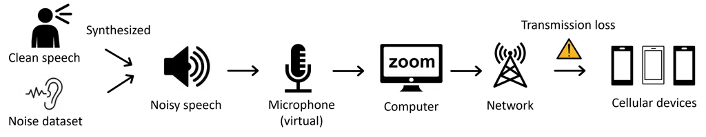
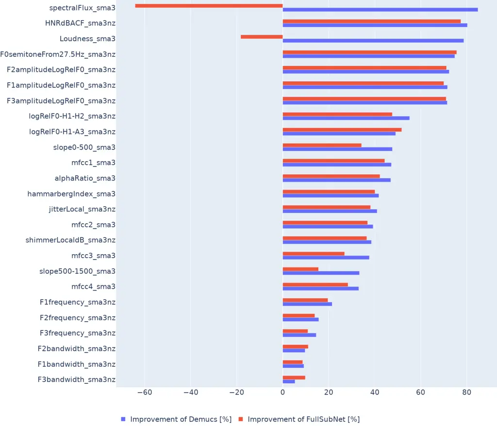
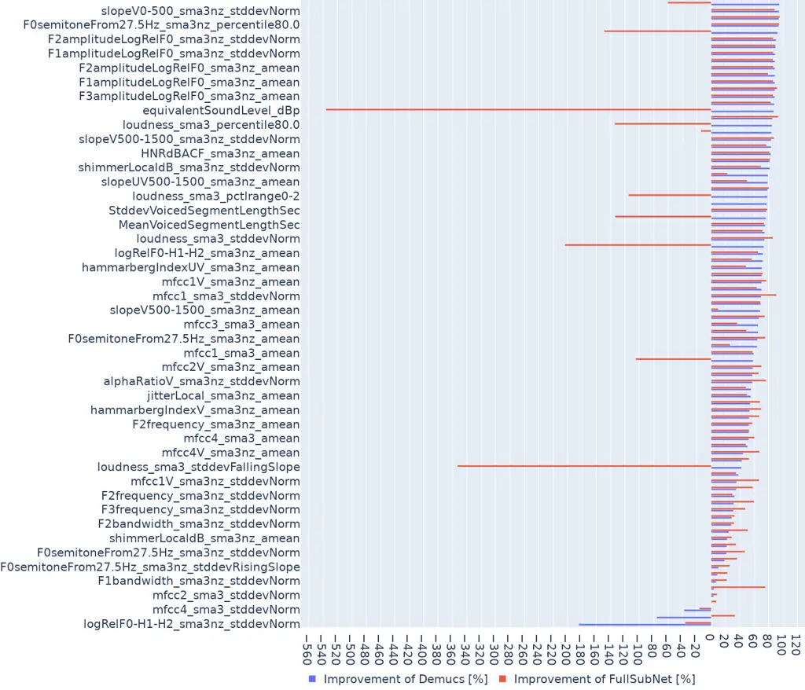
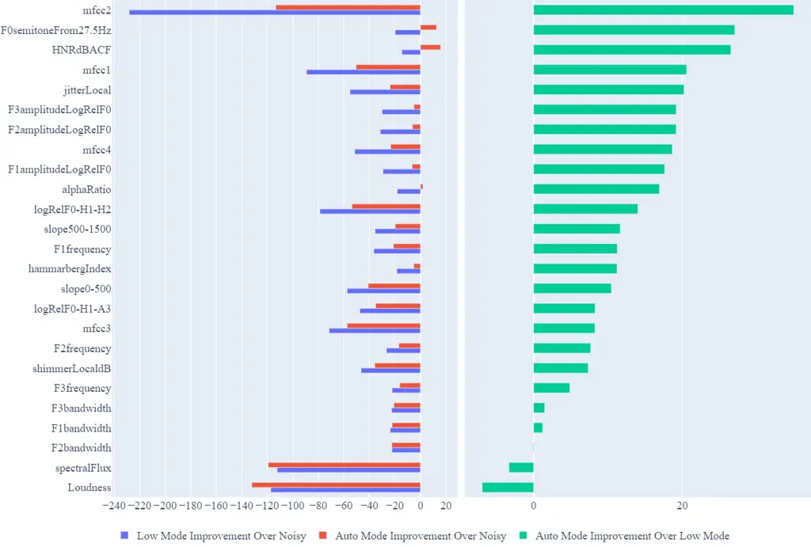
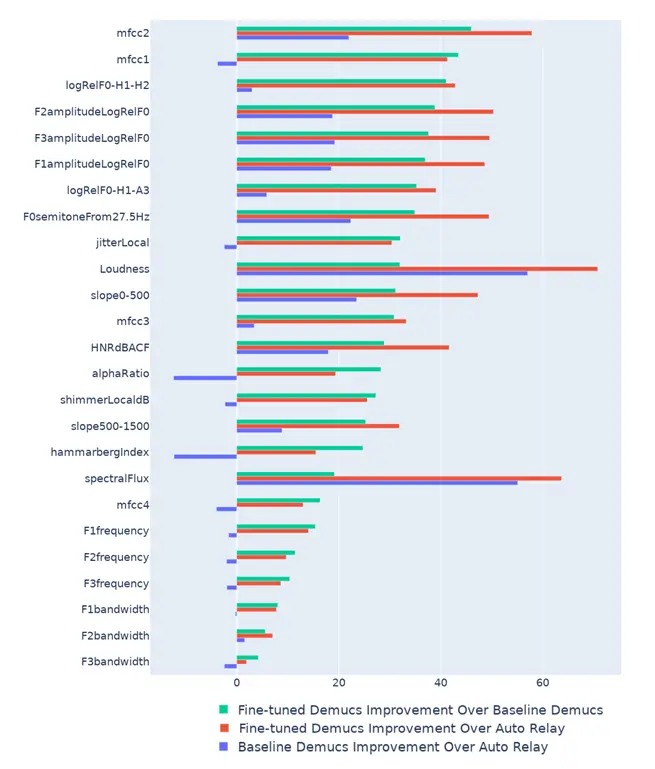

# Speech Enhancement for Virtual Meetings on Cellular Networks

Hojeong Lee Minseon Gwak Kawon Lee Minjeong Kim Joseph Konan Ojas
Bhargave  
Carnegie Mellon University  
Pittsburgh, PA 15213  
{hojeongl, mgwak, kawonl, minjeong, jkonan, obharga}@andrew.cmu.edu

###### Abstract

We study speech enhancement using deep learning (DL) for virtual
meetings on cellular devices, where transmitted speech has background
noise and transmission loss that affects speech quality. Since the Deep
Noise Suppression (DNS) Challenge dataset of Interspeech 2020 does not
contain practical disturbance, we collect a transmitted DNS (t-DNS)
dataset using Zoom Meetings over T-Mobile network. We select two
baseline models: Demucs and FullSubNet. The Demucs is an end-to-end
model that takes time-domain inputs and outputs time-domain denoised
speech, and the FullSubNet takes time-frequency-domain inputs and
outputs the energy ratio of the target speech in the inputs.

The goal of this project is to enhance the speech transmitted over the
cellular networks using deep learning models.

   

|     |
| --- |
|     |

## 1 Introduction

Speech enhancement (SE) has been widely studied for various edge devices
and as preprocessing steps for various automatic systems \[18\]. In
particular, as remote work using virtual meetings with cellular devices
becomes more common, SE for the mobile meeting applications is
essential.

The classical SE was driven by signal processing methods, such as Wiener
filtering and spectral subtraction \[20, 21\]. However, recent studies
have revealed the efficiency of data-driven methods, including deep
learning \[14, 15, 22, 16, 23\].



Figure 1: Data acquisition process of t-DNS

The Deep Noise Suppression (DNS) Challenge dataset of Interspeech 2020
has been released for data-driven SE research \[6\]. Recent DL-based SE
studies have been conducted with the DNS dataset \[16, 19, 17, 8\].
However, the DNS dataset does not reflect the effect of transmission
loss in the real-world network communication process.

In this project, we newly collect a transmitted DNS (t-DNS) dataset
through the process shown in Figure 1. The t-DNS data set contains data
traversed by T-mobile network. We aims to propose deep learning models
that enhance the speech in the t-DNS dataset scoring better than ‘auto’
mode of Zoom’s built-in background noise suppression model in terms of
perceptual metrics and acoustic metrics. With two baseline models,
Demucs \[7\] and FullSubNet \[8\], we introduce an auxiliary loss in
terms of acoustic metrics known as the extended Geneva Minimalistic
Acoustic Parameter Set (eGeMAPS) \[9\] to make the eGeMAPS features
well-preserved in the denoised speech. To the best of our knowledge, we
are the first to propose the SE dataset and model for virtual meetings
over cellular networks in the real world. When all data processing work
is completed, it is expected that the t-DNS dataset and model will be
published online and used for future SE studies.

## 2 Literature Review

Recent studies on SE have contributed to enhancing the perceptual
quality of denoised speech \[2, 4, 5\].

The methods to obtain great perceptual quality are divided into
metric-based learning and feature-based learning. The metric-based
learning aims to train a model that outputs denoised speech that results
in good evaluation when a certain perceptual metric is calculated with
target speech. \[2\] used an auxiliary loss of Short Time Objective
Intelligibility (STOI).

The feature-based learning aims to train a model that outputs denoised
speech, which has similar features to the clean or target speech. This
can be achieved by designing a loss function that captures the
divergence between the target and denoised speech with respect to
features of interest. \[4\] proposed a phone-fortified perceptual loss
to use the phonetic information in speech in training models. \[5\]
proposed an auxiliary eGeMAPS loss to prevent the output speech from
being distorted compared to the target speech in regard to eGeMAPS
features.

## 3 Model Description

We select two baseline models: Demucs \[7\] and FullSubNet \[8\]. The
main difference is that the Demucs is an end-to-end model while the
FullSubNet is a separate learning model. The Demucs takes a raw
time-domain waveform input and outputs denoised speech, which is also in
the time domain. By contrast, the FullSubNet takes a
time-frequency-domain input and outputs values to compose the final
denoised speech, which requires pre- and post-processing models for
inputs and outputs.

### 3.1 Demucs

In the Demucs \[7\], noisy speech $`\mathbf{x}\in\mathbb{R}^{T}`$ is
considered as the sum of the clean speech
$`\mathbf{s}\in\mathbb{R}^{T}`$ and noise
$`\mathbf{n}\in\mathbb{R}^{T}`$ as follows:

```math
\displaystyle\mathbf{x}=\mathbf{s}+\mathbf{n}. \tag{1}
```

The Demucs model $`f`$ is trained so that
$`f(\mathbf{x})=\hat{\mathbf{s}}\approx\mathbf{s}`$. The architecture of
the SE model consists of a multi-layer convolutional encoder-decoder
network with a sequence modeling LSTM network, which transforms the
latent output of the encoder into a nonlinear transformation. The model
$`f`$ is trained with two types of loss functions: time-domain and
time-frequency-domain losses. The time-domain loss $`L_{\text{time}}`$
is the L1 loss between the clean and denoised output speech of $`f`$,
i.e.,

```math
\displaystyle L_{\text{time}}=\frac{1}{T}||\mathbf{s}-\hat{\mathbf{s}}||_{1}. \tag{2}
```

The time-frequency-domain loss $`L_{\text{T-F}}`$ consists of the
spectral convergence loss $`L_{\text{sc}}`$ and magnitude loss
$`L_{\text{mag}}`$, i.e.,
$`L_{\text{T-F}}=L_{\text{sc}}+L_{\text{mag}}`$, where

```math
\displaystyle L_{\text{sc}} \displaystyle=\frac{|||S|-|\hat{S}|||_{F}}{|||S|||_{F}}, \tag{3}
```

```math
\displaystyle L_{\text{mag}} \displaystyle=\frac{1}{T}||\log|S|-\log|\hat{S}|||_{1}, \tag{4}
```

with $`S`$ and $`\hat{S}`$ are the short-time Fourier transform (STFT)
of $`\mathbf{s}`$ and $`\hat{\mathbf{s}}`$, respectively. Moreover,
multiple time-frequency-domain losses can be used with respect to
different STFT resolution for the number of fast Fourier transform bins,
hop sizes, and lastly window lengths.

The end-to-end property of the Demucs is beneficial in transfer learning
and in that less domain knowledge is required to use the Demucs. The
performance of the causal/noncausal Demucs with proper data augmentation
skills, such as reverbing with two sources and partial dereverberation,
reached state-of-the-art models in both objective and subjective
measures. Also, the Demucs enhanced automatic speech recognition systems
without retraining on noisy conditions.

### 3.2 FullSubNet

The FullSubNet \[8\] is a fusion model of SE models that independently
utilize fullband and subband information on short-time Fourier transform
(STFT) of speech data. Fullband models take the full band, up to the
Nyquist frequency, of the STFT data and capture the global cross-band
spectral characteristics of input speech. By contrast, subband models
take data in a partial frequency band and model local spectral patterns
with fewer model parameters than fullband models.

As in the time domain, the STFT of noisy speech can also be represented
with the STFT of the clean speech and noise, as follows:

```math
\displaystyle X=S+N, \tag{5}
```

where $`X`$, $`S`$, and $`N`$ are the STFT of $`\mathbf{x}`$,
$`\mathbf{s}`$, and $`\mathbf{n}`$, respectively. Let $`A(t,f)`$ denote
the $`(t,f)`$th component of an STFT matrix
$`A\in\mathbb{C}^{T\times F}`$, where $`T`$ is the number of frames and
$`F`$ is the number of frequency bins of STFT. In the FullSubNet
architecture, the fullband LSTM model $`g_{\text{fullband}}`$ takes
$`\mathbf{X}_{t}=\left[|X(t,0)|,|X(t,1)|,\cdots,|X(t,F-1)|\right]^{T}\in\mathbb{R}^{F}`$
as an input and extracts the fullband feature. The subband LSTM model
$`g_{\text{subband}}`$ takes an augmented input, which is the
concatenation of the fullband output and subband spectra, i.e.,
$`\left[|X(t,f-N)|,\cdots,|X(t,f)|,\cdots,|X(t,f+N)|,g_{\text{fullband}}(X)\right]^{T}\in\mathbb{R}^{2N+2}`$,
and predicts the complex ideal ratio mask (cIRM),
$`M(t,f)\in\mathbb{C}`$, which measures the energy ratio of the target
speech to the entire noisy input speech for each time-frequency bin,
i.e., $`S(t,f)=M(t,f)*X(t,f)`$. The real and imaginary parts of the
cIRM, $`(M_{r},M_{i})`$, for $`X(t,f)=X_{r}+iX_{i}`$ and
$`S(t,f)=S_{r}+iS_{i}`$ is defined as follows \[1\]:

```math
\displaystyle M_{r}=K\tanh(\frac{C}{2}\cdot\frac{X_{r}S_{r}+X_{i}S_{i}}{X_{r}^{2}+X_{i}^{2}}), \tag{6}
```

```math
\displaystyle M_{i}=K\tanh(\frac{C}{2}\cdot\frac{X_{r}S_{i}-X_{i}S_{r}}{X_{r}^{2}+X_{i}^{2}}), \tag{7}
```

where $`K`$ and $`C`$ are hyperparameters. The ground truth cIRM, $`M`$,
can be calculated from the clean and noisy speech pair, and the final
denoised speech can be constructed from the output cIRM values and input
noisy speech. Thus, the FullSubNet model $`g`$ is trained so that
$`g(X)=\hat{M}\approx M`$. The $`g`$ is trained with
$`L_{\text{cIRM}}`$, which measures the mean squared error between the
true and estimated cIRMs. It is shown in \[8\] that the FullSubNet
outperforms state-of-the-art models on the DNS dataset, and the
information obtained in the fullband and subband models is
complementary.

## 4 Dataset

The t-DNS dataset will be created based on the DNS Challenge dataset
\[6\]. The DNS Challenge dataset aims to provide an extensive and
representative dataset to train the speech enhancement models. It
contains 500 hours of clean speech from 2,150 speakers and a noise data
set with at least 500 clips for 150 audio classes. Also, it contains
test data with and without reverberation, and we will focus on the test
data without the reverberation. Noisy speech is generated by
synthesizing clean and noise speech data. The synthesized noisy speech
is then sent across a virtual microphone, Zoom Meetings, T-mobile
network and finally to cellular devices, as shown in Figure 1. In the
Zoom Meetings, a low-level built-in noise suppression model will be used
to minimize the impact of the speech enhancement with using it. The data
sent to each cellular device is collected by the computer through the
audio interface.

## 5 Evaluation Metric

This section introduces the metrics for estimating the performance of
our SE model. We explain target metrics utilizable in our project. All
three metrics are classified as relative metrics, which require a
reference signal to compare a given signal.

- •
  Frequency weighted Segmental Signal to Noise Ratio (fwSegSNR)

  Time-domain and frequency-weighted measurements, Signal to Noise Ratio
  (SNR) and fwSegSNR are both based on a clean signal $`X`$ enhanced
  signal $`\hat{X}`$. This is given a different weight for each
  frequency. $`W(j,m)`$ is the weight on the frequency band of $`j`$th,
  and $`K`$ is the number of bands. $`M`$ is the total number of frames
  in the signal. $`X(j,m)`$ is critical critical band magnitude of clean
  signal at $`m`$th frame, $`j`$th frequency frequency band.

  ```math
  \displaystyle\mathrm{fwSegSNR}=\frac{10}{M}\sum^{M-1}_{m=0}\frac{\sum^{K}_{j=1}W(j,m)\log_{10}\frac{X(j,m)^{2}}{(X(j,m)-\hat{X}(j,m))^{2}}}{\sum^{K}_{j=1}W(j,m)} \tag{8}
  ```

- •
  Perceptual Evaluation of Speech Quality (PESQ)

  PESQ performs well in a wide range of codecs and network conditions.
  The core part consists of aggregating the disturbance to measure the
  audible error in three steps each by using $`p`$ norm as Equation (9);
  frame-by-frame disturbance, split second disturbance, and speech
  length averaged disturbance. The notation $`N`$ in Equation (9)
  indicates the total number of data in each norm-calculating part. PESQ
  returns a mean opinion score (MOS) from 0 to 5, with higher scores
  indicating better quality. Usually, PESQ indicates WB-PESQ, a wide
  band PESQ, and NB-PESQ indicates a narrow band PESQ. WB-PESQ, which
  has the benefit of transferring higher data rates, reads the input
  signal with input filter of 2 while NB-PESQ, which has the benefit of
  better sensitivity and range, does it as 1.

  ```math
  \displaystyle L_{p}=\left(\frac{1}{N}\sum_{m=1}^{N}\text{disturbance}[m]^{p}\right)^{\frac{1}{p}} \tag{9}
  ```

&nbsp;

- •
  Short-Time Objective Intelligibility (STOI)

  STOI is a function to calculate the linear correlation coefficient of
  clean speech and denoised speech data. In Equation (10), $`X`$
  indicates a decomposed clean speech, and $`Y`$ is a decomposed noisy
  speech after DFT-based 1/3 octave band decomposition. In Equation
  (10), $`d`$ means the correlation coefficient of $`X`$ and $`Y`$
  corresponds to each frame $`m`$ and one-third octave band $`j`$. In
  Equation (11), This $`d`$ is averaged as a single scalar value
  indicating the voice intelligibility, where $`M`$ represents the total
  number of frames and $`J`$ represents the number of one-third octave
  bands.

  ```math
  \displaystyle d_{j}(m)=\frac{\sum_{n}\bigg(X_{j}(n)-\frac{1}{N}\sum_{l}X_{j}(l)\bigg)\bigg(Y_{j^{\prime}}(n)-\frac{1}{N}\sum_{l}Y_{j^{\prime}}(l)\bigg)}{\sqrt{\sum_{n}\bigg(X_{j}(n)-\frac{1}{N}\sum_{l}X_{j}(l)\bigg)^{2}\sum_{n}\bigg(Y_{j^{\prime}}(n)-\frac{1}{N}Y_{j^{\prime}}(l)\bigg)^{2}}} \tag{10}
  ```

  ```math
  \displaystyle d=\frac{1}{JM}\sum_{j,m}d_{j}(m) \tag{11}
  ```

## 6 Loss Function

### 6.1 Temporal Acoustic Parameter Estimator

As a training boost, we fine-tune the two baseline models with temporal
acoustic parameter (TAP) loss. This aims to minimize the temporal
divergence between clean and enhanced acoustic parameters. Its
availability in both time domain and time-frequency domain enables us to
use it to both Demucs and FullSubNet models.

For a given signal $`\mathbf{y}`$, let
$`\mathbf{A}_{\mathbf{y}}\in\mathbf{R}^{T\times 25}`$ indicate the 25
temporal acoustic parameters in T discrete time frames, and
$`A_{\mathbf{y}}(t,p)`$ indicate it by each parameter $`p`$ and discrete
time frame $`t`$. Then, TAP parameter gives an estimate of
$`\mathbf{A}_{\mathbf{y}}`$ as $`\hat{\mathbf{A}}_{\mathbf{y}}`$ as in
Equation (12).

```math
\hat{\mathbf{A}}_{\mathbf{y}}=\mathcal{T}\mathcal{A}\mathcal{P}(\mathbf{y}) \tag{12}
```

TAP estimator is obtained from a pretrained recurrent neural network
which minimizes the mean absolute error defined as Equation (13).

```math
\operatorname{MAE}\left(\mathbf{A}_{\mathbf{y}},\hat{\mathbf{A}}_{\mathbf{y}}\right)=\frac{1}{TP}\sum_{t=0}^{T-1}\sum_{p=0}^{P-1}\left|A_{\mathbf{y}}(t,p)-A_{\hat{\mathbf{y}}}(t,p)\right|\in\mathbb{R} \tag{13}
```

Using TAP estimators makes end-to-end learning possible by overcoming
the non-differentiable properties of acoustic parameters.

### 6.2 Temporal Acoustic Parameter Loss

Temporal acoustic parameter loss, $`\mathcal{L}_{\mathrm{TAP}}`$,
minimizes divergence between each TAP estimators of the clean and
enhanced speech. The mathematical term is expressed in in Equation (14).
$`\sigma(\boldsymbol{\omega})`$ indicates the smoothed energy weights
that emulates human hearing with bounded scales. Our loss function is a
combination of the L1 loss and the acoustic loss. We control the weight
of the acoustic loss by a parameter $`\alpha`$.

```math
\mathcal{L}_{\mathrm{TAP}}(\mathbf{s},\hat{\mathbf{s}})=\operatorname{MAE}(\mathcal{T}\mathcal{A}(\mathbf{s})\odot\sigma(\boldsymbol{\omega}),\mathcal{T}\mathcal{A}\mathcal{P}(\hat{\mathbf{s}})\odot\sigma(\boldsymbol{\omega})) \tag{14}
```

## 7 Experiments

### 7.1 Metric evaluation

Table 1 summarizes the results of 150 noise data in the DNS 2020 dataset
after speech enhancement. We inserted the raw waveform form into the
processes of Demucs and FullSubNet without additional training. Both
methods show high speech enhancement performance. However, in the case
of FullSubNet, the performance is better than that of Demucs in PESQ
metrics, and in the rest of the metrics, the performance of Demucs is
better.

|            | WB-PESQ | STOI(%) | fwSNRseg(dB) |
| ---------- | ------- | ------- | ------------ |
| Noisy      | 1.582   | 91.51   | 12.62        |
| Demucs     | 2.647   | 96.52   | 17.17        |
| FullSubNet | 2.888   | 96.41   | 16.96        |

Table 1: Evaluation on enhancement in denoised speech compared to noisy
speech

### 7.2 Acoustic improvement

In addition to speech-level metric evaluation of denoised speech, the
acoustic parameters-improving abilities of the SE models were analyzed.
We used 25 acoustic parameters defined in the eGeMAPS. The acoustic
parameters include frequency-related parameters, energy or
amplitude-related parameters, spectral balance parameters, and temporal
parameters. We denote the $`i`$th acoustic parameter vector of speech
$`\mathbf{u}`$ as $`A_{\mathbf{u}}^{(i)}\in\mathbb{R}^{T_{\mathbf{u}}}`$
for $`i=1,2,\cdots,25`$, where $`T_{\mathbf{u}}`$ is the total number of
time frames of $`\mathbf{u}`$. To consider all denoised speech of an SE
model $`m`$, let $`\mathbf{A}_{m}^{(i)}`$ be the augmented acoustic
parameter vector such that
$`\mathbf{A}_{m}^{(i)}=\left[(A_{\mathbf{u}}^{(i)})^{T}\right]^{T}_{\mathbf{u}\in\mathcal{S}_{m}}\in\mathbb{R}^{T}`$,
where $`\mathcal{S}_{m}`$ is the set of all denoised speech of $`m`$ and
$`T=\sum_{\mathbf{u}\in\mathcal{S}_{m}}T_{\mathbf{u}}`$. For better
interpretation, augmented acoustic parameter vectors were standardized
with some specific mean $`\mu_{i}`$ and standard deviation
$`\sigma_{i}`$ values obtained in a large speech dataset for each
acoustic parameter $`i`$, as follows:

```math
\displaystyle\mathbf{A}_{m}^{(i)}=\frac{\mathbf{A}_{m}^{(i)}-\mu_{i}\mathbf{1}_{T}}{\sigma_{i}}, \tag{15}
```

where $`\mathbf{1}_{T}`$ is $`T`$-dimensional all-ones vector.



Figure 2: Improvement in the acoustic parameters of the denoised speech
of two SE models



Figure 3: Improvement in the statistics of acoustic parameters of the
denoised speech of two SE models

To see the acoustic improvement of $`m`$, We first evaluate the mean
absolute error (MAE) of the acoustic parameter of denoised speech to the
acoustic parameters of the corresponding clean speech for every $`i`$th
parameter, as follows:

```math
\displaystyle\text{MAE}_{m}^{(i)}=\frac{1}{T}\sum_{t=1}^{T}\left|\mathbf{A}_{\text{clean}}^{(i)}(t)-\mathbf{A}_{m}^{(i)}(t)\right|, \tag{16}
```

where $`\mathbf{A}_{m}^{(i)}(t)`$ is the $`t`$th component of
$`\mathbf{A}_{m}^{(i)}`$ and $`\mathbf{A}_{\text{clean}}^{(i)}`$ denotes
the augmented acoustic parameter vector of clean speech. We then
evaluated the acoustic improvement $`I_{m}^{(i)}`$ of an SE model $`m`$
for the $`i`$th acoustic parameter, as follows:

```math
\displaystyle I_{m}^{(i)}=\frac{\text{MAE}^{(i)}_{\text{noisy}}-\text{MAE}^{(i)}_{m}}{\text{MAE}^{(i)}_{\text{noisy}}}\times 100, \tag{17}
```

where $`\text{MAE}^{(i)}_{\text{noisy}}`$ denotes the MAE for noisy
speech. The acoustic improvement in Demucs and FullSubNet, i.e.,
$`I_{\text{Demucs}}`$ and $`I_{\text{FullSubNet}}`$, is shown in Fig. 2,
where the $`y`$-axis represents the 25 acoustic parameters in the
eGeMAPS. Moreover, the improvement with respect to the statistics for
each acoustic parameter is also evaluated in Fig. 3. The SE models
improved almost all acoustic parameters, as shown in Figs. 2 and 3. Some
acoustic parameters, such as ‘spectralFlux_sma3’ and ‘Loudness_sma3’,
however, are degraded by the FullSubNet, which requires further analysis
of the denoised speech of the FullSubNet.

## 8 Results

### 8.1 Perceptual Evaluation

|                             |              |       |         |
| --------------------------- | ------------ | ----- | ------- |
|                             | fwSNRseg(dB) | PESQ  | STOI(%) |
| Clean                       | \-           | \-    | \-      |
| Noisy                       | 12.629       | 1.582 | 91.52   |
| Noisy Relay (Low)           | 4.804        | 1.549 | 79.76   |
| Industrial Denoising (Auto) | 5.636        | 1.701 | 81.06   |
| Demucs (Baseline)           | 5.611        | 1.375 | 76.51   |
| Demucs (Fine-tuned)         | 6.772        | 1.397 | 80.18   |
| Demucs (Ours)               | 8.959        | 1.557 | 84.52   |
| FullSubNet (Baseline)       | 5.712        | 1.511 | 78.2    |
| FullSubNet (Fine-tuned)     | 6.546        | 1.496 | 80.27   |
| FullSubNet (Ours)           | 8.897        | 1.631 | 84.01   |

Table 2: Metrics of speech enhancement quality

Table 2 shows the evaluation of each model in three metrics: fwSNRseg,
PESQ and STOI. Noisy is the raw noisy data before entering zoom. Noisy
Relay indicates the speech transmitted through zoom with ’low’ mode of
built-in background noise suppression. Industrial Denoising indicates
the speech transmitted through zoom with ’auto’ mode of built-in
background noise suppression. For each Demucs and FullSubNet, the three
different models are used. Baseline model is same as the provided model
from the paper. Fine-tuned model is further trained model with the
training data. As the higher metrics means the better speech, there
exists a degradation due to the transmission loss. The metrics of
fine-tuned Demucs are better than those of the built-in low noise
suppression model. However, the best Demucs model is worse than the auto
mode in terms of PESQ for now. This is because the hyperparameter tuning
is currently in progress. When the hyperparameter working is done, the
metrics will be get much better. The results from FullSubNet show
similar trends to those from Demucs.

### 8.2 Acoustic Evaluation

The improvement of acoustic metrics is measured as how well the input
noisy speech is processed into enhanced speech. The left portion of
Figure 4 is the improvement of each Zoom’s Low and Auto modes over
untransmitted noisy speech. The right portion is about the improvement
of auto mode over the low mode which shows that the auto mode is more
powerful than the low mode. Even when using the Zoom’s built-in noise
suppression, noise added to the speech due to transmission on cellular
networks degrades its speech in almost all aspects of eGeMAPS. In Figure
5, y-axis is for 25 acoustic parameters. The green and red bars
represent the improvement of baseline and our models, repectively,
compared to the Zoom’s auto denoising mode. The blue bar represents how
much our model is better than the baseline. Our model showed better
improvements in most of the acoustic parameters.

## 9 Future Works

As the rest of the dataset is being processed, we only can investigate
the dataset transmitted through T-moblie network. Once processing is
done on the other 3 networks, we will compare the data from each of the
4 network provider and use SE to make the worst one the best. Also, we
are considering to analyze the acoustic characteristics of t-DNS. Then,
we can optimize the acoustic parameters using characteristics that will
make the noisy speech even better than the enhanced speech in this
project.

## 10 Conclusion

The main contribution of our work is that we provide the t-DNS dataset
which reflects the effect of transmission loss in the real-world
cellular network communication. Also, we applied temporal acoustic loss
function to fine tune the two baseline models, Demucs and FullSubNet.
Our model beats the baseline models and the industrial denoised model,
showing the effect of training on t-DNS dataset and temporal acoustic
loss function.

## 11 Division of work

The project work was evenly distributed, and all team members
participated in report writing and regular meetings throughout the
semester.

- •
  Hojeong Lee: Results analysis, metric evaluation
- •
  Minseon Gwak: FullSubNet implementation and experiments
- •
  Kawon Lee: Demucs implementation and experiments, presentation
- •
  Minjeong Kim: Results analysis, metric evaluation

## 12 Github repository

https://github.com/Minseon-Gwak/Speech-enhancement-zoom-phone

## References

- \[1\] Williamson, D. S. and others. Complex ratio masking for monaural
  speech separation. IEEE/ACM transactions on audio, speech, and
  language processing, 2015.
- \[2\] Zhao, Yan and others. Perceptually guided speech enhancement
  using deep neural networks. 2018 IEEE International Conference on
  Acoustics, Speech and Signal Processing (ICASSP), 2018.
- \[3\] Zeng, Yunyang and others. TAPLOSS: A TEMPORAL ACOUSTIC PARAMETER
  LOSS FOR SPEECH ENHANCEMENT. unpublished, 2022.
- \[4\] Tsun-An Hsieh and others. Improving Perceptual Quality by
  Phone-Fortified Perceptual Loss Using Wasserstein Distance for Speech
  Enhancement. Interspeech 2021, 2021.
- \[5\] Yang, Muqiao and others. Improving Speech Enhancement through
  Fine-Grained Speech Characteristics. Interspeech, 2022.
- \[6\] Reddy, Chandan KA and others. The interspeech 2020 deep noise
  suppression challenge: Datasets, subjective testing framework, and
  challenge results. arXiv preprint arXiv:2005.13981, 2020.
- \[7\] Defossez, Alexandre and others. Real time speech enhancement in
  the waveform domain. Interspeech, 2020.
- \[8\] Defossez, Alexandre and others. Fullsubnet: A full-band and
  sub-band fusion model for real-time single-channel speech enhancement.
  ICASSP 2021-2021 IEEE International Conference on Acoustics, Speech
  and Signal Processing (ICASSP), 2021.
- \[9\] Eyben, Florian and others. The Geneva minimalistic acoustic
  parameter set (GeMAPS) for voice research and affective computing.
  IEEE Trans. Affect. Comput., 2015.
- \[10\] Alexander, Jay and Mozer, Michael C. Template-based algorithms
  for connectionist rule extraction. Adv. Neural Inf. Process
  Syst., 1994.
- \[11\] Défossez, Alexandre and others. Music source separation in the
  waveform domain. arXiv preprint arXiv:1911.13254, 2019.
- \[12\] Rix, Antony W and others. Perceptual evaluation of speech
  quality (PESQ)-a new method for speech quality assessment of telephone
  networks and codecs. 2001 IEEE international conference on acoustics,
  speech, and signal processing. Proceedings (Cat. No. 01CH37221), 2001.
- \[13\] Taal, Cees H and others. An algorithm for intelligibility
  prediction of time–frequency weighted noisy speech. IEEE Transactions
  on Audio, Speech, and Language Processing, 2011.
- \[14\] Lu, Xugang and others. Speech enhancement based on deep
  denoising autoencoder. Interspeech, 2013.
- \[15\] Xu, Yong and others. A regression approach to speech
  enhancement based on deep neural networks. IEEE/ACM Transactions on
  Audio, Speech, and Language Processing, 2014.
- \[16\] Weninger, Felix and others. Speech enhancement with LSTM
  recurrent neural networks and its application to noise-robust ASR.
  International conference on latent variable analysis and signal
  separation, 2015.
- \[17\] Li, Xiaofei and Horaud, Radu. Online monaural speech
  enhancement using delayed subband lstm. arXiv preprint
  arXiv:2005.05037, 2020.
- \[18\] Gannot, Sharon and Vincent, Emmanuel and Markovich-Golan,
  Shmulik and Ozerov, Alexey. A consolidated perspective on
  multimicrophone speech enhancement and source separation. IEEE/ACM
  Transactions on Audio, Speech, and Language Processing, 2017.
- \[19\] Chen, Jitong and Wang, DeLiang. Long short-term memory for
  speaker generalization in supervised speech separation. The Journal of
  the Acoustical Society of America, 2017.
- \[20\] Boll, Steven. Suppression of acoustic noise in speech using
  spectral subtraction. IEEE Transactions on acoustics, speech, and
  signal processing, 1979.
- \[21\] Scalart, Pascal and others. Speech enhancement based on a
  priori signal to noise estimation. 1996 IEEE International Conference
  on Acoustics, Speech, and Signal Processing Conference
  Proceedings, 1996.
- \[22\] Weninger, Felix and others. Single-channel speech separation
  with memory-enhanced recurrent neural networks. 2014 IEEE
  international conference on acoustics, speech and signal processing
  (ICASSP), 2014.
- \[23\] Zhao, Han and others. Convolutional-recurrent neural networks
  for speech enhancement. 2018 IEEE International Conference on
  Acoustics, Speech and Signal Processing (ICASSP), 2018.

## 13 Appendix

Here are some example of our work: [FullSubNet Speech Enhancement
Demo](https://cmu.app.box.com/s/p2s03iaf70xynom3y7kvv5u4i7v6fgy4)



Figure 4: Acoustic parameters of Zoom built-in denoising modes



Figure 5: Acoustic parameters for Demucs
