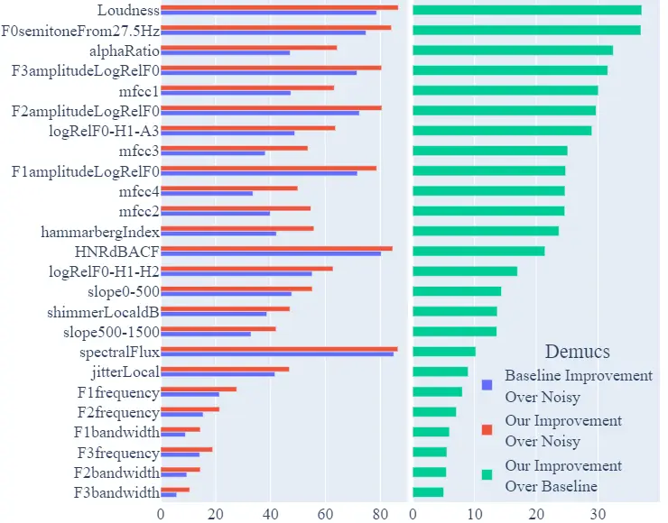
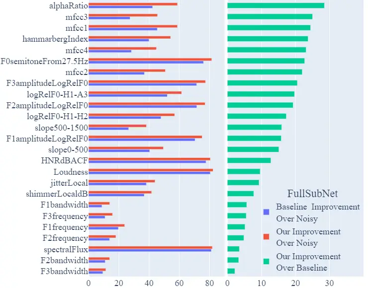
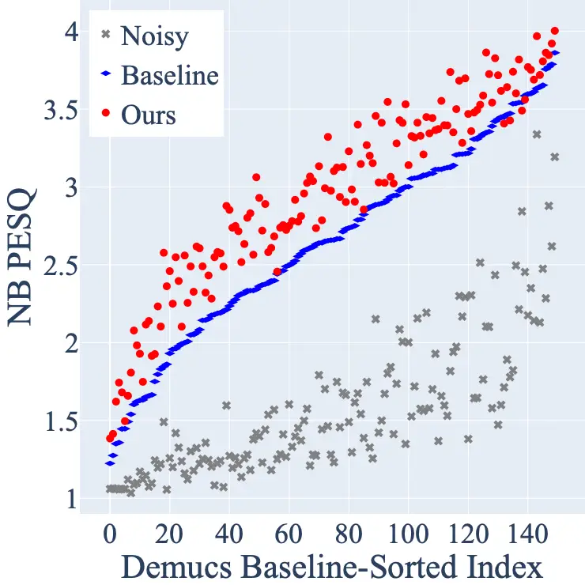
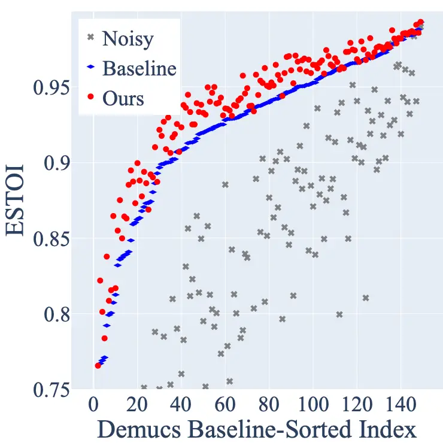
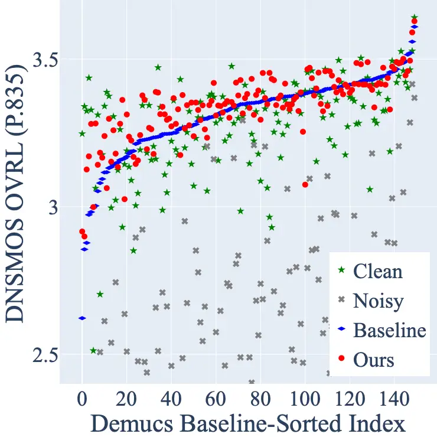
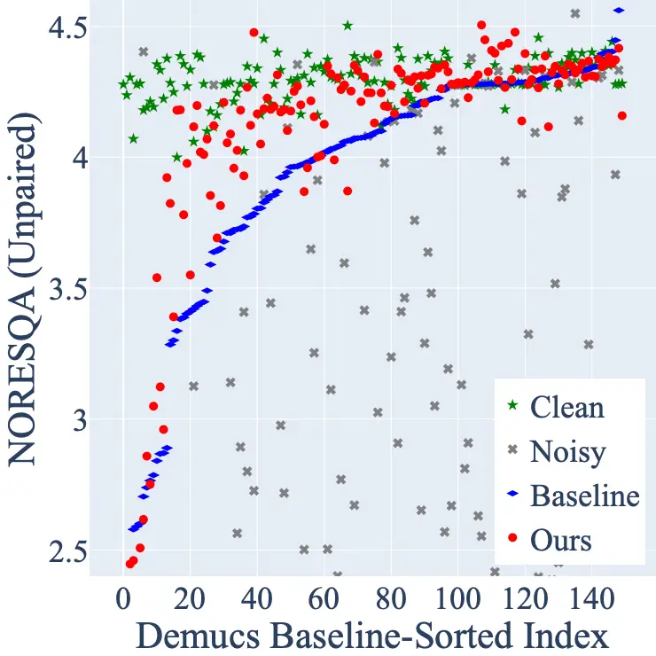

# TAPLoss: A Temporal Acoustic Parameter Loss for Speech Enhancement

###### Abstract

Speech enhancement models have greatly progressed in recent years, but
still show limits in perceptual quality of their speech outputs. We
propose an objective for perceptual quality based on temporal acoustic
parameters. These are fundamental speech features that play an essential
role in various applications, including speaker recognition and
paralinguistic analysis. We provide a differentiable estimator for four
categories of low-level acoustic descriptors involving:
frequency-related parameters, energy or amplitude-related parameters,
spectral balance parameters, and temporal features. Unlike prior work
that looks at aggregated acoustic parameters or a few categories of
acoustic parameters, our temporal acoustic parameter (TAP) loss enables
auxiliary optimization and improvement of many fine-grain speech
characteristics in enhancement workflows. We show that adding TAPLoss as
an auxiliary objective in speech enhancement produces speech with
improved perceptual quality and intelligibility. We use data from the
Deep Noise Suppression 2020 Challenge to demonstrate that both
time-domain models and time-frequency domain models can benefit from our
method.

###### Index Terms: 

Speech, Enhancement, Acoustics, Perceptual Quality, Explainable
Enhancement Evaluation, Interpretability

## 1 Introduction

Speech enhancement is aimed at enhancing the quality and intelligibility
of degraded speech signals. The need for this arises in a variety of
speech applications. While noise suppression or removal is an important
part of the speech enhancement, retaining the perceptual quality of the
speech signal is equally important. In recent years, deep neural
networks based approaches have been the core of most state-of-the-art
speech enhancement systems, in particular single channel speech
enhancement \[1, 2, 3, 4\]. These are traditionally trained using
point-wise differences in time-domain or time-frequency-domain.

However, many studies have shown limitations in these losses, including
low correlations with speech quality \[5\] and \[6\]. Other studies have
shown that they have overemphasis on high-energy phonemes \[7\] and an
inability to improve pitch \[8\], resulting in speech that has artifacts
or poor perceptual quality \[9\]. The insufficiency of these losses has
led to much work devoted to improving the perceptual quality of enhanced
signals, which our work also aims to improve. Perceptual losses have
often involved estimating the standard evaluation metrics such as
Perceptual Evaluation of Speech Quality (PESQ) \[10\]. However, PESQ is
non-differentiable, which forces difficult optimization \[11\] and often
leads to limited improvements \[12, 13\]. Other approaches use deep
feature losses \[14, 15\]; however, these have limited improvements
because perceptual quality is only implicitly supervised. In this paper,
we seek to address these issues by using fundamental speech features,
which we refer to as acoustic parameters.

The use of acoustic parameters has been shown to facilitate speaker
classification, emotion recognition, and other supervised tasks
involving speech characteristics \[16, 17, 18\]. Historically, these
acoustic parameters were not incorporated in workflows with deep neural
networks because they required non-differentiable computations. However,
this does not reflect their significant correlation with voice quality
in prior literature \[19, 20, 21\]. Recently, some works have made
progress in incorporating acoustic parameters for optimization of deep
neural networks. Pitch, energy contour, and pitch contour were proposed
to optimize perceptual quality in \[22\]. However, these three
parameters are a small subset of the characteristics we consider, and
evaluation was not performed on standard English datasets. A wide range
of acoustic parameters was proposed in \[23\], which introduced a
differentiable estimator of these parameters to create an auxiliary loss
aimed at forcing models to retain acoustic parameters. This proved to
improve the perceptual quality of speech. Unlike prior work, which used
summary statistics of acoustic parameters per utterance, our current
estimator allows optimization at each time step. The values of each
parameter vary over time in the utterance, so statistics lose a
significant amount of information in the comparison of clean and
enhanced speech.

We look at 25 acoustic parameters – frequency related parameters: pitch,
jitter, F1, F2, F3 Frequency and bandwidth; energy or amplitude-related
parameters: shimmer, loudness, harmonics-to-noise (HNR) ratio; spectral
balance parameters: alpha ratio, Hammarberg index, spectral slope, F1,
F2, F3 relative energy, harmonic difference; and additional temporal
parameters: rate of loudness peaks, mean and standard deviation of
length of voiced/unvoiced regions, and continuous voiced regions per
second. We use OpenSmile \[24\] to perform the ground-truth
non-differentiable calculations, creating a dataset to to train a
differentiable estimator.

Finally, we present our estimator for these 25 temporal acoustic
parameters. Using the estimator, we define an acoustic parameter loss,
coined TAPLoss, $`\mathcal{L}_{\text{TAP}}`$, that minimizes the
distance between estimated acoustics for clean and enhanced speech.
Unlike previous work, we do not assume the user has access to
ground-truth clean acoustics. We empirically demonstrate the success of
our method, observing improvement in relative and absolute enhancement
metrics for perceptual quality and intelligibility.

## 2 Methods

|             |                                                                                    |        |        |        |        |                                                                                    |        |        |        |        |                                                             |        |        |        |        |
| ----------- | ---------------------------------------------------------------------------------- | ------ | ------ | ------ | ------ | ---------------------------------------------------------------------------------- | ------ | ------ | ------ | ------ | ----------------------------------------------------------- | ------ | ------ | ------ | ------ |
| \toprule    | Demucs $`\mathcal{L}_{\text{TAP}}`$ $`\lambda_{1}`$ Ablation ($`\lambda_{2}`$ = 0) |        |        |        |        | Demucs $`\mathcal{L}_{\text{TAP}}`$ $`\lambda_{2}`$ Ablation ($`\lambda_{1}`$ = 1) |        |        |        |        | FullSubNet $`\mathcal{L}_{\text{TAP}}`$ $`\gamma`$ Ablation |        |        |        |        |
| Weight      | 0.01                                                                               | 0.03   | 0.1    | 0.3    | 1      | 0.01                                                                               | 0.03   | 0.1    | 0.3    | 1      | 0.01                                                        | 0.03   | 0.1    | 0.3    | 1      |
| PESQ        | 2.788                                                                              | 2.841  | 2.824  | 2.834  | 2.859  | 2.899                                                                              | 2.903  | 2.926  | 2.958  | 2.958  | 2.979                                                       | 2.981  | 2.979  | 2.969  | 2.965  |
| STOI        | 0.9697                                                                             | 0.9698 | 0.9689 | 0.9689 | 0.9694 | 0.9707                                                                             | 0.9712 | 0.9714 | 0.9722 | 0.9720 | 0.9654                                                      | 0.9654 | 0.9654 | 0.9648 | 0.9654 |
| \bottomrule |                                                                                    |        |        |        |        |                                                                                    |        |        |        |        |                                                             |        |        |        |        |

Table 1: $`\mathcal{L}_{\text{TAP}}`$ ablation study of Demucs
hyperparameters, $`\lambda_{1}`$ and $`\lambda_{2}`$, and FullSubNet
hyperparamter $`\gamma`$.

{subfigure}

0.5 
{subfigure}0.5


Figure 1: Percent Acoustic Improvement $`\mathbf{PAI}`$ on DNS-2020
Synthetic Test (No Reverb). Compared are baseline improvement over noisy
(blue) $`\mathbf{PAI}(\mathbf{s_{1}},\mathbf{x})`$, our improvement over
noisy (red) $`\mathbf{PAI}(\mathbf{s_{2}},\mathbf{x})`$, our improvement
over baseline (green) $`\mathbf{PAI}(\mathbf{s_{2}},\mathbf{s_{1}})`$.
Sorted by $`\mathbf{PAI}(\mathbf{s_{2}},\mathbf{s_{1}})`$.

### 2.1 Background

In the time domain, let $`\mathbf{y}`$ denote a signal with discrete
duration $`M`$ such that $`\mathbf{y}\in\mathbb{R}^{M}`$. We define
clean speech signal $`\mathbf{s}`$, noise signal $`\mathbf{n}`$, and
noisy speech signal $`\mathbf{x}`$ with the following additive relation:

```math
\mathbf{x}=\mathbf{s}+\mathbf{n}\\
 \tag{1}
```

Similarly, in the time-frequency domain, let
$`\mathbf{Y}\in\mathbb{C}^{T\times F}`$ denote a complex spectrogram
with $`T`$ discrete time frames and $`F`$ discrete frequency bins.
$`\mathfrak{Re}\{\mathbf{Y}\}\in\mathbb{R}^{T\times F}`$ denotes real
components and $`\mathfrak{Im}\{\mathbf{Y}\}\in\mathbb{R}^{T\times F}`$
denotes complex components. Let $`Y(t,f)`$ be the complex-valued
time-frequency bin of $`\mathbf{Y}`$ at discrete time frame
$`t\in[0,T)`$ and discrete frequency bin $`f\in[0,F)`$. By the linearity
of Fourier transforms, the complex spectrograms for clean speech
$`\mathbf{S}`$, noise $`\mathbf{N}`$, and noisy speech $`\mathbf{X}`$
relate with the additive relation:

```math
\mathbf{X}=\mathbf{S}+\mathbf{N}\\
 \tag{2}
```

A speech enhancement model $`G`$ outputs enhanced signal
$`\mathbf{\hat{s}}`$ such that:

```math
\left\{\mathbf{\hat{s}}=G(\mathbf{x})\middle|\mathbf{\hat{s}},\mathbf{x}\in\mathbb{R}^{M}\right\} \tag{3}
```

During optimization, $`G`$ minimizes the divergence between
$`\mathbf{s}`$ and $`\mathbf{\hat{s}}`$. We denote $`\mathbf{\hat{S}}`$
to be enhanced complex spectrogram derived from $`\mathbf{\hat{s}}`$.

### 2.2 Temporal Acoustic Parameter Estimator

Let $`\mathbf{A}_{\mathbf{y}}\in\mathbf{R}^{T\times 25}`$ represent the
25 temporal acoustic parameters of signal $`\mathbf{y}`$ with $`T`$
discrete time frames. We represent $`A_{\mathbf{y}}(t,p)`$ as the
acoustic parameter $`p`$ at discrete time frame $`t`$. We standardize
the acoustic parameters to have mean 0 and variance 1 across the time
dimension. Standardization helps optimization and analysis through
consistent units across features. To predict
$`\mathbf{A}_{\mathbf{y}}`$, we define estimator:

```math
\mathbf{\hat{A}}_{\mathbf{y}}=\mathcal{TAP}(\mathbf{y}) \tag{4}
```

$`\mathcal{TAP}`$ takes a signal input $`\mathbf{y}`$, derives complex
spectrogram $`\mathbf{Y}`$ with $`F=257`$ frequency bins, and then
passes the complex spectrogram to a recurrent neural network to output
the temporal acoustic parameter estimates
$`\mathbf{\hat{A}}_{\mathbf{y}}`$.

For loss calculation, we define total mean absolute error as:

```math
\text{MAE}(\mathbf{A}_{\mathbf{y}},\mathbf{\hat{A}}_{\mathbf{y}})=\frac{1}{TP}\sum_{t=0}^{T-1}\sum_{p=0}^{P-1}|A_{\mathbf{y}}(t,p)-A_{\mathbf{\hat{y}}}(t,p)|\in\mathbb{R} \tag{5}
```

During training, $`\mathcal{TAP}`$ parameters learn to minimize the
divergence of $`\text{MAE}(\mathbf{A_{s}},\mathbf{A_{\hat{s}}})`$ using
Adam optimization.

### 2.3 Temporal Acoustic Parameter Loss

We developed temporal acoustic parameter loss,
$`\mathcal{L}_{\text{TAP}}`$, to enable divergence minimization between
clean and enhanced acoustic parameters. This section expounds the
mathematical formulation of $`\mathcal{L}_{\text{TAP}}`$.

Let magnitude spectrogram $`||\hat{S}(t,f)||`$ represent the magnitude
of complex spectrogram $`\mathbf{\hat{S}}`$. Using Parseval’s Theorem,
the frame energy weights, $`\boldsymbol{\omega}`$, is derived from the
magnitude spectrogram mean across the frequency axis:

```math
\boldsymbol{\omega}=\frac{1}{F}\sum_{f=0}^{F-1}||\hat{S}(t,f)||^{2}\;\in\mathbb{R}^{T} \tag{6}
```

Because high energies are perceived more noticeably, we apply sigmoid,
$`\sigma`$, to emulate human hearing with bounded scales, resulting in
smoothed energy weights $`\sigma(\omega)`$.

Finally, we define our temporal acoustic parameter loss,
$`\mathcal{L}_{\text{TAP}}`$, as the mean absolute error between clean
and enhanced acoustic parameter estimates with smoothed frame
energy-weighting:

```math
\displaystyle\mathcal{L}_{\text{TAP}}(\mathbf{s},\mathbf{\hat{s}})=\text{MAE}\left(\mathcal{TAP}(\mathbf{s})\odot\sigma(\boldsymbol{\omega}),\mathcal{TAP}(\mathbf{\hat{s}})\odot\sigma(\boldsymbol{\omega})\right) \tag{7}
```

Here, ”$`\odot`$” denotes elementwise multiplication with broadcasting.
Note that this loss is end-to-end differentiable and takes only waveform
as input. Therefore, this loss enables acoustic optimization of any
speech model and task with clean references.

## 3 Experiments

### 3.1 Workflow with TAPLoss

This section describes the workflow with TAPLoss applied to speech
enhancement models. To demonstrate that our method generalizes on both
time-domain and time-frequency domain models, we apply the TAPLoss,
$`\mathcal{L}_{\text{TAP}}`$ to two competitive SE models, Demucs \[25\]
and FullSubNet \[26\]. Demucs is a mapping-based time domain model with
an encoder-decoder structure that takes a noisy waveform as input and
outputs an estimated clean waveform. FullSubNet is a masking-based
time-frequency domain fusion model that combines a full-band and a
sub-band model. FullSubNet estimates a complex Ideal Ratio Mask (cIRM)
from the complex spectrogram of the input signal and multiplies the cIRM
with the complex spectrogram of the input to get the complex spectrogram
of the enhanced signal. The enhanced complex spectrogram translates to
the time-domain through inverse short-time Fourier transform (i-STFT).

Our goal is to fine-tune the two baseline enhancement models with
$`\mathcal{L}_{\text{TAP}}`$ to improve their perceptual quality and
intelligibility. During forward propagation, the enhancement model takes
a noisy signal as input and outputs an enhanced signal. The TAP
estimator predicts temporal acoustic parameters for both clean and
enhanced signals. $`\mathcal{L}_{\text{TAP}}`$ is then computed through
the methods discussed in the previous subsection. Demucs and FullSubNet
also have their own loss functions. FullSubNet uses mean squared error
(MSE) between the estimated cIRM and the true cIRM as loss
($`\mathcal{L}_{\text{cIRM}}`$). Demucs has two loss functions, L1
waveform loss ($`\mathcal{L}_{\text{wave}}`$) and multi-resolution STFT
loss ($`\mathcal{L}_{\text{STFT}}`$). The baseline Demucs model
pre-trained on the DNS 2020 dataset only uses L1 waveform loss. In order
for a fair comparison, we first fine-tune Demucs using L1 waveform loss
and $`\mathcal{L}_{\text{TAP}}`$. However, previous works have shown
that Demucs model is prone to generating tonal artifacts \[27\] and we
have observed this phenomenon during fine-tuning with L1 waveform loss
and $`\mathcal{L}_{\text{TAP}}`$. Moreover, we discovered that the
multi-resolution STFT loss could alleviate this issue because the error
introduced by tonal artifacts is more significant and obvious in the
time-frequency domain than in the time domain. Therefore, from the best
fine-tuning result, we fine-tune again with L1 waveform loss,
$`\mathcal{L}_{\text{TAP}}`$, and multi-resolution STFT loss to remove
the tonal artifacts. The following equations show final loss functions
for fine-tuning Demucs and FullSubNet, where $`\lambda_{1}`$,
$`\lambda_{2}`$ and $`{\gamma}`$ denote weight hyperparameters:

```math
\displaystyle\mathcal{L}_{\text{Demucs}}=\mathcal{L}_{\text{wave}}+\lambda_{1}\cdot\mathcal{L}_{\text{TAP}}+\lambda_{2}\cdot\mathcal{L}_{\text{STFT}} \tag{8}
```

```math
\displaystyle\mathcal{L}_{\text{FullSubNet}}=\mathcal{L}_{\text{cIRM}}+\gamma\cdot\mathcal{L}_{\text{TAP}} \tag{9}
```

During backward propagation, TAP estimator parameters are frozen and
only enhancement model parameters are optimized.

### 3.2 Data

This study uses 2020 Deep Noise Suppression Challenge (DNS) data \[28\],
which includes clean speech (from Librivox corpus), noise (from
Freesound and AudioSet \[29\]), and noisy speech synthesis methods. We
synthesize thirty-second clean-noisy pairs, including 50,000 samples for
training and 10,000 samples for development. In our experiments, we use
the official synthetic test set with no reverberation, which has 150
ten-second samples.

|                    |                                                                                                        |         |         |       |       |        |       |        |      |      |      |         |
| ------------------ | ------------------------------------------------------------------------------------------------------ | ------- | ------- | ----- | ----- | ------ | ----- | ------ | ---- | ---- | ---- | ------- |
| \topruleMetric     | Loss(es) used                                                                                          | NB PESQ | WB PESQ | STOI  | ESTOI | CD     | LLR   | WSS    | OVRL | BAK  | SIG  | NORESQA |
| \topruleClean      | –                                                                                                      | –       | –       | –     | –     | –      | –     | –      | 3.28 | 4.04 | 3.56 | 4.61    |
| Noisy              | –                                                                                                      | 2.454   | 1.582   | 0.915 | 0.810 | 12.623 | 0.577 | 35.546 | 2.48 | 2.62 | 3.39 | 2.99    |
| \topruleDemucs     | $`\mathcal{L}_{\text{wave}}`$                                                                          | 3.272   | 2.652   | 0.965 | 0.921 | 17.138 | 0.443 | 18.239 | 3.31 | 4.15 | 3.54 | 3.95    |
| Demucs             | $`\mathcal{L}_{\text{wave}}+\lambda_{1}\mathcal{L}_{\text{TAP}}`$                                      | 3.356   | 2.859   | 0.969 | 0.930 | 17.803 | 0.334 | 23.442 | 3.15 | 3.78 | 3.58 | 4.12    |
| Demucs             | $`\mathcal{L}_{\text{wave}}+\lambda_{1}\mathcal{L}_{\text{TAP}}+\lambda_{2}\mathcal{L}_{\text{STFT}}`$ | 3.409   | 2.958   | 0.972 | 0.934 | 18.298 | 0.312 | 14.392 | 3.34 | 4.14 | 3.57 | 4.08    |
| \topruleFullSubNet | $`\mathcal{L}_{\text{cIRM}}`$                                                                          | 3.386   | 2.889   | 0.964 | 0.920 | 16.962 | 0.399 | 20.887 | 3.21 | 4.02 | 3.51 | 4.09    |
| FullSubNet         | $`\mathcal{L}_{\text{cIRM}}+\gamma\mathcal{L}_{\text{TAP}}`$                                           | 3.417   | 2.981   | 0.965 | 0.922 | 17.677 | 0.310 | 18.946 | 3.25 | 4.05 | 3.53 | 4.14    |
| \bottomrule        |                                                                                                        |         |         |       |       |        |       |        |      |      |      |         |

Table 2: Relative and absolute measures of speech enhancement quality,
comparing $`\mathcal{L}_{\text{TAP}}`$ with the baseline on DNS-2020
Test (No Reverb).

{subfigure}

0.24 
{subfigure}0.24

{subfigure}0.24

{subfigure}0.24


Figure 2: Pairwise comparison of selected relative and absolute metrics
with final $`\mathcal{L}_{\text{TAP}}`$ Demucs with baseline on DNS-2020
Test (No Reverb).

### 3.3 Experiment Details And Ablation

We fine-tune official pre-trained checkpoints of Demucs ¹¹ 1
[https://github.com/facebookresearch/denoiser](https://github.com/facebookresearch/denoiser)
and FullSubNet ²² 2
[https://github.com/haoxiangsnr/FullSubNet](https://github.com/haoxiangsnr/FullSubNet).
We fine-tune Demucs for 40 epochs with acoustic weight $`\lambda_{1}`$
and another 10 epochs with spectrogram weight $`\lambda_{2}`$. We
fine-tune FullSubNet for 100 epochs with acoustic weight $`\gamma`$. TAP
and TAPLoss source code will be available at
[https://github.com/YunyangZeng/TAPLoss](https://github.com/YunyangZeng/TAPLoss).
In our experiments, the estimator architecture is a 3-layer
bidirectional recurrent neural network with long short-term memory
(LSTM), with 256 hidden units. After 200 epochs, the acoustic parameter
estimator converges to a training error of 0.15 and a validation error
of 0.15.

As an auxiliary loss, $`\mathcal{L}_{\text{TAP}}`$ requires ablation to
determine an optimal hyperparameter specification. We observe that
Demucs benefits from high acoustic weights in the time-domain model.
However, we also observed tonal artifacts when listening to the audio
and visualizing the spectrogram. Upon investigation, these artifacts
were caused by the model’s architecture and are a known issue with some
transpose convolution specifications. To address tone issues, we
performed another ablation to improve spectrograms, given the acoustic
weight. We observed that high spectrogram weights help, but it is not as
important as optimizing the acoustics. In the time-frequency domain,
0.03 as an acoustic weight gave the best result on FullSubNet. Notably,
a weight of 1 for Demucs and a weight of 0.03 for FullSubNet account for
respective scale differences.

### 3.4 Acoustic Evaluation

Consider a clean speech target $`\mathbf{s}`$, noisy speech input
$`\mathbf{x}`$, baseline enhanced speech $`\mathbf{\hat{s}_{1}}`$, and
our enhanced speech $`\mathbf{\hat{s}_{2}}`$. Let $`\mathbf{MAE}_{0}`$
denote the mean absolute error across time (axis 0), and let $`\oslash`$
represent element-wise division. We define percent acoustic improvement,
$`\mathbf{PAI}`$, as follows:

```math
\displaystyle\mathbf{\epsilon}_{\mathbf{m},\mathbf{m}^{\prime}} \displaystyle\triangleq\mathbf{MAE}_{0}(\mathbf{A}_{\mathbf{m}},\mathbf{A}_{\mathbf{m}^{\prime}}) \tag{10}
```

```math
\displaystyle\mathbf{PAI}(\mathbf{A}_{\mathbf{\hat{s}_{1}}},\mathbf{A}_{\mathbf{x}}) \displaystyle=100\%\cdot\left(1-\mathbf{\epsilon}_{\mathbf{\hat{s}_{1}},\mathbf{s}}\oslash\mathbf{\epsilon}_{\mathbf{x},\mathbf{s}}\right) \tag{11}
```

```math
\displaystyle\mathbf{PAI}(\mathbf{A}_{\mathbf{\hat{s}_{2}}},\mathbf{A}_{\mathbf{x}}) \displaystyle=100\%\cdot\left(1-\mathbf{\epsilon}_{\mathbf{\hat{s}_{2}},\mathbf{s}}\oslash\mathbf{\epsilon}_{\mathbf{x},\mathbf{s}}\right) \tag{12}
```

```math
\displaystyle\mathbf{PAI}(\mathbf{A}_{\mathbf{\hat{s}_{2}}},\mathbf{A}_{\mathbf{\hat{s}_{1}}}) \displaystyle=100\%\cdot\left(1-\mathbf{\epsilon}_{\mathbf{\hat{s}_{2}},\mathbf{s}}\oslash\mathbf{\epsilon}_{\mathbf{\hat{s}_{1}},\mathbf{s}}\right) \tag{13}
```

Acoustic evaluation involves three components: (1) baseline improvement
over noisy speech input,
$`\mathbf{PAI}(\mathbf{A}_{\mathbf{\hat{s}_{1}}},\mathbf{A}_{\mathbf{x}})`$,
(2) our improvement over noisy speech input,
$`\mathbf{PAI}(\mathbf{A}_{\mathbf{\hat{s}_{2}}},\mathbf{A}_{\mathbf{x}})`$,
and (3) our improvement compared to the baseline,
$`\mathbf{PAI}(\mathbf{A}_{\mathbf{\hat{s}_{2}}},\mathbf{A}_{\mathbf{\hat{s}_{1}}})`$.

Acoustic improvement measures how well enhancement processes noisy
inputs into clean-sounding output. 0% improvement means enhancement has
not changed noisy acoustics, while 100% is maximum possible improvement
with enhanced acoustics identical to clean acoustics. Relative acoustic
improvement measures how well enhancement fine-tuning yields a more
clean-sounding output. 0% improvement means TAPLoss has not changed
enhanced acoustics after fine-tuning. 100% improvement means TAPLoss
enhanced acoustics sound identical to clean acoustics.

Figure 1 presents percentage acoustic improvement for Demucs and
FullSubNet. On average, Demucs with $`\mathcal{L}_{\text{wave}}`$,
$`\mathcal{L}_{\text{TAP}}`$ and $`\mathcal{L}_{\text{STFT}}`$ improved
noisy acoustics by 53.9% while the baseline Demucs improved them by
44.9%. FullSubNet with $`\mathcal{L}_{\text{cIRM}}`$,
$`\mathcal{L}_{\text{TAP}}`$ improved noisy acoustics by 50.3% while the
baseline FullSubNet improved them by 42.6%. On average, TAPLoss improved
Demucs baseline acoustics by 19.4% and FullSubNet baseline acoustics by
14.5%.

As an analytic tool, acoustics decompose enhancement quality changes –
identifying potential architectural or optimization criteria in need of
development. For example, Demucs and FullSubNet architectures
demonstrate difficulty optimizing formant frequency and bandwidth. As
such, these empirical results suggest that future work introducing
related digital signal processing mechanisms could enable improved
acoustic fidelity optimization capacity. By providing a framework for
acoustic analysis and optimization, this paper provides the tools needed
to understand and improve acoustics and perceptual quality.

### 3.5 Perceptual Evaluation

Enhancement evaluation includes relative metrics that compare signals,
and absolute metrics that valuate individual signals. Relative metrics
include Short-Time Objective Intelligibility (STOI), extended Short-Time
Objective Intelligibility (ESTOI), Cepstral Distance (CD),
Log-Likelihood Ratio (LLR), Weighted Spectral Slope (WSS), Wide-band
(WB) and Narrow-band (NB) Perceptual Evaluation of Speech Quality (PESQ)
\[30\]. Absolute metrics include overall (OVRL), signal (SIG), and
background (BAK) from DNSMOS P.835 \[31\]. Finally, Non-matching
Reference based Speech Quality Assessment (NORESQA) includes its
absolute (unpaired) and relative (paired) MOS estimates \[32\].

Many enhancement evaluation metrics benefit from the explicit
optimization of acoustic parameters using TAPLoss. Perceptual evaluation
of speech quality, both narrow band (PESQ-NB) and wideband (PESQ-WB),
improved most significantly. While STOI did not improve much in the
time-frequency domain model, it improved modestly in the time-domain
model. Improvement occurs in most DNSMOS metrics (OVRL, SIG, BAK) in
time-frequency and time domain models; however, enhancement
outperforming clean suggests the metric is unreliable. NORESQA saw
significant gains in this time-domain application, though explicit
spectrogram optimization hurts the metric given a source time-domain
model. Based on this empirical analysis, we recommend TAPLoss in
situations with perceptual quality improvement objectives. Future works
may significantly benefit perceptual quality by weighing acoustics given
a specific metric optimization objective.

Figure 2 presents more details that help us analyze the 150 ten-second
samples. In order to facilitate pairwise comparison, we rank order by
the baseline enhanced speech evaluation. By comparison, our enhanced
speech outperforms the baseline enhanced speech on the two relative
metrics, NB-PESQ and ESTOI. A similar pattern can be observed while
analyzing NORESQA. The NORESQA of our enhanced speech mostly outperforms
baseline-enhanced speech.

## 4 Conclusion

TAPLoss can improve acoustic fidelity in both time domain and
time-frequency domain speech enhancement models. In contrast to
aggregated acoustic parameters, optimization of temporal acoustic
parameters yield better enhancement evaluation and significantly better
acoustic improvement. Further, acoustic improvement using TAPLoss has
strong foundations in digital signal processing, informing tailored
future developments of acoustically motivated architectural changes or
loss optimizations to improve speech enhancement.

## 5 ACKNOWLEDGEMENT

This work used the Extreme Science and Engineering Discovery Environment
(XSEDE)  \[33\], which is supported by National Science Foundation grant
number ACI-1548562. Specifically, it used the Bridges system  \[34\],
which is supported by NSF award number ACI-1445606, at the Pittsburgh
Supercomputing Center (PSC).

## 6 References

## References

- \[1\] Felix Weninger et al. “Speech Enhancement with LSTM Recurrent
  Neural Networks and its Application to Noise-Robust ASR” In _Latent
  Variable Analysis and Signal Separation_ Cham: Springer International
  Publishing, 2015, pp. 91–99
- \[2\] Santiago Pascual, Antonio Bonafonte and Joan Serrà “SEGAN:
  Speech Enhancement Generative Adversarial Network” In _arXiv preprint
  arXiv:1703.09452_, 2017
- \[3\] Dario Rethage, Jordi Pons and Xavier Serra “A wavenet for speech
  denoising” In _Proc. ICASSP_, 2018, pp. 5069–5073 IEEE
- \[4\] Donald. Williamson, Yuxuan Wang and DeLiang Wang “Complex Ratio
  Masking for Monaural Speech Separation” In _IEEE/ACM Transactions on
  Audio, Speech, and Language Processing_ 24.3, 2016, pp. 483–492 DOI:
  [10.1109/TASLP.2015.2512042](https://dx.doi.org/10.1109/TASLP.2015.2512042)
- \[5\] Pranay Manocha et al. “A differentiable perceptual audio metric
  learned from just noticeable differences” In _Proc. Interspeech_, 2020
- \[6\] Szu-Wei Fu et al. “Metricgan+: An improved version of metricgan
  for speech enhancement” In _Proc. Interspeech_, 2021
- \[7\] Peter Plantinga, Deblin Bagchi and Eric Fosler-Lussier
  “Perceptual Loss with Recognition Model for Single-Channel Enhancement
  and Robust ASR” In _arXiv preprint arXiv:2112.06068_, 2021
- \[8\] Joseph Turian and Max Henry “I’m sorry for your loss:
  Spectrally-based audio distances are bad at pitch” In _arXiv preprint
  arXiv:2012.04572_, 2020
- \[9\] Chandan Reddy et al. “A Scalable Noisy Speech Dataset and Online
  Subjective Test Framework” In _Proc. Interspeech_, 2019, pp. 1816–1820
- \[10\] A.W. Rix, J.G. Beerends, M.P. Hollier and A.P. Hekstra
  “Perceptual evaluation of speech quality (PESQ)-a new method for
  speech quality assessment of telephone networks and codecs” In _Proc.
  ICASSP_ 2, 2001, pp. 749–752 vol.2 DOI:
  [10.1109/ICASSP.2001.941023](https://dx.doi.org/10.1109/ICASSP.2001.941023)
- \[11\] Szu-Wei Fu et al. “Metricgan+: An improved version of metricgan
  for speech enhancement” In _Proc. Interspeech_, 2021
- \[12\] Juan Martin-Doñas, Angel Gomez, Jose. Gonzalez and Antonio.
  Peinado “A Deep Learning Loss Function Based on the Perceptual
  Evaluation of the Speech Quality” In _IEEE Signal Processing Letters_
  25.11, 2018, pp. 1680–1684 DOI:
  [10.1109/LSP.2018.2871419](https://dx.doi.org/10.1109/LSP.2018.2871419)
- \[13\] Yuma Koizumi et al. “DNN-based source enhancement
  self-optimized by reinforcement learning using sound quality
  measurements” In _Proc. ICASSP_, 2017, pp. 81–85 DOI:
  [10.1109/ICASSP.2017.7952122](https://dx.doi.org/10.1109/ICASSP.2017.7952122)
- \[14\] Saurabh Kataria, Jesús Villalba and Najim Dehak “Perceptual
  loss based speech denoising with an ensemble of audio pattern
  recognition and self-supervised models” In _Proc. ICASSP_, 2021, pp.
  7118–7122 IEEE
- \[15\] Tsun-An Hsieh et al. “Improving Perceptual Quality by
  Phone-Fortified Perceptual Loss Using Wasserstein Distance for Speech
  Enhancement” In _Proc. Interspeech_, 2021, pp. 196–200 DOI:
  [10.21437/Interspeech.2021-582](https://dx.doi.org/10.21437/Interspeech.2021-582)
- \[16\] Marvin Sambur “Selection of acoustic features for speaker
  identification” In _IEEE Transactions on Acoustics, Speech, and Signal
  Processing_ 23.2 IEEE, 1975, pp. 176–182
- \[17\] Roger Brown “An experimental study of the relative importance
  of acoustic parameters for auditory speaker recognition” In _Language
  and Speech_ 24.4 Sage Publications Sage CA: Thousand Oaks, CA, 1981,
  pp. 295–310
- \[18\] Panagiotis Tzirakis et al. “End-to-end multimodal emotion
  recognition using deep neural networks” In _IEEE Journal of selected
  topics in signal processing_ 11.8 IEEE, 2017, pp. 1301–1309
- \[19\] Guus Krom “Some spectral correlates of pathological breathy and
  rough voice quality for different types of vowel fragments” In
  _Journal of Speech, Language, and Hearing Research_ 38.4 ASHA, 1995,
  pp. 794–811
- \[20\] James Hillenbrand, Ronald Cleveland and Robert Erickson
  “Acoustic Correlates of Breathy Vocal Quality” In _Journal of speech
  and hearing research_ 37, 1994, pp. 769–78 DOI:
  [10.1044/jshr.3704.769](https://dx.doi.org/10.1044/jshr.3704.769)
- \[21\] Hideki Kasuya, Shigeki Ogawa, Yoshinobu Kikuchi and Satoshi
  Ebihara “An acoustic analysis of pathological voice and its
  application to the evaluation of laryngeal pathology” In _Speech
  Communication_, 1986 DOI:
  [https://doi.org/10.1016/0167-6393(86)90006-3](<https://dx.doi.org/https://doi.org/10.1016/0167-6393(86)90006-3>)
- \[22\] Chiang-Jen Peng et al. “Perceptual Characteristics Based
  Multi-objective Model for Speech Enhancement” In _Proc. Interspeech_,
  2022, pp. 211–215 DOI:
  [10.21437/Interspeech.2022-11197](https://dx.doi.org/10.21437/Interspeech.2022-11197)
- \[23\] Muqiao Yang et al. “Improving Speech Enhancement through
  Fine-Grained Speech Characteristics” In _Proc. Interspeech_, 2022, pp.
  2953–2957 DOI:
  [10.21437/Interspeech.2022-11161](https://dx.doi.org/10.21437/Interspeech.2022-11161)
- \[24\] Florian Eyben, Martin Wöllmer and Björn Schuller “Opensmile:
  The Munich Versatile and Fast Open-Source Audio Feature Extractor” In
  _Proceedings of the 18th ACM International Conference on Multimedia_,
  MM ’10 Firenze, Italy: Association for Computing Machinery, 2010, pp.
  1459–1462 DOI:
  [10.1145/1873951.1874246](https://dx.doi.org/10.1145/1873951.1874246)
- \[25\] Alexandre Defossez, Gabriel Synnaeve and Yossi Adi “Real Time
  Speech Enhancement in the Waveform Domain” In _Proc. Interspeech_,
  2020
- \[26\] Xiang Hao, Xiangdong Su, Radu Horaud and Xiaofei Li
  “Fullsubnet: A Full-Band and Sub-Band Fusion Model for Real-Time
  Single-Channel Speech Enhancement” In _Proc. ICASSP_, 2021, pp.
  6633–6637 DOI:
  [10.1109/ICASSP39728.2021.9414177](https://dx.doi.org/10.1109/ICASSP39728.2021.9414177)
- \[27\] Jordi Pons et al. “Upsampling layers for music source
  separation” In _arXiv preprint arXiv:2111.11773_, 2021
- \[28\] Chandan Reddy et al. “The Interspeech 2020 Deep Noise
  Suppression Challenge: Datasets, Subjective Testing Framework, and
  Challenge Results” In _Proc. Interspeech_, 2020
- \[29\] Jort Gemmeke et al. “Audio set: An ontology and human-labeled
  dataset for audio events” In _Proc. ICASSP_, 2017, pp. 776–780 IEEE
- \[30\] Philipos. Loizou “Speech Enhancement: Theory and Practice” USA:
  CRC Press, Inc., 2013
- \[31\] Chandan Reddy, Vishak Gopal and Ross Cutler “DNSMOS P.835: A
  Non-Intrusive Perceptual Objective Speech Quality Metric to Evaluate
  Noise Suppressors” In _Proc. ICASSP_, 2022, pp. 886–890 DOI:
  [10.1109/ICASSP43922.2022.9746108](https://dx.doi.org/10.1109/ICASSP43922.2022.9746108)
- \[32\] Pranay Manocha, Buye Xu and Anurag Kumar “NORESQA: A Framework
  for Speech Quality Assessment using Non-Matching References” In
  _Thirty-Fifth Conference on Neural Information Processing Systems_,
  2021 URL:
  [https://proceedings.neurips.cc/paper/2021/file/bc6d753857fe3dd4275dff707dedf329-Paper.pdf](https://proceedings.neurips.cc/paper/2021/file/bc6d753857fe3dd4275dff707dedf329-Paper.pdf)
- \[33\] J. Towns et al. “XSEDE: Accelerating Scientific Discovery” In
  _Computing in Science & Engineering_ 16.5, 2014, pp. 62–74 DOI:
  [10.1109/MCSE.2014.80](https://dx.doi.org/10.1109/MCSE.2014.80)
- \[34\] Nicholas Nystrom, Michael Levine, Ralph Roskies and J Scott
  “Bridges: a uniquely flexible HPC resource for new communities and
  data analytics” In _Proceedings of the 2015 XSEDE Conference:
  Scientific Advancements Enabled by Enhanced Cyberinfrastructure_,
  2015, pp. 1–8
