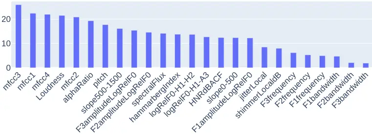
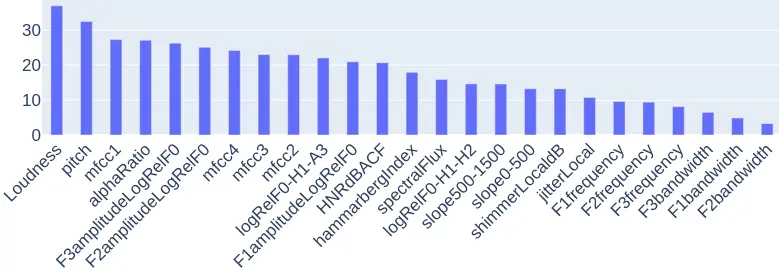
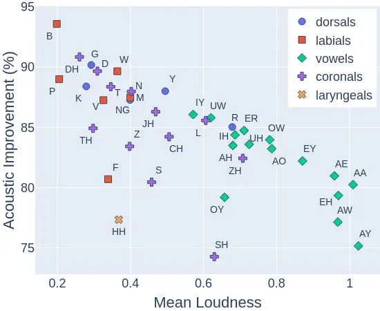
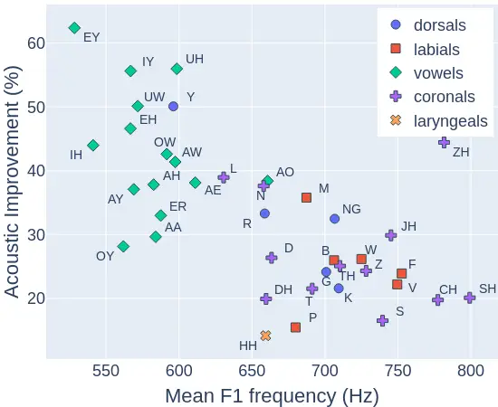

# PAAPLoss: A Phonetic-Aligned Acoustic Parameter Loss for Speech Enhancement

###### Abstract

Despite rapid advancement in recent years, current speech enhancement
models often produce speech that differs in perceptual quality from real
clean speech. We propose a learning objective that formalizes
differences in perceptual quality, by using domain knowledge of
acoustic-phonetics. We identify temporal acoustic parameters – such as
spectral tilt, spectral flux, shimmer, etc. – that are
non-differentiable, and we develop a neural network estimator that can
accurately predict their time-series values across an utterance. We also
model phoneme-specific weights for each feature, as the acoustic
parameters are known to show different behavior in different phonemes.
We can add this criterion as an auxiliary loss to any model that
produces speech, to optimize speech outputs to match the values of clean
speech in these features. Experimentally we show that it improves speech
enhancement workflows in both time-domain and time-frequency domain, as
measured by standard evaluation metrics. We also provide an analysis of
phoneme-dependent improvement on acoustic parameters, demonstrating the
additional interpretability that our method provides. This analysis can
suggest which features are currently the bottleneck for improvement.

###### Index Terms: 

Speech Enhancement, Acoustic parameters, Phonetic alignment

## 1 Introduction

Speech enhancement (SE) tries to extract clean speech from signals that
have been degraded mainly by noise. The ability to remove noise from
speech is extremely useful, as noisy environments commonly affect
applications such as VoIP and phone calls, hearing aids, and downstream
speech processing tasks. Our focus is on the more ubiquitous
single-channel speech enhancement which does not require
multi-microphone speech capture.

In the last decade, single-channel SE has greatly improved by moving
from traditional signal processing techniques to deep neural networks
(DNN) \[1, 2, 3, 4, 5\]. Deep Noise Suppression (DNS) challenges have
further stimulated single-channel SE work by providing a large corpus of
audio synthesized over a wide range of noise types and levels \[6, 7\].
It also provides a common test set to measure performance.

Single-channel SE models are usually trained by comparing enhanced
speech to clean speech using point-wise differences between waveforms or
spectrograms. While this paradigm has been effective, SE models often
still generate unnatural sounding speech \[8\]. Limitations with these
classic losses include failure to capture pitch \[9\], and relatively
low improvement for low-energy phonemes \[10\]. Additionally, \[11\] and
\[12\] describe that $`\ell_{1}`$ or $`\ell_{2}`$ difference at the
signal level is not highly correlated with speech quality.

Other approaches have sought to address these issues, including
optimization of perceptual evaluation metrics. However, these are
non-differentiable, so approximations offer limited improvements \[13,
14\], require cumbersome optimization \[15, 14\] or offer little to no
interpretability through domain knowledge \[16\]. We aim to address
these problems in this paper and we try to accomplish it by
incorporating domain knowledge through fundamental speech features which
we refer to as _acoustic parameters_.

Before the rise of DNNs, features such as pitch, jitter, shimmer,
spectral tilt – to name a few – were used as inputs to shallow models,
such as in speaker and emotion recognition \[17\]. They lost popularity
as DNNs gained more success operating directly on waveforms or
spectrograms. Their non-differentiable computations also inhibit their
straightforward use in optimization of DNNs. Nevertheless, these
parameters provide critical information about frequency content,
energy/amplitude, and other spectral qualities of the speech signal.
Prior perceptual studies have shown important associations of these
features to voice quality \[18, 19, 20\]. \[21\] introduced a
differentiable estimator of utterance-level statistics for these
parameters and improved state-of-the-art SE models through an auxiliary
loss aimed to minimize the differences between parameter values of clean
and enhanced speech. Similarly, we work with 25 acoustic parameters
enumerated in the extended Geneva Minimal Acoustic Parameter Set \[17\].
However, unlike prior work which considered these acoustic parameters at
the global (utterance) level through summary statistics, we incorporate
the temporal aspects of these acoustic parameters \[22\]. Furthermore,
we incorporate the associations between acoustic parameters and phonemes
which have been studied previously in the sub-field of
acoustic-phonetic. For example, plosives typically have a high amplitude
followed by a very low amplitude, as they are produced by complete
closure in the vocal tract followed by a sudden release of pressure
\[23\]. Nasality in sounds introduces anti-formants because the nasal
cavity introduces resonances that interfere with the resonances of the
vocal tract \[24\]. Each vowel also has different formant structures
based on the resonances created by different locations of constriction
in the vocal tract \[25\].

In this paper, we introduce a phonetic-aligned acoustic parameter (PAAP)
loss to improve speech outputs from SE systems. We accomplish this by
minimizing the difference between phonetically-aligned acoustic
parameters in enhanced speech and clean speech. This is done with a
two-step approach. First, we introduce a differentiable estimator of
temporal acoustic parameters, to obtain the time series of each
parameter across an utterance. Second, we calculate differentiable
phoneme-specific weights for each acoustic parameter based on their
ability to predict phoneme logits. This allows us to put different
emphases on acoustic parameters at one time step, depending on the
predicted phoneme at the same time step. These two components allow us
to optimize the original model end-to-end to match clean speech with
phonetic-aligned acoustic parameters. Our approach leads to improvements
over competitive SE models. More importantly though, we demonstrate the
interpretability of our method, by analyzing the phoneme-dependent
improvement on acoustic parameters.

## 2 Related work

Various works have tried to introduce losses aimed at improving the
perceptual quality. Some techniques include optimization of
non-differentiable perceptual metrics through generative adversarial
networks (GAN) \[15\], reinforcement learning \[14\], and convex
approximations of metrics \[13\]. However, as shown in \[21\], current
methods fail to capture the aforementioned acoustic parameters, and
explicit supervision of retaining them improved model outputs.

Other methods have attempted to use phonetic information in enhancing
perceptual quality, such as \[16\]. However, their loss function did not
explicitly use domain knowledge of phonemes and the phonetic information
was only implicitly captured in wav2vec embeddings. Recently, \[26\]
performed a study of phonetic-aware techniques for speech enhancement
but relies on uninterpretable HuBERT features \[27\]. Both techniques
are evaluated on the Valentini dataset, which is much smaller and less
varied than in our experiments. Moreover, our method allows
interpretability through both acoustic parameters and phonemes, as
illustrated in the experiments section. Lastly, \[21\] also used the
acoustic parameters for optimization of perceptual quality. However, it
did not factor in temporal or phonetic information. As these acoustic
parameters vary greatly over an utterance, and between phonemes,
modeling this phoneme and temporal dependencies can be helpful for
improved performance.

## 3 Method

We propose to use a phonetic-aligned acoustic parameter loss to
fine-tune SE models. Note that this objective function can be applied to
any architecture, and even any task that involves speech outputs. In
this section we describe the use in SE as a concrete example. However it
only requires a waveform as input, and it is end-to-end differentiable,
so the PAAP Loss can be applied to any model that produces waveform.

The overall learning paradigm is summarized in Algorithm 1. We will
present the temporal acoustic parameter estimation in Subsection 3.1,
the phonetic-alignment and weighting in Subsection 3.2, and the overall
fine-tuning process with the proposed PAAP Loss in Subsection 3.3.

### 3.1 Temporal Acoustic Parameter Estimation

First, we take the pre-trained SE model as our seed model $`\Phi`$, and
pass in the noisy audio $`{\mathbf{X}}^{N}`$ to obtain the enhanced
waveform $`{\mathbf{X}}^{E}`$ (line 3). On top of the seed models, we
use a pre-trained estimator network $`\Psi`$ to predict the acoustic
parameters given a raw waveform. The acoustic parameters include a set
of 25 low-level descriptors, covering prosodic, excitation, vocal tract,
and spectral descriptors that are found to be the most expressive of the
acoustic characteristics as standardized feature set.

Unlike prior work which models these acoustic parameters at the
utterance level through summary statistics, we incorporate the temporal
feature of these acoustic parameters in the modeling. We pass the
enhanced and clean waveforms to the model to predict temporal acoustic
parameter matrices, $`{\mathbf{D}}^{E}`$ and $`{\mathbf{D}}^{C}`$
respectively (lines 4-5). The estimator network first performs
short-time Fourier Transform (STFT) on the raw waveform, and then passes
the spectrogram to a sequential neural network to obtain the predicted
temporal acoustic parameters. We note that using the estimated clean
acoustic parameters in PAAP Loss rather than ground-truth allows much
greater ease of use by other researchers, as they do not have to
synthesize labels from another toolkit, as in \[21\]. This benefits us
by making our loss more accessible in an arbitrary SE network.

1 Input: Noisy waveform $`{\mathbf{X}}^{N}`$, clean waveform
$`{\mathbf{X}}^{C}`$, seed model $`\Phi`$, pre-trained acoustic
low-level descriptor estimator $`\Psi`$, estimated acoustic-phonetic
weights $`{\mathbf{w}}`$.

2 Output: calculated PAAP Loss $`\ell_{\text{PAAP}}`$

3 $`{\mathbf{X}}^{E}\leftarrow\Phi({\mathbf{X}}^{N})`$ ; // Enhanced
waveform from current model

4 $`{\mathbf{D}}^{C}\leftarrow\Psi({\mathbf{X}}^{C})`$ ; // Estimated
clean acoustic parameters

5 $`{\mathbf{D}}^{E}\leftarrow\Psi({\mathbf{X}}^{E})`$ ; // Estimated
enhanced acoustic parameters

6 $`\ell_{\text{PAAP}}\leftarrow 0`$

7 $`N\leftarrow\mathrm{len}({\mathbf{X}}^{C})`$ ; // the total number of
frames

8 for _$`i\leftarrow 1`$ to $`N`$_ do

    9 $`j\leftarrow`$ Index of phoneme at $`{\mathbf{X}}^{C}_{i}`$

    10
$`\ell_{\text{PAAP}}\leftarrow\ell_{\text{PAAP}}+({\mathbf{D}}^{E}_{i}-{\mathbf{D}}^{C}_{i})^{2}\cdot{\mathbf{w}}_{j}`$

11 $`\ell_{\text{PAAP}}\leftarrow\frac{1}{N}\cdot\ell_{\text{PAAP}}`$

12 return $`\ell_{\text{PAAP}}`$

Algorithm 1 Overall workflow of applying PAAP Loss in one iteration of
our SE paradigm.

### 3.2 Phonetic Alignment

The next component of the PAAP Loss is the set of acoustic-phonetic
weights $`{\mathbf{w}}`$, as we would like to weigh the acoustic
parameters differently based on their importance to predict phoneme
logits. These acoustic-phonetic weights are estimated using clean
speech, through linear regression between the acoustic parameters and
their corresponding segmented phoneme logits:

```math
{\mathbf{w}}=(({\mathbf{D}}^{C})^{\top}{\mathbf{D}}^{C}))^{-1}(({\mathbf{D}}^{C})^{\top}{\mathbf{P}}^{C})\\
\vskip-2.84526pt \tag{1}
```

where $`{\mathbf{P}}^{C}`$ indicates the phoneme logits of the clean
waveform. Each column $`{\mathbf{w}}_{i}`$ is the vector of weights from
the 25 acoustic parameters to phoneme $`i`$, plus a bias term. Each
weight $`{\mathbf{w}}_{ij}`$ corresponds to how much a unit change in
acoustic parameter $`i`$ changes the log-probability of phoneme $`j`$.

The weights reflect how much information each feature contains about
each phoneme, so we can use it to emphasize optimization on differences
between clean and enhanced parameter values that are more significant
for the current phoneme.

We obtain $`{\mathbf{P}}^{C}`$ using an unsupervised phonetic aligner
with a vocabulary of 40 phonemes, and one index for silence. We retain
the silence index as we expect the relationship between acoustic
parameters and phonemes will be different over non-speech regions of the
utterance, and we would like to include this in the modeling. The
unsupervised phonetic aligner allows flexibility to apply our method on
datasets without ground-truth transcriptions.

### 3.3 Fine-tuning with PAAP Loss

During fine-tuning, we first predict the phoneme index $`j`$ for each
frame across time, using the argmax of predicted phoneme logits from
clean audio. We will then use $`{\mathbf{w}}_{j}`$, the
acoustic-phonetic weight for phoneme $`j`$. We calculate the squared
difference between the clean and enhanced acoustic parameters at the
current time step, and then perform dot-product with
$`{\mathbf{w}}_{j}`$ (line 8-10). Note that these weights are used to
incorporate phonetic information in the acoustic parameter differences,
not to directly predict phoneme logits. In this way, the PAAP Loss
calculates the weighted difference between acoustic parameters for each
time step.

In our implementation, we use STFT with hop length of $`160`$ and window
length of $`512`$ to determine the total number of frames $`N`$. Both
the phoneme logits and acoustic parameters have $`N`$ vectors of values.
We iterate the above process over all frames in the utterance, and
average the PAAP Loss by the total number of frames. The PAAP Loss is
used as an auxiliary loss alongside the original loss of the SE model to
fine-tune the network. We follow the optimal setting of \[21\] by
keeping all weights frozen except the speech enhancement model. In our
work, this applies to both acoustic-phonetic weights $`{\mathbf{w}}`$
and the weights of the temporal acoustic estimator network $`\Psi`$.

## 4 Experiments

| Metrics                | Noisy | FullSubNet |           | Demucs   |           |
| ---------------------- | ----- | ---------- | --------- | -------- | --------- |
|                        |       | Baseline   | PAAP Loss | Baseline | PAAP Loss |
| PESQ ($`\uparrow`$)    | 1.58  | 2.89       | 3.00      | 2.65     | 2.99      |
| STOI ($`\uparrow`$)    | 91.52 | 96.41      | 96.70     | 96.54    | 97.12     |
| DNSMOS ($`\uparrow`$)  | 2.48  | 3.21       | 3.27      | 3.31     | 3.34      |
| NORESQA ($`\uparrow`$) | 2.92  | 4.08       | 4.13      | 3.93     | 3.99      |
| WER ($`\downarrow`$)   | 19.0  | 12.6       | 12.1      | 15.0     | 13.2      |

Table 1: Evaluation results of using the PAAP Loss compared with noisy
audios and baseline models on the synthetic test set.

### 4.1 Data

We used data and scripts from the Deep Noise Suppression (DNS) Challenge
from InterSpeech 2020 \[6\] to synthesize 50,000 pairs of 30-second (s)
noisy and clean audio for training. We further synthesized another
10,000 audio pairs for validation set. The synthesis is performed under
the default setting, where the Signal to Noise Ratio (SNR) is sampled
uniformly between 0 and 40 decibels (dB). Then, noise audios from DNS
noise set are selected with sufficient duration to span the selected
clean utterance from Librivox, and added to the clean \[28\].

Our baseline models pre-process their input data slightly before
training, and we follow each model’s respective configuration during its
fine-tuning. Demucs splits 30s audios into 10s segments with a 2s
stride, and FullSubNet randomly samples a 3.072s segment from the 30s
audio during each iteration.

For the final evaluation of the models, we use the DNS 2020 synthetic
test set with no reverberation. This set consists of 150 utterances from
Graz University’s clean speech dataset \[29\], combined with noise
categories randomly sampled from more than 100 noise classes. The SNR
levels of the test set were uniformly sampled between 0 and 25 dB.

### 4.2 Experimental Results

To demonstrate that our proposed method is robust at improving various
architectures, we select state-of-the-art Demucs \[30\] and FullSubNet
\[31\] representing time domain and time-frequency domain models,
respectively. These models are also open-sourced, so we use their
pre-trained checkpoints to allow the reproducibility of the results of
our work. For our unsupervised phonetic aligner, we use a wav2vec2-based
method \[32\].

In our experiments, we weigh the PAAP Loss by a factor of $`0.1`$ before
adding to the original loss to fine-tune the seed SE model. In the
fine-tuning process, the pre-trained temporal acoustic parameter
estimator is a 3-layer bi-directional long short-term memory (LSTM)
\[33\] with $`512`$ hidden units. Table 1 shows the evaluation results
evaluation by fine-tuning FullSubNet and Demucs with the additional PAAP
Loss.

We first look at Perceptual Evaluation of Speech Quality (PESQ) and
Short-Time Objective Intelligibility (STOI) as they are canonical
evaluations for speech enhancement. We see significant improvements in
these metrics using our PAAP loss. Note that these are strong
state-of-the-art models and hence improvements are hard to achieve. PESQ
in particular improves by almost 4% and 13% for FullSubNet and Demucs
respectively.

Since our goal is to improve perceptual quality, the gold standard
evaluation is mean opinion score from humans. This is calculated as the
average of ratings on a 1-5 scale. Conducting a Mean Opinion Score (MOS)
study is costly so we include two of the current state-of-the-art
estimation approaches to estimate MOS, DNSMOS \[34\], and NORESQA-MOS
(Non-matching Reference based Speech Quality Assessment) \[35\]. We
observe that our PAAP loss once again shows improvements in these
metrics for both models.

Finally, we also calculate word error rate (WER) to evaluate whether our
enhancement reduces distortions that affect downstream speech processing
applications. Since we do not have ground-truth transcriptions, we use
WavLM \[36\] base model from HuggingFace on clean speech to get the
transcriptions as reference. We then apply the same recognizer to
baseline and our enhanced speech to compare. We see improvements in WER
as well, demonstrating that our method benefits both human perceptual
quality and the ability to interface with speech technologies.





Figure 1: Acoustic improvement (in %) for FullSubNet (upper) and Demucs
(lower) by using the proposed PAAP Loss, where acoustic improvement is
reduction in MAE as defined in Section 4.3.1.

### 4.3 Analysis

#### 4.3.1 Acoustic improvement

Fig. 1 provides a visualization of the percentage improvement of the 25
acoustic parameters after using the PAAP Loss to fine-tune the model.
The acoustic improvement is measured by the reduction in mean absolute
error (MAE) between the acoustic parameters of the enhanced and clean
speech. Formally, if
$`{\mathbf{D}}^{E},{\mathbf{D}}^{C}\in\mathbb{R}^{N\times 25}`$ are the
enhanced and clean estimated acoustics, for each acoustic parameter
$`j`$ we compute

```math
\text{MAE}({\mathbf{D}}^{E}_{j},{\mathbf{D}}^{C}_{j})=\frac{1}{N}\sum_{i=1}^{N}|{\mathbf{D}}^{E}_{ij}-{\mathbf{D}}^{C}_{ij}| \tag{2}
```

and then average over all acoustic parameters to get
$`\text{MAE}({\mathbf{D}}^{E},{\mathbf{D}}^{C})`$. Formally, the
acoustic improvement as reduction in MAE is

```math
\frac{\text{MAE}({\mathbf{D}}^{E},{\mathbf{D}}^{C})-\text{MAE}({\mathbf{D}}^{B},{\mathbf{D}}^{C})}{\text{MAE}({\mathbf{D}}^{B},{\mathbf{D}}^{C})}\cdot 100\% \tag{3}
```

where $`{\mathbf{D}}^{B}`$ stands for the acoustic parameters from the
baseline enhancement model. For FullSubNet, we can observe that the PAAP
Loss has the most improvement on MFCC features and loudness. On the
other hand, for Demucs, most of the acoustic improvement of features are
at the similar level with FullSubNet, except that the loudness and the
F0 on a semitone frequency scale have a larger boost of  30%. Among all
the acoustic features, the acoustic improvements are relatively small
for formant frequencies and formant bandwidths for both models, but we
conclude that we are getting a consistent improvement on all of the
acoustic low-level descriptors across different categories of SE models.

#### 4.3.2 Phoneme-dependent acoustic improvement

In the previous section, we looked at overall improvements for each
acoustic parameter. Now we break down the analysis further by showing
the improvement in each acoustic parameter segmented by phoneme. The
acoustic improvement is calculated by first creating phoneme alignments
with the phonetic aligner on the clean speech. Then for each frame, we
take the difference in acoustic parameters for clean and enhanced
speech, and add this difference to the running total of the
corresponding aligned phoneme. At the end, we average the differences
per phoneme by the number of frames.





Figure 2: Reduction in error of loudness / F1 frequency vs. average
value of acoustic parameter for each phoneme.

We connect this analysis with the acoustic-phonetic properties mentioned
in the introduction. Recall that plosives have very characteristic
behavior with amplitude features. Also recall that vowels and nasals
have specific formant characteristics. We include plots of per-phoneme
acoustic parameter improvement for loudness and F1 frequency to
represent the amplitude and formant characteristics, respectively.

We plot the phoneme-dependent improvement for loudness and formant-1
(F1) frequency in Fig. 2. Each phoneme represents one point, where the
colors/shapes indicate different phoneme categories. We separate out
vowels, and then use the place of articulation as the classification
standard of consonants. This includes dorsals, labials and coronals,
which correspond to consonants where the articulation is performed with
tongue dorsum, lips, and tongue front respectively. We also separate
/HH/ as the only consonant in English with the place of articulation in
the larynx. Therefore, we use five different colors/shapes in total to
represent phoneme categories in the figure.

With this knowledge, we can see that our phonetically-aligned acoustic
parameter loss results in the expected improvements given the above
domain knowledge. The highest improvements in loudness are in plosives
such as /B/, /P/, /K/, /G/, /D/, and /DH/, where the average improvement
is around 90%. The goal of the PAAP Loss was to learn the relations
between phonemes and acoustic parameters over time, and fine-tune
enhancement models to account for this. Now we observe models fine-tuned
with PAAP Loss produce speech with more improvement in acoustic
parameters for the specific phonemes that are relevant for that
particular parameter.

We also see the expected clustering of improvement for F1 frequency.
Nearly all the highest improvements are seen with vowels, as formant
structure is more important for vowels than consonants. The overall
acoustic improvement of vowels is around 45%, higher than any group of
consonants. The nasals /N/ and /M/, also mentioned in the introduction
for their formant structure, showed similar improvements to many vowels.
The other consonants that showed high improvement, /L/ and /R/ are
liquid consonants, which are known to be more similar to vowels than
other consonants.

## 5 Conclusion

In this work, we propose a novel auxiliary objective for speech
enhancement, the phonetic-aligned acoustic parameter (PAAP) loss, which
minimizes the differences between important temporal acoustic parameters
that are weighted by phoneme types. We fine-tune competitive speech
enhancement models with the addition of PAAP Loss, and experiments show
that performance increases across all evaluation metrics, including
measures of perceptual quality, and WER from competitive ASR models. We
provide a detailed analysis of the phoneme-dependent acoustic
improvement to show that the acoustic parameters improve most in
expected phoneme categories.

## 6 Acknowledgement

This work used the Extreme Science and Engineering Discovery Environment
(XSEDE)  \[37\], which is supported by National Science Foundation grant
number ACI-1548562. Specifically, it used the Bridges system  \[38\],
which is supported by NSF award number ACI-1445606, at the Pittsburgh
Supercomputing Center (PSC).

## 7 References

## References

- \[1\] Han Zhao, Shuayb Zarar, Ivan Tashev and Chin-Hui Lee
  “Convolutional-recurrent neural networks for speech enhancement” In
  _Proc. ICASSP_, 2018, pp. 2401–2405 IEEE
- \[2\] Felix Weninger, Florian Eyben and Björn Schuller “Single-channel
  speech separation with memory-enhanced recurrent neural networks” In
  _Proc. ICASSP_, 2014, pp. 3709–3713 DOI:
  [10.1109/ICASSP.2014.6854294](https://dx.doi.org/10.1109/ICASSP.2014.6854294)
- \[3\] Yong Xu, Jun Du, Li-Rong Dai and Chin-Hui Lee “A Regression
  Approach to Speech Enhancement Based on Deep Neural Networks” In
  _IEEE/ACM Transactions on Audio, Speech, and Language Processing_
  23.1, 2015, pp. 7–19 DOI:
  [10.1109/TASLP.2014.2364452](https://dx.doi.org/10.1109/TASLP.2014.2364452)
- \[4\] Felix Weninger et al. “Speech Enhancement with LSTM Recurrent
  Neural Networks and its Application to Noise-Robust ASR” In _LVA/ICA_,
  2015
- \[5\] Peter Plantinga, Deblin Bagchi and Eric Fosler-Lussier “Phonetic
  feedback for speech enhancement with and without parallel speech data”
  In _Proc. ICASSP_, 2020, pp. 6679–6683 IEEE
- \[6\] Chandan Reddy et al. “The INTERSPEECH 2020 Deep Noise
  Suppression Challenge: Datasets, Subjective Testing Framework, and
  Challenge Results” In _Proc. Interspeech_, 2020
- \[7\] Harishchandra Dubey et al. “ICASSP 2022 deep noise suppression
  challenge” In _Proc. ICASSP_, 2022, pp. 9271–9275 IEEE
- \[8\] Chandan Reddy et al. “A Scalable Noisy Speech Dataset and Online
  Subjective Test Framework” In _Proc. Interspeech_, 2019, pp. 1816–1820
- \[9\] Joseph Turian and Max Henry “I’m sorry for your loss:
  Spectrally-based audio distances are bad at pitch” In _arXiv preprint
  arXiv:2012.04572_, 2020
- \[10\] Peter Plantinga, Deblin Bagchi and Eric Fosler-Lussier
  “Perceptual Loss with Recognition Model for Single-Channel Enhancement
  and Robust ASR” In _arXiv preprint arXiv:2112.06068_, 2021
- \[11\] Pranay Manocha et al. “A differentiable perceptual audio metric
  learned from just noticeable differences” In _Proc. Interspeech_, 2020
- \[12\] Szu-Wei Fu et al. “Metricgan+: An improved version of metricgan
  for speech enhancement” In _Proc. Interspeech_, 2021
- \[13\] Juan Martin-Doñas, Angel Gomez, Jose. Gonzalez and Antonio.
  Peinado “A Deep Learning Loss Function Based on the Perceptual
  Evaluation of the Speech Quality” In _IEEE Signal Processing Letters_
  25.11, 2018, pp. 1680–1684 DOI:
  [10.1109/LSP.2018.2871419](https://dx.doi.org/10.1109/LSP.2018.2871419)
- \[14\] Yuma Koizumi et al. “DNN-based source enhancement
  self-optimized by reinforcement learning using sound quality
  measurements” In _Proc. ICASSP_, 2017, pp. 81–85 DOI:
  [10.1109/ICASSP.2017.7952122](https://dx.doi.org/10.1109/ICASSP.2017.7952122)
- \[15\] Szu-Wei Fu, Chien-Feng Liao, Yu Tsao and Shou-De Lin
  “Metricgan: Generative adversarial networks based black-box metric
  scores optimization for speech enhancement” In _International
  Conference on Machine Learning_, 2019, pp. 2031–2041 PMLR
- \[16\] Tsun-An Hsieh et al. “Improving perceptual quality by
  phone-fortified perceptual loss using Wasserstein distance for speech
  enhancement” In _Proc. Interspeech_, 2021
- \[17\] Florian Eyben et al. “The Geneva minimalistic acoustic
  parameter set (GeMAPS) for voice research and affective computing” In
  _IEEE transactions on affective computing_ 7.2 IEEE, 2015, pp. 190–202
- \[18\] Guus Krom “Some spectral correlates of pathological breathy and
  rough voice quality for different types of vowel fragments” In
  _Journal of Speech, Language, and Hearing Research_ 38.4 ASHA, 1995,
  pp. 794–811
- \[19\] James Hillenbrand, Ronald Cleveland and Robert Erickson
  “Acoustic Correlates of Breathy Vocal Quality” In _Journal of speech
  and hearing research_ 37, 1994, pp. 769–78 DOI:
  [10.1044/jshr.3704.769](https://dx.doi.org/10.1044/jshr.3704.769)
- \[20\] Hideki Kasuya, Shigeki Ogawa, Yoshinobu Kikuchi and Satoshi
  Ebihara “An acoustic analysis of pathological voice and its
  application to the evaluation of laryngeal pathology” In _Speech
  Communication_, 1986 DOI:
  [https://doi.org/10.1016/0167-6393(86)90006-3](<https://dx.doi.org/https://doi.org/10.1016/0167-6393(86)90006-3>)
- \[21\] Muqiao Yang et al. “Improving Speech Enhancement through
  Fine-Grained Speech Characteristics” In _Proc. Interspeech_, 2022
- \[22\] Yunyang Zeng et al. “TAPLoss: A Temporal Acoustic Parameter
  Loss for Speech Enhancement” In _Proc. ICASSP_, 2023
- \[23\] Abeer Alwan, Jintao Jiang and Willa Chen “Perception of place
  of articulation for plosives and fricatives in noise” In _Speech
  communication_ 53.2 Elsevier, 2011, pp. 195–209
- \[24\] Will Styler “On the acoustical features of vowel nasality in
  English and French” In _The Journal of the Acoustical Society of
  America_ 142.4, 2017, pp. 2469–2482 DOI:
  [10.1121/1.5008854](https://dx.doi.org/10.1121/1.5008854)
- \[25\] Han Yi, Matthew Leonard and Edward Chang “The encoding of
  speech sounds in the superior temporal gyrus” In _Neuron_ 102.6
  Elsevier, 2019, pp. 1096–1110
- \[26\] Or Tal, Moshe Mandel, Felix Kreuk and Yossi Adi “A Systematic
  Comparison of Phonetic Aware Techniques for Speech Enhancement” In
  _Proc. Interspeech_, 2022, pp. 1193–1197 DOI:
  [10.21437/Interspeech.2022-695](https://dx.doi.org/10.21437/Interspeech.2022-695)
- \[27\] Wei-Ning Hsu et al. “Hubert: Self-supervised speech
  representation learning by masked prediction of hidden units” In
  _IEEE/ACM Transactions on Audio, Speech, and Language Processing_ 29
  IEEE, 2021, pp. 3451–3460
- \[28\] Jort Gemmeke et al. “Audio set: An ontology and human-labeled
  dataset for audio events” In _Proc. ICASSP_, 2017, pp. 776–780 IEEE
- \[29\] Gregor Pirker, Michael Wohlmayr, Stefan Petrik and Franz
  Pernkopf “A pitch tracking corpus with evaluation on multipitch
  tracking scenario” In _Proc. Interspeech_, 2011
- \[30\] Alexandre Defossez, Gabriel Synnaeve and Yossi Adi “Real time
  speech enhancement in the waveform domain” In _arXiv preprint
  arXiv:2006.12847_, 2020
- \[31\] Xiang Hao, Xiangdong Su, Radu Horaud and Xiaofei Li
  “FullSubNet: a full-band and sub-band fusion model for real-time
  single-channel speech enhancement” In _Proc. ICASSP_, 2021, pp.
  6633–6637 IEEE
- \[32\] Jian Zhu, Cong Zhang and David Jurgens “Phone-to-audio
  alignment without text: A Semi-supervised Approach” In _Proc. ICASSP_,
  2022, pp. 8167–8171 IEEE
- \[33\] Sepp Hochreiter and Jürgen Schmidhuber “Long Short-Term Memory”
  In _Neural Computation_ 9.8, 1997, pp. 1735–1780 DOI:
  [10.1162/neco.1997.9.8.1735](https://dx.doi.org/10.1162/neco.1997.9.8.1735)
- \[34\] Chandan Reddy, Vishak Gopal and Ross Cutler “DNSMOS P. 835: A
  non-intrusive perceptual objective speech quality metric to evaluate
  noise suppressors” In _Proc. ICASSP_, 2022 IEEE
- \[35\] Pranay Manocha and Anurag Kumar “Speech Quality Assessment
  through MOS using Non-Matching References” In _Proc. Interspeech_,
  2022
- \[36\] Sanyuan Chen et al. “WavLM: Large-scale self-supervised
  pre-training for full stack speech processing” In _IEEE Journal of
  Selected Topics in Signal Processing_ IEEE, 2022
- \[37\] J. Towns et al. “XSEDE: Accelerating Scientific Discovery” In
  _Computing in Science & Engineering_ 16.5, 2014, pp. 62–74 DOI:
  [10.1109/MCSE.2014.80](https://dx.doi.org/10.1109/MCSE.2014.80)
- \[38\] Nicholas Nystrom, Michael Levine, Ralph Roskies and J Scott
  “Bridges: a uniquely flexible HPC resource for new communities and
  data analytics” In _Proceedings of XSEDE Conference: Scientific
  Advancements Enabled by Enhanced Cyberinfrastructure_, 2015, pp. 1–8
