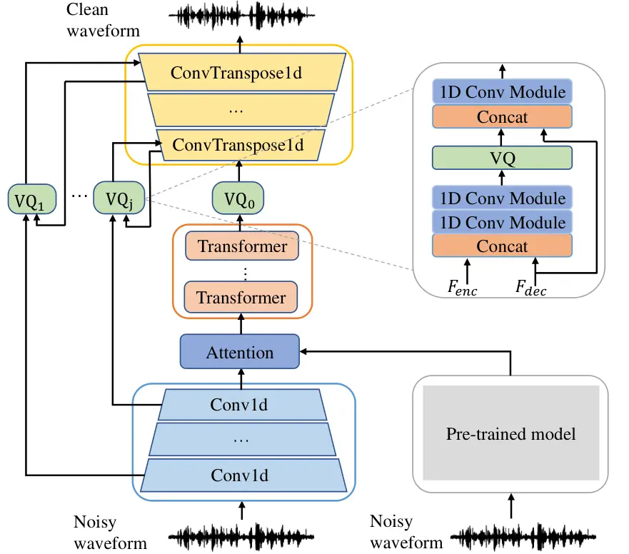
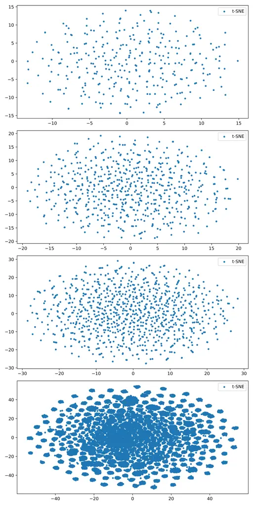

¹University of Science and Technology of China (USTC), Hefei, China  
²NERC-SLIP, University of Science and Technology of China (USTC), Hefei,
China

# Speech Enhancement with Multi-granularity Vector Quantization

Xiao-Ying Zhao¹, Qiu-Shi Zhu², Jie Zhang²

###### Abstract

With advances in deep learning, neural network based speech enhancement
(SE) has developed rapidly in the last decade. Meanwhile, the
self-supervised pre-trained model and vector quantization (VQ) have
achieved excellent performance on many speech-related tasks, while they
are less explored on SE. As it was shown in our previous work that
utilizing a VQ module to discretize noisy speech representations is
beneficial for speech denoising, in this work we therefore study the
impact of using VQ at different layers with different number of
codebooks. Different VQ modules indeed enable to extract
multiple-granularity speech features. Following an attention mechanism,
the contextual features extracted by a pre-trained model are fused with
the local features extracted by the encoder, such that both global and
local information are preserved to reconstruct the enhanced speech.
Experimental results on the Valentini dataset show that the proposed
model can improve the SE performance, where the impact of choosing
pre-trained models is also revealed.

^(†)^(†)address: ^(†)^(†)email: xyzhao1123@mail.ustc.edu.cn,
qszhu@mail.ustc.edu.cn, jzhang6@ustc.edu.cn

Index Terms: Speech enhancement, vector quantization, representation
learning, self-supervised pre-training.

## 1 Introduction

Speech enhancement (SE) aims at mitigating background noises and
reverberation contained in noisy speech recordings, which is widely
configured as a front-end in, e.g., speech recognition \[1, 2\],
assistive hearing \[3\], robust speaker recognition \[4\]. Traditional
statistics-based SE methods usually depend on the stationarity
assumption, which, however hardly holds in practice. Recently, the
development of deep neural networks (DNNs) facilitates a new direction
for performing SE, which even shows a superiority over conventional
approaches, particularly in non-stationary scenarios. In general, DNN
based SE models can be implemented in a generative \[5, 6\] or
discriminative fashion \[7, 8\]. The generative models aim to learn the
speech distribution, where noisy speech is fed into the model to
generate the estimated speech signal subject to a consistency constraint
on the distributions of enhanced and clean speech. The latter is based
on directly minimizing the difference between enhanced and clean signals
by training discriminative models, such that the impact of ambient
noises on the spectrum can be removed. The discriminative model can be
implemented in the frequency domain \[9, 10\] or time domain \[11, 7\],
where the frequency- domain SE is achieved by estimating a mask matrix,
while the time-domain counterpart is usually implemented following an
encoder-decoder fashion.

Discrete representation learning has demonstrated an efficacy in many
fields, especially for low-resource tasks, where vector quantization
(VQ) is often used. For example, in \[12, 13\] VQ was used to learn
discrete latent representations to generate high quality images.
In \[14, 15\], VQ was used for speech synthesis to generate more natural
speech by learning discrete representations. In \[16\], scalable VQ was
applied to encode multi-scale features for speech coding. Considering
that learning discrete representations can yield meaningful discrete
units and diminish noise components, it was shown in \[17\] that VQ was
also applicable to SE by reconstructing speech from discrete noisy
representations. However, it was also shown that VQ with a single fixed
codebook cannot adequately learn the clustering units at different
granularities, which limits its applicability for SE.

In the speech domain, self-supervised pre-training models \[18, 19, 20,
22, 21, 23\], e.g., wav2vec2.0 \[18\], HuBERT \[20\], data2vec \[21\],
have been rapidly developed by exploiting large amounts of unlabeled
data, which were shown to be helpful for various downstream tasks. The
difference therein is that indeed wav2vec2.0, HUBERT and data2vec
perform contrastive learning, masked prediction and regression tasks,
respectively. The SE performance can also be boosted by using
self-supervised pre-trained models. In \[24\], thirteen pre-trained
models were applied to SE tasks, which are taken as feature extractors
to estimate spectral masks to reconstruct the clean speech waveform.
This implies that the high-level features extracted by self-supervised
pre-trained models are applicable to SE, which can also be combined with
traditional acoustic features \[25\]. These pre-trained features are all
utilized in the estimation of time-frequency mask, but not validated in
the U-Net based SE models.

In this paper, based on \[17\], which uses a single VQ module with a
fixed codebook, we therefore explore how VQ in combination with
pre-training models can be better leveraged for the SE task. Considering
that different layers of the SE model learn different granularity of
information, we first propose a multi-granularity VQ technique to model
different levels of information by utilizing different VQ at different
layers. Specifically, different VQ modules have different numbers of
codebooks and learnable codevectors. Compared to \[17\], it is shown
that the performance can be improved due to the use of multi-granularity
VQ at the cost of a small increase in the model parameters. Secondly, to
enable the model to better make use of global and local information, we
fuse the contextual features extracted by the pre-trained model with the
local features extracted by the encoder of the SE model. Both the
contextual and local features are input to the U-Net framework. This
differs from the scheme in \[24, 25\], where only the features extracted
by the pre-trained model are incorporated to estimate the time-frequency
mask, as the considered features for the proposed method become much
richer. In addition, it is shown that different pre-trained models have
a different effect on the performance, where the data2vec model performs
the best with nearly the same amount of parameters. Experimental results
on the Valentini dataset demonstrate that utilizing the
multi-granularity VQ in different layers is beneficial for SE. The rest
of this paper is organized as follows. Section 2 presents the proposed
SE method. Experimental setup and results are shown in Section 3 and
Section 4, respectively. Finally, Section 5 concludes this work.



Figure 1: An illustration of the proposed SE model with
multi-granularity VQ modules and self-supervised pre-trained model. The
feature fusion mechanism of the proposed multi-granularity VQ is shown
at the upper right corner.

## 2 Method

To guide the reader, in this section we first briefly introduce the SE
model in \[17\], which is the basis of the proposed method. The SE model
follows the U-net structure, which contains convolution-based encoders
and decoders and the Transformer encoder based bottleneck layer. This is
similar to the DEMUCS network. The VQ module is used to discretize the
representations output of the bottleneck layer, which is then fed to the
decoder to reconstruct clean speech waveforms, and it is shown in
Section 4 that both the VQ module and pre-trained models can be
beneficial for the performance. However, we found that a single VQ
cannot learn speech representations at different granularities. For more
details, we refer to \[17\].

### 2.1 Model structure

The structure of our proposed model is shown in Fig. 1, which mainly
contains encoder, bottleneck layer, multi-granularity VQ and decoder.
The encoder and decoder contain $`D`$-layer one-dimensional (1D)
convolution and $`D`$-layer 1D transposed convolution, respectively, and
the bottleneck layer consists of $`N`$-layer Transformer encoder. A skip
connection is utilized between the $`i`$-th encoder layer and the
$`i`$-th decoder layer. The encoder adopts a convolutional module that
can efficiently extract local features. To better utilize the
pre-trained model to model long-time contextual information, we take the
pre-trained model as a feature encoder. Local features and global
features are fed into the attention network for fusion. The fused
features are sent to the bottleneck layer, whose output is fed to the
decoder after being discretized by quantizer $`VQ_{0}`$. In order to
incorporate discrete units of different granularity, we utilize
different vector quantizers. Specifically, the output of the $`i`$-th
encoder layer and the output of the $`i`$-th decoder layer are fused
into $`VQ_{i}`$ to obtain the $`i`$-th discrete representation, which is
then fused with the output of the $`i`$-th decoder layer.

### 2.2 Multi-granularity VQ

The proposed multi-granularity VQ mechanism is shown in the upper right
corner of Figure. 1, which mainly contains the fusion VQ modules. We
first concatenate the output of the $`i`$-th encoder layer and the
output of the $`i`$-th decoder layer. The combined features are fed into
the two-layer 1D convolution to obtain the fused features,which are
input into the VQ module to obtain the discrete features. Then, the
discrete features and the decoder output are concatenated and fed to the
1D convolution module to construct the final output. The VQ module is
built on production quantization, where different number of codebooks
and codewords for different layers are considered. Given $`G`$
codebooks, each with $`V`$ learnable $`d`$-dimensional codewords, we
first map the input feature to $`\bm{l}\in\mathbb{R}^{G\times V}`$
logits, and then select the discrete vectors by the
Gumbel-softmax \[26\] operation in a differential way. The probability
of choosing the $`v`$-th codeword from the $`g`$-th codebook is given by

```math
\overline{p}_{g,v}=\frac{\exp(\overline{l}_{g,v}+n_{v})/\tau}{\sum_{k=1}^{V}\exp(\overline{l}_{g,k}+n_{k})/\tau}, \tag{1}
```

where $`n_{v}=-\log(-\log(u))`$ with $`u`$ uniformly distributed over
\[0, 1\] and $`\tau`$ is a non-negative temperature coefficient, In the
forward stage, the code vector is selected by $`argmax`$ operation, and
in the backward propagation stage the true gradient of the
Gumbel-softmax output is utilized. As it is expected that more codewords
can be used for quantization by maximizing the softmax distribution
$`\bf{\rm l}`$, we consider the diversity loss function $`L_{d}`$, which
is given by

```math
L_{d}=\frac{1}{GV}\sum_{g=1}^{G}\sum_{v=1}^{V}\overline{p}_{g,v}\log\overline{p}_{g,v}. \tag{2}
```

[TABLE]

Table 1: Performance comparison of objectively evaluation metrics on the
Valentini test set.

### 2.3 The total loss function

```math
L_{\rm total}=L_{\rm se}+\sum_{i=0}^{D}\lambda_{i}L_{d_{i}}, \tag{3}
```

where $`L_{d_{i}}`$ is the codebook diversity loss of the $`i`$-th VQ
and $`\lambda_{i}`$ is the weighting parameter, and $`L_{\rm se}`$ is
the SE loss function, which is given by \[7, 17\]

```math
L_{\rm se}=\frac{1}{T}||\bm{y}-\bm{\hat{y}}||_{1}+\sum_{i=1}^{M}L_{\rm stft}^{(i)}(\bm{y},\bm{\hat{y}}), \tag{4}
```

where

```math
\displaystyle L_{\rm stft}(\bm{y},\bm{\hat{y}}) \displaystyle=L_{\rm sc}(\bm{y},\bm{\hat{y}})+L_{\rm mag}(\bm{y},\bm{\hat{y}}), \tag{5}
```

```math
\displaystyle L_{\rm sc}(\bm{y},\bm{\hat{y}}) \displaystyle=\frac{|||{\rm STFT}(\bm{y})|-|{\rm STFT}(\bm{\hat{y}})|||_{F}}{||{\rm STFT}(\bm{y})||_{F}}, \tag{6}
```

```math
\displaystyle L_{\rm mag}(\bm{y},\bm{\hat{y}}) \displaystyle=\frac{1}{T}||\log|{\rm STFT}(\bm{y})|-\log|{\rm STFT}(\bm{\hat{y}})|||_{1}, \tag{7}
```

where $`T`$ denotes the speech length, $`\bm{y}`$ and $`\hat{\bm{y}}`$
are the clean and enhanced speech signals, respectively, $`M`$ denotes
the number of multi-scale STFT loss functions, $`||\cdot||_{F}`$ the
Frobenius norm and $`||\cdot||_{1}`$ the $`L_{1}`$ norm. The
multi-resolution loss $`L_{\rm stft}^{(i)}`$ utilizes the STFT loss with
the number of FFT bins ranging from {512, 1024, 2048}, hop size from
{50, 120, 240} and window length from {240, 600, 1200}, respectively.

## 3 Experimental setup

### 3.1 Data description

To evaluate the effectiveness of the proposed method, we utilize the
Valentini \[33\] dataset, which contains 28.4 hours of clean-noisy
speech pairs consisting of 34647 mono audio samples for training and 824
mono audio samples for testing at a sampling rate of 48 kHz. The
duration of the audio ranges from 1 second to 15 seconds (the average
duration is around 3 seconds). These data are collected from 84 speakers
with 10 different types of noises added to the clean speech at 4
signal-to-noise ratios (SNRs) (i.e., 0, 5, 10 and 15 dB) in the training
set and 5 types of noise added to the speech with 4 SNRs (2.5, 7.5, 12.5
and 17.5 dB) in the test set, and all speakers are native English. The
raw speech waveforms are downsampled to 16kHz and then applied the remix
and bandmask techniques for data augmentation as in \[7\].

The performance of the proposed method is evaluated using objective
metrics, including 1) perceptual evaluation of speech quality
(PESQ) \[34\], 2) short-time objective intelligibility (STOI) \[35\], 3)
mean opinion score (MOS) prediction of distortion of speech signal
(SIG) \[36\], 4) MOS prediction of intrusiveness of background noise
(BAK) \[36\], 5) MOS prediction of overall quality (OVRL) \[36\].

### 3.2 Model configuration

Our network is built on the basis of the DEMUCS model \[7\], which is
modified by replacing the LSTM with Transformer and using an attention
module as feature fusion module. Both the encoder and decoder have $`D`$
= 5 layers and the dimension is 512. We utilize 2 Transformer encoders
in the bottleneck layer, where each has a dimension of 512, the
feedforward neural network has a dimension of 2048, and the
self-attention module has 12 heads. The 1D convolution in the encoder
uses a kernel size of 8 and a stride size of 2. For the pre-trained
models, we use the publicly available wav2vec2.0 base¹¹ 1
https://github.com/facebookresearch/fairseq/tree/main/examples/wav2vec,
HuBERT base²² 2
https://github.com/facebookresearch/fairseq/tree/main/examples/hubert
and data2vec base³³ 3
https://github.com/facebookresearch/fairseq/tree/main/examples/data2vec
models in experiments. All three models are obtained by self-supervised
pre-training using the same unlabeled data and have similar parameters.
These model parameters are not used for training, and we only use them
to extract features. For the attention fusion module, we adopt a
cross-attention layer with a dimension of 512. For $`VQ_{0}`$ and
$`VQ_{i}(i=1,2,3,4,5)`$ modules, we adopt $`G`$ = 2 codebooks with $`V`$
= 320 and $`G=1`$ codebook with $`V`$ = {320, 640, 960 2560, 5120}
learnable 128-dimensional vectors, respectively. $`\lambda_{i}`$ in (3)
is set to be 0.01 due to the range of the diversity loss, since the
amplitude of the codebook diversity loss function $`L_{d}`$ is
approximately 100 times larger than that of the SE loss function
$`L_{se}`$. We use the Adam optimizer to train the SE model for 1M
iterations, where the batch size is 30 and the maximum learning rate is
$`2\times 10^{-4}`$. All models are trained on 4 Tesla-V100-32G GPUs.

## 4 Experimental results

Comparison methods: We first measure objective evaluation metrics on the
noisy test set as a reference. The time-domain comparison methods
include SEGAN \[27\], SEGAN-D \[29\] and MetricGAN \[31\], which are
based on the generative adversarial network (GAN). The time-frequency
domain comparison approaches include MMSE-GAN \[30\] and
DeepMMSE \[32\], which estimates the noise spectral density under the
minimum mean square error (MMSE) criterion. Wave U-Net \[28\],
DEMUCS \[7\] and CleanUNet \[8\] are also compared, which depend on the
U-net network in the time domain.

Table 1 shows the experimental results of different models on the
Valentini dataset. It can be seen that the proposed method using
pre-trained model and multi-granularity VQ can achieve a PESQ of 3.18
and an STOI of 96.7, respectively, which is the best among all
comparison methods and is better than our previous method in \[17\],
which utilizes a fixed codebook and adopts a pre-trained model to
initialize the encoder. This implies that using multi-granularity VQ
modules and a pre-trained model as the feature extractor are more
effective than the single-fixed counterpart. In addition, the deployment
of multiple codebooks only results in a small increment of the parameter
amount. (The codebook has codevectors that are learnable, so the number
of model parameters added can be calculated as
$`(320+640+960+2560+5120+320\times 2)\times 128/10^{6}\approx 1.3M`$.)
In order to more clearly see the impact of each module, we conduct
comparative experiments as shown in Table 2. The base model does not use
VQ or pre-trained models, leading to a PESQ of 3.07 and an STOI of 95.2,
which are similar to that of CleanUNet, because their model structures
are rather similar. In case the multi-granularity VQ modules are
included for the base model as shown in Figure. 1, the SE performance in
all metrics is clearly improved, showing the effectiveness of using
multiple codebooks. By the inclusion of multiple VQs and using any
pre-trained model (wav2vec2.0, HuBERT or data2vec) as the feature
extractor (i.e., fusing the extracted contextual features with the local
features extracted by the SE encoder), the performance can be further
improved to some extent, while the features extracted from the data2vec
model seem the best and the benefits from using wav2vec and HuBERT are
almost the same.

[TABLE]

Table 2: The impact of different modules on the SE performance.

[TABLE]

Table 3: The impact of VQ of different layers on the performance.



Figure 2: Codebook visualization with different number of learnable
vectors, where a single codebook with 320, 640 and 960 learnable vectors
and two codebooks with 320 learnable vectors are included from top to
bottom.

Further, we experimentally analyze the impact of the VQ of different
layers in Table 3. It is clear that in case the VQ module is included
for each layer, the best SE performance is achieved. The removal of the
VQ at any layer leads to a performance decrease, meaning the necessity
of the proposed multi-granularity VQ operations. It seems that the
removal of $`VQ_{0}`$ has a more significant impact on the performance,
indicating that the discretized contextual features are more beneficial
for model denoising. $`VQ_{1}`$ has the smallest impact among all VQ
modules, and a higher-layer VQ roughly affects the performance more. Due
to the limited size of this dataset, these results might not reflect the
analysis comprehensively, so in the future we will evaluate the proposed
method in a larger-sized dataset.

Finally, we visualize the learned 128-dimensional codebooks using t-SNE,
which are reduced to two dimensions and shown in Figure. 2, where a
single codebook with 320 ($`VQ_{1}`$), 640 ($`VQ_{2}`$) and 960
($`VQ_{3}`$) learnable vectors and two codebooks with 320 learnable
vectors (320$`\times`$320 vectors in total, i.e., $`VQ_{0}`$) are
included from top to bottom. It is clear that more learnable vectors
used in the VQ codebook, more fine-grained speech embeddings can be
extracted. From the perspective of t-SNE distributions, the speech
embedding extracted by $`VQ_{0}`$ shows a clearer clustering property,
which is useful for classification. On the other hand, the multiple
embeddings are not spatially overlapped, resulting in the so-called
multi-granularity speech features, they are somehow complementary to
represent the speech domain. That is why the inclusion of each VQ module
positively contributes to the performance in Table 3.

## 5 Conclusion

In this paper, we investigated the application of multi-granularity VQ
and pre-trained models to speech enhancement. It was shown that using
different VQ modules at different layers can improve the SE performance
compared to using a single-fixed VQ. The fusion of contextual features
extracted by the pre-trained model and local features extracted by the
encoder allows the model to better model global and local information.
Compared with the self-supervised pre-trained wav2vec2.0 and HuBERT
models that are dedicated to speech representation learning, data2vec
seems more effective for SE as it can learn representations from general
data (e.g., speech, images, video).

## 6 Acknowledgements

This work was supported by the National Natural Science Foundation of
China (62101523), Hefei Municipal Natural Science Foundation (2022012)
and Fundamental Research Funds for the Central Universities.

## References

- \[1\] Z. Wang and D. Wang, “A joint training framework for robust
  automatic speech recognition,” _IEEE/ACM Trans. Audio, Speech,
  Language Process._, vol. 24, no. 4, pp. 796–806, 2016.
- \[2\] Q. Zhu, J. Zhang, Z. Zhang, and L. Dai, “Joint training of
  speech enhancement and self-supervised model for noise-robust asr,”
  _arXiv preprint arXiv:2205.13293_, 2022.
- \[3\] J. Zhang and G. Zhang, “A parametric unconstrained beamformer
  based binaural noise reduction for assistive hearing,” _IEEE/ACM
  Trans. Audio, Speech, Language Process._, vol. 30, pp. 292–304, 2022.
- \[4\] H. Taherian, Z. Wang, J. Chang, and D. Wang, “Robust speaker
  recognition based on single-channel and multi-channel speech
  enhancement,” _IEEE/ACM Trans. Audio, Speech, Language Process._,
  vol. 28, pp. 1293–1302, 2020.
- \[5\] S. Pascual, A. Bonafonte, and J. Serrà, “SEGAN: Speech
  Enhancement Generative Adversarial Network,” in _ISCA Interspeech_,
  2017, pp. 3642–3646.
- \[6\] D. Michelsanti and Z. Tan, “Conditional Generative Adversarial
  Networks for Speech Enhancement and Noise-Robust Speaker
  Verification,” in _ISCA Interspeech_, 2017, pp. 2008–2012.
- \[7\] A. Défossez, G. Synnaeve, and Y. Adi, “Real Time Speech
  Enhancement in the Waveform Domain,” in _ISCA Interspeech_, 2020, pp.
  3291–3295.
- \[8\] Z. Kong, W. Ping, A. Dantrey, and B. Catanzaro, “Speech
  denoising in the waveform domain with self-attention,” in _ICASSP_,
  2022, pp. 7867–7871.
- \[9\] N. Shah, H. Patil, and M. Soni, “Time-frequency mask-based
  speech enhancement using convolutional generative adversarial
  network,” in _Proc. of APSIPA ASC_, 2018, pp. 1246–1251.
- \[10\] Y. Hu, Y. Liu, S. Lv, M. Xing, S. Zhang, Y. Fu, J. Wu,
  B. Zhang, and L. Xie, “DCCRN: Deep Complex Convolution Recurrent
  Network for Phase-Aware Speech Enhancement,” in _ISCA Interspeech_,
  2020, pp. 2472–2476.
- \[11\] Y. Luo and N. Mesgarani, “Conv-tasnet: Surpassing ideal
  time–frequency magnitude masking for speech separation,” _IEEE/ACM
  Trans. Audio, Speech, Language Process._, vol. 27, no. 8, pp.
  1256–1266, 2019.
- \[12\] A. Razavi, A. Van den Oord, and O. Vinyals, “Generating diverse
  high-fidelity images with vq-vae-2,” _Proc. of NIPS_, vol. 32, 2019.
- \[13\] S. Gu, D. Chen, J. Bao, F. Wen, B. Zhang, D. Chen, L. Yuan, and
  B. Guo, “Vector quantized diffusion model for text-to-image
  synthesis,” in _Proc. of CVPR_, 2022, pp. 10 696–10 706.
- \[14\] C. Du, Y. Guo, X. Chen, and K. Yu, “Vqtts: High-fidelity
  text-to-speech synthesis with self-supervised vq acoustic feature,”
  _arXiv preprint arXiv:2204.00768_, 2022.
- \[15\] Y. Liu, R. Xue, L. He, X. Tan, and S. Zhao, “Delightfultts 2:
  End-to-end speech synthesis with adversarial vector-quantized
  auto-encoders,” _arXiv preprint arXiv:2207.04646_, 2022.
- \[16\] X. Jiang, X. Peng, H. Xue, Y. Zhang, and Y. Lu, “Cross-scale
  vector quantization for scalable neural speech coding,” _arXiv
  preprint arXiv:2207.03067_, 2022.
- \[17\] X. Zhao, Q. Zhu, and J. Zhang, “Speech enhancement using
  self-supervised pre-trained model and vector quantization,” _arXiv
  preprint arXiv:2209.14150_, 2022.
- \[18\] A. Baevski, Y. Zhou, A. Mohamed, and M. Auli, “wav2vec 2.0: A
  framework for self-supervised learning of speech representations,”
  _Proc. of NIPS_, vol. 33, pp. 12 449–12 460, 2020.
- \[19\] Q.-s. Zhu, J. Zhang, M.-h. Wu, X. Fang, and L.-R. Dai, “An
  improved wav2vec 2.0 pre-training approach using enhanced local
  dependency modeling for speech recognition.” in _ISCA Interspeech_,
  2021, pp. 4334–4338.
- \[20\] W. Hsu, B. Bolte, Y. Tsai, K. Lakhotia, R. Salakhutdinov, and
  A. Mohamed, “Hubert: Self-supervised speech representation learning by
  masked prediction of hidden units,” _IEEE/ACM Trans. Audio, Speech,
  Language Process._, vol. 29, pp. 3451–3460, 2021.
- \[21\] A. Baevski, W. Hsu, Q. Xu, A. Babu, J. Gu, and M. Auli,
  “Data2vec: A general framework for self-supervised learning in speech,
  vision and language,” _arXiv preprint arXiv:2202.03555_, 2022.
- \[22\] Q.-S. Zhu, J. Zhang, Z.-Q. Zhang, M.-H. Wu, X. Fang, and L.-R.
  Dai, “A noise-robust self-supervised pre-training model based speech
  representation learning for automatic speech recognition,” in
  _ICASSP_, 2022, pp. 3174–3178.
- \[23\] Q.-S. Zhu, L. Zhou, J. Zhang, S.-J. Liu, Y.-C. Hu, and L.-R.
  Dai, “Robust data2vec: Noise-robust speech representation learning for
  asr by combining regression and improved contrastive learning,” _arXiv
  preprint arXiv:2210.15324_, 2022.
- \[24\] Z. Huang, S. Watanabe, S. Yang, P. García, and S. Khudanpur,
  “Investigating self-supervised learning for speech enhancement and
  separation,” in _ICASSP_, 2022, pp. 6837–6841.
- \[25\] K. Hung, S. Fu, H. Tseng, H. Chiang, Y. Tsao, and C. Lin,
  “Boosting self-supervised embeddings for speech enhancement,” _arXiv
  preprint arXiv:2204.03339_, 2022.
- \[26\] E. Jang, S. Gu, and B. Poole, “Categorical reparameterization
  with gumbel-softmax,” _arXiv preprint arXiv:1611.01144_, 2016.
- \[27\] S. Pascual, A. Bonafonte, and J. Serrà, “Segan: Speech
  enhancement generative adversarial network,” in _ISCA Interspeech_,
  2017, pp. 3642–3646.
- \[28\] C. Macartney and T. Weyde, “Improved speech enhancement with
  the wave-u-net,” _arXiv preprint arXiv:1811.11307_, 2018.
- \[29\] H. Phan, I. McLoughlin, L. Pham, O. Chén, P. Koch, M. De Vos,
  and A. Mertins, “Improving gans for speech enhancement,” _IEEE Signal
  Process. Lett._, vol. 27, pp. 1700–1704, 2020.
- \[30\] M. Soni, N. Shah, and H. Patil, “Time-frequency masking-based
  speech enhancement using generative adversarial network,” in _ICASSP_,
  2018, pp. 5039–5043.
- \[31\] S. Fu, C. Liao, Y. Tsao, and S. Lin, “MetricGAN: Generative
  adversarial networks based black-box metric scores optimization for
  speech enhancement,” in _Int. Conf. Machine Learning (ICML)_,
  vol. 97. PMLR, 2019, pp. 2031–2041.
- \[32\] Q. Zhang, A. Nicolson, M. Wang, K. Paliwal, and C. Wang,
  “Deepmmse: A deep learning approach to mmse-based noise power spectral
  density estimation,” _IEEE/ACM Trans. Audio, Speech, Language
  Process._, vol. 28, pp. 1404–1415, 2020.
- \[33\] C.Valentini-Botinhao, “Noisy speech database for training
  speech enhancement algorithms and tts models,” 2017.
- \[34\] I.-T. Recommendation, “Perceptual evaluation of speech quality
  (pesq): An objective method for end-to-end speech quality assessment
  of narrow-band telephone networks and speech codecs,” _Rec. ITU-T P.
  862_, 2001.
- \[35\] C. Taal, R. Hendriks, R. Heusdens, and J. Jensen, “An algorithm
  for intelligibility prediction of time–frequency weighted noisy
  speech,” _IEEE/ACM Trans. Audio, Speech, Language Process._, vol. 19,
  no. 7, pp. 2125–2136, 2011.
- \[36\] Y. Hu and P. Loizou, “Evaluation of objective quality measures
  for speech enhancement,” _IEEE/ACM Trans. Audio, Speech, Language
  Process._, vol. 16, no. 1, pp. 229–238, 2008.
