Real-Time Speech Enhancement Using Spectral Subtraction with Minimum
Statistics and Spectral Floor  
Georgios Ioannides¹ georgios.ioannides16@alumni.imperial.ac.uk and
Vasilios Rallis¹¹ 1 Equal Contribution vasilios.rallis98@gmail.com

## 1 Abstract

An initial real-time speech enhancement method is presented to reduce
the effects of additive noise. The method operates in the frequency
domain and is a form of spectral subtraction. Initially, minimum
statistics are used to generate an estimate of the noise signal in the
frequency domain. The use of minimum statistics avoids the need for a
voice activity detector (VAD) which has proven to be challenging to
create \[7\]. As minimum statistics are used, the noise signal estimate
must be multiplied by a scaling factor before subtraction from the noise
corrupted speech signal can take place. A spectral floor is applied to
the difference to suppress the effects of ”musical noise” \[2\].
Finally, a series of further enhancements are considered to reduce the
effects of residual noise even further. These methods are compared using
time-frequency plots to create the final speech enhancement design.

## 2 Introduction

Background additive noise that has distorted a speech signal can degrade
the performance of many real-world digital communication systems. Today,
digital communication systems are increasingly being used in noise
environments such as vehicles, factories and airports. Signal Processing
techniques are also used in brain modelling applications\[4\].
Robustness to noise sensitivity have become key properties in any
communication system. In this work, a real-time spectral subtraction
system will be implemented to reduce the background noise in a speech
signal while leaving the speech itself intact. This is known as speech
enhancement.

## 3 Basic Implementation

### 3.1 High-level Overview

In spectral subtraction, the assumption is that the speech signal
$`s(t)`$ has been distorted by a noise signal $`n(t)`$ with their sum
being denoted by $`x(t)`$ (1).

```math
x(t)=s(t)+n(t) \tag{1}
```

In the frequency domain, these signals become:

```math
X(\omega)=S(\omega)+N(\omega) \tag{2}
```

where $`X(\omega)`$, $`S(\omega)`$ and $`N(\omega)`$ are the Fourier
transforms of $`x(t)`$, $`s(t)`$ and $`n(t)`$ respectively. Effectively,
the spectral subtraction method operates in the Fourier domain by
attempting to subtract an estimate of $`N(\omega)`$ which will be
denoted as $`\hat{N}(\omega)`$ from $`X(\omega)`$, to produce a final
signal $`Y(\omega)`$ (3).

```math
Y(\omega)=X(\omega)-\hat{N}(\omega) \tag{3}
```

However, since the phase of the noise is not known, only the magnitude
of the noise estimate $`\hat{N}(\omega)`$ will be subtracted from
$`X(\omega)`$ leaving the phase of $`X(\omega)`$ distorted by the noise
(4).

```math
\displaystyle Y(\omega) \displaystyle=X(\omega)-\mathinner{\!\left\lvert\hat{N}(\omega)\right\rvert}
```

```math
\displaystyle=X(\omega)\left(1-\frac{\mathinner{\!\left\lvert\hat{N}(\omega)\right\rvert}}{\mathinner{\!\left\lvert X(\omega)\right\rvert}}\right)
```

```math
\displaystyle=X(\omega)g(\omega) \tag{4}
```

An issue with simply implementing (4) is that if $`g(\omega)`$ is
negative for some frequency bins, the phase of those frequency bins will
be shifted by $`\frac{\pi}{2}`$ radians. As stated by \[3\], the
relative phases of two signal components is relevant if the two
components are separated by less than a critical bandwidth. This
critical bandwidth is close to $`1/6^{\text{th}}`$ of an octave after
1kHz. Therefore, under some conditions, phase distortion might result in
an audible distortion in the time domain. A solution to this problem
would be to modify $`g(\omega)`$ to:

```math
g(\omega)=\text{max}\left(0,1-\frac{\mathinner{\!\left\lvert\hat{N}(\omega)\right\rvert}}{\mathinner{\!\left\lvert X(\omega)\right\rvert}}\right) \tag{5}
```

Throughout this work, $`g(\omega)`$ will be modified in search of an
improvement in intelligibility of of the final signal $`y(t)`$. Ideally,
$`Y(\omega)\approx S(\omega)`$, thus, using the inverse Fourier
transform, the original speech signal $`s(t)`$ can be recovered. The
process is illustrated in Figure 1

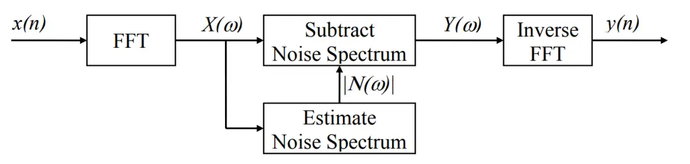

Figure 1: Block diagram of spectral subtraction \[8\]

The assumption of additive noise implies that $`n(t)`$ and $`s(t)`$ are
statistically independent \[9\]. This assumption can be applied in most
real-world situations as no knowledge of the probability density
function (PDF) or the frequency domain of the noise is required.

### 3.2 Frame Processing

For the system to be real-time, the speech signal $`s(t)`$ must first be
split into smaller sections so that the processing can take place before
the entire signal has arrived. These smaller sections are called frames
and their size is denoted as $`N`$. For the basic implementation,
$`N=256`$. It is critical that $`N`$ is a power of 2 so that the radix-2
FFT algorithms can be used. This leads to a reduction in the
time-complexity of the FFT algorithm from $`O(N^{2})`$ to
$`O(N\log(N))`$. The reduction in the run-time of the algorithm for
large values of $`N`$ (i.e. $`N>100`$) is the critical for the system to
be achievable in real-time.

However, the discontinuities at the edges of each frame will lead to
spectral artifacts. To solve this issue, a window is applied in the time
domain before the FFT of the frame is computed. Nevertheless, by
windowing $`x(t)`$ in the time domain, the signal has been distorted;
thus, as shown in Figure 2, the original time domain signal will not be
recovered.

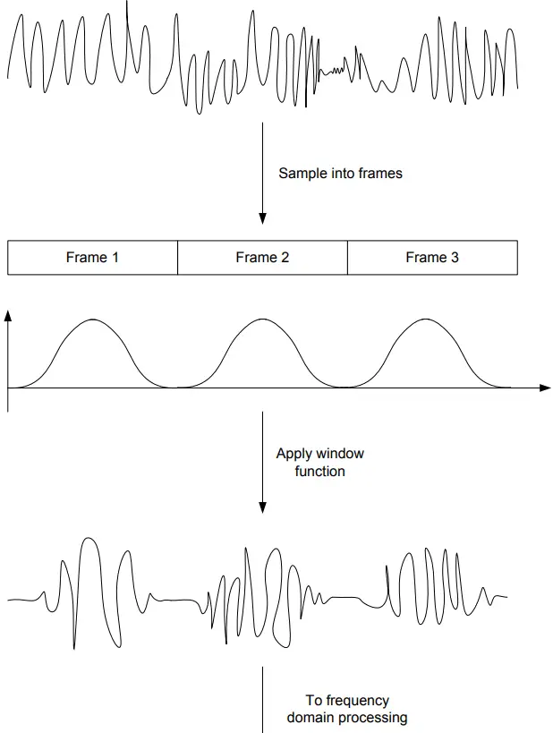

Figure 2: Problem with simply applying window in the time domain \[8\]

To solve this, the individual frames can be overlapped so that the sum
of overlapping windows is always 1. The number of frames that overlap is
known as the oversampling factor. The process for an oversampling factor
of 2 is shown in Figure 3. Note that for the basic implementation of the
spectral subtraction algorithm, an oversampling factor of 4 was used
instead (i.e. each frame will contain $`256/4=64`$ new samples)

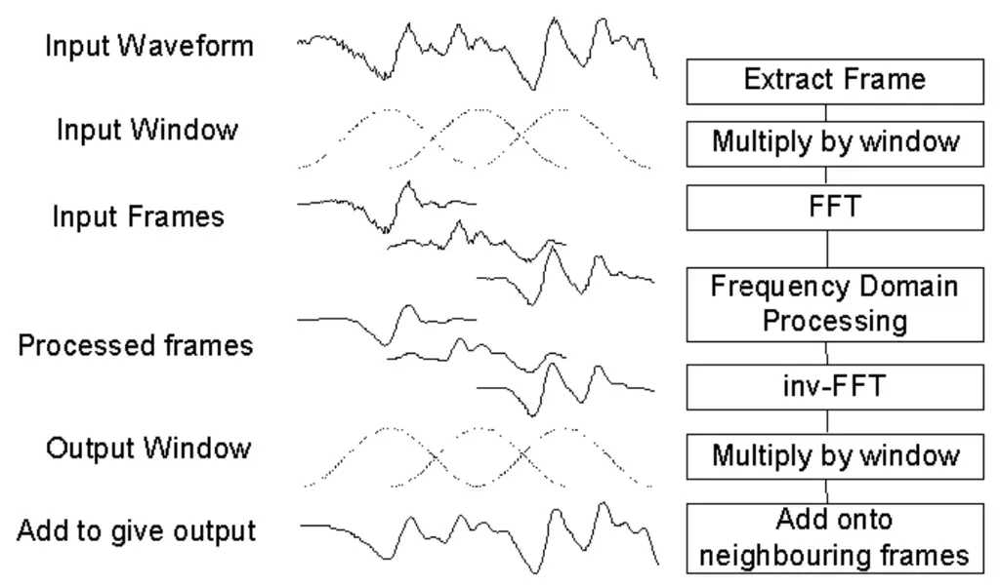

Figure 3: Overlap and add process \[8\]

As shown in Figure 3, another time domain window is applied to $`x(t)`$
after the Inverse Fast Fourier Transform (IFFT) of the function is
taken. This second window is necessary as a modification in the
frequency domain is equivalent to filtering in the time domain which
might lead to discontinuities when the frames meet. In implementations
developed in this work, for both the input and output windows, the
square root of the Hamming window was used (6). The Hamming window
offers a relative first sidelobe amplitude level of -40.0dB Figure 4.

```math
\small w(t)=\sqrt{1-0.85185\cos\left(\frac{(2t+1)\pi}{N}\right)}\text{ for }t=0,...,N-1 \tag{6}
```

Figure 4: Frequency domain of Hamming, Hanning and Gaussian Windows

### 3.3 Noise Estimation

As mentioned previously, for spectral subtraction to be performed, an
estimation $`\hat{N}(\omega)`$ of the noise present in the signal is
required (7). One way of finding this estimate would be to use a Voice
Activity Detector (VAD) which detects whether speech is present in the
signal and then take the average of all the frames where speech is not
present \[2\]. However, spectral subtraction based on VAD is
exceptionally difficult to make so an easier approach is chosen \[7\].

For each frequency bin of $`X(\omega)`$, the minimum magnitude over the
last 10 seconds is determined. This frame will be referred to as the
Minimum Magnitude Spectral Estimate (MMSE) henceforth. Assuming that the
speaker who is being recorded will make a brief pause within these 10
seconds to take a breath, the MMSE will correspond to the minimum
magnitude of the realization of the noise within the speech pauses in
the last 10 seconds. As this estimator will use the minimum of the noise
realizations, it will severely underestimate the average magnitude of
the noise signal. For this reason, a compensating factor denoted by
$`\alpha`$ must be introduced. Since $`x(t)`$ is sampled at $`8`$kHz,
and each new frame contains 64 new samples (i.e. 8ms of new
information), 1250 frames must be stored in memory to find the MMSE.
This is infeasible due to hardware limitations of the system in use.

A simplification can be made by storing just 4 frames denoted as
$`M_{i}(\omega)`$ where $`i=1,..,4`$. For each frame, $`M_{1}(\omega)`$
is updated by:

```math
M_{1}(\omega)=\text{min}\left(\mathinner{\!\left\lvert X(\omega)\right\rvert},M_{1}(\omega)\right) \tag{7}
```

After 2.5 seconds (i.e. approximately 312 new frames), the frames are
shifted and the new $`M_{i}(\omega)`$ takes the values of the previous
$`M_{i-1}`$, for $`i=4,...,2`$ while $`M_{1}(\omega)`$ is set to
$`\mathinner{\!\left\lvert X(\omega)\right\rvert}`$. The disadvantage of
using this simplification is that the MMSE memory (i.e. how far into the
past the minimum frequency bins will be searched for) will not be a
constant 10 seconds since once the shift occurs, the new MMSE will have
an effective memory of 7.508 seconds which will grow until it reaches 10
seconds and then reset again. Nevertheless, this is a small compromise
for such a dramatic decrease in the amount of memory required.

### 3.4 The noise trade-off

As explained in \[1\], one of the problems with the implementation
described above is the introduction of a new type of noise into
$`Y(\omega)`$. This new type of noise will be referred to as musical
noise. To explain this new type of noise, it is crucial to understand
that there are peaks and valleys in the short-term power spectrum of the
noise. Both the frequency and amplitude of these peaks will vary
randomly from frame to frame. When spectral subtraction takes place
according to $`g(\omega)`$ (5), depending on the value of $`\alpha`$
more peaks or more valleys will remain in the magnitude of the processed
frame $`\mathinner{\!\left\lvert X(\omega)\right\rvert}`$. The peaks
will be perceived as tones at a specific frequency. This frequency will
change every frame, thus, for the implementation described above, the
frequency of the tones will change every 8ms. The valleys will be
perceived as broadband noise.

A simulated example is described to gain a better understanding. Using
the MATLAB function randn, 1000 frame realizations of length 256 are
generated. The MMSE over these 1000 frames is plotted in Figure 5.

Figure 5: MMSE over the past 1000 frames

The magnitude $`\mathinner{\!\left\lvert Y(\omega)\right\rvert}`$ of
three consecutive processed frames for $`\alpha=20`$ is plotted in
Figure 6. Note that both peaks and valleys are present in all three
frames.

Figure 6: Magnitude of three consecutive processed frames for
$`\alpha=20`$

By increasing the value of $`\alpha`$, the broadband noise in the frame
will be suppressed while the effect of the musical noise (i.e. the
peaks) will be further enhanced since it will not be masked by the
broadband noise. The magnitude
$`\mathinner{\!\left\lvert Y(\omega)\right\rvert}`$ of three consecutive
processed frames for $`\alpha=200`$ is plotted in Figure 7. As expected,
the peaks are more prevalent even though their amplitude has been
decreased.

Figure 7: Magnitude of three consecutive processed frames for
$`\alpha=200`$

A solution to this musical noise problem, is to further modify
$`g(\omega)`$ to introduce a new parameter $`\lambda`$ which will be
referred to as the spectral floor (8). Effectively, the parameter will
be used to mask the musical noise with broadband noise (Figure 7).

```math
g(\omega)=\text{max}\left(\lambda,1-\alpha\frac{\mathinner{\!\left\lvert\hat{N}(\omega)\right\rvert}}{\mathinner{\!\left\lvert X(\omega)\right\rvert}}\right) \tag{8}
```

Figure 8: Magnitude of three consecutive processed frames for
$`\alpha=200`$ and $`\lambda=0.1`$

Since the MMSE is used as an estimate for the noise, the appropriate
value (i.e. the one that leads to best intelligibility of the speech) of
$`\alpha`$ will increase with:

1.  1.  The memory of the MMSE
2.  2.  The variance of the noise. This equivalent to the power of the zero
        mean noise.

In this simulated example, the signal consisted of only noise; however,
it must be underscored that if $`\alpha`$ is too large, distortion
caused by the spectral subtraction will decrease the speech
intelligibility.

Overall, through the above analysis, it is clear that the parameters of
spectral subtraction method used, must be adjusted to achieve a balance
between, musical noise, broadband noise and speech intelligibility. This
intuition will be used in the next sections to further improve the
current implementation.

### 3.5 Implementation in C

The key parts of the C code for the basic implementation are described
in the following section. The frame that must be processed is located in
the inframe array. The first step is to move the frame from the inframe
array to the intermediate array and convert the elements of inframe from
float to complex which is a struct defined in the complx.h header file.
The conversion from float to complex is required as the signature of the
fft function is void fft(int N, complex^(∗) X).

371 for (k=0;k\<FFTLEN;k++)

372 {

373 inframe\[k\] = inbuffer\[m\] \* inwin\[k\];

374 if (++m \>= CIRCBUF) m=0; /\* wrap if required \*/

375 }

376

377 /\*\*\*\*\*\*\*\*\*\*\*\*\*\*\*\*\*\*\*\*\*\*\*\*\* DO PROCESSING OF
FRAME HERE \*\*\*\*\*\*\*\*\*\*\*\*\*\*\*\*\*\*\*\*\*\*\*\*\*\*/

Figure 9: Code to perform FFT on new frame

As this is a real-time implementation, optimizations are required to
decrease the run time of frame processing. One of the primary
optimizations is to only process half of the frame once in the frequency
domain. As the frame being processed is real in the time domain, the
frequency domain of the frame will be conjugate complex symmetric (9).

```math
X_{N-n}=X_{n}^{*} \tag{9}
```

where $`X_{n}`$ is the value of the $`N`$ point FFT at frequency bin
$`n`$ and ^(∗) is the complex conjugate operator.

Next, the magnitude of the current frame is computed and used to
implement the MMSE algorithm mentioned previously.

379 //N.B. most of the frame processing is done withing a for loop

380 //that takes advantage of the conjugate complex symmetry.

381 //This greatly improves efficiency.

382 for(k=0; k\<FFTLEN/2; k++){

383 //Calculate magnitude of current frame

384 mag\[k\] = cabs(intermediate\[k\]);

Figure 10: Computation of frame magnitude

405 //Check for possible MMSE elements in current frame

406 m1\[k\] = min(mag\[k\],m1\[k\]);

Figure 11: Implementation of MMSE algorithm (1)

413 //Calculate MMSE from MMSE buckets

414 mmse\[k\] = min(min(m1\[k\],m2\[k\]),min(m3\[k\],m4\[k\]));

Figure 12: Implementation of MMSE algorithm (2)

500 //Check if current MMSE bucket if full

501 if(++countMin \>= BUCKET_FRAMES){

502 countMin = 0; //Reset the counter

503

504 //Reset oldest MMSE bucket

505 for(k=0; k\<FFTLEN/2; k++)

506 m4\[k\] = mag\[k\];

507

508 //Swap buckets

509 temp = m4;

510 m4 = m3;

511 m3 = m2;

512 m2 = m1;

513 m1 = temp;

514 }

Figure 13: Implementation of MMSE algorithm (3)

Finally, the value of $`g(\omega)`$ (8) for the current frequency bin is
computed and elements of the intermediate array are overwritten
accordingly.

435 gw = max(lambda,(1-(alpha\*mmse\[k\]/mag\[k\])));

Figure 14: Computation of $`g(\omega)`$ for single frequency bin

435 gw = max(lambda,(1-(alpha\*mmse\[k\]/mag\[k\])));

Figure 15: Overwriting the elements of intermediate

It must be noted that once the IFFT of the intermediate array is taken,
only the real values of the elements of intermediate will be written to
outframe as any complex values will be due to finite precision effects.

516 //Calculate the IFFT of the current frame

517 ifft(FFTLEN, intermediate);

518

519 //Copy real part of X\[k\] to the output frame

520 for(k=0; k\<FFTLEN; k++)

521 outframe\[k\] = intermediate\[k\].r;

Figure 16: Writing the real values of intermediate to outframe

### 3.6 Performance of the Basic Implementation

The performance of this basic implementation will be used as a benchmark
to compare the enhancements that will be introduced in the next section.
To compare the different implementations, a selection of Waveform Audio
Files (i.e. .wav) containing ”the sailor passage” with different types
of added noise (e.g. car, factory, helicopter) at different noise levels
were used as input to the system. To refer to the different types of
input their file names will be used (e.g. phantom2.wav for added noise
from the F15 phantom aircraft at noise level 2). The spectrogram of the
input with no added noise (i.e. clean.wav) is shown in Figure 17. The
spectrogram of car1.wav in Figure 18. Through a visual inspection of the
spectrogram, the car noise seems to have added broadband stationary
noise at low frequencies (i.e. less that 300Hz). The spectrogram of
car1.wav after processing, which will simply be referred to as ”the
output,” is shown in Figure 19. As expected, the basic spectral
subtraction implementation has reduced the noise in the signal; however,
improvements can still be made.

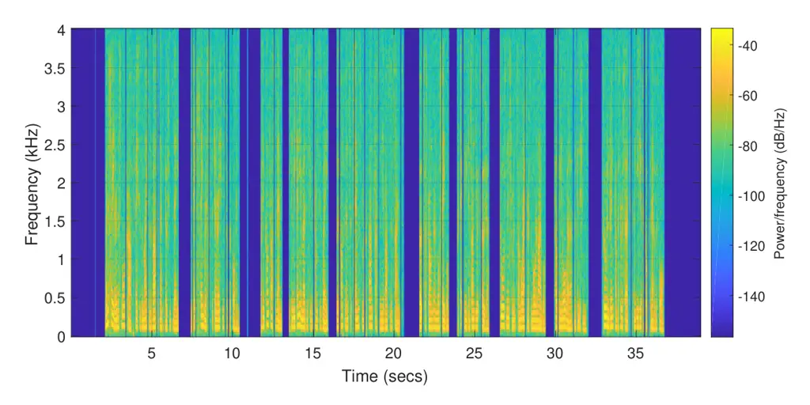

Figure 17: Spectrogram of clean.wav

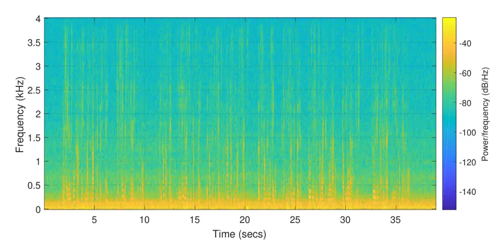

Figure 18: Spectrogram of car1.wav

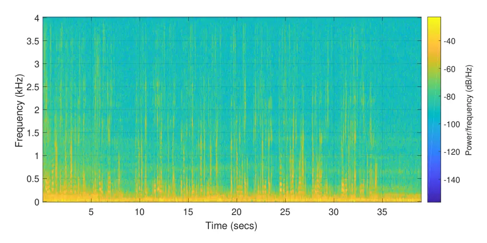

Figure 19: Spectrogram of car1.wav output with $`\alpha=20`$ and
$`\lambda=0.05`$ (Basic Implementation)

## 4 Enhancements

In this sections various enhancements are made to the basic
implementation. Not all enhancements were used in the final
implementation as some proved to have little effect in practice given
their computational cost. The C-code implementation for all of the
enhancements can be found in the Appendix.

### 4.1 Low-pass filtering the magnitude

The first enhancement is simply to low-pass filter the magnitude
$`\mathinner{\!\left\lvert X(\omega)\right\rvert}`$ of the frame. Note
the the low-pass filter in acting on consecutive frames rather than in
the time domain. This was recommended in \[7\] \[6\]. The low-pass
filtering is done according to the difference equation (10)

```math
P_{t}(\omega)=(1-k)\mathinner{\!\left\lvert X(\omega)\right\rvert}+kP_{t-1}(\omega) \tag{10}
```

where $`k=e^{T/\tau}`$ is the z-plane pole for time constant $`\tau`$
and frame rate $`T`$ and $`P_{t}(\omega)`$ is the low-pass filtered
input for frame $`t`$. Note the since
$`\mathinner{\!\left\lvert e^{T/\tau}\right\rvert}<1`$ for $`T\neq 0`$,
the filter will always be stable for any value of $`\tau`$. This
enhancement improved significantly the output while $`\alpha`$ was
reduced from 20 to 2; $`\tau`$ was set empirically to 30ms which is in
the range suggested by \[8\]. The spectrogram of the output with the
above enhancement is shown in Figure 20. Surprisingly, even though the
spectrum looks similar to Figure 19, it was perceived to be much
clearer.

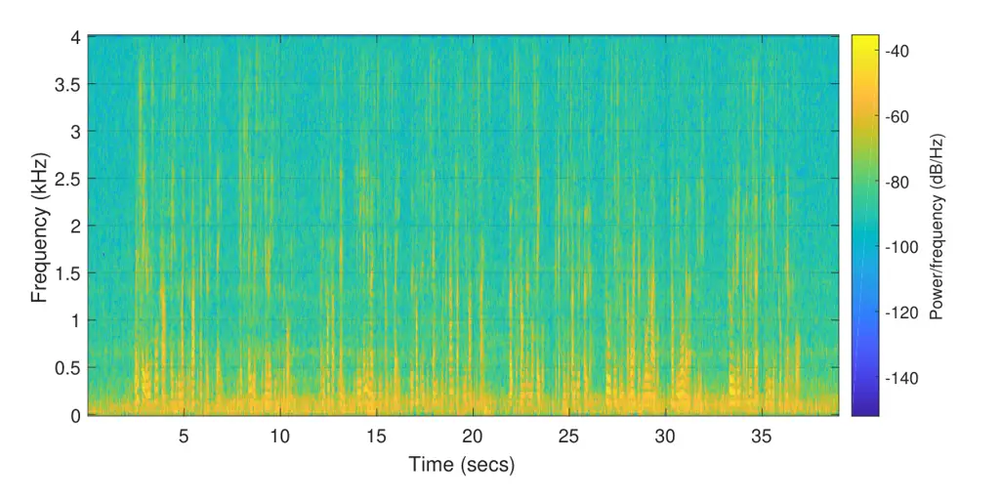

Figure 20: Spectrogram car1.wav output with $`\alpha=2`$,
$`\lambda=0.05`$, $`\tau=0.03`$ (Enhancement 1)

### 4.2 Low-pass filtering power

This enhancement is very similar to enhancement 1, except instead of
low-pass filtering the magnitude
$`\mathinner{\!\left\lvert X(\omega)\right\rvert}`$, the power
$`\mathinner{\!\left\lvert X(\omega)\right\rvert}^{2}`$ is low-pass
filtered. Theoretically, this makes sense since humans perceive power
rather than magnitude. Furthermore, it’s expected that the optimal value
of $`\tau`$ will decrease as
$`\mathinner{\!\left\lvert X(\omega)\right\rvert}^{2}`$ will vary faster
than $`\mathinner{\!\left\lvert X(\omega)\right\rvert}`$. Empirically,
the optimal value of $`\tau`$ was set to 0.025. This is within the range
specified by \[8\]. The spectrogram of the output with the above
enhancement is shown in Figure 21. The output was perceived to be of
higher quality than the output when using enhancement 1.

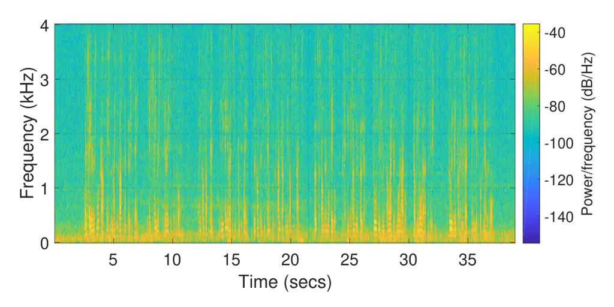

Figure 21: Spectrogram car1.wav output with $`\alpha=2`$,
$`\lambda=0.05`$, $`\tau=0.025`$ (Enhancement 2)

### 4.3 Low-pass filtering the noise

In this enhancement, instead of low-pass filtering the magnitude of the
frame, the MMSE is low-pass filtered. Theoretically, robustness of the
system to non-stationary nose where there would be a abrupt change in
the output once the MMSE frames $`M_{i}(\omega)`$ shift. Empirically,
there was a noticeable difference when the input to the DSK was set to
factory1.wav and factory2.wav as they contain ”the sailor” passage with
added factory noises at different levels.

### 4.4 Using different values for $`g(\omega)`$

This enhancement consists of implementing different versions of
$`g(\omega)`$ shown below:

```math
\displaystyle g(\omega) \displaystyle=\text{max}\left(\lambda\frac{\mathinner{\!\left\lvert\hat{N}(\omega)\right\rvert}}{\mathinner{\!\left\lvert X(\omega)\right\rvert}},1-\alpha\frac{\mathinner{\!\left\lvert\hat{N}(\omega)\right\rvert}}{\mathinner{\!\left\lvert X(\omega)\right\rvert}}\right) \tag{11}
```

```math
\displaystyle g(\omega) \displaystyle=\text{max}\left(\lambda\frac{\mathinner{\!\left\lvert P(\omega)\right\rvert}}{\mathinner{\!\left\lvert X(\omega)\right\rvert}},1-\alpha\frac{\mathinner{\!\left\lvert\hat{N}(\omega)\right\rvert}}{\mathinner{\!\left\lvert X(\omega)\right\rvert}}\right) \tag{12}
```

```math
\displaystyle g(\omega) \displaystyle=\text{max}\left(\lambda\frac{\mathinner{\!\left\lvert\hat{N}(\omega)\right\rvert}}{\mathinner{\!\left\lvert P(\omega)\right\rvert}},1-\alpha\frac{\mathinner{\!\left\lvert\hat{N}(\omega)\right\rvert}}{\mathinner{\!\left\lvert P(\omega)\right\rvert}}\right) \tag{13}
```

```math
\displaystyle g(\omega) \displaystyle=\text{max}\left(\lambda,1-\alpha\frac{\mathinner{\!\left\lvert\hat{N}(\omega)\right\rvert}}{\mathinner{\!\left\lvert P(\omega)\right\rvert}}\right) \tag{14}
```

All of these enhancements were tested empirically, the best performing
one was (13) which is also the version of $`g(\omega)`$ that is used in
\[1\].

### 4.5 Calculating $`g(\omega)`$ in the power domain

This is yet another enhancement that modifies $`g(\omega)`$; however, in
this case, the modification is different as $`g(\omega)`$ will be
computed in the power domain instead of the magnitude domain ( 15).

```math
g(\omega)=\text{max}\left(\lambda,\sqrt{1-\left(a\frac{\mathinner{\!\left\lvert\hat{N}(\omega)\right\rvert}}{\mathinner{\!\left\lvert X(\omega)\right\rvert}}\right)^{2}}\right) \tag{15}
```

As mentioned previously, humans perceive power rather than magnitude so
there is theoretical justification for this enhancement. However,
empirically, little difference was perceived in the output signal with
this enhancement being very computationally expensive due to the powf
and sqrtf functions that must be used.

### 4.6 Overestimate $`\alpha`$ at lower SNR frequency bins

This enhancements adjusts the parameter $`\alpha`$ from frame to frame
depending on the SNR as suggested by \[1\]. The SNR from frame to frame
will vary as the power of the noise will be approximately the same for
stationary noise while the power of the signal will vary. For high SNR
frames, increasing the value of $`\alpha`$ is not necessary and will
lead to a distortion in the speech signal. For low SNR frames, a higher
value $`\alpha`$ is necessary to suppress the noise. Therefore, there is
theoretical justification to this enhancement. As suggested by \[1\], a
piece wise linear function was used to select the value of $`\alpha`$
(Figure 22) (16).

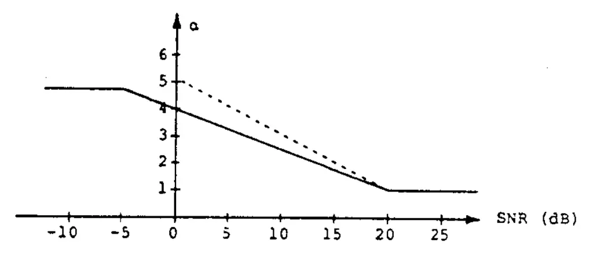

Figure 22: Value of the compensation factor $`\alpha`$ versus SNR of
frame

The function for the solid line in Figure 22 is:

```math
\alpha(SNR)=\begin{cases}5&\text{for }SNR<-5\\
5-\frac{4}{20}SNR&\text{for }-5\leq SNR\leq 20\\
1&\text{for }SNR>1\end{cases} \tag{16}
```

Even though in \[1\], this enhancement was only performed with a frame
by frame granularity (i.e. the value of $`\alpha`$ will change from
frame to frame; however, it will remain constant within a frame) the
enhancement was further modified to allow for $`\alpha`$ to change with
a frequency bin granularity which was used by \[5\]. The justification
of this is that noise does not effect the speech signal in the frequency
domain uniformly. This is illustrated in Figure 22 which shows the SNR
ratios of four linearly space frequency bins across consecutive frames
for the input corrupted by the added car noise. Bin 1 has a lower SNR
across most frames as it corresponds to the very low frequencies (
$`<10`$Hz) which is where the car noise is mostly present. The SNRs
between different frequency bins differ substantially with difference
being greater than 100dB for some frames. Note the if the slope of the
piece-wise linear function (16) is increased, then the temporal dynamic
range of the signal will also increase substantially leading to a
distorted output. Empirically, the slope used in \[1\], was confirmed to
have a good performance so it was not modified.

Figure 23: SNR ratios of four linearly spaced frequency bins across
consecutive frames

### 4.7 Adding the $`\delta(F)`$ term

In addition to adjusting the noise estimate, $`\hat{N}(\omega)`$ based
on the SNR ratio of each frequency bin, this enhancement aims to further
adjust $`\hat{N}(\omega)`$ based the analogue frequency, $`F`$ that the
frequency bins represents. This enhancement was introduced by \[5\] and
uses a ”tweaking factor” $`\delta(F)`$ that can be individually set for
each frequency bin. In the real-world, noise (e.g. added car noise) is
coloured and affects certain frequencies more than others. This is
illustrated in Figure 24 which shows the spectrogram of the added car
noise. Note that the car noise is present primarily at frequencies
$`0\text{Hz}<F<300`$Hz which explains the discrepancies between the SNRs
of different frequency bins in Figure 23.

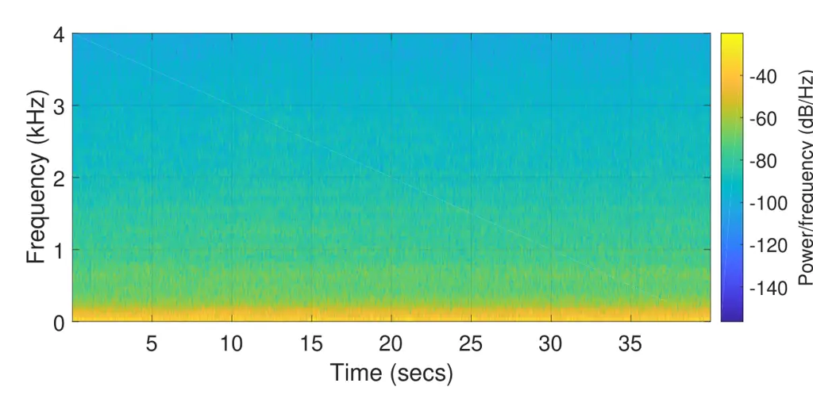

Figure 24: Spectrogram of added car noise in car1.wav

The $`\delta(F)`$ terms adds an additional degree of freedom to the
noise subtraction level of each frequency and modifies (8) slightly to
the form shown in (17)

```math
g(\omega)=\text{max}\left(\lambda,1-\delta(F)\alpha(SNR)\frac{\mathinner{\!\left\lvert\hat{N}(\omega)\right\rvert}}{\mathinner{\!\left\lvert X(\omega)\right\rvert}}\right) \tag{17}
```

The values of $`\delta(F)`$ where determined empirically and set to:

```math
\delta(F)=\begin{cases}1&0Hz<F<1kHz\\
2.5&1kHz\leq F<2kHz\\
1.5&2kHz\leq F\end{cases} \tag{18}
```

These values match the ones used in \[5\]. The addition of the delta
term, lead to a significant increase in the intelligibility of the
output especially when dealing with added helicopter noise. The
spectrogram of added helicopter noise is shown in Figure 25

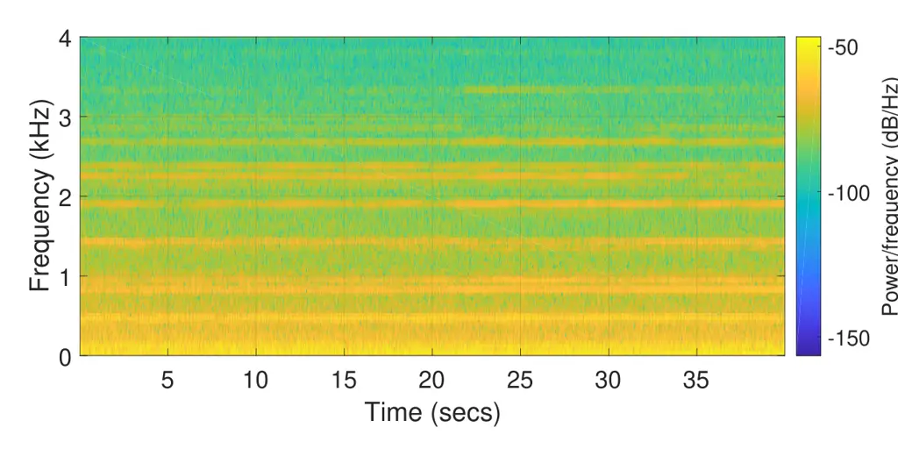

Figure 25: Spectrogram of added helicopter noise in lynx1.wav

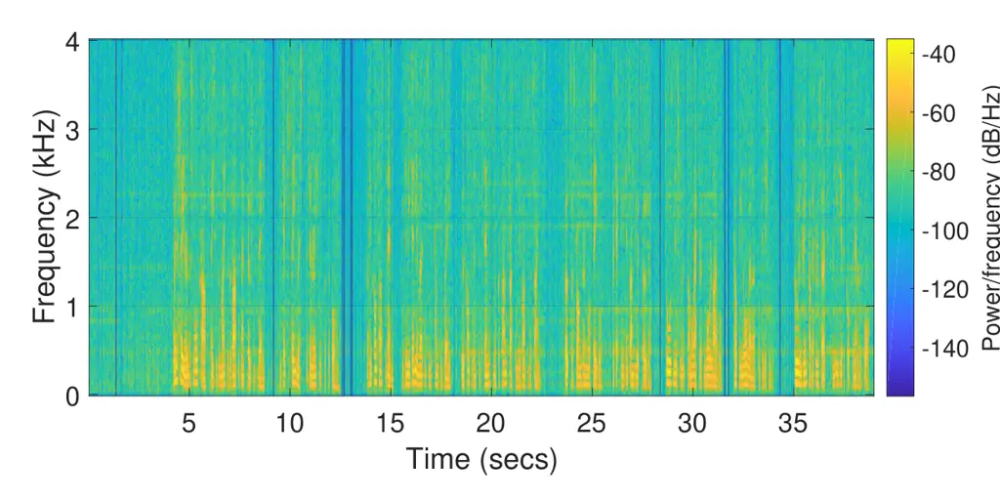

Figure 26: Spectrogram of lynx1.wav output with $`\delta(F)`$ set to
(18) (Enhancement 7)

### 4.8 Using different frame lengths

By changing the frame length, the time and frequency resolution of the
implementation can be changed. A larger frame length will effectively
increase the frequency resolution of each frame while decreasing the
frequency resolution and vice versa. As mentioned previously, the basic
implementation had a frame length of 256 samples and a sampling
frequency of 8kHz. Thus each frame consists of 32ms of speech. A shorter
frame length resulted in ”roughness” in the speech while a longer frame
length lead to ”slurred” speech. These results agree with \[8\].
Overall, the ideal frame length was found to be around 28ms. The frame
length was adjusted by changing the FFTLEN definition in the C code.

### 4.9 Residual Noise Reduction

This enhancement attempts to remove some of the musical noise by taking
advantage of the frame to frame randomness \[2\]. Effectively, as
mentioned previously, the musical noise is due to the formation of peaks
in the magnitude spectrum which will appear at a random amplitude and
frequency for each frame. Therefore, the musical noise can be suppressed
by replacing the frequency bins of the current frame with the minimum
frequency bins from the previous and next frame.

```math
\mathinner{\!\left\lvert X_{i}(\omega)\right\rvert}=\text{min}\left(\mathinner{\!\left\lvert X_{i-1}(\omega)\right\rvert},\mathinner{\!\left\lvert X_{i}(\omega)\right\rvert},\mathinner{\!\left\lvert X_{i+1}(\omega)\right\rvert}\right) \tag{19}
```

However, even with the complex conjugate symmetric optimization, this
enhancement is very computationally demanding and could not be
implemented in parallel with the enhancements mentioned thus far. For
this reason, it was not included in the final implementation.

### 4.10 Reduce the MMSE Memory

This enhancement aims to increase the responsiveness of the system to
non-stationary noise by reducing the MMSE memory. Reducing the MMSE
memory is also beneficial from a computational point of view; however,
if the speaker continues to produce sound for more than the MMSE memory
(measured in seconds), the noise estimate that will be made will be
extremely high as segments of speech have effectively been misclassified
as noise. This will lead to a serious distortion in the speech signal.

### 4.11 Changing the windowing function

A final enhancement that was considered was to use a different windowing
function. As mentioned in section 3.2, in the implementations thus far,
the Hamming window was used to mitigate the effects of spectral
artifacts in the frequency domain. Other windows that were considered
were the Hanning, Gaussian and Black-Harris (3-term). Out of these
windows, the Hanning performed the best which might be due to it’s
higher spectral roll-off (Figure 4)

## 5 Final Implementation and Results

In the final implementation a compromise between computational
complexity and system performance was made when choosing which
enhancements to include. Enhancements 4.2, 4.3, 4.4, 4.6, 4.7 and 4.11
were included in the final implementation. Enhancement 4.5 and 4.9 were
very computationally demanding and could not be included together with
other enhancements while the rest of the enhancements did not improve
the final output or, in some case, lead to worse performance. The input
and output SNR levels for the final implementation is shown in Figure 27. The final implementation managed to reduce the noise significantly
for all inputs; however, it performs best when the original signal has a
high original SNR level. It had the worse improvement in SNR with the
phantom4.wav input were it only managed to achieved a 5.98dB
improvement.

Figure 27: Improvement in SNR levels with final implementation

## 6 Conclusion

A real-time speech enhancement system was implemented based on the
spectral subtraction technique. Different enhancements were considered
and their performance was evaluated based on extensive listening tests,
spectrograms and SNR comparisons. The final system manages to reduce the
noise present in the output signal substantially while achieving a
compromise between broadband noise, musical noise and speech
intelligibility. Nevertheless, the system struggles to deal with very
low SNR inputs. To deal with these types of inputs, other more recent
noise reduction techniques such as Wiener filters or signal subspace
approaches could be used.

## References

- \[1\] Michael Berouti, Richard Schwartz and John Makhoul “Enhancement
  of speech corrupted by acoustic noise” In _ICASSP’79. IEEE
  International Conference on Acoustics, Speech, and Signal Processing_
  4, 1979, pp. 208–211 IEEE
- \[2\] Steven Boll “Suppression of acoustic noise in speech using
  spectral subtraction” In _IEEE Transactions on acoustics, speech, and
  signal processing_ 27.2 IEEE, 1979, pp. 113–120
- \[3\] William Hartmann “Signals, sound, and sensation” Springer
  Science & Business Media, 2004
- \[4\] Georgios Ioannides, Ioannis Kourouklides and Alessandro Astolfi
  “Spatiotemporal dynamics in spiking recurrent neural networks using
  modified-full-FORCE on EEG signals” In _Scientific Reports_ 12, 2022,
  pp. 2896 DOI:
  [10.1038/s41598-022-06573-1](https://dx.doi.org/10.1038/s41598-022-06573-1)
- \[5\] Sunil Kamath and Philipos Loizou “A multi-band spectral
  subtraction method for enhancing speech corrupted by colored noise.”
  In _ICASSP_ 4, 2002, pp. 44164–44164 Citeseer
- \[6\] P Lockwood, J Boudy and M Blanchet “Non-linear spectral
  subtraction (NSS) and hidden Markov models for robust speech
  recognition in car noise environments” In _\[Proceedings\] ICASSP-92:
  1992 IEEE International Conference on Acoustics, Speech, and Signal
  Processing_ 1, 1992, pp. 265–268 IEEE
- \[7\] Rainer Martin “Spectral subtraction based on minimum statistics”
  In _power_ 6, 1994, pp. 8
- \[8\] Paul. Mitcheson “Project: Speech Enhancement” Imperial College
  London
- \[9\] Lizhong Zhen and Robert Gallager “6.450 Principles of Digital
  Communications I.” Accessed: 2019-03-07, 2006, pp. 203–204
  Massachusetts Institute of Technology: MIT OpenCourseWare URL:
  [https://ocw.mit.edu/courses/electrical-engineering-and-computer-science/6-450-principles-of-digital-communications-i-fall-2006/lecture-notes/book_7.pdf](https://ocw.mit.edu/courses/electrical-engineering-and-computer-science/6-450-principles-of-digital-communications-i-fall-2006/lecture-notes/book_7.pdf)

## Appendix

1
/\*\*\*\*\*\*\*\*\*\*\*\*\*\*\*\*\*\*\*\*\*\*\*\*\*\*\*\*\*\*\*\*\*\*\*\*\*\*\*\*\*\*\*\*\*\*\*\*\*\*\*\*\*\*\*\*\*\*\*\*\*\*\*\*\*\*\*\*\*\*\*\*\*\*\*\*\*\*\*\*\*\*\*\*\*

2 DEPARTMENT OF ELECTRICAL AND ELECTRONIC ENGINEERING

3 IMPERIAL COLLEGE LONDON

4

5 EE 3.19: Real Time Digital Signal Processing

6 Dr Paul Mitcheson and Daniel Harvey

7

8 PROJECT: Frame Processing

9

10 \*\*\*\*\*\*\*\*\* ENHANCE. C \*\*\*\*\*\*\*\*\*\*

11 Shell for speech enhancement

12

13 Demonstrates overlap-add frame processing (interrupt driven) on the
DSK.

14

15
\*\*\*\*\*\*\*\*\*\*\*\*\*\*\*\*\*\*\*\*\*\*\*\*\*\*\*\*\*\*\*\*\*\*\*\*\*\*\*\*\*\*\*\*\*\*\*\*\*\*\*\*\*\*\*\*\*\*\*\*\*\*\*\*\*\*\*\*\*\*\*\*\*\*\*\*\*\*\*\*\*\*\*\*\*

16 By Danny Harvey: 21 July 2006

17 Updated for use on CCS v4 Sept 2010

18
\*\*\*\*\*\*\*\*\*\*\*\*\*\*\*\*\*\*\*\*\*\*\*\*\*\*\*\*\*\*\*\*\*\*\*\*\*\*\*\*\*\*\*\*\*\*\*\*\*\*\*\*\*\*\*\*\*\*\*\*\*\*\*\*\*\*\*\*\*\*\*\*\*\*\*\*\*\*\*\*\*\*\*\*/

19 /\*

20 \* You should modify the code so that a speech enhancement project is
built

21 \* on top of this template.

22 \*/

23 /\*\*\*\*\*\*\*\*\*\*\*\*\*\*\*\*\*\*\*\*\*\*\*\*\*\*\*\*
Pre-processor statements
\*\*\*\*\*\*\*\*\*\*\*\*\*\*\*\*\*\*\*\*\*\*\*\*\*\*\*\*\*\*/

24 // library required when using calloc

25 \#include \<stdlib.h\>

26 // Included so program can make use of DSP/BIOS configuration tool.

27 \#include "dsp_bios_cfg.h"

28

29 /\* The file dsk6713.h must be included in every program that uses
the BSL. This

30 example also includes dsk6713_aic23.h because it uses the

31 AIC23 codec module (audio interface). \*/

32 \#include "dsk6713.h"

33 \#include "dsk6713_aic23.h"

34

35 // math library (trig functions)

36 \#include \<math.h\>

37

38 /\* Some functions to help with Complex algebra and FFT. \*/

39 \#include "cmplx.h"

40 \#include "fft_functions.h"

41

42 // Some functions to help with writing/reading the audio ports when
using interrupts.

43 \#include \<helper_functions_ISR.h\>

44

45 \#define WINCONST 0.85185 /\* 0.46/0.54 for Hamming window \*/

46 \#define FSAMP 8000.0 /\* sample frequency, ensure this matches
Config for AIC \*/

47 \#define FFTLEN 256 /\* fft length = frame length 256/8000 = 32 ms\*/

48 \#define NFREQ (1+FFTLEN/2) /\* number of frequency bins from a real
FFT \*/

49 \#define OVERSAMP 4 /\* oversampling ratio (2 or 4) \*/

50 \#define FRAMEINC (FFTLEN/OVERSAMP) /\* Frame increment \*/

51 \#define CIRCBUF (FFTLEN+FRAMEINC) /\* length of I/O buffers \*/

52

53 \#define OUTGAIN 16000.0 /\* Output gain for DAC \*/

54 \#define INGAIN (1.0/16000.0) /\* Input gain for ADC \*/

55

56 // PI defined here for use in your code

57 \#define PI 3.141592653589793

58 \#define TFRAME (FRAMEINC/FSAMP) /\* time between calculation of each
frame \*/

59

60 //Number of frames in a Minimum Magnitude Spectrum Estimate Bucket
(MMSE Bucket)

61 \#define BUCKET_FRAMES 312

62

63 //Define constants to select noise removal algorithm

64 //LOW_PASS_MAGNITUDE is used to Enable (1) or Disable (0) the
low-pass filtering

65 //of the spectral magnitude. Please see report for more information.

66 \#define LOW_PASS_MAGNITUDE 1

67 //LOW_PASS_NOISE is used to Enable(1) or Disable(0) the low-pass
filtering

68 //of the Minimum Magnitude Spectral Estimate (MMSE). The MMSE is an
estimator for the noise

69 //in the signal. Please see report for more information.

70 \#define LOW_PASS_NOISE 0

71 //USE_MAGNITUDE_SQUARED is used to Enable(1) or Disable(0) the
computation of

72 //square magnitude (i.e. spectral power) before applying the low-pass
filer.

73 \#define USE_MAGNITUDE_SQUARED 1

74 //Change the value of alpha at runtime according to the SNR of the
signal

75 \#define USE_DYNAMIC_ALPHA 1

76 //Select different G(w) to use.For values of G_OMEGA \>= 3 some

77 //prerequisits apply. If these have not been selected by the user,

78 //the compilation will fail and an approriate error is

79 //presented. This is used to improve robustness.

80 \#define G_OMEGA 3

81 //USE_RESIDUAL_NOISE_REDUCTION is used to Enable(1) or Disable(0) the

82 //residual noise reduction algorithm as a way to remove the musical
noise.

83 \#define RESIDUAL_NOISE_REDUCTION 0

84 //DELTA_TERM is used to Enable(1) or Disable(0) the additional delta
term

85 //for adjusting the noise estimator based on the frequency bin

86 \#define DELTA_TERM 1

87

88 /\*\*\*\*\*\*\*\*\*\*\*\*\*\*\*\*\*\*\*\*\*\*\*\*\*\*\*\*\*\*\*
Global declarations
\*\*\*\*\*\*\*\*\*\*\*\*\*\*\*\*\*\*\*\*\*\*\*\*\*\*\*\*\*\*\*\*/

89

90 /\* Audio port configuration settings: these values set registers in
the AIC23 audio

91 interface to configure it. See TI doc SLWS106D 3-3 to 3-10 for more
info. \*/

92 DSK6713_AIC23_Config Config = { \\

93
/\*\*\*\*\*\*\*\*\*\*\*\*\*\*\*\*\*\*\*\*\*\*\*\*\*\*\*\*\*\*\*\*\*\*\*\*\*\*\*\*\*\*\*\*\*\*\*\*\*\*\*\*\*\*\*\*\*\*\*\*\*\*\*\*\*\*\*\*\*\*/

94 /\* REGISTER FUNCTION SETTINGS \*/

95
/\*\*\*\*\*\*\*\*\*\*\*\*\*\*\*\*\*\*\*\*\*\*\*\*\*\*\*\*\*\*\*\*\*\*\*\*\*\*\*\*\*\*\*\*\*\*\*\*\*\*\*\*\*\*\*\*\*\*\*\*\*\*\*\*\*\*\*\*\*\*/\\

96 0x0017, /\* 0 LEFTINVOL Left line input channel volume 0dB \*/\\

97 0x0017, /\* 1 RIGHTINVOL Right line input channel volume 0dB \*/\\

98 0x01f9, /\* 2 LEFTHPVOL Left channel headphone volume 0dB \*/\\

99 0x01f9, /\* 3 RIGHTHPVOL Right channel headphone volume 0dB \*/\\

100 0x0011, /\* 4 ANAPATH Analog audio path control DAC on, Mic boost
20dB\*/\\

101 0x0000, /\* 5 DIGPATH Digital audio path control All Filters off
\*/\\

102 0x0000, /\* 6 DPOWERDOWN Power down control All Hardware on \*/\\

103 0x0043, /\* 7 DIGIF Digital audio interface format 16 bit \*/\\

104 0x008d, /\* 8 SAMPLERATE Sample rate control 8 KHZ-ensure matches
FSAMP \*/\\

105 0x0001 /\* 9 DIGACT Digital interface activation On \*/\\

106
/\*\*\*\*\*\*\*\*\*\*\*\*\*\*\*\*\*\*\*\*\*\*\*\*\*\*\*\*\*\*\*\*\*\*\*\*\*\*\*\*\*\*\*\*\*\*\*\*\*\*\*\*\*\*\*\*\*\*\*\*\*\*\*\*\*\*\*\*\*\*/

107 };

108

109 // Codec handle:- a variable used to identify audio interface

110 DSK6713_AIC23_CodecHandle H_Codec;

111

112 float \*inbuffer, \*outbuffer; /\* Input/output circular buffers \*/

113 float \*inframe, \*outframe; /\* Input and output frames \*/

114 float \*inwin, \*outwin; /\* Input and output windows \*/

115 float ingain, outgain; /\* ADC and DAC gains \*/

116 float cpufrac; /\* Fraction of CPU time used \*/

117 volatile int io_ptr=0; /\* Input/ouput pointer for circular buffers
\*/

118 volatile int frame_ptr=0; /\* Frame pointer \*/

119

120 //Inermediate frame on which processing is done

121 complex \*intermediate;

122

123 //Minimum Magnitude Spectrum Estimate (MMSE) Buckets

124 float\* m1;

125 float\* m2;

126 float\* m3;

127 float\* m4;

128

129 //Magnitude

130 float \*mag;

131

132 //Parameters of g(w)

133 float alpha = 20;//16;

134 float lambda = 0.05;

135

136 //MMSE

137 float\* mmse;

138

139 \#if LOW_PASS_MAGNITUDE == 1

140 //Low-pass filtered version of mag(X) or mag(X)^2

141 //N.B. This array is used to store both the previous frames

142 //low-pass filtered estimate and the current low-pass filtered

143 //estimate. This saves memory

144 float\* lpfMag;

145

146 //Parameter used for low-pass filtering mag(X)

147 float tau = 30e-3;

148 \#endif

149

150 \#if USE_MAGNITUDE_SQUARED == 1

151 //Low-pass filtered estimate of mag(X)^2

152 float\* lpfMagSquared;

153 \#endif

154

155 \#if LOW_PASS_NOISE == 1

156 //Parameter used for low-pass filtering mmse (i.e. mag(N))

157 float tauNoise = 80e-3;

158 \#endif

159

160 \#if USE_DYNAMIC_ALPHA == 1

161 //Parameters for scalling of alpha with SNR

162 float alphaMax = 10;

163 float alphaMin = 1;

164 float a0 = 6;

165 float s = 0.001;

166 \#endif

167

168 \#if RESIDUAL_NOISE_REDUCTION == 1

169 //Buffers for previous, current and next magnitude spectrum

170 //Y_Next does not have to be allocated as Y_Next will be the value

171 //currently calculated

172 complex\* Y_Prev;

173 complex\* Y_Curr;

174 \#endif

175

176

177 /\*\*\*\*\*\*\*\*\*\*\*\*\*\*\*\*\*\*\*\*\*\*\*\*\*\*\*\*\*\*\*
Function prototypes
\*\*\*\*\*\*\*\*\*\*\*\*\*\*\*\*\*\*\*\*\*\*\*\*\*\*\*\*\*\*\*/

178 void init_hardware(void); /\* Initialize codec \*/

179 void init_HWI(void); /\* Initialize hardware interrupts \*/

180 void ISR_AIC(void); /\* Interrupt service routine for codec \*/

181 void process_frame(void); /\* Frame processing routine \*/

182

183 //Returns max of two floats

184 float max(const float a, const float b);

185 //Returns min of two floats

186 float min(const float a, const float b);

187

188
/\*\*\*\*\*\*\*\*\*\*\*\*\*\*\*\*\*\*\*\*\*\*\*\*\*\*\*\*\*\*\*\*\*\*
Main routine
\*\*\*\*\*\*\*\*\*\*\*\*\*\*\*\*\*\*\*\*\*\*\*\*\*\*\*\*\*\*\*\*\*\*\*\*/

189 void main()

190 {

191 int k; // used in various for loops

192

193 /\* Initialize and zero fill arrays \*/

194

195 inbuffer = (float \*) calloc(CIRCBUF, sizeof(float)); /\* Input
array \*/

196 outbuffer = (float \*) calloc(CIRCBUF, sizeof(float)); /\* Output
array \*/

197 inframe = (float \*) calloc(FFTLEN, sizeof(float)); /\* Array for
processing\*/

198 outframe = (float \*) calloc(FFTLEN, sizeof(float)); /\* Array for
processing\*/

199 inwin = (float \*) calloc(FFTLEN, sizeof(float)); /\* Input window
\*/

200 outwin = (float \*) calloc(FFTLEN, sizeof(float)); /\* Output window
\*/

201

202 //Frequency domain

203 intermediate = (complex \*) calloc(FFTLEN, sizeof(complex));

204

205 //MMSE Buckets

206 m1 = (float \*) calloc(FFTLEN/2, sizeof(float));

207 m2 = (float \*) calloc(FFTLEN/2, sizeof(float));

208 m3 = (float \*) calloc(FFTLEN/2, sizeof(float));

209 m4 = (float \*) calloc(FFTLEN/2, sizeof(float));

210

211 //Initialize memory to FLT_MAX (i.e. max value that float can take)

212 for(k=0; k\<FFTLEN/2; ++k){

213 m1\[k\] = FLT_MAX;

214 m2\[k\] = FLT_MAX;

215 m3\[k\] = FLT_MAX;

216 m4\[k\] = FLT_MAX;

217 }

218

219 //Magnitude of frequency domain

220 mag = (float \*) calloc(FFTLEN/2, sizeof(float));

221

222 \#if LOW_PASS_MAGNITUDE == 1

223 //Low-pass filtered estimate of current/previous frame

224 lpfMag = (float \*) calloc(FFTLEN/2, sizeof(float));

225 \#endif

226

227 \#if USE_MAGNITUDE_SQUARED == 1

228 //Declare point to array to hold the squared magnitude values

229 lpfMagSquared = (float \*) calloc(FFTLEN/2, sizeof(float));

230 \#endif

231

232 \#if RESIDUAL_NOISE_REDUCTION == 1

233 //Define arrays for previous, current and next magnitude spectrum.

234 //Y_Next does not have to be allocated as Y_Next will be the value

235 //currently calculated

236 Y_Prev = (complex \*) calloc(FFTLEN, sizeof(complex));

237 Y_Curr = (complex \*) calloc(FFTLEN, sizeof(complex));

238 \#endif

239

240

241 //Allocating memory (i.e. defining) memory for

242 /\* initialize board and the audio port \*/

243 init_hardware();

244

245 /\* initialize hardware interrupts \*/

246 init_HWI();

247

248 /\* initialize algorithm constants \*/

249

250 for (k=0;k\<FFTLEN;k++)

251 {

252 inwin\[k\] =
sqrt((1.0-WINCONST\*cos(PI\*(2\*k+1)/FFTLEN))/OVERSAMP);

253 outwin\[k\] = inwin\[k\];

254 }

255 ingain=INGAIN;

256 outgain=OUTGAIN;

257

258 /\* main loop, wait for interrupt \*/

259 while(1) process_frame();

260 }

261

262
/\*\*\*\*\*\*\*\*\*\*\*\*\*\*\*\*\*\*\*\*\*\*\*\*\*\*\*\*\*\*\*\*\*\*
init_hardware()
\*\*\*\*\*\*\*\*\*\*\*\*\*\*\*\*\*\*\*\*\*\*\*\*\*\*\*\*\*\*\*\*\*/

263 void init_hardware()

264 {

265 // Initialize the board support library, must be called first

266 DSK6713_init();

267

268 // Start the AIC23 codec using the settings defined above in config

269 H_Codec = DSK6713_AIC23_openCodec(0, &Config);

270

271 /\* Function below sets the number of bits in word used by MSBSP
(serial port) for

272 receives from AIC23 (audio port). We are using a 32 bit packet
containing two

273 16 bit numbers hence 32BIT is set for receive \*/

274 MCBSP_FSETS(RCR1, RWDLEN1, 32BIT);

275

276 /\* Configures interrupt to activate on each consecutive available
32 bits

277 from Audio port hence an interrupt is generated for each L & R
sample pair \*/

278 MCBSP_FSETS(SPCR1, RINTM, FRM);

279

280 /\* These commands do the same thing as above but applied to data
transfers to the

281 audio port \*/

282 MCBSP_FSETS(XCR1, XWDLEN1, 32BIT);

283 MCBSP_FSETS(SPCR1, XINTM, FRM);

284

285

286 }

287
/\*\*\*\*\*\*\*\*\*\*\*\*\*\*\*\*\*\*\*\*\*\*\*\*\*\*\*\*\*\*\*\*\*\*
init_HWI()
\*\*\*\*\*\*\*\*\*\*\*\*\*\*\*\*\*\*\*\*\*\*\*\*\*\*\*\*\*\*\*\*\*\*\*\*\*\*/

288 void init_HWI(void)

289 {

290 IRQ_globalDisable(); // Globally disables interrupts

291 IRQ_nmiEnable(); // Enables the NMI interrupt (used by the debugger)

292 IRQ_map(IRQ_EVT_RINT1,4); // Maps an event to a physical interrupt

293 IRQ_enable(IRQ_EVT_RINT1); // Enables the event

294 IRQ_globalEnable(); // Globally enables interrupts

295

296 }

297

298 /\*\*\*\*\*\*\*\*\*\*\*\*\*\*\*\*\*\*\*\*\*\*\*\*\*\*\*\*\*\*\*\*
process_frame()
\*\*\*\*\*\*\*\*\*\*\*\*\*\*\*\*\*\*\*\*\*\*\*\*\*\*\*\*\*\*\*\*\*\*\*/

299 void process_frame(void)

300 {

301 int k, m;

302 int io_ptr0;

303

304 //If low-pass magnitude enhancement is selected

305 \#if LOW_PASS_MAGNITUDE == 1

306 //Defining parameter used for low-pass filtering mag(X)

307 float kFrame;

308 \#endif

309

310 //If low-pass noise magnitude enhancement is selected

311 \#if LOW_PASS_NOISE == 1

312 //Defining parameter used for low-pass filtering mmse (i.e. mag(N))

313 float kFrameNoise;

314 \#endif

315

316 \#if DELTA_TERM == 1

317 //Define the float to hold the delta term

318 float delta;

319 \#endif

320

321 //Number of frames in m1 (i.e. the current MMSE bucket)

322 static int countMin = 0;

323

324 //Temporary pointer to swap minimum frame

325 float \*temp;

326

327 //G(w) function used in noise subtraction part

328 float gw;

329

330 //If dynamic alpha enhancement is selected

331 \#if USE_DYNAMIC_ALPHA

332 //Variable to store SNR for varible alpha

333 float snr;

334 \#endif

335

336 //Minimum mag(Y_Prev, Y_Curr, Y_Next)

337 float minMag;

338

339 //If low-pass magnitude enhancement is selected

340 \#if LOW_PASS_MAGNITUDE == 1

341 //Assigning value to parameter used for low-pass filtering mag(X)

342 //N.B. Use expf that calculates float instead of double to make

343 //computation faster

344 kFrame = expf(-TFRAME/tau);

345 \#endif

346

347 //If low-pass noise magnitude enhancement is selected

348 \#if LOW_PASS_NOISE == 1

349 //Assigning value to parameter used for low-pass filtering mmse

350 //N.B. Use expf that calculates float instead of double to make

351 //computation faster

352 kFrameNoise = expf(-TFRAME/tauNoise);

353 \#endif

354

355 /\* work out fraction of available CPU time used by algorithm \*/

356 cpufrac = ((float) (io_ptr & (FRAMEINC - 1)))/FRAMEINC;

357

358 /\* wait until io_ptr is at the start of the current frame \*/

359 while((io_ptr/FRAMEINC) != frame_ptr);

360

361 /\* then increment the framecount (wrapping if required) \*/

362 if (++frame_ptr \>= (CIRCBUF/FRAMEINC)) frame_ptr=0;

363

364 /\* save a pointer to the position in the I/O buffers
(inbuffer/outbuffer) where the

365 data should be read (inbuffer) and saved (outbuffer) for the purpose
of processing \*/

366 io_ptr0=frame_ptr \* FRAMEINC;

367

368 /\* copy input data from inbuffer into inframe (starting from the
pointer position) \*/

369

370 m=io_ptr0;

371 for (k=0;k\<FFTLEN;k++)

372 {

373 inframe\[k\] = inbuffer\[m\] \* inwin\[k\];

374 if (++m \>= CIRCBUF) m=0; /\* wrap if required \*/

375 }

376

377 /\*\*\*\*\*\*\*\*\*\*\*\*\*\*\*\*\*\*\*\*\*\*\*\*\* DO PROCESSING OF
FRAME HERE \*\*\*\*\*\*\*\*\*\*\*\*\*\*\*\*\*\*\*\*\*\*\*\*\*\*/

378

379 //Copy the contents of inframe to intermediate

380 //Convert to complex for fft function

381 for(k=0; k\<FFTLEN; k++)

382 intermediate\[k\] = cmplx(inframe\[k\],0);

383

384 //Calculate the FFT of the current frame

385 fft(FFTLEN, intermediate);

386

387 //N.B. most of the frame processing is done withing a for loop

388 //that takes advantage of the conjugate complex symmetry.

389 //This greatly improves efficiency.

390 for(k=0; k\<FFTLEN/2; k++){

391 //Calculate magnitude of current frame

392 mag\[k\] = cabs(intermediate\[k\]);

393

394 //If low-pass magnitude enhancement is selected

395 \#if LOW_PASS_MAGNITUDE == 1

396 \#if USE_MAGNITUDE_SQUARED == 1

397 //N.B. Use powf that calculates float instead of double to make

398 //computation faster

399 lpfMagSquared\[k\] = (1-kFrame)\*powf(mag\[k\],2) +
kFrame\*lpfMagSquared\[k\];

400 //Save the low-passed filtered magnitude in a different array which
is needed later

401 lpfMag\[k\] = sqrtf(lpfMagSquared\[k\]);

402 \#else

403 //Compute low-pass filtered magnitude

404 lpfMag\[k\] = (1-kFrame)\*mag\[k\] + kFrame\*lpfMag\[k\];

405 \#endif

406 \#endif

407

408 //If low-pass magnitude enhancement is selected

409 \#if LOW_PASS_MAGNITUDE == 1

410 //Check for possible MMSE elements in current frame

411 m1\[k\] = min(lpfMag\[k\],m1\[k\]);

412 \#else

413 //Check for possible MMSE elements in current frame

414 m1\[k\] = min(mag\[k\],m1\[k\]);

415 \#endif

416

417 \#if LOW_PASS_NOISE == 1

418 //Calculate the low-pass filetered estimate of mmse (i.e. mag(N))

419 mmse\[k\] =
(1-kFrameNoise)\*min(min(m1\[k\],m2\[k\]),min(m3\[k\],m4\[k\])) +
kFrameNoise\*mmse\[k\];

420 \#else

421 //Calculate MMSE from MMSE buckets

422 mmse\[k\] = min(min(m1\[k\],m2\[k\]),min(m3\[k\],m4\[k\]));

423 \#endif

424

425 \#if USE_DYNAMIC_ALPHA == 1

426 //Calculate SNR

427 snr = 20\*log10f(lpfMag\[k\]/mmse\[k\]);

428

429 //Implement piecewise scalling for alpha

430 alpha = a0 - snr\*s;

431

432 //Check if alpha has exceeded the predefined limits

433 if(alpha \> alphaMax)

434 alpha = alphaMax;

435 else if(alpha \< alphaMin)

436 alpha = alphaMin;

437 \#endif

438

439 \#if DELTA_TERM == 1

440 //Compute the delta term based on the piecewise function

441 if(k \< 32) delta = 1;

442 else if(k \< 64) delta = 2.5;

443 else delta = 1.5;

444 \#elif DELTA_TERM == 0

445 delta = 1;

446 \#endif

447

448 //Choose different G(w); the different number associated with
G_OMEGA are related to the order they

449 //are presented in the report with 0 being the first and 5 the last

450 \#if G_OMEGA == 0

451 gw = max(lambda,(1-(delta\*alpha\*mmse\[k\]/mag\[k\])));

452 \#elif G_OMEGA == 1

453 gw =
max(lambda\*(mmse\[k\]/mag\[k\]),(1-(delta\*alpha\*mmse\[k\]/mag\[k\])));

454 \#elif G_OMEGA == 2

455 \#if LOW_PASS_MAGNITUDE == 1

456 gw =
max(lambda\*(lpfMag\[k\]/mag\[k\]),(1-(delta\*alpha\*mmse\[k\]/mag\[k\])));

457 \#else

458 \#error LOW_PASS_MAGNITUDE must be 1 when G_OMEGA = 2,3,4

459 \#endif

460 //For values of G_OMEGA \>= 3 some prerequisits apply. If these have
not been

461 //selected by the user, the compilation will fail and an approriate
error is

462 //presented. This is used to improve robustness.

463 \#elif G_OMEGA == 3

464 //If low-pass magnitude enhancement is selected

465 \#if LOW_PASS_MAGNITUDE == 1

466 gw =
max(lambda\*(mmse\[k\]/lpfMag\[k\]),(1-(delta\*alpha\*mmse\[k\]/lpfMag\[k\])));

467 \#else

468 \#error LOW_PASS_MAGNITUDE must be 1 when G_OMEGA = 2,3,4

469 \#endif

470 \#elif G_OMEGA == 4

471 //If low-pass magnitude enhancement is selected

472 \#if LOW_PASS_MAGNITUDE == 1

473 gw = max((lambda),(1-(delta\*alpha\*mmse\[k\]/lpfMag\[k\])));

474 \#else

475 \#error LOW_PASS_MAGNITUDE must be 1 when G_OMEGA = 2,3,4

476 \#endif

477 \#elif G_OMEGA == 5

478 //If low-pass magnitude enhancement is selected

479 \#if LOW_PASS_MAGNITUDE == 1 && USE_MAGNITUDE_SQUARED == 1

480 gw =
max((lambda),(sqrtf(1-(delta\*alpha\*powf(mmse\[k\],2)/lpfMagSquared\[k\]))));

481 \#else

482 \#error When G_OMEGA == 5, LOW_PASS_MAGNITUDE AND
USE_MAGNITUDE_SQUARED must be 1

483 \#endif

484 \#else

485 \#error G_OMEGA must be: 0 \<= G_OMEGA \<= 5

486 \#endif

487

488 //If residual noise enhancement is selected

489 \#if RESIDUAL_NOISE_REDUCTION == 1

490 //Find the minimum magnitude of the previous, current and future
magnitude spectrum

491 minMag =
min(min(cabs(Y_Prev\[k\]),cabs(Y_Curr\[k\])),cabs(rmul(gw,intermediate\[k\])));

492

493 if(minMag == cabs(Y_Prev\[k\])){

494 intermediate\[k\] = Y_Prev\[k\];

495 intermediate\[FFTLEN-1-k\] = Y_Prev\[FFTLEN-1-k\];

496 }else if(minMag == cabs(Y_Curr\[k\])){

497 intermediate\[k\] = Y_Curr\[k\];

498 intermediate\[FFTLEN-1-k\] = Y_Curr\[FFTLEN-1-k\];

499 }else{

500 intermediate\[k\] = rmul(gw,intermediate\[k\]);

501 intermediate\[FFTLEN-1-k\] = rmul(gw,intermediate\[FFTLEN-1-k\]);

502 }

503 //Shift frames. Y_Next -\> Y_Curr (gw) -\> Y_Prev

504 Y_Prev\[k\] = Y_Curr\[k\];

505 Y_Prev\[FFTLEN-1-k\] = Y_Curr\[FFTLEN-k-1\];

506 Y_Curr\[k\] = rmul(gw,intermediate\[k\]);

507 Y_Curr\[k\] = rmul(gw,intermediate\[FFTLEN-k-1\]);

508

509 \#else

510 intermediate\[k\] = rmul(gw,intermediate\[k\]);

511 intermediate\[FFTLEN-1-k\] = rmul(gw,intermediate\[FFTLEN-1-k\]);

512 \#endif

513

514 }

515

516 //Check if current MMSE bucket if full

517 if(++countMin \>= BUCKET_FRAMES){

518 countMin = 0; //Reset the counter

519

520 //Reset oldest MMSE bucket

521 for(k=0; k\<FFTLEN/2; k++)

522 m4\[k\] = mag\[k\];

523

524 //Swap buckets

525 temp = m4;

526 m4 = m3;

527 m3 = m2;

528 m2 = m1;

529 m1 = temp;

530 }

531

532 //Calculate the IFFT of the current frame

533 ifft(FFTLEN, intermediate);

534

535 //Copy real part of X\[k\] to the output frame

536 for(k=0; k\<FFTLEN; k++)

537 outframe\[k\] = intermediate\[k\].r;

538

539
/\*\*\*\*\*\*\*\*\*\*\*\*\*\*\*\*\*\*\*\*\*\*\*\*\*\*\*\*\*\*\*\*\*\*\*\*\*\*\*\*\*\*\*\*\*\*\*\*\*\*\*\*\*\*\*\*\*\*\*\*\*\*\*\*\*\*\*\*\*\*\*\*\*\*\*\*\*\*\*\*/

540

541 /\* multiply outframe by output window and overlap-add into output
buffer \*/

542

543 m=io_ptr0;

544

545 for (k=0;k\<(FFTLEN-FRAMEINC);k++)

546 { /\* this loop adds into outbuffer \*/

547 outbuffer\[m\] = outbuffer\[m\]+outframe\[k\]\*outwin\[k\];

548 if (++m \>= CIRCBUF) m=0; /\* wrap if required \*/

549 }

550 for (;k\<FFTLEN;k++)

551 {

552 outbuffer\[m\] = outframe\[k\]\*outwin\[k\]; /\* this loop
over-writes outbuffer \*/

553 m++;

554 }

555 }

556 /\*\*\*\*\*\*\*\*\*\*\*\*\*\*\*\*\*\*\*\*\*\*\*\*\*\*\* INTERRUPT
SERVICE ROUTINE
\*\*\*\*\*\*\*\*\*\*\*\*\*\*\*\*\*\*\*\*\*\*\*\*\*\*\*\*\*/

557

558 // Map this to the appropriate interrupt in the CDB file

559

560 void ISR_AIC(void)

561 {

562 short sample;

563 /\* Read and write the ADC and DAC using inbuffer and outbuffer \*/

564

565 sample = mono_read_16Bit();

566 inbuffer\[io_ptr\] = ((float)sample)\*ingain;

567 /\* write new output data \*/

568 mono_write_16Bit((int)(outbuffer\[io_ptr\]\*outgain));

569

570 /\* update io_ptr and check for buffer wraparound \*/

571

572 if (++io_ptr \>= CIRCBUF) io_ptr=0;

573 }

574

575
/\*\*\*\*\*\*\*\*\*\*\*\*\*\*\*\*\*\*\*\*\*\*\*\*\*\*\*\*\*\*\*\*\*\*\*\*\*\*\*\*\*\*\*\*\*\*\*\*\*\*\*\*\*\*\*\*\*\*\*\*\*\*\*\*\*\*\*\*\*\*\*\*\*\*\*\*\*\*\*\*\*\*\*\*/

576

577 float max(const float a, const float b){

578 return (a\<b)?b:a;

579 }

580

581 float min(const float a, const float b){

582 return (a\>b)?b:a;

583 }

Figure A: C source code
