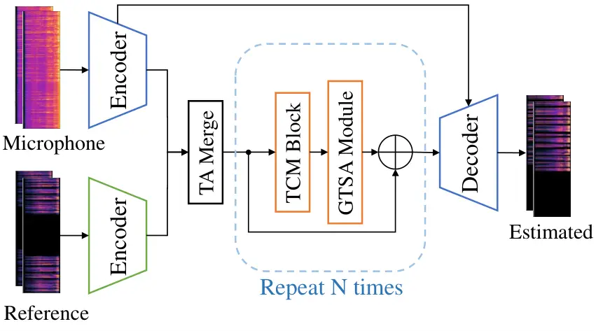
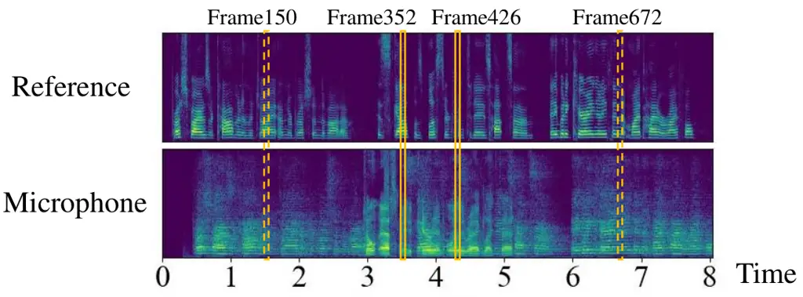
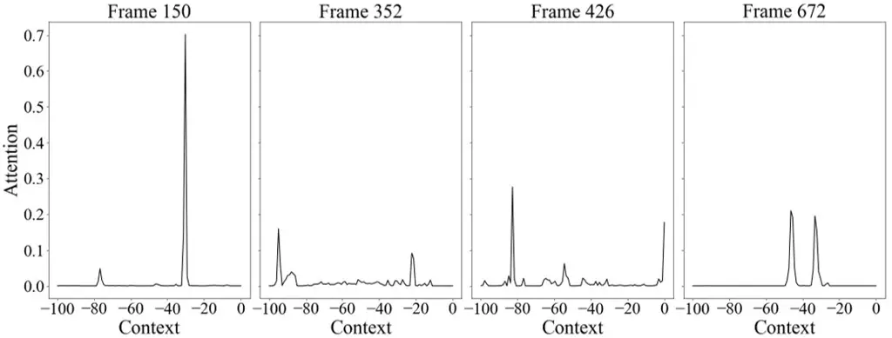
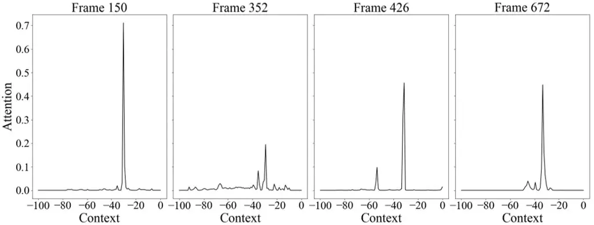

# REAL-TIME SPEECH ENHANCEMENT WITH DYNAMIC ATTENTION SPAN

Chengyu Zheng ^(†)^(†)thanks: \*Work was done during the internship at
MSRA.    Yuan Zhou    Xiulian Peng    Yuan Zhang    Yan Lu

###### Abstract

For real-time speech enhancement (SE) including noise suppression,
dereverberation and acoustic echo cancellation, the time-variance of the
audio signals becomes a severe challenge. The causality and memory usage
limit that only the historical information can be used for the system to
capture the time-variant characteristics. We propose to adaptively
change the receptive field according to the input signal in deep neural
network based SE model. Specifically, in an encoder-decoder framework, a
dynamic attention span mechanism is introduced to all the attention
modules for controlling the size of historical content used for
processing the current frame. Experimental results verify that this
dynamic mechanism can better track time-variant factors and capture
speech-related characteristics, benefiting to both interference removing
and speech quality retaining.

###### Index Terms: 

speech enhancement, acoustic echo cancellation, noise suppression,
time-variance, attention

^(†)^(†)address: ^(†)Communication University of China, Beijing, China  
^(‡)Microsoft Research Asia, Beijing, China

## 1 Introduction

Acting as a preprocessor in teleconferencing, speech enhancement (SE)
including noise suppression (NS), dereverberation and acoustic echo
cancellation (AEC), aims at removing interference, such as additive
noise, reverberation and acoustic echo. Real-time SE requires the
causality, limited memory usage and low computational complexity.
Causality means the system can only use the current and historical audio
frames when processing the current frame. Memory usage restricts the
model size and the historical content used. Computational complexity is
the runtime cost when running the SE system.

The time-variance of the audio signals recorded by the microphone
becomes a severe challenge for the real-time SE, since the causality and
memory usage constrains the system to capture the time-variant
characteristics only from the limited historical information. The
challenging cases frequently happen in the varying time delay between
microphone and reference signals and the changing acoustic environments.
To handle this challenge, the traditional SE methods utilize adaptive
filters to trace the time-variant factors \[1, 2\] and some recent
methods propose to use deep neural networks (DNN) for leveraging their
powerful nonlinear modeling capacity, either cascading them as a
post-filter after the adaptive filters for further removing the residual
echo and noise \[3, 4, 5, 6, 7\], or using them in an end-to-end way to
directly model the mapping between the microphone signal and the target
clean speech \[8, 9, 10, 11, 12\]. However, the size of historical
content used for processing each input frame are fixed due to the
weights and receptive field of the DNN are usually frozen during
inference, which makes the model can not explicitly capture the
time-variant characteristics including both the environmental
interference and speech-related features.

In this paper, we propose to explicitly capture the time-variance by
generating the input-adaptive receptive field for the DNN-based SE
model. The SE model consists of two individual encoders, one temporal
attention (TA) merge module, one decoder and several repeated modules
inserted in-between them (Fig. 1). The repeated module contains a
temporal convolution module (TCM) and a group-wise self-attention (GTSA)
module. A dynamic attention span (DAS) is introduced to all the
attention modules to adaptively change the receptive field according to
each input frame. To save the memory usage, we constrain the DAS within
a fixed size instead of all the historical frames. Experimental results
show that DAS leads to better performance on time-variant scenarios and
on both NS and AEC tasks but with less computational complexity,
comparing with the fixed attention span models and other benchmarks.

## 2 Proposed Methods

### 2.1 Problem Formulation

The near-end speech signal $`s(t)`$ is recorded by the microphone via
the acoustic path $`h_{1}(t)`$. The reference signal $`x(t)`$ played by
the near-end loudspeaker gets nonlinear distortions $`f_{\rm{NL}}`$, for
example loudspeaker and possible processing distortions, and is also
recorded via the acoustic echo path $`h_{2}(t)`$. Thus, the time-variant
microphone signal $`y(t)`$ is modeled as:

```math
y(t)=h_{1}(t)*s(t)+h_{2}(t)*f_{\rm{NL}}\left[x(t-\Delta_{t})\right]+n(t), \tag{1}
```

where $`*`$ denotes convolution, $`\Delta_{t}`$ is the time-variant
delay between the reference and microphone signals, $`h_{1}(t)`$ and
$`h_{2}(t)`$ are the room impulse response (RIR) which can be
represented as the summation of impulse responses for the direct sound,
early and late reflection, and $`n(t)`$ is the additive noise. In this
paper, the NS task aims at removing $`n(t)`$, the AEC task aims at
removing the echo generated from $`x(t)`$, and the dereverberation task
aims at removing the early and late reflection generated by
$`h_{1}(t)`$.



Figure 1: Overall architecture. $`N`$ is set to 4.

### 2.2 Model Architecture

Fig. 1 shows the overall architecture of the proposed model, which
consists of two individual encoders, one TA merge module, one decoder
and several repeated modules connecting between them. The model takes
the Short-time Fourier Transform (STFT) spectrums of both the microphone
$`\mathcal{Y}\in\mathbb{R}^{2\times T\times F}`$ and the reference
$`\mathcal{X}\in\mathbb{R}^{2\times T\times F}`$ signals as the inputs
and estimates the STFT spectrum of the near-end speech signal, where
$`T`$ is the number of time frames, $`F`$ is the number of frequency
bins. Each complex spectrum has real and imaginary parts.

Encoders and Decoder. The microphone and reference spectrums are input
to two individual encoders, respectively. The structure of the encoders
and decoder are the same as that in \[13\].

TA Merge Module. Due to the time-misalignment between reference and
microphone signals, temporal attention (TA) across the two signals is
introduced to explicitly capture the cross-correlations between them and
merge the features from dual pathways into one. Specifically, taken the
microphone feature
$`\mathcal{F}^{\rm{Mic}}\in\mathbb{R}^{C\times T\times F^{\prime}}`$ and
the reference feature
$`\mathcal{F}^{\rm{Ref}}\in\mathbb{R}^{C\times T\times F^{\prime}}`$
from two corresponding encoders, the TA is given by:

```math
\displaystyle\mathcal{F}^{Q}={\rm Reshape}({\rm Conv2D}^{Q}(\mathcal{F}^{{\rm Mic}})), \tag{2}
```

```math
\displaystyle\mathcal{F}^{k}={\rm Reshape}({\rm Conv2D}^{k}(\mathcal{F}^{{\rm Ref}})),k\in\{K,V\},
```

```math
\displaystyle\mathcal{F}^{TA}={\rm Softmax}({\rm Mask}(\mathcal{F}^{Q}\cdot(\mathcal{F}^{K})^{\rm tr}/\sqrt{F^{\prime}C}))\cdot\mathcal{F}^{V},
```

where $`\mathcal{F}^{k}\in\mathbb{R}^{T\times C^{\prime}}`$
($`k\in\{Q,K,V\}`$), and
$`\mathcal{F}^{TA}\in\mathbb{R}^{T\times C^{\prime}}`$, respectively.
$`\rm{Reshape}`$ denotes a tensor reshape from
$`\mathbb{R}^{C\times T\times F^{\prime}}`$ to
$`\mathbb{R}^{T\times C^{\prime}}`$ ($`C^{\prime}=F^{\prime}C`$).
$`{\rm Conv2D}`$ represents a 2-D convolutional layer with kernel size
of (1,1), stride of (1,1) and channel number of $`C`$, followed by a
batch normalization \[14\] and a parametric ReLU \[15\]. The
superscription $`\rm{tr}`$ means transposing the last two dimensions of
the tensor. $`\rm{Mask}`$ denotes the masking operation \[13\] with an
attention span of $`T_{w}`$ to keep causality and fix the largest
attention span to $`T_{w}`$.

Repeated Module. The repeated module contains a TCM defined in \[16\]
and a GTSA module \[13\], as depicted in the dotted box in Fig. 1. The
incorporation of the TCM and the GTSA module aims at capturing
long/short-term dependencies along the temporal dimension in parallel.

### 2.3 DAS Mechanism

DAS mechanism is introduced to all the attention modules (TA merge and
GTSA) to capture the time-variant factors by adjusting input-adaptive
receptive field. Inspired from \[17\], for input feature $`\bm{x}_{t}`$,
we compute a DAS $`z_{t}`$ indicating the historical frames used for
attention. This can be represented as:

```math
\displaystyle z_{t}=T_{w}\sigma(\bm{v}^{\rm tr}\bm{x}_{t}+b), \tag{3}
```

```math
\displaystyle m_{z_{t}}(t,r)={\rm min}\left[{\rm max}\left[\frac{1}{R}\left(R+z_{t}-(t-r)\right),0\right],1\right],
```

```math
\displaystyle a_{t,r}=\frac{m_{z}(t,r){\rm exp}(s_{t,r})}{\sum_{r=t-T_{w}+1}^{t}m_{z}(t,r){\rm exp}(s_{t,r})},
```

where the vector $`\bm{v}`$ and the scalar $`b`$ are learnable
parameters. In the TA merge module,
$`\bm{x}_{t}\in\mathbb{R}^{2C^{\prime}\times 1}`$ is obtained by
concatenating the reference and microphone features along the channel
dimension, and $`\bm{v}\in\mathbb{R}^{2C^{\prime}\times 1}`$. In the
GTSA module, $`\bm{x}_{t}\in\mathbb{R}^{C^{\prime}\times 1}`$ is the
output feature from the previous repeated module, and
$`\bm{v}\in\mathbb{R}^{C^{\prime}\times 1}`$. $`\sigma`$ denotes the
Sigmoid function mapping the value to the range of $`(0,1)`$ to
constrain $`z_{t}\in(0,T_{w})`$, so that the DAS is within a fixed size
instead of using all the historical frames. To keep causality and ensure
the gradient during back propagation, $`\rm{Mask}`$ in Equation (2) is
defined as a soft masking function $`m_{z}(t,r),t\geq r`$ for attention
with DAS. $`R`$ is a hyper-parameter that controls the softness.
$`s_{t,r}`$ denotes the similarity score between the query vector at
$`t`$-th frame and the key vector at $`r`$-th frame, and $`a_{t,r}`$
denotes the attention score after Softmax operation.

## 3 Experiment Settings

### 3.1 Datasets

We synthesize 1166.7 hours of audio samples for training and 9.7 hours
for validation, using speech and noise from the Interspeech 2021 DNS
Challenge and RIRs from the Interspeech 2021 AEC Challenge, as that
mentioned in \[13\]. The ratio of data for far-end single-talk (FST),
near-end single-talk (NST) and double-talk (DT) is 1:1:5.

For the AEC task, a synthetic test set \[13\] for ablation study and the
real-recorded blind test set of AEC Challenge ICASSP 2022 \[18\] are
used. For the NS task, 738 clips with the tag “Primary” from the blind
test set of Track-1 non-personalized DNS at DNS Challenge ICASSP 2022
\[19\] are used. All real-recorded clips are originally collected at a
sampling rate of 48 kHz and resampled to 16 kHz.

|              |                |                |                                      |                                     |          |             |
| ------------ | -------------- | -------------- | ------------------------------------ | ----------------------------------- | -------- | ----------- |
| Model        | DAS in         |                | ERLE                                 | PESQ                                | Para.(M) | MACs(M/sec) |
|              | TA             | GTSA           |                                      |                                     |          |             |
| Unprocessed  | -              | -              | -                                    | $`1.483`$                           | -        | -           |
| Baseline-Cat | $`\times`$     | $`\times`$     | $`39.220\pm 1.976`$                  | $`2.244\pm 0.033`$                  | 1.970    | 462.10      |
| Baseline-TA  | $`\times`$     | $`\times`$     | $`42.263\pm 2.036`$                  | $`2.182\pm 0.057`$                  | 1.974    | 465.64      |
| TA-DAS       | $`\checkmark`$ | $`\times`$     | $`43.946\pm 0.963`$                  | $`2.196\pm 0.049`$                  | 1.975    | $`<`$465.64 |
| GTSA-DAS     | $`\times`$     | $`\checkmark`$ | $`42.181\pm 1.461`$                  | $`\textbf{2.289}\pm\textbf{0.019}`$ | 1.975    | $`<`$465.64 |
| All-DAS      | $`\checkmark`$ | $`\checkmark`$ | $`\textbf{44.732}\pm\textbf{1.183}`$ | $`2.223\pm 0.051`$                  | 1.976    | $`<`$465.64 |

Table 1: Ablation study on AEC with time-variant factors.

|              |                                     |                                     |                                     |
| ------------ | ----------------------------------- | ----------------------------------- | ----------------------------------- |
| Model        | SIG                                 | BAK                                 | OVRL                                |
| Unprocessed  | $`{3.972}`$                         | $`2.043`$                           | $`2.344`$                           |
| Baseline-Cat | $`3.228\pm 0.012`$                  | $`4.026\pm 0.011`$                  | $`2.955\pm 0.011`$                  |
| Baseline-TA  | $`3.223\pm 0.013`$                  | $`4.037\pm 0.005`$                  | $`2.954\pm 0.011`$                  |
| TA-DAS       | $`3.238\pm 0.012`$                  | $`4.041\pm 0.009`$                  | $`2.971\pm 0.012`$                  |
| GTSA-DAS     | $`3.247\pm 0.014`$                  | $`4.046\pm 0.012`$                  | $`2.981\pm 0.013`$                  |
| All-DAS      | $`\textbf{3.259}\pm\textbf{0.011}`$ | $`\textbf{4.048}\pm\textbf{0.009}`$ | $`\textbf{2.993}\pm\textbf{0.013}`$ |

Table 2: Ablation study on NS.

### 3.2 Implementation Details and Baselines

The implementation details are similar to \[13\]. All signals are
transformed to time-frequency domain using a 20-ms Hanning window, 10-ms
overlap and 320-point DFT. The fixed-size attention span $`T_{w}`$ is
set to 100, and the hyper-parameter $`R`$ is set to 2. All models are
trained for 100 epochs with a batch size of 200. For the NS task, the
input signal of the reference encoder is set to zero, so that the model
can adapt for both NS and AEC tasks. Ablation experiments are conducted
on the following five configurations:

\(1\) Baseline-Cat: baseline model mentioned in \[13\].

\(2\) Baseline-TA: proposed model with a fixed-size attention span
$`T_{w}`$ in both TA merge and GTSA modules.

\(3\) TA-DAS: proposed model with DAS only in the TA merge module.

\(4\) GTSA-DAS: proposed model with DAS only in all GTSA modules.

\(5\) All-DAS: proposed model with DAS in both TA merge module and all
GTSA modules.

### 3.3 Evaluation Metrics

For the synthetic test set, the echo return loss enhancement (ERLE)
\[20\] is used for FST periods and the perceptual evaluation of speech
quality (PESQ) \[21\] is used for DT periods.

For the real-recorded test sets, we use the AECMOS tool \[22\] with
regards to echo ratings (ECHO) and other degradation ratings (OTHER),
and DNSMOS tool \[23\] with regards to speech degradation (SIG), noise
suppression (BAK) and the overall quality (OVRL) to evaluate all the
methods.

## 4 Experimental Results

### 4.1 Ablation Study

Table 1 shows the results on the AEC synthetic test set. Fig. 2 shows
the evaluation metrics under time-invariant/variant scenarios. We have
following conclusions: (1) Baseline-TA significantly outperforms
Baseline-Cat on ERLE metric in all time-variant cases, indicating that
TA merge module helps the model to better remove the time-variant echo.
However, the PESQ metric of Baseline-TA decreases in both
time-invariant/variant cases, indicating that only introducing TA merge
module is not enough for balancing the echo cancellation and speech
quality retaining. (2) On top of Baseline-TA, introducing DAS to the TA
merge module slightly brings gains on both ERLE and PESQ. (3) The
GTSA-DAS model keeps the stable improvement of Baseline-TA on ERLE and
shows much better PESQ. This indicates that introducing DAS to the GTSA
module enhances the model on capturing more speech-related time-variant
characteristics, which leads to better near-end speech quality in DT
scenario. (4) All-DAS model obtains the largest ERLE in all these cases
among all the models, while the PESQ degrades compared with the GTSA-DAS
model. These show that introducing DAS to TA and GTSA simultaneously can
significantly improves the echo cancellation but with this simple
cascading of DAS-enabled TA and GTSA might not add up to their
respective advantages on speech quality retaining in AEC task.

Figure 2: ERLE and PESQ results of different scenarios on the synthetic
test set. For the time-invariant, variant-delay-only, variant-RIR-only
and variant-delay-and-RIR scenarios, the PESQ values of the unprocessed
signals are 1.548, 1.455, 1.462, 1.464, respectively.



(a) From top to bottom are log-power spectrograms of the reference and
microphone signals, respectively.



(b) Attention scores of the TA merge module in Baseline-TA.



(c) Attention scores of the TA merge module in All-DAS model. From left
to right, the attention spans are 74.59, 89.90, 84.40 and 68.27,
respectively.

Figure 3: Visualization of the TA merge module attention patterns.

Table 2 shows the results on the NS blind test set. Different from AEC,
introducing DAS to all the attention modules (All-DAS) simultaneously
shows the best result, which verifies that the DAS mechanism can bring
stable benefit for removing additive environmental noise.

The total algorithmic latency of all the models is 30 ms. On top of
Baseline-TA, introducing DAS slightly increases the model parameters,
but decreases the computational complexity (Table 1).

### 4.2 Impact of DAS

To explore how the DAS brings benefit to the model, we synthesize an
input-pair of the reference and microphone signals with 300-ms delay
(i.e. 30 frames in the spectrum) and visualize the attention patterns of
TA merge module for 4 picked frames. As shown in Fig. 3 (a), frame 150
and frame 672 are from FST (highlighted in dotted boxes), and frame 352
and frame 426 are from DT (highlighted in solid boxes). Fig. 3 (b) and
(c) show the corresponded attention scores of the TA merge module in the
Baseline-TA and All-DAS models, respectively. The ERLE and PESQ metrics
are 63.34 and 2.35 for the Baseline-TA model, and 63.95 and 2.71 for the
All-DAS model. The value with a negative symbol in the X-axis denotes
the temporal distance between the historical and current frames. The
Y-axis shows the attention score.

For the FST scenario like frame 150, the maximum attention score appears
at the $`-30^{th}`$ frame (equals to the time delay between the two
signals) in both the Baseline-TA and All-DAS models, indicating that TA
attends to the most related frame from the reference signal for the
current microphone frame. However, in frame 672, TA with fixed attention
span has two significant peaks in the attention score, while TA with DAS
still mainly attends to the $`-30^{th}`$ frame. For the more challenging
DT scenario (frames 352 and 426), TA with DAS can still accurately
attend to the frame at 300 ms before while Baseline-TA gets confusing
attention distributions. These verify that by adjusting the receptive
field, DAS improves the accuracy and stability of attention module on
capturing the cross-correlations between two signals.

Table 3 shows the attention span in different channel groups of the last
GTSA module in the All-DAS model. With the structure of channel
grouping, the DAS gives the model different temporal dependencies in
different channel groups. For example, for frame 352, the G1 and G3 give
short attention span, while the G2, G4 and G5 give relatively long. This
observation indicates that the GTSA-DAS can adjust the receptive field
at different channels automatically, which shows the potential of the
module to be further designed as a foundational component of the DNNs on
audio processing for its adaptive short/long-term feature capturing
ability.

|           |       |        |       |        |        |
| --------- | ----- | ------ | ----- | ------ | ------ |
| Group     | G1    | G2     | G3    | G4     | G5     |
| Frame 150 | 0.00  | 100.00 | 94.88 | 99.94  | 100.00 |
| Frame 352 | 27.93 | 100.00 | 32.01 | 99.98  | 99.98  |
| Frame 426 | 92.94 | 100.00 | 23.08 | 100.00 | 99.98  |
| Frame 672 | 99.43 | 100.00 | 55.64 | 99.76  | 99.99  |

Table 3: Attention span in different groups of the last GTSA module in
the All-DAS model.

|              |        |       |       |       |       |          |
| ------------ | ------ | ----- | ----- | ----- | ----- | -------- |
| Methods      | FST    |       | DT    |       | NST   | Para.(M) |
|              | ERLE   | ECHO  | ECHO  | OTHER | OTHER |          |
| Unprocessed  | -      | 2.046 | 1.812 | 4.110 | 3.940 | -        |
| SpeexDSP     | 11.319 | 2.846 | 2.853 | 4.154 | 4.081 | -        |
| NSNet        | 55.059 | 4.519 | 4.235 | 3.558 | 4.110 | 1.30     |
| DTLN-AEC (S) | 32.691 | 4.204 | 3.917 | 3.499 | 3.916 | 1.8      |
| DTLN-AEC (M) | 33.004 | 4.292 | 4.046 | 3.601 | 4.012 | 3.9      |
| DTLN-AEC (L) | 37.918 | 4.351 | 4.236 | 3.687 | 4.026 | 10.4     |
| All-DAS      | 60.107 | 4.662 | 4.620 | 3.912 | 3.943 | 1.976    |

Table 4: Comparison on the AEC real-recorded blind test set.

### 4.3 Comparison with Other Methods

Table 4 shows the results on the ICASSP 2022 AEC challenge blind test
set of different methods. SpeexDSP¹¹ 1
https://github.com/xiongyihui/speexdsp-python is a non-DNN-based method.
NSNet²² 2 https://github.com/microsoft/AEC-Challenge is the baseline
model at AEC Challenge ICASSP 2022, and DTLN-AEC³³ 3
https://github.com/breizhn/DTLN-aec \[8\] is one of the top-5 models at
AEC Challenge ICASSP 2021.

From the results, we find that compared to All-DAS model: (1) SpeexDSP
fails to cancel the echo for its limited nonlinear modeling ability. (2)
NSNet outperforms most methods in NST but losses the effectiveness in
DT, indicating that NSNet fails to accurately capture the target
speech-related characteristics to keep the balance between echo
cancelling and speech retaining. (3) DTLN-AEC tends to preserve both the
far-end and near-end signals with strong echo leaking.

## 5 Conclusions

In this paper, we propose to introduce DAS mechanism into the attention
module for DNN-based real-time SE. Experimental results show that model
with DAS can better track time-variant factors and capture
speech-related characteristics from the input audio, benefiting to both
interference removing and speech quality retaining. Also, the DAS
improves the TA merge module to accurately capture time-variant
correlations between the reference and microphone signals, especially
for better robustness on the AEC task. The input-adaptive receptive
field enables the GTSA module to dynamically capture the long/short-term
dependencies in parallel.

## References

- \[1\] Simon Haykin, Adaptive Filter Theory: International Edition (5th
  ed.), Pearson, 2014.
- \[2\] Chi-Chou Kao, “Design of echo cancellation and noise elimination
  for speech enhancement,” IEEE Transactions on Consumer Electronics,
  vol. 49, no. 4, pp. 1468–1473, 2003.
- \[3\] Xiaofeng Shu, Yehang Zhu, Yanjie Chen, Li Chen, Haohe Liu,
  Chuanzeng Huang, and Yuxuan Wang, “Joint echo cancellation and noise
  suppression based on cascaded magnitude and complex mask estimation,”
  arXiv preprint arXiv:2107.09298, 2021.
- \[4\] Jean-Marc Valin, Srikanth Tenneti, Karim Helwani, Umut Isik, and
  Arvindh Krishnaswamy, “Low-complexity, real-time joint neural echo
  control and speech enhancement based on percepnet,” in ICASSP
  2021-2021 IEEE International Conference on Acoustics, Speech and
  Signal Processing (ICASSP). IEEE, 2021, pp. 7133–7137.
- \[5\] Renhua Peng, Linjuan Cheng, Chengshi Zheng, and Xiaodong Li,
  “Acoustic echo cancellation using deep complex neural network with
  nonlinear magnitude compression and phase information.,” in
  Interspeech, 2021, pp. 4768–4772.
- \[6\] Xingwei Sun, Chenbin Cao, Qinglong Li, Linzhang Wang, and Fei
  Xiang, “Explore relative and context information with transformer for
  joint acoustic echo cancellation and speech enhancement,” in ICASSP
  2022-2022 IEEE International Conference on Acoustics, Speech and
  Signal Processing (ICASSP). IEEE, 2022, pp. 9117–9121.
- \[7\] Guochang Zhang, Libiao Yu, Chunliang Wang, and Jianqiang Wei,
  “Multi-scale temporal frequency convolutional network with axial
  attention for speech enhancement,” in ICASSP 2022-2022 IEEE
  International Conference on Acoustics, Speech and Signal Processing
  (ICASSP). IEEE, 2022, pp. 9122–9126.
- \[8\] Nils L Westhausen and Bernd T Meyer, “Acoustic echo cancellation
  with the dual-signal transformation LSTM network,” in ICASSP 2021-2021
  IEEE International Conference on Acoustics, Speech and Signal
  Processing (ICASSP). IEEE, 2021, pp. 7138–7142.
- \[9\] Shimin Zhang, Yuxiang Kong, Shubo Lv, Yanxin Hu, and Lei Xie,
  “F-T-LSTM based complex network for joint acoustic echo cancellation
  and speech enhancement,” in Proc. Interspeech 2021, 2021, pp.
  4758–4762.
- \[10\] Karn N Watcharasupat, Thi Ngoc Tho Nguyen, Woon-Seng Gan,
  Shengkui Zhao, and Bin Ma, “End-to-end complex-valued multidilated
  convolutional neural network for joint acoustic echo cancellation and
  noise suppression,” in ICASSP 2022-2022 IEEE International Conference
  on Acoustics, Speech and Signal Processing (ICASSP). IEEE, 2022, pp.
  656–660.
- \[11\] Meng Yu, Yong Xu, Chunlei Zhang, Shi-Xiong Zhang, and Dong Yu,
  “NeuralEcho: A self-attentive recurrent neural network for unified
  acoustic echo suppression and speech enhancement,” arXiv preprint
  arXiv:2205.10401, 2022.
- \[12\] Fan Cui, Liyong Guo, Wenfeng Li, Peng Gao, and Yujun Wang,
  “Multi-scale refinement network based acoustic echo cancellation,” in
  ICASSP 2022-2022 IEEE International Conference on Acoustics, Speech
  and Signal Processing (ICASSP). IEEE, 2022, pp. 9132–9136.
- \[13\] Chengyu Zheng, Yuan Zhou, Xiulian Peng, Yuan Zhang, and Yan Lu,
  “Time-variance aware dynamic kernel generation for real-time acoustic
  echo cancellation,” IEEE Signal Processing Letters, vol. 29, pp.
  967–971, 2022.
- \[14\] Sergey Ioffe and Christian Szegedy, “Batch normalization:
  Accelerating deep network training by reducing internal covariate
  shift,” in International conference on machine learning. PMLR, 2015,
  pp. 448–456.
- \[15\] Kaiming He, Xiangyu Zhang, Shaoqing Ren, and Jian Sun, “Delving
  deep into rectifiers: Surpassing human-level performance on imagenet
  classification,” in Proceedings of the IEEE international conference
  on computer vision, 2015, pp. 1026–1034.
- \[16\] Ashutosh Pandey and DeLiang Wang, “TCNN: Temporal convolutional
  neural network for real-time speech enhancement in the time domain,”
  in ICASSP 2019-2019 IEEE International Conference on Acoustics, Speech
  and Signal Processing (ICASSP). IEEE, 2019, pp. 6875–6879.
- \[17\] Sainbayar Sukhbaatar, Édouard Grave, Piotr Bojanowski, and
  Armand Joulin, “Adaptive attention span in transformers,” in
  Proceedings of the 57th Annual Meeting of the Association for
  Computational Linguistics, 2019, pp. 331–335.
- \[18\] Ross Cutler, Ando Saabas, Tanel Parnamaa, Marju Purin, Hannes
  Gamper, Sebastian Braun, Karsten Sorensen, and Robert Aichner, “ICASSP
  2022 acoustic echo cancellation challenge,” in ICASSP 2022, 2022.
- \[19\] Harishchandra Dubey, Vishak Gopal, Ross Cutler, Sergiy
  Matusevych, Sebastian Braun, Emre Sefik Eskimez, Manthan Thakker,
  Takuya Yoshioka, Hannes Gamper, and Robert Aichner, “ICASSP 2022 deep
  noise suppression challenge,” in ICASSP, 2022.
- \[20\] Gerald Enzner, Herbert Buchner, Alexis Favrot, and Fabian
  Kuech, “Acoustic echo control,” in Academic press library in signal
  processing, vol. 4, pp. 807–877. Elsevier, 2014.
- \[21\] ITUT Rec, “P. 862.2: Wideband extension to recommendation P.
  862 for the assessment of wideband telephone networks and speech
  codecs,” International Telecommunication Union, CH–Geneva, 2005.
- \[22\] Marju Purin, Sten Sootla, Mateja Sponza, Ando Saabas, and Ross
  Cutler, “AECMOS: A speech quality assessment metric for echo
  impairment,” in ICASSP 2022-2022 IEEE International Conference on
  Acoustics, Speech and Signal Processing (ICASSP). IEEE, 2022, pp.
  901–905.
- \[23\] Chandan KA Reddy, Vishak Gopal, and Ross Cutler, “DNSMOS: A
  non-intrusive perceptual objective speech quality metric to evaluate
  noise suppressors,” in ICASSP 2021 IEEE International Conference on
  Acoustics, Speech and Signal Processing (ICASSP). IEEE, 2021, pp.
  6493–6497.
