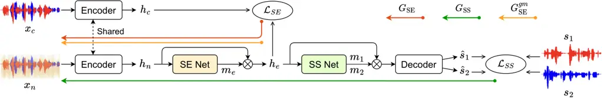
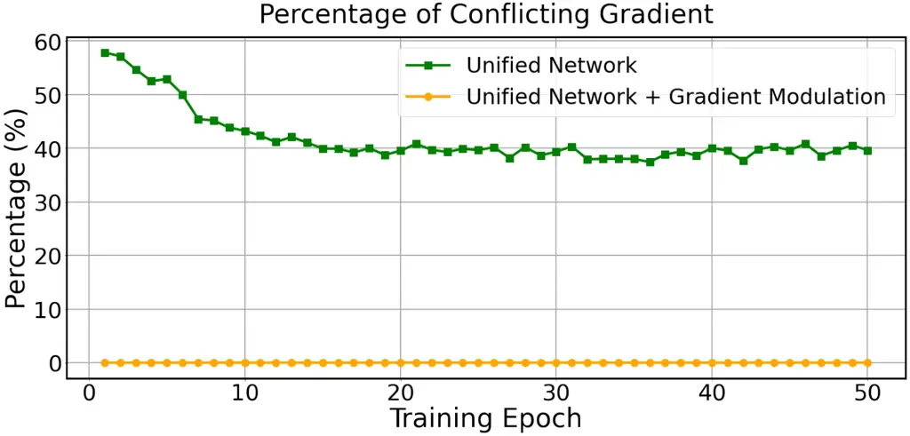
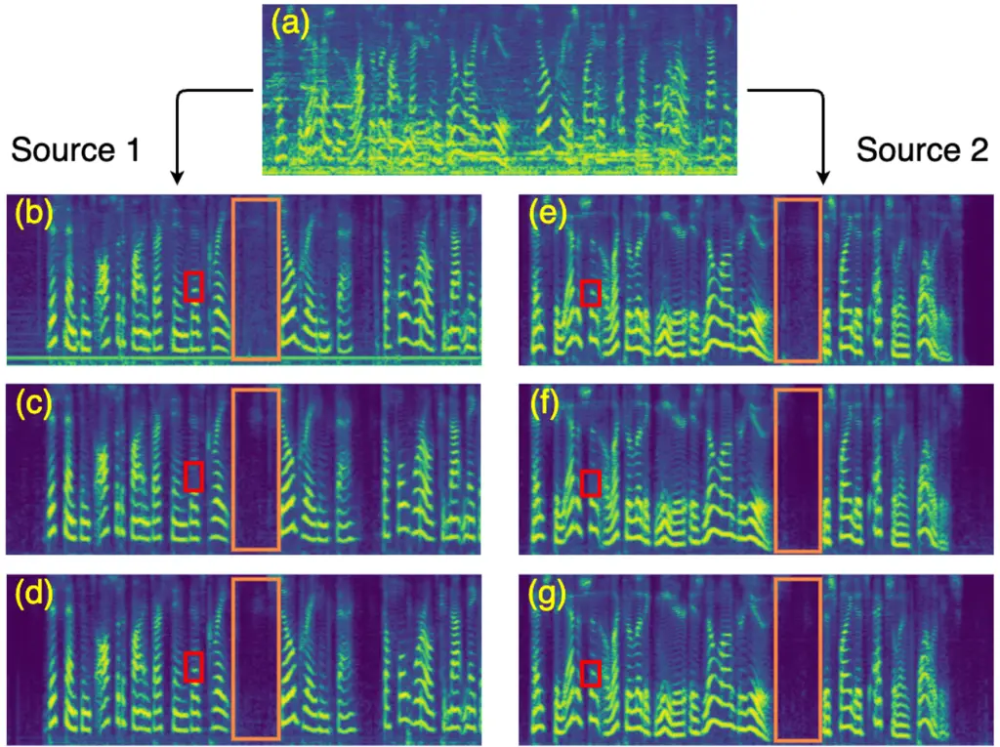

# Unifying Speech Enhancement and Separation with Gradient Modulation for End-to-End Noise-Robust Speech Separation

Yuchen Hu    Chen Chen    Heqing Zou    Xionghu Zhong    Eng Siong Chng

###### Abstract

Recent studies in neural network-based monaural speech separation (SS)
have achieved a remarkable success thanks to increasing ability of long
sequence modeling. However, they would degrade significantly when put
under realistic noisy conditions, as the background noise could be
mistaken for speaker’s speech and thus interfere with the separated
sources. To alleviate this problem, we propose a novel network to unify
speech enhancement and separation with gradient modulation to improve
noise-robustness. Specifically, we first build a unified network by
combining speech enhancement (SE) and separation modules, with
multi-task learning for optimization, where SE is supervised by parallel
clean mixture to reduce noise for downstream speech separation.
Furthermore, in order to avoid suppressing valid speaker information
when reducing noise, we propose a gradient modulation (GM) strategy to
harmonize the SE and SS tasks from optimization view. Experimental
results show that our approach achieves the state-of-the-art on
large-scale Libri2Mix- and Libri3Mix-noisy datasets, with SI-SNRi
results of 16.0 dB and 15.8 dB respectively. Our code is available at
GitHub¹¹ 1
[https://github.com/YUCHEN005/Unified-Enhance-Separation](https://github.com/YUCHEN005/Unified-Enhance-Separation).

###### Index Terms: 

Unify speech enhancement and separation, gradient modulation,
noise-robust speech separation, multi-task learning, end-to-end network

^(†)^(†)address: ¹School of Computer Science and Engineering, Nanyang
Technological University, Singapore  
²College of Computer Science and Electronic Engineering, Hunan
University, China

## 1 Introduction

Recent progress in neural network-based monaural speech separation (SS)
has achieved a remarkable success in time-domain methods \[1, 2, 3, 4,
5\], thanks to the increasing long sequence modeling ability of dilated
CNN, RNN and Transformer \[6\]. As a result, the time-domain methods
outperform conventional time-frequency domain methods and achieve
state-of-the-art on various benchmarks.

However, their performance would degrade significantly when put under
the real-world noisy conditions. The reason could be that some
background noise is mistaken for speaker’s speech and thus interferes
with the separated sources \[7\], just like we humans also get confused
under noisy mixture scenes. Current studies on end-to-end noise-robust
speech separation are quite limited.

Speech enhancement (SE) \[8\] has been proved effective in reducing
noise from the noisy speech to improve speech quality for many
downstream tasks, e.g., automatic speech recognition \[9, 10, 11, 12,
13, 14\], with multi-task learning to make full use of the clean
supervision information \[15\]. Nevertheless, such joint network could
also bring another over-suppression problem \[16, 17\] where SE
suppresses some important speech information together with the
background noise, resulting in sub-optimal performance for downstream
tasks. From the optimization view, there could exist conflicts between
the gradients of SE task and downstream tasks, which would hinder the
multi-task learning and degrade the downstream task performance.

In this paper, we propose a novel network to unify speech enhancement
and separation with gradient modulation for end-to-end noise-robust
speech separation. Specifically, we first build a unified network by
combining speech enhancement and separation modules, where the front-end
SE serves to reduce noise for back-end speech separation. Multi-task
learning strategy is employed to make full use of the supervision
information in parallel clean mixture, which is available in most
benchmark datasets since they usually create noisy mixtures by
simulation. Furthermore, in order to avoid suppressing valid speaker
information when reducing noise, we propose a gradient modulation (GM)
strategy to harmonize the SE and SS tasks from optimization view.
Experimental results indicate that our proposed approach improves the
noise-robustness of speech separation model and significantly
outperforms the previous state-of-the-arts. To the best of our
knowledge, this is the first exploration to unify speech enhancement and
separation with harmonized multi-task learning.



Figure 1: The overall architecture of our proposed unified network,
which consists of encoder, SE network, SS network and decoder. The
$`x_{n}`$ denotes noisy mixture, $`x_{c}`$ denotes parallel clean
mixture, $`s_{1}`$ and $`s_{2}`$ denote the target sources. The
$`\bm{G}`$ denotes gradient.

## 2 Proposed Method

### 2.1 System Overview

In this work, we first build a unified network in Figure 1 with
multi-task learning for optimization, where the SE module is supervised
by parallel clean mixture to reduce noise for back-end speech
separation. However, we observe that apart from noise, the SE module can
also suppress some valid speaker information, i.e., over-suppression
problem \[16\], which may degrade the downstream SS performance. From
the optimization view, there exists some conflicts between the gradients
of SE and SS tasks, which would hinder the multi-task learning and
finally lead to sub-optimal SS performance. To this end, we propose a
gradient modulation strategy to harmonize the two task gradients and
thus alleviate the over-suppression problem.

### 2.2 Unified Network

#### 2.2.1 Architecture

Inspired by the popular mask-learning framework \[1, 2, 3, 4\], we
design a unified network that consists of an encoder, a speech
enhancement (SE) network, a speech separation (SS) network and a
decoder, as shown in Figure 1. The encoder first learns deep
representations of the input mixtures. The SE network then learns a mask
to filter out background noise, followed by SS network to predict
multiple masks to separate different sources in the mixture. Finally,
the decoder reconstructs the separated speech in the time domain.

Encoder. The encoder takes in the time-domain noisy mixture
$`x_{n}\in\mathbb{R}^{T}`$ and learns a STFT-like representation
$`h_{n}\in\mathbb{R}^{F\times T^{\prime}}`$ using a convolutional layer.
The same process is done for the parallel clean mixture
$`x_{c}\in\mathbb{R}^{T}`$, generating a clean representation
$`h_{c}\in\mathbb{R}^{F\times T^{\prime}}`$ to supervise speech
enhancement task:

```math
\begin{split}h_{n}&=\text{ReLU}(\text{Conv1d}(x_{n})),\\
h_{c}&=\text{ReLU}(\text{Conv1d}(x_{c})),\end{split} \tag{1}
```

Speech Enhancement (SE) Network. The SE network takes in the noisy
mixture representation $`h_{n}`$ and learns a mask $`m_{e}`$ to filter
out background noise, resulting in enhanced mixture representation
$`h_{e}`$:

```math
\begin{split}m_{e}&=\text{SE-Net}(h_{n}),\\
h_{e}&=m_{e}\cdot h_{n},\end{split} \tag{2}
```

where the SE network follows the same architecture as SS network
described in Figure 3. In particular, SE network is a special case of
the SS network where the number of separated sources is 1.

The generated $`h_{e}`$ is employed to calculate speech enhancement loss
by compared to the clean mixture representation $`h_{c}`$, and then it
will be sent into the SS network for source separation.

Speech Separation (SS) Network. Figure 3 illustrates the architecture of
SS network, which follows prior works like Dual-Path RNN \[2\] and
SepFormer \[3\]. It takes in the enhanced mixture representation
$`h_{e}`$ and predicts a mask $`m_{k}\in\{m_{1},m_{2},\dots,m_{C}\}`$
for each of $`C`$ sources in the mixture.

```math
\begin{split}m_{k}&=\text{SS-Net}(h_{e}),\\
\end{split} \tag{3}
```

As shown in Figure 3(a), the SS network first sends the input
representation $`h_{e}`$ into layer normalization and a linear layer
with output dimension $`F`$. Then, it creates overlapping chunks of size
$`K`$ by chopping up $`h_{e}`$ along the time axis with 50% overlap
between neighbors, resulting in an output
$`h^{\prime}_{e}\in\mathbb{R}^{F\times K\times S}`$, where $`K`$ is
chunk length and $`S`$ is the resulted number of chunks.

The representation $`h^{\prime}_{e}`$ then feeds the sequence modeling
block as illustrated in Figure 3(b), where we employ Dual-Path RNN
block \[2\] or SepFormer block \[3\] with dual-path structure to learn
both local and global contexts for long sequence modeling.

After that, the output
$`h^{\prime\prime}_{e}\in\mathbb{R}^{F\times K\times S}`$ is processed
by parametric ReLU (PReLU) activation \[18\] and a linear layer. The
output is denoted as
$`h^{\prime\prime\prime}_{e}\in\mathbb{R}^{(C\times F)\times K\times S}`$,
where $`C`$ is the number of sources. Following this, the overlap-add
scheme described in \[2\] is employed to obtain
$`h^{\prime\prime\prime\prime}_{e}\in\mathbb{R}^{(C\times F)\times T^{\prime}}`$.
This representation finally goes through two feed-forward layers and a
ReLU \[19\] activation to generate source masks, which are divided along
the channel dimension for each source $`k\in\{1,2,\dots,C\}`$.

Decoder. The decoder takes in the element-wise multiplication of source
mask $`m_{k}`$ and enhanced mixture representation $`h_{e}`$, and
reconstruct the separated speech in time-domain using a transposed
convolution layer with same kernel size and stride as the encoder. The
transformation is expressed as:

```math
\begin{split}\hat{s}_{k}&=\text{TransposeConv1d}(m_{k}*h_{e}),\end{split}\vskip-5.69046pt \tag{4}
```

where $`\hat{s}_{k}\in\mathbb{R}^{T}`$ is the separated speech for
source $`k`$.

#### 2.2.2 Multi-task Learning

We build two training objectives to optimize the unified network, i.e.,
SE loss and SS loss. Firstly, the SE loss is calculated via mean square
error (MSE) between enhanced and clean mixture representations, in order
to direct the SE network to produce better $`h_{e}`$ for separation,
making full use of the supervision information in clean mixture:

```math
\begin{split}\mathcal{L}_{\text{SE}}&=\frac{1}{FT^{\prime}}\|h_{e}-h_{c}\|_{2}^{2},\end{split} \tag{5}
```

where $`\|\cdot\|_{2}`$ denotes $`L_{2}`$ norm,
$`h_{e},h_{c}\in\mathbb{R}^{F\times T^{\prime}}`$, $`F`$ denotes the
embedding size and $`T^{\prime}`$ denotes the sequence length.

Secondly, the SS loss $`\mathcal{L}_{\text{SS}}`$ is calculated using
scale-invariant signal-to-noise ratio (SI-SNR) \[20\] via
utterance-level permutation invariant loss \[21\], following prior
works \[1, 2, 3\].

The entire system is optimized in an end-to-end manner via multi-task
learning strategy, where the overall training objective is formed as:
$`\mathcal{L}=\lambda_{\text{SE}}\cdot\mathcal{L}_{\text{SE}}+\mathcal{L}_{\text{SS}}`$,
where $`\lambda_{\text{SE}}`$ is a weighting parameter.

Figure 2: Block diagrams of gradient modulation: (a) If
$`\bm{G}_{\text{SE}}`$ conflicts with $`\bm{G}_{\text{SS}}`$ (i.e., the
angle between them is larger than $`90^{\circ}`$), we set the updated
$`\bm{G}^{gm}_{\text{SE}}`$ as the projection of $`\bm{G}_{\text{SE}}`$
on the normal plane of $`\bm{G}_{\text{SS}}`$, (b) If
$`\bm{G}_{\text{SE}}`$ is aligned with $`\bm{G}_{\text{SS}}`$, we set
$`\bm{G}^{gm}_{\text{SE}}`$ equals to $`\bm{G}_{\text{SE}}`$.

### 2.3 Gradient Modulation (GM)

From the back-propagation view, we denote the SE task gradient as
$`\bm{G}_{\text{SE}}=\nabla_{v}(\lambda_{\text{SE}}\cdot\mathcal{L}_{\text{SE}})`$,
and the SS task gradient as
$`\bm{G}_{\text{SS}}=\nabla_{v}\mathcal{L}_{\text{SS}}`$, where $`v`$
stands for model parameters. As shown in Figure 1,
$`\bm{G}_{\text{SE}}`$ goes back through SE network and encoder (red
arrow), and $`\bm{G}_{\text{SS}}`$ passes the entire system (green
arrow). Therefore, the front-end SE network and encoder would be
optimized by both gradients, so that the overall gradient can be
expressed as follows:

```math
\begin{split}\bm{G}=\bm{G}_{\text{SE}}+\bm{G}_{\text{SS}},\end{split} \tag{6}
```

However, we have observed some conflicts between the gradients
$`\bm{G}_{\text{SE}}`$ and $`\bm{G}_{\text{SS}}`$, i.e., the angle
between them is larger than $`90^{\circ}`$. It indicates that the SE
gradient is hindering, instead of assisting in, the optimization of SS
task, which is essentially the same as the over-suppression problem
described in Section 2.1.

To this end, we propose a gradient modulation (GM) strategy to harmonize
the two task gradients, as illustrated in Figure 2: (1) The angle
between $`\bm{G}_{\text{SE}}`$ and $`\bm{G}_{\text{SS}}`$ is larger than
$`90^{\circ}`$ (Figure 2(a)), which means they are conflicting and thus
the SE gradient will hinder the optimization of SS task. In this case,
we project $`\bm{G}_{\text{SE}}`$ to the normal plane of
$`\bm{G}_{\text{SS}}`$ to remove the conflict, which avoids increasing
the SS loss. (2) Their angle is smaller than $`90^{\circ}`$
(Figure 2(b)), which means there is no conflict between the two
gradients, so that we safely set the updated SE gradient
$`\bm{G}^{gm}_{\text{SE}}`$ as $`\bm{G}_{\text{SE}}`$. Therefore, our
gradient modulation strategy is mathematically formulated as:

```math
\bm{G}^{gm}_{\text{SE}}=\left\{\begin{array}[]{ll}\bm{G}_{\text{SE}}-\frac{\bm{G}_{\text{SE}}\cdot\bm{G}_{\text{SS}}}{\|\bm{G}_{\text{SS}}\|_{2}^{2}}\cdot\bm{G}_{\text{SS}},&\text{if}\hskip 5.69046pt\bm{G}_{\text{SE}}\cdot\bm{G}_{\text{SS}}<0\\
\bm{G}_{\text{SE}},&\text{otherwise}.\end{array}\right. \tag{7}
```

In particular, this strategy is conducted on the gradients of each layer
in SE network and encoder, which are flatten to 1-dimensional long
vectors in advance and reshaped back after modulation.

As a result, the two task gradients would harmony with each other after
modulation and promote the multi-task learning, where the auxiliary SE
task could effectively reduce noise to benefit the target SS task while
without suppressing valid speaker information. Finally, the overall
gradient is formulated as follows:

```math
\begin{split}\bm{G}^{gm}=\bm{G}^{gm}_{\text{SE}}+\bm{G}_{\text{SS}},\end{split}\vskip 2.84544pt \tag{8}
```

Figure 3: Block diagrams of speech separation (SS) network: (a) overall
architecture, (b) sequence modeling block.

## 3 Experiments and Results

### 3.1 Datasets

We conduct experiments on the large-scale benchmark Libri2Mix and
Libri3Mix \[22\] datasets²² 2
[https://github.com/JorisCos/LibriMix](https://github.com/JorisCos/LibriMix)
(noisy version) to evaluate our proposed approach, where all the
waveforms are sampled at 8 kHz.

Libri2Mix is a popular benchmark for speech separation, which contains
four partitions, i.e., train-360 (212 h), train-100 (58 h), dev (11 h)
and test (11 h), and in this work we only use the train-360 partition
for training. The mixtures are created by randomly mixing utterances of
two different speakers from LibriSpeech \[23\]. The noisy version is
created by adding noise samples from WHAM! \[24\] dataset, which
contains 82 hours of noise data recorded in coffee shops, restaurants
and bars. The resulting SNRs are normally distributed with a mean of -2
dB and a standard deviation of 3.6 dB.

Libri3Mix follows the same structure as Libri2Mix, i.e., train-360 (146
h), train-100 (40 h), dev (11 h) and test (11 h), where we only use the
train-360 partition for training in this work. The mixtures are created
with three different speakers from LibriSpeech, and the noisy version is
created similar to that of Libri2Mix.

### 3.2 Experimental Setup

#### 3.2.1 Network Configurations

Following prior works \[3, 4\], we employ 256 filters for the
convolution layer in encoder, with kernel size of 16 and stride of 8,
and decoder uses the same kernel size and stride as encoder.

The SE and SS networks in our system share the same architecture, which
process chunks of size $`K=250`$ with 50% overlap. In SE network, the
sequence modeling block contains 2 DPRNN blocks \[2\] using BLSTM \[25\]
with 256 units in each direction, or 2 SepFormer blocks \[3\] with 1
Transformer \[6\] layer in both IntraT and InterT. In SS network, the
sequence modeling block contains 6 DPRNN blocks using BLSTM with 256
units in each direction, or 2 SepFormer blocks with 8 Transformer layers
in IntraT and InterT, with the attention heads/feed-forward dimension
set to 8/1024.

#### 3.2.2 Training Details

We train 200 epochs for all models, where Adam algorithm \[26\] is used
for optimization, with initial learning rate of $`1.5e^{-4}`$. After 85
epochs with DPRNN (5 epochs with SepFormer), the learning rate is halved
if there is no improvement of validation performance for 5 consecutive
epochs. The batch size is set to 1. Gradient clipping is used to limit
the $`L_{2}`$ norm of gradients to 5. No dynamic mixing \[5\] strategy
is used for data augmentation. The weighting parameter
$`\lambda_{\text{SE}}`$ is set to 0.1. All hyper-parameters are tuned on
validation set.

|                       |              |           |           |
| --------------------- | ------------ | --------- | --------- |
| Method                | SI-SNRi (dB) | SDRi (dB) | \# Params |
| ConvTasNet \[1\]      | 12.0         | 12.4      | 5.1 M     |
| Dual-Path RNN\* \[2\] | 14.2         | 14.7      | 14.6 M    |
| SepFormer \[3\]       | 14.9         | 15.4      | 25.7 M    |
| Wavesplit \[5\]       | 15.1         | 15.8      | 29.0 M    |
| Ours (DPRNN)          | 15.4         | 16.0      | 19.7 M    |
| Ours (SepFormer)      | 16.0         | 16.5      | 29.2 M    |

Table 1: Comparison with the state-of-the-arts on Libri2Mix-noisy
dataset. “DPRNN” or “SepFormer” in brackets denotes the backbone of
sequence modeling block. \* denotes self-reproduced results.

|                       |              |           |           |
| --------------------- | ------------ | --------- | --------- |
| Method                | SI-SNRi (dB) | SDRi (dB) | \# Params |
| ConvTasNet \[1\]      | 10.4         | 10.9      | 5.1 M     |
| Wavesplit \[5\]       | 13.1         | 13.8      | 29.0 M    |
| Dual-Path RNN\* \[2\] | 14.0         | 14.4      | 14.7 M    |
| SepFormer \[3\]       | 14.3         | 14.8      | 25.7 M    |
| Ours (DPRNN)          | 15.4         | 15.9      | 19.7 M    |
| Ours (SepFormer)      | 15.8         | 16.4      | 29.2 M    |

Table 2: Comparison with the state-of-the-arts on Libri3Mix-noisy
dataset. \* denotes self-reproduced results.

### 3.3 Results

#### 3.3.1 Comparison with the State-of-the-Arts

|                     |            |            |            |            |                         |     |              |           |           |
| ------------------- | ---------- | ---------- | ---------- | ---------- | ----------------------- | --- | ------------ | --------- | --------- |
| Method              | SE Network |            | SS Network |            | $`\lambda_{\text{SE}}`$ | GM  | SI-SNRi (dB) | SDRi (dB) | \# Params |
|                     | \# DP / SF | \# RNN / T | \# DP / SF | \# RNN / T |                         |     |              |           |           |
| Dual-Path RNN \[2\] | \-         | \-         | 6          | 1          | \-                      | \-  | 14.2         | 14.7      | 14.6 M    |
| Ours (DPRNN)        | 2          | 1          | 4          | 1          | 0                       | ✗   | 14.5         | 15.0      | 14.9 M    |
|                     | 2          | 1          | 6          | 1          | 0                       | ✗   | 14.6         | 15.1      | 19.7 M    |
|                     | 2          | 1          | 6          | 1          | 0.1                     | ✗   | 14.8         | 15.4      | 19.7 M    |
|                     | 2          | 1          | 6          | 1          | 0.1                     | ✓   | 15.4         | 16.0      | 19.7 M    |
| SepFormer \[3\]     | \-         | \-         | 2          | 8          | \-                      | \-  | 14.9         | 15.4      | 25.7 M    |
| Ours (SepFormer)    | 2          | 1          | 2          | 7          | 0                       | ✗   | 15.2         | 15.7      | 26.0 M    |
|                     | 2          | 1          | 2          | 8          | 0                       | ✗   | 15.3         | 15.7      | 29.2 M    |
|                     | 2          | 1          | 2          | 8          | 0.1                     | ✗   | 15.5         | 16.0      | 29.2 M    |
|                     | 2          | 1          | 2          | 8          | 0.1                     | ✓   | 16.0         | 16.5      | 29.2 M    |

Table 3: Effect of unified network and gradient modulation in our
proposed approach with Libri2Mix-noisy dataset. “# DP / SF” denotes the
number of DPRNN or SepFormer blocks. “# RNN / T” denotes the number of
RNN or Transformer layers in each Intra-/Inter-RNN or
Intra-/Inter-Transformer. “GM” denotes whether use gradient modulation.
“# Params” denotes the total number of model parameters.

Table 1 compares our proposed approach with the best results of prior
works on Libri2Mix-noisy dataset. Our best system achieves the
state-of-the-art with a SI-SNR improvement (SI-SNRi) of 16.0 dB and a
Signal-to-Distortion Ratio improvement (SDRi) of 16.5 dB. Our system
with DPRNN and SepFormer backbones significantly outperform
corresponding baselines (14.2 dB$`\rightarrow`$15.4 dB, 14.9
dB$`\rightarrow`$16.0 dB), while only cost a bit more model parameters.

Table 2 compares our approach with prior works on Libri3Mix-noisy
dataset, where our best system achieves the state-of-the-art with
SI-SNRi result of 15.8 dB and SDRi of 16.4 dB.

As a result, our approach shows superior performance under noisy
conditions, for separation of both two and three speakers.

#### 3.3.2 Effect of Unified Network

We study the effect of unified network using Libri2Mix-noisy dataset in
Table 3. Compared to DPRNN baseline, our unified network with 2 DPRNN
blocks in SE network and 4 blocks in SS network achieves better SI-SNRi
result (14.2 dB$`\rightarrow`$14.5 dB) while without extra model
parameters, indicating that front-end SE can benefit the downstream SS
task. Further increasing the DPRNN blocks in SS network brings more
improvements (14.5 dB$`\rightarrow`$14.6 dB). Based on this, adding SE
loss for multi-task learning achieves higher SI-SNRi (14.6
dB$`\rightarrow`$14.8 dB), which benefits from the supervision
information in clean mixture. Similar improvements are observed on
SepFormer backbone.

#### 3.3.3 Effect of Gradient Modulation



Figure 4: Percentage% of conflicting gradient in all layers of SE
network and encoder during training stage on Libri2Mix-noisy dataset.
The percentage value of each epoch is obtained by averaging all the
batches in it. We use SepFormer as backbone and present the first 50
epochs here (percentage value is stable in subsequent epochs).

To illustrate the effect of proposed gradient modulation strategy, we
present the percentage of conflicting gradient in all layers of SE
network and encoder in Figure 4. We observe that the unified network
with multi-task learning suffers a lot from gradient conflict (around
40%). In comparison, our gradient modulation strategy completely removes
the conflicts, and thus alleviates the over-suppression problem as
analyzed in Figure 5 and Section 3.3.4. As a result, we can observe
significant improvements of the final SI-SNRi performance, i.e., 14.8
dB$`\rightarrow`$15.4 dB, 15.5 dB$`\rightarrow`$16.0 dB, as shown in
Table 3.

#### 3.3.4 Visualization of Mixture and Separated Speech



Figure 5: Spectrums of mixture and separated speech: (a) noisy mixture;
separated source 1 in (b) SepFormer baseline, (c) our unified network,
(d) our unified network + GM; source 2 in (e) SepFormer baseline, (f)
our unified network, (g) our unified network + GM.

To further show the overall effect of our approach, we visualize the
spectrums of noisy mixture and separated speech using a test sample from
Libri2Mix-noisy dataset, as presented in Figure 5. We first observe a
lot of noise in the noisy mixture (a), which makes it difficult to
separate each target source. The SepFormer baseline separates the two
sources from mixture as presented in (b) and (e), while we can still
observe some noise in the separated speech (orange boxes). In
comparison, our unified network not only separates the two sources well,
but also reduces the background noise, as shown in (c) and (f). It
indicates that speech enhancement with clean supervision information can
effectively reduce noise for downstream speech separation. However, we
can also observe some loss of valid speaker information caused by SE,
i.e., over-suppression (red boxes). In comparison, our proposed gradient
modulation strategy can alleviate this problem by harmonizing SE and SS
tasks from optimization view, where some over-suppressed information is
recovered as indicated by the red boxes in (d) and (g). As a result, our
proposed approach can effectively improve the noise-robustness of speech
separation while avoid suppressing valid speaker information at the same
time.

## 4 Conclusion

In this paper, we propose a novel network to unify speech enhancement
and separation with gradient modulation for end-to-end noise-robust
speech separation. Specifically, we first build a unified network by
combining speech enhancement and separation modules, with multi-task
learning for optimization, where SE module is supervised by parallel
clean mixture to reduce noise for downstream speech separation.
Furthermore, in order to avoid suppressing valid speaker information
when reducing the noise, we propose a gradient modulation strategy to
harmonize the SE and SS tasks from optimization view. Experimental
results demonstrate that our proposed approach improves the
noise-robustness of speech separation model and achieves the
state-of-the-art on large-scale benchmarks.

## References

- \[1\] Yi Luo and Nima Mesgarani, “Conv-tasnet: Surpassing ideal
  time–frequency magnitude masking for speech separation,” IEEE/ACM
  transactions on audio, speech, and language processing, vol. 27, no.
  8, pp. 1256–1266, 2019.
- \[2\] Yi Luo, Zhuo Chen, and Takuya Yoshioka, “Dual-path rnn:
  efficient long sequence modeling for time-domain single-channel speech
  separation,” in ICASSP 2020-2020 IEEE International Conference on
  Acoustics, Speech and Signal Processing (ICASSP). IEEE, 2020, pp.
  46–50.
- \[3\] Cem Subakan, Mirco Ravanelli, Samuele Cornell, Mirko Bronzi, and
  Jianyuan Zhong, “Attention is all you need in speech separation,” in
  ICASSP 2021-2021 IEEE International Conference on Acoustics, Speech
  and Signal Processing (ICASSP). IEEE, 2021, pp. 21–25.
- \[4\] Cem Subakan, Mirco Ravanelli, Samuele Cornell, François Grondin,
  and Mirko Bronzi, “On using transformers for speech-separation,” arXiv
  preprint arXiv:2202.02884, 2022.
- \[5\] Neil Zeghidour and David Grangier, “Wavesplit: End-to-end speech
  separation by speaker clustering,” IEEE/ACM Transactions on Audio,
  Speech, and Language Processing, vol. 29, pp. 2840–2849, 2021.
- \[6\] Ashish Vaswani, Noam Shazeer, Niki Parmar, Jakob Uszkoreit,
  Llion Jones, Aidan N Gomez, Lukasz Kaiser, and Illia Polosukhin,
  “Attention is all you need,” in Advances in neural information
  processing systems, 2017, pp. 5998–6008.
- \[7\] Jitong Chen, Yuxuan Wang, and DeLiang Wang, “Noise perturbation
  for supervised speech separation,” Speech communication, vol. 78, pp.
  1–10, 2016.
- \[8\] Zhong-Qiu Wang, Peidong Wang, and DeLiang Wang, “Complex
  spectral mapping for single-and multi-channel speech enhancement and
  robust asr,” IEEE/ACM transactions on audio, speech, and language
  processing, vol. 28, pp. 1778–1787, 2020.
- \[9\] Dan Liu, Mengge Du, Xiaoxi Li, Yuchen Hu, and Lirong Dai, “The
  ustc-nelslip systems for simultaneous speech translation task at iwslt
  2021,” arXiv preprint arXiv:2107.00279, 2021.
- \[10\] Chen Chen, Yuchen Hu, Nana Hou, Xiaofeng Qi, Heqing Zou, and
  Eng Siong Chng, “Self-critical sequence training for automatic speech
  recognition,” in ICASSP 2022-2022 IEEE International Conference on
  Acoustics, Speech and Signal Processing (ICASSP). IEEE, 2022, pp.
  3688–3692.
- \[11\] Chen Chen, Nana Hou, Yuchen Hu, Shashank Shirol, and Eng Siong
  Chng, “Noise-robust speech recognition with 10 minutes unparalleled
  in-domain data,” in ICASSP 2022-2022 IEEE International Conference on
  Acoustics, Speech and Signal Processing (ICASSP). IEEE, 2022, pp.
  4298–4302.
- \[12\] Qiu-Shi Zhu, Jie Zhang, Zi-Qiang Zhang, Ming-Hui Wu, Xin Fang,
  and Li-Rong Dai, “A noise-robust self-supervised pre-training model
  based speech representation learning for automatic speech
  recognition,” in ICASSP 2022-2022 IEEE International Conference on
  Acoustics, Speech and Signal Processing (ICASSP). IEEE, 2022, pp.
  3174–3178.
- \[13\] Qiu-Shi Zhu, Jie Zhang, Zi-Qiang Zhang, and Li-Rong Dai, “Joint
  training of speech enhancement and self-supervised model for
  noise-robust asr,” arXiv preprint arXiv:2205.13293, 2022.
- \[14\] Qiu-Shi Zhu, Long Zhou, Jie Zhang, Shu-Jie Liu, Yu-Chen Hu, and
  Li-Rong Dai, “Robust data2vec: Noise-robust speech representation
  learning for asr by combining regression and improved contrastive
  learning,” arXiv preprint arXiv:2210.15324, 2022.
- \[15\] Ashutosh Pandey, Chunxi Liu, Yun Wang, and Yatharth Saraf,
  “Dual application of speech enhancement for automatic speech
  recognition,” in 2021 IEEE Spoken Language Technology Workshop (SLT).
  IEEE, 2021.
- \[16\] Yuchen Hu, Nana Hou, Chen Chen, and Eng Siong Chng,
  “Interactive feature fusion for end-to-end noise-robust speech
  recognition,” in ICASSP 2022-2022 IEEE International Conference on
  Acoustics, Speech and Signal Processing (ICASSP). IEEE, 2022, pp.
  6292–6296.
- \[17\] Yuchen Hu, Nana Hou, Chen Chen, and Eng Siong Chng, “Dual-path
  style learning for end-to-end noise-robust speech recognition,” arXiv
  preprint arXiv:2203.14838, 2022.
- \[18\] Kaiming He, Xiangyu Zhang, Shaoqing Ren, and Jian Sun, “Delving
  deep into rectifiers: Surpassing human-level performance on imagenet
  classification,” in Proceedings of the IEEE International Conference
  on Computer Vision (ICCV), December 2015.
- \[19\] Xavier Glorot, Antoine Bordes, and Yoshua Bengio, “Deep sparse
  rectifier neural networks,” in Proceedings of the fourteenth
  international conference on artificial intelligence and statistics.
  JMLR Workshop and Conference Proceedings, 2011, pp. 315–323.
- \[20\] Jonathan Le Roux, Scott Wisdom, Hakan Erdogan, and John R
  Hershey, “Sdr–half-baked or well done?,” in ICASSP 2019-2019 IEEE
  International Conference on Acoustics, Speech and Signal Processing
  (ICASSP). IEEE, 2019, pp. 626–630.
- \[21\] Morten Kolbæk, Dong Yu, Zheng-Hua Tan, and Jesper Jensen,
  “Multitalker speech separation with utterance-level permutation
  invariant training of deep recurrent neural networks,” IEEE/ACM
  Transactions on Audio, Speech, and Language Processing, vol. 25, no.
  10, pp. 1901–1913, 2017.
- \[22\] Joris Cosentino, Manuel Pariente, Samuele Cornell, Antoine
  Deleforge, and Emmanuel Vincent, “Librimix: An open-source dataset for
  generalizable speech separation,” arXiv preprint
  arXiv:2005.11262, 2020.
- \[23\] Vassil Panayotov, Guoguo Chen, Daniel Povey, and Sanjeev
  Khudanpur, “Librispeech: an asr corpus based on public domain audio
  books,” in 2015 IEEE international conference on acoustics, speech and
  signal processing (ICASSP). IEEE, 2015, pp. 5206–5210.
- \[24\] Gordon Wichern, Joe Antognini, Michael Flynn, Licheng Richard
  Zhu, Emmett McQuinn, Dwight Crow, Ethan Manilow, and Jonathan Le Roux,
  “Wham!: Extending speech separation to noisy environments,” Proc.
  Interspeech 2019, pp. 1368–1372, 2019.
- \[25\] Sepp Hochreiter and Jürgen Schmidhuber, “Long short-term
  memory,” Neural Computation, vol. 9, no. 8, pp. 1735–1780, 1997.
- \[26\] Diederik P. Kingma and Jimmy Ba, “Adam: A method for stochastic
  optimization,” arXiv preprint arXiv:1412.6980, 2014.
