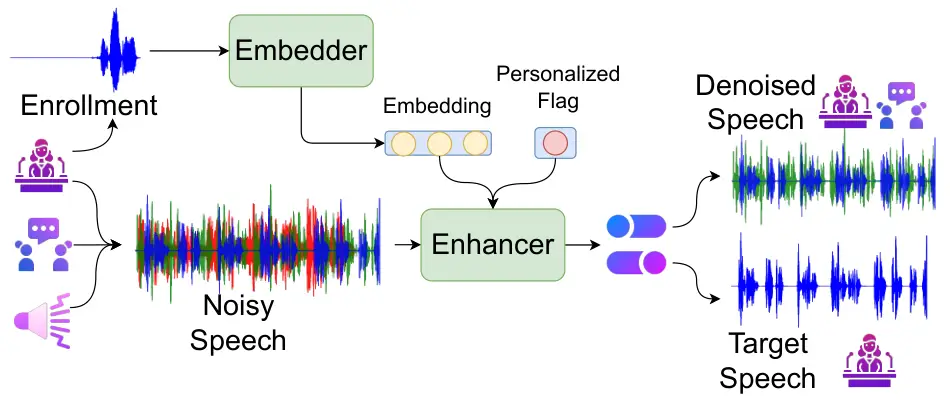
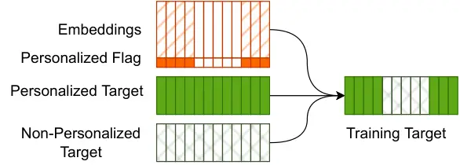

# A Framework for Unified Real-time Personalized and Non-Personalized Speech Enhancement

Zhepei Wang^(♯) \sthanksWork performed while at Amazon Web Services   
Ritwik Giri^(†)    Devansh Shah^(†)    Jean-Marc Valin^(†)    Michael M.
Goodwin^(†)    Paris Smaragdis^(♯†)

###### Abstract

In this study, we present an approach to train a single speech
enhancement network that can perform both personalized and
non-personalized speech enhancement. This is achieved by incorporating a
frame-wise conditioning input that specifies the type of enhancement
output. To improve the quality of the enhanced output and mitigate
oversuppression, we experiment with re-weighting frames by the presence
or absence of speech activity and applying augmentations to speaker
embeddings. By training under a multi-task learning setting, we
empirically show that the proposed unified model obtains promising
results on both personalized and non-personalized speech enhancement
benchmarks and reaches similar performance to models that are trained
specialized for either task. The strong performance of the proposed
method demonstrates that the unified model is a more economical
alternative compared to keeping separate task-specific models during
inference.

###### Index Terms: 

Speech enhancement, real-time communication, speaker identification,
multi-task learning, voice activity detection,

^(†)^(†)address: ^(†)Amazon Web Services  
^(♯)University of Illinois at Urbana-Champaign

## 1 Introduction

Online teleconference systems have become a preferred way of
communication in recent years when in-person meetings or conferences are
costly or infeasible. However, these remote conversations often take
place in a noisy environment, and it is challenging to preserve the
intelligibility of speech in the presence of ambient noise. To improve
the communication experience, speech enhancement techniques have become
pivotal in online meeting systems to filter out background noise and
improve speech quality. While advanced deep neural network architectures
have achieved state-of-the-art in offline speech enhancement tasks \[1,
2\], recent advances in speech enhancement have been focused on
efficient model designs that enable high-quality noise reduction in
real-time \[3, 4, 5, 6, 7\].

Despite their ability to clean up environmental noise, these systems are
not effective to remove human voices from the background. Consider a
customer service representative who answers phone calls in an open
office setting surrounded by a group of other talkers. Personalized
speech enhancement will be applicable to this scenario by extracting the
voice of this representative while suppressing all other speakers and
the background noise. Deep-learning-based personalized speech
enhancement systems usually involve, (i) a speaker embedder module that
provides cues for the speaker in interest; (ii) a speech enhancement
module to recover the target speech from the input mixture with ambiance
noise and interference. These modules can be learned either separately
\[8, 9, 10, 11\] or jointly with each other \[12, 13, 14, 15, 16, 17\].
With consideration of run-time complexity and memory usage, a number of
real-time personalized speech enhancement methods have shown promising
results in efficiently extracting the target speaker’s voice \[18, 19,
20, 21\].

While personalized speech enhancement systems provide an improved
conversation experience for the target user, non-personalized speech
enhancement systems are still required in a variety of use cases. For
instance, personalized systems are not applicable when the information
of the target speaker is unknown in advance. There are also scenarios in
which we need to preserve speech from all talkers in the same meeting
room. Even more challenging are the time-varying circumstances in which
we want to first perform non-personalized enhancement to allow the
speech of multiple speakers through, and switch later to focus on a
particular speaker with personalized enhancement. Conventionally, to
enable both personalized and non-personalized speech enhancement, we
train a separate model for each application. During inference, it
typically requires us to maintain both models in memory and choose the
appropriate network depending on the use cases. With the majority of
model components being identical between personalized and
non-personalized enhancement networks, it naturally brings in the
question of whether it is feasible to obtain a single enhancement model
for both tasks.

In this work, we present the Unified PercepNet (UPN), illustrated in
Fig. 1, which is trained with multi-task learning to achieve both
personalized and non-personalized speech enhancement. The UPN consists
of an embedder and an enhancer network. The enhancer is controlled by a
user-provided input that specifies the output behavior. When the
personalized mode is activated, the model is expected to attend to the
target speaker and clean up both background noise and any interference
speech; otherwise, it should behave as a non-personalized enhancement
model that suppresses only the environmental sound. All parameters of
the enhancement network are shared between both tasks. While the network
proposed in \[21\] can also perform both personalized and
non-personalized enhancement, our proposed method is distinct in the
perspectives of, (i) we train the model with personalized and
non-personalized data jointly instead of in separate stages; (ii) we
provide frame-wise personalized or non-personalized control to enable
switching of the enhancement mode within a single input sequence.

Additionally, we examine the effectiveness of several approaches to
improve the quality of enhancement. We consider using a loss function
with weight adjustment between voiced and unvoiced frames in the target
and applying data augmentation to the speaker embeddings to combat
oversuppression and overfitting. We evaluate the model’s performance on
both personalized and non-personalized tracks from the 4th Deep Noise
Suppression Challenge \[22\] using an identical model for both tasks.
The overall quality of the enhanced output of the UPN is comparable to
either the personalized or non-personalized model trained under a
single-task setting with the specialized dataset for the corresponding
task. To the best of our knowledge, this is the first study that
considers training a unified model for both personalized and
non-personalized speech enhancement under a joint multi-task learning
setting.



Figure 1: The pipeline of the Unified PercepNet. The enhancer is
conditioned by a binary input to determine whether personalized or
non-personalized output is produced.

## 2 Proposed Framework

### 2.1 Speaker Embedding Network

The speaker embedding network is used for extracting cues for the target
speaker from an enrollment utterance. This process can be formulated as
$`\mathbf{z}=\mathcal{E}(\mathbf{x}_{e})`$, where $`\mathbf{x}_{e}`$ is
the enrollment signal, $`\mathbf{z}\in\mathbb{R}^{D}`$ is a
$`D`$-dimensional vector representing the speaker’s identity, and
$`\mathcal{E}`$ is the embedding network. The embedding $`\mathbf{z}`$
is used as a conditioning input to the enhancement model.

We choose the ECAPA-TDNN \[23\] architecture for the speaker embedder as
it achieves state-of-the-art results on several speaker recognition
tasks \[24, 25, 26\]. The embedder network is trained with the
AAM-softmax loss \[27, 28\] before the training of the enhancer. The
weights of this pre-trained embedder remain unchanged during the
training of the enhancement model.

### 2.2 Enhancement Network

#### 2.2.1 Model Architecture

The architecture of the enhancement network of UPN is based on the
PercepNet \[3\] and the Personalized PercepNet (PPN) \[19\]. The input
features are obtained from 32 bands following the equivalent rectangular
bandwidth (ERB) scale, where for each band we compute two features: the
magnitude and the pitch coherence values. Along with four additional
general features including the pitch period, we obtain a 68-dimensional
input for the model. The model consists of two 1D convolutional layers
followed by a few blocks of Gated recurrent units (GRUs). For each band
$`b`$, it computes the following quantities for each frame $`t`$: (i)
$`\hat{g}_{b,t}`$, the gain of the estimated enhanced speech in the form
of the ratio mask to be applied to the magnitude of the input mixture;
(ii) $`\hat{r}_{b,t}`$, the pitch-filter strengths, which is used to
control the strength of a comb filter applied to the time-domain
reconstruction of the output signal to further reduce noise between
pitch harmonics.

The PPN is the personalized variant of the PercepNet. It takes the
speaker embedding $`\mathbf{z}`$ as a conditioning input, which is
concatenated to the mixture representation at the beginning of the GRU
layer. It also computes the frame-wise voice activity detection (VAD)
score $`\hat{y}_{t}\in[0,1]`$ as the probability of the target speaker
present in the enhanced output at frame $`t`$.

The UPN further extends the PPN by enabling both personalized and
non-personalized speech enhancement in a unified model. This is achieved
by incorporating a personalized flag $`q\in\{0,1\}`$ into the
enhancement network, which is a single binary bit to control the
behavior of speech enhancement. The personalized flag is first appended
to the speaker embedding $`\mathbf{z}`$ to form the
personalized-controlled embedding
$`\mathbf{z}^{\prime}\in\mathbb{R}^{D+1}`$. If this flag is activated
(i.e., $`q=1`$), the enhancement model should extract speech from only
the target speaker. Otherwise, the model should perform non-personalized
speech enhancement by filtering out the background noise only. For
mixtures with multiple speakers, the network does not distinguish
between primary and interference speakers and instead retains all the
speech signals. Following the PPN, we concatenate
$`\mathbf{z}^{\prime}`$ to each frame of the latent representations of
the mixture; however, as opposed to the speaker embedding $`\mathbf{z}`$
being invariant over time, it is possible to switch the personalized
control $`q`$ between frames. At each frame $`t`$, the concatenation of
the speaker embedding and personalized flag is hence defined as

```math
\displaystyle\mathbf{z}^{\prime}_{t}=\begin{cases}\text{Concat}{(\mathbf{z},q_{t})},\quad\text{if }q_{t}=1,\\
\text{Concat}{(\mathbf{0}^{D},q_{t})}=\mathbf{0}^{D+1}\quad\text{if }q_{t}=0,\end{cases} \tag{1}
```

where $`\mathbf{0}^{D}`$ is a $`D`$-dimensional zero vector. We adapt
the training data to this frame-level personalized control as shown in
Fig. 2, where we use the personalized reference (speech from only the
target speaker) as the training target for frames with $`q_{t}=1`$ and
the non-personalized ground-truth (speech from all speakers) otherwise.
This provides the flexibility to toggle between personalized and
non-personalized enhancement within a single input sequence.



Figure 2: Training targets of the UPN. For the frames where the
personalized flag is activated, the personalized reference speech is
used; otherwise, the non-personalized target is selected.

#### 2.2.2 Loss Functions

We adpot the loss functions for the gain $`\mathcal{L}_{g}(b,t)`$,
pitch-filter strength $`\mathcal{L}_{r}(b,t)`$, and VAD score
$`\mathcal{L}_{v}(t)`$ from the training of the PercepNet \[3\] and the
PPN \[19\]. Both $`\mathcal{L}_{g}(b,t)`$ and $`\mathcal{L}_{r}(b,t)`$
are averaged across all bands and frames, and $`\mathcal{L}_{v}(t)`$ is
averaged across frames.

One primary obstacle to the speech enhancement system is the
oversuppression problem where the desired speech is also muted along
with the noise or interference in the estimated output \[20\]. To
address this challenge, we modify the loss functions by increasing the
weights on the voiced frames using the ground-truth VAD scores $`y_{t}`$
as follows:

```math
\displaystyle\begin{split}\mathcal{L}_{G}&=\frac{1}{BT}\sum_{b,t}\Bigl\{\bigl(\mu\mathbbm{1}[y_{t}=1]+(1-\mu)\mathbbm{1}[y_{t}=0]\bigr)\cdot\mathcal{L}_{g}(b,t)\Bigr\},\\
\mathcal{L}_{R}&=\frac{1}{BT}\sum_{b,t}\Bigl\{\bigl(\mu\mathbbm{1}[y_{t}=1]+(1-\mu)\mathbbm{1}[y_{t}=0]\bigr)\cdot\mathcal{L}_{r}(b,t)\Bigr\},\\
\mathcal{L}_{V}&=\frac{1}{T}\sum_{t}\Bigl\{\bigl(\mu\mathbbm{1}[y_{t}=1]+(1-\mu)\mathbbm{1}[y_{t}=0]\bigr)\cdot\mathcal{L}_{v}(t)\Bigr\},\end{split} \tag{2}
```

where $`\mu\in[0,1]`$ is the hyperparameter to control the importance of
frames with and without (target) speech activity. The VAD-weighted
overall objective is expressed as
$`\mathcal{L}_{\text{VAD-weighted}}=\mathcal{L}_{G}+\mathcal{L}_{R}+\mathcal{L}_{V}`$,
and it is equivalent to the original loss at $`\mu=0.5`$. As $`\mu`$
increases from 0.5 to 1, the model is encouraged to attend more to the
prediction of frames where the enhanced speech should not be silent as a
way to combat oversuppression.

## 3 Experimental Configurations

### 3.1 Training of the Speaker Embedder

We pre-train the speaker embedder network with the VoxCeleb1 \[24\],
VoxCeleb2 \[25\], and LibriSpeech \[29\] datasets. We follow \[23\] to
configure the architecture of the ECAPA-TDNN using three SE-Res2Block
with 1024 channels and an output dimension $`D=192`$. This pre-trained
embedder model obtains an equal error rate (EER) of 0.39% when evaluated
on a text-independent speaker verification task on the VoxCeleb1 test
pairs \[24\].

### 3.2 Training of the Enhancement Network

#### 3.2.1 Data Preprocessing

We construct the training set for the enhancement model based on the
VoxCeleb1, VoxCeleb2, and LibriSpeech datasets using the same data
pre-processing technique described in \[2, 19\]. In addition, we also
train the enhancement network with the personalized track of the dataset
for the 4th Deep Noise Suppression Challenge \[22\] (PDNS), where the
training set contains recordings from 3,230 speakers with a total
duration of 750 hours with a sampling rate of 48 kHz. We discard
speakers with singing voice only, with less than 300s of training
utterances, or with less than 60s of enrollment speech. Combining all
datasets, we have more than 7,000 speakers.

#### 3.2.2 Semi-supervised Data Cleanup: Speaker Labeling Issues

With initial manual inspections of the PDNS dataset, we notice several
mismatches between the speaker labels and the actual speaker from the
recordings. There are several training or enrollment recordings with
speech from multiple speakers, and there are also instances where the
same speaker is labeled with more than one speaker id. To filter out
recordings with problematic annotations, we develop a semi-supervised
procedure using the pre-trained speaker embedding network. To detect
utterances with multiple speakers, we first segment each clip into
30-second overlapping chunks and obtain an embedding for each chunk
using the pre-trained embedder. We then compute the cosine similarity
scores for each pair of embeddings. If the average is lower than 0.8, we
identify this clip as a multi-speaker utterance and will discard it from
training. To detect duplicate clips for the identical speaker, we
compute the similarity scores between embeddings obtained from different
clips. For a given target speaker, we only select interference speakers
whose average similarity score between this target speaker is less than
0.5.

#### 3.2.3 Mixture Synthesis and Data Augmentation

To create noisy input speech, we mix the clean speech signals with the
noise data in \[3, 19\] which contains 80 hours of various noise types
at a sampling rate of 48 kHz. The signal-to-noise ratio (SNR) of the
synthesized mixture is uniformly distributed between -5 dB and 35 dB.
For each speaker, we generate 80 mixture segments, each with a duration
of 80 seconds, where 40 segments contain overlapping speech with a
maximum of two speakers at any given time, 20 segments are the
alternating but non-overlapping speech of multiple speakers, and the
rest 20 segments contain only a single speaker. For multi-speaker
mixtures, the signal-to-interference ratio (SIR) is between -2 dB and 10
dB. We also apply the following data augmentation techniques including
reverberation, random low-pass filtering, random EQ, and random level.

We also experiment with data augmentations on the enrollment utterances
to mitigate overfitting in the embedding space. For each enrollment
utterance, we generate 10 different variants by applying random noise
and reverberation. The pre-trained embedder achieves an EER of 0.614% on
the augmented enrollment speech compared to 0.341% on the original set.
Despite a higher EER, this value still indicates the exceptional ability
of the embeddings to discriminate the identities of different speakers.

#### 3.2.4 Training Setup

Before model training, we precompute the features for the input and
target from the generated mixture and reference clips using a frame size
of 10 ms and a look-ahead window of 30 ms, and the length of the input
is equivalent to 20s of audio. All recordings are resampled to 48 kHz
before feature computation. The personalized flag $`q_{t}`$ is generated
on the fly with an equal probability for the following options: (i) full
personalized mode, where $`q_{t}=1`$ for all frames $`t`$; (ii) full
non-personalized mode, where $`q_{t}=0`$ for $`t`$; (iii) alternating
controls, where $`q_{t}`$ changes between 0 and 1 for either one or two
switches, and $`q_{t}`$ must remain constant for at least 200 frames (2
seconds).

The architecture of the enhancement model follows the PPN-1024 in
\[19\]. We train the model using a batch size of 256 on 8 NVIDIA-V100
GPUs.

## 4 Results and Discussions

|             |              |       |       |                  |       |       |
| ----------- | ------------ | ----- | ----- | ---------------- | ----- | ----- |
| Method      | Personalized |       |       | Non-personalized |       |       |
|             | SIG          | BAK   | OVRL  | SIG              | BAK   | OVRL  |
| Noisy Input | 3.814        | 2.23  | 2.418 | 2.988            | 2.559 | 2.206 |
| PercepNet   | 3.622        | 3.079 | 2.723 | 3.089            | 3.875 | 2.752 |
| PPN         | 3.427        | 3.659 | 2.880 | -                | -     | -     |
| UPN-OE-0.5  | 3.285        | 3.661 | 2.746 | 3.065            | 3.923 | 2.745 |
| UPN-OE-0.75 | 3.358        | 3.600 | 2.787 | 3.071            | 3.902 | 2.744 |
| UPN-OE-0.9  | 3.346        | 3.621 | 2.796 | 3.075            | 3.899 | 2.748 |
| UPN-AE-0.5  | 3.33         | 3.674 | 2.800 | 3.059            | 3.922 | 2.739 |
| UPN-AE-0.9  | 3.454        | 3.607 | 2.877 | 3.082            | 3.884 | 2.747 |

Table 1: Test results on the personalized and non-personalized test set
with DNSMOS P.835. For the unified models, “OE” represents training with
the original enrollment speech, and “AE” is using augmented enrollment
speech. The numbers (0.5, 0.75, 0.9) refer to the coefficient $`\mu`$
for weighting the voiced frames. The task-specific models (PercepNet and
PPN) are trained with $`\mu=0.9`$, and enrollment speech augmentation is
applied to the training of PPN.

| Method      | Personalized | Non-personalized |
| ----------- | ------------ | ---------------- |
| Noisy Input | 2.88         | 3.18             |
| PercepNet   | \-           | 3.43             |
| PPN         | 3.10         | \-               |
| UPN-AE-0.9  | 3.11         | 3.40             |

Table 2: Subjective evaluation (MOS) of different methods on the
personalized and non-personalized test sets.

We evaluate the UPN with both non-personalized and personalized speech
enhancement data from the official development test sets from the DNS
Challenge \[22\]. The non-personalized test set contains 930 real-world
recordings of noisy English speech. The personalized track contains
1,443 test clips and each primary speaker also comes with an additional
2.5 minutes of enrollment speech. We set the flag $`q_{t}=1`$ for all
frames $`t`$ for the personalized output and $`q_{t}=0`$ for the
non-personalized ones. The complexity of UPN is mostly dictated by the
number of parameters in the DNN model and is the same as PPN-1024
\[19\]. The model has 26.5M parameters. With a 10-ms frame size, UPN
requires 17.2% of one mobile x86 core (1.8 GHz Intel i7-8565U CPU) for
real-time operation.

For model selection, we evaluate the enhanced output with DNSMOS P.835
\[30\], a non-intrusive approach that predicts subjective rating of the
quality of speech (SIG), suppression of background noise (BAK), and
overall quality (OVRL) from poor (score=1) to excellent (score=5) using
the local evaluation method from the official GitHub ¹¹ 1
https://github.com/microsoft/DNS-Challenge/tree/master/DNSMOS. The
results for both personalized and non-personalized test sets are
reported in Table 1.

### 4.1 Impact of VAD-Weighted Objectives

We first conduct an ablation study to assess the impact of the
VAD-weighted learning objectives (2) with the VAD coefficient
$`\mu=0.5,0.75`$ and 0.9. Notice that $`\mu`$ controls the trade-off
between suppressing the background noise and preserving desired speech
content. We hypothesize that an increased value of $`\mu`$ is beneficial
for resolving oversuppression since the model learns to attend more to
reproducing the speech signal rather than removing noise in the silent
frames. For the personalized evaluation (without enrollment
augmentation), we notice that (i) the signal quality reaches its peak as
$`\mu`$ increases from 0.5 to 0.75 but slightly decreases when
$`\mu=0.9`$; (ii) the reverse trend holds for the background quality;
(iii) the best overall quality is obtained at $`\mu=0.9`$. Along with
our preliminary listening tests where we observe the greatest amount of
oversuppression failure cases with $`\mu=0.5`$, the experimental results
are consistent with our hypothesis. In general, the model’s output is
more likely to contain leakage of background noise if trained with a
larger weight $`\mu`$, but the drawbacks are compensated by the
alleviation of oversuppression, and the overall quality improves.

### 4.2 Impact of Enrollment Speech Augmentation

We next study the effects of applying data augmentation to the
enrollment utterances before obtaining the speaker embeddings when
training with the personalized data. In our initial experiments using
the original enrollment speech to obtain embeddings, we detect that the
signal quality severely degrades in later epochs. Moreover, when using
the same single-speaker mixture as input, the non-personalized output
can reconstruct the speech whereas the personalized output suffers from
noticeable oversuppression. We suspect that the enhancement model may
overfit the embedding space and therefore fail to identify the test
speaker under personalized control, and as an attempt to resolve this
issue, we augment the enrollment speech with noise and reverberation.
Using the personalized benchmark, with $`\mu=0.5`$ we observe a
comprehensive improvement of speech, background, and overall quality
after applying enrollment augmentation by 1.37%, 0.36%, and 1.97%,
respectively; with $`\mu=0.9`$, the signal and overall quality increases
by 3.23% and 2.90% with a slight decrease of 0.39% in background
quality. These results indicate the effectiveness of the augmentation in
the embedding space. As the set of embeddings becomes more diverse, the
enhancement model is less prone to overfitting and more robust to
potentially test-time speaker embeddings unseen during training.

### 4.3 Comparison with Single-Task Models

Lastly, we compare the performance of the proposed unified enhancement
model with the task-specific models trained for either personalized or
non-personalized speech enhancement. For a fair comparison, these two
reference models are trained with a VAD weight $`\mu=0.9`$, and we apply
the same enrollment augmentation to the reference personalized model,
PPN. The corresponding unified model, UPN-AE-0.9, is comparable to the
PPN under the personalized test cases. The overall quality scores are
nearly identical, and the unified model obtains a signal quality score
0.79% higher than the PPN. For the non-personalized benchmark, the
unified model obtains close figures across all three metrics compared to
the reference non-personalized model (0.23% lower in SIG, 0.23% higher
in BAK, and 0.18% lower in OVRL). We can see that the proposed UPN
trained under the multi-task setting achieves roughly equivalent
performance to both personalized and non-personalized models trained
with a single task.

We further verify the effectiveness of UPN with Mean Opinion Score
(MOS), following the ITU-T P.808 crowdsourcing approach, on the overall
quality of speech. We list the results of the mixture input, PercepNet,
PPN, and the UPN with $`\mu=0.9`$ and embedding augmentation in Table 2.
The observations are similar to the DNSMOS P.835 results, where the UPN
obtains a close score to the PercepNet for the non-personalized
evaluation while slightly exceeding PPN on the personalized data (all
within the 95% confidence interval of 0.04). The close performance
implies the potential to replace the two task-specific enhancement
networks with the proposed unified model as a more memory-efficient
alternative.

## 5 Conclusion

We propose a framework to train a single model for both personalized and
non-personalized speech enhancement tasks under a multi-task learning
setting. The types of enhancement output are controlled by a frame-wise
conditioning input, and the model is flexible to switch between
personalized and non-personalized output within a single input sequence.
With the proposed VAD-weighted learning objective and embedding
augmentation, the proposed unified model reaches a similar performance
to the reference models that are trained with a specialized task either
on personalized or non-personalized enhancement. Instead of keeping
separate models for each task, our work shows the potential to replace
them with a unified model, which reduces the memory for storing models
and the resources required to retrain or update the model in the future.

## References

- \[1\] Hyeong-Seok Choi, Jang-Hyun Kim, Jaesung Huh, Adrian Kim,
  Jung-Woo Ha, and Kyogu Lee, “Phase-aware speech enhancement with deep
  complex u-net,” in ICLR, 2018.
- \[2\] Umut Isik, Ritwik Giri, Neerad Phansalkar, Jean-Marc Valin,
  Karim Helwani, and Arvindh Krishnaswamy, “Poconet: Better speech
  enhancement with frequency-positional embeddings, semi-supervised
  conversational data, and biased loss,” in INTERSPEECH, 2020.
- \[3\] Jean-Marc Valin, Umut Isik, Neerad Phansalkar, Ritwik Giri,
  Karim Helwani, and Arvindh Krishnaswamy, “A perceptually-motivated
  approach for low-complexity, real-time enhancement of fullband
  speech,” in INTERSPEECH, 2020.
- \[4\] Efthymios Tzinis, Yossi Adi, Vamsi Krishna Ithapu, Buye Xu,
  Paris Smaragdis, and Anurag Kumar, “Remixit: Continual self-training
  of speech enhancement models via bootstrapped remixing,” in IEEE
  ICASSP, 2022.
- \[5\] Xiang Hao, Xiangdong Su, Radu Horaud, and Xiaofei Li,
  “Fullsubnet: A full-band and sub-band fusion model for real-time
  single-channel speech enhancement,” IEEE ICASSP, 2021.
- \[6\] Jun Chen, Zilin Wang, Deyi Tuo, Zhiyong Wu, Shiyin Kang, and
  Helen Meng, “Fullsubnet+: Channel attention fullsubnet with complex
  spectrograms for speech enhancement,” in IEEE ICASSP, 2022.
- \[7\] Shengkui Zhao, Bin Ma, Karn N. Watcharasupat, and Woon-Seng Gan,
  “Frcrn: Boosting feature representation using frequency recurrence for
  monaural speech enhancement,” in IEEE ICASSP, 2022.
- \[8\] Quan Wang, Hannah Muckenhirn, Kevin Wilson, Prashant Sridhar,
  Zelin Wu, John R. Hershey, Rif A. Saurous, Ron J. Weiss, Ye Jia, and
  Ignacio Lopez Moreno, “VoiceFilter: Targeted Voice Separation by
  Speaker-Conditioned Spectrogram Masking,” in INTERSPEECH, 2019.
- \[9\] Kateřina Žmolíková, Marc Delcroix, Keisuke Kinoshita, Tsubasa
  Ochiai, Tomohiro Nakatani, Lukáš Burget, and Jan Černocký,
  “Speakerbeam: Speaker aware neural network for target speaker
  extraction in speech mixtures,” IEEE JSTSP, vol. 13, no. 4, 2019.
- \[10\] Xuan Ji, Meng Yu, Chunlei Zhang, Dan Su, Tao Yu, Xiaoyu Liu,
  and Dong Yu, “Speaker-aware target speaker enhancement by jointly
  learning with speaker embedding extraction,” in IEEE ICASSP, 2020.
- \[11\] Zhepei Wang, Ritwik Giri, Shrikant Venkataramani, Umut Isik,
  Jean-Marc Valin, Paris Smaragdis, Mike Goodwin, and Arvindh
  Krishnaswamy, “Semi-supervised time domain target speaker extraction
  with attention,” 2022.
- \[12\] Marc Delcroix, Tsubasa Ochiai, Kateřina Žmolíková, Keisuke
  Kinoshita, Naohiro Tawara, Tomohiro Nakatani, and Shoko Araki,
  “Improving speaker discrimination of target speech extraction with
  time-domain speakerbeam,” IEEE ICASSP, 2020.
- \[13\] Jianshu Zhao, Shengzhou Gao, and Takahiro Shinozaki,
  “Time-Domain Target-Speaker Speech Separation with Waveform-Based
  Speaker Embedding,” in INTERSPEECH, 2020.
- \[14\] Shulin He, Hao Li, and Xueliang Zhang, “Speakerfilter: Deep
  learning-based target speaker extraction using anchor speech,” in IEEE
  ICASSP, 2020.
- \[15\] Chenglin Xu, Wei Rao, Eng Siong Chng, and Haizhou Li, “Spex:
  Multi-scale time domain speaker extraction network,” IEEE/ACM TASLP,
  vol. 28, 2020.
- \[16\] Meng Ge, Chenglin Xu, Longbiao Wang, Chng Eng Siong, Jianwu
  Dang, and Haizhou Li, “SpEx+: A Complete Time Domain Speaker
  Extraction Network,” in INTERSPEECH, 2020.
- \[17\] Meng Ge, Chenglin Xu, Longbiao Wang, Chng Eng Siong, Jianwu
  Dang, and Haizhou Li, “Multi-stage speaker extraction with utterance
  and frame-level reference signals,” IEEE ICASSP, 2021.
- \[18\] Quan Wang, Ignacio Lopez Moreno, Mert Saglam, Kevin Wilson,
  Alan Chiao, Renjie Liu, Yanzhang He, Wei Li, Jason Pelecanos, Marily
  Nika, and Alexander Gruenstein, “VoiceFilter-Lite: Streaming Targeted
  Voice Separation for On-Device Speech Recognition,” in
  INTERSPEECH, 2020.
- \[19\] Ritwik Giri, Shrikant Venkataramani, Jean-Marc Valin, Umut
  Isik, and Arvindh Krishnaswamy, “Personalized percepnet: Real-time,
  low-complexity target voice separation and enhancement,” in
  INTERSPEECH, 2021.
- \[20\] Yukai Ju, Wei Rao, Xiaopeng Yan, Yihui Fu, Shubo Lv, Luyao
  Cheng, Yannan Wang, Lei Xie, and Shidong Shang, “Tea-pse:
  Tencent-ethereal-audio-lab personalized speech enhancement system for
  icassp 2022 dns challenge,” in IEEE ICASSP, 2022.
- \[21\] Lianwu Chen, Chenglin Xu, Xu Zhang, Xinlei Ren, Xiguang Zheng,
  Chen Zhang, Liang Guo, and Bing Yu, “Multi-stage and multi-loss
  training for fullband non-personalized and personalized speech
  enhancement,” in IEEE ICASSP, 2022.
- \[22\] Harishchandra Dubey, Vishak Gopal, Ross Cutler, Ashkan Aazami,
  Sergiy Matusevych, Sebastian Braun, Sefik Emre Eskimez, Manthan
  Thakker, Takuya Yoshioka, Hannes Gamper, and Robert Aichner, “Icassp
  2022 deep noise suppression challenge,” in IEEE ICASSP, 2022.
- \[23\] Brecht Desplanques, Jenthe Thienpondt, and Kris Demuynck,
  “ECAPA-TDNN: Emphasized Channel Attention, propagation and aggregation
  in TDNN based speaker verification,” in INTERSPEECH, 2020.
- \[24\] Arsha Nagrani, Joon Son Chung, and Andrew Zisserman, “Voxceleb:
  A large-scale speaker identification dataset,” in INTERSPEECH, 2017.
- \[25\] Joon Son Chung, Arsha Nagrani, and Andrew Zisserman,
  “Voxceleb2: Deep speaker recognition,” in INTERSPEECH, 2018.
- \[26\] Joon Son Chung, Arsha Nagrani, Ernesto Coto, Weidi Xie,
  Mitchell McLaren, Douglas A. Reynolds, and Andrew Zisserman, “Voxsrc
  2019: The first voxceleb speaker recognition challenge,” ArXiv, 2019.
- \[27\] Jiankang Deng, J. Guo, and Stefanos Zafeiriou, “Arcface:
  Additive angular margin loss for deep face recognition,” IEEE/CVF
  CVPR, pp. 4685–4694, 2019.
- \[28\] Xu Xiang, Shuai Wang, Houjun Huang, Yanmin Qian, and Kai Yu,
  “Margin matters: Towards more discriminative deep neural network
  embeddings for speaker recognition,” APSIPA ASC, 2019.
- \[29\] Vassil Panayotov, Guoguo Chen, Daniel Povey, and Sanjeev
  Khudanpur, “Librispeech: An asr corpus based on public domain audio
  books,” in IEEE ICASSP, 2015, pp. 5206–5210.
- \[30\] Chandan K A Reddy, Vishak Gopal, and Ross Cutler, “Dnsmos
  p.835: A non-intrusive perceptual objective speech quality metric to
  evaluate noise suppressors,” in IEEE ICASSP, 2022.
