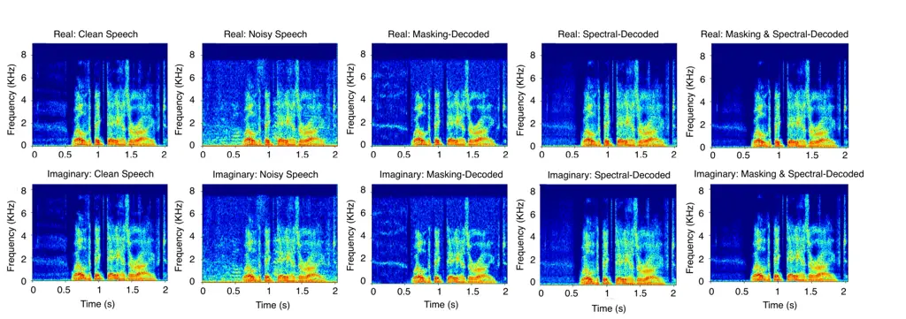

# D2Former: A Fully Complex Dual-Path Dual-Decoder Conformer Network using Joint Complex Masking and Complex Spectral Mapping for Monaural Speech Enhancement

Shengkui Zhao    Bin Ma

###### Abstract

Monaural speech enhancement has been widely studied using real networks
in the time-frequency (TF) domain. However, the input and the target are
naturally complex-valued in the TF domain, a fully complex network is
highly desirable for effectively learning the feature representation and
modelling the sequence in the complex domain. Moreover, phase, an
important factor for perceptual quality of speech, has been proved
learnable together with magnitude from noisy speech using complex
masking or complex spectral mapping. Many recent studies focus on either
complex masking or complex spectral mapping, ignoring their performance
boundaries. To address above issues, we propose a fully complex
dual-path dual-decoder conformer network (D2Former) using joint complex
masking and complex spectral mapping for monaural speech enhancement. In
D2Former, we extend the conformer network into the complex domain and
form a dual-path complex TF self-attention architecture for effectively
modelling the complex-valued TF sequence. We further boost the TF
feature representation in the encoder and the decoders using a dual-path
learning structure by exploiting complex dilated convolutions on time
dependency and complex feedforward sequential memory networks (CFSMN)
for frequency recurrence. In addition, we improve the performance
boundaries of complex masking and complex spectral mapping by combining
the strengths of the two training targets into a joint-learning
framework. As a consequence, D2Former takes fully advantages of the
complex-valued operations, the dual-path processing, and the
joint-training targets. Compared to the previous models, D2Former
achieves state-of-the-art results on the VoiceBank+Demand benchmark with
the smallest model size of 0.87M parameters.

###### keywords

monaural speech enhancement, conformer, attention, convolution, deep
learning

^(†)^(†)address: Alibaba Group  
{shengkui.zhao, b.ma}@alibaba-inc.com

## 1 Introduction

Monaural speech enhancement that aims to extract the signal of interest
from noise-corrupted speech is a fundamental and important task. It has
been widely deployed in speech communication for better perceptual
quality and intelligibility as well as in automatic speech recognition
(ASR) for more robust speech recognition performance. However, monaural
speech enhancement is a non-trivial task due to the corruption in both
magnitude and phase of speech.

Early studies only focus on enhancing the magnitude spectrum while
reusing the noisy phase spectrum \[1, 2\]. Recently, Paliwal et al.
\[3\] reports that accurate phase spectrum estimates can considerably
contribute towards speech quality. Subsequently, phase enhancement has
drawn increasing interest. Besides the pure phase estimation approaches
\[4, 5\], the time domain approaches \[6, 7, 8, 9\] that directly
operate on the raw waveform of speech signals and the time-frequency
(TF) domain approaches \[10, 11, 12, 13, 14, 15, 16, 17, 18, 19, 20,
21\] that manipulate the speech spectrogram are proposed. Although the
time-domain approaches have made some success, the TF domain approach
has dominated the research trend. It is believed that the fine-detailed
structures of speech and noise can be more separable using the
short-time Fourier transform (STFT). In order to jointly estimate
magnitude and phase spectra, two main categories of targets, complex
ratio masking \[10\] and complex spectral mapping \[11\], have been
proposed. Both targets are formulated in the complex domain where the
real and imaginary components are to be learnt. The complex ideal ratio
mask (cIRM) is shown superior than the real counterpart ideal ratio mask
(IRM) \[10\]. On the other hand, the complex spectral mapping is also
more effective than the magnitude spectrum mapping \[11\]. However, many
recent studies focus on either complex masking or complex spectral
mapping, ignoring their performance boundaries. As the training target
substantially affects the enhanced results \[22\], developing a training
target with higher performance boundary is crucial.

Figure 1: D2Former model architecture. D2Former comprises of a complex
dual-path encoder, a complex dual-path conformer module with $`N`$
repeated blocks, and two complex dual-path decoders. The outputs of the
two decoders are weighted and summed.

Figure 2: Architecture of D2Former modules. (a) Complex dual-path
encoder, (b) Complex dual-path conformer module, (c) Complex dual-path
masking decoder, (d) Complex dual-path spectral decoder.

Typically, most of recent studies treat the real and imaginary parts as
two separated real-valued sequences and model them using real-valued
networks \[10, 11, 12, 13, 14, 15, 16, 17\]. However, the speech
spectrogram and the complex targets are naturally complex-valued, much
richer representations and more efficiently modelling could be
potentially achieved by complex networks \[18, 19\]. This is because the
complex models confine with the complex multiply rules and may jointly
learn the real and imaginary parts based on prior knowledge. In our
previous studies, we have built complex models based on the
convolutional recurrent structure and achieved promising results \[20,
21\]. Recently, the sequence modelling capabilities have been
dramatically boosted by Transformer models, especially Conformer \[23\].
Unlike the recurrent learning, Conformer employs the self-attention
mechanism \[24\] to capture global dependency in the sequence while also
looking at local dependency using convolutions. Therefore, extending the
convolutional recurrent model into a conformer-based model using full
complex networks for speech enhancement is highly desirable.

In this paper, we propose a fully complex dual-path dual-decoder
conformer network (D2Former) using joint complex masking and complex
spectral mapping for monaural speech enhancement as shown in Fig. 1. In
D2Former, we extend the real-valued conformer network into the complex
domain and form a dual-path complex TF self-attention architecture in
order to effectively model the complex-valued TF sequence. We further
aim to boost the complex encoder and the decoders using a dual-path
learning structure by exploiting complex dilated convolutions on time
dependency and complex feedforward sequential memory networks (CFSMN)
for frequency correlations. In addition, we aim to improve the
performance boundaries of complex masking and complex spectral mapping
by combining the strengths of the two targets into a joint-learning
framework. As a consequence, D2Former takes fully advantages of the
complex-valued operations, the dual-path processing, and the
joint-training targets. D2Former achieves state-of-the-art (SOTA)
results on the VoiceBank+Demand benchmark with the smallest model size
of 0.87M parameters.

## 2 Proposed D2Former

The overall D2Former architecture is illustrated in Fig. 1. It consists
of a complex dual-path encoder, a complex dual-path conformer block
repeated $`N`$ times, and two separated complex dual-path decoders. The
first decoder is for the complex ratio masking and the second decoder is
for the complex spectral mapping. Specifically, the model takes a noisy
speech waveform $`y=s+n\in\mathbb{R}^{1\times L}`$ and generates an
enhanced speech waveform $`\hat{s}`$. The input waveform is first
converted into a complex spectrogram
$`Y=\mathrm{STFT}(y)\in\mathbb{C}^{T\times F}`$, where $`T`$ and $`F`$
denote the time and frequency dimensions, respectively. The complex
spectrogram sequence $`Y`$ is then passed into the encoder to extract
high-level complex feature sequence. Next, the complex feature sequence
is processed by the complex dual-path conformer blocks. In each
conformer block, the sub-band information in the time path and the
full-band information in the frequency path are modelled alternatively.
Finally, the complex masks and the complex spectrograms are decoded
separately. The outputs of the dual decoders are weighted and summed to
form the final output.



Figure 3: Spectrogram plots of the real (top) and imaginary (bottom)
components of clean speech, noisy speech, the complex masking output,
the complex spectral mapping output, and the weighted and summed result
of the complex masking and complex spectral mapping outputs.

### 2.1 Complex Dual-Path Encoder

Our proposed complex dual-path encoder is shown in Fig. 2(a). It
consists of two complex 2-dimensional (2D) convolution (Conv2D) modules
and a complex dual-path dilated module in between. Each complex Conv2D
module consists of a complex convolution, a complex instance norm, and a
complex PReLU. We follow the work \[25\] for complex-valued operations.
Generally, for a complex layer $`\mathcal{H}`$ with trainable
parameters, such as the complex convolution layer, and a complex input
sequence $`Z=Z_{R}+jZ_{I}`$, the complex operation in $`\mathcal{H}`$ is
represented by

```math
\mathcal{H}(Z)=[\mathcal{H}_{R}(Z_{R})-\mathcal{H}_{I}(Z_{I})]+j[\mathcal{H}_{R}(Z_{I})+\mathcal{H}_{I}(Z_{R})] \tag{1}
```

where $`\mathcal{H}_{R}`$ and $`\mathcal{H}_{I}`$ are real and imaginary
layers of $`\mathcal{H}`$ with identical real-valued operations. For a
parameterless complex operation $`\mathcal{N}`$, such as the complex
instance norm, the complex operation simply applies $`\mathcal{N}`$ on
the real and imaginary parts separately, that is

```math
\mathcal{N}(Z)=\mathcal{N}(Z_{R})+j\mathcal{N}(Z_{I}). \tag{2}
```

The first Conv2D module expands the feature map from $`1`$ channel to
$`C`$ channels. The second Conv2D module halves the frequency dimension
from $`F`$ to $`F/2`$ for a reasonable complexity. Note that the last
dimension of feature map denotes the real and imaginary parts.

The complex dual-path dilated module has a depth of $`4`$ levels to
contain four dual-path blocks (DPBlocks). Each DPBlock contains a
complex constant padding, a complex Conv2D module, and a CFSMN module.
The complex Conv2D modules respond for extracting feature patterns along
the time scale. We increase the receptive field of the Conv2D modules by
using dilated convolutions with the dilation factors of {$`1`$, $`2`$,
$`4`$, $`8`$}. The CFSMN module contains a CFSMN layer to learn the
long-range frequency correlations. The details of the CFSMN layer are
provided in our previous work \[21\]. Here we use the same settings for
CFSMN. The dual-path design for the encoder not only boosts feature
representation along the frequency scale but also expands the time range
using dilations. To aggregate more information and facilitate data flow,
the output is concatenated with the input for the top $`3`$ DPBlocks.

### 2.2 Complex Dual-Path Conformer Block

Conformer was first introduced in \[23\] to combine the self-attention
mechanism and convolution, which is able to capture both local and
global dependencies effectively. The work \[17\] first applies the
real-valued conformer to a two-stage modelling scheme. An extended work
was proposed in \[19\] for a semi-complex model. In this work, we
develop a fully complex model with a much simpler architecture. Instead
of using min-max-norm to compute the complex self-attention \[26\], we
directly apply the softmax function on the absolute values of the
complex matrix to closely follow the attention definition and to
stabilize the model training \[27\].

Considering that the feature map generated by the encoder is a 3D TF map
of dimensions $`B\times C\times T\times F/2`$ and the self-attention
mechanism is a sequence modelling scheme, the dual-path sequence
processing \[16\] is more efficient to model such a feature map.
Therefore, we apply the dual-path self-attention mechanism on the 3D map
to model the time sequence $`BF/2\times T\times C`$ and the frequency
sequence $`BT\times F/2\times C`$ independently and alternatively. Our
proposed complex dual-path conformer block is shown in Fig. 2(b). It
consists of a complex time conformer and a complex frequency conformer.
Each complex conformer extends the original conformer \[23\] in the
complex domain. Both the feed forward modules and the convolution module
are extended into the complex versions based on Eq. 1. Both the
time-sequence attention and the frequency-sequence attention use the
same mechanism as described below. Given the complex input
$`Z=Z_{R}+jZ_{I}`$ and the complex linear projections
$`W^{Q}=W_{R}^{Q}+jW_{I}^{Q}`$, $`W^{K}=W_{R}^{K}+jW_{I}^{K}`$, and
$`W^{V}=W_{R}^{V}+jW_{I}^{V}`$, the queries $`Q`$, keys $`K`$ and values
$`V`$ are represented by

```math
Q=ZW^{Q},\quad K=ZW^{K},\quad V=ZW^{V}. \tag{3}
```

Our complex self-attention is computed as

```math
\mathrm{ComplexAttention}(Q,K,V)=\mathrm{softmax}\left(\frac{\left|QK^{T}\right|}{\sqrt{d_{k}}}\right)V. \tag{4}
```

where $`|\cdot|`$ denotes the absolute value and $`d_{k}`$ is the
feature dimension. The complex matrix product, $`QK^{T}`$, can be
calculated as

```math
QK^{T}=(Q_{R}K_{R}^{T}-Q_{I}K_{I}^{T})+j(Q_{R}K_{I}^{T}+Q_{I}K_{R}^{T}). \tag{5}
```

Following the attention design in conformer \[23\], the relative
sinusoidal positional encoding scheme is integrated into the real and
imaginary parts of $`QK^{T}`$, respectively. Following the multi-head
self-attention (MHSA) scheme \[24\], the complex MHSA is a concatenation
of multiple small-head complex self-attentions. Four heads are used in
this work. Moreover, skip connection is used for each conformer to
connect the input to the output for ease of training.

### 2.3 Complex Dual-Path Masking and Spectral Decoders

The decoder aggregates information from the processed feature map to
predict the target. In this work, we propose a dual-decoder scheme using
both the complex masking \[10\] and the complex spectral mapping \[11\]
to estimate the magnitude and phase spectra. We believe that the
dual-decoder scheme not only encourages learning a more general feature
representation but also compensating the output for any information
loss, thus improving the performance boundary.

Our proposed masking and spectral decoders are shown in Fig. 2 (c) and
(d), respectively. Both decoders consist of a complex dual-path dilated
module, similar to the one in the encoder, to aggregate information from
both time and frequency scales. The complex transposed Conv2D layer is
used in both decoders to recover the frequency dimensions. In the
masking decoder, a complex Conv2D layer is used to squeeze the channel
to $`1`$, which is then followed by a complex instance norm and a
complex LeakyReLU activation. The last complex Conv2D layer projects the
output to the masking domain, followed by tanh activation to bound the
cIRM estimates. For the spectral decoder, we first apply the complex
PReLU and the complex instance norm, and then the complex Conv2D layer
to squeeze the channel. No activation is used for the output of the
spectral decoder.

|                  |      |                                   |          |                |           |            |           |                    |      |      |      |      |
| ---------------- | ---- | --------------------------------- | -------- | -------------- | --------- | ---------- | --------- | ------------------ | ---- | ---- | ---- | ---- |
| Model            | Year | Prediction                        | Para.(M) | Self-Attention | DualP E&D | $`\alpha`$ | $`\beta`$ | Evaluation Metrics |      |      |      |      |
|                  |      |                                   |          |                |           |            |           | WB-PESQ            | CSIG | CBAK | COVL | STOI |
| Noisy            | -    | -                                 | -        | -              | -         | -          | -         | 1.97               | 3.35 | 2.44 | 2.63 | 0.91 |
| SEGAN \[6\]      | 2017 | Waveform                          | 97.5     | No             | No        | -          | -         | 2.16               | 3.48 | 2.94 | 2.80 | 0.92 |
| DEMUCS \[8\]     | 2020 | Waveform                          | 128      | No             | No        | -          | -         | 3.07               | 4.31 | 3.40 | 3.63 | 0.95 |
| TSTNN \[9\]      | 2021 | Waveform                          | 0.92     | Real           | No        | -          | -         | 2.96               | 4.10 | 3.77 | 3.52 | 0.95 |
| GaGNet \[14\]    | 2021 | Complex Mask                      | 5.94     | No             | No        | -          | -         | 2.94               | 4.26 | 3.45 | 3.59 | -    |
| FRCRN \[21\]     | 2022 | Complex Mask                      | 6.98     | No             | Yes       | -          | -         | 3.21               | 4.23 | 3.64 | 3.73 | -    |
| DB-AIAT \[15\]   | 2022 | Magnitude Mask + Complex Spectrum | 2.81     | Real           | No        | -          | -         | 3.31               | 4.61 | 3.75 | 3.96 | 0.96 |
| DPT-FSNet \[16\] | 2022 | Complex Mask                      | 0.91     | Real           | No        | -          | -         | 3.33               | 4.58 | 3.72 | 4.00 | 0.96 |
| CMGAN \[17\]     | 2022 | Magnitude Mask + Complex Spectrum | 1.83     | Real           | No        | -          | -         | 3.41               | 4.63 | 3.94 | 4.12 | 0.96 |
| D2Former         | 2022 | Complex Mask + Complex Spectrum   | 0.81     | Real           | No        | 0.95       | 0.05      | 3.33               | 4.60 | 3.81 | 3.98 | 0.96 |
|                  |      |                                   | 0.81     | Complex        | No        | 0.95       | 0.05      | 3.37               | 4.63 | 3.89 | 4.12 | 0.96 |
|                  |      |                                   | 0.87     | Complex        | Yes       | 0.95       | 0.05      | 3.41               | 4.65 | 3.91 | 4.14 | 0.96 |
|                  |      |                                   |          |                |           | 0.75       | 0.25      | 3.43               | 4.66 | 3.94 | 4.15 | 0.96 |
|                  |      |                                   |          |                |           | 0.50       | 0.50      | 3.42               | 4.66 | 3.92 | 4.14 | 0.96 |
|                  |      |                                   |          |                |           | 0.25       | 0.75      | 3.42               | 4.65 | 3.91 | 4.14 | 0.96 |
|                  |      |                                   |          |                |           | 0.05       | 0.95      | 3.41               | 4.63 | 3.92 | 4.13 | 0.96 |
|                  |      |                                   |          |                |           |            |           |                    |      |      |      |      |

Table 1: Performance comparison on the VoiceBank+Demand benchmark
dataset. Prediction denotes the model output before STFT; DualP E&D
denotes dual-path encoder-decoder. Here D2Former uses a different DualP
E&D as FRCRN; The $`\alpha`$ and $`\beta`$ only apply to D2Former.

Let the output of the masking decoder be denoted by $`M=M_{R}+jM_{I}`$.
By applying the mask $`M`$ on the noisy spectrogram $`Y`$, we obtain the
enhanced spectrogram
$`\hat{S}^{\prime}=\hat{S}_{R}^{\prime}+j\hat{S}_{I}^{\prime}=M\odot Y`$,
where $`\odot`$ is element-wise complex multiplication. Let the output
of the spectral decoder be denoted by
$`\hat{S}^{\dprime}=\hat{S}_{R}^{\dprime}+j\hat{S}_{I}^{\dprime}`$. By
element-wise summing the two weighted outputs $`\hat{S}^{\prime}`$ and
$`\hat{S}^{\dprime}`$, we obtain the final enhanced complex spectrogram:

```math
\hat{S}=\alpha\hat{S}^{\prime}+\beta\hat{S}^{\dprime}=(\alpha\hat{S}_{R}^{\prime}+\beta\hat{S}_{R}^{\dprime})+j(\alpha\hat{S}_{I}^{\prime}+\beta\hat{S}_{I}^{\dprime}) \tag{6}
```

where $`\alpha`$ and $`\beta`$ are weighting factors.

## 3 Experiments

We conduct evaluation and comparison of our proposed D2Former with the
previous models on the popular speech enhancement benchmark:
VoiceBank+Demand dataset \[28\]. The baseline models with the published
results on the VoiceBank+Demand dataset are selected. The dataset
consists of 11,472 clean-noisy matched training mixtures from 28
independent speakers and 10 types of noise. The mixtures are created at
SNRs from 0 dB to 15 dB with 5 dB incremental steps. The testset
consists of 824 mixtures from 2 unseen speakers and 5 unseen noise
types. The SNRs span from 2.5 dB to 17.5 dB with 5 dB incremental steps.
All utterances are resampled to 16 kHz and 2s long segments are randomly
sampled during training.

We use a Hamming window with length of 25 ms and hop size of 6.25 ms.
The STFT length is set to 400 points, resulting $`F=201`$ and
$`F/2=101`$. The hyper-parameter settings are: $`B=2`$, $`N=3`$, and
$`C=32`$. Our model is trained for maximum of 120 epochs using the AdamW
optimizer with an initial learning rate of $`5e^{-4}`$. The learning
rate holds for the beginning 30 epochs and is then decayed by a factor
of 0.5 with patience of 1 epoch. Our enhanced audio samples are
available online ¹¹ 1 https://github.com/alibabasglab/D2Former.

### 3.1 Training Loss

Inspired by Cao \[17\], we use a combination of the time domain loss
$`\mathcal{L}_{\mathrm{Time}}`$, the TF domain loss
$`\mathcal{L}_{\mathrm{TF}}`$, and the quality net (QNet) loss
$`\mathcal{L}_{\mathrm{QNet}}`$:

```math
\displaystyle\mathcal{L}=\mathcal{L}_{\mathrm{TF}}+\gamma_{1}\mathcal{L}_{\mathrm{Time}}+\gamma_{2}\mathcal{L}_{\mathrm{QNet}}
```

```math
\displaystyle\mathcal{L}_{\mathrm{TF}}=\mathrm{MSE}\left(|S|^{P},|\hat{S}|^{P}\right)+\gamma_{3}\left[\mathrm{MSE}\left(S_{R},\hat{S}_{R}\right)+\mathrm{MSE}\left(S_{I},\hat{S}_{I}\right)\right]
```

```math
\displaystyle\mathcal{L}_{\mathrm{Time}}=\mathrm{Mean}\left(\left|s-\hat{s}\right|\right)
```

```math
\displaystyle{L}_{\mathrm{QNet}}=\mathrm{MSE}\left(\mathrm{QNet}\left(\mathrm{Concat}\left(|S|^{P},|\hat{S}|^{P}\right)\right)-1\right) \tag{7}
```

where $`|\cdot|`$ denotes magnitude, and $`P=0.3`$ is magnitude
compression factor. The following weighting factors $`\gamma_{1}=0.2`$,
$`\gamma_{2}=0.05`$ and $`\gamma_{3}=0.1`$ are used for balancing the
loss contributions. We use the same network and the same training method
for QNet as in \[17\].

### 3.2 Results & Ablation Studies

Five metrics are utilized, namely WB-PESQ, CSIG, CBAK, COVL, and STOI
\[17\]. Table 1 shows the performance comparison with the published
results of the SOTA models. We categorize the models based on the
prediction, the applied self-attention, and the applied dual-path scheme
in encoder-decoder (DualP E&D). Generally speaker, the models that
predict the magnitude or complex TF masks show better performance than
the models that predict the waveform directly, except for GaGNet \[14\].
The models that are built on self-attentions not only show improved
performance but also have much smaller model sizes compared to the
models that do not use self-attentions. Note that most of the previous
models are based on real-valued self-attentions. To show the
effectiveness of the complex self-attention, we list the results of the
D2Former with the real-valued self-attention where the queries $`Q`$,
keys $`K`$ and values $`V`$ use absolute values. One can find that
D2Former with the complex attention improves the evaluation metrics. For
example, WB-PESQ increases from 3.33 to 3.37. To show the effectiveness
of DualP E&D, we list the results of D2Former without DualP E&D where
the CFSMN module is removed. It shows that DualP E&D helps improve the
evaluation metrics with marginal parameters added.

Finally, we evaluate the affects of the weighting factors $`\alpha`$ and
$`\beta`$. It is known that a large $`\alpha`$ weights more on the
complex masking decoder and vice versa. The results show that neither
the individual complex masking decoder nor the individual complex
spectral decoder works the best. The weighted results with
$`\alpha=0.75`$ and $`\beta=0.25`$ achieve the best with one selected
example shown in Fig. 3. The results imply that a better trade-off can
be achieved with a joint-learning framework compared to an individual
learning target. Note that DB-AIAT \[15\] and CMGAN \[17\] also use a
joint-learning framework. However, they use magnitude mask instead of
complex mask. From the point view of model parameters, D2Former uses the
least number of parameters of 0.87M. Compared to CMGAN \[17\], D2Former
uses 48% parameters but achieves better metric results.

## 4 Conclusions

In this work, we introduced a fully complex D2Former, built on conformer
network for monaural speech enhancement. Contrary to prior models, we
learn the complex masking and complex spectral mapping in a single model
architecture. By leveraging the dual-path complex self-attention, the
dual-path encoder and decoder, and the joint-learning framework for
complex masking and complex spectral mapping, we successfully enhanced
the model capability and achieved SOTA results on the VoiceBank+Demand
benchmark with the least number of model parameters.

## References

- \[1\] P.-S. Huang, M. Kim, M. Hasegawa-Johnson, and P. Smaragdis,
  “Deep learning for monaural speech separation,” in Proc. of
  ICASSP, 2014.
- \[2\] Y. Xu, J. Du, L. Dai, and C. Lee, “A regression approach to
  speech enhancement based on deep neural networks,” IEEE/ACM
  Transactions on Audio, Speech, and Language Processing, vol. 23, no.
  1, pp. 7–19, 2015.
- \[3\] K. Paliwal, K. Wójcicki, and B. Shannon, “The importance of
  phase in speech enhancement,” Speech Commun., vol. 53, no. 4, 2011.
- \[4\] M. Krawczyk and T. Gerkmann, “STFT phase reconstruction in
  voiced speech for an improved single-channel speech enhancement,”
  IEEE/ACM Trans. Audio. Speech, Lang. Process., vol. 22, no. 12, 2014.
- \[5\] J. Kulmer and P. Mowlaee, “Phase estimation in single channel
  speech enhancement using phase decomposition,” IEEE Signal Process.
  Lett., vol. 22, no. 5, 2015.
- \[6\] S. Pascual, A. Bonafonte, and J. Serra, “SEGAN: Speech
  enhancement generative adversarial network,” in Proc. of Interspeech,
  2017, p. 3642–3646.
- \[7\] D. Rethage, J. Pons, and X. Serra, “A wavenet for speech
  denoising,” in Proc. of ICASSP, 2018.
- \[8\] A. Defossez, G. Synnaeve, and Y. Adi, “Real time speech
  enhancement in the waveform domain,” in Proc. of Interspeech, 2020, p.
  3291–3295.
- \[9\] K. Wang, B. He, and W.-P. Zhu, “TSTNN: Two-stage transformer
  based neural network for speech enhancement in the time domain,” in
  Proc. of ICASSP, 2021.
- \[10\] D. S. Williamson, Y. Wang, and D. Wang, “Complex ratio masking
  for monaural speech separation,” IEEE/ACM transactions on audio,
  speech, and language processing, vol. 24, no. 3, pp. 483– 492, 2015.
- \[11\] K. Tan and D. Wang, “Learning complex spectral mapping with
  gated convolutional recurrent networks for monaural speech
  enhancement,” IEEE/ACM Trans. Audio. Speech, Lang. Process., vol.
  28, 2020.
- \[12\] D. Yin, C. Luo, Z. Xiong, and W. Zeng, “PHASEN: A
  phase-and-harmonics-aware speech enhancement network,” in Conference
  on Artificial Intelligence, 2020.
- \[13\] U. Isik, R. Giri, N. Phansalkar, J.-M. Valin, K. Helwani, and
  A. Krishnaswamy, “PoCoNet: Better speech enhancement with
  frequency-positional embeddings, semi-supervised conversational data,
  and biased loss,” in Proc. of Interspeech, 2020.
- \[14\] A. Li, C. Zheng, and X. Li L. Zhang, “Glance and Gaze: A
  collaborative learning framework for single-channel speech
  enhancement,” arXiv preprint arXiv:2106.11789, 2021.
- \[15\] G. Yu, A. Li, C. Zheng, Y. Guo, Y. Wang, and H. Wang,
  “Dual-branch attention-in-attention transformer for single-channel
  speech enhancement,” in Proc. of ICASSP, 2022.
- \[16\] F. Dang, H. Chen, and P. Zhang, “DPT-FSNet: Dual-path
  transformer based full-band and sub-band fusion network for speech
  enhancement,” in Proc. of ICASSP, 2022.
- \[17\] R. Cao, S. Abdulatif, and B. Yang, “CMGAN: Conformer-based
  metric GAN for speech enhancement,” in Proc. of Interspeech, 2022.
- \[18\] Y. Hu, Y. Liu, S. Lv, M. Xing, S. Zhang, Y. Fu, J. Wu,
  B. Zhang, and L. Xie, “DCCRN: Deep complex convolution recurrent
  network for phase-aware speech enhancement,” in Proc.
  Interspeech, 2020.
- \[19\] Y. Fu, Y. Liu, J. Li, D. Luo, S. Lv, Y. Jv, and L. Xie,
  “Uformer: A unet based dilated complex & real dual-path conformer
  network for simultaneous speech enhancement and dereverberation,” in
  Proc. of ICASSP, 2022.
- \[20\] S. Zhao, T. H. Nguyen, and B. Ma, “Monaural speech enhancement
  with complex convolutional block attention module and joint time
  frequency losses,” in Proc. of ICASSP, 2021.
- \[21\] S. Zhao, B. Ma, K. N. Watcharasupat, and W.-S. Gan, “FRCRN:
  Boosting feature representation using frequency recurrence for
  monaural speech enhancement,” in Proc. of ICASSP, 2022.
- \[22\] Y. Wang, A. Narayanan, and D. Wang, “On training targets for
  supervised speech separation,” IEEE/ACM transactions on audio, speech,
  and language processing, vol. 22, no. 12, pp. 1849–1858, 2014.
- \[23\] A. Gulati, J. Qin, C.-C. Chiu, N. Parmar, Y. Zhang, J. Yu,
  W. Han, S. Wang, Z. Zhang, Y. Wu, and R. Pang, “Conformer:
  Convolution-augmented transformer for speech recognition,” in Proc. of
  Interspeech, 2020, pp. 5036–5040.
- \[24\] A. Vaswani, N. Shazeer, N. Parmar, J. Uszkoreit, L. Jones,
  A. N. Gomez, L. Kaiser, and I. Polosukhin, “Attention is all you
  need,” in Proc. of NIPS, 2017.
- \[25\] C. Trabelsi, O. Bilaniuk, Y. Zhang, D. Serdyuk, S. Subramanian,
  J. F. Santos, S. Mehri, N. Rostamzadeh, Y. Bengio, and C. J. Pal.,
  “Deep complex networks,” in International Conference on Learning
  Representations, 2018.
- \[26\] M. Yang, M. Q Ma, D. Li, Y.-H. H. Tsai, and R. Salakhutdinov,
  “Complex transformer: A framework for modeling complex-valued
  sequence,” in Proc. of ICASSP, 2020.
- \[27\] Y. Dong, Y. Peng, M. Yan, S. Lu, and Q. Shi, “Signal
  transformer: Complex-valued attention and meta-learning for signal
  recognition,” arXiv:2106.04392, 2021.
- \[28\] C.Valentini-Botinhao, X.Wang, S.Takaki, and J.Yamagishi,
  “Investigating RNN-based speech enhancement methods for noise-robust
  Text-to-Speech,” in Proc. SSW, 2016, p. 146–152.
