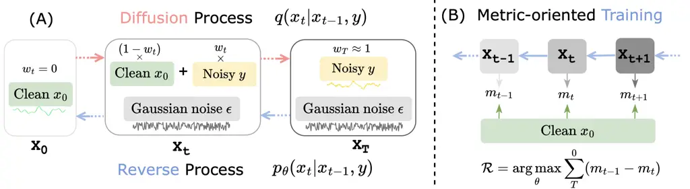

# Metric-oriented Speech Enhancement using Diffusion Probabilistic Model

Chen Chen    Yuchen Hu    Weiwei Weng    Eng Siong Chng

###### Abstract

Deep neural network based speech enhancement technique focuses on
learning a noisy-to-clean transformation supervised by paired training
data. However, the task-specific evaluation metric (e.g., PESQ) is
usually non-differentiable and can not be directly constructed in the
training criteria. This mismatch between the training objective and
evaluation metric likely results in sub-optimal performance. To
alleviate it, we propose a metric-oriented speech enhancement method
(MOSE), which leverages the recent advances in the diffusion
probabilistic model and integrates a metric-oriented training strategy
into its reverse process. Specifically, we design an actor-critic based
framework that considers the evaluation metric as a posterior reward,
thus guiding the reverse process to the metric-increasing direction. The
experimental results demonstrate that MOSE obviously benefits from
metric-oriented training and surpasses the generative baselines in terms
of all evaluation metrics.

###### Index Terms: 

Diffusion probabilistic model, speech enhancement, reinforcement
learning

^(†)^(†)address: School of Computer Science and Engineering, Nanyang
Technological University, Singapore  
CHEN1436@e.ntu.edu.sg

## 1 Introduction

Recent advances in deep learning has brought remarkable success to the
speech enhancement technique, where a noisy-to-clean transformation is
learned to remove additive noises by a supervised learning manner \[1,
2, 3, 4\]. However, this paradigm suffers from a mismatch between
training and evaluation: the training criterion (e.g., Mean Square
Error) must be differentiable for gradient calculation \[5\], while the
evaluation metric (e.g. PESQ) are usually non-differentiable, thus can
not be directly modeled in loss function as minimized objective.
Consequently, the optimized model after training can not achieve best
performance in terms of evaluation metric.

This mismatch is also reported in other supervised learning tasks, such
as machine translation \[6, 7\] and automatic speech recognition \[8, 9,
10\]. Prior works have utilized reinforcement learning (RL) based
algorithms to harmonize the mismatch using metric-based training
approach \[11\], as these tasks contain a sequential decoding process
that can be naturally viewed as Markov Decision Process (MDP) \[12\].
Nevertheless, as a regression task, mainstream SE approaches train a
one-shot discriminative model without the time-step concept for MDP,
which is infeasible for RL-based optimization.

Diffusion probabilistic model \[13\], showing outstanding results in
generative tasks \[14, 15\], brings possibility for metric-based
optimization of SE task, as it inherently consists of MDP-based
diffusion and reverse processes \[16\]. More specifically, an isotropic
Gaussian distribution is added to the clean speech during step-by-step
diffusion process, and in the reverse process, gradually estimates and
subtracts additive noise to restore the clean input \[17\].

In this work, we present a metric-oriented speech enhancement method
called MOSE, which effectively constructs the non-differentiable metric
into the training objective. Inspired by actor-critic based
algorithm \[18\], we design a value-based neural network that is updated
by Bellman Error \[19\] to evaluate current policy in terms of
metric-related reward function, then it guides the prediction of
subtracted noise in a reverse process by the differentiable manner. In
this way, the original policy is optimized to the metric-increasing
direction, while the value-based network is trained to provide
reasonable feedback. Experimental results demonstrate that MOSE
obviously benefit from metric-oriented training and beat other
generative methods in terms of all metrics. Furthermore, it shows better
generalization in face of unseen noises with large domain mismatch.



Figure 1: The conditional diffusion probabilistic model (A) and
metric-oriented training (B). The red and blue arrows respectively
denotes the diffusion and reverse process. $`w_{t}`$ is the weight of
linear interpolation, and $`m_{t}`$ is the task-specific metric.

## 2 Preliminaries

We first define noisy speech as $`y`$ and define its corresponding
ground-truth clean speech as $`x_{0}`$. The speech enhancement task aims
to learn a transformation $`f`$ that converts the noisy input to clean
signal: $`x_{0}=f(y),\ x_{0},y\in\mathbb{R}^{L}`$.

### 2.1 Diffusion Probabilistic Model

In this part, we briefly introduce the diffusion process and the reverse
process of the typical diffusion probabilistic model.

Diffusion process is formulated as a $`T`$-step Markov chain that
gradually adds Gaussian noise to the clean signal $`x_{0}`$ in each step
$`t`$. The Gaussian model is denoted as
$`q(x_{t}|x_{t-1})=\mathcal{N}(x_{t};`$
$`\sqrt{1-\beta_{t}}x_{t-1},\beta_{t}I)`$, where $`\beta_{t}`$ is a
small positive constant that serve as a pre-defined schedule. With
enough diffusion step $`T`$, the latent variable $`x_{T}`$ can be
finally converted to an isotropic Gaussian distribution
$`p_{latent}(x_{T})=\mathcal{N}(0,I)`$. Therefore, based on $`x_{0}`$,
the sampling distribution of each step in the Markov chain can be
derived as the following:

```math
q(x_{t}|x_{0})=\mathcal{N}(x_{t};\sqrt{\bar{\alpha}_{t}}x_{0},(1-\bar{\alpha}_{t})I), \tag{1}
```

where $`\alpha_{t}=1-\beta_{t}`$ and
$`\bar{\alpha}_{t}=\prod_{s=1}^{t}\alpha_{s}`$.

Reverse process aims to restore the $`x_{0}`$ from the latent variable
$`x_{T}`$ along another Markov chain, which is denoted as
$`p_{\theta}(x_{t-1}|x_{t})`$, where $`\theta`$ is learnable parameters.
As marginal likelihood
$`p_{\theta}(x_{0})=\int p_{\theta}(x_{0},\cdots,x_{T-1}|x_{T})\cdot p_{\text{latent}}(x_{T})dx_{1:T}`$
is intractable for calculation, the ELBO \[13\] is utilized to
approximate a learning objective for neural model training. Therefore,
the equation of the reverse process can be denoted as:

```math
\begin{split}\begin{aligned} p_{\theta}(x_{t-1}|x_{t})&=\mathcal{N}(x_{t-1};\mu_{\theta}(x_{t},t),\tilde{\beta}_{t}I),\\
\text{where}\quad\mu_{\theta}(x_{t},t)&=\frac{1}{\sqrt{\alpha_{t}}}(x_{t}-\frac{\beta_{t}}{\sqrt{1-\bar{\alpha}_{t}}}\epsilon_{\theta}(x_{t},t))\end{aligned}\end{split} \tag{2}
```

Here $`\mu_{\theta}(x_{t},t)`$ denotes the mean of $`x_{t-1}`$, which is
obtained by subtracting the estimated Gaussian noise
$`\epsilon_{\theta}(x_{t},t)`$ in the $`x_{t}`$. Furthermore, the
variance is derived to a constant
$`\tilde{\beta}_{t}=\frac{1-\bar{\alpha}_{t-1}}{1-\bar{\alpha}_{t}}\beta_{t}`$.

### 2.2 Reinforcement Learning

Reinforcement learning (RL) is typically formulated as a Markov Decision
Process (MDP) that includes a tuple of trajectories
$`\left\langle\mathcal{S},\mathcal{A},\mathcal{R},\mathcal{T}\right\rangle`$.
For each time step $`t`$, the agent considers state $`s_{t}\in S`$ to
generate an action $`a_{t}\in\mathcal{A}`$ which interacts with
environment. The transition dynamics
$`\mathcal{T}(s_{t+1}|s_{t},a_{t})`$ is defined as transition
probability from current state $`s_{t}`$ to next state $`s_{t+1}`$, and
gain an instant reward $`r_{t}(s_{t},a_{t})`$. The objective of RL is to
learn optimal policy to maximize the cumulative reward $`\mathcal{R}`$
along all time steps.

Since the diffusion probabilistic model formulates speech enhancement
task as MDP in section 2.1, the RL algorithm can be integrated in the
reverse process to explore optimal policy. More specifically, given the
current state $`x_{t}`$, the policy network is supposed to predict a
Gaussian noise $`\epsilon_{t}`$ as the current action. After subtracting
the $`\epsilon_{t}`$ in $`x_{t}`$, the $`x_{t-1}`$ is obtained as next
state, as step number $`t`$ is decreasing during reverse process.
Furthermore, the instant reward $`r_{t}`$ is calculated by comparison of
$`x_{t}`$ and $`x_{t-1}`$, which guides the update of parameters
$`\theta`$ during model training.

## 3 Methodology

In this section, we introduce our proposed MOSE, which integrates the
metric-oriented training into the reverse process of a conditional
diffusion probabilistic model. The overview of MOSE is shown in Fig. 1.

### 3.1 Conditional Diffusion Probabilistic Model

As real-world noises usually does not obey the Gaussian distribution, we
incorporate noisy speech $`y`$ into the procedures as a conditioner in
this part. Specifically, a dynamic weight $`w_{t}\in[0,1]`$ is employed
for linear interpolation from $`x_{0}`$ to $`x_{T}`$. Therefore, as
shown in Fig. 1, each latent variable $`x_{t}`$ consists of three parts:
clean component $`(1-w_{t})\times x_{0}`$, noisy component
$`w_{t}\times y`$, and Gaussian Noise $`\epsilon`$. Furthermore, the
diffusion process in Eq. (1) can be rewritten as:

```math
\displaystyle q(x_{t}|x_{0},y)=\mathcal{N}(x_{t};(1-w_{t})\sqrt{\bar{\alpha}_{t}}x_{0}+w_{t}\sqrt{\bar{\alpha}_{t}}y,\delta_{t}I), \tag{3}
```

```math
\displaystyle\text{where}\quad\ \delta_{t}=(1-\bar{\alpha}_{t})-w_{t}^{2}\bar{\alpha}_{t} \tag{4}
```

The conditional reverse process starts from $`x_{T}`$ with $`w_{T}=1`$,
which is denoted as
$`\mathcal{N}(x_{T},\sqrt{\bar{\alpha}_{T}}y,\delta_{T}I)`$. Referring
to Eq. (2), we denoted the conditional reverse process as:

```math
p(x_{t-1}|x_{t},y)=\mathcal{N}(x_{t-1};\mu_{\theta}(x_{t},y,t),\tilde{\delta}_{t}I), \tag{5}
```

where $`\mu_{\theta}(x_{t},y,t)`$ is the predicted mean of variance
$`x_{t-1}`$. It means that the neural model $`\theta`$ considers both
variance $`x_{t}`$ and noisy conditioner $`y`$ during its prediction.
Therefore, similar to Eq. (2), we define the mean of $`\mu_{\theta}`$ as
a linear combination of $`x_{t}`$, $`y`$, and $`\epsilon_{\theta}`$:

```math
\mu_{\theta}(x_{t},y,t)=c_{xt}x_{t}+c_{yt}y-c_{\epsilon t}\epsilon_{\theta}(x_{t},y,t), \tag{6}
```

where the coefficients $`c_{xt},c_{yt},`$ and $`c_{\epsilon t}`$ can be
derived from the ELBO optimization criterion in \[20\]. Finally, we
combine Gaussian noise $`\epsilon`$ and non-Gaussian noise $`y-x_{0}`$
as ground-truth $`C_{t}^{noise}`$:

```math
\displaystyle C_{t}^{noise}(x_{0},y,\epsilon)=\frac{m_{t}\sqrt{\bar{\alpha}_{t}}}{\sqrt{1-\bar{\alpha}_{t}}}{(y-x_{0})}+\frac{\sqrt{\delta_{t}}}{\sqrt{1-\bar{\alpha}_{t}}}\epsilon \tag{7}
```

```math
\displaystyle\nabla_{\theta}\mathcal{L}_{1}=\parallel C_{t}^{noise}(x_{0},y,\epsilon)-\nabla_{\theta}\epsilon_{\theta}(x_{t},y,t)\parallel_{1} \tag{8}
```

where $`C_{t}^{noise}`$ provides supervision information, and
$`\mathcal{L}_{1}`$ is calculated for back propagation of neural
network.

Figure 2: The main structure of MOSE. Dashed line stands for back
propagation for neural network.

### 3.2 Metric-oriented Training

Given the task-specific evaluation metric $`m`$, each $`t`$-step
variable can calculate the $`m_{t}`$ by $`x_{t}`$ and $`x_{0}`$ as they
are in same shape. In order to directly optimize $`m_{t}`$, an
actor-critic RL algorithm is integrated into conditional reverse
process, as shown in the Fig. 1 (B).

Since we hope that the latent variable is iterated toward the
metric-increasing direction in the reverse process, the reward function
is customized as: $`r_{t}=m_{t-1}-m_{t}`$, where $`t`$ starts from $`T`$
to 0. However, posterior $`r_{t}`$ is obviously non-differentiable for
$`\theta`$, thus failing to propagate gradient. To this end, we further
employ a Value network $`V`$ with parameter $`\theta_{v}`$ as the blue
box in Fig. 3, and the original network is denoted as Diffusion network
$`D`$ with parameter $`\theta_{d}`$ for distinction. In general, The
Diffusion network consumes $`x_{t}`$ to predict the subtracted noise
$`\epsilon_{t}`$ as action, while the Value network generates an score
$`v_{t}`$ to evaluate this $`\epsilon_{t}`$ based on $`x_{t}`$. The
training strategy of MOSE is explained in Algorithm 1.

1: Randomly initialize the Diffusion network $`D(x|\theta_{d})`$ and
Value network $`V(x,\epsilon|\theta_{v})`$.

2: Initialize $`N_{total}`$, $`N_{th}`$, $`\gamma`$, and $`\alpha`$

3: for $`i=1,2,\cdots,N_{total}`$ do

4:   Sample $`(x_{0},y)`$ from Dataset

5:   Sample $`\epsilon{\sim}\mathcal{N}(0,I)`$ and
$`t{\sim}\text{Uniform}(\{1,\cdots,T\})`$

6:   Set
$`x_{t}=((1-m_{t})\sqrt{\bar{\alpha}_{t}}x_{0}+m_{t}\sqrt{\bar{\alpha}_{t}}y)+\sqrt{\delta_{t}}\epsilon`$

7:   Calculate $`C_{t}^{noise}`$ according to Eq. (7)

8:   if $`i<N_{th}`$ then

9:    Update network $`D`$ by minimizing $`\mathcal{L}_{1}`$ in Eq. (8)

10:   else

11:    Calculate $`\epsilon_{t}=D(x_{t},y,t|\theta_{d})`$ as action

12:    Calculate
$`\nabla_{\theta_{d}}\mathcal{L}_{2}=-V(x_{t},\nabla_{\theta_{d}}\epsilon_{t},x_{0}|\theta_{v})`$

13:    Update $`D`$ by minimizing
$`\mathcal{L}=\mathcal{L}_{1}+\alpha\cdot\mathcal{L}_{2}`$

14:    Calculate $`x_{t-1}`$ according to Eq. 6 as next state

15:    Calculate $`r_{t}=m_{t-1}(x_{t-1},x_{0})-m_{t}(x_{t-1},x_{0})`$

16:    Set
$`\mathcal{V}_{t}=r_{t}+\gamma V(x_{t-1},D(x_{t-1},y,t-1),x_{0}|\theta_{v})`$

17:    Calculate
$`\nabla_{\theta_{v}}\mathcal{L}_{3}=(\mathcal{V}_{t}-\nabla_{\theta_{v}}V(x_{t},\epsilon_{t},x_{0}|\theta_{v}))^{2}`$

18:    Update network $`V`$ by minimizing $`\mathcal{L}_{3}`$

19:   end if

20: end for

Algorithm 1 MOSE Training

MOSE starts training with conventional ELBO optimization, as explained
from line 3$`\sim`$9 in Algorithm 1, only Diffusion network $`D`$ is
trained for $`N_{th}`$ iterations. Then we present joint training of
Diffusion network $`D`$ and Value network $`V`$ from lines 10$`\sim`$18.
Minimizing $`\mathcal{L}_{2}=-V(x_{t},\epsilon_{t},x_{0}|\theta_{v})`$
indicates that $`D`$ tents to gain higher score from $`V`$, and
$`\mathcal{L}_{2}`$ is simultaneously incorporated with a weight
$`\alpha`$ to stabilize training. In order to encourage Value network
$`V`$ to provide reasonable evaluation, we employ widely used Bellman
Error \[19\] (line 17) to update $`V`$, where $`\gamma`$ is a decay
factor for future reward. Consequently, the output score $`v_{t}`$ both
considers current and future rewards based on the task-specific metric.
For inference, we adopt a fast sampling scheme as same as in \[15\].

## 4 Experiment

### 4.1 Experimental Setup

Database. We choose the publicly available VoiceBank DEMAND
dataset \[21\] for SE training and evaluation. Specifically, the
training set contains 11,572 noisy utterances from 28 speakers and is
mixed by 10 different types with four SNR levels (0, 5, 10, and 15 dB)
at a sampling rate of 16 kHz, as well as their corresponding clean
utterances. The test set contains 5 types of unseen noise in SNR levels
(2.5, 7.5, 12.5, and 17.5 dB). To evaluate the performance of a model in
unseen noises, we further mix the test set of TIMIT \[22\] and
“helicopter” and “babycry” noises with different SNR levels (-6, -3, 0,
3, 6 dB), where a large domain mismatch exists between training and
testing.

Configuration. The internal structure of MOSE is shown in Fig. 3. We
employ 30 residual blocks with 64 channels in Diffusion Net. MLP block
contains 4 linear layers with ReLU activation function. For training,
MOSE takes 50 diffusion steps with training noise schedule
$`\beta_{t}\in[1\times 10^{-4},0.035]`$, and the interpolation weight
$`m_{t}=\sqrt{(1-\bar{\alpha}_{t})/\sqrt{\bar{\alpha}_{t}}}`$. The
$`N_{total}`$, $`N_{th}`$, and $`\gamma`$ in Algorithm 1 are
respectively set as 40k, 30k, and 0.95. The initial learning rate of
Diffusion network is set as $`2\times 10^{-4}`$ for first $`N_{th}`$
iterations, and decrease to $`1\times 10^{-4}`$ for
$`N_{th}\sim N_{total}`$ iterations. The learning rate of the Value
network is set as $`1\times 10^{-5}`$. Both networks are optimized by
Adam with a batch size of 32. The fast sampling method keeps the same
schedule with \[20\].

Metric. We select the perceptual evaluation of speech quality (PESQ) as
the task-specific metric of optimization objective due to its
universality. Furthermore, prediction of the signal distortion (CSIG),
prediction of the background intrusiveness (CBAK), and prediction of the
overall speech quality (COVL) are also reported as references.

Figure 3: The relationship between $`\Delta`$PESQ and training loss
$`-\mathcal{L}_{1}`$, as well as gained reward $`\mathcal{R}`$.

### 4.2 Result and Analysis

|     |             |            |      |      |      |      |     |
| --- | ----------- | ---------- | ---- | ---- | ---- | ---- | --- |
| ID  | System      | $`\alpha`$ | PESQ | CSIG | CBAK | COVL |     |
| 1   | Unprocessed | \-         | 1.97 | 3.35 | 2.44 | 2.63 |     |
| 2   | MOSE        | 0          | 2.44 | 3.65 | 2.87 | 3.01 |     |
| 3   | MOSE        | 0.1        | 2.48 | 3.66 | 2.90 | 3.06 |     |
| 4   |             | 1          | 2.54 | 3.73 | 2.93 | 3.12 |     |
| 5   |             | 5          | 2.51 | 3.69 | 2.91 | 3.08 |     |

Table 1: Result of metric-oriented training.

|                    |      |      |      |      |      |     |
| ------------------ | ---- | ---- | ---- | ---- | ---- | --- |
| System             | Type | PESQ | CSIG | CBAK | COVL |     |
| Unprocessed        | \-   | 1.97 | 3.35 | 2.44 | 2.63 |     |
| DSEGAN \[23\]      | Gen. | 2.39 | 3.46 | 3.11 | 2.90 |     |
| SE-Flow \[24\]     | Gen. | 2.28 | 3.70 | 3.03 | 2.97 |     |
| CDiffuSE \[20\]    | Gen. | 2.52 | 3.72 | 2.91 | 3.10 |     |
| WaveCRN \[25\]     | Dis. | 2.64 | 3.94 | 3.37 | 3.29 |     |
| Conv-TasNet \[26\] | Dis. | 2.67 | 3.94 | 3.31 | 3.30 |     |
| MOSE (ours)        | Gen. | 2.54 | 3.72 | 2.93 | 3.06 |     |

Table 2: MOSE _vs._ other methods. “Gen.” and “Dis.” respectively denote
generative and discriminative models.

|                          |                    |      |      |      |      |            |
| ------------------------ | ------------------ | ---- | ---- | ---- | ---- | ---------- |
| System                   | Noise level, SNR = |      |      |      |      |            |
|                          | -6                 | -3   | 0    | 3    | 6    | Avg.       |
| _Noise type: Helicopter_ |                    |      |      |      |      |            |
| Unprocessed              | 1.05               | 1.07 | 1.10 | 1.16 | 1.26 | 1.13 +0%   |
| Conv-TasNet \[26\]       | 1.06               | 1.08 | 1.14 | 1.21 | 1.47 | 1.19 +5.3% |
| MOSE                     | 1.08               | 1.13 | 1.16 | 1.26 | 1.44 | 1.21 +7.1% |
| _Noise type: Baby-cry_   |                    |      |      |      |      |            |
| Unprocessed              | 1.06               | 1.09 | 1.13 | 1.18 | 1.27 | 1.15 +0%   |
| Conv-TasNet \[26\]       | 1.06               | 1.10 | 1.15 | 1.21 | 1.37 | 1.18 +2.6% |
| MOSE                     | 1.08               | 1.13 | 1.16 | 1.24 | 1.45 | 1.21 +5.2% |

Table 3: PESQ results on TIMIT dataset with different SNRs. “Avg”
denotes the average of all SNR levels.

#### 4.2.1 Experimental validation of mismatch

We first design an experiment to verify the mismatch problem between the
training objective and evaluation metric, and illustrate how we mitigate
it. To this end, we train a typical diffusion probabilistic model, where
$`\mathcal{L}_{1}`$ in Eq (8) is set as the only training objective.
Then we sample 10 utterances and add up their $`\mathcal{L}_{1}`$ (50
steps), as well as calculate the improvement of PESQ ($`\Delta`$PESQ).
The comparison is visualized in the left part of Fig. 3, and we observe
that there is no correlation between $`\mathcal{L}_{1}`$ and
$`\Delta`$PESQ, which indicates that SE model trained only by
$`\mathcal{L}_{1}`$ will lead to sub-optimal performance in terms of
PESQ. Meanwhile, we calculate the cumulatively gained reward
$`\mathcal{R}`$ of these utterances after metric-oriented training and
visualize in the right of Fig. 3, where an obvious positive correlation
can be observed between $`\Delta`$PESQ and $`\mathcal{R}`$.

#### 4.2.2 Effect of metric-oriented training

We then examine the effect of proposed metric-oriented training, and the
results are reported in Table 1. “Unprocessed” denotes direct evaluation
based on noisy data, and $`\alpha`$ is the weight of $`\mathcal{L}_{2}`$
in Algorithm 1. When $`\alpha=0`$, SE model are only trained by
$`\mathcal{L}_{1}`$ loss. We observe that system 3$`\sim`$5 all surpass
system 2 with help of metric-oriented training. When $`\alpha=1`$, the
SE model achieves the best performance.

In addition, Table 2 summarizes the comparison between MOSE and other
competitive SE methods, which contains 3 generative models and 2
discriminative methods. We observe that MOSE surpasses generative
baselines in terms of all metrics, however, the best performance is
still achieved by discriminative method.

#### 4.2.3 Generalization on unseen noise

We evaluate our trained model in unseen noisy condition with a wide
range of SNR levels, where Conv-TasNet method is reproduced for
comparison. The PESQ results are shown in Table 3. Despite gaining
outstanding performance on the matched test set, we observed that the
PESQ of Conv-TasNet dramatically degrades due to noise domain mismatch.
However, the MOSE performs better than Conv-TasNet in terms of PESQ,
especially in low-SNR conditions.

## 5 Conclusion

In this paper, we propose a speech enhancement method, called MOSE,
which addresses the mismatch problem between training objective and
evaluation metric. The probabilistic diffusion model is leveraged as MDP
based framework, where metric-oriented training is presented in the
reverse process. The experimental results demonstrate that MOSE beats
other generative baselines in terms of all metrics, and show better
generalization on unseen noises.

## References

- \[1\] D. Wang and J. Chen, “Supervised speech separation based on deep
  learning: An overview,” _IEEE/ACM Transactions on Audio, Speech, and
  Language Processing_, vol. 26, no. 10, 2018.
- \[2\] Y. Xu, J. Du, L.-R. Dai, and C.-H. Lee, “A regression approach
  to speech enhancement based on deep neural networks,” _IEEE/ACM
  Transactions on Audio, Speech, and Language Processing_, vol. 23,
  no. 1, 2014.
- \[3\] Y. Koizumi, K. Yatabe, M. Delcroix, Y. Masuyama, and
  D. Takeuchi, “Speech enhancement using self-adaptation and multi-head
  self-attention,” in _ICASSP 2020-2020_, 2020.
- \[4\] C. Chen, N. Hou, D. Ma, and E. S. Chng, “Time domain speech
  enhancement with attentive multi-scale approach,” in _2021
  Asia-Pacific Signal and Information Processing Association Annual
  Summit and Conference (APSIPA ASC)_. IEEE, 2021, pp. 679–683.
- \[5\] Z. Chen, S. Watanabe, H. Erdogan, and J. R. Hershey, “Speech
  enhancement and recognition using multi-task learning of long
  short-term memory recurrent neural networks,” in _Conference of the
  International Speech Communication Association_, 2015.
- \[6\] D. Bahdanau, P. Brakel, K. Xu, A. Goyal, R. Lowe, J. Pineau,
  A. Courville, and Y. Bengio, “An actor-critic algorithm for squence
  prediction,” 2016.
- \[7\] L. Wu, F. Tian, T. Qin, J. Lai, and T.-Y. Liu, “A study of
  reinforcement learning for neural machine translation,” _arXiv
  preprint arXiv:1808.08866_, 2018.
- \[8\] R. Prabhavalkar, T. N. Sainath, Y. Wu, P. Nguyen, Z. Chen, C.-C.
  Chiu, and A. Kannan, “Minimum word error rate training for
  attention-based sequence-to-sequence models,” in _ICASSP_, 2018.
- \[9\] C. Chen, Y. Hu, N. Hou, X. Qi, H. Zou, and E. S. Chng,
  “Self-critical sequence training for automatic speech recognition,” in
  _ICASSP_, 2022.
- \[10\] C. Chen, Y. Hu, Q. Zhang, H. Zou, B. Zhu, and E. S. Chng,
  “Leveraging modality-specific representations for audio-visual speech
  recognition via reinforcement learning,” _arXiv preprint
  arXiv:2212.05301_, 2022.
- \[11\] S. J. Rennie, E. Marcheret, Y. Mroueh, J. Ross, and V. Goel,
  “Self-critical sequence training for image captioning,” in
  _CVPR_, 2017.
- \[12\] A. Tjandra, S. Sakti, and S. Nakamura, “Sequence-to-sequence
  asr optimization via reinforcement learning,” in _ICASSP_, 2018.
- \[13\] J. Ho, A. Jain, and P. Abbeel, “Denoising diffusion
  probabilistic models,” _Advances in Neural Information Processing
  Systems_, vol. 33, pp. 6840–6851, 2020.
- \[14\] A. Q. Nichol and P. Dhariwal, “Improved denoising diffusion
  probabilistic models,” in _ICML_, 2021.
- \[15\] Z. Kong, W. Ping, J. Huang, K. Zhao, and B. Catanzaro,
  “Diffwave: A versatile diffusion model for audio synthesis,” _arXiv
  preprint arXiv:2009.09761_, 2020.
- \[16\] S. Luo and W. Hu, “Diffusion probabilistic models for 3d point
  cloud generation,” in _CVPR_, 2021.
- \[17\] Y.-J. Lu, Y. Tsao, and S. Watanabe, “A study on speech
  enhancement based on diffusion probabilistic model,” in _2021
  Asia-Pacific Signal and Information Processing Association Annual
  Summit and Conference (APSIPA ASC)_, 2021.
- \[18\] C. Chen, H.-Y. Li, X. Zhang, X. Liu, and U.-X. Tan, “Towards
  robotic picking of targets with background distractors using deep
  reinforcement learning,” in _2019 WRC Symposium on Advanced Robotics
  and Automation (WRC SARA)_, 2019.
- \[19\] I. Grondman, L. Busoniu, G. A. Lopes, and R. Babuska, “A survey
  of actor-critic reinforcement learning: Standard and natural policy
  gradients,” _IEEE Transactions on Systems, Man, and Cybernetics, Part
  C (Applications and Reviews)_, vol. 42, no. 6, 2012.
- \[20\] Y.-J. Lu, Z.-Q. Wang, S. Watanabe, A. Richard, C. Yu, and
  Y. Tsao, “Conditional diffusion probabilistic model for speech
  enhancement,” in _ICASSP_, 2022.
- \[21\] C. Valentini-Botinhao, X. Wang, S. Takaki, and J. Yamagishi,
  “Investigating rnn-based speech enhancement methods for noise-robust
  text-to-speech.” in _SSW_, 2016.
- \[22\] J. S. Garofolo, L. F. Lamel, W. M. Fisher, J. G. Fiscus, and
  D. S. Pallett, “Getting started with the darpa timit cd-rom: An
  acoustic phonetic continuous speech database,” _National Institute of
  Standards and Technology (NIST), Gaithersburgh, MD_, vol. 107, 1988.
- \[23\] H. Phan, I. V. McLoughlin, L. Pham, O. Y. Chén, P. Koch,
  M. De Vos, and A. Mertins, “Improving gans for speech enhancement,”
  _IEEE Signal Processing Letters_, 2020.
- \[24\] M. Strauss and B. Edler, “A flow-based neural network for time
  domain speech enhancement,” in _ICASSP_, 2021.
- \[25\] T.-A. Hsieh, H.-M. Wang, X. Lu, and Y. Tsao, “Wavecrn: An
  efficient convolutional recurrent neural network for end-to-end speech
  enhancement,” _IEEE Signal Processing Letters_, vol. 27, pp.
  2149–2153, 2020.
- \[26\] Y. Luo and N. Mesgarani, “Conv-tasnet: Surpassing ideal
  time–frequency magnitude masking for speech separation,” _IEEE/ACM
  transactions on audio, speech, and language processing_, vol. 27,
  no. 8, pp. 1256–1266, 2019.
