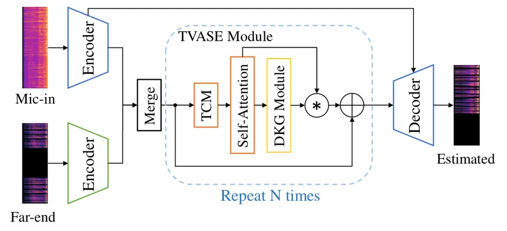

# Time-Variance Aware Real-Time Speech EnhancementThanks: \*This work was done when Chengyu Zheng was an intern at Microsoft Research Asia.

Chengyu Zheng    Yuan Zhou Affiliation: Microsoft Research Asia,
Beijing, China    Xiulian Peng Affiliation: Microsoft Research Asia,
Beijing, China    Yuan Zhang Affiliation: Communication University of
China, Beijing, China    Yan Lu Affiliation: Microsoft Research Asia,
Beijing, China

###### Abstract

Time-variant factors often occur in real-world full-duplex communication
applications. Some of them are caused by the complex environment such as
non-stationary environmental noises and varying acoustic path while some
are caused by the communication system such as the dynamic delay between
the far-end and near-end signals. Current end-to-end deep neural network
(DNN) based methods usually model the time-variant components implicitly
and can hardly handle the unpredictable time-variance in real-time
speech enhancement. To explicitly capture the time-variant components,
we propose a dynamic kernel generation (DKG) module that can be
introduced as a learnable plug-in to a DNN-based end-to-end pipeline.
Specifically, the DKG module generates a convolutional kernel regarding
to each input audio frame, so that the DNN model is able to dynamically
adjust its weights according to the input signal during inference.
Experimental results verify that DKG module improves the performance of
the model under time-variant scenarios, in the joint acoustic echo
cancellation (AEC) and deep noise suppression (DNS) tasks.

###### Index Terms: 

speech enhancement, acoustic echo cancellation, deep noise suppression,
time-variance, deep neural network

## I Introduction

Audio signals are usually interfered during the real-time
communications, which lead to the degradation of the speech quality and
the user experiences. On the sender side of the audio communication
pipeline, environmental noise and acoustic echo are the main interfering
factors to affect the quality of the near-end speech. Echo occurs due to
coupling of the loudspeaker and the microphone in a real-time
communication system such that the user at the far end hears a delayed
and modified version of his/her own voice. Therefore, speech enhancement
including deep noise suppression (DNS) and acoustic echo cancellation
(AEC), aims at removing both the echo and environmental noises and
transmitting only the near-end speech to the far-end.

Time-variant factors often occur in real-time full-duplex communication
applications. User movement or environmental changes may lead to the
varying acoustic path and non-stationary noises. The frontend signal
transmission and pre-processing modules often bring the frame-wise
misalignment between the microphone and far-end signals. This may lead
to the time delay between the dual signals changing along with the audio
frames, which we term as “dynamic delay”. In conventional speech
enhancement algorithms, these time-variant components are captured via
dynamically tracking the input signal in an adaptive way \[1, 2, 3\].

Recent works regard speech enhancement as a time-series regression
problem and use deep neural network (DNN) for its powerful capacity of
nonlinear modeling, which can be divided into DSP-DNN hybrid methods
\[4, 5, 6, 7, 8, 9, 10, 11\] and end-to-end DNN methods \[12, 13, 14,
15\]. In the hybrid methods, the DSP module explicitly captures the
time-variance and partially suppresses the echo and noise, while the DNN
module works as a post-processor to cancel the residual interferences.
In the end-to-end methods, the DNN can also model the time-variant
components but in an implicit way. Inspired by the both kinds of
methods, empowering the DNN with the explicit time-variance awareness
and modeling capacity may reinforce its performance on processing
time-variant signals, especially in an end-to-end way.

In this paper, we propose a dynamic kernel generation (DKG) module for
explicitly modeling the time-variance in real-time speech enhancement.
This DKG module can be introduced as a learnable plug-in and trained
with the end-to-end optimization of DNN. Specifically, with each input
audio frame, the DKG module generates a convolutional kernel and applies
it to the features of both the current and historical audio frames, then
the recalibrated features are used to get the corresponding output audio
frame. This enables the DNN model to dynamically adjust its weights
according to the time-variant inputs during the inference. We introduce
two different structures of DKG, i.e., separable and non-separable DKG,
for different implementations of the time-variant components capturing.
Ablation studies on the synthetic dataset show that the proposed DKG
module improves the model performance especially under the time-variant
scenarios including varying acoustic path and dynamic delay.
Experimental results on the real-world dataset also verify the
effectiveness of the proposed module.

## II Proposed Methods

### II-A Problem Formulation

In the conventional acoustic signal model, the microphone signal
$`y(t)`$ is the mixture of near-end signal $`s(t)`$, echo $`d(t)`$ and
the background noise $`n(t)`$:

```math
y(t)=d(t)+s(t)+n(t). \tag{1}
```

The echo signal $`d(t)`$ is generated from the far-end signal by first
distorted by the nonlinear components e.g., the power amplifier and the
loudspeaker, and then convolved with a room impulse response (RIR). The
joint AEC and DNS problem is to estimate the clean near-end signal from
the microphone signal.

### II-B Model Architecture



Fig. 1: Overall architecture of the joint model with the proposed DKG
module.

Fig. 1 shows the overall architecture of the joint model with the
proposed DKG module. The model consists of two individual encoders, one
decoder and several repeated time-variance aware speech enhancement
(TVASE) modules connecting between them. The model takes the Short-time
Fourier Transform (STFT) spectrum of the microphone
$`\mathcal{Y}\in\mathbb{R}^{2\times T\times F}`$ and the far-end
$`\mathcal{X}\in\mathbb{R}^{2\times T\times F}`$ signals as the inputs
and estimates the STFT spectrum of the near-end signal, where $`T`$ is
the frame number, $`F`$ is the number of frequency bins and each complex
spectrum has real and imaginary parts.

The microphone and the far-end spectrum are input to two individual
encoders, respectively. Each encoder contains four 2-D causal
convolutional layers \[16\], which gradually down-sample the feature
along the frequency dimension and increase the number of its channels.
The features output from the two encoders are concatenated and fed into
a 2-D causal convolutional layer, and then the frequency dimension is
merged to the channel dimension to get the final encoder feature of
shape $`\mathbb{R}^{(F^{\prime}C)\times T}`$.

The TVASE module contains a temporal convolution module (TCM) defined in
\[17\], a self-attention module and a DKG module, as depicted in the
dotted box in Fig. 1. The incorporation of the TCM and the
self-attention module aims at capturing local and global dependencies
along the temporal dimension simultaneously, while the DKG module
focuses on modeling the time-variant components of the input features
explicitly.

Inspired by the design of multi-head self-attention which extracts
information from different subspace of the features \[18\], we split the
features from the TCM
$`\mathcal{F}_{R}\in\mathbb{R}^{(F^{\prime}C)\times T}`$ into $`I`$
groups and get
$`\{\mathcal{F}_{i}=\mathcal{F}_{R}[iC^{\prime}:(i+1)C^{\prime},:],i\in\{0,...,I-1\},C^{\prime}=\frac{F^{\prime}C}{I}\}`$.
The scaled dot-product self-attention is conducted on each group. All
groups of features $`\mathcal{F}_{i}^{SA}`$ are concatenated along the
channel dimension and fed into a convolutional layer to obtain the
feature $`\mathcal{F}^{SA}\in\mathbb{R}^{(F^{\prime}C)\times T}`$. A
windowed mask with window size of $`T_{w}`$ is applied inside the
self-attention to keep its causality:

```math
\displaystyle\mathcal{F}_{i}^{k}=(Conv_{i}^{k}(\mathcal{F}_{i}))^{tr},k\in\{K,Q,V\}, \tag{2}
```

```math
\displaystyle\mathcal{F}_{i}^{SA}=(Softmax(Mask(\mathcal{F}_{i}^{Q}\cdot(\mathcal{F}_{i}^{K})^{tr}/\sqrt{C^{\prime}}))\cdot\mathcal{F}_{i}^{V})^{tr},
```

```math
\displaystyle Mask(x)(i,j)=\left\{\begin{array}[]{rcl}x(i,j),&&0\leq i-j\leq T-T_{w}\\
-\infty,&&otherwise\\
\end{array}\right.
```

where $`\mathcal{F}_{i}\in\mathbb{R}^{C^{\prime}\times T}`$,
$`\mathcal{F}_{i}^{k}\in\mathbb{R}^{T\times C^{\prime}}`$, and
$`\mathcal{F}_{i}^{SA}\in\mathbb{R}^{C^{\prime}\times T}`$,
respectively. The superscription $`tr`$ means transpose the last two
dimensions of the tensor. $`Conv^{k}_{i}`$ represents a 1-D
convolutional layer followed by a batch normalization (BN) \[19\] and a
parametric ReLU (PReLU) \[20\].

The decoder consists of four gated blocks similar to \[21\] but with
causal convolutions and an extra 2-D causal convolutional layer at last.
Except the last layer in the decoder, all the other convolutional layers
are followed by BN and PReLU.

### II-C DKG Module

To better capture time-variant components including varying acoustic
path and dynamic delay, we introduce the DKG module to enable the model
to adapt its weights according to the input signal in the inference
phase.

Given the input feature
$`\mathcal{F}^{SA}\in\mathbb{R}^{(F^{\prime}C)\times T}`$ and the kernel
size $`M`$, DKG module generates a convolutional kernel
$`\mathcal{K}\in\mathbb{R}^{(F^{\prime}C)\times T\times M}`$ regarding
the input feature. Then for each channel of a single feature frame
$`\mathcal{F}^{SA}(c,t)`$, the kernel
$`\mathcal{K}(c,t)\in\mathbb{R}^{M}`$ is applied to get the
corresponding output:

```math
\displaystyle\mathcal{F}^{O}(c,t)=\sum_{t^{\prime}=t-t_{0}}^{t}\mathcal{K}(c,t,t^{\prime}-(t-t_{0}))\mathcal{F}^{SA}(c,t^{\prime}), \tag{3}
```

where $`t_{0}=M-1`$, $`c\in\{0,...,F^{\prime}C-1\}`$ and
$`t\in\{0,...,T-1\}`$.

(a)

(b)

Fig. 2: The structure of dynamic kernel generation module. (a)
Non-separable. (b) Separable.

Based on whether to generate the informative weights along the temporal
and channel dimension separately, we propose two types of structures for
DKG module, i.e. non-separable and separable DKG.

The non-separable DKG module is shown in Fig. 2(a). In this structure,
the kernel is generated using a single mapping directly:
$`\mathbb{R}^{(F^{\prime}C)\times T}\mapsto\mathbb{R}^{(F^{\prime}C)\times T\times M}`$.
To reduce the complexity, we split the input feature
$`\mathcal{F}^{SA}`$ into $`F^{\prime}`$ groups
$`\{\mathcal{F}^{SA}_{i}=\mathcal{F}^{SA}[iC:(i+1)C,:]\},i\in\{0,...,F^{\prime}-1\},\mathcal{F}^{SA}_{i}\in\mathbb{R}^{C\times T}`$.
For each feature group, a 1-D convolutional layer is used to generate
the kernel $`\mathcal{K}^{SA}_{i}(m)`$:
$`\mathbb{R}^{C}\mapsto\mathbb{R}^{C\times 1\times M}`$. Then, all
groups of kernels are concatenated along the channel dimension to get
the kernel $`\mathcal{K}`$.

The separable DKG is shown Fig. 2(b). In this structure, the kernel is
generated using two separated mappings, including one to generate a
channel-sharing filter $`\mathcal{K}_{0}`$ and the other to generate a
channel-dependent weight $`\mathcal{K}_{s}`$ that is then multiplied to
$`\mathcal{K}_{0}`$ element-wise. For each audio frame, the
channel-sharing filter is generated using three 1-D convolutional
layers:
$`\mathbb{R}^{F^{\prime}C}\mapsto\mathbb{R}^{1\times 1\times M}`$, and
the channel-dependent weight is generated using a 1-D convolutional
layer:
$`\mathbb{R}^{F^{\prime}C}\mapsto\mathbb{R}^{(F^{\prime}C)\times 1\times 1}`$.

## III Experiment Settings

### III-A Training Datasets

|                       |                |                |                        |
| --------------------- | -------------- | -------------- | ---------------------- |
| Scenarios             | Varying RIR    | Dynamic Delay  | Delay Range (ms)       |
| Time-invariant        | $`\times`$     | $`\times`$     | $`[0,100]`$            |
| Variant-delay-only    | $`\times`$     | $`\checkmark`$ | $`[0,100]\pm[-20,20]`$ |
| Variant-RIR-only      | $`\checkmark`$ | $`\times`$     | $`[0,100]`$            |
| Variant-delay-and-RIR | $`\checkmark`$ | $`\checkmark`$ | $`[0,100]\pm[-20,20]`$ |

TABLE I: Detailed description of the synthetic test set

We synthesize 500 hours of audio samples for training and 8 hours for
validation. The far-end, near-end and the noise signals are all from DNS
challenge data at Interspeech 2021 \[22\]. The RIRs are from the AEC
challenge data at Interspeech 2021 \[23\]. We convolve the far-end
signal with a randomly chosen RIR to generate the echo signal. In
80$`\%`$ of the cases, the far-end signal is nonlinearly distorted at
first, by subsequently performing the hard clipping to simulate the
characteristic of a power amplitude and applying the sigmoidal function
to simulate the loudspeaker distortion \[24\].

A time delay uniformly sampled from 0 to 900 ms is applied to get the
echo signals. Finally, the microphone signal is generated by mixing the
near-end signal with the noise and the echo signal at an SNR uniformly
sampled from -5 dB to 20 dB and an SER uniformly sampled from -15 dB to
15 dB, respectively.

We use both AEC and DNS test sets for validating the effectiveness of
the models on the joint speech enhancement tasks. We will introduce the
details of each task respectively.

### III-B AEC Test Sets

Two test sets including a synthetic test set for ablation study and a
real-recorded test set for fair and reproducible comparison between the
models. For the synthetic test set, we use TIMIT dataset \[25\] as the
source data and follow the steps reported in \[24\] to synthesize 300
far-end and near-end signal pairs.

50$`\%`$ of the far-end signals are nonlinearly distorted. The RIRs are
generated using the image method \[26\]. We simulate 60 different rooms
in the size of $`a\times b\times c`$, where $`a\in\{5,7,9,11,13\}`$,
$`b\in\{4,6,8,10\}`$ and $`c\in\{2.5,3.5,4.5\}`$, with the loudspeaker
fixed at the center of the room. The $`RT_{60}`$ ranges from 0.3s to
1.3s. A basic delay in the range of 0 to 100 ms is added to each far-end
signal.

We manually introduce the time-variant factors, i.e. the varying
acoustic path and dynamic delay, to the synthetic test set. To mimic the
varying acoustic path, we first generate a group of 400 continuously
varying RIRs by changing the relative positions between the microphone
and loudspeaker. In each room, one microphone starts from the position
of the loudspeaker and keeps moving to 400 different positions
continuously with the moving step $`(\Delta a,\Delta b)`$, where
$`\Delta a,\Delta b\in[-0.025,0.025]`$. The symbols of $`\Delta a`$ and
$`\Delta b`$ will not change until the microphone reaches the border of
the room. Then a series of continuous RIRs are randomly selected from
the 400 RIRs and applied to the far-end signal at intervals of 500 ms.
To mimic the dynamic delay, an extra varying delay ranging from -20 ms
to 20 ms is added to the far-end signal every 500 ms, in addition to the
basic delay.

Finally, we synthesize 4 test scenarios including time-invariant,
variant-delay-only, variant-RIR-only, and variant-delay-and-RIR with the
different RIRs and delays shown in Table I.

Each scenario contains 900 pairs of microphone and far-end signals,
resulting from 300 pairs of far-end and near-end signals with SER of 0,
3.5, 7 dB.

The real-recorded test set is the blind test set of AEC Challenge
Interspeech 2021 \[23\]. This test set consists of 800 real world
recordings including three talking scenarios: doubletalk,
farend-singletalk and nearend-singletalk.

### III-C DNS Test Sets

We use the blind test set of Track 1 at DNS Challenge Interspeech 2021
\[22\]. The test set includes utterances recording in the presence of a
variety of background noises at different SNR, target levels, acoustic
conditions, also covers people talking in different languages, emotions
and with musical instruments in the background, to enrich the diversity
of the data. All the clips are originally collected at a sampling rate
of 48 kHz and resampled to 16 kHz.

### III-D Implementation Details

All the training utterances are clipped to 3 seconds. All signals are
resampled in 16 kHz and transformed to STFT domain using a 20-ms Hanning
window, 10-ms overlap and 320-point Discrete Fourier Transform (DFT).

The details of the joint model are as follows. For all the convolutional
layers in the encoder, the kernel size is (2,5), strides are (1,1),
(1,4), (1,4), (1,2) and the output channels are 16, 32, 64, 64,
resulting in the output feature of shapes
$`\mathbb{R}^{16\times T\times 161}`$,
$`\mathbb{R}^{32\times T\times 41}`$,
$`\mathbb{R}^{64\times T\times 11}`$, and
$`\mathbb{R}^{64\times T\times 5}`$, respectively. For all the
deconvolutional layers in the decoder, the kernel size is (2,5), strides
are (1,2), (1,4), (1,4), (1,1) and channels are 64, 32, 16, 2,
respectively. For the last convolutional layer in the decoder, we use
the kernel size of (2,5), stride of (1,1) and channel of 2. For each
convolutional layers of the gated blocks in the decoder, the kernel size
is (1,1), stride is (1,1) and the number of channels are the same as the
corresponding encoder features. Four TVASE modules are used between the
encoders and the decoder. For the TCM in the TVASE module, the kernel
size is 1 for the 1-D convolutional layer and 3 for the depth-wise 1-D
convolution. All the strides are 1, and the output channels are 256,
256, 320, respectively. The group number $`I`$ of temporal
self-attention is 5. All the convolutional layers of self-attention
module have the kernel size of (1,1), stride of (1,1) and channels of 64. The window size $`T_{w}`$ is 100. For the DKG module, the kernel
size and stride of all the convolutional layers are 1. The size of the
generated kernel $`M`$ is 10. For the non-separable DKG, the channel
number of all the convolutional layers are 640. For the separable DKG,
the channel number of 3 convolutional layers to generate
$`\mathcal{K}_{0}`$ are 80, 20, 10, respectively, and the one to
generate $`\mathcal{K}_{s}`$ is 320.

The mean-square-error loss on the power-law compressed STFT spectrum
\[27\] is minimized in the training. An inverse STFT and forward STFT
are conducted on the output of the model before calculating the loss to
ensure STFT consistency \[28\]. Adam optimizer with a learning rate of
0.0003 is used. All the layers are initialized with Xavier
initialization. The proposed algorithm is implemented in PyTorch. The
model is trained for 200 epochs with a batch size of 200. The model with
the minimum validation loss is selected to evaluate on the test sets.

|                    |          |              |
| ------------------ | -------- | ------------ |
| Models             | Para.(M) | MACs/sec.(M) |
| Backbone           | 1.97     | 462.10       |
| Backbone\*         | 2.64     | 527.95       |
| +Non-separable DKG | 2.82     | 545.30       |
| +Separable DKG     | 2.50     | 515.30       |

TABLE II: Number of parameters and complexity of different structures.

|                    |                                      |                                     |
| ------------------ | ------------------------------------ | ----------------------------------- |
| Models             | ERLE                                 | PESQ                                |
| Unprocessed        | -                                    | $`1.483`$                           |
| Backbone           | $`27.755\pm 1.222`$                  | $`2.305\pm 0.009`$                  |
| Backbone\*         | $`29.998\pm 0.708`$                  | $`2.346\pm 0.026`$                  |
| +Non-separable DKG | $`30.679\pm 2.165`$                  | $`2.382\pm 0.024`$                  |
| +Separable DKG     | $`\textbf{30.708}\pm\textbf{0.748}`$ | $`\textbf{2.395}\pm\textbf{0.018}`$ |

TABLE III: Ablation study on AEC.

### III-E Evaluation Metrics

For the synthetic test set, we use the objective evaluation metrics
including echo return loss enhancement (ERLE, only for single-talk
periods in AEC), perceptual evaluation of speech quality (PESQ) \[29\]
the AEC performance is evaluated in terms of echo return loss
enhancement (ERLE) for the single-talk periods and perceptual evaluation
of speech quality (PESQ) \[29\] for the double-talk periods. The ERLE is
defined as:

```math
ERLE=10log_{10}(\mathbb{E}(y^{2}(m))/\mathbb{E}(s^{2}(m))) \tag{4}
```

For the real-recorded test sets, we use the AECMOS tool \[30\] with
regards to echo ratings and other degradation ratings and DNSMOS tool
\[31\] with regards to noise suppression and speech degradation ratings
to evaluate all the methods.

## IV Experimental Results

### IV-A Ablation Study

Fig. 3: ERLE results of different scenarios on the synthetic test set.
(a) Time invariant. (b) variant-delay-only. (c) variant-RIR-only. (d)
variant-delay-and-RIR.

Fig. 4: PESQ results of different scenarios on the synthetic test set.
(a) Time invariant. (b) variant-delay-only. (c) variant-RIR-only. (d)
variant-delay-and-RIR. The PESQ numbers of the unprocessed signals are
1.548, 1.455, 1.462, 1.464, correspondingly.

Ablation experiments are conducted on four structures. We remove the DKG
module as the backbone model and enlarge the model size of the backbone
for fair comparison, denoted as Backbone and Backbone\*, respectively.
Table II shows the number of parameters and complexity of different
structures.

For AEC, we use the synthetic test set to validate the effectiveness of
the proposed module. The results are shown in Table III. We find that
introducing the DKG to the TVASE module improves both the ERLE and PESQ.
Moreover, the model with separable DKG module slightly outperforms the
one with non-separable DKG module. The cross-channel dependency of the
separable DKG could bring the global information to the model to better
distinguish the signals with similar characteristics, while the
non-separable DKG can only capture local patterns, which might lead to
the degradations of the non-separable structure on the AEC task,
especially for the signals interfered with speech-related
characteristics.

Fig. 3 and Fig. 4 show the evaluation metrics of different model setups
under different time-invariant/variant scenarios. For the time-invariant
scenario shown in Fig. 4 (a), the introducing of DKG module improves the
PESQ value which indicates the performance on double-talk periods. This
shows that DKG module enables the backbone model to better distinguish
the targeted speech-related characteristics from the mixing signals. For
the scenarios that contain single time-variant factor, i.e.,
variant-delay-only in Fig. 3 (b) and Fig. 4 (b), and variant-RIR-only in
Fig. 3 (c) and Fig. 4 (c), both the ERLE and PESQ values get improved
when the DKG module is introduced to the backbone model. This verifies
that DKG module can better capture the time-variant patterns including
the dynamic time misalignment and varying acoustic path. Also, as shown
in Fig. 3 (d) and Fig. 4 (d), when these two time-variant components
occur inside one case, the introducing of DKG still improves both
metrics, which indicates the robustness of DKG module to handle the
complex interwined time-variant pattern.

|                    |                    |                                     |                                     |
| ------------------ | ------------------ | ----------------------------------- | ----------------------------------- |
| Models             | SIG                | BAK                                 | OVL                                 |
| Unprocessed        | 3.830              | 3.090                               | 3.100                               |
| Backbone           | $`3.644\pm 0.009`$ | $`4.282\pm 0.018`$                  | $`3.434\pm 0.011`$                  |
| Backbone\*         | $`3.660\pm 0.007`$ | $`4.302\pm 0.015`$                  | $`3.452\pm 0.008`$                  |
| +Non-separable DKG | $`3.712\pm 0.011`$ | $`\textbf{4.322}\pm\textbf{0.013}`$ | $`\textbf{3.508}\pm\textbf{0.013}`$ |
| +Separable DKG     | $`3.692\pm 0.008`$ | $`4.318\pm 0.018`$                  | $`3.496\pm 0.011`$                  |

TABLE IV: Ablation study on DNS.

We also conduct the ablation studies on the DNS test set. The results
are shown in Table IV. Significant improvements are shown on the DNSMOS,
including SIG (for signal), BAK (for background) and OVL (for overall).
This means the DKG module brings advantages on both suppressing the
background noise and keeping the fidelity of the foreground speech,
which is usually a pair of mutually exclusive tasks in the speech
enhancement. The obsevation is similar to the AEC task. Non-separable
DKG outperforms separable DKG, which indicates that local patterns of
speech and noise are effective and important for DNS.

### IV-B Comparison with Other Methods

|             |     |        |       |       |       |       |          |
| ----------- | --- | ------ | ----- | ----- | ----- | ----- | -------- |
| Methods     |     | FST    |       | DT    |       | NST   | Para.(M) |
|             |     | ERLE   | ECHO  | ECHO  | DEG   | DEG   |          |
| Unprocessed |     | -      | 2.277 | 2.607 | 3.637 | 3.891 | -        |
| SpeexDSP    |     | 5.173  | 3.219 | 3.143 | 3.443 | 3.906 | -        |
| NSNet       |     | 18.964 | 3.797 | 3.691 | 2.799 | 3.873 | 1.30     |
| DTLN -AEC   | S   | 29.459 | 4.111 | 3.508 | 3.239 | 3.812 | 1.8      |
|             | M   | 29.722 | 4.152 | 3.623 | 3.295 | 3.876 | 3.9      |
|             | L   | 31.990 | 4.205 | 3.860 | 3.409 | 3.878 | 10.4     |
| DCCRN-AEC   |     | 23.871 | 3.758 | 4.002 | 3.359 | 3.943 | 3.7      |
| Ours        | S   | 35.248 | 4.213 | 4.188 | 3.242 | 3.936 | 1.30     |
|             | M   | 38.731 | 4.311 | 4.235 | 3.327 | 3.935 | 2.50     |
|             | L   | 33.729 | 4.228 | 4.267 | 3.463 | 3.976 | 3.61     |

TABLE V: Comparison with other methods on the blind test set at
Interspeech 2021. FST, DT, and NST represent the far-end single-talk,
double-talk, and near-end single-talk scenarios, respectively. The
metrics ECHO and DEG represent the echo ratings and speech degradation
ratings.

We use real-recorded test set to verify the robustness of the proposed
model and compare with other methods, including the conventional
algorithm SpeexDSP¹¹ 1 https://github.com/xiongyihui/speexdsp-python and
other DNN-based end-to-end methods. NSNet and DTLN-AEC \[32\] are the
baseline model and one of the top-5 models at AEC challenge ICASSP 2021,
respectively. We use the official released model of NSNet²² 2
https://github.com/microsoft/AEC-Challenge and DTLN-AEC³³ 3
https://github.com/breizhn/DTLN-aec to do inference directly. We also
modify DCCRN \[33\] to support the microphone and far-end inputs for the
AEC task. The released code⁴⁴ 4
https://github.com/huyanxin/DeepComplexCRN is used to train DCCRN-AEC
for 200 epochs with a batch size of 200. All the other training
parameters are the same as in \[33\]. The model with the minimum
validation loss is selected for testing. The results are in Table V,
from which we know that: (1) conventional AEC method like SpeexDSP tends
to have series echo residues in the near-end speech. This is mostly
because of its limited nonlinear modeling capacity; (2) DNN-based
methods like DTLN-AEC can better suppress the echo but also degrade the
quality of near-end speech, especially for the double-talk scenario.
This indicates that these models may not be sensitive enough in modeling
targeted speech related characteristics; (3) the model with DKG module
has better balance between the echo cancellation and near-end speech
retention, in both single-talk and double-talk scenarios, comparing with
other methods above.

## V Conclusions

In this letter, we propose a DKG module that can be introduced as a
learnable plug-in to the DNN model for adaptively capturing time-variant
components for real-time speech enhancement. For each input audio frame,
the DKG module generates an adaptive kernel to recalibrate the latent
features to get the corresponding enhanced output frame. This adaptive
mechanism enables the model to dynamically adjust its weights according
to the input signal during inference. Experimental results show that
introducing DKG module helps the model to dynamically and adaptively
capture the speech-related characteristics in a time-variant system.

## References

- \[1\] C.-C. Kao, “Design of echo cancellation and noise elimination
  for speech enhancement,” IEEE Transactions on Consumer Electronics,
  vol. 49, no. 4, pp. 1468–1473, 2003.
- \[2\] K. Nathwani, “Joint acoustic echo and noise cancellation using
  spectral domain kalman filtering in double-talk scenario,” in 2018
  16th International Workshop on Acoustic Signal Enhancement (IWAENC),
  pp. 1–330, IEEE, 2018.
- \[3\] M. Djendi, R. Henni, and M. Djebari, “A new adaptive solution
  based on joint acoustic noise and echo cancellation for hands-free
  systems,” International Journal of Speech Technology, vol. 22, no. 2,
  pp. 407–420, 2019.
- \[4\] X. Shu, Y. Zhu, Y. Chen, L. Chen, H. Liu, C. Huang, and Y. Wang,
  “Joint echo cancellation and noise suppression based on cascaded
  magnitude and complex mask estimation,” arXiv preprint
  arXiv:2107.09298, 2021.
- \[5\] J.-M. Valin, S. Tenneti, K. Helwani, U. Isik, and
  A. Krishnaswamy, “Low-complexity, real-time joint neural echo control
  and speech enhancement based on percepnet,” in ICASSP 2021-2021 IEEE
  International Conference on Acoustics, Speech and Signal Processing
  (ICASSP), pp. 7133–7137, IEEE, 2021.
- \[6\] R. Peng, L. Cheng, C. Zheng, and X. Li, “Acoustic echo
  cancellation using deep complex neural network with nonlinear
  magnitude compression and phase information.,” in Interspeech,
  pp. 4768–4772, 2021.
- \[7\] J. Gu, L. Cheng, X. Sun, J. Li, and Y. Yan, “Residual echo and
  noise cancellation with feature attention module and multi-domain loss
  function.,” in Interspeech, pp. 1114–1118, 2021.
- \[8\] J. Franzen and T. Fingscheidt, “Deep residual echo suppression
  and noise reduction: A multi-input fcrn approach in a hybrid speech
  enhancement system,” in ICASSP 2022-2022 IEEE International Conference
  on Acoustics, Speech and Signal Processing (ICASSP), pp. 666–670,
  IEEE, 2022.
- \[9\] X. Sun, C. Cao, Q. Li, L. Wang, and F. Xiang, “Explore relative
  and context information with transformer for joint acoustic echo
  cancellation and speech enhancement,” in ICASSP 2022-2022 IEEE
  International Conference on Acoustics, Speech and Signal Processing
  (ICASSP), pp. 9117–9121, IEEE, 2022.
- \[10\] G. Zhang, L. Yu, C. Wang, and J. Wei, “Multi-scale temporal
  frequency convolutional network with axial attention for speech
  enhancement,” in ICASSP 2022-2022 IEEE International Conference on
  Acoustics, Speech and Signal Processing (ICASSP), pp. 9122–9126,
  IEEE, 2022.
- \[11\] Z. Wang, Y. Na, B. Tian, and Q. Fu, “NN3A: Neural network
  supported acoustic echo cancellation, noise suppression and automatic
  gain control for real-time communications,” in ICASSP 2022-2022 IEEE
  International Conference on Acoustics, Speech and Signal Processing
  (ICASSP), pp. 661–665, IEEE, 2022.
- \[12\] K. N. Watcharasupat, T. N. T. Nguyen, W.-S. Gan, S. Zhao, and
  B. Ma, “End-to-end complex-valued multidilated convolutional neural
  network for joint acoustic echo cancellation and noise suppression,”
  in ICASSP 2022-2022 IEEE International Conference on Acoustics, Speech
  and Signal Processing (ICASSP), pp. 656–660, IEEE, 2022.
- \[13\] M. Yu, Y. Xu, C. Zhang, S.-X. Zhang, and D. Yu, “NeuralEcho: A
  self-attentive recurrent neural network for unified acoustic echo
  suppression and speech enhancement,” arXiv preprint
  arXiv:2205.10401, 2022.
- \[14\] S. Zhang, Y. Kong, S. Lv, Y. Hu, and L. Xie, “F-T-LSTM based
  complex network for joint acoustic echo cancellation and speech
  enhancement,” in Proc. Interspeech 2021, pp. 4758–4762, 2021.
- \[15\] F. Cui, L. Guo, W. Li, P. Gao, and Y. Wang, “Multi-scale
  refinement network based acoustic echo cancellation,” in ICASSP
  2022-2022 IEEE International Conference on Acoustics, Speech and
  Signal Processing (ICASSP), pp. 9132–9136, IEEE, 2022.
- \[16\] A. Krizhevsky, I. Sutskever, and G. E. Hinton, “Imagenet
  classification with deep convolutional neural networks,” Advances in
  neural information processing systems, vol. 25, 2012.
- \[17\] A. Pandey and D. Wang, “TCNN: Temporal convolutional neural
  network for real-time speech enhancement in the time domain,” in
  ICASSP 2019-2019 IEEE International Conference on Acoustics, Speech
  and Signal Processing (ICASSP), pp. 6875–6879, IEEE, 2019.
- \[18\] A. Vaswani, N. Shazeer, N. Parmar, J. Uszkoreit, L. Jones,
  A. N. Gomez, Ł. Kaiser, and I. Polosukhin, “Attention is all you
  need,” in Advances in neural information processing systems,
  pp. 5998–6008, 2017.
- \[19\] S. Ioffe and C. Szegedy, “Batch normalization: Accelerating
  deep network training by reducing internal covariate shift,” in
  International conference on machine learning, pp. 448–456, PMLR, 2015.
- \[20\] K. He, X. Zhang, S. Ren, and J. Sun, “Delving deep into
  rectifiers: Surpassing human-level performance on imagenet
  classification,” in Proceedings of the IEEE international conference
  on computer vision, pp. 1026–1034, 2015.
- \[21\] C. Zheng, X. Peng, Y. Zhang, S. Srinivasan, and Y. Lu,
  “Interactive speech and noise modeling for speech enhancement,” in
  Proceedings of the AAAI Conference on Artificial Intelligence,
  vol. 35, pp. 14549–14557, 2021.
- \[22\] C. K. Reddy, H. Dubey, K. Koishida, A. Nair, V. Gopal,
  R. Cutler, S. Braun, H. Gamper, R. Aichner, and S. Srinivasan,
  “Interspeech 2021 deep noise suppression challenge,” in Proc.
  Interspeech 2021, pp. 2796–2800, 2021.
- \[23\] R. Cutler, A. Saabas, T. Parnamaa, M. Loide, S. Sootla,
  M. Purin, H. Gamper, S. Braun, K. Sorensen, R. Aichner, and
  S. Srinivasan, “Interspeech 2021 acoustic echo cancellation
  challenge,” in Proc. Interspeech 2021, pp. 4748–4752, 2021.
- \[24\] H. Zhang, K. Tan, and D. Wang, “Deep learning for joint
  acoustic echo and noise cancellation with nonlinear distortions,” in
  Proc. Interspeech 2019, pp. 4255–4259, 2019.
- \[25\] L. F. Lamel, R. H. Kassel, and S. Seneff, “Speech database
  development: Design and analysis of the acoustic-phonetic corpus,” in
  Speech Input/Output Assessment and Speech Databases, 1989.
- \[26\] J. B. Allen and D. A. Berkley, “Image method for efficiently
  simulating small-room acoustics,” The Journal of the Acoustical
  Society of America, vol. 65, no. 4, pp. 943–950, 1979.
- \[27\] A. Ephrat, I. Mosseri, O. Lang, T. Dekel, K. Wilson,
  A. Hassidim, W. T. Freeman, and M. Rubinstein, “Looking to listen at
  the cocktail party: a speaker-independent audio-visual model for
  speech separation,” ACM Transactions on Graphics (TOG), vol. 37,
  no. 4, pp. 1–11, 2018.
- \[28\] S. Wisdom, J. R. Hershey, K. Wilson, J. Thorpe, M. Chinen,
  B. Patton, and R. A. Saurous, “Differentiable consistency constraints
  for improved deep speech enhancement,” in ICASSP 2019-2019 IEEE
  International Conference on Acoustics, Speech and Signal Processing
  (ICASSP), pp. 900–904, IEEE, 2019.
- \[29\] I. Rec, “P. 862.2: Wideband extension to recommendation P. 862
  for the assessment of wideband telephone networks and speech codecs,”
  International Telecommunication Union, CH–Geneva, 2005.
- \[30\] M. Purin, S. Sootla, M. Sponza, A. Saabas, and R. Cutler,
  “AECMOS: A speech quality assessment metric for echo impairment,”
  arXiv preprint arXiv:2110.03010, 2021.
- \[31\] C. K. A. Reddy, V. Gopal, and R. Cutler, “DNSMOS: A
  non-intrusive perceptual objective speech quality metric to evaluate
  noise suppressors,” in 2020 International Conference on Acoustics,
  Speech, and Signal Processing (ICASSP), pp. 6493–6497, IEEE, 2020.
- \[32\] N. L. Westhausen and B. T. Meyer, “Acoustic echo cancellation
  with the dual-signal transformation LSTM network,” in ICASSP 2021-2021
  IEEE International Conference on Acoustics, Speech and Signal
  Processing (ICASSP), pp. 7138–7142, IEEE, 2021.
- \[33\] Y. Hu, Y. Liu, S. Lv, M. Xing, S. Zhang, Y. Fu, J. Wu,
  B. Zhang, and L. Xie, “DCCRN: Deep complex convolution recurrent
  network for phase-aware speech enhancement,” Proc. Interspeech 2020,
  pp. 2472–2476, 2020.
