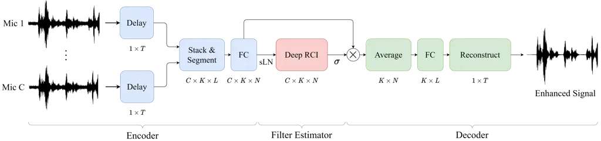

\dfsnetcameraready\name

Anton Kovalyov, Kashyap Patel, Issa Panahi

# DFSNet: A Steerable Neural Beamformer Invariant to Microphone Array Configuration for Real-Time, Low-Latency Speech Enhancement

###### Abstract

Invariance to microphone array configuration is a rare attribute in
neural beamformers. Filter-and-sum (FS) methods in this class define the
target signal with respect to a reference channel. However, this not
only complicates formulation in reverberant conditions but also the
network, which must have a mechanism to infer what the reference channel
is. To address these issues, this study presents Delay Filter-and-Sum
Network (DFSNet), a steerable neural beamformer invariant to microphone
number and array geometry for causal speech enhancement. In DFSNet,
acquired signals are first steered toward the speech source direction
prior to the FS operation, which simplifies the task into the estimation
of delay-and-summed reverberant clean speech. The proposed model is
designed to incur low latency, distortion, and memory and computational
burden, giving rise to high potential in hearing aid applications.
Simulation results reveal comparable performance to noncausal
state-of-the-art.

Index Terms: real-time, multi-channel, beamforming, speech enhancement,
neural network

## 1 Introduction

With recent advancements in deep learning, deep neural network
(DNN)-based beamformers, also known as neural beamformers, have gained
considerable traction in the literature \[1, 2, 3, 4\]. Neural
beamformers are known to outperform both statistical and DNN-based
single-channel methods on different tasks. Time-domain methods \[5, 6,
7\] are an increasingly popular class among neural beamformers because
of their high potential in latency-demanding applications, such as
hearing aids. However, unless retrained, the proposed networks rarely
provide invariance to microphone array configuration, i.e., microphone
number and array geometry, an attribute of special importance in ad-hoc
array scenarios.

The Filter-and-Sum Network (FaSNet) systems \[8, 9\] are
state-of-the-art (SOTA) in time-domain neural beamformers suitable for
ad-hoc arrays. FaSNet is an end-to-end system that performs framewise
filter-and-sum (FS) beamforming in the time domain. Consistent with
other multi-channel methods, FaSNet specifies its target signal with
respect to a reference microphone. Thus, when trained for speech
enhancement (SE), the target signal of FaSNet is the clean reverberant
speech at a reference microphone. However, this formulation introduces
two complications. (1) The model needs to somehow learn how to combine
the different-channel signals to both reduce noise as well as
reconstruct the direct path and reverberant components of speech at a
reference microphone. (2) As a consequence of array geometry invariance,
special processing with respect to the reference microphone must be
introduced, otherwise the model has no means to infer what the reference
microphone is.

Motivated by the above observations, this study proposes
Delay-Filter-and-Sum Network (DFSNet), a steerable neural beamformer
invariant to microphone array configuration for real-time, low-latency
SE. DFSNet operates in a framewise manner and follows a linear signal
model analogous to frequency-domain FS beamforming. In the proposed
model, time-domain waveforms are first delayed by a set of integer and
fractional delay finite impulse response (FIR) filters toward the speech
source direction. Delayed signals are then converted into a latent space
representation through a linear transformation. Next, masks for each
channel are estimated by a stack of recurrent channel interaction (RCI)
blocks, which efficiently combine recurrent processing with a channel
interaction (CI) technique similar to transform-average-concatenate
(TAC) \[9\]. Finally, FS is applied in the latent space representation
followed by a linear transformation to convert the result back to the
time domain. As a consequence of signal delay prior to FS, the target
signal of DFSNet is defined as the delay-and-sum (DS) clean reverberant
speech. With this approach, DFSNet simplifies the task into learning how
to collectively reduce noise at individual channels; avoids specifying a
reference microphone; and allows steering to different directions
without retraining.

DFSNet is benchmarked against SOTA, including causal and noncausal
FaSNet variants. Results show that the proposed method approaches and
sometimes exceeds the performance of noncausal systems. An ablation
study is also conducted.

## 2 Problem Formulation

Let us consider an array of $`C`$ microphones and arbitrary geometry in
a reverberant environment. The time-domain signal captured by the
$`c`$-th microphone is modeled by

```math
\mathbf{y}_{c}=\mathbf{x}_{c}+\mathbf{v}_{c}\,,\quad c=1,2,\ldots,C\,, \tag{1}
```

where $`\mathbf{x}_{c}`$ denotes clean reverberant speech and
$`\mathbf{v}_{c}`$ is noise. Let $`\mathbf{u}`$ and $`\mathbf{m}_{c}`$
be the 3-dimensional (3D) positions of the speech source and $`c`$-th
microphone, respectively. The time difference of arrival (TDOA) in
samples of the signal originating at $`\mathbf{u}`$ when received
between $`\mathbf{m}_{1}`$ and $`\mathbf{m}_{i}`$, for
$`i=2,3,\ldots,C`$, is given by

```math
\tau_{i}=fs^{-1}\left(||\mathbf{u}-\mathbf{m}_{1}||-||\mathbf{u}-\mathbf{m}_{i}||\right), \tag{2}
```

where $`f`$ is the sampling rate and $`s`$ is the propagation speed. We
set $`\mathbf{m}_{1}`$ to the furthest microphone position from source.
Let $`\tilde{\mathbf{\tau}}_{i}`$ be a known positive estimate of
$`\tau_{i}`$. We can align the acquired signals toward an approximate
direction of the speech source by

```math
\mathbf{y}_{i}^{a}=\left(\mathbf{h}_{F_{i}}\ast\mathbf{h}_{D_{i}}\right)\ast\mathbf{y}_{i}\,,\quad i=2,3,\ldots,C, \tag{3}
```

where $`\mathbf{h}_{D_{i}}`$ and $`\mathbf{h}_{F_{i}}`$ are causal
integer and fractional delay FIR filters, respectively, and $`\ast`$
denotes convolution. The subscripts
$`D_{i}=\lfloor\tilde{\tau}_{i}\rfloor`$ and
$`F_{i}=\tilde{\tau_{i}}-D_{i}`$ specify the sample delay of a filter
$`\mathbf{h}`$. Implementation of $`\mathbf{h}_{D_{i}}`$ is trivial,
whereas for $`\mathbf{h}_{F_{i}}`$, we employ sinc-based fractional
delay FIR filters \[10\] of equal length $`M`$. The latter incur a fixed
integer latency $`D=\lfloor\frac{M-1}{2}\rfloor`$. Hence,
$`\mathbf{y}_{1}`$ is also delayed¹¹ 1 This delay can be reduced in a
variable manner by adjusting $`\mathbf{h}_{D_{i}}`$ to also reflect upon
latency incurred by fractional delay filtering. to compensate for this
latency by

```math
\mathbf{y}_{1}^{a}=\mathbf{h}_{D}\ast\mathbf{y}_{1}\,, \tag{4}
```

Next, let us consider the causal DS beamformer in

```math
\mathbf{y}_{DS}=\dfrac{1}{C}\sum_{c=1}^{C}\mathbf{y}_{c}^{a}\,. \tag{5}
```

Applying (1), (3) and (4), we note that $`\mathbf{y}_{DS}`$ can be
separated into its speech component

```math
\mathbf{x}_{DS}=\frac{1}{C}\left[\mathbf{h}_{D}\ast\mathbf{x}_{1}+\sum_{i=2}^{C}\left(\mathbf{h}_{F_{i}}\ast\mathbf{h}_{D_{i}}\right)\ast\mathbf{x}_{i}\right] \tag{6}
```

and similarly defined noise component $`\mathbf{v}_{DS}`$. The problem
is formulated as causal estimation of $`\mathbf{x}_{DS}`$.

## 3 Delay-Filter-and-Sum Network (DFSNet)

As shown in Fig. 1, the processing pipeline of DFSNet consists of three
stages: encoder, filter estimator, and decoder.



Figure 1: System flowchart of the proposed DFSNet.

### 3.1 Encoder

At the encoder, input channels are first aligned applying (3) and (4) to
produce utterances $`\mathbf{y}^{a}_{c}`$ of length $`T`$ samples. Next,
each utterance is segmented into $`K`$ sequential overlapping frames of
length $`L`$ samples and 50% overlap. Let
$`\mathbf{y}^{a}_{c,k}\in\mathbb{R}^{1\times L}`$ be a segment
corresponding to channel $`c`$ and frame index $`k`$, for
$`k=1,2,\ldots,K`$. A linear transformation is then applied to convert
each $`\mathbf{y}^{a}_{c,k}`$ into an $`N`$-dimensional latent space
representation

```math
\mathbf{z}_{c,k}=\mathbf{y}^{a}_{c,k}\mathbf{B}_{e}\,, \tag{7}
```

where $`\mathbf{B}_{e}\in\mathbb{R}^{L\times N}`$ are weights of a fully
connected (FC) layer.

### 3.2 Filter Estimator

The filter estimator estimates channel and time-varying filters given by
mask vectors $`\hat{\mathbf{m}}_{c,k}\in\mathbb{R}^{1\times N}`$ for
application in the latent space corresponding to (7). In this module,
each $`\mathbf{z}_{c,k}`$ is first normalized applying sliding window
layer normalization (sLN) to reduce variability and speed up training,
followed by stacked RCI blocks and a sigmoid nonlinearity to ensure
nonnegative masks. Both sLN and RCI are proposed here and described
separately in Sections 3.4 and 3.5, respectively.

### 3.3 Decoder

At the decoder, estimated masks $`\hat{\mathbf{m}}_{c,k}`$ and latent
space representations $`\mathbf{z}_{c,k}`$ are multiplied and summed
across the channel dimension followed by transformation back to the time
domain by an FC layer with weights
$`\mathbf{B}_{d}\in\mathbb{R}^{N\times L}`$ and no bias. The complete
procedure is given by

```math
\hat{\mathbf{x}}_{DS,k}=\left(\dfrac{1}{C}\sum_{c=1}^{C}\hat{\mathbf{m}}_{c,k}\odot\mathbf{z}_{c,k}\right)\mathbf{B}_{d}\,, \tag{8}
```

where $`\odot`$ denotes element-wise product. An estimate of
$`\mathbf{x}_{DS}`$ is then reconstructed by the overlap-add operation.

The proposed encoder/decoder operations follow a linear signal model
analogous to frequency-domain FS beamforming, with the difference that
instead of short-time Fourier transform (STFT), we apply forward and
inverse transformations learned by the network. A linear signal model is
preferred here since it is not as likely to cause unpleasant distortions
as its nonlinear counterpart. Moreover, this model can be paired with
distortion control schemes \[11\] to behave similarly to a minimum
variance distortionless response (MVDR) beamformer \[12\], thus making
it especially suitable for hearing aid applications.

### 3.4 Sliding Window Layer Normalization (sLN)

The proposed sLN is similar to cumulative layer normalization (cLN)
\[13\] with the difference that normalization is performed over a
sliding window of fixed size $`R`$ rather than cumulatively, thus
allowing for better adaptation in applications where signal statistics
can drastically change over time. The proposed sLN is applied at each
channel independently as follows

```math
\displaystyle\text{sLN}\left(\mathbf{f}_{c,k}\right) \displaystyle=\dfrac{\mathbf{f}_{c,k}-\mu_{c,k}\mathbf{1}}{\sqrt{\sigma_{c,k}^{2}+\epsilon}}\odot\bm{\gamma}+\bm{\beta} \tag{9}
```

```math
\displaystyle\mu_{c,k} \displaystyle=\dfrac{1}{NR_{k}}\sum_{t=1}^{R_{k}}\sum_{n=1}^{N}f_{c,k-t+1,n}
```

```math
\displaystyle\sigma^{2}_{c,k} \displaystyle=\dfrac{1}{NR_{k}}\sum_{t=1}^{R_{k}}\sum_{n=1}^{N}\left(f_{c,k-t+1,n}-\mu_{c,k}\right)^{2}
```

```math
\displaystyle R_{k} \displaystyle=\min{\left\{k,R\right\}}\,,
```

where, $`\mathbf{f}_{c,k}\in\mathbb{R}^{1\times N}`$ is a channel and
time dependent input vector, $`\mathbf{1}\in\mathbb{R}^{1\times N}`$ is
a vector of ones, $`\bm{\gamma}\in\mathbb{R}^{1\times N}`$ and
$`\bm{\beta}\in\mathbb{R}^{1\times N}`$ are learnable parameters,
$`\mu_{c,k}`$ and $`\sigma^{2}_{c,k}`$ are sliding mean and variance
computed across time and feature dimensions, $`f_{c,*,n}`$ is the
$`n`$-th feature of $`\mathbf{f}_{c,*}`$, and $`R_{k}`$ is the window
size at time index $`k`$, which converges to $`R`$ once $`k\geq R`$. It
follows that for $`R=1`$, sLN behaves exactly like layer normalization
(LN) \[14\], whereas for $`R\geq K`$, it becomes cLN. The computational
overhead of sLN is negligeble if implemented applying dynamic
programming by means of two circular buffers of length $`R`$ each,
maintained at each channel independently. Thus, we only need to select
an $`R`$ that provides a good trade-off between performance and memory
cost.

### 3.5 Recurrent Channel Interaction (RCI)

The proposed RCI block combines gated recurrent units (GRUs) and a CI
technique similar to that in TAC \[9\] blocks. The aim is to gain
spatio-temporal context awareness, necessary for estimation of
beamforming filters, without sacrificing invariance to microphone number
and array geometry. In an RCI block, channel and time dependent input
features $`\mathbf{f}^{\text{in}}_{c,k}\in\mathbb{R}^{1\times N}`$ first
go through a parametric rectified linear unit activation (PReLU)
function \[15\], resulting in $`\mathbf{f}_{c,k}`$, followed by
averaging across the channel dimension by

```math
\bar{\mathbf{f}}_{k}=\dfrac{1}{C}\sum_{c=1}^{C}\mathbf{f}_{c,k}\,. \tag{10}
```

Then, the following sequence of operations is performed independently at
every channel. First, $`\mathbf{f}_{c,k}`$ and $`\bar{\mathbf{f}}_{k}`$
are uniformly partitioned into $`P`$ nonoverlapping feature bands,
denoted respectively as,
$`\mathbf{f}_{c,k,p}\in\mathbb{R}^{1\times N/P}`$ and
$`\bar{\mathbf{f}}_{k,p}\in\mathbb{R}^{1\times N/P}`$, for
$`p=1,2,\ldots,P`$. Then, for every $`p`$-th partition,
$`\mathbf{f}_{c,k,p}`$ and $`\bar{\mathbf{f}}_{k,p}`$ are concatenated
and fed to a corresponding GRU layer of $`H/P`$ units in a parallel
manner as follows

```math
\mathbf{f}^{\prime}_{c,k,p}=\text{GRU}_{p}\left(\left[\mathbf{f}_{c,k,p},\bar{\mathbf{f}}_{k,p}\right]\right),\quad p=1,2,\ldots,P\,, \tag{11}
```

where the indexing $`p`$ in $`\text{GRU}_{p}\left(\cdot\right)`$ is used
to clarify that we do not include parameter sharing (PS) between GRUs
applied at different partitions. The resulting outputs are then
concatenated back to form
$`\mathbf{f}^{\prime}_{c,k}\in\mathbb{R}^{1\times H}`$, followed by
applying an FC layer, with weights
$`\mathbf{B}\in\mathbb{R}^{H\times N}`$ and bias vector
$`\mathbf{b}\in\mathbb{R}^{1\times N}`$, in sequence with sLN. Finally,
we add a skip connection between the output and $`\mathbf{f}_{c,k}`$ to
ease learning in a similar manner as in a ResNet \[16\]. The entire
procedure is given by

```math
\mathbf{f}^{\text{out}}_{c,k}=\text{sLN}\left(\mathbf{f}^{\prime}_{c,k}\mathbf{B}+\mathbf{b}\right)+\mathbf{f}_{c,k}\,. \tag{12}
```

The FC layer is used for transformation back to the encoding dimension
while allowing communication across the different feature partitions.
The purpose of feature partitioning combined with parallel application
of $`P`$ GRU layers with no PS is to evenly reduce both the number of
parameters and operations by a factor of $`P`$. Inspired by the concept
of group convolution \[17\], we refer to the operation in (11) as group
GRU.

### 3.6 Local and Global Processing

Operations in the proposed DFSNet can be divided into local, i.e.,
intra-channel operations such as (7), (9) and (11); and global, i.e.,
inter-channel operations such as (10) and the matrix multiplication in
(8). The parameters involving local operations are shared across
channels, whereas states, e.g., hidden states in GRUs, are channel
dependent. The lack of reference channel processing is attributed to the
channel-alignment procedures in (3) and (4) combined with the DS target
signal definition in (6).

### 3.7 Optimization

For improved scalability to increasing number of microphones, we want to
decrease the ratio of local to global operations. For this purpose, the
group GRU operation in (11) can be optimized to compute the GRU’s matrix
multiplication involving $`\bar{\mathbf{f}}_{k,p}`$ only once and reuse
the result.

## 4 Experiments

We evaluate the performance of the proposed DFSNet on the task of SE in
a reverberant environment.

### 4.1 Dataset

A dataset is generated using clean speech utterances from LibriSpeech
\[18\] mixed with noise utterances from WHAM! \[19\] to simulate noisy
speech captured by a microphone array of arbitrary number of microphones
and geometry in a reverberant room. The dataset generates 40960, 5120,
and 6144, 4-second-long utterances for training, validation, and
testing, respectively. The sampling frequency is set to 16 kHz. The
training and validation sets are evenly split to consider arbitrary
array configurations of 2, 3, 4, 5, and 6 microphones, whereas the test
set is evenly split to only consider arbitrary array configurations of
2, 4, and 6 microphones. For each utterance, the dimensions of the room
are uniformly sampled between 5 and 10 meters in length and width, and 2
to 4 meters in height. The reverberation time ranges randomly between
0.1 and 0.5 seconds and the sound propagation speed $`s`$ is fixed to
343 m/s. The 3D microphone positions are randomly selected within 15 cm
from the middle of the room. A single speech source along with a
randomly varying number between 1 and 4 noise sources are considered.
The overall signal-to-noise ratio (SNR) is set to range uniformly
between -5 and 15 dB. The different sources are randomly distributed
around the room with the constraint of being at least 50 cm away from
the walls, and the image method \[20\] is applied to compute the
corresponding room impulse responses (RIRs). Finally, with the aim of
simulating noise in the channel alignment procedure in (3) and (4) that
forms a beam toward the desired source, i.e., the speech source in this
particular case, the TDOAs in (2) are corrupted to reflect a uniformly
and disjointly sampled error between 0 and 5 degrees in azimuth and
elevation angles with respect to the source’s true position.

### 4.2 Training and Network Configuration

DFSNet is trained for 50 epochs with Adam \[21\] optimizer and a batch
size of 8. The initial learning rate is set to 1e-3 and an exponential
decay of 0.98 is applied every epoch. The training objective is given by
maximization of scale invariant signal-to-distortion ratio (SI-SDR)
\[22\]. The target signal is the delay-and-summed reverberant clean
speech $`\mathbf{x}_{DS}`$ as defined in (5). The frame length $`L`$ is
set to 64 samples, thus causing a latency of 4 ms without counting
processing time, which cannot exceed 2 ms. The length of the fractional
delay FIR filters $`\mathbf{h}_{F_{i}}`$ in (3) is set to 17. These
filters incur an additional latency of 0.5 ms. The encoding and hidden
dimensions $`N`$ and $`H`$ are set to 128 and 256, respectively. The
number of RCI blocks in the filter estimation module and the number of
partitions $`P`$ in (11) are both set to 4. Finally, the window length
$`R`$ in sLN is set to 1000, which is equivalent to a receptive field of
2 seconds.

### 4.3 Performance Metrics

The performance metrics used are: SI-SDR (dB), Perceptual Evaluation of
Speech Quality (PESQ) \[23\], and Short-Time Objective Intelligibility
(STOI) \[24\].

## 5 Results and Analysis

### 5.1 Comparison with Causal and Noncausal SOTA

For benchmarking purposes, DFSNet is compared to causal and non-causal
SOTA in time-domain models, namely, the causal two-stage FaSNet \[8\]
(FaSNet) and the non-causal single-stage FaSNet with TAC \[9\]
(FaSNet-TAC) multi-channel models, as well as the Convolutional Time
Audio Separation Network \[13\] (Conv-TasNet) and dual-path recurrent
neural network TasNet \[25\] (DPRNN-TasNet) single-channel models. These
are trained under the same conditions as DFSNet. The target signal is
the reverberant clean speech at a reference microphone, selected as the
closest microphone to source due to its highest SNR. For FaSNet-TAC,
Conv-TasNet, and DPRNN-TasNet, we employ, respectively, the best
performing configuration in \[9\], the causal configuration in \[13\],
and the 2-ms-frame-size configuration in \[25\]. For FaSNet, the same
causal configuration in \[8\] is employed, with the difference that, to
compensate for the use of a higher sampling rate, we increase the number
of input channels in each convolutional block and the embedding
dimension from 64 to 80. For further reference, the well-known
frequency-domain MVDR \[12\] beamformer is also evaluated. For MVDR, we
consider the formulation without dereverberation and employ Hann
windowing with 50% overlap, and a frame size of 32 ms. The second order
statistics of speech and noise, required by MVDR, are estimated with the
actual speech and noise utterances prior mixing.

|              |                 |                 |         |            |                     |                                  |                               |                               |
| ------------ | --------------- | --------------- | ------- | ---------- | ------------------- | -------------------------------- | ----------------------------- | ----------------------------- |
| Method       | Multi- channel  | Causal          | Latency | Model size | GMAC/s (2/4/6 mics) | SI-SDR (2/4/6 mics)              | PESQ (2/4/6 mics)             | STOI (2/4/6 mics)             |
| Unprocessed  | $`\bm{\times}`$ | ✓               | 0.1 ms  | –          | –                   | 5.04/5.04/5.04                   | 1.78/1.78/1.78                | 0.75/0.75/0.75                |
| MVDR         | ✓               | $`\bm{\times}`$ | –       | –          | –                   | 7.24/9.13/9.43                   | 2.15/2.66/2.91                | 0.83/0.89/0.91                |
| Conv-TasNet  | $`\bm{\times}`$ | ✓               | 2.0 ms  | 5.00M      | 5.23                | 10.87/10.89/10.91                | 2.35/2.35/2.35                | 0.84/0.84/0.85                |
| DPRNN-TasNet | $`\bm{\times}`$ | $`\bm{\times}`$ | –       | 2.60M      | 5.80                | 12.21/12.37/12.30                | 2.66/2.68/2.66                | 0.87/0.87/0.87                |
| FaSNet       | ✓               | ✓               | 4.0 ms  | 1.66M      | 1.64/3.29/4.93      | 10.71/11.36/11.45                | 2.24/2.34/2.36                | 0.84/0.86/0.86                |
| FaSNet-TAC   | ✓               | $`\bm{\times}`$ | –       | 2.76M      | 5.29/9.92/14.56     | 12.87/13.91/14.22                | 2.77/2.95/2.99                | 0.88/0.90/0.91                |
| DFSNet       | ✓               | ✓               | 4.5 ms  | 0.55M      | 0.50/0.94/1.38      | 9.38/9.01/8.62 12.29/13.87/14.29 | 2.56/2.77/2.82 2.61/2.88/2.97 | 0.86/0.89/0.89 0.87/0.91/0.92 |

Table 1: Comparison with SOTA. Performance measures are computed with
respect to clean reverberant speech at closest microphone to source.
Bottom of row in DFSNet includes performance results with respect to DS
clean reverberant speech.

Table 1 reports the results. GMAC/s specifies a model’s Giga
Multiply-Accumulate operations per second. We notice that DFSNet
underperforms in SI-SDR when evaluated with respect to a reference
microphone, especially as the microphone number increases. However, when
it comes to perception and intelligibility, DFSNet outperforms all
causal methods by a significant margin. Additionally, when evaluated
with respect to its target signal, DFSNet outperforms MVDR in all cases,
and, with just two microphones, attains comparable performance to the
noncausal DPRNN-TasNet. Moreover, when the number of microphones
increases, DFSNet approaches and in certain cases exceeds the
performance of the noncausal FaSNet-TAC. We further note that DFSNet
incurs only a fraction of memory and computational cost of SOTA models,
which is largely attributed to the proposed feature partitioning scheme
in RCI blocks.

### 5.2 Ablation study

|       |                 |       |                 |            |                       |                   |
| ----- | --------------- | ----- | --------------- | ---------- | --------------------- | ----------------- |
| $`P`$ | PS              | $`R`$ | CI              | Model size | GMAC/s (local/global) | SI-SDR /PESQ/STOI |
| 1     | –               | 1000  | ✓               | 1.73M      | 0.66/0.20             | 13.46/2.80/0.90   |
| 4     | ✓               | 1000  | ✓               | 0.25M      | 0.22/0.05             | 12.99/2.71/0.89   |
| 4     | $`\bm{\times}`$ | 1000  | ✓               | 0.55M      | 0.22/0.05             | 13.48/2.82/0.90   |
| 4     | $`\bm{\times}`$ | 2000  | ✓               | 0.55M      | 0.22/0.05             | 13.44/2.79/0.90   |
| 4     | $`\bm{\times}`$ | 1     | ✓               | 0.55M      | 0.22/0.05             | 13.27/2.79/0.90   |
| 4     | $`\bm{\times}`$ | –     | ✓               | 0.55M      | 0.22/0.05             | 12.78/2.58/0.88   |
| 4     | $`\bm{\times}`$ | 1000  | $`\bm{\times}`$ | 0.45M      | 0.22/0.00             | 11.24/2.42/0.86   |

Table 2: Ablation study. When CI is not set, only local features are
processed. Unspecified $`R`$ implies no normalization.

We also conduct an ablation study to analyze the effect of the following
design choices in DFSNet: feature partitioning; no PS in group GRU;
normalization with sLN; and inclusion of CI through the
average-group-concatenate scheme. Table 2 reports the ablation results
on the entire test set. We note that feature partitioning without PS is
highly effective in reducing model size and overall GMAC/s without
negative impact on performance. We also verify that the use of sLN
improves results by a noticeable margin, with $`R=1000`$ attaining the
best trade-off between performance and memory cost. Finally, we confirm
that despite its low memory and computational cost, CI is indeed
effective.

## 6 Conclusion

This paper proposed DFSNet, a steerable neural beamformer invariant to
microphone array configuration for real-time SE. In contrast to
conventional FS methods, DFSNet performs a channel alignment procedure
prior to applying the FS operation, which simplifies the beamforming
task into the estimation of DS clean reverberant speech. The proposed
model incurs low latency, distortion, and memory and computational
burden, making it suitable for hearing aid applications. Comparison with
SOTA revealed that DFSNet outperforms causal methods in perception and
intelligibility by a large margin. Additionally, we noted that DFSNet
outperforms MVDR and approaches the performance of the noncausal
FaSNet-TAC.

## 7 Acknowledgements

The authors would like to thank the funding organization of this
research project.

## References

- \[1\] Z. Zhang, Y. Xu, M. Yu, S.-X. Zhang, L. Chen, and D. Yu,
  “Adl-mvdr: All deep learning mvdr beamformer for target speech
  separation,” in _ICASSP 2021-2021 IEEE International Conference on
  Acoustics, Speech and Signal Processing (ICASSP)_. IEEE, 2021, pp.
  6089–6093.
- \[2\] T. Ochiai, M. Delcroix, R. Ikeshita, K. Kinoshita, T. Nakatani,
  and S. Araki, “Beam-tasnet: Time-domain audio separation network meets
  frequency-domain beamformer,” in _ICASSP 2020-2020 IEEE International
  Conference on Acoustics, Speech and Signal Processing (ICASSP)_. IEEE,
  2020, pp. 6384–6388.
- \[3\] W. Liu, A. Li, C. Zheng, and X. Li, “A separation and
  interaction framework for causal multi-channel speech enhancement,”
  _Digital Signal Processing_, vol. 126, p. 103519, 2022.
- \[4\] T. Yoshioka, X. Wang, D. Wang, M. Tang, Z. Zhu, Z. Chen, and
  N. Kanda, “Vararray: Array-geometry-agnostic continuous speech
  separation,” in _ICASSP 2022 - 2022 IEEE International Conference on
  Acoustics, Speech and Signal Processing (ICASSP)_, 2022, pp.
  6027–6031.
- \[5\] R. Gu and Y. Zou, “Temporal-spatial neural filter: Direction
  informed end-to-end multi-channel target speech separation,” _arXiv
  preprint arXiv:2001.00391_, 2020.
- \[6\] A. Kovalyov, K. Patel, and I. Panahi, “Dsenet: Directional
  signal extraction network for hearing improvement on edge devices,”
  _IEEE Access_, vol. 11, pp. 4350–4358, 2023.
- \[7\] K. Patel, A. Kovalyov, and I. Panahi, “Ux-net:
  Filter-and-process-based improved u-net for real-time time-domain
  audio separation,” _arXiv preprint arXiv:2210.15822_, 2022.
- \[8\] Y. Luo, C. Han, N. Mesgarani, E. Ceolini, and S.-C. Liu,
  “Fasnet: Low-latency adaptive beamforming for multi-microphone audio
  processing,” in _2019 IEEE automatic speech recognition and
  understanding workshop (ASRU)_. IEEE, 2019, pp. 260–267.
- \[9\] Y. Luo, Z. Chen, N. Mesgarani, and T. Yoshioka, “End-to-end
  microphone permutation and number invariant multi-channel speech
  separation,” in _ICASSP 2020 - 2020 IEEE International Conference on
  Acoustics, Speech and Signal Processing (ICASSP)_, 2020, pp.
  6394–6398.
- \[10\] “Design of fractional delay fir filters,”
  [https://www.mathworks.com/help/dsp/ug/design-of-fractional-delay-fir-filters.html](https://www.mathworks.com/help/dsp/ug/design-of-fractional-delay-fir-filters.html),
  accessed: 2022-12-30.
- \[11\] Y. Luo, C. Han, and N. Mesgarani, “Distortion-controlled
  training for end-to-end reverberant speech separation with auxiliary
  autoencoding loss,” in _2021 IEEE Spoken Language Technology Workshop
  (SLT)_, 2021, pp. 825–832.
- \[12\] E. A. Habets, J. Benesty, S. Gannot, and I. Cohen, “The mvdr
  beamformer for speech enhancement,” in _Speech processing in modern
  communication_. Springer, 2010, pp. 225–254.
- \[13\] Y. Luo and N. Mesgarani, “Conv-tasnet: Surpassing ideal
  time–frequency magnitude masking for speech separation,” _IEEE/ACM
  transactions on audio, speech, and language processing_, vol. 27,
  no. 8, pp. 1256–1266, 2019.
- \[14\] J. L. Ba, J. R. Kiros, and G. E. Hinton, “Layer normalization,”
  _arXiv preprint arXiv:1607.06450_, 2016.
- \[15\] K. He, X. Zhang, S. Ren, and J. Sun, “Delving deep into
  rectifiers: Surpassing human-level performance on imagenet
  classification,” in _Proceedings of the IEEE international conference
  on computer vision_, 2015, pp. 1026–1034.
- \[16\] ——, “Deep residual learning for image recognition,” in
  _Proceedings of the IEEE conference on computer vision and pattern
  recognition_, 2016, pp. 770–778.
- \[17\] X. Zhang, X. Zhou, M. Lin, and J. Sun, “Shufflenet: An
  extremely efficient convolutional neural network for mobile devices,”
  in _Proceedings of the IEEE conference on computer vision and pattern
  recognition_, 2018, pp. 6848–6856.
- \[18\] V. Panayotov, G. Chen, D. Povey, and S. Khudanpur,
  “Librispeech: An asr corpus based on public domain audio books,” in
  _2015 IEEE International Conference on Acoustics, Speech and Signal
  Processing (ICASSP)_, 2015, pp. 5206–5210.
- \[19\] G. Wichern, J. Antognini, M. Flynn, L. R. Zhu, E. McQuinn,
  D. Crow, E. Manilow, and J. Le Roux, “Wham!: Extending speech
  separation to noisy environments,” in _Proc. Interspeech_, Sep. 2019.
- \[20\] J. B. Allen and D. A. Berkley, “Image method for efficiently
  simulating small-room acoustics,” _The Journal of the Acoustical
  Society of America_, vol. 65, no. 4, pp. 943–950, 1979.
- \[21\] D. P. Kingma and J. Ba, “Adam: A method for stochastic
  optimization,” _arXiv preprint arXiv:1412.6980_, 2014.
- \[22\] J. Le Roux, S. Wisdom, H. Erdogan, and J. R. Hershey,
  “Sdr–half-baked or well done?” in _ICASSP 2019-2019 IEEE International
  Conference on Acoustics, Speech and Signal Processing (ICASSP)_. IEEE,
  2019, pp. 626–630.
- \[23\] A. Rix, J. Beerends, M. Hollier, and A. Hekstra, “Perceptual
  evaluation of speech quality (pesq)-a new method for speech quality
  assessment of telephone networks and codecs,” in _2001 IEEE
  International Conference on Acoustics, Speech, and Signal Processing.
  Proceedings (Cat. No.01CH37221)_, vol. 2, 2001, pp. 749–752 vol.2.
- \[24\] C. H. Taal, R. C. Hendriks, R. Heusdens, and J. Jensen, “An
  algorithm for intelligibility prediction of time–frequency weighted
  noisy speech,” _IEEE Transactions on Audio, Speech, and Language
  Processing_, vol. 19, no. 7, pp. 2125–2136, 2011.
- \[25\] Y. Luo, Z. Chen, and T. Yoshioka, “Dual-path rnn: efficient
  long sequence modeling for time-domain single-channel speech
  separation,” in _ICASSP 2020-2020 IEEE International Conference on
  Acoustics, Speech and Signal Processing (ICASSP)_. IEEE, 2020, pp.
  46–50.
