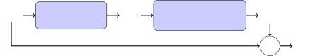
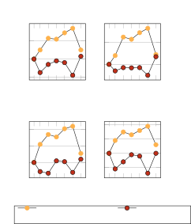

Signal Processing (SP), Universität Hamburg, Germany

DSFE  
deep subband filtering extension

STFT  
short-time Fourier transform

iSTFT  
inverse short-time Fourier transform

DNN  
deep neural network

PESQ  
Perceptual Evaluation of Speech Quality

WPE  
weighted prediction error

PSD  
power spectral density

RIR  
room impulse response

SNR  
signal-to-noise ratio

SI-  
scale-invariant

SIR  
signal-to-interference ratio

SDR  
signal-to-distortion ratio

SAR  
signal-to-artifacts ratio

LSTM  
long short-term memory

POLQA  
Perceptual Objectve Listening Quality Analysis

SDR  
signal-to-distortion ratio

ESTOI  
Extended Short-Term Objective Intelligibility

ELR  
early-to-late reverberation ratio

TCN  
temporal convolutional network

RLS  
recursive least squares

ASR  
Automatic speech recognition

HA  
hearing aid

CI  
cochlear implant

MAC  
multiply-and-accumulate

DRR  
direct-to-reverberation ratio

TF  
time-frequency

# Extending DNN-based Multiplicative Masking to Deep Subband Filtering for Improved Dereverberation

Jean-Marie Lemercier, Julian Tobergte, Timo Gerkmann ^(†)^(†)thanks:
This work has been funded by the Federal Ministry for Economic Affairs
and Climate Action, project 01MK20012S, AP380. The authors are
responsible for the content of this paper.

###### Abstract

In this paper, we present a scheme for extending deep neural
network-based multiplicative maskers to deep subband filters for speech
restoration in the time-frequency domain. The resulting method can be
generically applied to any deep neural network providing masks in the
time-frequency domain, while requiring only few more trainable
parameters and a computational overhead that is negligible for
state-of-the-art neural networks. We demonstrate that the resulting deep
subband filtering scheme outperforms multiplicative masking for
dereverberation, while leaving the denoising performance virtually the
same. We argue that this is because deep subband filtering in the
time-frequency domain fits the subband approximation often assumed in
the dereverberation literature, whereas multiplicative masking
corresponds to the narrowband approximation generally employed for
denoising.

^(†)^(†)address: ^(†)^(†)email: {firstname.lastname}@uni-hamburg.de

Index Terms: multi-frame filtering, subband approximation,
dereverberation, denoising, neural network

## 1 Introduction

In modern communication devices, recorded speech is corrupted when clean
speech sources are affected by interfering speakers, background noise
and room acoustics. Speech restoration aims to recover clean speech from
the corrupted signal, whereby two distinct tasks, denoising and
dereverberation, are considered here \[1, 2\].

Traditional speech restoration algorithms are based on statistical
methods, exploiting properties of the target and interfering signals to
discriminate between them \[3\]. These include linear prediction \[4\],
spectral enhancement \[5\], inverse filtering \[6\], and cepstral
processing \[7\]. Modern approaches rely mostly on machine learning. In
this field, predictive methods, learning a one-to-one mapping between
corrupted and clean speech through a dnn (dnn), are most popular \[8,
9\]. A large portion of dnn used in speech restoration are trained for
mask estimation, i.e. they learn a mask value to be applied to each
single bin of the signal, either in a learnt domain \[10\] or in the tf
(tf) domain \[11, 12\]. On the opposite, some approaches employ deep
filtering \[13\], which means that their final stage involves a
convolution between the input signal and a learnt multi-frame tf filter
\[14, 15, 16, 17, 18, 19, 20\]. In \[17\], this filter is parameterized
as a multi-frame MVDR \[21\] for denoising. A DNN-parameterized weighted
prediction error subband filter is proposed in \[19, 18, 20\]. A deep
filter can also be directly learnt, e.g. in \[15\] as a
frequency-independent time filter or in \[13, 14\] as a joint
time-frequency filter.

In this paper, we propose a dsfe (dsfe) scheme to transform
masking-based speech restoration dnn into deep subband filters. The
proposed extension is implemented by using a learnable temporal
convolution at the output of the original masking dnn backbone and
training the resulting architecture in an end-to-end fashion in the tf
domain. Most of the time, the original masking dnn already handles
multi-frame filtering internally through e.g. temporal convolutions.
However, we show that enforcing explicit multi-frame subband filtering
as the final stage of processing results in a significant performance
increase for dereverberation while leaving the denoising performance
virtually unaltered. We justify our approach by relating time-frequency
multiplicative masking and deep subband filtering to the noising and
reverberation corruption models respectively. The proposed approach has
a negligible computational overhead and constitutes a generic module
that can be plugged in any masking-based system.

The remainder of this paper is organized as follows. We first present an
overview of the signal model and prerequisite assumptions for
reverberation and noising corruptions. Then, we introduce our deep
subband filtering extension scheme. We proceed with describing our
experimental setup including data generation and training configuration.
Finally we present and discuss our results.

## 2 Signal model

### 2.1 Narrowband and subband filtering

Filtering in the time-domain is obtained via convolution of a filter
$`{w}`$ with the speech signal $`{s}`$, yielding the filtered signal
$`{x}`$:

```math
{x}_{t}\text{}=\text{}\sum_{\tau}\text{}{w}_{\tau}\text{}{s}_{t-\tau}, \tag{1}
```

where $`t`$ is the time index. A well-known result of Fourier theory is
that, when transposed in the Fourier domain, such a filtering process
can be expressed as a multiplication of the Fourier spectra. When using
the stft (stft) however, the window used for analysis is of limited
size, and spectral leakage between frequency bands can occur.
Consequently, the true filtering model is:

```math
\mathbf{x}_{t,f}\text{}=\text{}\sum_{\tau}\text{}\sum_{\nu}\text{}\tilde{\mathbf{w}}_{\tau,f,\nu}\text{}\mathbf{s}_{t-\tau,\nu}, \tag{2}
```

where $`f`$ is the frequency index,
$`\mathbf{x}\text{}:=\text{}\mathrm{STFT}({x})`$,
$`\mathbf{s}\text{}:=\text{}\mathrm{STFT}({s})`$ and
$`\tilde{\mathbf{w}}_{\tau,f,\nu}`$ is interpreted as a response to a
time-frequency impulse $`\delta_{\tau,f-\nu}`$ \[22\]. The sum over
index $`\nu`$ represents cross-band filtering, and the sum over index
$`\tau`$ is a convolution along the time dimension.

The subband approximation ignores the effects of spectral leakage.
Therefore, cross-band filtering is discarded and a single convolution is
computed along the time-dimension in each frequency band independently:

```math
\mathbf{x}_{t,f}\text{}=\text{}\sum_{\tau}\text{}\mathbf{w}_{\tau,f}\text{}\mathbf{s}_{t-\tau,f}, \tag{3}
```

where $`\mathbf{w}:=\mathrm{STFT}({w})`$.

The narrowband approximation further assumes that the length of the
filter $`{w}`$ is inferior to the stft window length, therefore zeroing
out the filter taps $`\{\mathbf{w}_{\tau,f};\tau\geq 1\}`$ and yielding
the following filtering model :

```math
\mathbf{x}_{t,f}\text{}=\text{}\mathbf{w}_{f}\text{}\mathbf{s}_{t,f}. \tag{4}
```

### 2.2 Corruption models

Speech denoising consists in removing additive background noise $`n`$
from the mixture $`x`$. The forward corruption process can naturally be
represented in the stft domain by addition of the clean speech and noise
spectrograms:

```math
\mathbf{x}\text{}=\text{}\mathbf{n}\text{}+\text{}\mathbf{s}. \tag{5}
```

Many speech denoising approaches use time-frequency masking, i.e. they
compute a mask $`\mathbf{m}`$ for each time-frequency bin and apply it
to retrieve the clean speech estimate $`\hat{\mathbf{s}}`$:

```math
\hat{\mathbf{s}}_{t,f}\text{}=\text{}(\mathbf{m}\text{}\odot\text{}\mathbf{x})_{t,f}\text{}:=\text{}\mathbf{m}^{t}_{f}\text{}\mathbf{x}_{t,f}. \tag{6}
```

This model is similar to the narrowband approximation (4) with a
time-dependent filter $`\mathbf{m}`$. We put the index $`t`$ as
superscript to avoid confusion with the time-convolution index $`\tau`$.

In contrast to denoising, speech dereverberation aims to recover the
anechoic speech corrupted by room acoustics. The signal model is exactly
the filtering process in (1), where the filter $`{w}`$ is called the rir
(rir). Since the rir length is almost always larger than the stft window
length, one cannot use the narrowband approximation (4) and has to
resort to the subband approximation (3) instead. Consequently, some
speech dereverberation methods perform inverse filtering in the stft
domain using the subband approximation \[14, 4, 19, 18, 20\]. That is,
they try and estimate a filter $`\bar{\mathbf{m}}`$ supposed to
represent the inverse of the rir, such that the anechoic speech estimate
is retrieved as:

```math
\hat{\mathbf{s}}_{t,f}\text{}=\text{}(\bar{\mathbf{m}}\text{}\ast\text{}\mathbf{x})_{t,f}\text{}:=\text{}\sum_{\tau}\text{}\bar{\mathbf{m}}^{t}_{\tau,f}\text{}\mathbf{x}_{t-\tau,f}, \tag{7}
```

with $`\ast`$ representing a convolution over the time-axis. Please note
that in the model above in contrast to (3), the filter
$`\bar{\mathbf{m}}`$ is considered time-dependent, same as in the
time-frequency masking case. This is often assumed in order to account
for non-stationarity of the rir and estimation errors \[23, 18, 20,
24\].

## 3 Deep subband filtering extension



Figure 1: Proposed model diagram. The blue blocks are learnable neural
networks.

Many neural network-based schemes use time-frequency masking, without
examining the nature of the corruption. In this section, we present our
dsfe scheme, which turns the time-frequency masks produced by such dnn
into subband filters. Let $`f_{\theta}`$ be a dnn providing a mask
$`\mathbf{m}=f_{\theta}(\mathbf{x})`$ in the complex spectrogram domain,
such that the clean spectrogram estimate is obtained via time-frequency
masking (6).

We wish to extend the mask $`\mathbf{m}`$ into a filter
$`\bar{\mathbf{m}}`$ implemented by the neural network combination
$`\bar{\mathbf{m}}=g_{\phi}(f_{\theta}(\mathbf{x}))`$, such that the
clean estimate is obtained via subband filtering (7). Essentially, we
want to turn masking dnn into deep subband filters \[13\]. To this end,
we design the deep subband filtering extension $`g_{\phi}`$ as a
point-wise two-dimensional convolutional layer with tanh activation. The
maps are of size $`T\times F`$, the kernels of size $`1\times 1`$ and
there are $`2`$ input and $`2N_{f}`$ output channels corresponding to
the single-frame mask and multi-frame filter real and imaginary parts,
respectively:

```math
g_{\phi}\text{}:\text{}\mathbf{m}\text{}\rightarrow\text{}\bar{\mathbf{m}}\text{}=\text{}\frac{1}{N_{f}}\tanh\text{}\left(\mathrm{Conv2D}(\mathbf{m}\text{};\text{}\phi)\right). \tag{8}
```

Note that we feed the spectrogram $`\mathbf{x}`$ to the neural network
and only use the multi-frame representation
$`\{\mathbf{x}_{t-\tau,f};\tau\in[0,1,...,N_{f}-1]\}`$ for filtering.
This is because the multi-frame representation does not add any relevant
information with respect to $`\mathbf{x}`$: since most dnn compute
correlations along the time-dimension already, it is redundant to
provide a vector which explicitly encodes that time-delayed information.
The proposed algorithm is summarized on Figure 1.

As the corresponding inverse filtering model better fits the corruption
model for reverberation, we expect our dsfe method to perform better at
dereverberation than its masking counterpart, and not produce
significant changes for denoising.

## 4 Experimental setup

### 4.1 Data

Both datasets for denoising and dereverberation experiments use the WSJ0
corpus \[25\] for clean speech sources. The training, validation and
test splits comprise 101, 10 and 8 speakers for a total of 12777, 1206
and 651 utterances and a length of 25, 2.3 and 1.5 hours of speech
respectively, sampled at $`16`$ kHz.

Speech Denoising:  The WSJ0+Chime dataset is generated using clean
speech extracts from the WSJ0 corpus and noise signals from the CHiME3
dataset \[26\]. The mixture signal is created by randomly selecting a
noise file and adding it to a clean utterance with a snr (snr) sampled
uniformly between -6 and 14 dB.

Speech Dereverberation:  The WSJ0+Reverb dataset is generated using
clean speech data from the WSJ0 corpus and convolving each utterance
with a simulated rir. We use the pyroomacoustics library \[27\] to
simulate the rir. The reverberant room is modeled by sampling uniformly
a target $`T_{\mathrm{60}}`$ between 0.4 and 1.0 seconds and room
length, width and height in \[5,15\]$`\times`$\[5,15\]$`\times`$\[2,6\]
m. The anechoic target is generated using the
$`T_{\mathrm{60}}`$-shortening method \[28\], where the rir is shaped by
a decaying exponential window so that the resulting $`T_{\mathrm{60}}`$
equals $`200`$ms. This results in an average drr (drr) of -5.3 dB.

### 4.2 Single-frame DNN backbone

In this paper, we use the GaGNet architecture by \[11\], a
state-of-the-art denoising neural network, which is the successor of
\[29\] which ranked first in the real-time enhancement track of the
DNS-2021 challenge. GaGNet leverages magnitude-only and complex-domain
information in parallel with temporal convolutional networks. The
rationale is to obtain a coarse estimation with the magnitude-processing
glance modules, and to refine this estimation with gaze modules
processing the real and imaginary parts of the complex spectrogram.
Between each repeated glance and gaze module, an approximate complex
ratio mask \[12\] is applied on the current version of the signal to
enforce a coherent filtering process and stabilize training. Finally,
the network outputs multiplicative mask values for the real and
imaginary parts. We name our proposed method DSFE-GaGNet, which is the
concatenation of GaGNet with the DSFE module $`g_{\phi}`$. Although we
focus on GaGNet in this work, please note that our dsfe method is
compatible with any architecture performing mask estimation in the
complex stft domain. It could even be envisaged to use a similar
extension in a different domain e.g. learnt by an dnn encoder.

### 4.3 Training configuration

We use the same training configuration as GaGNet \[11\]: the stft uses a
Hann window with $`320`$ points and $`50\%`$ overlap at a sample rate of
$`16`$ kHz. We employ square-root compression on the magnitude
spectrogram. Therefore, the features that are fed to GaGNet are:
$`\mathrm{cat}(\sqrt{|\mathbf{x}|}\text{}\cos(\phi_{x})\text{},\text{}\sqrt{|\mathbf{x}|}\text{}\sin(\phi_{x}))`$,
where $`\mathbf{x}\text{}=\text{}|\mathbf{x}|\text{}\exp(j\phi_{x})`$ is
the noisy complex spectrogram. The training loss is a sum of mean square
errors with respect to the real part, imaginary part and magnitude of
the clean and estimated spectrograms. The networks are trained with the
Adam optimizer with a learning rate of $`0.0005`$. Contrarily to \[11\],
we use mini-batches of size $`48`$ and use early stopping with a
patience of $`50`$ epochs and a maximum of $`2000`$ epochs.


Figure 2: Log-energy spectrograms of clean, reverberant and processed
signals form the WSJ0+Reverb dataset. The harmonic structure in the red
circle is altered with GaGNet and better preserved with DSFE-GaGNet.
$`\mathrm{T}_{\mathrm{60}}=0.85\mathrm{s}`$.

### 4.4 Evaluation

We conduct instrumental evaluation using classical speech metrics like
polqa (polqa) \[30\], pesq (pesq) \[31\], estoi (estoi) \[32\] as well
as si (si) sdr (sdr), sir (sir) and sar (sar) \[33\]. We also report the
number of million single-point floating operations per second of
processed speech (MFLOPS$`\cdot\mathrm{s}^{-1}`$) as provided by the
pypapi library¹¹ 1 https://github.com/flozz/pypapi.

## 5 Experimental results and discussion

|             |           |                   |                   |                   |                 |                  |                 |                                |
| ----------- | --------- | ----------------- | ----------------- | ----------------- | --------------- | ---------------- | --------------- | ------------------------------ |
| Method      | $`N_{f}`$ | POLQA             | PESQ              | ESTOI             | SI-SDR          | SI-SIR           | SI-SAR          | MFLOPS$`\cdot\mathrm{s}^{-1}`$ |
| Mixture     | $`-`$     | 1.94 $`\pm`$ 0.40 | 1.51 $`\pm`$ 0.30 | 0.62 $`\pm`$ 0.12 | 1.2 $`\pm`$ 2.8 | -0.8 $`\pm`$ 2.5 | $`-`$           | $`-`$                          |
| GaGNet      | 1         | 3.07 $`\pm`$ 0.43 | 2.52 $`\pm`$ 0.44 | 0.83 $`\pm`$ 0.06 | 6.0 $`\pm`$ 2.4 | 5.9 $`\pm`$ 2.6  | 6.0 $`\pm`$ 2.4 | 367.2                          |
| DSFE-GaGNet | 4         | 3.17 $`\pm`$ 0.41 | 2.60 $`\pm`$ 0.44 | 0.85 $`\pm`$ 0.05 | 6.9 $`\pm`$ 2.3 | 6.8 $`\pm`$ 2.7  | 6.4 $`\pm`$ 2.2 | 368.6                          |
| DSFE-GaGNet | 8         | 3.30 $`\pm`$ 0.42 | 2.77 $`\pm`$ 0.44 | 0.86 $`\pm`$ 0.05 | 7.5 $`\pm`$ 2.1 | 7.4 $`\pm`$ 2.7  | 6.7 $`\pm`$ 2.1 | 368.8                          |
| DSFE-GaGNet | 12        | 3.29 $`\pm`$ 0.42 | 2.75 $`\pm`$ 0.44 | 0.86 $`\pm`$ 0.05 | 7.3 $`\pm`$ 2.2 | 7.1 $`\pm`$ 2.7  | 6.7 $`\pm`$ 2.2 | 370.0                          |
| DSFE-GaGNet | 16        | 3.36 $`\pm`$ 0.42 | 2.81 $`\pm`$ 0.45 | 0.87 $`\pm`$ 0.05 | 7.6 $`\pm`$ 2.2 | 7.6 $`\pm`$ 2.7  | 6.7 $`\pm`$ 2.2 | 370.3                          |
| DSFE-GaGNet | 20        | 3.41 $`\pm`$ 0.40 | 2.85 $`\pm`$ 0.44 | 0.87 $`\pm`$ 0.05 | 7.9 $`\pm`$ 2.3 | 7.9 $`\pm`$ 2.9  | 6.9 $`\pm`$ 2.2 | 371.6                          |
| DSFE-GaGNet | 24        | 3.17 $`\pm`$ 0.43 | 2.61 $`\pm`$ 0.45 | 0.84 $`\pm`$ 0.06 | 6.6 $`\pm`$ 2.4 | 6.5 $`\pm`$ 2.7  | 6.2 $`\pm`$ 2.3 | 371.8                          |

Table 1: Dereverberation results obtained on the WSJ0-Reverb dataset.
Values indicate mean and standard deviation.

|             |           |                   |                   |                   |                  |                  |                  |                                |
| ----------- | --------- | ----------------- | ----------------- | ----------------- | ---------------- | ---------------- | ---------------- | ------------------------------ |
| Method      | $`N_{f}`$ | POLQA             | PESQ              | ESTOI             | SI-SDR           | SI-SIR           | SI-SAR           | MFLOPS$`\cdot\mathrm{s}^{-1}`$ |
| Mixture     | $`-`$     | 2.08 $`\pm`$ 0.64 | 1.38 $`\pm`$ 0.32 | 0.65 $`\pm`$ 0.18 | 4.3 $`\pm`$ 5.8  | 4.3 $`\pm`$ 5.8  | $`-`$            | $`-`$                          |
| GaGNet      | 1         | 3.48 $`\pm`$ 0.60 | 2.75 $`\pm`$ 0.59 | 0.89 $`\pm`$ 0.08 | 15.5 $`\pm`$ 4.1 | 26.1 $`\pm`$ 4.5 | 16.0 $`\pm`$ 4.3 | 367.2                          |
| DSFE-GaGNet | 4         | 3.33 $`\pm`$ 0.64 | 2.69 $`\pm`$ 0.59 | 0.88 $`\pm`$ 0.08 | 14.4 $`\pm`$ 4.1 | 25.2 $`\pm`$ 5.0 | 14.8 $`\pm`$ 4.2 | 368.6                          |
| DSFE-GaGNet | 8         | 3.42 $`\pm`$ 0.63 | 2.72 $`\pm`$ 0.60 | 0.88 $`\pm`$ 0.08 | 14.9 $`\pm`$ 4.1 | 26.2 $`\pm`$ 4.8 | 15.4 $`\pm`$ 4.2 | 368.8                          |
| DSFE-GaGNet | 12        | 3.46 $`\pm`$ 0.61 | 2.75 $`\pm`$ 0.58 | 0.89 $`\pm`$ 0.08 | 15.0 $`\pm`$ 4.0 | 27.0 $`\pm`$ 5.1 | 15.4 $`\pm`$ 4.0 | 370.0                          |
| DSFE-GaGNet | 16        | 3.44 $`\pm`$ 0.63 | 2.72 $`\pm`$ 0.59 | 0.89 $`\pm`$ 0.08 | 15.3 $`\pm`$ 4.2 | 26.7 $`\pm`$ 4.8 | 15.7 $`\pm`$ 4.3 | 370.3                          |
| DSFE-GaGNet | 20        | 3.30 $`\pm`$ 0.63 | 2.65 $`\pm`$ 0.57 | 0.88 $`\pm`$ 0.08 | 14.1 $`\pm`$ 3.9 | 24.7 $`\pm`$ 5.0 | 14.6 $`\pm`$ 3.9 | 371.6                          |
| DSFE-GaGNet | 24        | 3.51 $`\pm`$ 0.60 | 2.82 $`\pm`$ 0.56 | 0.89 $`\pm`$ 0.08 | 15.5 $`\pm`$ 4.1 | 27.1 $`\pm`$ 4.8 | 16.0 $`\pm`$ 4.2 | 371.8                          |

Table 2: Denoising results obtained on the WSJ0+Chime dataset. Values
indicate mean and standard deviation.



Figure 3: Instrumental metrics improvements of DSFE-GaGNet with respect
to single-frame GaGNet for speech denoising on WSJ0+Chime and
dereverberation as a function of the number of frames $`N_{f}`$.

### 5.1 Multi-frame filtering for speech enhancement tasks

We report results for dereverberation on WSJ0+Reverb and denoising on
WSJ0+Chime in tables 1 and 2 respectively. For a more direct comparison,
we group these experiments in Figure 3 by showing the improvements of
our method DSFE-GaGNet, with respect to its single-frame GaGNet
counterpart as a function of $`N_{f}`$ for both dereverberation and
denoising.

For dereverberation, we observe a monotonic increase in all instrumental
metrics as more frames are used in DSFE-GaGNet. The performance peaks at
$`N_{f}=20`$ with an improvement of $`.33`$ PESQ, $`.04`$ ESTOI and
$`1.9\mathrm{dB}`$ SI-SDR over the single-frame baseline. This
improvement then decreases, as we observe that training is less stable
with a high number of frames e.g. $`N_{f}=24`$. We observe on the
spectrograms displayed in Figure 2 that DSFE-GaGNet preserves the
harmonic structure in some cases where that structure is altered by
GaGNet.

In the denoising case, the DSFE module reveals useless as DSFE-GaGNet
performance saturates at the level of the single-frame GaGNet, or even
worsens with more frames, at the exception of $`N_{f}=24`$ where
marginal improvements are observed.

This comparison suggests that subband filtering should be adopted when
it fits the corruption model, i.e. for convolutive signal models like
reverberation where the narrowband approximation requirements are not
satisfied. In that case, we can obtain remarkable improvements at a very
low computational cost: our best model DSFE-GaGNet with $`N_{f}=20`$
only requires $`4.4`$ MFLOPS$`\cdot\mathrm{s}^{-1}`$ more than GaGNet,
that is, a relative $`1.2\%`$ increase. Furthermore, the temporal
convolution used in the DSFE module with $`N_{f}=20`$ frames employs
only $`96`$ trainable parameters, which is negligible compared to the
$`5.9`$M parameters of the original GaGNet backbone. Finally, since
DSFE-GaGNet only uses past frames, the algorithmic latency does not
increase and is still dominated by the length of the STFT synthesis
window i.e. 20ms.

### 5.2 Ablation study

| Strategy              | POLQA             | ESTOI             | SI-SDR          |
| --------------------- | ----------------- | ----------------- | --------------- |
| Mixture               | 1.94 $`\pm`$ 0.40 | 0.62 $`\pm`$ 0.12 | 1.2 $`\pm`$ 2.8 |
| Pretrain$`+`$Freeze   | 3.19 $`\pm`$ 0.42 | 0.84 $`\pm`$ 0.06 | 6.8 $`\pm`$ 2.4 |
| Pretrain$`+`$Finetune | 3.40 $`\pm`$ 0.41 | 0.86 $`\pm`$ 0.05 | 7.5 $`\pm`$ 2.5 |
| Join                  | 3.41 $`\pm`$ 0.40 | 0.87 $`\pm`$ 0.05 | 7.9 $`\pm`$ 2.3 |

Table 3: Dereverberation results of DSFE-GaGNet on WSJ0+Reverb. All
approaches use $`N_{f}=20`$ frames. Values indicate mean and standard
deviation.

In Table 3 we present results of an ablation study showing various
training strategies for DSFE-GaGNet. The default training configuration
is denoted as Join, i.e. when both the dsfe module and the GaGNet
backbone are trained jointly from scratch. We also try pretraining the
GaGNet backbone and subsequently tuning the DSFE module parameters,
either leaving the GaGNet backbone frozen (Pretrain$`+`$Freeze) or
finetuning it along the dsfe parameters (Pretrain$`+`$Finetune). As
expected, joint training performs best, but the improvement over
Pretrain$`+`$Finetune is marginal. This highlights that it is paramount
to jointly tune the DSFE parameters along with the single-frame
backbone, at least at some stage of the training.

## 6 Conclusion

We present a deep subband filtering extension scheme transforming dnn
performing time-frequency multiplicative masking into deep subband
filters. We show that such an extension fits the subband filtering
approximation used for dereverberation in the stft domain, while
time-frequency masking fits the narrowband filtering approximation used
for denoising. Consequently, we show that our deep subband filtering
extension significantly increases dereverberation performance while
leaving denoising performance virtually the same. The proposed extension
scheme can be generically applied to any dnn baseline performing
time-frequency masking, with an insignificant increase in inference time
and model capacity. Ablation studies suggest that the deep subband
filtering extension module should be trained jointly with the original
single-frame dnn, at least at some stage of the training.

## References

- \[1\] P. Naylor and N. Gaubitch, Speech Dereverberation, vol. 59.
  Springer, Jan. 2011.
- \[2\] S. J. Godsill, P. J. W. Rayner, and O. Cappé, Digital audio
  restoration. Springer, Sept. 1998.
- \[3\] T. Gerkmann and E. Vincent, “Spectral masking and filtering,” in
  Audio Source Separation and Speech Enhancement (E. Vincent, ed.), John
  Wiley & Sons, 2018.
- \[4\] T. Nakatani, T. Yoshioka, K. Kinoshita, M. Miyoshi, and
  B. Juang, “Blind speech dereverberation with multi-channel linear
  prediction based on short time fourier transform representation,” in
  IEEE Int. Conf. Acoustics, Speech, Signal Proc. (ICASSP), (Las Vegas,
  USA), May 2008.
- \[5\] E. Habets, Single- and Multi-Microphone Speech Dereverberation
  Using Spectral Enhancement. PhD thesis, Jan. 2007.
- \[6\] I. Kodrasi, T. Gerkmann, and S. Doclo, “Frequency-domain
  single-channel inverse filtering for speech dereverberation: Theory
  and practice,” in IEEE Int. Conf. Acoustics, Speech, Signal Proc.
  (ICASSP), (Florence, Italy), May 2014.
- \[7\] T. Gerkmann, “Cepstral weighting for speech dereverberation
  without musical noise,” in 2011 19th European Signal Processing
  Conference, (Barcelona, Spain), Sept. 2011.
- \[8\] K. P. Murphy, Probabilistic Machine Learning: Advanced Topics.
  MIT Press, 2023.
- \[9\] D. Wang and J. Chen, “Supervised speech separation based on deep
  learning: An overview,” IEEE Trans. Audio, Speech, Language Proc.,
  vol. 26, no. 10, pp. 1702–1726, 2018.
- \[10\] Y. Luo and N. Mesgarani, “Conv-TasNet: Surpassing ideal
  time–frequency magnitude masking for speech separation,” IEEE Trans.
  Audio, Speech, Language Proc., vol. 27, no. 8, pp. 1256–1266, 2019.
- \[11\] A. Li, C. Zheng, L. Zhang, and X. Li, “Glance and gaze: A
  collaborative learning framework for single-channel speech
  enhancement,” Applied Acoustics, vol. 187, p. 108499, 2022.
- \[12\] D. S. Williamson and D. Wang, “Time-frequency masking in the
  complex domain for speech dereverberation and denoising,” IEEE/ACM
  Trans. Audio, Speech, Language Proc., vol. 25, no. 7,
  pp. 1492–1501, 2017.
- \[13\] W. Mack and E. A. P. Habets, “Deep filtering: Signal extraction
  and reconstruction using complex time-frequency filters,” IEEE Signal
  Proc. Letters, vol. 27, pp. 61–65, 2020.
- \[14\] H. Schröter, A. N. Escalante-B, T. Rosenkranz, and A. Maier,
  “DeepFilterNet: A low complexity speech enhancement framework for
  full-band audio based on deep filtering,” in IEEE Int. Conf.
  Acoustics, Speech, Signal Proc. (ICASSP), (Singapore, Singapore),
  May 2022.
- \[15\] H. Schröter, T. Rosenkranz, A. N. Escalante-B, M. Aubreville,
  and A. Maier, “Clcnet: Deep learning-based noise reduction for hearing
  aids using complex linear coding,” in IEEE Int. Conf. Acoustics,
  Speech, Signal Proc. (ICASSP), pp. 6949–6953, 2020.
- \[16\] S. Lv, Y. Hu, S. Zhang, and L. Xie, “DCCRN+: Channel-wise
  subband DCCRN with SNR estimation for speech enhancement,” in
  Interspeech, (Brno, Czech Republic), Sept. 2021.
- \[17\] M. Tammen and S. Doclo, “Deep multi-frame MVDR filtering for
  single-microphone speech enhancement,” in IEEE Int. Conf. Acoustics,
  Speech, Signal Proc. (ICASSP), (Toronto, Canada), May 2021.
- \[18\] J. Heymann, L. Drude, R. Haeb-Umbach, K. Kinoshita, and
  T. Nakatani, “Frame-online DNN-WPE dereverberation,” in Int. Workshop
  on Acoustic Echo and Noise Control (IWAENC), (Tokyo, Japan),
  Sept. 2018.
- \[19\] K. Kinoshita, M. Delcroix, H. Kwon, T. Mori, and T. Nakatani,
  “Neural network-based spectrum estimation for online WPE
  dereverberation,” in Interspeech, (Stockholm, Sweden), Sept. 2017.
- \[20\] J.-M. Lemercier, J. Thiemann, R. Koning, and T. Gerkmann,
  “Customizable end-to-end optimization of online neural
  network-supported dereverberation for hearing devices,” in IEEE Int.
  Conf. Acoustics, Speech, Signal Proc. (ICASSP), (Singapore,
  Singapore), May 2022.
- \[21\] Y. A. Huang and J. Benesty, “A multi-frame approach to the
  frequency-domain single-channel noise reduction problem,” IEEE Trans.
  Audio, Speech, Language Proc., vol. 20, no. 4, pp. 1256–1269, 2012.
- \[22\] Y. Avargel and I. Cohen, “System Identification in the
  Short-Time Fourier Transform Domain With Crossband Filtering,” IEEE
  Trans. Audio, Speech, Language Proc., vol. 15, pp. 1305–1319,
  May 2007.
- \[23\] A. Jukić, T. van Waterschoot, and S. Doclo, “Adaptive speech
  dereverberation using constrained sparse multichannel linear
  prediction,” IEEE Signal Processing Letters, vol. 24, no. 1,
  pp. 101–105, 2017.
- \[24\] J.-M. Lemercier, J. Thiemann, R. Koning, and T. Gerkmann,
  “Neural Network-augmented Kalman Filtering for Robust Online Speech
  Dereverberation in Noisy Reverberant Environments,” in Interspeech,
  (Incheon, South Korea), Sept. 2022.
- \[25\] J. S. Garofolo, D. Graff, D. Paul, and D. Pallett, “CSR-I
  (WSJ0) Complete,” Linguistic Data Consortium, May 2007.
- \[26\] J. Barker, R. Marxer, E. Vincent, and S. Watanabe, “The third
  CHiME speech separation and recognition challenge: Dataset, task and
  baselines,” in IEEE Workshop on Automatic Speech Recognition and
  Understanding (ASRU), (Scottsdale, USA), Dec. 2015.
- \[27\] I. D. R. Scheibler, E. Bezzam, “Pyroomacoustics: A Python
  package for audio room simulations and array processing algorithms,”
  in IEEE Int. Conf. Acoustics, Speech, Signal Proc. (ICASSP), (Calgary,
  Canada), Apr. 2018.
- \[28\] R. Zhou, W. Zhu, and X. Li, “Speech dereverberation with a
  reverberation time shortening target,” arXiv, 2022.
- \[29\] A. Li, W. Liu, X. Luo, C. Zheng, and X. Li, “ICASSP 2021 Deep
  Noise Suppression Challenge: Decoupling magnitude and phase
  optimization with a two-stage deep network,” in IEEE Int. Conf.
  Acoustics, Speech, Signal Proc. (ICASSP), (Brno, Czech Republic),
  June 2021.
- \[30\] ITU-T Rec. P.863, “Perceptual objective listening quality
  prediction,” Int. Telecom. Union (ITU), 2018.
- \[31\] A. Rix, J. Beerends, M. Hollier, and A. Hekstra, “Perceptual
  evaluation of speech quality (PESQ)-a new method for speech quality
  assessment of telephone networks and codecs,” in IEEE Int. Conf.
  Acoustics, Speech, Signal Proc. (ICASSP), (Salt Lake City, USA),
  May 2001.
- \[32\] J. Jensen and C. H. Taal, “An algorithm for predicting the
  intelligibility of speech masked by modulated noise maskers,” IEEE/ACM
  Trans. Audio, Speech, Language Proc., vol. 24, no. 11,
  pp. 2009–2022, 2016.
- \[33\] J. L. Roux, S. Wisdom, H. Erdogan, and J. R. Hershey, “SDR -
  half-baked or well done?,” in IEEE Int. Conf. Acoustics, Speech,
  Signal Proc. (ICASSP), (Brighton, United Kingdom), May 2019.
