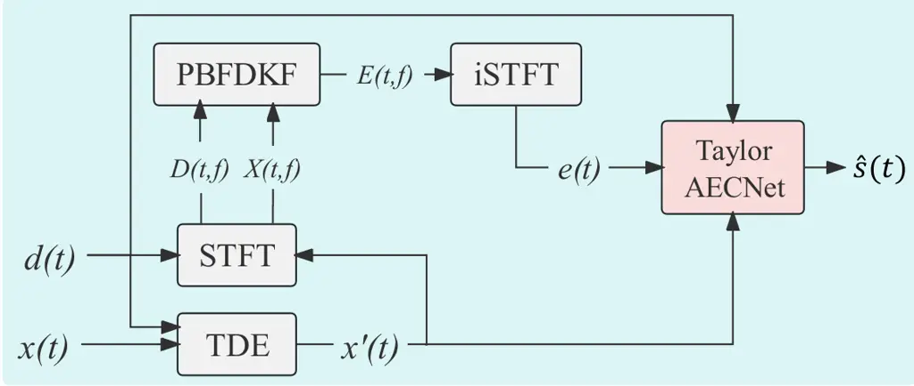
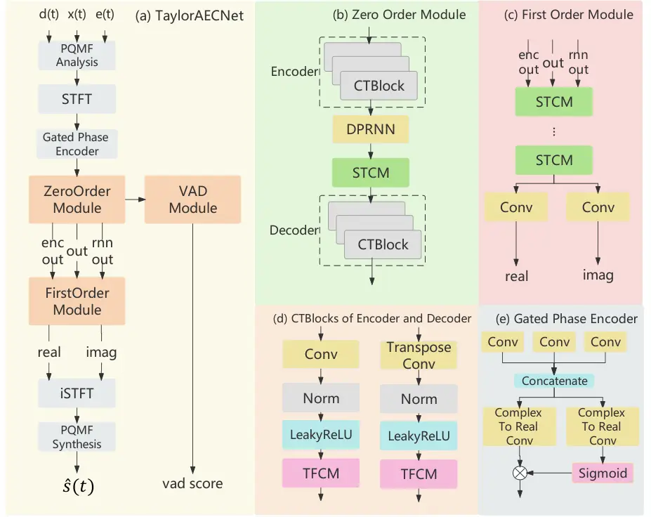

# TaylorAECNet: A TAYLOR STYLE NEURAL NETWORK FOR FULL-BAND ECHO CANCELLATION

Weiming Xu^(1,∗), Zhihao Guo² ^(†)^(†)thanks: \*Work performed during an
internship at Elevoc.

###### Abstract

This paper describes aecX team’s entry to the ICASSP 2023 acoustic echo
cancellation (AEC) challenge. Our system consists of an adaptive filter
and a proposed full-band Taylor-style acoustic echo cancellation neural
network (TaylorAECNet) as a post-filter. Specifically, we leverage the
recent advances in Taylor expansion based decoupling-style interpretable
speech enhancement \[1\] and explore its feasibility in the AEC task.
Our TaylorAECNet based approach achieves an overall mean opinion score
(MOS) of 4.241, a word accuracy (WAcc) ratio of 0.767, and ranks 5th in
the non-personalized track (track 1).

###### Index Terms: 

Acoustic echo cancellation, noise suppression, Taylor expansion

^(†)^(†)address: ¹Audio, Speech and Language Processing Group
(ASLP@NPU),  
Northwestern Polytechnical University, Xi’an, China  
²Elevoc, Shenzhen, China

## 1 Introduction

The acoustic echo cancellation (AEC) challenge series has provided a
common platform to benchmark modern AEC techniques. The fourth edition
of this challenge held in ICASSP2023 particularly addresses full-band
signals with general AEC track and personalized AEC track. We submit a
hybrid system to the general AEC track, which integrates a DSP based
adaptive filter with a neural network based post filter.

Recently, there has been a trend in interpretable speech enhancement by
decoupling the difficult task into easier interpretable subtasks.
Following this direction, TaylorSENet \[1\] imitates the form of Taylor
expansion to split the denoising task into a combination of zero-order
derivatives (in the real-valued domain) and multiple higher-order
derivatives (in the complex-valued domain), achieving promising
denoising performance. Inspired by this work, we propose a full-band
Taylor-style acoustic echo cancellation neural network TaylorAECNet as a
post-filter cascaded with an adaptive filter to solve the full-band echo
cancellation task. To reduce complexity, we design the Taylor-style
decoupling network with only zero-order and first-order modules and made
the following modifications to better fit the full-band residual echo
removal task.

- •
  In order to utilize phase information for the zero-order module, a
  gated version of the phase encoder \[2\] is used instead of modulo
  operation to get the magnitude feature as zero-order module input.
- •
  Pseudo quadrature mirror filter bank (PQMF) is used to reduce the
  complexity caused by full-band signal processing.
- •
  Temporal and frequency convolution module (TFCM) \[2\] is introduced
  to improve the receptive field. Similar to \[3\], auxiliary voice
  activity detection (VAD) task is added and echo weighted loss is
  introduced.

According to the challenge results, our system ranked 5th in the general
AEC track.

## 2 Proposed Method

The AEC task can be described as:

```math
d(n)=s(n)+h(n)\ast x(n)+v(n).\vskip-3.0pt \tag{1}
```

The near-end microphone signal $`d(n)`$ is composed of the near-end
speech $`s(n)`$, the background noise $`v(n)`$, and the echo signal
$`h(n)\ast x(n)`$. The echo signal is generated by far-end signal
$`x(n)`$ propagated through echo path $`h(n)`$, where $`n`$ denotes the
sample index. The AEC task is to cancel $`h(n)\ast x(n)`$ from $`d(n)`$
given $`x(n)`$.



Figure 1: System diagram.

As shown in Fig. 1, our system consists of a time delay estimation (TDE)
module, an adaptive filter, and a full-band Taylor-style acoustic echo
cancellation neural network (TaylorAECNet) as a post-filter. $`d(n)`$
and $`x(n)`$ are first aligned using GCC-PHAT as the TDE module to
obtain the time-aligned reference signal $`x^{\prime}(n)`$. The error
signal $`e(n)`$ is generated using $`x^{\prime}(n)`$ and $`d(n)`$ by an
adaptive filter which is a partitioned-block-based frequency domain
Kalman filter (PBFDKF). Finally, $`d(n)`$, $`e(n)`$ and
$`x^{\prime}(n)`$ are stacked and fed to the TaylorAECNet post-filter.

### 2.1 TaylorAECNet post-filter

TaylorAECNet consists of three modules, zero-order module (ZOM),
first-order module (FOM) and voice activity detection (VAD) module shown
as Fig. 2(a).



Figure 2: The detailed design of TaylorAECNet.

As shown in Fig. 2(b), ZOM is designed as a classical UNet-style
structure and it accepts the magnitude feature from the gated phase
encoder. The encoder is a stack of Convolution-TFCM Block (CTBlocks),
and each CTBlock contains a convolution layer followed by a batch
normalization layer, leakyReLU layer and TFCM \[2\]. The decoder has the
same structure as the encoder, but the convolution layer is replaced by
the transpose convolution layer. We use dual path RNN (DPRNN) and
squeezed temporal convolution module (STCM) \[4\] to further improve ZOM
performance.

Fig. 2(c) shows the detail of FOM which consists of several STCM layers
and two convolution layers – a complex-to-real convolution layer and a
complex-to-imaginary convolution layer.

The structure of the gated phase encoder is shown in Fig. 2(e), which is
an improved version of phase encoder\[2\] with an additional gated
convolution. Specifically, the gated phase encoder has three
complex-valued convolution layers to receive $`D(t,f)`$, $`E(t,f)`$, and
$`X(t,f)`$ respectively. The complex-to-real layer consists of a
complex-valued convolution layer and a modulo operation. We use a gated
phase encoder instead of directly performing modulo operations on
$`D(t,f)`$, $`E(t,f)`$, and $`X(t,f)`$.

We introduce a voice activity detection (VAD) module to improve the echo
suppression performance. The VAD module is the same as that in \[3\]. By
learning the VAD state of the microphone signal, the model will be more
inclined to preserve near-end speech.

### 2.2 Loss function

We use echo weighted loss \[3\] with an extra asymmetric loss
$`\mathcal{L}_{\text{asym}}`$ \[5\]. The final loss function is

```math
\mathcal{L}=\mathcal{L}_{\text{echo-weighted}}+\mathcal{L}_{\text{asym}}+0.2*\mathcal{L}_{\text{mask}}+0.1*\mathcal{L}_{\text{vad}}.\vskip-4.0pt \tag{2}
```

The definition of $`{L}_{\text{mask}}`$, $`{L}_{\text{echo-weighted}}`$,
and $`\mathcal{L}_{\text{vad}}`$ remains the same as \[3\].
$`\mathcal{L}_{\text{echo-weighted}}`$ makes the model pay more
attention to the suppression of echoes by echo weighting but may cause
distortion of the near-end speech. So, we add
$`\mathcal{L}_{\text{asym}}`$ to alleviate the distortion problem and
constrain the spectrum.

## 3 Experiments

### 3.1 Dataset

We use the clean speech provided by the 5th deep noise suppression
(DNS5) as the near-end signal and the reference signal. The noise set in
DNS5 is used as the noise signal. For the echo signal, we use all the
synthetic echo signals and real far-end single-talk recordings provided
by the AEC challenge, which covers a variety of voice devices and echo
signal delay. Furthermore, we also use speech in the DNS5 dataset to
simulate echo data by convolving with 100,000 simulated room impulse
responses (RIR) generated by the image method.

The training set has 600 hours of data in total, consisting of 300 hours
of data with simulated echo and 300 hours of data with real-recorded
echo. The development and test sets share the same aforementioned
generation method, which contains 10 and 5 hours of data, respectively.

### 3.2 Experimental setup

The proposed model uses a 20ms window length with a 10ms frame shift for
STFT. Noam is adopted as the learning rate decreasing method described
as

```math
lr=d^{-0.5}\cdot\min(\text{step}^{-0.5},\text{step}\cdot\text{warmup\_step}^{-1.5})\vskip-4.0pt \tag{3}
```

where $`d=1e-3`$ and warm_up=5000. All the models are trained with Adam
optimizer for 10 epochs. The PQMF splits the signal into 4 sub-band
signals. Each TFCM has 6 layers. The STCM in ZOM has 1 layer and 128
hidden channels while the STCM in FOM has 2 layers and 64 hidden
channels.

### 3.3 Results and analysis

Table 1 shows the experimental results on the simulated test set.
Ablation is studied on models trained using a subset with 100 hours of
simulated data. Here base-TaylorAECNet is a simplified version for
ablation, which removes TFCM and gate PE parts. When adding TFCM to
base-TaylorAECNet, all our metrics on the test set are improved. Further
adding the gated phase encoder, which results in the complete
TalyorAECNet, the metrics for ST-FE and DT are improved, but the metric
for ST-NE is slightly decreased.

We finally train the complete TalyorAECNet using the entire 600 hours of
data and the metrics on the simulated test set are shown in the last row
of Table 1. We use this model to process the blind test clips and the
challenge results are shown in Table 2. Our proposed TaylorAECNet
approach surpasses the baseline by a large margin in both Overall MOS
and WAcc. The Final Score of our system is 0.803 which outperforms the
baseline with a 0.067 gain, leading to the 5th in the general AEC track.
We perform ONNX implementation to the post filter for speed-up, the RTF
of our proposed system is 0.224 tested on Intel(R) Xeon(R) Gold 5218 CPU
@ 2.30GHz and the number of its parameters is 19.18M.

|                            |           |              |                 |              |      |
| -------------------------- | --------- | ------------ | --------------- | ------------ | ---- |
| Model                      | Para. (M) | ST-FE (ERLE) | ST-NE (WB-PESQ) | DT (WB-PESQ) | Data |
| Noisy                      |           | 0            | 2.62            | 1.95         |      |
| base-TaylorAECNet          | 15.2      | 51.43        | 3.08            | 2.68         |      |
| +TFCM                      | 19.1      | 62.84        | 3.05            | 2.69         | 100h |
|       +gated phase encoder | 19.2      | 63.33        | 3.01            | 2.72         |      |
| TaylorAECNet               | 19.2      | 66.39        | 3.09            | 2.81         | 600h |

Table 1: Ablation on the simulated test set.

|                    |                   |             |                   |
| ------------------ | ----------------- | ----------- | ----------------- |
|    Model           |    Overall MOS    |    WAcc     |    Final Score    |
|    baseline        |    4.013          |    0.649    |    0.736          |
|    TaylorAECNet    |    4.241          |    0.767    |    0.803          |

Table 2: System performance on the blind test set of the challenge.

## 4 Conclusions

In this paper, we introduce our system for ICASSP 2023 AEC Challenge. We
combine a partitioned-block-based frequency domain Kalman filter
(PBFDKF) with a proposed TaylorAECNet to suppress echo and noise. Gated
phase encoder and TFCM are used for better latent feature extraction. A
VAD module and echo-weighted loss are introduced to suppress residual
echo and preserve near-end speech quality as well. According to the
final results, the proposed system ranked 5th in the general AEC track.

## References

- \[1\] A. Li, S. You, G. Yu, C. Zheng, and X. Li, “Taylor, can you hear
  me now? a taylor-unfolding framework for monaural speech enhancement,” 2022.
- \[2\] G. Zhang, L. Yu, C. Wang, and J. Wei, “Multi-scale temporal
  frequency convolutional network with axial attention for speech
  enhancement,” in ICASSP. IEEE, 2022.
- \[3\] S. Zhang, Z. Wang, J. Sun, Y. Fu, B. Tian, Q. Fu, and L. Xie,
  “Multi-task deep residual echo suppression with echo-aware loss,” in
  ICASSP. IEEE, 2022.
- \[4\] A. Li, W. Liu, C. Zheng, C. Fan, and X. Li, “Two heads are
  better than one: A two-stage complex spectral mapping approach for
  monaural speech enhancement,” IEEE/ACM, 2021.
- \[5\] S. Braun and M. Valero, “Task splitting for dnn-based acoustic
  echo and noise removal,” in IWAENC. IEEE, 2022.
