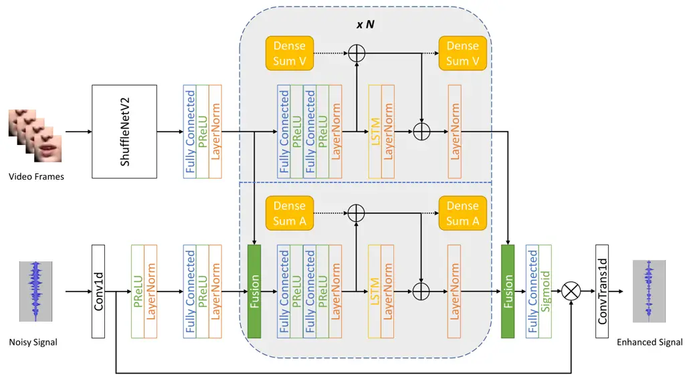

# REAL-TIME AUDIO-VISUAL END-TO-END SPEECH ENHANCEMENT

Zirun Zhu    Hemin Yang    Min Tang    Ziyi Yang    Sefik Emre Eskimez
   Huaming Wang

###### Abstract

Audio-visual speech enhancement (AV-SE) methods utilize auxiliary visual
cues to enhance speakers’ voices. Therefore, technically they should be
able to outperform the audio-only speech enhancement (SE) methods.
However, there are few works in the literature on an AV-SE system that
can work in real time on a CPU. In this paper, we propose a low-latency
real-time audio-visual end-to-end enhancement (AV-E3Net) model based on
the recently proposed end-to-end enhancement network (E3Net). Our main
contribution includes two aspects: 1) We employ a dense connection
module to solve the performance degradation caused by the deep model
structure. This module significantly improves the model’s performance on
the AV-SE task. 2) We propose a multi-stage gating-and-summation (GS)
fusion module to merge audio and visual cues. Our results show that the
proposed model provides better perceptual quality and intelligibility
than the baseline E3net model with a negligible computational cost
increase.

###### Index Terms: 

speech enhancement, audio-visual, real-time, low-latency, dense
connection

^(†)^(†)address: Microsoft, Redmond, WA, USA  
{zirzhu, heyang, mintang, ziyiyang, seeskime, huawang}@microsoft.com

## 1 Introduction

Video communications have been universally applied for both business and
personal connections due to the COVID-19 pandemic. Since numerous people
have shifted to online communication, the request for better perceptual
quality and intelligibility of audio has become increasingly crucial.
However, some factors, such as background noise, reverberation, and
interfering (background) speakers, can degrade the quality of the call.
The leakage of interfering speakers can significantly degrade the
intelligibility of the main speaker and potentially cause privacy
issues. Unfortunately, unconditional audio-only speech enhancement
models cannot remove interfering speakers since they are usually trained
to preserve all human speech \[1, 2\].

Personalized speech enhancement (PSE) models were proposed to enhance
target speakers by adding target speakers’ voice profiles \[1, 2, 3, 4\]
for suppressing the interfering speakers and environmental noises. They
utilized the speaker embeddings extracted by a pre-trained speaker
encoder on enrollment audios \[4\]. Alternatively, video can assist in
speech enhancement from different aspects without the need for
enrollment. First, the face of the speaker reveals the speaker’s
identity \[5\]. Second, lip motion is highly correlated with the
phonetic information of the target speech \[6\].



Figure 1: Model architecture of proposed AV-E3Net. $`\bigoplus`$ denotes
addition and $`\bigotimes`$ denotes Hadamard product. Dense sum A/V
denotes the dense connection variable for audio/video features, which is
depicted in subsection 3.1. The dense sum V provides shortcuts across
all video LSTM blocks. The dense sum A provides shortcuts across all
audio LSTM blocks as well as all fusion blocks. The fusion block can be
either a concatenation block or a GS block.

It is essential to limit the latency and computational complexity of the
model to make audio-visual speech enhancement (AV-SE) models suitable
for real-time communication. Although many works employed causal
designs, only a few reported the computational complexity of their
methods \[7\]. This paper focuses on optimizing intelligibility and
perceptual quality for real-time processing on the CPU (i.e., the
inference time on the CPU is shorter than the audio time with low
latency). Specifically, we propose a low-latency real-time AV-SE system,
namely AV-E3Net, based on the recently proposed end-to-end enhancement
network (E3Net) \[1\]. AV-E3Net takes pixels of the mouth region of
interest (ROI) and the noisy audio signal as inputs and produces the
enhanced audio signal. We employ a dense connection module in AV-E3Net,
which helps with better gradient flow for deeper networks. We propose a
novel multi-stage gating-and-summation (GS) fusion module for merging
audio and video features. We evaluate our proposed models in different
application scenarios. Our results suggest that AV-E3Net yields
significantly better results for the AV-SE task than the baselines.

## 2 Related Work

Recently, multiple personalized speech enhancement (PSE) systems were
proposed and proven computationally efficient to work in real time.
Personalized PercepNet \[3\] utilized the target speaker’s voice
embeddings to improve the speech enhancement capabilities of original
PercepNet \[8\]. Thakker et al. \[1\] proposed a real-time causal PSE
model named end-to-end enhancement network (E3Net). Compared with other
bigger PSE models such as pDCCRN \[2\], E3Net provided better perceptual
and transcription quality with much smaller computational complexity.
PSE models are conditional models that utilize speaker embeddings, and
their success can be extended to other conditional models, such as AV-SE
models.

Traditionally, an AV-SE network comprises four components: audio
encoder, video encoder, enhancement network, and audio decoder \[9,
10\]. The audio/video encoder extracts audio/video features, and the
enhancement network combines two features to produce enhanced audio
embedding. The audio decoder decodes enhanced audio embedding to recover
the audio. The video encoder can be pre-trained or jointly trained with
the other modules. In \[9\], the video encoder was trained jointly with
the rest of the network, whereas \[10\] and \[11\] employed a
pre-trained video encoder. Joint training of the video encoder with the
rest of the network is somewhat challenging because of the deeper model
architecture. However, there are some techniques to alleviate this
problem. ResNet \[12\] and DenseNet \[13\] proposed dense shortcuts to
address the training issue caused by the deep structures. Zhang et
al. \[14\] also proposed a unified perspective of the dense shortcut in
ResNet and DenseNet. Motivated by these works, this paper employs a
dense connection module to tackle the performance issue caused by the
deep architecture of AV-E3Net.

Audio and video fusion is an important research direction for AV-SE
 \[9, 15, 16\] and multimodal learning \[17\]. The most common fusion
method is concatenation, which is easy to implement, but one modality
often tends to dominate the other \[9\]. Xu et al. \[15\] proposed an
attention-based fusion method. However, this method considerably
increased the computational cost. Joze et al. \[18\], and Iuzzolino and
Koishida \[16\] proposed a squeeze-excite (SE) fusion that employs a
gating module to recalibrate the modality. Additionally, their work
integrated slow fusion \[19\] with the gating module and proved that
slow fusion is more effective. Wang et al.\[20\] also employed a gating
network to perform a product-based fusion, ensuring the performance of
the model lower-bounded by an audio-based system. Inspired by \[16, 18,
20\], we propose a multi-stage gating-and-summation (GS) module, which
integrates slow fusion and provides a lightweight and efficient approach
to fuse audio and video features.

An essential requirement for AV-SE systems to be adopted in practical
scenarios is to make them work in real time with low computational
costs. Unfortunately, only a few existing works focused on this
scenario. Gu et al. \[7\] proposed a real-time audio-visual speech
separation and provided the real-time factor (RTF) measured on a GPU as
the metric for computational costs. Gogate et al.\[21\] also proposed a
real-time audio-visual speech enhancement model, whereas no
computational complexity metric was provided. In contrast, we propose an
AV-SE system that can work in real time on the CPU by utilizing
computationally efficient E3Net as our backbone, using lightweight
ShufflNetV2 as the video encoder, and using only mouth ROI as the visual
input.

## 3 Methodology

The overview of AV-E3Net architecture is shown in Figure 1. In this
section, we introduce each module of the proposed model.

### 3.1 Audio network

The audio network comprises an audio encoder, a masking network, and an
audio decoder. The audio encoder processes the input audio to generate
audio features; subsequently, they are fed into the masking network to
produce a mask, which is applied to the audio features. Within the
masking network, the audio features are fused with video features
generated by the video encoder. At last, the audio decoder reconstructs
the audio from suppressed audio features. We follow the design of
E3Net \[1\]. The audio encoder and audio decoders are 1D convolution and
1D transposed convolution layers, respectively. The masking network
linearly stacks a ReLU activation, a layer normalization, a projection
block, a fusion module, multiple LSTM blocks, and a mask prediction
module. Please refer to \[1\] for the detailed description of the LSTM
block and the mask prediction. In addition, we employ the dense
connection module to tackle performance issues caused by a deep model
structure. A dense connection replaces the original skip connection of
E3Net in each LSTM block. The dense connection also exists in the fusion
module. Generally, a module with a skip connection can be expressed as:

```math
Y_{n}=\theta(f_{n}(x_{n})+x_{n}) \tag{1}
```

where n is the index of the module, $`\theta`$ is a layer normalization,
$`x_{n}`$ is the input of the module $`f_{n}`$, and $`Y_{n}`$ is the
output. As an alternative, the dense connection is defined as:

```math
X_{n}=\Sigma_{i=0}^{n}x_{i}, \tag{2}
```

```math
Y_{n}=\theta(f_{n}(x_{n})+X_{n}) \tag{3}
```

or

```math
X_{n}=X_{n-1}+x_{n}, \tag{4}
```

```math
Y_{n}=\theta(f_{n}(x_{n})+X_{n}) \tag{5}
```

Therefore, $`X_{n}`$ is a dense summation variable that is updated from
$`X_{n-1}`$ to $`X_{n}`$ through all dense connection blocks. Note that
a dense connection requires each $`x_{n}`$ to have the same shape. In
this way, the dense connection provides shortcuts across all LSTM blocks
and fusion modules.

### 3.2 Video encoder

In a recent lipreading study, Ma et al. \[22\] employed a lightweight
ShuffleNetV2 \[23\] as the video encoder to extract visual features.
This work verified that ShuffleNetV2 could provide satisfactory
performance with much efficient computational complexity in lipreading
tasks. Motivated by its success in lipreading, we also employ
ShuffleNetV2, followed by a projection block, as the video encoder. The
projection block changes the dimension of video features. It comprises a
fully connected layer, a PReLU activation, and a layer normalization.
Afterward, we optionally employ video LSTM blocks to capture the
speaker’s lip motions. Video LSTM blocks share the same structure as
those in the audio network.

### 3.3 Audio-Visual fusion

Next, we describe our proposed multi-stage gating-and-summation (GS)
fusion module. For the multi-stage fusion, the video LSTM blocks are
forced to be paired with the audio LSTM blocks in the masking network.
The fusion blocks are placed at the beginning of each pair of LSTM
blocks and after the last pair of LSTM blocks, as shown in Figure 1.

Figure 2 presents the detailed architecture of the GS fusion block. The
block takes audio features $`F_{a,n}\in R^{{d_{a}}}`$ and video features
$`F_{v,n}\in R^{{d_{v}}}`$ from the $`n^{th}`$ pair of LSTM blocks as
inputs. Two operations are included in this fusion block. First, a
gating module is employed to calculate the importance of channels and
recalibrate the original audio features by the importance,

```math
G_{n}=\sigma(g(\delta(h([F_{a,n};F_{v,n}])))), \tag{6}
```

```math
H_{a,n}=G_{n}\odot F_{a,n} \tag{7}
```

where $`[F_{a,n};F_{v,n}]`$ concatenates audio features and video
features, $`G_{n}\in R^{d_{a}}`$, $`\sigma`$ is the sigmoid activation,
h and g are fully connected layers, and $`\delta`$ is a ReLU activation.
Second, a dense summation module is defined as,

```math
X_{a,n}=X_{n}+F_{a,n} \tag{8}
```

```math
Y_{a,n}=\theta(proj(H_{a,n})+X_{a,n}) \tag{9}
```

where $`proj`$ is a projection block, $`\theta`$ is the layer
normalization, $`X_{n}`$ is the dense summation variable from the
$`n^{th}`$ audio LSTM block. Updated by adding $`F_{a,n}`$, the new
dense summation variable becomes $`X_{a,n}`$. \[20\] observed serious
performance degradation of other AV-SE models \[9, 10\] in less noisy
scenarios. Therefore, they suggested that AV-SE systems should be mainly
audio-based, and video cues should provide only additional
contributions. The design of GS fusion follows this idea: the gating
module and the summation module make fused features closer to the space
of audio features. The dense summation also provides shortcuts across
all LSTM blocks and fusion modules and helps with better gradient flow
for AV-E3Net.

Figure 2: Proposed architecture of GS fusion block. $`\bigoplus`$
denotes addition and $`\bigotimes`$ denotes Hadamard product. Dense sum
A denotes the dense connection variable for audio features.

Note that, due to the mismatch of frame rates for the video and audio,
we up-sample the video frames to match them with the audio frames by
replicating them.

## 4 Experimental Results

### 4.1 Training and validation data

This work followed the data simulation pipeline of \[2\]. We utilized
clean speech samples from AVSpeech \[10\], VoxCeleb2 \[24\], and
LRS3 \[25\] datasets. By filtering the samples according to the Mean
Opinion Score (MOS) of the audio quality, we selected 214, 170, and 30
hours of video samples from these datasets, respectively. Furthermore,
we used a face detector for each frame of the video samples, and if the
number of frames with a face detected divided by the total number of
frames was less than 0.95, we discarded that video sample.

For creating the noisy mixtures, we convolved clean speech samples with
simulated room impulse response (RIR) using the image method. We
employed noise clips from Audioset \[26\] and Freesound \[27\], which
were also convolved with RIRs. The clean speech, noise clips, and RIR
files were split exclusively to simulate train, validation, and test
sets. 20$`\%`$ of simulated samples contained only the target speaker,
and 80$`\%`$ of them contained both the target and interference
speakers. In \[2\], there was a restriction that the target speaker
should be closer to the microphone than the interference speaker.
However, in this work, we relieved this restriction. Our system assumes
that the target speaker’s face is the only face captured by the camera.
We simulated 20,000 hours of training data and 10 hours of validation
data. The average length of simulated mixture samples was around 10
seconds. We used the video frames unaltered along with simulated noisy
audio samples. For video frames where the face detector did not capture
the target speaker’s face, we filled in the video frame input with zero
tensors.

|                                 |                  |               |     |                      |       |     |                    |                  |                   |     |                    |                  |                   |
| ------------------------------- | ---------------- | ------------- | --- | -------------------- | ----- | --- | ------------------ | ---------------- | ----------------- | --- | ------------------ | ---------------- | ----------------- |
| Configuration                   |                  |               |     | Complexity           |       |     | TS1                |                  |                   |     | TS2                |                  |                   |
| Method                          | Dense connection | Fusion        |     | Parameters(millions) | RTF   |     | WER $`\downarrow`$ | SDR $`\uparrow`$ | PESQ $`\uparrow`$ |     | WER $`\downarrow`$ | SDR $`\uparrow`$ | PESQ $`\uparrow`$ |
| No Enhancement                  |                  |               |     |                      |       |     | 24.38              | 3.26             | 1.186             |     | 14.43              | 6.53             | 1.294             |
| AO-E3Net                        | no               | no            |     | 16.03                | 0.053 |     | 26.34              | 6.70             | 1.451             |     | 17.32              | 12.05            | 1.930             |
| AV-DCATTUNET                    | no               | single concat |     | 10.87                | 1.580 |     | 17.93              | 10.72            | 1.946             |     | 14.79              | 12.41            | 2.158             |
| Naive AV-E3Net                  | no               | single concat |     | 18.02                | 0.122 |     | 18.11              | 11.41            | 1.958             |     | 15.51              | 12.67            | 2.082             |
|      - w/ 1 video LSTM block    | no               | single concat |     | 21.17                | 0.127 |     | 18.06              | 11.38            | 1.958             |     | 15.24              | 12.70            | 2.096             |
|      - w/ 4 video LSTM blocks   | no               | single concat |     | 30.64                | 0.138 |     | 24.86              | 10.20            | 1.806             |     | 18.58              | 12.63            | 2.061             |
| AV-E3Net                        | yes              | single concat |     | 18.02                | 0.123 |     | 17.01              | 11.52            | 1.974             |     | 14.76              | 12.72            | 2.099             |
|      - w/ 1 video LSTM block    | yes              | single concat |     | 21.17                | 0.130 |     | 16.95              | 11.54            | 2.000             |     | 14.87              | 12.76            | 2.136             |
|      - w/ 4 video LSTM blocks   | yes              | single concat |     | 30.64                | 0.138 |     | 16.73              | 11.57            | 1.985             |     | 14.35              | 12.73            | 2.106             |
| AV-E3Net w/ 4 video LSTM blocks | yes              | multi-stage   |     | 32.74                | 0.142 |     | 16.64              | 11.60            | 2.002             |     | 14.19              | 12.78            | 2.104             |
|      - GS fusion (proposed)     | yes              | multi-stage   |     | 35.37                | 0.143 |     | 16.62              | 11.67            | 2.009             |     | 14.02              | 12.83            | 2.136             |

Table 1: Computational complexity and model performance results are as
shown. RTF was measured on an Intel(R) Xeon(R) W-2133 CPU @ 3.60GHz and
averaged on 100 runs. The multi-stage fusion is introduced in subsection
3.3. ”single concat” denotes the single concatenation block which is
introduced in 4.4.

### 4.2 Test sets and evaluation metrics

Test sets followed the same simulation approach as train/validation
sets, in which the source data were mutually exclusive. Only LRS3 \[25\]
data was used in test sets, and the average length of simulated mixture
samples was 6 seconds. We simulated test sets for two target
scenarios: 1) the mixture comprises the target speaker, the interference
speaker, and noise. 2) the mixture comprises the target speaker and
noise. Following \[2\], we named these two scenarios TS1 and TS2,
respectively. TS1 and TS2 included 10 hours and 1 hour of data,
respectively. To measure the perceptual quality and the intelligibility
of processed audio, we utilized word error rate (WER), perceptual
evaluation of speech quality (PESQ), and Signal-to-distortion ratio
(SDR). We also measured the real-time factor (RTF) on an Intel(R)
Xeon(R) W-2133 CPU @ 3.60GHz. Since the inference speed of the model
changed from time to time on a CPU, we ran the same model 100 times on a
3 seconds input to reduce the variance of observations.

### 4.3 Implementation Details

Audio and video samples were re-sampled in 16KHz, 25 fps, and 360p,
respectively. We followed video pre-processing of lipreading \[22, 28\].
Each video frame was processed by 1) face and landmarks detection, 2)
similarity transformation based on landmarks, and 3) cropping in a size
of 50x50 on the mouth ROI. Small sizes for cropping can further reduce
the video encoder’s computational cost, which contributed most of the
computational cost in AV-E3Net. We used Microsoft’s internal face
detection tool for face and landmarks detection. During training, the
noisy mixtures were chunked into 3 seconds of audio batches aligned with
75 video frames. We used the power-law compressed phase-aware (PLCPA)
loss function \[29\].

Regarding the audio encoder and decoder, we set window and hop sizes to
320 (20 ms) and 160 (10 ms), respectively. The theoretical latency of
AV-E3Net was 20ms. The number of features used in the audio encoder was 2048. Within the masking network, the projection block projected
features from $`R^{2048}`$ to $`R^{512}`$. The number of audio LSTM
blocks was 4. Within the LSTM block, the input and output dimensions of
the fully connected block were 512, and the intermediate dimension of
the fully connected block was 1024. The input and output dimensions of
LSTM were 512. Regarding the video encoder, we used ShuffleNetV2
0.5x \[23\] to encode video frames to 1024-dimension features. Then a
projection block was employed to project video features to
512-dimension. Afterward, video LSTM blocks for lip motion capture
shared the same configuration as audio LSTM blocks. GS fusion’s audio
and video input dimensions were 512, and the first fully connected layer
projected concatenated features from $`R^{1024}`$ to $`R^{512}`$. We set
the optimizer as AdamW \[30\] and the learning rate scheduler to be a
step decay scheduler with a gradual warm-up mechanism. The peak learning
rate was 0.001.

### 4.4 Baseline Systems

We employed the following baseline models for comparison with our
proposed models:

AO-E3Net: An audio-only E3Net model. It is an unconditional model and
not capable of removing the interfering speaker.

AV-DCATTUNET: A variant of pDCATTUNET, introduced in \[2\], in which the
speaker embedding was replaced by the video frame embedding extracted by
a pre-trained face recognition model (ShuffleNetV2 0.5x). The face
recognition model takes the whole face of each video frame as the input.
We set the number of encoder/decoder blocks to 6 and the number of
bottleneck blocks to 4. The STFT window and hop sizes were 512 and 256
samples, respectively.

Naive AV-E3Net: The AV-E3Net without dense connection and multi-stage GS
fusion. It combined the video encoder (ShuffleNetV2 0.5x) with E3Net and
employed a single concatenation block to merge late video features from
the video encoder with intermediate audio features before the first
audio LSTM block. A single concatenation block comprises a concatenation
layer, a projection block, a dense connection or a skip connection, and
a layer normalization. Particularly, only skip connection was used in
Naive AV-E3Net’s LSTM block and single concatenation block.

### 4.5 Results

Table 1 shows the computational complexity of different model
configurations and the corresponding perceptual quality and
intelligibility results on TS1 and TS2 test sets. According to the
results, AO-E3Net performs poorly on TS1 since it cannot remove the
interfering speaker. In contrast, AV-DCATTUNET provides much better
results on both TS1 and TS2 than the AO-E3Net in terms of speech and
transcription quality. Naive AV-E3Net without video LSTM yields worse
WER results than AV-DCATTUNET but provides better SDR. Adding a single
video LSTM to the Naive AV-E3Net yields similar results; However,
increasing it to 4 LSTM blocks degrades speech and transcription
quality, indicating training difficulty. By adding the dense connection
to AV-E3Net, we observe significant speech and transcription quality
improvement with a negligible computational cost increase. With the
dense connection, adding more video LSTM layers improves the
transcription quality while yielding similar speech quality. AV-E3Net
models with dense connection outperform AV-DCATTUNET on TS1 and achieve
comparable performance on TS2 with a much lower computational cost.
Next, the results show that AV-E3Net with multi-stage training further
improves speech and transcription quality. The best AV-E3Net results are
obtained using multi-stage fusion with the GS fusion. The GS fusion
helps with substantially better performance on TS2, which is for the
less noisy scenario. The computational cost increase for multi-stage GS
fusion is minor.

It should be noted that the AV-DCATTUNET model cannot be used for
real-time processing because of the model’s dependency on a pre-trained
video encoder. Although the face recognition model employs the efficient
ShuffleNetV2, it takes the whole face rather than the mouth ROI as the
input. Therefore, the RTF on the video encoder reaches 1.442. However,
since AV-E3Net uses only mouth ROI as the input, it can work in real
time. These results suggest that AV-E3Net performs better than the
bigger model (AV-DCATTUNET) with a lower computational cost.

## 5 Conclusions

We proposed a low-latency real-time audio-visual end-to-end speech
enhancement model AV-E3Net. We employed a dense connection module, which
significantly improved both perceptual quality and intelligibility with
minimal increase in computational costs. Furthermore, we proposed a
novel multi-stage gating-and-summation (GS) fusion module that
dynamically and effectively fuses speech and vision modalities. We
showed that our proposed model performed much better than the baseline
systems. Furthermore, the ablation study showed the impact of adding
dense connection and multi-stage GS modules. The computational cost of
our system is much lower than the baseline AV-SE system and can work in
real time on the CPU. Therefore, the proposed AV-E3Net has excellent
potential in real-world video communication applications as a
low-latency and real-time model.¹¹ 1 Samples available at
[https://github.com/zzrdwj/AVSE](https://github.com/zzrdwj/AVSE)

## References

- \[1\] M. Thakker, S. E. Eskimez, T. Yoshioka, and H. Wang, “Fast
  Real-time Personalized Speech Enhancement: End-to-End Enhancement
  Network (E3Net) and Knowledge Distillation,” in _Proc. Interspeech_,
  2022, pp. 991–995.
- \[2\] S. E. Eskimez, T. Yoshioka, H. Wang, X. Wang, Z. Chen, and
  X. Huang, “Personalized speech enhancement: new models and
  comprehensive evaluation,” in _Proc. ICASSP_, 2022, pp. 356–360.
- \[3\] R. Giri, S. Venkataramani, J.-M. Valin, U. Isik, and
  A. Krishnaswamy, “Personalized PercepNet: Real-Time, Low-Complexity
  Target Voice Separation and Enhancement,” in _Proc. Interspeech_,
  2021, pp. 1124–1128.
- \[4\] Q. Wang, H. Muckenhirn, K. Wilson, P. Sridhar, Z. Wu, J. R.
  Hershey, R. A. Saurous, R. J. Weiss, Y. Jia, and I. L. Moreno,
  “VoiceFilter: Targeted Voice Separation by Speaker-Conditioned
  Spectrogram Masking,” in _Proc. Interspeech_, 2019, pp. 2728–2732.
- \[5\] S.-W. Chung, S. Choe, J. S. Chung, and H.-G. Kang, “FaceFilter:
  Audio-Visual Speech Separation Using Still Images,” in _Proc.
  Interspeech_, 2020, pp. 3481–3485.
- \[6\] X. Wang, X. Kong, X. Peng, and Y. Lu, “Multi-Modal
  Multi-Correlation Learning for Audio-Visual Speech Separation,” in
  _Proc. Interspeech_, 2022, pp. 886–890.
- \[7\] R. Gu, S.-X. Zhang, Y. Xu, L. Chen, Y. Zou, and D. Yu,
  “Multi-modal multi-channel target speech separation,” _IEEE Journal of
  Selected Topics in Signal Processing_, vol. 14, no. 3, pp.
  530–541, 2020.
- \[8\] J.-M. Valin, U. Isik, N. Phansalkar, R. Giri, K. Helwani, and
  A. Krishnaswamy, “A Perceptually-Motivated Approach for
  Low-Complexity, Real-Time Enhancement of Fullband Speech,” in _Proc.
  Interspeech 2020_, 2020, pp. 2482–2486.
- \[9\] A. Gabbay, A. Shamir, and S. Peleg, “Visual Speech Enhancement,”
  in _Proc. Interspeech_, 2018, pp. 1170–1174.
- \[10\] A. Ephrat, I. Mosseri, O. Lang, T. Dekel, K. Wilson,
  A. Hassidim, W. T. Freeman, and M. Rubinstein, “Looking to listen at
  the cocktail party: A speaker-independent audio-visual model for
  speech separation,” _ACM Trans. Graph._, vol. 37, no. 4, Jul 2018.
- \[11\] T. Afouras, J. S. Chung, and A. Zisserman, “The Conversation:
  Deep Audio-Visual Speech Enhancement,” in _Proc. Interspeech_, 2018,
  pp. 3244–3248.
- \[12\] K. He, X. Zhang, S. Ren, and J. Sun, “Deep residual learning
  for image recognition,” in _Proc. CVPR_, 2016, pp. 770–778.
- \[13\] G. Huang, Z. Liu, L. Van Der Maaten, and K. Q. Weinberger,
  “Densely connected convolutional networks,” in _Proc. CVPR_, 2017, pp.
  2261–2269.
- \[14\] C. Zhang, P. Benz, D. M. Argaw, S. Lee, J. Kim, F. Rameau,
  J.-C. Bazin, and I. S. Kweon, “Resnet or densenet? introducing dense
  shortcuts to resnet,” in _Proc. WACV_, 2021, pp. 3549–3558.
- \[15\] X. Xu, Y. Wang, J. Jia, B. Chen, and D. Li, “Improving Visual
  Speech Enhancement Network by Learning Audio-visual Affinity with
  Multi-head Attention,” in _Proc. Interspeech_, 2022, pp. 971–975.
- \[16\] M. L. Iuzzolino and K. Koishida, “Av(se)2: Audio-visual
  squeeze-excite speech enhancement,” in _Proc. ICASSP_, 2020, pp.
  7539–7543.
- \[17\] Z. Yang, Y. Fang, C. Zhu, R. Pryzant, D. Chen, Y. Shi, Y. Xu,
  Y. Qian, M. Gao, Y.-L. Chen _et al._, “i-code: An integrative and
  composable multimodal learning framework,” _arXiv preprint
  arXiv:2205.01818_, 2022.
- \[18\] H. R. Vaezi Joze, A. Shaban, M. L. Iuzzolino, and K. Koishida,
  “Mmtm: Multimodal transfer module for cnn fusion,” in _Proc. CVPR_,
  2020, pp. 13 286–13 296.
- \[19\] A. Karpathy, G. Toderici, S. Shetty, T. Leung, R. Sukthankar,
  and L. Fei-Fei, “Large-scale video classification with convolutional
  neural networks,” in _Proc. CVPR_, 2014, pp. 1725–1732.
- \[20\] W. Wang, C. Xing, D. Wang, X. Chen, and F. Sun, “A robust
  audio-visual speech enhancement model,” in _ICASSP 2020 - 2020 IEEE
  International Conference on Acoustics, Speech and Signal Processing
  (ICASSP)_, 2020, pp. 7529–7533.
- \[21\] M. Gogate, K. Dashtipour, A. Adeel, and A. Hussain,
  “Cochleanet: A robust language-independent audio-visual model for
  real-time speech enhancement,” _Information Fusion_, vol. 63, pp.
  273–285, 2020.
- \[22\] P. Ma, B. Martinez, S. Petridis, and M. Pantic, “Towards
  practical lipreading with distilled and efficient models,” in _Proc.
  ICASSP_, 2021, pp. 7608–7612.
- \[23\] N. Ma, X. Zhang, H.-T. Zheng, and J. Sun, “Shufflenet v2:
  Practical guidelines for efficient cnn architecture design,” in _Proc.
  ECCV_, V. Ferrari, M. Hebert, C. Sminchisescu, and Y. Weiss,
  Eds. Cham: Springer International Publishing, 2018, pp. 122–138.
- \[24\] J. S. Chung, A. Nagrani, and A. Zisserman, “VoxCeleb2: Deep
  Speaker Recognition,” in _Proc. Interspeech_, 2018, pp. 1086–1090.
- \[25\] T. Afouras, J. S. Chung, and A. Zisserman, “Lrs3-ted: a
  large-scale dataset for visual speech recognition,” in _arXiv preprint
  arXiv:1809.00496_, 2018.
- \[26\] J. F. Gemmeke, D. P. W. Ellis, D. Freedman, A. Jansen,
  W. Lawrence, R. C. Moore, M. Plakal, and M. Ritter, “Audio set: An
  ontology and human-labeled dataset for audio events,” in _Proc.
  ICASSP_, 2017, pp. 776–780.
- \[27\] E. Fonseca, J. Pons, X. Favory, F. Font, D. Bogdanov,
  A. Ferraro, S. Oramas, A. Porter, and X. Serra, “Freesound datasets: A
  platform for the creation of open audio datasets,” in _Proc. ISMIR_,
  2017, pp. 486–493.
- \[28\] B. Martinez, P. Ma, S. Petridis, and M. Pantic, “Lipreading
  using temporal convolutional networks,” in _Proc. ICASSP_, 2020, pp.
  6319–6323.
- \[29\] D. Yin, C. Luo, Z. Xiong, and W. Zeng, “Phasen: A
  phase-and-harmonics-aware speech enhancement network,” _Proc. AAAI_,
  vol. 34, no. 05, pp. 9458–9465, Apr. 2020.
- \[30\] I. Loshchilov and F. Hutter, “Decoupled weight decay
  regularization,” in _Proc. ICLR_, 2019.
