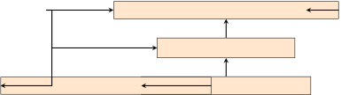
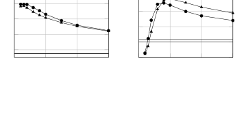
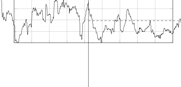

# Adaptive Dereverberation, Noise and Interferer Reduction Using Sparse Weighted Linearly Constrained Minimum Power Beamforming Thanks: This work was funded by the Deutsche Forschungsgemeinschaft (DFG, German Research Foundation) – Project ID 390895286 – EXC 2177/1.

Henri Gode and Simon Doclo Affiliation: Department of Medical Physics
and Acoustics and Cluster of Excellence Hearing4all, University of
Oldenburg, Germany  
{henri.gode, simon.doclo}@uni-oldenburg.de

###### Abstract

Interfering sources, background noise and reverberation degrade speech
quality and intelligibility in hearing aid applications. In this paper,
we present an adaptive algorithm aiming at dereverberation, noise and
interferer reduction and preservation of binaural cues based on the
weighted binaural linearly constrained minimum power (wBLCMP)
beamformer. The wBLCMP beamformer unifies the multi-channel weighted
prediction error method performing dereverberation and the linearly
constrained minimum power beamformer performing noise and interferer
reduction into a single convolutional beamformer. We propose to
adaptively compute the optimal filter by incorporating an exponential
window into a sparsity-promoting lp-norm cost function, which enables to
track a moving target speaker. Simulation results with successive target
speakers at different positions show that the proposed adaptive version
of the wBLCMP beamformer outperforms a non-adaptive version in terms of
objective speech enhancement performance measures.

###### Index Terms: 

noise reduction, dereverberation, online processing, convolutional
beamformer, multi-microphone

## I Introduction

In many hands-free speech communication systems such as hearing aids,
mobile phones and smart speakers, interfering sounds, ambient noise and
reverberation may degrade the speech quality and intelligibility of the
recorded microphone signals \[1\]. To enhance speech quality and
intelligibility, many multi-microphone speech enhancement methods aiming
at noise and interferer reduction and dereverberation have been proposed
in the last decades \[2, 3\]. For many of these methods, both
non-adaptive versions with time-invariant parameters as well as adaptive
versions with time-varying parameters exist. When considering binaural
hearing aids, it is often desired to preserve the binaural cues, which
provide spatial awareness of the acoustic scene for the listener \[4\].

A commonly used multi-microphone noise reduction method is the minimum
power distortionless response (MPDR) beamformer \[5, 6, 7\], which aims
at minimizing the output power while leaving the desired speech
component undistorted. The linearly constrained minimum power (LCMP)
beamformer generalizes the MPDR beamformer, providing the possibility of
multiple linear constraints, e.g., to perform controlled reduction of
the interfering sources \[5, 8, 9\]. Often the constraints are
formulated in terms of the relative transfer functions (RTFs) vectors of
the target speaker and interfering sources \[10, 11\].

To achieve dereverberation, the weighted prediction error (WPE)
method \[12\] and its generalization using sparse priors  \[13, 14\] are
commonly employed. WPE uses a convolutional filter, applied to a number
of past frames in the short-time Fourier transform (STFT) domain, to
estimate and subtract the late reverberation component. Since the WPE
cost function does not have an analytic solution, it has been proposed
to use iterative alternating optimization schemes. In \[15, 16\]
adaptive versions of the WPE algorithm have been proposed, e.g., by
incorporating an exponential window into the cost function and
incorporating an additional constraint to prevent overestimation of the
late reverberation \[16\].

Aiming at joint dereverberation and noise reduction, it has been
proposed to perform multiple-input multiple-output (MIMO)-WPE as a
preprocessing stage before MPDR beamforming, in a cascade system \[17\].
By unifying the optimization of the convolutional WPE filter and the
MPDR beamformer, the so-called weighted power minimization
distortionless response (WPD) beamformer \[18\] and its generalization
using sparse priors \[19\] were shown to outperform cascade systems. The
unified WPD beamformer is optimized similarly to the WPE filter with an
additional distortionless constraint using the RTFs of the target
speaker. In \[20\] two adaptive versions of the WPD algorithm have been
proposed.

Aiming at joint dereverberation, reduction of interfering sources and
noise and preservation of the binaural cues of all sources, the weighted
binaural linearly constrained minimum power (wBLCMP) beamformer
in \[21\] generalizes the WPD beamformer by unifying the optimization of
the convolutional WPE filter and the LCMP beamformer. Similarly to \[16,
20\], in this paper, we derive an adaptive version by incorporating an
exponential window into the cost function, which enables tracking of a
moving target speaker. In addition, similarly to \[19\], we explicitly
control the sparsity of the STFT coefficients by using an
$`\ell_{p}`$-norm cost function. For a complex acoustic scenario
featuring a target speaker which suddenly switches position, an
interfering source at a fixed position and diffuse babble noise,
simulation results show that the adaptive version of the wBLCMP
beamformer clearly outperforms its non-adaptive version in terms of
objective speech enhancement performance measures and RTF vector
estimation accuracy.

## II Signal Model

We consider $`J`$ acoustic sources captured by a binaural microphone
array setup with $`\nicefrac{{M}}{{2}}`$ microphones on each of two
head-worn hearing devices (e.g. left and right hearing aid) in a noisy
and reverberant acoustic environment (with $`J<M`$). Without loss of
generality, the first source ($`j=1`$) is considered to be the target
speaker and the remaining $`J-1`$ sources are considered to be
interfering sources. The STFT coefficients of the microphone signals at
time frame $`t`$ are denoted as

```math
\displaystyle\mathbf{y}_{t}=\begin{bmatrix}y_{1,t}&\cdots&y_{M,t}\end{bmatrix}^{\mathrm{T}}\in\mathbb{C}^{M\times 1}, \tag{1}
```

with $`\left(\cdot\right)^{\mathrm{T}}`$ denoting the transpose
operator. In (1) the frequency index has been omitted since it is
assumed that each frequency subband is independent and hence can be
processed individually. Similarly to \[13, 18, 20, 21, 19\], the
multi-channel microphone signal $`\mathbf{y}_{t}`$ in (1) is modeled as
the sum of each source signal $`s_{j,t}`$ convolved with its possibly
time-varying multi-channel convolutive transfer function (CTF) matrix
$`\mathbf{A}_{j,t}=\begin{bmatrix}\mathbf{a}_{j,t,0}&\cdots&\mathbf{a}_{j,t,L_{a}-1}\end{bmatrix}\in\mathbb{C}^{M\times L_{a}}`$
plus background noise $`\mathbf{n}_{t}\in\mathbb{C}^{M\times 1}`$, i.e.

```math
\displaystyle\mathbf{y}_{t}=\sum_{j=1}^{J}\sum_{l=0}^{L_{a}-1}\mathbf{a}_{j,t,l}s_{j,t-l}\ +\ \mathbf{n}_{t}, \tag{2}
```

where $`L_{a}`$ denotes the number of taps of the CTFs. By splitting the
CTFs into the early reflections and late reverberation using the integer
parameter $`\tau`$, the reverberant signal for the $`j`$-th source can
be decomposed into its direct component
$`\mathbf{d}_{j,t}\in\mathbb{C}^{M\times 1}`$ (including early
reflections) and its late reverberation component
$`\mathbf{r}_{j,t}\in\mathbb{C}^{M\times 1}`$, i.e.

```math
\displaystyle\mathbf{y}_{t}=\sum_{j=1}^{J}\underbrace{\sum_{l=0}^{\tau-1}\mathbf{a}_{j,t,l}s_{j,t-l}}_{\coloneqq\mathbf{d}_{j,t}}\ +\ \sum_{j=1}^{J}\underbrace{\sum_{l=\tau}^{L_{a}-1}\mathbf{a}_{j,t,l}s_{j,t-l}}_{\coloneqq\mathbf{r}_{j,t}}\ +\ \mathbf{n}_{t}. \tag{3}
```

The direct component for the $`j`$-th source $`\mathbf{d}_{j,t}`$ can be
approximated using the multiplicative transfer function (MTF) vector
$`\mathbf{v}_{j,t}\in\mathbb{C}^{M\times 1}`$ as \[22\]

```math
\mathbf{d}_{j,t}\approx\mathbf{v}_{j,t}s_{j,t}=\mathbf{\tilde{v}}_{j,m,t}d_{j,m,t},\quad m\in\{1,...,M\}, \tag{4}
```

where $`d_{j,m,t}`$ denotes the direct component of the $`j`$-th source
in the reference microphone $`m`$ at time frame $`t`$. The vector

```math
\displaystyle\mathbf{\tilde{v}}_{j,m,t}=\mathbf{v}_{j,t}/v_{j,m,t}\in\mathbb{C}^{M\times 1} \tag{5}
```

denotes the possibly time-varying RTF vector for the $`j`$-th source,
where $`v_{j,m,t}`$ is the $`m`$-th entry of $`\mathbf{v}_{j,t}`$.

## III Sparse wBLCMP Filter

To obtain an estimate of the direct target speech component
$`d_{1,\nu,t}`$ in the left and right reference microphone denoted by
$`m=\nu\in\{L,R\}`$, it has been proposed in \[18, 20, 19, 21\] to apply
a convolutional filter
$`\mathbf{\bar{h}}_{\nu,t}\in\mathbb{C}^{M\left(L_{h}-\tau+1\right)\times 1}`$
to the stacked noisy STFT vector $`\mathbf{\bar{y}}_{t}`$, i.e.

```math
\displaystyle\hat{d}_{1,\nu,t}={\mathbf{\bar{h}}_{\nu,t}}^{\mathrm{H}}\mathbf{\bar{y}}_{t}, \tag{6}
```

where $`\left(\cdot\right)^{\mathrm{H}}`$ denotes the conjugate
transpose operator and the stacked noisy STFT vector
$`\mathbf{\bar{y}}_{t}`$ is defined as

```math
\displaystyle\mathbf{\bar{y}}_{t} \displaystyle=\begin{bmatrix}\mathbf{y}^{\mathrm{T}}_{t}&|&\mathbf{y}^{\mathrm{T}}_{t-\tau}&\cdots&\mathbf{y}^{\mathrm{T}}_{t-L_{h}+1}\end{bmatrix}^{\mathrm{T}}\in\mathbb{C}^{M\left(L_{h}-\tau+1\right)\times 1}, \tag{7}
```

where $`L_{h}`$ denotes the filter length. It should be noted that the
vector $`\mathbf{\bar{y}}_{t}`$ only includes a subset of the $`L_{h}`$
most recent frames, i.e. it includes the current frame but excludes the
preceding $`\tau-1`$ frames, aiming at preserving the early reflections.

### III-A Non-Adaptive Version

By assuming that all CTFs and MTFs and the convolutional filter
$`\mathbf{\bar{h}}_{\nu,t}`$ do not change over time, i.e.
$`\mathbf{\bar{h}}_{\nu,t}=\mathbf{\bar{h}}_{\nu}`$ for all time frames
$`t\in\{1,\ldots,T\}`$, a non-adaptive version of the wBLCMP beamformer
aiming at joint dereverberation, noise and interferer reduction has been
derived in \[21\]. In \[21\], assuming that the direct component of the
target speaker follows a zero mean complex Gaussian distribution with a
time-varying variance
$`\lambda_{n}=\left\lvert d_{1,\nu,n}\right\rvert^{2}`$, the
convolutional filter in (6) is computed by minimizing the negative
log-likelihood function

```math
\displaystyle\argmin_{\mathbf{\bar{h}}_{\nu}}\sum_{n=1}^{T}\ln{\lambda_{n}}+\frac{\left\lvert\hat{d}_{1,\nu,n}\right\rvert^{2}}{\lambda_{n}}=\sum_{n=1}^{T}\ln{\lambda_{n}}+\frac{\left\lvert{\mathbf{\bar{h}}_{\nu}}^{\mathrm{H}}\mathbf{\bar{y}}_{n}\right\rvert^{2}}{\lambda_{n}}, \tag{8}
```

subject to a linear constraint for each source using their RTFs defined
in (5), i.e.

```math
\displaystyle\mathbf{\bar{h}}_{\nu}^{\mathrm{H}}\mathbf{\bar{v}}_{j,\nu}= \displaystyle\beta_{j}\quad\quad\quad\quad\quad\quad\forall j\in\{1,\ldots,J\} \tag{9}
```

```math
\displaystyle\mathbf{\bar{v}}_{j,\nu}= \displaystyle\begin{bmatrix}\mathbf{\tilde{v}}_{j,\nu}^{\mathrm{T}}&\mathbf{0}^{\mathrm{T}}\end{bmatrix}^{\mathrm{T}}, \tag{10}
```

where $`\mathbf{0}`$ denotes a vector containing
$`M\left(L_{h}-\tau\right)`$ zeros and $`\beta_{j}`$ denotes a scaling
factor for the direct component of the $`j`$-th source. The scaling
factor $`\beta_{1}`$ is usually set to 1, corresponding to a
distortionless constraint for the target speaker, whereas all other
scaling factors are usually chosen to be close to 0, aiming at
suppressing the interfering sources.

In this paper, we aim at explicitly taking into account that the STFT
coefficients of the direct target speech component are sparser than the
STFT coefficients of the noisy reverberant mixture recorded by the
microphones \[13\]. Hence, similarly to the WPE variant in \[14\] and
the WPD variant in \[19\], we propose to minimize the convolutional
filter in (6) using an $`\ell_{p}`$-norm cost function instead of (8),
i.e.

```math
\displaystyle\argmin_{\mathbf{\bar{h}}_{\nu}}\sum_{n=1}^{T}\left\lvert\hat{d}_{1,\nu,n}\right\rvert^{p}=\sum_{n=1}^{T}\left\lvert{\mathbf{\bar{h}}_{\nu}}^{\mathrm{H}}\mathbf{\bar{y}}_{n}\right\rvert^{p} \tag{11}
```

where $`p\in(0,2]`$ denotes the so-called shape parameter. This
parameter determines the sparsity of the cost function, where small
values of $`p`$ promote sparsity. It should be noted that for $`0<p<1`$
this cost function is non-convex.

### III-B Adaptive Version

To deal with time-varying acoustic scenarios, e.g. moving sources, in
this paper we derive an adaptive version of the wBLCMP beamformer.
Similarly as in \[16, 20\], we propose to incorporate an exponential
window into the cost function in (11). The resulting minimization
problem for each time frame $`t`$ is given by

```math
\displaystyle\argmin_{\mathbf{\bar{h}}_{\nu,t}}\sum_{n=1}^{t}\gamma^{t-n}\left\lvert\hat{d}_{1,\nu,n}\right\rvert^{p}=\sum_{n=1}^{t}\gamma^{t-n}\left\lvert{\mathbf{\bar{h}}_{\nu,t}}^{\mathrm{H}}\mathbf{\bar{y}}_{n}\right\rvert^{p} \tag{12a}
```

```math
\displaystyle\mathrm{s.t.}\quad\mathbf{\bar{h}}_{\nu,t}^{\mathrm{H}}\mathbf{\bar{v}}_{j,\nu,t}=\beta_{j}\quad\forall j\in\{1,\ldots,J\}, \tag{12b}
```

where the smoothing parameter $`\gamma\in(0,1]`$ allows adaptation to
possibly time-varying CTFs and MTFs. Note that the cost function in
(12a) reduces to the cost function in (11) for $`\gamma=1`$ and $`t=T`$.
Therefore, the following derivations based on the adaptive cost function
in (12a) for the adaptive version also hold for the cost function in
(11) for the non-adaptive version.

### III-C Filter Optimization

Similarly as in \[16, 19\], we propose to use an iteratively reweighted
least squares (IRLS) procedure to minimize the cost function in (12a)
subject to the constraints in (12b). The basic idea is to replace the
non-convex $`\ell_{p}`$-norm minimization problem with a series of
convex $`\ell_{2}`$-norm minimization subproblems, which have an
analytic solution. In this paper we used only the first iteration of
IRLS, since preliminary results indicated sufficient convergence.

#### III-C1 Constrained $`\ell_{2}`$-Norm Subproblem Minimization

test  
In each frame, the non-convex cost function in (12a) is replaced with a
convex weighted $`\ell_{2}`$-norm cost function, i.e.

```math
\displaystyle\argmin_{\mathbf{\bar{h}}_{\nu,t}}\sum_{n=1}^{t}\gamma^{t-n}w_{n}\left\lvert\hat{d}_{1,\nu,n}\right\rvert^{2}=\sum_{n=1}^{T}\gamma^{t-n}w_{n}\left\lvert{\mathbf{\bar{h}}_{\nu,t}}^{\mathrm{H}}\mathbf{\bar{y}}_{n}\right\rvert^{2} \tag{13}
```

where the weights $`w_{n}`$ are real-valued and positive. The filter
minimizing (13) subject to the linear constraints in (12b) is equal to

```math
\displaystyle\boxed{\mathbf{\bar{h}}_{\nu,t}=\bar{\mathbf{R}}_{y,t}^{-1}\bar{\mathbf{C}}_{t}\left(\bar{\mathbf{C}}_{t}^{\mathrm{H}}\bar{\mathbf{R}}_{y,t}^{-1}\bar{\mathbf{C}}_{t}\right)^{-1}\mathbf{B}\bar{\mathbf{C}}_{t}^{\mathrm{H}}\mathbf{e}_{\nu}}, \tag{14}
```

where

```math
\displaystyle\mathbf{\bar{R}}_{y,t}=\sum_{n=1}^{t}\gamma^{t-n}w_{n}\mathbf{\bar{y}}_{n}\mathbf{\bar{y}}_{n}^{\mathrm{H}} \tag{15}
```

denotes the weighted noisy spatio-temporal covariance matrix (STCM) of
the stacked microphone signals,
$`\bar{\mathbf{C}}_{t}=\begin{bmatrix}\mathbf{\bar{v}}_{1,\nu,t}&\cdots&\mathbf{\bar{v}}_{J,\nu,t}\end{bmatrix}`$
denotes the constraint matrix containing the RTF vectors for all
sources,
$`\mathbf{B}=\mathrm{diag}\left(\begin{bmatrix}\beta_{1}&\cdots&\beta_{J}\end{bmatrix}^{\mathrm{T}}\right)`$
denotes the diagonal scaling matrix containing the scaling factors for
all sources, and $`\mathbf{e}_{\nu}`$ is a selection vector with its
entry corresponding to the left or right reference microphone equal to
$`1`$ and all other entries equal to $`0`$. Assuming that the weights
$`w_{n}`$ of past frames $`n\in\{1,\ldots,t-1\}`$ are well estimated
during processing of these past frames, the weighted noisy STCM
$`\mathbf{\bar{R}}_{y,t}`$ in (15) can be effectively computed by an
recursive update in each frame, i.e.
$`\mathbf{\bar{R}}_{y,t}=\gamma\mathbf{\bar{R}}_{y,t-1}+w_{t}\mathbf{\bar{y}}_{t}\mathbf{\bar{y}}_{t}^{\mathrm{H}}`$.
However, since only the inverse of the weighted noisy STCM is required
in (14) it is more effective to use an update formula for
$`\mathbf{\bar{R}}_{y,t}^{-1}`$ based on the Woodbury matrix identity,
i.e.

```math
\displaystyle\mathbf{\bar{R}}_{y,t}^{-1}=\frac{1}{\gamma}\left(\mathbf{\bar{R}}_{y,t-1}^{-1}-\frac{w_{t}\mathbf{\bar{R}}_{y,t-1}^{-1}\mathbf{\bar{y}}_{t}\mathbf{\bar{y}}_{t}^{\mathrm{H}}\mathbf{\bar{R}}_{y,t-1}^{-1}}{\gamma+w_{t}\mathbf{\bar{y}}_{t}^{\mathrm{H}}\mathbf{\bar{R}}_{y,t-1}^{-1}\mathbf{\bar{y}}_{t}}\right) \tag{16}
```

#### III-C2 Weight Estimation

test  
Similarly as in \[13, 19\], in each frame $`t`$ the weight $`w_{t}`$ in
(16) is estimated as

```math
\displaystyle w_{t}=\left(\sum_{\nu}\left\lvert\hat{d}_{1,\nu,t}\right\rvert^{2}\right)^{\nicefrac{{p}}{{2}}-1}=\left(\sum_{\nu}\left\lvert{\mathbf{\bar{h}}_{\nu,t}}^{\mathrm{H}}\mathbf{\bar{y}}_{t}\right\rvert^{2}\right)^{\nicefrac{{p}}{{2}}-1}, \tag{17}
```

such that (13) is a first-order approximation of (12a). Note that the
shape parameter $`p`$ only affects the weight update in (17) of the
algorithm, where it is possible to set $`p=0`$.



Fig. 1: Block diagram of the proposed adaptive wBLCMP algorithm,
incorporating a MIMO-WPE preprocessing stage for estimating the RTFs.

### III-D RTF Estimation

The wBLCMP beamformer in (14) requires estimates of the RTFs for each
source, which can be obtained using the covariance whitening
method \[11, 23\]. It has been shown in \[20\] that performing RTF
estimation on multi-channel dereverberated signals $`\mathbf{z}_{t}`$,
obtained by a MIMO-WPE preprocessing stage, is beneficial, since the
MTF-based model in (4) assumes short transfer functions for the direct
component. The block diagram in Fig. 1 shows an overview of the complete
algorithm. Note that the computation time is not significantly increased
by the MIMO-WPE preprocessing stage, since the wBLCMP filter can be
effectively computed using the MIMO-WPE filter, because both are based
on the convolutional signal model in (2) and can be derived using the
$`\ell_{p}`$-norm cost function in (12a) \[24\]. The RTF vector of the
$`j`$-th source can then be estimated based on the generalized
eigenvalue decomposition of the dereverberated covariance matrix
$`\mathbf{R}_{j,t}`$ of that source and the dereverberated covariance
matrix $`\mathbf{R}_{v,j,t}`$ of all other sources and the background
noise. Since accurately estimating all of these covariance matrices is
far from trivial, in this paper, we will assume oracle knowledge about a
noise-only period and a noise-plus-interferer period in the beginning of
the signal, which are used to compute fixed covariance matrices of an
interfering source and noise. In contrast, the covariance matrix and RTF
vector of the target are tracked.

## IV Experimental Results

In this section, we compare the performance of the proposed adaptive
version of the wBLCMP beamformer (Sec. III-B) with the non-adaptive
version (Sec. III-A) using different shape parameters $`p`$ for a
spatially non-stationary acoustic scenario where the target speaker
suddenly switches position.

### IV-A Acoustic Scenario




Fig. 2: Average FWSSNR and SRR improvement vs. time constant
$`t_{\gamma}`$ for different values of the shape parameter $`p`$. Note
that the non-adaptive method obviously does not have a time constant.

We considered 2 behind-the-ear (BTE) hearing aids with 2 microphones
each, mounted on a dummy head located approximately in the center of an
acoustic laboratory
$`($7\text{\,}\mathrm{m}$\times$6\text{\,}\mathrm{m}$\times$2.7\text{\,}\mathrm{m}$)`$
with a reverberation time $`T\_{60}\approx$510\text{\,}\mathrm{ms}$`$.
The acoustic scenario consists of one target speaker (which suddenly
switches position), one interfering speaker (at a fixed position) and
background noise. The target and interfering speech components at the
microphones were generated by convolving clean speech signals with room
impulse responses measured from loudspeakers at about
$`2\text{\,}\mathrm{m}`$ from the dummy head. The target speaker at
position 1 ($`0\text{\,}\mathrm{\SIUnitSymbolDegree}`$, front of dummy
head) is a male speaker which is active in the interval
$`\left[$2\text{\,}\mathrm{s}$,$20.4\text{\,}\mathrm{s}$\right]`$,
whereas the target speaker at position 2
($`90\text{\,}\mathrm{\SIUnitSymbolDegree}`$, right of dummy head) is a
female speaker which is active in the interval
$`\left[$20.4\text{\,}\mathrm{s}$,$39\text{\,}\mathrm{s}$\right]`$. The
interfering speaker is a male speaker which is located at
$`-120\text{\,}\mathrm{\SIUnitSymbolDegree}`$ and is active in the
interval
$`\left[$1\text{\,}\mathrm{s}$,$39\text{\,}\mathrm{s}$\right]`$.
Quasi-diffuse babble noise, which is constantly active, was generated by
playing back cafeteria noise using 4 loudspeakers facing the corners of
the laboratory. The noisy mixture is constructed at a broadband
signal-to-noise ratio (SNR) of $`0\text{\,}\mathrm{dB}`$ and a broadband
signal-to-interferer ratio (SIR) of $`0\text{\,}\mathrm{dB}`$ for both
target positions. Note that there is a noise-only period in the
$`1^{\mathrm{st}}`$ second and a noise-plus-interferer period in the
$`2^{\mathrm{nd}}`$ second. The sampling frequency was equal to
$`16\text{\,}\mathrm{kHz}`$.

### IV-B Algorithm Settings

We applied the wBLCMP beamformer within an STFT framework with a frame
length of $`32\text{\,}\mathrm{ms}`$, a frame shift of
$`t_{s}=$16\text{\,}\mathrm{ms}$`$ and a sqrt-Hann window for analysis
and synthesis. We compared the performance of two shape parameters
$`p=\{0,0.5\}`$, since it has been shown in \[13\] that a shape
parameter of $`p=0.5`$ can be beneficial. The filter length $`L*{h}`$ in
(7) was set to 16 frames corresponding to $`256\text{\,}\mathrm{ms}`$
covering about half of the $`T*{60}`$. The prediction delay $`\tau`$ was
set to 3 frames corresponding to $`48\text{\,}\mathrm{ms}`$ aiming at
preserving the early reflections. The scaling factors of the target
speaker and the interfering source in (9) were set to
$`\beta*{1}=$0\text{\,}\mathrm{d}\mathrm{B}$`$ and
$`\beta*{2}=$-20\text{\,}\mathrm{dB}$`$, respectively. Since preliminary
results indicated reasonable convergence after the initial iteration of
the alternating optimization described in Sec. III-C, we chose to stop
after the first iteration to reduce computational cost. For the adaptive
versions, different time constants are evaluated between
$`t*{\gamma}=\left[$100\text{\,}\mathrm{ms}$,$1500\text{\,}\mathrm{ms}$\right]`$.
The smoothing parameter $`\gamma`$ can be computed using the time
constant as $`\gamma=e^{\nicefrac{{-t*{s}}}{{t_{\gamma}}}}`$. The
noise-plus-interferer covariance matrix $`\mathbf{R}_{v,2}`$ and RTF
vector of the interfering source $`\mathbf{\tilde{v}}_{2,\nu}`$ are
fixed after the first $`2\text{\,}\mathrm{s}`$, whereas the covariance
matrix and RTF vector of the target speaker are adaptively tracked.




Fig. 3: Mean Hermitian angle between the oracle RTF vector of the active
target speaker and the estimated target RTF vector within the wBLCMP
algorithm ($`p=0.5`$) over time for a time constant
$`t_{\gamma}=$400\text{\,}\mathrm{ms}$`$. The switch of target speaker
occurs at approximately $`20.4\text{\,}\mathrm{s}`$. Note that the
non-adaptive version only provides one constant RTF vector estimate for
the whole signal.

### IV-C Objective Speech Enhancement Measures

As objective performance measures we used the frequency-weighted
segmental signal-to-noise ratio (FWSSNR) \[25\], and the
signal-to-reverberation ratio (SRR) \[26\] averaged across the left and
right output signal. As reference signal for FWSSNR and SRR we used the
direct target speech component including early reflections (first
$`50\text{\,}\mathrm{ms}`$ of the room impulse responses (RIRs)) at the
reference microphones.

In addition, we evaluate the RTF vector estimation accuracy based on the
Hermitian angle

```math
\displaystyle\varphi=\mathrm{acos}\left(\frac{\left\lvert\mathbf{\hat{\tilde{v}}}_{j,t}^{\mathrm{H}}\mathbf{\tilde{v}}_{j,t}\right\rvert}{\left\lVert\mathbf{\hat{\tilde{v}}}_{j,t}\right\rVert\left\lVert\mathbf{\tilde{v}}_{j,t}\right\rVert}\right) \tag{18}
```

between the estimated RTF vector $`\mathbf{\hat{\tilde{v}}}_{j,t}`$ of
the target speaker and the oracle RTF vector
$`\mathbf{\tilde{v}}_{j,t}`$ averaged across frequency bands. The
Hermitian angle $`\varphi`$ is a scale-invariant error measure for
complex vectors, with lower values indicating smaller errors. The oracle
RTF vectors are computed as the principal eigenvector of the covariance
matrices of a white noise signal convolved with the early part
($`50\text{\,}\mathrm{ms}`$) of the respective multi-channel RIRs of the
target speaker. Note that for each target speaker position there is a
unique oracle RTF vector.

### IV-D Results

Fig. 2 compares the FWSSNR and SRR improvements (difference between
scores for input and output signals) for different time constants
$`t_{\gamma}`$ of the adaptive and non-adaptive version of the wBLCMP
beamformer using two different shape parameters $`p=\{0,0.5\}`$. It can
be clearly observed that for the considered switching-target scenario
the adaptive version of the wBLCMP beamformer outperforms the
non-adaptive version in both performance measures for almost all time
constants. The best SRR improvement is obtained using a time constant of
roughly $`t_{\gamma}=$450\text{\,}\mathrm{ms}$`$, whereas the FWSSNR
improvement is higher for shorter time constants. Using the shape
parameter $`p=0.5`$ yields better SRR improvements especially for larger
time constants, whereas using the shape parameter $`p=0`$, corresponding
to the conventional cost function in (8), yields slightly better FWSSNR
improvements.

For the adaptive and the non-adaptive version Fig. 3 shows the average
Hermitian angle between the oracle RTF vector of the active target
speaker and the estimated target RTF vector. Note that the non-adaptive
version only provides one RTF vector estimate for the whole signal in
contrast to the adaptive version which estimates the RTF vector of the
target speaker in each time frame. It can be observed that the adaptive
wBLCMP beamformer outperforms the non-adaptive version in almost all
time frames in terms of RTF vector estimation accuracy.

## V Conclusion

In this paper, we derived an adaptive version of the wBLCMP beamformer
capable of tracking a moving target speaker in a noisy environment with
interfering sources. In addition we generalized the conventional method
using sparse priors. The evaluation in terms of objective performance
measures clearly shows that the adaptive version outperforms the
non-adaptive version in the considered acoustic scenario. This can be
explained partly by the ability to track the time-varying RTF vector and
covariance matrix of a moving target speaker.

## References

- \[1\] R. Beutelmann and T. Brand, “Prediction of speech
  intelligibility in spatial noise and reverberation for normal-hearing
  and hearing-impaired listeners,” _The Journal of the Acoustical
  Society of America_, vol. 120, no. 1, pp. 331–342, Jul. 2006.
- \[2\] S. Doclo, W. Kellermann, S. Makino, and S. E. Nordholm,
  “Multichannel Signal Enhancement Algorithms for Assisted Listening
  Devices: Exploiting spatial diversity using multiple microphones,”
  _IEEE Signal Processing Magazine_, vol. 32, no. 2, pp. 18–30,
  Mar. 2015.
- \[3\] E. Vincent, T. Virtanen, and S. Gannot, _Audio Source Separation
  and Speech Enhancement_. John Wiley & Sons, Oct. 2018.
- \[4\] M. Lavandier and J. F. Culling, “Speech segregation in rooms:
  Monaural, binaural, and interacting effects of reverberation on target
  and interferer,” _The Journal of the Acoustical Society of America_,
  vol. 123, no. 4, pp. 2237–2248, Apr. 2008.
- \[5\] B. D. Van Veen and K. M. Buckley, “Beamforming: a versatile
  approach to spatial filtering,” _IEEE ASSP Magazine_, vol. 5, no. 2,
  pp. 4–24, Apr. 1988.
- \[6\] H. Cox, R. Zeskind, and M. Owen, “Robust adaptive beamforming,”
  _IEEE Transactions on Acoustics, Speech, and Signal Processing_,
  vol. 35, no. 10, pp. 1365–1376, Oct. 1987.
- \[7\] S. Gannot, E. Vincent, S. Markovich-Golan, and A. Ozerov, “A
  Consolidated Perspective on Multimicrophone Speech Enhancement and
  Source Separation,” _IEEE/ACM Transactions on Audio, Speech, and
  Language Processing_, vol. 25, no. 4, pp. 692–730, Apr. 2017.
- \[8\] E. Hadad, S. Doclo, and S. Gannot, “The Binaural LCMV Beamformer
  and its Performance Analysis,” _IEEE/ACM Trans. on Audio, Speech, and
  Language Processing_, vol. 24, no. 3, pp. 543–558, Mar. 2016.
- \[9\] N. Gößling, D. Marquardt, I. Merks, T. Zhang, and S. Doclo,
  “Optimal binaural LCMV beamforming in complex acoustic scenarios:
  Theoretical and practical insights,” in _Proc. International Workshop
  on Acoustic Signal Enhancement_, Tokyo, Japan, 2018, pp. 381–385.
- \[10\] G. Reuven, S. Gannot, and I. Cohen, “Dual-Source
  Transfer-Function Generalized Sidelobe Canceller,” _IEEE Transactions
  on Audio, Speech, and Language Processing_, vol. 16, no. 4, pp.
  711–727, May 2008.
- \[11\] S. Markovich, S. Gannot, and I. Cohen, “Multichannel Eigenspace
  Beamforming in a Reverberant Noisy Environment With Multiple
  Interfering Speech Signals,” _IEEE Transactions on Audio, Speech, and
  Language Processing_, vol. 17, no. 6, pp. 1071–1086, Aug. 2009.
- \[12\] T. Nakatani, T. Yoshioka, K. Kinoshita, M. Miyoshi, and
  B. Juang, “Speech Dereverberation Based on Variance-Normalized Delayed
  Linear Prediction,” _IEEE Trans. on Audio, Speech, and Language
  Processing_, vol. 18, no. 7, pp. 1717–1731, Sep. 2010.
- \[13\] A. Jukić, T. van Waterschoot, T. Gerkmann, and S. Doclo,
  “Multi-Channel Linear Prediction-Based Speech Dereverberation With
  Sparse Priors,” _IEEE/ACM Trans. on Audio, Speech, and Language
  Processing_, vol. 23, no. 9, pp. 1509–1520, Sep. 2015.
- \[14\] ——, “Group sparsity for MIMO speech dereverberation,” in _Proc.
  IEEE Workshop on Applications of Signal Processing to Audio and
  Acoustics_, New Paltz NY, USA, Oct. 2015, pp. 1–5.
- \[15\] T. Yoshioka, H. Tachibana, T. Nakatani, and M. Miyoshi,
  “Adaptive dereverberation of speech signals with speaker-position
  change detection,” in _Proc. IEEE International Conference on
  Acoustics, Speech and Signal Processing_, Taipei, Taiwan, Apr. 2009,
  pp. 3733–3736.
- \[16\] A. Jukić, T. van Waterschoot, and S. Doclo, “Adaptive Speech
  Dereverberation Using Constrained Sparse Multichannel Linear
  Prediction,” _IEEE Signal Processing Letters_, vol. 24, no. 1, pp.
  101–105, Jan. 2017.
- \[17\] M. Delcroix, T. Yoshioka, A. Ogawa, Y. Kubo, M. Fujimoto,
  N. Ito, K. Kinoshita, M. Espi, S. Araki, T. Hori, and T. Nakatani,
  “Strategies for distant speech recognition in reverberant
  environments,” _EURASIP Journal on Advances in Signal Processing_,
  vol. 2015, no. 1, pp. 1–15, Jul. 2015.
- \[18\] T. Nakatani and K. Kinoshita, “A Unified Convolutional
  Beamformer for Simultaneous Denoising and Dereverberation,” _IEEE
  Signal Processing Letters_, vol. 26, no. 6, pp. 903–907, Jun. 2019.
- \[19\] H. Gode, M. Tammen, and S. Doclo, “Joint multi-channel
  dereverberation and noise reduction using a unified convolutional
  beamformer with sparse priors,” in _Proc. ITG Conference on Speech
  Communication_, Kiel, Germany, Sep. 2021, pp. 144–148.
- \[20\] T. Nakatani and K. Kinoshita, “Simultaneous Denoising and
  Dereverberation for Low-Latency Applications Using Frame-by-Frame
  Online Unified Convolutional Beamformer,” in _Proc. Interspeech_,
  Graz, Austria, Sep. 2019, pp. 111–115.
- \[21\] A. Aroudi, M. Delcroix, T. Nakatani, K. Kinoshita, S. Araki,
  and S. Doclo, “Cognitive-Driven Convolutional Beamforming Using
  EEG-Based Auditory Attention Decoding,” in _Proc. IEEE International
  Workshop on Machine Learning for Signal Processing_, Espoo, Finland,
  Sep. 2020, pp. 1–6.
- \[22\] Y. Avargel and I. Cohen, “On Multiplicative Transfer Function
  Approximation in the Short-Time Fourier Transform Domain,” _IEEE
  Signal Processing Letters_, vol. 14, no. 5, pp. 337–340, May 2007.
- \[23\] R. Serizel, M. Moonen, B. Van Dijk, and J. Wouters, “Low-rank
  Approximation Based Multichannel Wiener Filter Algorithms for Noise
  Reduction with Application in Cochlear Implants,” _IEEE/ACM Trans. on
  Audio, Speech, and Language Processing_, vol. 22, no. 4, pp. 785–799,
  Apr. 2014.
- \[24\] T. Nakatani and K. Kinoshita, “Maximum likelihood convolutional
  beamformer for simultaneous denoising and dereverberation,” in _Proc.
  European Signal Processing Conference_, A Coruña, Spain, Sep. 2019,
  pp. 1–5.
- \[25\] Y. Hu and P. C. Loizou, “Evaluation of Objective Quality
  Measures for Speech Enhancement,” _IEEE Transactions on Audio, Speech,
  and Language Processing_, vol. 16, no. 1, pp. 229–238, Jan. 2008.
- \[26\] P. A. Naylor, N. D. Gaubitch, and E. A. P. Habets,
  “Signal-Based Performance Evaluation of Dereverberation Algorithms,”
  _Journal of Electrical and Computer Engineering_, vol. 2010, p.
  e127513, Jan. 2010.
