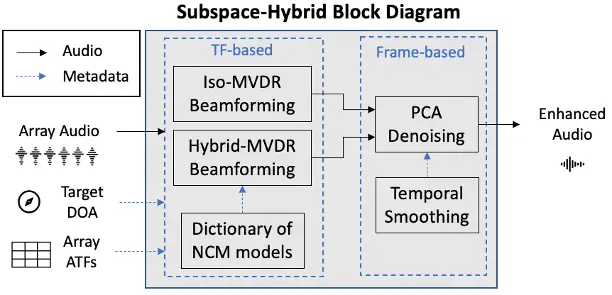
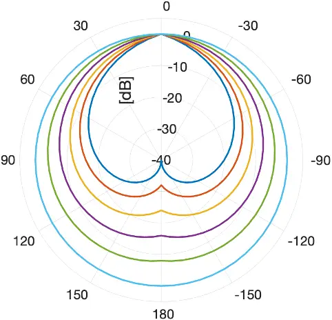
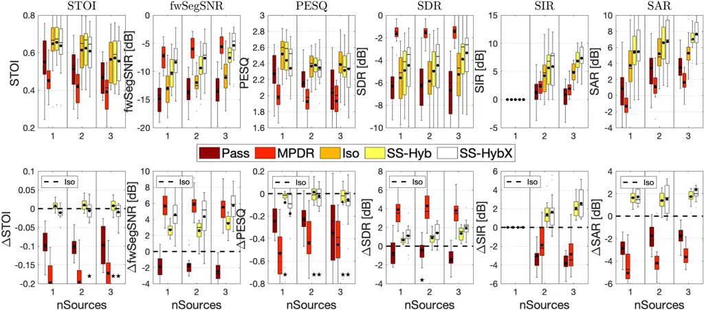
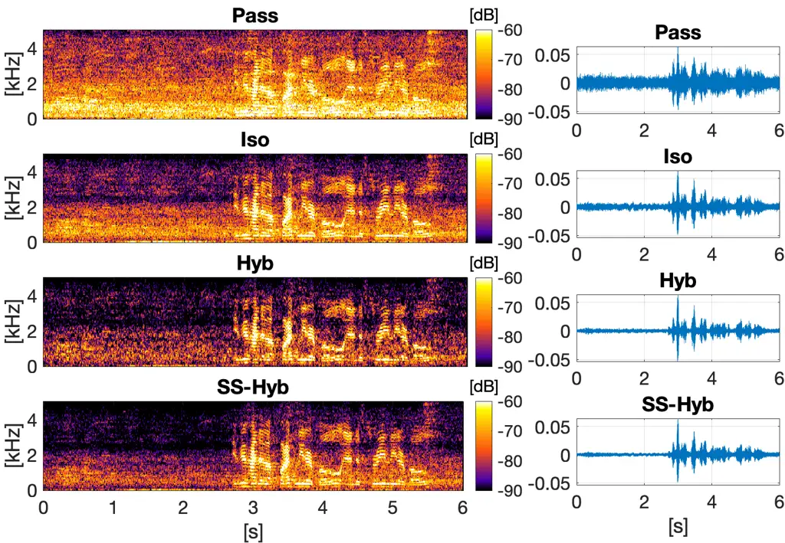

# Subspace Hybrid Beamforming for head-worn microphone arrays

Sina Hafezi , Alastair H. Moore , Pierre Guiraud , Patrick A. Naylor ,
Jacob Donley , Vladimir Tourbabin , Thomas Lunner 

###### Abstract

A two-stage multi-channel speech enhancement method is proposed which
consists of a novel adaptive beamformer, Hybrid MVDR (MVDR),
Isotropic-MVDR (Iso), and a novel multi-channel spectral PCA (PCA)
denoising. In the first stage, the Hybrid-MVDR performs multiple MVDR
using a dictionary of pre-defined noise field models and picks the
minimum-power outcome, which benefits from the robustness of
signal-independent beamforming and the performance of adaptive
beamforming. In the second stage, the outcomes of Hybrid and Iso are
jointly used in a two-channel PCA-based denoising to remove the ‘musical
noise’ produced by Hybrid beamformer. On a dataset of real
‘cocktail-party’ recordings with head-worn array, the proposed method
outperforms the baseline superdirective beamformer in noise suppression
(fwSegSNR, SDR, SIR, SAR) and speech intelligibility (STOI) with similar
speech quality (PESQ) improvement.

###### Index Terms: 

subspace, eigenvalue decomposition, beamforming, microphone arrays,
augmented reality

^(†)^(†)address: $`{}^{\text{\textdagger}}`$ Electrical and Electronic
Engineering, Imperial College London, London, UK  
$`{}^{\text{\textdaggerdbl}}`$ Meta Reality Labs Research, Redmond,
Washington, USA

## 1 Introduction

With growing popularity of microphone arrays in devices such as
wearables, speech enhancement takes advantage of multi-channel
processing by exploiting the signal spatial characteristics.
Multi-channel speech enhancement has applications in hearing aids,
augmented reality, teleconferencing and robot audition \[1, 2, 3\] and
typically consists of a MISO (MISO) block optionally followed by a
single-channel post-processing. The focus in the work is on the MISO
block for a single target, however, the problem can be extended to
multi-target by repeating a method for different targets.

The existing MISO methods can be generally grouped into analytical or ML
(ML) approaches. The ML methods \[4, 5\] have shown promising results
but may not generalise to unseen conditions. For wearable arrays, this
is potentially problematic due to the additional dimensions of
complexity and variation caused by rapid movements (translation and
rotation) of the array.

For analytical approaches, beamforming has been widely used for decades
due to its computational simplicity and robustness. Signal-independent
beamformers, such as superdirective \[6\] or delay-and-sum, provide fast
and robust computation with pre-calculated weights whereas adaptive
beamformers, such as MVDR \[7, 8\], can potentially provide better
results but at the cost of more computation and the risk of signal
distortion \[9, 10\] due to errors in the array steering vector or
target DOA (DOA). A particular challenge for adaptive beamforming in the
context of wearable arrays is that the short-term stationarity
assumption \[11\] may be violated during head rotations, especially for
anisotropic noise fields.

In this work, we consider the ‘cocktail party’ \[12\] scenario where the
subject wearing the array and the single target are surrounded by
temporally dynamic ambient noise such as babble noise and with possible
presence of nearby interference(s). The target DOA with respect to the
rotated array and the array’s ATF with realistic accuracy are assumed to
be either known a priori or else can be estimated \[13, 11, 14\].

The remainder of the paper is structured as follows: Section 2 reviews
the technical background for the signal-independent and adaptive
beamformers used as baseline. Section 3 introduces the proposed method
and its novel blocks. In Section 4, two versions of the proposed method
are compared with the baseline using real-recording ‘cocktail party’
scenario with head-worn array. Finally, conclusions are given in
Section 5.

## 2 Baseline Beamformers

Let
$`{\mathbf{x}}{({\tau},{f})}=[{X}_{1}{({\tau},{f})}\ldots{X}_{{Q}}{({\tau},{f})}]^{T}\in\mathbb{C}^{{Q}\times 1}`$
denote the vector of the observed signals $`{X}_{{q}}{({\tau},{f})}`$ at
time frame index $`{\tau}`$, frequency index $`{f}`$, microphone index
$`{q}`$ for a total of $`{Q}`$ microphones. The beamformer output is

```math
{Y}{({\tau},{f})}={\mathbf{w}}^{H}{({\tau},{f})}{\mathbf{x}}{({\tau},{f})}, \tag{1}
```

where $`{\mathbf{w}}\in\mathbb{C}^{{Q}\times 1}`$ is beamformer weights
and $`(.)^{H}`$ is the Hermitian transpose. For notational simplicity,
the $`{({\tau},{f})}`$ dependency will be omitted for the remaining of
the paper unless stated otherwise.

Based on the MVDR beamformer, the weights can be derived as \[8\]

```math
{\mathbf{w}}=({\mathbf{d}}^{H}{\mathbf{R}}^{-1}{\mathbf{d}})^{-1}{\mathbf{R}}^{-1}{\mathbf{d}}, \tag{2}
```

where
$`{\mathbf{d}}={\mathbf{a}}({\Omega}_{s})\in\mathbb{C}^{{Q}\times 1}`$
is the steering vector $`{\mathbf{a}}`$ for the target DOA
$`{\Omega}_{s}`$, $`{\mathbf{R}}\in\mathbb{C}^{{Q}\times{Q}}`$ is the
NCM (NCM) and $`(.)^{-1}`$ denotes the inversion operator.

### 2.1 Iso-MVDR (Superdirective)

The Isotropic-MVDR, referred to as Iso, assumes a stationary spherically
isotropic NCM as $`{\mathbf{R}}`$ in (2). This is equivalent to assuming
uncorrelated plane waves with equal power arriving from all directions.
The spherically isotropic diffuse covariance matrix can be obtained as

```math
{\mathbf{R}}_{\gamma}=\int_{{\Omega}}{\mathbf{a}}({\Omega}){{\mathbf{a}}}^{H}({\Omega})d{\Omega}, \tag{3}
```

where
$`\int_{{\Omega}}d{\Omega}=\int_{0}^{2\pi}\int_{0}^{\pi}\sin({\theta})d{\theta}d{\varphi}`$
denotes integration along azimuth $`{\varphi}\in[0,2\pi)`$ and
inclination $`{\theta}\in[0,\pi]`$.

Assuming the ATF of the array is available for a discrete set of
directions $`\mathcal{I}`$ from a grid of uniform distribution across
azimuth and inclination, then (3) is approximated by
quadrature-weighting the grid of discrete points as

```math
{\mathbf{R}}_{\text{Iso}}=\sum_{i\in\mathcal{I}}w_{i}{\mathbf{a}}({\Omega}_{i}){{\mathbf{a}}}^{H}({\Omega}_{i}), \tag{4}
```

where $`w_{i}`$ is the quadrature weight for each sample point given by
\[15\]

```math
w_{i}=\frac{2\sin{\theta}_{i}}{N_{\varphi}N_{\theta}}\sum_{m=0}^{0.5N_{\theta}-1}\frac{\sin\left(\left(2m+1\right){\theta}_{i}\right)}{2m+1}, \tag{5}
```

in which $`{\theta}_{i}`$ is the inclination of sample point $`i`$ and
the number of sample points in azimuth and inclination are
$`N_{\varphi}`$ and $`N_{\theta}`$ respectively. Note that the
quadrature weighting is done to preserve the uniform power isotropy by
compensating for higher density of points closer to the poles in a
uniform grid spatial sampling scheme. The use of other spatial sampling
schemes may require no or different weighting. Using
$`{\mathbf{R}}={\mathbf{R}}_{\text{Iso}}`$ in (2) and substituting it in
(1), the output of this beamformer is denoted as $`{Y}_{\text{Iso}}`$.

### 2.2 MPDR

The MPDR (MPDR) assumes SCM (SCM) as the $`{\mathbf{R}}`$ in (2) given
as

```math
{\mathbf{R}}_{\text{SCM}}=\mathbb{E}\{{\mathbf{x}}{\mathbf{x}}^{H}\}, \tag{6}
```

where $`\mathbb{E}\{.\}`$ is the expectation operator. An estimate of
the SCM is obtained by applying an EMA (EMA) to the instantaneous
covariance matrix

```math
\displaystyle{\mathbf{R}}_{\text{MPDR}}{({\tau},{f})}=\alpha{\mathbf{R}}_{\text{MPDR}}({\tau}-1,{f}) \tag{7}
```

```math
\displaystyle+(1-\alpha){\mathbf{x}}{({\tau},{f})}{\mathbf{x}}^{H}{({\tau},{f})},
```

where $`\alpha=e^{-\Delta t/T}`$ is the smoothing factor (between $`0`$
and $`1`$), $`\Delta t`$ is the time step between frames and $`T`$ is
the time constant.

## 3 Proposed Method



Figure 1: The proposed system block diagram.

As illustrated in Fig. 1, the proposed method consists of two-stage
multi-channel processing. In the first stage two types of beamforming
are performed at every TF (TF) bin. In the second stage, the spectrum
output of both beamformers at each time frame are combined to form a
two-channel data on which PCA \[16\] is performed to output the final
enhanced signal. In addition to Iso-MVDR, described in Section 2.1, the
system makes use of two novel processing blocks described as follows.

### 3.1 Hybrid-MVDR

This block, referred to as Hybrid, performs multiple MVDR beamforming
with the same steering vector for a known target direction but various
NCM taken from a dictionary of pre-defined noise sound field models. The
dictionary denoted as $`P=\{{\mathbf{w}}_{m}({f},\Omega)\}`$ contains
the pre-calculated beamformer weights for each sample noise field model
$`m`$, frequency index $`{f}`$ and steering direction $`\Omega`$ where
$`1\leq m\leq{M}`$ for a total number of $`{M}`$ models. The output with
the minimum power among the models is selected and denoted as

```math
\displaystyle{Y}_{\text{Hyb}}=({\mathbf{w}}_{j})^{H}{\mathbf{x}}, \tag{8}
```

```math
\displaystyle\mathrm{with\quad} \displaystyle j=\argmin_{m}{\{\lVert({\mathbf{w}}_{m})^{H}{\mathbf{x}}\rVert^{2}\}}. \tag{9}
```

The dictionary can contain beamformer weights based on a variety of
noise field models such as isotropic, anisotropic, PW, spatially
uncorrelated (diagonal covariance), and potentially more complex ones
such as combination of basic ones or previously measured NCM. The size
and the models used in the dictionary are described in Section 3.3.

As will be shown in Section 4, although Hybrid beamformer results in
stronger acoustic noise reduction, the output contains ‘musical noise’
due to rapid switching of beam pattern caused by potential selection of
highly different models for neighbouring time frames and frequencies. To
suppress this musical noise, which is assumed to be uncorrelated, or
only partially correlated, with the acoustic noise, the next proposed
block extracts that component of Hybrid-MVDR output which is correlated
with the Iso-MVDR output.

### 3.2 Spectral PCA Denoising

In each time frame, let
$`{\mathbf{y}}({\tau})=[{Y}({\tau},1)\ldots{Y}({\tau},{F})]^{T}`$ denote
the spectrum output for a beamformer with a total of $`{F}`$ frequency
bands. The associated outputs from Hybrid and Iso beamformers
(identified by subscript) are joint to form a two-channel complex-value
array of data

```math
{\mathbf{Z}}({\tau})=[{\mathbf{y}}_{\text{Hyb}}({\tau}),{\mathbf{y}}_{\text{Iso}}({\tau})]. \tag{10}
```

The $`2\times 2`$ inter-channel covariance matrix of
$`{\mathbf{Z}}({\tau})`$ is then

```math
{\mathbf{R}}({\tau})=\mathbb{E}\{{\mathbf{Z}}^{H}({\tau}){\mathbf{Z}}({\tau})\}, \tag{11}
```

which can be approximated, using EMA, as

```math
{\mathbf{R}}_{\text{Z}}({\tau})=\alpha{\mathbf{R}}_{\text{Z}}({\tau}-1)+(1-\alpha)({\mathbf{Z}}^{H}({\tau}){\mathbf{Z}}({\tau})). \tag{12}
```

Using EVD (EVD), $`{\mathbf{R}}_{\text{Z}}`$ is decomposed as

```math
{\mathbf{R}}_{\text{Z}}({\tau})={\mathbf{U}}({\tau}){\mathbf{\Sigma}}({\tau}){\mathbf{U}}^{-1}({\tau}), \tag{13}
```

where $`{\mathbf{U}}\in\mathbb{C}^{2\times 2}`$ and
$`{\mathbf{\Sigma}}`$ are respectively the eigenvectors and diagonal
matrix of eigenvalues. Assuming the columns of $`{\mathbf{\Sigma}}`$ are
sorted in descending order of eigenvalues, the first column of
$`\mathbf{U}({\tau})=[\mathbf{U}_{S}({\tau}),\mathbf{U}_{N}({\tau})]`$
is considered as signal eigenvector denoted as
$`\mathbf{U}_{S}({\tau})\in\mathbb{C}^{2\times 1}`$.

The SS (SS) of the $`{\mathbf{Z}}({\tau})`$ is reconstructed as

```math
{\mathbf{Z}}_{\text{SS}}({\tau})={\mathbf{Z}}({\tau}){\mathbf{U}}_{S}({\tau}){\mathbf{U}}_{S}^{H}({\tau}), \tag{14}
```

where the first column of
$`{\mathbf{Z}}_{\text{SS}}({\tau})=[{\mathbf{y}}_{\text{SS-Hyb}}({\tau}),{\mathbf{y}}_{\text{SS-Iso}}({\tau})]`$
is considered as the final spectrum output of the system and denoted as
$`{\mathbf{y}}_{\text{SS-Hyb}}`$.

### 3.3 Dictionary composition

Two variations of dictionary $`P`$, in Hybrid are considered using
available ATF. In the first version, denoted as SS-Hyb, the NCM models
consist of the identity matrix, spherically isotropic noise and five
unimodal anisotropic distributions across horizon, as shown in Fig. 2,
horizontally rotated for every $`6\text{\,}\deg`$ azimuth spacing as for
the peak position and were quadrature weighted along the inclination to
form the 3D sound field. For unimodal anisotropic models, the power was
a linear function of azimuth with power dynamic ranges of
$`\{8,16,24,32,40\}$\text{\,}\mathrm{dB}$`$. The second version, denoted
as SS-HybX, extends the number of models in the dictionary by
additionally including individual PW models for all available ATF
directions.



Figure 2: Isotropic and five unimodal anisotropic models for the
horizontal isotropy of the noise field.

## 4 Evaluations



Figure 3: The absolute (top) and relative (bottom) STOI \[17\], fwSegSNR
\[18\], PESQ \[19\], SDR \[20\], SIR \[20\] and SAR \[20\].

In this section, the two implementations of the proposed method are
compared with the Iso-MVDR and adaptive MPDR baseline beamformers as
well as the ‘passthrough’ signal at the reference microphone.

### 4.1 Dataset and Array

In the context of augmented hearing and augmented reality, the EasyCom
dataset \[21\] was used for evaluation. It contains recordings of
‘cocktail-party’ scenarios where a subject with 6-channel head-worn
array (four microphones fixed to a pair of glasses and two positioned in
the ears) was sat down with multiple talkers at a table surrounded by
ten loudspeakers playing restaurant-like ambient noises. The target DOA
over time is provided via head-tracking metadata for each talker. For
this evaluation, the dataset is split into $`6\text{\,}\mathrm{s}`$
chunks such that the target onset occurs after $`2\text{\,}\mathrm{s}`$
based on the voice activity metadata in \[21\]. For the results
visualization, the chunks were categorized according to the number of
active sources per chunk denoted as ‘nSources’ = $`[1,2,3]`$.
Close-talking headset microphones for each talker, also included in
\[21\], were time- and level-aligned to the array reference microphone
for use in intrusive metrics.

To avoid spatial aliasing due to the array geometry, data was
down-sampled to $`10\text{\,}\mathrm{kHz}`$ sample rate. The STFT (STFT)
used $`16\text{\,}\mathrm{ms}`$ time-window and
$`8\text{\,}\mathrm{ms}`$ step. The smoothing factor $`\alpha`$ in (7)
and (12) was chosen empirically with $`T=$50\text{\,}\mathrm{ms}$`$ and
$`T=$80\text{\,}\mathrm{ms}$`$, respectively, for MPDR and SS-Hybrid.
The condition number of the $`{\mathbf{R}}`$ for PWs in the dictionary
of SS-HybX was limited to maximum of $`100`$ via NCM diagonal loading to
avoid ill-condition covariance matrices. Our investigation showed no
necessity of condition number limiting for the other NCM models, at
least for this dataset.

### 4.2 Results and Discussions



Figure 4: Spectrograms of the methods for a trial (nSources=$`1`$).

Some audio examples of the results and animated visualization of the
beam patterns are available at \[22\]. Figure 3 shows the absolute (top
row) and relative (bottom row) performance according to various
intrusive metrics. The black dot indicates the mean while a star
indicates no significant difference from the Iso-MVDR (dashed line)
according to paired t-test at $`p=5\%`$ level.

It can be seen that SS-Hyb outperforms the best baseline (Iso) by an
average of $`0.01`$ STOI, $`3\text{\,}\mathrm{dB}`$ fwSegSNR,
$`1.5\text{\,}\mathrm{dB}`$ SDR, $`2\text{\,}\mathrm{dB}`$ SIR,
$`1.8\text{\,}\mathrm{dB}`$ SAR while sharing the best PESQ with Iso. On
the other hand, SS-HybX performs better than SS-Hyb in noise suppression
with additional mean of $`2\text{\,}\mathrm{dB}`$ fwSegSNR,
$`1\text{\,}\mathrm{dB}`$ SDR, SIR and SAR particularly in the presence
of interferer talker(s) (nSource$`>1`$), due to utilization of PW
models, while sharing the same STOI and PESQ with Iso. Although MPDR
provides the highest noise suppression, substantial target distortion
caused by proneness to imperfection in target ATF and DOA leads to poor
STOI, PESQ, SIR and SAR scores.

Figure 4 shows the spectrograms of Passthrough, Iso, Hybrid and
SS-Hybrid for a representative trial. Although Hybrid provides more
noise suppression than Iso, it contains noticeable musical noise, which
is suppressed in SS-Hybrid via PCA.

## 5 Conclusions

A novel two-stage multi-channel speech enhancement method is proposed
which combines the robustness and computational simplicity of
signal-independent beamforming with the performance of adaptive
beamforming. The system proposes a Hybrid beamformer which performs
multiple MVDR beamformers with different noise field models including
isotropic and a variety of anisotropic distributions. The outputs from
an Iso and optimal Hybrid beamformers are then jointly used to remove
the musical noise via multi-channel PCA denoising. The evaluation
results, using real-recording ‘cocktail-party’ scenario with head-worn
microphone array, demonstrate the benefit of the proposed method in term
of improved noise suppression and speech intelligibility with similar
speech quality metric, compared to the baseline static and adaptive
beamformers.

## References

- \[1\] S. Doclo, S. Gannot, et al., “Acoustic beamforming for hearing
  aid applications,” in Handbook on Array Processing and Sensor
  Networks, S. Haykin and K. J. R. Liu, Eds., pp. 269–302. John Wiley &
  Sons, Inc., 2010.
- \[2\] H. W. Löllmann, A. H. Moore, et al., “Microphone array signal
  processing for robot audition,” in Proc. Joint Workshop on Hands-Free
  Speech Communication and Microphone Arrays (HSCMA), San Francisco, CA,
  USA, Mar. 2017, pp. 51–55.
- \[3\] R. Haeb-Umbach, S. Watanabe, et al., “Speech processing for
  digital home assistants: Combining signal processing with
  deep-learning techniques,” IEEE Signal Processing Magazine, vol. 36,
  no. 6, pp. 111–124, Nov 2019.
- \[4\] Y. Liu, A. Ganguly, et al., “Neural network based time-frequency
  masking and steering vector estimation for two-channel mvdr
  beamforming,” in IEEE International Conference on Acoustics, Speech
  and Signal Processing (ICASSP). Apr 2018, IEEE.
- \[5\] H. Erdogan, J. R. Hershey, et al., “Improved MVDR beamforming
  using single-channel mask prediction networks.,” in Proc. Interspeech,
  2016, pp. 1981–1985.
- \[6\] J. Bitzer and K. U. Simmer, “Superdirective microphone arrays,”
  in Microphone Arrays: Signal Processing Techniques and Applications,
  M. Brandstein and D. Ward, Eds., Digital Signal Processing, pp. 19–38.
  Springer, Berlin, Heidelberg, 2001.
- \[7\] H. L. van Trees, Detection, Estimation, and Modulation Theory,
  vol. IV, Optimum Array Processing, John Wiley & Sons, Inc., New York,
  USA, Apr. 2002.
- \[8\] J. Capon, “High-resolution frequency-wavenumber spectrum
  analysis,” Proc. IEEE, vol. 57, no. 8, pp. 1408–1418, Aug. 1969.
- \[9\] H. Cox, “Resolving power and sensitivity to mismatch of optimum
  array processors,” J. Acoust. Soc. Am., vol. 54, no. 3, pp. 771–785,
  Sept. 1973.
- \[10\] L. Ehrenberg, S. Gannot, et al., “Sensitivity analysis of MVDR
  and MPDR beamformers,” in IEEE Conv. Electrical and Electronics
  Engineers, Eilat, Israel, Nov. 2010, pp. 416–420.
- \[11\] S. Gannot, E. Vincent, et al., “A consolidated perspective on
  multimicrophone speech enhancement and source separation,” IEEE/ACM
  Trans. Audio, Speech, Language Process., vol. 25, no. 4, pp. 692–730,
  Apr. 2017.
- \[12\] E. C. Cherry, “Some experiments on the recognition of speech,
  with one and with two ears,” J. Acoust. Soc. Am., vol. 25, no. 5, pp.
  975–979, Sept. 1953.
- \[13\] J. Zhang, R. Heusdens, and R. C. Hendriks, “Relative acoustic
  transfer function estimation in wireless acoustic sensor networks,”
  IEEE/ACM Transactions on Audio, Speech, and Language Processing, vol.
  27, no. 10, pp. 1507–1519, Oct 2019.
- \[14\] O. Schwartz, S. Gannot, and E. A. P. Habets, “An
  Expectation-Maximization Algorithm for Multimicrophone Speech
  Dereverberation and Noise Reduction With Coherence Matrix Estimation,”
  IEEE/ACM Transactions on Audio, Speech, and Language Processing, vol.
  24, no. 9, pp. 1495–1510, Sept. 2016.
- \[15\] J. R. Driscoll and D. M. Healy, “Computing Fourier transforms
  and convolutions on the 2-sphere,” Advances in Applied Mathematics,
  vol. 15, no. 2, pp. 202–250, June 1994.
- \[16\] I. T. Jolliffe, Principal Component Analysis, New York, 2002.
- \[17\] C. H. Taal, R. C. Hendriks, et al., “An algorithm for
  intelligibility prediction of time-frequency weighted noisy speech,”
  IEEE Trans. Audio, Speech, Language Process., vol. 19, no. 7, pp.
  2125–2136, Sept. 2011.
- \[18\] Y. Hu and P. C. Loizou, “Evalution of objective quality
  measures for speech enhancement,” IEEE/ACM Trans. Audio, Speech,
  Language Process., vol. 16, no. 1, Jan. 2008.
- \[19\] A. Rix, J. Beerends, et al., “Perceptual evaluation of speech
  quality (PESQ)-a new method for speech quality assessment of telephone
  networks and codecs,” in Proc. IEEE Int. Conf. on Acoust., Speech and
  Signal Process. (ICASSP), Salt Lake City, UT, USA, May 2001, vol. 2,
  pp. 749–752.
- \[20\] E. Vincent, R. Gribonval, and C. Févotte, “Performance
  measurement in blind audio source separation,” IEEE Trans. Audio,
  Speech, Language Process., vol. 14, no. 4, pp. 1462–1469, July 2006.
- \[21\] J. Donley, V. Tourbabin, et al., “EasyCom: An Augmented Reality
  Dataset to Support Algorithms for Easy Communication in Noisy
  Environments,” arXiv:2107.04174 \[cs, eess\], Oct. 2021.
- \[22\] “SS-Hybrid audio demo \[online\],”
  https://imperialcollegelondon.github.io/sap-SSHybrid-demo/.
