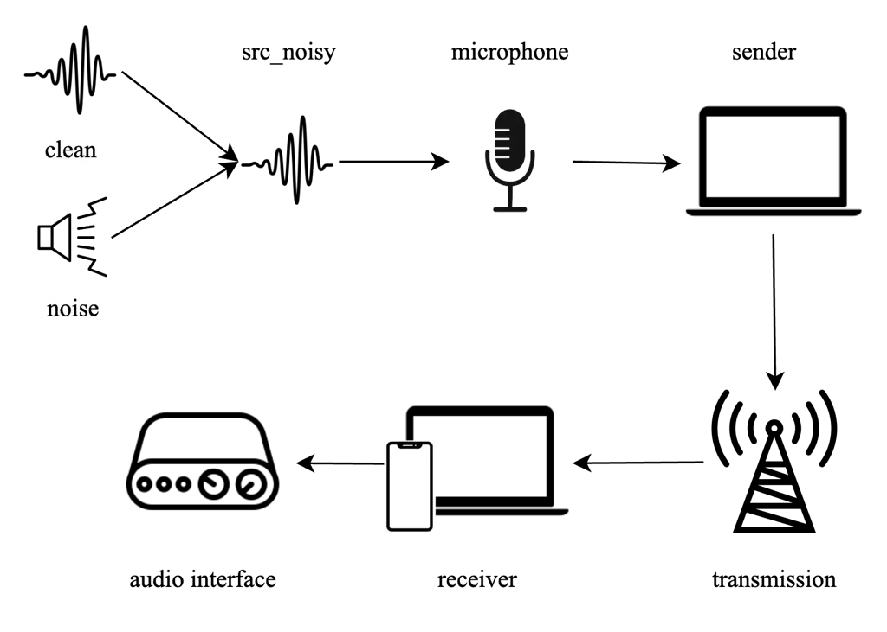
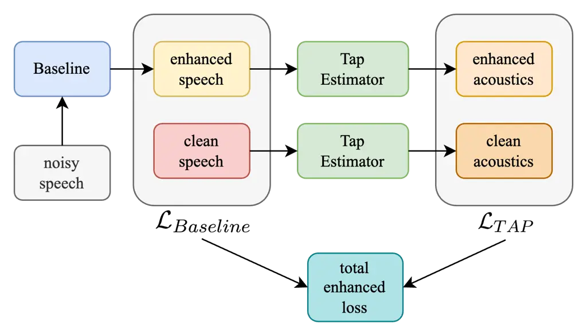
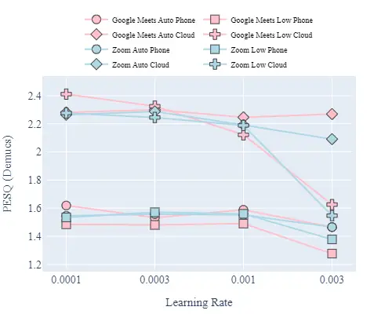
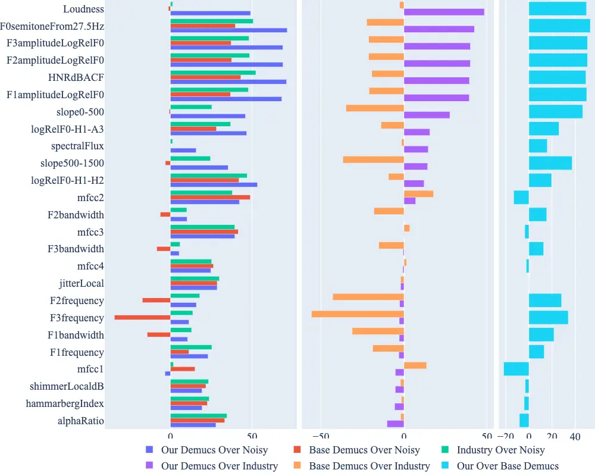
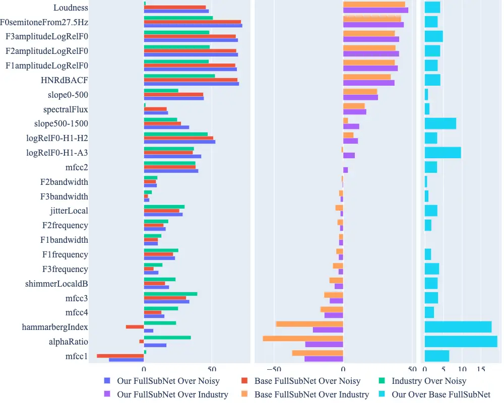

# Improving Perceptual Quality, Intelligibility, and Acoustics on VoIP Platforms

Joseph Konan¹², Ojas Bhargave², Shikhar Agnihotri², Hojeong Lee², Ankit
Shah²,  
Shuo Han², Yunyang Zeng², Amanda Shu², Haohui Liu², Xuankai Chang²,  
Hamza Khalid², Minseon Gwak², Kawon Lee², Minjeong Kim², Bhiksha Raj²
Affiliation:  Affiliation: ¹KonanAI, Pittsburgh, United States,
konan@konanai.com.  
²Carnegie Mellon University, Pittsburgh,  
{ jkonan, obhargav, sagnihot, hojeongl, aps1, shuohan, yunyangz, amshu,
haohuil, xuankaic,  
hkhalid, mgwak, kawonl, minjeong, bhikshar }@andrew.cmu.edu

###### Abstract

In this paper, we present a method for fine-tuning models trained on the
Deep Noise Suppression (DNS) 2020 Challenge to improve their performance
on Voice over Internet Protocol (VoIP) applications. Our approach
involves adapting the DNS 2020 models to the specific acoustic
characteristics of VoIP communications, which includes distortion and
artifacts caused by compression, transmission, and platform-specific
processing. To this end, we propose a multi-task learning framework for
VoIP-DNS that jointly optimizes noise suppression and VoIP-specific
acoustics for speech enhancement. We evaluate our approach on a diverse
VoIP scenarios and show that it outperforms both industry performance
and state-of-the-art methods for speech enhancement on VoIP
applications. Our results demonstrate the potential of models trained on
DNS-2020 to be improved and tailored to different VoIP platforms using
VoIP-DNS, whose findings have important applications in areas such as
speech recognition, voice assistants, and telecommunication.

###### Index Terms: 

speech, acoustics, denoising, enhancement, VoIP.

## I Introduction

Voice over Internet Protocol (VoIP) has become a ubiquitous technology
for real-time voice communications over the internet. However, speakers
often call from environments with background noise that degrades
perceptual quality and impairs intelligibility of the communication. To
address this problem, denoising and speech enhancement has emerged as
promising technique for improving the quality of speech signals in noisy
environments. The Deep Noise Suppression (DNS) Challenge \[1\], hosted
by InterSpeech 2020, developed a systematic training and evaluation
methodology to improve state-of-the-art denoising and speech enhancement
model performance on a diverse set of real-world scenarios with
background noise.

Despite the success of models trained on the DNS-2020 Challenge, their
performance on VoIP applications remains limited due to a lack of
optimization of characteristics specific to VoIP platforms. VoIP audio
is typically transmitted over low-bandwidth networks, compressed using
lossy codecs, and subject to non-uniform sampling rates, which can
introduce additional distortion and artifacts. To enable analysis and
optimization in this research area, the VoIP Deep Noise Suppression
(VoIP-DNS) dataset was developed as an extension to DNS-2020 that
provides training and testing data for VoIP applications: Zoom and
Google Meet. Using a controlled experiment design, the VoIP-DNS dataset
was created using consistent systems, hardware, network, and data
collection procedures necessary for reproducible research.

In this paper, we present a method for fine-tuning two state-of-the-art
DNS-2020 models, Demucs \[2\] and FullSubNet\[3\], on the VoIP-DNS
dataset for improved performance on VoIP applications. Our approach
involves adapting the models to acoustic variations present in VoIP
audio streams, using a temporal acoustic parameter loss (TAPLoss)\[4\]
to optimize fine-grain speech characteristics. We evaluate our approach
on two VoIP platforms, Zoom and Google Meets, in the context of cloud
and cellular phone applications. Our results demonstrate the potential
of fine-tuning Demucs and FullSubNet to surpass industry performance and
achieve state-of-the-art on VoIP-DNS by improving the quality of voice
communication on VoIP platforms, which has important applications the
areas of speech recognition, voice assistants, and telecommunication.



(a) End-to-end Data Process Diagram, From Synthesis To Recording.



(b) The training workflow for Demucs and FullSubNet

Fig. 1: Data Synthesis and the Training workflow

## II Experimental Setup

The VoIP-DNS dataset\[5\] contains 1,200 thirty-second training pairs
and 150 ten-second testing pairs of source clean speech and source noisy
speech. The source pairs for the VoIP-DNS dataset are obtained using the
same training synthesis procedure and test set provided by DNS-2020. The
training synthesis procedure involves taking 30-second clean speech
samples from LibriSpeech and 30-second noise signals from FreeSound\[6\]
or AudioSet\[7\], then mixing the two to create a 30-second noisy speech
sample. After the source noisy speech is passed to the VoIP platform via
a virtual microphone, it is transmitted to a receiving device. Finally,
the relayed audio is obtained via an audio interface. If the receiver is
a cellular phone, then the audio interface is managed by the VoIP-DNS
technician; otherwise, if the receiver is on the cloud, then the audio
interface is managed by the VoIP platform.

This paper focuses on optimizing VoIP-DNS to improve speech quality on
cloud and cellular phones using VoIP data from Zoom and Google Meet. On
each platform, we consider their use cases with denoising set on or off.
Due to differences in terminology across platforms, disambiguation is
required. For Zoom, ”denoising off” is considered ”Zoom with low
denoising selected,” while ”denoising on” is considered ”Zoom with auto
denoising selected.” For Google Meet, ”denoising off” is considered
”Google Meet with denoising off selected,” while ”denoising on” is
considered ”Google Meet with denoising on selected.” Therefore,
industrial denoising is defined by the platform’s performance with
denoising on.

The VoIP-DNS data collection procedure captures the unique
characteristics of VoIP audio streams, which are subject to low
bandwidth, compression, non-uniform sampling rates, and additional
platform-specific processing. The VoIP-DNS dataset was designed by the
authors of this work and is publicly available with a meticulously
documented experimental design to ensure reproducibility.

## III Models and Training

In this study, we evaluate the denoising performance of two
state-of-the-art deep learning models, Demucs and FullSubNet, on VoIP
audio streams. These models were chosen due to their top performance in
the Deep Noise Suppression (DNS) 2020 Challenge and their availability
in terms of public source code, learning procedures, and final
checkpoints. Furthermore, Demucs operates in the time-domain, while
FullSubNet operates in the time-frequency domain, allowing us to
contrast modalities with a consistent reproducible experimental setup.

To train the models, we use the noisy speech relays and the clean speech
sources from VoIP-DNS. Each training iteration begins by sampling a
noisy speech signal and its corresponding clean speech source. The noisy
speech signal is passed through the base model to generate enhanced
speech signals. To optimize the fine-grained acoustic characteristics of
the enhanced speech signals, a temporal acoustic parameter (TAP)
estimator is used to derive enhanced acoustic features from the enhanced
speech signals. Similarly, clean acoustic features are derived from the
clean speech source using the TAP estimator.

The base loss function is defined by the base model and minimizes the
divergence between the enhanced and clean speech signals in either the
time-domain (for Demucs) or time-frequency domain (for FullSubNet). To
further improve the performance of the models on VoIP audio streams, we
propose a novel acoustic loss function, which minimizes the L1
divergence between the enhanced and clean acoustic features. Our
experimental results show that incorporating the acoustic loss function
leads to significant improvements in the denoising performance of the
models on VoIP audio streams.

In addition to evaluating the performance of Demucs and FullSubNet, we
compare their performance with industrial denoising models used by
popular VoIP platforms such as Zoom and Google Meet. While these
industrial denoising models are not publicly available for inspection,
they can be queried through their platform using the VoIP-DNS dataset.
This enables a direct comparison between the performance of the
industrial denoising models and the state-of-the-art deep learning
models on VoIP audio streams.

## IV Ablation Results

|              |          |     |        |       |        |       |            |       |     |        |       |        |       |            |       |
| ------------ | -------- | --- | ------ | ----- | ------ | ----- | ---------- | ----- | --- | ------ | ----- | ------ | ----- | ---------- | ----- |
|              |          | \|  | PESQ   |       |        |       |            |       | \|  | STOI   |       |        |       |            |       |
|              |          | \|  | Source |       | Demucs |       | FullSubNet |       | \|  | Source |       | Demucs |       | FullSubNet |       |
| Platform     | Receiver | \|  | Low    | Auto  | Low    | Auto  | Low        | Auto  | \|  | Low    | Auto  | Low    | Auto  | Low        | Auto  |
| Google Meets | Phone    | \|  | 1.549  | 1.976 | 1.381  | 1.726 | 1.398      | 1.694 | \|  | 0.748  | 0.884 | 0.748  | 0.884 | 0.700      | 0.841 |
| Google Meets | Cloud    | \|  | 1.640  | 2.255 | 2.272  | 2.264 | 2.435      | 2.281 | \|  | 0.890  | 0.923 | 0.933  | 0.924 | 0.920      | 0.923 |
| Zoom         | Phone    | \|  | 1.548  | 1.701 | 1.548  | 1.513 | 1.382      | 1.343 | \|  | 0.797  | 0.810 | 0.766  | 0.810 | 0.733      | 0.724 |
| Zoom         | Cloud    | \|  | 1.450  | 1.919 | 2.089  | 1.996 | 2.141      | 1.992 | \|  | 0.859  | 0.909 | 0.906  | 0.913 | 0.900      | 0.911 |

TABLE I: Objective Relative Evaluation of Perceptual Quality &
Intelligibility



Fig. 2: Ablation of Demucs with different learning rate

We conducted a series of ablation experiments to evaluate the impact of
our proposed temporal acoustic parameter (TAP) loss function on the
denoising performance of our models. We trained with and without the TAP
loss function, using different learning rates, and evaluated their
performance on a large-scale dataset of 1,200 30-second noisy speech
samples generated using the DNS-2020 synthesis procedure.

Our experimental results demonstrate that incorporating the TAP loss
function leads to improved denoising performance over the baseline
models. Specifically, we observed a notable improvement in the chosen
metric for both Demucs and FullSubNet when incorporating the TAP loss
function with an optimal learning rate. However, we also observed that
the optimal learning rate for the TAP loss function varied depending on
the specific characteristics of the VoIP platform and the transmission
process.

In some cases, we found that a higher learning rate led to improved
denoising performance on cellular devices when industrial denoising was
disabled. This suggests that cellular devices may benefit from a more
aggressive TAP loss function during training to achieve better denoising
results. In contrast, for cloud relay transmissions and transmissions
with industrial denoising enabled, a lower learning rate resulted in
improved denoising performance.

Furthermore, we observed that the effectiveness of our proposed
denoising models varied depending on the specific characteristics of the
VoIP platform and the transmission process. Depending on the platform,
whether or not industrial denoising was enabled, and which device
received the audio, different acoustic distortions and artifacts could
be heard.

In some scenarios, we observed that enhancing the audio without
industrial denoising applied led to better denoising results. We believe
that this is because less information is lost due to the platform’s
processing, which facilitates the restoration of the original audio.
However, in other cases, we found that enabling industrial denoising led
to better denoising results. This could be because some distortions and
artifacts are magnified through transmission and are more present in
audio without industrial denoising. In these cases, enabling industrial
denoising may remove some information from the audio, but the benefits
of removing much of the distortions and artifacts prior to transmission
outweigh the cons.

Taken together, our results demonstrate that the effectiveness of
denoising models on VoIP platforms is highly dependent on the specific
characteristics of the platform, the transmission process, and the
optimal learning rate used during training. Nonetheless, our proposed
denoising models consistently outperformed the industrial denoising
models when industrial denoising was disabled, suggesting that our
proposed models have the potential for improving denoising performance
on VoIP platforms.



(a) Demucs Standardized Acoustic Improvement Comparison



(b) FullSubNet Standardized Acoustic Improvement Comparison

Fig. 3: Acoustic Improvement Of Mean Absolute Error: The Use Case Of
Transmitting From Google Meet To Cellular Phone

## V Perceptual Evaluation

In this section, we present a perceptual analysis of our fine-tuning
results, investigating intelligibility and perceptual quality of the
models on different VoIP applications. To assess intelligibility, we use
the Short-Time Objective Intelligibility (STOI)\[8\] measure, which
quantifies the extent to which speech can be understood by human
listeners. For evaluating perceptual quality, we employ the Perceptual
Evaluation of Speech Quality (PESQ)\[9\] metric, which approximates
human subjective judgments of speech quality. We provide a subsection
for the overall comparison, Demucs vs FullSubNet, and differential
analysis of low vs auto specifications.

### V-A Overall Comparison

Our fine-tuning approach was able to match or exceed industry
intelligibility levels. While cloud applications exhibited little
difference, cellular phone applications showed a 0.7% STOI improvement.
Additionally, we observed perceptual quality improvements of 1.2% on
Google Meet and 4.0% on Zoom over industry performance for cloud
applications. However, mobile applications demonstrated worse perceptual
performance than industry standards, which is likely attributed to the
challenge of transfer learning from DNS-2020 to the band limitations of
cellular transmission.

### V-B Demucs vs FullSubNet Comparison

Upon comparing Demucs and FullSubNet, we found that Demucs had superior
intelligibility, with a PESQ improvement ranging from 0.2-1.1% on
cellular applications to 5.1-10.5% on cloud applications. The perceptual
improvement depended on the receiving medium, with Demucs outperforming
FullSubNet by 1.8-12.0% on mobile applications and FullSubNet surpassing
Demucs by 2.5-7.2% on cloud applications. Although a detailed error
analysis is beyond the scope of this paper, we observed that the band
limitations of modeling the time-frequency domain caused a noticeable
distribution shift, making transfer learning on cellular applications
slower to converge. Gathering more data, especially for cellular
applications, could help overcome this challenge.

### V-C Denoising Off (Low) vs Denoising On (Auto) Settings

To better understand the relative performance specific to relays without
denoising prior to transmission (low) versus relays with denoising prior
to transmission (auto), we conducted a differential analysis.

For the case without denoising prior to transmission, we observed
superior perceptual quality with modest PESQ improvement across
applications, except for Google Meets to a cellular phone. In contrast
to Zoom, Google Meets experienced worse perceptual quality due to noisy
audio transmission, with a PESQ difference of about 0.14, which could
explain the difficulty in learning to enhance the speech signal.

Comparing within Demucs (auto vs low), relays with denoising prior to
transmission yielded comparable or improved intelligibility over
industry standards, with STOI improvement observed when transmission was
received from Google Meets to a cellular phone (18.2%), Zoom to a
cellular phone (5.7%), and to some extent from Zoom to the cloud (0.7%).
However, transmission from Google Meets to cloud witnessed a modest STOI
degradation of 1.0%, making low performance superior to auto. We
conjecture that specifically for the Google Meets to Cloud use case, the
exacerbation of distortion or artifact issues in the low use case was
not as significant as the amount of information lost due to their
denoising prior to transmission. These nuances and complexities
highlight the importance of platform-specific assessment, as the areas
in need of improvement and their relative difficulty to improve can
vary.

In conclusion, our perceptual analysis demonstrates the potential
benefits and challenges of applying our fine-tuning approach to
different VoIP platforms and scenarios. The results emphasize the
importance of platform-specific assessment to optimize factors impacting
speech enhancement performance.

## VI Acoustic Evaluation

In this section, we present an acoustic analysis of the denoising
models, focusing on the improvement of fine-grain speech characteristics
over noisy speech, industrial denoising models of Zoom and Google Meet,
and the baseline models. We use the extended Geniva Minimalist Acoustic
Parameter Set (eGeMAPS) \[10\] for this evaluation.

For each test sample, we extracted eGeMAPS features from the original
clean speech, the noisy speech, and the denoised speech generated by our
proposed models, the industrial models, and the baseline models. We then
calculated the Mean Absolute Error (MAE) between the eGeMAPS features of
the original clean speech and the degraded and enhanced versions of the
speech. Due to space constraints, we focus on Google Meet to Phone
acoustic improvement for our approach tuning Demucs and FullSubNet
compared to the industry and their relative improvement over their
open-source baselines.

In almost all scenarios, the acoustics of fine-grain speech
characteristics improved through denoising when applied only before
transmission, only after transmission, and both before and after
transmission. Our approach led to mixed results in achieving industry
performance, but when compared to the open-source alternative, tailoring
Demucs and FullSubNet on DNS-2020 to the VoIP-DNS set yielded as high as
15% improvement for FullSubNet and 40% for Demucs, with an average
improvement in acoustic fidelity of about 5% for FullSubNet and 21% for
Demucs.

Compared to industry performance, we achieved higher acoustic fidelity
in amplitudeLogRelF0, with Demucs showing approximately 40% improvement
over the industry and 51% improvement over the baseline. FullSubNet
demonstrated a modest 4% improvement over the baseline with 40%
improvement over industry across formants F1, F2, and F3. However, in
formant-specific bandwidth improvement, the difference between Demucs or
FullSubNet and industry was marginal.

Other acoustics that showed significant improvement over industry
performance were Loudness (48% for Demucs and 47% for FullSubNet) and
Harmonic to Noise Ratio Autocorrelation Function (HNRdbACF) (39% for
Demucs and 37% for FullSubNet), suggesting proper normalization and
ability discriminate between harmonic and non-harmonic signals in our
approach. While further analysis is required to understand the
relationship between these acoustic changes and perceptual quality,
reducing harmonic distortion and improving loudness accuracy may
contribute to better subjective evaluation.

In some areas, such as MFCCs, the Hammarberg Index, and the Alpha Index,
Demucs and FullSubNet had difficulty improving acoustics. However, our
approach experienced less degradation in these areas compared to the
baseline. We believe further improvement is possible, and we are
currently conducting ablations to refine our models. Updated findings
reflecting these insights will be reported in the near future.

## VII Conclusion

In this study, we have investigated the denoising performance of two
state-of-the-art deep learning models, Demucs and FullSubNet, on VoIP
audio streams, with a particular focus on their application in popular
platforms such as Zoom and Google Meet. By fine-tuning these models on
the VoIP-DNS dataset and incorporating a novel acoustic loss function,
we achieved significant improvements in denoising performance compared
to their open-source baselines.

Our perceptual analysis demonstrated that our fine-tuned models were
able to match or exceed the intelligibility of industry-denoising models
in various scenarios, with Demucs generally outperforming FullSubNet in
terms of PESQ and STOI. The differential analysis of low vs auto
specifications revealed that our models performed differently depending
on the relay condition and the platform used, emphasizing the importance
of platform-specific assessment and optimization. We also observed
differences in performance between phone and cloud applications, with
cloud applications generally exhibiting better perceptual quality
improvements.

The acoustic analysis using eGeMAPS features further supported the
effectiveness of our approach in improving fine-grain speech
characteristics. Our models demonstrated substantial improvements in
certain acoustic features, such as amplitudeLogRelF0, Loudness, and
HNRdBACF, compared to the industry and open-source baselines.

However, there are still areas for further improvement, such as in
MFCCs, the Hammarberg Index, and the Alpha Index. We believe that
additional fine-tuning and ablation studies will help address these
issues and lead to even better denoising performance in the future.

This study contributes to the growing body of research on speech
enhancement for VoIP applications and highlights the potential of deep
learning-based denoising models to improve the quality of real-time
communication. As the demand for effective remote communication
continues to grow, the advancements presented in this work serve as a
foundation for further development and optimization of speech
enhancement techniques tailored to the specific requirements of various
VoIP platforms, transmission scenarios, and end-user devices, including
both phone and cloud applications.

## References

- \[1\] C. K. Reddy, V. Gopal, R. Cutler, E. Beyrami, R. Cheng,
  H. Dubey, S. Matusevych, R. Aichner, A. Aazami, S. Braun _et al._,
  “The interspeech 2020 deep noise suppression challenge: Datasets,
  subjective testing framework, and challenge results,” in
  _INTERSPEECH_, 2020.
- \[2\] A. Defossez, G. Synnaeve, and Y. Adi, “Real time speech
  enhancement in the waveform domain,” in _Interspeech_, 2020.
- \[3\] X. Hao, X. Su, R. Horaud, and X. Li, “Fullsubnet: A full-band
  and sub-band fusion model for real-time single-channel speech
  enhancement,” in _ICASSP 2021-2021 IEEE International Conference on
  Acoustics, Speech and Signal Processing (ICASSP)_. IEEE, 2021, pp.
  6633–6637.
- \[4\] Zeng, Konan, Han, Bick, Yang, Kumar, Watanabe, and Raj,
  “Taploss: A temporal acoustic parameter loss for speech enhancement,”
  _Unpublished manuscript_, 2022.
- \[5\] “VoIP-DNS dataset,”
  https://github.com/deepology/VoIP-DNS-Challenge, accessed: 2023-03-14.
- \[6\] E. Fonseca, J. Pons Puig, X. Favory, F. Font Corbera,
  D. Bogdanov, A. Ferraro, S. Oramas, A. Porter, and X. Serra,
  “Freesound datasets: a platform for the creation of open audio
  datasets,” in *Hu X, Cunningham SJ, Turnbull D, Duan Z, editors.
  Proceedings of the 18th ISMIR Conference; 2017 oct 23-27; Suzhou,
  China.\[Canada\]: International Society for Music Information
  Retrieval; 2017. p. 486-93.* International Society for Music
  Information Retrieval (ISMIR), 2017.
- \[7\] J. F. Gemmeke, D. P. Ellis, D. Freedman, A. Jansen, W. Lawrence,
  R. C. Moore, M. Plakal, and M. Ritter, “Audio set: An ontology and
  human-labeled dataset for audio events,” in _2017 IEEE international
  conference on acoustics, speech and signal processing (ICASSP)_. IEEE,
  2017, pp. 776–780.
- \[8\] C. H. Taal, R. C. Hendriks, R. Heusdens, and J. Jensen, “A
  short-time objective intelligibility measure for time-frequency
  weighted noisy speech,” in _2010 IEEE International Conference on
  Acoustics, Speech and Signal Processing_, 2010, pp. 4214–4217.
- \[9\] A. Rix, J. Beerends, M. Hollier, and A. Hekstra, “Perceptual
  evaluation of speech quality (pesq)-a new method for speech quality
  assessment of telephone networks and codecs,” in _2001 IEEE
  International Conference on Acoustics, Speech, and Signal Processing.
  Proceedings (Cat. No.01CH37221)_, vol. 2, 2001, pp. 749–752 vol.2.
- \[10\] F. Eyben, K. R. Scherer, B. W. Schuller, J. Sundberg, E. André,
  C. Busso, L. Y. Devillers, J. Epps, P. Laukka, S. S. Narayanan
  _et al._, “The geneva minimalistic acoustic parameter set (gemaps) for
  voice research and affective computing,” _IEEE transactions on
  affective computing_, vol. 7, no. 2, pp. 190–202, 2015.

## Appendix A Appendix

### A-A The Temporal Acoustic Parameter Loss (TAPLoss)

To calculate the TAPLoss, we define the Temporal Acoustic Parameter
Estimator $`A_{y}`$. $`A_{y}(t,p)`$ represents the acoustic parameter
$`p`$ at a discrete time frame $`t`$. To predict $`A_{y}`$, we define
the estimator:

```math
\hat{A_{y}}=\mathcal{T}\mathcal{A}\mathcal{P}(y)
```

The $`\mathcal{T}\mathcal{A}\mathcal{P}`$ function takes in a signal
input $`y`$. It calculates a complex spectrogram $`Y`$ with $`F=257`$
frequency bins. It then passes this complex spectrogram to a recurrent
neural network to output the temporal acoustic parameter
$`\hat{A_{y}}`$. TAP loss is then defined as the mean average error
between the actual and the predicted estimate.

```math
MAE(A_{y},\hat{A_{y}})=\frac{1}{TP}\sum_{t=0}^{T-1}\sum_{p=0}^{P-1}|A_{y}(t,p)-A_{\hat{y}}(t,p)|\in R
```

During training, $`\mathcal{T}\mathcal{A}\mathcal{P}`$ parameters learn
to minimize the divergence of $`MAE(A_{s},\hat{A_{s}})`$ using Adam
optimization. Since this loss is end-to-end differentiable and takes
only waveform as input, it enables acoustic optimization of any speech
model and task with clean references.
