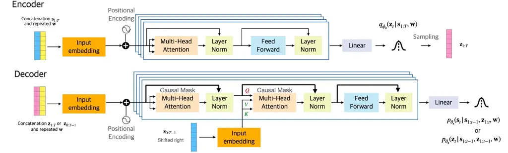

# SPEECH MODELING WITH A HIERARCHICAL TRANSFORMER DYNAMICAL VAE

Xiaoyu Lin    Xiaoyu Bie    Simon Leglaive    Laurent Girin    Xavier
Alameda-Pineda ^(†)^(†)thanks: This research was supported by ANR-3IA
MIAI (ANR-19-P3IA-0003), ANR-JCJC ML3RI (ANR-19-CE33-0008-01), H2020
SPRING (funded by EC under GA \#871245).

###### Abstract

The dynamical variational autoencoders (DVAEs) are a family of
latent-variable deep generative models that extends the VAE to model a
sequence of observed data and a corresponding sequence of latent
vectors. In almost all the DVAEs of the literature, the temporal
dependencies within each sequence and across the two sequences are
modeled with recurrent neural networks. In this paper, we propose to
model speech signals with the Hierarchical Transformer DVAE (HiT-DVAE),
which is a DVAE with two levels of latent variable (sequence-wise and
frame-wise) and in which the temporal dependencies are implemented with
the Transformer architecture. We show that HiT-DVAE outperforms several
other DVAEs for speech spectrogram modeling, while enabling a simpler
training procedure, revealing its high potential for downstream
low-level speech processing tasks such as speech enhancement.

###### Index Terms: 

Speech dynamical modeling, speech analysis-resynthesis, dynamical
variational autoencoders, Transformers.

^(†)^(†)address: ¹ Inria Grenoble Rhône-Alpes, Univ. Grenoble Alpes,
France  
² CentraleSupélec, IETR (UMR CNRS 6164), France  
³ Univ. Grenoble Alpes, CNRS, Grenoble-INP, GIPSA-lab, France

## 1 Introduction

Dynamical variational autoencoders (DVAEs) are a class of
latent-variable deep generative models (LV-DGM) that extends the
widely-used variational autoencoder (VAE) \[1, 2\] to model correlated
sequences of data \[3\]. DVAEs consider a sequence of high-dimensional
data $`\mathbf{s}_{1:T}`$ and a corresponding sequence of
low-dimensional latent vectors $`\mathbf{z}_{1:T}`$, and model the time
dependencies within $`\mathbf{s}_{1:T}`$, within $`\mathbf{z}_{1:T}`$,
and across $`\mathbf{s}_{1:T}`$ and $`\mathbf{z}_{1:T}`$, using deep
neural networks. In all the DVAE models reviewed in \[3\], e.g., \[4, 5,
6, 7\], the temporal dependencies are implemented with recurrent neural
networks (RNNs).

DVAEs have achieved great success in modeling sequential data. In
particular, they have been successfully applied to the modeling of
speech signals, in analysis-resynthesis tasks \[5, 7, 8\] or in speech
enhancement \[9, 10\]. Meantime, the use of RNNs in DVAEs also brings
some related problems. A classical issue is the mismatch between
training and test conditions. Indeed, the commonly adopted configuration
for RNN training is to use the ground-truth past observed vectors
$`\mathbf{s}_{1:t-1}`$ in the generative model, a training strategy
often referred to as _teacher-forcing_ \[11\]. However, at
test/generation time, we can only use the previously generated values
$`\hat{\mathbf{s}}_{1:t-1}`$ to generate the current one. This generally
results in large accumulated prediction errors along the sequence.
Directly training an RNN in the generation mode is also difficult. To
remedy this problem, _scheduled sampling_ can be adopted, i.e., the
ground truth past vectors $`\mathbf{s}_{1:t-1}`$ are progressively
replaced with the previously generated ones $`\hat{\mathbf{s}}_{1:t-1}`$
along the training iterations \[12\]. This strategy was successfully
adopted for the training of autoregressive (AR) DVAEs, i.e. DVAEs with a
recursive structure on $`\mathbf{s}`$ \[3\]. However, this requires a
well designed sampling scheduler to guarantee the prediction
performance. Besides, RNNs are poorly suited for parallel computation
and face gradients exploding and vanishing for long sequences.

Replacing RNNs with Transformers \[13\] for sequential modeling has
become a new trend in both natural language processing, e.g., \[14\],
and computer vision, e.g., \[15\]. Compared to the recursive computing
in RNNs, the Transformer architecture uses attention mechanisms to learn
global dependencies between input and output, which allows modeling
complex time correlations. Thus, in principle, replacing RNNs with
Transformers in DVAEs can also benefit to the modeling of temporal
dependencies between the observed and latent sequences. Following this
idea, the Hierachical Transformer DVAE (HiT-DVAE) model proposed in
\[16\] combines a DVAE with Transformers for 3D Human motion generation.
In this paper, (a) we propose an improved version of HiT-DVAE, named
LigHT-DVAE, and (b) we apply it to speech signal modeling. The proposed
LigHT-DVAE model reduces the number of parameters by sharing the
parameters of the decoders of the original HiT-DVAE model. Experimental
results show that we achieve very competitive results in the speech
analysis-resynthesis task. We also investigate the modeling capacity of
LigHT-DVAE compared to other DVAEs through extensive ablation studies on
the model structure. In particular, we show that the structure of
LigHT-DVAE makes it robust to using teacher-forcing at training time,
which largely simplifies the training procedure compared with other AR
DVAEs. To the best of our knowledge, this is the first AR DVAE model
that can be trained in teacher-forcing _and_ generalizes well to the
generation mode.

## 2 The LigHT-DVAE for speech modeling



Figure 1: LigHT-DVAE model structure.

The LigHT-DVAE model is a DVAE in which the temporal dependencies
between and within the observed and latent sequences are implemented
with Transformers instead of RNNs \[16\]. In this section, we present
LigHT-DVAE for speech signal modeling. We work with the short-time
Fourier transform (STFT) of speech waveforms, denoted by
$`\mathbf{s}_{1:T}\in\mathbb{C}^{F\times T}`$. Each vector
$`\mathbf{s}_{t}=\{s_{f,t}\}_{f=1}^{F}`$ of the sequence is the
short-time complex-valued spectrum at time frame $`t`$, and $`f`$
denotes the frequency bin.

### 2.1 Generative model

In addition to $`\mathbf{s}_{1:T}`$ and the associated sequence of
latent vectors $`\mathbf{z}_{1:T}\in\mathbb{R}^{L_{z}\times T}`$, with
$`L_{z}\ll F`$, LigHT-DVAE also defines a time-independent latent
variable $`\mathbf{w}\in\mathbb{R}^{L_{w}}`$, which is designed to embed
high-level features at the speech occurrence level (e.g., speaker ID).
The generative model of LigHT-DVAE is defined as:

```math
\displaystyle p_{\theta}(\mathbf{s}_{1:T},\mathbf{z}_{1:T},\mathbf{w})=p_{\theta_{\mathbf{w}}}(\mathbf{w})
```

```math
\displaystyle\ \ \times\prod\nolimits_{t=1}^{T}p_{\theta_{\mathbf{s}}}(\mathbf{s}_{t}|\mathbf{s}_{1:t-1},\mathbf{z}_{1:t},\mathbf{w})p_{\theta_{\mathbf{z}}}(\mathbf{z}_{t}|\mathbf{s}_{1:t-1},\mathbf{z}_{1:t-1},\mathbf{w}), \tag{1}
```

where
$`\theta=\theta_{\mathbf{s}}\cup\theta_{\mathbf{z}}\cup\theta_{\mathbf{w}}`$.
As usually adopted in statistical audio/speech processing \[17, 18\],
the STFT coefficient at each time-frequency bin $`s_{t,f}`$ is assumed
to follow a circularly-symmetric zero-mean complex Gaussian
distribution.¹¹ 1 that we denote
$`\mathcal{N}_{c}\big(\cdot;\boldsymbol{\mu},\boldsymbol{\Sigma})`$,
with $`\boldsymbol{\mu}`$ and $`\boldsymbol{\Sigma}`$ being the mean
vector and covariance matrix, respectively. The STFT coefficients at
different frequency bins are assumed to be independent. The conditional
distribution of $`\mathbf{s}_{t}`$ in (1) thus writes:

```math
p_{\theta_{\mathbf{s}}}(\mathbf{s}_{t}|\mathbf{s}_{1:t-1},\mathbf{z}_{1:t},\mathbf{w})=\mathcal{N}_{c}\big(\mathbf{s}_{t};\mathbf{0},\text{diag}(\mathbf{v}_{\theta_{\mathbf{s}},t})\big). \tag{2}
```

In this work, all covariance matrices are assumed diagonal and are
represented by the vector of diagonal entries. Here,
$`\mathbf{v}_{\theta_{\mathbf{s}},t}\in\mathbb{R}_{+}^{F}`$ depends on
the variables $`\{\mathbf{s}_{1:t-1},\mathbf{z}_{1:t},\mathbf{w}\}`$.
Note that in practice, HiT-DVAE will input speech power spectrogram,
i.e., the squared modulus of $`\mathbf{s}_{1:t-1}`$, instead of the
complex-valued STFT coefficients themselves. The latent vector
$`\mathbf{z}_{t}`$ is assumed to follow a (real-valued) Gaussian
distribution:

```math
p_{\theta_{\mathbf{z}}}(\mathbf{z}_{t}|\mathbf{s}_{1:t-1},\mathbf{z}_{1:t-1},\mathbf{w})=\mathcal{N}\big(\mathbf{z}_{t};\boldsymbol{\mu}_{\theta_{\mathbf{z}},t},\text{diag}(\mathbf{v}_{\theta_{\mathbf{z}},t})\big). \tag{3}
```

The mean and variance vectors
$`\boldsymbol{\mu}_{\theta_{\mathbf{z}},t}\in\mathbb{R}^{L_{z}}`$ and
$`\mathbf{v}_{\theta_{\mathbf{z}},t}\in\mathbb{R}^{L_{z}}_{+}`$ both
depend on $`\{\mathbf{s}_{1:t-1},\mathbf{z}_{1:t-1},\mathbf{w}\}`$. As
for the latent vector $`\mathbf{w}`$, it is assumed to follow a standard
Gaussian prior:
$`p_{\theta_{\mathbf{w}}}(\mathbf{w})=\mathcal{N}(\mathbf{w};\mathbf{0},\mathbf{I})`$.

### 2.2 Inference Model

LigHT-DVAE inference model approximates the intractable exact posterior
distribution of the latent sequence and is defined as:

```math
q_{\phi}(\mathbf{z}_{1:T},\mathbf{w}|\mathbf{s}_{1:T})=q_{\phi_{\mathbf{w}}}(\mathbf{w}|\mathbf{s}_{1:T})\prod\nolimits_{t=1}^{T}q_{\phi_{\mathbf{z}}}(\mathbf{z}_{t}|\mathbf{s}_{1:T},\mathbf{w}), \tag{4}
```

with $`\phi=\phi_{\mathbf{w}}\cup\phi_{\mathbf{z}}`$,

```math
q_{\phi_{\mathbf{w}}}(\mathbf{w}|\mathbf{s}_{1:T})=\mathcal{N}\big(\mathbf{w};\boldsymbol{\mu}_{\phi_{\mathbf{w}}},\text{diag}(\mathbf{v}_{\phi_{\mathbf{w}}})\big), \tag{5}
```

```math
q_{\phi_{\mathbf{z}}}(\mathbf{z}_{t}|\mathbf{s}_{1:T},\mathbf{w})=\mathcal{N}\big(\mathbf{z}_{t};\boldsymbol{\mu}_{\phi_{\mathbf{z}},t},\text{diag}(\mathbf{v}_{\phi_{\mathbf{z}},t})\big), \tag{6}
```

and where $`\boldsymbol{\mu}_{\phi_{\mathbf{w}}}\in\mathbb{R}^{L_{w}}`$
and $`\mathbf{v}_{\phi_{\mathbf{w}}}\in\mathbb{R}^{L_{w}}_{+}`$ depend
on $`\mathbf{s}_{1:T}`$, and
$`\boldsymbol{\mu}_{\phi_{\mathbf{z}},t}\in\mathbb{R}^{L_{z}}`$ and
$`\mathbf{v}_{\phi_{\mathbf{z}},t}\in\mathbb{R}^{L_{z}}_{+}`$ depend on
$`\{\mathbf{s}_{1:T},\mathbf{w}\}`$.

### 2.3 Implementation

To implement the above equations, LigHT-DVAE is built on the original
Transformer architecture \[13\], with several notable differences, all
visible in Fig. 1: (a) There are two decoders working in parallel: one
to compute the parameters of (3) and one to compute the parameters of
(2); (b) The output of the encoder and decoders are distribution
parameters (in place of “deterministic” data representations in the
conventional use of the Transformer); (c) The output target of the
(second) decoder is the input data $`\mathbf{s}_{1:T}`$ (as opposed to a
different sequence in regression/translation problems); (d) A
sequence-wise variable $`\mathbf{w}`$ is introduced; (e) In the
cross-attention module of the decoders, the role of $`\mathbf{z}_{1:T}`$
(encoder output) and $`\mathbf{s}_{1:T}`$ (decoder output) as source
information for the query and key/value, respectively, is inverted
compared to the conventional Transformer. Points (a), (b) and (c) are
inherited from the DVAE framework. Point (d) is a model design choice
(see Section 2.1). Point (e) will be justified later.

In a few more details, encoding actually starts with the encoding of the
sequence-wise latent variable $`\mathbf{w}`$. An RNN is used to compute
$`\boldsymbol{\mu}_{\phi_{\mathbf{w}}}`$ and
$`\mathbf{v}_{\phi_{\mathbf{w}}}`$ from $`\mathbf{s}_{1:T}`$ (not
represented in Fig. 1). We only retain the RNN output at the last time
index $`T`$, since it contains all information on the complete sequence
$`\mathbf{s}_{1:T}`$. The sampled value of $`\mathbf{w}`$ is then
replicated $`T`$ times and concatenated to $`\mathbf{s}_{1:T}`$ to
produce the input of the Transformer encoder. This latter follows the
line of the original Transformer \[13\] (see Fig. 1): input embedding
followed by positional encoding, followed by a Multi-Head Attention
(MHA) module, normalization layer (NL) with skip connection with the MHA
input, feed-forward (FF) layer and another NL with skip connection with
the FF layer input. Finally, a linear layer produces the parameters of
(6), that is $`\boldsymbol{\mu}_{\phi_{\mathbf{z}},t}`$ and the
logarithm of $`\mathbf{v}_{\phi_{\mathbf{z}},t}`$.

The two decoders also follows the general line of the original
Transformer \[13\] (see Fig. 1; here we do not detail the different
modules as we did for the encoder, because of room limitation; see
\[13\] for details). The sampled value of $`\mathbf{z}_{1:T}`$ is
concatenated with the replicated sampled value of $`\mathbf{w}`$ to
produce the “main” input, which is the source information for the query
of the second MHA module. In parallel, $`\mathbf{s}_{1:T}`$ is used as
the second input, i.e. the source information for the key and value of
the second MHA module. A causal mask in the MHA module ensures that the
dependency at time $`t`$ is on $`\mathbf{s}_{1:t-1}`$.

The difference between the two decoders essentially consists of
different masks in the first MHA module. For the first decoder
(generating $`\boldsymbol{\mu}_{\theta_{\mathbf{z}},t}`$ and
$`\mathbf{v}_{\theta_{\mathbf{z}},t}`$), this mask is set to limit the
input to $`\mathbf{z}_{1:t-1}`$, whereas for the second decoder
(generating $`\mathbf{v}_{\theta_{\mathbf{s}},t}`$), it is set to limit
the input to $`\mathbf{z}_{1:t}`$. In short, the masks in the MHA
modules are adapted to implement the causal dependencies defined in (1).

As stated above, a main difference of LigHT-DVAE w.r.t. the original
Transformer is that the queries to decode $`\mathbf{s}_{t}`$ are
computed from $`\mathbf{z}_{1:t}`$ and not $`\mathbf{s}_{1:t-1}`$. In
fact, the residual connections in the decoders will make the output rely
more on the information from the queries. If we use the previous
$`\mathbf{s}`$ vectors to compute the queries, this will carry too much
information and learning does not generalize well. However, while this
phenomena is observed on $`\mathbf{s}`$, we have no reason to believe
that it should reproduce on $`\mathbf{z}`$. Unlike HiT-DVAE, we propose
to query both generation processes with $`\mathbf{z}`$, thus allowing
the two decoders to share the parameters.

Similar to other DVAE models \[3\], LigHT-DVAE is trained by maximizing
the following evidence lower bound (ELBO):

```math
\displaystyle\mathcal{L} \displaystyle(\theta,\phi;\mathbf{s}_{1:T})=-D_{\text{KL}}(q_{\phi_{\mathbf{w}}}(\mathbf{w}|\mathbf{s}_{1:T})\parallel p_{\theta_{\mathbf{w}}}(\mathbf{w}))
```

```math
\displaystyle-\sum_{t=1}^{T}\mathbb{E}_{q_{\phi_{\mathbf{z}}}q_{\phi_{\mathbf{w}}}}\big[d_{\text{IS}}(|\mathbf{s}_{t}|^{2},\mathbf{v}_{\theta_{\mathbf{s}},t})
```

```math
\displaystyle+D_{\text{KL}}(q_{\phi_{\mathbf{z}}}(\mathbf{z}_{t}|\mathbf{s}_{1:T},\mathbf{w})\parallel p_{\theta_{\mathbf{z}}}(\mathbf{z}_{t}|\mathbf{s}_{1:t-1},\mathbf{z}_{1:t-1},\mathbf{w}))\big] \tag{7}
```

where $`d_{\text{IS}}(\cdot,\cdot)`$ is the Itakura-Saito divergence
\[17\], $`D_{\text{KL}}(\cdot||\cdot)`$ is the Kullback–Leibler
divergence (KLD), and square is element-wise.

## 3 Experiments

### 3.1 Datasets and pre-processing

The experiments are conducted on two datasets: the Wall Street Journal
(WSJ0) dataset \[19\] and the Voice Bank (VB) corpus \[20\]. The WSJ0
dataset is composed of 16-kHz speech signals, with three subsets:
si_tr_s, si_dt_05 and si_et_05, used for model training, validation and
test, and containing 12,765, 1,026 and 651 utterances respectively. The
VB dataset contains a training set with 11,572 utterances performed by
28 speakers and a test set with 824 utterances performed by 2 speakers.
We follow \[21\] to choose two speakers (p226 and p287) from the
training set for validation, which contains 770 utterances, and use the
leftover 26 speakers for training.

In all experiments, the raw audio signals are pre-processed in the
following way. First, the silence at the beginning and the end of the
signals are cropped by using a voice activity detection threshold of 30
dB. Then, the waveform signals are normalized so that their maximum
absolute value is one. The STFT is computed with a 64-ms sine window
(1024 samples) and a 75%-overlap (256 samples hop length), resulting in
a sequence of 513-dimensional discrete Fourier coefficients (for
positive frequencies). Finally, the power magnitude of the STFT
coefficients is computed. We set the sequence length of each STFT
spectrogram to $`T=150`$ (corresponding to speech segments of 2.4s) for
WSJ0 and $`T=100`$ (corresponding to speech segments of 1.6s) for VB. At
test time, the model is evaluated on the complete test utterances which
can be of variable length.

### 3.2 Implementation details and training settings

The Transformer-based encoder and decoders are composed of 4 identical
layers as described in Section 2.3. All input vectors are embedded into
vectors of dimension $`d_{\text{model}}=256`$, which is the size for all
MHA blocks. We apply single-head attention because we found that using
multi-head attention decreases the performance in our experiments. All
feed-forward blocks in the Transformer layers consist of two dense
layers with size 1024 and 256. The latent dimension $`L_{z}`$ and
$`L_{w}`$ are set to $`16`$ and $`32`$, respectively.

The training is made with the AdamW \[22\] optimizer, which is a variant
of Adam \[23\] with decoupled weight decay. The parameters of the
optimizer are $`\beta_{1}=0.9,\beta_{2}=0.99,\epsilon=10^{-9}`$ and
$`\texttt{weight\_decay}=10^{-5}`$. We varied the learning rate during
training by firstly increasing it linearly for the warm-up training
stage (for 5k iterations) and then decreasing it using a cosine
annealing scheduler \[24\] (for 20k iterations). The maximum and minimum
values of the learning rate are $`5\times 10^{-5}`$ and $`10^{-8}`$
respectively. $`\beta`$ factors are multiplied to the KLD terms in (7)
to increase latent space expressivity, with
$`\beta_{w}=\beta_{z}=10^{-2}`$.

### 3.3 Baselines and evaluation metrics

We compare HiT-DVAE and LigHT-DVAE with the basic VAE and three other
DVAE models: The Deep Kalman Filter (DKF) \[4\], the Recurrent
Variational AutoEncoder (RVAE) \[9\], and the Stochastic Recurrent
Neural Network (SRNN) \[6\]. As HiT/LigHT-DVAE, SRNN is an AR model that
uses $`\mathbf{s}_{1:t-1}`$ to generate $`\mathbf{s}_{t}`$. DKF and RVAE
are not AR. DKF generate $`\mathbf{s}_{t}`$ from $`\mathbf{z}_{t}`$, and
RVAE does it from $`\mathbf{z}_{1:t}`$ (we use the causal version of
RVAE; see \[9\]). As mentioned in the introduction, an AR model can be
trained either in teacher-forcing mode or in scheduled-sampling mode. In
our experiments, SRNN is trained in both modes, while HiT/LigHT-DVAE are
only trained in the teacher-forcing mode. Except for that, all models
are trained with the same settings described in Section 3.2. We evaluate
the average speech analysis-resynthesis performance on the test set (in
generation mode for AR models) using four evaluation metrics: The root
mean squared error (RMSE), the scale-invariant signal-to-distortion
ratio (SI-SDR) \[25\] in dB, the perceptual evaluation of speech quality
(PESQ) score \[26\] (in $`[-0.5,4.5]`$), and the extended short-time
objective intelligibility (ESTOI) score \[27\] (in $`[0,1]`$). We also
evaluate the average generation performance via the Fréchet Deep Speech
Distance (FDSD) proposed in \[28\]. FDSD is a quantitative metric for
speech signals generative models. It relies on speech features extracted
with the pre-trained speech recognition model DeepSpeech2 \[29\].

| Dataset | Model      | RMSE $`\downarrow`$ | SI-SDR $`\uparrow`$ | PESQ $`\uparrow`$ | ESTOI $`\uparrow`$ |
| ------- | ---------- | ------------------- | ------------------- | ----------------- | ------------------ |
| WSJ0    | VAE        | 0.040               | 7.4                 | 3.28              | 0.88               |
|         | DKF        | 0.037               | 8.3                 | 3.51              | 0.91               |
|         | RVAE       | 0.034               | 8.9                 | 3.53              | 0.91               |
|         | SRNN (SS)  | 0.036               | 8.7                 | 3.57              | 0.91               |
|         | SRNN (TF)  | 0.061               | 2.6                 | 2.53              | 0.76               |
|         | HiT-DVAE   | 0.031               | 10.0                | 3.52              | 0.91               |
|         | LigHT-DVAE | 0.030               | 10.1                | 3.55              | 0.91               |
| VB      | VAE        | 0.052               | 8.4                 | 3.24              | 0.89               |
|         | DKF        | 0.048               | 9.3                 | 3.44              | 0.91               |
|         | RVAE       | 0.050               | 8.9                 | 3.39              | 0.90               |
|         | SRNN (SS)  | 0.044               | 10.1                | 3.42              | 0.91               |
|         | SRNN (TF)  | 0.102               | -0.1                | 2.15              | 0.75               |
|         | HiT-DVAE   | 0.039               | 11.4                | 3.60              | 0.93               |
|         | LigHT-DVAE | 0.038               | 11.6                | 3.58              | 0.93               |

Table 1: Speech spectrograms analysis-resynthesis results.

### 3.4 Speech spectrograms analysis-resynthesis results

The speech analysis-resynthesis results on both the WSJ0 dataset and the
VB dataset are reported in Table 1. On the WSJ0 dataset, HiT-DVAE and
LigHT-DVAE outperform the other DVAE models for all metrics, except for
PESQ (SRNN (SS) is slightly better) and ESTOI (the five models are on
par). On the VB dataset, HiT/LigHT-DVAE outperform all other DVAE models
on all metrics. As AR models, even if HiT/LigHT-DVAE are trained in
teacher-forcing mode, they still keep very robust performance when
tested in generation mode. In contrast, SRNN (TF) trained in
teacher-forcing mode leads to a notable drop of performance compared to
SRNN (SS) trained in scheduled-sampling mode. Finally, the experimental
results show that sharing the parameters of the decoders for
$`\mathbf{s}`$ and $`\mathbf{z}`$ in LigHT-DVAE slightly increases the
performance compared to HiT-DVAE. At the same time, it reduces the
number of model parameters from 21.75 M to 17.46 M.

### 3.5 Ablation studies on model structures

To try to explain why HiT/LigHT-DVAE are robust to the teacher-forcing
training mode, we performed several ablation studies on the models
structure on the VB dataset. As explained in Section 2.3, different to
the original Transformer decoder, the queries to decode
$`\mathbf{s}_{t}`$ in HiT/LigHT-DVAE are computed from
$`\mathbf{z}_{1:t}`$ instead of $`\mathbf{s}_{1:t-1}`$. In a first
ablation experiment, we invert the role of the queries and the
keys/values when decoding $`\mathbf{s}_{t}`$, i.e., we swap the decoder
inputs $`\mathbf{z}_{1:t}`$ and $`\mathbf{s}_{1:t-1}`$. the resulting
models are denoted with “Inv-s”. The models are always trained in the
teacher-forcing mode. Table 2 reports the evaluation results when using
generated or ground-truth $`\mathbf{s}_{1:t-1}`$ to decode
$`\mathbf{s}_{t}`$, in the “GEN” and “GT” rows respectively.

| Test $`\mathbf{s}_{1:t-1}`$ | Model               | RMSE $`\downarrow`$ | SI-SDR $`\uparrow`$ | PESQ $`\uparrow`$ | ESTOI $`\uparrow`$ |
| --------------------------- | ------------------- | ------------------- | ------------------- | ----------------- | ------------------ |
| GEN                         | HiT-DVAE            | 0.039               | 11.4                | 3.60              | 0.93               |
|                             | HiT-DVAE-Inv-s      | 0.079               | 3.8                 | 2.61              | 0.75               |
|                             | HiT-DVAE-Inv-s-NR   | 0.067               | 5.8                 | 2.68              | 0.78               |
|                             | LigHT-DVAE          | 0.038               | 11.6                | 3.58              | 0.93               |
|                             | LigHT-DVAE-Inv-s    | 0.079               | 3.9                 | 2.58              | 0.75               |
|                             | LigHT-DVAE-Inv-s-NR | 0.068               | 5.7                 | 2.63              | 0.78               |
| GT                          | HiT-DVAE            | 0.038               | 11.5                | 3.60              | 0.93               |
|                             | HiT-DVAE-Inv-s      | 0.038               | 11.4                | 3.32              | 0.90               |
|                             | HiT-DVAE-Inv-s-NR   | 0.067               | 5.8                 | 2.68              | 0.78               |
|                             | LigHT-DVAE          | 0.038               | 11.7                | 3.59              | 0.93               |
|                             | LigHT-DVAE-Inv-s    | 0.040               | 10.9                | 3.29              | 0.89               |
|                             | LigHT-DVAE-Inv-s-NR | 0.068               | 5.7                 | 2.63              | 0.78               |

Table 2: Speech spectrograms analysis-resynthesis results: Ablation
studies on the HiT/LigHT-DVAE models structure.

Although the Inv-s models achieve very good results when trained and
evaluated in TF mode, their performance notably drops when evaluating in
GEN mode (e.g., from 11.4 to 3.8 dB SI-SDR for HiT-DVAE-Inv-s). We
believe that this lack of robustness to a mismatch between the training
and test modes is mainly caused by the residual connections on the
queries in the original Transformer decoder architecture (which are
highlighted in bold in Figure 1). Indeed, in the Inv-s models,
$`\mathbf{s}_{1:t-1}`$ is used to compute the queries and the residual
connections make the prediction of $`\mathbf{s}_{t}`$ directly relying
on the previous vectors $`\mathbf{s}_{1:t-1}`$. This is not the case in
the HiT/LigHT-DVAE models where $`\mathbf{z}_{1:t-1}`$ is used to
compute the queries from which residual connections start. This forces
the prediction of $`\mathbf{s}_{t}`$ to rely more on
$`\mathbf{z}_{1:t-1}`$ than $`\mathbf{s}_{1:t-1}`$, which explains the
better generalization of HiT/LigHT-DVAE compared to
HiT/LigHT-DVAE-Inv-s. This structural aspect is very important in the
present context of speech modeling, because adjacent speech spectrogram
frames are much more correlated than discrete tokens in natural language
processing, the original application domain of Transformers. To confirm
this interpretation, we further removed the residual connections in the
decoder of $`\mathbf{s}`$ in the Inv-s models (this configuration is
referred to as Inv-s-NR models). As a result, the performance slightly
increased compared to the Inv-s models in the GEN test mode, but it
remains much below that of HiT/LigHT-DVAE. Also, the performance of the
Inv-s-NR models is the same when evaluated in GEN mode and GT mode,
confirming that the generalization problem of the Inv-s models was due
to the use of $`\mathbf{s}_{1:t-1}`$ to compute the queries from which
residual connections start. Overall, this ablation study experimentally
showed the importance of the architectural choices made in the
HiT/LigHT-DVAE models for the modeling of highly correlated sequences of
continuous data such as speech spectrograms.

### 3.6 Speech spectrograms generation results

In addition to the above speech analysis-resynthesis experiments, we
also evaluated the models performance in speech spectrogram generation
via FDSD scores. To compute these scores, we generated $`10,\!240`$
$`1.6`$-s speech signal samples from each model. The DVAE models
generate power spectrograms, from which we deduced magnitude
spectrograms. We then used the Griffin-Lim algorithm \[30\] to
reconstruct the phase spectrograms and generate the waveform signals. We
used 1.6-s utterances from the VB training set as the reference set to
compute the FDSD scores. Finally, in order to have a reference FDSD
score, we also computed the FDSD on the VB test set, with exact original
phase or phase reconstructed by the Griffin-Lim algorithm. As shown in
Table 3, HiT-DVAE outperforms the other DVAE models on this generation
task. This is a new result, since HiT-DVAE was never used before for
speech modeling. It can also be seen that the AR DVAE models
(HiT/LigHT-DVAE and SRNN) generally have a better generation performance
than the non-AR DVAE models.

| Model                 | FDSD $`\downarrow`$ |
| --------------------- | ------------------- |
| VAE                   | 70.92 ± 0.44        |
| DKF                   | 32.78 ± 0.28        |
| RVAE                  | 45.75 ± 0.11        |
| SRNN (SS)             | 25.28 ± 0.19        |
| SRNN (TF)             | 25.53 ± 0.13        |
| HiT-DVAE              | 22.50 ± 0.26        |
| LigHT-DVAE            | 29.22 ± 0.26        |
| VB Test (exact phase) | 4.11 ± 0.14         |
| VB Test (Griffin-Lim) | 4.11 ± 0.15         |

Table 3: Speech spectrograms generation results.

## 4 Conclusion

In this paper, we applied the HiT-DVAE model of \[16\] and its new
variant LigHT-DVAE on speech signals and have demonstrated their strong
modeling capacity through experiments on speech spectrograms
analysis-resynthesis and generation. Although HiT/LigHT-DVAE are
autoregressive models, they have shown to be very robust to the mismatch
between the teacher-forcing mode at training time and the generation
mode at test time, as opposed to previous AR DVAE models such as SRNN.
This enables using a simpler training procedure. Compared to HiT-DVAE,
the new proposed LigHT-DVAE model exhibits competitive performance with
about $`20\%`$ less parameters. We believe that HiT/LigHT-DVAE have a
great potential in unsupervised speech representation learning and
dynamical modeling, which can benefit downstream speech processing tasks
such as speech enhancement, speech separation and speech inpainting.

## References

- \[1\] D. P. Kingma and M. Welling, “Auto-encoding variational Bayes,”
  in Proc. Int. Conf. Learn. Repres. (ICLR), Banff, Canada, 2014.
- \[2\] D. J. Rezende, S. Mohamed, and D. Wierstra, “Stochastic
  backpropagation and approximate inference in deep generative models,”
  in Proc. Int. Conf. Mach. Learn. (ICML), Beijing, China, 2014.
- \[3\] L. Girin, S. Leglaive, X. Bie, J. Diard, T. Hueber, and
  X. Alameda-Pineda, “Dynamical variational autoencoders: A
  comprehensive review,” Found. Trends Mach. Learn., vol. 15, no. 1-2,
  pp. 1–175, 2021.
- \[4\] R. G. Krishnan, U. Shalit, and D. Sontag, “Deep Kalman filters,”
  arXiv preprint arXiv:1511.05121, 2015.
- \[5\] J. Chung, K. Kastner, L. Dinh, K. Goel, A. Courville, and
  Y. Bengio, “A recurrent latent variable model for sequential data,” in
  Adv. in Neural Inform. Process. Syst. (NeurIPS), Montreal,
  Canada, 2015.
- \[6\] M. Fraccaro, S. Sønderby, U. Paquet, and O. Winther, “Sequential
  neural models with stochastic layers,” in Adv. in Neural Inform.
  Process. Syst. (NeurIPS), Barcelona, Spain, 2016.
- \[7\] W.-N. Hsu, Y. Zhang, and J. Glass, “Unsupervised learning of
  disentangled and interpretable representations from sequential data,”
  in Adv. in Neural Inform. Process. Syst. (NeurIPS), Long Beach,
  CA, 2017.
- \[8\] X. Bie, L. Girin, S. Leglaive, T. Hueber, and X. Alameda-Pineda,
  “A benchmark of dynamical variational autoencoders applied to speech
  spectrogram modeling,” in Proc. Interspeech Conf., Brno, Czech
  Republic, 2021.
- \[9\] S. Leglaive, X. Alameda-Pineda, L. Girin, and R. Horaud, “A
  recurrent variational autoencoder for speech enhancement,” in Proc.
  IEEE Int. Conf. Acoust., Speech, Signal Process. (ICASSP), Barcelona,
  Spain (virtual conference), 2020.
- \[10\] X. Bie, S. Leglaive, X. Alameda-Pineda, and L. Girin,
  “Unsupervised speech enhancement using dynamical variational
  autoencoders,” IEEE/ACM Trans. Audio, Speech, Lang. Process., vol. 30,
  pp. 2993–3007, 2022.
- \[11\] R. J. Williams and D. Zipser, “A learning algorithm for
  continually running fully recurrent neural networks,” Neural Comp.,
  vol. 1, no. 2, pp. 270–280, 1989.
- \[12\] S. Bengio, O. Vinyals, N. Jaitly, and N. Shazeer, “Scheduled
  sampling for sequence prediction with recurrent neural networks,” in
  Adv. in Neural Inform. Process. Syst. (NeurIPS), Montreal,
  Canada, 2015.
- \[13\] A. Vaswani, N. Shazeer, N. Parmar, J. Uszkoreit, L. Jones,
  A. Gomez, L. Kaiser, and I. Polosukhin, “Attention is all you need,”
  in Adv. in Neural Inform. Process. Syst. (NeurIPS), Long Beach,
  CA, 2017.
- \[14\] J. Devlin, M.-W. Chang, K. Lee, and K. Toutanova, “BERT:
  Pre-training of deep bidirectional Transformers for language
  understanding,” in Proc. NAACL-HLT Conf., Minneapolis, MI, 2019.
- \[15\] A. Dosovitskiy, L. Beyer, A. Kolesnikov, D. Weissenborn,
  X. Zhai, T. Unterthiner, and colleagues, “An image is worth 16x16
  words: Transformers for image recognition at scale,” arXiv preprint
  arXiv:2010.11929, 2020.
- \[16\] X. Bie, W. Guo, S. Leglaive, L. Girin, F. Moreno-Noguer, and
  X. Alameda-Pineda, “HiT-DVAE: Human motion generation via Hierarchical
  Transformer Dynamical VAE,” arXiv preprint arxiv:2204.01565, 2022.
- \[17\] C. Févotte, N. Bertin, and J.-L. Durrieu, “Nonnegative matrix
  factorization with the Itakura-Saito divergence: With application to
  music analysis,” Neural Comp., vol. 21, no. 3, pp. 793–830, 2009.
- \[18\] A. Liutkus, R. Badeau, and G. Richard, “Gaussian processes for
  underdetermined source separation,” IEEE Trans. Signal Process., vol.
  59, no. 7, pp. 3155–3167, 2011.
- \[19\] J. S. Garofolo, D. Graff, D. Paul, and D. Pallett, “CSR-I
  (WSJ0) Sennheiser LDC93S6B,” Philadelphia: Linguistic Data
  Consortium, 1993.
- \[20\] C. Valentini-Botinhao, X. Wang, S. Takaki, and J. Yamagishi,
  “Speech enhancement for a noise-robust text-to-speech synthesis system
  using deep recurrent neural networks,” in Proc. Interspeech Conf., San
  Francisco, CA, 2016.
- \[21\] S.-W. Fu, C. Yu, K.-H. Hung, M. Ravanelli, and Y. Tsao,
  “MetricGAN-U: Unsupervised speech enhancement-dereverberation based
  only on noisy/reverberated speech,” in Proc. IEEE Int. Conf. Acoust.,
  Speech, Signal Process. (ICASSP), Singapore, 2022.
- \[22\] I. Loshchilov and F. Hutter, “Decoupled weight decay
  regularization,” in Proc. Int. Conf. Learn. Repres. (ICLR), New
  Orleans, LA, 2019.
- \[23\] D. P. Kingma and J. Ba, “Adam: A method for stochastic
  optimization,” in Proc. Int. Conf. Learn. Repres. (ICLR), San Diego,
  CA, 2015.
- \[24\] I. Loshchilov and F. Hutter, “SGDR: Stochastic gradient descent
  with warm restarts,” in Proc. Int. Conf. Learn. Repres. (ICLR),
  Toulon, France, 2017.
- \[25\] J. Le Roux, S. Wisdom, H. Erdogan, and J. R. Hershey, “SDR –
  Half-baked or well done?,” in Proc. IEEE Int. Conf. Acoust., Speech,
  Signal Process. (ICASSP), Brighton, UK, 2019.
- \[26\] A. Rix, J. Beerends, M. Hollier, and A. Hekstra, “Perceptual
  evaluation of speech quality (PESQ) - A new method for speech quality
  assessment of telephone networks and codecs,” in Proc. IEEE Int. Conf.
  Acoust., Speech, Signal Process. (ICASSP), Salt Lake City, UT, 2001.
- \[27\] C. Taal, R. Hendriks, R. Heusdens, and J. Jensen, “An algorithm
  for intelligibility prediction of time–frequency weighted noisy
  speech,” IEEE Trans. Audio, Speech, Lang. Process., vol. 19, no. 7,
  pp. 2125–2136, 2011.
- \[28\] M. Bińkowski, J. Donahue, S. Dieleman, A. Clark, E. Elsen,
  N. Casagrande, and colleagues, “High fidelity speech synthesis with
  adversarial networks,” in Proc. Int. Conf. Learn. Repres. (ICLR),
  virtual conference, 2020.
- \[29\] D. Amodei, S. Ananthanarayanan, R. Anubhai, J. Bai,
  E. Battenberg, and colleagues, “Deep Speech 2: End-to-end speech
  recognition in English and Mandarin,” in Proc. Int. Conf. Mach. Learn.
  (ICML), New York, NY, 2016.
- \[30\] D. Griffin and J. Lim, “Signal estimation from modified
  short-time Fourier transform,” IEEE Trans. Acoust., Speech, Signal
  Process., vol. 32, no. 2, pp. 236–243, 1984.
