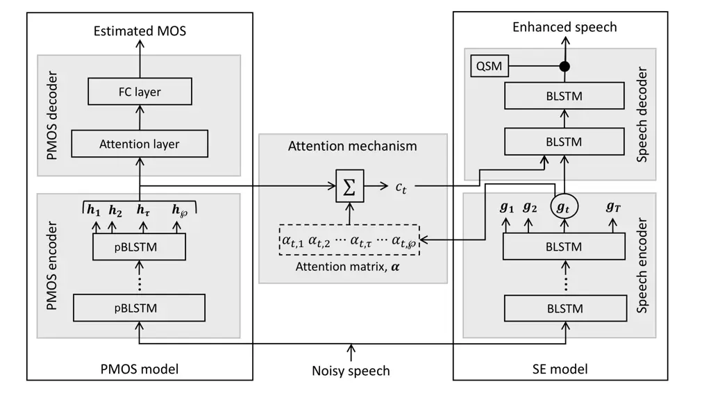
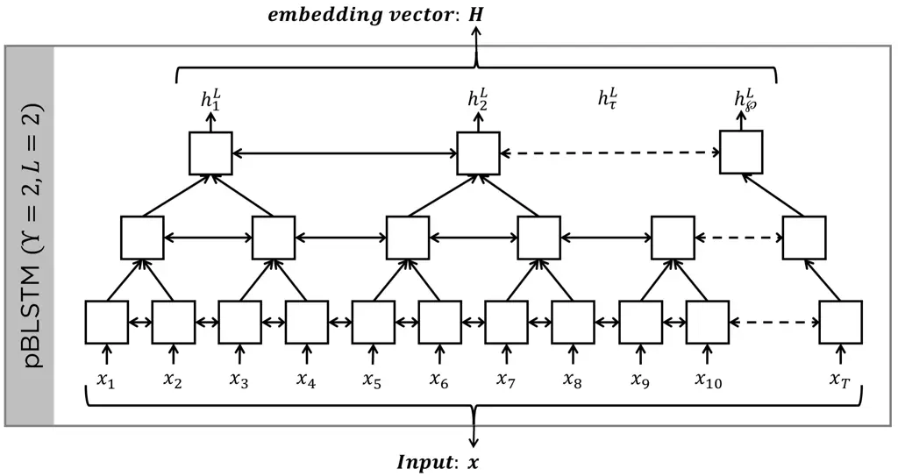
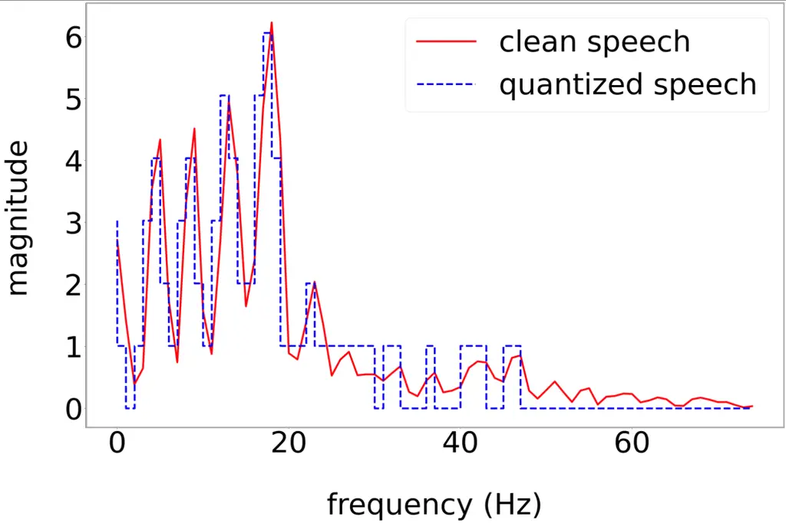
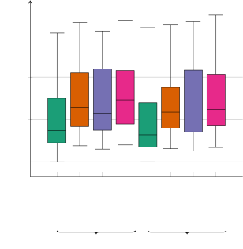

# Attention-based Speech Enhancement Using Human Quality Perception Modelling

Khandokar Md. Nayem    and Donald S. Williamson ^(†)^(†)thanks: This
work was supported in part by NSF under Grant IIS-1942718 and in part by
Lilly Endowment, Inc., through its support for the Indiana University
Pervasive Technology Institute^(†)^(†)thanks: Khandokar Md. Nayem is
with the Department of Computer Science, Indiana University,
Bloomington, IN 47408 USA (e-mail: knayem@iu.edu).^(†)^(†)thanks: Donald
S. Williamson was with the Department of Computer Science at Indiana
University, but he is now with the Department of Computer Science and
Engineering, Ohio State University, Columbus, OH, USA 43210 USA (e-mail:
williamson.413@osu.edu).

###### Abstract

Perceptually-inspired objective functions such as the perceptual
evaluation of speech quality (PESQ), signal-to-distortion ratio (SDR),
and short-time objective intelligibility (STOI), have recently been used
to optimize performance of deep-learning-based speech enhancement
algorithms. These objective functions, however, do not always strongly
correlate with a listener’s assessment of perceptual quality, so
optimizing with these measures often results in poorer performance in
real-world scenarios. In this work, we propose an attention-based
enhancement approach that uses learned speech embedding vectors from a
mean-opinion score (MOS) prediction model and a speech enhancement
module to jointly enhance noisy speech. The MOS prediction model
estimates the perceptual MOS of speech quality, as assessed by human
listeners, directly from the audio signal. The enhancement module also
employs a quantized language model that enforces spectral constraints
for better speech realism and performance. We train the model using
real-world noisy speech data that has been captured in everyday
environments and test it using unseen corpora. The results show that our
proposed approach significantly outperforms other approaches that are
optimized with objective measures, where the predicted quality scores
strongly correlate with human judgments.

###### Index Terms: 

speech enhancement, speech quantization, speech assessment, attention
model, deep learning, speech quality.

## I Introduction

Monaural speech enhancement aims to remove unwanted noise from an audio
signal that contains speech using only a single microphone channel.
Enhancing the quality of noisy speech is crucial for applications such
as speech recognition, speaker verification, hearing aids, and
hands-free communication. Speech enhancement approaches are generally
divided into two categories: mask-based or signal-based approximation. A
time-frequency (T-F) mask is estimated in mask-based approaches, where
the mask filters unwanted noise from noisy speech mixtures. Early
mask-based approaches estimate the ideal binary mask (IBM) \[1\] or the
ideal ratio mask (IRM) \[2\], while recent approaches estimate the
phase-sensitive mask (PSM) \[3\] or complex ideal ratio mask (cIRM) \[4,
5\] to enhance both the magnitude and phase. The ideal quantized mask
(IQM) has recently been proposed \[6\], where each T-F unit of the IRM
is assigned to a quantization level according to its signal-to-noise
ratio. It has been shown to be a reasonable representation of the IRM as
assessed by human listeners, however, estimation of the IQM and its
subsequent noise removal has not be thoroughly evaluated.

Signal approximation can be done in either the time \[7, 8\] or the T-F
domains \[9\], where the approach directly estimates the time or T-F
domain signal from a noisy speech representation. Traditionally, T-F
masks produce better objective quality and intelligibility compared to
direct signal approximation, mainly because masks are normalized and
bounded with limited speaker variations, which makes them easier to
learn. Also, masks directly modulate the mixture signal in the T-F
domain. In recent years, the signal approximation models outperform mask
estimation approaches in speech intelligibility \[9, 10\] when applied
with appropriate normalization.

Regardless of the approach, recent developments in deep learning have
resulted in state-of-the-art performance. A wide range of deep learning
architectures have been proposed, including, deep neural networks
(DNNs) \[11, 12\], autoencoders \[13, 14, 15\], long short-term memory
(LSTM) networks \[16, 3\], convolutional neural networks (CNNs) \[17,
18, 19, 8, 20\], and generative adversarial networks (GANs) \[21, 22,
23\]. Deep recurrent networks have proven to be effective, especially
compared to fully-connected DNNs, as they capture temporal correlations.
CNNs are good at feature extraction, and they have been combined with
recurrent networks to capture the short and long-term temporal and
spectral correlations. Recently, attention-based deep architectures have
been proposed with the motivation that a training target only greatly
influences a few regions of the input, where the focal regions change
over time. \[24, 25\] use attention mechanism with an U-Net \[26\]
architecture for both time and spectral domain speech enhancement. \[27,
28\] successfully use self-attention to estimate a speech spectrum and
T-F mask, respectively. This approach is more intuitive for speech
enhancement, because humans are able to focus on the target speech with
high attention while paying less attention to the noise.

Deep-learning-based speech enhancement approaches traditionally use the
mean square error (MSE) between the short-time spectral-amplitudes
(STSA) of the estimated and clean speech signals to optimize
performance. This is done due to the computational efficiency of the MSE
loss function. However, the MSE tends to produce overly-smoothed speech
and it is not always a strong indicator of performance \[29, 30\]. Thus,
many studies have begun to optimize algorithms using
perceptually-inspired objective measures.

Multiple studies have used short-time objective intelligibility
(STOI) \[31\] to optimize enhancement algorithms and to improve speech
intelligibility \[32, 33, 34\]. This is done to minimize the
inconsistency between the model optimization criterion and the
evaluation criterion for the enhanced speech. The reported results in
\[33\] show that jointly optimizing with STOI and MSE improves speech
intelligibility according to both objective and subjective measures. In
addition, word accuracy according to automatic speech recognition (ASR)
is improved. Perceptual evaluation of speech quality (PESQ) \[35\]
scores, however, have not increased when optimizing with STOI, as
reported in \[33\]. The signal-to-distortion ratio (SDR) \[36\] has also
been used as an objective cost function \[37\]. The proposed network is
pre-trained with a SDR loss to achieve network stability and later
optimized with a PESQ loss in a black-box manner. Their results show
that optimizing with SDR leads to overall objective quality
improvements. Unlike SDR and STOI, PESQ cannot directly be used as an
objective function since it is non-differential. Reinforcement learning
(RL) techniques such as deep Q-network and policy gradient have thus
been employed to solve the non-differentiable problem \[34, 38\]. In
these works, PESQ and the perceptual evaluation methods for audio source
separation (PEASS) \[39, 40\] serve as rewards that are used to optimize
model parameters. Meanwhile, a new PESQ-inspired objective function that
considers symmetrical and asymmetrical disturbances of speech signals
has been developed in \[41\]. Quality-Net \[42\], which is a DNN
approach that estimates PESQ scores given a noisy utterance, has also
been used as a maximization criteria \[43\] and as a model selection
parameter \[44\] to enhance speech.

It is worth noting that optimizing with perceptually-inspired objective
measures has been disputed in \[45, 46\], where these latter results
show that a MSE objective function is sufficient. This may occur because
objective measures of success do not always strongly correlate with
subjective measures \[39, 47, 48, 49\]. Hence, it is inconclusive as to
whether perceptually-inspired objective measures are generally useful at
optimizing speech enhancement performance, so alternative strategies for
incorporating perceptual feedback may be needed.

Subjective evaluations from human listeners remains the gold-standard
approach since it results in ratings from potential end-users. These
evaluations often ask listeners to either give relative preference
scores \[50\] or assign a numerical rating \[51\]. Multiple ratings are
provided for each signal, where they are averaged to generate a
mean-opinion score (MOS). Recently, deep-learning approaches have
effectively estimated human-assessed MOS \[52, 53, 54, 55\]. These
approaches are promising since they can provide strongly correlated
quality scores for new signals. According to \[56\], a non-intrusive
loss function can lead to improved noise suppression. Conversely, \[57\]
proposes using embedding vectors from a multi-objective speech
assessment model for speech enhancement, but they only use intrusive
metrics such as PESQ, STOI, and a speech distortion index (SDI) to train
the speech assessment model. As a result, it remains unclear whether a
speech assessment model that predicts MOS can incorporate human
perceptual information into a speech enhancement model.

Joint learning has been successfully applied in speech enhancement to
optimize between estimating speech and other training targets, such as
phoneme classification \[58\], speaker identification \[59\], and speech
recognition \[22\]. Our preliminary work has recently combined a speech
quality estimation task with speech enhancement \[60\] and it shows
promising results. In this work, we propose an attention-based speech
enhancement model that uses the embedding vector from a MOS prediction
model to produce speech with improved perceptual quality. The MOS
estimator generates encoded embedding vectors that contain perceptually
useful information that is important for human-based assessment. Our
speech enhancement attention model is conditioned on that embedding
vector and enhances the noisy speech using a separate encoder-decoder
framework, which should help produce better quality speech according to
human evaluation. In the enhancement stage, we incorporate a quantized
spectral language model that captures the transitions probabilities
across the T-F spectrum. The LM helps ensure that the resulting speech
spectra exhibit realistic spectral- and temporal-fine structure that
occurs within real speech signals, since it identifies the most likely
spectrum in each time frame. This is accomplished by first quantizing
the speech magnitude spectra into distinct classes. Our proposed signal
approximation approach jointly updates both the MOS-prediction and
speech-enhancement models during training, using speech enhancement and
MOS prediction loss terms.



Fig. 1: A depiction of our speech-enhancement model that consists of a
MOS-prediction model denoted as PMOS (left side), and a
speech-enhancement (SE) model (right side). An attention mechanism
connects the two models.

The rest of the paper is organized as follows. In section II, we
introduce the quality assessment model, the proposed enhancement model,
and the quantized spectral language model. We describe our dataset and
experimental setup in section III. In section IV, we evaluate our
proposed approach and compare it with other state-of-the-art models. We
discuss the implication and significance of our work in section V.
Finally, we conclude our work in section VI.

## II Proposed Approach

A depiction of our approach is shown in Figure 1. The model consists of
a MOS prediction model (shown left) and a speech enhancement model
(shown right). Our MOS prediction model is tailored to provide estimates
for subjective-MOS (as rated by humans), and going forward, we will use
MOS to refer to subjective-MOS unless explicitly stated otherwise, for
ease of understanding. We next will provide notation and then describe
each of these sub-modules.

### II-A Notation

We define a clean speech signal as $`s_{t}`$ and background noise as
$`n_{t}`$ at time $`t`$. The mixture of clean speech and noise is
denoted as $`m_{t}=s_{t}+n_{t}`$. We aim to extract the speech from the
mixture by removing the unwanted noise. The short-time Fourier transform
(STFT) converts the time-domain mixture into a T-F representation,
$`M_{t,f}`$, that is defined at time $`t`$ and frequency $`f`$. The
complex-valued STFT matrix, $`\bm{M}`$, can be written as
$`\bm{M}=|\bm{M}|e^{i\bm{\theta}^{M}}`$ with magnitude
$`|\bm{M}|\in\bm{\Re}^{T\times F}_{+}`$ and phase
$`\bm{\theta}^{M}\in\bm{\Re}^{T\times F}`$, where $`T`$ is the length of
speech in time and $`F`$ is the total number of frequency channels.

Enhancing the magnitude response of noisy speech results in an estimate
of the clean speech magnitude response, $`|\hat{\bm{S}}|`$, using an
enhancement function $`\mathcal{F}_{\delta}`$ such that
$`|\hat{\bm{S}}|=\mathcal{F}_{\delta}(|\bm{M}|)`$. The enhancement
function is modeled with a deep neural network which is trained to
maximize the conditional log-likelihood of the training dataset,

```math
\displaystyle\max\frac{1}{N}\sum^{N}\log P\Big(|{\bm{S}}|\,\Big|\,|\bm{M}|\Big)
```

```math
\displaystyle\Rightarrow \displaystyle\max_{\delta}\frac{1}{N}\sum^{N}\log P\Big(\mathcal{F}_{\delta}(|\bm{M}|)\,\Big|\,|\bm{M}|\Big)
```

where $`\delta`$ denotes the set of tunable parameters and $`N`$ is the
number of training examples. The estimated magnitude response
$`|\hat{\bm{S}}|`$ is then combined with the noisy phase,
$`\bm{\theta}^{M}`$, where the inverse STFT produces an enhanced speech
signal in the time domain, $`\hat{s}_{t}`$.

### II-B Speech quality assessment model

A MOS prediction model proposed by \[61\] is adapted to estimate the MOS
from noisy speech. This model has been developed with real-world
captured data and it has been shown to outperform comparison
approaches \[42, 52, 62\], according to multiple metrics. The MOS
prediction model consists of an attention-based encoder-decoder
structure that uses stacked pyramid bi-directional long-short term
memory (pBLSTM) \[63\] networks in the encoder. We denote this model as
Pyramid-MOS (PMOS). A pBLSTM architecture gives the advantages of
processing sequences at multiple time resolutions, which effectively
captures short- and long-term dependencies. Speech has spectral and
temporal dependencies over short and long durations, and a
multi-resolution framework is effective in learning these complex
relations.

A single T-F frame of the noisy-speech mixture, $`|\bm{M}_{t}|`$, is the
input to the PMOS encoder. In a pyramid structure, the lower layer
outputs from $`\Upsilon`$ consecutive time frames are concatenated and
used as inputs to the next pBLSTM layer, along with the recurrent hidden
states from the previous time step. The output of a pBLSTM node is an
embedding vector, $`h^{l}_{t}`$, that is as defined below:

```math
\displaystyle h^{l}_{t} \displaystyle=pBLSTM\Big(h^{l}_{t-1},\big[h^{l-1}_{\Upsilon\times t-\Upsilon+1},h^{l-1}_{\Upsilon\times t}\big]\Big) \tag{1}
```

where $`\Upsilon`$ is the reduction factor (e.g., number of concatenated
frames) between successive pBLSTM layers and $`l`$ is the layer number.
A pBLSTM reduces the time resolution from the input speech to the final
latent representation $`\bm{H}`$. Figure 2 shows the internal structure
of pBLSTM module. This compressed vector accumulates the useful features
for measuring speech perceptual quality that resides in a range of
time-frames and ignores the least important features. The encoder
outputs a concatenated version of the hidden states of the last pBLSTM
layer as vector
$`\bm{H}=\{\bm{h}_{1},\dotsb,\bm{h}_{\tau},\dotsb,\bm{h}_{\wp}\}`$,
where $`\wp`$ is the total number of final embedding vectors with time
index $`\tau`$.

The output of the PMOS encoder becomes the input to the PMOS decoder
unit. This decoder is implemented as an attention layer followed by a
fully-connected (FC) layer and it outputs an estimated MOS of the input
speech utterance. Attention models learn key attributes of a latent
sequence, since adjacent time frames can provide important information,
which is particularly crucial for our task. The attention
mechanism \[64\] uses the pyramid encoder output at the $`i`$-th and
$`k`$-th time steps to compute the attention weights,
$`\alpha^{PMOS}_{i,k}`$. Attention weights are used to compute a context
vector, $`c^{PMOS}_{i}`$, using the following equations:

```math
\displaystyle\alpha^{PMOS}_{i,k} \displaystyle=\frac{\exp{(\bm{h}_{i}^{\top}\bm{Q}\bm{h}_{k})}}{\sum^{\wp}_{\phi=1}\exp{(\bm{h}_{i}^{\top}\bm{Q}\bm{h}_{\phi})}} \tag{2}
```

```math
\displaystyle c^{PMOS}_{i} \displaystyle=\sum^{\wp}_{k=1}\alpha^{PMOS}_{i,k}\cdot\bm{h}_{k} \tag{3}
```

$`\bm{Q}^{\wp\times\wp}`$ is the trainable PMOS attention weight matrix.
We learn $`\bm{Q}`$ using a feed-forward neural network that attempts to
capture the alignment between the embeddings $`\bm{h}_{i}`$ and
$`\bm{h}_{k}`$.

The context vector is provided to a fully-connected layer to estimate
the MOS. Note that the pyramid structure of the encoder results in a
shorter sequence of latent representations than the original input
sequence, and it leads to fewer encoding states for attention
calculation at the decoding stage. Therefore, strictly $`\wp<T`$, and in
our case $`\wp=\lceil T/\Upsilon^{L}\rceil`$, where $`L`$ is the number
of pBLSTM layers. We train the PMOS model separately with the parameters
defined in \[65\]. After training, this model is held frozen during
inference.



Fig. 2: Illustration of pBLSTM structure with reduction factor
$`\Upsilon=2`$ and number of layer $`L=2`$.

### II-C Proposed speech enhancement model

Our proposed speech-enhancement (SE) model follows an encoder-decoder
structure, and it is shown in Figure 1 (right). The SE encoder takes a
single T-F frame of a noisy-speech mixture, $`|\bm{M}_{t}|`$, as input
and multiple BLSTM layers, are stacked together to create a hidden
representation of the frame, $`\bm{g}_{t}`$. In our SE encoder, we
utilize BLSTM layers instead of pBLSTM layers since we aim to estimate
an embedding frame for each time frame and pBLSTM layers reduce the
number of output frames. An attention mechanism is applied using the
mixture encoding from the SE model,
$`\bm{G}=\{\bm{g}_{1},\bm{g}_{2},\dotsb,\bm{g}_{T}\}`$, and the PMOS
encoding, $`\bm{H}`$, from the MOS prediction model. This allows the SE
model to exploit the MOS estimator’s encoding and utilize the important
perceptual feature embedding that correlates with human assessment.
Considering that the pBLSTM structure of the PMOS encoder condenses the
final encoding vector $`\bm{H}`$ along time, PMOS yields a smaller time
resolution than the encoding from the SE encoder, so we compute a score
for each embedding vector $`\bm{h}_{\tau}`$ using an alignment weight
matrix, $`\bm{W}^{T\times\wp}`$. Then the attention weights for the SE
model, $`\alpha_{t,\tau}`$, are obtained using a softmax operation over
the scores of all $`\bm{h}_{\tau}`$. Now, the PMOS encoding is
summarized in a context vector $`\bm{c}_{t}`$ for each mixture frame
$`\bm{g}_{t}`$. Prior to computing $`\bm{c}_{t}`$, $`\bm{h}_{\tau}`$
passes through a linear layer $`\ell`$, so that we learn a different
representation for the SE task. The computations are below:

```math
\displaystyle\alpha_{t,\tau} \displaystyle=\frac{\exp{(\bm{g}_{t}^{\top}\bm{W}\bm{h}_{\tau}})}{\sum^{\wp}_{\phi=1}\exp{(\bm{g}_{t}^{\top}\bm{W}\bm{h}_{\phi})}} \tag{4}
```

```math
\displaystyle\bm{c}_{t} \displaystyle=\sum_{\tau=1}^{\wp}\alpha_{t,\tau}\cdot\ell(\bm{h}_{\tau}) \tag{5}
```

Then, the context vector and SE-model embedding vector are concatenated
(e.g., $`[\bm{c}_{t},\bm{g}_{t}]`$) and passed to the decoder module.
The SE-decoder module follows the network structure from \[58\]. It
consists of a linear layer with a $`tanh(\cdot)`$ activation function,
two BLSTM layers, and a linear layer with ReLU activation. It outputs
the estimated enhanced speech $`|\hat{\bm{S}}|`$. This estimated speech
magnitude with noisy phase produce the estimated clean speech, i.e.
$`\hat{\bm{S}}=|\hat{\bm{S}}|e^{i\bm{\theta}^{M}}`$. Since we are
estimating two targets MOS and enhanced speech simultaneously, the
unified model will learn different representations for these tasks. Thus
both PMOS and SE models will learn their corresponding targets with
perceptual feature sharing. We freeze the PMOS model while training this
SE model.

### II-D Joint-learning of PMOS and SE model

We also develop an approach that allows the PMOS and SE models to be
jointly trained. Our joint-learning objective function uses a weighted
average of a time-domain signal-approximation loss $`\mathcal{L}_{sa}`$
(from the SE model), the MSE of the magnitude spectrum
$`\mathcal{L}_{mse}`$ (from the SE model) and the MSE of the MOS
estimation $`\mathcal{L}_{mos}`$ (from the PMOS model). We compute the
signal-approximation loss from the time-domain signal difference between
the reference speech $`s`$ and enhanced speech $`\hat{s}`$. The overall
loss function of our network is defined as below, using hyper-parameters
$`\lambda_{1}`$ and $`\lambda_{2}`$ that control the impact of
individual loss terms:

```math
\displaystyle\mathcal{L} \displaystyle=\lambda_{1}\left[\lambda_{2}\mathcal{L}_{mse}+(1-\lambda_{2})\mathcal{L}_{sa}\right]+(1-\lambda_{1})\mathcal{L}_{mos} \tag{6}
```

The model training order is as such. First, we train the PMOS model
using $`\mathcal{L}_{mos}`$ (e.g. $`\lambda_{1}=0`$). Then we train the
SE model using $`\lambda_{1}=1`$, while running the PMOS model in
inference mode (e.g. it is held fixed). This is done to ensure that the
trained PMOS model effectively encodes the key features in the embedding
vector that are important to perceptual speech quality. Finally, we
train both the models jointly (e.g. $`0<\lambda_{1}<1`$) using
$`\mathcal{L}`$ to further reduce any correctional differences between
the true and estimated MOS in the PMOS model, and to increase the
perceptual quality of the enhanced speech.



Fig. 3: Quantization of a clean magnitude spectrum.

### II-E Quantized Spectral Model

From written and spoken language, we can determine the sequences of
words that are most likely to occur. This knowledge is captured by a
language model (LM) of an automatic speech recognition system which we
can expressed as,

```math
\displaystyle\hat{words}=\argmax_{words\in Language}\overbrace{P(input|words)}^{acoustic\;model}\overbrace{P(words)}^{language\;model} \tag{7}
```

The LM is useful in eliminating rare and grammatically incorrect word
sequences, and it enhances the performance of ASR systems. In the case
of speech enhancement, models learn spectral information within frames
over time, but they often neglect the temporal correlations. Our
approach, as proposed in \[66\], suggests incorporating a “LM” to fuse
temporal correlations and overcome this limitation. Therefore, we
construct a bi-gram Quantized Spectral Model (QSM), which functions in a
similar way to a language model (LM), in order to produce more realistic
spectra. The QSM estimates the probability of spectral magnitudes along
time for each frequency channel conditioned on its previous T-F spectral
magnitude. On a reference speech corpora, we apply a normalization
scaling function, $`\mathcal{N}_{[o,r]}(\cdot)`$, that normalizes the
magnitude spectrogram and re-scales the range to $`[0,r]`$. Then a
quantization function, $`\mathcal{Q}_{\chi}(\cdot)`$, converts the range
constrained magnitude spectrogram into $`\mathcal{D}`$ number of bins
that are $`\chi`$ steps apart. This produces quantized speech, i.e.
$`|S|^{q}=\mathcal{Q}_{\chi}\big(\mathcal{N}_{[0,r]}(|S|)\big)`$. Fig. 3
shows an example of the original clean and quantized clean magnitude
spectra, where $`\chi=2`$ for display purposes. Our proposed QSM has
$`\mathcal{D}`$ spectral levels. We construct the QSM using quantized
speech magnitudes from the clean speech corpora. The QSM is less likely
to suffer from the out of vocabulary problem when the model parameters,
$`\chi`$ and $`r`$, are adequately defined.

We compute per-frequency-channel QSMs along the time axis where each
entry, $`d`$, refers to a quantization attenuation level. We then
compute the transition probability between two time consecutive T-F
units, $`fQSM_{f}=P(d_{t+1,f}|d_{t,f})`$. The probabilities are
calculated by counting the level transitions, and then normalizing by
the appropriate scalar. These probabilities are stored in the
per-frequency-channel QSM resulting in a
$`F\times\mathcal{D}\times\mathcal{D}`$ probability matrix. We
re-evaluate the transition probabilities using Good-Turing
smoothing \[67\] to overcome the zero-probability problem in N-grams.
Shallow fusion \[68\] is a simple method to incorporate an external LM
into an encoder-decoder model, and it produces better results compared
to others. Hence, we use shallow fushion to combine our QSM and SE model
based on log-linear interpolations at inference time. This is shown in
the below equations:

```math
\displaystyle P^{QSM}_{f}(|\hat{\bm{S}}_{:,f}|) \displaystyle=\prod^{T}_{i=1}P(d_{i,f}|d_{i-1,f}) \tag{8}
```

```math
\displaystyle|\hat{\bm{S}}_{:,f}|^{*}=\argmax_{|\hat{\bm{S}}_{:,f}|} \displaystyle\log P\big(|\hat{\bm{S}}_{:,f}|\big||\bm{M}|\big)+\mu\log P^{QSM}_{f}\big(|\hat{\bm{S}}_{:,f}|\big) \tag{9}
```

Here $`P^{QSM}_{f}`$ denotes the transitional probability of QSM at
frequency $`f`$, $`P\big(|\hat{\bm{S}}_{:,f}|\big||\bm{M}|\big)`$
represents the estimated magnitude output of the LSTM layers of the SE
decoder, and $`\mu`$ is a hyper-parameter that is tuned to maximize the
performance on a development set. Note that we train our QSM in advance
on a clean speech corpus and use it in inference mode during
enhancement. The tunable parameter $`\mu`$ of (9) is set to zero when we
do not have a trained QSM.

## III Experiments

### III-A Dataset

We use the COnversational Speech In Noisy Environments (COSINE) \[69\]
and the Voices Obscured in Complex Environmental Settings
(VOiCES) \[70\] corpora. COSINE captures multi-party conversations on
open-ended topics for spontaneous and natural dialogue. These
conversations are recorded in real world environments in a variety of
background settings. The audio recordings are captured using 7-channel
wearable microphones that consist of a close-talking mic (e.g., near the
mouth, clean reference), far-field mic (on the shoulder), throat mic,
and an array of four mics (spaced 3 cm apart) positioned in front of the
speaker’s chest. In total, 133 English speakers record 150 hours of
audio with the approximated signal-to-noise ratios (SNR) ranging from
-10.1 to 11.4 dB.

VOiCES contains audio recorded using 12 microphones placed throughout
real rooms of different size and acoustic properties. Various background
noises like TV, music, or babble are simultaneously played with
foreground clean speech, so the recordings contain noise and
reverberation. A foreground loudspeaker moves through the rooms during
recording to imitate human conversation. This foreground speech is used
as the reference clean signal, and the audio captured from the
microphones is used as the reverberant-noisy speech. The approximate
speech-to-reverberation ratios (SRRs) of the VOiCES signals range from
-4.9 to 4.3 dB.

The MOS data was collected from a listening study in \[61\]. Listeners
assessed the speech quality of audio signals using a 100-point scale. In
total, 45 hours of speech and 180k subjective human ratings are
summarized into the MOS quality ratings for 18000 COSINE signals and
18000 VOiCES signals. The collected responses are processed further to
mitigate rating biases \[71\], remove responses that were unanswered or
randomly scored \[72\], and to deal with outliers \[73, 74\]. Z-score
pruning \[75\] followed by min-max normalization is performed, resulting
in a MOS rating scale of 0 to 10. The scaled ratings for each audio
signal are finally averaged.

We additionally evaluate using the 4th CHiME Speech Separation and
Recognition Challenge (CHiME-4) \[76\] and the 5th CHiME Speech
Separation and Recognition Challenge (CHiME-5) \[77\] corpora. We use
these to investigate the generalization capacity of our proposed
approach.

### III-B System Setup

All signals are downsampled to $`16`$ kHz. Noisy or reverberant stimuli
of each dataset are divided into training (70%), validation (10%), and
testing (20%) sets, and trained separately.

For MOS prediction, the input signals are segmented into 40 ms length
frames with 25% overlap. A 512-point FFT and a Hanning window are used
to compute the spectrogram. Mean and variance normalization are applied
to the input feature vector. The PMOS encoder consists of $`256`$ nodes
followed by 3 pBLSTM layers ($`L=3`$) with 128, 64 and 32 nodes in each
direction, respectively. Like \[61, 63\], the reduction factor
$`\Upsilon=2`$ is adopted here. As a result, the final latent
representation $`\bm{h}_{\tau}`$ is reduced in the time resolution by a
factor of $`\Upsilon^{3}=8`$. The outputs of two successive BLSTM nodes
are fed as input to a BLSTM node in the upper layer. In the PMOS
decoder, the context vector is passed to a fully connected (FC) layer
with 32 units. The model is optimized using Adam optimization \[78\]
with convergence determined by a validation set. Early stopping with
initial learning rate of $`0.001`$ is applied in the training phase.

The proposed SE model uses a 640-point DFT with a Hann window of 40ms
and a 20ms frame shift to generate the spectrogram for the encoder
input. The SE encoder consists of 2 BLSTM recurrent layers. The SE
decoder has a linear layer with $`tanh`$ activation, followed by
2-layers of BLSTM and a linear layer with ReLU activation \[58, 79\].
Each BLSTM layer contains 200 nodes and each linear layer has 321 nodes.
The same optimization technique with early stopping by validation set is
applied.

For our proposed QSM language model, we choose a quantization step of
$`\chi=0.0625`$, which was validated by a listening study conducted in
\[66\]. With parameter $`r=100`$, the total number of quantization
levels, $`\mathcal{D}`$, is $`1600`$. The QSM tunable parameter,
$`\mu`$, is set to $`0.01`$.

## IV Results

### IV-A MOS prediction results

We first evaluate our MOS-prediction performance in comparison with
other approaches. In particular, we compare against NISQA \[62\], which
we modified to estimate human-accessed MOS. Originally, they estimate
perceptual objective listening quality assessment (POLQA) \[80\] scores
using a CNN and BLSTM architecture. We also compare against the PMOS
model proposed in \[61\], which is identical in structure to our PMOS
model. Finally, we include our proposed SE+PMOS approach \[60\] (no
joint training), where our PMOS model is held fixed while the SE model
is training using the embeddings from the PMOS encoder.

We use four metrics to evaluate MOS-estimation performance: mean
absolute error (MAE), epsilon insensitive root mean squared error
(RMSE) \[81\], Pearson’s correlation coefficient $`\gamma`$ (PCC), and
Spearman’s rank correlation coefficient $`\rho`$ (SRCC).

|                | MAE$`\downarrow`$  | RMSE$`\downarrow`$ | PCC ($`\gamma`$)$`\downarrow`$ | SRCC ($`\rho`$)$`\downarrow`$ |
| -------------- | ------------------ | ------------------ | ------------------------------ | ----------------------------- |
| NISQA \[62\]   | 0.62 ($`\pm`$0.18) | 0.7 ($`\pm`$0.16)  | 0.71 ($`\pm`$0.14)             | 0.79 ($`\pm`$0.15)            |
| PMOS \[61\]    | 0.51 ($`\pm`$0.15) | 0.57 ($`\pm`$0.12) | 0.88 ($`\pm`$0.17)             | 0.88 ($`\pm`$0.14)            |
| SE+PMOS \[60\] | 0.45 ($`\pm`$0.08) | 0.52 ($`\pm`$0.09) | 0.9 ($`\pm`$0.12)              | 0.91 ($`\pm`$0.1)             |
| Proposed       | 0.45 ($`\pm`$0.08) | 0.52 ($`\pm`$0.09) | 0.9 ($`\pm`$0.12)              | 0.91 ($`\pm`$0.1)             |

TABLE I: Performance comparison with MOS prediction models comparing
against the ground truth MOS obtained from human subjects. Best results
are shown in bold.

Table I shows the results, where our proposed approach and SE+PMOS
clearly outperform the other MOS prediction models according to all
metrics. MAE is minimized by $`0.6`$ compared to the original
PMOS \[61\] approach. There is also a $`0.05`$ reduction in RMSE. This
justifies our proposed approach that combines MOS estimation and speech
enhancement tasks. Note, however, that similar results are obtained for
our proposed approach and the SE+PMOS approach, which suggests that
joint training (e.g., fine tuning) may help speech enhancement more than
MOS prediction.

### IV-B Speech enhancement model

|                         |                     |                  |                    |                   |                     |                  |                    |                   |                     |
| ----------------------- | ------------------- | ---------------- | ------------------ | ----------------- | ------------------- | ---------------- | ------------------ | ----------------- | ------------------- |
|                         |                     | COSINE           |                    |                   |                     | VOiCES           |                    |                   |                     |
| models                  | loss func.          | PESQ$`\uparrow`$ | SI-SDR$`\uparrow`$ | ESTOI$`\uparrow`$ | MOS-LQO$`\uparrow`$ | PESQ$`\uparrow`$ | SI-SDR$`\uparrow`$ | ESTOI$`\uparrow`$ | MOS-LQO$`\uparrow`$ |
| Mixture                 | \-                  | 1.46             | 0.53               | 0.62              | 4.04                | 1.26             | -1.3               | 0.48              | 2.74                |
|                         | mse                 | 2.68             | 2.8                | 0.8               | 3.2                 | 2.3              | 1.2                | 0.69              | 3.5                 |
|                         | mos \[43\]          | 2.8              | 3.8                | 0.82              | 4.2                 | 2.37             | 1.66               | 0.74              | 5.3                 |
|                         | mse+sa              | 2.72             | 3.1                | 0.82              | 4                   | 2.35             | 1.6                | 0.7               | 3.8                 |
|                         | mos+sa              | 2.89             | 4.1                | 0.85              | 4.4                 | 2.42             | 1.72               | 0.77              | 5.7                 |
| SE                      | sdr \[37\]          | 2.7              | 4.5                | 0.82              | 3.4                 | 2.32             | 2.01               | 0.72              | 3                   |
|                         | mse                 | 3.1              | 4                  | 0.85              | 4.2                 | 2.48             | 1.8                | 0.8               | 6                   |
|                         | mse+sa              | 3.19             | 4.6                | 0.93              | 4.8                 | 2.54             | 2.08               | 0.86              | 6.3                 |
| SE+PMOS \[60\]          | mse+sa+mos          | 3.19             | 4.5                | 0.92              | 5.1                 | 2.53             | 2.06               | 0.84              | 6.5                 |
|                         | pesq                | 3.28             | 4.4                | 0.9               | 5                   | 2.67             | 2.01               | 0.83              | 6.1                 |
| MetricGAN \[23\]        | stoi                | 3.19             | 4.3                | 0.94              | 4.8                 | 2.5              | 2                  | 0.87              | 5.8                 |
| SSEMS \[44\]            | qnet ($`\phi=0dB`$) | 2.85             | 2.99               | 0.83              | 3                   | 2.4              | 1.8                | 0.7               | 2.8                 |
| Chi++\_(fQSM,bS) \[66\] | dc+cls+sa           | 2.9              | 3.3                | 0.84              | 3.4                 | 2.44             | 1.78               | 0.7               | 3                   |
|                         | mse+sa              | 3.25             | 4.8                | 0.94              | 4.75                | 2.64             | 2.1                | 0.87              | 6.2                 |
| Proposed                | mse+sa+mos          | 3.25             | 4.82               | 0.94              | 5.04                | 2.64             | 2.13               | 0.87              | 6.47                |

TABLE II: Average results of the speech enhancement models in different
performance metrics. Best results are shown in bold.

For speech enhancement, we compare against a baseline approach without
an attention mechanism \[82\]. We denote this baseline approach as SE.
Five separate loss functions are applied to optimize this approach, and
they are MSE, MSE plus signal approximation, MOS, signal approximation
with MOS, and SDR. To compute the MOS loss function, we utilize the SE
loss function from \[43\] which leverages objective-MOS (oMOS) ratings
learned from a speech assessment model \[42\]. SDR \[37\] loss functions
are proposed in literature previously with different enhancement
architectures. For the SDR loss function, the SE model is optimized
using the following cost function:

```math
\displaystyle\mathcal{L}_{SDR}=\sum_{n=1}^{N}\mathcal{K}_{\theta}\Big(10\log\frac{\|s^{n}\|^{2}}{\|s^{n}-\hat{s}^{n}\|^{2}}\Big) \tag{10}
```

where $`\mathcal{K}_{\theta}(a)=\theta\cdot\tanh(\frac{a}{\theta})`$,
$`\theta`$ is a clipping parameter, $`N`$ is the mini-batch size, and
$`s^{n}`$ and $`\hat{s}^{n}`$ are the n^(th) sample of the clean and
estimated speech signal in time. We use $`\theta=20`$ in our training.
We also compare against a generative adversarial network (GAN) approach
that individually optimizes with PESQ and STOI \[23\]. We denote this
model as MetricGAN. They estimate the IRM for a speech mixture
conditioned on a GAN discriminator that outputs evaluation scores in
continuous space (i.e. scores between 0 and 1) based on either
normalized PESQ or STOI target metrics. We compare our model with the
ensemble-based Specialized Speech Enhancement Model Selection (SSEMS)
approach \[44\] that uses Quality-Net \[42\] as its objective function
in a black-box manner. Quality-Net is an oMOS approach that estimates
the Perceptual Evaluation of Speech Quality (PESQ) score. The SSEMS
approach uses an ensemble of enhancement models, each trained on audio
at specific SNRs and speaker genders. During inference, it selects the
output with the highest PESQ score. SSEMS uses a SNR threshold of $`20`$
dB, while we use a threshold of $`0`$ dB for balanced training and
better performance. Additionally, we conduct a comparison with our
initial approach that integrates MOS embeddings in speech enhancement,
as presented in \[60\]. This model is referred to as SE+PMOS, and it
does not involve joint training or the QSM language model. We evaluate
SE+PMOS with varying combinations of loss functions. All models are
trained using the experimental setup that is previously mentioned. We
modify the comparison models using the code provided by the original
authors.

We assess speech enhancement performance using PESQ \[35\],
scale-invariant SDR (SI-SDR) \[83\], and extended STOI (ESTOI) \[84\].
In the absence of actual human quality objective, we measure the
predicted MOS score of the enhanced speech, using our proposed PMOS
model, since we aim to improve human-assessed speech quality. We denote
this metric as MOS listener quality objective (MOS-LQO). Table II shows
the average results of the different enhancement models, according to
each of the performance metrics on COSINE and VOiCES dataset. As the
scores of the unprocessed mixtures show, the VOiCES corpus is more
challenging than the COSINE corpus. With the baseline SE model, we
experiment with 5 different combination of loss functions. Using the MSE
loss only in SE:mse, we see improvements in objective scores, except
with MOS-LQO for the COSINE data. Then we apply a MOS loss
$`\mathcal{L}_{mos}`$ as the sole objective criterion, as proposed in
\[43\]. Our experimental results show that this approach results in an
overall improvement of $`1.4`$ in MOS-LQO compared to SE:mse. Then we
separately combine the signal approximation loss with the mse loss and
MOS loss (e.g., mse+sa and mos+sa). In PESQ, we gain an average of
$`\geq 0.05`$ and $`\geq 0.07`$ compared to the models that use only the
MSE loss and only the MOS loss, respectively. Furthermore, the model
trained with the mos+sa loss function achieves the highest MOS-LQO score
of $`4.4`$ and $`5.7`$ among all five loss functions tested with the SE
model in COSINE and VOiCES dataset, respectively. This result is on
average $`1.15`$ MOS-LQO higher than that obtained with the mse+sa loss
function. These scores suggest that $`\mathcal{L}_{mse}`$ and
$`\mathcal{L}_{sa}`$ maximize the overall speech intelligibility,
whereas $`\mathcal{L}_{mos}`$ guides the model towards perceptual speech
quality. Note that in all these $`\mathcal{L}_{mos}`$ calculations, we
use a separately trained PMOS model’s output without joint learning.
Lastly, we apply the SDR loss function as proposed in \[37\], which is
used as the pre-training stage for model training. We observe an average
gain of $`0.9`$ in SI-SDR, however, it yields a poor score according to
other metrics, especially a $`0.7`$ loss in MOS-LQO compared to SE with
mse and sa loss terms.

SE+PMOS is separately investigated with 3 combinations of loss
functions, i.e. mse, mse+sa, and mse+sa+mos. Compared with SE models,
SE+PMOS with mse loss achieves $`0.9`$ SI-SDR and $`1.75`$ MOS-LQO
improvements on average, which shows the benefit of incorporating the
PMOS model. The SE+PMOS:mse+sa model improves the performance further
with an average of $`0.14`$ ESTOI gain over the SE:mse+sa model. The
inclusion of the mos loss gives the best MOS-LQO scores of $`5.1`$ and
$`6.5`$ over all the comparison models in noisy and reverberant
conditions, respectively.

|           |            |                  |                    |                   |                     |                    |                  |                    |                   |                     |                    |
| --------- | ---------- | ---------------- | ------------------ | ----------------- | ------------------- | ------------------ | ---------------- | ------------------ | ----------------- | ------------------- | ------------------ |
|           |            | CHiME-5          |                    |                   |                     |                    | CHiME-4          |                    |                   |                     |                    |
| models    | loss func. | PESQ$`\uparrow`$ | SI-SDR$`\uparrow`$ | ESTOI$`\uparrow`$ | MOS-LQO$`\uparrow`$ | WER%$`\downarrow`$ | PESQ$`\uparrow`$ | SI-SDR$`\uparrow`$ | ESTOI$`\uparrow`$ | MOS-LQO$`\uparrow`$ | WER%$`\downarrow`$ |
| Mixture   | \-         | 1.7              | 2.4                | 0.52              | 3.8                 | 152.1              | 1.96             | 2.86               | 0.6               | 4.6                 | 33.7               |
| SE        | mos+sa     | 2.25             | 3.9                | 0.62              | 4                   | 96.4               | 2.32             | 5.22               | 0.63              | 5                   | 25.6               |
| SE+PMOS   | mse+sa+mos | 2.37             | 6.1                | 0.67              | 4.4                 | 84.5               | 2.45             | 7.6                | 0.7               | 5.8                 | 22.6               |
| MetricGAN | pesq       | 2.44             | 6.3                | 0.65              | 4.1                 | 94.8               | 2.51             | 7                  | 0.68              | 5.3                 | 19.7               |
|           | stoi       | 2.39             | 6.2                | 0.71              | 4.1                 | 91.3               | 2.45             | 6.45               | 0.73              | 5.6                 | 21.5               |
| Proposed  | mse+sa     | 2.41             | 7.1                | 0.68              | 4.7                 | 78.3               | 2.5              | 7.9                | 0.72              | 5.76                | 18.1               |
|           | mse+sa+mos | 2.41             | 7.3                | 0.68              | 4.9                 | 79.4               | 2.5              | 8.61               | 0.73              | 6                   | 18.9               |

TABLE III: Average testing results of the speech enhancement models on
CHiME-5 and CHiME-4 datasets. Best results are shown in bold.

MetricGAN optimizes PESQ or STOI, therefore, it outperforms other
comparison models in terms of PESQ and ESTOI, although the scores for
the SE+PMOS approaches are higher according to the other evaluation
metrics even though these metrics are not leveraged during training.
SSEMS yields the lowest scores across all metrics compared with SE+PMOS
and MetricGAN approaches, though we do parameter tuning for this model.
Chi++_(fQSM,bS) estimates quantized speech, and the results show that it
affects the traditional objective functions. This performs poorly
compared with the SE+PMOS and MetricGAN approaches, however, on average,
it outperforms SSEMS in all criteria, and the SE models in terms of
PESQ. With the MOS-LQO criteria, it fails to produce good scores. This
points out the importance of incorporating perceptual features during
enhancement, which Chi++_(fQSM,bS) clearly lacks.

We calculate the performance of our proposed model using two
combinations of loss functions. Using only mse and sa loss terms, we
achieve the highest ESTOI scores for both corpora, though these results
are nearly identical to the model trained with all three loss terms.
Using $`\mathcal{L}`$ (eq:6) in our proposed model, we obtain the
highest SI-SDR scores while maintaining similar PESQ and ESTOI
performance as compared to the best-performing model. Specifically, our
proposed model achieves the highest ESTOI score and an average PESQ
score that is only $`0.03`$ less than that of the best performing
MetricGAN:pesq model. Contrasting with the Chi++\_(fQSM,bS) model, which
uses spectral language model to estimate quantized speech, our proposed
approach outperforms the quantized model according to all metrics, which
proves the significance of joint learning.When comparing MOS-LQO scores,
our proposed:mse+sa+mos model achieves better scores than the other
models except the SE+PMOS:mse+sa+mos model with an average of only
$`0.05`$ declination. Thus, the inclusion of a spectral language model
helps the model proposed (e.g., mse+sa+mos) to estimate better quality
speech according to the overall evaluation criteria. It is important to
note that our proposed approach performs best according to SI-SDR in
both noisy and reverberant environments, where this metric is not used
by any of the approaches during optimization.

We further examine our approaches using completely unseen corpora. We
test models with the CHiME-5 and CHiME-4 corpora where the models are
trained from the COSINE dataset according to the system setup mentioned
in section III-B. Table III shows the performance evaluated according to
PESQ, SI-SDR, ESTOI, MOS-LQO, and word error rate (WER). To calculate
WER, we use the conventional ASR baseline that is provided with CHiME-5
and CHiME-4 dataset. We investigate WER with both GMM based ASR and
end-to-end ASR, however, we find that the end-to-end approach results in
a higher error compared to the GMM baseline. This might happen due to
larger data requirements of the end-to-end ASR system as mentioned in
\[77\]. Therefore, we use the GMM ASR approach to compare the WER
performance of the enhancement models. From the scores of mixtures, we
find that CHiME-5 is more challenging than CHiME-4 with a $`118.8\%`$
higher WER and a $`0.46`$ lower SI-SDR. Our proposed approach yields the
best MOS-LQO scores with $`4.9`$ with CHiME-5 and $`6`$ with CHiME-4
data. The proposed mse+sa model results in the lowest WER of $`78.3`$
and $`18.1`$ using CHiME-5 and CHiME-4, respectively. Note that the WER
of the GMM baseline ASR for the CHiME-5 challenge is $`72.8`$ in
binaural and $`91.7`$ in single array conditions. Here our approaches
enhance monaural speech, a more challenging condition. Our proposed
approach outperforms other comparison models in terms of SI-SDR with a
$`5.29`$ average improvement compared to others. According to PESQ and
ESTOI metrics, MetricGAN variants give the best performace, however,
proposed model’s performance is $`0.02`$ and $`0.015`$ lower according
to PESQ and ESTOI, respectively, for the best performing MetricGAN
models. Hence, our proposed approach is effective on out-of-vocabulary
scenario trained by a comparable dataset.



Fig. 4: MOS ratings of the speech enhancement modes on CHiME-4 and
CHiME-5 datasets using DNSMOS P.835.

### IV-C Perceptual quality evaluation

We finally evaluate our model using P.835 metric \[85\] to measure
perceptual quality. We calculate the DNSMOS score on a scale of
$`[1-5]`$ ($`1`$ = worst, $`5`$ = best) for the mixture, PMOS+SE,
MetricGAN, and our proposed models using the CHiME-4 \[76\] and
CHiME-5 \[77\] datasets (simulated and real-recording). Figure 4 shows
the scores. With CHiME-4, the original mixture scores range from
$`1.45`$ to $`2.5`$ with a median of $`1.74`$. Our proposed model
achieves a median MOS of $`2.46`$, which is higher than the others. Fon
CHiME-5, the original mixture scores range from $`1.0`$ to $`4.18`$. Our
proposed model outperforms the others with a median of $`2.25`$. Our
proposed model and PMOS+SE have smaller standard deviations compared to
MetricGAN. Overall, our proposed model improves noisy speech in both the
acoustic and perceptual aspects.

## V Discussion

Our proposed model outperforms all comparison models on SI-SDR metrics
for both seen and unseen datasets, without optimization of any of the
models (Table II, III). This means that our approach improves speech
quality by minimizing the distortion ratio when separated from the noise
component. Additionally, our models yield the best MOS-LQO ratings on
real-world captured audios (CHiME datasets, Table III). These results
are consistent with the findings of \[57, 60\] that incorporating
embeddings from a speech assessment model improves SE performance, and
the results of \[56\] that using MOS loss during model optimization
leads to higher MOS-LQO scores. Our proposed approach achieves PESQ and
ESTOI scores that are only slightly lower than those of the
best-performing model, with a difference of only $`0.03`$ and $`0.01`$,
respectively. This indicates that speech quality and intelligibility
metrics are closely related to the subjective speech quality metric
(MOS-LQO), and that these metrics can be improved without explicit
optimization. Furthermore, our proposed model achieves the best average
DNSMOS scores with low standard deviations on CHiME datasets (Figure 4),
indicating that it is effective in a wide range of real-world noise
levels. This is a desirable quality for an effective SE model to be
effective not only in high SNRs and limited noisy environments, but also
in large SNR ranges and real-world conditions such as those offered by
the CHiME dataset.

When comparing our proposed model that uses mse+sa+mos loss to the
PMOS+SE model (as shown in Table III), we can observe significant
improvements in all performance metrics. As both models use the same
loss function, the improvements are attributed to the incorporation of
LM and the joint learning method. Moreover, we found that these two
models exhibit similar performance on the MOS prediction (Table I),
indicating that the benefits of joint learning mostly impact the
enhancement part of the model.

An intriguing finding is that our proposed model shows a decline in WER%
when MOS loss is incorporated, especially for larger real-world
recordings such as CHiME-5, with degradation up to $`1.1`$. Although our
study is not primarily concerned with ASR performance, this suggests a
potential trade-off between ASR accuracy and subjective speech quality
scores. Further investigation is needed to comprehend this relationship.

Our proposed method demonstrates that training a speech enhancement (SE)
model and a MOS-based speech assessment model jointly can lead to better
speech quality measured by objective metrics such as perceptual quality,
intelligibility, and MOS ratings. However, we acknowledge that our
study’s use of subjective MOS (sMOS) estimation instead of actual human
listeners may introduce discrepancies between MOS-LQO and human-rated
MOS, which could impact our findings. To address this limitation, we
plan to conduct sMOS evaluation by human listeners in future work.
Although we used the same MOS prediction model for all comparison
models, we believe that incorporating human-rated sMOS evaluations will
provide more robust insights into our proposed method’s effectiveness.
For computing loss terms, we opt for the MSE loss function along with a
bi-gram language model that considers only time-along transitions. Our
aim is to keep the model simple and focus on the effectiveness of our
approach. However, we acknowledge that using different loss functions
for different loss components and employing a more complex language
model that considers both temporal and spectral transition levels can be
beneficial. We plan to explore these possibilities in our future work.

## VI Conclusion

Our proposed speech enhancement model utilizes a speech quality MOS
assessment metric in a joint learning manner and incorporate quantized
ASR-style language model for better performance. The results show that
it outperforms other models in both noisy and reverberant environments,
as well as in unseen real-world noisy conditions. It shows that
perceptually-relevant embeddings are useful for speech enhancement.
However, we evaluate our model’s subjective score using a MOS-estimation
model. Additionally, our assessment model provides utterance-level
feedback, which may be sub-optimal since the model’s embeddings are
calculated at the frame level. In our proposed LM, we consider only
bi-gram spectral models which are generated by considering only
along-time transitions. In the future, we will explore higher-order
N-gram models that consider both temporal and spectral transitions to
enhance both magnitude and phase responses. We will address per-frame or
window level perceptual score generation in future work.

## References

- \[1\] N. Li and P. C. Loizou, “Factors influencing intelligibility of
  ideal binary-masked speech: Implications for noise reduction,” _JASA_,
  vol. 123, pp. 1673–1682, 2008.
- \[2\] A. Narayanan and D. Wang, “Ideal ratio mask estimation using
  deep neural networks for robust speech recognition,” in _Proc.
  ICASSP_, 2013, pp. 7092–7096.
- \[3\] H. Erdogan, J. R. Hershey, S. Watanabe, and J. Le Roux,
  “Phase-sensitive and recognition-boosted speech separation using deep
  recurrent neural networks,” in _Proc. ICASSP_, 2015, pp. 708–712.
- \[4\] D. S. Williamson, Y. Wang, and D. Wang, “Complex ratio masking
  for monaural speech separation,” _IEEE/ACM TASLP_, vol. 24, pp.
  483–492, 2015.
- \[5\] J. Lee and H.-G. Kang, “A joint learning algorithm for
  complex-valued tf masks in deep learning-based single-channel speech
  enhancement systems,” _IEEE/ACM TASLP_, vol. 27, pp. 1098–1108, 2019.
- \[6\] E. W. Healy and J. L. Vasko, “An ideal quantized mask to
  increase intelligibility and quality of speech in noise,” _JASA_, vol.
  144, pp. 1392–1405, 2018.
- \[7\] Y. Luo and N. Mesgarani, “Tasnet: time-domain audio separation
  network for real-time, single-channel speech separation,” in _Proc.
  ICASSP_, 2018, pp. 696–700.
- \[8\] A. Pandey and D. Wang, “A new framework for cnn-based speech
  enhancement in the time domain,” _IEEE/ACM TASLP_, vol. 27, pp.
  1179–1188, 2019.
- \[9\] B. O. Odelowo and D. V. Anderson, “A study of training targets
  for deep neural network-based speech enhancement using noise
  prediction,” in _Proc. ICASSP_, 2018, pp. 5409–5413.
- \[10\] Y.-J. Lu, Z.-Q. Wang, S. Watanabe, A. Richard, C. Yu, and
  Y. Tsao, “Conditional diffusion probabilistic model for speech
  enhancement,” in _Proc. ICASSP_, 2022, pp. 7402–7406.
- \[11\] Y. Xu, J. Du, L.-R. Dai, and C.-H. Lee, “An experimental study
  on speech enhancement based on deep neural networks,” _IEEE Signal
  Processing Letters_, vol. 21, pp. 65–68, 2013.
- \[12\] Y. Wang, A. Narayanan, and D. Wang, “On training targets for
  supervised speech separation,” _IEEE/ACM TASLP_, vol. 22, pp.
  1849–1858, 2014.
- \[13\] B. Xia and C. Bao, “Speech enhancement with weighted denoising
  auto-encoder,” in _Proc. Interspeech_, 2013, pp. 3444–3448.
- \[14\] X. Lu, Y. Tsao, S. Matsuda, and C. Hori, “Ensemble modeling of
  denoising autoencoder for speech spectrum restoration,” in _Proc.
  ISCA_, 2014.
- \[15\] K. H. Lee, S. J. Kang, W. H. Kang, and N. S. Kim, “Two-stage
  noise aware training using asymmetric deep denoising autoencoder,” in
  _Proc. ICASSP_, 2016, pp. 5765–5769.
- \[16\] F. Weninger, J. R. Hershey, J. Le Roux, and B. Schuller,
  “Discriminatively trained recurrent neural networks for single-channel
  speech separation,” in _IEEE GlobalSIP_, 2014, pp. 577–581.
- \[17\] H. Zhao, S. Zarar, I. Tashev, and C.-H. Lee,
  “Convolutional-recurrent neural networks for speech enhancement,” in
  _Proc. ICASSP_, 2018, pp. 2401–2405.
- \[18\] K. Tan and D. Wang, “A convolutional recurrent neural network
  for real-time speech enhancement.” in _Proc. Interspeech_, 2018, pp.
  3229–3233.
- \[19\] H.-S. Choi, J.-H. Kim, J. Huh, A. Kim, J.-W. Ha, and K. Lee,
  “Phase-aware speech enhancement with deep complex u-net,” in _Proc.
  International Conference on Learning Representations_, 2018.
- \[20\] M. Kolbæk, Z.-H. Tan, S. H. Jensen, and J. Jensen, “On loss
  functions for supervised monaural time-domain speech enhancement,”
  _IEEE/ACM TASLP_, vol. 28, pp. 825–838, 2020.
- \[21\] S. Pascual, A. Bonafonte, and J. Serrà, “SEGAN: Speech
  enhancement generative adversarial network,” _Proc. Interspeech_, pp.
  3642–3646, 2017.
- \[22\] C. Donahue, B. Li, and R. Prabhavalkar, “Exploring speech
  enhancement with generative adversarial networks for robust speech
  recognition,” in _Proc. ICASSP_, 2018, pp. 5024–5028.
- \[23\] S.-W. Fu, C.-F. Liao, Y. Tsao, and S.-D. Lin, “Metricgan:
  Generative adversarial networks based black-box metric scores
  optimization for speech enhancement,” in _Proc. ICML_, 2019.
- \[24\] R. Giri, U. Isik, and A. Krishnaswamy, “Attention wave-u-net
  for speech enhancement,” in _Proc. IEEE WASPAA_, 2019, pp. 249–253.
- \[25\] B. Tolooshams, R. Giri, A. H. Song, U. Isik, and
  A. Krishnaswamy, “Channel-attention dense u-net for multichannel
  speech enhancement,” in _Proc. ICASSP_, 2020, pp. 836–840.
- \[26\] O. Ronneberger, P. Fischer, and T. Brox, “U-net: Convolutional
  networks for biomedical image segmentation,” in _Proc. International
  Conference on Medical image computing and computer-assisted
  intervention_. Springer, 2015, pp. 234–241.
- \[27\] X. Hao, C. Shan, Y. Xu, S. Sun, and L. Xie, “An attention-based
  neural network approach for single channel speech enhancement,” in
  _Proc. ICASSP_, 2019, pp. 6895–6899.
- \[28\] Y. Koizumi, K. Yaiabe, M. Delcroix, Y. Maxuxama, and
  D. Takeuchi, “Speech enhancement using self-adaptation and multi-head
  self-attention,” in _Proc. ICASSP_, 2020, pp. 181–185.
- \[29\] Z. Wang and A. C. Bovik, “Mean squared error: Love it or leave
  it? a new look at signal fidelity measures,” _IEEE signal processing
  magazine_, vol. 26, pp. 98–117, 2009.
- \[30\] X. Shu, Y. Zhou, H. Liu, and T.-K. Truong, “A human auditory
  perception loss function using modified bark spectral distortion for
  speech enhancement,” _Neural Processing Letters_, vol. 51, pp.
  2945–2957, 2020.
- \[31\] C. H. Taal, R. C. Hendriks, R. Heusdens, and J. Jensen, “An
  algorithm for intelligibility prediction of time–frequency weighted
  noisy speech,” _IEEE/ACM TASLP_, vol. 19, pp. 2125–2136, 2011.
- \[32\] H. Zhang, X. Zhang, and G. Gao, “Training supervised speech
  separation system to improve STOI and PESQ directly,” in _Proc.
  ICASSP_, 2018, pp. 5374–5378.
- \[33\] S. W. Fu, T. W. Wang, Y. Tsao, X. Lu, and H. Kawai, “End-to-end
  waveform utterance enhancement for direct evaluation metrics
  optimization by fully convolutional neural networks,” _IEEE/ACM
  TASLP_, vol. 26, pp. 1570–1584, 2018.
- \[34\] Y. Koizumi, K. Niwa, Y. Hioka, K. Kobayashi, and Y. Haneda,
  “Dnn-based source enhancement to increase objective sound quality
  assessment score,” _IEEE/ACM TASLP_, vol. 26, pp. 1780–1792, 2018.
- \[35\] A. W. Rix, J. G. Beerends, M. P. Hollier, and A. P. Hekstra,
  “Perceptual evaluation of speech quality (pesq)-a new method for
  speech quality assessment of telephone networks and codecs,” in _Proc.
  ICASSP_, vol. 2, 2001, pp. 749–752.
- \[36\] C. Févotte, R. Gribonval, and E. Vincent, “Bss_eval toolbox
  user guide–revision 2.0,” 2005.
- \[37\] M. Kawanaka, Y. Koizumi, R. Miyazaki, and K. Yatabe, “Stable
  training of dnn for speech enhancement based on perceptually-motivated
  black-box cost function,” in _Proc. ICASSP_, 2020, pp. 7524–7528.
- \[38\] Y. Koizumi, K. Niwa, Y. Hioka, K. Kobayashi, and Y. Haneda,
  “Dnn-based source enhancement self-optimized by reinforcement learning
  using sound quality measurements,” in _Proc. ICASSP_, 2017, pp. 81–85.
- \[39\] V. Emiya, E. Vincent, N. Harlander, and V. Hohmann, “Subjective
  and objective quality assessment of audio source separation,” _IEEE
  TASLP_, vol. 19, pp. 2046–2057, 2011.
- \[40\] E. Vincent, “Improved perceptual metrics for the evaluation of
  audio source separation,” in _Proc. International Conference on Latent
  Variable Analysis and Signal Separation_. Springer, 2012, pp. 430–437.
- \[41\] J. M. Martín-Doñas, A. M. Gomez, J. A. Gonzalez, and A. M.
  Peinado, “A deep learning loss function based on the perceptual
  evaluation of the speech quality,” _IEEE Signal processing letters_,
  vol. 25, pp. 1680–1684, 2018.
- \[42\] S.-W. Fu, Y. Tsao, H.-T. Hwang, and H.-M. Wang, “Quality-net:
  An end-to-end non-intrusive speech quality assessment model based on
  blstm,” in _Proc. ICASSP_, 2018.
- \[43\] S.-W. Fu, C.-F. Liao, and Y. Tsao, “Learning with learned loss
  function: Speech enhancement with quality-net to improve perceptual
  evaluation of speech quality,” _IEEE Signal Processing Letters_,
  vol. 27, pp. 26–30, 2019.
- \[44\] R. E. Zezario, S.-W. Fu, X. Lu, H.-M. Wang, and Y. Tsao,
  “Specialized speech enhancement model selection based on learned
  non-intrusive quality assessment metric.” in _Proc. Interspeech_,
  2019, pp. 3168–3172.
- \[45\] M. Kolbæk, Z.-H. Tan, and J. Jensen, “Monaural speech
  enhancement using deep neural networks by maximizing a short-time
  objective intelligibility measure,” in _Proc. ICASSP_, 2018, pp.
  5059–5063.
- \[46\] M. Kolbaek, Z.-H. Tan, and J. Jensen, “On the relationship
  between short-time objective intelligibility and short-time
  spectral-amplitude mean-square error for speech enhancement,”
  _IEEE/ACM TASLP_, vol. 27, pp. 283–295, 2018.
- \[47\] A. W. Rix, J. G. Beerends, D.-S. Kim, P. Kroon, and O. Ghitza,
  “Objective assessment of speech and audio quality—technology and
  applications,” _IEEE/ACM TASLP_, vol. 14, pp. 1890–1901, 2006.
- \[48\] E. Cano, D. FitzGerald, and K. Brandenburg, “Evaluation of
  quality of sound source separation algorithms: Human perception vs
  quantitative metrics,” in _Proc. IEEE European Signal Processing
  Conference (EUSIPCO)_, 2016, pp. 1758–1762.
- \[49\] J. F. Santos, M. Senoussaoui, and T. H. Falk, “An improved
  non-intrusive intelligibility metric for noisy and reverberant
  speech,” in _Proc. IEEE International Workshop on Acoustic Signal
  Enhancement (IWAENC)_, 2014, pp. 55–59.
- \[50\] S. R. Quackenbush, T. P. Barnwell III, and M. A. Clements,
  _Objective Measures Of Speech Quality_, 1st ed. Prentice Hall, 1988.
- \[51\] L. Malfait, J. Berger, and M. Kastner, “P. 563—the itu-t
  standard for single-ended speech quality assessment,” _IEEE/ACM
  TASLP_, vol. 14, pp. 1924–1934, 2006.
- \[52\] A. R. Avila, H. Gamper, C. Reddy, R. Cutler, I. Tashev, and
  J. Gehrke, “Non-intrusive speech quality assessment using neural
  networks,” in _Proc. ICASSP_, 2019, pp. 631–635.
- \[53\] B. Patton, Y. Agiomyrgiannakis, M. Terry, K. Wilson, R. A.
  Saurous, and D. Sculley, “Automos: Learning a non-intrusive assessor
  of naturalness-of-speech,” _NIPS Workshop_, 2016.
- \[54\] C.-C. Lo, S.-W. Fu, W.-C. Huang, X. Wang, J. Yamagishi,
  Y. Tsao, and H.-M. Wang, “MOSNet: Deep learning based objective
  assessment for voice conversion,” _arXiv preprint
  arXiv:1904.08352_, 2019.
- \[55\] X. Dong and D. S. Williamson, “An attention enhanced multi-task
  model for objective speech assessment in real-world environments,” in
  _Proc. ICASSP_, 2020, pp. 911–915.
- \[56\] S. Braun and H. Gamper, “Effect of noise suppression losses on
  speech distortion and asr performance,” in _Proc. ICASSP_, 2022, pp.
  996–1000.
- \[57\] R. E. Zezario, S.-W. Fu, F. Chen, C.-S. Fuh, H.-M. Wang, and
  Y. Tsao, “Deep learning-based non-intrusive multi-objective speech
  assessment model with cross-domain features,” _IEEE/ACM TASLP_,
  vol. 31, pp. 54–70, 2022.
- \[58\] K. Schulze-Forster, C. S. Doire, G. Richard, and R. Badeau,
  “Joint phoneme alignment and text-informed speech separation on highly
  corrupted speech,” in _Proc. ICASSP_, 2020, pp. 7274–7278.
- \[59\] X. Ji, M. Yu, C. Zhang, D. Su, T. Yu, X. Liu, and D. Yu,
  “Speaker-aware target speaker enhancement by jointly learning with
  speaker embedding extraction,” in _Proc. ICASSP_, 2020, pp. 7294–7298.
- \[60\] K. M. Nayem and D. S. Williamson, “Incorporating embedding
  vectors from a human mean-opinion score prediction model for monaural
  speech enhancement,” in _Proc. INTERSPEECH_, 2021.
- \[61\] X. Dong and D. S. Williamson, “A Pyramid Recurrent Network for
  Predicting Crowdsourced Speech-Quality Ratings of Real-World Signals,”
  in _Proc. Interspeech_, 2020, pp. 4631–4635.
- \[62\] G. Mittag and S. Möller, “Non-intrusive speech quality
  assessment for super-wideband speech communication networks,” in
  _Proc. ICASSP_, 2019, pp. 7125–7129.
- \[63\] W. Chan, N. Jaitly, Q. Le, and O. Vinyals, “Listen, attend and
  spell: A neural network for large vocabulary conversational speech
  recognition,” in _Proc. ICASSP_, 2016, pp. 4960–4964.
- \[64\] M.-T. Luong, H. Pham, and C. D. Manning, “Effective approaches
  to attention-based neural machine translation,” in _Proc. Empirical
  Methods in Natural Language Processing_. Association for Computational
  Linguistics, 2015, pp. 1412–1421.
- \[65\] K. M. Nayem and D. S. Williamson, “Incorporating intra-spectral
  dependencies with a recurrent output layer for improved speech
  enhancement,” in _Proc. IEEE MLSP_, 2019, pp. 1–6.
- \[66\] ——, “Towards an asr approach using acoustic and language models
  for speech enhancement,” in _Proc. ICASSP_, 2021, pp. 7123–7127.
- \[67\] D. Jurafsky and J. H. Martin, _Speech and Language Processing:
  An Introduction to Natural Language Processing, Computational
  Linguistics, and Speech Recognition_, 2nd ed. Upper Saddle River, NJ:
  Prentice Hall, 2009.
- \[68\] C. Gulcehre, O. Firat, K. Xu, K. Cho, L. Barrault, H.-C. Lin,
  F. Bougares, H. Schwenk, and Y. Bengio, “On using monolingual corpora
  in neural machine translation,” _arXiv preprint
  arXiv:1503.03535_, 2015.
- \[69\] A. Stupakov, E. Hanusa, J. Bilmes, and D. Fox, “Cosine-a corpus
  of multi-party conversational speech in noisy environments,” in _Proc.
  ICASSP_. IEEE, 2009, pp. 4153–4156.
- \[70\] C. Richey, M. A. Barrios, Z. Armstrong, C. Bartels, H. Franco,
  M. Graciarena, A. Lawson, M. K. Nandwana, A. Stauffer, J. van Hout
  _et al._, “Voices obscured in complex environmental settings (voices)
  corpus,” _arXiv preprint arXiv:1804.05053_, 2018.
- \[71\] S. Zielinski, F. Rumsey, and S. Bech, “On some biases
  encountered in modern audio quality listening tests-a review,”
  _Journal of the Audio Engineering Society_, pp. 427–451, 2008.
- \[72\] U. Gadiraju, R. Kawase, S. Dietze, and G. Demartini,
  “Understanding malicious behavior in crowdsourcing platforms: The case
  of online surveys,” in _Proc. Annual ACM Conference on Human Factors
  in Computing Systems_, 2015, pp. 1631–1640.
- \[73\] M. Ester, H.-P. Kriegel, J. Sander, X. Xu _et al._, “A
  density-based algorithm for discovering clusters in large spatial
  databases with noise.” in _kdd_, vol. 96, 1996, pp. 226–231.
- \[74\] F. T. Liu, K. M. Ting, and Z.-H. Zhou, “Isolation forest,” in
  _Proc. IEEE International Conference on Data Mining_, 2008, pp.
  413–422.
- \[75\] J. Han, J. Pei, and M. Kamber, _Data mining: concepts and
  techniques_. Elsevier, 2011.
- \[76\] E. Vincent, S. Watanabe, A. A. Nugraha, J. Barker, and
  R. Marxer, “An analysis of environment, microphone and data simulation
  mismatches in robust speech recognition,” _Computer Speech &
  Language_, pp. 535–557, 2017.
- \[77\] J. Barker, S. Watanabe, E. Vincent, and J. Trmal, “The
  fifth’chime’speech separation and recognition challenge: dataset, task
  and baselines,” _Proc. Interspeech_, 2018.
- \[78\] D. P. Kingma and J. Ba, “Adam: A method for stochastic
  optimization,” in _ICLR_, Y. Bengio and Y. LeCun, Eds., 2015.
- \[79\] K. Schulze-Forster, C. Doire, G. Richard, and R. Badeau,
  “Weakly informed audio source separation,” in _Proc. IEEE WASPAA_,
  2019, pp. 273–277.
- \[80\] J. G. Beerends, C. Schmidmer, J. Berger, M. Obermann,
  R. Ullmann, J. Pomy, and M. Keyhl, “Perceptual objective listening
  quality assessment (polqa), the third generation itu-t standard for
  end-to-end speech quality measurement part i—temporal alignment,”
  _Journal of the Audio Engineering Society_, vol. 61, pp.
  366–384, 2013.
- \[81\] I. Rec, “P. 1401, methods, metrics and procedures for
  statistical evaluation, qualification and comparison of objective
  quality prediction models,” _International Telecommunication Union,
  Geneva, Switzerland_, 2012.
- \[82\] A. Graves, A.-r. Mohamed, and G. Hinton, “Speech recognition
  with deep recurrent neural networks,” in _Proc. ICASSP_, 2013, pp.
  6645–6649.
- \[83\] J. Le Roux, S. Wisdom, H. Erdogan, and J. R. Hershey,
  “SDR–half-baked or well done?” in _Proc. ICASSP_, 2019, pp. 626–630.
- \[84\] J. Jensen and C. H. Taal, “An algorithm for predicting the
  intelligibility of speech masked by modulated noise maskers,”
  _IEEE/ACM TASLP_, vol. 24, pp. 2009–2022, 2016.
- \[85\] C. K. Reddy, V. Gopal, and R. Cutler, “Dnsmos p. 835: A
  non-intrusive perceptual objective speech quality metric to evaluate
  noise suppressors,” in _Proc. ICASSP_, 2022.

|                                                                                |                                                                                                                                                                                                                                                                                                                                                                                                                                                                                          |
| ------------------------------------------------------------------------------ | ---------------------------------------------------------------------------------------------------------------------------------------------------------------------------------------------------------------------------------------------------------------------------------------------------------------------------------------------------------------------------------------------------------------------------------------------------------------------------------------- |
| ![[Uncaptioned image]](arxiv-2303-13685v1--27ea279f87e2.figures/figure-4.webp) | Khandokar Md. Nayem (Student Member, IEEE) received the B.Sc. degree in computer science and engineering from the Bangladesh University of Science and Engineering, Dhaka, Bangladesh, in 2014 and the M.Sc. degree in computer science from the Indiana University, Bloomington, IN, USA, in 2019, where he is currently working toward the Ph.D. degree in computer science. His research interests include speech enhancement/processing, deep learning, and human speech perception. |

|                                                                                |                                                                                                                                                                                                                                                                                                                                                                                                                                                                                                                                                                                                      |
| ------------------------------------------------------------------------------ | ---------------------------------------------------------------------------------------------------------------------------------------------------------------------------------------------------------------------------------------------------------------------------------------------------------------------------------------------------------------------------------------------------------------------------------------------------------------------------------------------------------------------------------------------------------------------------------------------------- |
| ![[Uncaptioned image]](arxiv-2303-13685v1--27ea279f87e2.figures/figure-5.webp) | Donald S. Williamson (Senior Member, IEEE) received the B.E.E. degree in electrical engineering from the University of Delaware, Newark, DE, USA, the M.S. degree in electrical engineering from Drexel University, Philadelphia, PA, USA, and the Ph.D. degree in computer science and engineering from The Ohio State University, Columbus, OH, USA. He is currently an Associate Professor with the Department of Computer Science and Engineering, Ohio State University, Columbus, OH, USA. His research interests include speech enhancement/separation, speech assessment, and audio privacy. |
