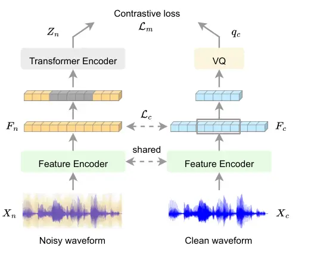
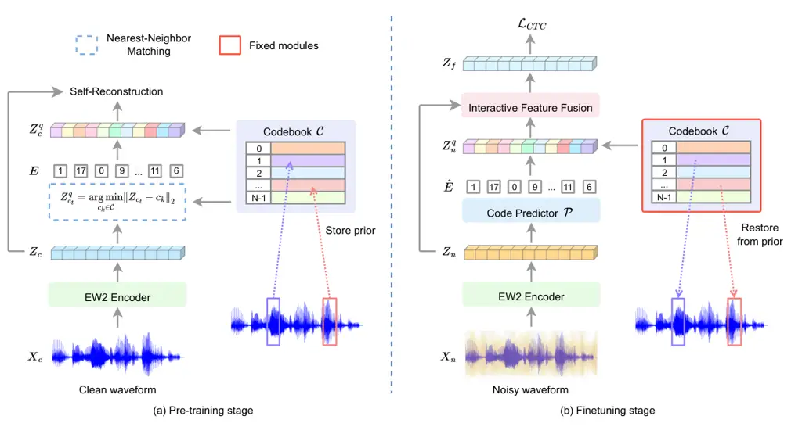
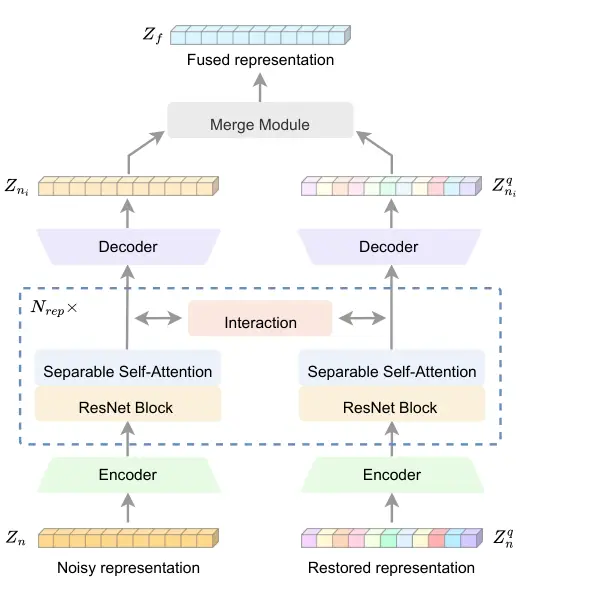
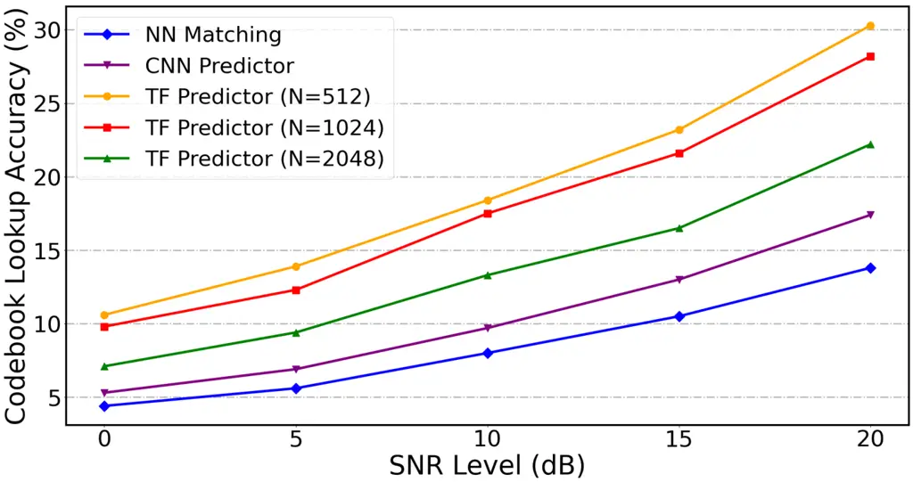
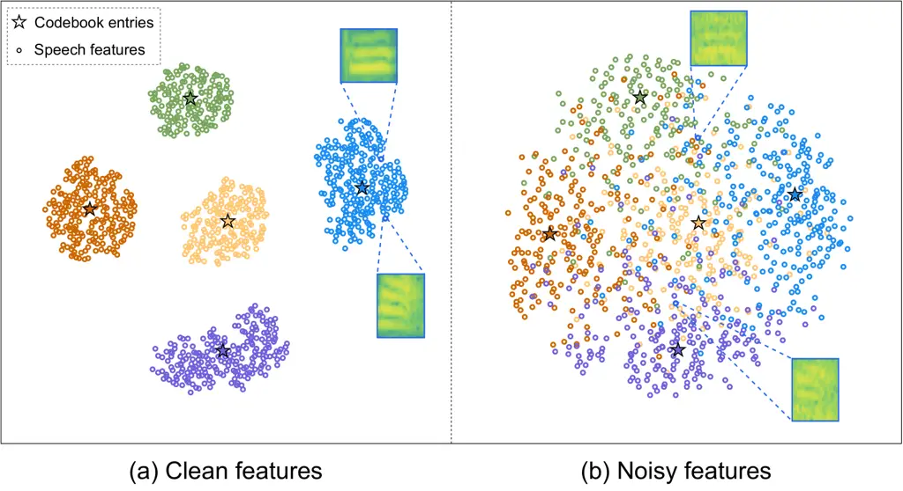
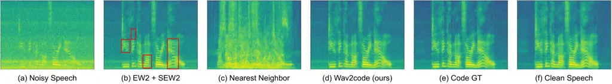
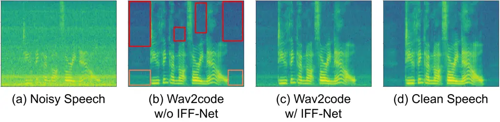

# Wav2code: Restore Clean Speech Representations via Codebook Lookup for Noise-Robust ASR

Yuchen Hu    Chen Chen    Qiushi Zhu    Eng Siong Chng ^(†)^(†)thanks:
Manuscript created April 2023, revised Aug 2023, accepted Oct 2023,
published Dec 2023. The computational work for this article was
partially performed on resources of the National Supercomputing Centre,
Singapore (https://www.nscc.sg). (Corresponding author: Chen
Chen.)^(†)^(†)thanks: The authors Yuchen Hu, Chen Chen and Eng Siong
Chng are with the School of Computer Science and Engineering, Nanyang
Technological University (NTU), Singapore 639798 (e-mail:
yuchen005@e.ntu.edu.sg; chen1436@e.ntu.edu.sg; aseschng@ntu.edu.sg), and
the author Qiushi Zhu is with the National Engineering Research Center
of Speech and Language Information Processing (NERC-SLIP), University of
Science and Technology of China (USTC), Hefei 230026, China (e-mail:
qszhu@mail.ustc.edu.cn).

###### Abstract

Automatic speech recognition (ASR) has gained remarkable successes
thanks to recent advances of deep learning, but it usually degrades
significantly under real-world noisy conditions. Recent works introduce
speech enhancement (SE) as front-end to improve speech quality, which is
proved effective but may not be optimal for downstream ASR due to speech
distortion problem. Based on that, latest works combine SE and currently
popular self-supervised learning (SSL) to alleviate distortion and
improve noise robustness. Despite the effectiveness, the speech
distortion caused by conventional SE still cannot be cleared out. In
this paper, we propose a self-supervised framework named Wav2code to
implement a feature-level SE with reduced distortions for noise-robust
ASR. First, in pre-training stage the clean speech representations from
SSL model are sent to lookup a discrete codebook via nearest-neighbor
feature matching, the resulted code sequence are then exploited to
reconstruct the original clean representations, in order to store them
in codebook as prior. Second, during finetuning we propose a
Transformer-based code predictor to accurately predict clean codes by
modeling the global dependency of input noisy representations, which
enables discovery and restoration of high-quality clean representations
with reduced distortions. Furthermore, we propose an interactive feature
fusion network to combine original noisy and the restored clean
representations to consider both fidelity and quality, resulting in more
informative features for downstream ASR. Finally, experiments on both
synthetic and real noisy datasets demonstrate that Wav2code can solve
the speech distortion and improve ASR performance under various noisy
conditions, resulting in stronger robustness.

###### Index Terms: 

Automatic speech recognition, speech enhancement, self-supervised
learning, noise robustness, speech distortion, discrete codebook, code
predictor.

## I Introduction

The research of automatic speech recognition (ASR) has progressed
rapidly during the past few years thanks to the deep learning
techniques \[1, 2, 3, 4\], which advances the neural acoustic
modeling \[5, 6, 7, 8, 9\], language modeling \[10, 11, 12, 13, 14, 15,
16\] and large-scale model training \[17, 18, 19\]. Compared to
conventional ASR approaches like GMM-HMM \[20\], the power of neural
networks has brought significant improvement to ASR performance as well
as a simpler end-to-end training pipeline. However, despite the
effectiveness of neural network-based ASR approaches, their performance
usually degrades significantly under real-world noisy scenarios \[21,
22, 23\].

Recently, there are many works focusing on noise-robust speech
recognition that explore novel model architectures and training
strategies \[24, 25, 26, 27, 28, 29\]. Among them are two successful
categories: 1) joint speech enhancement (SE) and ASR systems, 2)
self-supervised learning (SSL). Speech enhancement \[30, 31, 32, 33, 34,
35\] is originally proposed to reduce additive noise from noisy speech
to improve the speech quality for human and machine listening, which can
be categorized into time-domain \[36, 37, 38, 39\] and
frequency-domain \[40, 41, 42\] methods. In particular, time-domain SE
aims to reconstruct the target clean speech directly according to the
input noisy waveform, while frequency-domain SE receives noisy spectrum
as input and estimates a mask to obtain the spectrum of target speech,
by multiplying the estimated mask with input noisy spectrum.

In view of that, previous works propose to cascade SE and ASR as a joint
network \[43, 44\], where SE serves as a denoising front-end to benefit
downstream ASR. Regarding the training strategy, several schemes are
designed. First, \[45, 46, 47\] proposes end-to-end training of cascaded
system using only ASR objective, which can improve ASR results but the
front-end SE module is difficult to train well and function without
specific training objective. Another work \[48\] proposes to train SE
and ASR modules separately with task-specific objectives. This strategy
usually leads to mismatch between two tasks, as SE is optimized in terms
of speech quality like signal-to-noise ratio (SNR), while ASR is
optimized in terms of speech intelligibility like cross-entropy and word
error rate (WER). To this end, later works \[49, 50, 51, 52\] propose
multi-task joint training to optimize SE and ASR modules simultaneously,
which results in some improvements. However, these systems only receives
enhanced speech from SE processing as input for downstream ASR, which
usually suffers from the speech distortion problem \[53\]. In
particular, some previous works \[54, 55\] observe that the enhanced
speech from SE might not always yield good performance for downstream
ASR, as some important ASR-related latent information in original noisy
speech are suppressed by SE processing together with the noise, which is
often undetected at speech enhancement stage but could be detrimental to
the downstream ASR task. To alleviate this issue, recent works \[56, 57,
53\] propose to fuse the distorted enhanced speech with original noisy
speech to recover some over-suppressed information, which have achieved
considerable improvements of ASR performance though still cannot clear
out the distortions.

On the other hand, self-supervised learning also shows great potential
for noise-robust ASR \[58\]. SSL is originally motivated to leverage
large amounts of unlabeled data for neural network training. For
instance, TERA \[59\] performs contextual speech representation learning
with BERT \[60\] by reconstructing the masked input frames in an
utterance. Similarly, Wav2vec2.0 \[61\] employs a convolutional neural
network (CNN) downsampler to extract local speech features from raw
waveform, which are then sent into BERT to perform mask prediction with
contrastive loss. HuBERT \[62\] performs offline clustering to provide
labels for mask prediction, and WavLM \[63\] introduces an utterance
mixing data augmentation method to improve HuBERT. Data2vec \[64\]
follows the teacher-student training scheme \[65\] and adopts continuous
contextual representations as targets to preform regression tasks.
Recently, there are increasing SSL works to improve the noise robustness
of ASR. Wav2vec-switch \[66\] models the noise robustness into
contextual speech representations by contrastive learning. Enhanced
Wav2vec2.0 (EW2) \[67\] performs mask prediction with noisy speech
representations and clean quantized targets, which results in stronger
robustness against various noisy conditions than vanilla Wav2vec2.0.

Since both speech enhancement and self-supervised learning can improve
the robustness of ASR, latest works \[68, 69\] propose to integrate them
as an end-to-end network to further improve noise robustness and
alleviate the speech distortion caused by SE. Based on EW2, \[68\]
employs SE as front-end module to produce enhanced speech for SSL, and
then performs mask prediction with enhanced speech representations and
clean quantized targets, which results in stronger robustness against
both noise and speech distortion. However, this method still only
alleviates the speech distortion caused by conventional SE instead of
clearing it out, and we also note that the unlabeled clean speech is not
fully utilized in their method, i.e., performed as pre-training targets
only.

We may gain inspirations from the recently popular vector quantization
(VQ) \[70, 71\], an effective method for discrete representation
learning. VQ has been popular in many generative tasks due to its strong
encoding ability in discrete finite space with less mapping uncertainty
and higher expressiveness, including speech coding \[72\], audio
compression \[73, 74\], audio generation \[75\], image synthesis \[76,
77, 78\], etc. In particular, \[75\] incorporates the idea of VQ into
variational autoencoder (VAE) to learn discrete latent representations,
which supports high-quality generation of image, video and speech, as
well as high quality speaker conversion and unsupervised learning of
phonemes. Furthermore, \[76\] employs a convolutional VQGAN to learn a
codebook of context-rich visual parts, whose composition is subsequently
modeled with an autoregressive Transformer architecture, which gains
promising performance on high-resolution image synthesis. Based on
that, \[77\] introduces a global prediction network for better code
composition, which has achieved great success in image super-resolution.
Inspired by them, in this work we leverage VQ in noise-robust ASR to
generate clean speech representations with reduced distortions from
noisy inputs.

Motivated by above observations, in this paper we propose a
self-supervised framework based on EW2 named Wav2code, which makes full
use of the unlabeled clean speech data as prior to implement a
feature-level SE with reduced distortions for noise-robust speech
recognition. First, during pre-training we feed the clean waveform into
pre-trained EW2 from \[67\] to obtain SSL representations, which are
employed to lookup a discrete codebook via NN feature matching. The
resulted code sequence is then exploited to reconstruct the input clean
speech representations. By optimizing such reconstruction task, the
codebook would be updated to store clean speech representations as
priors. Second, in finetuning stage we propose a Transformer-based code
predictor to accurately predict clean codes by modeling the global
dependency of input noisy representations, which enables discovery and
restoration of high-quality clean speech representations. Compared to
prior works on VQ \[73, 74\], our pre-trained clean prior in discrete
space and global modeling of input noisy speech representations in
Wav2code can effectively remedy the speech distortions that exist in
conventional SE. Furthermore, considering that the restored clean speech
representations from discrete codebook may lose some fidelity (see
Fig. 7 (b)), we propose an interactive feature fusion network (IFF-Net)
based on our conference paper \[56\] to combine original noisy and the
restored clean representations to consider both fidelity and quality,
resulting in more informative features for downstream ASR. Finally,
experimental results on both the synthetic noisy LibriSpeech data and
the real noisy CHiME-4 data demonstrate that our proposed Wav2code
achieves consistent ASR improvements under various noisy conditions,
which shows stronger noise robustness. In addition, visualizations show
that our Wav2code can learn a good codebook to represent clean speech
features, based on that the code predictor can restore high-quality
clean representations with reduced distortions, and the proposed IFF-Net
can achieve good restoration fidelity and quality simultaneously to
benefit downstream ASR.

The remainder of this paper is organized as follows. Section II presents
the proposed Wav2code framework including EW2 backbone, codebook
learning (pre-training), code prediction (finetuning) and IFF-Net.
Section III describes the experimental setups, followed by experimental
results and analysis in Section IV. Section V concludes this work in
final.

## II Methodology

In this section, we present the proposed Wav2code framework including
EW2 backbone, codebook learning in pre-training stage, code prediction
in finetuning stage and the IFF-Net. The overall training pipeline is
depicted by Algorithm 1.

### II-A Backbone: Enhanced Wav2vec2.0 (EW2)

We employ the Enhanced Wav2vec2.0 (EW2) \[67\] as our backbone, which is
an extension of vanilla Wav2vec2.0 \[61\]. As shown in Fig. 1, EW2
consists of a feature encoder $`f`$, a Transformer encoder $`g`$ and a
vector quantization (VQ) module. First, the feature encoder comprises
seven CNN layers to downsample the input noisy and clean raw waveforms,
generating two speech features $`F_{n},F_{c}\in\mathbb{R}^{T\times D}`$,
where $`T`$ is number of frames and $`D`$ is embedding dimension,

```math
F_{n}=f(X_{n});\quad F_{c}=f(X_{c}), \tag{1}
```



Fig. 1: Illustration of Enhanced Wav2vec2.0. It is pre-trained with
contrastive loss between masked noisy speech representations $`Z_{n}`$
and quantized clean targets $`q_{c}`$, and then finetuned with a linear
output layer and CTC loss \[5\].

Then, a certain proportion of frames in noisy features $`F_{n}`$ are
masked by replaced with a learnable mask embedding, which is sent into
the Transformer encoder to learn a high-level contextualized
representation $`Z_{n}\in\mathbb{R}^{T\times D}`$,

```math
Z_{n}=g(F_{n}), \tag{2}
```

Meanwhile, the parallel clean features $`F_{c}`$ are discretized into
$`q_{c}`$ using a VQ module, which provides clean targets for subsequent
contrastive pre-training,

```math
q_{c}=VQ(F_{c}), \tag{3}
```

where $`q_{c}\in\mathbb{R}^{T^{\prime}\times D}`$, and $`T^{\prime}`$ is
the number of masked frames. The motivation of using clean features as
targets is to encourage the model to predict clean speech
representations from noisy speech inputs, and thus enhances its noise
robustness. In particular, the implementation details of EW2 follow that
in vanilla Wav2vec2.0, including model settings, VQ configurations and
the training details. The final pre-training objective can be formulated
as

```math
\mathcal{L}=\mathcal{L}_{m}+\alpha\mathcal{L}_{d}+\beta\mathcal{L}_{f}+\gamma\mathcal{L}_{c}, \tag{4}
```

where

```math
\displaystyle\mathcal{L}_{m} \displaystyle=-\mathbb{E}_{t}\left(\log\frac{\exp({\rm sim}(Z_{n_{t}},q_{c_{t}})/\kappa)}{\sum_{\tilde{q}{\sim}Q_{t}}\exp({\rm sim}(Z_{n_{t}},\tilde{q})/\kappa)}\right), \tag{5}
```

```math
\displaystyle\mathcal{L}_{c} \displaystyle=\mathbb{E}_{t}\left(\left\|F_{n_{t}}-F_{c_{t}}\right\|_{2}^{2}\right), \tag{6}
```

the subscript $`t`$ indicates frame index. $`\mathcal{L}_{m}`$ is the
contrastive loss that enables the model to distinguish between the true
quantized clean feature $`q_{c_{t}}`$ and a set of $`K+1`$ quantized
candidature features $`\tilde{q}\in Q_{t}`$, where $`Q_{t}`$ contains
$`q_{c_{t}}`$ and $`K`$ distractors sampled from other frames.
$`\rm sim(\cdot,\cdot)`$ denotes cosine similarity and $`\kappa`$ is a
temperature. $`\mathcal{L}_{d}`$ is a diversity loss to encourage
exhausted use of all the codebook entries, and $`\mathcal{L}_{f}`$ is a
$`\ell_{2}`$ penalty over the outputs of feature encoder, which directly
follows vanilla Wav2vec2.0 \[61\]. In addition, $`\mathcal{L}_{c}`$ is
$`\ell_{2}`$ loss to ensure the consistency between noisy and clean
speech features, by minimizing their Euclidean distance. The final loss
function $`\mathcal{L}`$ is a weighted summation of above four loss
terms with weight hyper-parameters $`\alpha`$, $`\beta`$ and $`\gamma`$.



Fig. 2: Illustration of the proposed Wav2code framework. (a)
Pre-training stage: codebook learning via nearest-neighbor matching to
store clean speech prior. (b) Finetuning stage: code prediction to
restore clean speech representations from prior for downstream ASR.
Solid arrows indicate direct data flow, and dashed arrows indicate
mapping relationship.

### II-B Wav2code Pre-training: Codebook Learning

To reduce the uncertainty of noisy-to-clean speech representation
mapping in conventional SE and recover the distorted information in
enhanced speech, we first pre-train Wav2code to learn a codebook with
rich prior of clean speech representations, which strengthen the
expressiveness of entire system and thus support more robust
feature-level SE in finetuning.

As illustrated in Fig. 2(a), the clean raw waveform $`X_{c}`$ is first
embedded as contextualized speech representation
$`Z_{c}\in\mathbb{R}^{T\times D}`$ by a pre-trained EW2 encoder, which
contains a feature encoder and a Transformer encoder as shown in Fig. 1,
and the training details is explained in Section III-B,

```math
Z_{c}=EW2(X_{c}), \tag{7}
```

Following the popular VQ-VAE \[75\] and VQGAN \[76\], we replace each
frame in clean representation $`Z_{c}`$ (i.e., $`Z_{c_{t}}`$,
$`t\in\{0,1,2,...,T-1\}`$ is frame index) with the nearest entry in the
discrete codebook
$`\mathcal{C}=\{c_{k}\in\mathbb{R}^{D}\}_{k=0}^{N-1}`$, in order to
obtain the quantized clean speech feature
$`Z_{c}^{q}\in\mathbb{R}^{T\times D}`$ as well as the corresponding
codebook entry ID sequence
$`E=\{e_{t}\in\{0,1,2,...,N-1\}\}_{t=0}^{T-1}`$,

```math
\displaystyle Z_{c_{t}}^{q}=\underset{c_{k}\in\mathcal{C}}{\arg\min}\left\|Z_{c_{t}}-c_{k}\right\|_{2}, \tag{8}
```

```math
\displaystyle e_{t}=\underset{k}{\arg\min}\left\|Z_{c_{t}}-c_{k}\right\|_{2}, \tag{9}
```

The quantized clean feature $`Z_{c}^{q}`$ actually represents a sequence
of exemplars in codebook space. Then, we perform to reconstruct the
input clean speech $`Z_{c}`$ from this code sequence $`Z_{c}^{q}`$ by
Eq.(10), which is similar to k-means clustering. As a result, the
codebook $`\mathcal{C}`$ will be updated to store priors from clean
speech representations, resulting in deep correlations between clean
speech space and codebook space. In addition, $`E`$ is a sequence of
codebook entry IDs that corresponds to each frame in $`Z_{c}^{q}`$,
i.e., $`e_{t}=k`$ if $`Z_{c_{t}}^{q}=c_{k}`$, where
$`k\in\{0,1,2...,N-1\}`$.

Inspired by \[75, 76\], we build a bi-directional pre-training loss to
reconstruct the clean representation $`Z_{c}`$ from $`Z_{c}^{q}`$,

```math
\mathcal{L}_{pt}=\left\|\text{sg}(Z_{c})-Z_{c}^{q}\right\|_{2}^{2}+\beta\left\|Z_{c}-\text{sg}(Z_{c}^{q})\right\|_{2}^{2}, \tag{10}
```

where $`\text{sg}(\cdot)`$ denotes the stop-gradient operator. The first
term is reconstruction loss to train the codebook $`\mathcal{C}`$, in
order to store the clean speech prior. The second term is a commitment
loss \[75\] to align the optimization of front-end encoder and codebook.
We find that jointly training front-end EW2 encoder and codebook
benefits the prior learning, resulting in better codebook for subsequent
finetuning process.

The weight $`\beta`$ is designed for trade-off between the update rates
of EW2 encoder and codebook, which is empirically set to 0.25. The code
dimension and embedding dimension $`D`$ is set to 768. For the number of
codebook entries $`N`$, we empirically set it to 1024, which is
sufficient to restore clean speech representations. Further increasing
it can only yield limited improvement, as the redundancy in codebook
entries could cause ambiguous code prediction in finetuning stage, where
the experimental analysis is presented in Section IV-B.

### II-C Wav2code Finetuning: Code Prediction

In finetuning stage, we aim to restore clean speech representations from
the pre-trained codebook prior according to the noisy inputs, and thus
benefit the downstream ASR. However, due to the noise corruption in
input noisy representations, the nearest-neighbor (NN) matching in Eq. 8
usually fails to find the correct codebook entry for clean
representation restoration. As shown in Fig. 5(b), the uncertain and
diverse noise corruption deviate the noisy speech representations from
the correct codebook entry, which thus falls in nearby clusters and
leads to sub-optimal restoration results (see Fig. 6(c)). To this end,
we introduce a Transformer-based code predictor to model the global
contextual dependencies of input noisy sequence for accurate code
prediction.

Similar to pre-training stage, EW2 encoder is employed to process the
input noisy raw waveform and generate a noisy representation
$`Z_{n}\in\mathbb{R}^{T\times D}`$. Then, we design a Transformer-based
code predictor $`\mathcal{P}`$ to model the global dependencies of
$`Z_{n}`$. In particular, $`\mathcal{P}`$ first contains $`M`$
Transformer encoder blocks, where the $`m`$-th block is formulated as,

```math
\displaystyle H_{m} \displaystyle=LN(X_{m}+M\hskip-0.56917ptH\hskip-0.56917ptA(X_{m},X_{m},X_{m})), \tag{11}
```

```math
\displaystyle X_{m+1} \displaystyle=LN(H_{m}+F\hskip-0.56917ptF\hskip-0.56917ptN(H_{m})), \tag{12}
```

where $`X_{0}=\text{Project}(Z_{n})\in\mathbb{R}^{T\times D_{p}}`$ and
$`D_{p}<D`$ is to enable efficient Transformer, “LN” denotes layer
normalization \[79\], “MHA” denotes multi-head attention \[4\]. After
Transformer encoder blocks, there is a linear projection to map
$`X_{M}\in\mathbb{R}^{T\times D_{p}}`$ to $`\mathbb{R}^{T\times N}`$,
followed by a softmax layer to generate code prediction outputs
$`\hat{P}\in\mathbb{R}^{T\times N}`$, where
$`\hat{p_{t}}\in\mathbb{R}^{N}`$ is a probability distribution over
$`N`$ codebook entries.

Meanwhile, in order to further retrieve the corresponding codebook
entries for each frame according to the predicted probability
distribution, we employ the gumbel softmax layer \[80\] to select
discrete codebook entries in a fully differentiable way, which generates
a predicted codebook entry ID sequence
$`\hat{E}\in\mathbb{N}^{T\times 1}`$, where
$`\hat{e_{t}}\in\{0,1,2,...,N-1\}`$. It then retrieves $`T`$ respective
entries from the pre-trained codebook to form the quantized
representation $`Z_{n}^{q}\in\mathbb{R}^{T\times D}`$, which restores
high-quality clean speech feature to benefit downstream ASR. Therefore,
it produces a noisy-to-clean transformation like conventional SE but on
representations instead of raw speech.

Finally, the restored representation $`Z_{n}^{q}`$ and original noisy
representation $`Z_{n}`$ are combined (see Sec. II-D) and sent for
downstream ASR with a linear layer and CTC loss \[5\]
$`\mathcal{L}_{CTC}`$.

For training process, we first load the pre-trained EW2 backbone from
Section II-A and codebook $`\mathcal{C}`$ from pre-training stage in
Section II-B. Codebook is fixed during finetuning to protect the clean
speech prior. We exploit two training objectives in this stage: 1)
cross-entropy loss $`\mathcal{L}_{pred}`$ for code prediction
supervision, and 2) $`\ell_{2}`$ loss $`\mathcal{L}_{res}`$ for clean
feature restoration supervision,

```math
\mathcal{L}_{pred}=\mathbb{E}_{t}\left(-e_{t}\log(\hat{e_{t}})\right);\quad\mathcal{L}_{res}=\left\|Z_{n}^{q}-sg(Z_{c})\right\|_{2}^{2}, \tag{13}
```

where the ground-truth of code $`E`$ is obtained from pre-training stage
in Section II-B, and $`Z_{c}`$ is the ground-truth clean representation
to supervise the restoration. The final objective of finetuning stage
is,

```math
\mathcal{L}_{ft}=\mathcal{L}_{CTC}+\lambda_{pred}\cdot\mathcal{L}_{pred}+\lambda_{res}\cdot\mathcal{L}_{res}, \tag{14}
```

where $`\lambda_{pred}`$ and $`\lambda_{res}`$ are both set to 0.1 in
our system.

### II-D Interactive Feature Fusion Network (IFF-Net)



Fig. 3: Illustration of proposed interaction feature fusion network
(IFF-Net). Encoder and Decoder are used to compress and recover the
number of feature channels like bottleneck. ResNet block is employed to
capture local context, and Separable Self-Attention (SSA) module is
exploited to model global dependencies. Interaction module is designed
to interact between two branch of features, which are finally fused by
Merge module to generate output.

Since the quantized speech representation $`Z_{n}^{q}`$ is restored from
discrete codebook, there exists some loss of fidelity (see Fig. 7(b)),
though its quality has been improved significantly. On the other hand,
the fidelity of original noisy representation $`Z_{n}`$ is unaffected,
while its quality suffers from noise corruption. Therefore, some fusion
strategy between these two features may result in more informative
speech representations to benefit downstream ASR. To this end, we
propose an interaction feature fusion network (IFF-Net) to combine them,
in order to purse both fidelity and quality in restoration.

In particular, there is first a bottleneck design with a pair of CNN
encoder and decoder to enable efficient computation. The bottleneck
features in-between are all of tensor shape
$`\mathbb{R}^{T\times D^{\prime}}`$, where $`D^{\prime}`$ is empirically
set to 128 in our system.

To capture both local and global dependencies of the two input
representations for further interaction, we leverage a ResNet block and
a proposed Separable Self-Attention (SSA) \[56\] module for sequence
modeling. The ResNet block consists of one 1-D convolutional layer with
kernel size of 3, stride of 1 and channel number of $`D^{\prime}`$, as
well as a residual connection to extract deep local features from
inputs. These features are then fed into a SSA module to capture global
dependencies along both temporal and embedding dimensions. Take the
branch of noisy representation for example, denote the SSA module input
as $`H_{n}\in\mathbb{R}^{T\times D^{\prime}}`$, the temporal- and
embedding-wise self-attention are respectively formulated as,

```math
\displaystyle H_{n}^{temp} \displaystyle=H_{n}+\text{Softmax}(H_{n}\cdot(H_{n})^{T}/\sqrt{D^{\prime}})\cdot H_{n}, \tag{15}
```

```math
\displaystyle H_{n}^{embd} \displaystyle=H_{n}+H_{n}\cdot\text{Softmax}((H_{n})^{T}\cdot H_{n}/\sqrt{T}), \tag{16}
```

Then SSA output is obtained by combining the global features,

```math
S_{n}=\text{Conv}(H_{n}\|H_{n}^{temp}\|H_{n}^{embd}), \tag{17}
```

where $`\|`$ denotes embedding-wise feature concatenation, and “Conv”
denotes 1$`\times`$1 convolution layer.

After sequence modeling, the two branch of features interact to augment
each other,

```math
\displaystyle S_{n_{i}} \displaystyle=S_{n}+\sigma(\text{Conv}(S_{n}\|S_{n}^{q}))\otimes S_{n}^{q}, \tag{18}
```

```math
\displaystyle S_{n_{i}}^{q} \displaystyle=S_{n}^{q}+\sigma(\text{Conv}(S_{n}\|S_{n}^{q}))\otimes S_{n}, \tag{19}
```

where $`\sigma`$ denotes the Sigmoid activation function, $`\otimes`$
denotes element-wise multiplication. This Interaction module learns a
mask to weight the two features to augment each other.

The bottleneck features are processed by ResNet block, SSA module and
Interaction module for $`N_{rep}`$ repeated times before mapped back to
$`D`$-channel feature space by decoder, where we set $`N_{rep}=4`$ in
our system. Then, the decoder outputs $`Z_{n_{i}}`$ and
$`Z_{n_{i}}^{q}`$ are finally sent into a Merge module for fusion.
Specifically, this module learns a element-wise mask that acts as a gate
to control which parts of final representations focus on fidelity and
which parts focus on quality, and the final output is obtained as
weighted sum,

```math
\displaystyle M \displaystyle=\sigma(\text{Self-Attention}(\text{Conv}(Z_{n_{i}}\|Z_{n_{i}}^{q}))), \tag{20}
```

```math
\displaystyle Z_{f} \displaystyle=Z_{n_{i}}\otimes M+Z_{n_{i}}^{q}\otimes(1-M), \tag{21}
```

As a result, the proposed IFF-Net can extract deep interactive features
of two branches and finally generate a fused representation to pursue
both fidelity and quality.

1: EW2 encoder, codebook, code predictor, IFF-Net, etc.

2: Conduct EW2 backbone pre-training following §II-A;

3: Load pre-trained weights of EW2 encoder from stage 1 and perform
Wav2code pre-training following §II-B;

4: Load pre-trained weights of EW2 encoder and codebook from stage 2,
conduct Wav2code finetuning following §II-C;

Algorithm 1 Wav2code training pipeline in three stages.

## III Experimental Setup

In this section, we introduce the experimental setup in detail,
including datasets for system evaluation, experimental configurations
for EW2 backbone pre-training, Wav2code pre-training and Wav2code
finetuning.

### III-A Datasets

LibriSpeech-FreeSound \[52\]: For fair comparison with existing baseline
approaches, we use the same dataset as that in \[52\]. Particularly, we
utilize LibriSpeech \[81\] train-clean-100 and train-clean-360 subsets
as clean training data, and the dev-clean subset as validation data. To
simulate noisy speech data to augment model training and validation, we
randomly select noise samples from FreeSound \[52\] dataset and mix them
with the LibriSpeech clean samples, at a randomly selected SNR from
$`\{0,5,10,15,20,25\}`$ dB. The noisy test set is available online¹¹ 1
https://github.com/archiki/Robust-E2E-ASR, which contains 4200 noisy
speech samples simulated by selecting 120 clean speech samples from
LibriSpeech test-clean subset and mixing each of them with 7 different
noise types at 5 different SNRs from $`\{0,5,10,15,20\}`$ dB. The
FreeSound noise data is sampled at 16 kHz, with seven noise types that
are divided into two categories, i.e., type-A and type-B. The type-A
noise is stationary, including ‘Traffic’, ‘Metro’, ‘Car’, while the
type-B noise is relatively non-stationary, including ‘Babble’,
‘Airport/Station’, ‘AC/Vacuum’, ‘Cafe’. There are 10 and 8 different
audio samples for each noise type in training and test sets,
respectively, and the total duration of noise data is around 2 hours.

CHiME-4 \[82\]: To further validate our proposed approach on real noisy
data, we also conduct experiments on CHiME-4 challenge data²² 2
http://spandh.dcs.shef.ac.uk/chime_challenge/CHiME4/index.html \[82\].
The CHiME-4 dataset is collected by asking volunteers to read the text
of Wall Street Journal (WSJ0) corpus \[83\] and using a six-channel
distant microphone array as well as a close-talk microphone to record
data. There are two types of noisy speech data, i.e., real and
simulated. The real noisy speech is recorded in four different
environments including bus, cafe, pedestrian area and street junction,
and the simulated noisy data is synthesized by mixing clean speech from
WSJ0 training set (si_tr_s) and the noise recorded in above four
environments. The entire dataset is divided into three splits, i.e.,
training, validation and test. The training split contains 1600 real
noisy and 7138 simulated noisy utterances, the validation split contains
1640 real noisy and 1640 simulated noisy utterances, and the test split
contains 1320 real noisy and 1320 simulated noisy utterances. Follow
prior work \[68\], we use the six-channel data for training, and the
one-channel real noisy data for validation and testing.

|                   |           |          |                    |      |      |      |      |       |      |      |      |      |      |      |      |      |      |      |       |
| ----------------- | --------- | -------- | ------------------ | ---- | ---- | ---- | ---- | ----- | ---- | ---- | ---- | ---- | ---- | ---- | ---- | ---- | ---- | ---- | ----- |
| Method            | Pre-train | Finetune | WER under SNR (dB) |      |      |      |      |       |      |      |      |      |      |      |      |      |      |      |       |
|                   |           |          | Traffic            |      |      |      |      | Metro |      |      |      |      | Car  |      |      |      |      | Avg  | Clean |
|                   |           |          | 0                  | 5    | 10   | 15   | 20   | 0     | 5    | 10   | 15   | 20   | 0    | 5    | 10   | 15   | 20   |      |       |
| Baseline \[52\]   | None      | Clean    | 72.4               | 62.5 | 50.2 | 41.0 | 33.6 | 68.4  | 54.4 | 46.4 | 34.9 | 27.6 | 35.0 | 28.1 | 24.3 | 21.7 | 16.7 | 41.1 | 10.3  |
| DEMUCS \[52\]     | Noisy     | Noisy    | 38.2               | 30.3 | 25.3 | 20.6 | 17.9 | 35.6  | 24.9 | 22.6 | 17.1 | 15.9 | 20.5 | 18.1 | 14.6 | 13.8 | 13.1 | 21.9 | 10.9  |
| AvT \[52\]        | None      | Noisy    | 40.7               | 32.5 | 26.3 | 21.4 | 18.5 | 36.1  | 26.5 | 22.6 | 18.4 | 17.8 | 21.8 | 18.9 | 16.8 | 16.0 | 15.3 | 23.3 | 13.1  |
| Wav2vec2.0 \[61\] | None      | Clean    | 71.0               | 57.8 | 48.6 | 40.5 | 33.3 | 66.5  | 54.4 | 48.6 | 35.2 | 28.2 | 34.1 | 27.1 | 22.8 | 19.2 | 14.8 | 40.1 | 11.0  |
|                   | None      | Noisy    | 52.3               | 44.8 | 38.9 | 34.6 | 31.2 | 49.9  | 41.1 | 36.3 | 31.6 | 30.0 | 34.7 | 30.3 | 29.5 | 28.4 | 26.8 | 36.0 | 25.0  |
|                   | Clean     | Noisy    | 42.8               | 34.2 | 26.7 | 23.0 | 19.4 | 39.2  | 31.0 | 25.9 | 21.4 | 19.7 | 23.0 | 19.0 | 17.6 | 16.2 | 15.4 | 25.0 | 14.0  |
|                   | Noisy     | Noisy    | 34.6               | 27.9 | 23.6 | 18.9 | 17.6 | 32.4  | 24.8 | 20.7 | 17.4 | 17.1 | 19.4 | 17.0 | 15.5 | 14.7 | 14.6 | 21.1 | 13.5  |
| EW2 \[67\]        | Noisy     | Noisy    | 31.0               | 22.3 | 20.0 | 16.5 | 14.9 | 29.0  | 21.9 | 18.1 | 15.8 | 14.4 | 17.6 | 15.6 | 14.4 | 13.7 | 13.1 | 18.6 | 12.3  |
| EW2 + SEW2 \[68\] | None      | Noisy    | 37.3               | 29.9 | 25.7 | 22.3 | 19.8 | 36.7  | 27.5 | 24.3 | 20.5 | 19.2 | 22.2 | 18.9 | 18.3 | 17.6 | 16.8 | 23.8 | 15.6  |
|                   | Noisy     | Noisy    | 28.6               | 21.1 | 18.9 | 15.7 | 14.5 | 27.5  | 20.9 | 17.4 | 15.3 | 14.1 | 16.3 | 14.8 | 13.8 | 13.4 | 13.0 | 17.7 | 12.2  |
| Wav2code (ours)   | None      | Noisy    | 34.6               | 27.6 | 23.8 | 20.7 | 18.6 | 34.4  | 25.7 | 22.7 | 19.2 | 18.3 | 20.4 | 17.8 | 16.9 | 16.5 | 16.2 | 22.2 | 14.7  |
|                   | Noisy     | Noisy    | 26.9               | 20.1 | 18.2 | 15.2 | 14.1 | 26.5  | 20.2 | 16.8 | 14.9 | 13.8 | 15.1 | 13.8 | 13.1 | 12.9 | 12.6 | 16.9 | 11.4  |

TABLE I: The performance comparison of different approaches on type-A
noisy test sets at different SNR levels. For all the baselines,
“Pre-train” and “Finetine” respectively denotes the data type for
self-supervised pre-training and finetuning. For the proposed Wav2code,
“Pre-train” denotes the data type for EW2 backbone pre-training and
“Finetine” denotes that for Wav2code finetuning, note that Wav2code
pre-training requires clean data only. “None” denotes no SSL
pre-training. “Avg” denotes the averaged WER results on all type-A noise
conditions, and “Clean” denotes the WER results on clean test set.

### III-B Experimental Configurations

EW2 Backbone Pre-training on LibriSpeech: We build two settings for EW2
backbone pre-training \[68\], i.e., 100 hours and 460 hours. For
100-hour setting, we pre-train EW2 backbone on train-clean-100 subset of
LibriSpeech and its noise version with FreeSound augmentation. For model
architecture, the feature encoder contains seven convolutional layers
with channel number all of 512, the strides of (5, 2, 2, 2, 2, 2, 2) and
the kernel sizes of (10, 3, 3, 3, 3, 2, 2). As a result, the frame shift
of feature encoder output is 20 ms and the receptive field is 25 ms. The
following Transformer encoder consists of 12 layers comprising a
self-attention module and a feed-forward network (FFN) module. The
dimension of self-attention module is 768, the number of attention heads
is 12, and the inner dimension of FFN is 2048. For VQ module, we follow
the same configurations in prior work \[68\]. The total number of
parameters in EW2 backbone is around 95 M. For masking process, we
sample from all the frames at a probability of $`p=0.065`$ as starting
points and then mask the subsequent $`M=10`$ frames after them. In
calculating contrastive loss by Eq. 5, the number of distractors $`K`$
is set to 100, and the temperature $`\kappa`$ is set to 0.1. The
weighting parameters $`\alpha`$, $`\beta`$ and $`\gamma`$ are set to
0.1, 10 and 1, respectively. We pre-train EW2 for 100k steps using Adam
optimizer \[84\]. During the first 20% of all training steps, the
learning rate warms up to $`5e{-4}`$ and then decays polynomially.

For 460-hour setting, all the configurations are kept same as before
except that we pre-train EW2 backbone on a combination of
train-clean-100 and train-clean-360 subsets of LibriSpeech and its noise
version with FreeSound augmentation.

Wav2code Pre-training on LibriSpeech: The train-clean-100 subset of
LibriSpeech is utilized for Wav2code pre-training, and noise data is not
needed in this stage. For model architecture, the EW2 backbone is
initialized from previous pre-training stage with same configurations.
For discrete codebook, the embedding dimension $`D`$ follows that in
EW2, i.e., 768, and the number of codebook entries $`N`$ is 1024. We
pre-train Wav2code for 50k steps using Adam optimizer. During the first
20% of all training steps, the learning rate warms up to $`5e{-4}`$ and
then decays polynomially.

Wav2code Finetuning on LibriSpeech: During finetuning, we utilize both
clean and noisy versions of train-clean-100 subset of LibriSpeech. The
EW2 backbone is initialized from first pre-training stage, and the
codebook is initialized from second pre-training stage. For model
architecture, the number of Transformer blocks $`M`$ in code predictor
is set to 4, and the embedding dimension $`D_{p}`$ is set to 256. The
total number of parameters in Wav2code is around 104 M. The Wav2code is
finetuned for 50k steps using Adam optimizer. We use a data augmentation
method similar to SpecAugment \[85\], where a time mask same as that in
EW2 pre-training stage is employed, as well as a frequency mask at
probability of 0.05 and 32 subsequent channels. For CTC loss, the
modeling unit contains 30 characters, including 26 letters and 4 special
symbols, and no language model (LM) is used during inference.

Training on CHiME-4: We employ similar experimental configurations on
CHiME-4 dataset as those on LibriSpeech dataset, where the differences
are explained as follows. Due to the limited size of CHiME-4 dataset, we
utilize all the channels of data except the second microphone channel
for model training. The EW2 pre-training is continued from the public
pre-trained Wav2vec2.0 model³³ 3
https://dl.fbaipublicfiles.com/fairseq/wav2vec/wav2vec_small.pt for 50k
steps, following that the Wav2code is pre-trained and finetuned both for
20k steps. The public pre-trained model is pre-trained on 960 hours data
of LibriSpeech with around 95 M parameters. Following previous works on
CHiME-4 dataset, we train a Transformer-based LM with vocabulary of 65k
using the text from WSJ corpus, where the implementation details are
same as \[68\].

|                   |           |          |                    |      |      |      |                 |      |      |      |           |      |      |      |      |      |      |      |      |
| ----------------- | --------- | -------- | ------------------ | ---- | ---- | ---- | --------------- | ---- | ---- | ---- | --------- | ---- | ---- | ---- | ---- | ---- | ---- | ---- | ---- |
| Method            | Pre-train | Finetune | WER under SNR (dB) |      |      |      |                 |      |      |      |           |      |      |      |      |      |      |      |      |
|                   |           |          | Babble             |      |      |      | Airport/Station |      |      |      | AC/Vacuum |      |      |      | Cafe |      |      |      | Avg  |
|                   |           |          | 5                  | 10   | 15   | 20   | 5               | 10   | 15   | 20   | 5         | 10   | 15   | 20   | 5    | 10   | 15   | 20   |      |
| Baseline \[52\]   | None      | Clean    | 98.3               | 91.3 | 79.7 | 65.0 | 84.1            | 73.7 | 60.6 | 50.0 | 83.1      | 71.5 | 59.5 | 45.8 | 72.7 | 59.5 | 44.3 | 33.4 | 67.0 |
| DEMUCS \[52\]     | Noisy     | Noisy    | 58.0               | 41.8 | 32.3 | 25.4 | 45.5            | 33.7 | 25.6 | 21.5 | 45.4      | 34.2 | 28.1 | 22.8 | 31.6 | 27.4 | 20.3 | 16.9 | 31.9 |
| AvT \[52\]        | None      | Noisy    | 55.1               | 39.5 | 31.1 | 24.6 | 43.3            | 33.4 | 25.2 | 20.9 | 40.8      | 33.4 | 29.3 | 23.2 | 32.0 | 26.3 | 21.4 | 18.5 | 31.1 |
| Wav2vec2.0 \[61\] | None      | Clean    | 93.1               | 84.9 | 73.7 | 58.0 | 80.6            | 72.7 | 59.7 | 48.8 | 79.6      | 69.6 | 56.5 | 42.4 | 68.9 | 58.1 | 43.7 | 34.8 | 64.1 |
|                   | None      | Noisy    | 70.8               | 58.6 | 47.6 | 39.8 | 59.5            | 49.4 | 40.6 | 35.4 | 56.5      | 48.4 | 42.4 | 35.5 | 49.6 | 42.7 | 34.6 | 31.8 | 46.5 |
|                   | Clean     | Noisy    | 58.3               | 45.0 | 35.1 | 27.6 | 48.1            | 37.3 | 28.8 | 24.7 | 44.9      | 36.1 | 29.2 | 24.5 | 36.4 | 29.1 | 23.9 | 19.2 | 34.3 |
|                   | Noisy     | Noisy    | 47.4               | 35.9 | 29.0 | 23.5 | 39.6            | 29.4 | 23.7 | 20.2 | 40.9      | 32.4 | 26.8 | 21.3 | 28.0 | 24.6 | 19.7 | 17.0 | 28.7 |
| EW2 \[67\]        | Noisy     | Noisy    | 41.0               | 30.2 | 25.1 | 19.2 | 33.4            | 24.4 | 19.7 | 16.9 | 32.4      | 25.6 | 21.5 | 17.6 | 24.7 | 21.4 | 17.7 | 15.1 | 24.1 |
| EW2 + SEW2 \[68\] | None      | Noisy    | 53.9               | 41.0 | 31.4 | 27.4 | 43.0            | 32.4 | 26.8 | 23.4 | 42.8      | 34.3 | 28.5 | 22.9 | 32.8 | 27.6 | 24.0 | 19.9 | 32.0 |
|                   | Noisy     | Noisy    | 37.8               | 28.3 | 23.9 | 18.6 | 31.5            | 23.2 | 18.8 | 16.3 | 31.2      | 24.6 | 20.8 | 17.2 | 23.5 | 20.6 | 17.2 | 14.9 | 23.0 |
| Wav2code (ours)   | None      | Noisy    | 51.6               | 38.9 | 29.7 | 26.0 | 41.6            | 31.4 | 25.5 | 22.5 | 40.7      | 32.4 | 26.9 | 21.7 | 31.3 | 26.2 | 22.9 | 19.4 | 30.5 |
|                   | Noisy     | Noisy    | 36.3               | 27.2 | 23.3 | 18.2 | 30.2            | 22.4 | 18.3 | 16.1 | 30.3      | 24.0 | 20.4 | 16.9 | 22.7 | 20.0 | 16.7 | 14.6 | 22.5 |

TABLE II: The performance comparison of different approaches on type-B
noisy test sets at different SNR levels. For all the baselines,
“Pre-train” and “Finetine” respectively denotes the data type for
self-supervised pre-training and finetuning. For the proposed Wav2code,
“Pre-train” denotes the data type data for EW2 backbone pre-training and
“Finetine” denotes that for Wav2code finetuning, note that Wav2code
pre-training requires clean data only. “None” denotes no SSL
pre-training. “Avg” denotes the averaged WER results on all type-B noise
conditions, and “Clean” denotes the WER results on clean test set.

|                   |                    |                 |                |                |                |       |
| ----------------- | ------------------ | --------------- | -------------- | -------------- | -------------- | ----- |
| Method            | WER under SNR (dB) |                 |                |                |                |       |
|                   | Babble             | Airport/Station | AC/Vacuum      | Cafe           | Avg            | Clean |
|                   | 0$`\sim`$20 dB     | 0$`\sim`$20 dB  | 0$`\sim`$20 dB | 0$`\sim`$20 dB | 0$`\sim`$20 dB |       |
| EW2 \[67\]        | 21.0               | 16.1            | 15.7           | 12.2           | 16.3           | 7.5   |
| EW2 + SEW2 \[68\] | 18.6               | 14.4            | 14.1           | 11.2           | 14.6           | 5.7   |
| Wav2code (ours)   | 17.3               | 13.4            | 13.2           | 10.6           | 13.6           | 5.3   |

TABLE III: The performance of different approaches on type-B noisy test
sets when EW2 backbone is pre-trained on LibriSpeech 460h data and
Wav2code is pre-trained and finetuned on LibriSpeech 100h data. “Avg”
denotes the averaged WER results on all type-B noise conditions.

## IV Results and Analysis

In this section, we present experimental results and analysis to verify
the effectiveness of our proposed approach.

### IV-A Evaluation of the proposed Wav2code

Baselines: Work \[52\] provides a baseline on LibriSpeech-FreeSound
benchmark, with Deepspeech2 model \[86\] and CTC objective for system
training. It also introduces DEMUCS speech enhancement module \[87\] and
gradient reversal layer (AvT) to improve noise robustness.
Wav2vec2.0 \[61\] leverages self-supervised learning to improve ASR
performance, and EW2 \[67\] build an enhanced version of it to further
strengthen robustness. Furthermore, latest work EW2 + SEW2 \[68\]
combines speech enhancement (SE) and self-supervised learning (SSL) to
achieve the state-of-the-art.

Table I and II compare the ASR performance between our proposed Wav2code
and the baselines in terms of WER, on type-A (stationary) and type-B
(non-stationary) testing noises respectively. Benchmark work \[52\] find
that introducing DEMUCS-based speech enhancement as front-end can
significantly improve the performance of noisy ASR. Then,
Wav2vec2.0 \[61\] with clean data finetuning is less optimal and only
comparable to the earliest Baseline in \[52\], and finetuning it on
noisy data can significantly improve the testing results on most noisy
testing conditions, i.e., stronger noise robustness, even though the
performance on clean test set degrades. Furthermore, introducing
pre-training stage is beneficial to ASR performance on all test sets,
where leveraging noisy data for pre-training can yield more
improvements. The best performance of Wav2vec2.0 outperforms that in
baseline work \[52\] with the power of SSL pre-training. Based on that,
EW2 \[67\] achieves stronger robustness by performing noisy-to-clean
reconstruction in self-supervised pre-training, and EW2 + SEW2 \[68\]
further introduces a joint training approach of SE and SSL to benefit
from the effectiveness of both, which has achieved the state-of-the-art
noise robustness on LibriSpeech-FreeSound benchmark.

Though effective, EW2 + SEW2 still suffers from the speech distortion
problem caused by conventional SE, and it also fails to fully utilize
the clean training data. Our proposed Wav2code framework makes full use
of unlabeled clean speech data as prior to implement a feature-level SE
with reduced distortions for downstream ASR, which achieves the
state-of-the-arts under all noisy testing conditions, and the
performance on clean test set is also improved. Furthermore, to verify
that the effectiveness of Wav2code is not due to EW2 backbone
pre-training, we also compares it with the EW2 + SEW2 under
non-pretraining setting, where consistent improvements under all testing
conditions demonstrate the origin effectiveness of our proposed
Wav2code. Meanwhile, it also indicates that EW2 pre-training contributes
to the final superior performance of Wav2code. Moreover, we also
evaluate the Wav2code with larger-data pre-trained EW2 backbone, i.e.,
LibriSpeech 460-hour data. As illustrated in Table III, the proposed
Wav2code also outperforms previous state-of-the-art under various noisy
conditions, which verifies its strong generality.

### IV-B Evaluation of Codebook and Code Predictor

Table IV presents the ablation study on codebook and code predictor to
verify their effectiveness in Wav2code framework. We first investigate
the importance of codebook space. As shown in Exp. (1) of Table IV,
removing the codebook in Wav2code (i.e., directly finetuning same as EW2
baseline) results in worse ASR performance under all testing conditions,
which indicates the key role of discrete space of codebook to the
effectiveness of Wav2code. Furthermore, the effect of number of codebook
entries $`N`$ is analyzed in Table V. Comparison between Exp. (7)-(9)
suggests that $`1024`$ codebook entries is the most appropriate under
our setting, where $`N=512`$ may not be sufficient to restore clean
representations, and $`N=2048`$ only yields limited improvement as the
redundancy in codebook entries could cause ambiguous code prediction in
finetuning stage (see green line in Fig. 4).

[TABLE]

TABLE IV: Ablation studies of network components and codebook lookup
methods on LibriSpeech 100-hour setting. No “Codebook” means the
Wav2code framework degenerates into EW2 baseline, “PT Codebook” denotes
pre-train codebook (Wav2code pre-training stage), and “Fix Codebook”
denotes fix codebook during finetuning. “NN” denotes nearest-neighbor
matching, “TF” denotes Transformer. The Exp. ID in bold denotes our
employed configurations.

[TABLE]

TABLE V: Ablation studies of the configurations in codebook and code
predictor on LibriSpeech 100-hour setting. The hyper-parameter $`N`$
denotes number of codebook entries, and $`M`$ denotes the number of
Transformer blocks in code predictor. The Exp. ID in bold denotes our
used configurations.

To further verify the effectiveness of our Transformer-based code
predictor for codebook lookup, we compare it with two baseline schemes,
i.e., Nearest-neighbor (NN) matching in Exp. (2) and a two-layer CNN
code predictor in Exp. (3). As shown in Table IV, comparison between
Exp. (2) and (3) suggests that code predictor is more effective than NN
matching, as the latter is infeasible for codebook lookup due to the
corruption in input noisy representations (see Fig. 5(b)). However, the
local nature of convolution in CNN restricts its capacity of long
sequence code prediction. In comparison, our Transformer-based code
predictor yields better ASR performance thanks to its stronger ability
of global context modeling, i.e., Exp. (6) vs. (3). As shown in Fig. 4,
the Transformer code predictor achieves higher prediction accuracy than
CNN predictor and NN matching. Furthermore, comparison between Exp. (6)
and (4) indicates the importance of fixing codebook during finetuning to
protect the pre-trained clean speech prior. Comparison between Exp. (6)
and (5) demonstrates that the pre-trained prior knowledge in codebook is
important to the clean speech restoration and downstream ASR. In
addition, Table V presents the effect of Transformer block numbers $`M`$
in Exp. (10)-(12). We observe that employing $`4`$ Transformer blocks
achieves considerable improvements over $`2`$ blocks, while further
increasing it to $`8`$ can only result in limited gains, which means it
could approach the upper-bound of Transformer code predictor under our
experimental setting. As a result, we select $`M=4`$ in all experiments
without specified.



Fig. 4: Comparison on code prediction accuracy under different SNR
levels. The results have been averaged over all FreeSound noise types.

### IV-C Evaluation of Interactive Feature Fusion Network

Table VI presents the ablation study on interactive feature fusion
network (IFF-Net) to investigate its effectiveness in Wav2code. As shown
in Exp. (13), directly using restored speech representation for
downstream ASR results in sub-optimal performance, as it may suffer from
some loss of feature fidelity (see Fig. 7(b)). Combining original noisy
and the restored speech representations by concatenation alleviates it
and yields some improvements, i.e., Exp. (14). In comparison, our
proposed IFF-Net achieves significantly better performance by
interactively fuse the fidelity and quality in final representation,
i.e., Exp. (18) vs. (14). In addition, comparison between Exp. (15)-(18)
reflects the effect of hyper-parameters on IFF-Net. We observe that both
the number of bottleneck modules $`N_{rep}`$ and the bottleneck
dimension $`D^{\prime}`$ contributes to the effect of IFF-Net. The best
performance is achieved with large $`N_{rep}`$ and $`D^{\prime}`$, while
further increasing them would not yield significant gains of
performance.

[TABLE]

TABLE VI: Ablation studies of fusion strategies on LibriSpeech 100-hour
setting. “Fusion Strategy” denotes the strategy to fuse the noisy and
restored speech representations, where “None” means using only restored
speech representation for downstream ASR. The hyper-parameter
$`N_{rep}`$ denotes the repeated times of bottleneck modules in IFF-Net,
and $`D^{\prime}`$ denotes its embedding dimension.

### IV-D Visualizations of Codebook Entries



Fig. 5: t-SNE visualizations of clean/noisy speech features and codebook
entries. Features of same color are extracted from parallel clean/noisy
speech data. Examples show that noise corruption increases the diversity
and uncertainty of speech features, making it challenging for correct
code assignment.

In order to better visualize the codebook entries and speech features,
we build an auto-encoder model on Wav2code to implement explicit speech
enhancement. The auto-encoder model consists a pair of encoder and
decoder following prior work \[74\], where the code predictor, codebook
and IFF-Net are all placed between them. Encoder contains four strided
convolution based down-sampling blocks, and decoder mirrors the encoder
with four transposed convolution based up-sampling blocks, where the
configuration details are same as \[74\].

Fig. 5 visualizes the clean/noisy speech features and the pre-trained
codebook entries. We can observe that the clean speech features are
distributed compactly around the corresponding codebook entries.
However, the noise corruption deviates the features from the correct
code and spreads them into nearby code clusters, leading to undesirable
restoration results by near-neighbor matching as depicted in Fig. 6(c).

### IV-E Visualizations of Restored Clean Speech Representations

Fig. 6 presents the spectrograms of clean/noisy speech, enhanced speech
from baseline and the restored clean speech from our proposed Wav2code.
First, comparison between (a) and (f) indicates the significant noise
corruption in noisy speech. The enhanced speech from baseline EW2 +
SEW2 \[68\] effectively reduce the noise and improves the speech quality
as shown in (b), but there exists some speech distortions (red boxes)
compared to the ground-truth clean speech. Then in our experiments,
nearest-neighbor matching fails to restore desired clean speech, as the
noise corruption deviates the speech features from the correct codebook
entry as presented in Fig. 5(b). In comparison, our proposed Wav2code
effectively restores high-quality clean speech with reduced distortions
thanks to the pre-trained clean prior as well as global sequence
modeling in code prediction, which moves one step forward to the
ground-truth clean features. Fig. 6(e) presents the reconstruction
results from the ground-truth code sequence, which effectively
reconstruct the clean speech. Therefore, it shows the strong
expressiveness of codebook space, which can perceptually approximates
the clean speech space and thus restore high-quality clean
representations.

Furthermore, Fig. 7 illustrates the effect of proposed IFF-Net in
combining the quality and fidelity of restored speech. Fig. 7(b) depicts
the restored speech from codebook in Wav2code, which has effectively
restored the clean speech with reduced distortions. However, we can also
observe some loss of fidelity, i.e., uneven noise distribution in high-
and low-frequency bands. As depicted by the red boxes, there is less
high-frequency noise compared to ground-truth clean speech, but the
low-frequency noise (orange boxes) still exists similar to noisy speech.
Such loss of restoration fidelity may explain why downstream ASR
performance is sub-optimal when directly using the restored speech from
codebook, as presented in Table VI. After introducing IFF-Net to fuse
original noisy and the restored speech, our Wav2code effectively
restores the clean speech with both high fidelity and good quality,
which thus results in better performance for downstream ASR (see
Table VI). As shown in Fig. 7(c), the fused speech becomes significantly
closer to ground-truth clean speech than the directly restored speech
from codebook.



Fig. 6: Visualizations of speech features. (a) Noisy speech. (b)
Enhanced speech from EW2 + SEW2 \[68\], where speech distortions are
highlighted in red boxes. (c) Results of codebook prior by
Nearest-Neighbor (NN) matching, where we can observe serious speech
distortions caused by wrong code assignments. (d) Restored speech (with
reduced distortions) from our proposed Wav2code. (e) Reconstruction
results from the code sequence ground truth. (f) Clean speech.



Fig. 7: Effect of IFF-Net on combining quality and fidelity of speech.
(a) Noisy speech. (b) Restored speech from Wav2code without IFF-Net
(good quality but less-optimal fidelity). (c) Restored speech from
Wav2code with IFF-Net (good quality and fidelity). (d) Clean speech. Red
and orange boxes highlight the loss of fidelity in restored speech from
Wav2code without IFF-Net, i.e., uneven noise in high- and low-frequency
bands.

### IV-F Performance Evaluation on CHiME-4 Dataset

Finally, we evaluate the proposed Wav2code in real noisy conditions with
CHiME-4 dataset. Table VII presents the performance comparison on
CHiME-4 real data, i.e., validation set ‘dt05_real’ and test set
‘et05_real’. In terms of various baselines on CHiME4 data, we split them
into two categories, i.e., supervised and self-supervised methods. The
top part of Table VII show some representative supervised methods, which
focus on data augmentation and processing techniques, e.g., speaker
adaptation. Then, the middle part presents the recent popular
self-supervised methods, which benefits from large amount of unlabeled
data during pre-training. For example, the popular supervised method
Wav2vec2.0 Base \[61\] achieves WERs of 10.5/17.3 on dt05_real/et05_real
sets, and it achieves lower WERs of 3.8/7.5 when using Transformer LM
for rescoring during inference, which is similar to other
self-supervised methods like HuBERT \[62\] and Data2vec \[64\]. Based on
that, many variants of Wav2vec2.0 has proposed to improve the noise
robustness, where the Enhanced Wav2vec2.0 (EW2) \[67\] achieves the best
performance with WERs of 9.4/15.6 on dt05_real/et05_real sets, as well
as 3.5/5.9 with Transformer LM. Furthermore, recent work EW2 +
SEW2 \[68\] propose to jointly train speech enhancement (SE) and
self-supervised learning (SSL) to improve noise robustness, which has
achieved significant improvement over EW2 with WERs of 8.2/14.3, as well
as 3.0/5.9 with Transformer LM. However, their method still suffers from
the speech distortion problem (see Fig. 6(b)). To this end, our proposed
Wav2code leverages codebook prior to restore clean speech with reduced
distortions (see Fig. 6(d)), which results in better performance than
EW2 + SEW2 baseline, i.e., WERs of 7.6/13.7 without LM and 2.7/5.5 with
Transformer LM. In addition, we note that Chang et al. \[69\] achieves
the state-of-the-art on CHiME-4 benchmark also with joint SE and SSL
approach, which could be attributed to their used pre-trained
WavLM-Large front-end. To summarize, our Wav2code achieves superior
performance on popular CHiME-4 dataset with improved noise robustness.

|                                      |             |           |           |
| ------------------------------------ | ----------- | --------- | --------- |
| Model                                | LM          | WER       |           |
|                                      |             | dt05_real | et05_real |
| Supervised                           |             |           |           |
| DNN baseline \[88\]                  | N-gram      | 11.6      | 23.7      |
| Du et al. \[89\]                     | LSTM        | 4.5       | 9.2       |
| Menne et al. \[90\]                  | LSTM        | 5.1       | 9.3       |
| Wang et al. \[40\]                   | LSTM        | 3.5       | 6.8       |
| Self-supervised                      |             |           |           |
| Wang et al. (960h) \[91\]            | LSTM        | 5.0       | 9.0       |
| Wang et al. (60kh) \[91\]            | LSTM        | 2.8       | 5.8       |
| Wav2vec2.0 Base \[92\]               | None        | 10.3      | 17.8      |
| Gao et al. \[92\]                    | None        | 8.7       | 15.8      |
| HuBERT Base \[62\]                   | None        | 10.4      | 17.0      |
|                                      | LSTM        | 3.8       | 7.1       |
| Data2vec Base \[93\]                 | None        | 9.5       | 15.7      |
|                                      | Transformer | 3.5       | 6.5       |
| Robust data2vec \[93\]               | None        | 8.3       | 12.8      |
|                                      | Transformer | 3.1       | 5.8       |
| Wav2vec2.0 Base \[66\]               | None        | 10.6      | 17.6      |
|                                      | LSTM        | 3.7       | 7.2       |
| Wav2vec-switch \[66\]                | None        | 10.0      | 16.5      |
|                                      | LSTM        | 3.5       | 6.6       |
| Wav2vec2.0 Base \[67\]               | None        | 10.5      | 17.3      |
|                                      | Transformer | 3.8       | 7.5       |
| EW2 \[67\]                           | None        | 9.4       | 15.6      |
|                                      | Transformer | 3.5       | 6.4       |
| Speech Enhancement + Self-supervised |             |           |           |
| Chang et al. \[69\]                  | Transformer | 2.03      | 3.92      |
| EW2 + SEW2 \[68\]                    | None        | 8.2       | 14.3      |
|                                      | Transformer | 3.0       | 5.9       |
| Wav2code (ours)                      | None        | 7.6       | 13.7      |
|                                      | Transformer | 2.7       | 5.5       |

TABLE VII: The performance comparison of different approaches on CHiME-4
dataset (one-channel track).

|                    |              |            |
| ------------------ | ------------ | ---------- |
| FLOPs (Billion)    | Pre-training | Finetuning |
| Wav2vec 2.0 \[61\] | 20.3         | 20.3       |
| EW2 \[67\]         | 20.3         | 20.3       |
| EW2 + SEW2 \[68\]  | 23.6         | 23.6       |
| Wav2code (ours)    | 20.3         | 21.3       |

TABLE VIII: Comparison of floating point operations (FLOPs) of different
approaches.

### IV-G Comparison of Computation Cost

Table VIII compares the computation cost in FLOPs between Wav2code and
baselines. Our Wav2code pre-training does not introduce extra cost as NN
matching is very efficient, while finetuning stage introduces 1.0
billion extra cost due to Transformer-based code prediction and IFF-Net
fusion. In addition, EW2+SEW2 \[68\] consumes the most computations due
to the introduced DEMUCS module for SE.

## V Conclusion

In this paper, we propose a self-supervised framework named Wav2code to
implement a feature-level speech enhancement with reduced distortions
for noise-robust ASR. First, during pre-training the clean speech
representations from SSL model are employed to lookup a discrete
codebook via nearest-neighbor feature matching, the resulted code
sequence are then exploited to reconstruct the original clean
representations, in order to store them as prior in codebook. Second, in
finetuning stage we propose a Transformer-based code predictor to
accurately predict clean codes by modeling the global dependency of
input noisy representations, which enables restoration of high-quality
clean representations with less distortions. Furthermore, we propose an
interactive feature fusion network to combine original noisy and the
restored clean representations to consider both fidelity and quality,
resulting in more informative features for downstream ASR. Experiments
on both synthetic and real noisy datasets demonstrate that our Wav2code
can solve the speech distortions and improve ASR performance under
various noisy conditions.

## References

- \[1\] G. Hinton, L. Deng, D. Yu, G. E. Dahl, A.-r. Mohamed, N. Jaitly,
  A. Senior, V. Vanhoucke, P. Nguyen, T. N. Sainath _et al._, “Deep
  neural networks for acoustic modeling in speech recognition: The
  shared views of four research groups,” _IEEE Signal processing
  magazine_, vol. 29, no. 6, pp. 82–97, 2012.
- \[2\] A. Graves and N. Jaitly, “Towards end-to-end speech recognition
  with recurrent neural networks,” in _International conference on
  machine learning_. PMLR, 2014, pp. 1764–1772.
- \[3\] J. K. Chorowski, D. Bahdanau, D. Serdyuk, K. Cho, and Y. Bengio,
  “Attention-based models for speech recognition,” _Advances in neural
  information processing systems_, vol. 28, pp. 577–585, 2015.
- \[4\] A. Vaswani, N. Shazeer, N. Parmar, J. Uszkoreit, L. Jones, A. N.
  Gomez, Ł. Kaiser, and I. Polosukhin, “Attention is all you need,”
  _Advances in neural information processing systems_, vol. 30, pp.
  6000–6010, 2017.
- \[5\] A. Graves, S. Fernández, F. Gomez, and J. Schmidhuber,
  “Connectionist temporal classification: labelling unsegmented sequence
  data with recurrent neural networks,” in _Proceedings of the 23rd
  international conference on Machine learning_, 2006, pp. 369–376.
- \[6\] A. Graves, “Sequence transduction with recurrent neural
  networks,” _arXiv preprint arXiv:1211.3711_, 2012.
- \[7\] W. Chan, N. Jaitly, Q. Le, and O. Vinyals, “Listen, attend and
  spell: A neural network for large vocabulary conversational speech
  recognition,” in _2016 IEEE international conference on acoustics,
  speech and signal processing (ICASSP)_. IEEE, 2016, pp. 4960–4964.
- \[8\] L. Dong, S. Xu, and B. Xu, “Speech-transformer: a no-recurrence
  sequence-to-sequence model for speech recognition,” in _2018 IEEE
  international conference on acoustics, speech and signal processing
  (ICASSP)_. IEEE, 2018, pp. 5884–5888.
- \[9\] Y. Hu, C. Chen, R. Li, Q. Zhu, and E. S. Chng, “Gradient remedy
  for multi-task learning in end-to-end noise-robust speech
  recognition,” _arXiv preprint arXiv:2302.11362_, 2023.
- \[10\] T. Mikolov, A. Deoras, D. Povey, L. Burget, and J. Černockỳ,
  “Strategies for training large scale neural network language models,”
  in _2011 IEEE Workshop on Automatic Speech Recognition &
  Understanding_. IEEE, 2011, pp. 196–201.
- \[11\] K. Irie, Z. Tüske, T. Alkhouli, R. Schlüter, H. Ney _et al._,
  “Lstm, gru, highway and a bit of attention: An empirical overview for
  language modeling in speech recognition,” in _Interspeech_, 2016, pp.
  3519–3523.
- \[12\] C. Chen, Y. Hu, C.-H. H. Yang, S. M. Siniscalchi, P.-Y. Chen,
  and E. S. Chng, “Hyporadise: An open baseline for generative speech
  recognition with large language models,” _arXiv preprint
  arXiv:2309.15701_, 2023.
- \[13\] C. Chen, Y. Hu, C.-H. H. Yang, H. Liu, S. M. Siniscalchi, and
  E. S. Chng, “Generative error correction for code-switching speech
  recognition using large language models,” _arXiv preprint
  arXiv:2310.13013_, 2023.
- \[14\] Y. Hu, C. Chen, C.-H. H. Yang, R. Li, C. Zhang, P.-Y. Chen, and
  E. Chng, “Large language models are efficient learners of noise-robust
  speech recognition,” _arXiv preprint arXiv:2401.10446_, 2024.
- \[15\] Y. Hu, C. Chen, C.-H. H. Yang, R. Li, D. Zhang, Z. Chen, and
  E. S. Chng, “Gentranslate: Large language models are generative
  multilingual speech and machine translators,” _arXiv preprint
  arXiv:2402.06894_, 2024.
- \[16\] C. Chen, R. Li, Y. Hu, S. M. Siniscalchi, P.-Y. Chen, E. Chng,
  and C.-H. H. Yang, “It’s never too late: Fusing acoustic information
  into large language models for automatic speech recognition,” _arXiv
  preprint arXiv:2402.05457_, 2024.
- \[17\] J. Li, Y. Wu, Y. Gaur, C. Wang, R. Zhao, and S. Liu, “On the
  Comparison of Popular End-to-End Models for Large Scale Speech
  Recognition,” in _Proc. Interspeech_, 2020, pp. 1–5.
- \[18\] L. Lu, C. Liu, J. Li, and Y. Gong, “Exploring Transformers for
  Large-Scale Speech Recognition,” in _Proc. Interspeech_, 2020, pp.
  5041–5045.
- \[19\] A. Radford, J. W. Kim, T. Xu, G. Brockman, C. McLeavey, and
  I. Sutskever, “Robust speech recognition via large-scale weak
  supervision,” in _International Conference on Machine Learning_. PMLR,
  2023, pp. 28 492–28 518.
- \[20\] P. Pujol, S. Pol, C. Nadeu, A. Hagen, and H. Bourlard,
  “Comparison and combination of features in a hybrid hmm/mlp and a
  hmm/gmm speech recognition system,” _IEEE Transactions on Speech and
  Audio processing_, vol. 13, no. 1, pp. 14–22, 2004.
- \[21\] Y. Gong, “Speech recognition in noisy environments: A survey,”
  _Speech communication_, vol. 16, no. 3, pp. 261–291, 1995.
- \[22\] J. Li, L. Deng, Y. Gong, and R. Haeb-Umbach, “An overview of
  noise-robust automatic speech recognition,” _IEEE/ACM Transactions on
  Audio, Speech, and Language Processing_, vol. 22, no. 4, pp.
  745–777, 2014.
- \[23\] G. Krishna, C. Tran, J. Yu, and A. H. Tewfik, “Speech
  recognition with no speech or with noisy speech,” in _ICASSP 2019-2019
  IEEE International Conference on Acoustics, Speech and Signal
  Processing (ICASSP)_. IEEE, 2019, pp. 1090–1094.
- \[24\] C. Chen, N. Hou, Y. Hu, S. Shirol, and E. S. Chng,
  “Noise-robust speech recognition with 10 minutes unparalleled
  in-domain data,” in _ICASSP 2022-2022 IEEE International Conference on
  Acoustics, Speech and Signal Processing (ICASSP)_. IEEE, 2022, pp.
  4298–4302.
- \[25\] C. Chen, Y. Hu, Q. Zhang, H. Zou, B. Zhu, and E. S. Chng,
  “Leveraging modality-specific representations for audio-visual speech
  recognition via reinforcement learning,” in _Proceedings of the AAAI
  Conference on Artificial Intelligence_, vol. 37, no. 11, 2023, pp.
  12 607–12 615.
- \[26\] Y. Hu, R. Li, C. Chen, C. Qin, Q.-S. Zhu, and E. S. Chng,
  “Hearing lips in noise: Universal viseme-phoneme mapping and transfer
  for robust audio-visual speech recognition,” in _Proceedings of the
  61st Annual Meeting of the Association for Computational Linguistics
  (Volume 1: Long Papers)_. ACL, 2023, pp. 15 213–15 232.
- \[27\] Y. Hu, C. Chen, R. Li, H. Zou, and E. S. Chng, “MIR-GAN:
  Refining frame-level modality-invariant representations with
  adversarial network for audio-visual speech recognition,” in
  _Proceedings of the 61st Annual Meeting of the Association for
  Computational Linguistics (Volume 1: Long Papers)_. ACL, 2023, pp.
  11 610–11 625.
- \[28\] Y. Hu, R. Li, C. Chen, H. Zou, Q. Zhu, and E. S. Chng,
  “Cross-modal global interaction and local alignment for audio-visual
  speech recognition,” in _Proceedings of the Thirty-Second
  International Joint Conference on Artificial Intelligence,
  IJCAI-23_. IJCAI Organization, 2023, pp. 5076–5084.
- \[29\] Q. Zhu, J. Zhang, Y. Gu, Y. Hu, and L. Dai, “Multichannel
  av-wav2vec2: A framework for learning multichannel multi-modal speech
  representation,” _arXiv preprint arXiv:2401.03468_, 2024.
- \[30\] Y. Wang, A. Narayanan, and D. Wang, “On training targets for
  supervised speech separation,” _IEEE/ACM transactions on audio,
  speech, and language processing_, vol. 22, no. 12, pp.
  1849–1858, 2014.
- \[31\] D. Baby, T. Virtanen, T. Barker _et al._, “Coupled dictionary
  training for exemplar-based speech enhancement,” in _2014 IEEE
  International Conference on Acoustics, Speech and Signal Processing
  (ICASSP)_. IEEE, 2014, pp. 2883–2887.
- \[32\] C. Chen, Y. Hu, H. Zou, L. Sun, and E. S. Chng, “Unsupervised
  noise adaptation using data simulation,” in _ICASSP 2023-2023 IEEE
  International Conference on Acoustics, Speech and Signal Processing
  (ICASSP)_. IEEE, 2023, pp. 1–5.
- \[33\] C. Chen, Y. Hu, W. Weng, and E. S. Chng, “Metric-oriented
  speech enhancement using diffusion probabilistic model,” in _ICASSP
  2023-2023 IEEE International Conference on Acoustics, Speech and
  Signal Processing (ICASSP)_. IEEE, 2023, pp. 1–5.
- \[34\] Y. Hu, C. Chen, H. Zou, X. Zhong, and E. S. Chng, “Unifying
  speech enhancement and separation with gradient modulation for
  end-to-end noise-robust speech separation,” in _ICASSP 2023-2023 IEEE
  International Conference on Acoustics, Speech and Signal Processing
  (ICASSP)_. IEEE, 2023, pp. 1–5.
- \[35\] Y. Hu, C. Chen, R. Li, Q. Zhu, and E. S. Chng, “Noise-aware
  speech enhancement using diffusion probabilistic model,” _arXiv
  preprint arXiv:2307.08029_, 2023.
- \[36\] Y. Luo and N. Mesgarani, “Tasnet: time-domain audio separation
  network for real-time, single-channel speech separation,” in _2018
  IEEE International Conference on Acoustics, Speech and Signal
  Processing (ICASSP)_. IEEE, 2018, pp. 696–700.
- \[37\] A. Pandey and D. Wang, “Tcnn: Temporal convolutional neural
  network for real-time speech enhancement in the time domain,” in
  _ICASSP 2019-2019 IEEE International Conference on Acoustics, Speech
  and Signal Processing (ICASSP)_. IEEE, 2019, pp. 6875–6879.
- \[38\] A. Pandey and D. Wang, “Dense cnn with self-attention for
  time-domain speech enhancement,” _IEEE/ACM transactions on audio,
  speech, and language processing_, vol. 29, no. 3, pp. 1270–1279,
  Mar 2021.
- \[39\] Y.-J. Lu, Z.-Q. Wang, S. Watanabe, A. Richard, C. Yu, and
  Y. Tsao, “Conditional diffusion probabilistic model for speech
  enhancement,” in _ICASSP 2022-2022 IEEE International Conference on
  Acoustics, Speech and Signal Processing (ICASSP)_. IEEE, 2022, pp.
  7402–7406.
- \[40\] Z.-Q. Wang, P. Wang, and D. Wang, “Complex spectral mapping for
  single-and multi-channel speech enhancement and robust asr,” _IEEE/ACM
  transactions on audio, speech, and language processing_, vol. 28,
  no. 5, pp. 1778–1787, May 2020.
- \[41\] D. Yin, C. Luo, Z. Xiong, and W. Zeng, “Phasen: A
  phase-and-harmonics-aware speech enhancement network,” in _Proceedings
  of the AAAI Conference on Artificial Intelligence_, vol. 34, no. 05,
  2020, pp. 9458–9465.
- \[42\] F. Dang, H. Chen, and P. Zhang, “Dpt-fsnet: Dual-path
  transformer based full-band and sub-band fusion network for speech
  enhancement,” in _ICASSP 2022-2022 IEEE International Conference on
  Acoustics, Speech and Signal Processing (ICASSP)_. IEEE, 2022, pp.
  6857–6861.
- \[43\] A. Maas, Q. V. Le, T. M. O’neil, O. Vinyals, P. Nguyen, and
  A. Y. Ng, “Recurrent neural networks for noise reduction in robust
  asr,” 2012.
- \[44\] A. Narayanan and D. Wang, “Ideal ratio mask estimation using
  deep neural networks for robust speech recognition,” in _2013 IEEE
  International Conference on Acoustics, Speech and Signal
  Processing_. IEEE, 2013, pp. 7092–7096.
- \[45\] A. Narayanan and D. Wang, “Joint noise adaptive training for
  robust automatic speech recognition,” in _2014 IEEE International
  Conference on Acoustics, Speech and Signal Processing (ICASSP)_. IEEE,
  2014, pp. 2504–2508.
- \[46\] T. Gao, J. Du, L.-R. Dai, and C.-H. Lee, “Joint training of
  front-end and back-end deep neural networks for robust speech
  recognition,” in _2015 IEEE International Conference on Acoustics,
  Speech and Signal Processing (ICASSP)_. IEEE, 2015, pp. 4375–4379.
- \[47\] X. Xiao, S. Watanabe, H. Erdogan, L. Lu, J. Hershey, M. L.
  Seltzer, G. Chen, Y. Zhang, M. Mandel, and D. Yu, “Deep beamforming
  networks for multi-channel speech recognition,” in _2016 IEEE
  International Conference on Acoustics, Speech and Signal Processing
  (ICASSP)_. IEEE, 2016, pp. 5745–5749.
- \[48\] M. Fujimoto and H. Kawai, “One-pass single-channel noisy speech
  recognition using a combination of noisy and enhanced features.” in
  _INTERSPEECH_, 2019, pp. 486–490.
- \[49\] Z.-Q. Wang and D. Wang, “A joint training framework for robust
  automatic speech recognition,” _IEEE/ACM Transactions on Audio,
  Speech, and Language Processing_, vol. 24, no. 4, pp. 796–806, 2016.
- \[50\] B. Liu, S. Nie, S. Liang, W. Liu, M. Yu, L. Chen, S. Peng,
  C. Li _et al._, “Jointly adversarial enhancement training for robust
  end-to-end speech recognition.” in _Interspeech_, 2019, pp. 491–495.
- \[51\] D. Ma, N. Hou, H. Xu, E. S. Chng _et al._, “Multitask-based
  joint learning approach to robust asr for radio communication speech,”
  in _2021 Asia-Pacific Signal and Information Processing Association
  Annual Summit and Conference (APSIPA ASC)_. IEEE, 2021, pp. 497–502.
- \[52\] A. Prasad, P. Jyothi, and R. Velmurugan, “An investigation of
  end-to-end models for robust speech recognition,” in _ICASSP 2021-2021
  IEEE International Conference on Acoustics, Speech and Signal
  Processing (ICASSP)_. IEEE, 2021, pp. 6893–6897.
- \[53\] K. Iwamoto, T. Ochiai, M. Delcroix, R. Ikeshita, H. Sato,
  S. Araki, and S. Katagiri, “How bad are artifacts?: Analyzing the
  impact of speech enhancement errors on ASR,” in _Interspeech_, 2022,
  pp. 5418–5422.
- \[54\] S. Maiti, J. Ching, and M. I. Mandel, “Large vocabulary
  concatenative resynthesis.” in _INTERSPEECH_, 2018, pp. 1190–1194.
- \[55\] P. Wang, K. Tan, and D.-L. Wang, “Bridging the gap between
  monaural speech enhancement and recognition with
  distortion-independent acoustic modeling,” _IEEE/ACM Transactions on
  Audio, Speech, and Language Processing_, vol. 28, no. 10, pp. 39–48,
  Oct 2020.
- \[56\] Y. Hu, N. Hou, C. Chen, and E. S. Chng, “Interactive feature
  fusion for end-to-end noise-robust speech recognition,” in _ICASSP
  2022-2022 IEEE International Conference on Acoustics, Speech and
  Signal Processing (ICASSP)_. IEEE, 2022, pp. 6292–6296.
- \[57\] Y. Hu, N. Hou, C. Chen, and E. S. Chng, “Dual-Path Style
  Learning for End-to-End Noise-Robust Speech Recognition,” in _Proc.
  Interspeech_, 2023, pp. 2918–2922.
- \[58\] C.-C. Chiu, J. Qin, Y. Zhang, J. Yu, and Y. Wu,
  “Self-supervised learning with random-projection quantizer for speech
  recognition,” in _International Conference on Machine Learning_. PMLR,
  2022, pp. 3915–3924.
- \[59\] A. T. Liu, S.-W. Li, and H.-y. Lee, “Tera: Self-supervised
  learning of transformer encoder representation for speech,” _IEEE/ACM
  Transactions on Audio, Speech, and Language Processing_, vol. 29,
  no. 7, pp. 2351–2366, Jul 2021.
- \[60\] J. Devlin, M.-W. Chang, K. Lee, and K. Toutanova, “BERT:
  Pre-training of deep bidirectional transformers for language
  understanding,” in _Proceedings of the 2019 Conference of the North
  American Chapter of the Association for Computational Linguistics:
  Human Language Technologies, Volume 1 (Long and Short
  Papers)_. Association for Computational Linguistics, Jun. 2019, pp.
  4171–4186.
- \[61\] A. Baevski, Y. Zhou, A. Mohamed, and M. Auli, “wav2vec 2.0: A
  framework for self-supervised learning of speech representations,”
  _Advances in neural information processing systems_, vol. 33, pp.
  12 449–12 460, 2020.
- \[62\] W.-N. Hsu, B. Bolte, Y.-H. H. Tsai, K. Lakhotia,
  R. Salakhutdinov, and A. Mohamed, “Hubert: Self-supervised speech
  representation learning by masked prediction of hidden units,”
  _IEEE/ACM Transactions on Audio, Speech, and Language Processing_,
  vol. 29, no. 10, pp. 3451–3460, Oct 2021.
- \[63\] S. Chen, C. Wang, Z. Chen, Y. Wu, S. Liu, Z. Chen, J. Li,
  N. Kanda, T. Yoshioka, X. Xiao _et al._, “Wavlm: Large-scale
  self-supervised pre-training for full stack speech processing,” _IEEE
  Journal of Selected Topics in Signal Processing_, vol. 16, no. 6, pp.
  1505–1518, 2022.
- \[64\] A. Baevski, W.-N. Hsu, Q. Xu, A. Babu, J. Gu, and M. Auli,
  “Data2vec: A general framework for self-supervised learning in speech,
  vision and language,” in _International Conference on Machine
  Learning_. PMLR, 2022, pp. 1298–1312.
- \[65\] A. Tarvainen and H. Valpola, “Mean teachers are better role
  models: Weight-averaged consistency targets improve semi-supervised
  deep learning results,” _Advances in neural information processing
  systems_, vol. 30, pp. 1195–1204, 2017.
- \[66\] Y. Wang, J. Li, H. Wang, Y. Qian, C. Wang, and Y. Wu,
  “Wav2vec-switch: Contrastive learning from original-noisy speech pairs
  for robust speech recognition,” in _ICASSP 2022-2022 IEEE
  International Conference on Acoustics, Speech and Signal Processing
  (ICASSP)_. IEEE, 2022, pp. 7097–7101.
- \[67\] Q.-S. Zhu, J. Zhang, Z.-Q. Zhang, M.-H. Wu, X. Fang, and L.-R.
  Dai, “A noise-robust self-supervised pre-training model based speech
  representation learning for automatic speech recognition,” in _ICASSP
  2022-2022 IEEE International Conference on Acoustics, Speech and
  Signal Processing (ICASSP)_. IEEE, 2022, pp. 3174–3178.
- \[68\] Q.-S. Zhu, J. Zhang, Z.-Q. Zhang, and L.-R. Dai, “A joint
  speech enhancement and self-supervised representation learning
  framework for noise-robust speech recognition,” _IEEE/ACM Transactions
  on Audio, Speech, and Language Processing_, vol. 31, no. 5, pp.
  1927–1939, May 2023.
- \[69\] X. Chang, T. Maekaku, Y. Fujita, and S. Watanabe, “End-to-End
  Integration of Speech Recognition, Speech Enhancement, and
  Self-Supervised Learning Representation,” in _Interspeech_, 2022, pp.
  3819–3823.
- \[70\] H. Jegou, M. Douze, and C. Schmid, “Product quantization for
  nearest neighbor search,” _IEEE transactions on pattern analysis and
  machine intelligence_, vol. 33, no. 1, pp. 117–128, 2010.
- \[71\] J. Shi, X. Chang, T. Hayashi, Y.-J. Lu, S. Watanabe, and B. Xu,
  “Discretization and re-synthesis: an alternative method to solve the
  cocktail party problem,” _arXiv preprint arXiv:2112.09382_, 2021.
- \[72\] X. Jiang, X. Peng, H. Xue, Y. Zhang, and Y. Lu, “Cross-Scale
  Vector Quantization for Scalable Neural Speech Coding,” in _Proc.
  Interspeech_, 2022, pp. 4222–4226.
- \[73\] N. Zeghidour, A. Luebs, A. Omran, J. Skoglund, and
  M. Tagliasacchi, “Soundstream: An end-to-end neural audio codec,”
  _IEEE/ACM Transactions on Audio, Speech, and Language Processing_,
  vol. 30, no. 11, pp. 495–507, Nov 2021.
- \[74\] A. Défossez, J. Copet, G. Synnaeve, and Y. Adi, “High fidelity
  neural audio compression,” _Transactions on Machine Learning
  Research_, pp. 2835–8856, Sep 2023.
- \[75\] A. Van Den Oord, O. Vinyals _et al._, “Neural discrete
  representation learning,” _Advances in neural information processing
  systems_, vol. 30, pp. 6306–6315, 2017.
- \[76\] P. Esser, R. Rombach, and B. Ommer, “Taming transformers for
  high-resolution image synthesis,” in _Proceedings of the IEEE/CVF
  conference on computer vision and pattern recognition_, 2021, pp.
  12 873–12 883.
- \[77\] S. Zhou, K. Chan, C. Li, and C. C. Loy, “Towards robust blind
  face restoration with codebook lookup transformer,” _Advances in
  Neural Information Processing Systems_, vol. 35, pp.
  30 599–30 611, 2022.
- \[78\] W. Sun and Z. Chen, “Learning discrete representations from
  reference images for large scale factor image super-resolution,” _IEEE
  Transactions on Image Processing_, vol. 31, no. 1, pp. 1490–1503,
  Jan 2022.
- \[79\] J. L. Ba, J. R. Kiros, and G. E. Hinton, “Layer normalization,”
  _arXiv preprint arXiv:1607.06450_, 2016.
- \[80\] E. Jang, S. Gu, and B. Poole, “Categorical reparameterization
  with gumbel-softmax,” in _International Conference on Learning
  Representations_, 2017, pp. 1–12.
- \[81\] V. Panayotov, G. Chen, D. Povey, and S. Khudanpur,
  “Librispeech: an asr corpus based on public domain audio books,” in
  _2015 IEEE international conference on acoustics, speech and signal
  processing (ICASSP)_. IEEE, 2015, pp. 5206–5210.
- \[82\] E. Vincent, S. Watanabe, J. Barker, and R. Marxer, “The 4th
  chime speech separation and recognition challenge,” _URL:
  http://spandh. dcs. shef. ac. uk/chime_challenge/(last accessed on 1
  August, 2018)_, 2016.
- \[83\] D. B. Paul and J. Baker, “The design for the wall street
  journal-based csr corpus,” in _Speech and Natural Language:
  Proceedings of a Workshop Held at Harriman, New York, February 23-26,
  1992_, 1992, pp. 357–362.
- \[84\] D. P. Kingma and J. Ba, “Adam: A method for stochastic
  optimization,” _arXiv preprint arXiv:1412.6980_, 2014.
- \[85\] D. S. Park, W. Chan, Y. Zhang, C.-C. Chiu, B. Zoph, E. D.
  Cubuk, and Q. V. Le, “Specaugment: A simple data augmentation method
  for automatic speech recognition,” _Proc. Interspeech_, pp.
  2613–2617, 2019.
- \[86\] D. Amodei, S. Ananthanarayanan, R. Anubhai, J. Bai,
  E. Battenberg, C. Case, J. Casper, B. Catanzaro, Q. Cheng _et al._,
  “Deep speech 2: End-to-end speech recognition in english and
  mandarin,” in _International conference on machine learning_. PMLR,
  2016, pp. 173–182.
- \[87\] A. Défossez, G. Synnaeve, and Y. Adi, “Real time speech
  enhancement in the waveform domain,” _Proc. Interspeech 2020_, pp.
  3291–3295, 2020.
- \[88\] T. Menne, J. Heymann, A. Alexandridis, K. Irie, A. Zeyer,
  M. Kitza, P. Golik, I. Kulikov, L. Drude, R. Schlüter, and et al.,
  “The rwth/upb/forth system combination for the 4th chime challenge
  evaluation,” in _Proc. of CHiME-4 Workshop_, 2016, pp. 49–51.
- \[89\] J. Du, Y.-H. Tu, L. Sun, F. Ma, H.-K. Wang, J. Pan, C. Liu,
  J.-D. Chen, and C.-H. Lee, “The ustc-iflytek system for chime-4
  challenge,” _Proc. CHiME_, vol. 4, pp. 36–38, 2016.
- \[90\] T. Menne, J. Heymann, A. Alexandridis, K. Irie, A. Zeyer,
  M. Kitza, and et al., “The rwth/upb/forth system combination for the
  4th chime challenge evaluation,” in _Proc. of CHiME-4 Workshop_, 2016,
  pp. 49–51.
- \[91\] H. Wang, Y. Qian, X. Wang, Y. Wang, C. Wang, S. Liu,
  T. Yoshioka, J. Li, and D. Wang, “Improving noise robustness of
  contrastive speech representation learning with speech
  reconstruction,” in _ICASSP 2022-2022 IEEE International Conference on
  Acoustics, Speech and Signal Processing (ICASSP)_. IEEE, 2022, pp.
  6062–6066.
- \[92\] C. Gao, G. Cheng, Y. Guo, Q. Zhao, and P. Zhang, “Data
  augmentation based consistency contrastive pre-training for automatic
  speech recognition,” _arXiv preprint arXiv:2112.12522_, 2021.
- \[93\] Q.-S. Zhu, L. Zhou, J. Zhang, S.-J. Liu, Y.-C. Hu, and L.-R.
  Dai, “Robust data2vec: Noise-robust speech representation learning for
  asr by combining regression and improved contrastive learning,” in
  _ICASSP 2023-2023 IEEE International Conference on Acoustics, Speech
  and Signal Processing (ICASSP)_. IEEE, 2023, pp. 1–5.
