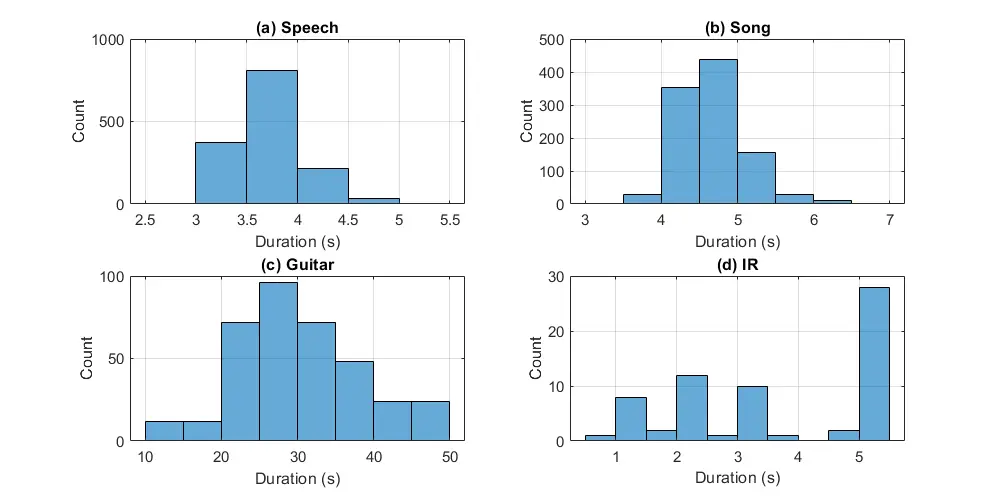
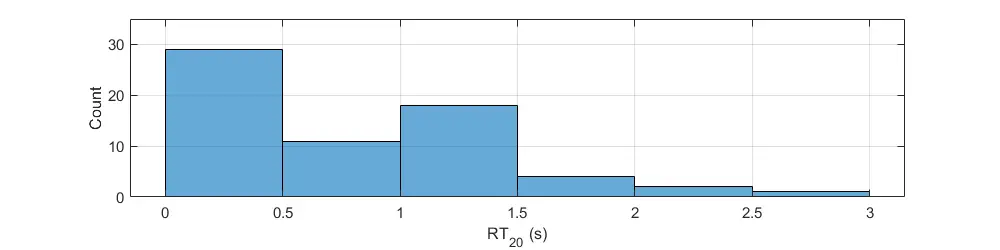

# AIRCADE: an Anechoic and IR Convolution-based Auralization Data-compilation Ensemble

 Túlio Chiodi Affiliation: School of Acoustical Engineering
Affiliation: Federal University of Santa Maria, Brazil
Email: [tulio.chiodi@eac.ufsm.br](mailto:)   

 Arthur Nicholas dos Santos Affiliation: School of Electrical and
Computer Engineering Affiliation: University of Campinas, Brazil
Email: [a264372@dac.unicamp.br](mailto:)   

 Pedro Martins Affiliation: School of Electrical and Computer
Engineering Affiliation: University of Campinas, Brazil
Email: [p137267@dac.unicamp.br ](mailto:)   

 Bruno Sanches Masiero Affiliation: School of Electrical and Computer
Engineering Affiliation: University of Campinas, Brazil
Email: [masiero@unicamp.br](mailto:)

###### Abstract

In this paper¹¹ 1 This work was partially supported by the São Paulo
Research Foundation (FAPESP), grants $`\#`$2017/08120-6 and
$`\#`$2019/22795-1., we introduce a data-compilation ensemble, primarily
intended to serve as a resource for researchers in the field of
dereverberation, particularly for data-driven approaches. It comprises
speech and song samples, together with acoustic guitar sounds, with
original annotations pertinent to emotion recognition and Music
Information Retrieval (MIR). Moreover, it includes a selection of
impulse response (IR) samples with varying Reverberation Time (RT)
values, providing a wide range of conditions for evaluation. This
data-compilation can be used together with provided Python scripts, for
generating auralized data ensembles in different sizes: tiny, small,
medium and large. Additionally, the provided metadata annotations also
allow for further analysis and investigation of the performance of
dereverberation algorithms under different conditions. All data is
licensed under Creative Commons Attribution 4.0 International License.

   

A Preprint

|     |
| --- |
|     |

*Keywords* Speech Emotion Recognition $`\cdot`$ Song Emotion Recognition
$`\cdot`$ Music Information Retrieval $`\cdot`$ Auralization $`\cdot`$
Dereverberation

## 1 Introduction

Reverberation is the persistence of sound in a space after the source
ceases to emit it. It is mainly caused by reflections of the sound waves
off the surfaces within the space and gradually dissipates over time.
Since the characteristics of the space in which reverberation occurs can
influence the duration and intensity of this phenomenon, the
Reverberation Time (RT) is considered an important aspect of room
acoustics (Beranek (2004); Lapointe (2010)).

In the context of entertainment, reverberation can affect the Human
Auditory System (HAS) in positive ways, since some degree of it can help
to enhance the perceived loudness and richness of sounds. This occurs
because the multiple reflections can create a sensation of spaciousness
and immersion, which can be aesthetically pleasing, particularly in
music. On the other hand, in the context of communications, excessive
reverberation can affect the quality and intelligibility of speech
because the multiple reflections can create a "smearing" effect that can
make it difficult to distinguish individual sounds and syllables.
Moreover, the reduction of the overall Signal-to-Noise Ratio (SNR) of a
given sound source can also mask quiet sounds, making it harder to
understand them (Gelfand (2017); Lyon (2017)).

Therefore, the effects of reverberation on the HAS can vary widely,
depending on the duration and intensity of the phenomenon, the frequency
content of the sound source, the individual characteristics of the
listener’s hearing, etc. In general, it is desirable to optimize the
amount of reverberation in a given acoustic scenario to ensure the best
possible listening experience for the intended audience. In this
situation, dereverberation is a process that can be used to reduce or
remove the effects of excessive reverberation from an audio signal. This
is typically used in situations where the audio signal has already been
recorded in a reverberant environment, and the resulting reverberation
is unwanted or detrimental to the quality of the recorded audio (Naylor
et al. (2010)).

In recent years, data-driven dereverberation methods have become
increasingly popular due to their ability to learn complex mappings
between the anechoic and reverberant signals. While showing promising
results, these methods also have a wide range of applicability,
including speech recognition, speaker verification, music production,
etc (Xu et al. (2014); Hershey et al. (2016)).

Still, an important challenge for these methods is the need for large
amounts of training data, with paired clean and reverberant audio
signals for training, which, ideally, should cover a wide range of
acoustic environments, microphone types, and speaker characteristics, to
ensure that a model will generalize well to new scenarios. Examples of
dereverberation datasets include the REVERB challenge dataset (Kinoshita
et al. (2013)), BUT Speech@FIT Reverb Database (Szöke et al. (2019)),
and VoiceBank-SLR (Fu et al. (2022)), among others.

However, most of these datasets carry some limitations, such as
narrow-band anechoic data, i.e., only speech is considered as a signal
of interest, and absence of Impulse Response (IR) data, i.e., usually
only anechoic and reverberant data are paired for supervised training.
Hence, in this paper, we introduce a new data-compilation ensemble,
primarily intended for training data-driven dereverberation models
capable of dealing with full bandwidth audio signals, e.g., speech,
song, music etc. We offer pairs of natural anechoic and IR data,
compiled from datasets licensed under [Creative Commons Attribution 4.0
International
License](https://creativecommons.org/licenses/by/4.0/legalcode),
together with Python scripts for convolution-based auralization, under
the hypothesis that these ensembles could serve as better training and
evaluation tools for such algorithms.

The remainder of this paper is organized as follows: Section 2 details
the methodology used for selecting the anechoic and IR data, and then
synthesizing the auralized data. Section 3 describes the resulting
auralized data and their annotations. Finally, Section 4 presents an
overall discussion of our obtained results, together with some pertinent
considerations to conclude our study.

## 2 Methods

To simulate or recreate an acoustic environment, such as a concert hall
or a recording studio, using computer algorithms and specialized
software, one can resort to a well known technique called auralization.
It involves measurements or simulations of the space’s physical
properties to mimic its acoustic characteristics. To proceed
accordingly, there are various techniques available, such as acoustic
ray tracing and convolution-based auralization (Kleiner et al. (1993)).

From a signal processing point of view, the convolution is a
mathematical operation that describes the interaction between two
signals. In the context of auralization, convolution can be used to
simulate the effects of an acoustic environment on an audio signal. The
basic idea is to convolve an audio signal with an IR that describes the
acoustic characteristics of a room or space. The resultant output
produces a new signal that represents the original audio signal after it
has been modified by the acoustic characteristics of the room (Allen and
Berkley (1979); Oppenheim et al. (1997)).

In the context of data-driven dereverberation methods, the choice for
either natural, synthetic or joint datasets, i.e., those obtained by
processing combinations of natural recordings with synthetic sounds,
directly impacts in-the-wild applicability. This occurs because, when
models are trained on mostly synthetic data, they usually don’t
generalize well for real-world scenarios. However, the majority of
recent studies use joint combinations, e.g., by convolving anechoic data
with naturally recorded or synthesized IR data etc, perhaps because it
would be too cumbersome to naturally acquire all the necessary data (dos
Santos et al. (2022)). Hence our dataset attempts to reach a balance
between these features, compiling real anechoic and IR data, and then
synthetically producing auralized data ensembles by means of
convolution.

### 2.1 Anechoic data

Trying to cover a wide range of full-bandwidth audio signals, we chose
to compile signals of interest from three different categories: speech,
song, and musical instruments.

Since RAVDESS (Livingstone and Russo (2018)) is a well-known dataset
with subsets of emotional speech and song, it was chosen to cover the
first two aforementioned categories. Its speech-only portion comprises
$`1,440`$ samples performed by $`24`$ actors ($`12`$ male and $`12`$
female), vocalizing $`2`$ lexically-matched statements ("kids are
talking by the door" and "dogs are sitting by the door") in a "neutral"
North American accent. Each expression is pronounced at $`2`$ different
levels of emotional intensity (normal and strong), with an additional
neutral expression, resulting in a total amount of $`60`$ trials per
actor. Speech emotions include calm, happy, sad, angry, fearful,
surprise, and disgust. Its song-only portion is quite similar and
comprises $`1,012`$ samples performed by $`23`$ actors, singing the same
$`2`$ lexically-matched statements. Song emotions include only neutral,
calm, happy, sad, angry, and fearful expressions. The original sample
rate is fixed at 48 kHz, and Figures 1 (a) and (b) illustrate histograms
with the original duration of files in each RAVDESS subset that we used.

Since the acoustic guitar is a popular musical instrument, for a variety
of reasons, including its ability to produce polyphonic sound and its
musical versatility, we chose to use a subset from GuitarSet (Xi et al.
(2018)), referred to as audio_mono-mic. It comprises $`360`$ samples
performed by $`6`$ musicians, playing $`30`$ twelve to sixteen bar
excerpts from lead-sheets in a variety of keys, tempos, and musical
genres. Recording was performed using a Neumann U87 condenser
microphone, placed at approximately 30 cm in front of the 18th fret of
the guitar. The original sample rate is fixed at 44.1 kHz, and Figure 1
(c) illustrates a histogram with the original duration of files in this
GuitarSet subset.

#### 2.1.1 Anechoic data processing

Considering the great difference between the duration of signals in
RAVDESS and GuitarSet, we chose to split the samples in GuitarSet into
segments of smaller duration, fixed at 5 s, resulting in $`2,004`$
different samples. Another reason behind this decision is that when
choosing the length of anechoic data, it is important to strike a
balance between the computational cost of the convolution operation and
the length of the segments. If they are too short, the resulting audio
signals may not capture the full extent of the room’s acoustics, and if
the segments are too long, the convolution operation may become too
computationally intensive.

Moreover, since the sample rates of RAVDESS and GuitarSet are different,
we also chose to up-sample the GuitarSet segments to 48 kHz, thus
standardizing this value for all files in our dataset.

### 2.2 IR data

IR data was curated from the [Open Acoustic Impulse Response (Open AIR)
Library](https://www.openair.hosted.york.ac.uk/), which is an online
database of Acoustic Impulse Response (AIR) data. Since the original
metadata in this database provides information about space category, IR
duration, etc., the samples were chosen in order to have a balance
between a selected variety of open and enclosed spaces, with IRs in the
range of a few milliseconds up to 5 s. Figure 1 (d) illustrates a
histogram with the original duration of the selected IR data.
Altogether, $`65`$ IRs were chosen.

Figure 1: Original duration of files in the (a) speech, (b) song, (c)
guitar, and (d) IR subsets of our compilation.

#### 2.2.1 IR data processing

The selected IR data was found in a variety of formats, e.g., B-format,
MS Stereo, mono, etc. And at sample rates varying from 44.1 kHz to
96 kHz. Since all the anechoic data was compiled in mono format at
48 kHz, the selected IR data was first converted to mono, then
normalized to prevent files from clipping, and finally, each IR was
either down- or up-sampled to 48 kHz.

## 3 Results

The processed anechoic and IR data is hosted at
[Zenodo](https://zenodo.org/record/7818761#.ZDc1snbMJPY), with an
approximate total file size of 1.3 GB. For simplicity, all samples in
our data-compilation were renamed, e.g., $`guitar\_0000`$,
$`rir\_0000`$, $`song\_0000`$, $`speech\_0000`$, and so on. To
synthesize different versions of the auralized data ensemble, the reader
is referred to [GitHub](https://github.com/TulioChiodi/AIRCADE), where
Python scripts are available for downloading the base data-compilation
and synthesizing a chosen version of the auralized data ensemble. Table
1 illustrates the differences between all versions, detailing the number
of song, speech, guitar, IR and auralized samples in each one, together
with their respective total file size and duration.

|                   |        |         |          |          |
| ----------------- | ------ | ------- | -------- | -------- |
|                   | Tiny   | Small   | Medium   | Large    |
| Song samples      | 100    | 500     | 1,012    | 1,012    |
| Speech samples    | 100    | 500     | 1,012    | 1,440    |
| Guitar samples    | 100    | 500     | 1,012    | 2,004    |
| IR samples        | 5      | 9       | 33       | 65       |
| Auralized samples | 1,500  | 13,500  | 100,188  | 289,640  |
| Total duration    | 3.2 h  | 30.41 h | 221.77 h | 658.08 h |
| Total file size   | 1.1 GB | 10.5 GB | 76.6 GB  | 227.5 GB |

Table 1: Number of anechoic, IR and resultant auralized data samples,
together with their respective total duration and file size for each
ensemble version.

### 3.1 Anechoic data annotation

Since the ancehoic data in our compilation is comprised of speech and
song samples with original annotations pertinent to emotion recognition,
together with acoustic guitar sounds with original annotations pertinent
to Music Information Retrieval (MIR), we provide metadata which can be
used to trace back each sample to its original annotations. This is done
because we do not intend for this dataset to be limited to
dereverberation tasks only, but also to be used for applications such as
emotion recognition and MIR in more challenging scenarios, i.e., in the
presence of convolutive noise.

### 3.2 IR data annotation

Since the computational effort in dereverberation tasks is highly
intertwined with the RT values of IR data, $`RT_{20}`$ values were
extracted from each IR sample using  [ITA
Toolbox](https://www.ita-toolbox.org/). Figure 2 illustrates a histogram
with the extracted $`RT_{20}`$ values from the selected the IR data.

Figure 2: Extracted $`RT_{20}`$ values from the selected the IR data.

## 4 Discussion and Conclusion

Overall, the data-compilation ensemble presented in this work provides a
diverse and comprehensive set of acoustic scenes for use in
dereverberation tasks, as well as some other audio signal processing
applications, such as emotion recognition and MIR. By combining
different types of signals of interest, including speech, song, and
acoustic guitar sounds, with a variety of IRs, we provide a challenging
dataset for researchers working on dereverberation and related fields.

The dataset is available in different sizes, from a tiny version with
limited data, to a large version with almost $`300,000`$ samples,
allowing users to choose the most suitable version for their specific
research needs. The dataset also includes metadata that can be used to
trace back each sample to its original annotations, facilitating the use
of the dataset for tasks such as emotion recognition and MIR.

We hope that this dataset will be useful for researchers working on
dereverberation and related fields, and we encourage its use in future
research. We also believe that the diversity and variability of the
dataset can facilitate the development of more robust and generalizable
algorithms for dereverberation and other audio signal processing tasks.

## References

- Beranek \[2004\] Leo Leroy Beranek. _Concert halls and opera houses:
  music, acoustics, and architecture_, volume 2. Springer, 2004.
- Lapointe \[2010\] Yannick Lapointe. Understanding and crafting the
  mix: The art of recording. _Intersections_, 31(1):209, 2010.
- Gelfand \[2017\] Stanley A Gelfand. _Hearing: An introduction to
  psychological and physiological acoustics_. CRC Press, 2017.
- Lyon \[2017\] Richard F Lyon. _Human and machine hearing: extracting
  meaning from sound_. Cambridge University Press, 2017.
- Naylor et al. \[2010\] Patrick A Naylor, Nikolay D Gaubitch, et al.
  _Speech dereverberation_, volume 2. Springer, 2010.
- Xu et al. \[2014\] Yong Xu, Jun Du, Li-Rong Dai, and Chin-Hui Lee. A
  regression approach to speech enhancement based on deep neural
  networks. _IEEE/ACM Transactions on Audio, Speech, and Language
  Processing_, 23(1):7–19, 2014.
- Hershey et al. \[2016\] John R Hershey, Zhuo Chen, Jonathan Le Roux,
  and Shinji Watanabe. Deep clustering: Discriminative embeddings for
  segmentation and separation. In _2016 IEEE international conference on
  acoustics, speech and signal processing (ICASSP)_, pages 31–35.
  IEEE, 2016.
- Kinoshita et al. \[2013\] Keisuke Kinoshita, Marc Delcroix, Takuya
  Yoshioka, Tomohiro Nakatani, Emanuel Habets, Reinhold Haeb-Umbach,
  Volker Leutnant, Armin Sehr, Walter Kellermann, Roland Maas, et al.
  The reverb challenge: A common evaluation framework for
  dereverberation and recognition of reverberant speech. In _2013 IEEE
  Workshop on Applications of Signal Processing to Audio and Acoustics_,
  pages 1–4. IEEE, 2013.
- Szöke et al. \[2019\] Igor Szöke, Miroslav Skácel, Ladislav Mošner,
  Jakub Paliesek, and Jan Černockỳ. Building and evaluation of a real
  room impulse response dataset. _IEEE Journal of Selected Topics in
  Signal Processing_, 13(4):863–876, 2019.
- Fu et al. \[2022\] Szu-Wei Fu, Cheng Yu, Kuo-Hsuan Hung, Mirco
  Ravanelli, and Yu Tsao. Metricgan-u: Unsupervised speech
  enhancement/dereverberation based only on noisy/reverberated speech.
  In _ICASSP 2022-2022 IEEE International Conference on Acoustics,
  Speech and Signal Processing (ICASSP)_, pages 7412–7416. IEEE, 2022.
- Kleiner et al. \[1993\] Mendel Kleiner, Bengt-Inge Dalenbäck, and
  Peter Svensson. Auralization-an overview. _Journal of the Audio
  Engineering Society_, 41(11):861–875, 1993.
- Allen and Berkley \[1979\] Jont B Allen and David A Berkley. Image
  method for efficiently simulating small-room acoustics. _The Journal
  of the Acoustical Society of America_, 65(4):943–950, 1979.
- Oppenheim et al. \[1997\] Alan V Oppenheim, Alan S Willsky, Syed Hamid
  Nawab, and Jian-Jiun Ding. _Signals and systems_, volume 2. Prentice
  hall Upper Saddle River, NJ, 1997.
- dos Santos et al. \[2022\] Arthur dos Santos, Pedro de Oliveira, and
  Bruno Masiero. A retrospective on multichannel speech and audio
  enhancement using machine and deep learning techniques. In
  _Proceedings of the 24th International Congress on Acoustics_, pages
  173–184, Gyeongju, South Korea, October 2022.
- Livingstone and Russo \[2018\] Steven R Livingstone and Frank A Russo.
  The ryerson audio-visual database of emotional speech and song
  (ravdess): A dynamic, multimodal set of facial and vocal expressions
  in north american english. _PloS one_, 13(5):e0196391, 2018.
- Xi et al. \[2018\] Qingyang Xi, Rachel M Bittner, Johan Pauwels,
  Xuzhou Ye, and Juan Pablo Bello. Guitarset: A dataset for guitar
  transcription. In _ISMIR_, pages 453–460, 2018.
