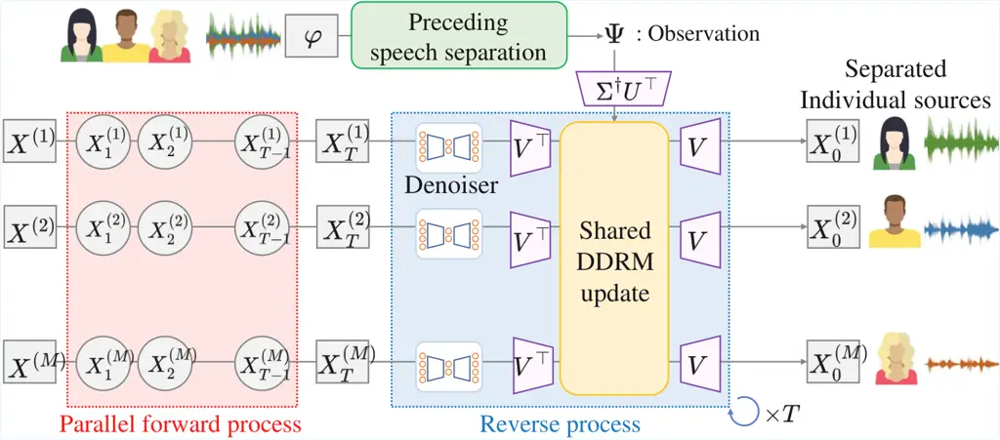
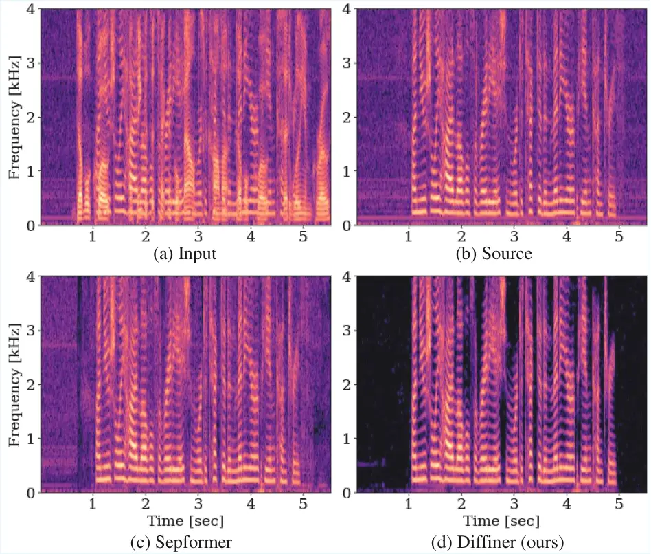
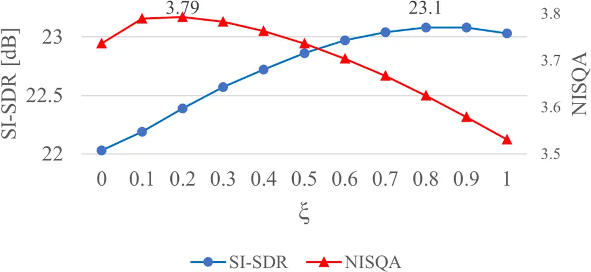
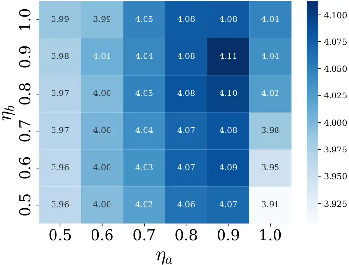
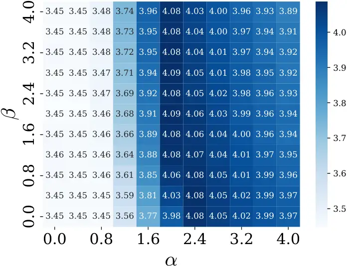
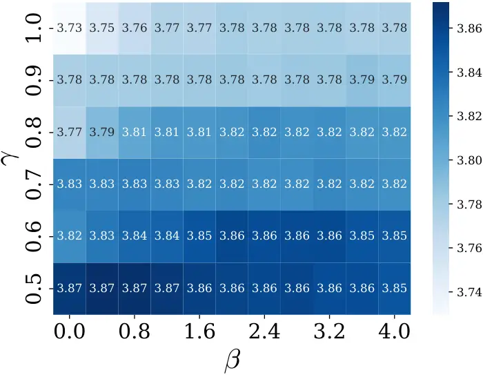
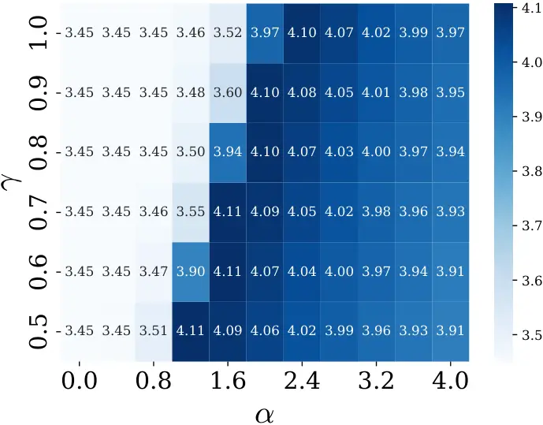
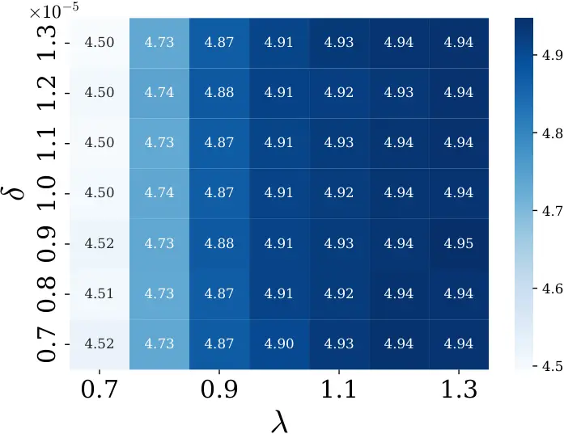
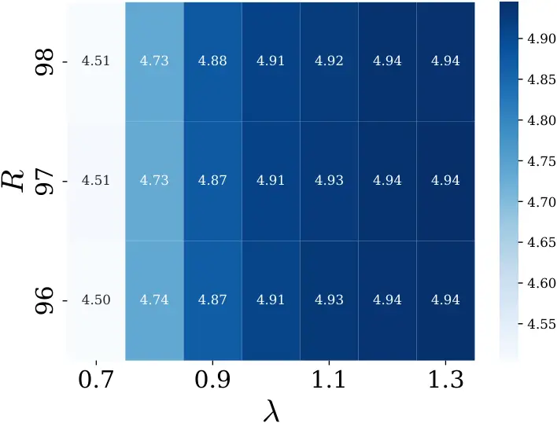
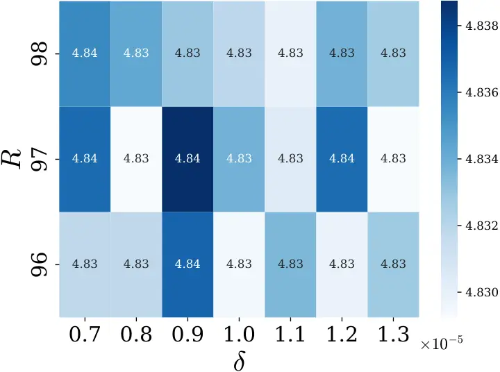

# Diffusion-based Signal Refiner for Speech Enhancement and SeparationThanks: ^(\*)Equal contribution.Thanks: Masato Hirano and Shusuke Takahashi are with Sony Group Corporation. Thanks: Ryosuke Sawata, Naoki Murata, and Yuki Mitsufuji are with Sony AI.

Masato Hirano^(\*)    Ryosuke Sawata^(\*)    Naoki Murata Affiliation:
Shusuke Takahashi, Yuki Mitsufuji,

###### Abstract

Although recent speech processing technologies have achieved significant
improvements in objective metrics, there still remains a gap in human
perceptual quality. This paper proposes _Diffiner_, a novel solution
that utilizes the powerful generative capability of diffusion models’
prior distributions to address this fundamental issue. Diffiner
leverages the probabilistic generative framework of diffusion models and
learns natural prior distributions of clean speech to convert outputs
from existing speech processing systems into perceptually natural
high-quality audio. In contrast to conventional deterministic
approaches, our method simultaneously analyzes both the original
degraded speech and the pre-processed speech to accurately identify
unnatural artifacts introduced during processing. Then, through the
iterative sampling process of the diffusion model, these degraded
portions are replaced with perceptually natural and high-quality speech
segments. Experimental results indicate that Diffiner can recover a
clearer harmonic structure of speech, which is shown to result in
improved perceptual quality w.r.t. several metrics as well as in a human
listening test. This highlights Diffiner’s efficacy as a versatile
post-processor for enhancing existing speech processing pipelines.

###### Index Terms:

speech enhancement, speech separation, diffusion models, linear inverse
problem

## I Introduction

Speech recordings in real environments contain various acoustic
degradations such as background noise, reverberation, and other human
speech that interferes with recording the target. The degradations
affect both the intelligibility of the target speech and various
downstream tasks, e.g., speech recognition \[1\], speaker identification
\[2\], and diarization \[3\]. Speech enhancement (SE) and speech
separation (SS) are two fundamental acoustic signal processing tasks
that remove the above acoustic degradations. Since improvements to their
performance can positively affect the downstream audio tasks mentioned
above, they have been extensively studied as front-end modules \[4, 5\].

Initial studies on SE and SS explored statistical approaches such as
Wiener filtering, maximum likelihood estimation, and Bayesian estimation
\[6\]. More recently, a number of deep neural network (DNN)-based
approaches have been pursued \[7, 8, 9, 10, 11, 12, 13, 14, 15, 16\].
Compared to the current non-DNN-based methods, these DNN-based
approaches dramatically improve certain reference-based metrics, e.g.,
signal-to-distortion ratio (SDR) \[17\], perceptual evaluation of speech
quality (PESQ) \[18\], and short-time objective intelligibility (STOI)
\[19\], that require the ground-truth signal. In other words, these
DNN-based methods can effectively suppress the noise level and thereby
improve the above metrics because, since almost all conventional
DNN-based methods are based on the supervised learning, the target
signals are close to the corresponding ground-truth signals, i.e.,
references. However, although the level of input noise is greatly
reduced, perceptually unnatural distortions originating from the DNN’s
non-linear signal processing tend to be included in the results. This
may adversely affect the reference-free metrics, including human
listening, which do not require the corresponding ground-truth input as
a reference.

To overcome the above problem, we focus on deep generative models such
as generative adversarial networks (GANs) \[20\], variational
auto-encoders (VAEs) \[21\], and diffusion models \[22\]. This is
because the degree of noise suppression through DNN-based audio
processing is so strong that components which should be left in the
processed speech are removed. Namely, it is considered that removing the
input noise and recovering the missed speech components may be an
effective solution to the above problem. In fact, some researchers have
hypothesized that synthesizing conditioned speech would improve
perceptual quality and have used a vocoder for the SE task to
generatively recover clean speech \[23, 24, 25\]. However, building a
generative model requires a huge amount of training data. Furthermore,
if a generative model-based vocoder is used as post-processing after
SE/SS, the training dataset should include as many signals pre-processed
by the target SE/SS model as possible. Hence, training such deep
generative model-based vocoders with the pre-processed noisy speech
tends to be more laborious than in the case of using the SE/SS model
only; the vocoders trained on an insufficient dataset often degrade
perceptual quality. Therefore, a new scheme, which can improve the
perceptual speech quality without the laborious data collection and
training, has been desired.

Motivated by this background, we previously proposed a diffusion-based
speech refinement technique for SE, named Diffiner \[26\]. Diffiner is
based on denoising diffusion restoration model (DDRM) \[27\], which can
provide effective diffusion updates for various degradation settings
without retraining the model; thus, Diffiner can generatively improve
the input signal without specialized retraining no matter what kind of
preceding SE model is used. As such, Diffiner is a versatile
post-processor for any of the existing SE methods. Our previous
experimental results showed that the parts generated by Diffiner
actually improve reference-free metrics related to listening perceptual
quality.

However, there are still some concerns that were not addressed in our
prior work \[26\], including (i) the effectiveness of Diffiner in not
only removing background noise but also separating speech, (ii) its
scalability to a large-scale data regime, and (iii) the need to confirm
its validity by conducting actual human listening tests. Hence, we
address these remaining items in this paper. Regarding (i), we found
that the original formulation of Diffiner did not work well at SS. This
is because the input signal in the SS task consists of a mixture of
speech from more than two individuals, and thus the assumed noise
distribution does not follow the independent Gaussian originally assumed
in the definition of DDRM. Therefore, we newly extend Diffiner so that
it can deal with speech signals pre-processed by not only SE but also
SS. Furthermore, to resolve (ii), we retrain Diffiner by using a larger
dataset than the original one and assess its validity in experiments. To
address (iii), we conduct not only quantitative evaluations but also a
subjective listening test.

In Sec. II of this paper, we provide a brief review of related work,
with a particular focus on the differences between Diffiner and recent
diffusion-based SE and SS methods. Section III explains the core
components of our method, i.e., diffusion-based generative models and
DDRM. Section IV derives Diffiner for both SE and SS. In Sec. V, we
demonstrate the effectiveness of Diffiner through qualitative,
quantitative, and human listening evaluations. We conclude in Sec. VI
with a summary and mention of future work.

## II Related work

For the sake of the following discussion, we first clarify the
difference between SE and SS. SE aims to suppress _non-speech noise_,
while SS targets the extraction of the desired speech from _mixtures
composed of multiple speakers_.

### II-A Non-DNN-based methods

Before DNN-based methods appeared, researchers studied classical signal
processing methods for SE and SS \[6, 28, 29, 30\]. Almost all of them
have been already replaced with DNN-based SE and SS methods, as
described in the subsequent section. However, it is worth noting that
one of them, _Wiener filter_ \[28\], is strongly related to Diffiner in
that the optimal coefficients at each step of the reverse process in
Diffiner are equivalent to those of Wiener filter. Specifically,
Diffiner filters the degraded speech signals so that the parts highly
related to the target speech remain and the non-related parts are
replaced with plausible ones generated by Diffiner. The processing by
Diffiner can thus be regarded as something like a _generative Wiener
filter_, as the vanilla Wiener filter was also designed so that the
target parts remain and the non-related parts are suppressed based on
the prior signal-to-noise ratio (SNR).

Therefore, in contrast to Wiener filter, Diffiner can not only suppress
non-reliable parts but also replace them with high-fidelity speech
components based on prior information. More details regarding Diffiner
will be described in Sec. IV.

### II-B DNN-based methods

The DNN-based methods appearing in recent years have attempted to
overcome the above limitation of classical SS and boost the performance
of SE and SS.

In the field of SE, simply introducing a DNN significantly improved the
degree of noise suppression. For example, Luo et al. showed that
utilizing the learnable convolution filters of convolutional neural
networks (CNNs) can achieve better encoders and decoders than those that
use short-time Fourier transform (STFT) and inverse STFT (ISTFT) \[13\].
Furthermore, it has been reported that the architecture of recurrent
neural networks (RNNs) is suitable for real-time DNN-based speech
processing \[31, 32, 33, 34\].

In the field of SS, Yu et al. proposed permutation invariant training
(PIT) for the task of source separation \[35\], and Hershey et al.
proposed deep clustering (DC) \[16\]. PIT considers all possible
correspondences between the output of a DNN and the speakers included in
the input mixture, whereas DC estimates embedded features such that they
are grouped into the same class if they come from the same person.

In these ways, DNN-based SE and SS have exhibited dramatically improved
performances over conventional methods.

### II-C Deep generative model-based methods

As mentioned in Sec. I, recent DNN-based methods have outperformed
classical non-DNN-based ones by sufficiently suppressing the noise mixed
in the input. However, such methods often remove parts of the target
speech when the spectrogram contains overlapping noise. The results
sound clear but may seem unnatural due to distortion caused by a lack of
necessary components in the target spectrogram.

To deal with this issue, some approaches have tried to use deep
generative models such as GAN and VAE to recover the missing components
of human speech \[23, 24\]. In this context, for the purpose of speech
refinement, Shi et al. and Liu et al. utilized deep generative
model-based vocoders, i.e., GAN or VAE, to recover the human speech
erased by the preceding SE or SS models.

More recently, researchers have focused on utilizing diffusion models
for generative SE and SS. As far as we know, there are roughly two ways
to do this: i) a unified SE or SS using a conditioned diffusion-based
model \[36, 37, 38\], and ii) two-stage processing involving enhancement
(or separation) and a subsequent diffusion-based vocoder \[39, 25\].
Regarding i), universal SE with score-based diffusion (UNIVERSE) \[36\],
score-based generative model for SE (SGMSE) \[37\], and diffusion-based
generative speech source separation (DiffSep) \[38\] have been proposed
to conduct conditioned generative SE or SS. Regarding ii),
diffusion-based stochastic regeneration model (StoRM) \[39\] has been
proposed for two-stage SE with a post-diffusion vocoder. Lutati et al.
proposed a framework that effectively uses a pretrained speech diffusion
model as a post-refiner on the speech separation results \[25\].

Other researchers have tried to accelerate diffusion-based SE and SS
\[40, 41, 42\]. The reasoning is that diffusion-based SE and SS often
have much higher inference computational costs than other SE and SS
models—although they have improved the conventional performance
dramatically, as shown above—and this might be disadvantageous in cases
of a downstream task that requires real-time responses, e.g.,
tele-communication and automatic speech recognition (ASR) systems. In
the field of SE and SS, there are two main methods to accelerate
diffusion-based models: decreasing the number of calculation iterations
\[43, 40\] and finding an optimal alternative path instead of the
forward/reverse process \[41, 42\]. Consistency trajectory models (CTMs)
\[44\] enable a diffusion-based model to jump between arbitrary time
steps in the reverse process, and thus a model based on CTM can ideally
obtain output in just one step. By taking advantage of this feature of
CTM, SoundCTM \[40\] achieved almost the same level of performance as
the original model on a text-to-sound task, even though its calculation
was performed in just one step. Furthermore, Li et al. decreased the
multiple iterations of the forward/reverse process by instead utilizing
the score derived from a discriminative model \[43\]. On the other hand,
Schrödinger bridge (SB) \[45\] is a method to seek another optimal path
between probability distributions. Jukić et al. proposed a generative SE
model based on SB, called SB-based SE \[41\], and Nishigori et al. used
a hybrid of CTM and SB for the SE task to create Schrödinger bridge
consistency trajectory models (SBCTM) \[42\]. SBCTM achieved a roughly
$`16\times`$ improvement in RTF and allowed a controllable trade-off
between quality and calculation cost by adjusting the number of steps.

In addition, there is another concern w.r.t. data collection when
training the conditioned model. Specifically, building a unified SE or
SS model based on a deep generative model conditioned by noisy speech
tends to require a huge amount of both noisy and clean speech compared
to training a conventional DNN-based model \[46\]. This often makes
developing a high-performance model difficult, and the perceptual
quality may be degraded if the dataset used to train the model is not
large enough. On the other hand, two-stage processing, i.e., performing
conventional SE or SS first and generative refinement second, does not
spoil the performance of the first stage because these processes are
independent, and thus we can adaptively decide to use the post-refiner
depending on the downstream task, i.e., the tradeoff between
performance, inference speed, and data collection cost. Hence all one
has to do is build a versatile and effective second stage, i.e., a
generative model-based speech refiner.

In fact, some researchers have proposed such diffusion-based speech
refiners \[23, 24, 25, 39\]. For example, Lemercier et al. proposed an
SE method that uses a stochastic regeneration approach, StoRM \[39\], in
which the diffusion model’s forward and backward processes are applied
to the output of the model preceding it. However, since the preceding
model and the subsequent diffusion-based refiner in StoRM are
simultaneously trained in an end-to-end (E2E) manner, StoRM needs to
retrain the diffusion model whenever the preceding model is changed. For
the same reason, its refiner cannot be applied to any other method
preceding it except the one used for E2E training. Lutati et al. \[25\]
proposed _DiffWave_ \[47\] which is a two-stage method combining an SS
method with a diffusion-based post-speech refiner. The authors exploited
the versatility of DiffWave and showed that it improved the performance
scores of some of the SS methods preceding the DiffWave-based
post-refiner. Their approach is similar to our own idea of a two-stage
speech processing consisting of a preceding speech processor and
_Diffiner_. However, the overall performance of their method tended to
be affected by leftover noise from the preceding speech processor since
the post speech processor, i.e., DiffWave, was trained on only clean
speech, and it assumes that there is no noise in the signal to be fed
into it. Namely, the leftover noise from the preceding speech processor
degrades the performance of DiffWave. Therefore, the aforementioned
refiners need to be retrained depending on the type of noise left over
from the preceding SE or SS module. This means that the aforementioned
tendency of deep generative models requiring a huge amount of training
data remains unresolved.

To overcome this problem, we previously proposed a DDRM-based speech
refiner, Diffiner \[26\], for SE. Once Diffiner is trained on only clean
speech, it can be applied to any existing SE without specialized
retraining. This is because, unlike DiffWave, the DDRM-based speech
refiner can adaptively consider the distribution of the leftover noise
mixed from the preceding method. To confirm this, we briefly conducted a
preliminary experiment comparing DiffWave and DDRM used in Diffiner by
inputting many signals that have diverse signal-to-noise ratios (SNRs).

| SNR \[dB\]         | Source | DiffWave \[25\] | DDRM in Diffiner (ours) |
| ------------------ | ------ | --------------- | ----------------------- |
| $`\infty`$ (clean) | 4.379  | 4.374           | 4.386                   |
| 20                 | 2.915  | 3.036           | 4.117                   |
| 15                 | 2.295  | 2.736           | 3.995                   |
| 10                 | 1.761  | 2.091           | 3.832                   |
| 5                  | 1.335  | 1.693           | 3.612                   |

Table I: NISQA results at different Gaussian noise levels. Higher values
are better. DiffWave and DDRM were trained on LJSpeech \[48\] which
consists of only clean speech.

The results are listed in Table I (note that the NISQA metric is
described in Sec. V). As shown here, the scores of DiffWave decreased as
the SNR decreased, whereas the DDRM used in Diffiner maintained good
scores regardless of the SNR value. We therefore incorporated the
DDRM-based speech refiner in Diffiner and confirmed that it works well
no matter what kind of SE model is used \[26\]. However, its validity
was confirmed only on SE, and thus we newly propose a further extension
of Diffiner for both SE and SS in the current work.

Compared to the related methods mentioned above, the contributions of
Diffiner are threefold: a) training using clean speech only (i.e., noisy
speeches are unnecessary), b) high modularity, where Diffiner can be
detached and then applied to any other existing SE and SS models as a
post-refiner, and c) preceding model-agnostic versatility, wherein
Diffiner does not require specialized retraining regardless of what
model of SE or SS is used (i.e., Diffiner trained on only clean speech
can refine the results of any SE and SS methods preceding Diffiner).

## III Background

Let us revisit the mathematical formulation of DDPM \[22\] and DDRM
\[27\]. DDRM is a method for conditional generation based on diffusion
models. It leverages a pre-trained DDPM as a prior distribution and
generates data that serves as a solution to a linear inverse problem
defined by a linear degradation model. Below, we review the linear
inverse problem and the DDPM. Then, we explain the conditional
generation using the DDRM.

### III-A Linear inverse problem

The linear inverse problem involves estimating an unknown signal
$`\bm{x}_{0}\in\mathbb{R}^{d_{x}}`$ given conditioning information
$`\bm{y}\in\mathbb{R}^{d_{y}}`$. The relationship between $`\bm{x}_{0}`$
and $`\bm{y}`$ is defined by the following degradation model:

```math
\displaystyle\bm{y}=\bm{Hx}_{0}+\bm{z}, \tag{1}
```

where $`\bm{H}\in\mathbb{R}^{d_{y}\times d_{x}}`$ is a known degradation
matrix, and $`\bm{z}\sim{\cal N}(\bm{0},\sigma_{\bm{y}}^{2}\bm{I})`$ is
i.i.d. additive Gaussian noise of known variance
$`\sigma_{\bm{y}}^{2}`$.

### III-B Learning data distribution by using DDPM

DDPM \[22\] is a deep generative model for learning the model
distributions $`p_{\theta}(\bm{x})`$ of data $`\bm{x}`$, which
approximate an unknown data distribution $`q(\bm{x})`$. In the DDPM,
data are produced in a Markov chain manner, starting from Gaussian noise
followed by iterative denoising into the desired data. Let
$`\bm{x}_{0}`$ be the target sample and
$`\bm{x}_{T}\rightarrow\bm{x}_{T-1}\rightarrow\cdots\rightarrow\bm{x}_{0}`$
be the backward process that progressively denoises toward
$`\bm{x}_{0}`$. The model distribution $`p_{\theta}(\bm{x}_{0})`$ is
defined as:

```math
\displaystyle p_{\theta}(\bm{x}_{0})=\int p_{\theta}(\bm{x}_{0:T})\mathrm{d}\bm{x}_{1:T}
```

```math
\displaystyle\text{where}\ p_{\theta}(\bm{x}_{0:T})\equiv p_{\theta}(\bm{x}_{T})\prod_{t=0}^{T-1}p_{\theta}(\bm{x}_{t}|\bm{x}_{t+1}). \tag{2}
```

The parameters $`\theta`$ are learned by optimizing a variational lower
bound with inference distribution $`q(\bm{x}_{1:T}|\bm{x}_{0})`$, which
is decomposed into a Markov chain of Gaussian transitions:

```math
\displaystyle q(\bm{x}_{1:T}|\bm{x}_{0})\equiv\prod_{t=0}^{T-1}q(\bm{x}_{t+1}|\bm{x}_{t}),
```

```math
\displaystyle q(\bm{x}_{t+1}|\bm{x}_{t})\equiv{\cal N}\left(\bm{x}_{t},\left(\sigma^{2}_{t+1}-\sigma^{2}_{t}\right)\bm{I}\right), \tag{3}
```

where $`\sigma_{1},\sigma_{2},\ldots,\sigma_{T}\in(0,\infty]`$ is an
increasing parameter. This is called a forward process, which is
typically fixed during training, while $`p_{\theta}(\bm{x}_{0:T})`$ is a
generative process that approximates the reverse process
$`q(\bm{x}_{t}|\bm{x}_{t+1})`$. By marginalizing the forward process, we
obtain
$`q(\bm{x}_{t}|\bm{x}_{0})={\cal N}(\bm{x}_{t};\ \bm{x}_{0},\sigma^{2}_{t}\bm{I})`$,
which allows sampling as

```math
\displaystyle\bm{x}_{t} \displaystyle=\bm{x}_{0}+\sigma_{t}\epsilon_{t}\>\>\mbox{s.t.}\>\>\epsilon_{t}\sim{\cal N}(\bm{0},\bm{I}). \tag{4}
```

In practice, modeling all conditionals as Gaussian distributions leads
to the training objective:

```math
\displaystyle\sum_{t=1}^{T}\gamma_{t}\mathbb{E}_{(\bm{x}_{0},\bm{x}_{t})\sim q(\bm{x}_{0})q(\bm{x}_{t}|\bm{x}_{0})}\left[\|\bm{x}_{0}-f_{\theta}(\bm{x}_{t},t)\|_{2}^{2}\right], \tag{5}
```

where $`f_{\theta}`$ is a function for estimating $`\bm{x}_{0}`$ and
$`\gamma_{1:T}`$ are positive coefficients depending on the forward
process $`q(\bm{x}_{1:T}|\bm{x}_{0})`$.

### III-C Conditional generation with DDRM

The DDRM \[27\] is a diffusion-based conditional sampling method with a
Markov chain structure conditioned on $`\bm{y}`$, where the joint
distribution is defined as

```math
\displaystyle p_{\theta}(\bm{x}_{0:T}|\bm{y})=p_{\theta}(\bm{x}_{T}|\bm{y})\prod_{t=0}^{T-1}p_{\theta}(\bm{x}_{t}|\bm{x}_{t+1},\bm{y}). \tag{6}
```

The likelihood $`p(\bm{y}|\bm{x}_{0})`$ is characterized as a linear
inverse problem with a known degradation matrix $`\bm{H}`$. Here, we
consider a variational distribution conditioned on $`\bm{y}`$ as

```math
\displaystyle q(\bm{x}_{1:T}|\bm{x}_{0},\bm{y})=q(\bm{x}_{T}|\bm{x}_{0},\bm{y})\prod_{t=0}^{T-1}q(\bm{x}_{t}|\bm{x}_{t+1},\bm{x}_{0},\bm{y}), \tag{7}
```

where the corresponding variational lower bound is defined as

```math
\displaystyle\max_{\theta}\mathbb{E}_{q(\bm{x}_{0}),\,q(\bm{y}|\bm{x}_{0})}[\log p_{\theta}(\bm{x}_{0}|\bm{y})]
```

```math
\displaystyle\geq\max_{\theta}\mathbb{E}_{\begin{subarray}{c}q(\bm{x}_{0}),\,q(\bm{y}|\bm{x}_{0}),\\
q(\bm{x}_{1:T}|\bm{x}_{0},\bm{y})\end{subarray}}\big[\log p_{\theta}(\bm{x}_{0:T}|\bm{y})-\log q(\bm{x}_{1:T}|\bm{x}_{0},\bm{y})\big]. \tag{8}
```

The key point of the DDRM is that, given the above conditional forward
process, the variational distribution $`q`$ is constructed such that
$`q(\bm{x}_{t}|\bm{x}_{0})={\cal N}(\bm{x}_{0},\sigma_{t}^{2}\bm{I})`$
when the process is marginalized over $`\bm{x}_{t^{\prime}}`$, for all
$`t^{\prime}>t`$ and $`\bm{y}`$. The marginalized distribution has the
same form as in the DDPM; thus, in the DDRM, we can use the pretrained
DDPM for any linear inverse problem with a theoretical guarantee of it
having the same variational lower bound as the DDPM (see the derivations
in \[27\]).

The DDRM is updated in the spectral space of the singular value
decomposition (SVD) of $`\bm{H}=\bm{U\Sigma V}^{\top}`$, where
$`\bm{U}\in\mathbb{R}^{d_{U}\times d_{U}},\ \bm{V}\in\mathbb{R}^{d_{V}\times d_{V}}`$
are orthogonal matrices and
$`\bm{\Sigma}\in\mathbb{R}^{d_{U}\times d_{V}}`$ is a rectangular matrix
containing the singular values
$`s_{1}\geq s_{2}\geq\cdots\geq s_{d_{V}}`$ of $`\bm{H}`$ on its main
diagonal. To simplify the notation in the spectral space, let
$`\bar{\bm{x}}_{t}=\bm{V}^{\top}\bm{x}_{t}`$,
$`\bar{\bm{y}}=\bm{\Sigma}^{\dagger}\bm{U}^{\top}\bm{y}`$ and $`s_{i}`$
be the $`i`$th singular value of $`\bm{H}`$, where $`\bm{A}^{\dagger}`$
is the Moore-Penrose pseudo-inverse matrix of $`\bm{A}`$. The DDRM
treats each element in the spectral space differently depending on its
corresponding singular value. When $`s_{i}=0`$, the measurements
$`\bm{y}`$ contain no information about the $`i`$th element, so the
update follows the standard unconditional diffusion generation. When
$`s_{i}>0`$, the measurements provide partial information, and the
update is determined by comparing the observation noise level
$`\sigma_{y}/s_{i}`$ with the diffusion noise level $`\sigma_{t}`$.

We denote the $`i`$th element of a vector $`\bm{a}`$ as $`a^{(i)}`$;
accordingly, the DDRM defines the variational distribution as

```math
\displaystyle q(\bar{x}_{T}^{(i)}|\bm{x}_{0},\bm{y})= \displaystyle\begin{cases}{\cal N}(\bar{y}^{(i)},\sigma^{2}_{T}-\frac{\sigma_{\bm{y}}^{2}}{s_{i}^{2}})\ &\text{if}\ s_{i}>0\\
{\cal N}(\bar{x}^{(i)}_{0},\sigma_{T}^{2})\ &\text{if}\ s_{i}=0\end{cases}, \tag{9}
```

```math
\displaystyle q(\bar{x}_{t}^{(i)}|\bm{x}_{t+1},\bm{x}_{0},\bm{y})=
```

```math
\displaystyle\begin{cases}{\cal N}(\bar{x}_{0}^{(i)}+\sqrt{1-\eta^{2}}\sigma_{t}\dfrac{\bar{x}_{t+1}^{(i)}-\bar{x}_{0}^{(i)}}{\sigma_{t+1}},\eta^{2}\sigma_{t}^{2})\ &\text{if}\ s_{i}=0\\
{\cal N}(\bar{x}_{0}^{(i)}+\sqrt{1-\eta^{2}}\sigma_{t}\dfrac{\bar{y}^{(i)}-\bar{x}_{0}^{(i)}}{\sigma_{\bm{y}}/s_{i}},\eta^{2}\sigma_{t}^{2})\ &\text{if}\ \sigma_{t}<\frac{\sigma_{\bm{y}}}{s_{i}}\\
{\cal N}((1-\eta_{b})\bar{x}_{0}^{(i)}+\eta_{b}\bar{y}^{(i)},\sigma_{t}^{2}-\frac{\sigma_{\bm{y}}^{2}}{s_{i}^{2}}\eta_{b}^{2})\ &\text{if}\ \sigma_{t}\geq\frac{\sigma_{\bm{y}}}{s_{i}}\end{cases}, \tag{10}
```

where $`\eta`$ and $`\eta_{b}`$ are hyperparameters ranging in
$`(0,1]`$. The conditional distributions defined above have been proven
to satisfy
$`q(\bm{x}_{t}|\bm{x}_{0})={\cal N}(\bm{x}_{0},\sigma_{t}^{2}\bm{I})`$
(see \[27\]) as is the case with the DDPM. Let $`\bm{x}_{\theta,t}`$ be
the $`t`$th prediction of the pretrained DDPM
$`f_{\theta}(\bm{x}_{t+1},t+1)`$, and
$`\bar{\bm{x}}_{\theta,t}=\bm{V}^{\top}\bm{x}_{\theta,t}`$ be the
projection of $`\bm{x}_{\theta,t}`$ to the spectral space. DDRM then
defines the model distribution $`p_{\theta}`$ with a trainable
parameters $`\theta`$ as follows:

```math
\displaystyle p_{\theta}(\bar{x}_{T}^{(i)}|\bm{y})= \displaystyle\begin{cases}{\cal N}(\bar{y}^{(i)},\sigma^{2}_{T}-\frac{\sigma_{\bm{y}}^{2}}{s_{i}^{2}})\ &\text{if}\ s_{i}>0\\
{\cal N}(0,\sigma_{T}^{2})\ &\text{if}\ s_{i}=0\end{cases}, \tag{11}
```

```math
\displaystyle p_{\theta}(\bar{x}_{t}^{(i)}|\bm{x}_{t+1},\bm{y})=
```

```math
\displaystyle\begin{cases}{\cal N}(\bar{x}_{\theta,t}^{(i)}+\sqrt{1-\eta^{2}}\sigma_{t}\dfrac{\bar{x}_{t+1}^{(i)}-\bar{x}_{\theta,t}^{(i)}}{\sigma_{t+1}},\eta^{2}\sigma_{t}^{2})\ &\text{if}\ s_{i}=0\\
{\cal N}(\bar{x}_{\theta,t}^{(i)}+\sqrt{1-\eta^{2}}\sigma_{t}\dfrac{\bar{y}^{(i)}-\bar{x}_{\theta,t}^{(i)}}{\sigma_{\bm{y}}/s_{i}},\eta^{2}\sigma_{t}^{2})\ &\text{if}\ \sigma_{t}<\frac{\sigma_{\bm{y}}}{s_{i}}\\
{\cal N}((1-\eta_{b})\bar{x}_{\theta,t}^{(i)}+\eta_{b}\bar{y}^{(i)},\sigma_{t}^{2}-\frac{\sigma_{\bm{y}}^{2}}{s_{i}^{2}}\eta_{b}^{2})\ &\text{if}\ \sigma_{t}\geq\frac{\sigma_{\bm{y}}}{s_{i}}\end{cases}. \tag{12}
```

## IV Diffiner: DDRM-based speech refiner

This section presents _Diffiner_, our novel DDRM-based speech refiner.
Once Diffiner is trained on only clean speech, it can be applied without
task-specified training to any signal results that have been
pre-processed by either SE or SS. This is because all Diffiner has to do
is learn the prior distribution of clean speech, regardless of the kind
of preceding speech processor, for it to be utilized to restore any
degraded signals.

To use Diffiner for both SE and SS, it is necessary to make a slight
modification only to the inference step. Therefore, we first present the
Diffiner algorithm for SE, and then derive one for SS by redesigning the
observation model.

### IV-A Preliminaries

Before explaining Diffiner, we summarize the notations used throughout
the theoretical discussion related to SE and SS. We denote time-domain
speech signals with lowercase letters, e.g.,
$`\bm{a}\in\mathbb{R}^{d_{a}}`$, where $`d_{a}`$ is the length of the
signal. We can use any SE and SS model for conditioning the DDRM update
in Diffiner. These preceding models estimate the clean speech signal
given noisy speech. We distinguish the estimated speech from the
corresponding speech signal by adding $`\hat{\cdot}`$ to the letters,
e.g., $`\hat{\bm{a}}\in\mathbb{R}^{d_{a}}`$. Our refiner operates in the
time-frequency (TF) domain, where each speech signal is transformed into
STFT coefficients. We use uppercase letters, e.g.,
$`\bm{A}\in\mathbb{C}^{d_{k}\times d_{l}}`$ to represent the STFT
coefficients of the corresponding time-domain signals $`\bm{a}`$, where
$`d_{k}`$ and $`d_{l}`$ are the numbers of frequency bins and time
frames, respectively. In the design of a linear inverse problem for the
DDRM, we assume that an observation of one STFT coefficient is
independent of the other coefficients. We utilize $`k=1,\ldots,d_{k}`$
and $`l=1,\ldots,d_{l}`$ to denote the $`(k,l)`$th STFT coefficient as
$`A^{(k,l)}`$ and define the linear inverse problem in a TF-bin-wise
manner. We also use a non-bold uppercase letter with a suffix $`t`$ as
$`A_{t}`$ to denote the $`(k,l)`$th bin of the STFT coefficient
$`\bm{A}`$ at the diffusion time $`t`$, where we drop the $`(k,l)`$
indices for notational brevity.

For the SE and SS tasks, we first train a DDPM on clean speech data to
obtain the model distribution $`p_{\theta}`$. Here, the forward process
for $`\bm{A}_{t}`$ is defined as

```math
\displaystyle q(\bm{A}_{1:T}|\bm{A}_{0})\equiv\prod_{t=0}^{T-1}q(\bm{A}_{t+1}|\bm{A}_{t}),
```

```math
\displaystyle q(\bm{A}_{t+1}|\bm{A}_{t})\equiv{\cal N}_{\mathbb{C}}\left(\bm{A}_{t},\left(\sigma^{2}_{t+1}-\sigma^{2}_{t}\right)\bm{I}\right). \tag{13}
```

Accordingly, the marginal distribution becomes a circular-symmetric
complex Gaussian:

```math
\displaystyle q(\bm{A}_{t}|\bm{A}_{0})={\cal N}_{\mathbb{C}}(\bm{A}_{0},\sigma_{t}^{2}\bm{I}), \tag{14}
```

where $`\sigma_{t}`$ is the variance representing the diffusion noise
level, and we assume that $`0=\sigma_{0}<\sigma_{1}<\cdots<\sigma_{T}`$.
On the basis of the variational distribution $`q`$, we first train the
denoiser $`f_{\theta}`$ in the DDPM by using the loss function in Eq.
(5). The learned denoiser $`f_{\theta}`$ is then utilized in the DDRM
update in accordance with Eq. (12) to obtain the refined speech signal.

### IV-B Refiner for speech enhancement

Now let us define the degradation model for SE in the DDRM update. We
assume that the noisy input signal is the sum of the clean speech and
noise signal, $`Y^{(k,l)}=X^{(k,l)}+N^{(k,l)}`$, where
$`Y^{(k,l)}\in\mathbb{C}`$, $`X^{(k,l)}\in\mathbb{C}`$, and
$`N^{(k,l)}\in\mathbb{C}`$ are the noisy input, clean speech and noise
signal, respectively. Hereafter, the indices of $`k`$ and $`l`$ will be
dropped for notational brevity. We must consider how to connect this
noisy observation model with the degradation model defined in Eq. (1).
To this end, we propose using the preceding enhancement model for
estimating the noise variance of $`N`$. The noise can be estimated from
its output $`\hat{X}`$ as $`\hat{N}=Y-\hat{X}`$. Then, we model the
estimated variance of the STFT coefficients $`N`$ as

```math
\displaystyle\hat{\sigma}^{2}=\min(\max(\lambda|\hat{N}|^{2},\delta),R), \tag{15}
```

where $`\delta>0`$ and $`R>0`$ are respectively the minimum and maximum
thresholds of the estimated variance in order to avoid numerical
instability. Furthermore, $`\lambda>0`$ is a tunable hyperparameter. The
overall linear inverse problem for SE is defined as

```math
\displaystyle Y=X+N\ \mathrm{s.t}\ N\sim{\cal N}_{\mathbb{C}}(0,\hat{\sigma}^{2}). \tag{16}
```

After dividing both sides by $`\hat{\sigma}`$, we obtain

```math
\displaystyle\tilde{Y}=\dfrac{1}{\hat{\sigma}}X+Z\ \mathrm{s.t}\ Z\sim{\cal N}_{\mathbb{C}}(0,1), \tag{17}
```

where $`\tilde{Y}=Y/\hat{\sigma}`$. We assume that $`Z`$ follows an
i.i.d. complex Gaussian distribution for tractability. Given this
degradation model, the proposed DDRM-based refiner for SE is summarized
in Algorithm 1 (see “case se”). Namely, Eqs. (16) and (17) are computed
for each TF bin, i.e., ($`k`$, $`l`$), and are applied to all TF bins.
The algorithm shows that when the diffusion noise is smaller than the
observation noise ($`\sigma_{t}<\hat{\sigma}`$), the generative process
gives more weight to the generation result $`\bm{x}_{\theta,t}`$ than to
the conditioning information $`\bm{y}`$ and it considers the
conditioning information to be more important when the diffusion noise
is larger than the observation noise ($`\sigma_{t}\geq\hat{\sigma}`$).
Intuitively, a small amount of observation noise means that the
conditioning information is clean enough to be preserved in the
generated result, whereas a large amount means that the information is
no longer informative and the generated result should be given more
weight.

In practical applications of DDRM updates, the observation noise vector
may have correlations across different STFT coefficients. Consequently,
the term $`(X-X_{\theta,t})`$ in “Sampler($`\cdot`$)” of Algorithm 1,
which utilizes the information from the observations, may not
necessarily follow the independent complex Gaussian with the estimated
variance assumed by DDRM. To address this issue, we propose a
modification to the original DDRM framework: we use $`X=X_{t+1}`$
instead of $`X=Y`$ if $`\sigma_{t}<\sigma`$, as the observed signals are
no longer helpful under this condition. These changes to the terms mean
that the algorithm ignores the observational information and relies on
the generative model during less noisy steps ($`\sigma_{t}<\sigma`$). To
distinguish the modified version of the refinement algorithm from the
original Diffiner, we add “+” at the end of the term, i.e., “Diffiner+”.
The algorithm of Diffiner+ is provided as “Pattern 2” in Algorithm 1.

1: output(s) of preceding speech enhancement (se) or speech separation
(ss) model

2: refined estimate $`\bm{X}_{\textrm{ref}}`$

3: Choose which method $`{\cal M}\in\{\texttt{se},\texttt{ss}\}`$ to
apply

4: \# From here, we omit $`k`$ and $`l`$ for notational brevity

5: switch $`{\cal M}`$ do

6:   case se:

7:    Let the output of the preceding model be $`\hat{\bm{X}}`$

8:    Calculate $`\hat{\sigma}^{2}`$ in Eq. (15) by using
$`\hat{\bm{X}}`$

9:    Initialize
$`X_{T}\sim{\cal N}_{\mathbb{C}}(0,\sigma^{2}_{T}-\hat{\sigma}^{2})`$

10:    for $`t=T-1`$ to $`0`$ do

11:      Predict denoised signal
$`X_{\theta,t}=f_{\theta}(X_{t+1},t+1)`$

12:      $`\triangleright`$ Pattern 1: Diffiner

13:        
$`X_{t}=\textsc{Sampler}(X_{\theta,t},Y,\hat{\sigma},\sigma_{t})`$

14:      $`\triangleright`$ Pattern 2: Diffiner+

15:        
$`X_{t}=\textsc{Sampler}(X_{\theta,t},X_{t+1},\hat{\sigma},\sigma_{t})`$

16:    end for

17:    Refined signals $`\bm{X}_{\textrm{ref}}=\bm{X}_{0}`$   

18:   case ss:

19:    Let preceding outputs be
$`\hat{\bm{X}}^{(1)},\ldots,\hat{\bm{X}}^{(M)}`$

20:    Project observation as
$`\bar{\bm{\Psi}}=\bm{\Sigma}^{\dagger}\bm{U}^{\top}\bm{\Psi}`$

21:    # $`\bar{X}^{(i)}`$ corresponds to $`i`$th singular value
$`s_{i}`$

22:    Initialize
$`\bar{X}^{(i)}_{T}\sim{\cal N}_{\mathbb{C}}(0,\sigma^{2}_{T}-\sigma^{(i)2}/s^{2}_{i})`$

23:    for $`t=T-1`$ to $`0`$ do

24:      $`\bm{X}_{t+1}\leftarrow\bm{V}\bar{\bm{X}}_{t+1}`$

25:      $`X_{\theta,t}\leftarrow f_{\theta}(X_{t+1},t+1)`$

26:
     $`\bar{\bm{X}}_{\theta,t}\leftarrow\bm{V}^{\top}\bm{X}_{\theta,t}`$

27:        
$`\bar{X}_{t}^{(i)}=\textsc{sampler}(\bar{X}^{(i)}_{\theta,t},\bar{X}_{t+1}^{(i)},\sigma^{(i)}/s_{i},\sigma_{t})`$

28:    end for

29:    Refined signals
$`\bm{X}_{\textrm{ref}}=\bm{X}_{0}=\bm{V}\bar{\bm{X}}_{0}`$   return
$`\bm{X}_{\textrm{ref}}`$

30:  

31: function sampler($`X_{\theta,t},X,\sigma,\sigma_{t}`$)

32:   if $`\sigma_{t}<\sigma`$ then

33:
   $`X_{t}\sim{\cal N}_{\mathbb{C}}(X_{\theta,t}+\sqrt{1-\eta_{a}^{2}}\sigma_{t}\dfrac{X-X_{\theta,t}}{\sigma},\eta_{a}^{2}\sigma^{2}_{t})`$

34:   else if $`\sigma_{t}\geq\sigma`$ then

35:
   $`X_{t}\sim{\cal N}_{\mathbb{C}}((1-\eta_{b})X_{\theta,t}+\eta_{b}X,\sigma^{2}_{t}-\eta^{2}_{b}\sigma^{2})`$

36:   end if

37: end function

Algorithm 1 Diffiner

### IV-C Refiner for speech separation



Figure 1: Outline of Diffiner for speech separation. $`M`$ tracks are
perturbed in parallel with Gaussian noise in the forward process (left).
The learned denoiser then iteratively generates the sample in the
reverse process (right). The outputs of the preceding separation are
used for conditioning (upper). In this way, the generation of each
source is integrally guided over the shared DDRM update.

In this section, we modify Diffiner so that it can be used in the SS
task by redesigning the observation model. In contrast to the case of
SE, “noise” in SS may also be human speech, i.e., interfering speech.
Its distribution is correlated with the target speech, and thus it does
not follow the independent Gaussian distribution assumed in the DDRM
definition. Consequently, the degradation model in Eq. (17) is no longer
appropriate for this scenario. Assuming a mixture of $`M`$ speakers, we
have

```math
\displaystyle\bm{\varphi}=\sum_{j=1}^{M}\bm{x}^{(j)}, \tag{18}
```

where $`\bm{\varphi}`$ and $`\bm{x}^{(j)}\>(j\in\{1,\ldots,M\})`$ are
the mixture and clean speech of the $`j`$th speaker, respectively. We
consider the STFT coefficients of both $`\bm{\varphi}`$ and
$`\bm{x}^{(j)}`$, which are denoted as
$`\bm{\Phi}\in\mathbb{C}^{d_{k}\times d_{l}}`$ and
$`\bm{X}^{(j)}\in\mathbb{C}^{d_{k}\times d_{l}}`$, respectively. Given
estimates of the individual speech $`\hat{\bm{X}}^{(j)}`$ from the
$`j`$th speaker, we can use a simple degradation model in which each
estimate is observed with model uncertainty:

```math
\displaystyle\hat{X}^{(j)}=X^{(j)}+Z^{(j)},\ j\in\{1,\ldots,M\}, \tag{19}
```

where $`Z^{(j)}\sim{\cal N}_{\mathbb{C}}(0,\sigma^{(j)2})`$ is additive
Gaussian noise of known variance $`\sigma^{(j)2}`$. Note that the noise
variance defined here is the estimation error with respect to the
ground-truth of the clean speech. It depends on the uncertainty of the
preceding model, and thus calculating this variance $`\sigma^{(j)2}`$
directly can be challenging. Hence, we propose an approximation for
$`\sigma^{(j)2}`$ based on a metric related to the
target-to-interference ratio (TIR) in the SS task:

```math
\displaystyle\sigma^{(j)}=\min\left(S(\Phi,\hat{X}^{(j)}),\ \sigma^{(j)}_{\mathrm{min}}\right),\,j\in\{1,\ldots,M\}, \tag{20}
```

```math
\displaystyle\mathrm{where}\ S(\Phi,\hat{X}^{(j)})=\dfrac{\alpha}{1+\exp(-\beta|\Phi-\hat{X}^{(j)}|)}-\gamma.
```

Here, $`\alpha`$, $`\beta`$, and $`\gamma`$ are hyperparameters to
control how the TIR affects the variance, and
$`\sigma^{(j)}_{\mathrm{min}}`$ is a positive parameter to prevent
$`\sigma^{(j)}`$ from becoming negative. Note that $`\sigma^{(j)}`$ is
calculated for each TF bin $`(k,l)`$ on the spectrograms. By
approximating the desired variance $`\sigma^{(j)2}`$ for each TF bin by
utilizing the function of the estimated interference (as in Eq. (20),
which is related to TIR), Diffiner for SS becomes feasible.

In addition to the design of $`\sigma^{(j)}`$, we need to consider the
design of Eq. (19). Since this equation is built for each $`j`$th
speaker independently, it ignores the outputs of the preceding models,
i.e., the relationship among all speakers. Inspired by Bayesian Annealed
SIgnal Source (BASIS) separation \[49\], we propose using the mixture
signal for conditioning the generation process to address this concern.

BASIS is a diffusion-based separation method for images that takes a
mixture image as an observation and uses Langevin dynamics to separate
it into individual images. Motivated by the Bayesian Annealing approach
in BASIS, we introduce a mechanism in our sampling process where the
weight of the observation is gradually increased. This is particularly
important for SS, as placing too much emphasis on the observation
(mixture signal or outputs from existing SS methods) at the initial
stage may amplify errors. When we gradually increase the influence of
the observation, we can maintain the naturalness of the generated
samples in the early stages by relying more on the prior distribution of
the diffusion model, and then strengthen the observational constraints
in the later stages to better align each speaker’s audio track with the
mixture signal.

For SS, we combine a mixture signal $`\bm{\Phi}`$ with the estimates of
the preceding models $`\hat{X}^{(j)}`$ to obtain a new observation. This
enables us to fully leverage the available information and generate a
sample that is faithful to the reference signal. For example, for the
two-speaker case ($`M=2`$), the observation in Eq. (19) becomes

```math
\displaystyle\left\{\,\begin{aligned} &\Phi=X^{(1)}+X^{(2)}+Z^{(\varphi)}\\
&\hat{X}^{(1)}=X^{(1)}+Z^{(1)}\\
&\hat{X}^{(2)}=X^{(2)}+Z^{(2)}\end{aligned}\right., \tag{21}
```

where $`Z^{(\varphi)}`$ is additive Gaussian noise of known variance
$`\sigma^{(\varphi)2}`$ for the mixture observation $`\Phi`$. Throughout
the subsequent experiments, $`\sigma^{(\varphi)2}`$ is fixed at 1.

Let $`\bm{\Psi}\in\mathbb{C}^{(M+1)\times d_{k}\times d_{l}}`$ be the
observation matrix where the $`(k,l)`$-component is represented as

```math
\displaystyle\Psi=\begin{bmatrix}\Phi&\hat{X}^{(1)}&\cdots&\hat{X}^{(M)}\end{bmatrix}^{\top}. \tag{22}
```

We call Diffiner for SS based on Eq. (19) the _isolated model_, and the
one based on Eq. (22) the _shared model_.

The proposed update is summarized in Algorithm 1 (see “case ss”), and
the outline of Diffiner for SS using its update is summarized in Fig. 1.
We first apply singular value decomposition (SVD) to the observation
matrix $`\bm{\Psi}`$ consisting of the input mixture $`\bm{\Phi}`$ and
$`M`$ speakers’ STFT coefficients $`\hat{X}^{(j)}`$ $`(j=1,2,\cdots,M)`$
that are separated by the preceding model. Then, running the learned
Diffiner’s reverse process by using the obtained $`\bar{\bm{\Psi}}`$
under the proposed rule of the shared DDRM update (see the yellow part
in Fig. 1), each of the individual speech sources is refined.

## V Experiments

As discussed in the previous sections, we modified Diffiner so that it
can be applied to both SE and SS by training the DDPM just once on only
clean speech. Specifically, we trained the model by using the
spectrograms of only clean speech from Wall Street Journal (WSJ0)¹¹ 1
https://doi.org/10.35111/ewkm-cg47, which consists of approximately 30
hours of speech recordings in total. This is because Diffiner does not
require any noisy signals or noise-only signals in training, as
discussed in Sec. IV. In other words, we can equalize the dataset to
train both Diffiners for SE and SS. The Hann window size, hop size, and
number of time frames were set to $`512`$, $`256`$, and $`256`$,
respectively. By truncating the direct current (DC) component, we
treated the spectrograms as $`256\times 256`$ tensors with two channels
corresponding to the real and imaginary parts of a complex value. For
all Diffiners, we employed a U-Net-based architecture similar to that
used by Dhariwal et al. \[50\]. Since the size of our target spectrogram
is $`256\times 256`$, we implemented a $`256\times 256`$ U-Net model
from the authors’ official repository, i.e., OpenAI guided-diffusion²² 2
https://github.com/openai/guided-diffusion . Please note that we changed
the numbers of both input and output channels from three to two, i.e.,
from RGB to real and imaginary valued STFT coefficients. An example of
Diffiner implementation is available at our repository³³ 3
https://github.com/sony/diffiner.

We trained the model on a single NVIDIA A100 GPU ($`40`$ GB memory) for
$`3.5\times 10^{5}`$ steps, which took about three days. We used the
Adam optimizer \[51\] with a learning rate of
$`1.0\text{\times}{10}^{-3}`$, and the batch size of eight. Following a
previous study \[52\], we took an exponential moving average of the
model weights with a decay of $`0.9999`$ to be used for inference.

For inference, we first conducted a grid search for the parameters
required in Diffiner: $`\eta_{a}`$ and $`\eta_{b}`$ in Algorithm 1.
Specifically, we searched the parameter space in $`[0,1]`$ with a step
size of $`0.1`$ for both $`\eta_{a}`$ and $`\eta_{b}`$. Furthermore,
$`\lambda`$, $`\delta`$, and $`R`$ were set to $`\lambda=1.0`$,
$`\delta=$1.0\text{\times}{10}^{-5}$`$, and
$`R=\sigma^{2}\_{T-1}\approx 97`$. In addition, $`\alpha,\beta`$, and
$`\gamma`$ in Eq. (20) were set to $`2.0,2.0`$ and $`0.8`$,
respectively. These values were determined through preliminary
experiments. Then, we ran all instances of Diffiner with $`T=200`$. Note
that a more detailed parameter search is described in Appendix B.

After that, to confirm the versatility and validity of our method, we
applied the obtained Diffiners to diverse results from SE and SS.
Specifically, we used a number of SE and SS methods, each having
different characteristics, to output some results and then refined those
results by applying Diffiner.

We used five metrics to quantitatively evaluate the performance⁴⁴ 4 To
compute these metrics, we utilized the latest versions of the following
public codes as of March 2025:  
$`\cdot`$https://github.com/sigsep/sigsep-mus-eval  
$`\cdot`$https://github.com/gabrielmittag/NISQA  
$`\cdot`$https://github.com/microsoft/DNS-Challenge: SI-SDR \[17\],
WB-PESQ \[18\], ESTOI \[53\], non-intrusive speech quality assessment
(NISQA) \[54\], and the overall (OVRL) metric of the deep noise
challenge mean opinion score (DNSMOS) P.835 \[55\]. The first three of
these metrics, which require the pair of a target signal and the
corresponding reference source, have recently been used for evaluating
the performance of speech processings \[37, 38\]. We therefore focus on
improving the final two metrics, i.e., NISQA and OVRL, in our
experiments. This is because some recent methods, including Diffiner,
have generative processing parts whose outputs may contain some
generated parts, and thus they do not always match the corresponding
references. Hence, the reference-based metrics calculated from such
results may produce unreasonably poor scores even if the results sound
better in perceptual quality than the input. In contrast, NISQA and OVRL
can predict the mean opinion score (MOS) of a target signal without a
corresponding reference source. Thus, we predicted that they would be
especially suitable for evaluating generative model-based results.

However, the straightforward way to evaluate perceptual quality is to
conduct an actual human listening test. Therefore, we additionally
utilized the MUltiple Stimuli with Hidden Reference and Anchor (MUSHRA)
methodology \[56\] to conduct a human listening test comparing signal
examples before and after applying Diffiner. We used the web-based
MUSHRA platform available at the public GitHub repository⁵⁵ 5
https://github.com/audiolabs/webMUSHRA. In our MUSHRA-based human
listening test, five stimuli comprising four processed signals and one
hidden reference identical to the original signal, were presented for
each test item. Note that no anchor signal was included since the
MUSHRA-based standard anchor (such as a signal filtered by a low-pass
filter) may not work well. As discussed in \[57\], depending on the
experimental target, such a simple anchor is substantially different
from other stimuli and easy to distinguish. In our case, since almost
all stimuli were relatively high-quality processed signals, we excluded
such simple MUSHRA-based anchors applied by a low-pass filter. Twelve
listeners participated in the experiment, all of whom were engineers
involved in audio research and experienced in critical listening tests.
Ten audio samples were randomly selected from the test dataset and
evaluated by all listeners.

### V-A Speech enhancement

As discussed in Sec. I, we previously proposed Diffiner for only SE
\[26\] and evaluated it on the famous small dataset, VoiceBank-DEMAND
(VBD) \[58\]. To confirm that Diffiner can work with the large-scale
data regime, we built a new version on a larger dataset and examined its
effectiveness through not only quantitative but also qualitative
evaluations. Specifically, as described at the beginning of Sec. V, we
newly trained Diffiner on WSJ0 which consists of approximately thirty
hours of clean speech—significantly more than the total duration of
clean speech in the previous Diffiner on VBD, which was approximately
nine hours.

#### V-A1 Preceding methods

To assess the versatility of Diffiner in the SE task, we paired it with
three different SE methods: i) a classical Wiener filter \[28\], ii) a
non-generative state-of-the-art (SOTA) method, MP-SENet \[59\], and iii)
a generative SOTA method, StoRM \[39\]. The learning-based methods,
i.e., MP-SENet and StoRM, were trained on the same dataset, WSJ0+CHiME,
which was simulated by using clean speech from WSJ0 and noise from the
dataset of the 3rd Computational Hearing in Multisource Environments
challenge (CHiME-3) \[60\]. Each speech and noise sample was randomly
selected from these datasets and mixed so that the mixed noisy signals
followed a uniform distribution of SNRs \[--6dB, 14dB\]. Note that the
authors of StoRM have published the script used to create WSJ0+CHiME on
their official GitHub repositories⁶⁶ 6 MP-SENet:
https://github.com/yxlu-0102/MP-SENet and StoRM:
https://github.com/sp-uhh/storm.

#### V-A2 Results

|                      |                    |                  |                   |                   |                    |
| -------------------- | ------------------ | ---------------- | ----------------- | ----------------- | ------------------ |
|                      | Reference-based    |                  |                   | Reference-free    |                    |
|                      | SI-SDR$`\uparrow`$ | PESQ$`\uparrow`$ | ESTOI$`\uparrow`$ | NISQA$`\uparrow`$ | DNSMOS$`\uparrow`$ |
| Clean                | –                  | –                | –                 | 4.20              | 3.36               |
| Mixture              | 5.19               | 1.36             | 0.64              | 2.12              | 2.30               |
| Wiener filter \[28\] | 8.55               | 1.59             | 0.67              | 2.45              | 2.44               |
| w/ Diffiner          | 12.4               | 1.79             | 0.79              | 4.21              | 3.00               |
| w/ Diffiner+         | 12.4               | 1.86             | 0.80              | 4.22              | 3.03               |
| MP-SENet \[59\]      | 17.5               | 3.17             | 0.92              | 4.02              | 3.19               |
| w/ Diffiner          | 16.8               | 2.65             | 0.91              | 4.52              | 3.22               |
| w/ Diffiner+         | 16.6               | 2.68             | 0.91              | 4.53              | 3.23               |
| StoRM \[39\]         | 15.5               | 2.56             | 0.88              | 4.35              | 3.18               |
| w/ Diffiner          | 16.3               | 2.48             | 0.89              | 4.55              | 3.20               |
| w/ Diffiner+         | 16.2               | 2.51             | 0.89              | 4.57              | 3.21               |

((a)) Speech enhancement on WSJ0+CHiME dataset.

|                        |                    |                  |                   |                   |                    |
| ---------------------- | ------------------ | ---------------- | ----------------- | ----------------- | ------------------ |
|                        | Reference-based    |                  |                   | Reference-free    |                    |
|                        | SI-SDR$`\uparrow`$ | PESQ$`\uparrow`$ | ESTOI$`\uparrow`$ | NISQA$`\uparrow`$ | DNSMOS$`\uparrow`$ |
| Clean                  | –                  | –                | –                 | 3.53              | 3.29               |
| Mixture                | 2.52               | 1.22             | 0.67              | 2.46              | 2.78               |
| Deep Clustering \[16\] | 8.90               | 1.63             | 0.67              | 1.91              | 2.74               |
| w/ Diffiner            | 8.88               | 1.31             | 0.65              | 3.41              | 3.03               |
| Blended                | 9.00               | 1.68             | 0.67              | 2.54              | 3.01               |
| Conv-TasNet \[13\]     | 18.5               | 3.06             | 0.80              | 3.08              | 3.27               |
| w/ Diffiner            | 17.6               | 1.74             | 0.80              | 3.99              | 3.31               |
| Blended                | 18.5               | 3.07             | 0.81              | 3.35              | 3.31               |
| DPRNN \[15\]           | 20.0               | 3.46             | 0.84              | 3.48              | 3.27               |
| w/ Diffiner            | 18.7               | 1.85             | 0.82              | 4.24              | 3.33               |
| Blended                | 20.0               | 3.49             | 0.85              | 3.59              | 3.32               |
| Sepformer \[14\]       | 23.0               | 3.86             | 0.97              | 3.53              | 3.29               |
| w/ Diffiner            | 22.0               | 2.94             | 0.96              | 3.76              | 3.34               |
| Blended                | 23.1               | 3.87             | 0.97              | 3.63              | 3.31               |

((b)) Speech separation results on WSJ0-2mix dataset. The underlined
scores mean the method with Diffiner was not the best overall, but that
it outperformed the corresponding original SS method without Diffiner.

Table II: Results of Diffiner on speech enhancement and speech
separation tasks. Note that the reference-based metrics require
ground-truth speech as references, whereas the reference-free metrics do
not require ground-truth speech. For all metrics, higher is better.

(a) Results for speech enhancement. WF: Wiener Filter, MP: MP-SENet.

(b) Results for speech separation. DC: Deep Clustering, SF: Sepformer.

Figure 2: Boxplots comparing the results of MUSHRA subjective listening
test for speech enhancement (left) and speech separation (right). Twelve
participants took part in the experiment.

The quantitative results are summarized in Table II(a). As we can see,
NISQA and DNSMOS improved for all methods when Diffiner or Diffiner+ was
used. This indicates that Diffiner succeeded in improving the perceptual
quality of the audio no matter which module preceded it. In particular,
after applying it, the NISQA and DNSMOS scores were superior even to
those of the clean signal. This implies that our refiner might have
succeeded in generating some plausible parts of the spectrogram not
included in the original recorded clean signal. This may have been due
to an imperfect recording environment featuring, for example, background
noise, and thus it would have had undesirable noise and artifacts that
degraded the scores. In contrast, Diffiner and Diffiner+ marginally
degraded the reference-based metrics. This is because, as discussed
previously, the refined results would have contained generated parts
that may have been plausible but did not match the reference. Note that
more detailed analysis and discussion in terms of noise type and the
difference between DNSMOS and NISQA are presented in Appendices A and C.

In our MUSHRA-based human listening test for SE, Wiener Filter (WF) and
MP-SENet (MP) were used as the preceding models, and all participants
listened to and compared the results of before and after applying
Diffiner. Figure 2(a) indicates that the human listening test confirmed
that Diffiner could improve the perceptual quality by replacing the
degraded parts of the spectrogram with the newly generated parts.
Namely, this would have been reflected in improvements to not only
reference-free metrics but also human listening.

### V-B Speech separation

#### V-B1 Preceding methods

We experimented with various types of preceding SS methods: a
traditional method called Deep Clustering \[16\]⁷⁷ 7
https://github.com/JusperLee/Deep-Clustering-for-Speech-Separation , a
CNN-based method called Conv-TasNet \[13\]⁸⁸ 8
https://zenodo.org/record/3862942#.ZDSjY3bP02w , an RNN-based method
called Dual-Path RNN (DPRNN) \[15\]⁹⁹ 9
https://zenodo.org/record/3903795#.ZDSjfXbP02w , and a transformer-based
SOTA method called Sepformer \[14\]¹⁰¹⁰ 10
https://huggingface.co/speechbrain/sepformer-wsj02mix . All of these
were trained on the same dataset, WSJ0-2mix \[16\]. Note that all
signals in WSJ0-2mix were resampled to $`8`$ kHz.

#### V-B2 Preliminary

As discussed in Sec. IV-C, Diffiner for SS has two types of model design
equation: one for _isolated_ models and one for _shared_ models (see
Eqs. (19) and (22)). Furthermore, we proposed an approximation of the
variance $`\sigma^{(j)}`$ to run Diffiner’s forward and backward
processes for SS, called _sigmoid_-based design (see Eq. (20)). To
confirm its validity, we compared it with a simple and naive design,
just using a _fixed_ degree of power of Gaussian noise. Hence, as a
preliminary experiment, we compared four ways using Diffiner for SS,
i.e., as an _isolated_ or as a _shared_ model with a *sigmoid-*based
design of the observation noise or naive design simply using a _fixed_
power level of Gaussian noise, and chose the best for the following
comprehensive experiments. In summary, the four ways compared in this
preliminary experiment are: i) _isolated_ model with _fixed_ noise, ii)
_isolated_ model with _sigmoid_-based noise, iii) _shared_ model with
_fixed_ noise, and iv) _shared_ model with _sigmoid_-based noise. Note
that Conv-TasNet was used as the preceding SS method.

|                  | SI-SDR$`\uparrow`$ | PESQ$`\uparrow`$ | ESTOI$`\uparrow`$ | NISQA$`\uparrow`$ | DNSMOS$`\uparrow`$ |
| ---------------- | ------------------ | ---------------- | ----------------- | ----------------- | ------------------ |
| Isolated_fixed   | 16.4               | 1.37             | 0.77              | 3.92              | 3.28               |
| Isolated_sigmoid | 17.3               | 1.52             | 0.80              | 3.76              | 3.32               |
| Shared_fixed     | 17.6               | 1.66             | 0.80              | 3.91              | 3.30               |
| Shared_sigmoid   | 17.6               | 1.74             | 0.80              | 3.99              | 3.31               |

Table III: Results of preliminary experiments on Conv-TasNet refined by
using Diffiner in four ways, i.e., isolated/shared model with
fixed-/sigmoid-based noise (see Eqs. (19)–(22) in Sec. IV-C).

As shown in Table III, the shared model with the sigmoid function-based
design of the noise performed the best. Therefore, all of the following
experimental results on Diffiner for SS used this configuration.



Figure 3: Comparison of spectrograms.

#### V-B3 Results

The quantitative results are summarized in Table II(b). As shown,
applying Diffiner improved the perceptual metrics, i.e., NISQA and
DNSMOS, of all of the preceding SS methods. Moreover, although the
reference-based metrics, i.e., SI-SDR, PESQ, and ESTOI, were marginally
degraded, the results were nonetheless convincing because Diffiner does
not aim to restore the corresponding reference signals but rather to
refine the pre-processed results resulting into natural-looking
spectrograms. Thus, the scores of reference-free metrics rather than
reference-based ones were indeed improved. Note that more detailed
analysis and discussion in terms of speaker gender and the difference
between DNSMOS and NISQA are presented in Appendices A and C.

Furthermore, we found a blending strategy. Specifically, we could
improve both the reference-based and reference-free metrics by simply
blending weighted results before and after refinement. In fact, all of
the blended results shown in Table II(b) are bolded or underscored (see
the lines labeled “Blended”), meaning that, although they might not be
the best scores, they were always better than those of the corresponding
preceding method alone. Note that we conducted a grid search for the
weighting parameter as shown in Fig. 4, and the best trade-off between
the reference-based and reference-free metrics was adopted for each
preceding method.

In addition to improving the scores of SI-SDR and NISQA, we also
conducted experiments to verify the blending approach on automatic
speech recognition (ASR) which is known as one of the possible
downstream tasks following speech enhancement and separation. First, we
confirmed the influence of Diffiner without the blending approach in
terms of phoneme similarity. As shown in Appendix D, Diffiner neither
improved nor degraded phoneme similarity compared to the original values
(see Fig. 10). Therefore, to make use of Diffiner for the ASR task,
simply using the output of Diffiner may not be the best way. Next, we
applied several acoustic models (AMs) of ASR, _OpenAI Whisper_ \[61\],
_Fast Whisper_ \[62\], _Wav2Vec_ \[63\], and _Sphinx_ \[64\]¹¹¹¹ 11 All
AMs were cited from a public GitHub repository
(https://github.com/Uberi/speech_recognition. to the speech signals
refined by Diffiner with the blending approach. We then changed the
blending coefficient $`\xi`$ from 0.0 to 1.0 in increments of 0.1 and
calculated word error rate (WER). The results are shown in Fig. 5. In
contrast to the relationship between the blending coefficient $`\xi`$
and the scores of speech quality, i.e., SI-SDR and NISQA (see Fig. 4),
the line of WER versus $`\xi`$ was not a single-peaked curve.
Especially, the best blending coefficients $`\xi`$ for WERs were
different depending on which AM was used, even though their task was
common, i.e., ASR. Therefore, the optimal blending might be diverse
depending on what the final purpose is (e.g., best SNR, best perceptual
quality, best performance on the downstream task); furthermore, it
depends on the detailed parts like the above AM rather than the entire
system. One of the most straightforward ways would be to train the
refinement model with the criterion related to the final purpose, e.g.,
optimizing the model so that WER is the lowest, but this is laborious
and not time-efficient. Hence, our idea of blending is considered useful
in that it practically allows for obtaining a relatively good output
simply by adjusting weights.

Next, we conducted a MUSHRA-based human listening test in the same
manner as the SE experiments. Deep clustering (DC) and Sepformer (SF)
were employed as the preceding models, and 12 participants listened to
and compared the results of before and after applying Diffiner. The
results, summarized in Fig. 2(b), indicate that methods applying
Diffiner outperformed the corresponding methods that did not apply it by
a significant margin. In particular, the qualitative results of the
refinement were especially improved (see Fig. 3 as an example).

In summary, it is clear that we can naturally extend Diffiner for SE
into a new refiner for SS without any re-training costs because its
extension is simply upon inference. Diffiner improved the perceptual
quality, i.e., both reference-free metrics and human listening, whereas
the traditional reference-based metrics were slightly degraded. However,
since we found a way to improve both types of metric through the
blending strategy, users have the option to use it depending on the
downstream task.



Figure 4: Change in reference-based and reference-free metrics, i.e.,
SI-SDR and NISQA, by changing the blending weight $`\xi`$. The blended
signal $`\tilde{\bm{x}}`$ was calculated by simply adding the weighted
preceding method’s output $`\bm{x}_{0}`$ and Diffiner’s output
$`\hat{\bm{x}}`$, i.e.,
$`\tilde{\bm{x}}=\xi\bm{x}_{0}+(1-\xi)\hat{\bm{x}}`$.

(a) OpenAI Whisper \[61\]

(b) Fast Whisper \[62\]

(c) Wav2Vec \[63\]

(d) Sphinx \[64\]

Figure 5: Word Error Rate evaluation using different ASR models for
blended outputs. The horizontal axis corresponds to the blending
coefficient $`\xi`$, ranging from 0.0 to 1.0. The blended signal
$`\tilde{\bm{x}}`$ was obtained as
$`\tilde{\bm{x}}=\xi\bm{x}_{0}+(1-\xi)\hat{\bm{x}}`$, where
$`\bm{x}_{0}`$ and $`\hat{\bm{x}}`$ are respectively the outputs of
Dual-path RNN (DPRNN) and Diffiner.

## VI Conclusion

We have proposed a versatile speech refiner based on a diffusion
generative model, named Diffiner. In this study, by deriving a new way
of inference for the SS task, we made Diffiner feasible for SS as well
as SE. Since Diffiners for SE and SS are based on the same network
trained on only clean speech, users can refine any speech signal
pre-processed by any SE and SS model without having to perform
additional training. Therefore, we argue that Diffiner has high
versatility and modularity w.r.t. the existing speech processors.
Namely, all we have to do is train a diffusion-based model once by using
only clean speech and then refine any speech signals by using Diffiner
depending on the desired inference target. Experimental results showed
improvements not only in scores related to human perceptual quality,
i.e., reference-free metrics, but also in MUSHRA-based human listening
tests. Furthermore, we found that a simple blending strategy can improve
perceptual quality while maintaining the performance of traditional
reference-based metrics.

However, the degraded speech signals used in our experiments were still
unnatural; speech signals recorded in the wild may contain noise,
reverberation, and partially or fully overlapped interfering speeches.
Furthermore, depending on the downstream task, running a system with
Diffiner in real time is required (see the analysis regarding
computational cost versus performance in Secs. S-I and S-II of the
supplemental material). Therefore, in the future, evaluating Diffiner on
more realistic scenarios would be a prudent next step. Then, based on
such feasibility testing in the wild, exploiting a unified model that
can accept any types of degradation (such as noise, reverberation, and
interfering speeches) and subsequently refine them in real time based on
generative prior will be preferable and a possible future direction of
Diffiner.

## Appendix A Analysis of DNSMOS and NISQA

Figure 6: NISQA vs. DNSMOS at gradually changing levels of Gaussian
noise added to the output of Diffiner. The horizontal axis represents
the Noise ID, where “0” corresponds to the power of background noise of
Diffiner’s output, and “100” corresponds to one of the corresponding
original reference signals. From Noise \#1 to \#99, Gaussian noise was
gradually added so that the RMS of Noise \#100 is equal to the original
reference signal’s RMS of background noise.

As shown in Table II, we observed that NISQA can yield higher values
compared to the reference, while DNSMOS sometimes scores lower than the
reference. According to their original papers and backgrounds \[54,
55\], DNSMOS was proposed to measure how speech processing methods work
well on the task of SE. In the field of SE, achieving the original
recording quality, which is often denoted as “clean speech” including
background noise, is recognized as ideal output. Therefore, outputting
such speech signals including background noise is fine for evaluation on
the SE task, and thus DNSMOS would be designed to be insensitive to
background noise. In contrast, the purpose of NISQA is to evaluate the
speech quality on voice over internet protocol (VoIP). In terms of
quality evaluation on VoIP, something like Gaussian noise, which is
similar to the above background noise, should be penalized because it
often harms user experience on VoIP. Hence, NISQA would be designed to
be sensitive to such background noise.

In fact, we observed that Diffiner tends to suppress the leftover
background noise from the preceding method because Diffiner was a
generative model trained on clean speech only: namely, it can implicitly
suppress any sounds except speech. To confirm the robustness to
background noise of NISQA and DNSMOS, we conducted an additional
preliminary experiment. Specifically, we changed the power degree of
background noise from Diffiner’s output to the corresponding reference
speech, i.e., the original recording having background noise, little by
little, and we monitored the scores of NISQA and DNSMOS at each point.

The results are shown in Fig. 6. Observing the trends of NISQA and
DNSMOS, we can confirm that NISQA changes more sensitively in response
to Gaussian noise, which matches our expectations in the aforementioned
discussions. Since both NISQA and DNSMOS are DNN-based black box models,
noise robustness is not the only factor influencing these metrics;
however, it is evident that NISQA is more significantly affected by
changes in noise. In conclusion, we consider that the aforementioned
phenomenon was caused by the above difference of metrics’ sensitivity to
background noise.

## Appendix B Grid Search for Hyper-parameters



(a) $`\eta_{a}`$ and $`\eta_{b}`$



(b) $`\alpha`$ and $`\beta`$



(c) $`\beta`$ and $`\gamma`$



(d) $`\alpha`$ and $`\gamma`$



(e) $`\lambda`$ and $`\delta`$



(f) $`\lambda`$ and $`R`$



(g) $`\delta`$ and $`R`$

Figure 7: Grid search of the required parameters in Diffiner. All scores
in the graphs denote NISQA.

To decide which hyper-parameters to use in Diffiner, we conducted a grid
search based on the following groups:

$`\eta_{a}`$, $`\eta_{b}`$  
: Updates for DDRM

$`\alpha`$, $`\beta`$, $`\gamma`$  
: For sigmoid-type noise generation in Diffiner for SS

$`\lambda`$, $`\delta`$, $`R`$  
: Clipping of the noise map in Diffiner for SE

As mentioned in the main body, our purpose is to improve the perceptual
quality by Diffiner. Diffiner’s outputs contain some generated parts
that make reference-based evaluation difficult because they do not
correspond to those of the reference signal. Therefore, we employed a
reference-free metrics, i.e., NISQA, as the criterion in this grid
search.

The results are summarized in Fig. 7. Regarding $`\eta_{a}`$ and
$`\eta_{b}`$, we adjusted $`\eta_{a}=0.9`$ and $`\eta_{b}=0.9`$ since
they scored the best performance (see Fig. 7()). Regarding $`\alpha`$,
$`\beta`$, and $`\gamma`$, we employed $`\alpha=2.0`$, $`\beta=2.0`$,
and $`\gamma=0.8`$ by monitoring their relationship on NISQA (see Figs.
7()–()). This combination of $`\alpha=2.0`$, $`\beta=2.0`$, and
$`\gamma=0.8`$ might not be the best, unlike $`\eta_{a}`$ and
$`\eta_{b}`$, but it is relatively good (as shown in the figures) and
the perceptual listening quality obtained by Diffiner when using it was
also good. Regarding $`\lambda`$, $`R`$, and $`\delta`$, we also
employed $`\lambda=1.0`$, $`R=97`$, and
$`\delta=$1.0\text{\times}{10}^{-5}$`$, for the same reason (see Figs.
7()–()).

In addition, we provide a practical guide to select a good set of
parameters based on their heatmaps in Fig. 7. Regarding $`\eta_{a}`$ and
$`\eta_{b}`$, we can see here that as long as $`\eta_{a}=1.0`$ is
avoided, there is not much variation in performance, indicating
relatively robust operation (see Fig. 7()). Regarding $`\alpha`$,
$`\beta`$, and $`\gamma`$, there seems to be something like borders of
$`\alpha=1.6`$ (see Figs. 7() and 7()), and thus all we have to do is
set $`\alpha`$ to $`1.6`$ or higher. Selecting the best set of
$`\gamma`$ and $`\beta`$ is then relatively easier than setting all of
them from scratch. Regarding $`\lambda`$, $`R`$, and $`\delta`$, $`R`$
and $`\delta`$ seem to be insensitive to the performance of NISQA (see
the color bar in Fig. 7()). Then, the colors of ($`\lambda`$ vs
$`\delta`$) and ($`\lambda`$ vs $`R`$) faded gradually from left to
right, i.e., along $`\lambda`$. Thus, we can easily choose $`\lambda`$
first, and next, selecting an arbitrary $`R`$ and $`\delta`$ would be
fine.

Based on this discussions, it seems that some parameters, i.e.,
$`\alpha`$, $`R`$, and $`\delta`$, might be relatively insensitive to
the performance of NISQA as long as they are set around appropriate
values. Furthermore, the changes in values of any other parameters,
i.e., ($`\beta`$, $`\gamma`$) and $`\lambda`$, are generally gradual. In
other words, they have good ranges rather than local values. In terms of
the model robustness, these characteristics, i.e., insensitiveness of
parameters and having good ranges, are practically good for users.
However, these are just an example on our task and dataset, and thus it
is preferable to search for the good set of hyper-parameters in
accordance with the user’s task and dataset.

## Appendix C Analysis in terms of noise type and gender

To examine the noise robustness of Diffiner in more detail, we compared
the performance on real- and unreal-world noise that they have same
power degree of noise. Specifically, we replaced the CHiME noise with
either white and pink noise; the target clean speech was left untouched,
and we generated white and pink noise with the same root mean square
(RMS) as the original CHiME noise to simulate the speech samples mixed
with unreal-world noise.

The performance for NISQA and DNSMOS before and after applying Diffiner
is shown in Fig. 8. Note that we used MP-SENet as the preceding model.
For all noise categories, all scores were improved after applying
Diffiner compared to the corresponding preceding outputs of MP-SENet. In
particular, Diffiner recovered the scores of unreal-world noise
resulting in the same degree of scores as the cases of real-world noise,
whereas they were quite degraded when only applying the preceding model
(see blue boxes in Figs. 8(a) and (b)). Furthermore, all score variance
became comparable or smaller than before applying Diffiner. These
findings imply the robustness and versatility of Diffiner against both
real- and unreal-world noise.

Next, we divided the dataset into three subsets—male-male, male-female,
and female-female—and newly conducted performance evaluations before and
after applying Diffiner for each subset. We monitored the performance
using reference-based and reference-free metrics, i.e., SI-SDR and
NISQA, in these experiments. Note that we employed Conv-TasNet as the
preceding method.

The results are summarized in Fig. 9. First, regardless of the kind of
subset, Diffiner degraded the scores of reference-based metrics while
improving those of reference-free metrics. This aligns with our original
experiments (see Table II(b)), since Diffiner is a generative model and
outputs generated components that are not originally in the
corresponding reference. Furthermore, regardless of before and after
applying Diffiner, we can observe that separating speech from the same
gender tends to be more difficult than separating speech from different
genders. This suggests that the closer the frequency characteristics of
the two speakers, the more challenging the separation becomes, which
aligns with intuition. However, only in the case of after applying
Diffiner, the whisker range became shorter than the corresponding
results before applying Diffiner. This implies that Diffiner would
improve not only the perceptual quality but also robustness against
gender difference for the task of speech separation.

(a) NISQA

(b) DNSMOS

Figure 8: Boxplots comparing the results before and after applying
Diffiner across different noise categories.

(a) SI-SDR \[dB\]

(b) NISQA

Figure 9: Boxplots comparing the results before and after applying
Diffiner across different gender combinations. Note that ‘M’ = Male
speakers, ‘F’ = Female speakers.

## Appendix D Phoneme Similarity Before and After Diffiner

Figure 10: Phoneme similarity before and after applying Diffiner to the
outputs of Deep Clustering. The horizontal “Original” shows the phoneme
similarity of Deep Clustering outputs against a clean signal, while the
vertical “Diffiner” shows that of Diffiner outputs against a clean
signal. The correlation coefficient is 0.966.

To confirm the influence in terms of phoneme similarity, we present a
scatter plot of phoneme similarity in Fig. 10. We first applied deep
clustering (DC) and then put phoneme similarity between DC and the
corresponding clean speeches on the $`x`$-axis, and next applied
Diffiner to the DC’s output and put phoneme similarity between Diffiner
and the corresponding clean speeches on the $`y`$-axis. Note that the
dashed line represents the line $`y=x`$ as a criterion; namely, if
Diffiner did not spoil the phoneme similarity with clean speech samples,
all scatters would ideally be in the upper triangular region. In the
figure, we can see that there is almost no change in phoneme similarity
before applying Diffiner ($`x`$-axis) and after applying Diffiner
($`y`$-axis). This observation is further supported by a quantitative
analysis showing that the Pearson correlation coefficient between the
two is 0.966, indicating significantly high correlation.

This suggests that Diffiner neither modifies the phonemes contained in
the output of the preceding model used for conditioning nor generates
clean hallucinated speech. Furthermore, from the results of our
additional experiments on the ASR task (see Fig. 5), Diffiner
potentially improves phoneme similarity by using our blending strategy.

While we consider that the phoneme similarity is strongly related to the
performance of ASR, our main purpose is refinement of perceptual speech
quality. However, we understand that the refined results would not be
adequate if they contained hallucinated mumbled speech, as described in
\[65\]. Therefore, in the future, we may consider measuring the temporal
speaker consistency of the preceding model output, and then reassigning
the correct phonemes in the intervals where the values have degraded,
i.e., implying speaker swaps and phoneme errors.

## References

- \[1\] R. Prabhavalkar, T. Hori, T. N. Sainath, R. Schlüter, and S.
  Watanabe (2024) End-to-End speech recognition: a survey. IEEE/ACM
  Transactions on Audio, Speech, and Language Processing 32 (),
  pp. 325–351. External Links:
  [Document](https://dx.doi.org/10.1109/TASLP.2023.3328283) Cited by:
  §I.
- \[2\] M. M. Kabir, M. F. Mridha, J. Shin, I. Jahan, and A. Q.
  Ohi (2021) A survey of speaker recognition: fundamental theories,
  recognition methods and opportunities. IEEE Access 9 (),
  pp. 79236–79263. External Links:
  [Document](https://dx.doi.org/10.1109/ACCESS.2021.3084299) Cited by:
  §I.
- \[3\] T. J. Park, N. Kanda, D. Dimitriadis, K. J. Han, S. Watanabe,
  and S. Narayanan (2022) A review of speaker diarization: recent
  advances with deep learning. Computer Speech & Language 72,
  pp. 101317. External Links: ISSN 0885-2308,
  [Document](https://dx.doi.org/https%3A//doi.org/10.1016/j.csl.2021.101317)
  Cited by: §I.
- \[4\] D. O’Shaughnessy (2024) Speech enhancement—a review of modern
  methods. IEEE Transactions on Human-Machine Systems 54 (1),
  pp. 110–120. External Links:
  [Document](https://dx.doi.org/10.1109/THMS.2023.3339663) Cited by: §I.
- \[5\] M. Mirbeygi, A. Mahabadi, and A. Ranjbar (2022) Speech and music
  separation approaches - a survey. Multimedia Tools Appl. 81 (15),
  pp. 21155–21197. External Links: ISSN 1380-7501,
  [Document](https://dx.doi.org/10.1007/s11042-022-11994-1) Cited by:
  §I.
- \[6\] S. P. Gaddamedi, A. Patel, S. Chandra, P. Bharati, N. Ghosh,
  and S. K. D. Mandal (2024) Speech enhancement: traditional and deep
  learning techniques. In Proceedings of 27th International Symposium on
  Frontiers of Research in Speech and Music, pp. 75–86. External Links:
  ISBN 978-981-97-1549-7 Cited by: §I, §II-A.
- \[7\] Y. Lu, Y. Ai, and Z. Ling (2023) Explicit estimation of
  magnitude and phase spectra in parallel for high-quality speech
  enhancement. arXiv preprint arXiv:2308.08926. Cited by: §I.
- \[8\] S. Zhao, T. H. Nguyen, and B. Ma (2021) Monaural speech
  enhancement with complex convolutional block attention module and
  joint time frequency losses. In IEEE International Conference on
  Acoustics, Speech and Signal Processing (ICASSP), pp. 6648–6652. Cited
  by: §I.
- \[9\] Y. Hu, Y. Liu, S. Lv, M. Xing, S. Zhang, Y. Fu, J. Wu, B. Zhang,
  and L. Xie (2020) DCCRN: deep complex convolution recurrent network
  for phase-aware speech enhancement. Proc. INTERSPEECH, pp. 2472–2476.
  Cited by: §I.
- \[10\] D. Stoller, S. Ewert, and S. Dixon (2018) Wave-u-net: a
  multi-scale neural network for end-to-end audio source separation. In
  International Society for Music Information Retrieval (ISMIR),
  pp. 334–340. Cited by: §I.
- \[11\] H. Choi, J. Kim, J. Huh, A. Kim, J. Ha, and K. Lee (2018)
  Phase-aware speech enhancement with deep complex u-net. In
  International Conference on Learning Representations (ICLR), Cited by:
  §I.
- \[12\] S. Pascual, A. Bonafonte, and J. Serra (2017) SEGAN: speech
  enhancement generative adversarial network. In Proc. INTERSPEECH,
  pp. 3642–3646. Cited by: §I.
- \[13\] Y. Luo and N. Mesgarani (2019) Conv-tasnet: surpassing ideal
  time–frequency magnitude masking for speech separation. IEEE/ACM
  Transactions on Audio, Speech, and Language Processing (TASLP) 27 (8),
  pp. 1256–1266. Cited by: §I, §II-B, §V-B1, II(b).
- \[14\] C. Subakan, M. Ravanelli, S. Cornell, M. Bronzi, and J.
  Zhong (2021) Attention is all you need in speech separation. In IEEE
  International Conference on Acoustics, Speech and Signal Processing
  (ICASSP), pp. 21–25. Cited by: §I, §V-B1, II(b).
- \[15\] Y. Luo, Z. Chen, and T. Yoshioka (2020) Dual-path RNN:
  efficient long sequence modeling for time-domain single-channel speech
  separation. In IEEE International Conference on Acoustics, Speech and
  Signal Processing (ICASSP), pp. 46–50. Cited by: §I, §V-B1, II(b).
- \[16\] J. R. Hershey, Z. Chen, J. Le Roux, and S. Watanabe (2016) Deep
  clustering: discriminative embeddings for segmentation and separation.
  In IEEE International Conference on Acoustics, Speech and Signal
  Processing (ICASSP), pp. 31–35. Cited by: §I, §II-B, §V-B1, II(b).
- \[17\] J. Le Roux, S. Wisdom, H. Erdogan, and J. R. Hershey (2019)
  SDR–half-baked or well done?. In IEEE International Conference on
  Acoustics, Speech and Signal Processing (ICASSP), pp. 626–630. Cited
  by: §I, §V.
- \[18\] A. W. Rix, J. G. Beerends, M. P. Hollier, and A. P.
  Hekstra (2001) Perceptual evaluation of speech quality (PESQ)-a new
  method for speech quality assessment of telephone networks and codecs.
  In IEEE International Conference on Acoustics, Speech and Signal
  Processing (ICASSP), Vol. 2, pp. 749–752. Cited by: §I, §V.
- \[19\] J. Jensen and C. H. Taal (2016) An algorithm for predicting the
  intelligibility of speech masked by modulated noise maskers. IEEE/ACM
  Transactions on Audio, Speech, and Language Processing (TASLP) 24
  (11), pp. 2009–2022. Cited by: §I.
- \[20\] A. Creswell, T. White, V. Dumoulin, K. Arulkumaran, B.
  Sengupta, and A. A. Bharath (2018) Generative adversarial networks: an
  overview. IEEE signal processing magazine 35 (1), pp. 53–65. Cited by:
  §I.
- \[21\] D. P. Kingma and M. Welling (2013) Auto-encoding variational
  bayes. arXiv preprint arXiv:1312.6114. Cited by: §I.
- \[22\] J. Ho, A. Jain, and P. Abbeel (2020) Denoising diffusion
  probabilistic models. Advances in Neural Information Processing
  Systems 33, pp. 6840–6851. Cited by: §I, §III-B, §III.
- \[23\] J. Shi, X. Chang, T. Hayashi, Y. Lu, S. Watanabe, and B.
  Xu (2021) Discretization and re-synthesis: an alternative method to
  solve the cocktail party problem. arXiv preprint arXiv:2112.09382.
  Cited by: §I, §II-C, §II-C.
- \[24\] H. Liu, X. Liu, Q. Kong, Q. Tian, Y. Zhao, D. Wang, C. Huang,
  and Y. Wang (2022) VoiceFixer: a unified framework for high-fidelity
  speech restoration. arXiv preprint arXiv:2204.05841. Cited by: §I,
  §II-C, §II-C.
- \[25\] S. Lutati, E. Nachmani, and L. Wolf (2023) Separate and
  diffuse: using a pretrained diffusion model for improving source
  separation. arXiv preprint arXiv:2301.10752. Cited by: §I, §II-C,
  §II-C, Table I.
- \[26\] R. Sawata, N. Murata, Y. Takida, T. Uesaka, T. Shibuya, S.
  Takahashi, and Y. Mitsufuji (2023) Diffiner: A Versatile
  Diffusion-based Generative Refiner for Speech Enhancement. In Proc.
  INTERSPEECH, pp. 3824–3828. External Links:
  [Document](https://dx.doi.org/10.21437/Interspeech.2023-1547), ISSN
  2958-1796 Cited by: §I, §I, §II-C, §II-C, §V-A.
- \[27\] B. Kawar, M. Elad, S. Ermon, and J. Song (2022) Denoising
  diffusion restoration models. In Advances in Neural Information
  Processing Systems, Cited by: §I, §III-C, §III-C, §III-C, §III.
- \[28\] N. Wiener (1949) Extrapolation, Interpolation, and Smoothing of
  Stationary Time Series: With Engineering Applications. The MIT Press.
  External Links: ISBN 9780262257190,
  [Document](https://dx.doi.org/10.7551/mitpress/2946.001.0001) Cited
  by: §II-A, §V-A1, II(a).
- \[29\] S. Boll (1979) Suppression of acoustic noise in speech using
  spectral subtraction. IEEE Transactions on Acoustics, Speech, and
  Signal Processing 27 (2), pp. 113–120. External Links:
  [Document](https://dx.doi.org/10.1109/TASSP.1979.1163209) Cited by:
  §II-A.
- \[30\] D. Lee and H. S. Seung (2000) Algorithms for non-negative
  matrix factorization. In Advances in Neural Information Processing
  Systems, Vol. 13, pp. . Cited by: §II-A.
- \[31\] X. Hao, X. Su, R. Horaud, and X. Li (2021) Fullsubnet: a
  full-band and sub-band fusion model for real-time single-channel
  speech enhancement. In Proc. of IEEE International Conference on
  Acoustics, Speech and Signal Processing (ICASSP), pp. 6633–6637. Cited
  by: §II-B.
- \[32\] N. L. Westhausen and B. T. Meyer (2020) Dual-Signal
  Transformation LSTM Network for Real-Time Noise Suppression. In Proc.
  of Interspeech, pp. 2477–2481. Cited by: §II-B.
- \[33\] Y. Xia, S. Braun, C. K. A. Reddy, H. Dubey, R. Cutler, and I.
  Tashev (2020) Weighted speech distortion losses for
  neural-network-based real-time speech enhancement. In Proc. of IEEE
  International Conference on Acoustics, Speech and Signal Processing
  (ICASSP), pp. 871–875. Cited by: §II-B.
- \[34\] H. Choi, S. Park, J. H. Lee, H. Heo, D. Jeon, and K. Lee (2021)
  Real-time denoising and dereverberation with tiny recurrent U-net. In
  Proc. of IEEE International Conference on Acoustics, Speech and Signal
  Processing (ICASSP), pp. 5789–5793. Cited by: §II-B.
- \[35\] D. Yu, M. Kolbæk, Z. Tan, and J. Jensen (2017) Permutation
  invariant training of deep models for speaker-independent multi-talker
  speech separation. In Proc. of IEEE International Conference on
  Acoustics, Speech and Signal Processing (ICASSP), Vol. , pp. 241–245.
  External Links:
  [Document](https://dx.doi.org/10.1109/ICASSP.2017.7952154) Cited by:
  §II-B.
- \[36\] J. Serrà, S. Pascual, J. Pons, R. O. Araz, and D. Scaini (2022)
  Universal speech enhancement with score-based diffusion. arXiv
  preprint arXiv:2206.03065. Cited by: §II-C.
- \[37\] J. Richter, S. Welker, J. Lemercier, B. Lay, and T.
  Gerkmann (2023) Speech enhancement and dereverberation with
  diffusion-based generative models. IEEE/ACM Transactions on Audio,
  Speech, and Language Processing (TASLP). Cited by: §II-C, §V.
- \[38\] R. Scheibler, Y. Ji, S. Chung, J. Byun, S. Choe, and M.
  Choi (2023) Diffusion-based generative speech source separation. In
  Proc. of IEEE International Conference on Acoustics, Speech and Signal
  Processing (ICASSP), Vol. , pp. 1–5. External Links:
  [Document](https://dx.doi.org/10.1109/ICASSP49357.2023.10095310) Cited
  by: §II-C, §V.
- \[39\] J. Lemercier, J. Richter, S. Welker, and T. Gerkmann (2023)
  StoRM: A Diffusion-Based Stochastic Regeneration Model for Speech
  Enhancement and Dereverberation. IEEE/ACM Transactions on Audio,
  Speech, and Language Processing (TASLP) 31 (), pp. 2724–2737. External
  Links: [Document](https://dx.doi.org/10.1109/TASLP.2023.3294692) Cited
  by: §II-C, §II-C, §V-A1, II(a).
- \[40\] K. Saito, D. Kim, T. Shibuya, C. Lai, Z. Zhong, Y. Takida,
  and Y. Mitsufuji (2025) SoundCTM: unifying score-based and consistency
  models for full-band text-to-sound generation. In Proc. of
  International Conference on Learning Representations (ICLR), Cited by:
  §II-C.
- \[41\] A. Jukić, R. Korostik, J. Balam, and B. Ginsburg (2024)
  Schrödinger Bridge for Generative Speech Enhancement. In Proc. of
  Interspeech, pp. 1175–1179. Cited by: §II-C.
- \[42\] S. Nishigori, K. Saito, N. Murata, M. Hirano, S. Takahashi,
  and Y. Mitsufuji (2025) Schrödinger bridge consistency trajectory
  models for speech enhancement. In Proc. of IEEE Workshop on
  Applications of Signal Processing to Audio and Acoustics (WASPAA),
  Cited by: §II-C.
- \[43\] C. Li, S. Cornell, S. Watanabe, and Y. Qian (2024)
  Diffusion-based generative modeling with discriminative guidance for
  streamable speech enhancement. In Proc. of IEEE Spoken Language
  Technology Workshop (SLT), pp. 333–340. Cited by: §II-C.
- \[44\] D. Kim, C. Lai, W. Liao, N. Murata, Y. Takida, T. Uesaka, Y.
  He, Y. Mitsufuji, and S. Ermon (2024) Consistency trajectory models:
  learning probability flow ODE trajectory of diffusion. In Proc. of
  International Conference on Learning Representations (ICLR), Cited by:
  §II-C.
- \[45\] T. Chen, G. Liu, and E. A. Theodorou (2021) Likelihood training
  of schrödinger bridge using forward-backward SDEs theory. In Proc. of
  International Conference on Learning Representations (ICLR), Cited by:
  §II-C.
- \[46\] P. Gonzalez, Z. Tan, J. Østergaard, J. Jensen, T. S. Alstrøm,
  and T. May (2024) The effect of training dataset size on
  discriminative and diffusion-based speech enhancement systems. IEEE
  Signal Processing Letters 31 (), pp. 2225–2229. External Links:
  [Document](https://dx.doi.org/10.1109/LSP.2024.3449221) Cited by:
  §II-C.
- \[47\] Z. Kong, W. Ping, J. Huang, K. Zhao, and B. Catanzaro (2020)
  Diffwave: a versatile diffusion model for audio synthesis. arXiv
  preprint arXiv:2009.09761. Cited by: §II-C.
- \[48\] K. Ito and L. Johnson (2017) The lj speech dataset. Note:
  https://keithito.com/LJ-Speech-Dataset/ Cited by: Table I, Table I.
- \[49\] V. Jayaram and J. Thickstun (2020) Source separation with deep
  generative priors. In International Conference on Machine Learning
  (ICML), pp. 4724–4735. Cited by: §IV-C.
- \[50\] P. Dhariwal and A. Nichol (2021) Diffusion models beat gans on
  image synthesis. Advances in Neural Information Processing Systems 34,
  pp. 8780–8794. Cited by: §V.
- \[51\] D. Kingma and J. Ba (2015) Adam: a method for stochastic
  optimization. In International Conference on Learning Representations
  (ICLR), Cited by: §V.
- \[52\] Y. Song and S. Ermon (2020) Improved techniques for training
  score-based generative models. Advances in Neural Information
  Processing Systems 33, pp. 12438–12448. Cited by: §V.
- \[53\] C. H. Taal, R. C. Hendriks, R. Heusdens, and J. Jensen (2010) A
  short-time objective intelligibility measure for time-frequency
  weighted noisy speech. In Proc. of IEEE international conference on
  acoustics, speech and signal processing (ICASSP), pp. 4214–4217. Cited
  by: §V.
- \[54\] G. Mittag, B. Naderi, A. Chehadi, and S. Möller (2021) NISQA: A
  Deep CNN-Self-Attention Model for Multidimensional Speech Quality
  Prediction with Crowdsourced Datasets. In Proc. INTERSPEECH,
  pp. 2127–2131. External Links:
  [Document](https://dx.doi.org/10.21437/Interspeech.2021-299), ISSN
  2958-1796 Cited by: Appendix A, §V.
- \[55\] C. K. Reddy, V. Gopal, and R. Cutler (2022) DNSMOS p. 835: a
  non-intrusive perceptual objective speech quality metric to evaluate
  noise suppressors. In IEEE International Conference on Acoustics,
  Speech and Signal Processing (ICASSP), pp. 886–890. Cited by: Appendix
  A, §V.
- \[56\] I. R. Bureau (2001) Method for the subjective assessment of
  intermediate quality level of coding systems. Recommendation ITU-R BS. 1534. Cited by: §V.
- \[57\] S. Le Maguer and J. Šimko (2025) Speech Synthesis Evaluation
  from a voting perspective - a starting point. In Proc. of 13th edition
  of the Speech Synthesis Workshop, pp. 123–129. External Links:
  [Document](https://dx.doi.org/10.21437/SSW.2025-19) Cited by: §V.
- \[58\] C. Valentini-Botinhao, X. Wang, S. Takaki, and J.
  Yamagishi (2016) Investigating RNN-based speech enhancement methods
  for noise-robust text-to-speech. In Proc. of International Speech
  Communication Association (ISCA) Speech Synthesis Workshop,
  pp. 146–152. Cited by: §V-A.
- \[59\] Y. Lu, Y. Ai, and Z. Ling (2023) MP-SENet: A Speech Enhancement
  Model with Parallel Denoising of Magnitude and Phase Spectra. In Proc.
  INTERSPEECH, pp. 3834–3838. External Links:
  [Document](https://dx.doi.org/10.21437/Interspeech.2023-1441), ISSN
  2958-1796 Cited by: §V-A1, II(a).
- \[60\] J. Barker, R. Marxer, E. Vincent, and S. Watanabe (2015) The
  third ‘CHiME’ speech separation and recognition challenge: dataset,
  task and baselines. In IEEE Workshop on Automatic Speech Recognition
  and Understanding (ASRU), pp. 504–511. Cited by: §V-A1.
- \[61\] A. Radford, J. W. Kim, T. Xu, G. Brockman, C. McLeavey, and I.
  Sutskever (2023) Robust speech recognition via large-scale weak
  supervision. In International conference on machine learning,
  pp. 28492–28518. Cited by: 5a, 5a, §V-B3.
- \[62\] D. Macháček, R. Dabre, and O. Bojar (2023) Turning whisper into
  real-time transcription system. arXiv preprint arXiv:2307.14743. Cited
  by: 5b, 5b, §V-B3.
- \[63\] A. Baevski, Y. Zhou, A. Mohamed, and M. Auli (2020) Wav2vec
  2.0: a framework for self-supervised learning of speech
  representations. Advances in neural information processing systems 33,
  pp. 12449–12460. Cited by: 5c, 5c, §V-B3.
- \[64\] K. Lee, H. Hon, and R. Reddy (1990) An overview of the sphinx
  speech recognition system. IEEE Transactions on Acoustics, Speech, and
  Signal Processing 38 (1), pp. 35–45. Cited by: 5d, 5d, §V-B3.
- \[65\] J. Pirklbauer, M. Sach, K. Fluyt, W. Tirry, W. Wardah, S.
  Moeller, and T. Fingscheidt (2023) Evaluation metrics for generative
  speech enhancement methods: issues and perspectives. In Proc. of
  Speech Communication; 15th ITG Conference, pp. 265–269. Cited by:
  Appendix D.

|                                                                                 |                                                                                                                                                                                                                                                                                                    |
| ------------------------------------------------------------------------------- | -------------------------------------------------------------------------------------------------------------------------------------------------------------------------------------------------------------------------------------------------------------------------------------------------- |
| ![[Uncaptioned image]](arxiv-2305-05857v3--33fe716c1c45.figures/figure-11.webp) | Masato Hirano received B.S. and M.S. degrees in Applied Physics and Physico-Informatics from Keio University, Japan in 2017 and 2019, respectively. He is currently a researcher at Sony Group Corporation, Japan. His research interests include acoustic signal processing and machine learning. |

|                                                                                 |                                                                                                                                                                                                                                                                                                                                                                                                                                                                                                                                                |
| ------------------------------------------------------------------------------- | ---------------------------------------------------------------------------------------------------------------------------------------------------------------------------------------------------------------------------------------------------------------------------------------------------------------------------------------------------------------------------------------------------------------------------------------------------------------------------------------------------------------------------------------------- |
| ![[Uncaptioned image]](arxiv-2305-05857v3--33fe716c1c45.figures/figure-12.webp) | Ryosuke Sawata received B.S. and M.S. degrees in Electronics and Information Engineering from Hokkaido University, Japan in 2014 and 2016, respectively. He formerly worked at the Stanford Vision and Learning Lab (SVL) at Stanford University, USA. He is currently a researcher at Sony Research and a Ph.D. candidate at the Graduate School of Information Science and Technology, Hokkaido University. His research interests include biosignal processing, acoustic signal processing, and 3D computer vision. He is a member of IEEE. |

|                                                                                 |                                                                                                                                                                                                                                                                                                                                                   |
| ------------------------------------------------------------------------------- | ------------------------------------------------------------------------------------------------------------------------------------------------------------------------------------------------------------------------------------------------------------------------------------------------------------------------------------------------- |
| ![[Uncaptioned image]](arxiv-2305-05857v3--33fe716c1c45.figures/figure-13.webp) | Naoki Murata received the B.E. degree in engineering and the M.S. degree in information science and technology from the University of Tokyo, Japan, in 2015 and 2017, respectively. He is currently a researcher at Sony Research, Japan. His research interests include deep generative modeling, signal processing, and numerical optimization. |

|                                                                                 |                                                                                                                                                                                                                                                                                                                                                                                                                                                                                                                                                                                                                                                                |
| ------------------------------------------------------------------------------- | -------------------------------------------------------------------------------------------------------------------------------------------------------------------------------------------------------------------------------------------------------------------------------------------------------------------------------------------------------------------------------------------------------------------------------------------------------------------------------------------------------------------------------------------------------------------------------------------------------------------------------------------------------------- |
| ![[Uncaptioned image]](arxiv-2305-05857v3--33fe716c1c45.figures/figure-14.webp) | Shusuke Takahashi received his B.E. degree in communications engineering and M.S. degree in information science from Tohoku University, Japan, in 2000 and 2002, respectively. He is currently a researcher and a deputy general manager in the Creative AI Lab at Sony Group Corporation, Japan. His research interests include speech and audio signal processing and machine learning. His team achieved the first place in DCASE 2021 Challenge in Task3, and co-organized DCASE Challenge in 2022 and 2023. He also co-organized Sound Demixing Challenge 2023, where real audio from movies by Sony Pictures Entertainment were used for the evaluation. |

|                                                                                 |                                                                                                                                                                                                                                                                                                                                                                                                                                                                                                                                                                                                                                                                                                                                                                                                                                                                                                                                                                                                                                                                                                                                                                                                                                                                                                                          |
| ------------------------------------------------------------------------------- | ------------------------------------------------------------------------------------------------------------------------------------------------------------------------------------------------------------------------------------------------------------------------------------------------------------------------------------------------------------------------------------------------------------------------------------------------------------------------------------------------------------------------------------------------------------------------------------------------------------------------------------------------------------------------------------------------------------------------------------------------------------------------------------------------------------------------------------------------------------------------------------------------------------------------------------------------------------------------------------------------------------------------------------------------------------------------------------------------------------------------------------------------------------------------------------------------------------------------------------------------------------------------------------------------------------------------ |
| ![[Uncaptioned image]](arxiv-2305-05857v3--33fe716c1c45.figures/figure-15.webp) | Yuki Mitsufuji received the B.S. and M.S. degrees in information science from Keio University in 2002 and 2004, respectively, and the Ph.D. degree in information science and technology from the University of Tokyo in 2020. He leads the Creative AI Lab at Sony Group Corporation. He has been a Visiting Research Professor at New York University since 2025. He previously served as a Specially Appointed Associate Professor at the Tokyo Institute of Technology from 2022 to 2025. He has been selected for the Stanford/Elsevier World’s Top 2% Scientists list. He joined Sony Corporation in 2004, where he led teams developing the sound design for the PlayStation title Gran Turismo Sport and the spatial audio system Sonic Surf VR. His work has received several honors, including the TIGA Award for Best Audio Design for Gran Turismo Sport and a Jury Selection at the Japan Media Arts Festival for the 576-channel sound field synthesis project Acoustic Vessel Odyssey. From 2011 to 2012, he was a Visiting Researcher at the Analysis/Synthesis Team at IRCAM in Paris, France. In 2021, his team organized the Music Demixing (MDX) Challenge on AIcrowd using a professionally produced dataset provided by Sony Music, and achieved first place in Task 3 of the DCASE2021 Challenge. |
