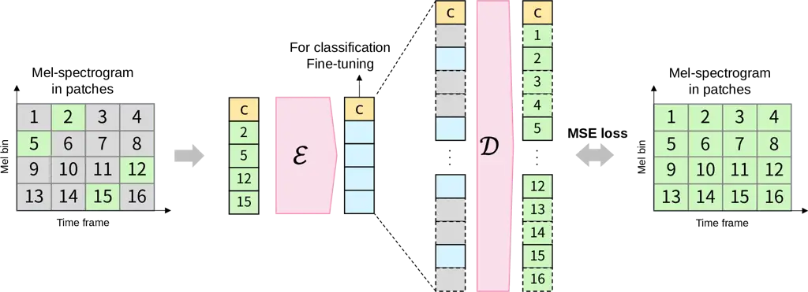
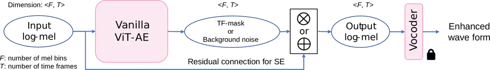
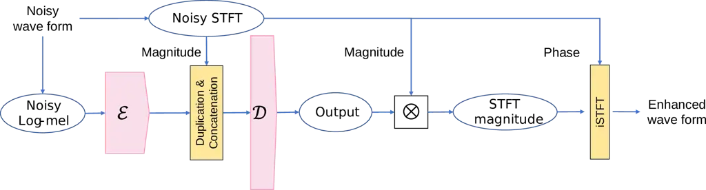

# Extending Audio Masked Autoencoders toward Audio Restoration

Zhi Zhong¹, Hao Shi², Masato Hirano¹, Kazuki Shimada³, Kazuya Tateishi¹
Takashi Shibuya³, Shusuke Takahashi¹, Yuki Mitsufuji^(1,3)

###### Abstract

Audio classification and restoration are among major downstream tasks in
audio signal processing. However, restoration derives less of a benefit
from pretrained models compared to the overwhelming success of
pretrained models in classification tasks. Due to such unbalanced
benefits, there has been rising interest in how to improve the
performance of pretrained models for restoration tasks, e.g., speech
enhancement (SE). Previous works have shown that the features extracted
by pretrained audio encoders are effective for SE tasks, but these
speech-specialized encoder-only models usually require extra decoders to
become compatible with SE, and involve complicated pretraining
procedures or complex data augmentation. Therefore, in pursuit of a
universal audio model, the audio masked autoencoder (MAE) whose backbone
is the autoencoder of Vision Transformers (ViT-AE), is extended from
audio classification to SE, a representative restoration task with
well-established evaluation standards. ViT-AE learns to restore masked
audio signal via a mel-to-mel mapping during pretraining, which is
similar to restoration tasks like SE. We propose variations of ViT-AE
for a better SE performance, where the mel-to-mel variations yield high
scores in non-intrusive metrics and the STFT-oriented variation is
effective at intrusive metrics such as PESQ. Different variations can be
used in accordance with the scenarios. Comprehensive evaluations reveal
that MAE pretraining is beneficial to SE tasks and help the ViT-AE to
better generalize to out-of-domain distortions. We further found that
large-scale noisy data of general audio sources, rather than clean
speech, is sufficiently effective for pretraining.

###### Index Terms: 

Audio classification, audio restoration, speech enhancement, masked
autoencoder, vision transformer

^(†)^(†)address: ¹ Sony Group Corporation, Japan   ² Kyoto University,
Japan   ³ Sony Research, Japan

## 1 Introduction

Various methods have been proposed to pretrain models that can extract
generally useful features from audio, with the expectation that these
features will benefit multiple downstream tasks. Audio classification
and restoration are two major downstream tasks in audio signal
processing, but restoration tasks have typically derived less benefit
from pretrained models. For example, application of pretrained models to
audio classification tasks such as audio scene classification, keyword
spotting, and music instrument classification has shown great success
\[1, 2, 3, 4, 5\]. However, audio restoration tasks are often tackled by
training models from scratch, as in the case of speech enhancement (SE)
or bandwidth extension (BWE) \[6, 7\]. Due to the unbalanced benefit,
there is rising interest in how to improve the performance of pretrained
models for restoration tasks. In this work, SE is chosen as a
representative of numerous restoration tasks due to its well-established
objective metrics and test data \[7\]. While \[8\] tried to apply a
pretrained audio classifier to create paired data for the conditional
source separation task, the separation model did not work well in SE
tasks.

Some methods exploit models that are pretrained via self-supervised
learning (SSL) for SE tasks. Inspired by BERT \[9\], various SSL models
for speech have been proposed, such as HuBERT \[10\] and WavLM \[11\].
These models are pretrained with the mask prediction task, in which the
masked tokens are predicted from visible tokens. While the features
extracted by these models can be used for SE tasks \[12, 13\], there are
some drawbacks. First, these models have no decoder, which makes it
necessary to select an extra decoder to become compatible with SE tasks
\[12, 13\]. Moreover, the models have been pretrained with only speech
data, which limits their extension to tasks other than speech. In
addition, the pretraining involves complicated procedures such as the
estimation of pseudo labels \[10, 11\] or complex data augmentations
such as speech overlapping or noise simulation \[11, 12\].

A framework that is directly compatible with restoration tasks like SE,
easy to pretrain and less demanding in data augmentation has yet to be
explored. Audio masked autoencoders (MAE) \[2, 3, 4\] are SSL methods
that have been reported to have state-of-the-art (SOTA) performance in
audio classification tasks \[2, 3, 4\]. Audio MAE can be simply
pretrained by ground truth labels, and is able to reduce resource
consumption by not inputting masked tokens to the model \[14\]. The
backbone of MAE is the autoencoder of Vision Transformers \[15\]
(ViT-AE), which learns to restore audio signal via a mel-to-mel mapping
during pretraining. However, excluding qualitative experiments on packet
loss concealment \[4\], audio MAE has not been considered for SE or
other restoration tasks.

To address the above issues, first, we extend audio MAE to speech
enhancement and explore the framework’s potential for solving multiple
tasks such as audio classification and SE. The ViT-AE backbone negates
the needs for pseudo labels and naturally learns a mel-to-mel mapping
that is compatible with SE tasks during MAE pretraining. Second, we
propose variations of ViT-AE to improve the performance on SE tasks,
where the mel-to-mel variations have advantages in terms of
non-intrusive metrics and the STFT-oriented variation is effective for
standard intrusive metrics such as PESQ. The aforementioned variations
can be utilized in accordance with the scenarios. Finally, we carried
out comprehensive evaluations and ablation studies, in which we found
that large-scale noisy data of general audio sources, rather than clean
speech, is sufficiently effective for pretraining. Pretraining with
general audio data also allows us to further explore tasks other than
speech (e.g., music) in the future. We encourage our readers to visit
the webpage for audio samples and an appendix about music BWE ¹¹ 1
[https://zzaudio.github.io/Demo_Extend_AudioMAE_toward_Restoration/demo_page.html](https://zzaudio.github.io/Demo_Extend_AudioMAE_toward_Restoration/demo_page.html).

## 2 Related Work



Figure 1: Audio MAE pretraining. Each patch includes 16-by-16 time-mel
bins. Masked patches are deleted from the input sequence and dummy
tokens are used in the decoder to reconstruct the input. The cls (“c” in
orange) token is used for classification tasks.

A number of prior studies have explored the application of
speech-specialized BERT-like SSL models to SE tasks. Song et al.
combined noisy short-time Fourier transform (STFT) magnitude with
features extracted by WavLM-base+ as the input to the backend speech
enhancers and found the extracted features useful for SE tasks \[12\].
Huang et al. compare features extracted by pretrained encoders with
standard STFT and log-mel spectrograms in \[13\], and found that
pretraining models on clean speech may result in domain mismatch in SE
tasks, as these models have to process noisy rather than clean speech in
such cases. Hung et al. \[16\] showed that the SE performance of
pretrained encoders could be boosted by combining multiple techniques
with a careful fine-tuning strategy. However, as mentioned in Sec.1, the
above speech-specialized pretrained models are not naturally compatible
with SE tasks, which also suffer from complicated pretraining
procedures, complex data augmentation and heavy computation during
pretraining.

Audio MAE pretraining is often conducted with log-mel spectrogram, hence
ViT-AE naturally learns the mel-to-mel mapping. Huang et al. \[4\]
qualitatively confirmed that the pretrained ViT-AE can achieve packet
loss concealment without fine-tuning, but did not perform any in-depth
study for such restoration tasks. For speech enhancement via mel-to-mel
mapping, it is common to use a pretrained neural vocoder to convert the
processed log-mel spectrogram back into raw waves \[6, 17\].

## 3 Approach

### 3.1 Audio MAE for Audio Classification

Audio MAE methods \[2, 3, 4\] originate from image MAE \[14\] and
typically take the log-mel spectrogram as input. Unlike conventional
Transformer methods in speech processing, which consider the time axis
in raw waves or spectrograms as the direction of input sequences \[10,
11, 18\], ViT divides log-mel into patches (each patch contains 16-by-16
time-mel bins following \[3, 4, 14, 15\]), and conducts sequential
modelling in accordance with the patch’s position in the original
log-mel spectrogram, as shown in Fig. 1. A large portion (around 75%) of
the input patches are masked to create the mask prediction task. In
contrast to \[10, 11\], the ViT encoder is followed by a decoder in
audio MAE, and hence the backbone is called ViT-AE. Thanks to the
decoder, pseudo labels are not needed for pretraining. The decoder also
allows masked patches to be exempted from the input, thereby greatly
reducing the computational cost. We insert a cls token as the feature
vector for downstream classification tasks, as it will automatically
aggregate the features from other tokens when fine-tuned \[1, 14\].

### 3.2 ViT-AE Framework for Multiple Tasks

The vanilla ViT-AE learns mel-to-mel mapping via mean square error (MSE)
loss in Fig. 1. Although the vanilla ViT-AE architechture is directly
applicable to downstream restoration tasks, we will show in Sec.5.2 that
the speech enhancement quality of vanilla ViT-AE is not sufficient. Some
works try to improve the reconstruction quality of MAE-based frameworks
by modifying the loss function in pretraining \[12\] or modifying the
model structure \[19\]. Unfortunately, modification during pretraining
will largely affect the classification performance of MAE-based methods
\[19\]. We therefore introduce new training losses and variations of
ViT-AE, which we use only for fine-tuning ViT-AE on SE tasks. This
should bring no change to pretraining procedures hence no harm to other
tasks such as classification, while simultaneously offering apparent
benefits to SE.



Figure 2: Mel-to-mel ViT-AE with residual connection.



Figure 3: ViT-AE-iSTFT, where the decoder takes the concatenation of
STFT magnitude and ViT encoder features as input.

Mel-to-mel ViT-AE with residual connection. We introduce a residual
connection outside the vanilla ViT-AE to better enhance the log-mel
spectrogram, which results in two variations shown in Fig. 2: additive
and multiplicative ViT-AE, both of which originate from the domain
knowledge of audio signal processing. Modelling the input noisy speech
as the addition of clean signal and background noises, the additive
ViT-AE learns to enhance signals by subtracting background noises from
the noisy input. The multiplicative ViT-AE estimates time-frequency (TF)
masks for mel-spectrograms. Masks are limited to the range of \[0, 1\]
by a sigmoid function to indicate how much energy the clean speech
occupies in each bin of the noisy mel-spectrogram. Masks are then
multiplied with noisy input. We do not directly apply masks to the
log-mel, as log-scale power compression results in negative values,
making the physical meaning of a non-negative mask unclear. Log-mel
spectrograms are converted into raw waves via a pretrained frozen
vocoder (Fig. 2).

To better capture details of spectrograms from both log- and
linear-scale, the proposed loss for SE fine-tuning is the summation of
MSE losses in both scales of mel-spectrogram, i.e.,

```math
L_{\mathrm{SE}}=\mathrm{MSE}(\hat{Y},Y)+\lambda\cdot\mathrm{MSE}(\mathrm{exp}(\hat{Y}),\mathrm{exp}(Y)),\vskip-5.12149pt \tag{1}
```

where $`Y`$ is the ground truth log-mel spectrogram of clean speech,
$`\hat{Y}`$ is the estimated one by ViT-AE, and the exponential function
recovers the linear mel-spectrogram from log-scale power compression.
The coefficient of $`\lambda=100`$ is determined empirically to balance
losses from both scales.

STFT-oriented ViT-AE. Mel-to-mel ViT-AE’s objective scores (such as
PESQ) are limited and upper bounded by the vocoder \[6\]. To improve the
objective scores of ViT-AE, we propose a variation to generate enhanced
waves via inverse STFT (iSTFT) (ViT-AE-iSTFT in Fig. 3). Inspired by
\[12\], the ViT decoder (different from the one used in pretraining)
takes the concatenation of noisy STFT magnitude and ViT encoder features
as the input, in which the ViT encoder features are expected to provide
auxiliary information to improve the SE performance of the decoder.
Following the common practice in \[12, 13, 16\], STFT magnitude is
enhanced by an STFT mask (similar to the mel-to-mel multiplicative
ViT-AE). To fine-tune this variation, unlike equation (1), L1 loss is
empirically found more suitable for the linear scale STFT.

While usages similar to Fig. 3 have been explored for HuBERT- and
WavLM-based methods \[12, 13, 16\], it is non-trivial to evaluate such
usages for ViT-AE. In contrast to HuBERT or WavLM, the ViT-AE takes
time-mel patches as input, which means the direction of input sequences
is not aligned with the time axis in STFT spectrograms (Sec.3.1). To
concatenate the ViT encoder features with STFT, we have to extend the
length of ViT encoder features by duplicating them twice under our
current setting, which makes it even more difficult to extract
information about the time axis. Moreover, there is a domain mismatch
for ViT-AE, because it is pretrained to learn mel-to-mel mapping, not
the STFT mapping. Nonetheless, in Sec.5.2 we will show that this
ViT-AE-iSTFT achieves high objective scores, which means the ViT encoder
can provide valuable auxiliary information under the above limitations.

## 4 Experiments

We evaluate the ViT-AE and MAE pretraining on both audio classification
and speech enhancement tasks.

### 4.1 MAE Pretraining

We carried out MAE pretraining with 75% mask ratio for the ViT-AE on
either AudioSet (noisy but general) or LibriTTS (clean and
speech-specialized) to examine the influence of the pretraining data.
AudioSet \[20\] contains around 2 million 10-second audio segments taken
from YouTube and annotated with 527 diverse classes. AudioSet has been
widely used in general audio representation learning \[1, 2, 3, 4, 21\].
The unbalanced set of AudioSet is used for pretraining. LibriTTS \[22\]
is a large-scale corpus of English audiobooks presented at sentence
break. We merge all three train subsets and two dev subsets of the
LibriTTS for pretraining.

The ViT and the masking strategy are implemented based on the
open-source project in \[1, 23\]. Hyperparameters of the ViT-AE are
based on \[2\], where the ViT encoder is a ViT-base model, containing 12
Transformer blocks, whose attention layer has 768 dimensions, and the
number of attention heads is 12. The decoder is a smaller ViT, with four
layers of 384 dimensions and eight attention heads. The dimension of the
feedforward networks is four times the attention layer dimension across
the whole ViT-AE.

Following \[2\], audio data is cropped or padded to 5-second chunks (448
frames) during pretraining. ViT-AE is pretrained for 60 epochs with the
batch size of 128 and learning rate (LR) of 1e-4. The LR linearly
increases to 1e-4 in the first five epochs (warmup), and then decreases
to 1e-6 by the cosine annealing scheduler \[3, 4\]. Instead of audio
overlapping or noise simulation, we apply only random gain (–6 dB to +3
dB) and cyclic cropping \[1\] as data augmentation. To alleviate the
affect of different audio loudness, all input log-mel spectrograms are
normalized by the train set mean and standard deviation that are
collected in advance \[4\]. The AdamW optimizer is used with a weight
decay of 1e-4 \[4\].

The 80-bin log-mel is generated to be compatible with the vocoder’s
settings \[24\]: raw waves at a sampling rate of 22.05 kHz are processed
by STFT with a 1024-point Hann window and 256-point hop size, followed
by a mel filterbank. Throughout experiments, audio files are resampled
to 22.05 kHz if needed.

### 4.2 Downstream: Audio Classification

The cls token of the pretrained ViT encoder is followed by a single
linear layer during the fine-tuning for classification tasks. The speech
classification accuracy of ViT-AE is evaluated by Speech Command V2
(SPCv2) \[25\], a dataset that presents a 35-class single-label speech
command recognition task. When ViT-AE is pretrained with AudioSet (as in
\[2, 3, 4\]), its ability in general audio classification is measured by
the 527-class multi-label task on AudioSet-2M (summation of unbalanced
and balanced subsets) and AudioSet-20k (the balance subset alone).

### 4.3 Downstream: Speech Enhancement

We fine-tune ViT-AE and its variations on the standard Valentini’s
dataset \[26\], whose test set has 824 noisy speeches without
reverberation. Generalization ability is measured by a subset of the
DAPS dataset \[27\] under a zero-shot condition. By playing back
pre-recorded clean speeches in noisy and reverberate environments,
distorted speeches from 20 speakers under 12 scenarios are created by
consumer-grade devices. We constructed the out-of-domain subset using
all recordings of the last female and male speakers.

During the finetuning, the batch size is 16, the LR increases to 1e-4
within the 10 epochs of warmup and decreases to 1e-6 by 90 epochs of
cosine annealing. To convert log-mel spectrograms into raw waves, we use
the HiFi-GAN vocoder \[24\]. The mel-to-mel ViT-AE keeps the same
settings as in pretraining, while the ViT-AE-iSTFT extends the decoder’s
attention layer dimensions to 512 to predict the one-side STFT (rather
than mel-spectrogram) masks.

|        |                         |             |                |
| ------ | ----------------------- | ----------- | -------------- |
|        | ViT-AE/Audio MAE (ours) | PANN \[21\] | MaskSpec \[3\] |
| AS-2M  | 43.4                    | 43.1        | 47.1           |
| AS-20k | 31.7                    | 27.8        | 32.3           |
| SPCv2  | 97.8                    | –           | 97.7           |

Table 1: Results of audio classification. AudioSet: Mean average
precision (%). SPCv2: Top-1 accuracy (%). For SPCv2, either AudioSet or
LibriTTS pretraining yields the same score for our model.

|          |                         |      |      |      |       |       |
| -------- | ----------------------- | ---- | ---- | ---- | ----- | ----- |
| Pretrain | Method                  | PESQ | Csig | Cbak | Covrl | NISQA |
|          | Noisy                   | 1.97 | 3.35 | 2.44 | 2.63  | 3.34  |
|          | Vanilla ViT-AE          | 2.22 | 3.80 | 2.36 | 3.00  | 3.98  |
| Scratch  | Additive (Fig. 2)       | 2.34 | 3.88 | 2.38 | 3.10  | 4.18  |
|          | Multiplicative (Fig. 2) | 2.35 | 3.90 | 2.38 | 3.11  | 4.18  |
|          | Vanilla ViT-AE          | 2.23 | 3.83 | 2.37 | 3.02  | 4.05  |
| LibriTTS | Additive                | 2.39 | 3.95 | 2.41 | 3.16  | 4.27  |
|          | Multiplicative          | 2.42 | 3.97 | 2.42 | 3.18  | 4.29  |
|          | Vanilla ViT-AE          | 2.23 | 3.83 | 2.37 | 3.01  | 4.06  |
| AudioSet | Additive                | 2.40 | 3.96 | 2.41 | 3.17  | 4.25  |
|          | Multiplicative          | 2.42 | 3.98 | 2.42 | 3.19  | 4.29  |
|          | Vocoder Oracle          | 3.01 | 4.68 | 2.81 | 3.87  | 4.57  |
|          | Clean                   | 4.50 | 5.00 | 5.00 | 5.00  | 4.62  |

Table 2: SE: From-scratch vs. pretrained (Bold: Top-2 scores)

## 5 Evaluation

### 5.1 Audio Classification

The results presented in Tab. 1 demonstrate that we have successfully
reproduced audio MAE. Our AudioSet model outperforms PANN in general
audio classification tasks, showing its ability to tasks other than
speech. Both the AudioSet and LibriTTS models achieve 97.8% accuracy in
SPCv2, outperforming MaskSpec \[3\] (an audio MAE model) in the speech
classification task. MaskSpec obtained higher scores at AudioSet, which
can be explained by differences in hyperparameters (we followed \[2\],
but no AudioSet scores were reported there) and loss in the training
data (downloadable segments from YouTube differ by region, and decrease
over time).

### 5.2 Speech Enhancement

We evaluate the importance of pretraining by standard intrusive metrics
(PESQ, Csig, Cbak and Covrl \[28\]) and a non-intrusive metric called
NISQA \[29\] in Valentini’s dataset. First, the additive and
multiplicative ViT-AE stably outperform the vanilla version in every
pretraining condition as shown in Tab. 2. Next, pretrained ViT-AE
outperforms the from-scratch one for all variations of ViT-AE in all
metrics, though the difference brought by different pretraining data was
trivial. Last but not least, the additive and multiplicative variations
reflect more benefits of pretraining compared to the vanilla one,
revealing that the proposed variations are important to unleash the
power of MAE pretraining in SE tasks.

| Pretrain | Method                         | PESQ | Csig | Cbak | Covrl | NISQA |
| -------- | ------------------------------ | ---- | ---- | ---- | ----- | ----- |
|          | noisy                          | 1.97 | 3.35 | 2.44 | 2.63  | 3.34  |
| Scratch  | ViT decoder with STFT input    | 2.71 | 3.96 | 2.59 | 3.33  | 3.95  |
|          | ViT-AE-iSTFT (Fig. 3)          | 2.75 | 3.99 | 2.61 | 3.37  | 4.00  |
| LibriTTS | ViT-AE-iSTFT                   | 2.80 | 4.06 | 2.64 | 3.43  | 4.03  |
| AudioSet | ViT-AE-iSTFT                   | 2.85 | 4.12 | 2.67 | 3.48  | 4.05  |
|          | Multiplicative ViT-AE (Fig. 2) | 2.42 | 3.98 | 2.42 | 3.19  | 4.29  |
|          | Clean                          | 4.50 | 5.00 | 5.00 | 5.00  | 4.62  |

Table 3: SE: ViT-AE-iSTFT vs Mel-to-mel ViT-AE (Bold: Top 1)

The multiplicative ViT-AE is compared with ViT-AE-iSTFT in Tab. 3.
First, ViT-AE-iSTFT successfully improves objective scores of the
decoder-only baseline, which implies that the ViT encoder can provide
auxiliary information to improve the SE performance of the decoder
despite the limitations mentioned in Sec.3.2. The AudioSet pretraining
is slightly more beneficial than LibriTTS for ViT-AE-iSTFT. Next, our
goal to further improve the objective scores of mel-to-mel variations by
ViT-AE-iSTFT is partly realized, as ViT-AE-iSTFT outperforms the
multiplicative one in every intrusive metric especially in PESQ (2.85 vs
2.42). Meanwhile, the merit of using mel-to-mel mapping with a vocoder
is revealed by the higher NISQA score of the multiplicative version.
NISQA helps us to further clarify the differences among the proposed
ViT-AE variations, because standard intrusive metrics may contrast with
human perception when evaluating vocoder-based methods \[6\]. We
therefore conclude that mel-to-mel ViT-AE should be utilized for cases
requiring perceptual quality (NISQA) and that ViT-AE-iSTFT is better for
scenarios requiring high intrusive scores (PESQ).

|                |                       |      |      |      |       |       |
| -------------- | --------------------- | ---- | ---- | ---- | ----- | ----- |
| Comment        | Method                | PESQ | Csig | Cbak | Covrl | NISQA |
| \-             | Noisy                 | 1.97 | 3.35 | 2.44 | 2.63  | 3.34  |
| Pretrained &   | Multiplicative ViT-AE | 2.42 | 3.98 | 2.42 | 3.19  | 4.29  |
| GAN (vocoder)  | Vocoder Oracle        | 3.01 | 4.68 | 2.81 | 3.87  | 4.57  |
| GAN            | SEGAN \[30\]          | 2.16 | 3.48 | 2.84 | 2.80  | \-    |
|                | Voicefixer \[6\]      | 2.43 | \-   | \-   | \-    | \-    |
|                | ViT-AE-iSTFT          | 2.85 | 4.12 | 2.67 | 3.48  | 4.05  |
| Pretrained &   | PANN + UNet \[8\]     | 2.28 | 2.43 | 2.96 | 2.30  | \-    |
| Discriminative | Huang et al. \[13\]   | 2.68 | \-   | \-   | \-    | \-    |
|                | Hung et al. \[16\]    | 3.16 | 4.50 | 3.57 | 3.86  | \-    |
|                | UNIVERSE^(∗) \[7\]    | 2.90 | 4.03 | 3.11 | 3.46  | 4.61  |
| Diffusion      | SGMSE+ \[31\]         | 2.94 | 4.25 | 3.40 | 3.61  | 4.56  |
|                | GP-Unified \[32\]     | 2.95 | 4.18 | 3.44 | 3.57  | 4.61  |
| Discriminative | DCUNet \[33\]         | 3.13 | 4.24 | 4.00 | 3.69  | \-    |
| \-             | Clean                 | 4.50 | 5.00 | 5.00 | 5.00  | 4.62  |

Table 4: SE: Comparison with existing methods (Bold: Ours).
^(∗)UNIVERSE: Unofficial implementation by the authors.

We compare the ViT-AE pretrained on AudioSet with other methods in Tab. 4. The multiplicative version obtained a similar PESQ score as
Voicefixer\[6\] which also uses a vocoder, and a higher PESQ score than
SEGAN \[30\]. Although ViT-AE-iSTFT has lower metrics than SOTA
discriminative models like \[33\], it achieves comparable intrusive
metrics to SOTA diffusion models such as UNIVERSE, SGMSE+ and its
variation GP-Unified \[7, 31, 32\], except in Cbak. These diffusion
models achieved NISQA scores comparable to the oracle results of
vocoder, revealing the limited potential of vocoder-based methods. Note
that the methods compared above are not capable of classification.

For methods compatible with classification, we exempt results from
HuBERT-large and WavLM-large for fair comparison. Variations of ViT-AE
outperform PANN + UNet \[8\] and Huang et al. \[13\] in all metrics
except Cbak. Hung et al. \[16\] utilized multiple techniques with a
careful fine-tuning strategy in which the model is partially frozen, and
as a result, their method even outperforms SOTA models in some metrics.
However, speech-specialized pretrained models used in \[16\] are not
reported to be beneficial for non-speech tasks such as AudioSet
classification. We leave the improvement of ViT-AE’s objective scores to
future work.

Finally, we evaluate the generalization ability by applying models
trained or fine-tuned on Valentini’s dataset to the unseen DAPS dataset
(zero-shot condition), and report the mean scores of all 12 scenarios in
Tab. 5. Contrary to Tab. 4, we found the pretrained multiplicative
ViT-AE outperforming UNIVERSE, indicating that our system generalized
better to unseen scenarios. While SGMSE+ is reported to have SOTA
generalization ability \[31\], the multiplicative ViT-AE pretrained on
AudioSet achieved similar Csig and Covrl scores, even if ViT-AE is not
an SE-specialized method. As for the pretrained mel-to-mel ViT-AE
variations, all outperformed the from-scratch ones. Moreover, the
AudioSet pretraining outperformed the LibriTTS one in all variations
except the NISQA score for ViT-AE-iSTFT, which implies that the diverse
audio sources and recording environments in AudioSet have been
beneficial for generalization. ViT-AE-iSTFT didn’t consistently benefit
from pretraining, which could have been caused by limitations mentioned
in Sec. 3.2 and is worth investigation in the future.

|          |                                 |      |      |       |       |
| -------- | ------------------------------- | ---- | ---- | ----- | ----- |
| Comment  | Method                          | PESQ | Csig | Covrl | NISQA |
|          | noisy                           | 1.47 | 2.00 | 1.60  | 2.79  |
|          | UNIVERSE^(∗) (unofficial) \[7\] | 1.51 | 2.19 | 1.76  | 3.79  |
|          | SGMSE+ \[31\]                   | 1.97 | 2.81 | 2.33  | 4.44  |
|          | GP-Unified \[32\]               | 1.88 | 2.81 | 2.27  | 4.32  |
|          | Vanilla ViT-AE                  | 1.67 | 2.77 | 2.14  | 3.14  |
| Scratch  | Additive                        | 1.65 | 2.63 | 2.05  | 3.58  |
|          | Multiplicative                  | 1.64 | 2.68 | 2.08  | 3.49  |
|          | ViT decoder with STFT input     | 1.79 | 2.44 | 2.01  | 2.86  |
|          | ViT-AE-iSTFT                    | 1.81 | 2.54 | 2.07  | 2.92  |
|          | Vanilla ViT-AE                  | 1.72 | 2.81 | 2.19  | 3.11  |
| LibriTTS | Additive                        | 1.73 | 2.84 | 2.21  | 3.77  |
|          | Multiplicative                  | 1.74 | 2.87 | 2.23  | 3.80  |
|          | ViT-AE-iSTFT                    | 1.81 | 2.49 | 2.05  | 2.95  |
|          | Vanilla ViT-AE                  | 1.76 | 2.86 | 2.24  | 3.15  |
| AudioSet | Additive                        | 1.78 | 2.93 | 2.29  | 3.79  |
|          | Multiplicative                  | 1.79 | 2.95 | 2.30  | 3.82  |
|          | ViT-AE-iSTFT                    | 1.83 | 2.59 | 2.11  | 2.90  |
|          | Vocoder Oracle                  | 2.99 | 4.66 | 3.84  | 4.72  |
|          | Clean                           | 4.50 | 5.00 | 5.00  | 4.78  |

Table 5: SE: Out-of-domain Generalization (Bold: Top-2 scores).

## 6 Conclusion

In pursuit of universal audio models, this paper extended audio MAE from
audio classification to speech enhancement (SE). SE was chosen from
among many restoration tasks due to its widely accepted evaluation
benchmark. The output features of pretrained audio encoders are known to
be effective for SE tasks, but prior speech-specialized encoder-only
models usually require extra decoders to become compatible with SE
tasks, and involve complicated pretraining procedures or complex data
augmentation. To address these issues, audio MAE, i.e., ViT-AE with MAE
pretraining, was explored. Audio MAE simplifies the pretraining
procedures, and enables the ViT-AE to naturally learn mel-to-mel mapping
that is compatible with SE tasks. We proposed variations of ViT-AE to
improve the SE performance and unleash the power of pretraining.
Comprehensive evaluations and ablation studies demonstrate that MAE
pretraining is beneficial for SE tasks and help the ViT-AE to better
generalize to out-of-domain test data. We further found that large-scale
noisy data of general audio sources, rather than clean speech, are
sufficiently effective for pretraining. We leave the improvement of
objective metrics as our future work, as well as the in-depth
exploration to a broader range of restoration tasks with various sound
sources . We hope our findings here pave the way to the continued
research on universal audio models.

## References

- \[1\] K. Koutini, J. Schlüter, H. Eghbal-zadeh, and G. Widmer,
  “Efficient training of audio transformers with patchout,” in
  _Interspeech 2022_, 2022.
- \[2\] D. Niizumi, D. Takeuchi, Y. Ohishi, N. Harada, and K. Kashino,
  “Masked spectrogram modeling using masked autoencoders for learning
  general-purpose audio representation,” _arXiv preprint
  arXiv:2204.12260_, 2022.
- \[3\] D. Chong, H. Wang, P. Zhou, and Q. Zeng, “Masked spectrogram
  prediction for self-supervised audio pre-training,” _arXiv preprint
  arXiv:2204.12768_, 2022.
- \[4\] P.-Y. Huang, H. Xu, J. Li, A. Baevski, M. Auli, W. Galuba,
  F. Metze, and C. Feichtenhofer, “Masked autoencoders that listen,”
  _NeurIPS_, vol. 35, pp. 28 708–28 720, 2022.
- \[5\] Z. Zhong, M. Hirano, K. Shimada, K. Tateishi, S. Takahashi, and
  Y. Mitsufuji, “An attention-based approach to hierarchical multi-label
  music instrument classification,” _arXiv preprint
  arXiv:2302.08136_, 2023.
- \[6\] H. Liu, X. Liu, Q. Kong, Q. Tian, Y. Zhao, D. Wang, C. Huang,
  and Y. Wang, “Voicefixer: A unified framework for high-fidelity speech
  restoration,” _arXiv preprint arXiv:2204.05841_, 2022.
- \[7\] J. Serrà, S. Pascual, J. Pons, R. O. Araz, and D. Scaini,
  “Universal speech enhancement with score-based diffusion,” _arXiv
  preprint arXiv:2206.03065_, 2022.
- \[8\] Q. Kong, H. Liu, X. Du, L. Chen, R. Xia, and Y. Wang, “Speech
  enhancement with weakly labelled data from audioset,” _arXiv preprint
  arXiv:2102.09971_, 2021.
- \[9\] J. Devlin, M.-W. Chang, K. Lee, and K. Toutanova, “Bert:
  Pre-training of deep bidirectional transformers for language
  understanding,” _arXiv preprint arXiv:1810.04805_, 2018.
- \[10\] W.-N. Hsu, B. Bolte, Y.-H. H. Tsai, K. Lakhotia,
  R. Salakhutdinov, and A. Mohamed, “Hubert: Self-supervised speech
  representation learning by masked prediction of hidden units,”
  _IEEE/ACM TASLP_, vol. 29, pp. 3451–3460, 2021.
- \[11\] S. Chen, C. Wang, Z. Chen, Y. Wu, S. Liu, Z. Chen, J. Li,
  N. Kanda, T. Yoshioka, X. Xiao, _et al._, “Wavlm: Large-scale
  self-supervised pre-training for full stack speech processing,”
  _IEEE J. Sel. Topics Signal Process._, vol. 16, no. 6, pp.
  1505–1518, 2022.
- \[12\] H. Song, S. Chen, Z. Chen, Y. Wu, T. Yoshioka, M. Tang, J. W.
  Shin, and S. Liu, “Exploring wavlm on speech enhancement,” in _IEEE
  SLT 2022_, 2023, pp. 451–457.
- \[13\] Z. Huang, S. Watanabe, S.-w. Yang, P. García, and S. Khudanpur,
  “Investigating self-supervised learning for speech enhancement and
  separation,” in _ICASSP 2022_. IEEE, 2022, pp. 6837–6841.
- \[14\] K. He, X. Chen, S. Xie, Y. Li, P. Dollár, and R. Girshick,
  “Masked autoencoders are scalable vision learners,” in _CVPR 2022_,
  2022, pp. 16 000–16 009.
- \[15\] A. Dosovitskiy, L. Beyer, A. Kolesnikov, D. Weissenborn,
  X. Zhai, T. Unterthiner, M. Dehghani, M. Minderer, G. Heigold,
  S. Gelly, _et al._, “An image is worth 16x16 words: Transformers for
  image recognition at scale,” _ICLR 2021_, 2021.
- \[16\] K.-H. Hung, S.-w. Fu, H.-H. Tseng, H.-T. Chiang, Y. Tsao, and
  C.-W. Lin, “Boosting self-supervised embeddings for speech
  enhancement,” _Interspeech 2022_, 2022.
- \[17\] H. Li, Y. Ai, and J. Yamagishi, “Enhancing low-quality voice
  recordings using disentangled channel factor and neural waveform
  model,” in _IEEE SLT 2021_. IEEE, 2021, pp. 734–741.
- \[18\] S. Chen, Y. Wu, Z. Chen, J. Wu, J. Li, T. Yoshioka, C. Wang,
  S. Liu, and M. Zhou, “Continuous speech separation with conformer,” in
  _ICASSP 2021_. IEEE, 2021, pp. 5749–5753.
- \[19\] T. Li, H. Chang, S. K. Mishra, H. Zhang, D. Katabi, and
  D. Krishnan, “Mage: Masked generative encoder to unify representation
  learning and image synthesis,” _arXiv preprint
  arXiv:2211.09117_, 2022.
- \[20\] J. F. Gemmeke, D. P. Ellis, D. Freedman, A. Jansen,
  W. Lawrence, R. C. Moore, M. Plakal, and M. Ritter, “Audio set: An
  ontology and human-labeled dataset for audio events,” in _ICASSP
  2017_. IEEE, 2017, pp. 776–780.
- \[21\] Q. Kong, Y. Cao, T. Iqbal, Y. Wang, W. Wang, and M. D.
  Plumbley, “Panns: Large-scale pretrained audio neural networks for
  audio pattern recognition,” _IEEE/ACM TASLP_, vol. 28, pp.
  2880–2894, 2020.
- \[22\] H. Zen, V. Dang, R. Clark, Y. Zhang, R. J. Weiss, Y. Jia,
  Z. Chen, and Y. Wu, “Libritts: A corpus derived from librispeech for
  text-to-speech,” _arXiv preprint arXiv:1904.02882_, 2019.
- \[23\] R. Wightman, “Pytorch image models,”
  [https://github.com/rwightman/pytorch-image-models](https://github.com/rwightman/pytorch-image-models), 2019.
- \[24\] J. Kong, J. Kim, and J. Bae, “Hifi-gan: Generative adversarial
  networks for efficient and high fidelity speech synthesis,” _NeurIPS_,
  vol. 33, pp. 17 022–17 033, 2020.
- \[25\] P. Warden, “Speech commands: A dataset for limited-vocabulary
  speech recognition,” _arXiv preprint arXiv:1804.03209_, 2018.
- \[26\] C. Valentini-Botinhao, X. Wang, S. Takaki, and J. Yamagishi,
  “Speech enhancement for a noise-robust text-to-speech synthesis system
  using deep recurrent neural networks.” in _Interspeech 2016_, vol. 8,
  2016, pp. 352–356.
- \[27\] G. J. Mysore, “Can we automatically transform speech recorded
  on common consumer devices in real-world environments into
  professional production quality speech?—a dataset, insights, and
  challenges,” _IEEE Signal Processing Letters_, vol. 22, no. 8, pp.
  1006–1010, 2014.
- \[28\]
  [https://github.com/schmiph2/pysepm](https://github.com/schmiph2/pysepm).
- \[29\] G. Mittag, B. Naderi, A. Chehadi, and S. Möller, “Nisqa: A deep
  cnn-self-attention model for multidimensional speech quality
  prediction with crowdsourced datasets,” _arXiv preprint
  arXiv:2104.09494_, 2021.
- \[30\] S. Pascual, A. Bonafonte, and J. Serra, “Segan: Speech
  enhancement generative adversarial network,” _arXiv preprint
  arXiv:1703.09452_, 2017.
- \[31\] J. Richter, S. Welker, J.-M. Lemercier, B. Lay, and
  T. Gerkmann, “Speech enhancement and dereverberation with
  diffusion-based generative models,” _arXiv preprint
  arXiv:2208.05830_, 2022.
- \[32\] H. Shi, K. Shimada, M. Hirano, T. Shibuya, Y. Koyama, Z. Zhong,
  S. Takahashi, T. Kawahara, and Y. Mitsufuji, “Diffusion-based speech
  enhancement with joint generative and predictive decoders,”
  _arXiv:2305.10734_, 2023.
- \[33\] H.-S. Choi, J.-H. Kim, J. Huh, A. Kim, J.-W. Ha, and K. Lee,
  “Phase-aware speech enhancement with deep complex u-net,” in _ICLR
  2019_, 2019.
