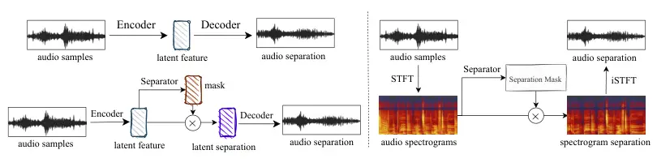
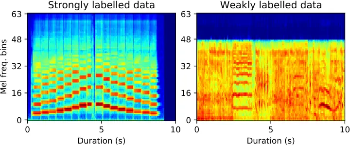
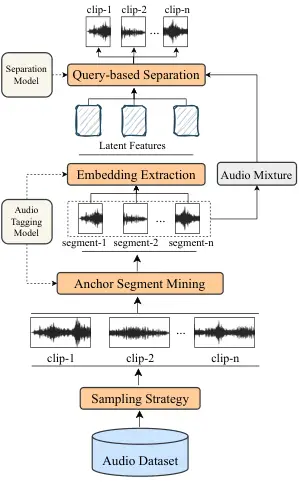
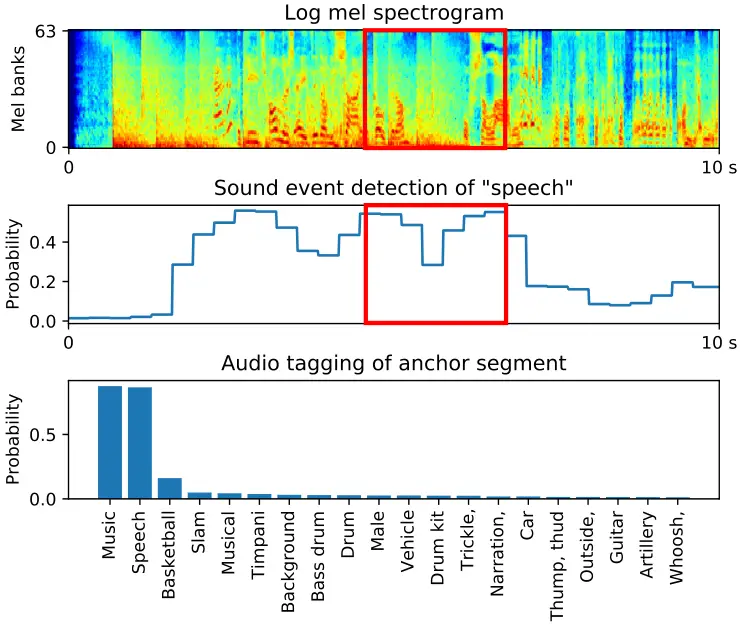
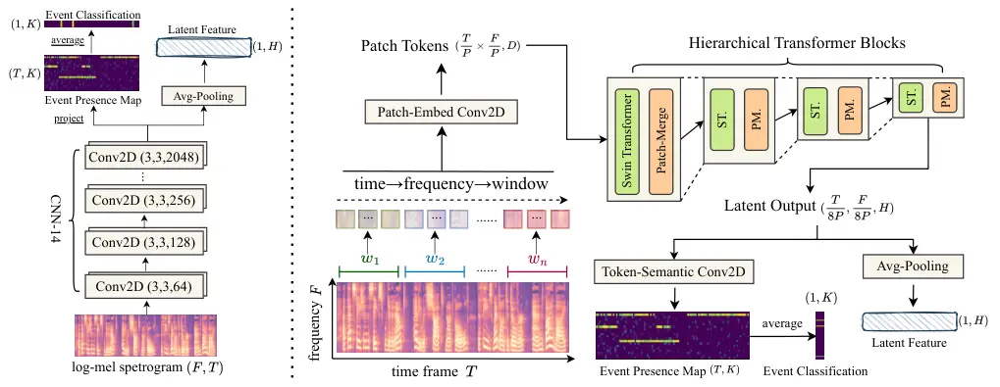
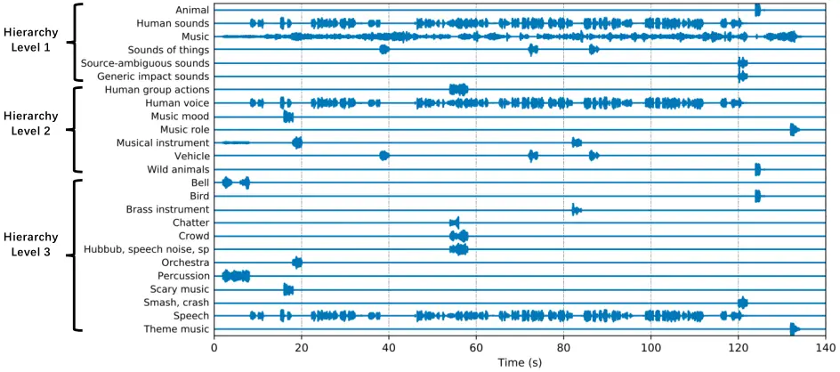

# Universal Source Separation with Weakly Labelled DataThanks: Qiuqiang Kong and Ke Chen contribute equally to this work. Qiuqiang Kong: kongqiuqiang@bytedance.com, Xingjian Du: duxingjian.real@bytedance.com are with ByteDance, Shanghai, China. Ke Chen: knutchen@ucsd.edu, Shlomo Dubnov: sdubnov@ucsd.edu, and Taylor Berg-Kirkpatrick: tberg@eng.ucsd.edu are with University of California San Diego, San Diego, USA. Haohe Liu: haohe.liu@surrey.ac.uk, Mark D. Plumbley: m.plumbley@surrey.ac.uk are with University of Surrey, Guildford, UK.

Qiuqiang Kong\*    Ke Chen\*    Haohe Liu    Xingjian Du
Affiliation: Taylor Berg-Kirkpatrick, Shlomo Dubnov, Mark D. Plumbley

###### Abstract

Universal source separation (USS) is a fundamental research task for
computational auditory scene analysis, which aims to separate mono
recordings into individual source tracks. There are three potential
challenges awaiting the solution to the audio source separation task.
First, previous audio source separation systems mainly focus on
separating one or a limited number of specific sources. There is a lack
of research on building a unified system that can separate arbitrary
sources via a single model. Second, most previous systems require clean
source data to train a separator, while clean source data are scarce.
Third, there is a lack of USS system that can automatically detect and
separate active sound classes in a hierarchical level. To use
large-scale weakly labeled/unlabeled audio data for audio source
separation, we propose a universal audio source separation framework
containing: 1) an audio tagging model trained on weakly labeled data as
a query net; and 2) a conditional source separation model that takes
query net outputs as conditions to separate arbitrary sound sources. We
investigate various query nets, source separation models, and training
strategies and propose a hierarchical USS strategy to automatically
detect and separate sound classes from the AudioSet ontology. By solely
leveraging the weakly labelled AudioSet, our USS system is successful in
separating a wide variety of sound classes, including sound event
separation, music source separation, and speech enhancement. The USS
system achieves an average signal-to-distortion ratio improvement (SDRi)
of 5.57 dB over 527 sound classes of AudioSet; 10.57 dB on the DCASE
2018 Task 2 dataset; 8.12 dB on the MUSDB18 dataset; an SDRi of 7.28 dB
on the Slakh2100 dataset; and an SSNR of 9.00 dB on the voicebank-demand
dataset. We release the source code at
[https://github.com/bytedance/uss](https://github.com/bytedance/uss)

###### Index Terms: 

Universal source separation, hierarchical source separation, weakly
labelled data.

## I Introduction

Mono source separation is the task of separating single-channel audio
recordings into individual source tracks. An audio recording may consist
of several sound events and acoustic scenes. Universal source separation
(USS) is a task to separate arbitrary sound from a recording. Source
separation has been researched for several years and has a wide range of
applications, including speech enhancement \[1, 2\], music source
separation \[3\], and sound event separation\[4, 5\]. USS is closely
related to the well-known cocktail party problem \[6\], where sounds
from different sources in the world mix in the air before arriving at
the ear, requiring the brain to estimate individual sources from the
received mixture. Humans can focus on a particular sound source and
separate it from others, a skill sometimes called selective hearing. As
a study of auditory scene analysis by computational means, computational
auditory scene analysis \[7, 8\] systems are machine listening systems
that aim to separate mixtures of sound sources in the same way that
human listeners do.

Many previous works mainly focus on specific source separation that only
separate one or a few sources; these include speech separation \[1, 2\]
and music source separation \[9\] tasks. Different from specific source
separation tasks such as speech enhancement or music source separation,
a USS system aims to automatically detect and separate the tracks of
sound sources from a mixture. One difficulty of USS is that there are
hundreds of different sounds in the world, and it is difficult to
separate all sounds using a unified model \[10\]. Recently, the USS
problem has attracted the interests of several researchers. A system
\[11\] was proposed to separate arbitrary sounds by predicting the masks
of sounds, where the masks control how many signals should remain from
the mixture signals. Unsupervised USS systems \[12, 13\] were proposed
to separate sounds by mixing training samples into a mixture and
separating the mixture into a variable number of sources. A Free
Universal Sound Separation (FUSS) system applied a time-domain
convolutional network (TDCN++) system to separate mixtures into up to 4
separate sources. A class conditions system \[14\] was proposed for
4-stem music source separation. Some other methods \[15, 16, 17\] use
audio embeddings that character an audio clip to control what sources to
separate from a mixture. In \[18\], one-hot encodings of sound classes
are used as controls to separate corresponding sources. Other sound
separation systems include learning to separate from weakly labelled
scenes \[19\] and SuDoRM-RM \[13, 20\] to remove sound sources from
mixtures. Recently, a language-based source separation system was
proposed in \[21\]. Those systems are mainly trained on small datasets
and do not scale to automatically detect and separate hundreds of sound
classes.



Fig. 1: The standard architecture of deep-learning-based audio source
separation model. Left top: synthesis-based separation model. Left
bottom: mask-based separation model. Right: the general type of
frequency-domain separation model.

For the source separation problem, we define clean source data as audio
segments that contain only target sources without other sources. The
clean source data can be mixed to form audio mixtures to train potential
separators. However, collecting clean data is time-consuming. For sound
classes such as “Speech”, clean data can be recorded in the laboratory.
But for many other environmental sounds such as “Thunder”, the
collection of clean data is difficult. Recently, the concept of weakly
labelled data \[22, 23\] was used in audio signal processing. In
contrast to clean source data, weakly labelled data contains multiple
sources in an audio clip. An audio clip is labelled with one or multiple
tags, while the time information of tags is unknown. For example, a
10-second audio clip is labelled as “Thunder” and “Rain”, but the time
when these two events exactly appear within this 10-second clip is not
provided. Weakly labelled data has been widely used in audio tagging
\[24, 25, 26, 27\] and sound event detection \[28, 29, 30\]. But there
has been limited work on using weakly labelled for source separation
\[31, 32\].

In this work, we propose a USS framework that can be trained with weakly
labelled data. This work extends our previously proposed USS systems
\[31, 33, 32\] with contributions as follows:

- •
  We are the first to use large-scale weakly labelled data to train USS
  systems that can separate hundreds of sound classes.
- •
  We propose to use sound event detection systems trained on weakly
  labelled data to detect short segments that are most likely to contain
  sound events.
- •
  We investigate a variety of query nets to extract conditions to build
  USS systems. The query nets are pretrained or finetuned audio tagging
  systems.
- •
  We propose a hierarchical USS strategy to automatically detect and
  separate the sources of existing sound classes with an hierarchical
  AudioSet ontology. The USS procedure do require the specification of
  the sound classes to separate.
- •
  We show that a single USS system is able to perform a wide range of
  separation tasks, including sound event separation, music source
  separation, and speech enhancement. We conduct comprehensive ablation
  studies to investigate how different factors in our system affect the
  separation performance.

This article is organized as follows. Section 2 introduces neural
network-based source separation systems. Section 3 introduces our
proposed weakly labelled source separation framework. Section 4 reports
on the results of experiments. Section 5 concludes this work.

## II Source Separation via Neural Networks

Deep learning methods for audio source separation have outperformed
traditional methods such as Non-negative Matrix Factorization \[34\].
Fig. 1 shows source separation models in the time domain (left) and in
the frequency domain (right). Here, we introduce the basic methodology
of those separation models.

### II-A Time-domain Separation Models

A neural network time-domain separation model $`f`$ is typically
constructed as an encoder-decoder architecture, as shown in the left of
Fig. 1. Formally, given a single-channel audio clip
$`x\in\mathbb{R}^{L}`$ and a separation target $`s\in\mathbb{R}^{L}`$,
where $`L`$ is sample length, the separator $`f`$ contains two types: a
synthesis-based separation system that directly outputs the waveform of
the target source, and a mask-based separation that predict a mask that
can be multiplied to the mixture to output the target source.

Separation models such as Demucs \[35, 36\] and Wave-U-Net \[9\], $`f`$
directly estimates the final separation target: $`\hat{s}=f(x)`$.
Mask-based separation models such as TasNet \[37\] and ConvTasNet \[38\]
predict masks in the latent space produced by the neural network. The
masks control how much of sources should remain from the mixture. Then,
a decoder is designed to reconstruct the separated waveform from the
masked latent feature produced by the neural network.

### II-B Frequency-domain Separation Models

In contrast to time-domain models, frequency-domain models leverage a
spectrogram, such as a short-time Fourier transform (STFT), to
facilitate the separation process. Harmonic features have more patterns
in the frequency domain than those in the time domain. This might help
improve separation performance in source separation tasks, such as music
source separation and environmental sound separation \[39\].

Formally, given a mono audio clip $`x`$, we denote the STFT of $`x`$ as
a complex matrix $`X\in\mathbb{C}^{T\times F}`$, where $`T`$ is the
number of time frames and $`F`$ is the number of frequency bins. We
denote the magnitude and the phase of $`X`$ as $`|X|`$ and $`\angle X`$,
respectively. The right part of Fig. 1 shows a frequency-domain
separation system $`f`$ predicting a magnitude ideal ratio mask (IRM)
\[40\] $`M\in\mathbb{R}^{T\times F}`$ or a complex IRM (cIRM) \[41\]
$`M\in\mathbb{C}^{T\times F}`$ that can be multiplied by the STFT of the
mixture to obtain the STFT of the separated source. The complex STFT of
the separated source $`\hat{S}\in\mathbb{C}^{T\times F}`$ can be
calculated by:

```math
\displaystyle\hat{S}=M\odot X. \tag{1}
```

where $`\odot`$ is the element-wise complex multiplication. Then, the
separated source $`\hat{s}\in\mathbb{R}^{L}`$ can be obtained by
applying an inverse STFT on $`\hat{S}`$.

Frequency domain models include fully connected neural networks \[2\],
recurrent neural networks (RNNs) \[42, 43, 44\], and convolutional
neural networks (CNNs) \[45, 43, 46\]. UNets \[47, 48\] are variants of
CNN that contain encoder and decoder layers for source separation.
Band-split RNNs (BSRNNs) \[39\] apply RNNs along both the time and
frequency axes to capture time and frequency domain dependencies. There
are also approaches such as hybrid Demucs \[49, 50\] which combine time
and frequency domain systems to build source separation systems.

### II-C Challenges of Source Separation Models

As mentioned above, many previous source separation systems require
clean source data to train source separation systems. However, the
collection of clean source data is difficult and time-consuming. Table I
summarizes datasets that can be used for source separation. On the one
hand, previous clean source datasets have durations of around tens of
hours. On the other hand, weakly labelled datasets are usually larger
than clean source datasets and clean datasets. AudioSet \[23\] is a
representative weakly labelled dataset containing over 5,800 hours of
10-second audio clips and is larger in both size and number of sound
classes than clean source datasets. AudioSet has an ontology of 527
sound classes in its released version. The ontology of AudioSet has a
tree structure, where each audio clip may contain multiple tags.

In this work, we use the weakly labelled AudioSet dataset containing
5,800 hours to train a USS system that can separate hundreds of sound
classes.

| Dataset                 | Dur. (h) | Classes | Types |
| ----------------------- | -------- | ------- | ----- |
| Voicebank-Demand \[51\] | 19       | 1       | Clean |
| MUSDB18 \[52\]          | 6        | 4       | Clean |
| UrbanSound8K \[53\]     | 10       | 10      | Clean |
| FSDKaggle 2018 \[54\]   | 20       | 41      | Clean |
| FUSS \[55\]             | 23       | 357     | Clean |
| AudioSet \[23\]         | 5,800    | 527     | Weak  |

TABLE I: Source separation datasets. The types can be clean data or
weakly labelled data.



Fig. 2: Left: Clean source data of sound class “Flute”. Right: Weakly
labelled data of sound class “Air horn, truck horn” which only occurs
between 2.5s - 4.0s.

## III USS with Weakly Labelled Data

### III-A Weakly Labelled Data

In contrast to clean source data, weakly labelled data only contain the
labels of what sound classes are present in an audio recording. Weakly
labelled data may also contain interfering sounds. There are no time
stamps for sound classes or clean sources. We denote the $`n`$-th audio
clip in a weakly labelled dataset as $`a_{n}`$ where $`a`$ is the
abbreviation for the audio. The tags of $`a_{n}`$ is denoted as
$`y_{n}\in\{0,1\}^{K}`$, where $`K`$ is the number of sound classes. The
value $`y_{n}(k)=1`$ indicates the presence of a sound class $`k`$ while
$`y_{n}(k)=0`$ indicates the absence of a sound class $`k`$. We denote a
weakly labelled dataset as $`D=\{a_{n},y_{n}\}_{n=1}^{N}`$, where $`N`$
is the number of training samples in the dataset. The left part of Fig.
2 shows a clean source audio clip containing the clean waveform of
“Flute”. The right part of Fig. 2 shows a weakly labelled audio clip
containing a target sound class “Air horn, truck horn” which only occurs
between 2.5 s and 4.0 s. The weakly labelled audio recording also
contains unknown interference sounds, i.e., $`y_{n}(k)=0`$ may contain
missing tags for some sound class $`k`$.

The goal of a weakly labelled USS system is to separate arbitrary sounds
trained with only weakly labelled data. Fig. 3 depicts the architecture
of our proposed system, containing four steps:

1.  1.  We apply a sampling strategy to sample audio clips of different
        sound classes from a weakly labelled audio dataset.
2.  2.  We define an anchor segment as a short segment that is most likely
        to contain a target sound class in a long audio clip. We apply an
        anchor segment mining algorithm to localize the occurrence of
        events/tags in the weakly labelled audio tracks.
3.  3.  Use pretrained audio tagging models to predict the tag probabilities
        or embeddings of anchor segments.
4.  4.  Mix anchor segments as input mixtures. Train a query-based
        separation network to separate the mixture into one of the target
        source queried by the sound class condition.

### III-B Audio Clips Sampling

For a large-scale dataset, we apply two sampling strategies: 1) random
sampling: randomly sample audio clips from the dataset to constitute a
mini-batch; and 2) balanced sampling: sample audio clips from different
sound classes to constitute a mini-batch to ensure the clips contain
different sound classes. AudioSet is highly unbalanced; sound classes
such as “Speech” and “Music” have almost 1 million audio clips, while
sound classes such as “tooth breath” have only tens of training samples.
Without balanced sampling, the neural network may never see “tooth
breath” if the training is not long enough. Following the training
scheme of audio classification systems \[25, 56, 26, 27\], we apply the
balanced sampling strategy to retrieve audio data from AudioSet so that
all sound classes can be sampled equally. That is, each sound class is
sampled evenly from the unbalanced dataset. We denote a mini-batch of
sampled audio clips as $`\{a_{i}\}_{i=1}^{B}`$, where $`B`$ is the
mini-batch size.



Fig. 3: The architecture of our proposed query-based audio source
separation pipeline trained from weakly-labeld data, including datasets,
sampling strategies, audio tagging model, and conditional audio source
separation models.



Fig. 4: Top: log mel spectrogram of a 10-second audio clip from
AudioSet; Middle: predicted SED probability of “Speech”, where red block
shows the selected anchor segment; Bottom: predicted audio tagging
probabilities of the anchor segment.



Fig. 5: Two audio tagging models for audio classification, sound event
detection, and latent feature production. Left: Pretrained Audio Neural
Networks (PANN) in CNN14 architecture. Right: Hierarchical
Token-Semantic Transformer (HTS-AT) in 4-block architecture.

### III-C Anchor Segment Mining

We define anchor segment mining as a procedure to localize anchor
segments in an audio clip. We use sound event detection models that are
trained only on weakly-labelled data but can localize the occurrence
(i.e. time stamps) of sound classes. Recently, audio tagging systems
trained with the weakly labelled AudioSet \[57, 25, 58, 27, 26\] have
outperformed systems trained with clean source data. We apply Pretrained
Audio Neural Networks (PANNs) \[25\] and a Hierarchical Token-semantic
Audio Transformer (HTS-AT) \[27\] as audio tagging models to perform the
anchor segment mining procedure. Such models are able to extract audio
clips with relatively clean sound sources from weakly labelled audio
samples.

Anchor segment mining is the core part of USS systems trained with
weakly labelled data. Since the weakly labeled audio track does not
always contain the labeled sound class throughout its timeline, we need
to extract a short audio segment inside this track to create source data
for training the separation model. Formally, given an audio clip
$`a_{i}\in\mathbb{R}^{L}`$, an anchor segment mining algorithm extracts
an anchor segment $`s_{i}\in\mathbb{R}^{L^{\prime}}`$ from $`a_{i}`$,
where $`L^{\prime}<L`$ is the samples number of the anchor segment.

For each audio clip in mini-batch $`\{a_{i}\}_{i=1}^{B}`$, we propose
two types of anchor segment mining strategies: (A) Randomly select an
anchor segment $`s_{i}`$ from an audio clip $`a_{i}`$, or (B) Apply a
pretrained sound event detection (SED) system to detect an anchor
segment $`s_{i}`$, where the center of $`s_{i}`$ is the time stamp where
the sound class label is most likely to occur. For the SED method (B) of
anchor mining, we leverage PANNs \[25\] and HTS-AT \[27\] to perform
sound event detection on the audio track.

We introduce the SED anchor segment mining strategy (B) as follows. For
an audio clip $`a_{i}`$, a SED system produces two main outputs: 1)
event classification prediction $`p_{\text{AT}}\in[0,1]^{K}`$ where
$`K`$ is the number of sound classes and AT is the abbreviation for
audio tagging; and 2) framewise event prediction
$`p_{\text{SED}}\in[0,1]^{T\times K}`$, where $`T`$ the number of frames
and SED is the abbreviation for sound event detection. To use weakly
labelled data in training, the audio tagging prediction is usually
calculated by maximizing the framewise event prediction
$`p_{\text{SED}}`$. Both PANNs and HTS-AT are trained with the weakly
labeled data by minimizing the binary cross entropy loss between the
audio tagging prediction $`p_{\text{AT}}`$ and the labels
$`y\in[0,1]^{K}`$ and:

```math
l=-\sum_{k=1}^{K}y(k)\ln p_{\text{AT}}(k)+(1-y(k))\ln(1-p_{\text{AT}}(k)). \tag{2}
```

We then use the trained sound event detection model to perform framewise
event prediction $`p_{\text{SED}}`$ of an audio clip. We denote the
anchor segment score of the $`k`$-th sound class as:

```math
\displaystyle q_{k}(t)=\sum_{t-\tau/2}^{t+\tau/2}p_{\text{SED}}(t,k), \tag{3}
```

where $`\tau`$ is the duration of anchor segments. Then, the center time
$`t`$ of the optimal anchor segment is obtained by:

```math
\displaystyle t_{\text{anchor}}=\underset{t}{\text{argmax}}\ q_{k}(t). \tag{4}
```

The red block in Fig. 4 shows the detected anchor segment. We apply the
anchor segment mining strategy as described in (3) and (4) process a
mini-batch of the audio clips $`\{x_{1},...,x_{B}\}`$ into a mini-batch
of anchor segments $`\{s_{1},...,s_{B}\}`$.

1: Inputs: dataset $`D=\{a_{n},y_{n}\}_{n=1}^{N}`$ containing $`K`$
sound classes, mini batch size $`B`$.

2: Outputs: a mini-batch of mixture and anchor segment pairs
$`\{(x_{i},s_{i})\}_{i=1}^{B}`$.

3: Step 1: Balanced Sampling: Uniformly sample $`B`$ sound classes from
sound classes $`\{1,...,K\}`$ without replacement. Sample one audio clip
$`a_{b},b=1,...,B`$ for each selected sound class. We denote the
mini-batch of audio clips as $`\{a_{1},...,a_{B}\}`$.

4: Step 2: Anchor Segment Detection: Apply a pretrained SED model on
each $`a_{i}`$ to detect the optimal anchor time stamp $`t_{i}`$ by
(3)(4). Extract the anchor segment $`s_{i}\in\mathbb{R}^{L^{\prime}}`$
whose center is $`t_{i}`$.

5: Step 3 (optional): Use an audio tagging model to predict the event
presence probability of $`s_{i}`$ and apply threshold
$`\theta\in[0,1]^{K}`$ to get binary results $`r_{i}\in\{0,1\}^{K}`$
where $`r_{i}(k)`$ is set to 1 if the presence probability is larger
than $`\theta(k)`$. Permute $`\{s_{i}\}_{i=1}^{B}`$ so that
$`r_{i}\wedge r_{(i+1)\%B}=\textbf{0}`$, where $`\%`$ is the modulo
operator.

6: Create mixture source pairs $`\{(x_{i},s_{i})\}_{i=1}^{B}`$ by
$`x_{i}=s_{i}+s_{(i+1)\%B}`$.

Algorithm 1 Prepare a mini-batch of data.

Algorithm 1 shows the procedure for creating training data. Step 1
describes audio clip sampling and Step 2 describes anchor segment
mining. To further avoid two anchor segments containing the same classes
being mixed, we propose an optional Step 3 to mine anchor segments from
a mini-batch of audio clips $`\{s_{1},...,s_{B}\}`$ to constitute
mixtures. Step 4 describes mixing detected anchor segments into mixtures
to train the USS system.

Fig. 5 shows the model architectures of both PANNs and HTS-AT as two
audio tagging models we employed. The DecisionLevel systems of PANNs
\[25\] provide framewise predictions and contain VGG-like CNNs to
convert an audio mel-spectrogram into feature maps. The model averages
the feature maps over the time axis to obtain a final event
classification vector. The framewise prediction
$`p_{\text{SED}}\in[0,1]^{T\times K}`$ indicates the SED result.
Additionally, the output of the penultimate layer with a size of
$`(T,H)`$ can be used to obtain its averaged vector with a size of $`H`$
as a latent source embedding for the query-based source separation in
our system, where $`H`$ is the dimension of the latent embedding.

HTS-AT \[27\] is a hierarchical token-semantic transformer for audio
classification. It applies Swin-Transformer \[59\] to an audio
classification task. In the right of Fig. 5, a mel-spectrogram is cut
into different patch tokens with a patch-embed CNN and sent into the
Transformer in order. The time and frequency lengths of the patch are
equal to $`P\times P`$, where $`P`$ is the patch size. To better capture
the relationship between frequency bins of the same time frame, HTS-AT
first splits the mel-spectrogram into windows $`w_{1},w_{2},...,w_{n}`$
and then splits the patches in each window. The order of tokens $`Q`$
follows time$`\to`$frequency$`\to`$window. The patch tokens pass through
several network groups, each of which contains several
transformer-encoder blocks. Between every two groups, a patch-merge
layer is applied to reduce the number of tokens to construct a
hierarchical representation. Each transformer-encoder block is a
Swin-transformer \[59\] block with the shifted window attention module,
a modified self-attention module to improve the training efficiency.

Then, HTS-AT applies a token-semantic 2D-CNN to further process the
reshaped output $`(\frac{T}{8P},\frac{F}{8P},H)`$ into the framewise
event presence map $`(T,K)`$ which can be averaged to an event
classification vector $`K`$. The latent embedding, at the same time, is
produced by averaging the reshaped output into a $`H`$-dimension vector
with an average-pooling layer.

### III-D Source Query Conditions

In contrast to previous query-based source separators that extract
pre-defined representations \[31\] or learnable representations \[32,
17, 60\] from clean sources, we propose to extract query embeddings from
anchor segments to control sources to separate from a mixture. We
introduce four types of embeddings: a hard one-hot embedding with a
dimension of $`K`$ where $`K`$ is the number of sound classes, a soft
probability condition with a dimension of $`K`$, a latent embedding
condition with a dimension of $`H`$, where $`H`$ is the latent embedding
dimension, and a learnable embedding condition with a dimension of
$`H`$.

#### III-D1 Hard One-Hot Condition

We define the hard one-hot condition of an anchor segment $`s_{i}`$ as
$`c_{i}\in[0,1]^{K}`$, where $`c_{i}`$ is the one-hot representation of
tags of the audio clip $`x_{i}`$. The hard one-hot condition has been
used in music source separation \[61\]. Hard one-hot embedding requires
clean source data for training source separation systems.

#### III-D2 Soft Probability Condition

The soft probability condition applies pretrained audio tagging models,
such as PANNs or HTS-AT to calculate the event classification
probability $`c_{i}=p_{\text{AT}}(s_{i})`$ of an anchor segment as the
query embedding. For the weakly labelled dataset, the soft probability
condition provides a continuous value prediction of what sounds are in
an anchor segment than the hard one-hot condition. The advantage of the
soft probability condition is that it explicitly presents the SED
result.

#### III-D3 Latent Embedding Condition

The latent embedding with a dimension of $`H`$ is calculated from the
penultimate layer of an audio tagging model. The advantage of using the
latent embedding is that the separation is not limited to the given
$`K`$ sound classes. The USS system can be used to separate arbitrary
sound classes with a query embedding as input, allowing us to achieve
USS. We investigate a variety of PANNs, including CNN5, CNN10, CNN14,
and an HTS-AT model to extract the latent embeddings and we evaluate
their efficiency on the separation performance. We denote the embedding
condition extraction of as $`c_{i}=f_{\text{emb}}(s_{i})`$.

#### III-D4 Learnable Condition

The latent embedding condition can be learned during the training of our
universal source separation system. The first method is to fine-tune the
parameters of the query net. The second method is to freeze the
parameters of the query net and add a cloned query net containing
learnable parameters as a shortcut branch $`f_{\text{shortcut}}`$ to
construct the embedding. The third method is to add learnable fully
connected layers $`f_{\text{ada}}(\cdot)`$ on top of the query net where
ada is the abbreviation for adaptive. The embedding can be extracted by:
$`c_{i}=f_{\text{ada}}(f_{\text{AT}}(s_{i}),\theta)`$.

### III-E Query-based Source Separation

A typical source separator is a single-input-single-output model \[10\]
that deals with one specific source, such as vocal, drum, or bass. To
enable the model to separate arbitrary sound sources, we apply a
query-based source separator by introducing the conditional embeddings
as described in Section III-D into the ResUNet source separation
backbone \[33\] to build a single-input single-output source separation
model \[10\].

As mentioned in Section II, the input to the ResUNet separator is a
mixture of audio segments. First, we apply a short-time Fourier
transform (STFT) to the waveform to extract the complex spectrum
$`X=\mathbb{C}^{T\times F}`$. Then, we follow the same setting of \[33\]
to construct an encoder-decoder network to process the magnitude
spectrogram $`|X|`$. The ResUNet encoder-decoder consists of 6 encoder
blocks, 4 bottleneck blocks, and 6 decoder blocks. Each encoder block
consists of 4 residual convolutional blocks to downsample the
spectrogram into a bottleneck feature, and each decoder block consists
of 4 residual deconvolutional blocks to upsample the feature back to
separation components. The skip-connection is applied from each encoder
block to the corresponding decoder block of the same
downsampling/upsampling rate. The residual block contains 2
convolutional layers, 2 batch normalization \[62\] layers, and 2
Leaky-ReLU activation layers. An additional residual shortcut is added
between the input and the output of each residual block. The details of
the model architecture can be found at \[33\].

The ResUNet separator outputs the magnitudes and the phases of the cIRM
$`M\in\mathbb{C}^{T\times F}`$. The separated complex spectrum can be
obtained by:

```math
\begin{split}\hat{S}&=M\odot X\\
&=|M|\odot|X|e^{j(\angle M+\angle X)},\end{split} \tag{5}
```

where both $`|M|`$ and $`\angle M`$ are calculated from the output of
the separator. The separated source can be obtained by multiplying the
STFT of the mixture by the cIRM $`M`$. The complex multiplication can
also be decoupled into a magnitude multiplication part and a phase
addition part. The magnitude $`|M|`$ controls how much the magnitude of
$`|X|`$ should be scaled, and the angle $`\angle M`$ controls how much
the angle of $`X`$ should be rotated.

Based on the ResUNet separator, we adopt a feature-wise linear
modulation (FiLM) \[63\] method to construct convolutional blocks within
the separator. We apply a pre-activation architecture \[64\] for all of
the encoder and decoder layers, we incorporate the conditional embedding
as:

```math
h^{l}=W*(\sigma(\text{BN}(h^{l-1})+Vc)) \tag{6}
```

where $`h^{l-1}`$ is the feature map of the $`l-1`$-th layer, and $`V`$
is a fully connected layer to map the conditional vector $`c`$ into an
embedding space. $`Vc`$ modulates the value $`BN(h^{l-1})`$. The value
is convolved with the weight $`W`$ to output $`h^{l}`$. The training of
our weakly labeled USS system is illustrated in Algorithm 2.

1: Inputs: Dataset $`D`$, e.g., AudioSet.

2: Outputs: A trained USS model.

3: while loss function $`l`$ does not converge do

4:   prepare a mini-batch of mixture source training pairs
$`\{(x_{i},s_{i})\}_{i=1}^{B}`$ by Algorithm 1

5:   Calculate source query embeddings $`\{c_{i}\}_{i=1}^{B}`$ by any of
query nets as described in Section III-D.

6:   for each $`s_{i}`$ do

7:    Obtain the separation $`\hat{s_{i}}=f(x_{i},c_{i})`$

8:    Calculate loss by $`l(\hat{s_{i}},s_{i})`$

9:   end for

10: end while

Algorithm 2 Training of a USS system.

### III-F Data augmentation

When constituting the mixture with $`s_{i}`$ and $`s_{i+1}`$, the
amplitude of $`s_{i}`$ and $`s_{i+1}`$ can be different. We propose an
energy augmentation to augment data. That is, we first calculate the
energy of a signal $`s_{i}`$ by $`E=||s_{i}||_{2}^{2}`$. We denote the
energy of $`s_{i}`$ and $`s_{i+1}`$ as $`E_{i}`$ and $`E_{i+1}`$. We
apply a scaling factor $`\alpha_{i}=\sqrt{E_{i}/E_{i+1}}`$ to
$`s_{i+1}`$ when creating the mixture $`x_{i}`$:

```math
x=s_{i}+\alpha s_{i+1}. \tag{7}
```

By this means, both anchor segments $`s_{i}`$ and $`s_{i+1}`$ have the
same energy which is beneficial to the optimization of the separation
system. We will show this in Section IV-F7. On the one hand, we match
the energy of anchor segments to let the neural network learn to
separate the sound classes. On the other hand, the amplitude diversity
of sound classes is increased. We will show this energy augmentation is
beneficial in our experiments.

### III-G Loss functions

We propose to use the L1 loss between the predicted and ground truth
waveforms following \[33\] to train the end-to-end universal source
separation system:

```math
l=||s-\hat{s}||_{1}, \tag{8}
```

where $`l`$ is the loss function used to train the neural network. A
lower loss in (8) indicates that the separated signal $`\hat{s}`$ is
closer to the ground truth signal $`s`$. In training, the gradients of
parameters are calculated by $`\partial l/\partial\theta`$, where
$`\theta`$ are the parameters of the neural network.

### III-H Inference

In training, the oracle embedding of an anchor segment can be calculated
by $`f_{\text{emb}}(s_{i})`$. In inference, for the hard one-hot
condition and soft probability condition, we can simply use 1) the
one-hot representation of the $`k`$-th sound class to separate the audio
of the $`k`$-th sound class. 2) Only remaining soft probabilities’
$`\{k_{j}\}_{j=1}^{J}`$ indexes values as the condition, where $`J`$ is
the number of sound classes to separate.

However, for the latent embedding condition and learnable condition, we
need to calculate the embedding $`c`$ from the training dataset by:

```math
c=\frac{1}{N}\sum_{n=1}^{N}f_{\text{emb}}(s_{n}) \tag{9}
```

where $`\{s_{n}\}_{n=1}^{N}`$ are query samples of one sound class and
$`N`$ is the number of query samples. That is, we average all
conditional embeddings of query samples from the same sound class to
constitute $`c`$.

1: Inputs: An arbitrary duration audio clip $`x`$. A trained USS system
$`f_{\text{SS}}`$. A trained audio tagging system $`f_{\text{AT}}`$.
Hierarchical level $`l`$.

2: Outputs: Separated sources $`O=\{\hat{s}_{j}\}_{j\in C}`$ where $`C`$
is the indexes .

3: Split $`x`$ into non-overlapped short segments
$`\{x_{i}\}_{i=1}^{I}`$ where $`I`$ is the number of segments.

4: Apply $`f_{\text{AT}}`$ on all segments to obtain $`P(i,k)`$ with a
size of $`I\times K`$, where $`K`$ is the number of sound classes.

5: \# Calculate ontology predictions.

6: if hierarchical_separation then

7:   $`Q(i,j)=\text{HierarchicalOntologyGrouping}(P(i,k),l)`$ following
Algorithm 4. $`Q(i,j)`$ has a shape of $`I\times J`$ where $`J`$ is the
number of sound classes in the $`l`$-th level.

8: end if

9: \# Detect active sound event.

10: $`C=\{\}`$ \# Active sound class indexes.

11: for $`j=1,...,J`$ do

12:   if $`\text{max}_{i}Q(j,j)>\delta`$ then:

13:    $`C=C\cup\{j\}`$

14:   end if

15: end for

16: \# Do separation.

17: $`O=\{\}`$ \# Separated sources of active sound classes.

18: for $`j\in C`$ do

19:   for $`i=1,...,I`$ do

20:    if $`Q(i,j)>\delta`$ then:

21:      Get condition $`c_{j}`$ by (10).

22:      $`\hat{s}_{ij}=f_{\text{ss}}(x_{i},c_{j})`$

23:    else

24:      $`\hat{s}_{ij}=\textbf{0}`$

25:    end if

26:   end for

27:   $`\hat{s}_{j}=\{\hat{s}_{ij}\}_{i=1}^{I}`$

28:   $`O=O\cup\{\hat{s}_{j}\}`$

29: end for

Algorithm 3 Automatic sound event detection hierarchical USS.

1: Inputs: segment-wise prediction $`P(i,k)`$ with a size of
$`I\times K`$, hierarchy level $`l`$.

2: Outputs: $`Q(i,j)`$ with a size of $`I\times J`$ where $`J`$ is the
number of children sound classes of the $`l`$-th ontology level.

3: for $`j\in 1,...,J`$ do

4:   $`Q(i,j)=\text{max}_{k}\{P(i,k)\}_{k\in\text{children}(j)}`$

5: end for

Algorithm 4 Hierarchical Ontology Grouping.

### III-I Inference with Hierarchical AudioSet Ontology

We propose a hierarchical separation strategy to address the USS
problem. It is usually unknown how many and what sound classes are
present and which need to be separated in an audio clip. To address this
problem, we propose a hierarchical sound class detection strategy to
detect the sound classes presence. We separate those sound classes by
using the trained USS system.

Algorithm 3 shows the automatic sound class detection and separation
steps. The input to the USS system is an audio clip $`x`$. We first
split the audio clip into short segments and apply an audio tagging
system $`f_{\text{AT}}`$ to calculate the segment-wise prediction
$`P(t,k)`$ with a size of $`I\times K`$, where $`I`$ and $`K`$ are the
number of segments and sound classes, respectively. The AudioSet
ontology has a tree structure. The first level of the tree structure
contains seven sound classes described in the AudioSet ontology,
including “Human sounds”, “Animal”, “Music”, “Source-ambiguous sounds”,
“Sounds of things”, “Nature sounds”, and “Channel, environment and
background”. Each root category contains several sub-level sound
classes. The second level and the third levels contain 41 and 251 sound
classes, respectively, as described in the AudioSet ontology \[23\]. The
tree structure has a maximum depth of six levels.

In inference, the USS system supports hierarchical source separation
with different levels. We denote the sound classes of level $`l`$ as
$`C=\{c_{j}\}_{j=1}^{J}`$, where $`J`$ is the number of sound classes in
the $`l`$-th level. For a sound class $`j`$ in the $`l`$-th level, we
denote the set of all its children’s sound classes as
$`\text{children}(j)`$ including $`j`$. For example, for the human
sounds class $`0`$, there are $`\text{children}(0)=\{0,1,...,72\}`$. We
set score $`Q(i,j)=\text{max}_{k}\{P(i,j)\}_{k\in\text{children}(j)}`$.
We detect a sound class $`j`$ as active if $`\text{max}_{i}Q(i,j)`$
larger than a threshold $`\theta`$. We set separated segments to silence
if $`Q(i,j)`$ is smaller than $`\theta`$. Then, we apply the USS by
using (10) as the condition:

```math
c_{k}=\left\{\begin{matrix}f_{\text{AT}}(x),k\in\text{children}(j)\\
0,k\notin\text{children}(j).\end{matrix}\right. \tag{10}
```

The USS procedure is described in Algorithm 4.

## IV Experiments

In this section, we investigate our proposed universal source separation
system on several tasks, including AudioSet separation \[23\], sound
event separation \[54, 65\], music source separation \[52, 66\], and
speech enhancement \[51\]. Our USS system is trained only on the
large-scale weakly labelled AudioSet \[23\] without using any clean
training data, which is a major difference from the previous source
separation systems that are trained on specific datasets with clean
sources \[47, 45, 67, 43, 48\]. The trained USS system can address a
wide range of source separation tasks without being finetuned.

### IV-A Training Dataset

AudioSet is a large-scale weakly labelled audio dataset containing 2
million 10-second audio clips sourced from the YouTube website. Audio
clips are only labelled with the presence or absence of sound classes,
without knowing when the sound events occur. There are 527 sound classes
in its released version, covering a wide range of sound classes in the
world, such as “Human sounds”, “Animal”, etc. The training set consists
of 2,063,839 audio clips, including a balanced subset of 22,160 audio
clips. There are at least 50 audio clips for each sound class in the
balanced training set. Although some audio links are no longer
available, we successfully downloaded 1,934,187 (94%) audio clips from
the full training set. All audio clips are padded with silence into 10
seconds. Due to the fact that a large amount of audio recordings from
YouTube have sampling rates lower than 32 kHz, we resample all audio
recordings into mono and 32 kHz.

### IV-B Training Details

We select anchor segments as described in Section III-C and mix two
anchor segments to constitute a mixture $`x`$. The duration of each
anchor segment is 2 seconds. We investigate different anchor segment
durations in Section IV-F4. We apply matching energy data augmentation
as described in Section III-F to scale two anchor segments to have the
same energy, and extract the short-time Fourier transform (STFT) feature
$`X`$ from $`x`$ with a Hann window size of 1024 and a hop size 320.
This hop size leads to 100 frames in a second consistent to the audio
tagging systems in PANNs \[25\] and HTS-AT \[27\].

The query net is a CNN14 of PANNs or HTS-AT. The query net is pretrained
on the AudioSet tagging task \[23, 27\] and the parameters are frozen
during the training of the USS system. The prediction and the embedding
layers of the query net have dimensions of 527 and 2048, respectively.
Either the prediction layer or the embedding layer is connected to fully
connected layers and input to all layers of the source separation branch
as FiLMs. We adopt ResUNet \[33\] as the source separation branch. The
30-layer ResUNet consists of 6 encoder and 6 decoder blocks. Each
encoder block consists of two convolutional layers with kernel sizes of
$`3\times 3`$. Following the pre-activation strategy \[64\], we apply
batch normalization \[62\] and leaky ReLU \[68\] before each
convolutional layer. The FiLM is added to each convolutional layer as
described in (6). The number of output feature maps of the encoder
blocks are 32, 64, 128, 256, 512, and 1024, respectively. The decoder
blocks are symmetric to the encoder blocks. We apply an Adam optimizer
\[69\] with a learning rate of $`10^{-3}`$ to train the system. A batch
size of 16 is used to train the USS system. The total training steps is
600 k trained for 3 days on a single Tesla V100 GPU card.

### IV-C Conditional Embedding Calculation

For AudioSet source separation, the oracle embedding or each anchor
segment is calculated by:

```math
c=f_{\text{emb}}(s) \tag{11}
```

where $`s`$ is the clean source. Using oracle embedding as condition
indicates the upper bound of the universal source separation system. For
real applications, we calculate the conditional embeddings by (9) from
the training set of the AudioSet, FSD50Kaggle2018, FSD50k, MUSDB18,
Slakkh2100, and VoicebankDemand datasets to evaluate on those datasets,
respectively.

|               |                 |          |          |       |        |      |         |      |      |       |           |      |                 |      |
| ------------- | --------------- | -------- | -------- | ----- | ------ | ---- | ------- | ---- | ---- | ----- | --------- | ---- | --------------- | ---- |
|               | AudioSet (SDRi) |          | FSDK2018 |       | FSD50k |      | MUSDB18 |      |      |       | Slakh2100 |      | VoicebankDemand |      |
|               | ora. emb        | avg. emb | SDR      | SDRi  | SDR    | SDRi | SDR     | SDRi | wSDR | wSDRi | SDR       | SDRi | PESQ            | SSNR |
| wav2vec (46c) | 8.87            | 4.30     | 8.95     | 8.91  | 4.52   | 4.70 | 1.90    | 7.03 | 2.96 | 8.37  | -1.08     | 6.66 | 2.11            | 6.02 |
| speaker (46d) | 8.87            | 2.82     | 6.69     | 6.65  | 3.00   | 3.03 | 1.52    | 6.85 | 2.48 | 7.94  | 0.18      | 7.92 | 2.13            | 4.72 |
| CNN6 (45a2)   | 8.68            | 5.30     | 10.36    | 10.31 | 5.25   | 5.50 | 3.05    | 8.43 | 3.94 | 9.42  | -0.37     | 7.37 | 2.27            | 9.39 |
| CNN10 (45a3)  | 8.35            | 5.36     | 9.95     | 9.90  | 5.19   | 5.43 | 2.87    | 8.10 | 4.11 | 9.34  | -0.27     | 7.47 | 2.27            | 8.68 |
| +CNN14 (44a)  | 8.26            | 5.57     | 10.61    | 10.57 | 5.54   | 5.79 | 3.08    | 8.12 | 4.02 | 9.22  | -0.46     | 7.28 | 2.18            | 9.00 |
| HTSAT (45c)   | 9.38            | 3.78     | 7.95     | 7.91  | 3.38   | 3.51 | 2.83    | 8.48 | 3.77 | 9.36  | 0.81      | 8.55 | 2.23            | 8.78 |

TABLE II: USS results with different conditional embedding types.

|                                    | AudioSet (SDRi) |          | FSDK2018 |       | FSD50k |      | MUSDB18 |      |      |       | Slakh2100 |      | VoicebankDemand |      |
| ---------------------------------- | --------------- | -------- | -------- | ----- | ------ | ---- | ------- | ---- | ---- | ----- | --------- | ---- | --------------- | ---- |
|                                    | ora. emb        | avg. emb | SDR      | SDRi  | SDR    | SDRi | SDR     | SDRi | wSDR | wSDRi | SDR       | SDRi | PESQ            | SSNR |
| Segment prediction (dim=527) (46b) | 7.80            | 6.42     | 11.22    | 11.18 | 6.60   | 6.92 | 2.48    | 7.26 | 3.58 | 8.80  | -1.69     | 6.05 | 2.20            | 8.30 |
| +Embedding (dim=2048)              | 8.26            | 5.57     | 10.61    | 10.57 | 5.54   | 5.79 | 3.08    | 8.12 | 4.02 | 9.22  | -0.46     | 7.28 | 2.18            | 9.00 |

TABLE III: USS results with soft audio tagging and latent embedding as
condition.

### IV-D Evaluation Datasets

#### IV-D1 AudioSet

The evaluation set of AudioSet \[23\] contains 20,317 audio clips with
527 sound classes. We successfully downloaded 18,887 out of 20,317 (93%)
audio clips from the evaluation set. AudioSet source separation is a
challenging problem due to USS need to separate 527 sound classes using
a single model. We are the first to propose using AudioSet \[31\] to
evaluate the USS. To create evaluation data, similarly to Section III-C,
we first apply a sound event detection system to each 10-second audio
clip to detect anchor segments. Then, we select two anchor segments from
different sound classes and sum them as a mixture for evaluation. We
create 100 mixtures for each sound class, leading to 52,700 mixtures for
all sound classes in total.

#### IV-D2 FSDKaggle2018

The FSDKaggle2018 \[54\] is a general-purpose audio tagging dataset
containing 41 sound classes ranging from musical instruments, human
sounds, domestic sounds, and animals, etc. The duration of the audio
clips ranges from 300 ms to 30 s. Each audio clip contains a unique
audio tag. The test set is composed of 1,600 audio clips with
manually-verified annotations. We pad or truncate each audio clip into
2-second segment from the start, considering sound events usually occur
in the start of audio clips. We mix two segments from different sound
classes to consist a pair. We constitute 100 mixtures for each sound
class. This leads to a total of 4,100 evaluation pairs.

#### IV-D3 FSD50K dataset

The Freesound Dataset 50k (FSD50K) dataset \[65\] contains 51,197
training clips distributed in 200 sound classes from the AudioSet
ontology. In contrast to the FSDKaggle2018 dataset, each audio clip may
contain multiple tags with a hierarchical architecture. There are an
average of 2.79 tags in each audio clip. All audio clips are sourced
from Freesound¹¹ 1 [https://freesound.org/](https://freesound.org/).
There are 10,231 audio clips distributed in 195 sound classes in the
test set. Audio clips have variable durations between 0.3s to 30s, with
an average duration of 7.1 seconds. We mix two segments from different
sound classes to consist a pair. We create 100 mixtures for each sound
class. This leads to in total 19,500 evaluation pairs.

#### IV-D4 MUSDB18

The MUSDB18 dataset \[52\] is designed for the music source separation
task. The test set of the MUSDB18 dataset contains 50 songs with four
types of stems, including vocals, bass, drums, and other. We linearly
sum all stems to constitute mixtures as input to the USS system. We use
the museval toolkit²² 2 https://github.com/sigsep/sigsep-mus-eval to
evaluate the SDR metrics.

#### IV-D5 Slakh2100

The Slakh2100 dataset \[66\] is a multiple-instrument dataset for music
source separation and transcription. The test of the Slakh2100 dataset
contains 225 songs. The sound of different instruments are rendered by
167 different types of plugins. We filtered 151 non-silent plugin types
for evaluation. Different from the MUSDB18 dataset, there can be over 10
instruments in a song, leading to the Slakh2100 instrument separation a
challenging problem.

#### IV-D6 Voicebank-Demand

The Voicebank-Demand \[51\] dataset is designed for the speech
enhancement task. The Voicebank dataset \[51\] contains clean speech.
The Demand dataset \[70\] contains multiple different background sounds
that are used to create mixtures. The noisy utterances are created by
mixing the VoiceBank dataset and the Demand dataset under
signal-to-noise ratios of 15, 10, 5, and 0 dB. The test set of the
Voicebank-Demand dataset contains 824 utterances in total.

### IV-E Evaluation Metrics

We use the signal-to-distortion ratio (SDR) \[71\] and SDR improvement
(SDRi) \[71\] to evaluate the source separation performance. The SDR is
defined as:

```math
\text{SDR}(s,\hat{s})=10\text{log}_{10}\left(\frac{||s||^{2}}{||s-\hat{s}||^{2}}\right) \tag{12}
```

where $`s`$ and $`\hat{s}`$ are the target source and estimated source,
respectively. Larger SDR indicates better separation performance. The
SDRi is proposed to evaluate how much SDR a USS system improves compared
to without separation:

```math
\text{SDRi}=\text{SDR}(s,\hat{s})-\text{SDR}(s,x) \tag{13}
```

where $`x`$ is the mixture signal. For the speech enhancement task, we
apply the Perceptual evaluation of speech quality (PESQ) \[72\] and
segmental signal-to-ratio noise (SSNR) \[73\] for evaluation.

|                        | AudioSet (SDRi) |          | FSDK2018 |       | FSD50k |      | MUSDB18 |      |      |       | Slakh2100 |      | VoicebankDemand |       |
| ---------------------- | --------------- | -------- | -------- | ----- | ------ | ---- | ------- | ---- | ---- | ----- | --------- | ---- | --------------- | ----- |
|                        | ora. emb        | avg. emb | SDR      | SDRi  | SDR    | SDRi | SDR     | SDRi | wSDR | wSDRi | SDR       | SDRi | PESQ            | SSNR  |
| CNN14 (random weights) | 8.51            | 2.82     | 5.96     | 5.91  | 2.82   | 2.82 | -0.48   | 4.59 | 1.97 | 7.08  | -1.34     | 6.40 | 2.28            | 6.96  |
| CNN14 (scratch)        | 2.38            | 2.38     | 2.46     | 2.41  | 2.22   | 2.15 | 0.71    | 5.78 | 1.16 | 6.30  | -1.20     | 6.54 | 1.62            | -0.28 |
| CNN14 (finetune)       | 9.83            | 1.96     | 3.42     | 3.38  | 1.50   | 1.40 | 2.10    | 7.77 | 3.10 | 8.52  | 1.39      | 9.12 | 1.77            | 3.52  |
| +CNN14 (freeze)        | 8.26            | 5.57     | 10.61    | 10.57 | 5.54   | 5.79 | 3.08    | 8.12 | 4.02 | 9.22  | -0.46     | 7.28 | 2.18            | 9.00  |
| CNN14 + shortcut       | 6.95            | 4.57     | 9.29     | 9.25  | 4.74   | 4.94 | 1.84    | 7.05 | 3.40 | 8.78  | -1.44     | 6.30 | 2.06            | 8.91  |
| CNN14 + adaptor        | 8.01            | 5.81     | 11.00    | 10.96 | 5.79   | 6.07 | 2.95    | 7.96 | 3.90 | 9.24  | -0.87     | 6.87 | 2.30            | 9.60  |

TABLE IV: USS results with freeze, finetune, and adapt conditional
embeddings.

|            | AudioSet (SDRi) |          | FSDK2018 |       | FSD50k |      | MUSDB18 |      |      |       | Slakh2100 |      | VoicebankDemand |      |
| ---------- | --------------- | -------- | -------- | ----- | ------ | ---- | ------- | ---- | ---- | ----- | --------- | ---- | --------------- | ---- |
|            | ora. emb        | avg. emb | SDR      | SDRi  | SDR    | SDRi | SDR     | SDRi | wSDR | wSDRi | SDR       | SDRi | PESQ            | SSNR |
| open-unmix | 3.96            | 3.39     | 3.90     | 3.86  | 2.96   | 2.92 | 0.40    | 5.50 | 2.13 | 7.42  | -1.09     | 6.65 | 2.40            | 2.26 |
| ConvTasNet | 6.96            | 5.00     | 9.49     | 9.45  | 5.31   | 5.54 | 0.61    | 5.61 | 2.64 | 8.10  | -2.96     | 4.77 | 1.87            | 6.46 |
| UNet       | 8.14            | 5.50     | 10.83    | 10.79 | 5.49   | 5.75 | 2.49    | 7.78 | 3.70 | 9.17  | -0.45     | 7.29 | 2.12            | 8.47 |
| ResUNet30  | 8.26            | 5.57     | 10.61    | 10.57 | 5.54   | 5.79 | 3.08    | 8.12 | 4.02 | 9.22  | -0.46     | 7.28 | 2.18            | 9.00 |
| ResUNet60  | 7.97            | 5.70     | 11.34    | 11.30 | 6.04   | 6.32 | 1.71    | 6.81 | 3.64 | 9.01  | -2.77     | 4.97 | 2.40            | 9.35 |

TABLE V: USS results with different backbone models.

### IV-F Results Analysis

#### IV-F1 Conditional Embedding Types

The default configuration of our USS system is a 30-layer ResUNet30
trained on the balanced set of AudioSet. Table II shows the USS system
results trained with different conditional embedding types including
wav2vec \[74\], speaker embeddings³³ 3
https://github.com/RF5/simple-speaker-embedding, CNN6, CNN10, CNN14 from
PANNs \[25\], and HTS-AT \[27\]. The wav2vec embedding is trained using
unsupervised contrastive learning on 960 hours of speech data. The
wav2vec embedding is averaged along the time axis to a single embedding
with a dimension of 512. The speaker embedding is a gated recurrent unit
(GRU) with three recurrent layers operates on log mel-spectrogram and
has output has a shape of 256. The CNN6 and the CNN10 have dimensions of 512. The CNN14 and the HTS-AT have dimensions of 2048. The oracle
embedding (ora emb) shows the results using (11) as condition. The
average embedding (avg emb) shows the results using (9) as condition.

Table II shows that the CNN6, CNN10, CNN14 embeddings achieve AudioSet
SDR between 5.30 dB and 5.57 dB using the average embedding,
outperforming the wav2vec of 4.30 dB and the speaker embedding of 2.82
dB. One possible explanation is that both wav2vec and the speaker
embeddings are trained on speech data only, so that they are not
comparable to PANNs and HTS-AT trained for general audio tagging. The
wav2vec embedding slightly outperforms the speaker embedding on
FSDKaggle2018, FSD50k, and MUSDB18 separation, indicating that the
unsupervised learned ASR embeddings are more suitable for universal
source separation. The HTS-AT achieves the highest oracle embedding SDR
among all systems. All of CNN6, CNN10, CNN14, and HTS-AT outperform the
wav2vec embedding and the speaker embedding in AudioSet, FSDKaggle2018,
FSD50k, MUSDB18, Slakh2100, and Voicebank-Demand datasets by a large
margin. The CNN14 slightly outperforms CNN6 and CNN10. In the following
experiments, we use CNN14 as the default conditional embedding.

|       | AudioSet (SDRi) |          | FSDK2018 |       | FSD50k |      | MUSDB18 |       |      |       | Slakh2100 |      | VoicebankDemand |      |
| ----- | --------------- | -------- | -------- | ----- | ------ | ---- | ------- | ----- | ---- | ----- | --------- | ---- | --------------- | ---- |
|       | ora. emb        | avg. emb | SDR      | SDRi  | SDR    | SDRi | SDR     | SDRi  | wSDR | wSDRi | SDR       | SDRi | PESQ            | SSNR |
| 0.5 s | 4.07            | 2.86     | 4.51     | 4.47  | 2.55   | 2.51 | 0.97    | 0.78  | 2.61 | 2.43  | -0.79     | 6.95 | 1.57            | 5.96 |
| 1s    | 7.50            | 4.99     | 9.45     | 9.41  | 4.81   | 5.00 | 0.18    | -0.02 | 2.54 | 2.50  | -1.66     | 6.08 | 2.17            | 8.55 |
| +2s   | 8.26            | 5.57     | 10.61    | 10.57 | 5.54   | 5.79 | 3.08    | 8.12  | 4.02 | 9.22  | -0.46     | 7.28 | 2.18            | 9.00 |
| 4s    | 7.39            | 5.21     | 10.22    | 10.17 | 5.38   | 5.60 | 1.83    | 6.79  | 3.38 | 8.68  | -2.62     | 5.12 | -2.62           | 5.12 |
| 6s    | 6.39            | 4.68     | 9.20     | 9.16  | 5.05   | 5.24 | 0.00    | 4.98  | 2.70 | 7.97  | -4.26     | 3.48 | 2.21            | 2.56 |
| 8s    | 6.26            | 4.48     | 8.85     | 8.80  | 4.77   | 4.94 | -3.67   | -4.00 | 1.60 | 1.50  | -5.68     | 2.06 | 2.24            | 2.35 |
| 10s   | 6.29            | 4.47     | 9.11     | 9.07  | 4.80   | 4.98 | -2.68   | -2.79 | 1.56 | 1.53  | -5.07     | 2.67 | 2.13            | 2.14 |

TABLE VI: USS results trained with different anchor segment durations.

|                 | AudioSet (SDRi) |          | FSDK2018 |       | FSD50k |      | MUSDB18 |      |      |       | Slakh2100 |      | VoicebankDemand |      |
| --------------- | --------------- | -------- | -------- | ----- | ------ | ---- | ------- | ---- | ---- | ----- | --------- | ---- | --------------- | ---- |
|                 | ora. emb        | avg. emb | SDR      | SDRi  | SDR    | SDRi | SDR     | SDRi | wSDR | wSDRi | SDR       | SDRi | PESQ            | SSNR |
| mining          | 8.26            | 5.57     | 10.61    | 10.57 | 5.54   | 5.79 | 3.08    | 8.12 | 4.02 | 9.22  | -0.46     | 7.28 | 2.18            | 9.00 |
| in-clip random  | 4.89            | 3.94     | 5.53     | 5.49  | 3.63   | 3.66 | 1.10    | 6.05 | 2.36 | 7.79  | -1.72     | 6.01 | 2.21            | 5.69 |
| out-clip random | 8.19            | 5.90     | 11.06    | 11.01 | 6.04   | 6.34 | 2.57    | 7.68 | 3.81 | 9.17  | -1.08     | 6.66 | 2.39            | 9.48 |

TABLE VII: USS results with different anchor mining strategies.

Table III shows the comparison between using the CNN14 segment
prediction with a dimension of 527 and the CNN14 embedding condition
with a dimension of 2048 to build the USS system. On one hand, the
segment prediction embedding achieves an SDR of 7.80 dB on AudioSet,
outperforming the embedding condition of 5.57 dB. The segment prediction
also achieves higher SDRis than the embedding condition on the
FSDKaggle2018, and the FSD50k dataset datasets. An explaination is that
the sound classes of all of the AudioSet, FSDKaggle2018, and the FSD50k
datasets are sub-classes of the AudioSet. The segment prediction
performs better than embedding condition in in-vocabulary sound classes
separation. On the other hand, the embedding condition achieves higher
SDRs than the segment prediction on the MUSDB18 and the Slakh2100
dataset. This result indicates that the embedding condition perform
better than segment prediction in new-vocabulary sound classes
separation.

Fig. 7 in the end of this paper shows the classwise SDRi results of
AudioSet separation including 527 sound classes. The dashed lines show
the SDRi with oracle segment prediction or embedding as conditions. The
solid lines show the SDRi with averaged segment prediction or embedding
calculated from the anchor segments mined from the balanced training
subset. Fig. 7 shows that sound classes such as busy signal, sine wave,
bicycle bell achieve the highest SDRi over 15 dB. We discovered that
clear defined sound classes such as instruments can achieve high SDRi
scores. Most of sound classes achieve positive SDRi scores. The tendency
of using segment prediction and embedding as conditions are the same,
although the segment prediction outperform the embedding and vice versa
in some sound classes.

|                    | AudioSet (SDRi) |          | FSDK2018 |       | FSD50k |      | MUSDB18 |      |      |       | Slakh2100 |      | VoicebankDemand |      |
| ------------------ | --------------- | -------- | -------- | ----- | ------ | ---- | ------- | ---- | ---- | ----- | --------- | ---- | --------------- | ---- |
|                    | ora. emb        | avg. emb | SDR      | SDRi  | SDR    | SDRi | SDR     | SDRi | wSDR | wSDRi | SDR       | SDRi | PESQ            | SSNR |
| 2 srcs to 1 src    | 8.26            | 5.57     | 10.61    | 10.57 | 5.54   | 5.79 | 3.08    | 8.12 | 4.02 | 9.22  | -0.46     | 7.28 | 2.18            | 9.00 |
| 3 srcs to 1-2 srcs | 7.37            | 4.71     | 8.30     | 8.26  | 4.36   | 4.52 | 2.43    | 8.08 | 3.56 | 8.69  | -0.48     | 7.26 | 2.37            | 8.34 |
| 4 srcs to 1-3 srcs | 7.03            | 4.38     | 7.49     | 7.45  | 3.99   | 4.10 | 2.43    | 7.99 | 3.51 | 8.98  | 0.70      | 8.44 | 2.38            | 7.78 |

TABLE VIII: USS results with different sources number.

|               | AudioSet (SDRi) |          | FSDK2018 |       | FSD50k |      | MUSDB18 |      |      |       | Slakh2100 |      | VoicebankDemand |      |
| ------------- | --------------- | -------- | -------- | ----- | ------ | ---- | ------- | ---- | ---- | ----- | --------- | ---- | --------------- | ---- |
|               | ora. emb        | avg. emb | SDR      | SDRi  | SDR    | SDRi | SDR     | SDRi | wSDR | wSDRi | SDR       | SDRi | PESQ            | SSNR |
| no aug        | 7.11            | 3.81     | 7.19     | 7.14  | 3.27   | 3.35 | 1.78    | 7.22 | 3.09 | 8.74  | 0.69      | 8.43 | 2.39            | 6.36 |
| +- 20 dB      | 5.51            | 3.62     | 5.77     | 5.73  | 2.93   | 2.94 | 1.69    | 7.02 | 2.51 | 8.03  | -0.34     | 7.40 | 2.22            | 5.34 |
| +match energy | 8.26            | 5.57     | 10.61    | 10.57 | 5.54   | 5.79 | 3.08    | 8.12 | 4.02 | 9.22  | -0.46     | 7.28 | 2.18            | 9.00 |

TABLE IX: USS results with different data augmentation.

|                       | AudioSet (SDRi) |          | FSDK2018 |       | FSD50k |      | MUSDB18 |      |      |       | Slakh2100 |      | VoicebankDemand |       |
| --------------------- | --------------- | -------- | -------- | ----- | ------ | ---- | ------- | ---- | ---- | ----- | --------- | ---- | --------------- | ----- |
|                       | ora. emb        | avg. emb | SDR      | SDRi  | SDR    | SDRi | SDR     | SDRi | wSDR | wSDRi | SDR       | SDRi | PESQ            | SSNR  |
| +Balanced set         | 8.26            | 5.57     | 10.61    | 10.57 | 5.54   | 5.79 | 3.08    | 8.12 | 4.02 | 9.22  | -0.46     | 7.28 | 2.18            | 9.00  |
| Full set              | 8.21            | 6.14     | 10.34    | 10.30 | 5.45   | 5.71 | 2.31    | 7.20 | 3.60 | 8.92  | -1.29     | 6.45 | 2.40            | 9.45  |
| Full set (long train) | 9.60            | 6.76     | 13.07    | 13.03 | 6.52   | 6.85 | 1.77    | 7.00 | 3.51 | 9.00  | -2.62     | 5.12 | 2.45            | 10.00 |

TABLE X: USS results of models trained with balanced and full subsets of
AudioSet.

#### IV-F2 Freeze, Finetune, and Adapt Conditional Embeddings

Table IV shows the comparison of using random, frozen, finetuned, and
adapted conditional embeddings to build the USS system. All the
variations of the conditional embeddings extractors are based on the
CNN14 architecture. Using random weights to extract conditional
embeddings achieves an SDRi of 2.82 dB on AudioSet, compared to use
pretrained CNN14 to extract conditional embeddings achieves an SDR 5.57
dB. We show that using random weights to extract conditional embeddings
work for all USS tasks, such as achieves an SDRi of 5.91 dB on the
FSDKaggle2018 dataset compared to the pretrained CNN14 embedding
extractor of 10.57 dB.

Next, we experiment with learning the parameters of the conditional
embedding extractor from scratch or finetune the weights from pretrained
models. Table IV shows that neither the learning from scratch nor the
finetuning approach improves the USS system performance. The learning
from scratch approach and the finetuning approaches achieve SDRi of 2.41
dB and 3.38 dB on the FSDKaggle2018 dataset, even underperform the
random weights of 5.91 dB. One possible explanation is that the
parameters of the conditional embedding branch and the source separation
branch are difficult to be jointly optimized when both of them are deep.
The training falls to a collapse mode. Using the pretrained frozen CNN14
system as conditional embedding extractor significantly improves the
SDRi to 10.57 dB on the FSDKaggle2018 dataset.

Based on the pretrained frozen CNN14 conditional embedding extractor, we
propose to add a learnable shortcut or add an learnable adaptor on top
of the CNN14 system. The learnable short cut has a CNN14 architecture
with learnable parameters. Table IV shows that the learnable shortcut
conditional embedding extractor achieves an SDR of 9.29 dB on
FSDKaggle2018, less than using the pretrained frozen CNN14 conditional
embedding extractor of 10.57 dB. One possible explanation is that the
learnable shortcut destories the embedding information for source
separation. The adaptor is a 2-layer fully connected neural network on
top of the pretrained frozen CNN14 conditional embedding extractor. With
the adaptor, we achieve an SDR of 11.10 dB and outperforms the CNN14
system. This result indicates that the adaptor is beneficial for the USS
task.

#### IV-F3 Separation Architectures

Table V shows the results of building USS systems with different source
separation backbones. The open-unmix system \[67\] is a 3-layer
bidirectional long short term memory (BLSTM) system. The BLSTM is
applied on the mixture spectrogram to output the estimated clean
spectrogram. The open-unmix system achieves an SDR of 3.39 dB on
AudioSet separation and achieves a PESQ of 2.40 on the Voicebank-Demand
speech enhancement task, indicating that the BLSTM backbone performs
well for speech enhancement. The open-unmix system underperforms other
backbone source separation systems in FSDKaggle2018, FSD50k, MUSDB18,
and Slakh2100 separation, indicating that the capacity of the open-unmix
system is not large enough to separate a wide range of sound classes.
The ConvTasNet \[38\] is a time-domain source separation system consists
of one-dimensional convolutional encoder and decoder layers. The
ConvTasNet achieves an SDRi of 5.00 dB on AudioSet separation and
outperforms the open-unmix system.

Our proposed UNet30 \[47\] is an encoder-decoder convolutional
architecture consists of 30 convolutional layers. The ResUNet30 \[33\]
adds residual shortcuts in the encoder and decoder blocks in UNet30. The
UNet30 and the ResUNet30 systesm achieve SDRis of 5.50 dB and 5.57 dB on
AudioSet, outperforming the ConvTasNet by around 1 dB in all source
separation tasks. We extend ResUNet30 to a deeper system ResUNet60 with
60 convolutiona layers. Table V shows that ResUNet60 outperforms
ResUNet30 by around 0.5 dB in all USS tasks. This result indicates that
deeper architectures are beneficial for USS.

#### IV-F4 Different Anchor Segment Durations

Table VI shows the results of USS systems trained with different anchor
segment durations ranging from 0.5 s to 10 s. The anchor segments are
mined by a pretrained SED system as described in Section III-C. On one
hand, Table VI shows that the separation scores increase with anchor
segment durations increase from 0.5 s to 2 s and achieves the best SDRi
of 5.57 dB at anchor segment of 2 s on AudioSet separation. This result
shows that the anchor segment should be long enough to contain
sufficient context information to build the USS system. On the other
hand, the separation scores decrease with anchor segment durations
decrease from 2 s to 10 s on all tasks. One possible explanation is that
long anchor segment contain undesired interfering sounds that will
impair the training of the USS system. Therefore, we use 2-second anchor
segment in all other experiments.

#### IV-F5 Different Anchor Segment Mining Strategies

Table VII shows the results of different anchor mining strategies. The
in-clip random strategy randomly select two anchor segments from a same
10-second audio clip which significantly underperform the SED mining
strategy in all of the source separation tasks. The out-clip random
strategy randomly select two anchor segments from two different
10-second audio clips. The out-clip random strategy achieves an SDRi of
5.90 dB on AudioSet, outperforms the SED mining of 5.57 dB. On one hand,
the out-clip random strategy also outperforms the SED mining strategy in
FSDKaggle2018 and the FSD50k dataset. On the other hand, the SED mining
strategy outperforms the out-clip random strategy in MUSDB18 and
Slakh2100 source separation. Both the out-clip and the SED mining
strategies outperform the in-clip random strategy.



Fig. 6: Computational auditory scene analysis and hierarchical USS of
the trailer of “Harry Potter and the Sorcerer’s Stone”:
[https://www.youtube.com/watch?v=VyHV0BRtdxo](https://www.youtube.com/watch?v=VyHV0BRtdxo)

#### IV-F6 Sources number to mix during training

Table VIII shows the USS results trained with different number of
sources $`J`$ to constitute a mixture. Table VIII shows that $`J=2`$
performs the best on AudioSet with an SDRi of 5.57 dB and also performs
the best on the FSDKaggle2018, FSD50k, and on MUSDB18 datasets. This
result shows that mixing two sources is sufficient for those source
separation tasks. By using $`J=4`$ the USS system perform the beston the
Slakh2100 dataset. An explanation is that the Slakh2100 contains audio
clips contain multiple instruments being played simultaneously. Using
more sources to constitute a mixture perform better than using fewer
sources.

#### IV-F7 Data augmentation

Table IX shows the USS results with different augmentation strategies
applied to sources to create a mixture. First, we do not apply any data
augmentation to create a mixture. Second, we randomly scale the volume
of each source by $`\pm 20`$ dB. Third, we propose a matching energy
data augmentation to scale the volume of sources to create a mixture to
ensure the sources have the same energy. Table IX shows that the
matching energy data augmentation significantly outperform the systems
trained without data augmentation and random volume scale augmentation,
with an SDRi of 5.57 dB compared to 3.81 dB and 3.63 dB on AudioSet
separation. The matching energy data augmentation also outperform no
data augmentation and random volume augmentation on all the other tasks.

#### IV-F8 USS results Trained with balanced and full AudioSet

Table X shows the results of training the USS systems with the balanced
and the full AudioSet, respectively. The full training data is 100 times
larger than the balanced data. We also experiment with training the USS
system with 4 GPUs and a larger batch size of 64. The USS system trained
on the full AudioSet outperforms the USS system trained on the balanced
set after trained 1 million steps. Table X shows that training on the
full AudioSet with a batch size of 64 achieves an SDRi of 6.76 dB,
outperforming training on the balanced set of 5.57 dB.

#### IV-F9 Visualization of Hierarchical Separation

One application of the hierarchical separation is to separate arbitrary
audio recordings into individual sources with AudioSet ontology. For
example, the USS system can separate the sound in a movie into different
tracks. One challenge of the hierarchical separation is the number of
present sources are unknown. We use the methods in Section III-I to
detect and separate the present sound events.

Fig. 6 shows the automatically detected and separated waveforms of a
movie clip from Harry Potter and the Sorcerer’s Stone from ontology
levels 1 to 3 by using Algorithm 3. Level 1 indicates coarse sound
classes and level 3 indicates fine sound classes. In level 1, the USS
system successfully separate human sounds, music and sounds of things.
In level 2, the USS system further separate human group actions,
vehicle, and animals. In level 3, the USS system separate fine-grained
sound classes such as bell, bird, crowd, and scary music.

## V Conclusion

In this paper, we propose universal source separation (USS) systems
trained on the large-scale weakly labelled AudioSet. The USS systems can
separate hundreds of sound classes using a single model. The separation
system can achieve universal source separation by using the embedding
calculated from query examples as a condition. In training, we first
apply a sound event detection (SED) system to detect the anchor segments
that are most likely to contain sound events. We constitute a mixture by
mixing several anchor segments. Then, we use a pretrained audio tagging
system to calculate the segment prediction probability or the embedding
vector as the condition of the target anchor segment. The USS system
takes the mixture and the condition as input to output the desired
anchor segment waveform. In inference, we propose both a hierarchical
separation with an AudioSet ontology. We evaluated our proposed USS
systems on a wide range of separation tasks, including AudioSet
separation, FSDKaggle2018 and FSD50k general sound separation, MUSDB18
and Slakh2100 music instruments separation, and Voicebank-Demand speech
enhancement without training on those datasets. We show the USS system
is an approach that can address the USS problem. In future, we will
improve the quality of the separated waveforms of the weakly labelled
USS systems.

## References

- \[1\] P. C. Loizou, _Speech Enhancement: Theory and Practice_. CRC
  press, 2007.
- \[2\] Y. Xu, J. Du, L.-R. Dai, and C.-H. Lee, “A regression approach
  to speech enhancement based on deep neural networks,” _IEEE/ACM
  Transactions on Audio, Speech, and Language Processing_, vol. 23,
  no. 1, pp. 7–19, 2014.
- \[3\] F.-R. Stöter, A. Liutkus, and N. Ito, “The 2018 signal
  separation evaluation campaign,” in _International Conference on
  Latent Variable Analysis and Signal Separation_. Springer, 2018, pp.
  293–305.
- \[4\] T. Heittola, A. Mesaros, T. Virtanen, and A. Eronen, “Sound
  event detection in multisource environments using source separation,”
  in _CHiME Workshop on Machine Listening in Multisource Environments
  (CHiME 2011)_, 2011, pp. 36–40.
- \[5\] N. Turpault, S. Wisdom, H. Erdogan, J. Hershey, R. Serizel,
  E. Fonseca, P. Seetharaman, and J. Salamon, “Improving sound event
  detection in domestic environments using sound separation,” in
  _Detection and Classification of Acoustic Scenes and Events (DCASE)
  Workshop_, 2020.
- \[6\] S. Haykin and Z. Chen, “The cocktail party problem,” _Neural
  Computation_, vol. 17, no. 9, pp. 1875–1902, 2005.
- \[7\] G. J. Brown and M. Cooke, “Computational Auditory Scene
  Analysis,” _Computer Speech & Language_, vol. 8, no. 4, pp.
  297–336, 1994.
- \[8\] D. Wang and G. J. Brown, _Computational auditory scene analysis:
  Principles, algorithms, and applications_. Wiley-IEEE press, 2006.
- \[9\] D. Stoller, S. Ewert, and S. Dixon, “Wave-U-Net: A multi-scale
  neural network for end-to-end audio source separation,” in
  _International Society for Music Information Retrieval (ISMIR)_, 2018.
- \[10\] Y. Luo, Z. Chen, C. Han, C. Li, T. Zhou, and N. Mesgarani,
  “Rethinking the separation layers in speech separation networks,” in
  _IEEE International Conference on Acoustics, Speech and Signal
  Processing (ICASSP)_. IEEE, 2021, pp. 1–5.
- \[11\] I. Kavalerov, S. Wisdom, H. Erdogan, B. Patton, K. Wilson,
  J. Le Roux, and J. R. Hershey, “Universal sound separation,” in _IEEE
  Workshop on Applications of Signal Processing to Audio and Acoustics
  (WASPAA)_, 2019, pp. 175–179.
- \[12\] S. Wisdom, E. Tzinis, H. Erdogan, R. J. Weiss, K. Wilson, and
  J. R. Hershey, “Unsupervised speech separation using mixtures of
  mixtures,” in _Neural Information Processing Systems (NeurIPS)_, 2020.
- \[13\] E. Tzinis, Z. Wang, and P. Smaragdis, “Sudo rm-rf: Efficient
  networks for universal audio source separation,” in _IEEE
  International Workshop on Machine Learning for Signal Processing
  (MLSP)_, 2020.
- \[14\] P. Seetharaman, G. Wichern, S. Venkataramani, and J. Le Roux,
  “Class-conditional embeddings for music source separation,” in _IEEE
  International Conference on Acoustics, Speech and Signal Processing
  (ICASSP)_, 2019, pp. 301–305.
- \[15\] E. Tzinis, S. Wisdom, J. R. Hershey, A. Jansen, and D. P.
  Ellis, “Improving universal sound separation using sound
  classification,” in _IEEE International Conference on Acoustics,
  Speech and Signal Processing (ICASSP)_, 2020, pp. 96–100.
- \[16\] Q. Wang, H. Muckenhirn, K. Wilson, P. Sridhar, Z. Wu,
  J. Hershey, R. A. Saurous, R. J. Weiss, Y. Jia, and I. L. Moreno,
  “Voicefilter: Targeted voice separation by speaker-conditioned
  spectrogram masking,” in _INTERSPEECH_, 2019.
- \[17\] B. Gfeller, D. Roblek, and M. Tagliasacchi, “One-shot
  conditional audio filtering of arbitrary sounds,” in _IEEE
  International Conference on Acoustics, Speech and Signal Processing
  (ICASSP)_, 2021, pp. 501–505.
- \[18\] W. Choi, M. Kim, J. Chung, and S. Jung, “LaSAFT: Latent Source
  Attentive Frequency Transformation for Conditioned Source Separation,”
  in _IEEE International Conference on Acoustics, Speech and Signal
  Processing (ICASSP)_, 2021, pp. 171–175.
- \[19\] F. Pishdadian, G. Wichern, and J. Le Roux, “Learning to
  separate sounds from weakly labeled scenes,” in _IEEE International
  Conference on Acoustics, Speech and Signal Processing (ICASSP)_, 2020,
  pp. 91–95.
- \[20\] E. Tzinis, Z. Wang, X. Jiang, and P. Smaragdis, “Compute and
  memory efficient universal sound source separation,” _Journal of
  Signal Processing Systems_, pp. 245––259, 2021.
- \[21\] X. Liu, H. Liu, Q. Kong, X. Mei, J. Zhao, Q. Huang, M. D.
  Plumbley, and W. Wang, “Separate what you describe: Language-queried
  audio source separation,” in _INTERSPEECH_, 2022.
- \[22\] A. Mesaros, A. Diment, B. Elizalde, T. Heittola, E. Vincent,
  B. Raj, and T. Virtanen, “Sound event detection in the DCASE 2017
  challenge,” _IEEE/ACM Transactions on Audio, Speech, and Language
  Processing_, vol. 27, no. 6, pp. 992–1006, 2019.
- \[23\] J. F. Gemmeke, D. P. Ellis, D. Freedman, A. Jansen,
  W. Lawrence, R. C. Moore, M. Plakal, and M. Ritter, “Audio set: An
  ontology and human-labeled dataset for audio events,” in _IEEE
  International Conference on Acoustics, Speech and Signal Processing
  (ICASSP)_, 2017, pp. 776–780.
- \[24\] A. Shah, A. Kumar, A. G. Hauptmann, and B. Raj, “A closer look
  at weak label learning for audio events,” _arXiv preprint
  arXiv:1804.09288_, 2018.
- \[25\] Q. Kong, Y. Cao, T. Iqbal, Y. Wang, W. Wang, and M. D.
  Plumbley, “PANNs: Large-scale pretrained audio neural networks for
  audio pattern recognition,” _IEEE/ACM Transactions on Audio, Speech,
  and Language Processing_, vol. 28, pp. 2880–2894, 2020.
- \[26\] Y. Gong, Y.-A. Chung, and J. Glass, “PSLA: Improving audio
  tagging with pretraining, sampling, labeling, and aggregation,”
  _IEEE/ACM Transactions on Audio, Speech, and Language Processing_,
  vol. 29, pp. 3292–3306, 2021.
- \[27\] K. Chen, X. Du, B. Zhu, Z. Ma, T. Berg-Kirkpatrick, and
  S. Dubnov, “HTS-AT: A hierarchical token-semantic audio transformer
  for sound classification and detection,” in _IEEE International
  Conference on Acoustics, Speech and Signal Processing (ICASSP)_, 2022,
  pp. 646–650.
- \[28\] Q. Kong, Y. Xu, W. Wang, and M. D. Plumbley, “A joint
  detection-classification model for audio tagging of weakly labelled
  data,” in _IEEE International Conference on Acoustics, Speech and
  Signal Processing (ICASSP)_, 2017, pp. 641–645.
- \[29\] Y. Wang, “Polyphonic sound event detection with weak labeling,”
  _PhD thesis_, 2018.
- \[30\] S. Adavanne, H. Fayek, and V. Tourbabin, “Sound event
  classification and detection with weakly labeled data,” in _Detection
  and Classification of Acoustic Scenes and Events (DCASE)
  Workshop_, 2019.
- \[31\] Q. Kong, Y. Wang, X. Song, Y. Cao, W. Wang, and M. D. Plumbley,
  “Source separation with weakly labelled data: An approach to
  computational auditory scene analysis,” in _IEEE International
  Conference on Acoustics, Speech and Signal Processing (ICASSP)_, 2020,
  pp. 101–105.
- \[32\] K. Chen, X. Du, B. Zhu, Z. Ma, T. Berg-Kirkpatrick, and
  S. Dubnov, “Zero-shot audio source separation through query-based
  learning from weakly-labeled data,” in _Proceedings of the AAAI
  Conference on Artificial Intelligence_, vol. 36, no. 4, 2022, pp.
  4441–4449.
- \[33\] Q. Kong, Y. Cao, H. Liu, K. Choi, and Y. Wang, “Decoupling
  magnitude and phase estimation with deep resunet for music source
  separation,” in _International Society for Music Information Retrieval
  (ISMIR)_, 2021.
- \[34\] D. D. Lee and H. S. Seung, “Algorithms for non-negative matrix
  factorization,” in _Neural Information Processing Systems
  (NeurIPS)_, 2000.
- \[35\] A. Défossez, N. Usunier, L. Bottou, and F. Bach, “Demucs: Deep
  extractor for music sources with extra unlabeled data remixed,” _arXiv
  preprint arXiv:1909.01174_, 2019.
- \[36\] ——, “Music source separation in the waveform domain,” _arXiv
  preprint arXiv:1911.13254_, 2019.
- \[37\] Y. Luo and N. Mesgarani, “Tasnet: time-domain audio separation
  network for real-time, single-channel speech separation,” in _IEEE
  International Conference on Acoustics, Speech and Signal Processing
  (ICASSP)_, 2018, pp. 696–700.
- \[38\] ——, “Conv-TasNet: Surpassing ideal time–frequency magnitude
  masking for speech separation,” _IEEE/ACM transactions on audio,
  speech, and language processing_, vol. 27, no. 8, pp. 1256–1266, 2019.
- \[39\] Y. Luo and J. Yu, “Music source separation with band-split
  rnn,” _arXiv preprint arXiv:2209.15174_, 2022.
- \[40\] A. Narayanan and D. Wang, “Ideal ratio mask estimation using
  deep neural networks for robust speech recognition,” in _IEEE
  International Conference on Acoustics, Speech and Signal Processing_,
  2013, pp. 7092–7096.
- \[41\] D. S. Williamson, Y. Wang, and D. Wang, “Complex ratio masking
  for monaural speech separation,” _IEEE/ACM Transactions on Audio,
  Speech, and Language Processing_, vol. 24, no. 3, pp. 483–492, 2015.
- \[42\] P.-S. Huang, M. Kim, M. Hasegawa-Johnson, and P. Smaragdis,
  “Joint optimization of masks and deep recurrent neural networks for
  monaural source separation,” _IEEE/ACM Transactions on Audio, Speech,
  and Language Processing_, vol. 23, no. 12, pp. 2136–2147, 2015.
- \[43\] N. Takahashi, N. Goswami, and Y. Mitsufuji, “MMDenseLSTM: An
  efficient combination of convolutional and recurrent neural networks
  for audio source separation,” in _IEEE International Workshop on
  Acoustic Signal Enhancement (IWAENC)_, 2018, pp. 106–110.
- \[44\] S. Uhlich, M. Porcu, F. Giron, M. Enenkl, T. Kemp,
  N. Takahashi, and Y. Mitsufuji, “Improving music source separation
  based on deep neural networks through data augmentation and network
  blending,” in _IEEE International Conference on Acoustics, Speech and
  Signal Processing (ICASSP)_, 2017, pp. 261–265.
- \[45\] P. Chandna, M. Miron, J. Janer, and E. Gómez, “Monoaural audio
  source separation using deep convolutional neural networks,” in
  _International Conference on Latent Variable Analysis and Signal
  Separation_. Springer, 2017, pp. 258–266.
- \[46\] Y. Hu, Y. Liu, S. Lv, M. Xing, S. Zhang, Y. Fu, J. Wu,
  B. Zhang, and L. Xie, “DCCRN: Deep complex convolution recurrent
  network for phase-aware speech enhancement,” in _INTERSPEECH_, 2020.
- \[47\] A. Jansson, E. Humphrey, N. Montecchio, R. Bittner, A. Kumar,
  and T. Weyde, “Singing voice separation with deep U-Net convolutional
  networks,” in _International Society for Music Information Retrieval
  (ISMIR)_, 2017.
- \[48\] R. Hennequin, A. Khlif, F. Voituret, and M. Moussallam,
  “Spleeter: a fast and efficient music source separation tool with
  pre-trained models,” _Journal of Open Source Software_, vol. 5,
  no. 50, p. 2154, 2020.
- \[49\] A. Défossez, “Hybrid spectrogram and waveform source
  separation,” in _Proceedings of the ISMIR 2021 Workshop on Music
  Source Separation_, 2021.
- \[50\] S. Rouard, F. Massa, and A. Défossez, “Hybrid transformers for
  music source separation,” in _International Conference on Acoustics,
  Speech, and Signal Processing (ICASSP)_, 2023.
- \[51\] C. Veaux, J. Yamagishi, and S. King, “The Voice Bank Corpus:
  Design, collection and data analysis of a large regional accent speech
  database,” in _International Conference Oriental COCOSDA with
  Conference on Asian Spoken Language Research and Evaluation
  (O-COCOSDA/CASLRE)_, 2013.
- \[52\] Z. Rafii, A. Liutkus, F.-R. Stöter, S. I. Mimilakis, and
  R. Bittner, “The MUSDB18 corpus for music separation,” Dec. 2017.
  \[Online\]. Available:
  [https://doi.org/10.5281/zenodo.1117372](https://doi.org/10.5281/zenodo.1117372)
- \[53\] J. Salamon, C. Jacoby, and J. P. Bello, “A dataset and taxonomy
  for urban sound research,” in _Proceedings of the 22nd ACM
  international conference on Multimedia_, 2014, pp. 1041–1044.
- \[54\] E. Fonseca, M. Plakal, F. Font, D. P. Ellis, X. Favory,
  J. Pons, and X. Serra, “General-purpose tagging of Freesound audio
  with Audioset labels: Task description, dataset, and baseline,” in
  _Proceedings of the Detection and Classification of Acoustic Scenes
  and Events 2018 Workshop (DCASE)_, 2018.
- \[55\] S. Wisdom, H. Erdogan, D. P. Ellis, R. Serizel, N. Turpault,
  E. Fonseca, J. Salamon, P. Seetharaman, and J. R. Hershey, “What’s all
  the fuss about free universal sound separation data?” in _IEEE
  International Conference on Acoustics, Speech and Signal Processing
  (ICASSP)_, 2021, pp. 186–190.
- \[56\] Y. Gong, Y.-A. Chung, and J. Glass, “AST: Audio spectrogram
  transformer,” in _INTERSPEECH_, 2021.
- \[57\] S. Hershey, S. Chaudhuri, D. P. Ellis, J. F. Gemmeke,
  A. Jansen, R. C. Moore, M. Plakal, D. Platt, R. A. Saurous, B. Seybold
  _et al._, “CNN architectures for large-scale audio classification,” in
  _IEEE International Conference on Acoustics, Speech and Signal
  Processing (ICASSP)_, 2017, pp. 131–135.
- \[58\] Y. Wang, J. Li, and F. Metze, “A comparison of five multiple
  instance learning pooling functions for sound event detection with
  weak labeling,” in _IEEE International Conference on Acoustics, Speech
  and Signal Processing (ICASSP)_, 2019, pp. 31–35.
- \[59\] Z. Liu, Y. Lin, Y. Cao, H. Hu, Y. Wei, Z. Zhang, S. Lin, and
  B. Guo, “Swin transformer: Hierarchical vision transformer using
  shifted windows,” in _Proceedings of the IEEE/CVF International
  Conference on Computer Vision (ICCV)_, 2021, pp. 10 012–10 022.
- \[60\] M. Delcroix, J. B. Vázquez, T. Ochiai, K. Kinoshita, Y. Ohishi,
  and S. Araki, “SoundBeam: Target sound extraction conditioned on
  sound-class labels and enrollment clues for increased performance and
  continuous learning,” _IEEE/ACM Transactions on Audio, Speech, and
  Language Processing_, 2022.
- \[61\] G. Meseguer-Brocal and G. Peeters, “Conditioned-U-Net:
  Introducing a control mechanism in the U-Net for multiple source
  separations,” _arXiv preprint arXiv:1907.01277_, 2019.
- \[62\] S. Ioffe and C. Szegedy, “Batch normalization: Accelerating
  deep network training by reducing internal covariate shift,” in
  _International Conference on Machine Learning_, 2015, pp. 448–456.
- \[63\] E. Perez, F. Strub, H. De Vries, V. Dumoulin, and A. Courville,
  “FiLM: Visual reasoning with a general conditioning layer,” in
  _Proceedings of the AAAI Conference on Artificial Intelligence_,
  vol. 32, no. 1, 2018.
- \[64\] K. He, X. Zhang, S. Ren, and J. Sun, “Identity mappings in deep
  residual networks,” in _European Conference on Computer
  Vision_. Springer, 2016, pp. 630–645.
- \[65\] E. Fonseca, X. Favory, J. Pons, F. Font, and X. Serra, “FSD50k:
  an open dataset of human-labeled sound events,” _IEEE/ACM Transactions
  on Audio, Speech, and Language Processing_, 2020.
- \[66\] E. Manilow, G. Wichern, P. Seetharaman, and J. Le Roux,
  “Cutting music source separation some Slakh: A dataset to study the
  impact of training data quality and quantity,” in _IEEE Workshop on
  Applications of Signal Processing to Audio and Acoustics
  (WASPAA)_, 2019.
- \[67\] F.-R. Stöter, S. Uhlich, A. Liutkus, and Y. Mitsufuji,
  “Open-Unmix - A reference implementation for music source separation,”
  _Journal of Open Source Software_, vol. 4, no. 41, p. 1667, 2019.
- \[68\] B. Xu, N. Wang, T. Chen, and M. Li, “Empirical evaluation of
  rectified activations in convolutional network,” _arXiv preprint
  arXiv:1505.00853_, 2015.
- \[69\] D. P. Kingma and J. Ba, “Adam: A method for stochastic
  optimization,” in _International Conference on Learning
  Representations (ICLR)_, 2015.
- \[70\] J. Thiemann, N. Ito, and E. Vincent, “DEMAND: a collection of
  multi-channel recordings of acoustic noise in diverse environments,”
  in _Proceedings of Meetings on Acoustics_, 2013.
- \[71\] E. Vincent, R. Gribonval, and C. Févotte, “Performance
  measurement in blind audio source separation,” _IEEE Transactions on
  Audio, Speech, and Language Processing_, vol. 14, no. 4, pp.
  1462–1469, 2006.
- \[72\] ITU-T, “Perceptual evaluation of speech quality (PESQ): An
  objective method for end-to-end speech quality assessment of
  narrow-band telephone networks and speech codecs,” _Rec. ITU-T P.
  862_, 2001.
- \[73\] S. R. Quackenbush, T. P. Barnwell, and M. A. Clements,
  _Objective Measures of Speech Quality_. Prentice Hall, 1988.
- \[74\] S. Schneider, A. Baevski, R. Collobert, and M. Auli, “wav2vec:
  Unsupervised pre-training for speech recognition,” in
  _INTERSPEECH_, 2019.

Fig. 7: USS result on 527 AudioSet sound classes.
