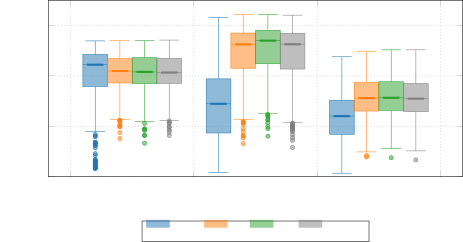
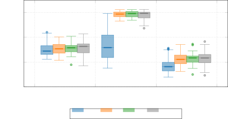
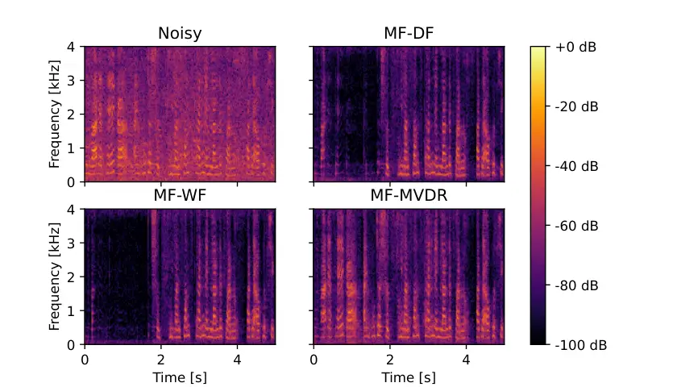

¹Friedrich-Alexander-Universität Erlangen-Nürnberg, Pattern Recognition
Lab  
²WS Audiology, Research and Development, Erlangen, Germany

# Deep Multi-Frame Filtering for Hearing Aids

Hendrik Schröter¹, Tobias Rosenkranz², Alberto N. Escalante-B.², Andreas
Maier¹

###### Abstract

Multi-frame algorithms for single-channel speech enhancement are able to
take advantage from short-time correlations within the speech signal.
Deep filtering (DF) recently demonstrated its capabilities for
low-latency scenarios like hearing aids with its complex multi-frame
(MF) filter. Alternatively, the complex filter can be estimated via an
MF minimum variance distortionless response (MVDR), or MF Wiener filter
(WF). Previous studies have shown that incorporating algorithm domain
knowledge using an MVDR filter might be beneficial compared to the
direct filter estimation via DF.

In this work, we compare the usage of various multi-frame filters such
as DF, MF-MVDR, or MF-WF for HAs. We assess different covariance
estimation methods for both MF-MVDR and MF-WF and objectively
demonstrate an improved performance compared to direct DF estimation,
significantly outperforming related work while improving the runtime
performance.

^(†)^(†)address: ^(†)^(†)email: hendrik.m.schroeter@fau.de

Index Terms: hearing aids, speech enhancement, multi-frame filtering

## 1 Introduction

Hearing aids (HA) usually employ a filter bank \[1\] similar to an STFT,
as frequency transformation. Subsequent processing steps, including
single-channel noise reduction, is then performed in time/frequency (TF)
domain. The low-latency requirements of HAs of
$`6\text{\,}\mathrm{ms}10\text{\,}\mathrm{ms}`$, however, usually result
in a very poor frequency resolution. This makes noise reduction within
HAs particularly challenging since frequency resolution usually
correlates well with noise reduction performance up to a certain point.
Especially single-frame Wiener filter approaches \[2, 3, 4\] are used
with a noise attenuation limit of
$`6\text{\,}\mathrm{dB}12\text{\,}\mathrm{dB}`$ since more attenuation
would result in speech distortion and roughness. This is because a
one-tap Wiener filter reduces to a single real-valued gain and thus is
not able to recover the clean phase. Other options, like a complex ratio
mask (CRM), are able to theoretically restore the original phase.
However, especially in low-latency scenarios the available frequency
resolution may be limited down to $`250\text{\,}\mathrm{Hz}`$. For a low
fundamental frequency, this may result in up to 5 speech harmonics
within one frequency bin which makes estimating a phase correction
factor inherently harder for the CRM \[5\]. Therefore, complex filters
\[6, 7\] introduced as deep filtering (DF) have been used for allowing a
stronger noise attenuation in HAs \[5\]. Further, DF outperformes
complex ratio masks, especially with a low frequency resolution of HA
filter banks \[8, 5\]

Recently, deep MF beamforming filters have been proposed in contrast to
direct estimation of the filter coefficients within DF \[9, 10, 11,
12\]. In contrast to classical beamforming using multiple channels, the
inter-frame correlations are used to derive a complex filter in TF
domain. Huang \[9\] proposed to decompose multi-frame speech signal into
a inter-frame correlated component and a interfering component. This
assumption allowed them to introduce an MF-MVDR beamformer with
classical parameter estimation. Zhang et al. \[12\] proposed to use DF
to estimate a clean speech signal which is then used for classical
estimation of the MVDR parameters. Similarly, Pan et.al \[13\] used a
CRM followed by an estimation of MF Wiener or MVDR filter statistics.
However, MF MVDR and Wiener filter perform worse compared to the only
CRM enhanced output signal e.g. in terms of PESQ. Tamen et al. \[11\]
proposed a deep MF-MVDR filter where a neural network was used to
estimate the inter-frame correlation matrices of speech and noise
signals. The authors reported that the deep MF-MVDR filter outperforms
direct DF estimation.

In this work we follow \[11\] and estimate the covariance matrices
directly using a DNN. We evaluate different covariance estimation
methods and compare DF to deep multi-frame MVDR and Wiener filters.

## 2 Multi-Frame Filtering

### 2.1 Signal Model

Let $`x(k)`$ be a mixture signal

```math
x(k)=s(k)+z(k)\text{,} \tag{1}
```

where $`s(k)`$ is a clean speech signal and $`z(k)`$ an interfering
background noise. Typically, HA noise reduction operates in
time/frequency domain:

```math
X(t,f)=S(t,f)+Z(t,f)\text{,} \tag{2}
```

where $`X(t,f)`$ is the filter bank representation of the time domain
signal $`x(k)`$ and $`t`$, $`f`$ are the time and frequency bins.

### 2.2 Deep Filtering and Multi-Frame Signal Model

Deep filtering was proposed to take advantage from short-time
correlations within the speech signal \[7\] and for signal
reconstruction e.g. by destructive interference or package loss \[6\].
In the following, we describe the initial deep filter proposal, where
the filter weights are directly estimated by a deep neural network
(DNN). Further, we make the bridge to multi-frame processing using MVDR
or Wiener filtering and describe the MF signal model taking advantage of
speech inter-frame correlations.

Deep filtering is defined by a complex filter in TF-domain \[6, 7\]:

```math
Y(t,f)=\sum_{i=0}^{N-1}W^{*}_{i}(t,f)\cdot X(t-i+l,f)\text{\ ,} \tag{3}
```

where $`W^{*}`$ are the complex conjugated coefficients of filter order
$`N`$ that are applied to the input spectrogram $`X`$, and $`\hat{Y}`$
the enhanced spectrogram. $`l`$ is an optional look-ahead, which allows
incorporating non-causal taps in the linear combination if $`l\geq 1`$.
In previous work, additionally also included filtering along the
frequency axis allowing to incorporate correlations e.g. due to
overlapping bands \[5\], which is not considered in this study. This of
course could also be used within the beamforming algorithms.

To simplify the following, we omit the frequency index $`f`$ since all
frequency bins are processed equivalently. Further, with filter length
$`N`$, we define the noisy multi-frame vector as
$`\bm{\bar{x}}_{t}\in\mathbb{C}^{N}`$:

```math
\bm{\bar{x}}(t)=[X(t+l),X(t-1+l),\dots,X(t-N+1+l)]^{\text{T}}\text{\ .} \tag{4}
```

And with the complex filter $`\bm{\bar{w}}(t)\in\mathbb{C}^{N}`$

```math
\bm{\bar{w}}(t)=[W_{0}(t),W_{1}(t),\dots,W_{N-1}(t)]^{\text{T}} \tag{5}
```

the complex filter of Equation (3) reduces to:

```math
\boxed{Y(t)=\bm{\bar{w}}_{\text{DF}}(t)^{\text{H}}\bm{\bar{x}}(t)}\text{\ ,} \tag{6}
```

where $`\circ^{\text{H}}`$ denotes the conjugate transpose operator. As
mentioned above, deep filtering directly estimates the complex filter
$`\bm{\bar{w}}_{\text{DF}}(t)`$. However, $`\bm{\bar{w}}(t)`$ can also
be estimated using multi-frame beamforming algorithms which will be
described in the following.

Assuming speech and noise are uncorrelated (which is requirement for
Eq. 1), the noisy covariance matrix
$`\bm{\Phi}_{yy}(t)\in\mathbb{C}^{N\times N}`$ is given by

```math
\bm{\Phi}_{yy}(t)=E[\bm{\bar{y}}(t)\bm{\bar{y}}^{\text{H}}(t)]=\bm{\Phi}_{ss}(t)+\bm{\Phi}_{zz}(t)\text{,} \tag{7}
```

where $`E[\circ]`$ is the mathematical expectation. The matrices
$`\bm{\Phi}_{ss}(t)`$ and $`\bm{\Phi}_{zz}(t)`$ are defined analogously.

We further assume after \[9, 14\] that the speech signal consists of a
desired, short-time correlated component $`\bm{\bar{s}}^{c}`$ and an
uncorrelated, interfering component $`\bm{\bar{s}}^{i}`$ wrt. the speech
coefficient $`S(t)`$:

```math
\bm{\bar{s}}(t)=\bm{\bar{s}}^{c}(t)+\bm{\bar{s}}^{i}(t) \tag{8}
```

with

```math
\bm{\bar{s}}^{c}(t)=\bm{\bar{\gamma}}_{s}(t)S(t)\text{.} \tag{9}
```

The speech inter-frame correlation (IFC) vector
$`\bm{\bar{\gamma}}_{s}(t)`$ is highly time-varying and is defined as

```math
\bm{\bar{\gamma}}_{s}(t)=\dfrac{E[\bm{s}(t)S(t)^{*}]}{E[|S(t)|^{2}]}=\dfrac{\bm{\Phi}_{ss}e}{e^{\text{T}}\bm{\Phi}_{ss}e}\text{\ ,} \tag{10}
```

where $`e=[1,0,0,\dots,0]^{\text{T}}\in\mathbb{R}^{N}`$ is the
$`N`$-dimensional selection vector. Note, that a different selection
index may be used e.g. when using non-causal taps within the filter. The
denominator $`e^{\text{T}}\bm{\Phi}_{ss}e`$ corresponds to the speech
power spectral density (PSD) $`\phi_{s}(t)`$. Thus, the first element of
the speech IFC vector equals 1:

```math
e^{\text{T}}\bm{\bar{\gamma}}_{s}(t)=1\text{.} \tag{11}
```

When considering the uncorrelated speech component as interference, with
(8) and (9), the multi-frame signal model is given by

```math
\boxed{\bm{\bar{x}}(t)=\bm{\bar{\gamma}}_{s}(t)S(t)+\bm{\bar{u}}(t)}\text{\ ,} \tag{12}
```

where $`\bm{\bar{u}}(t)=\bm{\bar{s}}^{i}(t)+\bm{\bar{z}}(t)`$ is the
undesired noise and interference vector.

### 2.3 Multi-Frame Wiener Filter

As mentioned above, single-frame (tap) Wiener filters reduce to a single
real-valued gain. In the following we describe the general form
resulting in a complex filter $`\bm{\bar{w}}(t)`$.

The Wiener filter tries to directly minimize the difference between
clean speech $`S(t)`$ and the prediction $`Y(t)`$ using the mean squared
error (MSE):

```math
\begin{split}\bm{\bar{w}}_{\text{WF}}(t)&=\argmin_{\bm{\bar{w}}}E[|S(t)-Y(t)|^{2}]\\
&=\argmin_{\bm{\bar{w}}}E[|S(t)-\bm{\bar{w}}^{\text{H}}(t)\bm{\bar{x}}(t)|^{2}]\end{split} \tag{13}
```

With the uncorrelation assumption between speech and noise, the solution
of (13) is given by

```math
\boxed{\bm{\bar{w}}_{\text{WF}}(t)=\bm{\Phi}_{xx}^{-1}E[\bm{\bar{x}}(t)S(t)]=\bm{\Phi}_{xx}^{-1}{\bm{\bar{\gamma}}_{s}}}\text{\ .} \tag{14}
```

### 2.4 Multi-Frame MVDR Filter

In contrast to Wiener filtering which tries to be optimal wrt. SNR, the
MVDR filter is optimal wrt. speech distortion. Given a standard
filter-and-sum beamformer \[15\]

```math
E[|Y(t)|^{2}]=E[\bm{\bar{w}}^{\text{H}}\bm{\bar{x}}\bm{\bar{x}}^{\text{H}}\bm{\bar{w}}]=\bm{\bar{w}}\bm{\Phi}_{xx}\bm{\bar{w}}^{\text{H}}\text{,} \tag{15}
```

the following distortionless response constraint requires that the
predicted output $`Y(t)`$ is equal to the target speech $`S(t)`$:

```math
Y(t)=\bm{\bar{w}}^{\text{H}}(t)\bm{\bar{\gamma}}_{s}(t)S(t)\overset{!}{=}S(t) \tag{16}
```

Now, the MVDR filter can be defined as

```math
\min_{\bm{\bar{w}}}\bm{\bar{w}}^{\text{H}}(t)\bm{\Phi}_{xx}(t)\bm{\bar{w}}(t)\text{, s.t.~}\bm{\bar{w}}^{\text{H}}(t)\bm{\bar{\gamma}}_{s}(t)=1\text{.} \tag{17}
```

Solving this minimization problem leads to the MF-MVDR beamformer \[16,
17, 9\]:

```math
{\bm{\bar{w}}_{\text{MVDR}}(t)=\dfrac{\bm{\Phi}_{xx}^{-1}(t)\bm{\bar{\gamma}}_{s}}{\bm{\bar{\gamma}}_{s}^{\text{H}}\bm{\Phi}_{xx}^{-1}\bm{\bar{\gamma}}_{s}}}\text{\ .} \tag{18}
```

Following \[17, 15\], we assume noise $`\bm{\bar{u}}(t)`$ and
$`\bm{\bar{s}}(t)`$ being uncorrelated, we can rewrite
$`\bm{\Phi}_{xx}`$ using (12)

```math
\vskip-1.99997pt\bm{\Phi}_{xx}(t)=\phi_{s}(t)\bm{\bar{\gamma}}_{s}(t)\bm{\bar{\gamma}}_{s}^{\text{H}}(t)+\bm{\Phi}_{uu}(t)\text{,} \tag{19}
```

where $`\bm{\Phi}_{uu}(t)`$ represents the undesired noise and
interference covariance matrix. With (19), it can be shown \[17, 15\]
that the MVDR beamformer can be rewritten to

```math
\vskip-1.99997pt\boxed{\bm{\bar{w}}_{\text{MVDR}}(t)=\dfrac{\bm{\Phi}_{uu}^{-1}(t)\bm{\bar{\gamma}}_{s}}{\bm{\bar{\gamma}}_{s}^{\text{H}}\bm{\Phi}_{uu}^{-1}\bm{\bar{\gamma}}_{s}}}\text{\ .} \tag{20}
```

### 2.5 Filter Estimation

To estimate filter weights $`\bm{\bar{w}}^{\text{WF}}`$ and
$`\bm{\bar{w}}^{\text{MVDR}}`$ we need to estimate the speech IFC vector
$`\bm{\bar{\gamma}}_{s}`$ as well as the covariance matrices
$`\bm{\Phi}_{xx}`$ or $`\bm{\Phi}_{uu}`$. Similar to \[18\], we directly
estimate the IFC vector $`\bm{\bar{\gamma}}_{s}\in\mathbb{C}^{N}`$
followed by a normalization to fulfill (11).

Within preliminary experiments, we discovered that estimating the noisy
covariance matrix $`\bm{\Phi}_{xx}(t)`$ using a DNN provides better
results compared to estimating it via statistics like \[13\]. We explain
this with the update speed of noisy covariance matrix and IFC vector. A
DNN estimate is superior over a recursive update of
$`\bm{\Phi}_{xx}(t)`$ \[13\] since it can adapt the update speed
depending on the current noise and speech conditions. Second, we
estimate the noise covariance matrix in Eq. (20) \[19, 20, 11\], in
contrast to \[13\] who used the MVDR implementation of Eq. (18).  
We compare the following configurations for covariance estimation:

1.  1.  Direct estimation. We directly estimate $`\bm{\Phi}_{xx}`$, and
        $`\bm{\Phi}_{uu}`$. For numerical stability, we apply diagonal
        loading of $`1\text{\times}{10}^{-7}`$ before matrix inversion.
2.  2.  Inverse estimation. To avoid computing the inverse of $`\bm{\Phi}`$,
        we directly estimate the inverse $`\bm{\Phi}^{-1}`$.
3.  3.  Hermitian. As stated above, the covariance matrix can be assumed to
        be Hermitian positive-definite. Thus, we can define the Hermitian
        PSD $`\bm{H}(t)`$ via

    ```math
    \bm{\Phi}(t)=\bm{H}(t)\bm{H}^{\text{H}}(t)\text{,}\vskip-1.99997pt \tag{21}
    ```

    where $`\bm{H}(t)\in\mathbb{C}^{N\times N}`$ is the Hermitian
    matrix \[11\]. By estimating $`\bm{H}`$, the matrix multiplication
    ensures that the resulting covariance matrices fulfill its hermitian
    properties.

4.  4.  Hermitian of inverse. Since the inverse $`\bm{\Phi}^{-1}`$ is also
        Hermitian positive-definite, we estimate the Hermitian PSD of the
        inverse:

    ```math
    \bm{\Phi}^{-1}(t)=\bm{H}(t)\bm{H}^{\text{H}}(t)\text{.}\vskip-1.99997pt \tag{22}
    ```

We further tested enforcing Hermitian properties of the predicted
covariance or estimating a Cholesky decomposition of the predicted
Hermitian similar to \[18\]. However, the results presented in
section 4.1 did not change significantly.

## 3 Training Framework

### 3.1 DeepFilterNet Framework

We adopt the perceptual approach of DeepFilterNet \[8, 21\] which also
has been used for hearing aids \[5\]. The two-stage denoising process
takes advantage of auditory properties which allows for relatively
efficient DNN. That is, the first stage only operates in real-valued ERB
(equivalent rectangular bandwidth) domain and tries to recover the
speech envelope. The second stage uses MF filtering to enhance the
periodic part of speech up to a frequency of
$`f_{\text{mf}}=$4\text{\,}\mathrm{kHz}$`$ which covers most of the
energy of the periodic speech component.

Instead of a short-time Fourier transformation (STFT) used in \[21\], we
employ a $`24\text{\,}\mathrm{k}\mathrm{H}\mathrm{z}`$ uniform polyphase
hearing aid filter bank \[1\] with 48 frequency bands and a frequency
resolution of $`250\text{\,}\mathrm{Hz}`$. The filter bank roughly
corresponds to an STFT with a window size of $`4\text{\,}\mathrm{ms}`$
and a hop size of $`1\text{\,}\mathrm{ms}`$. Note that other filter
banks \[22\] may achieve a better frequency analysis resolution which
was not considered since we want to be able to integrate this method
into an existing hearing aid setup.

We apply both denoising stages in parallel for practical reasons like
better concurrency possibilities. Hence, the MF filter is applied to the
noisy spectrum instead of the pre-enhanced spectrum of stage 1 unlike
in \[21\]. Further, for the MVDR and Wiener filter estimation we add
another grouped linear output layer for the covariance matrix
estimation. Even though the DNN input and output is complex-valued, the
DNN only operates on real-valued tensors. The full source code except
the hearing aid filter bank is publicly available at
[https://github.com/rikorose/deepfilternet](https://github.com/rikorose/deepfilternet).

Figure 1: Two-stage noise reduction framework using a real-valued ERB
stage followed by the multi-frame (MF) filtering stage based on \[21\].
Instead of (I)STFT, we employ hearing aid analysis (AFB) and synthesis
filter banks (SFB). Depending on the configuration the second stage
predicts directly the deep filter coefficient $`\bm{w}^{\text{DF}}`$, or
the speech IFC vector $`\bm{\bar{\gamma}}_{s}`$ and covariance matrices
$`\bm{\Phi}`$ for the Wiener and MVDR filters.

### 3.2 Datasets and Training

We use the multi-lingual DNS4 dataset \[23\] for training.
Following \[8\], we oversample the included high quality datasets VCTK 
and PTDB by a factor of 10. Moreover, we trimmed silences and filtered
the dataset with DNSMOS V4 \[23\] to only include samples with overall
mean opinion score (OVRL MOS) greater than 3. We split the datasets into
training/development/test (70/15/15$`\%`$). VCTK and PTDB were split on
speaker level ensuring no overlap with the VCTK/Demand test set \[24\].
The remaining English read speech and noise datasets are split on signal
level. We conduct preliminary experiments using only VCTK + PTDB as
speech datasets and report results on the VCTK/Demand test set \[24\].
For evaluation of the final models, we further report results on the
recent DNS5 track 2 blind test set \[23\] and an internal test set
recorded with HAs containing 30 noisy samples without groundtruth.

Data preprocessing and augmentation is adopted from \[21\].
Additionally, we resample the data to $`24\text{\,}\mathrm{kHz}`$ to
match the filter bank sampling rate. Declipping and dereverberation were
not considered in this work.

We decreased the model size by reducing the convolution channels to 16
and the number of hidden units of the GRU layers to 128 resulting in
$`510\text{\,}\mathrm{k}`$ parameters of the DNN. We adopted the loss
function from \[21\], trained all models for 100 epochs, and applied
early stopping based on the development set. We use AdamW optimizer, an
initial learning rate of 0.001, learning rate decay of 0.5 per epoch,
and weight decay of 0.05. The latter is especially important for stable
gradient due to complex number processing, matrix inversions and
division with small numbers e.g. in (Eq. 20).

## 4 Experiments

The following performance metrics were employed to evaluate our
multi-frame filtering approaches. The time-domain scale-invariant
signal-distortion-ratio (SI-SDR) \[25\], and the frequency domain
measures PESQ \[26\] and STOI \[27\], as well as the composite measures
CSIG, CBAK and COVL \[28\]. Further, we adopt the “pseudo”-subjective
measure DNSMOS V5 \[23\] for judging signal quality of signals without
groundtruth. Further, we provide the real-time-factor (RTF) on a
notebook Core-i5 quad-core CPU for inference speed evaluation.

### 4.1 Covariance Estimation

We conducted preliminary experiments to find the best way of estimating
the covariance matrices $`\bm{\Phi}_{xx}(t)`$ (WF) and
$`\bm{\Phi}_{uu}(t)`$ (MVDR). As we can see in Table 1, estimating the
Hermitian of $`\bm{\Phi}`$ or $`\bm{\Phi}^{-1}`$ seems crucial for the
MVDR filter as $`\bm{\Phi}_{uu}(t)`$ is not invertible with the direct
estimate. Directly estimating the inverse covariance matrix, resulted in
a distorted audio which did not improve during training. The Wiener
filter however, is not so sensitive wrt. the different estimation
methods as only small differences can be observed. The estimated
Hermitian matrix provides a noticeable benefit for the MF Wiener filter.
Thus, for further experiments, we chose to estimate the Hermitian PSD of
the covariance inverse for both WF and MVDR (i.e. row 4 and 8 of
Table 1).

[TABLE]

Table 1: Comparison of different covariance estimation options of
Section 2.5 based on the VCTK/Demand dataset. “Invert.” stands for
estimating the inverse covariance matrix, “Herm.” stands for estimating
$`\bm{H}(t)`$ instead of $`\bm{\Phi}`$ as in Equations (21), (22). Bold
values denote best results for this metric.

### 4.2 Comparison of MF Deep Filtering / Wiener Filter / MVDR Filter

We evaluated our models on the VCTK/Demand test set and provide a
comparison with related algorithms using a hearing aid filter bank with
the same frequency resolution\[3, 5\]. As we can see in table 2, our all
proposed multi-frame filters outperform related work. Further, MF-WF and
MF-MVDR provide slightly superior results over direct filter estimation
using deep filtering.

[TABLE]

Table 2: Objective results on the VCTK/Demand dataset. All models use a
uniform polyphase filter bank and introduce an algorithmic latency of
8 ms including 2 frames of look-ahead. Number of parameter (Params) in
million.

Figures 2 and 3 provide “pseudo”-subjective measures on two noisy
datasets without a groundtruth. On the DNS5 blind test set, MF-WF
achieves the highest background MOS (BAK), that is, the lowest
background distortion. The MF-MVDR model however, is able to retain more
speech compared to DF and WF within the internal HA dataset.



Figure 2: DNSMOS V5 \[23\] on the DNS5 blind test set.



Figure 3: DNSMOS V5 \[23\] on the internal HA test set.

This can further be observed in a qualitative figure of a sample from
the HA test set (Figure 4). While DF and similarly also MF-WF wrongly
suppresses the first few seconds of speech in a noisy HA recording, the
MF-MVDR is able to quickly adopt to new speech. This matches with the
motivation of both multi-frame filters. The MF-WF provides a stronger
noise suppression at the cost of more speech degradation, the MF-MVDR
filter however, tries to keep speech distortion at a minimum level and
sacrifices a little noise reduction in return.



Figure 4: Sample from the internal HA test set.

## 5 Conclusions

In this study, we presented a deep learning-based multi-frame filtering
method for hearing aids. We evaluated different methods of estimating
the covariance matrices for MF-WF and MF-MVDR and provided evidence that
the presented MF Wiener filter and MVDR filter outperform direct filter
estimation.

Especially the MF-MVDR filter is relevant for hearing aid usage, since
minimal speech distortion is one of the key requirements of HA noise
reduction algorithms. Although noise is suppressed robustly, when
running separate instances on the left and right hearing aids we
observed spatial distortions specifically with MF-DF and MF-WF
processing. Therefore, further research is needed in the area of filter
synchronization between devices.

## References

- \[1\] R. W. Bäuml and W. Sörgel, “Uniform polyphase filter banks for
  use in hearing aids: design and constraints,” in _2008 16th European
  Signal Processing Conference_. IEEE, 2008, pp. 1–5.
- \[2\] E. Hänsler and G. Schmidt, _Acoustic echo and noise control: a
  practical approach_. John Wiley & Sons, 2005, vol. 40.
- \[3\] M. Aubreville, K. Ehrensperger, A. Maier, T. Rosenkranz,
  B. Graf, and H. Puder, “Deep denoising for hearing aid applications,”
  in _2018 16th International Workshop on Acoustic Signal Enhancement
  (IWAENC)_. IEEE, 2018, pp. 361–365.
- \[4\] H. Schröter, T. Rosenkranz, A. N. Escalante-B., P. Zobel, and
  A. Maier, “Lightweight Online Noise Reduction on Embedded Devices
  using Hierarchical Recurrent Neural Networks,” in _INTERSPEECH
  2020_, 2020. \[Online\]. Available:
  [https://arxiv.org/abs/2006.13067](https://arxiv.org/abs/2006.13067)
- \[5\] H. Schröter, T. Rosenkranz, A.-N. Escalante-B, and A. Maier,
  “Low latency speech enhancement for hearing aids using deep
  filtering,” _IEEE/ACM Transactions on Audio, Speech, and Language
  Processing_, vol. 30, pp. 2716–2728, 2022.
- \[6\] W. Mack and E. A. Habets, “Deep Filtering: Signal Extraction and
  Reconstruction Using Complex Time-Frequency Filters,” _IEEE Signal
  Processing Letters_, vol. 27, pp. 61–65, 2020.
- \[7\] H. Schröter, T. Rosenkranz, A. Escalante Banuelos,
  M. Aubreville, and A. Maier, “CLCNet: Deep learning-based noise
  reduction for hearing aids using complex linear coding,” in _ICASSP
  2020-2020 IEEE International Conference on Acoustics, Speech and
  Signal Processing (ICASSP)_, 2020. \[Online\]. Available:
  [https://rikorose.github.io/CLCNet-audio-samples.github.io/](https://rikorose.github.io/CLCNet-audio-samples.github.io/)
- \[8\] H. Schröter, A. N. Escalante-B, T. Rosenkranz, and A. Maier,
  “Deepfilternet: A low complexity speech enhancement framework for
  full-band audio based on deep filtering,” in _ICASSP 2022-2022 IEEE
  International Conference on Acoustics, Speech and Signal Processing
  (ICASSP)_. IEEE, 2022, pp. 7407–7411.
- \[9\] Y. A. Huang and J. Benesty, “A multi-frame approach to the
  frequency-domain single-channel noise reduction problem,” _IEEE
  Transactions on Audio, Speech, and Language Processing_, vol. 20,
  no. 4, pp. 1256–1269, 2011.
- \[10\] Y. Xu, M. Yu, S.-X. Zhang, L. Chen, C. Weng, J. Liu, and D. Yu,
  “Neural spatio-temporal beamformer for target speech separation,”
  _arXiv preprint arXiv:2005.03889_, 2020.
- \[11\] M. Tammen and S. Doclo, “Deep multi-frame mvdr filtering for
  single-microphone speech enhancement,” in _ICASSP 2021-2021 IEEE
  International Conference on Acoustics, Speech and Signal Processing
  (ICASSP)_. IEEE, 2021, pp. 8443–8447.
- \[12\] Z. Zhang, Y. Xu, M. Yu, S.-X. Zhang, L. Chen, D. S. Williamson,
  and D. Yu, “Multi-channel multi-frame adl-mvdr for target speech
  separation,” _IEEE/ACM Transactions on Audio, Speech, and Language
  Processing_, vol. 29, pp. 3526–3540, 2021.
- \[13\] N. Pan, J. Chen, and J. Benesty, “Dnn based multiframe
  single-channel noise reduction filters,” in _ICASSP 2022-2022 IEEE
  International Conference on Acoustics, Speech and Signal Processing
  (ICASSP)_. IEEE, 2022, pp. 8782–8786.
- \[14\] J. Benesty and Y. Huang, “A single-channel noise reduction mvdr
  filter,” in _2011 IEEE International Conference on Acoustics, Speech
  and Signal Processing (ICASSP)_. IEEE, 2011, pp. 273–276.
- \[15\] S. Doclo, W. Kellermann, S. Makino, and S. E. Nordholm,
  “Multichannel signal enhancement algorithms for assisted listening
  devices: Exploiting spatial diversity using multiple microphones,”
  _IEEE Signal Processing Magazine_, vol. 32, no. 2, pp. 18–30, 2015.
- \[16\] J. Capon, “High-resolution frequency-wavenumber spectrum
  analysis,” _Proceedings of the IEEE_, vol. 57, no. 8, pp.
  1408–1418, 1969.
- \[17\] B. D. Van Veen and K. M. Buckley, “Beamforming: A versatile
  approach to spatial filtering,” _IEEE assp magazine_, vol. 5, no. 2,
  pp. 4–24, 1988.
- \[18\] M. Tammen and S. Doclo, “Deep multi-frame mvdr filtering for
  binaural noise reduction,” in _2022 International Workshop on Acoustic
  Signal Enhancement (IWAENC)_. IEEE, 2022, pp. 1–5.
- \[19\] M. Souden, J. Benesty, and S. Affes, “On optimal
  frequency-domain multichannel linear filtering for noise reduction,”
  _IEEE Transactions on audio, speech, and language processing_,
  vol. 18, no. 2, pp. 260–276, 2009.
- \[20\] D. Fischer and S. Doclo, “Robust constrained mfmvdr filtering
  for single-microphone speech enhancement,” in _2018 16th International
  Workshop on Acoustic Signal Enhancement (IWAENC)_. IEEE, 2018, pp.
  41–45.
- \[21\] H. Schröter, A. Escalante-B, T. Rosenkranz, and A. Maier,
  “Deepfilternet2: Towards real-time speech enhancement on embedded
  devices for full-band audio,” in _2022 International Workshop on
  Acoustic Signal Enhancement (IWAENC)_. IEEE, 2022, pp. 1–5.
- \[22\] H. W. Löllmann and P. Vary, “Generalized filter-bank equalizer
  for noise reduction with reduced signal delay.” in _INTERSPEECH_,
  2005, pp. 2105–2108.
- \[23\] H. Dubey, V. Gopal, R. Cutler, A. Aazami, S. Matusevych,
  S. Braun, S. E. Eskimez, M. Thakker, T. Yoshioka, H. Gamper _et al._,
  “Icassp 2022 deep noise suppression challenge,” in _ICASSP 2022-2022
  IEEE International Conference on Acoustics, Speech and Signal
  Processing (ICASSP)_. IEEE, 2022, pp. 9271–9275.
- \[24\] C. Valentini-Botinhao, X. Wang, S. Takaki, and J. Yamagishi,
  “Investigating RNN-based speech enhancement methods for noise-robust
  Text-to-Speech,” in _SSW_, 2016, pp. 146–152.
- \[25\] J. Le Roux, S. Wisdom, H. Erdogan, and J. R. Hershey,
  “SDR–half-baked or well done?” in _ICASSP 2019-2019 IEEE International
  Conference on Acoustics, Speech and Signal Processing (ICASSP)_. IEEE,
  2019, pp. 626–630.
- \[26\] A. W. Rix, J. G. Beerends, M. P. Hollier, and A. P. Hekstra,
  “Perceptual evaluation of speech quality (pesq)-a new method for
  speech quality assessment of telephone networks and codecs,” in _2001
  IEEE international conference on acoustics, speech, and signal
  processing. Proceedings (Cat. No. 01CH37221)_, vol. 2. IEEE, 2001, pp.
  749–752.
- \[27\] C. H. Taal, R. C. Hendriks, R. Heusdens, and J. Jensen, “An
  algorithm for intelligibility prediction of time–frequency weighted
  noisy speech,” _IEEE Transactions on Audio, Speech, and Language
  Processing_, vol. 19, no. 7, pp. 2125–2136, 2011.
- \[28\] Y. Hu and P. C. Loizou, “Evaluation of objective quality
  measures for speech enhancement,” _IEEE Transactions on audio, speech,
  and language processing_, vol. 16, no. 1, pp. 229–238, 2007.
